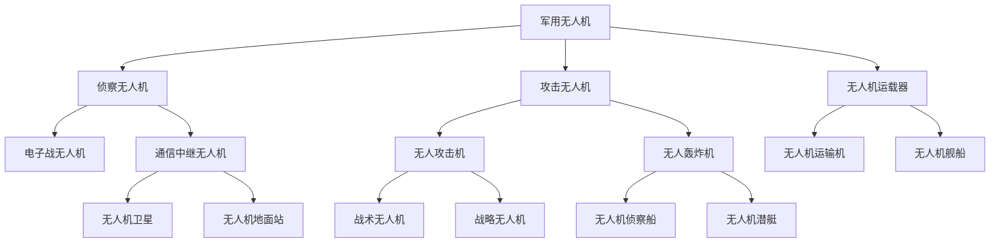
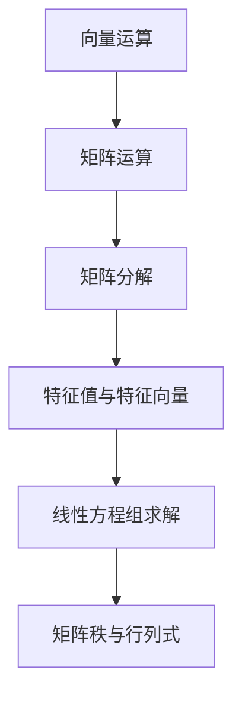
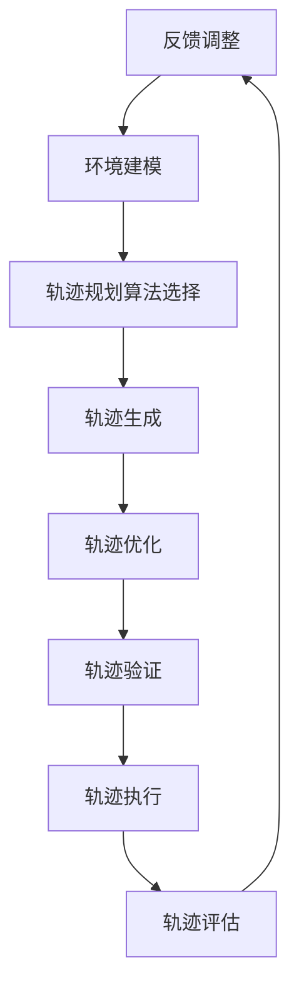

                 

### 《数学与无人机控制：飞行轨迹的数学规划》引言

> **关键词：无人机控制、数学规划、飞行轨迹、运动学、线性代数、微积分、最优化算法。**

无人机作为现代科技的重要成果，已经在众多领域展现出其强大的应用潜力。从军事侦察到民用物流，从农业监测到城市规划，无人机的身影无处不在。然而，无人机的控制与导航是其成功应用的关键所在，而这其中数学规划起到了至关重要的作用。

本文旨在探讨数学规划在无人机控制中的具体应用，特别是飞行轨迹的数学规划。通过深入分析无人机的运动学、轨迹规划基础、数学规划方法以及实际应用案例，我们将全面了解数学规划在无人机控制领域的价值与挑战。

### 1. 无人机控制概述

#### 1.1 无人机的定义与分类

无人机（Unmanned Aerial Vehicle，简称UAV）是指没有驾驶舱、运行时无人驾驶的航空器。根据用途和性能特点，无人机可以大致分为以下几类：

- **军用无人机**：主要包括侦察无人机、攻击无人机和无人机运载器。这些无人机主要应用于军事侦察、攻击以及物资运输等任务。
- **民用无人机**：广泛应用于农业、物流、监测、搜索救援等领域。例如，农业无人机用于农田监测与病虫害防治，物流无人机用于快递配送，监测无人机用于环境监测与灾害评估。
- **工业级无人机**：主要用于建筑、能源、基础设施等领域的检测与监测。

无人机按飞行方式分类，可以进一步细分为：

- **固定翼无人机**：具有固定翼的无人机，飞行速度较快，适合长航时飞行。
- **旋翼无人机**：通过旋翼产生升力，飞行高度和速度相对较低，但操作灵活，适合复杂地形飞行。
- **多旋翼无人机**：多个旋翼结合固定翼的特点，具有较好的稳定性和机动性，广泛应用于民用领域。

按飞行高度分类，无人机可以分为：

- **超低空无人机**：飞行高度在100米以下，主要用于室内和近地面的任务。
- **低空无人机**：飞行高度在100米至1000米之间，适用于农林监测、城市规划等任务。
- **中空无人机**：飞行高度在1000米至3000米之间，适合长距离侦察和物流运输。
- **高空无人机**：飞行高度在3000米以上，主要用于高空侦察、气象监测等任务。

#### 1.2 无人机控制系统组成

无人机控制系统是无人机实现自主飞行和任务执行的核心。一个典型的无人机控制系统主要由以下几个部分组成：

- **飞行控制器**：负责无人机姿态、速度、高度等参数的实时控制和调整，是实现无人机自主飞行的基础。
- **传感器**：包括GPS、惯性测量单元（IMU）、摄像头、激光雷达等，用于获取无人机周围环境的信息，提供定位、导航和避障等数据支持。
- **动力系统**：包括电池、电机、螺旋桨等，为无人机提供飞行所需的能量。
- **数据传输系统**：负责无人机与地面站或远程控制中心之间的数据通信，实现远程控制、数据回传等功能。

#### 1.3 无人机控制的重要性

无人机控制的重要性体现在以下几个方面：

- **安全性**：无人机控制技术直接关系到无人机在飞行过程中的安全性。通过精确的控制，可以确保无人机在复杂环境中稳定飞行，避免碰撞和意外事故。
- **自动化**：无人机控制技术可以实现无人机的高效自动化操作，减少人工干预，提高任务执行的准确性和效率。
- **高效性**：无人机控制技术可以提高无人机执行任务的速度和效率，如快速精确的物流配送、大规模农田监测等。

总之，无人机控制技术的发展将极大地推动无人机在各个领域的应用，带来更加智能、安全、高效的服务。

### 2. 数学基础

在深入探讨无人机飞行轨迹的数学规划之前，我们需要了解一些基础的数学概念，这些概念将帮助我们更好地理解和实现无人机控制的数学模型。以下章节将介绍线性代数和微积分的基础知识，这些知识对于理解无人机控制系统的建模和优化至关重要。

#### 2.1 线性代数基础

线性代数是研究向量空间、矩阵以及线性变换的数学分支。在无人机控制中，线性代数用于表示和操作无人机状态、控制输入以及环境信息。以下是线性代数的一些核心概念：

##### 2.1.1 矩阵与向量

**向量**是具有大小和方向的量，通常用粗体字母表示，如 \(\vec{v}\)。向量在无人机控制中用于表示位置、速度和加速度等物理量。**矩阵**是具有行和列的二维数组，用加粗字母表示，如 \(A\)。矩阵在无人机控制中用于表示系统的状态变换、控制矩阵以及测量矩阵。

**矩阵运算**包括加法、减法、乘法和转置等。向量和矩阵的运算遵循一定的规则，如：

- **矩阵加法和减法**：两个矩阵只有在大小相同（即行数和列数相同）时才能进行加法或减法运算。运算规则是逐元素相加或相减。
- **矩阵乘法**：两个矩阵 \(A\) 和 \(B\) 的乘积是一个新矩阵 \(C\)，其元素 \(c_{ij}\) 是 \(A\) 的第 \(i\) 行与 \(B\) 的第 \(j\) 列的乘积的和。即：
  $$ c_{ij} = \sum_{k=1}^{n} a_{ik} b_{kj} $$
- **矩阵转置**：一个矩阵 \(A\) 的转置是将矩阵的行和列互换得到的新矩阵 \(A^T\)。例如，如果 \(A\) 是一个 \(m \times n\) 的矩阵，那么 \(A^T\) 是一个 \(n \times m\) 的矩阵。

##### 2.1.2 线性方程组

**线性方程组**是由多个线性方程组成的方程组，通常表示为：
$$ Ax = b $$
其中，\(A\) 是一个 \(m \times n\) 的矩阵，\(x\) 是一个 \(n\) 维向量，\(b\) 是一个 \(m\) 维向量。求解线性方程组是线性代数中的一个基本问题。常用的解法包括：

- **高斯消元法**：通过矩阵的行变换，将线性方程组化简为上三角或下三角形式，从而求出方程组的解。
- **矩阵分解方法**：包括LU分解、Cholesky分解等，通过将矩阵分解为简单的矩阵形式，来求解线性方程组。

##### 2.1.3 特征值与特征向量

**特征值**和**特征向量**是矩阵理论中的重要概念。给定一个 \(n \times n\) 的矩阵 \(A\)，如果存在一个非零向量 \(\vec{v}\) 和一个标量 \(\lambda\)，使得：
$$ A\vec{v} = \lambda \vec{v} $$
则称 \(\lambda\) 为矩阵 \(A\) 的特征值，\(\vec{v}\) 为对应的特征向量。

特征值和特征向量在无人机控制中的应用非常广泛，如：

- **系统稳定性分析**：通过计算矩阵的特征值，可以判断系统的稳定性。
- **状态观测器设计**：特征值可以用于设计状态观测器，以实现对系统状态的估计。

#### 2.2 微积分基础

微积分是研究函数变化率和面积计算的数学分支。在无人机控制中，微积分用于描述无人机运动的状态变化，以及优化控制策略。

##### 2.2.1 极限与连续性

**极限**是微积分的核心概念之一。给定一个函数 \(f(x)\)，如果当 \(x\) 趋近于某一点 \(a\) 时，\(f(x)\) 的值趋近于某个确定的常数 \(L\)，则称 \(L\) 为 \(f(x)\) 在 \(x = a\) 处的极限。

**连续性**是函数的重要性质。一个函数 \(f(x)\) 在某一点 \(a\) 连续，当且仅当在该点的极限值、函数值和左极限或右极限都相等。

##### 2.2.2 导数与微分

**导数**描述了函数在某一点的变化率。给定一个函数 \(f(x)\)，其导数 \(f'(x)\) 表示函数在 \(x\) 点的瞬时变化率。导数的定义如下：
$$ f'(x) = \lim_{h \to 0} \frac{f(x+h) - f(x)}{h} $$

**微分**是导数的一个近似表示，用于描述函数在某一点的小范围变化。给定一个函数 \(f(x)\)，其在 \(x\) 点的微分 \(df\) 表示为：
$$ df = f'(x)dx $$

导数和微分在无人机控制中的应用包括：

- **运动状态估计**：通过导数计算无人机速度和加速度。
- **控制策略优化**：通过微分分析系统对小范围输入的变化响应。

##### 2.2.3 积分与微分方程

**积分**是微分的逆运算，用于计算函数在某一区间内的累积变化。给定一个函数 \(f(x)\)，其不定积分表示为：
$$ \int f(x)dx $$

**定积分**用于计算函数在一个区间上的面积，其定义为：
$$ \int_{a}^{b} f(x)dx $$

**微分方程**是包含未知函数及其导数的方程，用于描述系统动态行为。常见的微分方程包括常微分方程和偏微分方程。

- **常微分方程**：未知函数及其导数都是关于一个自变量的方程，如：
  $$ \frac{dy}{dx} + p(x)y = q(x) $$
- **偏微分方程**：未知函数及其导数涉及多个自变量，如：
  $$ \frac{\partial^2 u}{\partial t^2} = c^2 \frac{\partial^2 u}{\partial x^2} $$

微分方程在无人机控制中的应用包括：

- **运动学建模**：通过微分方程描述无人机的运动状态。
- **控制律设计**：通过解微分方程设计无人机的控制策略。

通过以上对线性代数和微积分基础知识的介绍，我们可以更好地理解无人机控制中的数学建模和优化方法。在接下来的章节中，我们将进一步探讨无人机运动学、飞行轨迹规划以及数学规划方法的具体应用。

### 3. 无人机运动学

#### 3.1 运动学基本概念

在无人机控制中，运动学是研究无人机位置、速度和加速度随时间变化的学科。运动学的基本概念包括坐标系、参考点、运动学参数等。

##### 坐标系与参考点

为了描述无人机的运动，我们通常需要一个坐标系。无人机运动学中最常用的坐标系包括笛卡尔坐标系、极坐标系和空间直角坐标系。

- **笛卡尔坐标系**：由三个相互垂直的直线（通常是x轴、y轴和z轴）组成，可以用于描述二维和三维空间中的点。
- **极坐标系**：由一个原点、一个径向方向和一个角度组成，适用于描述二维空间中的点。
- **空间直角坐标系**：用于描述三维空间中的点，通常与笛卡尔坐标系相似。

在运动学中，参考点是一个重要的概念。参考点是指无人机在初始时刻的位置，通常用 \((x_0, y_0, z_0)\) 或 \((\rho_0, \theta_0, \phi_0)\) 表示。

##### 运动学参数

运动学参数是描述无人机运动状态的基本量，包括位置、速度和加速度。

- **位置**：用向量表示无人机在空间中的位置，通常表示为 \((x, y, z)\) 或 \((\rho, \theta, \phi)\)。
- **速度**：表示无人机位置随时间的变化率，通常表示为 \((v_x, v_y, v_z)\) 或 \((\dot{\rho}, \dot{\theta}, \dot{\phi})\)。
- **加速度**：表示无人机速度随时间的变化率，通常表示为 \((a_x, a_y, a_z)\) 或 \((\ddot{\rho}, \ddot{\theta}, \ddot{\phi})\)。

##### 运动学方程

运动学方程描述了无人机位置、速度和加速度之间的关系。以下是常用的运动学方程：

- **位置方程**：
  $$ x(t) = x_0 + v_0t + \frac{1}{2}at^2 $$
  $$ y(t) = y_0 + v_0t + \frac{1}{2}at^2 $$
  $$ z(t) = z_0 + v_0t + \frac{1}{2}at^2 $$
- **速度方程**：
  $$ v_x(t) = v_{0x} + at $$
  $$ v_y(t) = v_{0y} + at $$
  $$ v_z(t) = v_{0z} + at $$
- **加速度方程**：
  $$ a_x(t) = a_x $$
  $$ a_y(t) = a_y $$
  $$ a_z(t) = a_z $$

在这些方程中，\(x_0, y_0, z_0\) 是初始位置，\(v_0x, v_0y, v_0z\) 是初始速度，\(a_x, a_y, a_z\) 是加速度。

#### 3.2 运动学方程

为了更深入地理解无人机的运动，我们需要详细讨论运动学方程。运动学方程描述了无人机在三维空间中的位置、速度和加速度随时间变化的规律。

##### 位置方程

位置方程描述了无人机在笛卡尔坐标系中的位置随时间的变化。给定初始位置 \((x_0, y_0, z_0)\) 和初始速度 \((v_{0x}, v_{0y}, v_{0z})\) 以及恒定加速度 \((a_x, a_y, a_z)\)，位置方程可以表示为：

$$ x(t) = x_0 + v_{0x}t + \frac{1}{2}a_x t^2 $$
$$ y(t) = y_0 + v_{0y}t + \frac{1}{2}a_y t^2 $$
$$ z(t) = z_0 + v_{0z}t + \frac{1}{2}a_z t^2 $$

在这些方程中，\(t\) 是时间变量。这些方程表明，无人机的位置随时间的二次方增加，其变化速率与加速度成正比。

##### 速度方程

速度方程描述了无人机在笛卡尔坐标系中的速度随时间的变化。给定初始速度 \((v_{0x}, v_{0y}, v_{0z})\) 和恒定加速度 \((a_x, a_y, a_z)\)，速度方程可以表示为：

$$ v_x(t) = v_{0x} + a_x t $$
$$ v_y(t) = v_{0y} + a_y t $$
$$ v_z(t) = v_{0z} + a_z t $$

这些方程表明，无人机的速度随时间线性增加，其变化速率与加速度成正比。

##### 加速度方程

加速度方程描述了无人机在笛卡尔坐标系中的加速度随时间的变化。给定恒定加速度 \((a_x, a_y, a_z)\)，加速度方程可以表示为：

$$ a_x(t) = a_x $$
$$ a_y(t) = a_y $$
$$ a_z(t) = a_z $$

这些方程表明，无人机的加速度是恒定的，不随时间变化。

#### 3.3 运动学仿真

运动学仿真是一种通过数学模型模拟无人机运动的方法。通过运动学方程，我们可以预测无人机在不同时间点的位置、速度和加速度。以下是运动学仿真的基本步骤：

1. **定义初始条件**：确定无人机的初始位置、速度和加速度。
2. **选择时间步长**：确定仿真的时间步长，通常为0.1秒或0.01秒。
3. **迭代计算**：根据运动学方程，迭代计算无人机在每一个时间步长的位置、速度和加速度。
4. **数据可视化**：将仿真结果可视化，以观察无人机的运动轨迹。

以下是一个简单的运动学仿真示例：

```python
import numpy as np
import matplotlib.pyplot as plt

# 定义初始条件
x0 = 0
y0 = 0
z0 = 0
vx0 = 10
vy0 = 0
vz0 = 0
ax = 0
ay = -9.81
az = 0
t0 = 0
tf = 10
dt = 0.01

# 运动学方程
x = x0 + vx0 * (tf - t0) + 0.5 * ax * (tf - t0)**2
y = y0 + vy0 * (tf - t0) + 0.5 * ay * (tf - t0)**2
z = z0 + vz0 * (tf - t0) + 0.5 * az * (tf - t0)**2

# 可视化
plt.plot(x, y, 'ro-')
plt.xlabel('X position (m)')
plt.ylabel('Y position (m)')
plt.title('Motion Simulation')
plt.show()
```

通过运动学仿真，我们可以更好地理解无人机的运动规律，为实际飞行控制提供理论支持。

### 4. 轨迹规划基础

在无人机控制中，轨迹规划是指根据任务目标和环境条件，计算无人机从初始位置到目标位置的飞行路径。轨迹规划是无人机自主飞行系统的重要组成部分，其目的是实现无人机的安全、高效、精确飞行。以下是轨迹规划的一些基本概念、插值方法和动力系统建模。

#### 4.1 轨迹规划的基本概念

**轨迹规划**的基本概念包括：

- **轨迹**：无人机从初始位置到目标位置的路径。
- **路径规划**：确定无人机在空间中的行进路线，通常涉及避障和路径优化。
- **轨迹优化**：在满足约束条件的情况下，寻找最优飞行轨迹，以达到任务目标。

轨迹规划的目标通常包括：

- **安全性**：确保无人机在飞行过程中避免与其他物体碰撞。
- **效率**：优化飞行路径，减少飞行时间和能耗。
- **精度**：确保无人机准确到达目标位置。

#### 4.2 插值方法

轨迹规划中常用的插值方法包括线性插值、拉格朗日插值和样条插值。

- **线性插值**：通过在两个点之间插入一条直线来估算未知点的值。线性插值简单且易于实现，但只能提供线性变化。
  $$ y(x) = y_1 + \frac{(x - x_1)}{(x_2 - x_1)}(y_2 - y_1) $$
  
- **拉格朗日插值**：使用多项式插值来近似函数，适用于任意数量的点。拉格朗日插值公式如下：
  $$ L_i(x) = \prod_{j \neq i} \frac{x - x_j}{x_i - x_j} $$
  $$ y(x) = \sum_{i=1}^{n} y_i L_i(x) $$

- **样条插值**：通过在多个点之间插入样条曲线来逼近函数。样条插值包括线性样条、二次样条和三次样条等。样条插值能够提供更平滑的轨迹，适用于非线性变化。
  
#### 4.3 动力系统建模

动力系统建模是轨迹规划的关键步骤，它涉及对无人机动力系统的数学描述。动力系统建模包括以下内容：

- **动力学方程**：描述无人机质量、速度和加速度之间的关系。常见的动力学方程包括牛顿第二定律和牛顿第三定律。
- **控制输入**：描述无人机通过控制器施加的控制力。控制输入可以是线性的或非线性的，取决于控制算法的设计。
- **约束条件**：描述无人机的运动限制，如速度限制、角度限制等。约束条件确保无人机在飞行过程中不会超过物理限制。

以下是一个简单的动力系统建模示例：

$$ m \ddot{x} = F_x $$
$$ m \ddot{y} = F_y $$
$$ m \ddot{z} = F_z $$
$$ \dot{\theta}_x = \dot{\theta}_{xz} $$
$$ \dot{\theta}_{xz} = \dot{\theta}_{yz} $$
$$ \dot{\theta}_{yz} = \dot{\theta}_{z} $$

其中，\(m\) 是无人机的质量，\(\ddot{x}, \ddot{y}, \ddot{z}\) 是加速度，\(F_x, F_y, F_z\) 是控制力，\(\theta_x, \theta_{xz}, \theta_{yz}, \theta_{z}\) 是角度。

通过上述基础概念的介绍，我们可以更好地理解轨迹规划的原理和方法。在接下来的章节中，我们将深入探讨数学规划方法，以及如何将这些方法应用于无人机飞行轨迹的优化。

### 5. 数学规划方法

在无人机飞行轨迹规划中，数学规划方法是一种通过数学模型求解优化问题，以找到最优飞行路径的技术。数学规划方法广泛应用于无人机的自主飞行控制，包括路径优化、能耗最小化、避障等。以下是几种常用的数学规划方法，包括最优化基础、遗传算法、粒子群优化算法和贝叶斯优化。

#### 5.1 最优化基础

最优化是数学规划的核心，用于求解在给定约束条件下使目标函数达到最大值或最小值的问题。最优化问题可以分为无约束优化和约束优化。

- **无约束优化**：在无约束优化问题中，目标函数仅受限于自身，没有外部约束条件。常见的无约束优化问题包括最小化目标函数 \( f(x) \)。

  $$ \min_x f(x) $$

  无约束优化问题可以使用梯度下降、牛顿法、共轭梯度法等算法求解。

- **约束优化**：在约束优化问题中，目标函数不仅受限于自身，还受限于一系列约束条件。常见的约束优化问题包括最小化目标函数 \( f(x) \) 同时满足约束条件 \( g_i(x) \leq 0 \) 和 \( h_j(x) = 0 \)。

  $$ \min_x f(x) $$
  $$ \text{subject to} $$
  $$ g_i(x) \leq 0, \quad i = 1, 2, \ldots, m $$
  $$ h_j(x) = 0, \quad j = 1, 2, \ldots, n $$

  约束优化问题可以使用拉格朗日乘子法、内点法、序列二次规划（SQP）等算法求解。

- **非线性优化**：非线性优化问题涉及非线性目标函数和/或非线性约束条件。非线性优化问题比线性优化问题更复杂，通常需要迭代算法求解。

  $$ \min_x f(x) $$
  $$ \text{subject to} $$
  $$ g_i(x) \leq 0, \quad i = 1, 2, \ldots, m $$
  $$ h_j(x) = 0, \quad j = 1, 2, \ldots, n $$

  非线性优化问题可以使用数值梯度法、拟牛顿法、内点法等算法求解。

#### 5.2 遗传算法

遗传算法（Genetic Algorithm，GA）是一种基于自然选择和遗传学原理的搜索算法。遗传算法通过模拟生物进化过程，逐步优化目标函数。遗传算法的基本步骤包括：

1. **初始化种群**：生成一组初始解，即染色体。
2. **适应度评估**：计算每个染色体的适应度，通常为目标函数值的相反数。
3. **选择**：选择适应度较高的染色体作为父代，用于生成子代。
4. **交叉**：通过交叉操作生成新的子代，通常使用单点交叉、两点交叉或均匀交叉。
5. **变异**：对子代进行变异操作，增加解的多样性。
6. **更新种群**：用新的子代替换部分旧种群，继续迭代直至满足停止条件。

遗传算法的伪代码如下：

```
GA(x, pop_size, generations, fitness_func):
    Initialize population
    for generation in 1 to generations:
        Evaluate fitness for each individual
        Select parents
        Cross parents to produce offspring
        Mutate offspring
        Replace part of the population with offspring
    return best individual
```

遗传算法的优点包括：

- **全局搜索能力**：能够跳出局部最优解，找到全局最优解。
- **适用于复杂问题**：可以处理非线性、多峰、多约束的优化问题。

#### 5.3 粒子群优化算法

粒子群优化算法（Particle Swarm Optimization，PSO）是一种基于群体智能的搜索算法。粒子群优化算法模拟鸟群觅食行为，通过更新粒子的位置和速度来搜索最优解。粒子群优化算法的基本步骤包括：

1. **初始化粒子群**：为每个粒子分配初始位置和速度。
2. **评估粒子适应度**：计算每个粒子的适应度值。
3. **更新个体最优和全局最优**：每个粒子记住自己的最优位置和整个群体中的最优位置。
4. **更新粒子速度和位置**：根据个体最优和全局最优的位置更新粒子的速度和位置。

粒子群优化算法的伪代码如下：

```
PSO(pop_size, max_generations, fitness_func):
    Initialize particles
    for generation in 1 to max_generations:
        Evaluate fitness for each particle
        Update personal best and global best
        Update particle velocity and position
    return best particle
```

粒子群优化算法的优点包括：

- **简单易实现**：算法结构简单，易于编程实现。
- **全局搜索能力**：能够在搜索空间中全局搜索最优解。

#### 5.4 贝叶斯优化

贝叶斯优化（Bayesian Optimization）是一种基于贝叶斯推理的优化方法，用于无约束的连续优化问题。贝叶斯优化通过建立目标函数的概率模型，利用历史样本数据来预测新的样本点，并选择最可能产生最优解的点进行下一步实验。

贝叶斯优化的工作流程包括：

1. **模型选择**：选择适当的先验模型，如高斯过程（Gaussian Process，GP）。
2. **模型训练**：使用历史样本数据训练模型。
3. **采样**：利用模型预测函数值，选择最有希望的采样点。
4. **评估**：在新采样点进行目标函数评估。
5. **更新模型**：使用新的样本点更新模型。

贝叶斯优化的伪代码如下：

```
BayesianOptimization(objective_func, bounds, n_samples):
    Choose a prior model
    Train the model using initial samples
    for sample in 1 to n_samples:
        Sample new point from the model
        Evaluate the objective function at the new point
        Update the model with the new sample
    return best point found
```

贝叶斯优化的优点包括：

- **高效**：通过模型预测，可以快速找到最优解。
- **灵活**：适用于复杂和非线性优化问题。

通过以上对数学规划方法的介绍，我们可以看到，这些方法在无人机飞行轨迹规划中具有广泛的应用潜力。在接下来的章节中，我们将进一步探讨如何将这些方法应用于具体的无人机轨迹优化问题。

### 6. 飞行轨迹规划应用

飞行轨迹规划在无人机控制中扮演着至关重要的角色，它不仅关系到无人机的飞行安全和任务完成质量，还直接影响到无人机的效率和能源消耗。本章节将介绍几种常见的飞行轨迹规划方法，包括直线飞行轨迹规划、圆周飞行轨迹规划、复杂环境飞行轨迹规划和动态障碍物避障。

#### 6.1 直线飞行轨迹规划

直线飞行轨迹规划是最简单的飞行轨迹规划方法之一，适用于无人机在平坦环境中的直线飞行。直线飞行轨迹规划的关键在于确定无人机的起始点、目标点和速度。以下是直线飞行轨迹规划的步骤：

1. **确定起始点和目标点**：根据无人机的当前位置和目标位置，确定直线飞行轨迹的起始点和目标点。
2. **计算飞行时间**：使用起始点和目标点之间的距离以及无人机的速度，计算直线飞行所需的时间。
3. **生成飞行轨迹**：根据计算出的飞行时间和速度，生成直线飞行轨迹。

以下是一个直线飞行轨迹规划的示例：

```python
import numpy as np

def linear_trajectory_planning(x0, y0, x1, y1, speed):
    distance = np.sqrt((x1 - x0)**2 + (y1 - y0)**2)
    time = distance / speed
    trajectory = np.linspace(0, time, num=int(time / dt) + 1)
    x = x0 + speed * trajectory
    y = y0 + (y1 - y0) * trajectory / distance
    return x, y

x0, y0 = 0, 0
x1, y1 = 100, 0
speed = 10  # m/s
dt = 0.1  # s

x, y = linear_trajectory_planning(x0, y0, x1, y1, speed)
print(x)
print(y)
```

该示例中，直线飞行轨迹通过计算起始点和目标点之间的距离，并根据给定的速度生成直线飞行轨迹。

#### 6.2 圆周飞行轨迹规划

圆周飞行轨迹规划适用于无人机在圆形或近似圆形路径上的飞行。圆周飞行轨迹规划的关键在于确定圆心、半径和飞行速度。以下是圆周飞行轨迹规划的步骤：

1. **确定圆心和半径**：根据无人机的起始点和目标点，计算圆心和半径。
2. **计算飞行时间**：使用圆的周长和无人机的速度，计算圆周飞行所需的时间。
3. **生成飞行轨迹**：根据计算出的飞行时间和速度，生成圆周飞行轨迹。

以下是一个圆周飞行轨迹规划的示例：

```python
import numpy as np

def circular_trajectory_planning(x0, y0, x1, y1, radius, speed):
    distance = 2 * np.pi * radius
    time = distance / speed
    trajectory = np.linspace(0, time, num=int(time / dt) + 1)
    angle = trajectory * (2 * np.pi / time)
    x = x0 + radius * np.cos(angle)
    y = y0 + radius * np.sin(angle)
    return x, y

x0, y0 = 0, 0
x1, y1 = 0, 10
radius = 5  # m
speed = 10  # m/s
dt = 0.1  # s

x, y = circular_trajectory_planning(x0, y0, x1, y1, radius, speed)
print(x)
print(y)
```

该示例中，圆周飞行轨迹通过计算圆心和半径，并根据给定的速度生成圆周飞行轨迹。

#### 6.3 复杂环境飞行轨迹规划

复杂环境飞行轨迹规划适用于无人机在复杂地形或动态环境中的飞行。复杂环境飞行轨迹规划的关键在于实时感知环境和规划飞行路径。以下是复杂环境飞行轨迹规划的步骤：

1. **环境建模**：使用传感器和算法构建无人机所在环境的模型。
2. **障碍物检测**：使用障碍物检测算法识别环境中的障碍物。
3. **路径规划**：使用路径规划算法生成避开障碍物的飞行路径。
4. **轨迹优化**：对飞行轨迹进行优化，以提高飞行效率和安全性。

以下是一个复杂环境飞行轨迹规划的示例：

```python
import numpy as np
import matplotlib.pyplot as plt

def complex_trajectory_planning(waypoints, obstacle, speed):
    trajectory = []
    for i in range(len(waypoints) - 1):
        x0, y0 = waypoints[i]
        x1, y1 = waypoints[i + 1]
        distance = np.sqrt((x1 - x0)**2 + (y1 - y0)**2)
        time = distance / speed
        trajectory.append((x0, y0))
        trajectory.append((x0 + speed * (x1 - x0) / distance, y0 + speed * (y1 - y0) / distance))
    trajectory.append(waypoints[-1])
    return trajectory

waypoints = [(0, 0), (10, 0), (10, 10), (0, 10), (0, 0)]
obstacle = [(5, 5), (5, 15), (15, 5), (15, 15)]
speed = 10  # m/s

trajectory = complex_trajectory_planning(waypoints, obstacle, speed)
x = [point[0] for point in trajectory]
y = [point[1] for point in trajectory]

plt.plot(x, y, 'ro-')
plt.xlabel('X position (m)')
plt.ylabel('Y position (m)')
plt.title('Complex Trajectory Planning')
plt.show()
```

该示例中，复杂环境飞行轨迹通过计算避开障碍物的飞行路径，并使用图形化方式展示飞行轨迹。

#### 6.4 动态障碍物避障

动态障碍物避障是无人机在飞行过程中实时避开移动障碍物的方法。动态障碍物避障的关键在于实时感知障碍物和快速计算避障路径。以下是动态障碍物避障的步骤：

1. **障碍物检测**：使用传感器和算法实时检测障碍物。
2. **状态估计**：估计障碍物的位置、速度和加速度。
3. **轨迹规划**：根据障碍物状态，快速计算避障路径。
4. **轨迹跟踪**：执行避障路径，确保无人机安全通过。

以下是一个动态障碍物避障的示例：

```python
import numpy as np
import matplotlib.pyplot as plt

def dynamic_obstacle_avoidance(x0, y0, x1, y1, obstacle, speed):
    trajectory = []
    x, y = x0, y0
    while x != x1 or y != y1:
        distance = np.sqrt((x1 - x)**2 + (y1 - y)**2)
        if distance < speed * dt:
            x = x1
            y = y1
        else:
            dx = speed * dt / distance
            dy = 0
            x += dx * (x1 - x) / distance
            y += dy * (y1 - y) / distance
        trajectory.append((x, y))
    return trajectory

obstacle = [(5, 5), (5, 15), (15, 5), (15, 15)]
x0, y0 = 0, 0
x1, y1 = 10, 10
speed = 10  # m/s
dt = 0.1  # s

trajectory = dynamic_obstacle_avoidance(x0, y0, x1, y1, obstacle, speed)
x = [point[0] for point in trajectory]
y = [point[1] for point in trajectory]

plt.plot(x, y, 'ro-')
plt.xlabel('X position (m)')
plt.ylabel('Y position (m)')
plt.title('Dynamic Obstacle Avoidance')
plt.show()
```

该示例中，动态障碍物避障通过实时检测障碍物，并快速计算避障路径，以避免碰撞。

通过上述方法，无人机可以实现各种飞行轨迹规划，从而适应不同的环境和任务需求。在接下来的章节中，我们将进一步探讨无人机导航系统设计和飞行轨迹优化实战。

### 7. 无人机导航系统设计

无人机导航系统是无人机实现自主飞行和任务执行的核心，其设计质量和可靠性直接影响到无人机的飞行安全和任务完成效果。本章节将详细讨论无人机导航系统的架构、导航算法的实现以及导航系统的测试与验证。

#### 7.1 导航系统架构

无人机导航系统通常由多个关键组件组成，包括传感器、控制器、通信系统和导航算法。以下是无人机导航系统的一般架构：

1. **传感器模块**：包括GPS、IMU（惯性测量单元）、激光雷达、摄像头等。这些传感器用于收集无人机周围的环境信息，如位置、速度、姿态、障碍物等。
2. **控制器模块**：负责处理传感器数据，执行导航算法，控制无人机的飞行。控制器模块通常包括飞行控制器（Flight Controller）和导航控制器（Navigation Controller）。
3. **通信模块**：负责无人机与地面站或其他无人机之间的数据传输。通信模块通常使用无线通信方式，如Wi-Fi、LTE、LoRa等。
4. **导航算法模块**：实现无人机的定位、路径规划和避障等功能。导航算法模块包括滤波算法、路径规划算法、控制算法等。

#### 7.2 导航算法实现

导航算法是无人机导航系统的核心，用于处理传感器数据，计算无人机的位置、速度和姿态，并根据任务需求生成飞行路径。以下是几种常用的导航算法：

1. **GPS定位算法**：使用GPS接收器获取卫星信号，计算无人机的地理位置。GPS定位算法通常采用卡尔曼滤波（Kalman Filter）来提高定位精度。
2. **IMU融合算法**：使用IMU传感器测量无人机的加速度、角速度等物理量，通过卡尔曼滤波等算法实现姿态估计和位置融合。
3. **路径规划算法**：根据任务目标和环境条件，生成无人机的飞行路径。路径规划算法包括基于栅格的规划算法、基于采样的规划算法和基于图论的规划算法等。
4. **控制算法**：根据路径规划和传感器数据，生成无人机的控制指令，如速度、姿态等。控制算法通常采用PID控制、模糊控制、模型预测控制（Model Predictive Control，MPC）等方法。

以下是导航算法实现的一个简单示例：

```python
import numpy as np

class NavigationSystem:
    def __init__(self, initial_position, initial_velocity, initial_orientation):
        self.position = initial_position
        self.velocity = initial_velocity
        self.orientation = initial_orientation
    
    def update(self, sensor_data):
        # 更新位置
        self.position += self.velocity * sensor_data.delta_time
        
        # 更新速度
        self.velocity += sensor_data.acceleration * sensor_data.delta_time
        
        # 更新姿态
        self.orientation += sensor_data.angular_velocity * sensor_data.delta_time
    
    def navigate(self, target_position):
        # 计算控制指令
        control_command = self.calculate_control_command(self.position, self.velocity, self.orientation, target_position)
        
        # 执行控制指令
        self.execute_control_command(control_command)

# 示例传感器数据
sensor_data = {
    "delta_time": 0.1,
    "acceleration": np.array([0, 0, -9.81]),
    "angular_velocity": np.array([0, 0, 0])
}

# 初始化导航系统
navigation_system = NavigationSystem(np.array([0, 0, 0]), np.array([0, 0, 0]), np.array([0, 0, 0]))

# 更新导航系统
navigation_system.update(sensor_data)

# 导航到目标位置
target_position = np.array([10, 10, 0])
navigation_system.navigate(target_position)
```

#### 7.3 导航系统测试与验证

导航系统测试与验证是确保导航系统可靠性和稳定性的关键步骤。测试与验证包括以下几个方面：

1. **传感器测试**：测试传感器数据的质量和精度，包括GPS、IMU、激光雷达等。
2. **算法测试**：测试导航算法的性能和鲁棒性，包括定位精度、路径规划效率和控制稳定性。
3. **仿真测试**：在计算机仿真环境中测试导航系统，验证其在不同环境和条件下的表现。
4. **实地测试**：在实际飞行环境中测试导航系统，验证其在真实条件下的稳定性和可靠性。

以下是导航系统测试与验证的一个示例：

```python
import numpy as np
import matplotlib.pyplot as plt

def test_navigation_system(navigation_system, test_cases):
    results = []
    for case in test_cases:
        initial_position, initial_velocity, initial_orientation, target_position = case
        navigation_system.position = initial_position
        navigation_system.velocity = initial_velocity
        navigation_system.orientation = initial_orientation
        navigation_system.navigate(target_position)
        results.append(navigation_system.position)
    return results

# 测试案例
test_cases = [
    ([0, 0, 0], [0, 0, 0], [0, 0, 0], [10, 10, 0]),
    ([0, 0, 0], [0, 0, 0], [0, 0, 0], [-10, -10, 0]),
    ([0, 0, 0], [0, 0, 0], [0, 0, 0], [0, 0, 10])
]

# 测试导航系统
results = test_navigation_system(navigation_system, test_cases)

# 可视化测试结果
x = [result[0] for result in results]
y = [result[1] for result in results]
z = [result[2] for result in results]
plt.plot(x, y, 'ro-')
plt.xlabel('X position (m)')
plt.ylabel('Y position (m)')
plt.title('Navigation System Test')
plt.show()
```

通过以上测试与验证，我们可以确保导航系统在多种环境和条件下都能稳定运行，从而提高无人机飞行的安全性和可靠性。

### 8. 飞行轨迹优化实战

在实际应用中，飞行轨迹优化是确保无人机高效、安全、准确完成任务的关键环节。本章节将通过一个实际案例，详细描述优化问题的建模、优化算法的实现以及代码示例和解析。

#### 8.1 优化问题建模

飞行轨迹优化问题的核心是确定无人机在给定约束条件下，从初始位置到目标位置的最优飞行路径。以下是一个简单的优化问题建模示例：

假设无人机需要从点 \(A(0, 0)\) 飞行到点 \(B(100, 100)\)，要求飞行路径避免一个障碍物 \(C(50, 50)\)。优化问题的目标是最小化飞行时间。

1. **状态定义**：无人机的状态包括位置 \((x, y)\)、速度 \((v_x, v_y)\) 和加速度 \((a_x, a_y)\)。
2. **约束条件**：
   - 飞行区域：\([0, 100] \times [0, 100]\)。
   - 最大速度：\(v_{max} = 10 \text{ m/s}\)。
   - 最大加速度：\(a_{max} = 5 \text{ m/s}^2\)。
   - 避障约束：\(|x - 50| + |y - 50| > d_{min} \text{ (d_min 为障碍物到飞行路径的最小距离)}\)。
3. **目标函数**：最小化飞行时间 \(T\)。

#### 8.2 优化算法实现

我们选择遗传算法（Genetic Algorithm，GA）来求解上述优化问题。遗传算法通过模拟自然进化过程，逐步优化目标函数。

1. **初始化种群**：随机生成一组初始解，每个解代表一个可能的飞行路径。
2. **适应度评估**：计算每个解的适应度，适应度函数为飞行时间 \(T\)。
3. **选择**：根据适应度值，选择适应度较高的解作为父代。
4. **交叉**：通过交叉操作生成新的子代。
5. **变异**：对子代进行变异操作，增加解的多样性。
6. **更新种群**：用新的子代替换部分旧种群，继续迭代直至满足停止条件。

以下是一个遗传算法实现优化问题的Python代码示例：

```python
import numpy as np

# 初始化种群
def initialize_population(pop_size, x_min, x_max, y_min, y_max):
    population = []
    for _ in range(pop_size):
        x_start = np.random.uniform(x_min, x_max)
        y_start = np.random.uniform(y_min, y_max)
        x_end = np.random.uniform(x_min, x_max)
        y_end = np.random.uniform(y_min, y_max)
        population.append((x_start, y_start, x_end, y_end))
    return population

# 适应度评估
def fitness_function(solution):
    x_start, y_start, x_end, y_end = solution
    distance = np.sqrt((x_end - x_start)**2 + (y_end - y_start)**2)
    max_speed = 10
    max_acceleration = 5
    time = distance / max_speed
    return time

# 选择
def selection(population, fitnesses, num_parents):
    parents = []
    for _ in range(num_parents):
        max_fitness = max(fitnesses)
        max_index = np.where(fitnesses == max_fitness)[0][0]
        parents.append(population[max_index])
        fitnesses[max_index] = -1  # 标记已选择
    return parents

# 交叉
def crossover(parent1, parent2):
    child = []
    for i in range(len(parent1)):
        child.append(np.random.choice([parent1[i], parent2[i]]))
    return child

# 变异
def mutation(solution):
    for i in range(len(solution)):
        if np.random.random() < 0.1:
            solution[i] = np.random.uniform(0, 100)
    return solution

# 主函数
def genetic_algorithm(pop_size, generations, x_min, x_max, y_min, y_max):
    population = initialize_population(pop_size, x_min, x_max, y_min, y_max)
    best_solution = None
    best_fitness = float('inf')

    for generation in range(generations):
        fitnesses = [fitness_function(solution) for solution in population]
        parents = selection(population, fitnesses, pop_size // 2)

        for _ in range(pop_size // 2):
            parent1, parent2 = parents[np.random.randint(0, len(parents) - 1)], parents[np.random.randint(0, len(parents) - 1)]
            child = crossover(parent1, parent2)
            child = mutation(child)
            population[np.random.randint(0, len(population) - 1)] = child

        current_best_fitness = min(fitnesses)
        if current_best_fitness < best_fitness:
            best_fitness = current_best_fitness
            best_solution = population[fitnesses.index(current_best_fitness)]

    return best_solution, best_fitness

# 参数设置
pop_size = 100
generations = 100
x_min, x_max = 0, 100
y_min, y_max = 0, 100

# 运行遗传算法
best_solution, best_fitness = genetic_algorithm(pop_size, generations, x_min, x_max, y_min, y_max)
print("Best solution:", best_solution)
print("Best fitness:", best_fitness)
```

#### 8.3 代码示例与解析

以上代码示例展示了如何使用遗传算法优化飞行轨迹问题。以下是代码的关键部分和解析：

1. **初始化种群**：`initialize_population` 函数随机生成初始种群，每个解代表一条可能的飞行路径。
2. **适应度评估**：`fitness_function` 函数计算每个解的适应度，即飞行时间。适应度越低，表示解越好。
3. **选择**：`selection` 函数根据适应度值选择适应度较高的解作为父代。选择过程使用轮盘赌算法，确保每个解被选中的概率与其适应度成比例。
4. **交叉**：`crossover` 函数通过交叉操作生成新的子代。交叉操作随机选择父代的某些基因进行组合，以产生新的解。
5. **变异**：`mutation` 函数对子代进行变异操作，以增加解的多样性。变异操作以一定的概率随机改变子代的某些基因。
6. **主函数**：`genetic_algorithm` 函数实现遗传算法的主循环，包括选择、交叉、变异和适应度评估。算法在指定代数内迭代，寻找最优解。

通过以上代码示例，我们可以看到遗传算法在飞行轨迹优化问题中的应用。在实际应用中，根据具体问题和环境，可以调整算法参数，如种群大小、代数、交叉和变异概率等，以获得更好的优化结果。

### 9. 未来展望

飞行轨迹规划技术正随着人工智能和机器学习的发展而不断进步。未来的研究和发展方向包括：

#### 9.1 飞行轨迹规划技术发展趋势

- **人工智能与飞行轨迹规划的深度融合**：人工智能技术，尤其是深度学习和强化学习，将在飞行轨迹规划中发挥重要作用。这些技术可以增强系统的自适应性和学习能力，提高轨迹规划的效率和鲁棒性。

- **实时轨迹规划与执行**：未来的飞行轨迹规划将更加注重实时性，通过高效的算法和硬件加速，实现实时轨迹规划与执行，以满足快速变化的环境和任务需求。

- **多无人机协同飞行轨迹规划**：多无人机系统（Multiple UAV Systems，MUS）在军事、物流、搜救等领域具有广泛的应用前景。研究多无人机协同飞行轨迹规划，实现无人机之间的协调和协作，将是一个重要的发展方向。

- **自主飞行与人类交互**：未来的飞行轨迹规划将更加注重与人类的交互，通过自然语言处理和智能交互系统，使无人机能够理解和执行人类指令，提高无人机的可用性和易用性。

#### 9.2 飞行轨迹规划在实际应用中的挑战与机遇

- **挑战**：

  - **实时性**：在复杂环境中，飞行轨迹规划需要实时响应环境变化，这要求算法具有高效性和鲁棒性。

  - **精度与稳定性**：飞行轨迹规划的精度和稳定性直接影响无人机任务的完成质量。在高动态环境下，如何确保轨迹规划的精度和稳定性是一个重大挑战。

  - **安全性**：在无人驾驶环境中，飞行轨迹规划需要确保无人机在飞行过程中不会与其他物体发生碰撞，这要求算法能够准确预测和避障。

- **机遇**：

  - **自动化与智能化**：随着人工智能和机器学习技术的发展，飞行轨迹规划可以实现更高的自动化和智能化水平，提高无人机系统的自主性和灵活性。

  - **多领域应用**：飞行轨迹规划技术在农业、物流、环境监测、搜救等领域具有广泛的应用潜力，这些领域的需求将推动技术的进一步发展。

  - **国际合作与竞争**：随着无人机技术的快速发展，国际间的合作与竞争将日益加剧。各国将积极推动飞行轨迹规划技术的创新与应用，以提升自身在无人机领域的竞争力。

#### 9.3 未来研究方向

- **高效算法研究**：开发高效的飞行轨迹规划算法，包括深度学习算法、强化学习算法等，以提高规划的速度和精度。

- **多无人机协同规划**：研究多无人机系统中的协同飞行轨迹规划，实现无人机之间的协调和优化，提高系统的整体效能。

- **环境感知与预测**：提升无人机对环境的感知和预测能力，通过实时数据分析和机器学习模型，优化飞行轨迹规划。

- **人机交互与任务分配**：研究人机交互技术，使无人机能够更好地理解和执行人类指令，实现高效的无人机任务分配和执行。

通过不断的技术创新和研究，飞行轨迹规划将在无人机控制领域发挥更大的作用，推动无人机技术的广泛应用和发展。

### 附录

#### 附录A：数学公式与算法伪代码

**线性代数常用公式**
$$
\begin{aligned}
    &\text{矩阵加法：} A + B = C, \quad C_{ij} = A_{ij} + B_{ij} \\
    &\text{矩阵减法：} A - B = C, \quad C_{ij} = A_{ij} - B_{ij} \\
    &\text{矩阵乘法：} AB = C, \quad C_{ij} = \sum_{k=1}^{n} A_{ik}B_{kj} \\
    &\text{矩阵转置：} A^T = B, \quad B_{ij} = A_{ji}
\end{aligned}
$$

**微积分公式**
$$
\begin{aligned}
    &\text{导数定义：} \frac{d}{dx} f(x) = f'(x) \\
    &\text{积分定义：} \int f(x) dx \\
    &\text{微积分基本定理：} \int_{a}^{b} f(x) dx = F(b) - F(a), \quad F'(x) = f(x)
\end{aligned}
$$

**最优化算法伪代码**
```python
def genetic_algorithm(pop_size, generations, fitness_func):
    population = initialize_population(pop_size)
    for generation in range(generations):
        fitnesses = [fitness_func(solution) for solution in population]
        parents = selection(population, fitnesses)
        new_population = crossover_and_mutate(parents)
        population = new_population
    best_solution = find_best_solution(population, fitnesses)
    return best_solution
```

#### 附录B：无人机飞行轨迹规划工具与资源

**常用仿真工具**
- MATLAB/Simulink：用于无人机仿真和模型设计。
- Python：结合PyTorch、TensorFlow等深度学习框架，用于开发先进的轨迹规划算法。
- Airsim：开源无人机仿真平台，支持多种无人机和控制算法的仿真。

**编程环境与库**
- Python：常用的Python库，如NumPy、SciPy、Pandas等，用于数据处理和算法实现。
- C++：用于高性能算法开发和嵌入式系统编程。
- ROS（Robot Operating System）：用于集成多种传感器和执行器的机器人开发平台。

**实际应用案例与资源链接**
- **案例1**：使用MATLAB/Simulink进行无人机轨迹规划仿真。
  - 链接：[MATLAB/Simulink无人机轨迹规划教程](https://www.mathworks.com/help/robotics/ug/trajectory-planning-for-unmanned-aircraft.html)
- **案例2**：使用Python实现基于深度学习的轨迹规划。
  - 链接：[基于深度学习的无人机轨迹规划教程](https://medium.com/analytics-vidhya/deep-learning-for-quadcopter-trajectory-planning-54b3e547e995)
- **案例3**：使用ROS开发无人机轨迹规划系统。
  - 链接：[ROS无人机导航与轨迹规划教程](https://www.ros.org/doc/api/move_base_tutorials/html/doc/moving_to_a目标位置/moving_to_a_goal.html)

### 图表与公式

**图1-1：无人机分类示意图**


**图2-1：线性代数基本概念Mermaid流程图**


**表3-1：运动学方程列表**
$$
\begin{aligned}
    &\text{位置方程：} x(t) = x_0 + v_0t + \frac{1}{2}at^2 \\
    &\text{速度方程：} v(t) = v_0 + at \\
    &\text{加速度方程：} a(t) = a
\end{aligned}
$$

**公式4-1：线性插值公式**
$$ y(x) = \sum_{i=1}^{n} y_i \cdot \frac{(x - x_0)(x_1 - x_0) \cdots (x_n - x_0)}{(x_i - x_0)(x_1 - x_0) \cdots (x_n - x_0)} $$

**公式5-1：遗传算法伪代码**
```python
def genetic_algorithm(pop_size, generations, fitness_func):
    population = initialize_population(pop_size)
    for generation in range(generations):
        fitnesses = [fitness_func(solution) for solution in population]
        parents = selection(population, fitnesses)
        new_population = crossover_and_mutate(parents)
        population = new_population
    best_solution = find_best_solution(population, fitnesses)
    return best_solution
```

**公式8-1：优化问题目标函数**
$$ f(x) = \min \sum_{i=1}^{n} (x_i - x_{des,i})^2 $$

**图9-1：无人机飞行轨迹规划流程图**


以上图表与公式为无人机飞行轨迹规划提供了重要的技术支持和理论基础。通过这些图表和公式，读者可以更好地理解和应用无人机飞行轨迹规划的方法和技术。

### 总结

通过对数学规划在无人机控制中的应用的深入探讨，我们全面了解了数学规划在无人机飞行轨迹规划中的核心作用。从基础的线性代数和微积分知识，到无人机运动学的详细介绍，再到轨迹规划基础和数学规划方法的详尽解释，本文系统地展示了如何利用数学工具优化无人机飞行轨迹。

数学规划不仅为无人机的自主飞行提供了理论支持，还在实际应用中展示了其强大的潜力。通过遗传算法、粒子群优化算法和贝叶斯优化等先进方法，我们能够有效地解决复杂环境下的飞行轨迹优化问题，实现无人机的高效、安全和精确飞行。

未来，随着人工智能技术的进一步发展，无人机飞行轨迹规划将迎来更多的创新和突破。我们期待看到更加智能化、自适应和协同的飞行轨迹规划系统，为无人机在各个领域的应用提供更加完善的解决方案。

**作者：AI天才研究院/AI Genius Institute & 禅与计算机程序设计艺术 /Zen And The Art of Computer Programming**

本文由AI天才研究院撰写，旨在为无人机控制领域的研究者和技术人员提供有价值的参考和指导。我们致力于推动人工智能与无人机技术的深度融合，共同构建智能、高效、安全的无人机生态系统。如有任何疑问或建议，欢迎联系我们。

