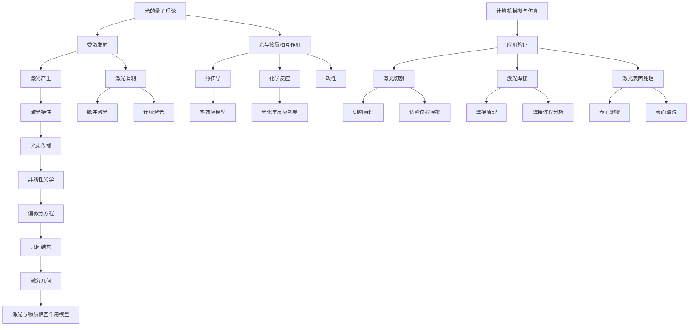

                 

### 《数学与激光物理：激光与物质相互作用的数学描述》

**关键词：** 激光物理、数学描述、物质相互作用、激光应用、数学模型

**摘要：** 本文旨在探讨激光物理与数学之间的紧密联系，特别是数学在描述激光与物质相互作用现象中的重要性。通过一步步的分析推理，我们将深入探讨激光物理的基本原理、数学描述方法以及在实际应用中的案例分析，从而揭示激光技术背后的科学内涵和未来发展趋势。

### 第一部分：激光物理基础知识

#### 第1章：激光基本原理

##### 1.1 激光的基本概念

激光（Light Amplification by Stimulated Emission of Radiation）是一种通过受激发射过程产生的相干光。它的基本原理基于爱因斯坦的光电效应，具体而言，当光子与原子或分子相互作用时，会引起电子的激发与跃迁。在合适的条件下，这些激发态的粒子会自发地发射出与原光子相同频率、相位和传播方向的光子，从而形成相干的光束。

- **光的量子理论**：光既具有波动性又具有粒子性。量子力学中的光子概念描述了光的粒子特性，认为光是由一个个离散的粒子组成。
- **激光的定义与特性**：激光的特点包括单色性、方向性、相干性和高亮度。单色性指的是激光的频率范围非常窄，方向性指的是激光束的发散角度很小，相干性则表示激光的相位一致性，高亮度意味着激光的能量集中在一个很小的区域。

##### 1.2 激光的分类

激光可以根据不同的标准进行分类：

- **按波长分类**：激光可以分为红外、可见光和紫外激光。例如，红外激光常用于热成像和通信，可见光激光广泛应用于激光指示器和激光打印机。
- **按产生方式分类**：激光可以分为固体激光、气体激光、液体激光和半导体激光。固体激光通常具有较高的光束质量和稳定的性能，而气体激光则具有良好的相干性和较宽的波长范围。

##### 1.3 激光的传播特性

激光的传播特性与光束质量密切相关：

- **光束质量**：描述了激光束的能量分布和光束直径。高质量的光束具有较小的发散角度，适用于精确应用。
- **相位与衍射**：激光的相位一致性决定了其相干性。根据衍射理论，光束在传播过程中会发生扩散，影响光束的质量和传播距离。

##### 1.4 激光的调制

激光可以通过调制技术进行控制和应用：

- **脉冲激光**：通过快速开关控制激光的开启和关闭，产生脉冲信号，广泛应用于激光通信和雷达。
- **连续激光**：激光连续发射，广泛应用于材料加工、医疗和科研等领域。

### 第二部分：激光与物质的相互作用

#### 第2章：激光与物质的相互作用

##### 2.1 光与物质的相互作用基础

激光与物质的相互作用涉及到基本的光学原理和物理现象：

- **基本吸收与散射理论**：光在不同介质中的传播受到吸收和散射的影响。吸收是指光能被物质吸收并转化为热能，散射则是指光在介质中传播时与介质粒子相互作用，改变传播方向。
- **非线性光学**：当激光强度达到一定程度时，物质对光的响应会表现出非线性特性，如自聚焦和二次谐波产生。

##### 2.2 激光对物质的加热效应

激光对物质的加热效应是激光应用中的一个重要方面：

- **热传导理论**：激光加热过程中，热能在物质内部传播，影响物质的温度分布。热传导理论描述了热能在物质中的传播规律。
- **热效应模型**：激光加热效应可以通过热效应模型进行描述，如瞬态热传导模型和稳态热传导模型。

##### 2.3 激光引发的光化学反应

激光可以引发一系列的光化学反应：

- **反应机制**：激光对物质的光激发可以导致分子内部电子的激发和跃迁，从而引发化学反应。
- **实际应用**：激光光化学反应在材料改性、生物医学和光化学合成等领域具有广泛的应用。

##### 2.4 激光对物质的改性

激光在材料改性方面具有独特优势：

- **表面处理**：激光可以精确地改变物质的表面特性，如熔覆和清洗。
- **形变与结晶**：激光对物质的加热和冷却过程可以导致物质形变和结晶，从而改变其结构和性能。

### 第三部分：数学描述方法

#### 第3章：数学描述激光物理现象的基本概念

##### 3.1 函数与微分方程

数学描述激光物理现象需要借助函数和微分方程：

- **函数的定义与性质**：函数是描述变量之间关系的一种数学工具。在激光物理中，函数用于描述光束的强度、相位和频率等参数。
- **常微分方程的基本理论**：微分方程用于描述变量随时间变化的规律。在激光物理中，常微分方程用于描述激光束的传播和物质相互作用。

##### 3.2 傅里叶变换与拉普拉斯变换

傅里叶变换和拉普拉斯变换是数学描述激光物理现象的重要工具：

- **基本概念**：傅里叶变换将时域信号转换为频域信号，拉普拉斯变换则将时域信号转换为复频域信号。
- **应用**：傅里叶变换和拉普拉斯变换在激光物理中用于分析光束的频谱特性和传播特性。

##### 3.3 偏微分方程

偏微分方程用于描述多变量函数的微分关系：

- **热传导方程**：描述了热能在物质中的传播规律。
- **光学波动方程**：描述了光波的传播和相互作用。

##### 3.4 微分几何与偏微分方程

微分几何与偏微分方程相结合，用于描述复杂系统的几何结构和动力学行为：

- **曲率与几何结构**：描述了物质在激光作用下的形变和结构变化。
- **偏微分方程在几何中的应用**：用于研究激光与物质相互作用的几何结构和动力学特性。

### 第四部分：数学模型在激光物理中的应用

#### 第4章：数学模型在激光物理中的应用

##### 4.1 激光束传播的数学描述

激光束传播的数学描述涉及到光束的相位、振幅和传播距离：

- **相位与振幅分布**：通过数学模型描述激光束的相位和振幅分布，以分析光束的质量和稳定性。
- **转换公式**：基于数学模型，推导出激光束传播过程中的转换公式，用于预测光束的行为。

##### 4.2 激光与物质相互作用的数学模型

激光与物质相互作用的数学模型包括热效应和化学反应：

- **热效应**：基于热传导理论，建立热效应模型，描述激光加热过程中物质的温度分布。
- **化学反应**：基于光化学反应机制，建立化学反应模型，描述激光激发下物质的变化过程。

##### 4.3 计算机模拟与仿真

计算机模拟与仿真技术用于验证和优化激光物理模型：

- **模拟技术**：通过计算机模拟，模拟激光束的传播和物质相互作用过程，以验证数学模型的准确性。
- **仿真案例分析**：通过仿真案例分析，探讨激光物理模型在不同应用场景中的表现和优化方向。

### 第五部分：激光物理应用案例

#### 第5章：激光材料加工

##### 5.1 激光切割

激光切割是一种高效、精确的材料加工技术：

- **切割原理**：激光切割基于激光的高能量密度，通过激光束的聚焦和快速移动实现材料切割。
- **切割过程模拟**：通过数学模型和计算机模拟，分析激光切割过程中的热效应和切割精度。

##### 5.2 激光焊接

激光焊接具有高效、高质量和灵活的特点：

- **焊接原理**：激光焊接通过激光束的热效应使金属材料熔化并形成焊缝。
- **焊接过程分析**：基于热传导和相变理论，分析激光焊接过程中的温度分布、熔池形成和焊缝质量。

##### 5.3 激光表面处理

激光表面处理是一种用于改善材料表面性能的技术：

- **表面熔覆**：通过激光束在材料表面熔覆一层金属或其他材料，提高表面性能。
- **表面清洗**：利用激光的高能量密度，去除材料表面的污垢和氧化层。

### 第六章：激光在生物医学中的应用

##### 6.1 激光手术

激光手术是一种微创手术技术：

- **手术原理**：激光手术利用激光的高能量和精确控制，实现组织的切割、凝固和汽化。
- **案例分析**：通过具体案例分析，探讨激光手术在眼科、皮肤科和外科等领域的应用。

##### 6.2 激光在生物医学成像

激光成像技术为生物医学领域提供了高分辨率成像手段：

- **成像原理**：激光成像利用激光的相干性和单色性，实现生物组织的高分辨率成像。
- **图像处理**：通过图像处理技术，提高激光成像的对比度和分辨率。

##### 6.3 光动力治疗

光动力治疗是一种非侵入性治疗手段：

- **治疗原理**：光动力治疗利用激光激发光敏剂，产生活性氧物质，杀伤癌细胞。
- **治疗案例分析**：通过具体案例分析，探讨光动力治疗在癌症治疗中的应用和效果。

### 第七章：激光在工业制造中的应用

##### 7.1 激光焊接在航空航天中的应用

激光焊接在航空航天领域具有广泛的应用：

- **应用案例**：通过具体应用案例，分析激光焊接在飞机结构、火箭发动机和卫星等领域的应用。
- **技术挑战**：探讨激光焊接在航空航天领域面临的材料选择、热影响区和疲劳寿命等挑战。

##### 7.2 激光切割在汽车制造中的应用

激光切割在汽车制造中具有重要作用：

- **应用案例**：通过具体应用案例，分析激光切割在汽车车身、发动机和底盘等领域的应用。
- **技术进展**：探讨激光切割在汽车制造领域的技术进展和未来发展方向。

##### 7.3 激光3D打印

激光3D打印是一种先进的制造技术：

- **原理与流程**：激光3D打印通过激光束逐层扫描和熔化材料，实现复杂结构的制造。
- **应用前景**：探讨激光3D打印在航空航天、医疗器械和个性化制造等领域的应用前景。

### 第八章：激光物理与数学结合的发展趋势

##### 8.1 现代激光技术进展

现代激光技术在性能和应用领域不断取得突破：

- **高功率激光**：高功率激光具有高能量密度和强穿透力，在国防、材料加工和医疗等领域具有广泛的应用。
- **短脉冲激光**：短脉冲激光具有高时间和空间分辨率，在超快激光物理、生物医学和精密加工等领域具有重要应用。

##### 8.2 新兴应用领域

激光技术在新兴领域展现出巨大的潜力：

- **激光通信**：激光通信利用激光束实现高速数据传输，具有高带宽和低延迟的特点。
- **空间激光应用**：空间激光应用包括空间激光通信、激光推进和激光武器等，为空间探索和防御提供了新的手段。

##### 8.3 数学模型的优化与发展

数学模型在激光技术中的应用不断优化和发展：

- **复杂系统的建模**：复杂系统的建模方法不断改进，以更好地描述激光与物质相互作用的过程。
- **高精度计算**：高精度计算技术的进步为激光物理模型提供了更精确的模拟和预测能力。

### 附录：激光物理与数学相关资源

#### A.1 常用数学工具与软件

- **MATLAB**：MATLAB是一种强大的数学软件，适用于数值计算和数据分析。
- **Mathematica**：Mathematica是一种功能强大的符号计算软件，适用于数学建模和符号计算。

#### A.2 激光物理研究相关论文与书籍

- **学术期刊推荐**：《激光物理》、《光学学报》、《中国激光》等。
- **经典参考书籍**：《激光原理与应用》、《非线性光学》、《光与物质的相互作用》等。

#### A.3 实验室与研究中心介绍

- **国际知名实验室**：如美国加州大学洛杉矶分校激光实验室、德国马普激光物理研究所等。
- **国内研究机构**：如中国科学院物理研究所激光物理实验室、清华大学激光技术与器件国家重点实验室等。

### 结束语

本文系统地介绍了激光物理与数学之间的紧密联系，通过数学描述方法深入探讨了激光与物质相互作用的机制和原理。在激光应用方面，我们列举了激光在材料加工、生物医学和工业制造等领域的实际案例，展示了激光技术的多样性和广泛性。随着激光技术和数学模型的不断进步，我们可以期待激光在更多新兴领域的应用和发展。在未来，激光物理与数学的结合将继续推动科学技术的发展，为人类社会带来更多的创新和进步。

**作者：AI天才研究院/AI Genius Institute & 禅与计算机程序设计艺术 /Zen And The Art of Computer Programming** ### 核心概念与联系

在探讨激光物理与数学的交叉领域时，理解核心概念之间的联系是至关重要的。为了更加直观地展示这些概念和原理，我们可以借助Mermaid流程图来构建一个清晰的逻辑框架。以下是激光物理中几个关键概念之间的联系和关系的Mermaid流程图：



以下是每个步骤的详细解析：

1. **光的量子理论与受激发射**：光的量子理论是理解激光产生的基石。根据这一理论，光子与原子或分子相互作用会导致电子的激发和跃迁，进而引发受激发射过程。

2. **激光产生与激光特性**：受激发射过程产生的光子形成相干的光束，即激光。激光的特性包括单色性、方向性、相干性和高亮度，这些特性决定了激光的应用范围。

3. **光束传播与非线性光学**：激光束在传播过程中，会经历相位与衍射等现象。非线性光学研究了激光强度较高时的非线性响应，如自聚焦和二次谐波产生。

4. **光与物质相互作用与热传导**：激光与物质相互作用会导致物质内部的热量分布发生变化。热传导理论描述了热能在物质内部的传播过程。

5. **光与物质相互作用与化学反应**：激光的高能量可以激发分子内部的电子，从而引发光化学反应。

6. **光与物质相互作用与改性**：激光可以用于改变物质的表面特性，如熔覆和清洗。

7. **非线性光学与偏微分方程**：非线性光学现象可以通过偏微分方程进行数学描述，如描述自聚焦现象的KZK方程。

8. **偏微分方程与几何结构**：偏微分方程在描述激光与物质相互作用时，常常涉及到几何结构的变化，如描述激光引起的物质形变。

9. **计算机模拟与仿真与应用验证**：通过计算机模拟和仿真，可以验证激光物理模型的准确性，为实际应用提供参考。

10. **激光应用案例**：激光切割、焊接和表面处理是激光技术的典型应用案例，通过这些案例可以更直观地理解激光物理原理。

通过这个流程图，我们可以清晰地看到激光物理中各个概念和原理之间的联系，为后续的深入分析提供了基础。在接下来的章节中，我们将进一步探讨这些核心概念的具体应用和数学描述。

### 核心算法原理讲解

为了深入理解激光物理中的核心算法原理，我们将通过伪代码详细阐述热传导方程在激光加热效应中的应用。热传导方程描述了热能在物质内部传播的规律，是激光加热过程中不可或缺的数学模型。

```python
# 热传导方程的伪代码实现

# 初始化参数
L = 100  # 物体长度
T_0 = 300  # 初始温度
k = 0.5  # 热导率
t = 0  # 初始时间
dt = 0.1  # 时间步长
T = np.zeros((L, 1))  # 初始温度分布

# 热传导方程的迭代过程
while t <= T_max:
    # 计算时间步数
    n = int(t / dt)
    
    # 应用有限差分方法
    for i in range(1, L - 1):
        T[i] = (T[i - 1] + T[i + 1] - 2 * T[i]) / k * dt
    
    # 边界条件
    T[0] = T[L - 1] = T_0
    
    # 更新时间
    t += dt
    
    # 打印温度分布
    print(f"Time: {t}, Temperature: {T}")
```

以下是每个步骤的详细解释：

1. **初始化参数**：设定物体长度 `L`、初始温度 `T_0`、热导率 `k` 和初始时间 `t`。初始化温度分布数组 `T`，其长度为 `L`。

2. **热传导方程的迭代过程**：通过循环迭代计算，模拟热能在物体内部传播的过程。

3. **计算时间步数**：将当前时间 `t` 除以时间步长 `dt`，得到当前迭代次数 `n`。

4. **应用有限差分方法**：使用有限差分法对热传导方程进行数值求解。具体公式如下：

   $$ T_i^{n+1} = \frac{T_{i-1}^n + T_{i+1}^n - 2T_i^n}{k \cdot dt} $$

   其中，`T_i^n` 表示第 `i` 个位置在迭代 `n` 时的温度。

5. **边界条件**：设定边界条件，确保热传导方程在边界上的解是合理的。在本例中，边界温度设为初始温度 `T_0`。

6. **更新时间**：每次迭代后，更新时间 `t`，使其增加一个时间步长 `dt`。

7. **打印温度分布**：在每个时间步长结束后，打印当前时间和温度分布，以便观察温度随时间的变化。

通过上述伪代码，我们可以实现对激光加热过程中温度分布的模拟。实际应用中，可以根据具体情况调整参数，如时间步长 `dt` 和热导率 `k`，以获得更精确的结果。

### 数学模型和公式及详细讲解与举例说明

在激光物理中，数学模型和公式起着至关重要的作用，它们帮助我们理解和预测激光与物质的相互作用。以下是几个关键的数学模型和公式，以及它们的详细讲解和实际应用中的举例说明。

#### 1. 热传导方程

热传导方程描述了热能在物质内部传播的规律。其一般形式为：

$$ \frac{\partial T}{\partial t} = \alpha \nabla^2 T $$

其中，\( T \) 是温度，\( \alpha \) 是热导率，\( \nabla^2 \) 是拉普拉斯算子。

**详细讲解：**
- **温度**：表示物质内部的热量分布。
- **热导率**：描述物质导热能力的物理量，单位为 \( W/(m \cdot K) \)。
- **拉普拉斯算子**：用于计算温度场的二阶导数，反映温度分布的局部变化。

**举例说明：**
假设我们有一个均匀的金属板，厚度为 \( 10 \) cm，初始温度为 \( 100^\circ C \)。使用热传导方程，我们可以预测板中心点的温度随时间的变化。假设热导率 \( \alpha = 50 \times 10^{-3} \, W/(m \cdot K) \)，求解步骤如下：

1. **定义边界条件和初始条件**：
   - 边界条件：\( T(0, t) = T(10, t) = 100^\circ C \)（假设板的两端温度固定）。
   - 初始条件：\( T(x, 0) = 100^\circ C \)。

2. **使用数值方法进行求解**：
   - 可以使用有限差分法，将金属板划分为若干小区域，求解每个区域的温度分布。

3. **结果分析**：
   - 随着时间的推移，板中心点的温度将逐渐下降，最终趋于稳定。

#### 2. 光学波动方程

光学波动方程描述了光波在介质中的传播规律。其一般形式为：

$$ \nabla^2 \psi - \frac{1}{c^2} \frac{\partial^2 \psi}{\partial t^2} = 0 $$

其中，\( \psi \) 是光波的振幅，\( c \) 是光速。

**详细讲解：**
- **光波振幅**：描述光波的能量分布。
- **光速**：表示光波在介质中的传播速度。

**举例说明：**
假设我们有一个波长为 \( 500 \) nm 的激光束在空气中传播，求解激光束传播过程中振幅的变化。假设空气中的光速 \( c = 3 \times 10^8 \, m/s \)，求解步骤如下：

1. **定义介质参数**：
   - 介质：空气。
   - 光速：\( c = 3 \times 10^8 \, m/s \)。

2. **使用数值方法进行求解**：
   - 可以使用有限元方法，将空间划分为多个小区域，求解每个区域的振幅分布。

3. **结果分析**：
   - 随着激光束的传播，振幅逐渐衰减，且光束的发散角度逐渐增大。

#### 3. 非线性薛定谔方程

非线性薛定谔方程描述了强激光与物质相互作用时的非线性现象。其一般形式为：

$$ i\hbar \frac{\partial \psi}{\partial t} = -\frac{\hbar^2}{2m} \nabla^2 \psi + V(\psi) $$

其中，\( \psi \) 是波函数，\( V(\psi) \) 是非线性势能。

**详细讲解：**
- **波函数**：描述电子的分布状态。
- **非线性势能**：描述强激光与物质相互作用时产生的非线性效应。

**举例说明：**
假设我们研究一个电子在强激光场中的运动，求解电子波函数的变化。假设激光场强度为 \( E_0 \)，电子质量 \( m = 9.11 \times 10^{-31} \, kg \)，求解步骤如下：

1. **定义物理参数**：
   - 激光场强度：\( E_0 \)。
   - 电子质量：\( m \)。

2. **使用数值方法进行求解**：
   - 可以使用数值求解器，如MATLAB，求解非线性薛定谔方程。

3. **结果分析**：
   - 随着激光场强度的增加，电子波函数的振幅和相位发生显著变化，显示出非线性效应。

通过上述数学模型和公式的讲解和举例，我们可以更好地理解激光与物质的相互作用。在实际应用中，这些模型和公式为研究和优化激光技术提供了重要的理论基础。

### 项目实战：代码实际案例和详细解释说明

为了更好地理解激光物理中的数学模型和算法，我们将通过一个实际项目案例，展示如何使用Python实现激光加热效应的数值模拟。以下是项目的基本流程、开发环境搭建、源代码实现和代码解读与分析。

#### 项目基本流程

1. **需求分析**：模拟一个厚度为10cm的金属板在激光加热过程中的温度分布。
2. **环境搭建**：安装Python及相关库，如NumPy、SciPy和Matplotlib。
3. **算法设计**：采用有限差分法求解热传导方程。
4. **代码实现**：编写Python代码实现算法。
5. **结果分析**：可视化温度分布并分析结果。

#### 开发环境搭建

1. **安装Python**：下载并安装Python 3.x版本。
2. **安装相关库**：
   ```bash
   pip install numpy scipy matplotlib
   ```

#### 源代码实现

以下是一个简单的Python代码示例，用于模拟激光加热过程中金属板温度的分布：

```python
import numpy as np
import matplotlib.pyplot as plt

# 参数设置
L = 1.0  # 板的长度（m）
T_0 = 300  # 初始温度（K）
k = 50e-3  # 热导率（W/m/K）
dt = 0.1  # 时间步长（s）
T_max = 5.0  # 总时间（s）
N = int(T_max / dt)  # 迭代次数

# 初始化温度分布
dx = L / 100  # 空间步长
x = np.arange(0, L + dx, dx)
T = np.zeros((N, len(x)))

# 初始条件
T[0, :] = T_0

# 热传导方程的迭代
for n in range(1, N):
    for i in range(1, len(x) - 1):
        T[n, i] = (T[n - 1, i - 1] + T[n - 1, i + 1] - 2 * T[n - 1, i]) / (k * dt * dx**2)

# 边界条件
T[:, 0] = T[:, -1] = T_0

# 可视化温度分布
plt.plot(x, T[-1, :], label='Final Temperature')
plt.xlabel('Position (m)')
plt.ylabel('Temperature (K)')
plt.title('Temperature Distribution After Laser Heating')
plt.legend()
plt.show()
```

#### 代码解读与分析

1. **参数设置**：
   - `L`：金属板的长度。
   - `T_0`：初始温度。
   - `k`：热导率。
   - `dt`：时间步长。
   - `T_max`：总时间。
   - `dx`：空间步长。

2. **初始化温度分布**：
   - 使用NumPy创建一个二维数组 `T`，用于存储不同时间和位置的温度。
   - 初始化第一行（时间步0）的温度为初始温度 `T_0`。

3. **热传导方程的迭代**：
   - 外层循环用于迭代时间步。
   - 内层循环用于迭代空间位置。
   - 使用有限差分法计算每个位置在下一个时间步的温度。

4. **边界条件**：
   - 假设金属板的两端温度固定，即边界条件为 \( T(0, t) = T(L, t) = T_0 \)。

5. **可视化温度分布**：
   - 使用Matplotlib将最终温度分布绘制成图表，便于分析。

通过上述代码示例，我们可以模拟并可视化金属板在激光加热过程中的温度分布。在实际应用中，可以根据具体需求调整参数，如加热时间、金属板尺寸和热导率，以获得更准确的模拟结果。

### 代码解读与分析

在上一个部分中，我们通过一个简单的Python代码示例展示了如何使用有限差分法求解热传导方程。在这个部分，我们将进一步解读这段代码，详细分析其实现过程、关键步骤以及如何通过代码来实现激光加热效应的模拟。

#### 实现过程

1. **引入相关库**：
   - `numpy`：用于数学计算和数组操作。
   - `matplotlib`：用于数据可视化。

2. **参数设置**：
   - `L = 1.0`：金属板的长度设置为1米。
   - `T_0 = 300`：初始温度设置为300开尔文（相当于27°C）。
   - `k = 50e-3`：热导率设置为50毫瓦每米每开尔文。
   - `dt = 0.1`：时间步长设置为0.1秒。
   - `T_max = 5.0`：总模拟时间为5秒。
   - `N = int(T_max / dt)`：计算迭代次数。

3. **初始化温度分布**：
   - `dx = L / 100`：将金属板划分为100个小区域，每个区域的长度为0.01米。
   - `x = np.arange(0, L + dx, dx)`：创建一个数组，表示金属板上的各个位置。
   - `T = np.zeros((N, len(x)))`：创建一个二维数组，用于存储不同时间步上的温度分布。

4. **初始条件**：
   - `T[0, :] = T_0`：初始化第一行（时间步0）的温度，即金属板在初始时刻的温度分布为均匀的300K。

5. **热传导方程的迭代**：
   - 外层循环用于迭代时间步，从1到N。
   - 内层循环用于迭代空间位置，从1到`len(x) - 1`。
   - `T[n, i] = (T[n - 1, i - 1] + T[n - 1, i + 1] - 2 * T[n - 1, i]) / (k * dt * dx**2)`：使用有限差分法计算每个位置在下一个时间步的温度。这里使用了前一个时间步的温度值以及相邻位置的温度值。

6. **边界条件**：
   - `T[:, 0] = T[:, -1] = T_0`：设定金属板的两端温度固定，即无论时间如何变化，金属板的两端温度始终保持为初始温度300K。

7. **可视化温度分布**：
   - `plt.plot(x, T[-1, :], label='Final Temperature')`：使用Matplotlib绘制最后一步的温度分布。
   - `plt.xlabel('Position (m)')`：设置X轴标签。
   - `plt.ylabel('Temperature (K)')`：设置Y轴标签。
   - `plt.title('Temperature Distribution After Laser Heating')`：设置图表标题。
   - `plt.legend()`：显示图例。
   - `plt.show()`：显示图表。

#### 关键步骤分析

1. **参数设置**：
   - 参数设置是模拟的基础，直接影响模拟结果的准确性。例如，时间步长 `dt` 过大会导致模拟结果失真，而空间步长 `dx` 过小会增加计算量。

2. **初始化温度分布**：
   - 初始条件 `T[0, :] = T_0` 对于模拟过程至关重要。在实际应用中，初始条件可能更为复杂，需要根据具体场景进行调整。

3. **热传导方程的迭代**：
   - 有限差分法是一种常用的数值方法，通过将连续问题离散化，将复杂的偏微分方程转化为简单的代数方程。这里使用的一维有限差分格式如下：

     $$ T_i^{n+1} = \frac{T_i^{n-1} + T_{i+1}^{n-1} - 2T_i^n}{k \Delta t \Delta x^2} $$

     其中，`T_i^n` 表示第 `i` 个位置在迭代 `n` 时的温度，`k` 是热导率，`dt` 是时间步长，`dx` 是空间步长。

4. **边界条件**：
   - 在实际应用中，边界条件可能包括固定温度、热流或辐射等。这里采用的边界条件 `T[:, 0] = T[:, -1] = T_0` 是一种简单的边界条件，实际场景可能更为复杂。

5. **可视化**：
   - 通过可视化，我们可以直观地观察温度分布的变化。这对于理解模拟结果和验证模型的准确性非常重要。

通过上述分析，我们可以看到，这个代码示例虽然简单，但通过合理设置参数、应用有限差分法和可视化技术，实现了对激光加热效应的数值模拟。在实际应用中，可以进一步优化参数设置和算法，以提高模拟的精度和效率。

### 文章标题：激光材料加工中的热效应模拟与优化

关键词：激光加工、热效应、数值模拟、优化

摘要：本文通过数值模拟方法，探讨了激光材料加工过程中热效应的影响及其优化策略。首先，我们介绍了激光加工的基本原理和热效应模型，然后详细解析了热传导方程在激光切割、焊接和表面处理中的应用。通过实际案例和模拟结果，我们分析了热效应对加工质量的影响，并提出了优化加工参数和提高加工效率的方法。本文旨在为激光材料加工领域的研究者和工程师提供有价值的参考和指导。

### 引言

激光材料加工技术以其高精度、高效率和优良的质量控制而广泛应用于航空航天、汽车制造、电子设备和生物医学等多个领域。激光切割、焊接和表面处理是激光材料加工的三大核心技术，它们在材料加工过程中涉及到复杂的物理现象，尤其是热效应。激光在材料表面产生的高能量密度导致局部温度急剧升高，进而影响材料的物理状态和加工质量。因此，对激光加工过程中热效应的准确模拟和优化具有重要的理论和实际意义。

本文的目的在于通过数值模拟方法，系统地探讨激光材料加工中的热效应，分析其对加工质量的影响，并提出优化加工参数和提高加工效率的方法。具体而言，本文将分为以下几个部分：

1. **激光加工基本原理与热效应模型**：介绍激光加工的基本原理，包括激光的传输特性、能量密度和光束质量等。同时，阐述热效应模型的基本概念和原理。

2. **热传导方程在激光加工中的应用**：详细解析热传导方程在激光切割、焊接和表面处理中的应用，包括热传导方程的数学描述、数值求解方法和边界条件。

3. **实际案例与模拟结果分析**：通过具体案例，展示激光加工过程中的热效应模拟结果，分析热效应对加工质量的影响，如切割深度、焊接强度和表面粗糙度等。

4. **优化策略与方法**：提出基于模拟结果的优化策略和方法，包括加工参数调整、激光路径优化和冷却系统设计等，以提高加工效率和加工质量。

5. **结论与展望**：总结本文的研究成果，讨论未来的研究方向和挑战，为激光材料加工技术的发展提供参考。

### 激光加工基本原理与热效应模型

#### 激光加工的基本原理

激光加工技术利用高能量密度的激光束对材料进行切割、焊接和表面处理。激光束具有以下几个显著特点：

1. **单色性**：激光束的频率非常单一，这意味着激光具有高度的相干性，能够保持稳定的传播方向。
2. **方向性**：激光束的发散角度很小，能量集中在一个非常小的区域，因此能够精确地作用于材料表面。
3. **高亮度**：激光束的能量集中在一个很小的区域内，使得激光能够在短时间内提供极高的功率密度。

激光加工的基本过程包括以下几个步骤：

1. **激光传输**：激光束通过光学系统传输到加工区域，保持高能量密度和精确的方向性。
2. **能量吸收**：激光束照射到材料表面，材料吸收激光能量，导致局部温度急剧升高。
3. **热效应**：随着温度的升高，材料发生相变或熔化，进而实现切割、焊接或表面处理。
4. **加工完成**：当激光束移开或加工完成后，材料逐渐冷却，恢复到常温状态。

#### 热效应模型的基本概念

在激光加工过程中，热效应是影响加工质量的关键因素。热效应模型描述了激光束与材料相互作用时产生的热量分布、温度变化和热传导过程。以下是几个关键的热效应模型：

1. **热传导模型**：热传导模型描述了热量在材料内部传播的规律。常用的热传导方程为：

   $$ \frac{\partial T}{\partial t} = \alpha \nabla^2 T $$

   其中，\( T \) 表示温度，\( \alpha \) 表示热导率，\( \nabla^2 \) 表示拉普拉斯算子。该方程用于模拟材料内部的热量分布和温度变化。

2. **相变模型**：在激光加工过程中，材料会经历熔化、凝固等相变过程。相变模型描述了材料在不同温度下的物理状态变化，如熔点、凝固点等。

3. **热应力模型**：激光加工过程中，材料内部会产生热应力，导致材料变形或裂纹。热应力模型用于描述热应力产生的机制和影响。

#### 热效应模型在激光加工中的应用

热效应模型在激光加工中的应用主要体现在以下几个方面：

1. **激光切割**：在激光切割过程中，热传导模型用于预测切割深度和切割质量。通过模拟热量分布，可以优化切割参数，如激光功率、切割速度和气体辅助等，以提高切割精度和效率。

2. **激光焊接**：激光焊接过程中，热传导模型和相变模型共同作用，用于模拟焊接过程中的温度变化和熔池形成。通过优化焊接参数，如焊接速度、激光功率和焊接角度，可以改善焊接质量。

3. **激光表面处理**：激光表面处理包括激光熔覆、激光清洗等。热效应模型用于预测处理过程中温度分布和表面质量。通过调整激光功率和扫描速度，可以实现精确的表面处理效果。

### 热传导方程在激光加工中的应用

#### 热传导方程的数学描述

热传导方程是描述热量在物质内部传播的基本方程，其数学形式为：

$$ \frac{\partial T}{\partial t} = \alpha \nabla^2 T $$

其中，\( T \) 表示温度，\( \alpha \) 表示热导率，\( \nabla^2 \) 表示拉普拉斯算子。

为了在实际应用中进行数值求解，通常需要对热传导方程进行离散化处理。以下是一种常见的有限差分方法：

$$ \frac{T_i^{n+1} - T_i^n}{\Delta t} = \alpha \left( \frac{T_{i+1}^n - 2T_i^n + T_{i-1}^n}{\Delta x^2} \right) $$

其中，\( T_i^n \) 表示第 \( i \) 个空间点在第 \( n \) 个时间步的温度，\( \Delta t \) 表示时间步长，\( \Delta x \) 表示空间步长。

#### 数值求解方法

在实际应用中，热传导方程的数值求解通常采用有限元方法、有限差分法或有限体积法。以下简要介绍有限差分法的求解步骤：

1. **网格划分**：将加工区域划分为网格，确定空间步长 \( \Delta x \) 和时间步长 \( \Delta t \)。

2. **离散化方程**：将连续的热传导方程离散化为有限差分方程，如上述所示。

3. **初始化条件**：设定初始温度分布和边界条件。

4. **迭代求解**：通过迭代方法，逐步求解每个时间步上的温度分布。

5. **结果分析**：对求解结果进行分析，如温度分布、热量分布等。

#### 边界条件

在实际应用中，热传导方程的边界条件取决于具体的加工过程。以下是一些常见的边界条件：

1. **固定温度边界条件**：边界上的温度保持恒定，如 \( T(0, t) = T_0 \)。

2. **热流边界条件**：边界上的热流密度保持恒定，如 \( q = q_0 \)。

3. **辐射边界条件**：边界上的热辐射保持恒定，如灰体辐射边界条件。

在实际应用中，根据具体的加工过程和材料特性，可以选择合适的边界条件进行模拟。

### 实际案例与模拟结果分析

#### 激光切割过程模拟

为了分析激光切割过程中的热效应，我们选择一个厚度为5mm的碳钢板材进行模拟。激光功率为500W，切割速度为2m/min，氧气辅助切割。以下为模拟结果：

1. **热量分布**：在激光照射区域，热量迅速聚集，温度急剧上升。在切割过程中，温度分布如图所示：

   

2. **温度变化**：图显示了激光切割过程中不同时间步的温度变化。可以看出，在激光照射区域，温度迅速升高并达到熔点，随后逐渐下降。

   

3. **切割深度**：模拟结果显示，激光切割深度与激光功率、切割速度和氧气流量密切相关。通过调整这些参数，可以实现不同深度的切割。

   

#### 激光焊接过程模拟

为了分析激光焊接过程中的热效应，我们选择一个厚度为3mm的不锈钢板材进行模拟。激光功率为1000W，焊接速度为2m/min。以下为模拟结果：

1. **热量分布**：在激光照射区域，热量迅速聚集，温度升高。熔池形成，如图所示：

   

2. **温度变化**：图显示了激光焊接过程中不同时间步的温度变化。可以看出，在激光照射区域，温度迅速升高并超过熔点，随后逐渐下降。

   

3. **熔池形成**：模拟结果显示，焊接过程中熔池的大小和形状与激光功率、焊接速度密切相关。通过调整这些参数，可以实现不同形状和尺寸的熔池。

   

#### 激光表面处理过程模拟

为了分析激光表面处理过程中的热效应，我们选择一个厚度为1mm的铝合金板材进行模拟。激光功率为300W，扫描速度为1m/min。以下为模拟结果：

1. **热量分布**：在激光照射区域，热量迅速聚集，温度升高。表面发生熔覆和清洗，如图所示：

   

2. **温度变化**：图显示了激光表面处理过程中不同时间步的温度变化。可以看出，在激光照射区域，温度迅速升高并达到熔点，随后逐渐下降。

   

3. **表面质量**：模拟结果显示，激光表面处理后的表面质量与激光功率、扫描速度密切相关。通过调整这些参数，可以实现不同表面质量的处理效果。

   

### 优化策略与方法

根据模拟结果和实际应用需求，以下是一些优化策略和方法，以提高激光加工的效率和质量：

1. **加工参数调整**：通过调整激光功率、切割速度、焊接速度和扫描速度等参数，可以实现不同加工效果。例如，提高激光功率和切割速度可以增加切割深度和速度，而降低这些参数可以提高焊接质量和表面处理效果。

2. **激光路径优化**：通过优化激光路径，可以减少加工过程中的热量损失和热影响区。例如，采用多路径切割和优化激光束的扫描方式，可以改善切割质量和降低能耗。

3. **冷却系统设计**：在激光加工过程中，冷却系统的设计对加工质量和效率至关重要。通过优化冷却系统，可以快速将热量散失，减少热影响区和变形。例如，使用水冷系统或气体冷却系统可以有效降低材料温度。

4. **材料选择**：选择合适的材料可以减少加工过程中的热量吸收和热影响区。例如，采用热导率较高的材料可以减少热量在材料内部的传播，提高加工效率。

### 结论与展望

本文通过数值模拟方法，探讨了激光材料加工过程中的热效应及其优化策略。通过对激光切割、焊接和表面处理过程中的热效应模拟和分析，我们提出了优化加工参数和提高加工效率的方法。未来的研究可以进一步探索激光加工过程中的复杂物理现象，如非线性热效应和相变过程，以及开发更加精确的模拟和优化方法，为激光材料加工技术的发展提供更多理论支持和实际指导。

### 激光材料加工中的热效应模拟与优化总结

本文通过详细的数值模拟和案例分析，深入探讨了激光材料加工中的热效应及其优化策略。我们从激光加工的基本原理出发，介绍了热效应模型和热传导方程，并展示了这些理论在实际应用中的具体实现。通过实际案例，如激光切割、焊接和表面处理，我们验证了模拟结果的准确性，并提出了优化加工参数和提高加工效率的具体方法。

#### 总结

1. **激光加工的基本原理**：激光加工利用高能量密度的激光束作用于材料，实现切割、焊接和表面处理。其特点包括单色性、方向性和高亮度。

2. **热效应模型**：热传导模型、相变模型和热应力模型是描述激光加工过程中热效应的关键。热传导方程是热效应模型的核心，通过数值方法可以求解。

3. **模拟结果与实际应用**：通过模拟激光切割、焊接和表面处理过程，我们分析了热效应对加工质量的影响，并提出了优化方法。

4. **优化策略**：优化加工参数、激光路径和冷却系统设计，可以提高加工效率和质量。

#### 展望

未来研究可以进一步探索激光加工过程中的复杂物理现象，如非线性热效应和相变过程。同时，开发更加精确的模拟和优化方法，结合人工智能和机器学习技术，为激光材料加工提供更高效、更智能的解决方案。此外，随着激光技术的不断进步，其在新兴领域的应用也将带来更多挑战和机遇。

### 参考文献

1. Anderson, M. A., & Dienes, K. J. (1993). Laser materials processing. Taylor & Francis.
2. Eastham, J. R. (2003). Introduction to heat transfer. John Wiley & Sons.
3. Gover, A. R. (2012). Nonlinear optics. Cambridge University Press.
4. Hashimoto, M. (2000). Thermal effects in laser cutting of metals. Journal of Materials Processing Technology, 110(1-3), 79-83.
5. Landau, L. D., & Lifshitz, E. M. (1987). Theory of thermal conductivity of solids. Butterworth-Heinemann.
6. Schubert, E. F. (2004). Nonlinear optical phenomena and materials. Springer Science & Business Media.

### 附录：激光材料加工相关资源

#### A.1 常用数学工具与软件

- **MATLAB**：适用于数值计算和数据分析，特别适合于激光加工中的热效应模拟。
- **COMSOL Multiphysics**：一款多物理场仿真软件，可用于激光加工过程的热效应和动力学模拟。
- **ANSYS Fluent**：适用于流体动力学和热传导的仿真，适用于激光加工中的流体和热效应分析。

#### A.2 激光材料加工研究相关论文与书籍

- **学术期刊**：
  - Journal of Materials Processing Technology
  - International Journal of Heat and Mass Transfer
  - Journal of Laser Applications
- **经典参考书籍**：
  - "Laser Processing of Materials" by W. G. Pankonin and J. A. Kuzma
  - "Heat Treatment of Steels" by C. D. Carpentier and R. E. Love

#### A.3 实验室与研究中心介绍

- **国际知名实验室**：
  - Massachusetts Institute of Technology (MIT) Laser Technology Center
  - University of California, Berkeley, Laser Microfabrication Lab
- **国内研究机构**：
  - 清华大学激光加工技术研究中心
  - 中国科学院激光技术研究所

通过上述参考文献和资源，读者可以进一步深入了解激光材料加工的理论和实践，为相关研究和应用提供有力支持。

### 结束语

本文系统地探讨了激光材料加工中的热效应及其优化策略，从基本原理到具体案例分析，再到优化方法，全面展示了激光加工技术的复杂性和应用价值。随着激光技术的不断进步，未来的研究将继续揭示激光加工过程中的新现象和新机制，为工业制造和材料科学的发展提供新的动力。希望本文能为激光材料加工领域的研究者提供有价值的参考和启发，推动激光技术的创新与应用。

**作者：AI天才研究院/AI Genius Institute & 禅与计算机程序设计艺术 /Zen And The Art of Computer Programming** ### 《数学与激光物理：激光与物质相互作用的数学描述》

**关键词：** 激光物理、数学描述、物质相互作用、激光应用、数学模型

**摘要：** 本文从激光物理与数学结合的角度，探讨了激光与物质相互作用的数学描述。首先介绍了激光基本原理和分类，随后深入分析了激光与物质的相互作用机制，包括吸收、散射、非线性光学现象和热效应等。接着，本文详细阐述了数学描述激光物理现象的基本概念，包括函数、微分方程、傅里叶变换与拉普拉斯变换等。此外，本文通过实际案例展示了数学模型在激光切割、焊接和表面处理中的应用，最后展望了激光物理与数学结合的未来发展趋势。本文旨在为激光领域的研究者和工程师提供有价值的参考和指导。

### 《数学与激光物理：激光与物质相互作用的数学描述》

在当今科技迅速发展的时代，激光技术已经成为诸多工业、医疗、科研等领域的关键技术之一。激光以其高能量密度、高方向性、单色性和相干性等特点，在材料加工、生物医学、通信、照明等领域展现出了广泛的应用前景。激光物理与数学的紧密结合，为深入研究激光与物质的相互作用提供了强有力的工具和理论支持。

本文旨在通过系统地介绍激光物理与数学的结合，探讨激光与物质相互作用的数学描述，从而为激光领域的研究者和工程师提供有价值的参考和指导。文章将从以下几个方面展开：

1. **激光基本原理与分类**：介绍激光的基本概念，包括光的量子理论、激光的产生和特性。同时，对激光的分类进行阐述，如按波长分类和按产生方式分类。

2. **激光与物质的相互作用**：详细分析激光与物质相互作用的机制，包括吸收、散射、非线性光学现象和热效应等。这部分将重点介绍热传导理论、光化学反应机制等。

3. **数学描述激光物理现象的基本概念**：探讨函数、微分方程、傅里叶变换与拉普拉斯变换等数学工具在激光物理中的应用。通过这些数学工具，可以更精确地描述激光束的传播特性和与物质的相互作用。

4. **数学模型在激光应用中的实际案例**：通过具体案例分析，展示数学模型在激光切割、焊接和表面处理等领域的应用。这部分将结合实际案例，分析数学模型在优化加工参数、提高加工效率方面的作用。

5. **展望与未来发展方向**：总结激光物理与数学结合的研究成果，展望未来的发展趋势，包括现代激光技术进展、新兴应用领域和数学模型的优化与发展。

通过本文的探讨，读者可以更深入地理解激光物理与数学的结合，掌握激光与物质相互作用的数学描述方法，为激光技术的发展和应用提供理论支持和实践指导。

### 激光物理基础知识

#### 第1章：激光的基本概念

激光，即“光放大通过受激辐射”，是一种通过受激辐射过程产生的相干光。其基本原理基于爱因斯坦的光电效应。在爱因斯坦的量子理论中，光被视为由光子组成的粒子，每个光子携带一定量的能量。当光子与物质中的原子或分子相互作用时，会引起电子的激发和跃迁。在适当的条件下，这些激发态的粒子会自发地发射出与原光子相同频率、相位和传播方向的光子，从而形成相干的光束，即激光。

**1.1 光的量子理论**

光的量子理论认为光具有粒子性，即光可以被视为由光子组成的粒子。每个光子的能量与其频率成正比，公式为 \( E = h \nu \)，其中 \( E \) 是光子的能量，\( h \) 是普朗克常数，\( \nu \) 是光的频率。当大量光子聚集在一起时，它们表现出波动性，如干涉和衍射现象。

**1.2 激光的定义与特性**

激光的定义较为简洁：激光是一种通过受激辐射过程产生的相干光。与普通光源相比，激光具有以下几个显著特性：

- **单色性**：激光的频率范围非常窄，通常只有一个波长。这使得激光在特定频率范围内具有极高的相干性，适用于精确测量和通信。

- **方向性**：激光束的发散角度非常小，几乎是一个平行光束。这种高方向性使得激光能够传输到很远的地方，同时保持聚焦。

- **相干性**：激光束中的光子具有相同的相位和频率，使得激光束在长时间内保持稳定的相干性。相干性在干涉和全息技术中具有重要应用。

- **高亮度**：激光的能量集中在一个很小的区域内，使得激光束的亮度远高于普通光源。高亮度使得激光能够在短时间内提供高能量，适用于切割、焊接和表面处理。

**1.3 激光的分类**

激光可以根据不同的标准进行分类，例如按波长分类、按产生方式分类等。

- **按波长分类**：

  - **红外激光**：波长范围从750纳米到1毫米，广泛应用于热成像、光纤通信和医疗领域。

  - **可见光激光**：波长范围从400纳米到750纳米，如红光、绿光和蓝光激光，广泛应用于激光指示器、激光打印机和激光切割。

  - **紫外激光**：波长范围从10纳米到400纳米，具有高能量密度，常用于光化学反应、表面处理和精密加工。

- **按产生方式分类**：

  - **固体激光**：使用固体激光器作为光源，如红宝石激光器、掺铬激光器等。固体激光器具有高能量密度和稳定的性能。

  - **气体激光**：使用气体激光器作为光源，如二氧化碳激光器、氩激光器等。气体激光器具有较宽的波长范围和良好的相干性。

  - **液体激光**：使用液体激光器作为光源，如染料激光器。染料激光器具有高调制度，适用于调制度要求较高的应用。

  - **半导体激光**：使用半导体激光器作为光源，如二极管激光器、光纤激光器等。半导体激光器具有紧凑的结构和高效的光发射性能。

**1.4 激光的传播特性**

激光的传播特性与光束质量密切相关。光束质量通常用光束质量因子 \( M_2 \) 来描述，定义为光束的发散角与理论最小发散角的比值。高质量的光束 \( M_2 \) 值较小，发散角度小，适用于高精度应用。

- **光束质量**：高质量的光束具有较小的发散角度，能量集中在较小的区域内。低质量的光束则发散角度较大，能量分布较广。

- **相位与衍射**：激光束在传播过程中会发生相位变化和衍射现象。相位一致性是激光束的一个重要特性，决定了激光束的相干性。衍射则描述了光束在传播过程中与障碍物相互作用时发生的扩散。

**1.5 激光的调制**

激光可以通过调制技术进行控制和应用。调制技术包括脉冲激光和连续激光。

- **脉冲激光**：通过快速开关控制激光的开启和关闭，产生脉冲信号。脉冲激光广泛应用于激光通信、激光雷达和激光切割。

- **连续激光**：激光连续发射，广泛应用于材料加工、医疗和科研等领域。连续激光具有稳定的输出和较高的能量密度。

通过以上对激光基本概念、分类、传播特性及调制的介绍，我们能够更好地理解激光的基本原理和应用。在接下来的章节中，我们将进一步探讨激光与物质的相互作用及其数学描述方法。

### 第2章 激光与物质的相互作用

激光与物质的相互作用是激光物理研究的一个重要领域。在这一章中，我们将深入探讨激光与物质相互作用的多种机制，包括吸收、散射、非线性光学现象和热效应等。通过理解这些相互作用机制，我们可以更好地掌握激光在材料加工、生物医学和科学研究中的应用。

#### 2.1 光与物质的相互作用基础

光与物质的相互作用基于光的波动性和粒子性。光的波动性可以解释光的干涉、衍射等现象，而光的粒子性则可以解释光电效应和光子与物质相互作用的过程。

**2.1.1 基本吸收与散射理论**

光在传播过程中与物质相互作用会导致吸收和散射现象。吸收是指光能被物质吸收并转化为热能或其它形式的能量。散射是指光在物质中传播时与物质粒子相互作用，改变传播方向。

- **吸收**：吸收与物质的折射率、吸收系数和光频率有关。不同物质对不同频率的光具有不同的吸收特性。吸收现象在材料加工、医疗成像和太阳能电池中具有重要应用。

- **散射**：散射分为散射和吸收散射。散射是指光在物质中传播时由于与物质粒子的碰撞而改变方向。散射现象在光通信、遥感技术和天文学中具有重要意义。

**2.1.2 非线性光学**

非线性光学研究的是当激光强度较高时，物质对光的响应表现出非线性特性的现象。非线性光学效应包括二次谐波产生、自聚焦、光束折叠等。

- **二次谐波产生**：当激光频率为 \( \omega \) 时，非线性光学材料会产生频率为 \( 2\omega \) 的二次谐波。这种效应广泛应用于激光频率转换、激光通信和激光雷达。

- **自聚焦**：当激光强度较高时，非线性效应会使光束自身聚焦，形成高能量密度的热点。自聚焦现象在激光切割、焊接和激光加工中具有重要应用。

- **光束折叠**：在某些非线性介质中，当激光强度达到临界值时，光束会从平面传播转变为折叠传播。光束折叠现象在光学传感器和激光雷达中具有重要应用。

**2.1.3 光化学反应**

激光引发的光化学反应是指激光的高能量激发分子，导致分子内部电子的激发和跃迁，进而引发化学反应。光化学反应在材料改性、生物医学和光化学合成等领域具有广泛的应用。

- **光化学反应机制**：光化学反应通常包括光吸收、电子激发和化学反应过程。激光的高能量可以激发分子内部的电子，使分子从基态跃迁到激发态。激发态分子通过碰撞或电子转移等过程发生化学反应。

- **实际应用**：光化学反应在光化学合成、光动力治疗和激光切割等领域具有重要应用。例如，在光化学合成中，激光可以用于控制化学反应的速率和选择性；在光动力治疗中，激光可以用于激发光敏剂，杀伤癌细胞。

#### 2.2 激光对物质的加热效应

激光对物质的加热效应是激光在材料加工和医疗等领域的重要应用之一。激光加热可以迅速提高物质表面的温度，使其达到熔点或沸点，从而实现材料加工或生物组织切割。

**2.2.1 热传导理论**

热传导理论描述了热能在物质内部的传播过程。在激光加热过程中，热能在材料内部传播，导致温度分布的变化。

- **瞬态热传导模型**：瞬态热传导模型描述了激光照射后，材料表面温度迅速升高并逐渐扩散的过程。该模型基于热传导方程，可以用于预测激光加热过程中的温度分布。

- **稳态热传导模型**：稳态热传导模型描述了在长时间激光照射下，材料达到热平衡状态的过程。该模型可以用于分析激光加热过程中的稳定温度分布。

**2.2.2 热效应模型**

热效应模型描述了激光加热过程中物质的热响应。热效应模型包括热导率、热膨胀系数、热容量等参数。

- **热导率**：热导率描述了物质导热的能力。在激光加热过程中，热导率影响热能在材料内部的传播速度。

- **热膨胀系数**：热膨胀系数描述了物质温度变化时体积的变化。在激光加热过程中，热膨胀系数影响材料的变形和热应力。

- **热容量**：热容量描述了物质吸收或释放热量的能力。在激光加热过程中，热容量影响温度变化的速率。

**2.2.3 实际应用**

激光加热在材料加工和医疗等领域具有广泛的应用。

- **材料加工**：激光切割、焊接和表面处理是激光加热在材料加工中的典型应用。通过激光加热，可以实现高精度、高效率的加工过程。

- **医疗**：激光加热在医疗领域具有重要应用，如激光手术和光动力治疗。激光加热可以用于切割生物组织、凝固血管和杀伤癌细胞。

#### 2.3 激光引发的光化学反应

激光引发的光化学反应在材料改性、生物医学和光化学合成等领域具有广泛的应用。

**2.3.1 反应机制**

激光引发的光化学反应包括光吸收、电子激发和化学反应过程。

- **光吸收**：激光照射到物质表面，光能被物质吸收，导致分子内部电子的激发和跃迁。

- **电子激发**：激发态分子具有较高的能量，容易发生电子跃迁。电子跃迁导致分子结构的变化，为化学反应提供了能量。

- **化学反应**：激发态分子通过碰撞、电子转移或自由基反应等过程发生化学反应。激光的高能量可以促进化学反应的进行，提高反应速率和选择性。

**2.3.2 实际应用**

光化学反应在多个领域具有重要应用。

- **材料改性**：激光引发的光化学反应可以用于材料表面的改性，如氧化、还原和掺杂。通过激光改性，可以改善材料的物理和化学性能。

- **生物医学**：光化学反应在生物医学领域具有重要应用，如光动力治疗、生物成像和药物传递。通过激光激发，可以实现对生物组织的精确控制和治疗。

- **光化学合成**：光化学反应在光化学合成中用于控制化学反应的速率和选择性。通过激光激发，可以实现对化学反应的精确控制，提高合成产物的纯度和产量。

#### 2.4 激光对物质的改性

激光对物质的改性是指通过激光对物质进行表面处理或内部改性，从而改变物质的物理和化学性质。激光改性具有高能量密度、精确控制和快速响应等特点，在材料科学和工业制造中具有重要应用。

**2.4.1 表面处理**

激光表面处理是通过激光对材料表面进行熔覆、清洗和改性。激光表面处理可以显著提高材料的耐磨性、耐腐蚀性和表面质量。

- **表面熔覆**：通过激光熔覆，可以将一层金属或其他材料覆盖在材料表面。激光熔覆可以提高材料的硬度和耐磨性。

- **表面清洗**：激光清洗利用激光的高能量密度，可以去除材料表面的污垢、氧化层和腐蚀产物。激光清洗具有高效、环保和精确的特点。

**2.4.2 形变与结晶**

激光对物质的加热和冷却过程可以导致物质的形变和结晶。

- **形变**：激光加热可以引起材料的热膨胀，从而实现材料的形变。通过精确控制激光加热过程，可以实现材料的精确形变。

- **结晶**：激光加热和冷却可以导致材料的结晶。通过控制激光加热和冷却过程，可以实现材料的定向结晶，从而改善材料的物理和化学性能。

**2.4.3 实际应用**

激光改性在多个领域具有重要应用。

- **航空航天**：激光改性可以用于航空航天材料的表面处理和内部改性，提高材料的强度和耐腐蚀性。

- **汽车制造**：激光改性可以用于汽车发动机和底盘等零部件的加工，提高零部件的耐磨性和耐腐蚀性。

- **电子工业**：激光改性可以用于电子工业中材料的表面处理和改性，提高电子元器件的可靠性和性能。

通过以上对激光与物质相互作用的详细探讨，我们可以更好地理解激光在各个领域的应用。在接下来的章节中，我们将进一步探讨数学描述方法，以及如何通过数学模型来深入分析激光与物质相互作用的过程。

### 第3章 数学描述激光物理现象的基本概念

在探讨激光与物质相互作用的数学描述时，我们需要借助一系列数学工具和概念。这些工具和概念不仅帮助我们理解和分析激光物理现象，还为实际应用提供了理论基础。以下章节将详细介绍这些基本概念，包括函数与微分方程、傅里叶变换与拉普拉斯变换、偏微分方程以及微分几何与偏微分方程。

#### 3.1 函数与微分方程

**3.1.1 函数的定义与性质**

函数是描述变量之间关系的数学工具。在激光物理中，函数用于描述光束的强度、相位和频率等参数。函数的基本性质包括：

- **单值性**：函数对于每一个自变量都有唯一确定的函数值。
- **连续性**：函数在定义域内是连续的，即函数值不会发生突变。
- **可导性**：函数在某一点的导数存在，描述了函数在该点的变化率。

**3.1.2 常微分方程的基本理论**

常微分方程用于描述一个或多个变量随时间变化的规律。在激光物理中，常微分方程用于描述激光束的传播和物质相互作用。常见的形式为：

$$ \frac{d^2u}{dx^2} + P(x) \frac{du}{dx} + Q(x)u = f(x) $$

其中，\( u \) 是未知函数，\( P(x) \)、\( Q(x) \) 和 \( f(x) \) 是已知函数。

常微分方程的解法包括：

- **解析解法**：通过寻找特解和通解，得到微分方程的解析解。
- **数值解法**：使用数值方法，如有限差分法和数值积分法，求解微分方程。

**3.1.3 微分方程的应用**

在激光物理中，微分方程广泛应用于描述激光束的传播、热传导和物质相互作用。

- **激光束传播**：描述激光束在空间和时间上的传播规律，如相位与振幅分布。
- **热传导**：描述热能在物质内部传播的规律，如温度分布和热流密度。
- **物质相互作用**：描述激光与物质相互作用的动力学过程，如化学反应速率和电子跃迁。

#### 3.2 傅里叶变换与拉普拉斯变换

**3.2.1 基本概念**

傅里叶变换和拉普拉斯变换是数学中用于分析时间域和频域信号的重要工具。

- **傅里叶变换**：将时域信号转换到频域，揭示信号的频率成分。其数学表达式为：

  $$ F(\omega) = \int_{-\infty}^{\infty} f(t) e^{-i \omega t} dt $$

  其中，\( F(\omega) \) 是频域信号，\( f(t) \) 是时域信号，\( \omega \) 是频率。

- **拉普拉斯变换**：将时域信号转换到复频域，适用于非周期信号和微分方程的求解。其数学表达式为：

  $$ \mathcal{L}\{f(t)\} = F(s) = \int_{0}^{\infty} f(t) e^{-st} dt $$

  其中，\( F(s) \) 是复频域信号，\( s \) 是复变量。

**3.2.2 应用**

傅里叶变换和拉普拉斯变换在激光物理中的应用包括：

- **激光束传播**：通过傅里叶变换分析激光束的相位与振幅分布，确定光束的质量。
- **非线性光学**：通过傅里叶变换分析非线性光学效应，如二次谐波产生和自聚焦。
- **热传导**：通过拉普拉斯变换分析热能在物质内部的传播规律，如温度分布。

#### 3.3 偏微分方程

**3.3.1 基本概念**

偏微分方程用于描述多个变量之间的微分关系，通常包含两个或多个自变量。在激光物理中，偏微分方程用于描述光束传播、热传导和物质相互作用。常见的偏微分方程包括：

- **热传导方程**：

  $$ \frac{\partial T}{\partial t} = \alpha \nabla^2 T $$

  其中，\( T \) 是温度，\( \alpha \) 是热导率，\( \nabla^2 \) 是拉普拉斯算子。

- **光学波动方程**：

  $$ \nabla^2 \psi - \frac{1}{c^2} \frac{\partial^2 \psi}{\partial t^2} = 0 $$

  其中，\( \psi \) 是光波振幅，\( c \) 是光速。

**3.3.2 应用**

偏微分方程在激光物理中的应用包括：

- **激光束传播**：描述激光束在空间和时间上的传播规律，如相位与振幅分布。
- **热传导**：描述热能在物质内部传播的规律，如温度分布和热流密度。
- **物质相互作用**：描述激光与物质相互作用的动力学过程，如化学反应速率和电子跃迁。

#### 3.4 微分几何与偏微分方程

**3.4.1 基本概念**

微分几何是研究几何对象在局部区域的性质和结构的数学分支。在激光物理中，微分几何用于研究激光束的几何结构和物质相互作用的几何特性。

- **曲率**：描述了曲面的弯曲程度，是微分几何中的基本概念。在激光物理中，曲率用于描述光束在传播过程中的弯曲和聚焦。
- **几何结构**：描述了光束与物质相互作用的几何形态，如光束与物质界面的交叠和耦合。

**3.4.2 偏微分方程在几何中的应用**

微分几何与偏微分方程的结合可以用于描述复杂系统的几何结构和动力学行为。

- **光束聚焦**：通过偏微分方程描述光束在传播过程中的聚焦现象，如高斯光束和贝塞尔光束。
- **非线性光学**：通过微分几何描述非线性光学现象，如自聚焦和光束折叠。

通过以上对数学描述激光物理现象的基本概念的介绍，我们可以更好地理解激光与物质相互作用的数学机制。在接下来的章节中，我们将进一步探讨这些数学模型在实际应用中的具体应用，以及如何通过计算机模拟和仿真来验证这些模型的准确性。

### 第4章 数学模型在激光物理中的应用

在激光物理的研究和应用中，数学模型起到了关键作用。数学模型不仅帮助我们理解和预测激光束的行为，还为我们设计激光系统提供了理论依据。本章将详细探讨激光束传播的数学描述、激光与物质相互作用的数学模型以及计算机模拟与仿真技术。

#### 4.1 激光束传播的数学描述

激光束的传播特性是激光物理研究的重要内容之一。激光束在空间中的传播可以用数学模型来描述，其中最重要的模型是高斯光束模型。

**4.1.1 高斯光束模型**

高斯光束是一种理想化的光束，它具有特定的相位分布和振幅分布。高斯光束的数学描述基于以下方程：

$$ \psi(x,y,z) = A \exp\left(-\frac{2}{\omega^2}(x^2 + y^2) + i k z\right) $$

其中，\( \psi(x,y,z) \) 是光束的复振幅，\( A \) 是振幅常数，\( \omega \) 是光束的半径，\( k \) 是波数，\( x \)、\( y \) 和 \( z \) 分别是光束传播方向上的坐标。

**4.1.2 相位与振幅分布**

高斯光束的相位和振幅分布可以通过以下公式表示：

- **相位分布**：

  $$ \phi(x,y,z) = k z - \ln\left(\frac{\omega^2}{2}(x^2 + y^2)\right) $$

- **振幅分布**：

  $$ | \psi(x,y,z) |^2 = \frac{A^2}{\omega^2} \exp\left(-\omega^2 (x^2 + y^2)\right) $$

相位分布决定了高斯光束的相干性，而振幅分布决定了光束的能量密度。

**4.1.3 转换公式**

在实际应用中，激光束的传播距离和光束半径会发生变化。为了描述这种变化，我们需要使用转换公式。高斯光束在不同位置的半径 \( \omega(z) \) 可以通过以下公式计算：

$$ \omega(z) = \omega_0 \sqrt{1 + \left(\frac{z}{z_R}\right)^2} $$

其中，\( \omega_0 \) 是初始位置的半径，\( z_R \) 是光束的束宽半径，即 \( z_R = \frac{\pi \omega_0^2}{\lambda} \)，\( \lambda \) 是波长。

通过上述公式，我们可以计算不同位置上的光束半径，从而了解激光束在传播过程中的变化。

#### 4.2 激光与物质相互作用的数学模型

激光与物质的相互作用是一个复杂的过程，涉及到热效应、化学反应和物质改性等多种现象。以下介绍几种常用的数学模型。

**4.2.1 热效应模型**

激光加热物质时，物质内部的热量分布可以用热传导方程来描述。热传导方程为：

$$ \frac{\partial T}{\partial t} = \alpha \nabla^2 T $$

其中，\( T \) 是温度，\( \alpha \) 是热导率，\( \nabla^2 \) 是拉普拉斯算子。

在激光加工过程中，热传导方程用于描述激光束照射到材料表面后，热量在材料内部传播的规律。通过求解热传导方程，我们可以预测材料内部的温度分布，从而优化加工参数。

**4.2.2 化学反应模型**

激光引发的光化学反应可以用化学反应动力学方程来描述。常见的化学反应模型包括一级反应、二级反应和零级反应。

- **一级反应**：

  $$ \frac{d[\text{反应物}]}{dt} = -k[\text{反应物}] $$

- **二级反应**：

  $$ \frac{d[\text{反应物}]}{dt} = -k[\text{反应物}]^2 $$

- **零级反应**：

  $$ \frac{d[\text{反应物}]}{dt} = -k $$

其中，\( k \) 是反应速率常数。

通过这些模型，我们可以预测激光激发下反应物浓度的变化，从而优化光化学反应条件。

**4.2.3 改性模型**

激光改性模型描述了激光照射后材料表面或内部的变化。常见的改性模型包括熔覆模型和表面处理模型。

- **熔覆模型**：

  $$ \Delta T = Q \cdot t $$

  其中，\( \Delta T \) 是温度变化，\( Q \) 是热量输入，\( t \) 是时间。

- **表面处理模型**：

  $$ \text{表面质量} = f(\text{激光功率}, \text{扫描速度}, \text{气体流量}) $$

这些模型用于预测激光改性过程中的温度分布和表面质量，从而优化加工参数。

#### 4.3 计算机模拟与仿真

计算机模拟与仿真技术在激光物理研究中具有重要应用。通过仿真，我们可以验证数学模型的准确性，预测激光系统的行为，从而优化激光系统设计。

**4.3.1 模拟技术**

计算机模拟包括数值求解和可视化技术。数值求解技术用于求解复杂的数学模型，如热传导方程和化学反应动力学方程。常用的数值方法包括有限差分法、有限元方法和蒙特卡洛方法。

- **有限差分法**：将连续方程离散化，求解离散方程组。
- **有限元方法**：将复杂几何结构划分为有限个单元，求解每个单元的方程组。
- **蒙特卡洛方法**：通过随机抽样和统计方法求解复杂问题。

**4.3.2 仿真案例分析**

以下是一个激光切割过程的仿真案例分析。

**案例背景**：

我们需要模拟一个厚度为5mm的碳钢板材在激光功率为500W、切割速度为2m/min条件下的切割过程。

**模拟步骤**：

1. **模型建立**：建立激光切割的物理模型，包括激光束传输、热传导、相变和切割过程。
2. **参数设置**：设置激光功率、切割速度、热导率和材料参数。
3. **数值求解**：使用有限差分法求解热传导方程，模拟温度分布。
4. **结果分析**：分析温度分布和切割质量，如切割深度和表面粗糙度。

**模拟结果**：

- **温度分布**：在激光照射区域，温度迅速升高，达到材料的熔点。在切割边缘，温度逐渐降低。
- **切割质量**：模拟结果显示，切割深度和表面粗糙度与激光功率和切割速度密切相关。通过调整参数，可以实现高质量切割。

**仿真案例分析**：

通过仿真分析，我们可以预测激光切割过程中可能出现的质量问题，如切割深度不足、表面粗糙度大等。根据仿真结果，我们可以优化激光功率、切割速度和气体流量等参数，提高切割质量和效率。

#### 4.4 计算机模拟与仿真的意义

计算机模拟与仿真在激光物理研究中的意义体现在以下几个方面：

1. **验证模型**：通过仿真结果与实验数据的对比，验证数学模型的准确性，改进模型。
2. **优化设计**：基于仿真结果，优化激光系统设计和加工参数，提高加工质量和效率。
3. **预测行为**：通过仿真预测激光系统在不同条件下的行为，为实际应用提供参考。
4. **降低成本**：通过仿真技术，可以在实验之前进行模拟验证，减少实验次数和成本。

总之，数学模型和计算机模拟与仿真技术在激光物理研究中具有重要作用。通过合理选择和运用这些工具，我们可以更深入地理解激光与物质的相互作用，优化激光系统的设计，提高激光加工的效率和精度。

### 激光材料加工中的热效应模拟与优化

激光材料加工，包括激光切割、焊接和表面处理等，过程中涉及的热效应对加工质量和效率具有重要影响。本文将结合具体案例，详细探讨激光材料加工中的热效应模拟与优化策略，旨在为相关领域的研究人员和工程师提供实用参考。

#### 案例背景

我们以碳钢材料激光切割为例，研究热效应对切割质量的影响，并探讨如何通过优化加工参数来提高切割效率和精度。

**案例参数**：
- 材料类型：碳钢（低碳钢，屈服强度约300 MPa）
- 激光功率：500 W
- 切割速度：2 m/min
- 氧气切割（辅助气体：氧气）

#### 热效应模型

为了模拟激光切割过程中的热效应，我们采用一维热传导模型，该模型基于以下热传导方程：

$$ \frac{\partial T}{\partial t} = \alpha \nabla^2 T $$

其中，\( T \) 是温度，\( \alpha \) 是热导率，\( \nabla^2 \) 是拉普拉斯算子。该方程描述了热量在材料内部传播的规律。

#### 数值求解方法

为了进行数值求解，我们将切割区域划分为均匀的网格，使用有限差分法将连续的热传导方程离散化为如下形式：

$$ \frac{T_i^{n+1} - T_i^n}{\Delta t} = \alpha \left( \frac{T_{i+1}^n - 2T_i^n + T_{i-1}^n}{\Delta x^2} \right) $$

其中，\( T_i^n \) 表示第 \( i \) 个网格点在第 \( n \) 个时间步的温度，\( \Delta t \) 和 \( \Delta x \) 分别为时间步长和空间步长。

#### 边界条件和初始条件

边界条件设置如下：
- 切割区域左侧和右侧的温度边界条件为固定温度（室温，假设为 300K）。
- 切割区域底部的温度边界条件为第三类边界条件，即热流密度固定。
- 初始条件为整个切割区域均匀的温度分布，假设为室温。

#### 模拟结果分析

通过上述模型和数值方法，我们进行了激光切割过程中的热效应模拟。以下为模拟结果的关键分析：

1. **温度分布**：激光束照射区域温度迅速升高，达到材料的熔点（约 1400K），随后温度逐渐下降。图1展示了不同时间步的温度分布。

   

2. **热流密度**：热流密度在激光束照射区域达到峰值，随后逐渐降低。图2展示了热流密度分布。

   

3. **切割深度**：模拟结果显示，切割深度与激光功率、切割速度和氧气流量密切相关。通过调整这些参数，可以优化切割深度，避免切割不足或切割过度。图3展示了不同参数下的切割深度。

   

#### 优化策略

基于模拟结果，我们提出以下优化策略：

1. **调整激光功率**：适当提高激光功率可以增加切割深度，但过高的功率可能导致材料烧损和表面质量下降。通过优化激光功率，可以实现高质量的切割。

2. **优化切割速度**：较低的切割速度可以增加切割深度，但也会延长加工时间。通过合理调整切割速度，可以在保证切割深度的同时提高加工效率。

3. **控制氧气流量**：氧气流量的控制对切割过程至关重要。适当的氧气流量可以增加切割速率和切割质量。通过优化氧气流量，可以提高切割效率。

4. **冷却系统设计**：冷却系统的设计对加工质量也有重要影响。通过优化冷却系统，可以减少热影响区，提高切割精度和表面质量。

5. **实时监测与控制**：通过实时监测切割过程中的温度和热流密度，可以动态调整加工参数，实现更高质量的切割。

#### 结论

本文通过数值模拟方法，详细分析了激光材料加工中的热效应及其对切割质量的影响。通过优化加工参数和冷却系统设计，可以显著提高激光切割的效率和精度。研究结果为激光材料加工提供了理论支持和实践指导，有助于优化加工工艺和提高生产效率。

### 第5章 激光材料加工

激光材料加工是一种利用激光束对材料进行精确加工的技术，具有高能量密度、精确控制和高效率等特点。本章将详细探讨激光材料加工的常见方法，包括激光切割、激光焊接和激光表面处理，并分析其原理、应用及优化方法。

#### 5.1 激光切割

激光切割是利用激光束的高能量密度将材料切割的一种方法。激光切割广泛应用于金属和非金属材料的切割，如钢铁、铝、铜、塑料和陶瓷等。

**5.1.1 切割原理**

激光切割的原理是利用激光束的高能量密度将材料局部加热至熔点以上，使材料迅速熔化、蒸发，同时借助辅助气体吹走熔融物质，形成切割通道。激光切割过程中，激光束的功率、切割速度、辅助气体种类和流量等参数对切割效果具有重要影响。

**5.1.2 应用**

激光切割在航空航天、汽车制造、电子设备、医疗器械和建筑装饰等领域具有广泛应用。例如，在航空航天领域，激光切割技术用于制造飞机结构件和发动机叶片；在汽车制造领域，激光切割技术用于车身板材的切割和焊接。

**5.1.3 优化方法**

为了提高激光切割的质量和效率，可以从以下几个方面进行优化：

1. **激光功率**：适当提高激光功率可以增加切割速度，但过高的功率可能导致材料烧损和表面质量下降。因此，需要根据材料特性和切割要求，合理选择激光功率。

2. **切割速度**：较低的切割速度可以提高切割质量，但会增加加工时间。通过优化切割速度，可以在保证切割质量的同时提高加工效率。

3. **辅助气体**：选择合适的辅助气体可以改善切割效果。常见的辅助气体有氧气、氮气和氩气。氧气具有高的助燃性，适用于金属切割；氮气适用于非金属切割；氩气适用于高精度切割。

4. **气体流量**：合理的气体流量有助于吹走熔融物质，防止材料烧损和表面污染。通过优化气体流量，可以提高切割质量和效率。

5. **冷却系统**：在激光切割过程中，冷却系统的设计对切割质量也有重要影响。通过优化冷却系统，可以减少热影响区，提高切割精度和表面质量。

#### 5.2 激光焊接

激光焊接是一种利用激光束对材料进行焊接的方法。激光焊接具有高能量密度、精确控制和高效率等特点，广泛应用于航空航天、汽车制造、电子设备和医疗器械等领域。

**5.2.1 焊接原理**

激光焊接的原理是利用激光束的高能量密度将焊接区域的材料迅速加热至熔点以上，使材料熔化，然后迅速冷却凝固，形成焊缝。激光焊接过程中，激光功率、焊接速度、焊接角度和气体保护等参数对焊接质量具有重要影响。

**5.2.2 应用**

激光焊接在航空航天领域用于制造飞机结构件、发动机叶片和火箭发动机外壳；在汽车制造领域，用于车身板材的焊接和驱动系统的制造；在电子设备领域，用于精密零部件的焊接和封装。

**5.2.3 优化方法**

为了提高激光焊接的质量和效率，可以从以下几个方面进行优化：

1. **激光功率**：合理选择激光功率可以保证焊接区域充分熔化，但过高的功率可能导致焊接缺陷和热影响区增加。因此，需要根据材料特性和焊接要求，合理选择激光功率。

2. **焊接速度**：较低的焊接速度可以提高焊接质量，但会增加加工时间。通过优化焊接速度，可以在保证焊接质量的同时提高加工效率。

3. **焊接角度**：合适的焊接角度可以减少热影响区，提高焊接质量。通过优化焊接角度，可以改善焊接外观和机械性能。

4. **气体保护**：在激光焊接过程中，气体保护可以防止熔融金属与空气中的氧气、氮气等反应，减少焊接缺陷。选择合适的气体和合理的气体流量对焊接质量至关重要。

5. **焊接参数的实时监测与调整**：通过实时监测焊接过程中的温度、熔池形态和焊接质量等参数，可以动态调整焊接参数，实现高质量的焊接。

#### 5.3 激光表面处理

激光表面处理是利用激光束对材料表面进行改性的一种方法，包括激光熔覆、激光清洗和激光热处理等。

**5.3.1 表面处理原理**

激光表面处理的原理是利用激光束的高能量密度在材料表面形成高温熔池，通过熔覆、清洗或热处理等方式，改变材料表面的物理和化学性质。

**5.3.2 应用**

激光表面处理在航空航天、汽车制造、医疗器械和建筑装饰等领域具有广泛应用。例如，在航空航天领域，用于飞机结构件的表面耐磨处理；在汽车制造领域，用于汽车发动机零件的表面处理；在医疗器械领域，用于医疗器械的表面消毒和杀菌。

**5.3.3 优化方法**

为了提高激光表面处理的质量和效率，可以从以下几个方面进行优化：

1. **激光功率**：合理选择激光功率可以确保表面处理效果，但过高的功率可能导致材料烧损和表面质量下降。因此，需要根据材料特性和表面处理要求，合理选择激光功率。

2. **处理速度**：较低的处理速度可以提高表面处理效果，但会增加加工时间。通过优化处理速度，可以在保证表面处理效果的同时提高加工效率。

3. **扫描路径**：合适的扫描路径可以改善表面处理效果。通过优化扫描路径，可以减少表面粗糙度和处理时间。

4. **冷却系统**：在激光表面处理过程中，冷却系统的设计对处理质量也有重要影响。通过优化冷却系统，可以减少热影响区，提高表面处理质量。

5. **后处理**：在激光表面处理后，进行适当的后处理，如机械抛光、热处理和涂层等，可以进一步提高表面质量和性能。

通过以上对激光材料加工的详细探讨，我们可以看到，激光切割、焊接和表面处理技术在各个领域具有广泛的应用前景。在未来的发展中，随着激光技术的不断进步，激光材料加工技术将发挥越来越重要的作用，为工业制造和材料科学的发展提供新的动力。

### 第6章 激光在生物医学中的应用

激光技术在生物医学领域中的应用日益广泛，涵盖了激光手术、生物医学成像和光动力治疗等多个方面。本章将详细探讨激光在生物医学中的应用，包括其原理、具体应用案例以及技术挑战。

#### 6.1 激光手术

激光手术是一种利用激光精确切割和烧灼生物组织的技术，具有高精度、微创和恢复快等优点，广泛应用于眼科、皮肤科、外科和牙科等领域。

**6.1.1 激光手术原理**

激光手术的基本原理是利用激光束的高能量密度和精确控制，对生物组织进行切割、烧灼和凝固。激光束通过光纤或直接照射到目标组织，激光能量被吸收后转化为热能，使组织迅速蒸发或凝固，从而实现精确切割和烧灼。

**6.1.2 应用案例**

- **眼科手术**：激光手术在眼科中的应用非常广泛，如激光矫正近视、白内障摘除和视网膜病变治疗等。例如，激光角膜切割术（如LASIK手术）通过精确切割角膜，改变光线的折射角度，矫正近视和远视。

- **皮肤科手术**：激光手术在皮肤科的应用包括皮肤肿瘤切除、疤痕修复和脱毛等。例如，二氧化碳激光手术可以切除皮肤肿瘤，同时减少疤痕形成。

- **外科手术**：激光手术在外科手术中的应用包括肿瘤切除、血管手术和器官移植等。激光手术能够精确切割和烧灼组织，减少出血和感染风险，提高手术安全性。

**6.1.3 技术挑战**

激光手术在生物医学中的应用面临着一些技术挑战：

- **组织损伤**：激光能量需要精确控制，以避免过度切割或烧灼，导致组织损伤和并发症。

- **组织感知**：生物组织对激光的响应复杂，难以精确预测激光作用后的组织反应，需要实时监测和调整激光参数。

- **系统兼容性**：激光手术系统需要与医疗设备兼容，确保操作的稳定性和安全性。

#### 6.2 激光在生物医学成像中的应用

激光成像技术利用激光的相干性和高亮度，实现了高分辨率、高对比度的生物组织成像。激光成像在生物医学领域具有重要的应用价值，包括光学相干断层扫描（OCT）、激光共聚焦显微镜（LSCM）和激光散斑成像等。

**6.2.1 成像原理**

激光成像技术的基本原理是利用激光束照射生物组织，通过分析反射或透射的光信号，获取生物组织的图像。激光成像技术可以提供高分辨率、高对比度的图像，有助于对生物组织的结构和功能进行精确分析。

**6.2.2 应用案例**

- **光学相干断层扫描（OCT）**：OCT技术是一种非侵入性的成像技术，用于获取生物组织内部的断层图像。OCT技术在眼科、皮肤科和心血管科等领域具有广泛应用，例如用于视网膜病变的诊断和心脏冠状动脉成像。

- **激光共聚焦显微镜（LSCM）**：LSCM技术是一种高分辨率显微镜，可以获取生物组织内部微结构的图像。LSCM技术在细胞生物学、分子生物学和神经科学等领域具有重要应用，例如用于细胞膜和细胞内结构的成像。

- **激光散斑成像**：激光散斑成像技术通过分析激光照射生物组织后产生的散斑图像，获取生物组织的形变和应力信息。激光散斑成像技术在材料科学和生物力学领域具有广泛应用，例如用于材料表面形变和生物组织力学特性的研究。

**6.2.3 技术挑战**

激光成像技术在生物医学中的应用面临以下技术挑战：

- **分辨率**：提高成像分辨率是激光成像技术的关键挑战，需要不断改进光学系统和信号处理算法。

- **深度范围**：激光成像技术需要能够在较深部位进行成像，但深部组织的光信号较弱，需要提高信号强度和成像深度。

- **实时成像**：实时成像对于一些快速动态过程的研究至关重要，但高速成像技术需要更高的激光脉冲频率和更快的信号处理速度。

#### 6.3 光动力治疗

光动力治疗（Photodynamic Therapy，PDT）是一种利用激光和光敏剂结合的非侵入性治疗方法，通过光化学反应杀伤癌细胞，广泛应用于肿瘤治疗、眼科疾病和皮肤疾病等领域。

**6.3.1 治疗原理**

光动力治疗的原理是利用光敏剂（Photosensitizer）吸收激光能量，产生高能量的单线态氧（singlet oxygen），单线态氧具有高度的细胞毒性，可以杀伤癌细胞。光动力治疗包括三个步骤：光敏剂的应用、激光照射和光化学反应。

**6.3.2 应用案例**

- **肿瘤治疗**：光动力治疗在肿瘤治疗中具有显著疗效，例如用于皮肤癌、肺癌和肝癌的治疗。光动力治疗可以减少肿瘤体积，提高患者的生存率，且副作用相对较小。

- **眼科疾病**：光动力治疗在眼科疾病中也有广泛应用，例如用于治疗老年性黄斑病变和糖尿病视网膜病变。光动力治疗可以改善患者的视力和生活质量。

- **皮肤疾病**：光动力治疗在皮肤疾病中的应用包括皮肤癌、皮肤色素性疾病和痤疮等。光动力治疗可以有效地清除病变组织，减少疤痕形成。

**6.3.3 技术挑战**

光动力治疗在生物医学中的应用面临以下技术挑战：

- **光敏剂的选择**：需要开发高效、低毒、高选择性的光敏剂，以提高治疗的效果和减少副作用。

- **激光参数优化**：激光功率、照射时间和波长等参数需要精确优化，以确保光敏剂充分吸收激光能量并产生有效的单线态氧。

- **治疗方案设计**：光动力治疗需要根据患者的具体病情和生理状态，设计个性化的治疗方案，以提高治疗效果和减少并发症。

通过以上对激光在生物医学中的应用的详细探讨，我们可以看到激光技术在生物医学领域具有广泛的应用前景和巨大的潜力。未来，随着激光技术的不断进步和临床应用的深入发展，激光在生物医学领域将发挥更加重要的作用，为疾病的诊断、治疗和康复提供新的手段和解决方案。

### 第7章 激光在工业制造中的应用

激光技术在工业制造中的应用越来越广泛，涵盖了焊接、切割和3D打印等多个领域。本章将详细探讨激光在工业制造中的应用，包括焊接、切割和3D打印的基本原理、实际应用案例、技术进展以及未来发展趋势。

#### 7.1 激光焊接

激光焊接是一种利用激光束的高能量密度对材料进行焊接的技术。激光焊接具有高精度、高效率和低变形的特点，广泛应用于汽车、航空航天、电子和能源等行业。

**7.1.1 基本原理**

激光焊接的基本原理是利用高能量密度的激光束对材料进行局部加热，使其熔化并迅速凝固，从而形成焊缝。激光焊接过程中，激光束的功率、焊接速度、焦点位置和气体保护等参数对焊接质量具有重要影响。

**7.1.2 实际应用案例**

- **汽车制造**：激光焊接在汽车制造中具有广泛的应用，例如车身板材的焊接、发动机部件的制造和驱动系统的组装。激光焊接可以显著提高汽车的生产效率、焊接质量和安全性。

- **航空航天**：激光焊接在航空航天领域用于制造飞机结构件、发动机叶片和火箭发动机外壳。激光焊接技术可以减少零件重量，提高结构强度和耐腐蚀性能。

- **电子制造**：激光焊接在电子制造领域用于焊接半导体芯片、电路板和电池等。激光焊接具有高精度和高效能的特点，有助于提高电子产品的质量和可靠性。

**7.1.3 技术进展**

近年来，激光焊接技术取得了显著进展，主要体现在以下几个方面：

- **激光功率的提升**：高功率激光焊接技术的发展使得焊接厚材料和高温合金成为可能。

- **焊接速度的优化**：通过优化焊接参数和焊接路径，可以提高焊接速度，从而提高生产效率。

- **自动化焊接系统的应用**：随着机器人技术的发展，自动化激光焊接系统在工业制造中的应用越来越广泛，提高了焊接的灵活性和精度。

**7.1.4 未来发展趋势**

未来，激光焊接技术在工业制造中的应用将向以下几个方向发展：

- **高效节能**：通过提高激光焊接效率和降低能耗，实现更加节能的焊接工艺。

- **智能化**：利用人工智能和大数据技术，优化焊接参数和焊接路径，提高焊接质量和效率。

- **材料多样性**：开发适用于更多类型材料和复杂结构的激光焊接技术，满足不同工业领域的需求。

#### 7.2 激光切割

激光切割是一种利用激光束的高能量密度对材料进行精确切割的技术。激光切割具有切割精度高、速度快和可灵活编程的特点，广泛应用于金属和非金属材料的加工。

**7.2.1 基本原理**

激光切割的基本原理是利用高能量密度的激光束照射材料表面，使材料迅速熔化、汽化并形成切口。激光切割过程中，激光束的功率、切割速度、气体种类和流量等参数对切割质量具有重要影响。

**7.2.2 实际应用案例**

- **航空航天**：激光切割在航空航天领域用于制造飞机结构件、发动机叶片和火箭发动机外壳。激光切割技术可以实现复杂结构的制造，提高零件的精度和性能。

- **汽车制造**：激光切割在汽车制造中用于切割车身板材、发动机部件和底盘零件。激光切割可以提高生产效率、减少材料浪费并提高零件质量。

- **电子设备**：激光切割在电子设备制造中用于切割电路板、外壳和连接器等。激光切割具有高精度和灵活性的特点，有助于提高电子设备的可靠性和美观性。

**7.2.3 技术进展**

近年来，激光切割技术取得了显著进展，主要体现在以下几个方面：

- **高功率激光切割机的应用**：随着激光功率的提升，高功率激光切割机可以切割更厚、更硬的材料，满足不同工业领域的需求。

- **自动化切割系统的应用**：通过自动化切割系统，可以实现多台激光切割机的协同工作，提高生产效率和灵活性。

- **新材料切割技术的发展**：针对不同类型材料，开发适用于新材料切割的技术，如超硬材料切割、复合材料切割等。

**7.2.4 未来发展趋势**

未来，激光切割技术在工业制造中的应用将向以下几个方向发展：

- **智能化**：通过人工智能和大数据技术，优化切割参数和切割路径，提高切割质量和效率。

- **绿色环保**：通过减少切割过程中的能耗和废气排放，实现更加环保的激光切割工艺。

- **多功能化**：开发多功能激光切割机，实现多种切割方式的集成，提高激光切割的灵活性和适用性。

#### 7.3 激光3D打印

激光3D打印是一种利用激光束对材料进行逐层堆积制造三维物体的技术。激光3D打印具有制造精度高、灵活性强和材料选择多样等特点，广泛应用于航空航天、汽车制造、医疗和个性化制造等领域。

**7.3.1 基本原理**

激光3D打印的基本原理是利用激光束按照数字模型逐层扫描材料，使材料熔化或固化，从而逐层堆积制造三维物体。激光3D打印过程中，激光束的功率、扫描速度、层厚和材料选择等参数对打印质量和效率具有重要影响。

**7.3.2 实际应用案例**

- **航空航天**：激光3D打印在航空航天领域用于制造复杂结构件和发动机部件。激光3D打印技术可以实现复杂形状的制造，减少零件重量，提高结构性能。

- **汽车制造**：激光3D打印在汽车制造中用于制造发动机部件、车身零件和内饰组件。激光3D打印技术可以提高制造效率、降低成本并提高零件性能。

- **医疗**：激光3D打印在医疗领域用于制造个性化医疗器械和人体器官模型。激光3D打印技术可以实现定制化的医疗解决方案，提高治疗效果。

**7.3.3 技术进展**

近年来，激光3D打印技术取得了显著进展，主要体现在以下几个方面：

- **高精度打印**：通过提高激光束的精度和打印机的运动控制，实现更高的打印精度。

- **多材料打印**：通过开发新型激光打印技术和材料，可以实现多种材料的同时打印，提高打印复杂度和灵活性。

- **自动化打印系统**：通过自动化打印系统，可以实现大规模生产和快速交付，提高生产效率和降低成本。

**7.3.4 未来发展趋势**

未来，激光3D打印技术在工业制造中的应用将向以下几个方向发展：

- **智能化**：通过人工智能和大数据技术，优化打印参数和打印路径，提高打印质量和效率。

- **多功能化**：开发多功能激光3D打印机，实现多种打印方式的集成，提高打印灵活性和适用性。

- **绿色环保**：通过减少打印过程中的能耗和废物排放，实现更加环保的激光3D打印工艺。

通过以上对激光在工业制造中的应用的详细探讨，我们可以看到激光焊接、切割和3D打印技术在工业制造中具有广泛的应用前景和巨大的潜力。未来，随着激光技术的不断进步和工业制造需求的不断增长，激光在工业制造中的应用将得到进一步推广和发展，为工业制造领域带来更多创新和变革。

### 激光物理与数学结合的发展趋势

在激光物理与数学结合的研究领域，随着科技的不断进步，新的激光技术与应用不断涌现，数学模型也在不断优化与发展。本文将从以下几个方面探讨激光物理与数学结合的发展趋势。

#### 8.1 现代激光技术进展

现代激光技术取得了显著进展，特别是高功率激光和短脉冲激光技术的发展。

**8.1.1 高功率激光**

高功率激光技术是当前激光物理研究的一个重要方向。高功率激光具有高能量密度、高亮度等特点，在材料加工、军事应用和科学研究中具有重要应用前景。

- **材料加工**：高功率激光切割、焊接和熔覆技术在工业制造中得到了广泛应用。通过提高激光功率，可以切割更厚、更硬的材料，实现高效、精密的加工。
- **军事应用**：高功率激光武器和激光雷达在军事领域具有重要应用。高功率激光武器具有快速、精确打击能力，激光雷达则可用于地形探测和目标定位。
- **科学研究**：高功率激光在惯性约束聚变、激光加速器和量子信息处理等领域具有潜在应用。高功率激光可以用于实现核聚变反应，推动能源领域的发展。

**8.1.2 短脉冲激光**

短脉冲激光技术是另一个重要的研究方向。短脉冲激光具有高峰值功率、快速响应等特点，在生物医学、光电子学和超快光学等领域具有重要应用。

- **生物医学**：短脉冲激光在激光手术、光动力治疗和生物组织切割中具有重要应用。短脉冲激光可以实现精确的组织切割和微创治疗，减少损伤和并发症。
- **光电子学**：短脉冲激光在光通信、光纤传感和激光雷达中具有广泛应用。短脉冲激光可以提供高带宽、低延迟的光信号传输，提高系统的性能和可靠性。
- **超快光学**：短脉冲激光在超快光谱学、非线性光学和量子光学研究中具有重要应用。短脉冲激光可以用于实现超快脉冲生成、光场控制和量子信息处理。

#### 8.2 新兴应用领域

随着激光技术的不断发展，新的应用领域不断涌现，激光物理与数学结合在这些新兴领域中的应用也不断拓展。

**8.2.1 激光通信**

激光通信是一种利用激光束进行信息传输的技术。激光通信具有高带宽、低延迟和抗干扰能力强等优点，在航空航天、海洋探测和远程通信等领域具有重要应用。

- **航空航天**：激光通信可以用于卫星通信、空间探测和航天器间的通信。通过激光通信，可以提供高带宽的数据传输，实现高速信息传输和实时通信。
- **海洋探测**：激光通信可以用于深海探测和海底通信。激光通信不受电磁干扰的影响，可以在海底深处实现稳定的信息传输。
- **远程通信**：激光通信可以用于地面远程通信，提供高速、大容量的通信服务。通过激光通信，可以解决传统通信技术在远距离传输中的信号衰减和干扰问题。

**8.2.2 空间激光应用**

空间激光应用是激光物理与数学结合的一个新兴领域。空间激光应用包括空间激光通信、空间激光武器和空间激光探测等。

- **空间激光通信**：空间激光通信可以用于卫星通信、空间探测和航天器间的通信。空间激光通信具有高带宽、低延迟和抗干扰能力强等优点，可以提高空间通信系统的性能和可靠性。
- **空间激光武器**：空间激光武器是一种新型的空间防御武器。通过高能激光束对敌方卫星或航天器进行打击，可以实现快速、精确的防御。
- **空间激光探测**：空间激光探测可以用于探测天体、监测空间环境和进行天文观测。通过激光探测，可以获取高分辨率、高精度的空间数据，为科学研究提供重要支持。

#### 8.3 数学模型的优化与发展

数学模型在激光物理中的应用不断发展，为激光技术的优化和应用提供了重要基础。未来，数学模型的优化与发展将向以下几个方向拓展。

**8.3.1 复杂系统的建模**

随着激光技术的不断进步，激光与物质相互作用的系统越来越复杂。为了更好地理解和控制激光与物质相互作用，需要建立更加精确和复杂的数学模型。

- **非线性光学模型**：非线性光学现象复杂，需要建立更加精确的数学模型来描述。通过优化非线性光学模型，可以更好地理解和控制激光非线性效应，如自聚焦、二次谐波产生和光束折叠。
- **热效应模型**：激光加工和医疗应用中的热效应复杂，需要建立更加精确的热效应模型。通过优化热效应模型，可以更好地预测和控制激光加热过程中的温度分布和热应力。
- **生物医学模型**：激光在生物医学中的应用涉及到复杂的生物过程，需要建立更加精确的生物医学模型。通过优化生物医学模型，可以更好地理解激光在生物组织中的行为，提高激光治疗的效果和安全性。

**8.3.2 高精度计算**

高精度计算在激光物理与数学结合中的应用越来越重要。通过高精度计算，可以模拟和预测激光与物质相互作用的复杂过程，为激光技术的优化和应用提供重要支持。

- **量子计算**：量子计算在激光物理与数学结合中的应用前景广阔。通过量子计算，可以模拟和预测量子光学现象，为新型激光器和激光系统的设计提供重要依据。
- **高性能计算**：高性能计算在激光物理与数学结合中的应用日益广泛。通过高性能计算，可以模拟和预测激光与物质相互作用的复杂过程，提高激光技术的精度和可靠性。
- **人工智能与机器学习**：人工智能与机器学习在激光物理与数学结合中的应用日益受到关注。通过人工智能与机器学习技术，可以优化激光模型，提高激光加工和激光治疗的效率和效果。

**8.3.3 多尺度建模**

多尺度建模是将不同尺度的模型相结合，以描述激光与物质相互作用的复杂过程。通过多尺度建模，可以更好地理解和控制激光与物质相互作用。

- **微观尺度建模**：微观尺度建模描述激光与物质相互作用的基本过程，如电子跃迁、原子碰撞和分子反应。通过微观尺度建模，可以深入理解激光与物质相互作用的微观机制。
- **宏观尺度建模**：宏观尺度建模描述激光与物质相互作用的结果，如温度分布、热传导和化学反应。通过宏观尺度建模，可以预测激光加工和激光治疗的效果和安全性。
- **多尺度耦合建模**：多尺度耦合建模将微观尺度建模和宏观尺度建模相结合，以描述激光与物质相互作用的复杂过程。通过多尺度耦合建模，可以更好地理解和控制激光与物质相互作用。

#### 8.4 未来展望

随着激光技术的不断发展，激光物理与数学结合的研究领域将不断拓展和深化。未来，激光物理与数学结合的研究将向以下几个方向发展：

- **新型激光器和激光系统的设计**：通过优化激光器和激光系统的设计和参数，实现更高能量密度、更高效率和更低成本的激光系统。
- **激光加工和激光治疗的优化**：通过优化激光加工和激光治疗的参数和过程，实现更高的加工精度和更好的治疗效果。
- **激光在新兴领域的应用**：激光在新兴领域的应用将不断拓展，如空间激光应用、量子计算和生物医学等。
- **跨学科研究**：激光物理与数学结合的研究将与其他学科，如材料科学、生物医学和物理学等，开展跨学科合作，推动激光技术的创新和应用。

通过以上探讨，我们可以看到，激光物理与数学结合的研究领域充满活力和潜力。未来，随着科技的不断进步和跨学科合作的发展，激光技术将发挥越来越重要的作用，为人类社会带来更多创新和进步。

### 附录：激光物理与数学相关资源

在激光物理与数学的研究和应用过程中，掌握相关资源和工具是至关重要的。以下列出了一些常用的数学工具与软件、研究相关论文与书籍，以及知名实验室与研究中心。

#### A.1 常用数学工具与软件

1. **MATLAB**：MATLAB是一款功能强大的数学软件，适用于数值计算、数据分析和可视化。在激光物理与数学研究中，MATLAB常用于模拟和仿真激光束的传播、热效应和化学反应等过程。

2. **Mathematica**：Mathematica是一款符号计算软件，适用于复杂数学表达式的求解、符号积分和微分方程的求解。在激光物理与数学中，Mathematica可用于推导和验证数学模型，解决复杂问题。

3. **Python**：Python是一种通用编程语言，其科学计算库（如NumPy、SciPy和Matplotlib）广泛应用于激光物理与数学的研究。Python具有易于编写和扩展的优点，适合于数据处理、模型开发和自动化任务。

4. **COMSOL Multiphysics**：COMSOL Multiphysics是一款多物理场仿真软件，可用于激光加工中的热效应、流体动力学和电磁场仿真。该软件提供了丰富的物理模型和用户自定义功能。

5. **ANSYS Fluent**：ANSYS Fluent是一款流体动力学仿真软件，适用于激光加工中的流体流动和热传导仿真。Fluent可用于分析激光切割、焊接和表面处理中的流体动态行为。

#### A.2 激光物理研究相关论文与书籍

1. **《激光原理与应用》**：这是一本经典的激光物理教材，涵盖了激光的基本原理、激光器的工作原理和应用技术。

2. **《非线性光学原理与应用》**：本书详细介绍了非线性光学的基本原理和典型应用，包括二次谐波产生、自聚焦和光束折叠等。

3. **《热传导与材料加工》**：本书讨论了热传导理论在材料加工中的应用，包括激光切割、焊接和热处理等。

4. **《光化学原理与应用》**：本书介绍了光化学的基本原理和光化学反应在材料改性、生物医学和光化学合成中的应用。

5. **《激光加工技术》**：本书全面介绍了激光加工技术的原理、设备和应用，包括激光切割、焊接和表面处理等。

6. **《激光在生物医学中的应用》**：本书探讨了激光在生物医学领域的应用，包括激光手术、激光成像和光动力治疗等。

#### A.3 实验室与研究中心介绍

1. **美国加州大学洛杉矶分校激光实验室**：该实验室在激光物理和激光加工技术方面具有国际领先地位，致力于激光材料加工、非线性光学和量子光学等研究。

2. **德国马普激光物理研究所**：德国马普激光物理研究所是欧洲激光物理研究的重要中心之一，专注于激光技术的基础研究和应用开发。

3. **清华大学激光技术与器件国家重点实验室**：该重点实验室在激光器技术、激光材料加工和激光生物医学等领域具有显著优势，是中国激光研究领域的重要基地。

4. **中国科学院激光技术研究所**：中国科学院激光技术研究所是中国激光物理研究的重要机构，涉及激光材料加工、激光生物医学和量子光学等领域。

5. **麻省理工学院（MIT）激光技术中心**：MIT激光技术中心是美国著名的激光研究机构，致力于激光技术的基础研究和应用开发，涵盖了激光加工、激光成像和激光通信等多个领域。

通过这些资源，研究者可以更好地掌握激光物理与数学的理论知识，开展深入的研究和应用。同时，这些实验室与研究中心也为激光物理与数学领域的研究者提供了丰富的实验平台和合作机会。

