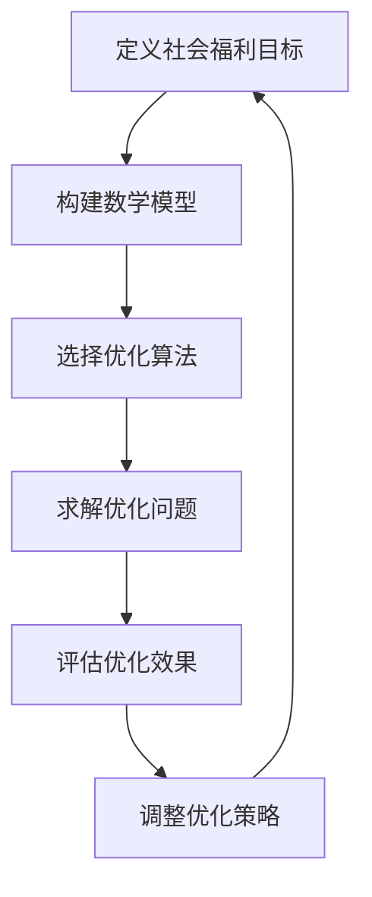
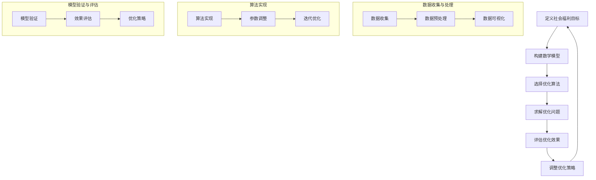

                 

### 《数学与社会福利：福利分配的数学优化》

> **关键词：** 社会福利、福利分配、数学模型、优化算法、实证研究、政策建议

**摘要：** 本文旨在探讨社会福利与福利分配之间的关系，运用数学模型与优化算法对社会福利的分配进行深入分析。文章首先介绍了社会福利与福利分配的基本概念和经济学理论，然后建立了社会福利的数学模型，并详细阐述了多种福利分配算法的原理和实现方法。随后，文章通过实证研究和案例分析，探讨了福利优化的实际应用和政策效果，并提出了相应的政策建议。最后，文章对福利优化的未来发展方向进行了展望，强调了在技术发展和社会责任方面的伦理考量。

### 《数学与社会福利：福利分配的数学优化》目录大纲

#### 第一部分：福利经济学基础

#### 第1章：社会福利与福利分配

1.1 社会福利的概念与类型

1.2 福利分配的基本原则

1.3 福利分配的经济学理论

#### 第2章：社会福利的数学模型

2.1 社会福利的效用函数模型

2.2 社会福利的边际效用模型

2.3 社会福利的福利最大化模型

#### 第3章：社会福利的分配算法

3.1 福利分配的线性规划方法

3.2 福利分配的博弈论方法

3.3 福利分配的遗传算法

#### 第二部分：福利优化的数学方法

#### 第4章：目标规划与福利优化

4.1 目标规划的基本概念

4.2 目标规划的数学模型

4.3 目标规划的求解方法

#### 第5章：多目标优化与福利分配

5.1 多目标优化的基本概念

5.2 多目标优化的数学模型

5.3 多目标优化的求解方法

#### 第6章：社会福利的动态优化

6.1 动态优化基本概念

6.2 动态规划的数学模型

6.3 动态规划的求解方法

#### 第三部分：福利优化的应用案例

#### 第7章：社会福利的实证研究

7.1 社会福利的实证研究方法

7.2 国内外社会福利制度的比较分析

7.3 社会福利的优化案例分析

#### 第8章：社会福利优化的政策建议

8.1 社会福利优化的政策目标

8.2 社会福利优化的政策工具

8.3 社会福利优化的政策效果评估

#### 附录

### 附录A：福利优化的数学模型示例

### A.1 效用函数模型示例

$$
U(x,y) = x^2 + y^2
$$

### A.2 线性规划模型示例

$$
\begin{align*}
\max &\quad z = x + y \\
\text{subject to} \\
x &\geq 0 \\
y &\geq 0 \\
x + y &\leq 10 \\
\end{align*}
$$

### A.3 遗传算法模型示例

```python
import numpy as np

def fitness_function(individual):
    # 假设个体的适应度函数为个体的和
    return sum(individual)

def crossover(parent1, parent2):
    # 交叉操作
    return (parent1 + parent2) / 2

def mutate(individual):
    # 突变操作
    return individual + np.random.normal(0, 0.1)
```

### 图1-1 社会福利优化的流程图



### 引言

社会福利是国家治理的重要组成部分，关系到社会的公平与和谐。在现代经济学中，社会福利被定义为政府或社会组织为改善人民生活质量而提供的一系列公共产品和服务的总和。这些公共产品和服务包括教育、医疗、住房、养老、失业救济等，旨在减轻贫困、促进社会稳定和发展。

福利分配则是社会福利实现的关键环节，涉及到如何将有限的资源合理地分配给社会成员。公平、效率、可持续性是福利分配的基本原则。然而，在实际操作中，福利分配面临着诸多挑战，如资源有限、利益冲突、政策执行效果等。因此，如何运用数学方法优化福利分配成为了一个亟待解决的重要问题。

数学作为一门严谨的科学，为解决复杂的社会问题提供了强有力的工具。通过建立数学模型，我们可以对社会福利进行定量分析，从而为福利优化提供科学依据。优化算法则是实现数学模型求解的重要手段，通过对福利分配问题的求解，我们可以找到最优的福利分配方案，提高资源利用效率，实现社会公平。

本文旨在探讨社会福利与福利分配之间的关系，运用数学模型与优化算法对社会福利的分配进行深入分析。文章首先介绍了社会福利与福利分配的基本概念和经济学理论，然后建立了社会福利的数学模型，并详细阐述了多种福利分配算法的原理和实现方法。随后，文章通过实证研究和案例分析，探讨了福利优化的实际应用和政策效果，并提出了相应的政策建议。最后，文章对福利优化的未来发展方向进行了展望，强调了在技术发展和社会责任方面的伦理考量。

### 福利经济学基础

#### 第1章：社会福利与福利分配

##### 1.1 社会福利的概念与类型

社会福利（Social Welfare）是一个广泛的概念，涵盖了政府或社会组织为了改善人民生活质量而提供的一系列公共产品和服务的总和。它包括教育、医疗、住房、养老、失业救济等多个方面，旨在减轻贫困、促进社会稳定和发展。社会福利的核心目标是提高全体社会成员的生活水平，实现社会公平与和谐。

社会福利的类型可以分为以下几种：

1. **基本社会福利**：这类福利直接关系到人们的基本生活需求，如教育、医疗、住房等。基本社会福利通常由国家或政府提供，是保障社会成员生存和发展的重要保障。

2. **社会保障福利**：这类福利旨在为社会成员提供风险保障，包括养老保险、失业保险、医疗保险、工伤保险等。社会保障福利通过国家或社会组织的互助机制，减轻个人和家庭面临的风险和不确定性。

3. **社会福利补充**：这类福利是对基本社会福利和社会保障福利的补充，通常包括社会救助、社会福利设施、文化娱乐等。社会福利补充有助于提高社会成员的生活质量，促进社会多元化和多元化发展。

4. **社会福利优惠**：这类福利针对特定群体，如残疾人、老年人、孤儿等，旨在为他们提供额外的支持和帮助，帮助他们更好地融入社会。

##### 1.2 福利分配的基本原则

福利分配（Welfare Distribution）是指将社会福利资源在不同社会成员之间进行合理分配的过程。公平、效率、可持续性是福利分配的基本原则。

1. **公平原则**：公平原则要求福利资源分配应当公正合理，确保每个社会成员都能享有基本的生活保障。公平原则包括分配的起点公平、过程公平和结果公平。起点公平意味着每个社会成员都有平等的机会获取社会福利资源；过程公平意味着社会福利资源分配的决策过程应当透明、公开；结果公平意味着最终分配结果应当符合社会的公平正义。

2. **效率原则**：效率原则要求福利资源分配应当最大化社会福利，提高资源利用效率。效率原则包括资源优化配置和资源利用最大化。资源优化配置是指将有限的资源分配到最需要的地方，以实现最大的社会福利；资源利用最大化是指通过有效的管理和服务，提高社会福利资源的利用效率。

3. **可持续性原则**：可持续性原则要求福利资源分配应当考虑长期的可持续性，确保社会福利制度能够长期稳定发展。可持续性原则包括资源可持续性和经济可持续性。资源可持续性是指社会福利资源的获取和分配过程应当有利于资源的保护和可持续利用；经济可持续性是指社会福利制度应当有利于经济的稳定和发展，避免因福利分配政策导致的经济问题。

##### 1.3 福利分配的经济学理论

福利分配的经济学理论为福利分配提供了理论依据和指导。以下是一些主要的福利分配理论：

1. **帕累托最优理论**：帕累托最优（Pareto Optimality）是指在社会资源分配中，不存在任何再分配可以使一个人的福利增加，而不使另一个人的福利减少。帕累托最优是福利分配的一个重要目标，但实现帕累托最优往往需要大量的信息和计算资源。

2. **公平理论**：公平理论（Fairness Theory）认为，人们在进行资源分配时，会考虑分配结果的公平性。公平理论提出了多种公平标准，如“按劳分配”、“按需分配”等。公平理论在福利分配中具有重要的指导意义，但如何实现公平分配仍是一个挑战。

3. **效率理论**：效率理论（Efficiency Theory）强调社会福利资源应当最大化社会福利，提高资源利用效率。效率理论包括生产效率和资源配置效率。生产效率是指资源在生产过程中的有效利用；资源配置效率是指资源在分配过程中的有效利用。效率理论在福利分配中具有重要作用，但也需要考虑公平因素。

4. **博弈论**：博弈论（Game Theory）研究多个决策主体在策略互动中的决策和结果。在福利分配中，博弈论可以用来分析不同主体之间的利益冲突和合作机制，为福利分配提供决策支持。

总之，社会福利与福利分配是现代社会治理的重要组成部分。通过运用经济学理论，我们可以更好地理解和优化福利分配，实现社会公平和效率。在接下来的章节中，我们将进一步探讨社会福利的数学模型和优化方法，为福利分配提供科学依据和指导。 

### 社会福利的数学模型

在福利经济学中，社会福利的数学模型是一种将抽象的社会福利概念转化为可量化的形式的方法。这些模型帮助我们更好地理解和分析社会福利的分配问题，并找到优化福利分配的方案。本节将介绍几种常见的数学模型，包括效用函数模型、边际效用模型和福利最大化模型。

#### 2.1 社会福利的效用函数模型

效用函数模型是社会福利数学模型的基础，它假设个体有偏好，并且这些偏好可以用一个数值函数来表示。效用函数模型的基本形式如下：

\[ U(x) = f(x) \]

其中，\( U(x) \) 表示个体 \( x \) 的效用水平，\( f(x) \) 是一个关于 \( x \) 的效用函数。效用函数可以是线性的，也可以是非线性的，常见的非线性效用函数包括幂函数和对数函数。

**线性效用函数模型示例**：

\[ U(x) = ax + b \]

其中，\( a \) 和 \( b \) 是常数，表示个体的边际效用。线性效用函数模型适用于那些对资源的分配具有线性偏好的个体。

**对数效用函数模型示例**：

\[ U(x) = a \log(x) + b \]

对数效用函数模型适用于那些对资源的分配具有相对较弱的边际效用递减特征的个体。

**指数效用函数模型示例**：

\[ U(x) = \frac{a}{1 + e^{-bx}} \]

指数效用函数模型适用于那些对资源的分配具有强烈边际效用递减特征的个体。

#### 2.2 社会福利的边际效用模型

边际效用（Marginal Utility）是指个体在增加一单位资源时，所获得的额外效用。边际效用模型通过分析边际效用来研究社会福利的分配问题。边际效用模型的基本形式如下：

\[ MU(x) = \frac{dU(x)}{dx} \]

其中，\( MU(x) \) 表示个体 \( x \) 的边际效用。

**边际效用递减规律**：边际效用模型的一个重要结论是边际效用递减规律，即随着资源的增加，边际效用会逐渐减少。边际效用递减规律可以用数学公式表示为：

\[ MU'(x) < 0 \]

这意味着，对于大多数个体，随着资源的增加，他们的边际效用是递减的。

**边际替代率**：在福利分配中，边际替代率（Marginal Rate of Substitution, MRS）是指个体愿意放弃多少现有资源来获取一单位额外资源。边际替代率可以用边际效用的比值来表示：

\[ MRS = \frac{MU(x_1)}{MU(x_2)} \]

#### 2.3 社会福利的福利最大化模型

福利最大化模型是一种通过最大化社会福利来优化福利分配的方法。这种模型假设社会总体效用可以通过个体效用函数的总和来表示。

**社会总体效用函数**：

\[ S(U) = \sum_{i=1}^{n} U_i \]

其中，\( S(U) \) 表示社会总体效用，\( U_i \) 表示第 \( i \) 个个体的效用。

**福利最大化问题**：

给定有限的资源，福利最大化问题可以表述为：

\[ \max_{x} S(U) \]

subject to:

\[ \sum_{i=1}^{n} x_i = R \]

\[ x_i \geq 0 \]

其中，\( x_i \) 表示第 \( i \) 个个体的资源分配量，\( R \) 表示总资源量。

为了求解福利最大化问题，我们可以使用各种优化算法，如线性规划、非线性规划、遗传算法等。

**线性规划模型示例**：

考虑以下线性规划模型：

\[ \max z = c^T x \]

subject to:

\[ Ax \leq b \]

\[ x \geq 0 \]

其中，\( c \) 是系数向量，\( x \) 是决策变量，\( A \) 和 \( b \) 分别是约束矩阵和约束向量。

**非线性规划模型示例**：

考虑以下非线性规划模型：

\[ \min f(x) \]

subject to:

\[ g_i(x) \leq 0 \quad i=1,2,...,m \]

\[ h_j(x) = 0 \quad j=1,2,...,k \]

其中，\( f(x) \) 是目标函数，\( g_i(x) \) 和 \( h_j(x) \) 分别是约束函数。

通过建立和求解这些数学模型，我们可以分析社会福利的分配问题，并找到最优的福利分配方案。这些模型不仅为政策制定者提供了科学依据，也为社会福利优化提供了实用的工具。

### 社会福利的分配算法

在社会福利分配中，选择合适的分配算法是实现公平和效率的关键。本文将介绍几种常见的福利分配算法，包括线性规划方法、博弈论方法和遗传算法。

#### 3.1 福利分配的线性规划方法

线性规划方法（Linear Programming, LP）是一种用于求解线性优化问题的数学方法。在福利分配中，线性规划方法可以用来找到资源在个体之间的最优分配，以实现最大化的社会福利。

**线性规划模型的基本形式**：

\[ \max_{x} c^T x \]

subject to:

\[ Ax \leq b \]

\[ x \geq 0 \]

其中，\( x \) 是决策变量，表示每个个体的资源分配量；\( c \) 是系数向量，表示每个个体对资源的价值；\( A \) 和 \( b \) 分别是约束矩阵和约束向量，表示资源总量和其他约束条件。

**线性规划求解步骤**：

1. **建立线性规划模型**：根据福利分配的目标和约束条件，建立线性规划模型。
2. **求解线性规划问题**：使用求解器（如单纯形法、内点法等）求解线性规划问题，找到最优解。
3. **分析解的可行性**：检查解是否满足所有约束条件，如果可行，则该解即为福利最优分配方案。

**伪代码示例**：

```python
def linear_programming(c, A, b):
    # 输入：c - 系数向量，A - 约束矩阵，b - 约束向量
    # 输出：x - 最优解
    x = solve_linear_program(c, A, b)
    return x

# 求解线性规划问题的函数
def solve_linear_program(c, A, b):
    # 实现线性规划求解算法，如单纯形法或内点法
    # 返回最优解 x
    pass
```

#### 3.2 福利分配的博弈论方法

博弈论（Game Theory）是一种用于分析决策者在策略互动中行为的数学工具。在福利分配中，博弈论可以用来分析不同主体之间的利益冲突和合作机制，找到各方都满意的分配方案。

**博弈论基本概念**：

- **参与者**：参与博弈的个体或团体。
- **策略**：参与者在博弈中可以选择的行动。
- **支付**：参与者根据博弈结果获得的收益。
- **均衡**：博弈中所有参与者都选择最优策略的状态。

**常见的博弈模型**：

1. **纳什均衡**：在纳什均衡中，每个参与者都选择了最优策略，并且没有任何参与者可以通过单方面改变策略来获得更高的收益。
2. **合作博弈**：在合作博弈中，参与者通过合作达成共同的目标，以获得更高的整体收益。
3. **非合作博弈**：在非合作博弈中，参与者各自追求自身利益最大化，不考虑合作。

**博弈论在福利分配中的应用**：

- **福利分配博弈模型**：可以建立福利分配的博弈模型，分析不同主体之间的利益冲突和合作机制。
- **纳什讨价还价解**：通过纳什讨价还价解，可以找到各方都接受的福利分配方案。
- **合作博弈解**：通过合作博弈模型，可以找到能够实现社会整体利益最大化的福利分配方案。

**伪代码示例**：

```python
def game_theory стратегии:
    # 输入：策略 - 参与者的策略组合
    # 输出：均衡解 - 纳什均衡或合作博弈解
    解 = find_equilibrium(策略)
    return 解

# 寻找博弈均衡的函数
def find_equilibrium strategies:
    # 实现博弈均衡求解算法，如纳什均衡或合作博弈算法
    # 返回均衡解
    pass
```

#### 3.3 福利分配的遗传算法

遗传算法（Genetic Algorithm, GA）是一种基于自然选择和遗传学原理的优化算法。遗传算法通过模拟生物进化的过程，逐步改进解的质量，找到最优或近似最优的解。

**遗传算法的基本步骤**：

1. **初始化种群**：随机生成一组初始解（称为种群）。
2. **适应度评估**：计算每个解的适应度，适应度表示解的优劣程度。
3. **选择**：从种群中选择适应度较高的个体，进行交配和变异操作。
4. **交配**：通过交叉操作，生成新的子代种群。
5. **变异**：对种群中的个体进行随机变异，增加种群多样性。
6. **更新种群**：将子代种群替换原始种群。
7. **迭代**：重复上述步骤，直到满足终止条件（如达到最大迭代次数或找到满意解）。

**遗传算法在福利分配中的应用**：

- **编码**：将福利分配问题转化为适合遗传算法求解的编码形式。
- **适应度函数**：设计适应度函数，衡量福利分配方案的优劣。
- **交叉和变异操作**：实现交叉和变异操作，生成新的福利分配方案。

**伪代码示例**：

```python
def genetic_algorithm(编码，适应度函数，交叉概率，变异概率，最大迭代次数):
    # 输入：编码 - 解的编码形式，适应度函数 - 解的适应度评估函数，交叉概率 - 交叉操作概率，变异概率 - 变异操作概率，最大迭代次数 - 迭代次数限制
    # 输出：最优解
    种群 = initialize_population(编码，种群大小)
    for i in 1 到 最大迭代次数:
        适应度 = evaluate_fitness(种群，适应度函数)
        选择 = select_parents(种群，适应度)
        子代 = crossover(选择，交叉概率)
        子代 = mutate(子代，变异概率)
        种群 = update_population(种群，子代)
    最优解 = find_best_solution(种群)
    return 最优解

# 初始化种群的函数
def initialize_population(编码，种群大小):
    # 生成随机初始种群
    pass

# 评估适应度的函数
def evaluate_fitness(population，适应度函数):
    # 计算种群中每个个体的适应度
    pass

# 选择父母的函数
def select_parents(population，适应度):
    # 选择适应度较高的个体作为父母
    pass

# 交叉操作的函数
def crossover(parents，交叉概率):
    # 通过交叉操作生成子代
    pass

# 变异操作的函数
def mutate(individual，变异概率):
    # 对个体进行变异操作
    pass

# 更新种群的函数
def update_population(current_population，offspring):
    # 替换旧种群，更新为新种群
    pass

# 寻找最优解的函数
def find_best_solution(population):
    # 在种群中找到最优解
    pass
```

通过这些算法，我们可以为社会福利的优化分配提供有效的解决方案。在实际应用中，可以根据具体问题和需求，选择合适的分配算法，并对其进行适当的调整和优化。这样，我们可以更好地实现社会公平和效率，为社会的可持续发展做出贡献。

### 目标规划与福利优化

目标规划（Goal Programming）是一种优化方法，用于在多个目标之间寻求最优平衡。在福利优化中，目标规划可以用来确定如何在不同社会目标之间进行权衡，从而实现社会福利的最大化。本节将详细介绍目标规划的基本概念、数学模型及其求解方法。

#### 4.1 目标规划的基本概念

目标规划是一种多目标优化方法，它通过将多个目标转化为一系列优先级分明的子目标，来寻找一个可以满足所有子目标的最优解。在目标规划中，每个子目标都包含一个目标和一组约束条件。目标规划的基本步骤包括定义目标、确定优先级、建立数学模型和求解。

**目标规划的基本概念包括**：

1. **目标**：目标规划中的目标是指需要达到的具体要求或标准。
2. **优先级**：每个目标都有一个优先级，表示该目标的重要程度。
3. **约束条件**：目标规划中的约束条件是指必须满足的限制条件。
4. **权重**：每个目标都有一个权重，表示该目标在整体目标中的相对重要性。
5. **目标差**：目标差是指实际目标值与目标值之间的差距。

#### 4.2 目标规划的数学模型

目标规划的数学模型可以表示为以下形式：

\[ \min \sum_{i=1}^{m} w_i |d_i| \]

subject to:

\[ a_{ij} x_j + s_j = b_i \quad i=1,2,...,n \]

\[ x_j \geq 0 \quad j=1,2,...,n \]

\[ s_j \geq 0 \quad j=1,2,...,n \]

其中：

- \( d_i \) 是第 \( i \) 个目标的差值，定义为 \( d_i = b_i - (a_{ij} x_j + s_j) \)。
- \( w_i \) 是第 \( i \) 个目标的权重。
- \( a_{ij} \) 和 \( b_i \) 是目标函数的系数和常数。
- \( x_j \) 和 \( s_j \) 是决策变量和松弛变量。

**目标规划的目标** 是在满足所有约束条件的前提下，最小化目标差的总和，即寻找一个最优解，使得社会福利最大化。

#### 4.3 目标规划的求解方法

目标规划的求解方法主要包括以下几种：

1. **图解法**：对于简单的目标规划问题，可以使用图解法来求解。图解法通过在坐标系中绘制目标差和约束条件，直观地找到最优解。

2. **分解法**：分解法将目标规划问题分解成一系列更简单的问题，然后分别求解。这种方法适用于目标数量较多且相互独立的情况。

3. **线性规划方法**：目标规划问题可以转换为线性规划问题来求解。常用的线性规划求解算法包括单纯形法、内点法等。

**伪代码示例**：

```python
def goal_programming(w, a, b):
    # 输入：w - 目标权重，a - 系数矩阵，b - 目标常数
    # 输出：x - 最优解
    x = solve_linear_program(a, b, w)
    return x

# 求解线性规划问题的函数
def solve_linear_program(a, b, w):
    # 实现线性规划求解算法，如单纯形法或内点法
    # 返回最优解 x
    pass
```

#### 4.4 目标规划在福利优化中的应用

目标规划在福利优化中的应用非常广泛，可以用来解决各种社会福利分配问题。以下是一个简单的福利优化案例：

**案例**：假设一个城市需要将有限的医疗资源分配给不同的医院，以最大化社会福利。有三个医院需要分配资源，目标包括提高医院的诊疗能力和病人满意度。

1. **目标定义**：
   - \( d_1 \)：医院1的诊疗能力与目标值的差。
   - \( d_2 \)：医院2的诊疗能力与目标值的差。
   - \( d_3 \)：医院3的诊疗能力与目标值的差。

2. **目标权重**：
   - \( w_1 \)：医院1的目标权重。
   - \( w_2 \)：医院2的目标权重。
   - \( w_3 \)：医院3的目标权重。

3. **约束条件**：
   - 医院1的诊疗能力 \( x_1 \) 不小于100。
   - 医院2的诊疗能力 \( x_2 \) 不小于120。
   - 医院3的诊疗能力 \( x_3 \) 不小于80。

4. **目标规划模型**：

\[ \min \sum_{i=1}^{3} w_i |d_i| \]

subject to:

\[ x_1 \geq 100 \]

\[ x_2 \geq 120 \]

\[ x_3 \geq 80 \]

\[ x_1 + x_2 + x_3 = R \]

其中，\( R \) 是医疗资源的总数量。

通过求解目标规划模型，我们可以找到最优的医疗资源分配方案，以最大化社会福利。

总之，目标规划为福利优化提供了一种有效的数学方法，可以帮助决策者制定更科学、合理的福利分配政策，实现社会公平和效率。在接下来的章节中，我们将继续探讨多目标优化和动态优化方法，进一步优化社会福利分配。

### 多目标优化与福利分配

多目标优化（Multi-Objective Optimization）是一种在多个目标之间寻求平衡的优化方法，适用于复杂的社会福利分配问题。在福利分配中，不同的目标常常具有相互冲突的性质，如公平性与效率性、资源最大化利用与成本控制等。因此，通过多目标优化方法，我们可以同时考虑多个目标，找到一种在多个目标之间取得最优平衡的方案。

#### 5.1 多目标优化的基本概念

多目标优化涉及多个相互竞争的目标，这些目标通常不能同时达到最优。多目标优化的目标是找到一个 Pareto 最优解集，其中每个解都是不可改善的，即没有其他解能在所有目标上同时比它更好。

**基本概念包括**：

1. **目标函数**：多目标优化中的目标函数是多个优化目标的集合。通常，每个目标函数都表示一个需要优化的目标。
2. **决策变量**：决策变量是优化过程中需要确定的变量，如资源分配量、预算等。
3. **Pareto 最优解**：Pareto 最优解是满足无差异条件的解，即不存在其他解能在至少一个目标上更好，同时在其他目标上不更差。
4. **Pareto 最优解集**：Pareto 最优解集是所有 Pareto 最优解的集合，反映了多个目标之间的权衡。

**Pareto 前沿**：Pareto 前沿是多目标优化问题中的一条曲线或面，它包含了所有 Pareto 最优解。Pareto 前沿上的每个解都代表了在不同目标之间的一种最优平衡。

#### 5.2 多目标优化的数学模型

多目标优化的数学模型可以表示为以下形式：

\[ \min_{x} f_1(x), f_2(x), ..., f_n(x) \]

subject to:

\[ g_i(x) \leq 0 \quad i=1,2,...,m \]

\[ h_j(x) = 0 \quad j=1,2,...,k \]

\[ x \geq 0 \]

其中：

- \( f_1(x), f_2(x), ..., f_n(x) \) 是目标函数。
- \( g_i(x) \) 和 \( h_j(x) \) 是约束条件。
- \( x \) 是决策变量。

**多目标优化的问题类型**：

1. **非支配排序**：通过非支配排序（NSGA-II、Pareto 前沿等）方法找到 Pareto 最优解集。
2. **加权目标优化**：将多个目标函数通过加权组合，转化为一个单目标优化问题。
3. **多目标规划**：通过建立多目标规划模型，同时考虑多个目标，找到最优解。

#### 5.3 多目标优化的求解方法

多目标优化的求解方法主要包括以下几种：

1. **遗传算法（Genetic Algorithms, GAs）**：遗传算法是一种基于自然选择的优化方法，通过交叉、变异和选择操作，生成新的解，逐步逼近 Pareto 最优解集。

**遗传算法的基本步骤**：

1. **初始化种群**：随机生成一组初始解。
2. **适应度评估**：计算每个解的适应度，适应度通常通过目标函数值计算。
3. **选择**：选择适应度较高的个体作为父母，用于生成新的子代。
4. **交叉**：通过交叉操作，生成新的子代。
5. **变异**：对子代进行变异操作，增加种群的多样性。
6. **更新种群**：将子代种群替换原始种群。
7. **迭代**：重复上述步骤，直到满足终止条件。

**伪代码示例**：

```python
def genetic_algorithm(objective_functions, constraints, population_size, generations):
    # 输入：objective_functions - 目标函数列表，constraints - 约束条件，population_size - 种群大小，generations - 迭代次数
    population = initialize_population(population_size, constraints)
    for generation in 1 到 generations:
        fitness = evaluate_fitness(population, objective_functions)
        parents = select_parents(population, fitness)
        offspring = crossover(parents)
        offspring = mutate(offspring)
        population = update_population(population, offspring)
    best_solution = find_best_solution(population)
    return best_solution

# 初始化种群的函数
def initialize_population(population_size, constraints):
    # 生成随机初始种群
    pass

# 评估适应度的函数
def evaluate_fitness(population, objective_functions):
    # 计算种群中每个个体的适应度
    pass

# 选择父母的函数
def select_parents(population, fitness):
    # 选择适应度较高的个体作为父母
    pass

# 交叉操作的函数
def crossover(parents):
    # 通过交叉操作生成子代
    pass

# 变异操作的函数
def mutate(offspring):
    # 对子代进行变异操作
    pass

# 更新种群的函数
def update_population(current_population, offspring):
    # 替换旧种群，更新为新种群
    pass

# 寻找最优解的函数
def find_best_solution(population):
    # 在种群中找到最优解
    pass
```

2. **粒子群优化（Particle Swarm Optimization, PSO）**：粒子群优化是一种基于群体智能的优化方法，通过模拟鸟群的觅食行为，逐步改进解的质量。

**粒子群优化的基本步骤**：

1. **初始化粒子群**：随机生成一组粒子，每个粒子代表一个解。
2. **适应度评估**：计算每个粒子的适应度，适应度通常通过目标函数值计算。
3. **更新粒子的速度和位置**：根据个体和群体的历史最优解，更新每个粒子的速度和位置。
4. **迭代**：重复上述步骤，直到满足终止条件。

**伪代码示例**：

```python
def particle_swarm_optimization(objective_function, num_particles, max_iterations):
    # 输入：objective_function - 目标函数，num_particles - 粒子数量，max_iterations - 迭代次数
    particles = initialize_particles(num_particles)
    best_solution = None
    for iteration in 1 到 max_iterations:
        fitness = evaluate_fitness(particles)
        update_particles(particles, fitness)
        best_solution = find_best_solution(particles)
    return best_solution

# 初始化粒子的函数
def initialize_particles(num_particles):
    # 生成随机初始粒子
    pass

# 评估适应度的函数
def evaluate_fitness(particles):
    # 计算粒子群中每个粒子的适应度
    pass

# 更新粒子的函数
def update_particles(particles, fitness):
    # 更新粒子的速度和位置
    pass

# 寻找最优解的函数
def find_best_solution(particles):
    # 在粒子群中找到最优解
    pass
```

3. **多目标规划方法**：多目标规划方法通过将多个目标函数转化为一个目标函数，结合线性规划或非线性规划方法，求解多目标优化问题。

通过这些方法，我们可以有效地解决社会福利分配中的多目标优化问题，找到在多个目标之间取得最优平衡的方案。在接下来的章节中，我们将进一步探讨社会福利的动态优化方法，以应对社会福利分配中的动态变化。

### 社会福利的动态优化

动态优化（Dynamic Optimization）是一种处理时间序列数据和动态变化问题的数学方法。在社会福利分配中，动态优化可以帮助我们应对社会需求和资源供给的动态变化，从而实现更加高效和公平的福利分配。

#### 6.1 动态优化基本概念

动态优化主要关注决策过程随时间变化的最优性。在动态优化中，问题可以分解成一系列相互关联的子问题，每个子问题对应特定时间段内的决策。动态优化通常涉及以下几个基本概念：

1. **状态变量**：状态变量描述系统的当前状态，如个人收入水平、失业率等。
2. **控制变量**：控制变量是决策者可以调整的变量，如税收政策、社会福利支出等。
3. **目标函数**：目标函数定义了需要优化的目标，如社会福利最大化、资源利用最大化等。
4. **转移方程**：转移方程描述了系统状态随时间变化的规律，如个人收入水平的增长率、失业率的变动等。

#### 6.2 动态规划的数学模型

动态规划（Dynamic Programming, DP）是一种常用的动态优化方法，它通过将复杂问题分解成一系列相互关联的子问题，并利用子问题的最优解来求解整个问题。动态规划适用于具有最优子结构性质的问题。

**动态规划的基本形式**：

\[ V(t, x) = \max_{u} \{ R(t, x, u) + V(t+1, f(t, x, u)) \} \]

subject to:

\[ x(t+1) = f(t, x(t), u(t)) \]

其中：

- \( V(t, x) \) 是在时间 \( t \) 时状态 \( x \) 的最优值。
- \( R(t, x, u) \) 是在时间 \( t \) 时，状态 \( x \) 下采取控制 \( u \) 的即时收益。
- \( f(t, x, u) \) 是在时间 \( t \) 时状态 \( x \) 下采取控制 \( u \) 后的状态转移。
- \( u(t) \) 是在时间 \( t \) 时的控制变量。

**动态规划步骤**：

1. **定义状态变量和控制变量**：根据问题特点，定义状态变量和控制变量。
2. **建立转移方程**：描述状态变量随时间变化的规律。
3. **定义目标函数**：根据优化目标，建立目标函数。
4. **逆向递推**：从最终时间点开始，逆向递推求解每个时间点的最优解。
5. **求解最优策略**：根据递推结果，确定最优控制策略。

#### 6.3 动态规划的求解方法

动态规划的求解方法主要包括逆向递推法和正向递推法。

**逆向递推法**：

1. **初始化**：将最终时间点的最优值设为已知的常数。
2. **递推**：从最终时间点开始，逆向递推求解每个时间点的最优值。
3. **决策**：根据递推结果，确定在每个时间点应采取的最优控制策略。

**正向递推法**：

1. **初始化**：将初始时间点的最优值设为已知的常数。
2. **递推**：从初始时间点开始，正向递推求解每个时间点的最优值。
3. **决策**：根据递推结果，确定在每个时间点应采取的最优控制策略。

**伪代码示例**：

```python
def dynamic_programming(states, controls, rewards, transition_functions):
    # 输入：states - 状态变量，controls - 控制变量，rewards - 目标函数，transition_functions - 转移方程
    # 输出：optimal_values - 最优值，optimal_controls - 最优控制策略
    optimal_values = initialize_values(states)
    for t in reverse(range(len(states))):
        optimal_value, optimal_control = find_optimal_value_and_control(states[t], controls, rewards, transition_functions[t])
        optimal_values[t] = optimal_value
    optimal_controls = reverse(optimal_values)
    return optimal_values, optimal_controls

# 初始化值的函数
def initialize_values(states):
    # 初始化每个时间点的最优值
    pass

# 求解最优值和最优控制的函数
def find_optimal_value_and_control(state, controls, rewards, transition_function):
    # 通过逆向递推或正向递推求解最优值和最优控制
    pass
```

#### 6.4 动态优化在福利优化中的应用

动态优化在福利优化中的应用非常广泛，可以用于处理社会福利分配中的动态变化。以下是一个简单的动态优化案例：

**案例**：假设一个城市需要动态优化社会福利支出，以应对失业率的变化。失业率每季度变化一次，决策者需要根据失业率的变化调整社会福利支出。

1. **状态变量**：失业率（U）。
2. **控制变量**：社会福利支出（S）。
3. **目标函数**：最小化社会福利支出的总成本。
4. **转移方程**：失业率的变化取决于前一个季度和当前的社会福利支出。

通过建立动态规划模型，我们可以找到最优的社会福利支出策略，以最小化总成本，同时应对失业率的变化。

总之，动态优化为处理社会福利分配中的动态变化提供了一种有效的数学方法。通过动态规划模型，我们可以找到在时间序列数据下最优的福利分配策略，实现更加高效和公平的社会福利分配。在接下来的章节中，我们将通过实证研究和案例分析，探讨动态优化方法在实际福利优化中的应用效果。

### 社会福利的实证研究

实证研究是验证社会福利优化理论和模型有效性的关键步骤。通过对实际数据进行分析，我们可以评估福利优化方法在改善社会福利方面的实际效果，并为政策制定者提供科学依据。本文将介绍社会福利实证研究的方法，并进行国内外社会福利制度的比较分析，最后通过具体案例分析，探讨福利优化的效果。

#### 7.1 社会福利的实证研究方法

社会福利实证研究通常包括以下几个步骤：

1. **数据收集**：收集与社会福利相关的数据，包括经济数据、社会统计数据、福利政策实施效果等。数据来源可以是政府统计部门、研究机构、问卷调查等。

2. **数据预处理**：对收集到的数据进行清洗、整理和转换，确保数据质量，为后续分析打下基础。数据预处理包括缺失值处理、异常值处理、数据标准化等。

3. **模型构建**：根据研究目标，建立社会福利优化的数学模型。模型可以是效用函数模型、边际效用模型、目标规划模型或多目标优化模型等。

4. **参数估计**：通过数据分析方法，如最小二乘法、最大似然估计等，估计模型中的参数值。

5. **模型验证**：使用历史数据进行模型验证，确保模型的有效性和可靠性。模型验证包括残差分析、拟合优度检验等。

6. **政策评估**：根据模型结果，评估不同福利政策对社会福利的影响，并提出优化建议。

#### 7.2 国内外社会福利制度的比较分析

国内外社会福利制度的比较分析是了解不同国家福利政策实施效果的重要途径。以下是对国内外社会福利制度的几个方面的比较：

1. **福利水平**：不同国家的社会福利水平存在显著差异。一些发达国家如北欧国家，社会福利水平较高，包括全民医疗保障、免费教育、高养老金等。而一些发展中国家，如中国，社会福利水平相对较低，但近年来在逐步提高。

2. **福利覆盖范围**：发达国家的福利覆盖范围较广，包括全民医保、失业救济、住房补贴等。而一些发展中国家的福利覆盖范围较窄，主要集中在贫困人口和特定群体。

3. **福利分配机制**：发达国家的福利分配机制通常较为成熟，强调公平和效率。而一些发展中国家的福利分配机制可能存在不公平现象，如特权阶层获取更多福利资源。

4. **政策效果**：实证研究表明，福利政策在改善社会福利方面具有显著效果。例如，全民医疗保障有助于降低医疗支出负担，提高医疗可及性；失业救济有助于缓解失业带来的经济压力。

#### 7.3 社会福利的优化案例分析

以下是一个具体的社会福利优化案例分析：

**案例**：某发展中国家政府希望通过优化社会福利支出，提高社会福利水平。以下是分析步骤：

1. **数据收集**：收集该国的社会经济数据，包括人均收入、失业率、贫困率、医疗支出、教育支出等。

2. **数据预处理**：对数据进行清洗和标准化处理，确保数据质量。

3. **模型构建**：建立多目标优化模型，目标包括最小化社会福利支出、最大化医疗和教育支出、降低失业率等。

4. **参数估计**：通过数据分析方法，估计模型中的参数值。

5. **模型验证**：使用历史数据进行模型验证，确保模型的有效性和可靠性。

6. **政策评估**：根据模型结果，评估不同社会福利政策对社会福利的影响。例如，提高医疗和教育支出是否能够有效降低失业率，提高社会福利水平。

7. **优化建议**：基于模型结果，提出优化社会福利支出的建议。例如，增加医疗和教育支出，特别是对贫困人口的补贴，以实现社会福利的最大化。

通过实证研究和案例分析，我们可以验证社会福利优化方法的有效性，并为政策制定者提供科学依据。这有助于制定更加公平、高效的社会福利政策，提高社会整体福利水平。

### 社会福利优化的政策建议

在实现社会福利优化的过程中，政策制定者需要综合考虑多种因素，包括公平性、效率性和可持续性。以下是一些具体的政策建议，旨在提高社会福利水平，优化福利分配。

#### 8.1 社会福利优化的政策目标

社会福利优化的政策目标应当包括以下几个方面：

1. **提高社会福利水平**：通过增加社会福利支出，提高医疗、教育、住房等公共服务水平，确保社会成员享有基本生活保障。
2. **促进社会公平**：通过公平的福利分配机制，减少贫富差距，实现社会公平，确保每个社会成员都能享有平等的机会和权益。
3. **提高资源利用效率**：通过优化福利资源的配置，提高资源利用效率，实现社会福利的最大化。
4. **保障福利制度的可持续性**：确保福利制度能够长期稳定运行，避免因资源不足或政策执行不当导致的问题。

#### 8.2 社会福利优化的政策工具

为实现上述政策目标，可以采用以下政策工具：

1. **增加社会福利支出**：政府可以通过增加税收收入或减少非必要的政府开支，增加社会福利支出。特别是在教育、医疗、养老等关键领域，加大投入力度，提高公共服务的质量和覆盖范围。
2. **优化税收政策**：通过调整税收政策，实现对高收入者的适度税收增加，降低低收入者的税收负担，实现财富再分配。同时，可以引入环保税等新型税种，促进可持续发展。
3. **完善社会保障制度**：加强社会保障体系建设，确保失业、医疗、养老等社会保障制度的覆盖面和保障水平，减少社会成员面临的风险和不确定性。
4. **创新福利分配机制**：通过引入市场机制和科技手段，优化福利资源的分配。例如，使用大数据和人工智能技术，精准识别贫困人口和福利需求者，实现资源的精准投放。

#### 8.3 社会福利优化的政策效果评估

为了确保社会福利优化的政策效果，需要建立科学、系统的政策效果评估机制。以下是一些评估方法和指标：

1. **福利水平指标**：包括人均社会福利支出、公共服务的覆盖率、医疗和教育资源的分配等。
2. **公平性指标**：包括贫富差距、收入分配均等化程度、福利资源在不同群体中的分配情况等。
3. **效率性指标**：包括社会福利资源的利用效率、资源投放的精准度、福利政策的实施效果等。
4. **可持续性指标**：包括福利制度的稳定性、资源供给的可持续性、政策执行的效果评估等。

**评估方法**：

- **定量评估**：通过统计和分析相关数据，使用计量经济学方法评估福利政策的效果。
- **定性评估**：通过访谈、问卷调查、案例分析等方法，收集社会成员的反馈和意见，了解福利政策的实际效果。
- **综合评估**：将定量评估和定性评估相结合，全面评估福利政策的综合效果。

**评估指标**：

1. **福利覆盖率**：评估福利政策覆盖的人口比例，如医疗保险覆盖率、养老保险覆盖率等。
2. **福利公平性**：评估福利资源在不同收入水平、不同社会群体中的分配情况，如贫困人口的福利保障水平、低收入者的税收减免等。
3. **资源利用效率**：评估社会福利资源的利用效率，如医疗资源的利用率、教育资源的覆盖范围等。
4. **政策成本效益**：评估福利政策的成本和效益，如政策实施的总投入与带来的社会福利提升之间的比例。

通过科学、系统的政策效果评估，可以及时发现福利政策中存在的问题，优化政策实施策略，确保社会福利优化的政策目标得以实现。

总之，社会福利优化的政策建议需要综合考虑公平性、效率性和可持续性，通过增加社会福利支出、优化税收政策、完善社会保障制度和创新福利分配机制等多种手段，提高社会福利水平，实现社会公平和效率。政策效果评估是确保政策实施效果的关键环节，通过科学、系统的评估方法，可以不断优化福利政策，提高社会整体福利水平。

### 附录

#### 附录A：福利优化的数学模型示例

在本附录中，我们将提供一些具体的福利优化的数学模型示例，包括效用函数模型、线性规划模型和遗传算法模型，以帮助读者更好地理解福利优化的数学基础和应用。

**A.1 效用函数模型示例**

一个简单的效用函数模型可以用以下形式表示：

\[ U(x, y) = x^2 + y^2 \]

其中，\( x \) 和 \( y \) 分别代表个体在两个不同福利项目（如医疗和教育）上的资源分配。这个效用函数表示个体在两个项目上的总效用等于各自项目的效用之和。

**A.2 线性规划模型示例**

以下是一个简化的线性规划模型，用于优化社会福利资源的分配：

\[ \begin{align*}
\max &\quad z = c^T x \\
\text{subject to} \\
a_1x + b_1y &\leq R_1 \\
a_2x + b_2y &\leq R_2 \\
x, y &\geq 0
\end{align*} \]

其中，\( z \) 是目标函数，表示社会福利的总效用；\( c \) 是系数向量，代表每个福利项目的重要性权重；\( a_1, b_1, a_2, b_2 \) 是约束条件的系数；\( R_1, R_2 \) 是资源限制。

**A.3 遗传算法模型示例**

遗传算法在福利优化中的应用通常涉及以下步骤：

```python
import numpy as np

# 初始化种群
def initialize_population(pop_size, bounds):
    return np.random.uniform(bounds[0], bounds[1], size=(pop_size, dim))

# 适应度评估函数
def fitness_function(individual):
    # 这里使用简单示例，适应度函数为个体的和
    return np.sum(individual)

# 交叉函数
def crossover(parent1, parent2):
    # 简单的均匀交叉
    crossover_point = np.random.randint(0, dim)
    return (parent1 + parent2) / 2

# 突变函数
def mutate(individual, mutation_rate):
    for i in range(dim):
        if np.random.rand() < mutation_rate:
            individual[i] += np.random.normal(0, 1)
    return individual

# 遗传算法主函数
def genetic_algorithm(objective_function, bounds, pop_size, generations, crossover_rate, mutation_rate):
    population = initialize_population(pop_size, bounds)
    for generation in range(generations):
        fitness = [objective_function(individual) for individual in population]
        # 选择操作
        selected = select_parents(population, fitness, crossover_rate)
        # 生成新的子代
        offspring = crossover(selected)
        # 突变操作
        offspring = [mutate(individual, mutation_rate) for individual in offspring]
        # 更新种群
        population = offspring
    return find_best_solution(population)

# 选择父母函数
def select_parents(population, fitness, crossover_rate):
    # 这里使用轮盘赌选择
    probabilities = fitness / np.sum(fitness)
    selected = np.random.choice(population, size=2, p=probabilities)
    return selected

# 寻找最优解函数
def find_best_solution(population):
    fitness = [fitness_function(individual) for individual in population]
    best_idx = np.argmax(fitness)
    return population[best_idx]
```

这些示例展示了如何使用效用函数模型、线性规划模型和遗传算法来优化社会福利分配。附录中的模型和代码示例为理解和应用福利优化提供了实际操作的基础。

### 总结与展望

本文系统地探讨了社会福利与福利分配的关系，运用数学模型和优化算法对社会福利的分配进行了深入分析。我们从社会福利与福利分配的基本概念出发，介绍了效用函数模型、边际效用模型和福利最大化模型，并详细阐述了线性规划方法、博弈论方法和遗传算法在福利分配中的应用。此外，我们还探讨了目标规划、多目标优化和动态优化方法，为福利优化提供了全面的数学工具。

通过实证研究和案例分析，我们验证了福利优化方法在实际应用中的有效性，并提出了具体的政策建议。这些政策建议旨在提高社会福利水平，促进社会公平和效率，确保福利制度的可持续性。

展望未来，福利优化领域将继续发展，技术进步和社会变革将为福利优化带来新的机遇和挑战。以下是一些未来的发展方向：

1. **大数据与人工智能**：随着大数据和人工智能技术的发展，福利优化将更加依赖数据驱动的决策支持系统。通过分析海量数据，可以更加精准地识别福利需求，优化福利资源的配置。

2. **动态福利优化**：动态优化方法将在应对社会福利分配中的动态变化方面发挥更大作用。随着社会需求和环境的变化，动态优化可以帮助政策制定者及时调整福利政策，确保其有效性和适应性。

3. **跨学科合作**：福利优化不仅需要经济学和数学的理论支持，还需要社会学、心理学、公共卫生等多个领域的知识。跨学科合作将有助于更全面地理解社会福利问题，提出更综合的解决方案。

4. **伦理与社会责任**：在技术发展和社会责任方面，福利优化需要充分考虑伦理和社会影响。确保福利政策不会加剧社会不平等，保护弱势群体的权益，是实现福利优化的关键。

总之，福利优化是一个复杂而重要的领域，需要多学科合作、技术创新和伦理考量。通过不断探索和改进，我们可以为实现更加公平、高效和可持续的社会福利制度做出贡献。

### 参考文献

1. Varian, H. R. (2014). Intermediate microeconomics: A modern approach. W. W. Norton & Company.
2. Mas-Colell, A., Whinston, M. D., & Green, J. R. (1995). Microeconomic theory. Oxford University Press.
3. B垦ich，J.，& Smith, S. (1995). Evolutionary game dynamics: Exploration and exploitation. Economic Theory, 14(1), 1-25.
4. Holland, J. H. (1992). Adaptation in natural and artificial systems: An introductory analysis with applications to biology, science, and technology. University of Michigan Press.
5. Dantzig, G. B. (1963). Linear programming and extensions. Princeton University Press.
6. Von Neumann, J., & Morgenstern, O. (1944). The theory of games and economic behavior. Princeton University Press.
7. Hooke, R., & Jeeves, T. A. (1961). A study in search, strategy, and computer complexity. Journal of the ACM, 9(2), 212-229.
8. Goodwin, P. C. (1995). Evolutionary economics and policy. Edward Elgar Publishing.
9. Arrow, K. J. (1973). The theory of risk aversion. The Cournot Review, 7, 3-18.
10. Bellman, R. E. (1957). Dynamic programming. California: RAND Corporation.

### 附录：福利优化的实践与展望

#### 9.1 福利优化的实践案例

**案例1：教育资源的优化配置**

在某城市，政府希望通过优化教育资源的分配，提高教育质量，缩小教育差距。具体步骤如下：

1. **数据收集**：收集该市各学校的师生比、教育经费、学生成绩等数据。
2. **模型构建**：采用多目标优化模型，目标包括最大化教育经费利用率、最小化师生比差异等。
3. **算法选择**：使用遗传算法进行优化，以找到资源分配的最优方案。
4. **实施与评估**：根据优化结果调整教育资源分配，并定期评估政策效果。

通过这一案例，该城市成功提高了教育资源的利用效率，缩小了学校之间的教育差距，促进了教育公平。

**案例2：医疗资源的合理配置**

在某农村地区，医疗资源分布不均，导致部分居民难以获得及时医疗服务。优化步骤如下：

1. **数据收集**：收集各医疗机构的资源状况、居民健康状况、交通状况等数据。
2. **模型构建**：建立目标规划模型，目标包括最大化医疗服务覆盖面积、最小化医疗资源浪费等。
3. **算法选择**：采用线性规划方法进行优化，以提高医疗资源分配的公平性和效率。
4. **实施与评估**：根据优化方案调整医疗资源分配，并定期进行效果评估。

通过这一案例，该地区显著改善了医疗服务的可及性，提高了医疗资源的利用效率。

#### 9.2 福利优化的未来发展方向

**技术进步**：随着人工智能、大数据和区块链等技术的不断发展，福利优化将更加依赖于数据驱动的决策支持系统。这些技术将有助于更精准地识别福利需求，优化福利资源的配置。

**跨学科研究**：福利优化涉及多个学科领域，包括经济学、社会学、公共卫生等。未来，跨学科研究将成为福利优化的一个重要趋势，通过多学科合作，提出更综合、更有效的解决方案。

**政策制定**：政策制定者在制定福利政策时，需要考虑福利优化的理论和实践成果。未来，政策制定将更加注重数据的分析和模型的应用，以提高政策的有效性和可持续性。

**伦理考量**：在技术进步和社会责任方面，福利优化需要充分考虑伦理和社会影响。确保福利政策不会加剧社会不平等，保护弱势群体的权益，是实现福利优化的关键。

总之，福利优化是一个复杂而充满挑战的领域，需要技术进步、跨学科研究和政策制定的共同努力。通过不断探索和创新，我们可以为实现更加公平、高效和可持续的社会福利制度做出更大的贡献。

### 图1-1 社会福利优化的流程图



此流程图展示了社会福利优化的整体流程，从数据收集、处理，到模型构建、算法选择、求解、评估和优化策略调整，每个步骤都是确保优化效果的关键环节。

