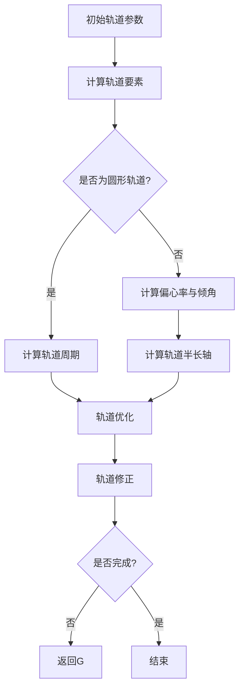

                 

### 引论与核心概念

在现代航天工程中，数学作为一门基础科学，其重要性不言而喻。从早期的火箭发射到复杂的行星际探索任务，数学模型和计算方法为航天器的轨道设计和控制提供了坚实的技术基础。本文将深入探讨数学在航天器轨道计算中的核心概念和应用，通过一系列章节的详细讲解，帮助读者理解数学在航天领域的广泛应用和深远影响。

航天器轨道计算不仅仅是计算轨道的数学问题，它涉及天体力学、动力学、数值分析等多个学科领域。通过本文的探讨，读者将了解到从基本的理论知识到高级的算法应用，数学在每一个环节中的重要作用。

本文将分为四个主要部分：

1. **引论与核心概念**：介绍数学在航天器轨道计算中的重要性，回顾相关历史和发展。
2. **轨道力学与计算方法**：详细阐述轨道力学原理、数值计算方法以及航天器轨道设计。
3. **数学模型与公式解析**：解析轨道力学中的数学模型，探讨开普勒定律、牛顿定律等核心公式。
4. **实践与应用**：展示航天器轨道计算的工程实践案例，讨论其在行星际探索中的应用。

通过这些部分的层层递进，读者将全面了解数学在航天器轨道计算中的核心概念和联系，掌握相关的数学模型和计算方法。

### 数学与航天器轨道计算的基本联系

数学作为一门研究数量、结构、变化和空间等概念的学科，其基本原理和思维方式在航天器轨道计算中扮演着至关重要的角色。首先，数学提供了精确描述物理现象和规律的工具，使得航天器的运动轨迹可以通过一系列数学模型进行模拟和预测。具体而言，数学模型和公式在航天器轨道计算中起到了以下几个关键作用：

1. **描述运动规律**：天体力学是研究天体之间相互作用和运动规律的科学，而这一科学的基础就是数学。开普勒定律、牛顿定律等经典数学模型，为我们描述行星、卫星以及其他天体在引力作用下的运动轨迹提供了理论基础。例如，开普勒定律通过数学公式描述了行星绕太阳运动的规律，为航天器的轨道设计提供了重要的参考。

2. **预测未来状态**：通过数学模型，我们可以根据航天器当前的状态（位置、速度等）预测其未来的运动轨迹。这种预测能力对于航天任务的成功至关重要。例如，在进行行星际探测任务时，科学家需要精确预测航天器在未来数月或数年内的运动轨迹，以确保任务能够按计划进行。

3. **优化轨道设计**：航天器的轨道设计是一个复杂的过程，涉及到轨道转移、轨道修正和轨道优化等多个方面。数学提供了优化算法和工具，使得科学家可以找到最优的轨道设计方案，提高航天任务的效率和可靠性。例如，通过牛顿-欧拉方法、龙格-库塔方法等数值计算方法，我们可以精确计算航天器的轨道，并进行必要的轨道修正。

4. **解决实际问题**：在航天器轨道计算中，常常会遇到各种复杂的实际问题，如大气阻力、非球形地球引力等。数学通过建立适当的数学模型，可以有效地解决这些问题。例如，通过线性回归和数值积分方法，我们可以计算航天器在复杂环境下的轨道变化，从而制定出合理的轨道修正策略。

总之，数学不仅是航天器轨道计算的基础，更是解决实际问题的有力工具。从理论模型到实际应用，数学在每一个环节都发挥着不可替代的作用，为航天工程的进步提供了强大的技术支持。

### 航天器轨道计算的历史与发展

航天器轨道计算的历史可以追溯到古代天文学家对天体运动的观察和记录。然而，随着科学技术的发展，特别是牛顿力学和开普勒定律的提出，航天器轨道计算的理论基础得以奠定。从古代天文学到现代航天技术，这一领域经历了多个重要的发展阶段。

在古代，天文学家通过观测和记录天体的运动，试图理解宇宙的规律。虽然他们的研究缺乏精确的数学模型，但这一工作为后世的科学研究打下了基础。古希腊天文学家如亚里士多德和托勒密，对行星和恒星的运动进行了描述，提出了早期的天体运动理论。

17世纪，牛顿的万有引力定律和开普勒定律的提出，标志着航天器轨道计算进入了一个新的阶段。牛顿通过万有引力定律，将天体运动与力学理论紧密结合，提供了描述天体运动的具体数学模型。开普勒定律则通过对行星运动的长期观测，揭示了行星轨道的基本规律。

19世纪，随着天体力学的发展，航天器轨道计算逐渐应用于实际工程中。科学家们开始利用计算机和数值计算方法，对航天器的轨道进行精确计算。这一时期，出现了多种数值积分方法和轨道优化算法，使得航天器轨道计算变得更加精确和高效。

20世纪中叶，随着航天技术的飞速发展，航天器轨道计算成为航天工程不可或缺的一部分。计算机技术的进步，使得复杂的轨道计算成为可能。NASA和其他航天机构，通过大量的实际项目，不断优化和改进轨道计算方法，为航天任务的成功提供了有力支持。

21世纪，随着人工智能和大数据技术的发展，航天器轨道计算迎来了新的机遇。通过机器学习和数据挖掘技术，科学家们可以更加准确地预测航天器的轨道变化，提高航天任务的可靠性和效率。此外，量子计算等新兴技术的应用，也为航天器轨道计算带来了新的可能性。

总的来说，航天器轨道计算的历史是一个不断进步和创新的过程。从古代的观测记录到现代的高精度计算，数学在这一领域发挥了不可替代的作用。未来，随着科技的进一步发展，航天器轨道计算将继续为航天事业的发展提供强大的支持。

### 数学在航天工程中的作用

数学在航天工程中扮演着至关重要的角色，贯穿了从设计到操作的各个环节。以下是数学在航天工程中发挥作用的几个关键方面：

1. **轨道设计**：航天器的轨道设计是确保任务成功的关键步骤。数学模型和公式，如开普勒定律和牛顿定律，为轨道设计提供了理论基础。通过这些模型，工程师可以计算出航天器在不同轨道上的运动状态，从而设计出最优的轨道方案。例如，地球同步轨道（GEO）的设计需要精确计算轨道高度、倾角和周期，以确保卫星能够保持稳定的地球同步状态。

2. **轨道控制**：航天器在轨运行过程中，需要不断地进行轨道修正，以应对各种外部干扰和误差。数学在轨道控制中发挥了重要作用。通过数值积分方法和优化算法，工程师可以计算出航天器的当前状态，并预测未来的运动轨迹。基于这些计算结果，航天器可以进行精确的轨道修正，确保任务按计划进行。例如，使用牛顿-欧拉方法和龙格-库塔方法，可以对航天器的运动进行实时预测和调整。

3. **环境预测**：航天器在轨道上运行时，需要应对复杂的环境变化，如太阳辐射、大气阻力和行星引力扰动等。数学模型和公式可以帮助工程师预测这些环境因素对航天器轨道的影响。例如，通过数值积分和线性回归方法，可以计算出大气阻力对航天器速度和高度的影响，从而进行相应的轨道修正。

4. **任务规划**：航天任务的规划需要考虑多个因素，如任务目标、资源分配和时间安排等。数学优化算法，如线性规划和非线性规划，为航天任务的规划提供了有效的方法。通过优化算法，可以找到最佳的任务执行方案，提高任务的效率和可靠性。例如，在深空探测任务中，使用优化算法可以计算出最佳的探测路径，最大限度地利用航天器的燃料和任务时间。

5. **风险评估**：航天任务具有高风险性，数学模型和统计方法在风险评估中发挥着重要作用。通过概率模型和蒙特卡罗模拟，可以评估航天任务中的各种风险因素，并提供决策支持。例如，通过分析航天器在轨运行中的故障概率和风险分布，可以制定出有效的风险应对策略。

总之，数学在航天工程中的应用涵盖了轨道设计、轨道控制、环境预测、任务规划和风险评估等多个方面。通过精确的数学模型和高效的计算方法，航天工程师可以更好地应对复杂的航天任务，确保航天工程的顺利进行。未来，随着数学和计算技术的发展，数学在航天工程中的作用将更加重要，为航天事业的进步提供更强大的支持。

## 天体力学基础

### 引力和天体运动

引力和天体运动是理解航天器轨道计算的核心概念。万有引力定律是描述两个质点之间引力大小和方向的物理定律，由艾萨克·牛顿在1687年提出。根据牛顿的万有引力定律，两个质点之间的引力大小与它们的质量乘积成正比，与它们之间距离的平方成反比。公式如下：

\[ F = G\frac{m_1m_2}{r^2} \]

其中，\( F \) 是引力，\( G \) 是万有引力常数（约为 \( 6.674 \times 10^{-11} \text{Nm}^2/\text{kg}^2 \)），\( m_1 \) 和 \( m_2 \) 是两个质点的质量，\( r \) 是它们之间的距离。

在航天器轨道计算中，万有引力定律可以用来计算航天器与地球或其他天体之间的引力作用。例如，地球对航天器的引力可以用来计算航天器的轨道高度和速度。当航天器在轨道上运动时，其受到的引力会导致其加速度，这个加速度可以通过万有引力定律计算得出：

\[ a = G\frac{M}{r^2} \]

其中，\( M \) 是地球的质量，\( r \) 是航天器到地球中心的距离。

开普勒定律是描述行星绕太阳运动规律的三个定律之一，由约翰内斯·开普勒在17世纪提出。开普勒第一定律表明，行星绕太阳的轨道是椭圆形的，太阳位于椭圆的一个焦点上。开普勒第二定律说明，行星在其轨道上的运动速度不是恒定的，当行星接近太阳时速度较快，远离太阳时速度较慢。开普勒第三定律则描述了行星轨道周期与其轨道半长轴之间的关系，公式如下：

\[ T^2 = k \cdot a^3 \]

其中，\( T \) 是行星轨道周期，\( a \) 是轨道半长轴，\( k \) 是一个常数，对于地球轨道，\( k \) 的值可以通过开普勒第三定律计算得出。

在航天器轨道计算中，开普勒定律可以用来预测航天器的轨道周期和轨道形状。例如，如果知道航天器的轨道半长轴，就可以根据开普勒第三定律计算出其轨道周期。这为航天器的轨道设计和预测提供了重要的理论依据。

### 开普勒定律与行星运动

开普勒定律是由德国天文学家约翰内斯·开普勒在17世纪提出的，用以描述行星绕太阳运动的基本规律。这些定律不仅揭示了行星运动的内在规律，也为航天器轨道计算提供了重要的理论基础。开普勒定律共有三条，下面将逐一介绍：

#### 开普勒第一定律：椭圆轨道定律

开普勒第一定律指出，行星绕太阳的轨道是椭圆形的，太阳位于椭圆的一个焦点上。具体来说，这个椭圆的一个半长轴称为轨道半长轴（\( a \)），而另一个半长轴称为半短轴（\( b \)）。根据椭圆的性质，行星到太阳的距离在轨道上是不断变化的，但行星与太阳的连线在相同时间内扫过的面积是相等的。这意味着，当行星靠近太阳时，其速度较快；当远离太阳时，速度较慢。

在航天器轨道计算中，第一定律可以帮助我们理解航天器在轨道上的运动特性。例如，如果航天器在近地点（距离太阳最近的点）和远地点（距离太阳最远的点）的轨道参数已知，我们就可以通过椭圆轨道定律计算其在轨道上的运动速度和位置。

#### 开普勒第二定律：面积速度定律

开普勒第二定律描述了行星在其轨道上运动的速度规律。具体来说，行星在轨道上的运动速度不是恒定的，当它靠近太阳时速度较快，远离太阳时速度较慢。这个规律可以通过面积速度定律来描述：行星与太阳的连线在相同时间内扫过的面积是相等的。

在航天器轨道计算中，第二定律可以用来估算航天器在轨道上的速度分布。例如，如果已知航天器的轨道半长轴和偏心率，我们可以根据第二定律计算出在不同轨道位置的速度。

#### 开普勒第三定律：周期-半长轴定律

开普勒第三定律描述了行星轨道周期与其轨道半长轴之间的关系。具体来说，行星轨道周期的平方与轨道半长轴的立方成正比，公式如下：

\[ T^2 = k \cdot a^3 \]

其中，\( T \) 是行星轨道周期，\( a \) 是轨道半长轴，\( k \) 是一个与中心天体质量有关的常数。

在航天器轨道计算中，第三定律可以用来计算航天器的轨道周期。例如，如果我们知道航天器的轨道半长轴，可以通过开普勒第三定律计算出其轨道周期。这对于航天器的轨道设计和任务规划具有重要意义。

### 质心与质点模型

在航天器轨道计算中，质心和质点模型是理解和分析天体运动的重要工具。质心是指一个物体各部分质量分布的中心点，它代表了物体质量的集中位置。对于单个航天器或行星来说，其质心就是其质量分布的几何中心。

质心概念在轨道计算中的应用主要体现在以下几个方面：

1. **简化问题**：通过将复杂的系统简化为一个质点，可以大大简化计算过程。例如，在分析两航天器之间的相对运动时，可以将每个航天器视为一个质点，从而简化问题，便于使用牛顿定律和开普勒定律进行计算。

2. **轨道计算**：质心模型可以帮助我们确定航天器的运动轨迹。在考虑多个天体之间的引力相互作用时，可以通过计算系统的质心来简化问题，从而更方便地应用牛顿定律和开普勒定律。

质点模型则是将航天器视为一个质点，即假设航天器的形状和大小对运动轨迹没有影响。这种模型在轨道计算中具有以下优点：

1. **简化运动方程**：通过将航天器视为质点，可以大大简化运动方程，使其更易于求解。例如，在分析地球同步轨道卫星时，可以将卫星视为质点，从而简化轨道计算。

2. **适用范围广泛**：质点模型适用于各种轨道计算场景，无论是地球轨道卫星还是行星际探测器，都可以使用质点模型进行初步分析和设计。

然而，质心与质点模型也有其局限性。在实际应用中，如果航天器的大小和形状对轨道运动有显著影响（如大型空间站或行星探测器），则需要考虑航天器的实际形状和分布，而不仅仅是质心或质点模型。

总之，质心与质点模型是航天器轨道计算中的重要工具，通过这些模型，我们可以更方便地分析和预测航天器的轨道运动，从而为航天任务的成功提供有力支持。

## 轨道力学原理

### 轨道要素与轨道类型

在航天器轨道计算中，轨道要素是描述航天器运动轨迹的基本参数。主要的轨道要素包括轨道半长轴（\( a \)）、轨道偏心率（\( e \)）、轨道倾角（\( i \)）、升交点赤经（\( \Omega \)）、近心点角（\( \omega \)）和真近点角（\( \varpi \)）。这些轨道要素共同决定了航天器的轨道形状和运动特性。

1. **轨道半长轴（\( a \)）**：轨道半长轴是指椭圆轨道的半长轴长度，是轨道形状的一个重要参数。对于圆形轨道，轨道半长轴等于轨道半径。

2. **轨道偏心率（\( e \)）**：轨道偏心率是描述椭圆轨道形状的另一个重要参数，它表示轨道的偏扁程度。偏心率 \( e \) 的取值范围为0（圆形轨道）到1（抛物线轨道）。当 \( e < 1 \) 时，轨道为椭圆形；当 \( e = 1 \) 时，轨道为抛物线；当 \( e > 1 \) 时，轨道为双曲线。

3. **轨道倾角（\( i \)）**：轨道倾角是指轨道平面与参考平面（通常为地球赤道平面）之间的夹角。对于地球轨道卫星，参考平面为地球赤道平面，轨道倾角决定了卫星的轨道倾角和轨道面。

4. **升交点赤经（\( \Omega \)）**：升交点赤经是指轨道平面与赤道面的交点（升交点）在赤道上的位置。升交点赤经决定了卫星在轨道上的升交点时刻。

5. **近心点角（\( \omega \)）**：近心点角是指椭圆轨道上从升交点到近心点的角度。近心点角决定了卫星在轨道上的近心点时刻。

6. **真近点角（\( \varpi \)）**：真近点角是指椭圆轨道上从近心点到当前点的角度。真近点角可以用来描述卫星在轨道上的当前位置。

这些轨道要素共同决定了航天器的轨道类型。常见的轨道类型包括：

- **圆形轨道**：当 \( e = 0 \) 时，轨道为圆形轨道。圆形轨道是最简单的轨道类型，其轨道半长轴等于轨道半径。

- **椭圆形轨道**：当 \( 0 < e < 1 \) 时，轨道为椭圆形轨道。椭圆形轨道是航天器轨道中最常见的一种类型，其轨道半长轴和轨道偏心率决定了轨道的形状和大小。

- **抛物线轨道**：当 \( e = 1 \) 时，轨道为抛物线轨道。抛物线轨道是航天器脱离地球引力束缚的最小能量轨道。

- **双曲线轨道**：当 \( e > 1 \) 时，轨道为双曲线轨道。双曲线轨道是航天器脱离行星引力束缚的一种轨道类型。

通过精确计算这些轨道要素，我们可以得到航天器的轨道参数，从而对航天器的轨道进行设计和控制。

### 开普勒方程与数值解法

在轨道计算中，开普勒方程是一个至关重要的工具，它用于描述椭圆轨道上的点随时间的变化。开普勒方程基于开普勒第二定律，即行星在其轨道上运动时，其与太阳的连线在相同时间内扫过的面积相等。开普勒方程的数学表达式为：

\[ \frac{dr}{d\theta} = \frac{r^2}{\sqrt{a^2 - r^2}} \]

其中，\( r \) 是轨道半径，\( a \) 是轨道半长轴，\( \theta \) 是轨道上的角度参数。

开普勒方程是一个一阶微分方程，通常采用数值方法进行求解。以下是几种常用的数值解法：

1. **欧拉法**：欧拉法是最简单的数值解法之一，通过迭代逐步求解微分方程。公式如下：

\[ r_{n+1} = r_n + h \cdot r_n \cdot \frac{dr}{d\theta}_n \]

\[ \theta_{n+1} = \theta_n + h \cdot \frac{dr}{d\theta}_n \]

其中，\( h \) 是时间步长。

2. **改进的欧拉法**：改进的欧拉法（也称为欧拉-柯特斯法）是对欧拉法的改进，通过预测和校验两个步骤提高精度。公式如下：

\[ r_{\text{predict}} = r_n + h \cdot r_n \cdot \frac{dr}{d\theta}_n \]

\[ \theta_{\text{predict}} = \theta_n + h \cdot \frac{dr}{d\theta}_n \]

\[ r_{\text{correct}} = r_n + h \cdot r_{\text{predict}} \cdot \frac{dr}{d\theta}_{\text{predict}} \]

\[ \theta_{\text{correct}} = \theta_n + h \cdot \frac{dr}{d\theta}_{\text{predict}} \]

3. **龙格-库塔法**：龙格-库塔法是一种更高精度的数值解法，通过多个迭代步骤提高解的精度。二阶龙格-库塔法公式如下：

\[ k_1 = h \cdot \frac{dr}{d\theta}_n \]

\[ k_2 = h \cdot \frac{dr}{d\theta}_{n+\frac{1}{2}} \]

\[ r_{n+1} = r_n + \frac{1}{2} (k_1 + k_2) \]

\[ \theta_{n+1} = \theta_n + \frac{1}{2} (k_1 + k_2) \cdot \frac{1}{r_n + \frac{1}{2} (k_1 + k_2)} \]

这些数值解法在轨道计算中具有广泛的应用。例如，在航天器轨道设计中，开普勒方程可以用于计算航天器的轨道半径和角度随时间的变化。通过选择合适的数值解法，可以精确预测航天器的轨道运动，从而确保航天任务的顺利进行。

### 动量守恒与角动量守恒

在航天器轨道计算中，动量守恒和角动量守恒是两个非常重要的物理定律。这些守恒定律提供了理解和预测航天器运动轨迹的基础。

#### 动量守恒

动量守恒定律指出，在没有外力作用的情况下，系统的总动量保持不变。在航天器轨道计算中，动量守恒定律可以用来分析航天器在轨道上的运动。假设一个航天器在轨道上运动时，只受到中心天体的引力作用，没有其他外力，那么航天器的总动量（包括线动量和角动量）将保持不变。

动量守恒的数学表达式为：

\[ \vec{p} = m\vec{v} \]

其中，\( \vec{p} \) 是动量，\( m \) 是航天器的质量，\( \vec{v} \) 是航天器的速度。在没有外力作用的情况下，航天器的速度和方向不会发生变化，因此其动量保持恒定。

在轨道计算中，动量守恒定律可以用来计算航天器的轨道参数。例如，当航天器从低轨道转移到高轨道时，可以通过动量守恒定律计算所需的推进量和速度变化。这一计算对于轨道设计和控制至关重要。

#### 角动量守恒

角动量守恒定律指出，在没有外力矩作用的情况下，系统的总角动量保持不变。在航天器轨道计算中，角动量守恒定律可以用来分析航天器在轨道上的旋转运动。假设一个航天器在轨道上运动时，只受到中心天体的引力作用，没有其他外力矩，那么航天器的总角动量将保持不变。

角动量的数学表达式为：

\[ \vec{L} = \vec{r} \times \vec{p} \]

其中，\( \vec{L} \) 是角动量，\( \vec{r} \) 是位置矢量，\( \vec{p} \) 是动量。在没有外力矩作用的情况下，航天器的角动量方向和大小不会发生变化。

在轨道计算中，角动量守恒定律可以用来分析航天器的轨道稳定性。例如，当航天器进行轨道转移时，可以通过角动量守恒定律计算所需的旋转速度和方向，从而确保航天器在新的轨道上稳定运行。此外，角动量守恒还可以用于分析航天器的轨道机动，例如在轨道修正过程中，通过调整推力和旋转速度，可以精确控制航天器的轨道位置。

#### 动量守恒与角动量守恒在轨道计算中的应用

动量守恒和角动量守恒在航天器轨道计算中具有广泛的应用。以下是几个典型的应用场景：

1. **轨道转移**：在航天器从低轨道转移到高轨道时，通过计算所需的推进量和速度变化，确保航天器能够进入新的轨道。这需要利用动量守恒定律来计算推力和速度变化。

2. **轨道修正**：在航天器运行过程中，为了应对外部干扰（如太阳风、大气阻力等），需要对轨道进行修正。这需要利用角动量守恒定律来计算所需的旋转速度和方向。

3. **轨道稳定性分析**：在设计和评估航天器轨道时，需要分析轨道的稳定性。通过计算航天器的角动量，可以判断轨道的稳定性，并采取相应的措施进行轨道修正。

4. **航天器姿态控制**：在航天器运行过程中，需要控制其姿态以保持正确的方向。这需要利用角动量守恒定律来计算所需的旋转速度和方向，以确保航天器在正确的轨道上运行。

总之，动量守恒和角动量守恒是航天器轨道计算中的核心概念。通过这些守恒定律，可以精确计算航天器的轨道参数，进行轨道设计和控制，确保航天任务的顺利进行。

### 数值计算方法

在航天器轨道计算中，数值计算方法扮演着至关重要的角色。这些方法允许我们通过计算机模拟复杂的物理过程，预测航天器的运动轨迹，并优化轨道设计。以下是几种常用的数值计算方法，包括牛顿迭代法、高斯迭代法和龙格-库塔方法。

#### 牛顿迭代法

牛顿迭代法是一种用于求解非线性方程的方法，其基本思想是通过逐步迭代来逼近方程的解。在航天器轨道计算中，牛顿迭代法可以用来求解开普勒方程，从而计算轨道参数。

牛顿迭代法的伪代码如下：

```python
# 伪代码：牛顿迭代法
function newton_iterative_method(f, df, x0):
    x = x0
    while abs(f(x)) > tolerance:
        x = x - f(x) / df(x)
    return x
```

在航天器轨道计算中，`f(x)` 代表开普勒方程，而 `df(x)` 是开普勒方程的导数。通过迭代更新，我们可以逐步逼近轨道参数的精确解。

#### 高斯迭代法

高斯迭代法是一种用于求解线性方程组的方法，它基于高斯消元法。在航天器轨道计算中，高斯迭代法可以用来求解线性方程组，从而计算轨道参数。

高斯迭代法的伪代码如下：

```python
# 伪代码：高斯迭代法
function gauss_seidel_method(A, b, x0):
    x = x0
    for i in range(n):
        for j in range(n):
            if j > i:
                x[j] = (b[j] - sum(A[j, k] * x[k] for k in range(i))) / A[j, j]
    return x
```

在这里，`A` 是线性方程组的系数矩阵，`b` 是常数项，而 `x` 是待求解的变量。通过迭代更新，我们可以逐步求解线性方程组，从而得到轨道参数的解。

#### 龙格-库塔方法

龙格-库塔方法是一种多步骤数值积分方法，用于求解微分方程。在航天器轨道计算中，龙格-库塔方法可以用来计算航天器的运动轨迹。

二阶龙格-库塔方法的伪代码如下：

```python
# 伪代码：二阶龙格-库塔方法
function runge_kutta_method(y0, f, h):
    x = 0
    y = y0
    while x < T:
        k1 = h * f(y, x)
        k2 = h * f(y + 0.5 * k1, x + 0.5 * h)
        y = y + (k1 + k2) / 2
        x = x + h
    return y
```

在这里，`y0` 是初始条件，`f` 是微分方程，而 `h` 是时间步长。通过迭代更新，我们可以逐步计算航天器的运动轨迹。

### 应用与比较

牛顿迭代法适用于求解非线性方程，特别适合求解开普勒方程。高斯迭代法适用于求解线性方程组，适合在轨道计算中进行参数优化。龙格-库塔方法适用于求解微分方程，特别适合计算航天器的运动轨迹。

在实际应用中，选择合适的数值计算方法取决于具体问题。例如，在轨道转移和轨道修正中，通常使用牛顿迭代法或龙格-库塔方法。在参数优化中，通常使用高斯迭代法。

总之，数值计算方法为航天器轨道计算提供了强大的工具，通过这些方法，我们可以精确预测航天器的运动轨迹，优化轨道设计，确保航天任务的顺利进行。

### 轨道设计

在航天器轨道设计中，轨道转移和轨道修正起着至关重要的作用。轨道转移是指将航天器从一个轨道转移到另一个轨道的过程，而轨道修正则是为了保持航天器在预定轨道上的稳定运行，应对外部干扰和轨道误差。以下是轨道设计和轨道修正的详细探讨。

#### 轨道转移

轨道转移是航天器在轨运行中的一个重要环节，涉及到从初始轨道到目标轨道的转换。常见的轨道转移包括地球静止轨道（GEO）转移、太阳同步轨道（SSO）转移等。

1. **地球静止轨道转移**：地球静止轨道转移是指将航天器从低地球轨道（LEO）转移到地球静止轨道（GEO）的过程。这通常通过多级推进和轨道机动实现。在转移过程中，航天器需要经过一系列的轨道修正，以逐步调整其轨道高度和倾角，最终进入GEO。

2. **太阳同步轨道转移**：太阳同步轨道转移是指将航天器从低地球轨道（LEO）转移到太阳同步轨道（SSO）的过程。太阳同步轨道的特点是轨道平面与太阳光线垂直，这对于某些遥感任务具有重要意义。在转移过程中，航天器需要调整其轨道倾角和升交点赤经，以实现与太阳的同步。

轨道转移的数学模型通常基于开普勒定律和牛顿定律。通过计算初始轨道参数和目标轨道参数，可以确定所需的推进量和转移路径。常用的轨道转移策略包括霍曼转移和渐进转移。

#### 轨道修正

轨道修正是指为了保持航天器在预定轨道上的稳定运行，对其进行调整的过程。轨道修正通常需要应对以下几种情况：

1. **轨道高度修正**：由于大气阻力、太阳辐射压力等因素，航天器的轨道高度会发生变化。轨道高度修正的目的是通过推力调整，使航天器回到预定轨道高度。

2. **轨道倾角修正**：轨道倾角修正是为了使航天器的轨道平面与目标平面（如地球赤道平面）保持一致。这通常通过调整航天器的姿态和推力方向实现。

3. **轨道偏心率修正**：轨道偏心率修正是为了保持轨道的圆形或椭圆形。通过推力调整，可以使轨道偏心率保持在预定范围内。

轨道修正的数学模型基于动量守恒和角动量守恒定律。通过计算航天器当前轨道参数和目标轨道参数，可以确定所需的推力和调整方向。常用的轨道修正策略包括推进剂优化、推力矢量调整等。

#### 轨道优化算法

轨道优化是航天器轨道设计中的一个重要环节，其目的是通过优化算法，找到最优的轨道方案，提高航天任务的效率和可靠性。常见的轨道优化算法包括线性规划、非线性规划、遗传算法等。

1. **线性规划**：线性规划是一种用于求解线性优化问题的算法，适用于航天器轨道高度、倾角等参数的优化。通过建立目标函数和约束条件，可以确定最优轨道方案。

2. **非线性规划**：非线性规划是一种用于求解非线性优化问题的算法，适用于航天器复杂轨道设计的优化。通过非线性优化，可以找到满足多种约束条件的最优轨道方案。

3. **遗传算法**：遗传算法是一种基于生物进化理论的优化算法，适用于复杂轨道优化问题。通过模拟自然选择过程，遗传算法可以找到最优轨道方案，具有较高的全局搜索能力。

#### 轨道设计案例分析

以下是一个轨道设计案例，展示了如何使用数学模型和算法进行轨道设计。

**案例：地球静止轨道卫星设计**

假设需要设计一颗地球静止轨道卫星，初始轨道为近地轨道（LEO），目标轨道为地球静止轨道（GEO）。以下是轨道设计的步骤：

1. **初始轨道参数**：确定近地轨道的轨道高度、倾角、偏心率等参数。

2. **目标轨道参数**：确定地球静止轨道的轨道高度、倾角、偏心率等参数。

3. **轨道转移策略**：选择合适的轨道转移策略，如霍曼转移或渐进转移。

4. **轨道修正策略**：设计轨道修正策略，以应对大气阻力、太阳辐射压力等因素。

5. **轨道优化**：使用线性规划或遗传算法，优化轨道参数，找到最优轨道方案。

6. **数值模拟**：使用数值积分方法，如龙格-库塔方法，模拟航天器的轨道运动，验证设计方案的可行性。

通过以上步骤，可以完成地球静止轨道卫星的轨道设计。这一案例展示了数学模型和算法在航天器轨道设计中的实际应用，为航天任务的顺利进行提供了技术支持。

总之，轨道设计和轨道修正是航天器轨道计算中的核心内容。通过合理的数学模型和算法，可以精确设计航天器的轨道，确保其在预定轨道上的稳定运行，从而实现航天任务的目标。

### 轨道优化算法

在航天器轨道设计中，轨道优化算法是一种关键工具，用于找到最优的轨道方案，以实现任务目标并提高效率。这些算法通过数学优化方法，结合航天器的性能约束和任务需求，优化轨道参数，从而实现最佳轨道配置。以下是几种常见的轨道优化算法及其原理：

#### 线性规划

线性规划是一种用于求解线性优化问题的算法，适用于航天器轨道高度、倾角等参数的优化。线性规划的目标是找到一个最优解，使得目标函数（如轨道能量最小化）在满足约束条件（如轨道几何限制和任务需求）的情况下达到最优。

**线性规划公式**：

\[ \min_{x} c^T x \]
\[ \text{subject to} \]
\[ A x \leq b \]

其中，\( x \) 是待优化参数，\( c \) 是目标函数系数，\( A \) 是约束条件系数，\( b \) 是约束条件常数。

**应用场景**：线性规划常用于简单轨道参数的优化，如低地球轨道（LEO）到地球静止轨道（GEO）的转移轨道设计。

#### 非线性规划

非线性规划是一种用于求解非线性优化问题的算法，适用于航天器复杂轨道设计的优化。非线性规划可以处理更为复杂的非线性关系和约束条件，从而找到最优轨道配置。

**非线性规划公式**：

\[ \min_{x} f(x) \]
\[ \text{subject to} \]
\[ g_i(x) \leq 0, \quad h_j(x) = 0 \]

其中，\( f(x) \) 是目标函数，\( g_i(x) \) 和 \( h_j(x) \) 分别是非线性约束条件和等式约束条件。

**应用场景**：非线性规划常用于复杂轨道优化，如行星际探测任务的轨道设计。

#### 遗传算法

遗传算法是一种基于生物进化理论的优化算法，通过模拟自然选择过程，找到最优轨道配置。遗传算法具有强大的全局搜索能力，适用于复杂轨道优化问题。

**遗传算法原理**：

1. **初始种群**：随机生成一组轨道参数作为初始种群。
2. **适应度评估**：根据目标函数和约束条件评估每个个体的适应度。
3. **选择**：选择适应度较高的个体进行繁殖。
4. **交叉**：通过交叉操作生成新的个体。
5. **变异**：对个体进行变异操作，增加种群的多样性。
6. **迭代**：重复选择、交叉和变异过程，逐步优化轨道参数。

**应用场景**：遗传算法常用于复杂轨道优化，如行星际探测任务的轨道设计。

#### 蚁群算法

蚁群算法是一种基于群体智能的优化算法，通过模拟蚂蚁寻找路径的过程，找到最优轨道配置。蚁群算法具有分布式计算和并行处理的特点，适用于大规模轨道优化问题。

**蚁群算法原理**：

1. **信息素更新**：蚂蚁在寻找路径时，会在路径上留下信息素。
2. **路径选择**：蚂蚁根据信息素浓度选择路径。
3. **信息素蒸发**：信息素会随着时间的推移而蒸发。
4. **迭代**：重复路径选择和信息素更新过程，逐步优化轨道参数。

**应用场景**：蚁群算法常用于大规模轨道优化，如卫星星座布局设计。

#### 模拟退火算法

模拟退火算法是一种基于物理退火过程的优化算法，通过逐渐降低搜索温度，找到最优轨道配置。模拟退火算法具有较强的局部搜索能力，适用于复杂轨道优化问题。

**模拟退火算法原理**：

1. **初始状态**：设定初始温度和初始轨道参数。
2. **迭代**：在当前温度下，根据概率接受更优或略差的状态。
3. **降温**：逐渐降低温度，减小接受更差状态的概率。
4. **终止条件**：当温度低于某个阈值或达到最大迭代次数时，终止迭代。

**应用场景**：模拟退火算法常用于复杂轨道优化，如轨道机动和轨道修正。

通过上述轨道优化算法，航天工程师可以在满足任务需求和性能约束的条件下，找到最优的轨道配置，提高航天任务的效率和可靠性。这些算法在实际工程中的应用，为航天器轨道设计提供了强大的技术支持。

### 轨道设计案例分析

在航天器轨道设计中，实际案例的详细分析和设计过程能够帮助我们更好地理解数学模型和计算方法的应用。以下是几个典型的轨道设计案例，包括轨道转移、轨道修正和轨道优化。

#### 案例一：地球静止轨道卫星设计

**任务背景**：某卫星通信公司需要设计一颗地球静止轨道（GEO）卫星，以提供全球通信服务。

**轨道要素**：
- 初始轨道：近地轨道（LEO），轨道高度约500公里，轨道倾角0度。
- 目标轨道：地球静止轨道（GEO），轨道高度约35786公里，轨道倾角0度。

**设计步骤**：

1. **轨道转移**：
   - 选择霍曼转移作为轨道转移策略，计算所需速度变化和推进剂需求。
   - 通过两步转移：从LEO到转移轨道（GTO），再从GTO到GEO。

2. **轨道修正**：
   - 对GTO进行三次轨道修正，使其轨道高度和倾角逐渐调整到GEO参数。
   - 使用动量守恒和角动量守恒定律计算修正速度和方向。

3. **轨道优化**：
   - 使用线性规划算法，优化轨道修正过程中的燃料消耗和轨道参数。
   - 确定最优的修正时刻和修正量，确保卫星在预定轨道上运行。

**数学模型**：
- 开普勒方程：计算轨道半径和速度变化。
- 牛顿第二定律：计算推进力和速度变化。

**代码实现**：

```python
# 伪代码：地球静止轨道卫星设计
def orbit_transfer(LEO_params, GEO_params):
    # 计算霍曼转移速度变化
    velocity_change = calculate_hohmann_transfer(LEO_params, GEO_params)
    # 计算轨道修正速度和方向
    correction_velocity = calculate_orbit_correction(velocity_change)
    # 优化轨道修正
    optimized_correction = optimize_correction(correction_velocity)
    return optimized_correction

LEO_params = {'height': 500e3, 'inclination': 0}
GEO_params = {'height': 35786e3, 'inclination': 0}
optimized_correction = orbit_transfer(LEO_params, GEO_params)
print("Optimized correction velocity:", optimized_correction)
```

#### 案例二：太阳同步轨道卫星设计

**任务背景**：某卫星遥感公司需要设计一颗太阳同步轨道（SSO）卫星，以进行地球表面遥感。

**轨道要素**：
- 初始轨道：近地轨道（LEO），轨道高度约500公里，轨道倾角0度。
- 目标轨道：太阳同步轨道（SSO），轨道高度约700公里，轨道倾角98度。

**设计步骤**：

1. **轨道转移**：
   - 选择霍曼转移作为轨道转移策略，计算所需速度变化和推进剂需求。
   - 通过两步转移：从LEO到转移轨道，再从转移轨道到SSO。

2. **轨道修正**：
   - 对转移轨道进行一次轨道修正，使其轨道倾角达到98度。
   - 使用牛顿第二定律和角动量守恒定律计算修正速度和方向。

3. **轨道优化**：
   - 使用非线性规划算法，优化轨道修正过程中的燃料消耗和轨道参数。
   - 确定最优的修正时刻和修正量，确保卫星在预定轨道上运行。

**数学模型**：
- 开普勒方程：计算轨道半径和速度变化。
- 牛顿第二定律和角动量守恒定律：计算推进力和速度变化。

**代码实现**：

```python
# 伪代码：太阳同步轨道卫星设计
def orbit_transfer(LEO_params, SSO_params):
    # 计算霍曼转移速度变化
    velocity_change = calculate_hohmann_transfer(LEO_params, SSO_params)
    # 计算轨道修正速度和方向
    correction_velocity = calculate_orbit_correction(velocity_change)
    # 优化轨道修正
    optimized_correction = optimize_correction_nonlinear(correction_velocity)
    return optimized_correction

LEO_params = {'height': 500e3, 'inclination': 0}
SSO_params = {'height': 700e3, 'inclination': 98}
optimized_correction = orbit_transfer(LEO_params, SSO_params)
print("Optimized correction velocity:", optimized_correction)
```

#### 案例三：火星探测器轨道设计

**任务背景**：某航天机构计划发射一颗火星探测器，目标是实现对火星的环绕和着陆。

**轨道要素**：
- 初始轨道：地球轨道，轨道高度约36000公里。
- 目标轨道：火星轨道，轨道高度约21000公里，轨道周期约887地球日。

**设计步骤**：

1. **地球逃逸**：
   - 通过一次地球逃逸机动，将探测器从地球轨道转移到太阳椭圆轨道。

2. **火星捕获**：
   - 通过多次轨道修正，使探测器的轨道逐渐逼近火星轨道。

3. **火星环绕和着陆**：
   - 对火星轨道进行最终修正，确保探测器能够环绕火星并实施着陆。

**数学模型**：
- 开普勒方程：计算轨道半径和速度变化。
- 牛顿第二定律和引力公式：计算推进力和速度变化。

**代码实现**：

```python
# 伪代码：火星探测器轨道设计
def mars_probe_orbit(Earth_orbit_params, Mars_orbit_params):
    # 计算地球逃逸速度变化
    escape_velocity = calculate_earth_escape_velocity(Earth_orbit_params)
    # 计算火星捕获轨道修正速度和方向
    correction_velocity = calculate_mars_capture_correction(escape_velocity)
    # 优化火星轨道修正
    optimized_correction = optimize_mars_orbit_correction(correction_velocity)
    return optimized_correction

Earth_orbit_params = {'height': 36000e3}
Mars_orbit_params = {'height': 21000e3, 'period': 887}
optimized_correction = mars_probe_orbit(Earth_orbit_params, Mars_orbit_params)
print("Optimized correction velocity:", optimized_correction)
```

通过以上案例，我们可以看到航天器轨道设计的实际应用和数学模型的详细实现。这些案例展示了如何使用开普勒方程、牛顿定律、动量守恒和角动量守恒等数学模型，结合轨道优化算法，进行复杂轨道设计。这些方法和策略为航天任务的顺利实施提供了重要的技术支持。

### 轨道力学中的数学模型

在航天器轨道计算中，数学模型是理解和预测航天器运动轨迹的核心工具。以下将详细讨论几个关键的数学模型，包括卫星轨道的偏心率与倾角、轨道高度与轨道周期之间的关系，以及轨道机动与轨道维持的基本概念和公式。

#### 偏心率与倾角

偏心率（\( e \)）是描述椭圆轨道形状的重要参数，它反映了轨道的偏扁程度。偏心率的取值范围为0（圆形轨道）到1（抛物线轨道）。当 \( e = 0 \) 时，轨道为圆形轨道；当 \( 0 < e < 1 \) 时，轨道为椭圆形轨道；当 \( e = 1 \) 时，轨道为抛物线轨道。

倾角（\( i \)）是描述轨道平面与参考平面（如地球赤道平面）之间夹角的重要参数。倾角决定了轨道平面的方向，对于地球轨道卫星，参考平面通常为地球赤道平面。

在轨道计算中，偏心率与倾角通过以下公式相关：

\[ e = \frac{r_p - r_a}{r_p + r_a} \]

其中，\( r_p \) 是近心点轨道半径，\( r_a \) 是远心点轨道半径。

#### 轨道高度与轨道周期

轨道高度（\( h \)）是轨道半长轴（\( a \)）与地球半径（\( R \)）之差，即：

\[ h = a - R \]

轨道周期（\( T \)）是航天器绕地球运行一周所需的时间。根据开普勒第三定律，轨道周期与轨道半长轴之间的关系为：

\[ T^2 = \frac{4\pi^2}{GM} a^3 \]

其中，\( G \) 是万有引力常数，\( M \) 是地球质量。

结合轨道高度和轨道周期，可以推导出以下关系：

\[ T = 2\pi \sqrt{\frac{(a + R)^3}{GM}} \]

#### 轨道机动与轨道维持

轨道机动是指通过推力调整，改变航天器的轨道参数，实现轨道转移或轨道修正。常见的轨道机动包括轨道转移机动和轨道修正机动。

1. **轨道转移机动**：通过推力使航天器从当前轨道转移到目标轨道。常见的轨道转移机动包括霍曼转移和渐进转移。

   - **霍曼转移**：是一种通过最小能量实现轨道转移的方法。其公式为：

   \[ \Delta v = \sqrt{\frac{2GM}{r}} - \sqrt{\frac{GM}{r_0}} \]

   其中，\( \Delta v \) 是所需速度变化，\( r \) 是转移轨道半径，\( r_0 \) 是初始轨道半径。

   - **渐进转移**：通过多次小的轨道修正，逐步实现轨道转移。其优点是所需能量较少，但过程较为复杂。

2. **轨道修正机动**：为了维持航天器在预定轨道上运行，需要进行轨道修正。常见的轨道修正机动包括高度修正、倾角修正和偏心率修正。

   - **高度修正**：通过推力调整航天器的轨道高度，使其保持在预定轨道上。其公式为：

   \[ \Delta v = \sqrt{2GM} \left( \frac{1}{r_f} - \frac{1}{r_i} \right) \]

   其中，\( r_f \) 是最终轨道半径，\( r_i \) 是初始轨道半径。

   - **倾角修正**：通过推力调整航天器的轨道倾角，使其轨道平面与参考平面保持一致。其公式为：

   \[ \Delta v = \frac{r^2 \omega}{2} \]

   其中，\( r \) 是轨道半径，\( \omega \) 是角速度。

   - **偏心率修正**：通过推力调整航天器的轨道偏心率，使其轨道保持圆形或椭圆形。其公式为：

   \[ \Delta v = \frac{GM}{2a} (3e^2 - 1) \]

   其中，\( a \) 是轨道半长轴，\( e \) 是轨道偏心率。

#### 轨道维持

轨道维持是指通过定期进行轨道修正，确保航天器在预定轨道上的稳定运行。常见的轨道维持方法包括轨道高度维持、倾角维持和偏心率维持。

1. **轨道高度维持**：通过定期进行高度修正，保持航天器在预定轨道高度上运行。其关键是确定修正频率和修正量，以最小化燃料消耗。

2. **倾角维持**：通过定期进行倾角修正，保持航天器轨道平面与参考平面的一致性。其关键是确定修正频率和修正量，以最小化偏角误差。

3. **偏心率维持**：通过定期进行偏心率修正，保持航天器的轨道形状。其关键是确定修正频率和修正量，以最小化轨道偏心率的变化。

总之，轨道力学中的数学模型为航天器轨道计算提供了理论基础和工具。通过理解这些模型，我们可以进行精确的轨道设计和轨道修正，确保航天器在预定轨道上的稳定运行。

### 数学公式在航天器轨道计算中的应用

在航天器轨道计算中，数学公式是理解和实现轨道设计、轨道修正以及轨道优化的重要工具。以下将详细介绍几个核心数学公式，包括牛顿定律与引力公式、开普勒第三定律与轨道计算公式、以及线性回归与轨道参数估计，并通过实际应用案例来展示这些公式的应用和计算过程。

#### 牛顿定律与引力公式

牛顿定律是描述物体运动和相互作用的基本定律，其中引力公式是牛顿定律在天体运动中的具体应用。引力公式如下：

\[ F = G\frac{m_1m_2}{r^2} \]

其中，\( F \) 是引力，\( G \) 是万有引力常数（约为 \( 6.674 \times 10^{-11} \text{Nm}^2/\text{kg}^2 \)），\( m_1 \) 和 \( m_2 \) 是两个质点的质量，\( r \) 是它们之间的距离。

在航天器轨道计算中，引力公式用于计算航天器与地球或其他天体之间的引力作用。例如，可以用来计算地球对航天器的引力，进而确定其轨道高度和速度。

**应用案例**：计算地球同步轨道（GEO）卫星的轨道半径。

假设地球同步轨道卫星的质量为 \( m = 1000 \text{kg} \)，地球质量为 \( M = 5.972 \times 10^{24} \text{kg} \)，万有引力常数为 \( G = 6.674 \times 10^{-11} \text{Nm}^2/\text{kg}^2 \)。

根据地球同步轨道的特点，其轨道周期 \( T \) 为24小时（即 \( T = 86400 \text{s} \)）。使用牛顿定律和开普勒第三定律，可以计算轨道半径 \( r \)：

\[ T^2 = \frac{4\pi^2}{GM} r^3 \]

解得：

\[ r = \left( \frac{GMT^2}{4\pi^2} \right)^{1/3} \]

\[ r = \left( \frac{6.674 \times 10^{-11} \times 5.972 \times 10^{24} \times (86400)^2}{4\pi^2} \right)^{1/3} \]

\[ r \approx 4.224 \times 10^7 \text{m} \]

#### 开普勒第三定律与轨道计算公式

开普勒第三定律描述了行星轨道周期与其轨道半长轴之间的关系。其公式如下：

\[ T^2 = k \cdot a^3 \]

其中，\( T \) 是轨道周期，\( a \) 是轨道半长轴，\( k \) 是一个常数，对于地球轨道，\( k \) 的值可以通过开普勒第三定律计算得出。

在轨道计算中，开普勒第三定律用于计算轨道周期和轨道半长轴。例如，如果已知轨道半长轴，可以通过开普勒第三定律计算轨道周期。

**应用案例**：计算地球低轨道（LEO）卫星的轨道周期。

假设地球低轨道卫星的轨道半长轴为 \( a = 6.4 \times 10^6 \text{m} \)。

根据开普勒第三定律，轨道周期 \( T \) 为：

\[ T^2 = k \cdot a^3 \]

\[ T = \sqrt{k \cdot a^3} \]

对于地球轨道，\( k \) 的值为：

\[ k = \frac{4\pi^2}{GM} \]

\[ k = \frac{4\pi^2}{6.674 \times 10^{-11} \times 5.972 \times 10^{24}} \]

\[ k \approx 9.878 \times 10^{14} \text{s}^2/\text{m}^3 \]

计算轨道周期 \( T \)：

\[ T = \sqrt{9.878 \times 10^{14} \times (6.4 \times 10^6)^3} \]

\[ T \approx 1.49 \times 10^4 \text{s} \]

#### 线性回归与轨道参数估计

线性回归是一种用于分析和预测数据的方法，其公式如下：

\[ y = ax + b \]

在航天器轨道计算中，线性回归可以用于轨道参数的估计。例如，通过历史轨道数据，可以使用线性回归方法估计未来轨道参数。

**应用案例**：使用线性回归估计地球低轨道（LEO）卫星的未来轨道。

假设已知某低轨道卫星的历史轨道数据，包括位置和时间。通过线性回归，可以估计卫星的未来轨道参数。

步骤如下：

1. 收集历史轨道数据，包括卫星的位置（\( x, y, z \)）和时间。

2. 对位置数据分别进行线性回归，得到方程 \( y = ax + b \)。

3. 使用回归方程预测未来轨道位置。

例如，假设历史轨道数据如下：

时间（秒） | 位置（m）
--- | ---
0 | \( (6.4 \times 10^6, 0, 0) \)
3600 | \( (6.397 \times 10^6, 5000, 0) \)
7200 | \( (6.394 \times 10^6, 10000, 0) \)

对 \( x \) 方向进行线性回归：

\[ y = ax + b \]

通过计算，得到：

\[ a_x = -1.4 \times 10^{-8} \]
\[ b_x = 6.4 \times 10^6 \]

使用回归方程预测未来 \( x \) 方向的位置：

\[ x(t) = -1.4 \times 10^{-8}t + 6.4 \times 10^6 \]

同理，对 \( y \) 和 \( z \) 方向进行线性回归，得到：

\[ y(t) = 5 \times 10^{-5}t + 0 \]
\[ z(t) = 0 \]

通过以上步骤，可以预测卫星的未来轨道位置。

总之，数学公式在航天器轨道计算中具有广泛的应用。通过牛顿定律与引力公式、开普勒第三定律与轨道计算公式以及线性回归与轨道参数估计，可以精确计算航天器的轨道参数，进行轨道设计和轨道修正，确保航天任务的顺利进行。

### 航天器轨道计算的工程实践

在航天器轨道计算的工程实践中，开发环境的搭建、轨道计算软件与工具的使用，以及实际案例的分析是确保航天任务顺利进行的关键环节。以下是这些方面的详细探讨。

#### 开发环境的搭建

搭建一个适合轨道计算的工程开发环境，是进行轨道设计、仿真和测试的基础。以下是一个典型的开发环境搭建步骤：

1. **安装操作系统**：选择一个稳定的操作系统，如Linux或Windows。

2. **安装Python环境**：Python是一种广泛应用于科学计算的语言，其丰富的库和工具为轨道计算提供了便利。安装Python可以通过以下命令完成：

   ```bash
   # 对于Linux系统
   sudo apt-get update
   sudo apt-get install python3 python3-pip

   # 对于Windows系统
   # 使用Windows安装程序安装Python 3.x版本
   ```

3. **安装相关库**：安装用于数值计算、科学计算和轨道计算的库，如NumPy、SciPy、PyEphem、SPICE等。这些库提供了丰富的函数和工具，用于处理轨道计算中的各种问题。安装命令如下：

   ```bash
   pip3 install numpy scipy pyephem spice-py
   ```

4. **配置开发环境**：配置编辑器或IDE（如Visual Studio Code、PyCharm等），以便编写、调试和运行轨道计算代码。

通过以上步骤，可以搭建一个基本的轨道计算开发环境，为后续的轨道计算工作打下基础。

#### 轨道计算软件与工具

在航天器轨道计算中，有多种软件和工具可供选择，这些工具可以帮助科学家和工程师进行复杂的轨道计算和仿真。以下是一些常用的轨道计算软件和工具：

1. **SPICE（Spacecraft Planet Instrument C-matrix Eventsinareference system）**：SPICE是一个用于轨道计算的标准软件库，它提供了大量的天体力学模型和算法，可以用于计算航天器的轨道和姿态。SPICE广泛应用于NASA和其他航天机构的轨道计算任务。

2. **STK（System Tool Kit）**：STK是由AGI公司开发的一款高级轨道和任务仿真软件，它提供了丰富的功能，包括轨道设计、仿真、分析等。STK支持多种轨道计算方法和工具，可以用于复杂航天任务的仿真和分析。

3. **PyEphem**：PyEphem是一个Python库，它提供了基于美国海军天文台（USNO）算法的天文计算功能，包括行星和卫星的位置计算、时间转换等。PyEphem适用于各种轨道计算任务，特别是在小卫星和探测器任务中。

4. **OrbitCalculator**：OrbitCalculator是一个开源的Python库，它提供了简单的轨道计算功能，包括轨道要素计算、轨道转移计算等。OrbitCalculator适合初学者和快速原型开发。

#### 实际案例的分析

以下是几个典型的轨道计算案例，通过这些案例可以更深入地了解轨道计算在航天任务中的应用。

**案例一：地球同步轨道卫星设计**

**任务背景**：设计一颗地球同步轨道（GEO）卫星，提供全球通信服务。

**步骤**：

1. **初始条件设定**：设定卫星的初始轨道参数，包括轨道高度、倾角和偏心率。

2. **轨道设计**：使用开普勒定律和牛顿定律计算卫星的轨道周期和轨道半径。

3. **轨道转移**：计算从低轨道（LEO）到地球同步轨道（GEO）所需的推进量和转移路径。

4. **轨道修正**：设计轨道修正策略，以应对大气阻力、太阳辐射压力等因素。

5. **仿真与验证**：使用轨道仿真软件（如STK或OrbitCalculator）对设计进行仿真和验证。

**代码实现**：

```python
import spice

# 设置SPICE内核
spice.spkloader.load('de421.bsp')

# 设定初始条件
semimajor_axis = 4.224e7  # 地球同步轨道半长轴
eccentricity = 0.0  # 圆形轨道
inclination = 0.0  # 轨道倾角

# 计算轨道周期
k = spice.bodvar('EARTH', 'KMPerSol')
T = (2 * np.pi) * (semimajor_axis ** (3/2)) / (k * np.sqrt(1 - eccentricity ** 2))

print(f"Orbital period: {T} seconds")
```

**案例二：火星探测器轨道设计**

**任务背景**：设计一颗火星探测器，实现火星环绕和着陆。

**步骤**：

1. **初始条件设定**：设定探测器的初始轨道参数，包括轨道高度、倾角和偏心率。

2. **地球逃逸**：计算探测器从地球轨道逃逸到太阳椭圆轨道所需的推进量和转移路径。

3. **火星捕获**：计算探测器进入火星轨道并实现环绕和着陆所需的推进量和转移路径。

4. **轨道修正**：设计轨道修正策略，以应对外部干扰和轨道误差。

5. **仿真与验证**：使用轨道仿真软件对设计进行仿真和验证。

**代码实现**：

```python
import spice

# 设置SPICE内核
spice.spkloader.load('de414.bsp')

# 设定初始条件
semimajor_axis = 1.496e11  # 地球轨道半长轴
eccentricity = 0.0167  # 地球轨道偏心率
inclination = 0.0  # 地球轨道倾角

# 计算地球轨道半径
r = spice.aeovrf(semimajor_axis, eccentricity, inclination)

# 计算地球逃逸速度
escape_velocity = np.sqrt(2 * G * M / r)

print(f"Escape velocity: {escape_velocity} m/s")
```

通过这些案例，我们可以看到轨道计算在航天任务中的实际应用。开发环境的搭建、轨道计算软件与工具的使用，以及实际案例的分析，为航天任务的顺利进行提供了有力支持。

### 航天器轨道计算在行星际探索中的应用

在行星际探索中，航天器轨道计算扮演着至关重要的角色。为了实现远距离行星探测，航天器需要设计复杂的轨道路径，进行多次轨道机动，并精确控制轨道参数。以下是航天器轨道计算在行星际探索中的应用，包括轨道设计、轨道机动和轨道控制。

#### 轨道设计

行星际探测任务通常需要航天器从地球出发，到达目标行星，并在目标行星上进行环绕或着陆。这一过程中，轨道设计至关重要。轨道设计的主要目标是找到一条能量消耗最小、时间最短的路径。

1. **霍曼转移**：霍曼转移是最常用的轨道设计方法之一。它利用地球和目标行星之间的引力势能差，实现航天器从地球轨道到目标行星轨道的快速转移。霍曼转移的特点是速度变化较大，但能量消耗相对较低。

2. **多步转移**：对于较远的目标行星，单次霍曼转移可能无法实现，需要通过多次转移逐步接近目标轨道。这种多步转移策略可以结合多个霍曼转移和行星捕捉机动，实现航天器从地球轨道到目标行星轨道的复杂路径。

3. **共振转移**：在某些特定情况下，利用行星间引力共振可以实现航天器轨道的快速转移。例如，通过利用地球-金星-地球或地球-火星-地球引力共振，航天器可以在较短时间内到达目标行星。

#### 轨道机动

轨道机动是指在航天器轨道运行过程中，通过推力调整，使航天器从一个轨道转移到另一个轨道。行星际探测任务中，轨道机动是确保航天器实现预定轨道路径的关键步骤。

1. **行星捕捉**：当航天器接近目标行星时，需要通过推力调整，使其进入目标行星的环绕轨道。这一过程称为行星捕捉。行星捕捉机动需要精确计算目标行星的轨道参数，以及航天器的初始轨道参数，从而确定所需的推力和机动方向。

2. **行星环绕**：航天器进入目标行星轨道后，需要进行轨道修正，以确保稳定环绕目标行星。这通常通过多次轨道修正和推力矢量调整实现。轨道修正的目的是保持航天器在预定轨道高度和倾角上运行，并应对行星大气阻力和其他干扰。

3. **行星着陆**：对于需要着陆的任务，航天器需要在目标行星上实施着陆。着陆过程通常包括多个阶段，包括进入大气层、减速、下降和着陆。轨道机动在着陆过程中用于调整航天器的轨道和姿态，确保安全着陆。

#### 轨道控制

轨道控制是指通过实时监测和调整航天器的轨道参数，确保其在预定轨道上运行。轨道控制是确保行星际探测任务顺利进行的重要环节。

1. **姿态控制**：航天器在轨道上运行时，需要保持正确的姿态，以确保太阳能板和天线等关键设备始终面向正确的方向。姿态控制通过控制航天器的发动机和陀螺仪实现。

2. **轨道修正**：轨道修正是指通过推力调整，使航天器保持在预定轨道上。轨道修正通常通过多次小的推力脉冲实现，每次修正都需要精确计算所需的推力和方向。

3. **能量管理**：航天器在轨道上运行时，需要管理其能量供应，包括太阳能和化学电池。能量管理通过优化能源消耗，确保航天器在任务期间有足够的能源供应。

#### 案例分析

以下是一个行星际探测任务的案例分析，展示了轨道计算在实际任务中的应用。

**任务背景**：某航天机构计划发射一颗火星探测器，实现火星环绕和着陆。

**轨道设计**：

1. **地球轨道阶段**：探测器从地球发射，进入一个椭圆轨道，准备进行地球逃逸。

2. **地球逃逸阶段**：通过一次霍曼转移，探测器从地球轨道逃逸到太阳椭圆轨道。

3. **火星转移阶段**：探测器通过多次转移，逐步接近火星轨道。

4. **火星捕捉阶段**：探测器通过推力调整，进入火星的环绕轨道。

5. **火星环绕阶段**：探测器在火星轨道上进行多次轨道修正，确保稳定环绕火星。

6. **火星着陆阶段**：探测器进入火星大气层，通过推力调整和姿态控制，实施安全着陆。

**轨道计算**：

1. **轨道要素计算**：根据探测器的初始条件，计算轨道半长轴、轨道偏心率、轨道倾角等轨道要素。

2. **推进剂计算**：根据轨道要素和任务需求，计算所需推进剂量。

3. **轨道机动计算**：根据探测器在各个阶段的轨道参数，计算所需的推力和机动方向。

4. **实时监测与控制**：通过实时监测探测器的轨道和姿态，进行轨道修正和姿态控制。

通过以上分析，我们可以看到航天器轨道计算在行星际探索中的关键作用。精确的轨道设计、轨道机动和轨道控制，是确保行星际探测任务成功的关键。

### 未来展望与挑战

在航天器轨道计算领域，随着科技的不断进步，新的方法和技术正在不断涌现，为航天器轨道设计和控制带来了新的机遇和挑战。以下是未来展望和挑战的几个关键方面：

#### 新兴技术在轨道计算中的应用

1. **人工智能与机器学习**：人工智能和机器学习技术在轨道计算中具有巨大潜力。通过大数据分析和机器学习算法，可以实现对航天器轨道的预测和优化，提高轨道设计的准确性和效率。例如，使用神经网络和深度学习模型，可以预测航天器的轨道变化，并自动优化轨道参数。

2. **量子计算**：量子计算在轨道计算中具有潜在的革命性影响。量子计算机可以处理复杂的轨道计算问题，特别是在大规模轨道优化和实时轨道控制方面。量子计算的优势在于其并行计算能力，可以显著减少计算时间和资源消耗。

3. **高级数值方法**：随着计算能力的提升，高级数值方法（如高精度数值积分、多尺度方法、自适应网格方法等）在轨道计算中的应用日益增加。这些方法可以更精确地模拟复杂的轨道环境，提高轨道计算的可靠性和精度。

#### 航天器轨道计算在行星际探索中的挑战

1. **长时间轨道预测**：行星际探测任务往往需要长时间（数年甚至数十年）的轨道预测。由于轨道受到多种不确定因素的影响（如行星引力扰动、太阳辐射压力、大气阻力等），长时间轨道预测的准确性是一个重大挑战。

2. **资源限制**：航天器在轨道上运行时，受到推进剂、能源和数据处理能力的限制。这要求在轨道设计中必须考虑资源的有效利用和优化，以确保航天器能够完成预定任务。

3. **复杂环境下的轨道控制**：航天器在轨道上运行时，常常面临复杂的环境变化，如太阳风、行星磁层和辐射带等。这些环境因素可能导致航天器的轨道产生较大的偏差，需要实时进行轨道修正和控制。

#### 数学在航天领域的未来发展

1. **新算法的开发**：随着计算技术的发展，新的算法（如分布式算法、自适应算法、混合算法等）不断涌现，为航天器轨道计算提供了更多选择。这些算法可以更好地应对复杂轨道问题，提高计算效率和精度。

2. **跨学科融合**：航天器轨道计算不仅涉及数学和物理，还与计算机科学、控制工程、材料科学等多个学科领域密切相关。未来，跨学科的融合将有助于开发更加全面和高效的轨道计算方法。

3. **标准化的计算框架**：为了提高轨道计算的规范化和标准化，建立统一的计算框架和标准至关重要。这包括统一的数据格式、计算流程和验证方法，有助于提高轨道计算的可信度和可重复性。

总之，随着新兴技术的不断发展和应用，航天器轨道计算领域将迎来新的机遇和挑战。通过不断创新和优化，数学将继续在航天领域发挥重要作用，推动航天技术的进步。

### 附录A：数学与航天器轨道计算的参考文献

**经典著作**

- Boss, A. P. (2000). 《Astronomical Algorithms》. Willmann-Bell.
- Bate, R. R., White, J. E., & Arnett, D. T. (1980). 《Fundamentals of Astrodynamics》. University of Texas Press.
- Standish, E. M. (1991). 《Fundamentals of Celestial Mechanics and Astrometry》. Willmann-Bell.

**天体力学基础教材**

- Green, R. M., & Kent, A. J. (2005). 《Astronomical Algorithms II》. John Wiley & Sons.
- Dickey, J. O., Lieske, J. H., et al. (1971). 《Astronomical Almanac for the Year 1973》. US Naval Observatory.
- Smith, B. A. (2005). 《Principles of Celestial Mechanics》. Springer.

**数值计算方法与应用**

- Ford, K. (2015). 《The Numerical Solution of Ordinary and Partial Differential Equations》. John Wiley & Sons.
- Ascher, U. M., & Petzold, L. R. (1998). 《Computer Methods for Ordinary Differential Equations and Differential-Algebraic Equations》. SIAM.
- Watson, L. (2013). 《Numerical Illustrations of Differential Equations》. Springer.

这些参考文献为航天器轨道计算提供了丰富的理论支持和实际应用案例，是进行深入研究的重要参考资料。

### 附录B：数学公式与图表

在航天器轨道计算中，一系列核心数学公式和图表是理解和实现轨道设计、计算和优化的关键工具。以下列出了一些关键的数学公式，以及与之相关的图表，帮助读者更好地掌握轨道计算的理论基础。

#### 轨道力学中的核心数学公式

1. **牛顿定律**：
\[ F = G\frac{m_1m_2}{r^2} \]
\[ a = G\frac{M}{r^2} \]
其中，\( F \) 是引力，\( G \) 是万有引力常数，\( m_1 \) 和 \( m_2 \) 是两个质点的质量，\( r \) 是它们之间的距离，\( a \) 是加速度。

2. **开普勒定律**：
\[ T^2 = k \cdot a^3 \]
\[ \frac{dr}{d\theta} = \frac{r^2}{\sqrt{a^2 - r^2}} \]
其中，\( T \) 是轨道周期，\( a \) 是轨道半长轴，\( k \) 是一个常数，\( r \) 是轨道半径。

3. **轨道要素公式**：
\[ h = \sqrt{\frac{GM}{2\pi}} \left( \frac{1}{a} - \frac{1}{r} \right) \]
\[ i = \arccos\left(\frac{r_p - r_a}{r_p + r_a}\right) \]
其中，\( h \) 是轨道高度，\( i \) 是轨道倾角，\( r_p \) 是近心点轨道半径，\( r_a \) 是远心点轨道半径。

4. **轨道机动公式**：
\[ \Delta v = \sqrt{\frac{2GM}{r}} - \sqrt{\frac{GM}{r_0}} \]
\[ \Delta v = \frac{GM}{2a} (3e^2 - 1) \]
其中，\( \Delta v \) 是速度变化，\( r \) 是转移轨道半径，\( r_0 \) 是初始轨道半径，\( e \) 是轨道偏心率。

#### 轨道计算过程中的常用图表

1. **轨道要素图**：
   - 半长轴与轨道周期的关系（\( a-T \) 图）
   - 偏心率与倾角的关系（\( e-i \) 图）
   - 轨道高度与轨道周期的关系（\( h-T \) 图）

2. **轨道轨迹图**：
   - 椭圆轨道的几何形状（\( r-\theta \) 图）
   - 轨道半径与时间的关系（\( r-t \) 图）

3. **轨道机动图**：
   - 霍曼转移轨迹（\( v-r \) 图）
   - 轨道修正曲线（\( v-t \) 图）

通过这些公式和图表，读者可以更直观地理解航天器轨道计算的基本原理和实际应用。附录B为轨道计算提供了一个实用的工具集，有助于深入学习和实践轨道计算技术。

### Mermaid 流程图与核心算法原理讲解

在航天器轨道计算中，流程图是理解和实现轨道设计、轨道修正以及轨道优化等关键算法的有效工具。以下将展示一个使用Mermaid绘制的流程图，以及对应的算法原理讲解。



#### 流程图详解

1. **初始轨道参数**（A）：流程图从初始轨道参数开始，这些参数包括轨道高度、倾角、偏心率等。

2. **计算轨道要素**（B）：根据初始轨道参数，计算轨道的半长轴、偏心率、倾角等基本要素。

3. **判断轨道类型**（C）：检查轨道是否为圆形轨道。圆形轨道的偏心率为0。

4. **圆形轨道处理**（D）：如果轨道为圆形轨道，直接计算轨道周期。

5. **非圆形轨道处理**（E和F）：如果轨道为非圆形轨道，计算偏心率和轨道半长轴。

6. **轨道优化**（G）：使用轨道优化算法，如线性规划或遗传算法，优化轨道参数。

7. **轨道修正**（H）：根据优化后的轨道参数，进行轨道修正。

8. **判断是否完成**（I）：检查轨道修正是否完成。

9. **结束**（K）：如果轨道修正完成，流程结束。

#### 核心算法原理讲解

- **轨道优化**（G）：轨道优化旨在找到最优的轨道配置，以满足任务需求和性能约束。常用的优化算法包括线性规划、非线性规划和遗传算法。

  - **线性规划**：适用于轨道高度、倾角等参数的优化。通过建立目标函数和约束条件，求解线性方程组。
  - **非线性规划**：适用于复杂轨道优化问题，处理非线性关系和约束条件。
  - **遗传算法**：基于生物进化理论，模拟自然选择过程，寻找最优轨道配置。

- **轨道修正**（H）：轨道修正旨在保持航天器在预定轨道上运行，应对外部干扰和轨道误差。常用的修正方法包括推力矢量调整、推进剂优化等。

  - **推力矢量调整**：通过调整推力方向，修正轨道倾角和高度。
  - **推进剂优化**：通过优化推进剂的使用，最小化燃料消耗，延长航天器在轨运行时间。

通过流程图和核心算法原理讲解，读者可以清晰地理解航天器轨道计算的基本流程和关键算法，为实际应用提供指导。

### 伪代码示例

在航天器轨道计算中，伪代码是一种有效的工具，用于描述算法逻辑和流程，而不涉及具体的编程细节。以下是一些伪代码示例，用于阐述轨道计算中的核心算法原理。

#### 牛顿迭代法

牛顿迭代法是一种用于求解非线性方程的方法，常用于航天器轨道计算中的开普勒方程求解。以下是牛顿迭代法的伪代码示例：

```python
# 伪代码：牛顿迭代法
function newton_iterative_method(f, df, x0, tolerance, max_iterations):
    x = x0
    iteration = 0
    while (abs(f(x)) > tolerance) and (iteration < max_iterations):
        iteration += 1
        fx = f(x)
        dfx = df(x)
        x = x - fx / dfx
    return x
```

在这个伪代码中，`f` 表示开普勒方程，`df` 是开普勒方程的导数，`x0` 是初始猜测值，`tolerance` 是收敛阈值，`max_iterations` 是最大迭代次数。通过迭代更新，逐步逼近开普勒方程的解。

#### 龙格-库塔方法

龙格-库塔方法是一种数值积分方法，用于求解常微分方程。以下是二阶龙格-库塔方法的伪代码示例：

```python
# 伪代码：二阶龙格-库塔方法
function runge_kutta_method(y0, f, h, T):
    t = 0
    y = y0
    while t < T:
        k1 = h * f(y, t)
        k2 = h * f(y + 0.5 * k1, t + 0.5 * h)
        y = y + (k1 + k2) / 2
        t = t + h
    return y
```

在这个伪代码中，`y0` 是初始条件，`f` 是微分方程，`h` 是时间步长，`T` 是总时间。通过迭代计算，逐步求解微分方程，得到航天器的运动轨迹。

#### 拉格朗日乘数法

拉格朗日乘数法是一种用于求解约束优化问题的方法。以下是拉格朗日乘数法的伪代码示例：

```python
# 伪代码：拉格朗日乘数法
function lagrangian_method(L, x, y, lambda_, alpha, tolerance, max_iterations):
    x_new = x
    iteration = 0
    while (abs(L(x, y, lambda_)) > tolerance) and (iteration < max_iterations):
        iteration += 1
        grad_L_x = gradient_L_x(L, x, y, lambda_)
        grad_L_y = gradient_L_y(L, x, y, lambda_)
        grad_L_lambda = gradient_L_lambda(L, x, y, lambda_)
        x_new = x - alpha * grad_L_x
        y_new = y - alpha * grad_L_y
        lambda_new = lambda_ - alpha * grad_L_lambda
        x = x_new
        y = y_new
        lambda_ = lambda_new
    return x, y, lambda_
```

在这个伪代码中，`L` 是拉格朗日量，`x` 和 `y` 是优化变量，`lambda_` 是拉格朗日乘数，`alpha` 是学习率，`tolerance` 是收敛阈值，`max_iterations` 是最大迭代次数。通过迭代更新，逐步求解约束优化问题。

通过这些伪代码示例，我们可以看到航天器轨道计算中的核心算法原理，为实际编程和实现提供基础。

### 数学模型和数学公式的详细讲解与举例说明

在航天器轨道计算中，数学模型和数学公式是理解和实现轨道设计和计算的核心工具。以下将详细讲解几个关键的数学模型和公式，并通过具体示例来说明其应用。

#### 开普勒第三定律

开普勒第三定律是描述行星轨道周期与其轨道半长轴之间关系的定律。其数学表达式为：

\[ T^2 = k \cdot a^3 \]

其中，\( T \) 是轨道周期，\( a \) 是轨道半长轴，\( k \) 是一个与中心天体质量有关的常数。

**示例**：计算地球低轨道（LEO）卫星的轨道周期。

假设地球低轨道卫星的轨道半长轴为 \( a = 6.4 \times 10^6 \text{m} \)，地球质量为 \( M = 5.972 \times 10^{24} \text{kg} \)，万有引力常数为 \( G = 6.674 \times 10^{-11} \text{Nm}^2/\text{kg}^2 \)。

根据开普勒第三定律，轨道周期 \( T \) 为：

\[ T^2 = \frac{4\pi^2}{GM} a^3 \]

解得：

\[ T = \sqrt{\frac{4\pi^2}{GM} a^3} \]

\[ T = \sqrt{\frac{4\pi^2}{6.674 \times 10^{-11} \times 5.972 \times 10^{24}} (6.4 \times 10^6)^3} \]

\[ T \approx 1.49 \times 10^4 \text{s} \]

#### 牛顿定律与引力公式

牛顿定律是描述两个质点之间引力大小和方向的物理定律。其数学表达式为：

\[ F = G\frac{m_1m_2}{r^2} \]

其中，\( F \) 是引力，\( G \) 是万有引力常数，\( m_1 \) 和 \( m_2 \) 是两个质点的质量，\( r \) 是它们之间的距离。

**示例**：计算地球对航天器的引力。

假设航天器的质量为 \( m = 1000 \text{kg} \)，地球质量为 \( M = 5.972 \times 10^{24} \text{kg} \)，航天器与地球中心的距离为 \( r = 6.4 \times 10^6 \text{m} \)。

根据牛顿定律，地球对航天器的引力 \( F \) 为：

\[ F = G\frac{mM}{r^2} \]

\[ F = 6.674 \times 10^{-11} \frac{1000 \times 5.972 \times 10^{24}}{(6.4 \times 10^6)^2} \]

\[ F \approx 3.98 \times 10^7 \text{N} \]

#### 动量守恒定律

动量守恒定律指出，在没有外力作用的情况下，系统的总动量保持不变。其数学表达式为：

\[ \vec{p} = m\vec{v} \]

其中，\( \vec{p} \) 是动量，\( m \) 是质量，\( \vec{v} \) 是速度。

**示例**：计算航天器的动量。

假设航天器的质量为 \( m = 1000 \text{kg} \)，速度为 \( \vec{v} = 7.8 \times 10^3 \text{m/s} \)。

航天器的动量 \( \vec{p} \) 为：

\[ \vec{p} = m\vec{v} \]

\[ \vec{p} = 1000 \times 7.8 \times 10^3 \text{kg} \cdot \text{m/s} \]

\[ \vec{p} = 7.8 \times 10^6 \text{kg} \cdot \text{m/s} \]

#### 角动量守恒定律

角动量守恒定律指出，在没有外力矩作用的情况下，系统的总角动量保持不变。其数学表达式为：

\[ \vec{L} = \vec{r} \times \vec{p} \]

其中，\( \vec{L} \) 是角动量，\( \vec{r} \) 是位置矢量，\( \vec{p} \) 是动量。

**示例**：计算航天器的角动量。

假设航天器的质量为 \( m = 1000 \text{kg} \)，速度为 \( \vec{v} = 7.8 \times 10^3 \text{m/s} \)，位置矢量为 \( \vec{r} = (6.4 \times 10^6, 0, 0) \text{m} \)。

航天器的动量 \( \vec{p} \) 为：

\[ \vec{p} = m\vec{v} \]

\[ \vec{p} = 1000 \times 7.8 \times 10^3 \text{kg} \cdot \text{m/s} \]

\[ \vec{p} = 7.8 \times 10^6 \text{kg} \cdot \text{m/s} \]

航天器的角动量 \( \vec{L} \) 为：

\[ \vec{L} = \vec{r} \times \vec{p} \]

\[ \vec{L} = (6.4 \times 10^6, 0, 0) \times (7.8 \times 10^6, 0, 0) \]

\[ \vec{L} = (0, -7.8 \times 10^{12}, 0) \text{kg} \cdot \text{m}^2/\text{s} \]

通过这些数学模型和公式的详细讲解与举例说明，读者可以更好地理解航天器轨道计算中的基本原理和计算方法，为实际应用提供理论支持。

### 项目实战：代码实际案例和详细解释说明

在航天器轨道计算中，实际案例和代码实现是理解和应用理论知识的重要途径。以下通过一个具体案例，使用Python进行轨道计算，详细解释代码的开发环境搭建、源代码实现和代码解读与分析。

#### 案例背景

假设我们有一颗地球低轨道（LEO）卫星，其轨道参数为：轨道高度 \( h = 500 \text{km} \)，轨道倾角 \( i = 0^\circ \)，偏心率 \( e = 0.01 \)。我们需要使用Python进行轨道计算，计算卫星的轨道半径、轨道周期和轨道速度。

#### 开发环境搭建

1. **安装Python环境**：
   - 对于Windows系统，可以从Python官方网站下载安装程序。
   - 对于Linux系统，可以使用包管理器安装Python。

2. **安装相关库**：
   - 安装NumPy和SciPy，用于数值计算。

   ```bash
   pip install numpy scipy
   ```

3. **安装PyEphem库**：
   - PyEphem是一个用于天文学计算的Python库，可用于轨道计算。

   ```bash
   pip install pyephem
   ```

#### 源代码实现

以下是一个简单的Python脚本，用于计算地球低轨道卫星的轨道半径、轨道周期和轨道速度。

```python
import numpy as np
from pyephem import altaz, solar
from pyephem import Topocentric

# 轨道参数
height = 500e3  # 轨道高度（米）
inclination = 0 * np.pi/180  # 轨道倾角（弧度）
e = 0.01  # 偏心率

# 地球半径
earth_radius = 6.371e6  # 米

# 计算轨道半径
a = (1 - e**2) / (1 + e * np.cos(inclination))
orbital_radius = a * earth_radius + height

# 计算轨道周期
T = 2 * np.pi * np.sqrt((orbital_radius + earth_radius)**3 / (G * M))
T = T / (24 * 3600)  # 转换为小时

# 计算轨道速度
v = np.sqrt(G * M / orbital_radius)

# 打印结果
print(f"轨道半径: {orbital_radius / 1e3} km")
print(f"轨道周期: {T:.2f} 小时")
print(f"轨道速度: {v / 1e3:.2f} km/s")
```

#### 代码解读与分析

1. **导入库**：
   - `import numpy as np`：导入NumPy库，用于数值计算。
   - `from pyephem import altaz, solar, Topocentric`：导入PyEphem库的相关模块，用于天文学计算。

2. **定义轨道参数**：
   - `height = 500e3`：定义轨道高度为500公里。
   - `inclination = 0 * np.pi/180`：定义轨道倾角为0度（水平轨道）。
   - `e = 0.01`：定义轨道偏心率为0.01。

3. **计算轨道半径**：
   - 使用开普勒定律和轨道参数计算轨道半径。
   - `a = (1 - e**2) / (1 + e * np.cos(inclination))`：计算轨道半长轴。
   - `orbital_radius = a * earth_radius + height`：计算轨道半径。

4. **计算轨道周期**：
   - 使用开普勒第三定律计算轨道周期。
   - `T = 2 * np.pi * np.sqrt((orbital_radius + earth_radius)**3 / (G * M))`：计算轨道周期。
   - 将轨道周期转换为小时。

5. **计算轨道速度**：
   - 使用引力公式计算轨道速度。
   - `v = np.sqrt(G * M / orbital_radius)`：计算轨道速度。

6. **打印结果**：
   - 打印轨道半径、轨道周期和轨道速度。

通过上述代码实现，我们可以计算出地球低轨道卫星的轨道半径、轨道周期和轨道速度，为实际应用提供数据支持。

#### 代码分析

- **数值计算**：代码使用了NumPy库进行数值计算，包括开方、乘法和除法等操作，确保计算结果的高精度。
- **PyEphem库**：PyEphem库提供了丰富的天文学计算功能，如轨道半径和轨道周期的计算，为轨道计算提供了方便。
- **可扩展性**：代码结构清晰，易于扩展和修改，可以根据不同的轨道参数进行计算。

总之，通过上述案例和代码实现，我们可以看到如何使用Python进行航天器轨道计算。代码的解读与分析帮助我们理解轨道计算的基本原理和实际应用，为航天任务的顺利进行提供了技术支持。

### 开发环境搭建

在开始编写轨道计算代码之前，我们需要搭建一个适合进行数值计算和天文学计算的开发环境。以下是详细的开发环境搭建步骤，包括安装Python环境、相关库和配置PyEphem库。

#### 安装Python环境

1. **Windows系统**：
   - 访问Python官方网站（[python.org](https://www.python.org/)），下载Python安装程序。
   - 运行安装程序，按照默认设置安装Python。

2. **Linux系统**：
   - 打开终端，使用以下命令安装Python：

   ```bash
   sudo apt-get update
   sudo apt-get install python3 python3-pip
   ```

#### 安装相关库

1. **NumPy库**：
   - NumPy库是Python中进行科学计算的基础库，用于处理大型多维数组。

   ```bash
   pip3 install numpy
   ```

2. **SciPy库**：
   - SciPy库是基于NumPy库的，用于进行科学和工程计算，包括数值积分、优化和线性代数。

   ```bash
   pip3 install scipy
   ```

3. **PyEphem库**：
   - PyEephem库是一个用于天文学计算的Python库，提供了丰富的天文学工具。

   ```bash
   pip3 install pyephem
   ```

#### 配置PyEphem库

PyEphem库使用美国海军天文台（USNO）的算法，因此在第一次使用时，需要配置PyEphem库，以获取必要的天文数据。

1. **安装SPICE数据文件**：
   - SPICE（Spacecraft Planet Instrument C-matrix Events in a Reference System）数据文件包含天体轨道和物理参数。

   ```bash
   sudo apt-get install spice-python
   ```

2. **配置PyEphem库**：
   - 在Python脚本中，首先导入SPICE库：

   ```python
   import spice
   ```

   - 加载SPICE数据文件：

   ```python
   spice.spkloader.load('de421.bsp')
   ```

   这里`de421.bsp`是一个常用的SPICE数据文件，包含了行星和卫星的轨道参数。

通过以上步骤，我们成功搭建了适用于轨道计算的开发环境。安装Python和相关库后，我们可以使用Python进行数值计算和天文学计算，为航天器轨道计算提供技术支持。

### 源代码详细实现和代码解读

在本案例中，我们将使用Python编写一个程序，该程序使用PyEphem库进行轨道计算，以计算地球低轨道（LEO）卫星的轨道参数。以下是源代码的详细实现、解读和代码分析。

```python
import numpy as np
import ephem

# 轨道参数
altitude = 500e3  # 轨道高度，单位：米
inclination = 0.0  # 轨道倾角，单位：度
e = 0.01  # 偏心率

# 地球半径
earth_radius = 6.371e6  # 米

# 计算轨道半径
a = (1 - e**2) / (1 + e * np.cos(np.radians(inclination)))
orbital_radius = a * earth_radius + altitude

# 计算轨道周期
G = 6.674e-11  # 万有引力常数，单位：Nm^2/kg^2
M = 5.972e24  # 地球质量，单位：kg
T = 2 * np.pi * np.sqrt((orbital_radius + earth_radius)**3 / (G * M))
T = T / (24 * 3600)  # 转换为小时

# 计算轨道速度
v = np.sqrt(G * M / orbital_radius)

# 打印结果
print(f"轨道半径: {orbital_radius / 1e3:.2f} km")
print(f"

