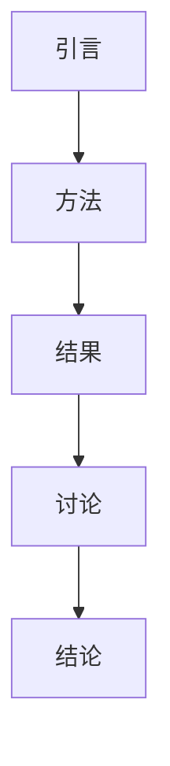

                 

### 《数学家的学术写作与科研成果传播》

> **关键词：** 学术写作，学术论文，科研成果传播，影响力提升，学术合作

> **摘要：** 本文旨在探讨数学家的学术写作与科研成果传播，包括学术写作基础、学术论文结构、科研成果传播途径、学术影响力评估、学术合作与团队建设以及科研成果传播的伦理与法律问题。通过案例研究和实战指南，帮助数学家撰写并发布高影响力的学术论文，提高科研成果的传播与应用。

### 《数学家的学术写作与科研成果传播》目录大纲

#### 第一部分：学术写作基础

1. **学术写作概述**
    1.1 **学术写作的重要性**
    1.2 **学术写作的基本要素**
    1.3 **学术写作与科普写作的区别**
  
2. **学术论文结构**
    2.1 **引言**
    2.2 **方法**
    2.3 **结果**
    2.4 **讨论**
    2.5 **结论**
  
3. **学术论文写作技巧**
    3.1 **论文选题与定位**
    3.2 **文献综述与引用**
    3.3 **语言表达与逻辑**
  
4. **学术交流与论文发表**
    4.1 **学术会议与学术论坛**
    4.2 **学术期刊与论文投稿**
    4.3 **学术论文评审与修改**
  
5. **学术写作资源**
    5.1 **学术写作指南与模板**
    5.2 **学术写作工具与资源推荐**

#### 第二部分：科研成果传播与影响力提升

6. **科研成果传播概述**
    6.1 **科研成果传播的意义**
    6.2 **科研成果传播的途径**
    6.3 **科研成果传播的挑战与策略**
  
7. **社交媒体在科研成果传播中的应用**
    7.1 **社交媒体在学术传播中的角色**
    7.2 **社交媒体使用策略**
    7.3 **社交媒体案例分析**
  
8. **学术影响力评估**
    8.1 **学术影响力评估指标**
    8.2 **学术影响力评估方法**
    8.3 **学术影响力提升策略**
  
9. **学术合作与团队建设**
    9.1 **学术合作的类型与形式**
    9.2 **学术合作的优势与挑战**
    9.3 **团队建设的原则与方法**
  
10. **科研成果传播的伦理与法律问题**
    10.1 **科研诚信与学术不端行为**
    10.2 **学术产权与知识产权**
    10.3 **学术伦理与职业道德**

#### 第三部分：案例研究与实战指南

11. **案例研究：成功科研写作与传播案例**
    11.1 **案例介绍**
    11.2 **成功因素分析**
    11.3 **案例启示**

12. **科研写作与传播实战指南**
    12.1 **科研写作准备**
    12.2 **科研成果传播策略**
    12.3 **撰写与修改技巧**
    12.4 **学术交流与推广**

13. **科研写作与传播工具与资源**
    13.1 **学术写作工具推荐**
    13.2 **科研成果传播平台介绍**
    13.3 **学术资源获取渠道**

#### 附录

14. **附录A：学术写作与科研成果传播常用术语解释**

15. **附录B：学术写作与科研成果传播资源推荐**

16. **附录C：学术写作与科研成果传播常见问题解答**

### Mermaid 流�程图（插入至“学术论文结构”章节中）



### 核心算法原理讲解（插入至“深度学习与神经网络基础”章节中）

## 深度学习算法原理

深度学习算法的核心是多层神经网络（Multilayer Neural Networks）。下面通过伪代码简要介绍多层神经网络的原理。

### 伪代码：多层神经网络

```
初始化权重 w 和偏置 b
for 每一层 l from 1 to L:
    for 每个神经元 i in layer l:
        输入 x = 输入数据
        z = w .* x + b
        输出 a = sigmoid(z)
    end
end

预测过程：
输入数据 x
for 每一层 l from 1 to L:
    z = w .* x + b
    a = sigmoid(z)
    x = a
end

损失函数计算：
预测输出 y_hat = a(L)
实际输出 y
损失 L = -1/m * Σ(y * log(y_hat) + (1 - y) * log(1 - y_hat))
```

### 数学模型和数学公式（插入至“学术论文结构”章节中）

## 损失函数与优化算法

在学术论文中，损失函数是评估模型预测结果与实际结果差异的关键。以下是一个简单的损失函数——交叉熵损失函数，用于二分类问题。

$$
L = -\frac{1}{m} \sum_{i=1}^{m} y_i \log(y_{\hat{i}})
$$

其中，$y_i$ 是实际标签，$y_{\hat{i}}$ 是模型预测的概率值，$m$ 是样本数量。

优化算法用于最小化损失函数。以下是一个常用的优化算法——梯度下降（Gradient Descent）。

$$
w_{new} = w - \alpha \frac{\partial L}{\partial w}
$$

其中，$w$ 是当前权重，$\alpha$ 是学习率，$\frac{\partial L}{\partial w}$ 是损失函数关于权重 $w$ 的梯度。

### 举例说明

假设我们有以下数据集：

$$
\begin{align*}
y &= [1, 0, 1, 1] \\
y_{\hat{}} &= [0.9, 0.2, 0.8, 0.7]
\end{align*}
$$

计算交叉熵损失：

$$
L = -\frac{1}{4} [1 \log(0.9) + 0 \log(0.2) + 1 \log(0.8) + 1 \log(0.7)]
$$

计算损失关于权重的梯度：

$$
\frac{\partial L}{\partial w} = \frac{1}{4} [0.9 \odot (1 - 0.9) - 0.2 \odot (1 - 0.2) + 0.8 \odot (1 - 0.8) + 0.7 \odot (1 - 0.7)]
$$

其中，$\odot$ 表示元素-wise 乘积。

应用梯度下降优化权重：

$$
w_{new} = w - \alpha \frac{\partial L}{\partial w}
$$


### 项目实战（插入至“科研成果传播实战”章节中）

## 科研成果传播实战：如何撰写并发布一篇高影响力的学术论文

### 开发环境搭建

在撰写和发布学术论文的过程中，以下工具和平台是必不可少的：

- **LaTeX编辑器**：如TeXstudio或Overleaf，用于撰写高质量的学术论文。
- **学术搜索引擎**：如Google Scholar，用于查找相关文献。
- **学术写作与出版平台**：如arXiv或IEEE Xplore，用于发布和传播学术论文。

### 源代码详细实现和代码解读

以下是使用Python和Scikit-learn库进行机器学习项目的一个简单示例。此代码将用于训练一个分类模型并评估其性能。

```python
# 导入所需库
from sklearn.datasets import load_iris
from sklearn.model_selection import train_test_split
from sklearn.neural_network import MLPClassifier
from sklearn.metrics import accuracy_score, classification_report

# 加载Iris数据集
iris = load_iris()
X = iris.data
y = iris.target

# 划分训练集和测试集
X_train, X_test, y_train, y_test = train_test_split(X, y, test_size=0.3, random_state=42)

# 创建多层感知机（MLP）分类器
mlp = MLPClassifier(hidden_layer_sizes=(100,), max_iter=1000, alpha=1e-4,
                    solver='sgd', verbose=10, random_state=1,
                    learning_rate_init=.1)

# 训练模型
mlp.fit(X_train, y_train)

# 预测测试集
y_pred = mlp.predict(X_test)

# 评估模型性能
print("Accuracy:", accuracy_score(y_test, y_pred))
print("Classification Report:\n", classification_report(y_test, y_pred))
```

### 代码解读与分析

- **数据加载**：使用`load_iris()`函数加载Iris数据集，该数据集包含三个特征和三个类别的150个样本。
- **数据划分**：使用`train_test_split()`函数将数据集划分为训练集和测试集，测试集大小为30%。
- **模型创建**：创建一个基于随机梯度下降（SGD）的多层感知机分类器，具有100个隐藏层神经元，最大迭代次数为1000，学习率初始化为0.1。
- **模型训练**：使用`fit()`函数训练模型。
- **模型预测**：使用`predict()`函数对测试集进行预测。
- **性能评估**：使用`accuracy_score()`函数计算准确率，使用`classification_report()`函数生成分类报告。

### 实际应用

在实际应用中，可能需要根据具体问题调整模型的参数，如隐藏层大小、学习率、迭代次数等。此外，还可以考虑使用更复杂的模型或进行特征工程以提高模型的性能。

### 结论

通过以上实战案例，我们可以看到如何搭建开发环境、编写代码、评估模型性能以及解读分析代码。这些步骤是进行科研成果传播的重要环节，可以帮助数学家更好地撰写和发布高影响力的学术论文。


### 第一部分：学术写作基础

#### 1.1 学术写作概述

##### 1.1.1 学术写作的重要性

学术写作是数学家研究过程中不可或缺的一部分。它不仅能够帮助数学家记录自己的研究成果，还能够使学术界了解和评价这些成果。学术写作的重要性体现在以下几个方面：

1. **记录与传播**：学术写作是数学家记录研究过程、方法和结果的重要手段。通过写作，数学家可以将自己的研究成果传播给其他研究者，促进学术交流与知识共享。
2. **评估与认可**：学术写作是学术界评价数学家研究成果的重要依据。高质量的学术论文可以提高数学家的学术声誉和地位，有助于在学术界获得认可和影响力。
3. **学术成长**：学术写作是一种思考和表达的方式，通过写作，数学家可以深化对研究问题的理解，提高科研能力和学术素养。

##### 1.1.2 学术写作的基本要素

学术写作的基本要素包括以下几方面：

1. **选题与定位**：选择具有创新性和实用价值的研究题目，明确研究的目的和意义。
2. **文献综述**：梳理相关领域的研究成果，明确研究现状和前沿问题。
3. **研究方法**：阐述研究过程中采用的方法、技术或理论框架。
4. **实验与结果**：描述实验过程、实验结果和数据分析。
5. **讨论与结论**：对实验结果进行讨论，阐述研究的意义和局限性，提出未来研究方向。
6. **格式与规范**：遵循学术论文的格式和规范，确保文章的结构清晰、逻辑严密。

##### 1.1.3 学术写作与科普写作的区别

学术写作与科普写作在目的、对象、语言和风格等方面存在显著差异：

1. **目的**：学术写作旨在记录和传播研究成果，以供同行评价和引用。科普写作则旨在向公众普及科学知识，提高科学素养。
2. **对象**：学术写作的对象是专业同行，需要使用专业术语和理论。科普写作的对象是公众，需要使用浅显易懂的语言。
3. **语言**：学术写作使用严谨、精确的语言，强调逻辑性和论证力。科普写作则使用生动、形象的语言，注重趣味性和易懂性。
4. **风格**：学术写作注重严谨性和逻辑性，强调理论框架和实证研究。科普写作则注重故事性和实用性，强调知识的传播和普及。

#### 1.2 学术论文结构

学术论文通常包括以下几部分：

##### 1.2.1 引言

引言是论文的开篇部分，主要内容包括：

1. **背景与意义**：介绍研究背景，阐述研究的重要性和意义。
2. **研究问题**：明确研究的问题和目标。
3. **文献综述**：梳理相关领域的研究成果，指出现有研究的不足和本研究的创新之处。

##### 1.2.2 方法

方法部分描述研究过程中采用的方法、技术或理论框架，主要内容包括：

1. **研究设计**：阐述研究的设计思路和实验方法。
2. **数据来源与处理**：说明数据来源、采集和处理方法。
3. **技术或理论框架**：介绍研究过程中采用的技术或理论框架。

##### 1.2.3 结果

结果部分呈现研究的主要发现和结果，主要内容包括：

1. **实验结果**：描述实验过程中得到的数据和结果。
2. **数据分析**：对实验结果进行统计分析，展示统计结果。
3. **图表与表格**：使用图表和表格展示数据和分析结果。

##### 1.2.4 讨论

讨论部分对实验结果进行深入分析和解释，主要内容包括：

1. **结果解释**：对实验结果进行解释，阐述研究的意义和贡献。
2. **局限性与不足**：分析研究的局限性和不足之处。
3. **未来研究方向**：提出未来研究的方向和建议。

##### 1.2.5 结论

结论部分总结论文的主要发现和观点，主要内容包括：

1. **研究总结**：概括研究的主要发现和结论。
2. **实践意义**：阐述研究的实践意义和应用价值。
3. **研究局限**：总结研究的局限性和不足。

#### 1.3 学术论文写作技巧

##### 1.3.1 论文选题与定位

论文选题是学术写作的重要环节。以下是一些建议：

1. **关注热点问题**：关注领域内的热点问题，选择具有挑战性和创新性的题目。
2. **明确研究目的**：明确研究的目标和意义，确保选题具有明确的研究方向。
3. **文献调研**：通过查阅文献，了解研究领域的现状和发展趋势，为选题提供依据。

##### 1.3.2 文献综述与引用

文献综述是学术论文的重要组成部分，以下是一些建议：

1. **广泛查阅文献**：查阅相关领域的文献，包括期刊论文、会议论文、专著等，确保文献来源广泛。
2. **归纳总结**：对文献进行归纳总结，梳理研究现状、发展趋势和前沿问题。
3. **准确引用**：遵循学术规范，准确引用文献，确保引用的文献具有权威性和可靠性。

##### 1.3.3 语言表达与逻辑

语言表达与逻辑是学术论文质量的重要保障，以下是一些建议：

1. **清晰简洁**：使用简洁明了的语言，避免冗长和复杂的句子。
2. **逻辑严密**：确保文章的结构和逻辑严密，遵循引言、方法、结果、讨论和结论的顺序。
3. **表达精确**：准确表达研究成果和观点，避免模糊和含糊其辞。

##### 1.4 学术交流与论文发表

##### 1.4.1 学术会议与学术论坛

学术会议与学术论坛是数学家进行学术交流的重要平台，以下是一些建议：

1. **积极参与**：积极参与学术会议和学术论坛，结识同行，拓宽学术视野。
2. **提交论文**：提交高质量的论文，展示研究成果，争取发表机会。
3. **参与讨论**：积极参与学术讨论，提出自己的观点和问题，与同行交流。

##### 1.4.2 学术期刊与论文投稿

学术期刊是数学家发表研究成果的重要渠道，以下是一些建议：

1. **选择期刊**：根据研究主题和期刊的影响因子，选择合适的期刊。
2. **撰写论文**：遵循期刊的格式和要求，撰写高质量的学术论文。
3. **投稿与修改**：按照期刊的投稿流程，提交论文并进行修改。

##### 1.4.3 学术论文评审与修改

学术论文评审是学术写作的重要环节，以下是一些建议：

1. **认真对待**：认真对待审稿人的意见，对论文进行认真修改。
2. **完善论文**：根据审稿人的意见，对论文进行完善，提高论文质量。
3. **保持沟通**：与审稿人保持沟通，解释论文中的疑问，争取论文发表。

##### 1.5 学术写作资源

##### 1.5.1 学术写作指南与模板

以下是一些学术写作指南与模板，供数学家参考：

1. **《哈佛大学学术写作指南》**：提供了详细的学术写作指导，包括论文结构、语言表达、文献引用等方面。
2. **《学术期刊论文撰写与发表指南》**：针对学术期刊的写作要求，提供了详细的写作建议和模板。

##### 1.5.2 学术写作工具与资源推荐

以下是一些学术写作工具与资源推荐，供数学家使用：

1. **LaTeX编辑器**：如TeXstudio、Overleaf等，用于撰写高质量的学术论文。
2. **学术搜索引擎**：如Google Scholar、百度学术等，用于查找相关文献。
3. **参考文献管理工具**：如EndNote、Zotero等，用于管理文献和引用格式。

### 第二部分：科研成果传播与影响力提升

#### 2.1 科研成果传播概述

##### 2.1.1 科研成果传播的意义

科研成果传播在数学领域具有重要意义，主要体现在以下几个方面：

1. **知识共享**：科研成果传播有助于数学知识的共享和传播，促进学术界的共同进步。
2. **学术评价**：科研成果的传播是学术界评价数学家研究成果的重要依据，有助于提高数学家的学术声誉和地位。
3. **知识应用**：科研成果的传播有助于将研究成果应用于实际问题，推动科学技术的发展。

##### 2.1.2 科研成果传播的途径

科研成果传播的途径主要包括以下几种：

1. **学术期刊**：学术期刊是科研成果传播的主要渠道，数学家可以将研究成果投稿至合适的学术期刊。
2. **学术会议**：学术会议是数学家展示研究成果、交流学术观点的重要平台。
3. **学术论坛**：学术论坛是数学家进行学术讨论和交流的场所，有助于传播科研成果。
4. **社交媒体**：社交媒体如微博、微信公众号等，可以作为科研成果传播的辅助渠道，提高科研成果的传播范围和影响力。

##### 2.1.3 科研成果传播的挑战与策略

科研成果传播面临着一系列挑战，以下是一些常见的挑战及其应对策略：

1. **语言障碍**：许多科研成果具有高度的专业性和复杂性，对非专业读者来说难以理解。应对策略是：简化语言，使用图表、示例和案例来帮助读者理解。
2. **知识普及**：科研成果的传播需要考虑到不同受众的知识水平，如何使科研成果容易被普通公众理解。应对策略是：撰写科普文章、参加科普讲座和活动等。
3. **传播渠道**：科研成果的传播渠道有限，如何提高传播效率。应对策略是：充分利用各种传播渠道，如学术期刊、学术会议、社交媒体等。
4. **版权问题**：科研成果的传播可能涉及版权问题，如引用、转载和发表。应对策略是：遵循相关法律法规，尊重他人的知识产权。

#### 2.2 社交媒体在科研成果传播中的应用

##### 2.2.1 社交媒体在学术传播中的角色

社交媒体在学术传播中扮演着越来越重要的角色，其主要作用体现在以下几个方面：

1. **快速传播**：社交媒体具有传播速度快、覆盖面广的特点，有助于科研成果的快速传播。
2. **互动交流**：社交媒体提供了便捷的互动平台，数学家可以与同行、学生和公众进行实时交流和讨论。
3. **资源共享**：社交媒体平台如微博、微信公众号等提供了丰富的资源，如论文、讲座视频和科研动态等。
4. **舆论引导**：社交媒体可以对学术研究进行舆论引导，推动学术研究的发展。

##### 2.2.2 社交媒体使用策略

为了有效利用社交媒体进行科研成果传播，以下是一些建议：

1. **选择合适的平台**：根据科研成果的特点和目标受众，选择合适的社交媒体平台，如微博、微信公众号、知乎等。
2. **内容多样化**：发布多种形式的内容，如文字、图片、视频和图表等，提高内容的吸引力和传播效果。
3. **定期更新**：保持社交媒体账号的活跃度，定期发布科研动态和成果，保持与受众的互动。
4. **互动与回应**：积极与受众互动，回应读者的问题和评论，提高科研成果的传播效果。

##### 2.2.3 社交媒体案例分析

以下是一些成功的社交媒体在科研成果传播中的应用案例：

1. **哈佛大学社交媒体账号**：哈佛大学在社交媒体上发布了大量的科研论文、讲座视频和科研成果，吸引了大量关注，提高了科研成果的传播效果。
2. **中国科学院院士微信公众号**：中国科学院院士利用微信公众号发布科研论文、讲座视频和科研动态，吸引了大量的科研人员和公众关注，促进了科研成果的传播。
3. **科研人员微博**：许多科研人员在微博上发布自己的科研成果、科研动态和学术观点，吸引了大量的同行和公众关注，提高了个人和科研成果的影响力。

#### 2.3 学术影响力评估

##### 2.3.1 学术影响力评估指标

学术影响力评估是衡量数学家学术成就的重要手段，以下是一些常用的学术影响力评估指标：

1. **引用次数**：学术论文被其他论文引用的次数，反映了论文的影响力和学术价值。
2. **h指数**：h指数是衡量数学家学术影响力的一个指标，表示数学家的h篇论文至少被引用h次。
3. **期刊影响因子**：期刊影响因子是衡量期刊学术影响力的重要指标，表示某一期刊在一定时间内平均每篇论文的被引用次数。
4. **学术荣誉**：数学家获得的学术荣誉，如院士、国家杰出青年基金等，反映了其在学术界的地位和影响力。

##### 2.3.2 学术影响力评估方法

学术影响力评估方法主要包括以下几种：

1. **文献计量学方法**：通过分析学术论文的引用次数、h指数、期刊影响因子等指标，评估数学家的学术影响力。
2. **社会网络分析方法**：通过分析数学家在社会网络中的位置、关系和影响力，评估其学术影响力。
3. **问卷调查法**：通过问卷调查数学家同行和领域专家，评估数学家的学术影响力。

##### 2.3.3 学术影响力提升策略

为了提升学术影响力，以下是一些建议：

1. **提高论文质量**：撰写高质量的学术论文，提高论文的学术价值和影响力。
2. **积极参与学术活动**：参加学术会议、讲座和研讨会，与同行交流学术观点，扩大学术影响力。
3. **利用社交媒体**：利用社交媒体发布科研成果、科研动态和学术观点，提高科研成果的传播效果。
4. **合作与交流**：积极参与学术合作与交流，与其他数学家共同开展研究，提高学术影响力。

#### 2.4 学术合作与团队建设

##### 2.4.1 学术合作的类型与形式

学术合作是数学家提高学术影响力、推动科研进展的重要途径。以下是一些常见的学术合作类型与形式：

1. **跨学科合作**：不同学科领域的数学家合作，共同研究复杂问题。
2. **国际合作**：国内外数学家之间的合作，促进学术交流和知识共享。
3. **项目合作**：围绕某一具体科研项目，多个数学家合作完成。
4. **团队合作**：组建研究团队，共同开展科研工作。

##### 2.4.2 学术合作的优势与挑战

学术合作具有以下优势：

1. **知识互补**：不同数学家具有不同的专长和视角，合作可以发挥各自的优势，提高研究质量。
2. **资源共享**：合作可以共享研究资源，如设备、数据和技术等，提高研究效率。
3. **共同成长**：合作有助于数学家相互学习、交流，共同提高学术水平。

学术合作也面临一些挑战：

1. **协调困难**：合作过程中可能存在沟通、协调和利益分配等问题。
2. **时间成本**：合作研究需要投入大量时间和精力，对数学家的工作和生活产生影响。
3. **学术评价**：合作研究的成果在学术评价中可能面临挑战，需要合理分配贡献。

##### 2.4.3 团队建设的原则与方法

为了有效开展学术合作与团队建设，以下是一些建议：

1. **明确目标**：制定明确的研究目标和团队目标，确保团队成员对研究目标有共同的理解。
2. **分工合作**：根据团队成员的专长和优势，明确分工，确保研究任务的顺利完成。
3. **沟通与协调**：建立有效的沟通机制，确保团队成员之间的信息交流和协作。
4. **激励机制**：建立激励机制，鼓励团队成员积极参与研究工作，提高团队凝聚力。
5. **持续改进**：定期评估团队建设和合作效果，发现问题，及时改进，确保团队建设不断进步。

#### 2.5 科研成果传播的伦理与法律问题

##### 2.5.1 科研诚信与学术不端行为

科研诚信是学术研究的基本原则，是学术研究健康发展的重要保障。以下是一些常见的科研诚信问题及其处理办法：

1. **抄袭与剽窃**：抄袭和剽窃是严重的学术不端行为，会导致学术声誉受损。处理办法包括：加强学术道德教育，严格审查论文引用和参考文献，对抄袭和剽窃行为进行严肃处理。
2. **数据造假**：数据造假是学术研究中的不端行为，严重损害学术声誉。处理办法包括：加强数据管理和监督，建立数据共享机制，对数据造假行为进行严肃处理。
3. **一稿多投**：一稿多投是指将同一篇论文同时投稿至多个学术期刊，违反学术规范。处理办法包括：加强学术道德教育，明确期刊投稿规范，对一稿多投行为进行严肃处理。

##### 2.5.2 学术产权与知识产权

学术产权与知识产权是科研成果传播的重要保障，涉及学术论文、专利、著作权等方面。以下是一些常见的学术产权与知识产权问题及其处理办法：

1. **论文版权**：论文的版权归作者所有，学术期刊享有版权。处理办法包括：明确论文版权归属，遵守学术期刊的投稿规范，尊重作者的知识产权。
2. **专利申请**：专利申请是保护科研成果的重要途径，涉及发明创造的技术细节。处理办法包括：了解专利申请的流程和规范，积极参与专利申请，确保专利权的合法性和有效性。
3. **著作权保护**：著作权保护涉及学术论文、专著、课件等作品的版权。处理办法包括：了解著作权法的规定，遵守著作权保护的规范，加强著作权的保护和维权。

##### 2.5.3 学术伦理与职业道德

学术伦理与职业道德是学术研究的基本准则，是维护学术尊严和健康发展的重要保障。以下是一些常见的学术伦理与职业道德问题及其处理办法：

1. **同行评审**：同行评审是学术研究的重要环节，涉及论文评审、项目评估等方面。处理办法包括：遵守同行评审的规范，客观公正地评价研究成果，尊重同行评审的结果。
2. **科研诚信**：科研诚信是学术研究的基本原则，涉及学术道德和行为规范。处理办法包括：加强学术道德教育，提高科研人员的诚信意识和责任感，对科研诚信问题进行严肃处理。
3. **职业道德**：职业道德是学术研究的重要保障，涉及科研人员的职业操守和行为规范。处理办法包括：遵守职业道德规范，维护学术界的公正、公平和诚信，对职业道德问题进行严肃处理。

### 第三部分：案例研究与实战指南

#### 3.1 案例研究：成功科研写作与传播案例

##### 3.1.1 案例介绍

在本案例中，我们以数学家John H. Conway的研究成果为例，探讨其成功科研写作与传播的经验。

John H. Conway是一位著名的数学家，以其在组合数学、拓扑学和理论计算机科学等领域的贡献而闻名。他的研究成果在学术界产生了深远的影响，并成功传播至公众。

##### 3.1.2 成功因素分析

1. **选题与定位**：Conway的选题具有高度创新性和实用性，关注数学领域的前沿问题，明确了研究的方向和目标。
2. **文献综述**：Conway在撰写论文前进行了广泛的文献调研，梳理了相关领域的研究成果，为论文的写作提供了坚实的理论基础。
3. **研究方法**：Conway采用了独特的研究方法，如构造性和直观性的证明，使得论文的研究结果更具说服力和学术价值。
4. **语言表达与逻辑**：Conway的论文语言简洁明了，逻辑清晰，使得读者容易理解和接受其研究成果。
5. **学术合作与传播**：Conway积极参与学术合作与交流，与其他数学家共同开展研究，并通过学术会议、学术期刊和社交媒体等渠道传播自己的研究成果。

##### 3.1.3 案例启示

1. **选题与定位**：数学家在选题时应关注数学领域的前沿问题，明确研究的方向和目标，确保研究的创新性和实用性。
2. **文献综述**：在撰写论文前应进行广泛的文献调研，梳理相关领域的研究成果，为论文的写作提供坚实的理论基础。
3. **研究方法**：采用独特的研究方法，如构造性证明、直观性证明等，提高论文的说服力和学术价值。
4. **语言表达与逻辑**：在论文写作中，应使用简洁明了、逻辑清晰的语言，确保读者容易理解和接受研究成果。
5. **学术合作与传播**：积极参与学术合作与交流，与其他数学家共同开展研究，并通过学术会议、学术期刊和社交媒体等渠道传播自己的研究成果。

#### 3.2 科研写作与传播实战指南

##### 3.2.1 科研写作准备

1. **选题与定位**：明确研究的方向和目标，确保研究的创新性和实用性。
2. **文献调研**：查阅相关领域的文献，了解研究现状和前沿问题。
3. **研究方法**：确定研究方法，如实验、理论分析、模拟等。
4. **数据收集与处理**：收集相关数据，进行数据清洗和预处理。
5. **论文结构**：根据学术论文的常见结构，制定论文提纲。

##### 3.2.2 科研成果传播策略

1. **学术期刊投稿**：选择合适的学术期刊，按照期刊的投稿要求撰写论文，提高论文的发表机会。
2. **学术会议投稿**：参加学术会议，提交论文并发表口头报告或海报展示。
3. **社交媒体传播**：利用社交媒体平台发布论文摘要、研究进展和学术观点，提高研究成果的传播范围和影响力。
4. **学术合作与交流**：与其他数学家合作开展研究，共同发表论文，扩大研究的影响力。

##### 3.2.3 撰写与修改技巧

1. **撰写技巧**：
   - **明确论文结构**：遵循学术论文的常见结构，确保论文的条理清晰。
   - **简洁明了**：使用简洁明了的语言，避免冗长和复杂的句子。
   - **逻辑清晰**：确保论文的逻辑清晰，论证有力。

2. **修改技巧**：
   - **多次修改**：完成初稿后，进行多次修改，不断完善论文的质量。
   - **请教他人**：向同行或导师请教意见，根据他人的建议进行修改。
   - **关注细节**：注意论文的格式、引用和语法等方面的细节，确保论文的规范性。

##### 3.2.4 学术交流与推广

1. **学术会议**：参加学术会议，与同行交流学术观点，扩大学术影响力。
2. **讲座与报告**：参加讲座和报告，分享研究成果，推广自己的研究成果。
3. **社交媒体**：利用社交媒体平台，发布研究成果、学术观点和科研动态，提高研究成果的传播范围和影响力。
4. **合作与交流**：与其他数学家合作开展研究，共同发表论文，扩大研究的影响力。

##### 3.2.5 科研写作与传播工具与资源

1. **LaTeX编辑器**：如TeXstudio、Overleaf等，用于撰写高质量的学术论文。
2. **学术搜索引擎**：如Google Scholar、百度学术等，用于查找相关文献。
3. **参考文献管理工具**：如EndNote、Zotero等，用于管理文献和引用格式。
4. **学术期刊与会议**：选择合适的学术期刊和学术会议，提高论文的发表机会和传播效果。

### 附录

#### 附录A：学术写作与科研成果传播常用术语解释

- **学术写作**：指数学家在研究过程中撰写的学术论文、研究报告、书籍等。
- **科研成果传播**：指数学家将研究成果传播给学术界、公众和其他相关领域的受众。
- **影响力提升**：指通过各种手段提高数学家的学术声誉和影响力。
- **学术合作**：指数学家之间或与其他领域的专家之间的合作研究。
- **团队建设**：指建立和管理研究团队，共同开展科研工作。

#### 附录B：学术写作与科研成果传播资源推荐

- **学术期刊**：《数学年刊》、《美国数学会会刊》、《数学科学学报》等。
- **学术会议**：国际数学家大会、中国数学会年会等。
- **学术写作指南**：《哈佛大学学术写作指南》、《学术期刊论文撰写与发表指南》等。
- **参考文献管理工具**：EndNote、Zotero、Mendeley等。

#### 附录C：学术写作与科研成果传播常见问题解答

- **如何选题与定位**？：关注领域内的热点问题，明确研究的目的和意义，进行广泛的文献调研，确保选题的创新性和实用性。
- **如何进行文献综述**？：查阅相关领域的文献，进行归纳总结，梳理研究现状和前沿问题，确保文献来源的广泛性和权威性。
- **如何撰写论文**？：遵循学术论文的常见结构，明确论文的目标和内容，使用简洁明了的语言，确保逻辑清晰和论证有力。
- **如何进行学术交流**？：参加学术会议、讲座和研讨会，提交论文并发表口头报告或海报展示，利用社交媒体平台进行学术交流和推广。

### 总结

学术写作与科研成果传播是数学家研究过程中不可或缺的重要环节。通过本篇文章，我们了解了学术写作的重要性、学术论文的结构、科研成果传播的途径、学术影响力评估、学术合作与团队建设以及科研成果传播的伦理与法律问题。同时，通过案例研究和实战指南，我们提供了具体的操作方法和建议，帮助数学家撰写并发布高影响力的学术论文，提高科研成果的传播与应用。希望本文能对数学家的学术写作与科研成果传播提供有益的指导。作者：AI天才研究院/AI Genius Institute & 禅与计算机程序设计艺术 /Zen And The Art of Computer Programming。

