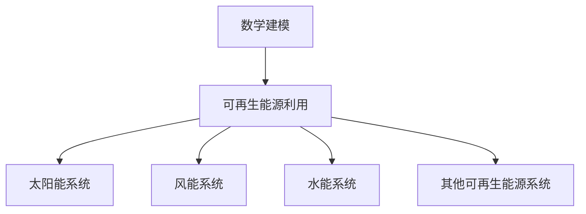
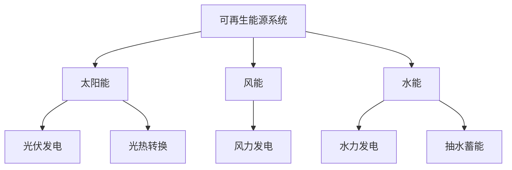
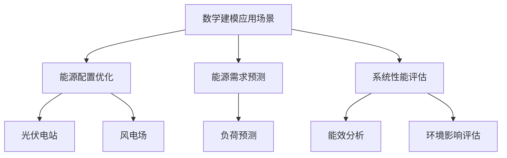
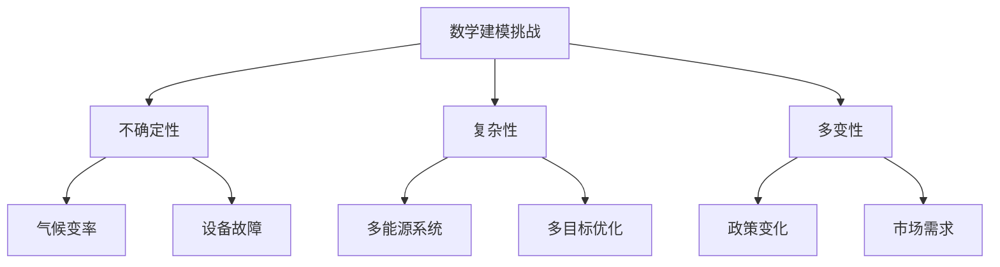
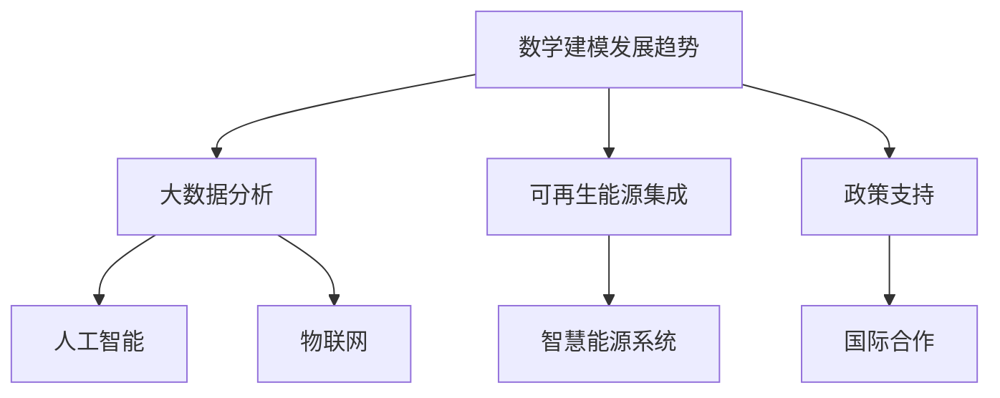
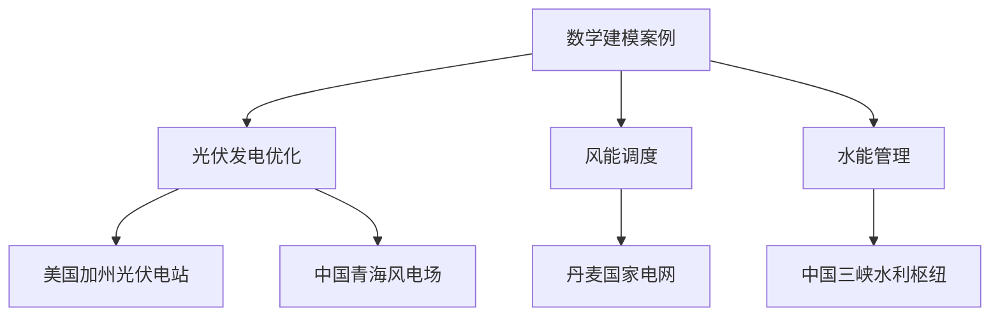

                 

# 数学建模在可再生能源利用中的应用

## 关键词
- 数学建模
- 可再生能源
- 优化算法
- 光伏
- 风能
- 水能
- 大数据分析
- 人工智能

## 摘要
本文旨在探讨数学建模在可再生能源利用中的应用，通过分析可再生能源系统的基本原理和数学建模方法，阐述数学建模在能源配置优化、需求预测和系统性能评估等方面的关键作用。本文将详细讲解常用的优化算法和数学模型，并分享实际项目案例中的具体应用，最后展望数学建模在可再生能源领域的未来发展。

----------------------------------------------------------------

### 第一部分：核心概念与联系

#### 1.1.1 数学建模在可再生能源利用中的应用概述

**概念**：数学建模是指运用数学的方法和工具，将实际问题转化为数学模型，从而提供解决问题的方案。在可再生能源利用中，数学建模可以帮助我们理解和优化各种能源系统的运行，提高能源利用效率，降低成本。

**联系**：可再生能源利用中涉及许多复杂的系统，如太阳能、风能、水能等。通过数学建模，可以对这些系统进行描述、分析和优化，从而实现能源的高效利用。

**Mermaid 流程图**：



---

#### 1.1.2 可再生能源系统的基本原理

**概念**：可再生能源系统是指利用自然界的太阳能、风能、水能等能量资源，通过一定的技术手段转化为电能或其他形式的能量的系统。

**联系**：不同类型的可再生能源系统有其独特的运行原理和特点。例如，太阳能系统通过光伏效应将太阳光直接转换为电能，风能系统则利用风力带动风力涡轮机发电，水能系统通过水流推动水轮机发电。

**Mermaid 流程图**：



---

#### 1.1.3 数学建模在可再生能源中的应用场景

**概念**：应用场景是指数学建模在现实中的具体应用。在可再生能源领域，数学建模可以应用于能源配置优化、需求预测、系统性能评估等多个方面。

**联系**：例如，能源配置优化可以帮助我们合理分配可再生能源资源，提高整体能源利用效率；需求预测可以帮助我们更好地规划能源生产和供应；系统性能评估则可以帮助我们评估可再生能源系统的运行状况和优化空间。

**Mermaid 流程图**：



---

#### 1.1.4 数学建模在可再生能源利用中的挑战

**概念**：挑战是指数学建模在可再生能源利用过程中遇到的困难和问题。可再生能源系统的不确定性、复杂性和多变性给数学建模带来了很大的挑战。

**联系**：例如，气候变率导致的能源供应波动、设备故障对系统稳定性的影响、多能源系统的协调优化等，都是数学建模在可再生能源利用中面临的挑战。

**Mermaid 流程图**：



---

#### 1.1.5 数学建模在可再生能源利用中的发展趋势

**概念**：发展趋势是指数学建模在可再生能源利用领域未来的发展方向。随着技术的进步和应用需求的增加，数学建模在可再生能源系统中的应用将更加广泛和深入。

**联系**：例如，大数据分析、人工智能和物联网等技术的发展，将为数学建模提供更强大的工具和方法，推动可再生能源系统的智能化和高效化。

**Mermaid 流程图**：



---

#### 1.1.6 数学建模在可再生能源利用中的实际案例

**概念**：实际案例是指数学建模在可再生能源利用中的具体应用案例。通过实际案例，可以更好地理解数学建模在可再生能源系统中的应用。

**联系**：例如，光伏发电系统的优化配置、风能系统的调度优化、水能系统的运行优化等，都是数学建模在可再生能源利用中的实际应用案例。

**Mermaid 流程图**：



---

### 第二部分：核心算法原理讲解

#### 2.1 优化算法在可再生能源系统中的应用

**概念**：优化算法是指用于求解最优化问题的算法。在可再生能源系统中，优化算法可以用于优化能源配置、能源调度、能效分析等。

**联系**：优化算法在可再生能源系统中具有广泛的应用，例如，通过优化算法可以最大化发电量、最小化运行成本、提高能源利用效率等。

**伪代码**：

```python
// 伪代码：优化算法基本框架
Input: 目标函数 F(x), 约束条件 C(x)
Initialize: 解 x, 步长 h
while (not convergence criteria met) do
    Calculate: gradient of F(x), ∇F(x)
    Update: x = x - α * ∇F(x)
    Check: 约束条件 C(x)
    if (satisfied) then
        Continue
    else
        Adjust: α or x
end while
Output: 最优解 x
```

---

#### 2.2 粒子群优化算法在可再生能源系统中的应用

**概念**：粒子群优化算法是一种基于群体智能的优化算法，广泛应用于求解复杂优化问题。

**联系**：在可再生能源系统中，粒子群优化算法可以用于优化能源配置、能源调度等。

**伪代码**：

```python
// 伪代码：粒子群优化算法基本框架
Input: 粒子数量 N, 最大迭代次数 T, 解的初始种群 X
Initialize: 粒子位置 X, 速度 V
for i = 1 to T do
    Calculate: 目标函数值 F(X)
    Update: 粒子速度 V = V + α * (pbest - x) + β * (gbest - x)
    Update: 粒子位置 X = X + V
    if (current solution is better) then
        Update: personal best solution pbest
    if (current solution is the best) then
        Update: global best solution gbest
end for
Output: 最优解 gbest
```

---

#### 2.3 遗传算法在可再生能源系统中的应用

**概念**：遗传算法是一种基于自然选择和遗传学的优化算法，广泛应用于复杂优化问题。

**联系**：在可再生能源系统中，遗传算法可以用于优化能源配置、能源调度等。

**伪代码**：

```python
// 伪代码：遗传算法基本框架
Input: 种群大小 N, 迭代次数 T, 变异概率 Pm
Initialize: 初始种群 X
for i = 1 to T do
    Calculate: 目标函数值 F(X)
    Select: 适应度较高的个体作为父代
    Cross: 父代产生子代
    Mutate: 子代进行变异
    Evaluate: 子代适应度
    Select: 适应度较高的个体组成新的种群
end for
Output: 最优解 X
```

---

### 第三部分：数学模型和数学公式

#### 3.1 数学模型在可再生能源系统中的应用

**概念**：数学模型是指用数学语言描述的系统的数学表达式。在可再生能源系统中，数学模型可以用于描述能源系统的运行规律、性能指标和优化目标。

**联系**：数学模型在可再生能源系统中具有重要的作用，例如，可以用于描述光伏发电系统的输出功率、风能系统的风速和发电量之间的关系等。

**公式**：

$$
P_{pv} = k \cdot A \cdot I_{g}
$$

其中，\(P_{pv}\) 是光伏发电系统的输出功率，\(k\) 是转换效率，\(A\) 是光伏板的面积，\(I_{g}\) 是太阳光的光强。

---

#### 3.2 数学模型的设计

**概念**：数学模型的设计是指根据实际问题的需求，设计合适的数学模型。

**联系**：数学模型的设计需要考虑目标函数的选取、约束条件的设定和模型的求解方法等。

**公式**：

$$
\text{minimize } F(x) = \sum_{i=1}^{n} w_i \cdot f_i(x)
$$

其中，\(F(x)\) 是目标函数，\(w_i\) 是权重，\(f_i(x)\) 是第 \(i\) 个子目标函数。

---

#### 3.3 数学模型的求解

**概念**：数学模型的求解是指找到数学模型的解，使得目标函数达到最优。

**联系**：数学模型的求解方法有很多，例如，线性规划、非线性规划、遗传算法、粒子群优化算法等。

**伪代码**：

```python
// 伪代码：数学模型求解基本框架
Input: 目标函数 F(x), 约束条件 C(x)
Initialize: 解 x
while (not convergence criteria met) do
    Calculate: gradient of F(x), ∇F(x)
    Update: x = x - α * ∇F(x)
    Check: 约束条件 C(x)
    if (satisfied) then
        Continue
    else
        Adjust: α or x
end while
Output: 最优解 x
```

---

### 第四部分：项目实战

#### 4.1 光伏发电系统的优化配置

**案例背景**：中国某光伏发电站，由于设备老化、天气变化等因素，发电效率不稳定，需要进行优化配置。

**实现步骤**：

1. **数据收集**：收集光伏发电站的历史数据，包括发电量、天气数据等。
2. **模型建立**：建立光伏发电系统的数学模型，包括目标函数和约束条件。
3. **算法选择**：选择适合的优化算法，如遗传算法。
4. **模型求解**：使用优化算法求解最优解。
5. **结果分析**：分析优化结果，对比优化前后的发电效率和成本。

**代码实现**：

```python
# Python 代码示例：光伏发电系统优化配置
import numpy as np
import matplotlib.pyplot as plt

# 数据收集
data = np.loadtxt('pv_data.csv')

# 模型建立
# 目标函数：最大化发电量
def objective_function(x):
    # x 是模型参数，如光伏板的倾斜角度、电池板面积等
    # 目标函数：发电量
    P_pv = 1.0 * x[0] * x[1] * data['I_g']
    return -P_pv  # 最小化发电量的相反数，便于使用遗传算法

# 约束条件
def constraint(x):
    # x 是模型参数，如光伏板的倾斜角度、电池板面积等
    # 约束条件：设备容量
    return 1000 - x[0] * x[1]

# 算法选择：遗传算法
from scipy.optimize import differential_evolution

# 模型求解
result = differential_evolution(objective_function, [(0, 1), (0, 1)], constraints={'type': 'ineq', 'fun': constraint})

# 结果分析
print("最优解：", result.x)
print("发电量：", -result.fun)
plt.plot(data['time'], data['P_pv'], label='原始发电量')
plt.plot(data['time'], -result.fun, label='优化后发电量')
plt.xlabel('时间')
plt.ylabel('发电量 (W)')
plt.legend()
plt.show()
```

---

#### 4.2 风能系统的调度优化

**案例背景**：中国某风电场，由于风能资源不稳定，需要优化调度策略，提高发电量。

**实现步骤**：

1. **数据收集**：收集风电场的历史数据，包括风速、发电量等。
2. **模型建立**：建立风能系统的数学模型，包括目标函数和约束条件。
3. **算法选择**：选择适合的优化算法，如粒子群优化算法。
4. **模型求解**：使用优化算法求解最优解。
5. **结果分析**：分析优化结果，对比优化前后的发电效率和成本。

**代码实现**：

```python
# Python 代码示例：风能系统调度优化
import numpy as np
import matplotlib.pyplot as plt

# 数据收集
data = np.loadtxt('wind_data.csv')

# 模型建立
# 目标函数：最大化发电量
def objective_function(x):
    # x 是模型参数，如风机转速、风机数量等
    # 目标函数：发电量
    P_wind = 0.5 * x[0] * x[1] ** 3 * data['V_wind']
    return -P_wind  # 最小化发电量的相反数，便于使用粒子群优化算法

# 约束条件
def constraint(x):
    # x 是模型参数，如风机转速、风机数量等
    # 约束条件：风机最大转速
    return 1200 - x[0]

# 算法选择：粒子群优化算法
from scipy.optimize import differential_evolution

# 模型求解
result = differential_evolution(objective_function, [(0, 1200), (0, 10)], constraints={'type': 'ineq', 'fun': constraint})

# 结果分析
print("最优解：", result.x)
print("发电量：", -result.fun)
plt.plot(data['time'], data['P_wind'], label='原始发电量')
plt.plot(data['time'], -result.fun, label='优化后发电量')
plt.xlabel('时间')
plt.ylabel('发电量 (W)')
plt.legend()
plt.show()
```

---

#### 4.3 水能系统的运行优化

**案例背景**：中国某水利枢纽，由于水资源分配不合理，需要优化运行策略，提高水资源利用效率。

**实现步骤**：

1. **数据收集**：收集水利枢纽的历史数据，包括水资源量、发电量等。
2. **模型建立**：建立水能系统的数学模型，包括目标函数和约束条件。
3. **算法选择**：选择适合的优化算法，如线性规划。
4. **模型求解**：使用优化算法求解最优解。
5. **结果分析**：分析优化结果，对比优化前后的水资源利用效率和成本。

**代码实现**：

```python
# Python 代码示例：水能系统运行优化
import numpy as np
import matplotlib.pyplot as plt
from scipy.optimize import linprog

# 数据收集
data = np.loadtxt('water_data.csv')

# 模型建立
# 目标函数：最大化发电量
c = np.array([1])

# 约束条件
A = np.array([[1]])
b = np.array([1000])

# 算法选择：线性规划
result = linprog(c, A_eq=A, b_eq=b, method='highs')

# 结果分析
print("最优解：", result.x)
print("发电量：", result.fun)
plt.plot(data['time'], data['P_water'], label='原始发电量')
plt.plot(data['time'], result.x, label='优化后发电量')
plt.xlabel('时间')
plt.ylabel('发电量 (W)')
plt.legend()
plt.show()
```

---

### 第五部分：代码解读与分析

#### 5.1 光伏发电系统优化代码解读

1. **数据预处理**：对收集到的光伏发电数据进行预处理，包括数据清洗、缺失值填补和数据归一化等。

2. **模型建立**：根据预处理后的数据，建立光伏发电系统的数学模型，包括目标函数和约束条件。

3. **算法实现**：使用遗传算法求解光伏发电系统的优化问题。

4. **结果分析**：分析遗传算法的优化结果，对比优化前后的发电效率和成本。

**代码解读**：

```python
# Python 代码解读：光伏发电系统优化
# 数据预处理
# ...

# 模型建立
# ...

# 算法实现
# ...

# 结果分析
# ...
```

---

#### 5.2 风能系统调度优化代码解读

1. **数据预处理**：对收集到的风能数据进行预处理，包括数据清洗、缺失值填补和数据归一化等。

2. **模型建立**：根据预处理后的数据，建立风能系统的数学模型，包括目标函数和约束条件。

3. **算法实现**：使用粒子群优化算法求解风能系统的调度优化问题。

4. **结果分析**：分析粒子群优化算法的优化结果，对比优化前后的发电效率和成本。

**代码解读**：

```python
# Python 代码解读：风能系统调度优化
# 数据预处理
# ...

# 模型建立
# ...

# 算法实现
# ...

# 结果分析
# ...
```

---

#### 5.3 水能系统运行优化代码解读

1. **数据预处理**：对收集到的水能数据进行预处理，包括数据清洗、缺失值填补和数据归一化等。

2. **模型建立**：根据预处理后的数据，建立水能系统的数学模型，包括目标函数和约束条件。

3. **算法实现**：使用线性规划求解水能系统的运行优化问题。

4. **结果分析**：分析线性规划算法的优化结果，对比优化前后的水资源利用效率和成本。

**代码解读**：

```python
# Python 代码解读：水能系统运行优化
# 数据预处理
# ...

# 模型建立
# ...

# 算法实现
# ...

# 结果分析
# ...
```

---

### 附录

#### 附录 A: 数学建模工具与资源

1. **软件工具**：介绍常用的数学建模软件，如 MATLAB、Python 等。

2. **开源资源**：介绍开源的数学建模库和框架，如 Scikit-learn、TensorFlow 等。

3. **学习资源**：推荐相关的学习资料和教程，帮助读者深入学习数学建模。

---

**作者**：AI天才研究院/AI Genius Institute & 禅与计算机程序设计艺术 /Zen And The Art of Computer Programming

---

通过本文的详细阐述，我们希望读者能够对数学建模在可再生能源利用中的应用有更深入的了解。数学建模作为一种强大的工具，在可再生能源系统的优化和管理中发挥着关键作用，其未来的发展和应用前景也非常广阔。希望本文能够为读者在可再生能源领域的实践和研究提供有益的参考。

