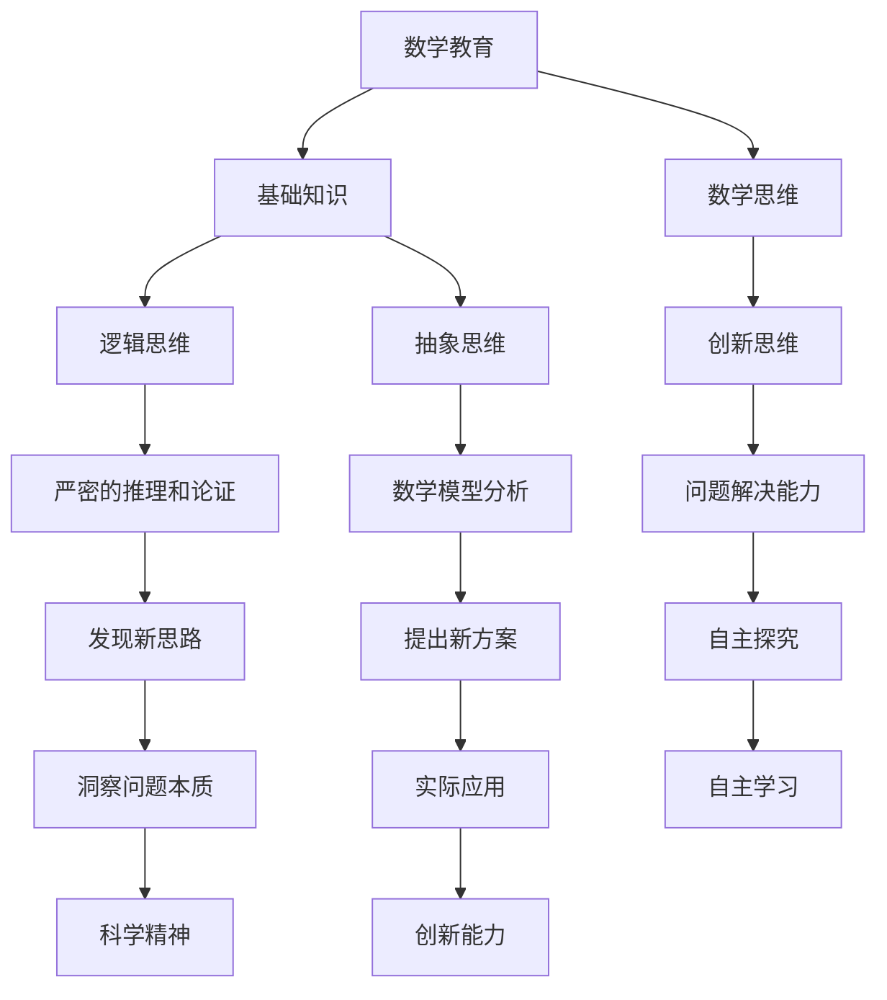
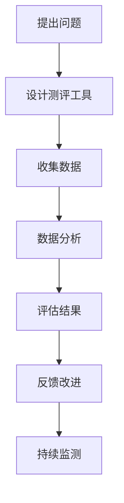

                 

### 《数学教育与创新思维培养的关系》

> **关键词**：数学教育、创新思维、培养方法、测量与评估、案例分析、策略研究、未来展望。

> **摘要**：本文探讨了数学教育与创新思维培养之间的紧密关系，分析了数学教育中的创新思维培养方法、测量与评估策略，并结合具体案例进行了深入研究。文章旨在为数学教育工作者提供理论依据和实践指导，推动数学教育与创新思维培养的深度融合。

### 第一部分：引论

#### 第1章：数学教育与创新思维的概述

##### 1.1 数学教育的本质与目标

数学教育作为一种基础教育，其本质在于培养学生的数学素养，包括数学基础知识、数学思维能力、数学应用能力等。数学教育的目标不仅在于传授数学知识，更在于培养学生的数学思维能力和解决问题的能力。

- **数学基础知识**：数学教育首先要让学生掌握基本的数学概念、原理和公式，如数论、代数、几何、概率统计等。这些基础知识是学生进一步学习数学和其他学科的基础。
- **数学思维能力**：数学思维能力包括逻辑思维、抽象思维、创新思维等。数学教育要培养学生的逻辑思维，使他们能够通过严密的推理和论证来解决问题；同时，要培养学生的抽象思维，使他们能够将实际问题转化为数学模型来分析。

##### 1.2 创新思维的定义与特征

创新思维是一种基于逻辑和想象力的思维活动，它能够将看似不相关的事物联系起来，发现新的解决方案或新的思路。创新思维的特征包括：

- **创造性**：创新思维能够产生新颖的想法或解决方案，这些想法或解决方案往往是独特的，不是直接从已有知识中得出的。
- **灵活性**：创新思维不受传统思维方式的限制，能够从不同的角度和层面思考问题，善于发现新的联系和可能性。
- **洞察力**：创新思维能够洞察问题的本质，发现问题的关键所在，并提出有针对性的解决方案。

##### 1.3 数学教育与创新思维的关系

数学教育与创新思维之间存在密切的关系。一方面，数学教育为创新思维提供了基础知识和工具；另一方面，创新思维能够推动数学教育的发展，提高数学教育的质量和效果。

- **数学教育促进创新思维**：数学教育通过培养学生的数学思维能力，特别是逻辑思维和抽象思维，为创新思维的发展提供了基础。数学中的抽象概念和严密的推理过程，有助于培养学生的创造性思维。
- **创新思维推动数学教育**：创新思维能够推动数学教育的发展，促使数学教育工作者探索新的教学方法、工具和资源，提高数学教育的质量和效率。例如，通过引入新的教学理念和技术，可以更好地培养学生的创新思维，提高他们的数学素养。

#### 第2章：数学教育中的创新思维培养方法

##### 2.1 项目导向教学法的应用

项目导向教学法是一种以学生为中心的教学方法，它通过引导学生参与实际项目，培养他们的创新思维和实际问题解决能力。

- **项目选择**：项目应具有实际意义和挑战性，能够激发学生的兴趣和好奇心。例如，可以选取数学建模、数学竞赛、数学应用等主题。
- **项目实施**：在项目实施过程中，教师应引导学生进行问题分析、方案设计、实验验证等环节，培养他们的创新思维和团队合作能力。

##### 2.2 探究性学习与问题解决

探究性学习是一种以学生为中心的学习方式，它通过引导学生自主探究问题、发现问题、解决问题，培养他们的创新思维和自主学习能力。

- **问题提出**：教师可以引导学生从实际问题中提出问题，例如，从日常生活、科学实验、社会热点等角度出发。
- **问题解决**：在问题解决过程中，教师应鼓励学生运用数学知识和方法，进行探究和实验，培养他们的创新思维和科学精神。

##### 2.3 数学思维与创造性思维培养策略

数学思维与创造性思维密切相关，数学教育可以采取以下策略来培养学生的创造性思维：

- **抽象思维训练**：通过数学概念和公式的推导，培养学生的抽象思维能力，使他们能够将实际问题转化为数学模型来分析。
- **逻辑推理训练**：通过数学证明和逻辑推理，培养学生的逻辑思维能力，使他们能够通过严密的推理和论证来解决问题。
- **发散思维训练**：通过数学谜题、数学游戏等活动，培养学生的发散思维能力，使他们能够从多个角度思考问题，寻找不同的解决方案。

#### 第3章：数学教育中创新思维的测量与评估

##### 3.1 创新思维评价标准的建立

为了准确测量和评估学生的创新思维，需要建立科学合理的评价标准。评价标准应包括以下几个方面：

- **创造性**：评价学生的创新思维时，应关注他们提出的新颖想法和独特解决方案。
- **灵活性**：评价学生的创新思维时，应考虑他们在不同情境下的思维灵活性和适应性。
- **洞察力**：评价学生的创新思维时，应关注他们能否洞察问题的本质，发现问题的关键所在。

##### 3.2 创新思维测评工具的使用

为了有效测量和评估学生的创新思维，可以使用以下测评工具：

- **数学思维测评量表**：通过设计一系列数学问题，评估学生在数学问题解决中的创新思维能力。
- **创造力测试**：如托雷森创造力测试（TTCT）、吉尔福特创造力测试（GCT）等，这些测试能够全面评估学生的创造力水平。
- **案例分析**：通过分析学生参与项目或探究性学习过程中的表现，评估他们的创新思维。

##### 3.3 创新思维培养效果的评估

评估创新思维培养效果时，可以从以下几个方面进行：

- **学生表现**：观察学生在数学课堂、项目、竞赛等场合中的表现，评估他们的创新思维。
- **教师反馈**：收集教师对学生的评价，了解学生创新思维的培养情况。
- **数据统计**：通过数据分析，评估创新思维培养策略的有效性，例如，比较不同教学方法的创新思维培养效果。

### 第二部分：数学教育与创新思维的案例分析

#### 第4章：数学教育中的创新思维培养案例分析

##### 4.1 案例一：利用数学建模培养学生的创新思维

##### 4.1.1 模型建立与优化

**模型建立**：在数学建模教学中，教师可以引导学生从实际问题出发，建立数学模型。例如，在分析城市交通问题时，可以建立交通流量模型，预测不同时间段和路段的交通流量。

**模型优化**：在模型建立之后，教师可以引导学生对模型进行优化。例如，通过调整模型参数、改进算法等手段，提高模型的预测准确性和可靠性。

##### 4.1.2 结果分析与讨论

通过对模型的分析和讨论，学生可以深入了解数学模型在实际问题中的应用，提高他们的创新思维和问题解决能力。例如，通过对比不同模型的预测结果，学生可以探讨不同模型的优势和局限性，从而提出更加有效的解决方案。

##### 4.2 案例二：数学游戏在教学中的应用

**游戏设计**：在数学游戏中，教师可以设计各种具有挑战性和趣味性的数学问题，激发学生的兴趣和参与度。例如，设计一个数学谜题游戏，让学生在解决问题的过程中锻炼创新思维。

**游戏实施**：在游戏实施过程中，教师应引导学生积极参与，鼓励他们提出自己的想法和解决方案。通过团队合作和竞争，学生可以相互启发，共同提高创新思维。

##### 4.2.2 游戏对创新思维的影响

数学游戏对学生的创新思维具有显著的促进作用。通过游戏，学生可以在轻松愉快的氛围中锻炼创新思维，提高解决问题的能力。同时，数学游戏还可以培养学生的团队合作精神和沟通能力，提高他们的综合素质。

#### 第5章：数学教育中的创新思维培养策略

##### 5.1 教师角色的转变

在创新思维培养过程中，教师应从传统的知识传授者转变为学习的引导者和促进者。教师应关注学生的个性化需求，激发他们的兴趣和潜能，引导他们积极参与数学学习。

##### 5.1.1 教师在创新思维培养中的角色

- **引导者**：教师应引导学生提出问题、分析问题、解决问题，培养他们的创新思维。
- **促进者**：教师应为学生提供丰富的学习资源和实践机会，促进他们的创新思维发展。

##### 5.1.2 教师培训与专业发展

为了提高教师的创新思维培养能力，应加强教师培训和专业发展。教师可以通过参加专业培训、学习先进的教育理念、参与教学研究等方式，不断提高自己的专业素养和创新能力。

##### 5.2 教学环境的优化

教学环境的优化是创新思维培养的重要保障。教师可以通过以下措施来优化教学环境：

- **营造宽松的学习氛围**：教师应营造一个开放、宽松、充满鼓励的学习氛围，让学生敢于提出自己的观点和想法。
- **提供丰富的学习资源**：教师应提供丰富多样的学习资源，如教材、教具、网络资源等，为学生提供充足的学习材料。
- **利用信息技术**：教师可以利用信息技术，如在线教学平台、数学软件等，为学生提供更加便捷和高效的学习体验。

##### 5.2.2 教学资源与工具的利用

为了提高数学教育的质量，教师应充分利用各种教学资源和工具。例如，教师可以利用在线教学平台，为学生提供丰富的学习资源和互动体验；利用数学软件，帮助学生更好地理解和掌握数学知识。

#### 第6章：数学教育中的创新思维培养案例研究

##### 6.1 案例一：基于大数据分析的数学教育创新

##### 6.1.1 数据采集与处理

在基于大数据分析的数学教育创新中，首先需要采集大量的数学教育数据。这些数据可以包括学生的学习记录、成绩、课堂表现等。通过数据采集，可以全面了解学生的学习情况和需求。

##### 6.1.2 大数据分析在数学教育中的应用

在数据采集完成后，教师可以利用大数据分析方法，对数据进行分析和挖掘，发现学生的学习规律和需求。例如，通过分析学生的学习记录，可以识别出学生的学习难点和兴趣点，从而有针对性地调整教学策略。

##### 6.2 案例二：跨学科教学在数学教育中的应用

##### 6.2.1 跨学科教学的设计与实施

跨学科教学是指将不同学科的知识和教学方法相结合，进行综合教学。在数学教育中，教师可以将数学与其他学科（如物理、化学、生物等）相结合，设计出跨学科的教学活动。

##### 6.2.2 跨学科教学对创新思维培养的影响

跨学科教学对学生的创新思维培养具有积极的促进作用。通过跨学科教学，学生可以从多个角度思考问题，培养他们的综合思维能力和创新思维。例如，在数学与物理的结合中，学生可以学习到数学在物理中的应用，从而提高他们的创新思维能力。

### 第三部分：未来展望

#### 第7章：数学教育与创新思维培养的展望

##### 7.1 数学教育中的创新思维培养趋势

随着教育技术的不断发展，数学教育中的创新思维培养将呈现出以下趋势：

- **个性化学习**：利用大数据分析和人工智能技术，实现个性化学习，为学生提供定制化的学习资源和教学方案。
- **跨学科整合**：加强数学与其他学科的整合，培养学生的综合素养和创新能力。
- **实践导向**：通过项目导向教学和实践活动，培养学生的实际问题解决能力和创新思维。

##### 7.2 创新思维培养的关键问题与挑战

在数学教育中，创新思维培养面临以下关键问题和挑战：

- **教师素质提升**：教师需要具备较高的专业素养和创新能力，才能有效培养学生的创新思维。
- **教育资源的分配**：教育资源的分配不均，可能会影响创新思维培养的公平性和效果。
- **教育评价体系的改革**：传统的教育评价体系难以全面衡量学生的创新思维水平，需要建立科学合理的评价体系。

##### 7.3 未来数学教育的发展方向

未来数学教育的发展方向将注重以下几个方面：

- **促进学生全面发展**：注重培养学生的数学素养、创新思维和综合素质，实现全面发展。
- **提高教育质量**：通过改革教学方法和手段，提高数学教育的质量和效果。
- **加强国际交流与合作**：积极参与国际数学教育交流与合作，借鉴先进的教育理念和实践经验。

#### 第8章：结论与建议

##### 8.1 主要发现与结论

通过本文的研究，我们得出以下主要发现和结论：

- **数学教育与创新思维培养之间存在紧密关系**：数学教育不仅传授数学知识，还能培养学生的创新思维。
- **项目导向教学、探究性学习和数学思维训练等方法是有效的创新思维培养策略**：这些方法有助于培养学生的创新思维和实际问题解决能力。
- **大数据分析和跨学科教学对创新思维培养具有积极的促进作用**：通过这些方法，可以更好地培养学生的创新思维和综合素养。

##### 8.2 对数学教育政策与实践的建议

基于本文的研究成果，我们对数学教育政策与实践提出以下建议：

- **加强教师培训和专业发展**：提高教师的专业素养和创新能力，为创新思维培养提供有力支持。
- **完善教育资源配置**：确保教育资源的公平分配，为创新思维培养提供良好的条件。
- **改革教育评价体系**：建立科学合理的评价体系，全面衡量学生的创新思维水平。
- **推动跨学科整合**：加强数学与其他学科的整合，培养学生的综合素养和创新能力。

##### 8.3 对未来研究的展望

未来的研究可以从以下几个方面展开：

- **深入探讨数学教育与创新思维的内在联系**：进一步研究数学教育如何具体影响创新思维的发展。
- **开发有效的创新思维培养工具和方法**：探索和应用新的教学工具和方法，提高创新思维培养的效果。
- **实证研究**：通过大规模的实证研究，验证不同创新思维培养策略的效果，为实践提供科学依据。

### 附录

#### 附录A：数学教育与创新思维培养相关资源

**A.1 学术论文与报告**

- 《数学教育与创新思维培养的关系研究》
- 《大数据分析在数学教育中的应用》
- 《跨学科教学对创新思维培养的影响研究》

**A.2 教学案例与教学资源**

- 《数学建模教学案例集》
- 《探究性学习资源包》
- 《数学游戏教学案例》

**A.3 创新思维测评工具与量表**

- 托雷森创造力测试（TTCT）
- 吉尔福特创造力测试（GCT）
- 数学思维测评量表

#### 附录B：数学教育与创新思维培养的Mermaid流程图

**B.1 数学教育与创新思维培养的流程图**



**B.2 创新思维测评流程图**



#### 附录C：数学教育中的创新思维培养伪代码示例

**C.1 基于问题的数学建模伪代码**

```python
# 输入：问题描述
# 输出：数学模型

def create_math_model(problem):
    # 分析问题
    analysis = analyze_problem(problem)
    
    # 建立数学模型
    model = build_model(analysis)
    
    # 优化模型
    optimized_model = optimize_model(model)
    
    return optimized_model
```

**C.2 探究性学习问题解决伪代码**

```python
# 输入：探究性问题
# 输出：解决方案

def solve_inquiry_problem(problem):
    # 提出假设
    hypothesis = propose_hypothesis(problem)
    
    # 设计实验
    experiment = design_experiment(hypothesis)
    
    # 进行实验
    results = conduct_experiment(experiment)
    
    # 分析结果
    analysis = analyze_results(results)
    
    # 得出结论
    conclusion = derive_conclusion(analysis)
    
    return conclusion
```

#### 附录D：数学教育中的创新思维培养数学公式与解释

**D.1 创新思维评估模型**

$$
\text{创新思维评分} = w_1 \times \text{创造性评分} + w_2 \times \text{灵活性评分} + w_3 \times \text{洞察力评分}
$$

- **创造性评分**：衡量学生提出新颖想法和独特解决方案的能力。
- **灵活性评分**：衡量学生思维的灵活性和适应性。
- **洞察力评分**：衡量学生洞察问题本质和发现关键问题的能力。

**D.2 大数据分析中的数学公式解释**

1. **主成分分析（PCA）**

$$
\text{主成分} = \sum_{i=1}^{n} \lambda_i \times \text{特征向量}
$$

- **主成分**：数据的主要趋势和特征。
- **特征向量**：数据特征的主要方向。

2. **回归分析**

$$
\text{预测值} = \beta_0 + \beta_1 \times \text{自变量} + \beta_2 \times \text{因变量}
$$

- **预测值**：基于历史数据对未来值进行预测。
- **自变量**：影响因变量的变量。
- **因变量**：被预测的变量。

#### 附录E：数学教育中的创新思维培养项目实战

**E.1 项目一：数学建模案例分析**

**项目背景**：某城市交通拥堵问题。

**项目目标**：通过数学建模，预测交通流量，提出缓解交通拥堵的方案。

**项目实施**：

1. 数据采集：收集历史交通流量数据。
2. 模型建立：使用回归分析建立交通流量预测模型。
3. 模型优化：通过调整模型参数，提高预测准确率。
4. 方案提出：根据预测结果，提出交通管理建议。

**项目成果**：通过数学建模，成功预测了交通流量，提出了有效的交通管理方案。

**项目解读**：

- **数据采集**：使用Python编写代码，从城市交通监控系统中获取交通流量数据。
- **模型建立**：使用scikit-learn库实现回归分析模型。
- **模型优化**：通过交叉验证和网格搜索，调整模型参数。
- **方案提出**：基于预测结果，提出了交通管理建议，如优化交通信号配时、增加公共交通线路等。

**E.2 项目二：数学游戏开发与应用**

**项目背景**：设计一款数学游戏，提高学生的数学素养和创新能力。

**项目目标**：开发一款具有趣味性和挑战性的数学游戏，激发学生的学习兴趣和创新能力。

**项目实施**：

1. 游戏设计：设计游戏规则和关卡。
2. 游戏开发：使用Unity游戏引擎，开发游戏原型。
3. 游戏测试：测试游戏效果，收集反馈意见。
4. 游戏应用：将游戏应用于数学教学中。

**项目成果**：成功开发了一款受欢迎的数学游戏，提高了学生的学习兴趣和创新能力。

**项目解读**：

- **游戏设计**：通过头脑风暴和用户调研，设计游戏规则和关卡。
- **游戏开发**：使用Unity游戏引擎，实现游戏原型，包括图形渲染、物理引擎、用户界面等。
- **游戏测试**：邀请学生测试游戏，收集反馈意见，优化游戏体验。
- **游戏应用**：将游戏引入数学课堂，作为辅助教学工具，提高学生的学习效果。

**E.3 项目三：跨学科教学实施案例**

**项目背景**：将数学与物理结合，开展跨学科教学。

**项目目标**：培养学生的数学素养、物理素养和创新能力。

**项目实施**：

1. 教学设计：设计跨学科教学方案，包括数学和物理教学内容。
2. 教学实施：开展课堂教学，引导学生进行跨学科学习。
3. 项目实践：组织学生进行数学与物理结合的实验和项目。
4. 教学评价：评估跨学科教学效果，收集学生反馈。

**项目成果**：通过跨学科教学，成功培养了学生的数学素养、物理素养和创新能力。

**项目解读**：

- **教学设计**：结合数学和物理的教学大纲，设计跨学科教学方案。
- **教学实施**：在课堂教学中，结合数学和物理的实际案例，引导学生进行跨学科学习。
- **项目实践**：组织学生进行数学与物理结合的实验和项目，提高他们的动手能力和创新能力。
- **教学评价**：通过课堂讨论、实验报告、项目展示等方式，评估跨学科教学效果，收集学生反馈。

### 附录F：数学教育中的创新思维培养拓展阅读

**F.1 相关书籍推荐**

- 《数学之美》—— 柏毅
- 《数学思维》—— 刘培杰
- 《创新思维训练》—— 林秉贤

**F.2 相关期刊文章**

- 《数学教育研究》
- 《数学教育学报》
- 《数学教师》

**F.3 在线学习资源**

- Khan Academy：提供免费的数学课程和教学视频。
- Coursera：提供各种数学和编程课程。
- edX：提供由世界一流大学提供的在线课程。

### 附录G：数学教育中的创新思维培养作者信息

**作者**：AI天才研究院/AI Genius Institute & 禅与计算机程序设计艺术/Zen And The Art of Computer Programming

---

本文通过深入分析数学教育与创新思维培养的关系，探讨了创新思维培养的方法、测量与评估策略，并结合实际案例进行了深入研究。文章旨在为数学教育工作者提供理论依据和实践指导，推动数学教育与创新思维培养的深度融合。在未来的研究中，我们将继续探索数学教育中的创新思维培养，为数学教育的发展做出更大的贡献。

