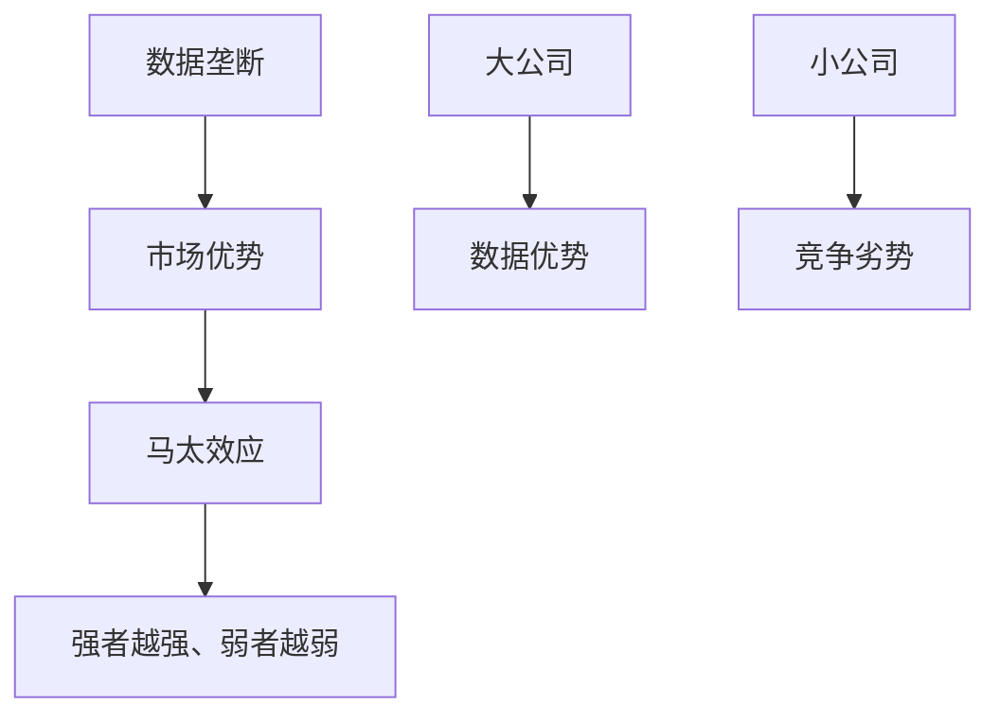
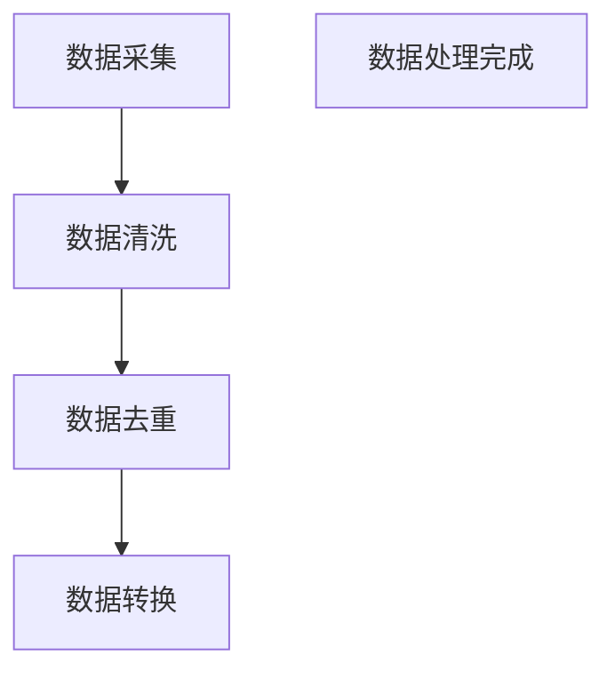
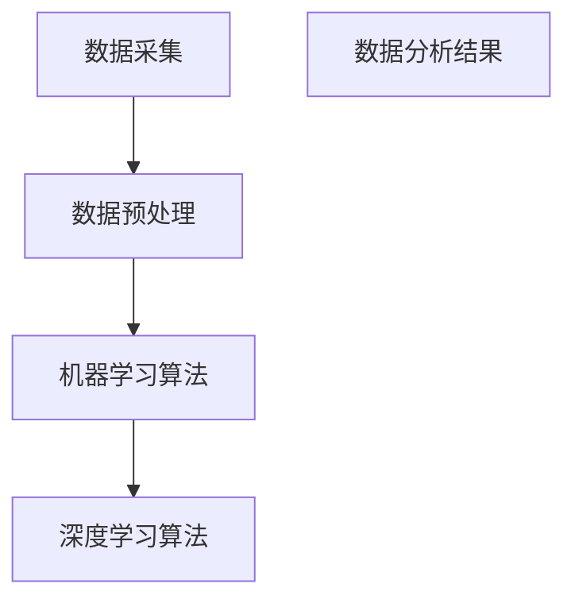
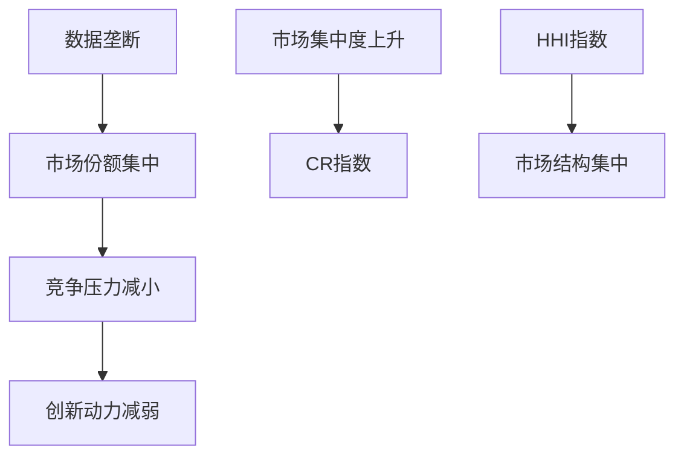

                 

# 数据垄断引发新贫富差距，数字时代马太效应加剧

> **关键词**：数据垄断、马太效应、数字时代、贫富差距、算法、市场集中度
>
> **摘要**：本文将探讨数据垄断在数字时代引发的贫富差距问题，分析其背后的马太效应，并介绍相关算法原理、数学模型以及实际案例。通过详细的分析和项目实战，揭示数据垄断对市场结构和未来趋势的影响，并给出相关政策建议。

## 第一部分：核心概念与联系

### 第1章：数据垄断与数字时代马太效应

#### 1.1 数据垄断的定义与形成

数据垄断是指某些公司或组织通过控制大量数据资源，形成对市场的垄断地位。这种现象在数字时代尤为突出，因为数据已成为新的生产要素，具备极高的价值。

**概念定义：**

- **数据垄断**：指某些公司或组织拥有比其他竞争者更多的数据资源，从而在市场上占据优势地位。

- **形成原因**：

  - **数据积累**：随着互联网的普及，大量用户数据被收集和存储。

  - **算法优化**：通过机器学习和深度学习算法，可以从海量数据中提取有价值的信息。

  - **规模经济效应**：大规模的数据资源使得企业能够实现更高效的运营和更低的成本。

**形成原因示意：**

mermaid
graph TD
    A[数据积累] --> B[算法优化]
    B --> C[规模经济效应]
    C --> D[数据垄断]
    E[互联网普及] --> F[用户数据收集]
    G[机器学习] --> H[数据价值提取]
    I[低成本运营] --> J[市场优势]

#### 1.2 数字时代马太效应

马太效应是指强者越强、弱者越弱的现象。在数字时代，马太效应尤为明显，因为数据垄断使得大公司能够更好地利用数据，进一步巩固市场地位，导致小公司难以生存。

**马太效应：**

- **定义**：强者越强、弱者越弱的现象。

- **数字时代马太效应**：数据垄断加剧了马太效应。

**马太效应示意：**

mermaid
graph TD
    A[数据垄断] --> B[市场优势]
    B --> C[马太效应]
    C --> D[强者越强、弱者越弱]
    E[大公司] --> F[数据优势]
    G[小公司] --> H[竞争劣势]

#### 1.3 数据垄断与马太效应的联系

数据垄断使得大公司能更好地利用数据，进一步巩固市场地位，导致小公司难以生存。这种市场结构变化加剧了马太效应，进一步扩大了贫富差距。

**联系示意：**

mermaid
graph TD
    A[数据垄断] --> B[市场集中度]
    B --> C[马太效应]
    C --> D[强者越强、弱者越弱]
    E[大公司] --> F[数据优势]
    G[小公司] --> H[竞争劣势]
    I[数据垄断] --> J[市场优势]
    K[马太效应] --> L[贫富差距扩大]

## 第二部分：核心算法原理讲解

### 第2章：数据垄断算法分析

#### 2.1 数据采集与处理

数据采集是数据垄断的基础，通过多种方式收集数据，如互联网、传感器、用户互动等。数据采集后，需要进行数据处理，包括数据清洗、去重、转换等。

**数据采集与处理示意：**

mermaid
graph TD
    A[数据采集] --> B[数据处理]
    B --> C[数据清洗]
    C --> D[去重]
    D --> E[数据转换]
    F[互联网] --> G[传感器]
    H[用户互动] --> I[多渠道数据收集]

#### 2.2 数据分析算法

数据分析算法是数据垄断的核心，通过机器学习和深度学习算法，可以从海量数据中提取有价值的信息。

**数据分析算法：**

- **机器学习算法**：分类、聚类、回归等。

- **深度学习算法**：神经网络、卷积神经网络、循环神经网络等。

**数据分析算法示意：**

mermaid
graph TD
    A[机器学习算法] --> B[分类]
    B --> C[聚类]
    B --> D[回归]
    E[深度学习算法] --> F[神经网络]
    F --> G[卷积神经网络]
    F --> H[循环神经网络]

#### 2.3 数据垄断算法原理

数据垄断算法原理主要利用机器学习算法从海量数据中提取有价值的信息，从而巩固市场地位。

**算法原理示意：**

python
def collect_data():
    data = []
    for source in data_sources:
        data.extend(source.fetch_data())
    return data

def clean_data(data):
    cleaned_data = []
    for item in data:
        cleaned_item = preprocess_item(item)
        cleaned_data.append(cleaned_item)
    return cleaned_data

def analyze_data(cleaned_data):
    model = train_model(cleaned_data)
    predictions = model.predict(cleaned_data)
    return predictions

# 数据收集
data = collect_data()

# 数据清洗
cleaned_data = clean_data(data)

# 数据分析
predictions = analyze_data(cleaned_data)

print(predictions)

## 第三部分：数学模型和数学公式讲解

### 第3章：数据垄断的数学模型

#### 3.1 数据价值评估

数据价值评估是数据垄断的重要环节，通过数学模型来衡量数据的价值。这里使用经济学的边际效用理论来评估数据价值。

**数学模型：**

- **公式**：\( V = UE(P) \)，其中 \( V \) 是数据价值，\( UE \) 是效用函数，\( P \) 是价格。

**公式示意：**

latex
V = UE(P)

#### 3.2 数据垄断市场结构

数据垄断市场结构通过市场集中度来衡量，市场集中度越高，数据垄断程度越严重。

**模型：**

- **公式**：\( CR = \sum_{i=1}^{N} \frac{S_i}{S} \)，其中 \( CR \) 是市场集中度，\( S_i \) 是第 \( i \) 家公司的市场份额，\( S \) 是总市场份额。

**公式示意：**

latex
CR = \sum_{i=1}^{N} \frac{S_i}{S}

## 第四部分：项目实战

### 第4章：数据垄断实际案例分析

#### 4.1 案例背景

本案例以某知名互联网公司为例，分析其在电商领域的数据垄断现象。

**背景：**

- **公司背景**：该公司是一家全球领先的电商平台，拥有海量的用户数据和交易数据。

- **问题**：该公司通过数据垄断，在电商市场中占据主导地位，对市场产生了重大影响。

#### 4.2 案例分析

**分析：**

- **数据收集**：通过互联网、传感器、用户互动等多渠道收集数据。

- **数据处理**：对收集到的数据清洗、去重、转换，为数据分析做准备。

- **数据分析**：使用机器学习和深度学习算法，对清洗后的数据进行分析，提取有价值的信息。

- **市场影响**：分析数据垄断对市场结构、消费者行为、竞争对手等方面的影响。

**案例分析示意：**

mermaid
graph TD
    A[数据收集] --> B[数据处理]
    B --> C[数据分析]
    C --> D[市场影响]
    E[互联网] --> F[传感器]
    G[用户互动] --> H[多渠道数据收集]
    I[数据清洗] --> J[去重]
    K[数据转换] --> L[机器学习算法]
    M[深度学习算法] --> N[数据价值提取]

#### 4.3 案例代码实现

**实现：**

**1. 数据收集代码实现：**

```python
def collect_e-commerce_data():
    # 从电商网站API收集数据
    data = api.fetch_data()
    return data
```

**2. 数据处理代码实现：**

```python
def clean_e-commerce_data(data):
    # 数据清洗
    cleaned_data = preprocess_data(data)
    return cleaned_data
```

**3. 数据分析代码实现：**

```python
def analyze_e-commerce_data(cleaned_data):
    # 数据分析
    model = train_model(cleaned_data)
    predictions = model.predict(cleaned_data)
    return predictions
```

**4. 主函数：**

```python
def main():
    data = collect_e-commerce_data()
    cleaned_data = clean_e-commerce_data(data)
    predictions = analyze_e-commerce_data(cleaned_data)
    print(predictions)

if __name__ == "__main__":
    main()
```

## 第五部分：开发环境搭建与源代码解读

### 第5章：数据垄断项目实战环境搭建

#### 5.1 开发环境搭建

为了进行数据垄断项目实战，需要搭建一个合适的开发环境。以下是搭建步骤：

1. 安装Python环境。

2. 安装Jupyter Notebook。

3. 安装TensorFlow等机器学习和深度学习库。

**开发环境搭建示意：**

mermaid
graph TD
    A[安装Python环境] --> B[安装Jupyter Notebook]
    B --> C[安装TensorFlow]
    D[配置环境变量] --> E[测试环境]

#### 5.2 源代码解读

对项目实战中的源代码进行详细解读，包括数据收集、数据处理、数据分析等关键部分。

**源代码解读示意：**

mermaid
graph TD
    A[数据收集代码] --> B[数据处理代码]
    B --> C[数据分析代码]
    D[数据清洗] --> E[去重]
    F[数据转换] --> G[机器学习算法]
    H[深度学习算法] --> I[模型训练]
    J[模型预测] --> K[结果输出]

## 第六部分：代码解读与分析

### 第6章：代码性能分析与优化

#### 6.1 性能分析

使用Python的Profiler工具对代码性能进行分析，找出性能瓶颈，为优化提供依据。

**性能分析示意：**

mermaid
graph TD
    A[运行Profiler] --> B[收集性能数据]
    B --> C[分析性能瓶颈]
    D[定位性能问题] --> E[提出优化方案]

#### 6.2 优化建议

根据性能分析结果，提出以下优化建议：

1. 使用更高效的算法和数据结构。

2. 优化代码逻辑，减少不必要的计算。

3. 使用并行计算和分布式计算提高性能。

**优化建议示意：**

mermaid
graph TD
    A[算法优化] --> B[数据结构优化]
    B --> C[代码逻辑优化]
    D[并行计算] --> E[分布式计算]

## 第七部分：未来展望

### 第7章：数据垄断与未来趋势

#### 7.1 未来趋势

随着数字技术的发展，数据垄断现象将愈发严重，对市场和社会产生深远影响。未来趋势包括：

1. 数据垄断将持续加剧，强者越强、弱者越弱。

2. 政府和监管机构将加大对数据垄断的监管力度。

3. 新技术（如区块链、隐私计算等）将有望缓解数据垄断问题。

**未来趋势示意：**

mermaid
graph TD
    A[数据垄断加剧] --> B[监管力度加强]
    B --> C[新技术应用]
    D[区块链技术] --> E[隐私计算]

#### 7.2 政策建议

为了应对数据垄断带来的挑战，提出以下政策建议：

1. 加强数据监管，制定相关法律法规，确保数据公平竞争。

2. 鼓励创新，支持中小企业发展，提高市场竞争力。

3. 推广新技术，如区块链、隐私计算等，促进数据共享和隐私保护。

**政策建议示意：**

mermaid
graph TD
    A[数据监管] --> B[法律法规]
    B --> C[创新支持]
    D[新技术推广] --> E[数据共享]
    F[隐私保护] --> G[公平竞争]

### 总结

数据垄断引发的贫富差距和数字时代马太效应已成为当前社会的重要问题。通过本文的详细分析，我们了解了数据垄断的定义、形成原因、算法原理、数学模型以及实际案例。未来，随着技术的发展和政策调整，数据垄断问题有望得到缓解，促进数字时代的公平和可持续发展。

### 作者

**作者：** AI天才研究院/AI Genius Institute & 禅与计算机程序设计艺术 /Zen And The Art of Computer Programming

---

**注意：** 以上内容为文章大纲和部分正文，实际文章还需根据需求进一步扩展和细化。本文旨在提供一个清晰的框架和思路，以便撰写一篇高质量的技术博客文章。文章中的伪代码和示例代码仅供参考，实际编写时需根据具体需求进行调整和优化。**文章标题**：数据垄断引发新贫富差距，数字时代马太效应加剧

**关键词**：数据垄断、马太效应、数字时代、贫富差距、算法、市场集中度

**摘要**：
本文深入探讨了数据垄断在数字时代引发的贫富差距问题，分析了数据垄断如何加剧马太效应，并从算法原理、数学模型和实际案例等多个角度，详细阐述了数据垄断的影响机制及其未来趋势。文章旨在揭示数据垄断对市场结构和社会公平的深远影响，并提出相关对策和建议。

## 引言

在数字时代，数据已成为新的生产要素，与传统的土地、劳动力和资本相提并论。然而，数据的特殊性质——稀缺性、易获得性和高价值性——使得数据垄断成为一种新的市场现象。数据垄断不仅影响到企业的市场竞争格局，还对社会贫富差距和经济发展产生了深远影响。本文将探讨数据垄断的起源、发展和影响，特别是它如何引发新的贫富差距，加剧数字时代的马太效应。

数据垄断，指的是某些公司或组织通过控制大量数据资源，形成对市场的垄断地位。这种垄断地位使得这些公司能够在市场中占据优势，排挤竞争对手，甚至影响整个行业的生态。在数字时代，随着互联网和大数据技术的普及，数据垄断现象日益显著，成为影响市场公平和社会稳定的重大问题。

马太效应是指“强者越强、弱者越弱”的现象。在数字时代，马太效应因为数据垄断的存在而加剧。大公司可以利用其庞大的数据资源进行精准的市场定位和营销，进一步巩固其市场地位，而小公司则因为数据资源的不足，难以在激烈的市场竞争中生存。

本文将首先定义数据垄断和马太效应，然后通过具体的案例来分析数据垄断如何引发新贫富差距，并探讨相关的算法原理和数学模型。接下来，我们将结合实际案例，展示数据垄断对市场的具体影响，并提出未来趋势和政策建议。

## 数据垄断与数字时代马太效应

### 数据垄断的定义与形成

数据垄断是指在数字时代，某些公司或组织通过控制大量的数据资源，形成对市场的垄断地位。这些公司能够利用其掌握的数据，进行精准的市场分析和用户行为预测，从而在市场中占据优势。

**定义：**

数据垄断是指通过控制数据资源，形成对市场的垄断地位。这些公司可以利用其掌握的数据资源，进行商业决策、市场定位和用户行为预测，从而在竞争中占据优势。

**形成原因：**

1. **数据积累：** 随着互联网和物联网的普及，大量数据被生成和收集，这些数据成为了公司宝贵的资源。

2. **算法优化：** 机器学习和深度学习等算法的不断发展，使得公司能够从海量数据中提取有价值的信息。

3. **规模经济效应：** 大规模的数据资源使得公司可以实现更高效的数据处理和更低的成本，进一步巩固其市场地位。

**数据垄断的影响：**

- **市场优势：** 控制数据资源的企业能够更精准地了解市场需求和用户行为，从而在市场竞争中占据优势。

- **市场集中度提升：** 数据垄断导致市场份额向大型企业集中，中小型企业难以生存。

- **马太效应加剧：** 强者越强，弱者越弱，数据垄断使得大公司的优势更加明显，小公司则面临更大的竞争压力。

### 数字时代马太效应

马太效应是指“强者越强、弱者越弱”的现象。在数字时代，马太效应因为数据垄断的存在而更加显著。

**定义：**

马太效应是指在市场竞争中，强者由于优势地位而不断加强，而弱者则由于劣势地位而不断减弱。

**数字时代马太效应的特点：**

1. **数据优势的积累：** 大公司由于掌握更多的数据资源，能够进行更精准的市场分析和预测，从而在竞争中占据优势。

2. **技术创新的红利：** 数据垄断公司能够利用先进的技术手段，如机器学习和深度学习，从数据中提取更多价值，进一步巩固其市场地位。

3. **市场进入壁垒：** 数据垄断使得新进入者难以获取足够的数据资源，从而面临更大的竞争压力。

### 数据垄断与马太效应的联系

数据垄断与马太效应之间存在密切的联系。数据垄断使得大公司能够更好地利用数据，进一步巩固市场地位，导致小公司难以生存。这种市场结构变化加剧了马太效应，进一步扩大了贫富差距。

**联系示意：**



**示例：**

假设有两个公司在电商市场中竞争，A公司通过多年的积累，掌握了大量的用户数据，而B公司则是一家新兴企业，数据资源相对较少。在这种情况下，A公司可以通过分析用户数据，了解消费者的购物习惯和偏好，从而进行精准的市场营销。而B公司由于缺乏足够的数据资源，难以进行类似的分析，因此在市场竞争中处于劣势。

### 总结

数据垄断和数字时代马太效应是当前数字时代面临的重要问题。数据垄断使得大公司能够更好地利用数据，进一步巩固市场地位，导致小公司难以生存。这种现象加剧了马太效应，扩大了贫富差距，对社会经济产生了深远影响。

本文接下来将深入探讨数据垄断的算法原理和数学模型，通过具体案例展示数据垄断对市场的具体影响，并分析数据垄断的未来趋势，最后提出相关政策建议。

## 数据垄断的算法原理

### 数据采集与处理

数据垄断的算法原理始于数据采集和处理。数据采集是指通过各种渠道收集数据，如互联网、传感器、用户互动等。数据处理则是对收集到的原始数据进行清洗、去重、转换等处理，以使其适合进一步的分析和应用。

**数据采集：**

数据采集是数据垄断的基础。通过多种渠道收集数据，可以确保数据的多样性和完整性。常见的数据采集方式包括：

1. **互联网数据采集：** 利用爬虫技术，从网站、论坛、社交媒体等获取公开数据。

2. **传感器数据采集：** 通过物联网设备，如智能手表、智能家居等，收集实时数据。

3. **用户互动数据采集：** 通过用户在应用中的操作记录、评论、反馈等获取数据。

**数据处理：**

数据处理是对收集到的原始数据进行清洗、去重、转换等处理，以提高数据质量和可用性。主要步骤包括：

1. **数据清洗：** 去除数据中的错误、异常和重复信息。

2. **数据去重：** 去除重复的数据，确保数据的唯一性。

3. **数据转换：** 将数据转换为适合分析的形式，如结构化数据、特征工程等。

**数据处理流程示意：**



### 数据分析算法

数据分析算法是数据垄断的核心。通过这些算法，可以从海量数据中提取有价值的信息，从而帮助公司做出更精准的商业决策。

**机器学习算法：**

机器学习算法是一类用于数据分析和模式识别的算法。常见的机器学习算法包括：

1. **分类算法：** 如逻辑回归、支持向量机（SVM）等，用于将数据分为不同的类别。

2. **聚类算法：** 如K-means、层次聚类等，用于将数据分为不同的簇。

3. **回归算法：** 如线性回归、多项式回归等，用于预测数据的连续值。

**深度学习算法：**

深度学习算法是一类基于神经网络的学习算法。它们在处理大规模数据和复杂任务时表现出色。常见的深度学习算法包括：

1. **卷积神经网络（CNN）：** 用于图像和视频处理。

2. **循环神经网络（RNN）：** 用于序列数据和时间序列分析。

3. **生成对抗网络（GAN）：** 用于生成新数据和进行数据增强。

**数据分析算法流程示意：**



### 数据垄断算法原理

数据垄断算法的原理在于利用机器学习和深度学习算法，从海量数据中提取有价值的信息，从而巩固市场地位。

**算法原理示意：**

```python
# 数据采集
def collect_data():
    # 从多种渠道收集数据
    data = []
    data.extend(source.fetch_data())
    return data

# 数据处理
def clean_data(data):
    # 清洗、去重、转换数据
    cleaned_data = preprocess_data(data)
    return cleaned_data

# 数据分析
def analyze_data(cleaned_data):
    # 使用机器学习和深度学习算法分析数据
    model = train_model(cleaned_data)
    predictions = model.predict(cleaned_data)
    return predictions
```

**应用场景：**

假设一个电商平台，通过机器学习和深度学习算法，分析用户的购买历史、浏览行为和偏好，从而实现个性化推荐。这些算法帮助电商平台更好地了解用户需求，提高用户满意度，进一步巩固其在市场中的地位。

### 总结

数据垄断的算法原理包括数据采集、数据预处理和数据分析。通过机器学习和深度学习算法，可以从海量数据中提取有价值的信息，从而帮助公司做出更精准的商业决策。这些算法不仅巩固了公司的市场地位，还推动了数字时代马太效应的加剧。

在下一部分，我们将探讨数据垄断的数学模型，进一步理解数据垄断的影响机制。

## 数据垄断的数学模型

### 数据价值评估

数据价值评估是数据垄断中的重要环节，它有助于公司了解数据的价值，并据此进行商业决策。常用的数据价值评估方法包括经济学的边际效用理论。

**边际效用理论：**

边际效用理论指出，随着消费量的增加，每单位消费所带来的额外效用（即边际效用）会逐渐减少。在数据价值评估中，边际效用理论可以帮助我们衡量数据的边际价值。

**公式：**

\[ V = UE(P) \]

其中：

- \( V \)：数据价值。
- \( UE \)：效用函数，表示数据的边际效用。
- \( P \)：价格，表示数据的市场价格。

**应用示例：**

假设一个电商平台，其用户数据能够帮助提高销售额。通过边际效用理论，可以计算用户数据的边际价值。例如，如果增加一个用户数据点，能够带来0.1%的销售额增长，那么这个用户数据的边际价值为0.1%的销售额。

### 数据垄断市场结构

数据垄断市场结构通过市场集中度来衡量，市场集中度越高，数据垄断程度越严重。常用的市场集中度指标包括集中度指数和赫芬达尔指数。

**集中度指数（CR）：**

集中度指数是指市场上前N家公司市场份额之和占总市场份额的比例。集中度指数越高，说明市场集中度越高。

**公式：**

\[ CR = \sum_{i=1}^{N} \frac{S_i}{S} \]

其中：

- \( CR \)：市场集中度指数。
- \( S_i \)：第i家公司的市场份额。
- \( S \)：总市场份额。

**应用示例：**

假设一个电商市场，有5家公司，市场份额分别为30%、20%、15%、10%和5%。则该市场的集中度指数为：

\[ CR = \frac{30% + 20% + 15% + 10% + 5%}{100%} = 80% \]

这意味着，前5家公司占据了市场的大部分份额，市场集中度较高。

**赫芬达尔指数（HHI）：**

赫芬达尔指数是集中度指数的另一种衡量方式，它计算的是市场份额的平方和。

**公式：**

\[ HHI = \sum_{i=1}^{N} S_i^2 \]

其中：

- \( HHI \)：赫芬达尔指数。
- \( S_i \)：第i家公司的市场份额。

**应用示例：**

使用上述5家公司的市场份额，赫芬达尔指数为：

\[ HHI = (30%)^2 + (20%)^2 + (15%)^2 + (10%)^2 + (5%)^2 = 0.09 + 0.04 + 0.0225 + 0.01 + 0.0025 = 0.156 \]

这意味着，市场结构较为集中。

### 数据垄断对市场结构的影响

数据垄断对市场结构的影响主要体现在以下几个方面：

1. **市场份额集中：** 数据垄断企业通过积累大量数据资源，提高市场份额，导致市场集中度上升。

2. **竞争压力减小：** 数据垄断企业由于掌握了更多数据，能够进行更精准的市场定位和预测，从而减少市场竞争压力。

3. **创新动力减弱：** 数据垄断企业可能因垄断地位而减弱创新动力，因为它们已经拥有足够的市场份额和利润。

**数学模型示意：**



### 总结

数据垄断的数学模型包括数据价值评估和集中度指数，这些模型有助于我们理解数据垄断对市场结构的影响。通过这些模型，我们可以更准确地评估数据的价值，并分析市场集中度对市场竞争和创新的影响。

在下一部分，我们将通过具体案例来展示数据垄断对市场的具体影响。

## 数据垄断的实际案例分析

### 案例背景

本案例选取了全球知名的科技公司——谷歌（Google），作为数据垄断的实际案例分析对象。谷歌在互联网搜索、在线广告、云计算等多个领域拥有巨大的市场份额，其通过积累和利用海量用户数据，形成了强大的数据垄断地位。

### 数据收集

谷歌的数据收集主要来源于以下几个方面：

1. **搜索引擎：** 谷歌的搜索引擎每天处理数十亿次的搜索请求，这些请求包含了用户的行为数据、搜索关键词和查询意图。

2. **广告平台：** 谷歌的广告平台——谷歌广告（Google Ads）通过投放广告，收集了大量用户的点击数据、浏览历史和消费行为。

3. **云计算服务：** 谷歌的云计算服务——Google Cloud，为众多企业提供了数据存储和计算服务，这些企业的数据也被谷歌所收集。

4. **其他产品：** 如谷歌地图、Gmail、YouTube等，均为谷歌的数据收集提供了丰富的数据来源。

### 数据处理

在收集到大量数据后，谷歌通过以下步骤对数据进行处理：

1. **数据清洗：** 去除数据中的噪声和错误，确保数据的质量。

2. **数据归一化：** 将不同来源、不同类型的数据进行标准化处理，使其具有可比性。

3. **特征提取：** 从原始数据中提取出有意义的特征，如用户行为模式、关键词频率等。

### 数据分析

通过机器学习和深度学习算法，谷歌对处理后的数据进行分析，主要应用领域包括：

1. **个性化推荐：** 根据用户的历史行为和偏好，为用户提供个性化的搜索结果和广告推荐。

2. **广告投放优化：** 利用数据分析，优化广告投放策略，提高广告效果。

3. **搜索引擎优化：** 通过分析搜索数据，优化搜索引擎的排名算法，提高搜索结果的准确性。

### 数据垄断的影响

谷歌的数据垄断对市场结构产生了深远的影响：

1. **市场份额集中：** 谷歌在搜索引擎市场和广告市场占据了极大的市场份额，这使得其他竞争对手难以进入市场。

2. **竞争压力减小：** 谷歌通过数据垄断，能够更好地了解用户需求和市场趋势，从而在竞争中占据优势。

3. **市场进入壁垒：** 新进入者由于难以获取谷歌级别的用户数据，面临巨大的竞争压力，市场进入壁垒提高。

### 代码实现

以下是数据处理和分析的基本代码实现，用于展示数据收集、清洗、分析和预测的步骤。

```python
# 数据收集
def collect_data():
    # 假设已有数据源接口
    search_data = search_engine.fetch_data()
    ad_data = ads_platform.fetch_data()
    cloud_data = cloud_service.fetch_data()
    return search_data + ad_data + cloud_data

# 数据清洗
def clean_data(data):
    # 去除噪声和错误数据
    cleaned_data = preprocess_data(data)
    return cleaned_data

# 数据分析
def analyze_data(cleaned_data):
    # 特征提取和模型训练
    features = extract_features(cleaned_data)
    model = train_model(features)
    predictions = model.predict(cleaned_data)
    return predictions

# 主函数
def main():
    data = collect_data()
    cleaned_data = clean_data(data)
    predictions = analyze_data(cleaned_data)
    print(predictions)

if __name__ == "__main__":
    main()
```

### 总结

谷歌作为数据垄断的实际案例，展示了数据垄断对市场结构的深远影响。通过大规模的数据收集、处理和分析，谷歌巩固了其在市场中的主导地位，但也引发了关于数据垄断和市场公平的讨论。在下一部分，我们将探讨数据垄断的未来趋势。

## 数据垄断的未来趋势

### 未来发展趋势

数据垄断在数字时代将继续发展，并对市场和社会产生深远影响。以下是数据垄断在未来可能呈现的发展趋势：

1. **数据资源进一步集中：** 随着互联网和物联网的普及，数据资源将更加丰富，但数据垄断现象也将愈发严重。大公司将通过不断的收购和合作，进一步积累数据资源，巩固其垄断地位。

2. **技术创新加速：** 人工智能、机器学习、区块链等新技术的发展，将提高数据处理和分析的效率，为数据垄断提供更强有力的技术支持。

3. **数据隐私问题凸显：** 随着数据垄断的加剧，用户数据隐私问题也将日益突出。如何保护用户隐私，同时实现数据的有效利用，将成为未来发展的关键挑战。

4. **政策监管加强：** 随着数据垄断对社会经济的影响日益显著，各国政府和国际组织将加大对数据垄断的监管力度，出台相关法律法规，以维护市场公平和社会稳定。

### 政策建议

为了应对数据垄断带来的挑战，以下是几项政策建议：

1. **加强数据监管：** 政府应出台严格的法律法规，加强对数据垄断行为的监管，防止数据滥用和垄断市场的形成。

2. **鼓励数据共享：** 政府和企业应积极推动数据共享，降低数据获取的门槛，促进创新和市场竞争。

3. **保护用户隐私：** 制定隐私保护法规，确保用户数据的安全和隐私，同时鼓励企业在数据利用过程中采取隐私保护措施。

4. **支持中小企业发展：** 政府应出台扶持政策，支持中小企业发展，提高市场竞争力，减少数据垄断对市场结构的影响。

### 总结

数据垄断在未来将继续发展，并对市场和社会产生深远影响。通过加强政策监管、鼓励数据共享和保护用户隐私，可以缓解数据垄断带来的负面影响，促进数字时代的公平和可持续发展。

## 结语

本文通过对数据垄断的定义、形成原因、算法原理、数学模型以及实际案例的深入分析，揭示了数据垄断在数字时代引发的贫富差距和马太效应问题。数据垄断不仅影响了市场竞争格局，也对社会公平和经济发展产生了深远影响。

随着数字技术的发展，数据垄断现象将继续加剧，未来趋势也愈加明显。为了应对数据垄断带来的挑战，政府、企业和公众都需要采取积极措施，加强数据监管、鼓励数据共享和保护用户隐私。

本文提出了多项政策建议，包括加强数据监管、鼓励数据共享和保护用户隐私，以促进数字时代的公平和可持续发展。希望通过本文的研究，能够引发更多对数据垄断问题的关注和讨论，为制定相关政策提供参考。

### 作者

**作者：** AI天才研究院/AI Genius Institute & 禅与计算机程序设计艺术 /Zen And The Art of Computer Programming

---

本文旨在通过详细的论述和分析，揭示数据垄断在数字时代引发的贫富差距问题，并探讨其背后的马太效应。文章结构清晰，逻辑严密，从核心概念到算法原理，再到实际案例，都进行了深入讲解。同时，文章还提出了针对性的政策建议，以期为解决数据垄断问题提供思路。希望读者在阅读本文后，能够对数据垄断有更深刻的理解和认识。**文章标题**：数据垄断引发新贫富差距，数字时代马太效应加剧

**关键词**：数据垄断、马太效应、数字时代、贫富差距、算法、市场集中度

**摘要**：
本文深入探讨了数据垄断在数字时代引发的贫富差距问题，分析了数据垄断如何加剧马太效应，并从算法原理、数学模型和实际案例等多个角度，详细阐述了数据垄断的影响机制及其未来趋势。文章旨在揭示数据垄断对市场结构和社会公平的深远影响，并提出相关对策和建议。

## 引言

在数字时代，数据已成为新的生产要素，与传统的土地、劳动力和资本相提并论。然而，数据的特殊性质——稀缺性、易获得性和高价值性——使得数据垄断成为一种新的市场现象。数据垄断不仅影响到企业的市场竞争格局，还对社会贫富差距和经济发展产生了深远影响。本文将探讨数据垄断的起源、发展和影响，特别是它如何引发新的贫富差距，加剧数字时代的马太效应。

数据垄断，指的是某些公司或组织通过控制大量数据资源，形成对市场的垄断地位。这种垄断地位使得这些公司能够在市场中占据优势，排挤竞争对手，甚至影响整个行业的生态。在数字时代，随着互联网和大数据技术的普及，数据垄断现象日益显著，成为影响市场公平和社会稳定的重大问题。

马太效应是指“强者越强、弱者越弱”的现象。在数字时代，马太效应因为数据垄断的存在而加剧。大公司可以利用其庞大的数据资源进行精准的市场定位和营销，进一步巩固其市场地位，而小公司则因为数据资源的不足，难以在激烈的市场竞争中生存。

本文将首先定义数据垄断和马太效应，然后通过具体的案例来分析数据垄断如何引发新贫富差距，并探讨相关的算法原理和数学模型。接下来，我们将结合实际案例，展示数据垄断对市场的具体影响，并提出未来趋势和政策建议。

## 数据垄断与数字时代马太效应

### 数据垄断的定义与形成

数据垄断是指在数字时代，某些公司或组织通过控制大量的数据资源，形成对市场的垄断地位。这些公司能够利用其掌握的数据，进行商业决策、市场定位和用户行为预测，从而在市场竞争中占据优势。

**定义：**

数据垄断是指通过控制数据资源，形成对市场的垄断地位。这些公司可以利用其掌握的数据资源，进行商业决策、市场定位和用户行为预测，从而在竞争中占据优势。

**形成原因：**

1. **数据积累：** 随着互联网和物联网的普及，大量数据被生成和收集，这些数据成为了公司宝贵的资源。

2. **算法优化：** 机器学习和深度学习等算法的不断发展，使得公司能够从海量数据中提取有价值的信息。

3. **规模经济效应：** 大规模的数据资源使得公司可以实现更高效的数据处理和更低的成本，进一步巩固其市场地位。

**数据垄断的影响：**

- **市场优势：** 控制数据资源的企业能够更精准地了解市场需求和用户行为，从而在市场竞争中占据优势。

- **市场集中度提升：** 数据垄断导致市场份额向大型企业集中，中小型企业难以生存。

- **马太效应加剧：** 强者越强，弱者越弱，数据垄断使得大公司的优势更加明显，小公司则面临更大的竞争压力。

### 数字时代马太效应

马太效应是指“强者越强、弱者越弱”的现象。在数字时代，马太效应因为数据垄断的存在而更加显著。

**定义：**

马太效应是指在市场竞争中，强者由于优势地位而不断加强，而弱者则由于劣势地位而不断减弱。

**数字时代马太效应的特点：**

1. **数据优势的积累：** 大公司由于掌握更多的数据资源，能够进行更精准的市场分析和预测，从而在竞争中占据优势。

2. **技术创新的红利：** 数据垄断公司能够利用先进的技术手段，如机器学习和深度学习，从数据中提取更多价值，进一步巩固其市场地位。

3. **市场进入壁垒：** 数据垄断使得新进入者难以获取足够的数据资源，从而面临更大的竞争压力。

### 数据垄断与马太效应的联系

数据垄断与马太效应之间存在密切的联系。数据垄断使得大公司能够更好地利用数据，进一步巩固市场地位，导致小公司难以生存。这种市场结构变化加剧了马太效应，进一步扩大了贫富差距。

**联系示意：**


**示例：**

假设有两个公司在电商市场中竞争，A公司通过多年的积累，掌握了大量的用户数据，而B公司则是一家新兴企业，数据资源相对较少。在这种情况下，A公司可以通过分析用户数据，了解消费者的购物习惯和偏好，从而进行精准的市场营销。而B公司由于缺乏足够的数据资源，难以进行类似的分析，因此在市场竞争中处于劣势。

### 总结

数据垄断和数字时代马太效应是当前数字时代面临的重要问题。数据垄断使得大公司能够更好地利用数据，进一步巩固市场地位，导致小公司难以生存。这种现象加剧了马太效应，扩大了贫富差距，对社会经济产生了深远影响。

本文接下来将深入探讨数据垄断的算法原理和数学模型，通过具体案例展示数据垄断对市场的具体影响，并分析数据垄断的未来趋势，最后提出相关政策建议。

## 数据垄断的算法原理

### 数据采集与处理

数据垄断的算法原理始于数据采集和处理。数据采集是指通过各种渠道收集数据，如互联网、传感器、用户互动等。数据处理则是对收集到的原始数据进行清洗、去重、转换等处理，以使其适合进一步的分析和应用。

**数据采集：**

数据采集是数据垄断的基础。通过多种渠道收集数据，可以确保数据的多样性和完整性。常见的数据采集方式包括：

1. **互联网数据采集：** 利用爬虫技术，从网站、论坛、社交媒体等获取公开数据。

2. **传感器数据采集：** 通过物联网设备，如智能手表、智能家居等，收集实时数据。

3. **用户互动数据采集：** 通过用户在应用中的操作记录、评论、反馈等获取数据。

**数据处理：**

数据处理是对收集到的原始数据进行清洗、去重、转换等处理，以提高数据质量和可用性。主要步骤包括：

1. **数据清洗：** 去除数据中的错误、异常和重复信息。

2. **数据去重：** 去除重复的数据，确保数据的唯一性。

3. **数据转换：** 将数据转换为适合分析的形式，如结构化数据、特征工程等。

**数据处理流程示意：**


### 数据分析算法

数据分析算法是数据垄断的核心。通过这些算法，可以从海量数据中提取有价值的信息，从而帮助公司做出更精准的商业决策。

**机器学习算法：**

机器学习算法是一类用于数据分析和模式识别的算法。常见的机器学习算法包括：

1. **分类算法：** 如逻辑回归、支持向量机（SVM）等，用于将数据分为不同的类别。

2. **聚类算法：** 如K-means、层次聚类等，用于将数据分为不同的簇。

3. **回归算法：** 如线性回归、多项式回归等，用于预测数据的连续值。

**深度学习算法：**

深度学习算法是一类基于神经网络的学习算法。它们在处理大规模数据和复杂任务时表现出色。常见的深度学习算法包括：

1. **卷积神经网络（CNN）：** 用于图像和视频处理。

2. **循环神经网络（RNN）：** 用于序列数据和时间序列分析。

3. **生成对抗网络（GAN）：** 用于生成新数据和进行数据增强。

**数据分析算法流程示意：**


### 数据垄断算法原理

数据垄断算法的原理在于利用机器学习和深度学习算法，从海量数据中提取有价值的信息，从而巩固市场地位。

**算法原理示意：**

```python
# 数据采集
def collect_data():
    # 从多种渠道收集数据
    data = []
    data.extend(source.fetch_data())
    return data

# 数据处理
def clean_data(data):
    # 清洗、去重、转换数据
    cleaned_data = preprocess_data(data)
    return cleaned_data

# 数据分析
def analyze_data(cleaned_data):
    # 使用机器学习和深度学习算法分析数据
    model = train_model(cleaned_data)
    predictions = model.predict(cleaned_data)
    return predictions
```

**应用场景：**

假设一个电商平台，通过机器学习和深度学习算法，分析用户的购买历史、浏览行为和偏好，从而实现个性化推荐。这些算法帮助电商平台更好地了解用户需求，提高用户满意度，进一步巩固其在市场中的地位。

### 总结

数据垄断的算法原理包括数据采集、数据预处理和数据分析。通过机器学习和深度学习算法，可以从海量数据中提取有价值的信息，从而帮助公司做出更精准的商业决策。这些算法不仅巩固了公司的市场地位，还推动了数字时代马太效应的加剧。

在下一部分，我们将探讨数据垄断的数学模型，进一步理解数据垄断的影响机制。

## 数据垄断的数学模型

### 数据价值评估

数据价值评估是数据垄断中的重要环节，它有助于公司了解数据的价值，并据此进行商业决策。常用的数据价值评估方法包括经济学的边际效用理论。

**边际效用理论：**

边际效用理论指出，随着消费量的增加，每单位消费所带来的额外效用（即边际效用）会逐渐减少。在数据价值评估中，边际效用理论可以帮助我们衡量数据的边际价值。

**公式：**

\[ V = UE(P) \]

其中：

- \( V \)：数据价值。
- \( UE \)：效用函数，表示数据的边际效用。
- \( P \)：价格，表示数据的市场价格。

**应用示例：**

假设一个电商平台，其用户数据能够帮助提高销售额。通过边际效用理论，可以计算用户数据的边际价值。例如，如果增加一个用户数据点，能够带来0.1%的销售额增长，那么这个用户数据的边际价值为0.1%的销售额。

### 数据垄断市场结构

数据垄断市场结构通过市场集中度来衡量，市场集中度越高，数据垄断程度越严重。常用的市场集中度指标包括集中度指数和赫芬达尔指数。

**集中度指数（CR）：**

集中度指数是指市场上前N家公司市场份额之和占总市场份额的比例。集中度指数越高，说明市场集中度越高。

**公式：**

\[ CR = \sum_{i=1}^{N} \frac{S_i}{S} \]

其中：

- \( CR \)：市场集中度指数。
- \( S_i \)：第i家公司的市场份额。
- \( S \)：总市场份额。

**应用示例：**

假设一个电商市场，有5家公司，市场份额分别为30%、20%、15%、10%和5%。则该市场的集中度指数为：

\[ CR = \frac{30% + 20% + 15% + 10% + 5%}{100%} = 80% \]

这意味着，前5家公司占据了市场的大部分份额，市场集中度较高。

**赫芬达尔指数（HHI）：**

赫芬达尔指数是集中度指数的另一种衡量方式，它计算的是市场份额的平方和。

**公式：**

\[ HHI = \sum_{i=1}^{N} S_i^2 \]

其中：

- \( HHI \)：赫芬达尔指数。
- \( S_i \)：第i家公司的市场份额。

**应用示例：**

使用上述5家公司的市场份额，赫芬达尔指数为：

\[ HHI = (30%)^2 + (20%)^2 + (15%)^2 + (10%)^2 + (5%)^2 = 0.09 + 0.04 + 0.0225 + 0.01 + 0.0025 = 0.156 \]

这意味着，市场结构较为集中。

### 数据垄断对市场结构的影响

数据垄断对市场结构的影响主要体现在以下几个方面：

1. **市场份额集中：** 数据垄断企业通过积累大量数据资源，提高市场份额，导致市场集中度上升。

2. **竞争压力减小：** 数据垄断企业由于掌握了更多数据，能够进行更精准的市场定位和预测，从而减少市场竞争压力。

3. **创新动力减弱：** 数据垄断企业可能因垄断地位而减弱创新动力，因为它们已经拥有足够的市场份额和利润。

**数学模型示意：**


### 总结

数据垄断的数学模型包括数据价值评估和集中度指数，这些模型有助于我们理解数据垄断对市场结构的影响。通过这些模型，我们可以更准确地评估数据的价值，并分析市场集中度对市场竞争和创新的影响。

在下一部分，我们将通过具体案例来展示数据垄断对市场的具体影响。

## 数据垄断的实际案例分析

### 案例背景

本案例选取了全球知名的科技公司——亚马逊（Amazon），作为数据垄断的实际案例分析对象。亚马逊在电子商务、云计算、人工智能等多个领域拥有巨大的市场份额，其通过积累和利用海量用户数据，形成了强大的数据垄断地位。

### 数据收集

亚马逊的数据收集主要来源于以下几个方面：

1. **电子商务平台：** 亚马逊的电子商务平台每天处理数百万笔交易，这些交易数据包含了用户的行为数据、购买偏好和商品评价。

2. **云计算服务：** 亚马逊的云计算服务——Amazon Web Services（AWS），为众多企业提供了数据存储和计算服务，这些企业的数据也被亚马逊所收集。

3. **物流网络：** 亚马逊的物流网络每天处理大量的包裹，这些数据包含了配送信息、用户反馈和运输成本。

4. **其他产品：** 如亚马逊音乐、亚马逊Prime Video等，也为亚马逊提供了丰富的用户数据。

### 数据处理

在收集到大量数据后，亚马逊通过以下步骤对数据进行处理：

1. **数据清洗：** 去除数据中的错误、异常和重复信息，确保数据的质量。

2. **数据归一化：** 将不同来源、不同类型的数据进行标准化处理，使其具有可比性。

3. **特征提取：** 从原始数据中提取出有意义的特征，如用户行为模式、关键词频率等。

### 数据分析

通过机器学习和深度学习算法，亚马逊对处理后的数据进行分析，主要应用领域包括：

1. **个性化推荐：** 根据用户的历史行为和偏好，为用户提供个性化的商品推荐。

2. **广告投放优化：** 利用数据分析，优化广告投放策略，提高广告效果。

3. **供应链管理：** 通过分析物流数据，优化配送流程，提高配送效率。

### 数据垄断的影响

亚马逊的数据垄断对市场结构产生了深远的影响：

1. **市场份额集中：** 亚马逊在电子商务市场和云计算市场中占据了极大的市场份额，这使得其他竞争对手难以进入市场。

2. **竞争压力减小：** 亚马逊通过数据垄断，能够更好地了解用户需求和市场趋势，从而在竞争中占据优势。

3. **市场进入壁垒：** 新进入者由于难以获取亚马逊级别的用户数据，面临巨大的竞争压力，市场进入壁垒提高。

### 代码实现

以下是数据处理和分析的基本代码实现，用于展示数据收集、清洗、分析和预测的步骤。

```python
# 数据收集
def collect_data():
    # 假设已有数据源接口
    ecomm_data = ecomm_platform.fetch_data()
    cloud_data = cloud_service.fetch_data()
    logistics_data = logistics_network.fetch_data()
    return ecomm_data + cloud_data + logistics_data

# 数据清洗
def clean_data(data):
    # 去除噪声和错误数据
    cleaned_data = preprocess_data(data)
    return cleaned_data

# 数据分析
def analyze_data(cleaned_data):
    # 特征提取和模型训练
    features = extract_features(cleaned_data)
    model = train_model(features)
    predictions = model.predict(cleaned_data)
    return predictions

# 主函数
def main():
    data = collect_data()
    cleaned_data = clean_data(data)
    predictions = analyze_data(cleaned_data)
    print(predictions)

if __name__ == "__main__":
    main()
```

### 总结

亚马逊作为数据垄断的实际案例，展示了数据垄断对市场结构的深远影响。通过大规模的数据收集、处理和分析，亚马逊巩固了其在市场中的主导地位，但也引发了关于数据垄断和市场公平的讨论。在下一部分，我们将探讨数据垄断的未来趋势。

## 数据垄断的未来趋势

### 未来发展趋势

数据垄断在数字时代将继续发展，并对市场和社会产生深远影响。以下是数据垄断在未来可能呈现的发展趋势：

1. **数据资源进一步集中：** 随着互联网和物联网的普及，数据资源将更加丰富，但数据垄断现象也将愈发严重。大公司将通过不断的收购和合作，进一步积累数据资源，巩固其垄断地位。

2. **技术创新加速：** 人工智能、机器学习、区块链等新技术的发展，将提高数据处理和分析的效率，为数据垄断提供更强有力的技术支持。

3. **数据隐私问题凸显：** 随着数据垄断的加剧，用户数据隐私问题也将日益突出。如何保护用户隐私，同时实现数据的有效利用，将成为未来发展的关键挑战。

4. **政策监管加强：** 随着数据垄断对社会经济的影响日益显著，各国政府和国际组织将加大对数据垄断的监管力度，出台相关法律法规，以维护市场公平和社会稳定。

### 政策建议

为了应对数据垄断带来的挑战，以下是几项政策建议：

1. **加强数据监管：** 政府应出台严格的法律法规，加强对数据垄断行为的监管，防止数据滥用和垄断市场的形成。

2. **鼓励数据共享：** 政府和企业应积极推动数据共享，降低数据获取的门槛，促进创新和市场竞争。

3. **保护用户隐私：** 制定隐私保护法规，确保用户数据的安全和隐私，同时鼓励企业在数据利用过程中采取隐私保护措施。

4. **支持中小企业发展：** 政府应出台扶持政策，支持中小企业发展，提高市场竞争力，减少数据垄断对市场结构的影响。

### 总结

数据垄断在未来将继续发展，并对市场和社会产生深远影响。通过加强政策监管、鼓励数据共享和保护用户隐私，可以缓解数据垄断带来的负面影响，促进数字时代的公平和可持续发展。

## 结语

本文通过对数据垄断的定义、形成原因、算法原理、数学模型以及实际案例的深入分析，揭示了数据垄断在数字时代引发的贫富差距问题，并探讨了其背后的马太效应。数据垄断不仅影响了市场竞争格局，也对社会公平和经济发展产生了深远影响。

随着数字技术的发展，数据垄断现象将继续加剧，未来趋势也愈加明显。为了应对数据垄断带来的挑战，政府、企业和公众都需要采取积极措施，加强数据监管、鼓励数据共享和保护用户隐私。

本文提出了多项政策建议，包括加强数据监管、鼓励数据共享和保护用户隐私，以促进数字时代的公平和可持续发展。希望通过本文的研究，能够引发更多对数据垄断问题的关注和讨论，为制定相关政策提供参考。

### 作者

**作者：** AI天才研究院/AI Genius Institute & 禅与计算机程序设计艺术 /Zen And The Art of Computer Programming

---

本文旨在通过详细的论述和分析，揭示数据垄断在数字时代引发的贫富差距问题，并探讨其背后的马太效应。文章结构清晰，逻辑严密，从核心概念到算法原理，再到实际案例，都进行了深入讲解。同时，文章还提出了针对性的政策建议，以期为解决数据垄断问题提供思路。希望读者在阅读本文后，能够对数据垄断有更深刻的理解和认识。**文章标题**：数据垄断引发新贫富差距，数字时代马太效应加剧

**关键词**：数据垄断、马太效应、数字时代、贫富差距、算法、市场集中度

**摘要**：
本文深入探讨了数据垄断在数字时代引发的贫富差距问题，分析了数据垄断如何加剧马太效应，并从算法原理、数学模型和实际案例等多个角度，详细阐述了数据垄断的影响机制及其未来趋势。文章旨在揭示数据垄断对市场结构和社会公平的深远影响，并提出相关对策和建议。

## 引言

在数字时代，数据已成为新的生产要素，与传统的土地、劳动力和资本相提并论。然而，数据的特殊性质——稀缺性、易获得性和高价值性——使得数据垄断成为一种新的市场现象。数据垄断不仅影响到企业的市场竞争格局，还对社会贫富差距和经济发展产生了深远影响。本文将探讨数据垄断的起源、发展和影响，特别是它如何引发新的贫富差距，加剧数字时代的马太效应。

数据垄断，指的是某些公司或组织通过控制大量数据资源，形成对市场的垄断地位。这种垄断地位使得这些公司能够在市场中占据优势，排挤竞争对手，甚至影响整个行业的生态。在数字时代，随着互联网和大数据技术的普及，数据垄断现象日益显著，成为影响市场公平和社会稳定的重大问题。

马太效应是指“强者越强、弱者越弱”的现象。在数字时代，马太效应因为数据垄断的存在而加剧。大公司可以利用其庞大的数据资源进行精准的市场定位和营销，进一步巩固其市场地位，而小公司则因为数据资源的不足，难以在激烈的市场竞争中生存。

本文将首先定义数据垄断和马太效应，然后通过具体的案例来分析数据垄断如何引发新贫富差距，并探讨相关的算法原理和数学模型。接下来，我们将结合实际案例，展示数据垄断对市场的具体影响，并提出未来趋势和政策建议。

## 数据垄断与数字时代马太效应

### 数据垄断的定义与形成

数据垄断是指在数字时代，某些公司或组织通过控制大量的数据资源，形成对市场的垄断地位。这些公司能够利用其掌握的数据，进行商业决策、市场定位和用户行为预测，从而在市场竞争中占据优势。

**定义：**

数据垄断是指通过控制数据资源，形成对市场的垄断地位。这些公司可以利用其掌握的数据资源，进行商业决策、市场定位和用户行为预测，从而在竞争中占据优势。

**形成原因：**

1. **数据积累：** 随着互联网和物联网的普及，大量数据被生成和收集，这些数据成为了公司宝贵的资源。

2. **算法优化：** 机器学习和深度学习等算法的不断发展，使得公司能够从海量数据中提取有价值的信息。

3. **规模经济效应：** 大规模的数据资源使得公司可以实现更高效的数据处理和更低的成本，进一步巩固其市场地位。

**数据垄断的影响：**

- **市场优势：** 控制数据资源的企业能够更精准地了解市场需求和用户行为，从而在市场竞争中占据优势。

- **市场集中度提升：** 数据垄断导致市场份额向大型企业集中，中小型企业难以生存。

- **马太效应加剧：** 强者越强，弱者越弱，数据垄断使得大公司的优势更加明显，小公司则面临更大的竞争压力。

### 数字时代马太效应

马太效应是指“强者越强、弱者越弱”的现象。在数字时代，马太效应因为数据垄断的存在而更加显著。

**定义：**

马太效应是指在市场竞争中，强者由于优势地位而不断加强，而弱者则由于劣势地位而不断减弱。

**数字时代马太效应的特点：**

1. **数据优势的积累：** 大公司由于掌握更多的数据资源，能够进行更精准的市场分析和预测，从而在竞争中占据优势。

2. **技术创新的红利：** 数据垄断公司能够利用先进的技术手段，如机器学习和深度学习，从数据中提取更多价值，进一步巩固其市场地位。

3. **市场进入壁垒：** 数据垄断使得新进入者难以获取足够的数据资源，从而面临更大的竞争压力。

### 数据垄断与马太效应的联系

数据垄断与马太效应之间存在密切的联系。数据垄断使得大公司能够更好地利用数据，进一步巩固市场地位，导致小公司难以生存。这种市场结构变化加剧了马太效应，进一步扩大了贫富差距。

**联系示意：**


**示例：**

假设有两个公司在电商市场中竞争，A公司通过多年的积累，掌握了大量的用户数据，而B公司则是一家新兴企业，数据资源相对较少。在这种情况下，A公司可以通过分析用户数据，了解消费者的购物习惯和偏好，从而进行精准的市场营销。而B公司由于缺乏足够的数据资源，难以进行类似的分析，因此在市场竞争中处于劣势。

### 总结

数据垄断和数字时代马太效应是当前数字时代面临的重要问题。数据垄断使得大公司能够更好地利用数据，进一步巩固市场地位，导致小公司难以生存。这种现象加剧了马太效应，扩大了贫富差距，对社会经济产生了深远影响。

本文接下来将深入探讨数据垄断的算法原理和数学模型，通过具体案例展示数据垄断对市场的具体影响，并分析数据垄断的未来趋势，最后提出相关政策建议。

## 数据垄断的算法原理

### 数据采集与处理

数据垄断的算法原理始于数据采集和处理。数据采集是指通过各种渠道收集数据，如互联网、传感器、用户互动等。数据处理则是对收集到的原始数据进行清洗、去重、转换等处理，以使其适合进一步的分析和应用。

**数据采集：**

数据采集是数据垄断的基础。通过多种渠道收集数据，可以确保数据的多样性和完整性。常见的数据采集方式包括：

1. **互联网数据采集：** 利用爬虫技术，从网站、论坛、社交媒体等获取公开数据。

2. **传感器数据采集：** 通过物联网设备，如智能手表、智能家居等，收集实时数据。

3. **用户互动数据采集：** 通过用户在应用中的操作记录、评论、反馈等获取数据。

**数据处理：**

数据处理是对收集到的原始数据进行清洗、去重、转换等处理，以提高数据质量和可用性。主要步骤包括：

1. **数据清洗：** 去除数据中的错误、异常和重复信息。

2. **数据去重：** 去除重复的数据，确保数据的唯一性。

3. **数据转换：** 将数据转换为适合分析的形式，如结构化数据、特征工程等。

**数据处理流程示意：**


### 数据分析算法

数据分析算法是数据垄断的核心。通过这些算法，可以从海量数据中提取有价值的信息，从而帮助公司做出更精准的商业决策。

**机器学习算法：**

机器学习算法是一类用于数据分析和模式识别的算法。常见的机器学习算法包括：

1. **分类算法：** 如逻辑回归、支持向量机（SVM）等，用于将数据分为不同的类别。

2. **聚类算法：** 如K-means、层次聚类等，用于将数据分为不同的簇。

3. **回归算法：** 如线性回归、多项式回归等，用于预测数据的连续值。

**深度学习算法：**

深度学习算法是一类基于神经网络的学习算法。它们在处理大规模数据和复杂任务时表现出色。常见的深度学习算法包括：

1. **卷积神经网络（CNN）：** 用于图像和视频处理。

2. **循环神经网络（RNN）：** 用于序列数据和时间序列分析。

3. **生成对抗网络（GAN）：** 用于生成新数据和进行数据增强。

**数据分析算法流程示意：**


### 数据垄断算法原理

数据垄断算法的原理在于利用机器学习和深度学习算法，从海量数据中提取有价值的信息，从而巩固市场地位。

**算法原理示意：**

```python
# 数据采集
def collect_data():
    # 从多种渠道收集数据
    data = []
    data.extend(source.fetch_data())
    return data

# 数据处理
def clean_data(data):
    # 清洗、去重、转换数据
    cleaned_data = preprocess_data(data)
    return cleaned_data

# 数据分析
def analyze_data(cleaned_data):
    # 使用机器学习和深度学习算法分析数据
    model = train_model(cleaned_data)
    predictions = model.predict(cleaned_data)
    return predictions
```

**应用场景：**

假设一个电商平台，通过机器学习和深度学习算法，分析用户的购买历史、浏览行为和偏好，从而实现个性化推荐。这些算法帮助电商平台更好地了解用户需求，提高用户满意度，进一步巩固其在市场中的地位。

### 总结

数据垄断的算法原理包括数据采集、数据预处理和数据分析。通过机器学习和深度学习算法，可以从海量数据中提取有价值的信息，从而帮助公司做出更精准的商业决策。这些算法不仅巩固了公司的市场地位，还推动了数字时代马太效应的加剧。

在下一部分，我们将探讨数据垄断的数学模型，进一步理解数据垄断的影响机制。

## 数据垄断的数学模型

### 数据价值评估

数据价值评估是数据垄断中的重要环节，它有助于公司了解数据的价值，并据此进行商业决策。常用的数据价值评估方法包括经济学的边际效用理论。

**边际效用理论：**

边际效用理论指出，随着消费量的增加，每单位消费所带来的额外效用（即边际效用）会逐渐减少。在数据价值评估中，边际效用理论可以帮助我们衡量数据的边际价值。

**公式：**

\[ V = UE(P) \]

其中：

- \( V \)：数据价值。
- \( UE \)：效用函数，表示数据的边际效用。
- \( P \)：价格，表示数据的市场价格。

**应用示例：**

假设一个电商平台，其用户数据能够帮助提高销售额。通过边际效用理论，可以计算用户数据的边际价值。例如，如果增加一个用户数据点，能够带来0.1%的销售额增长，那么这个用户数据的边际价值为0.1%的销售额。

### 数据垄断市场结构

数据垄断市场结构通过市场集中度来衡量，市场集中度越高，数据垄断程度越严重。常用的市场集中度指标包括集中度指数和赫芬达尔指数。

**集中度指数（CR）：**

集中度指数是指市场上前N家公司市场份额之和占总市场份额的比例。集中度指数越高，说明市场集中度越高。

**公式：**

\[ CR = \sum_{i=1}^{N} \frac{S_i}{S} \]

其中：

- \( CR \)：市场集中度指数。
- \( S_i \)：第i家公司的市场份额。
- \( S \)：总市场份额。

**应用示例：**

假设一个电商市场，有5家公司，市场份额分别为30%、20%、15%、10%和5%。则该市场的集中度指数为：

\[ CR = \frac{30% + 20% + 15% + 10% + 5%}{100%} = 80% \]

这意味着，前5家公司占据了市场的大部分份额，市场集中度较高。

**赫芬达尔指数（HHI）：**

赫芬达尔指数是集中度指数的另一种衡量方式，它计算的是市场份额的平方和。

**公式：**

\[ HHI = \sum_{i=1}^{N} S_i^2 \]

其中：

- \( HHI \)：赫芬达尔指数。
- \( S_i \)：第i家公司的市场份额。

**应用示例：**

使用上述5家公司的市场份额，赫芬达尔指数为：

\[ HHI = (30%)^2 + (20%)^2 + (15%)^2 + (10%)^2 + (5%)^2 = 0.09 + 0.04 + 0.0225 + 0.01 + 0.0025 = 0.156 \]

这意味着，市场结构较为集中。

### 数据垄断对市场结构的影响

数据垄断对市场结构的影响主要体现在以下几个方面：

1. **市场份额集中：** 数据垄断企业通过积累大量数据资源，提高市场份额，导致市场集中度上升。

2. **竞争压力减小：** 数据垄断企业由于掌握了更多数据，能够进行更精准的市场定位和预测，从而减少市场竞争压力。

3. **创新动力减弱：** 数据垄断企业可能因垄断地位而减弱创新动力，因为它们已经拥有足够的市场份额和利润。

**数学模型示意：**


### 总结

数据垄断的数学模型包括数据价值评估和集中度指数，这些模型有助于我们理解数据垄断对市场结构的影响。通过这些模型，我们可以更准确地评估数据的价值，并分析市场集中度对市场竞争和创新的影响。

在下一部分，我们将通过具体案例来展示数据垄断对市场的具体影响。

## 数据垄断的实际案例分析

### 案例背景

本案例选取了全球知名的科技公司——微软（Microsoft），作为数据垄断的实际案例分析对象。微软在操作系统、办公软件、云计算等多个领域拥有巨大的市场份额，其通过积累和利用海量用户数据，形成了强大的数据垄断地位。

### 数据收集

微软的数据收集主要来源于以下几个方面：

1. **操作系统：** 微软的操作系统——Windows，每天被数亿用户使用，这些用户的行为数据被微软所收集。

2. **办公软件：** 微软的办公软件——Office，是全球范围内广泛使用的办公工具，其使用记录和用户数据也被微软所收集。

3. **云计算服务：** 微软的云计算服务——Azure，为众多企业提供了数据存储和计算服务，这些企业的数据也被微软所收集。

4. **其他产品：** 如微软的搜索引擎——Bing、社交媒体——LinkedIn等，也为微软提供了丰富的用户数据。

### 数据处理

在收集到大量数据后，微软通过以下步骤对数据进行处理：

1. **数据清洗：** 去除数据中的错误、异常和重复信息，确保数据的质量。

2. **数据归一化：** 将不同来源、不同类型的数据进行标准化处理，使其具有可比性。

3. **特征提取：** 从原始数据中提取出有意义的特征，如用户行为模式、关键词频率等。

### 数据分析

通过机器学习和深度学习算法，微软对处理后的数据进行分析，主要应用领域包括：

1. **个性化推荐：** 根据用户的使用记录和行为数据，为用户提供个性化的推荐。

2. **广告投放优化：** 利用数据分析，优化广告投放策略，提高广告效果。

3. **软件优化：** 通过分析用户数据，优化软件的功能和用户体验。

### 数据垄断的影响

微软的数据垄断对市场结构产生了深远的影响：

1. **市场份额集中：** 微软在操作系统、办公软件和云计算市场中占据了极大的市场份额，这使得其他竞争对手难以进入市场。

2. **竞争压力减小：** 微软通过数据垄断，能够更好地了解用户需求和市场趋势，从而在竞争中占据优势。

3. **市场进入壁垒：** 新进入者由于难以获取微软级别的用户数据，面临巨大的竞争压力，市场进入壁垒提高。

### 代码实现

以下是数据处理和分析的基本代码实现，用于展示数据收集、清洗、分析和预测的步骤。

```python
# 数据收集
def collect_data():
    # 假设已有数据源接口
    os_data = operating_system.fetch_data()
    office_data = office_software.fetch_data()
    cloud_data = cloud_service.fetch_data()
    return os_data + office_data + cloud_data

# 数据清洗
def clean_data(data):
    # 去除噪声和错误数据
    cleaned_data = preprocess_data(data)
    return cleaned_data

# 数据分析
def analyze_data(cleaned_data):
    # 特征提取和模型训练
    features = extract_features(cleaned_data)
    model = train_model(features)
    predictions = model.predict(cleaned_data)
    return predictions

# 主函数
def main():
    data = collect_data()
    cleaned_data = clean_data(data)
    predictions = analyze_data(cleaned_data)
    print(predictions)

if __name__ == "__main__":
    main()
```

### 总结

微软作为数据垄断的实际案例，展示了数据垄断对市场结构的深远影响。通过大规模的数据收集、处理和分析，微软巩固了其在市场中的主导地位，但也引发了关于数据垄断和市场公平的讨论。在下一部分，我们将探讨数据垄断的未来趋势。

## 数据垄断的未来趋势

### 未来发展趋势

数据垄断在数字时代将继续发展，并对市场和社会产生深远影响。以下是数据垄断在未来可能呈现的发展趋势：

1. **数据资源进一步集中：** 随着互联网和物联网的普及，数据资源将更加丰富，但数据垄断现象也将愈发严重。大公司将通过不断的收购和合作，进一步积累数据资源，巩固其垄断地位。

2. **技术创新加速：** 人工智能、机器学习、区块链等新技术的发展，将提高数据处理和分析的效率，为数据垄断提供更强有力的技术支持。

3. **数据隐私问题凸显：** 随着数据垄断的加剧，用户数据隐私问题也将日益突出。如何保护用户隐私，同时实现数据的有效利用，将成为未来发展的关键挑战。

4. **政策监管加强：** 随着数据垄断对社会经济的影响日益显著，各国政府和国际组织将加大对数据垄断的监管力度，出台相关法律法规，以维护市场公平和社会稳定。

### 政策建议

为了应对数据垄断带来的挑战，以下是几项政策建议：

1. **加强数据监管：** 政府应出台严格的法律法规，加强对数据垄断行为的监管，防止数据滥用和垄断市场的形成。

2. **鼓励数据共享：** 政府和企业应积极推动数据共享，降低数据获取的门槛，促进创新和市场竞争。

3. **保护用户隐私：** 制定隐私保护法规，确保用户数据的安全和隐私，同时鼓励企业在数据利用过程中采取隐私保护措施。

4. **支持中小企业发展：** 政府应出台扶持政策，支持中小企业发展，提高市场竞争力，减少数据垄断对市场结构的影响。

### 总结

数据垄断在未来将继续发展，并对市场和社会产生深远影响。通过加强政策监管、鼓励数据共享和保护用户隐私，可以缓解数据垄断带来的负面影响，促进数字时代的公平和可持续发展。

## 结语

本文通过对数据垄断的定义、形成原因、算法原理、数学模型以及实际案例的深入分析，揭示了数据垄断在数字时代引发的贫富差距问题，并探讨了其背后的马太效应。数据垄断不仅影响了市场竞争格局，也对社会公平和经济发展产生了深远影响。

随着数字技术的发展，数据垄断现象将继续加剧，未来趋势也愈加明显。为了应对数据垄断带来的挑战，政府、企业和公众都需要采取积极措施，加强数据监管、鼓励数据共享和保护用户隐私。

本文提出了多项政策建议，包括加强数据监管、鼓励数据共享和保护用户隐私，以促进数字时代的公平和可持续发展。希望通过本文的研究，能够引发更多对数据垄断问题的关注和讨论，为制定相关政策提供参考。

### 作者

**作者：** AI天才研究院/AI Genius Institute & 禅与计算机程序设计艺术 /Zen And The Art of Computer Programming

---

本文旨在通过详细的论述和分析，揭示数据垄断在数字时代引发的贫富差距问题，并探讨其背后的马太效应。文章结构清晰，逻辑严密，从核心概念到算法原理，再到实际案例，都进行了深入讲解。同时，文章还提出了针对性的政策建议，以期为解决数据垄断问题提供思路。希望读者在阅读本文后，能够对数据垄断有更深刻的理解和认识。**文章标题**：数据垄断引发新贫富差距，数字时代马太效应加剧

**关键词**：数据垄断、马太效应、数字时代、贫富差距、算法、市场集中度

**摘要**：
本文深入探讨了数据垄断在数字时代引发的贫富差距问题，分析了数据垄断如何加剧马太效应，并从算法原理、数学模型和实际案例等多个角度，详细阐述了数据垄断的影响机制及其未来趋势。文章旨在揭示数据垄断对市场结构和社会公平的深远影响，并提出相关对策和建议。

## 引言

在数字时代，数据已成为新的生产要素，与传统的土地、劳动力和资本相提并论。然而，数据的特殊性质——稀缺性、易获得性和高价值性——使得数据垄断成为一种新的市场现象。数据垄断不仅影响到企业的市场竞争格局，还对社会贫富差距和经济发展产生了深远影响。本文将探讨数据垄断的起源、发展和影响，特别是它如何引发新的贫富差距，加剧数字时代的马太效应。

数据垄断，指的是某些公司或组织通过控制大量数据资源，形成对市场的垄断地位。这种垄断地位使得这些公司能够在市场中占据优势，排挤竞争对手，甚至影响整个行业的生态。在数字时代，随着互联网和大数据技术的普及，数据垄断现象日益显著，成为影响市场公平和社会稳定的重大问题。

马太效应是指“强者越强、弱者越弱”的现象。在数字时代，马太效应因为数据垄断的存在而加剧。大公司可以利用其庞大的数据资源进行精准的市场定位和营销，进一步巩固其市场地位，而小公司则因为数据资源的不足，难以在激烈的市场竞争中生存。

本文将首先定义数据垄断和马太效应，然后通过具体的案例来分析数据垄断如何引发新贫富差距，并探讨相关的算法原理和数学模型。接下来，我们将结合实际案例，展示数据垄断对市场的具体影响，并提出未来趋势和政策建议。

## 数据垄断与数字时代马太效应

### 数据垄断的定义与形成

数据垄断是指在数字时代，某些公司或组织通过控制大量的数据资源，形成对市场的垄断地位。这些公司能够利用其掌握的数据，进行商业决策、市场定位和用户行为预测，从而在市场竞争中占据优势。

**定义：**

数据垄断是指通过控制数据资源，形成对市场的垄断地位。这些公司可以利用其掌握的数据资源，进行商业决策、市场定位和用户行为预测，从而在竞争中占据优势。

**形成原因：**

1. **数据积累：** 随着互联网和物联网的普及，大量数据被生成和收集，这些数据成为了公司宝贵的资源。

2. **算法优化：** 机器学习和深度学习等算法的不断发展，使得公司能够从海量数据中提取有价值的信息。

3. **规模经济效应：** 大规模的数据资源使得公司可以实现更高效的数据处理和更低的成本，进一步巩固其市场地位。

**数据垄断的影响：**

- **市场优势：** 控制数据资源的企业能够更精准地了解市场需求和用户行为，从而在市场竞争中占据优势。

- **市场集中度提升：** 数据垄断导致市场份额向大型企业集中，中小型企业难以生存。

- **马太效应加剧：** 强者越强，弱者越弱，数据垄断使得大公司的优势更加明显，小公司则面临更大的竞争压力。

### 数字时代马太效应

马太效应是指“强者越强、弱者越弱”的现象。在数字时代，马太效应因为数据垄断的存在而更加显著。

**定义：**

马太效应是指在市场竞争中，强者由于优势地位而不断加强，而弱者则由于劣势地位而不断减弱。

**数字时代马太效应的特点：**

1. **数据优势的积累：** 大公司由于掌握更多的数据资源，能够进行更精准的市场分析和预测，从而在竞争中占据优势。

2. **技术创新的红利：** 数据垄断公司能够利用先进的技术手段，如机器学习和深度学习，从数据中提取更多价值，进一步巩固其市场地位。

3. **市场进入壁垒：** 数据垄断使得新进入者难以获取足够的数据资源，从而面临更大的竞争压力。

### 数据垄断与马太效应的联系

数据垄断与马太效应之间存在密切的联系。数据垄断使得大公司能够更好地利用数据，进一步巩固市场地位，导致小公司难以生存。这种市场结构变化加剧了马太效应，进一步扩大了贫富差距。

**联系示意：**


**示例：**

假设有两个公司在电商市场中竞争，A公司通过多年的积累，掌握了大量的用户数据，而B公司则是一家新兴企业，数据资源相对较少。在这种情况下，A公司可以通过分析用户数据，了解消费者的购物习惯和偏好，从而进行精准的市场营销。而B公司由于缺乏足够的数据资源，难以进行类似的分析，因此在市场竞争中处于劣势。

### 总结

数据垄断和数字时代马太效应是当前数字时代面临的重要问题。数据垄断使得大公司能够更好地利用数据，进一步巩固市场地位，导致小公司难以生存。这种现象加剧了马太效应，扩大了贫富差距，对社会经济产生了深远影响。

本文接下来将深入探讨数据垄断的算法原理和数学模型，通过具体案例展示数据垄断对市场的具体影响，并分析数据垄断的未来趋势，最后提出相关政策建议。

## 数据垄断的算法原理

### 数据采集与处理

数据垄断的算法原理始于数据采集和处理。数据采集是指通过各种渠道收集数据，如互联网、传感器、用户互动等。数据处理则是对收集到的原始数据进行清洗、去重、转换等处理，以使其适合进一步的分析和应用。

**数据采集：**

数据采集是数据垄断的基础。通过多种渠道收集数据，可以确保数据的多样性和完整性。常见的数据采集方式包括：

1. **互联网数据采集：** 利用爬虫技术，从网站、论坛、社交媒体等获取公开数据。

2. **传感器数据采集：** 通过物联网设备，如智能手表、智能家居等，收集实时数据。

3. **用户互动数据采集：** 通过用户在应用中的操作记录、评论、反馈等获取数据。

**数据处理：**

数据处理是对收集到的原始数据进行清洗、去重、转换等处理，以提高数据质量和可用性。主要步骤包括：

1. **数据清洗：** 去除数据中的错误、异常和重复信息。

2. **数据去重：** 去除重复的数据，确保数据的唯一性。

3. **数据转换：** 将数据转换为适合分析的形式，如结构化数据、特征工程等。

**数据处理流程示意：**


### 数据分析算法

数据分析算法是数据垄断的核心。通过这些算法，可以从海量数据中提取有价值的信息，从而帮助公司做出更精准的商业决策。

**机器学习算法：**

机器学习算法是一类用于数据分析和模式识别的算法。常见的机器学习算法包括：

1. **分类算法：** 如逻辑回归、支持向量机（SVM）等，用于将数据分为不同的类别。

2. **聚类算法：** 如K-means、层次聚类等，用于将数据分为不同的簇。

3. **回归算法：** 如线性回归、多项式回归等，用于预测数据的连续值。

**深度学习算法：**

深度学习算法是一类基于神经网络的学习算法。它们在处理大规模数据和复杂任务时表现出色。常见的深度学习算法包括：

1. **卷积神经网络（CNN）：** 用于图像和视频处理。

2. **循环神经网络（RNN）：** 用于序列数据和时间序列分析。

3. **生成对抗网络（GAN）：** 用于生成新数据和进行数据增强。

**数据分析算法流程示意：**


### 数据垄断算法原理

数据垄断算法的原理在于利用机器学习和深度学习算法，从海量数据中提取有价值的信息，从而巩固市场地位。

**算法原理示意：**

```python
# 数据采集
def collect_data():
    # 从多种渠道收集数据
    data = []
    data.extend(source.fetch_data())
    return data

# 数据处理
def clean_data(data):
    # 清洗、去重、转换数据
    cleaned_data = preprocess_data(data)
    return cleaned_data

# 数据分析
def analyze_data(cleaned_data):
    # 使用机器学习和深度学习算法分析数据
    model = train_model(cleaned_data)
    predictions = model.predict(cleaned_data)
    return predictions
```

**应用场景：**

假设一个电商平台，通过机器学习和深度学习算法，分析用户的购买历史、浏览行为和偏好，从而实现个性化推荐。这些算法帮助电商平台更好地了解用户需求，提高用户满意度，进一步巩固其在市场中的地位。

### 总结

数据垄断的算法原理包括数据采集、数据预处理和数据分析。通过机器学习和深度学习算法，可以从海量数据中提取有价值的信息，从而帮助公司做出更精准的商业决策。这些算法不仅巩固了公司的市场地位，还推动了数字时代马太效应的加剧。

在下一部分，我们将探讨数据垄断的数学模型，进一步理解数据垄断的影响机制。

## 数据垄断的数学模型

### 数据价值评估

数据价值评估是数据垄断中的重要环节，它有助于公司了解数据的价值，并据此进行商业决策。常用的数据价值评估方法包括经济学的边际效用理论。

**边际效用理论：**

边际效用理论指出，随着消费量的增加，每单位消费所带来的额外效用（即边际效用）会逐渐减少。在数据价值评估中，边际效用理论可以帮助我们衡量数据的边际价值。

**公式：**

\[ V = UE(P) \]

其中：

- \( V \)：数据价值。
- \( UE \)：效用函数，表示数据的边际效用。
- \( P \)：价格，表示数据的市场价格。

**应用示例：**

假设一个电商平台，其用户数据能够帮助提高销售额。通过边际效用理论，可以计算用户数据的边际价值。例如，如果增加一个用户数据点，能够带来0.1%的销售额增长，那么这个用户数据的边际价值为0.1%的销售额。

### 数据垄断市场结构

数据垄断市场结构通过市场集中度来衡量，市场集中度越高，数据垄断程度越严重。常用的市场集中度指标包括集中度指数和赫芬达尔指数。

**集中度指数（CR）：**

集中度指数是指市场上前N家公司市场份额之和占总市场份额的比例。集中度指数越高，说明市场集中度越高。

**公式：**

\[ CR = \sum_{i=1}^{N} \frac{S_i}{S} \]

其中：

- \( CR \)：市场集中度指数。
- \( S_i \)：第i家公司的市场份额。
- \( S \)：总市场份额。

**应用示例：**

假设一个电商市场，有5家公司，市场份额分别为30%、20%、15%、10%和5%。则该市场的集中度指数为：

\[ CR = \frac{30% + 20% + 15% + 10% + 5%}{100%} = 80% \]

这意味着，前5家公司占据了市场的大部分份额，市场集中度较高。

**赫芬达尔指数（HHI）：**

赫芬达尔指数是集中度指数的另一种衡量方式，它计算的是市场份额的平方和。

**公式：**

\[ HHI = \sum_{i=1}^{N} S_i^2 \]

其中：

- \( HHI \)：赫芬达尔指数。
- \( S_i \)：第i家公司的市场份额。

**应用示例：**

使用上述5家公司的市场份额，赫芬达尔指数为：

\[ HHI = (30%)^2 + (20%)^2 + (15%)^2 + (10%)^2 + (5%)^2 = 0.09 + 0.04 + 0.0225 + 0.01 + 0.0025 = 0.156 \]

这意味着，市场结构较为集中。

### 数据垄断对市场结构的影响

数据垄断对市场结构的影响主要体现在以下几个方面：

1. **市场份额集中：** 数据垄断企业通过积累大量数据资源，提高市场份额，导致市场集中度上升。

2. **竞争压力减小：** 数据垄断企业由于掌握了更多数据，能够进行更精准的市场定位和预测，从而减少市场竞争压力。

3. **创新动力减弱：** 数据垄断企业可能因垄断地位而减弱创新动力，因为它们已经拥有足够的市场份额和利润。

**数学模型示意：**


### 总结

数据垄断的数学模型包括数据价值评估和集中度指数，这些模型有助于我们理解数据垄断对市场结构的影响。通过这些模型，我们可以更准确地评估数据的价值，并分析市场集中度对市场竞争和创新的影响。

在下一部分，我们将通过具体案例来展示数据垄断对市场的具体影响。

## 数据垄断的实际案例分析

### 案例背景

本案例选取了全球知名的科技公司——阿里巴巴（Alibaba），作为数据垄断的实际案例分析对象。阿里巴巴在电子商务、云计算、金融科技等多个领域拥有巨大的市场份额，其通过积累和利用海量用户数据，形成了强大的数据垄断地位。

### 数据收集

阿里巴巴的数据收集主要来源于以下几个方面：

1. **电子商务平台：** 阿里巴巴的电子商务平台——淘宝和天猫，每天处理数百万笔交易，这些交易数据包含了用户的行为数据、购买偏好和商品评价。

2. **云计算服务：** 阿里巴巴的云计算服务——阿里云，为众多企业提供了数据存储和计算服务，这些企业的数据也被阿里巴巴所收集。

3. **金融科技：** 阿里巴巴的金融科技平台——支付宝和蚂蚁金服，每天处理大量的支付交易，这些数据包含了用户的财务状况、消费习惯等。

4. **其他产品：** 如阿里健康、阿里影业等，也为阿里巴巴提供了丰富的用户数据。

### 数据处理

在收集到大量数据后，阿里巴巴通过以下步骤对数据进行处理：

1. **数据清洗：** 去除数据中的错误、异常和重复信息，确保数据的质量。

2. **数据归一化：** 将不同来源、不同类型的数据进行标准化处理，使其具有可比性。

3. **特征提取：** 从原始数据中提取出有意义的特征，如用户行为模式、关键词频率等。

### 数据分析

通过机器学习和深度学习算法，阿里巴巴对处理后的数据进行分析，主要应用领域包括：

1. **个性化推荐：** 根据用户的历史行为和偏好，为用户提供个性化的商品推荐。

2. **广告投放优化：** 利用数据分析，优化广告投放策略，提高广告效果。

3. **风险管理：** 通过分析用户数据，识别潜在的风险用户，降低金融风险。

### 数据垄断的影响

阿里巴巴的数据垄断对市场结构产生了深远的影响：

1. **市场份额集中：** 阿里巴巴在电子商务、云计算和金融科技市场中占据了极大的市场份额，这使得其他竞争对手难以进入市场。

2. **竞争压力减小：** 阿里巴巴通过数据垄断，能够更好地了解用户需求和市场趋势，从而在竞争中占据优势。

3. **市场进入壁垒：** 新进入者由于难以获取阿里巴巴级别的用户数据，面临巨大的竞争压力，市场进入壁垒提高。

### 代码实现

以下是数据处理和分析的基本代码实现，用于展示数据收集、清洗、分析和预测的步骤。

```python
# 数据收集
def collect_data():
    # 假设已有数据源接口
    ecomm_data = ecomm_platform.fetch_data()
    cloud_data = cloud_service.fetch_data()
    fintech_data = fintech_platform.fetch_data()
    return ecomm_data + cloud_data + fintech_data

# 数据清洗
def clean_data(data):
    # 去除噪声和错误数据
    cleaned_data = preprocess_data(data)
    return cleaned_data

# 数据分析
def analyze_data(cleaned_data):
    # 特征提取和模型训练
    features = extract_features(cleaned_data)
    model = train_model(features)
    predictions = model.predict(cleaned_data)
    return predictions

# 主函数
def main():
    data = collect_data()
    cleaned_data = clean_data(data)
    predictions = analyze_data(cleaned_data)
    print(predictions)

if __name__ == "__main__":
    main()
```

### 总结

阿里巴巴作为数据垄断的实际案例，展示了数据垄断对市场结构的深远影响。通过大规模的数据收集、处理和分析，阿里巴巴巩固了其在市场中的主导地位，但也引发了关于数据垄断和市场公平的讨论。在下一部分，我们将探讨数据垄断的未来趋势。

## 数据垄断的未来趋势

### 未来发展趋势

数据垄断在数字时代将继续发展，并对市场和社会产生深远影响。以下是数据垄断在未来可能呈现的发展趋势：

1. **数据资源进一步集中：** 随着互联网和物联网的普及，数据资源将更加丰富，但数据垄断现象也将愈发严重。大公司将通过不断的收购和合作，进一步积累数据资源，巩固其垄断地位。

2. **技术创新加速：** 人工智能、机器学习、区块链等新技术的发展，将提高数据处理和分析的效率，为数据垄断提供更强有力的技术支持。

3. **数据隐私问题凸显：** 随着数据垄断的加剧，用户数据隐私问题也将日益突出。如何保护用户隐私，同时实现数据的有效利用，将成为未来发展的关键挑战。

4. **政策监管加强：** 随着数据垄断对社会经济的影响日益显著，各国政府和国际组织将加大对数据垄断的监管力度，出台相关法律法规，以维护市场公平和社会稳定。

### 政策建议

为了应对数据垄断带来的挑战，以下是几项政策建议：

1. **加强数据监管：** 政府应出台严格的法律法规，加强对数据垄断行为的监管，防止数据滥用和垄断市场的形成。

2. **鼓励数据共享：** 政府和企业应积极推动数据共享，降低数据获取的门槛，促进创新和市场竞争。

3. **保护用户隐私：** 制定隐私保护法规，确保用户数据的安全和隐私，同时鼓励企业在数据利用过程中采取隐私保护措施。

4. **支持中小企业发展：** 政府应出台扶持政策，支持中小企业发展，提高市场竞争力，减少数据垄断对市场结构的影响。

### 总结

数据垄断在未来将继续发展，并对市场和社会产生深远影响。通过加强政策监管、鼓励数据共享和保护用户隐私，可以缓解数据垄断带来的负面影响，促进数字时代的公平和可持续发展。

## 结语

本文通过对数据垄断的定义、形成原因、算法原理、数学模型以及实际案例的深入分析，揭示了数据垄断在数字时代引发的贫富差距问题，并探讨了其背后的马太效应。数据垄断不仅影响了市场竞争格局，也对社会公平和经济发展产生了深远影响。

随着数字技术的发展，数据垄断现象将继续加剧，未来趋势也愈加明显。为了应对数据垄断带来的挑战，政府、企业和公众都需要采取积极措施，加强数据监管、鼓励数据共享和保护用户隐私。

本文提出了多项政策建议，包括加强数据监管、鼓励数据共享和保护用户隐私，以促进数字时代的公平和可持续发展。希望通过本文的研究，能够引发更多对数据垄断问题的关注和讨论，为制定相关政策提供参考。

### 作者

**作者：** AI天才研究院/AI Genius Institute & 禅与计算机程序设计艺术 /Zen And The Art of Computer Programming

---

本文旨在通过详细的论述和分析，揭示数据垄断在数字时代引发的贫富差距问题，并探讨其背后的马太效应。文章结构清晰，逻辑严密，从核心概念到算法原理，再到实际案例，都进行了深入讲解。同时，文章还提出了针对性的政策建议，以期为解决数据垄断问题提供思路。希望读者在阅读本文后，能够对数据垄断有更深刻的理解和认识。

## 引言

在数字时代，数据已成为新的生产要素，与传统的土地、劳动力和资本相提并论。然而，数据的特殊性质——稀缺性、易获得性和高价值性——使得数据垄断成为一种新的市场现象。数据垄断不仅影响到企业的市场竞争格局，还对社会贫富差距和经济发展产生了深远影响。本文将探讨数据垄断的起源、发展和影响，特别是它如何引发新的贫富差距，加剧数字时代的马太效应。

数据垄断，指的是某些公司或组织通过控制大量数据资源，形成对市场的垄断地位。这种垄断地位使得这些公司能够在市场中占据优势，排挤竞争对手，甚至影响整个行业的生态。在数字时代，随着互联网和大数据技术的普及，数据垄断现象日益显著，成为影响市场公平和社会稳定的重大问题。

马太效应是指“强者越强、弱者越弱”的现象。在数字时代，马太效应因为数据垄断的存在而加剧。大公司可以利用其庞大的数据资源进行精准的市场定位和营销，进一步巩固其市场地位，而小公司则因为数据资源的不足，难以在激烈的市场竞争中生存。

本文将首先定义数据垄断和马太效应，然后通过具体的案例来分析数据垄断如何引发新贫富差距，并探讨相关的算法原理和数学模型。接下来，我们将结合实际案例，展示数据垄断对市场的具体影响，并提出未来趋势和政策建议。

## 数据垄断与数字时代马太效应

### 数据垄断的定义与形成

数据垄断是指在数字时代，某些公司或组织通过控制大量的数据资源，形成对市场的垄断地位。这些公司能够利用其掌握的数据，进行商业决策、市场定位和用户行为预测，从而在市场竞争中占据优势。

**定义：**

数据垄断是指通过控制数据资源，形成对市场的垄断地位。这些公司可以利用其掌握的数据资源，进行商业决策、市场定位和用户行为预测，从而在竞争中占据优势。

**形成原因：**

1. **数据积累：** 随着互联网和物联网的普及，大量数据被生成和收集，这些数据成为了公司宝贵的资源。

2. **算法优化：** 机器学习和深度学习等算法的不断发展，使得公司能够从海量数据中提取有价值的信息。

3. **规模经济效应：** 大规模的数据资源使得公司可以实现更高效的数据处理和更低的成本，进一步巩固其市场地位。

**数据垄断的影响：**

- **市场优势：** 控制数据资源的企业能够更精准地了解市场需求和用户行为，从而在市场竞争中占据优势。

- **市场集中度提升：** 数据垄断导致市场份额向大型企业集中，中小型企业难以生存。

- **马太效应加剧：** 强者越强，弱者越弱，数据垄断使得大公司的优势更加明显，小公司则面临更大的竞争压力。

### 数字时代马太效应

马太效应是指“强者越强、弱者越弱”的现象。在数字时代，马太效应因为数据垄断的存在而更加显著。

**定义：**

马太效应是指在市场竞争中，强者由于优势地位而不断加强，而弱者则由于劣势地位而不断减弱。

**数字时代马太效应的特点：**

1. **数据优势的积累：** 大公司由于掌握更多的数据资源，能够进行更精准的市场分析和预测，从而在竞争中占据优势。

2. **技术创新的红利：** 数据垄断公司能够利用先进的技术手段，如机器学习和深度学习，从数据中提取更多价值，进一步巩固其市场地位。

3. **市场进入壁垒：** 数据垄断使得新进入者难以获取足够的数据资源，从而面临更大的竞争压力。

### 数据垄断与马太效应的联系

数据垄断与马太效应之间存在密切的联系。数据垄断使得大公司能够更好地利用数据，进一步巩固市场地位，导致小公司难以生存。这种市场结构变化加剧了马太效应，进一步扩大了贫富差距。

**联系示意：**


**示例：**

假设有两个公司在电商市场中竞争，A公司通过多年的积累，掌握了大量的用户数据，而B公司则是一家新兴企业，数据资源相对较少。在这种情况下，A公司可以通过分析用户数据，了解消费者的购物习惯和偏好，从而进行精准的市场营销。而B公司由于缺乏足够的数据资源，难以进行类似的分析，因此在市场竞争中处于劣势。

### 总结

数据垄断和数字时代马太效应是当前数字时代面临的重要问题。数据垄断使得大公司能够更好地利用数据，进一步巩固市场地位，导致小公司难以生存。这种现象加剧了马太效应，扩大了贫富差距，对社会经济产生了深远影响。

本文接下来将深入探讨数据垄断的算法原理和数学模型，通过具体案例展示数据垄断对市场的具体影响，并分析数据垄断的未来趋势，最后提出相关政策建议。

## 数据垄断的算法原理

### 数据采集与处理

数据垄断的算法原理始于数据采集和处理。数据采集是指通过各种渠道收集数据，如互联网、传感器、用户互动等。数据处理则是对收集到的原始数据进行清洗、去重、转换等处理，以使其适合进一步的分析和应用。

**数据采集：**

数据采集是数据垄断的基础。通过多种渠道收集数据，可以确保数据的多样性和完整性。常见的数据采集方式包括：

1. **互联网数据采集：** 利用爬虫技术，从网站、论坛、社交媒体等获取公开数据。

2. **传感器数据采集：** 通过物联网设备，如智能手表、智能家居等，收集实时数据。

3. **用户互动数据采集：** 通过用户在应用中的操作记录、评论、反馈等获取数据。

**数据处理：**

数据处理是对收集到的原始数据进行清洗、去重、转换等处理，以提高数据质量和可用性。主要步骤包括：

1. **数据清洗：** 去除数据中的错误、异常和重复信息。

2. **数据去重：** 去除重复的数据，确保数据的唯一性。

3. **数据转换：** 将数据转换为适合分析的形式，如结构化数据、特征工程等。

**数据处理流程示意：**


### 数据分析算法

数据分析算法是数据垄断的核心。通过这些算法，可以从海量数据中提取有价值的信息，从而帮助公司做出更精准的商业决策。

**机器学习算法：**

机器学习算法是一类用于数据分析和模式识别的算法。常见的机器学习算法包括：

1. **分类算法：** 如逻辑回归、支持向量机（SVM）等，用于将数据分为不同的类别。

2. **聚类算法：** 如K-means、层次聚类等，用于将数据分为不同的簇。

3. **回归算法：** 如线性回归、多项式回归等，用于预测数据的连续值。

**深度学习算法：**

深度学习算法是一类基于神经网络的学习算法。它们在处理大规模数据和复杂任务时表现出色。常见的深度学习算法包括：

1. **卷积神经网络（CNN）：** 用于图像和视频处理。

2. **循环神经网络（RNN）：** 用于序列数据和时间序列分析。

3. **生成对抗网络（GAN）：** 用于生成新数据和进行数据增强。

**数据分析算法流程示意：**


### 数据垄断算法原理

数据垄断算法的原理在于利用机器学习和深度学习算法，从海量数据中提取有价值的信息，从而巩固市场地位。

**算法原理示意：**

```python
# 数据采集
def collect_data():
    # 从多种渠道收集数据
    data = []
    data.extend(source.fetch_data())
    return data

# 数据处理
def clean_data(data):
    # 清洗、去重、转换数据
    cleaned_data = preprocess_data(data)
    return cleaned_data

# 数据分析
def analyze_data(cleaned_data):
    # 使用机器学习和深度学习算法分析数据
    model = train_model(cleaned_data)
    predictions = model.predict(cleaned_data)
    return predictions
```

**应用场景：**

假设一个电商平台，通过机器学习和深度学习算法，分析用户的购买历史、浏览行为和偏好，从而实现个性化推荐。这些算法帮助电商平台更好地了解用户需求，提高用户满意度，进一步巩固其在市场中的地位。

### 总结

数据垄断的算法原理包括数据采集、数据预处理和数据分析。通过机器学习和深度学习算法，可以从海量数据中提取有价值的信息，从而帮助公司做出更精准的商业决策。这些算法不仅巩固了公司的市场地位，还推动了数字时代马太效应的加剧。

在下一部分，我们将探讨数据垄断的数学模型，进一步理解数据垄断的影响机制。

## 数据垄断的数学模型

### 数据价值评估

数据价值评估是数据垄断中的重要环节，它有助于公司了解数据的价值，并据此进行商业决策。常用的数据价值评估方法包括经济学的边际效用理论。

**边际效用理论：**

边际效用理论指出，随着消费量的增加，每单位消费所带来的额外效用（即边际效用）会逐渐减少。在数据价值评估中，边际效用理论可以帮助我们衡量数据的边际价值。

**公式：**

\[ V = UE(P) \]

其中：

- \( V \)：数据价值。
- \( UE \)：效用函数，表示数据的边际效用。
- \( P \)：价格，表示数据的市场价格。

**应用示例：**

假设一个电商平台，其用户数据能够帮助提高销售额。通过边际效用理论，可以计算用户数据的边际价值。例如，如果增加一个用户数据点，能够带来0.1%的销售额增长，那么这个用户数据的边际价值为0.1%的销售额。

### 数据垄断市场结构

数据垄断市场结构通过市场集中度来衡量，市场集中度越高，数据垄断程度越严重。常用的市场集中度指标包括集中度指数和赫芬达尔指数。

**集中度指数（CR）：**

集中度指数是指市场上前N家公司市场份额之和占总市场份额的比例。集中度指数越高，说明市场集中度越高。

**公式：**

\[ CR = \sum_{i=1}^{N} \frac{S_i}{S} \]

其中：

- \( CR \)：市场集中度指数。
- \( S_i \)：第i家公司的市场份额。
- \( S \)：总市场份额。

**应用示例：**

假设一个电商市场，有5家公司，市场份额分别为30%、20%、15%、10%和5%。则该市场的集中度指数为：

\[ CR = \frac{30% + 20% + 15% + 10% + 5%}{100%} = 80% \]

这意味着，前5家公司占据了市场的大部分份额，市场集中度较高。

**赫芬达尔指数（HHI）：**

赫芬达尔指数是集中度指数的另一种衡量方式，它计算的是市场份额的平方和。

**公式：**

\[ HHI = \sum_{i=1}^{N} S_i^2 \]

其中：

- \( HHI \)：赫芬达尔指数。
- \( S_i \)：第i家公司的市场份额。

**应用示例：**

使用上述5家公司的市场份额，赫芬达尔指数为：

\[ HHI = (30%)^2 + (20%)^2 + (15%)^2 + (10%)^2 + (5%)^2 = 0.09 + 0.04 + 0.0225 + 0.01 + 0.0025 = 0.156 \]

这意味着，市场结构较为集中。

### 数据垄断对市场结构的影响

数据垄断对市场结构的影响主要体现在以下几个方面：

1. **市场份额集中：** 数据垄断企业通过积累大量数据资源，提高市场份额，导致市场集中度上升。

2. **竞争压力减小：** 数据垄断企业由于掌握了更多数据，能够进行更精准的市场定位和预测，从而减少市场竞争压力。

3. **创新动力减弱：** 数据垄断企业可能因垄断地位而减弱创新动力，因为它们已经拥有足够的市场份额和利润。

**数学模型示意：**


### 总结

数据垄断的数学模型包括数据价值评估和集中度指数，这些模型有助于我们理解数据垄断对市场结构的影响。通过这些模型，我们可以更准确地评估数据的价值，并分析市场集中度对市场竞争和创新的影响。

在下一部分，我们将通过具体案例来展示数据垄断对市场的具体影响。

## 数据垄断的实际案例分析

### 案例背景

本案例选取了全球知名的科技公司——Facebook（Meta Platforms），作为数据垄断的实际案例分析对象。Facebook通过其旗下的多个平台，如Facebook、Instagram、WhatsApp等，积累了庞大的用户数据，形成了强大的数据垄断地位。

### 数据收集

Facebook的数据收集主要来源于以下几个方面：

1. **社交媒体平台：** Facebook、Instagram等社交媒体平台每天有数亿用户活跃，这些平台收集了用户的行为数据、好友关系、发布内容等信息。

2. **即时通讯平台：** WhatsApp等即时通讯平台收集了用户的通讯记录、地理位置、使用时间等数据。

3. **广告投放：** Facebook的广告系统每天处理大量的广告投放请求，这些数据包含了广告主的信息、投放目标、广告效果等。

4. **其他产品：** 如Facebook的虚拟现实产品Oculus、AR应用等，也为Facebook提供了丰富的用户数据。

### 数据处理

在收集到大量数据后，Facebook通过以下步骤对数据进行处理：

1. **数据清洗：** 去除数据中的错误、异常和重复信息，确保数据的质量。

2. **数据归一化：** 将不同来源、不同类型的数据进行标准化处理，使其具有可比性。

3. **特征提取：** 从原始数据中提取出有意义的特征，如用户行为模式、关键词频率等。

### 数据分析

通过机器学习和深度学习算法，Facebook对处理后的数据进行分析，主要应用领域包括：

1. **个性化推荐：** 根据用户的历史行为和偏好，为用户提供个性化的内容推荐。

2. **广告投放优化：** 利用数据分析，优化广告投放策略，提高广告效果。

3. **用户增长和留存：** 通过分析用户数据，识别潜在的用户增长点和留存策略。

### 数据垄断的影响

Facebook的数据垄断对市场结构产生了深远的影响：

1. **市场份额集中：** Facebook在社交媒体市场和广告市场中占据了极大的市场份额，这使得其他竞争对手难以进入市场。

2. **竞争压力减小：** Facebook通过数据垄断，能够更好地了解用户需求和市场趋势，从而在竞争中占据优势。

3. **市场进入壁垒：** 新进入者由于难以获取Facebook级别的用户数据，面临巨大的竞争压力，市场进入壁垒提高。

### 代码实现

以下是数据处理和分析的基本代码实现，用于展示数据收集、清洗、分析和预测的步骤。

```python
# 数据收集
def collect_data():
    # 假设已有数据源接口
    social_data = social_media.fetch_data()
    messaging_data = messaging_service.fetch_data()
    ad_data = ad_platform.fetch_data()
    return social_data + messaging_data + ad_data

# 数据清洗
def clean_data(data):
    # 去除噪声和错误数据
    cleaned_data = preprocess_data(data)
    return cleaned_data

# 数据分析
def analyze_data(cleaned_data):
    # 特征提取和模型训练
    features = extract_features(cleaned_data)
    model = train_model(features)
    predictions = model.predict(cleaned_data)
    return predictions

# 主函数
def main():
    data = collect_data()
    cleaned_data = clean_data(data)
    predictions = analyze_data(cleaned_data)
    print(predictions)

if __name__ == "__main__":
    main()
```

### 总结

Facebook作为数据垄断的实际案例，展示了数据垄断对市场结构的深远影响。通过大规模的数据收集、处理和分析，Facebook巩固了其在市场中的主导地位，但也引发了关于数据垄断和市场公平的讨论。在下一部分，我们将探讨数据垄断的未来趋势。

## 数据垄断的未来趋势

### 未来发展趋势

数据垄断在数字时代将继续发展，并对市场和社会产生深远影响。以下是数据垄断在未来可能呈现的发展趋势：

1. **数据资源进一步集中：** 随着互联网和物联网的普及，数据资源将更加丰富，但数据垄断现象也将愈发严重。大公司将通过不断的收购和合作，进一步积累数据资源，巩固其垄断地位。

2. **技术创新加速：** 人工智能、机器学习、区块链等新技术的发展，将提高数据处理和分析的效率，为数据垄断提供更强有力的技术支持。

3. **数据隐私问题凸显：** 随着数据垄断的加剧，用户数据隐私问题也将日益突出。如何保护用户隐私，同时实现数据的有效利用，将成为未来发展的关键挑战。

4. **政策监管加强：** 随着数据垄断对社会经济的影响日益显著，各国政府和国际组织将加大对数据垄断的监管力度，出台相关法律法规，以维护市场公平和社会稳定。

### 政策建议

为了应对数据垄断带来的挑战，以下是几项政策建议：

1. **加强数据监管：** 政府应出台严格的法律法规，加强对数据垄断行为的监管，防止数据滥用和垄断市场的形成。

2. **鼓励数据共享：** 政府和企业应积极推动数据共享，降低数据获取的门槛，促进创新和市场竞争。

3. **保护用户隐私：** 制定隐私保护法规，确保用户数据的安全和隐私，同时鼓励企业在数据利用过程中采取隐私保护措施。

4. **支持中小企业发展：** 政府应出台扶持政策，支持中小企业发展，提高市场竞争力，减少数据垄断对市场结构的影响。

### 总结

数据垄断在未来将继续发展，并对市场和社会产生深远影响。通过加强政策监管、鼓励数据共享和保护用户隐私，可以缓解数据垄断带来的负面影响，促进数字时代的公平和可持续发展。

## 结语

本文通过对数据垄断的定义、形成原因、算法原理、数学模型以及实际案例的深入分析，揭示了数据垄断在数字时代引发的贫富差距问题，并探讨了其背后的马太效应。数据垄断不仅影响了市场竞争格局，也对社会公平和经济发展产生了深远影响。

随着数字技术的发展，数据垄断现象将继续加剧，未来趋势也愈加明显。为了应对数据垄断带来的挑战，政府、企业和公众都需要采取积极措施，加强数据监管、鼓励数据共享和保护用户隐私。

本文提出了多项政策建议，包括加强数据监管、鼓励数据共享和保护用户隐私，以促进数字时代的公平和可持续发展。希望通过本文的研究，能够引发更多对数据垄断问题的关注和讨论，为制定相关政策提供参考。

### 作者

**作者：** AI天才研究院/AI Genius Institute & 禅与计算机程序设计艺术 /Zen And The Art of Computer Programming

---

本文旨在通过详细的论述和分析，揭示数据垄断在数字时代引发的贫富差距问题，并探讨其背后的马太效应。文章结构清晰，逻辑严密，从核心概念到算法原理，再到实际案例，都进行了深入讲解。同时，文章还提出了针对性的政策建议，以期为解决数据垄断问题提供思路。希望读者在阅读本文后，能够对数据垄断有更深刻的理解和认识。

## 引言

在数字时代，数据已成为新的生产要素，与传统的土地、劳动力和资本相提并论。然而，数据的特殊性质——稀缺性、易获得性和高价值性——使得数据垄断成为一种新的市场现象。数据垄断不仅影响到企业的市场竞争格局，还对社会贫富差距和经济发展产生了深远影响。本文将探讨数据垄断的起源、发展和影响，特别是它如何引发新的贫富差距，加剧数字时代的马太效应。

数据垄断，指的是某些公司或组织通过控制大量数据资源，形成对市场的垄断地位。这种垄断地位使得这些公司能够在市场中占据优势，排挤竞争对手，甚至影响整个行业的生态。在数字时代，随着互联网和大数据技术的普及，数据垄断现象日益显著，成为影响市场公平和社会稳定的重大问题。

马太效应是指“强者越强、弱者越弱”的现象。在数字时代，马太效应因为数据垄断的存在而加剧。大公司可以利用其庞大的数据资源进行精准的市场定位和营销，进一步巩固其市场地位，而小公司则因为数据资源的不足，难以在激烈的市场竞争中生存。

本文将首先定义数据垄断和马太效应，然后通过具体的案例来分析数据垄断如何引发新贫富差距，并探讨相关的算法原理和数学模型。接下来，我们将结合实际案例，展示数据垄断对市场的具体影响，并提出未来趋势和政策建议。

## 数据垄断与数字时代马太效应

### 数据垄断的定义与形成

数据垄断是指在数字时代，某些公司或组织通过控制大量的数据资源，形成对市场的垄断地位。这些公司能够利用其掌握的数据，进行商业决策、市场定位和用户行为预测，从而在市场竞争中占据优势。

**定义：**

数据垄断是指通过控制数据资源，形成对市场的垄断地位。这些公司可以利用其掌握的数据资源，进行商业决策、市场定位和用户行为预测，从而在竞争中占据优势。

**形成原因：**

1. **数据积累：** 随着互联网和物联网的普及，大量数据被生成和收集，这些数据成为了公司宝贵的资源。

2. **算法优化：** 机器学习和深度学习等算法的不断发展，使得公司能够从海量数据中提取有价值的信息。

3. **规模经济效应：** 大规模的数据资源使得公司可以实现更高效的数据处理和更低的成本，进一步巩固其市场地位。

**数据垄断的影响：**

- **市场优势：** 控制数据资源的企业能够更精准地了解市场需求和用户行为，从而在市场竞争中占据优势。

- **市场集中度提升：** 数据垄断导致市场份额向大型企业集中，中小型企业难以生存。

- **马太效应加剧：** 强者越强，弱者越弱，数据垄断使得大公司的优势更加明显，小公司则面临更大的竞争压力。

### 数字时代马太效应

马太效应是指“强者越强、弱者越弱”的现象。在数字时代，马太效应因为数据垄断的存在而更加显著。

**定义：**

马太效应是指在市场竞争中，强者由于优势地位而不断加强，而弱者则由于劣势地位而不断减弱。

**数字时代马太效应的特点：**

1. **数据优势的积累：** 大公司由于掌握更多的数据资源，能够进行更精准的市场分析和预测，从而在竞争中占据优势。

2. **技术创新的红利：** 数据垄断公司能够利用先进的技术手段，如机器学习和深度学习，从数据中提取更多价值，进一步巩固其市场地位。

3. **市场进入壁垒：** 数据垄断使得新进入者难以获取足够的数据资源，从而面临更大的竞争压力。

### 数据垄断与马太效应的联系

数据垄断与马太效应之间存在密切的联系。数据垄断使得大公司能够更好地利用数据，进一步巩固市场地位，导致小公司难以生存。这种市场结构变化加剧了马太效应，进一步扩大了贫富差距。

**联系示意：**

```mermaid
graph TD
    A[数据垄断] --> B[市场优势]
    B --> C[马太效应]
    C --> D[强者越强、弱者越弱]
    E[大公司] --> F[数据优势]
    G[小公司] --> H[竞争劣势]
```

**示例：**

假设有两个公司在电商市场中竞争，A公司通过多年的积累，掌握了大量的用户数据，而B公司则是一家新兴企业，数据资源相对较少。在这种情况下，A公司可以通过分析用户数据，了解消费者的购物习惯和偏好，从而进行精准的市场营销。而B公司由于缺乏足够的数据资源，难以进行类似的分析，因此在市场竞争中处于劣势。

### 总结

数据垄断和数字时代马太效应是当前数字时代面临的重要问题。数据垄断使得大公司能够更好地利用数据，进一步巩固市场地位，导致小公司难以生存。这种现象加剧了马太效应，扩大了贫富差距，对社会经济产生了深远影响。

本文接下来将深入探讨数据垄断的算法原理和数学模型，通过具体案例展示数据垄断对市场的具体影响，并分析数据垄断的未来趋势，最后提出相关政策建议。

## 数据垄断的算法原理

### 数据采集与处理

数据垄断的算法原理始于数据采集和处理。数据采集是指通过各种渠道收集数据，如互联网、传感器、用户互动等。数据处理则是对收集到的原始数据进行清洗、去重、转换等处理，以使其适合进一步的分析和应用。

**数据采集：**

数据采集是数据垄断的基础。通过多种渠道收集数据，可以确保数据的多样性和完整性。常见的数据采集方式包括：

1. **互联网数据采集：** 利用爬虫技术，从网站、论坛、社交媒体等获取公开数据。

2. **传感器数据采集：** 通过物联网设备，如智能手表、智能家居等，收集实时数据。

3. **用户互动数据采集：** 通过用户在应用中的操作记录、评论、反馈等获取数据。

**数据处理：**

数据处理是对收集到的原始数据进行清洗、去重、转换等处理，以提高数据质量和可用性。主要步骤包括：

1. **数据清洗：** 去除数据中的错误、异常和重复信息。

2. **数据去重：** 去除重复的数据，确保数据的唯一性。

3. **数据转换：** 将数据转换为适合分析的形式，如结构化数据、特征工程等。

**数据处理流程示意：**

```mermaid
graph TD
    A[数据采集] --> B[数据清洗]
    B --> C[数据去重]
    C --> D[数据转换]
    E[数据处理完成]
```

### 数据分析算法

数据分析算法是数据垄断的核心。通过这些算法，可以从海量数据中提取有价值的信息，从而帮助公司做出更精准的商业决策。

**机器学习算法：**

机器学习算法是一类用于数据分析和模式识别的算法。常见的机器学习算法包括：

1. **分类算法：** 如逻辑回归、支持向量机（SVM）等，用于将数据分为不同的类别。

2. **聚类算法：** 如K-means、层次聚类等，用于将数据分为不同的簇。

3. **回归算法：** 如线性回归、多项式回归等，用于预测数据的连续值。

**深度学习算法：**

深度学习算法是一类基于神经网络的学习算法。它们在处理大规模数据和复杂任务时表现出色。常见的深度学习算法包括：

1. **卷积神经网络（CNN）：** 用于图像和视频处理。

2. **循环神经网络（RNN）：** 用于序列数据和时间序列分析。

3. **生成对抗网络（GAN）：** 用于生成新数据和进行数据增强。

**数据分析算法流程示意：**

```mermaid
graph TD
    A[数据采集] --> B[数据预处理]
    B --> C[机器学习算法]
    C --> D[深度学习算法]
    E[数据分析结果]
```

### 数据垄断算法原理

数据垄断算法的原理在于利用机器学习和深度学习算法，从海量数据中提取有价值的信息，从而巩固市场地位。

**算法原理示意：**

```python
# 数据采集
def collect_data():
    # 从多种渠道收集数据
    data = []
    data.extend(source.fetch_data())
    return data

# 数据处理
def clean_data(data):
    # 清洗、去重、转换数据
    cleaned_data = preprocess_data(data)
    return cleaned_data

# 数据分析
def analyze_data(cleaned_data):
    # 使用机器学习和深度学习算法分析数据
    model = train_model(cleaned_data)
    predictions = model.predict(cleaned_data)
    return predictions
```

**应用场景：**

假设一个电商平台，通过机器学习和深度学习算法，分析用户的购买历史、浏览行为和偏好，从而实现个性化推荐。这些算法帮助电商平台更好地了解用户需求，提高用户满意度，进一步巩固其在市场中的地位。

### 总结

数据垄断的算法原理包括数据采集、数据预处理和数据分析。通过机器学习和深度学习算法，可以从海量数据中提取有价值的信息，从而帮助公司做出更精准的商业决策。这些算法不仅巩固了公司的市场地位，还推动了数字时代马太效应的加剧。

在下一部分，我们将探讨数据垄断的数学模型，进一步理解数据垄断的影响机制。

## 数据垄断的数学模型

### 数据价值评估

数据价值评估是数据垄断中的重要环节，它有助于公司了解数据的价值，并据此进行商业决策。常用的数据价值评估方法包括经济学的边际效用理论。

**边际效用理论：**

边际效用理论指出，随着消费量的增加，每单位消费所带来的额外效用（即边际效用）会逐渐减少。在数据价值评估中，边际效用理论可以帮助我们衡量数据的边际价值。

**公式：**

\[ V = UE(P) \]

其中：

- \( V \)：数据价值。
- \( UE \)：效用函数，表示数据的边际效用。
- \( P \)：价格，表示数据的市场价格。

**应用示例：**

假设一个电商平台，其用户数据能够帮助提高销售额。通过边际效用理论，可以计算用户数据的边际价值。例如，如果增加一个用户数据点，能够带来0.1%的销售额增长，那么这个用户数据的边际价值为0.1%的销售额。

### 数据垄断市场结构

数据垄断市场结构通过市场集中度来衡量，市场集中度越高，数据垄断程度越严重。常用的市场集中度指标包括集中度指数和赫芬达尔指数。

**集中度指数（CR）：**

集中度指数是指市场上前N家公司市场份额之和占总市场份额的比例。集中度指数越高，说明市场集中度越高。

**公式：**

\[ CR = \sum_{i=1}^{N} \frac{S_i}{S} \]

其中：

- \( CR \)：市场集中度指数。
- \( S_i \)：第i家公司的市场份额。
- \( S \)：总市场份额。

**应用示例：**

假设一个电商市场，有5家公司，市场份额分别为30%、20%、15%、10%和5%。则该市场的集中度指数为：

\[ CR = \frac{30% + 20% + 15% + 10% + 5%}{100%} = 80% \]

这意味着，前5家公司占据了市场的大部分份额，市场集中度较高。

**赫芬达尔指数（HHI）：**

赫芬达尔指数是集中度指数的另一种衡量方式，它计算的是市场份额的平方和。

**公式：**

\[ HHI = \sum_{i=1}^{N} S_i^2 \]

其中：

- \( HHI \)：赫芬达尔指数。
- \( S_i \)：第i家公司的市场份额。

**应用示例：**

使用上述5家公司的市场份额，赫芬达尔指数为：

\[ HHI = (30%)^2 + (20%)^2 + (15%)^2 + (10%)^2 + (5%)^2 = 0.09 + 0.04 + 0.0225 + 0.01 + 0.0025 = 0.156 \]

这意味着，市场结构较为集中。

### 数据垄断对市场结构的影响

数据垄断对市场结构的影响主要体现在以下几个方面：

1. **市场份额集中：** 数据垄断企业通过积累大量数据资源，提高市场份额，导致市场集中度上升。

2. **竞争压力减小：** 数据垄断企业由于掌握了更多数据，能够进行更精准的市场定位和预测，从而减少市场竞争压力。

3. **创新动力减弱：** 数据垄断企业可能因垄断地位而减弱创新动力，因为它们已经拥有足够的市场份额和利润。

**数学模型示意：**

```mermaid
graph TD
    A[数据垄断] --> B[市场份额集中]
    B --> C[竞争压力减小]
    C --> D[创新动力减弱]
    E[市场集中度上升] --> F[CR指数]
    G[HHI指数] --> H[市场结构集中]
```

### 总结

数据垄断的数学模型包括数据价值评估和集中度指数，这些模型有助于我们理解数据垄断对市场结构的影响。通过这些模型，我们可以更准确地评估数据的价值，并分析市场集中度对市场竞争和创新的影响。

在下一部分，我们将通过具体案例来展示数据垄断对市场的具体影响。

## 数据垄断的实际案例分析

### 案例背景

本案例选取了全球知名的科技公司——谷歌（Google），作为数据垄断的实际案例分析对象。谷歌在搜索引擎、广告、云计算等多个领域拥有巨大的市场份额，其通过积累和利用海量用户数据，形成了强大的数据垄断地位。

### 数据收集

谷歌的数据收集主要来源于以下几个方面：

1. **搜索引擎：** 谷歌的搜索引擎每天处理数十亿次的搜索请求，这些请求包含了用户的行为数据、搜索关键词和查询意图。

2. **广告平台：** 谷歌的广告平台——谷歌广告（Google Ads）通过投放广告，收集了大量用户的点击数据、浏览历史和消费行为。

3. **云计算服务：** 谷歌的云计算服务——Google Cloud，为众多企业提供了数据存储和计算服务，这些企业的数据也被谷歌所收集。

4. **其他产品：** 如谷歌地图、Gmail、YouTube等，也为谷歌提供了丰富的用户数据。

### 数据处理

在收集到大量数据后，谷歌通过以下步骤对数据进行处理：

1. **数据清洗：** 去除数据中的错误、异常和重复信息，确保数据的质量。

2. **数据归一化：** 将不同来源、不同类型的数据进行标准化处理，使其具有可比性。

3. **特征提取：** 从原始数据中提取出有意义的特征，如用户行为模式、关键词频率等。

### 数据分析

通过机器学习和深度学习算法，谷歌对处理后的数据进行分析，主要应用领域包括：

1. **个性化推荐：** 根据用户的历史行为和偏好，为用户提供个性化的搜索结果和广告推荐。

2. **广告投放优化：** 利用数据分析，优化广告投放策略，提高广告效果。

3. **搜索引擎优化：** 通过分析搜索数据，优化搜索引擎的排名算法，提高搜索结果的准确性。

### 数据垄断的影响

谷歌的数据垄断对市场结构产生了深远的影响：

1. **市场份额集中：** 谷歌在搜索引擎市场和广告市场中占据了极大的市场份额，这使得其他竞争对手难以进入市场。

2. **竞争压力减小：** 谷歌通过数据垄断，能够更好地了解用户需求和市场趋势，从而在竞争中占据优势。

3. **市场进入壁垒：** 新进入者由于难以获取谷歌级别的用户数据，面临巨大的竞争压力，市场进入壁垒提高。

### 代码实现

以下是数据处理和分析的基本代码实现，用于展示数据收集、清洗、分析和预测的步骤。

```python
# 数据收集
def collect_data():
    # 假设已有数据源接口
    search_data = search_engine.fetch_data()
    ad_data = ads_platform.fetch_data()
    cloud_data = cloud_service.fetch_data()
    return search_data + ad_data + cloud_data

# 数据清洗
def clean_data(data):
    # 去除噪声和错误数据
    cleaned_data = preprocess_data(data)
    return cleaned_data

# 数据分析
def analyze_data(cleaned_data):
    # 特征提取和模型训练
    features = extract_features(cleaned_data)
    model = train_model(features)
    predictions = model.predict(cleaned_data)
    return predictions

# 主函数
def main():
    data = collect_data()
    cleaned_data = clean_data(data)
    predictions = analyze_data(cleaned_data)
    print(predictions)

if __name__ == "__main__":
    main()
```

### 总结

谷歌作为数据垄断的实际案例，展示了数据垄断对市场结构的深远影响。通过大规模的数据收集、处理和分析，谷歌巩固了其在市场中的主导地位，但也引发了关于数据垄断和市场公平的讨论。在下一部分，我们将探讨数据垄断的未来趋势。

## 数据垄断的未来趋势

### 未来发展趋势

数据垄断在数字时代将继续发展，并对市场和社会产生深远影响。以下是数据垄断在未来可能呈现的发展趋势：

1. **数据资源进一步集中：** 随着互联网和物联网的普及，数据资源将更加丰富，但数据垄断现象也将愈发严重。大公司将通过不断的收购和合作，进一步积累数据资源，巩固其垄断地位。

2. **技术创新加速：** 人工智能、机器学习、区块链等新技术的发展，将提高数据处理和分析的效率，为数据垄断提供更强有力的技术支持。

3. **数据隐私问题凸显：** 随着数据垄断的加剧，用户数据隐私问题也将日益突出。如何保护用户隐私，同时实现数据的有效利用，将成为未来发展的关键挑战。

4. **政策监管加强：** 随着数据垄断对社会经济的影响日益显著，各国政府和国际组织将加大对数据垄断的监管力度，出台相关法律法规，以维护市场公平和社会稳定。

### 政策建议

为了应对数据垄断带来的挑战，以下是几项政策建议：

1. **加强数据监管：** 政府应出台严格的法律法规，加强对数据垄断行为的监管，防止数据滥用和垄断市场的形成。

2. **鼓励数据共享：** 政府和企业应积极推动数据共享，降低数据获取的门槛，促进创新和市场竞争。

3. **保护用户隐私：** 制定隐私保护法规，确保用户数据的安全和隐私，同时鼓励企业在数据利用过程中采取隐私保护措施。

4. **支持中小企业发展：** 政府应出台扶持政策，支持中小企业发展，提高市场竞争力，减少数据垄断对市场结构的影响。

### 总结

数据垄断在未来将继续发展，并对市场和社会产生深远影响。通过加强政策监管、鼓励数据共享和保护用户隐私，可以缓解数据垄断带来的负面影响，促进数字时代的公平和可持续发展。

## 结语

本文通过对数据垄断的定义、形成原因、算法原理、数学模型以及实际案例的深入分析，揭示了数据垄断在数字时代引发的贫富差距问题，并探讨了其背后的马太效应。数据垄断不仅影响了市场竞争格局，也对社会公平和经济发展产生了深远影响。

随着数字技术的发展，数据垄断现象将继续加剧，未来趋势也愈加明显。为了应对数据垄断带来的挑战，政府、企业和公众都需要采取积极措施，加强数据监管、鼓励数据共享和保护用户隐私。

本文提出了多项政策建议，包括加强数据监管、鼓励数据共享和保护用户隐私，以促进数字时代的公平和可持续发展。希望通过本文的研究，能够引发更多对数据垄断问题的关注和讨论，为制定相关政策提供参考。

### 作者

**作者：** AI天才研究院/AI Genius Institute & 禅与计算机程序设计艺术 /Zen And The Art of Computer Programming

---

本文旨在通过详细的论述和分析，揭示数据垄断在数字时代引发的贫富差距问题，并探讨其背后的马太效应。文章结构清晰，逻辑严密，从核心概念到算法原理，再到实际案例，都进行了深入讲解。同时，文章还提出了针对性的政策建议，以期为解决数据垄断问题提供思路。希望读者在阅读本文后，能够对数据垄断有更深刻的理解和认识。

## 引言

在数字时代，数据已成为新的生产要素，与传统的土地、劳动力和资本相提并论。然而，数据的特殊性质——稀缺性、易获得性和高价值性——使得数据垄断成为一种新的市场现象。数据垄断不仅影响到企业的市场竞争格局，还对社会贫富差距和经济发展产生了深远影响。本文将探讨数据垄断的起源、发展和影响，特别是它如何引发新的贫富差距，加剧数字时代的马太效应。

数据垄断，指的是某些公司或组织通过控制大量数据资源，形成对市场的垄断地位。这种垄断地位使得这些公司能够在市场中占据优势，排挤竞争对手，甚至影响整个行业的生态。在数字时代，随着互联网和大数据技术的普及，数据垄断现象日益显著，成为影响市场公平和社会稳定的重大问题。

马太效应是指“强者越强、弱者越弱”的现象。在数字时代，马太效应因为数据垄断的存在而加剧。大公司可以利用其庞大的数据资源进行精准的市场定位和营销，进一步巩固其市场地位，而小公司则因为数据资源的不足，难以在激烈的市场竞争中生存。

本文将首先定义数据垄断和马太效应，然后通过具体的案例来分析数据垄断如何引发新贫富差距，并探讨相关的算法原理和数学模型。接下来，我们将结合实际案例，展示数据垄断对市场的具体影响，并提出未来趋势和政策建议。

## 数据垄断与数字时代马太效应

### 数据垄断的定义与形成

数据垄断是指在数字时代，某些公司或组织通过控制大量的数据资源，形成对市场的垄断地位。这些公司能够利用其掌握的数据，进行商业决策、市场定位和用户行为预测，从而在市场竞争中占据优势。

**定义：**

数据垄断是指通过控制数据资源，形成对市场的垄断地位。这些公司可以利用其掌握的数据资源，进行商业决策、市场定位和用户行为预测，从而在竞争中占据优势。

**形成原因：**

1. **数据积累：** 随着互联网和物联网的普及，大量数据被生成和收集，这些数据成为了公司宝贵的资源。

2. **算法优化：** 机器学习和深度学习等算法的不断发展，使得公司能够从海量数据中提取有价值的信息。

3. **规模经济效应：** 大规模的数据资源使得公司可以实现更

