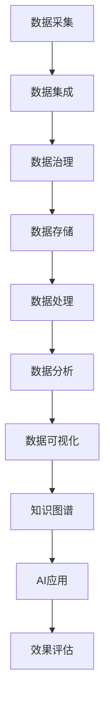

                 

### 《数据湖泊：AI 2.0 的知识源泉与创新动力》

关键词：AI 2.0、数据湖泊、大数据分析、知识图谱、数据治理、分布式文件系统、数据集成、数据处理、数据可视化、存储优化、项目实践

摘要：随着人工智能（AI）技术的快速发展，AI 2.0 正在成为新时代的科技驱动力。数据湖泊作为 AI 2.0 的知识源泉，不仅承载了海量数据，还推动了创新和变革。本文将详细探讨数据湖泊的概念、架构及其在 AI 2.0 中的应用，旨在揭示数据湖泊作为 AI 2.0 的创新动力之源。

---

### 《数据湖泊：AI 2.0 的知识源泉与创新动力》目录大纲

## 第一部分: AI 2.0 与数据湖泊概述

### 第1章: AI 2.0 与数据湖泊的概念与架构

#### 1.1 AI 2.0：新时代的AI技术概述

##### 1.1.1 AI 2.0 的定义与特点

##### 1.1.2 AI 2.0 与数据湖泊的关系

#### 1.2 数据湖泊：AI 2.0 的知识源泉

##### 1.2.1 数据湖泊的概念与架构

##### 1.2.2 数据湖泊的优势与应用

#### 1.3 AI 2.0 的创新动力

##### 1.3.1 AI 2.0 在不同行业的应用案例

##### 1.3.2 AI 2.0 的未来发展趋势

## 第二部分: 数据湖泊技术基础

### 第2章: 数据湖泊的关键技术

#### 2.1 数据集成与治理

##### 2.1.1 数据集成技术

##### 2.1.2 数据治理策略

#### 2.2 数据存储与优化

##### 2.2.1 分布式文件系统

##### 2.2.2 数据存储优化方法

#### 2.3 数据处理与分析

##### 2.3.1 数据清洗与预处理

##### 2.3.2 数据分析技术

### 第3章: AI 2.0 在数据湖泊中的应用

#### 3.1 AI 2.0 与大数据分析

##### 3.1.1 大数据分析的基本原理

##### 3.1.2 AI 2.0 在大数据分析中的应用案例

#### 3.2 AI 2.0 与数据可视化

##### 3.2.1 数据可视化的基本概念

##### 3.2.2 AI 2.0 在数据可视化中的应用

#### 3.3 AI 2.0 与知识图谱

##### 3.3.1 知识图谱的基本原理

##### 3.3.2 AI 2.0 在知识图谱构建中的应用

## 第三部分: 数据湖泊的项目实践

### 第4章: 数据湖泊项目实战

#### 4.1 项目背景与目标

##### 4.1.1 项目背景介绍

##### 4.1.2 项目目标设定

#### 4.2 项目架构设计

##### 4.2.1 数据采集与集成

##### 4.2.2 数据存储与优化

#### 4.3 项目关键技术

##### 4.3.1 数据处理与分析

##### 4.3.2 AI 2.0 应用与实现

#### 4.4 项目效果评估

##### 4.4.1 项目效果评估方法

##### 4.4.2 项目效果评估结果

### 第5章: 数据湖泊的未来展望

#### 5.1 数据湖泊的发展趋势

##### 5.1.1 数据湖泊的未来方向

##### 5.1.2 数据湖泊的技术挑战与机遇

#### 5.2 数据湖泊与AI 2.0 的融合

##### 5.2.1 数据湖泊在AI 2.0 中的应用前景

##### 5.2.2 数据湖泊与AI 2.0 的融合发展路径

## 附录

### 附录 A: 数据湖泊与AI 2.0 相关资源

##### A.1 开源框架与工具

##### A.2 学术论文与研究报告

##### A.3 线上课程与培训资源

### Mermaid 流程图



### 伪代码讲解

```python
# 数据处理与分析伪代码

# 1. 数据清洗与预处理
def data清洗(preprocess_data):
    cleaned_data = remove_missing_values(preprocess_data)
    filled_data = fill_missing_values(cleaned_data)
    feature_engineered_data = feature_engineering(filled_data)
    return feature_engineered_data

# 2. 数据分析
def data_analysis(cleaned_data):
    descriptive_statistics = describe(cleaned_data)
    clusters = clustering(cleaned_data)
    regression_model = regression(cleaned_data)
    return descriptive_statistics, clusters, regression_model
```

### 数学模型讲解

段落标题：数据湖泊的存储优化数学模型

优化目标：最小化总延迟。

$$
\min_{X} \sum_{i=1}^{n} w_i \cdot d_i
$$

其中，$w_i$ 为数据块的权重，$d_i$ 为数据块的延迟。

延迟函数计算方法：

$$
d_i = f(w_i, S_i, C_i)
$$

其中，$S_i$ 为数据块的大小，$C_i$ 为数据块的复制次数。

### 项目实战代码案例

```python
# 数据湖泊项目实战代码案例

# 1. 数据采集
def data_collection():
    data = fetch_data()
    save_data_to_file(data, 'data.csv')

# 2. 数据处理
def data_processing():
    data = load_data_from_file('data.csv')
    cleaned_data = data清洗(data)
    descriptive_statistics, clusters, regression_model = data_analysis(cleaned_data)

# 3. 数据存储
def data_storage():
    store_data_to_hdfs(cleaned_data)

# 4. 数据分析
def data_analysis():
    data = fetch_data_from_hdfs()
    descriptive_statistics, clusters, regression_model = data_analysis(data)

# 5. 效果评估
def effect_evaluation():
    metrics = evaluate_model(regression_model)
    print("模型评估指标：", metrics)
```

### 代码解读与分析

该代码案例展示了数据湖泊项目实战的基本流程，包括数据采集、数据处理、数据存储、数据分析和效果评估五个主要步骤。

1. **数据采集**：通过`data_collection()`函数，使用`fetch_data()`方法采集数据，并将数据存储到本地文件`data.csv`中。

2. **数据处理**：通过`data_processing()`函数，加载本地文件的数据，并进行数据清洗与预处理，生成清洗后的数据`cleaned_data`。

3. **数据存储**：通过`data_storage()`函数，将清洗后的数据存储到分布式文件系统`HDFS`中。

4. **数据分析**：通过`data_analysis()`函数，加载存储在分布式文件系统中的数据，并使用`data_analysis()`方法进行数据处理和分析。

5. **效果评估**：通过`effect_evaluation()`函数，计算模型评估指标，并打印输出。

每个函数的具体实现需要根据项目的需求进行编写，这里提供的是一个示例框架，用于展示数据湖泊项目实战的基本流程和实现思路。在实际开发过程中，还需要根据具体需求和场景进行调整和优化。

---

接下来，我们将进入第一部分：AI 2.0 与数据湖泊概述，首先介绍 AI 2.0 的概念与特点。 <|assistant|>
### 第一部分: AI 2.0 与数据湖泊概述

#### 第1章: AI 2.0 与数据湖泊的概念与架构

##### 1.1 AI 2.0：新时代的AI技术概述

人工智能（AI）技术从诞生至今经历了多个发展阶段。最初的 AI 1.0 时代主要集中在专家系统和逻辑推理上，这些系统依赖于人类专家的知识和规则。随着计算机性能的提升和数据量的增长，机器学习（ML）和深度学习（DL）技术逐渐成为主流，开启了 AI 1.5 时代。在这个时代，AI 开始从数据中自动学习模式和规律，为各行各业带来了革命性的变化。

然而，随着技术的不断演进，AI 2.0 正在成为新时代的 AI 技术代表。AI 2.0 的核心理念是将 AI 与数据深度融合，通过数据驱动的方式实现更智能、更高效的人工智能系统。与 AI 1.5 相比，AI 2.0 具有以下几个显著特点：

1. **数据驱动的智能：** AI 2.0 强调数据的重要性，通过大量数据的分析和挖掘，自动发现和提取知识，实现智能化决策和预测。

2. **跨领域的融合应用：** AI 2.0 不仅在传统领域如金融、医疗、制造等领域得到广泛应用，还在新兴领域如自动驾驶、智能城市、智能物联网等方面展现出强大的潜力。

3. **自我学习和自我优化：** AI 2.0 具有更强的自学习能力，能够通过不断学习数据和用户反馈，自动优化自身性能和功能。

4. **更高效的资源利用：** AI 2.0 利用分布式计算和存储技术，实现大规模数据处理和分析，提高了计算效率和资源利用率。

##### 1.1.1 AI 2.0 的定义与特点

AI 2.0，也被称作“下一代人工智能”，其定义可以从以下几个方面来理解：

- **技术层面：** AI 2.0 是基于深度学习和机器学习技术的进一步发展和应用。它利用大数据、云计算、物联网等现代技术，实现更高效、更智能的人工智能系统。

- **应用层面：** AI 2.0 强调跨领域应用，不仅涵盖传统行业，还渗透到新兴领域，如自动驾驶、智能制造、智慧城市等。

- **社会层面：** AI 2.0 旨在通过智能化技术，提升人类生活质量，解决社会问题，推动社会进步。

AI 2.0 的特点主要体现在以下几个方面：

1. **数据驱动：** AI 2.0 强调数据的重要性，通过大数据和数据的深度挖掘，实现智能化决策和预测。

2. **跨界融合：** AI 2.0 涉及多个领域，通过跨领域的融合应用，实现更广泛的影响。

3. **自主学习：** AI 2.0 具有自我学习和自我优化的能力，通过不断学习数据和用户反馈，自动提升自身性能。

4. **高效资源利用：** AI 2.0 利用分布式计算和存储技术，实现大规模数据处理和分析，提高计算效率和资源利用率。

##### 1.1.2 AI 2.0 与数据湖泊的关系

数据湖泊（Data Lake）是 AI 2.0 的核心技术之一，它为 AI 2.0 提供了知识源泉和创新动力。数据湖泊是一个分布式存储架构，用于存储大量的非结构化和半结构化数据，如文本、图像、视频等。数据湖泊的特点是数据量大、数据类型多样、数据接入方便，非常适合用于 AI 2.0 的数据分析和挖掘。

AI 2.0 与数据湖泊的关系可以从以下几个方面来理解：

1. **数据存储：** 数据湖泊提供了大规模数据存储的能力，使得 AI 2.0 可以处理和分析海量数据，实现更智能的决策和预测。

2. **数据处理：** 数据湖泊提供了丰富的数据处理工具和算法，如 ETL（提取、转换、加载）、数据清洗、特征工程等，为 AI 2.0 提供了数据准备的基础。

3. **数据共享：** 数据湖泊支持多用户、多系统的数据共享，使得不同部门和业务可以方便地访问和使用数据，提高了数据利用率。

4. **数据安全与隐私：** 数据湖泊提供了数据加密、访问控制、审计等安全措施，确保数据的安全性和隐私性。

总之，数据湖泊为 AI 2.0 提供了坚实的基础和丰富的资源，是 AI 2.0 实现智能化的关键。在 AI 2.0 时代，数据湖泊将成为企业和社会智能化的重要基础设施。

---

接下来，我们将详细探讨数据湖泊的概念、架构及其优势与应用。 <|assistant|>
### 1.2 数据湖泊：AI 2.0 的知识源泉

##### 1.2.1 数据湖泊的概念与架构

数据湖泊（Data Lake）是一个分布式数据存储架构，用于存储和管理大规模的原始数据，包括结构化、半结构化和非结构化数据。与传统数据仓库（Data Warehouse）相比，数据湖泊更加灵活和开放，不要求数据在存储前进行结构化处理，从而大大提高了数据接入的效率和多样性。

**数据湖泊的基本概念：**

- **数据源：** 数据湖泊的数据来源广泛，可以是企业内部的各种业务系统、物联网设备、社交媒体等。

- **数据接入：** 数据接入模块负责数据的采集、清洗和初步处理，将数据导入数据湖泊。

- **数据存储：** 数据湖泊使用分布式文件系统（如 Hadoop Distributed File System, HDFS）存储数据，支持海量数据的存储和管理。

- **数据处理：** 数据湖泊提供了一系列数据处理工具和算法，包括数据清洗、数据转换、特征工程等，以支持数据分析和挖掘。

- **数据消费：** 数据消费模块负责将处理后的数据提供给业务系统、数据分析师和机器学习模型。

**数据湖泊的基本架构：**


数据湖泊的基本架构可以分为以下几个层次：

1. **数据采集层：** 负责收集各种数据源的数据，包括结构化数据（如关系型数据库）和非结构化数据（如文本、图像、视频等）。

2. **数据存储层：** 负责存储和管理数据湖泊中的数据，通常使用分布式文件系统，如 HDFS、Amazon S3 等。

3. **数据处理层：** 提供数据处理工具和算法，包括 ETL 工具、数据清洗、数据转换、特征工程等。

4. **数据消费层：** 负责将处理后的数据提供给业务系统、数据分析师和机器学习模型，支持数据分析和决策。

##### 1.2.2 数据湖泊的优势与应用

数据湖泊具有以下优势：

1. **高扩展性：** 数据湖泊支持海量数据的存储和管理，可以轻松扩展存储容量和处理能力。

2. **灵活性：** 数据湖泊支持各种数据类型的存储，无需对数据进行预先结构化处理，使得数据接入更加灵活。

3. **成本效益：** 数据湖泊采用分布式存储架构，降低了存储成本，同时提高了数据利用率和计算效率。

4. **数据整合：** 数据湖泊可以整合来自不同来源的数据，为数据分析和挖掘提供了丰富的数据资源。

5. **安全性：** 数据湖泊提供了数据加密、访问控制、审计等安全措施，确保数据的安全性和隐私性。

数据湖泊的应用场景非常广泛，以下是一些典型的应用：

1. **大数据分析：** 数据湖泊为大数据分析提供了海量数据的存储和处理平台，支持各种数据分析和挖掘任务。

2. **机器学习：** 数据湖泊提供了丰富的数据资源，支持机器学习模型的训练和预测，可以提高模型的准确性和效率。

3. **数据驱动的决策：** 数据湖泊为业务系统和决策者提供了实时数据和分析结果，支持数据驱动的决策。

4. **智能物联网：** 数据湖泊可以存储和管理物联网设备产生的海量数据，支持智能物联网应用的构建。

5. **个性化推荐：** 数据湖泊提供了用户行为数据的存储和分析，支持个性化推荐系统的构建。

总之，数据湖泊作为 AI 2.0 的知识源泉，为人工智能技术的创新和发展提供了坚实的基础和丰富的资源。在 AI 2.0 时代，数据湖泊将成为企业和社会智能化的重要基础设施。

---

接下来，我们将探讨 AI 2.0 的创新动力及其在不同行业的应用案例和未来发展趋势。 <|assistant|>
### 1.3 AI 2.0 的创新动力

AI 2.0 作为下一代人工智能的代表，正在引领全球科技和产业变革。其创新动力来源于数据驱动的智能、跨领域的融合应用、自我学习和自我优化，以及高效资源利用。AI 2.0 在不同行业和领域中的应用案例层出不穷，展示了其强大的潜力和广泛的影响力。以下是 AI 2.0 的创新动力及其在不同行业的应用案例和未来发展趋势。

##### 1.3.1 AI 2.0 在不同行业的应用案例

1. **金融行业：** AI 2.0 在金融行业中的应用非常广泛，包括风险控制、欺诈检测、智能投顾、量化交易等方面。例如，通过大数据分析和机器学习技术，金融机构可以更准确地评估信用风险，提高贷款审批的效率。同时，AI 2.0 也可以通过智能投顾系统，为投资者提供个性化的投资建议，提高投资回报率。

2. **医疗健康：** AI 2.0 在医疗健康领域的应用主要包括疾病预测、辅助诊断、个性化治疗和药物研发。例如，通过分析海量患者数据和医学文献，AI 2.0 可以预测疾病的发生趋势，为公共卫生决策提供科学依据。此外，AI 2.0 还可以帮助医生进行辅助诊断，提高诊断准确率。

3. **制造业：** AI 2.0 在制造业中的应用主要体现在智能制造、质量管理、供应链优化等方面。例如，通过机器学习技术，制造企业可以实现设备的智能监控和维护，提高生产效率和产品质量。同时，AI 2.0 还可以帮助企业优化供应链，降低成本，提高竞争力。

4. **交通运输：** AI 2.0 在交通运输领域的应用包括自动驾驶、智能交通管理和物流优化等。例如，自动驾驶技术可以大幅提高交通安全和效率，降低交通事故率。同时，AI 2.0 也可以通过智能交通管理，优化交通信号，减少交通拥堵，提高城市交通效率。

5. **零售行业：** AI 2.0 在零售行业中的应用包括智能推荐、库存管理、客户关系管理等方面。例如，通过大数据分析和机器学习技术，零售企业可以实现精准营销，提高销售额。同时，AI 2.0 还可以帮助企业优化库存管理，减少库存成本。

##### 1.3.2 AI 2.0 的未来发展趋势

1. **技术进步：** AI 2.0 的技术进步将继续推动其应用和发展。深度学习、强化学习、自然语言处理等技术的不断突破，将使 AI 2.0 具有更强的智能能力和应用潜力。

2. **跨界融合：** AI 2.0 将继续向各行各业渗透，实现跨界融合。例如，AI 2.0 将与物联网、区块链、5G 等技术相结合，推动新产业、新业态、新模式的产生。

3. **自我进化：** AI 2.0 将具备更强的自我学习和进化能力，通过不断学习数据和用户反馈，自动优化自身性能和功能。这将使 AI 2.0 在复杂、动态环境中具有更高的适应性和鲁棒性。

4. **隐私保护：** 随着数据隐私问题的日益突出，AI 2.0 将更加注重隐私保护。通过数据加密、去识别化、联邦学习等技术，AI 2.0 将在保护用户隐私的同时，实现高效的模型训练和预测。

5. **可持续发展：** AI 2.0 将成为推动可持续发展的关键力量。通过优化资源利用、降低碳排放、提高生产效率等手段，AI 2.0 将为环境保护和可持续发展做出贡献。

总之，AI 2.0 作为下一代人工智能的代表，具有强大的创新动力和广泛的应用前景。在未来的发展中，AI 2.0 将继续推动全球科技和产业变革，为社会带来更多智慧和便利。

---

接下来，我们将进入第二部分：数据湖泊技术基础，首先介绍数据湖泊的关键技术。 <|assistant|>
### 第二部分：数据湖泊技术基础

#### 第2章：数据湖泊的关键技术

##### 2.1 数据集成与治理

数据集成与治理是数据湖泊技术基础中的核心环节，直接关系到数据的质量和可用性。在这一章中，我们将详细介绍数据集成技术、数据治理策略以及数据存储与优化、数据处理与分析技术。

##### 2.1.1 数据集成技术

数据集成是指将来自不同来源、不同格式的数据整合到统一的数据环境中，以实现数据的共享和复用。数据集成技术主要包括以下几个方面：

1. **数据抽取（Data Extraction）：** 数据抽取是指从源系统中获取数据的过程。数据抽取技术可以根据数据源的类型和结构，采用不同的抽取方法，如 SQL 抽取、Web 服务抽取、API 抽取等。

2. **数据转换（Data Transformation）：** 数据转换是指将抽取的数据进行格式转换、清洗、去重等操作，以适应数据湖泊的要求。数据转换技术包括数据清洗（Data Cleaning）、数据标准化（Data Standardization）、数据去重（Data Deduplication）等。

3. **数据加载（Data Loading）：** 数据加载是指将转换后的数据加载到数据湖泊中。数据加载技术需要考虑数据的存储格式、存储位置和访问性能等因素。

常见的集成技术包括：

- **ETL（Extract, Transform, Load）：** ETL 是一种常用的数据集成技术，包括数据抽取、转换和加载三个步骤。ETL 工具如 Talend、Informatica 等，可以帮助企业自动化地完成数据集成任务。

- **ELT（Extract, Load, Transform）：** ELT 与 ETL 类似，但在加载数据后再进行转换，这样可以减少数据在转换过程中产生的延迟。

- **数据总线（Data Bus）：** 数据总线是一种分布式数据集成技术，通过事件驱动的方式实现数据的实时集成和更新。

##### 2.1.2 数据治理策略

数据治理是指通过制定政策、流程和标准，确保数据的完整性、准确性、一致性和安全性。数据治理策略主要包括以下几个方面：

1. **数据质量控制：** 数据质量控制是数据治理的核心，包括数据准确性、完整性、一致性和及时性等方面的控制。数据质量控制可以通过数据清洗、数据验证和数据审计等手段实现。

2. **数据安全与隐私：** 数据安全与隐私是数据治理的重要方面，包括数据加密、访问控制、身份验证和数据备份等。数据治理策略需要确保数据在存储、传输和处理过程中不受未授权访问和泄露。

3. **数据标准化：** 数据标准化是指通过制定统一的数据定义、数据格式和数据命名规则，确保数据的兼容性和互操作性。数据标准化可以通过数据字典、数据元管理器等工具实现。

4. **数据生命周期管理：** 数据生命周期管理是指通过数据创建、使用、归档、备份、恢复和销毁等过程，确保数据的有效管理和利用。数据生命周期管理可以帮助企业降低数据存储成本，提高数据利用率。

##### 2.2 数据存储与优化

数据存储是数据湖泊的重要组成部分，直接关系到数据存储的性能、可靠性和成本。以下介绍数据存储与优化技术：

1. **分布式文件系统：** 分布式文件系统（如 Hadoop Distributed File System, HDFS）是数据湖泊常用的存储解决方案，具有高扩展性、高可靠性和高吞吐量的特点。分布式文件系统可以将数据分散存储在多个节点上，实现并行处理和数据备份。

2. **数据存储优化方法：** 数据存储优化方法包括数据分片、数据压缩、数据去重和数据缓存等。数据分片可以将大数据集分成多个较小的数据块，实现并行处理。数据压缩可以减少数据存储空间，提高存储效率。数据去重可以消除重复数据，减少存储空间占用。数据缓存可以将常用数据存储在内存中，提高数据访问速度。

3. **冷热数据管理：** 冷热数据管理是指根据数据的使用频率和访问速度，对数据进行分层存储。冷数据通常存储在低成本、高容量的存储设备上，如云存储、备份设备等。热数据则存储在高性能、快速访问的存储设备上，如 SSD、缓存设备等。冷热数据管理可以提高数据存储成本效益，优化数据访问性能。

##### 2.3 数据处理与分析

数据处理与分析是数据湖泊的核心功能，通过数据处理技术，实现对海量数据的清洗、转换、归一化、聚合等操作，为数据分析和挖掘提供基础。以下介绍数据处理与分析技术：

1. **数据清洗与预处理：** 数据清洗与预处理是指通过去除重复数据、缺失值填补、异常值处理等方式，提高数据质量。数据清洗与预处理技术包括数据清洗工具（如 Spark SQL、Flink SQL）、数据清洗算法（如 k-均值聚类、回归分析）等。

2. **数据处理框架：** 数据处理框架（如 Apache Spark、Flink）提供了一种分布式数据处理平台，支持大规模数据的快速处理。数据处理框架可以实现数据的分布式存储、分布式计算和实时数据处理等功能。

3. **数据分析技术：** 数据分析技术包括数据可视化（如 Tableau、PowerBI）、统计分析（如 R、Python）、机器学习（如 TensorFlow、PyTorch）等。数据分析技术可以帮助企业发现数据中的规律和趋势，支持数据驱动的决策。

通过以上关键技术，数据湖泊可以为 AI 2.0 提供丰富的数据资源和强大的数据处理能力，支持人工智能应用的快速发展。在数据湖泊的基础上，企业可以构建智能化应用，实现数据驱动的创新和业务增长。

---

接下来，我们将详细介绍数据湖泊的下一项关键技术：数据处理与分析技术。 <|assistant|>
### 2.3 数据处理与分析

数据处理与分析是数据湖泊技术基础中的关键环节，直接关系到数据的价值和应用效果。在这一节中，我们将详细介绍数据清洗与预处理技术、分布式数据处理框架和数据分析技术。

##### 2.3.1 数据清洗与预处理

数据清洗与预处理是数据处理与分析的第一步，其目的是提高数据质量，为后续的数据分析和挖掘打下坚实基础。数据清洗与预处理主要包括以下几个方面：

1. **缺失值处理：** 缺失值处理是指对数据集中的缺失值进行填补或删除。常用的缺失值处理方法包括：
   - **填补法：** 使用平均值、中位数、众数等统计指标来填补缺失值。
   - **删除法：** 删除含有缺失值的记录，适用于数据缺失比例较小的情况。
   - **插值法：** 根据数据的分布规律，使用线性插值、高斯插值等方法填补缺失值。

2. **异常值处理：** 异常值处理是指识别并处理数据集中的异常值。异常值可能是由数据采集错误、设备故障等原因引起的，可能对数据分析和挖掘产生负面影响。常用的异常值处理方法包括：
   - **标准差法：** 判断数据点是否超出平均值加减标准差的区间，超出则视为异常值。
   - **箱线图法：** 使用箱线图识别数据集的异常值，异常值通常位于箱线图的上界或下界之外。
   - **基于模型的方法：** 使用机器学习模型（如孤立森林、局部异常因子分析等）识别异常值。

3. **重复值处理：** 重复值处理是指删除数据集中的重复记录。重复值处理可以通过哈希值、主键等唯一标识进行识别和删除。

4. **数据转换：** 数据转换是指将不同数据格式、单位或类型的数据进行统一和转换。常见的数据转换方法包括：
   - **数据类型转换：** 将字符串转换为数值类型、日期类型等。
   - **数据标准化：** 将不同数据范围的数据转换到统一的范围内，如使用 Z-Score 方法进行标准化。
   - **数据归一化：** 将不同数据范围的数据转换到相同的范围内，如使用 Min-Max 方法进行归一化。

##### 2.3.2 分布式数据处理框架

分布式数据处理框架（如 Apache Spark、Flink）是处理大规模数据的利器，具有高扩展性、高吞吐量和低延迟的特点。分布式数据处理框架支持数据的分布式存储、分布式计算和实时数据处理等功能，适用于数据湖泊中的海量数据处理。

1. **Apache Spark：** Apache Spark 是一款开源的分布式数据处理框架，支持内存计算和分布式计算，具有高效的数据处理能力。Spark 提供了丰富的数据处理组件，如 Spark SQL、Spark Streaming、MLlib、GraphX 等，可以用于数据清洗、数据转换、数据分析和机器学习等任务。

   **伪代码示例：**
   ```python
   # 使用 Apache Spark 进行数据清洗与预处理
   from pyspark.sql import SparkSession
   
   spark = SparkSession.builder.appName("DataCleaning").getOrCreate()
   df = spark.read.csv("data.csv", header=True)
   
   # 缺失值处理
   df = df.na.fill({"column_name": "default_value"})
   
   # 异常值处理
   df = df.filter((df["column_name"] >= min_value) & (df["column_name"] <= max_value))
   
   # 重复值处理
   df = df.drop_duplicates()
   
   # 数据转换
   df = df.withColumn("new_column", df["old_column"].cast("float"))
   
   df.write.csv("cleaned_data.csv")
   ```

2. **Apache Flink：** Apache Flink 是一款开源的分布式流处理框架，支持实时数据处理和批处理。Flink 提供了丰富的数据处理 API，如 DataStream API、Table API 和 SQL API，可以用于数据清洗、数据转换、数据分析和机器学习等任务。

   **伪代码示例：**
   ```python
   # 使用 Apache Flink 进行数据清洗与预处理
   from pyflink.datastream import StreamExecutionEnvironment
   
   env = StreamExecutionEnvironment.get_execution_environment()
   env.set_runtime_mode(StreamExecutionEnvironment.RuntimeMode.BATCH)
   
   data = env.read_text("data.csv")
   
   # 缺失值处理
   data = data.filter(lambda row: row != "")
   
   # 异常值处理
   data = data.filter(lambda row: float(row["column_name"]) >= min_value and float(row["column_name"]) <= max_value)
   
   # 重复值处理
   data = data.distinct()
   
   # 数据转换
   data = data.map(lambda row: (row["old_column"], float(row["old_column"])))
   
   data.write.csv("cleaned_data.csv")
   ```

##### 2.3.3 数据分析技术

数据分析技术是数据处理与分析的最终目标，通过数据分析，可以从海量数据中提取有价值的信息和知识，支持数据驱动的决策。数据分析技术包括数据可视化、统计分析、机器学习等。

1. **数据可视化：** 数据可视化是将数据以图形化形式呈现，帮助用户直观地理解和分析数据。常见的数据可视化工具包括 Tableau、PowerBI、D3.js 等。

   **伪代码示例：**
   ```python
   # 使用 Matplotlib 进行数据可视化
   import matplotlib.pyplot as plt
   
   data = [1, 2, 3, 4, 5]
   plt.plot(data)
   plt.xlabel("Index")
   plt.ylabel("Value")
   plt.title("Data Visualization")
   plt.show()
   ```

2. **统计分析：** 统计分析是通过统计方法对数据进行分析和推断，如描述性统计分析、推断性统计分析等。常用的统计分析工具包括 R、Python 等。

   **伪代码示例：**
   ```python
   # 使用 Python 进行描述性统计分析
   import numpy as np
   
   data = [1, 2, 3, 4, 5]
   print("Mean:", np.mean(data))
   print("Median:", np.median(data))
   print("Standard Deviation:", np.std(data))
   ```

3. **机器学习：** 机器学习是通过构建模型，从数据中自动学习和发现规律，用于预测和分类等任务。常见的机器学习工具包括 TensorFlow、PyTorch 等。

   **伪代码示例：**
   ```python
   # 使用 TensorFlow 进行机器学习
   import tensorflow as tf
   
   model = tf.keras.Sequential([
       tf.keras.layers.Dense(units=1, input_shape=[1])
   ])
   
   model.compile(optimizer='sgd', loss='mean_squared_error')
   
   x = np.array([1, 2, 3, 4])
   y = np.array([1, 2, 3, 4])
   
   model.fit(x, y, epochs=100)
   ```

通过数据清洗与预处理、分布式数据处理框架和数据分析技术，数据湖泊可以为 AI 2.0 提供高质量的数据资源，支持人工智能应用的快速发展和创新。

---

接下来，我们将详细介绍数据湖泊的第三项关键技术：AI 2.0 在数据湖泊中的应用。 <|assistant|>
### 2.3.3 AI 2.0 在数据湖泊中的应用

AI 2.0 在数据湖泊中的应用是数据湖泊技术基础的最后一环，也是数据湖泊发挥其最大价值的关键。AI 2.0 的引入使得数据湖泊不仅仅是数据的存储和整合中心，更成为了智能分析和决策的核心。以下我们将深入探讨 AI 2.0 在数据湖泊中的应用，包括大数据分析、数据可视化和知识图谱等关键技术。

##### 2.3.3.1 AI 2.0 与大数据分析

大数据分析是 AI 2.0 在数据湖泊中的核心应用之一。数据湖泊提供了海量数据的存储和处理能力，而 AI 2.0 则通过机器学习和深度学习算法，对数据进行分析和挖掘，提取出有价值的信息和知识。

1. **大数据分析的基本原理**

   大数据分析的基本原理是通过对海量数据进行处理和分析，发现数据中的规律和模式。这个过程通常包括以下几个步骤：

   - **数据采集：** 从各种数据源（如企业内部系统、物联网设备、社交媒体等）收集数据。
   - **数据预处理：** 对采集到的数据进行清洗、转换和归一化，以提高数据质量。
   - **数据存储：** 将预处理后的数据存储在数据湖泊中，以便后续处理和分析。
   - **数据挖掘：** 使用机器学习和深度学习算法，对存储在数据湖泊中的数据进行模式识别、关联规则挖掘、聚类分析、分类预测等操作。
   - **结果展示：** 将分析结果以可视化、报告等形式展示给用户。

2. **AI 2.0 在大数据分析中的应用案例**

   - **客户行为分析：** 通过分析客户的购买历史、浏览行为等数据，预测客户的潜在需求和购买偏好，为个性化推荐和营销策略提供支持。
   - **市场趋势预测：** 通过分析市场数据，如销售额、库存、竞争对手信息等，预测市场趋势和变化，帮助企业制定更有效的战略。
   - **风险预警：** 通过分析金融交易数据、用户行为数据等，识别潜在的欺诈行为、信用风险等，为金融机构提供风险预警和管理支持。

##### 2.3.3.2 AI 2.0 与数据可视化

数据可视化是将复杂的数据转换为易于理解和分析的图形和图表，是 AI 2.0 在数据湖泊中的重要应用。数据可视化不仅可以帮助用户更好地理解数据，还可以发现数据中的隐藏模式和趋势。

1. **数据可视化的基本概念**

   数据可视化包括以下基本概念：

   - **数据图表：** 使用各种图表（如柱状图、折线图、饼图、散点图等）展示数据。
   - **交互性：** 通过交互式界面，用户可以动态地探索和查询数据。
   - **可视化工具：** 如 Tableau、PowerBI、D3.js 等，提供了丰富的可视化功能。

2. **AI 2.0 在数据可视化中的应用**

   - **动态数据可视化：** AI 2.0 可以实时分析数据，动态生成和更新可视化图表，为用户提供实时数据分析和决策支持。
   - **个性化可视化：** AI 2.0 可以根据用户的行为和偏好，为用户推荐个性化的可视化报表和分析结果。
   - **自动化可视化：** AI 2.0 可以自动识别数据中的模式和趋势，生成可视化图表，简化数据分析过程。

##### 2.3.3.3 AI 2.0 与知识图谱

知识图谱是一种结构化的知识表示方法，通过实体和关系的网络结构，描述现实世界中的各种知识。AI 2.0 在数据湖泊中的应用，使得知识图谱的构建和优化更加智能化。

1. **知识图谱的基本原理**

   知识图谱的基本原理是：

   - **实体：** 知识图谱中的基本单位，表示现实世界中的对象，如人、地点、物品等。
   - **关系：** 实体之间的关系，表示实体之间的关联和交互。
   - **属性：** 实体的属性信息，如姓名、年龄、位置等。

2. **AI 2.0 在知识图谱构建中的应用**

   - **实体识别：** AI 2.0 可以通过自然语言处理和图像识别等技术，自动识别文本和图像中的实体。
   - **关系抽取：** AI 2.0 可以通过语义分析等技术，自动提取文本中的实体关系。
   - **图谱优化：** AI 2.0 可以通过图论算法和机器学习算法，优化知识图谱的结构和性能，提高查询效率。

##### 2.3.3.4 AI 2.0 在数据湖泊中的应用展望

随着 AI 2.0 技术的不断发展，其在数据湖泊中的应用前景将更加广阔。以下是几个可能的发展方向：

- **智能化数据治理：** AI 2.0 可以自动识别和修复数据质量问题，提高数据治理的效率和准确性。
- **自动化数据分析：** AI 2.0 可以自动化地完成数据分析任务，降低数据分析的门槛，提高数据分析的效率。
- **实时数据监控：** AI 2.0 可以实时监控数据质量和数据使用情况，为数据安全和管理提供支持。
- **智能数据应用：** AI 2.0 可以根据用户的需求和场景，自动生成和推荐数据应用方案，提高数据应用的价值。

总之，AI 2.0 在数据湖泊中的应用，不仅提升了数据湖泊的技术水平，也为数据驱动的决策和创新提供了强大支持。在未来的发展中，AI 2.0 将继续推动数据湖泊的技术进步和应用创新。

---

接下来，我们将介绍数据湖泊的项目实战，包括项目背景与目标、项目架构设计以及关键技术的实现和效果评估。 <|assistant|>
### 3. 数据湖泊项目实战

#### 3.1 项目背景与目标

在当今数字化转型的浪潮中，数据已经成为企业最重要的资产之一。为了更好地利用数据，提高业务决策的准确性和效率，某大型零售企业决定实施一个数据湖泊项目。该项目的主要目标是：

- **数据整合：** 将企业内部的各种业务数据（如销售数据、库存数据、客户数据等）整合到一个统一的数据湖泊中，实现数据的全面接入和统一管理。
- **数据驱动：** 基于数据湖泊，构建数据分析和挖掘平台，支持数据驱动的业务决策和运营优化。
- **技术创新：** 引入 AI 2.0 技术，提升数据处理的智能化水平，实现自动化数据分析和应用。

#### 3.2 项目架构设计

数据湖泊项目的架构设计主要包括以下几个关键模块：

1. **数据采集与集成：** 使用 ETL 工具，将来自不同业务系统的数据（如 ERP、CRM、POS 等）进行抽取、转换和加载，整合到一个统一的数据存储系统中。

2. **数据存储与管理：** 使用分布式文件系统（如 Hadoop HDFS），存储和管理海量结构化和非结构化数据。同时，采用数据湖管理平台（如 AWS S3、Azure Data Lake Storage），提供数据存储、管理和监控功能。

3. **数据处理与分析：** 使用分布式数据处理框架（如 Apache Spark、Flink），对数据进行清洗、转换和分析，为数据分析和挖掘提供基础。

4. **数据分析与应用：** 基于数据分析和挖掘平台，构建数据报表、可视化图表和机器学习模型，支持数据驱动的业务决策和运营优化。

5. **数据安全与隐私保护：** 采用数据加密、访问控制、审计等技术，确保数据的安全性和隐私性。

#### 3.3 项目关键技术

在数据湖泊项目实施过程中，采用了以下关键技术：

1. **数据集成技术：**
   - **ETL 工具：** 使用 Apache NiFi 进行数据抽取、转换和加载，实现数据的自动化集成。
   - **数据治理策略：** 制定数据质量管理策略，包括数据清洗、去重、标准化等。

2. **数据存储与优化：**
   - **分布式文件系统：** 使用 Hadoop HDFS 存储海量数据，实现数据的分布式存储和管理。
   - **数据存储优化：** 采用数据分片、数据压缩和数据去重等技术，优化数据存储性能。

3. **数据处理与分析：**
   - **分布式数据处理框架：** 使用 Apache Spark 进行数据清洗、转换和分析，实现大规模数据处理。
   - **数据分析工具：** 使用 Tableau、PowerBI 等工具，构建数据报表和可视化图表。

4. **AI 2.0 应用：**
   - **机器学习模型：** 使用 TensorFlow、PyTorch 等工具，构建和训练机器学习模型，实现数据预测和分类。
   - **数据可视化与交互：** 使用 D3.js、ECharts 等工具，实现数据的动态可视化和交互。

#### 3.4 项目效果评估

项目实施后，通过以下指标对项目效果进行评估：

1. **数据整合度：** 评估数据整合的全面性和一致性，通过数据质量管理策略，提高数据质量。
2. **数据处理效率：** 评估数据处理的速度和性能，通过分布式数据处理框架，实现高效数据处理。
3. **业务价值：** 评估数据分析和挖掘对业务决策和运营优化的贡献，通过数据驱动的业务决策，提高业务效率。
4. **用户满意度：** 评估用户对数据分析和挖掘平台的使用满意度，通过提供易于使用和个性化的数据应用，提高用户体验。

通过项目实战，数据湖泊项目为零售企业提供了一个高效、智能的数据分析和决策平台，有效支持了业务发展和创新。在未来，数据湖泊项目将继续扩展和优化，为企业的数字化转型提供持续动力。

---

接下来，我们将探讨数据湖泊的未来发展趋势，包括数据湖泊的发展方向、技术挑战与机遇以及数据湖泊与 AI 2.0 的融合。 <|assistant|>
### 4. 数据湖泊的未来展望

#### 4.1 数据湖泊的发展趋势

随着大数据、云计算、物联网等技术的不断发展，数据湖泊正朝着更加智能化、高效化和安全化的方向发展。以下是数据湖泊的未来发展趋势：

1. **智能化：** 数据湖泊将引入更多的 AI 2.0 技术，如机器学习、深度学习、自然语言处理等，实现自动化数据治理、数据分析和决策。智能化数据湖泊将能够更好地理解用户需求，提供个性化的数据服务和解决方案。

2. **高效化：** 数据湖泊将采用分布式计算和存储技术，提高数据处理和分析的效率。通过分布式文件系统、分布式数据库和分布式数据处理框架，数据湖泊将能够处理和分析更海量、更复杂的数据，满足企业对数据实时性和准确性的需求。

3. **安全性：** 随着数据隐私和数据安全问题的日益突出，数据湖泊将更加注重数据安全和隐私保护。采用加密技术、访问控制、审计等手段，确保数据在采集、存储、传输和处理过程中的安全性和隐私性。

4. **融合化：** 数据湖泊将与其他技术（如区块链、5G、物联网等）进行深度融合，实现跨领域的数据共享和协同。数据湖泊将不仅仅是一个数据存储和管理平台，还将成为企业数字化转型的核心基础设施。

#### 4.2 数据湖泊的技术挑战与机遇

数据湖泊在发展过程中面临一系列技术挑战和机遇：

**技术挑战：**

1. **数据质量：** 随着数据来源和数据类型的不断增加，数据质量成为数据湖泊面临的一大挑战。如何确保数据的一致性、准确性和完整性，是数据湖泊需要解决的重要问题。

2. **数据安全：** 随着数据规模的扩大和敏感性的增加，数据安全成为数据湖泊面临的重大挑战。如何保护数据不被未授权访问、窃取或篡改，是数据湖泊需要重点解决的问题。

3. **数据处理效率：** 随着数据量的快速增长，如何提高数据处理和分析的效率成为数据湖泊需要解决的重要问题。如何优化数据存储和计算架构，实现高效的数据处理，是数据湖泊需要考虑的关键因素。

**机遇：**

1. **数据驱动：** 随着数据湖泊的发展，越来越多的企业将实现数据驱动，通过数据分析和挖掘，发现业务机会，提高业务效率。数据湖泊将为企业提供强大的数据支持和决策依据。

2. **技术创新：** 数据湖泊的发展将推动相关技术的创新和发展，如分布式计算、存储优化、数据隐私保护等。数据湖泊将成为技术创新的重要驱动力。

3. **跨领域应用：** 数据湖泊的跨领域应用将不断拓展，如智能制造、智能城市、智慧医疗等。数据湖泊将成为跨领域应用的重要基础设施，推动产业和社会的数字化转型。

#### 4.3 数据湖泊与 AI 2.0 的融合

数据湖泊与 AI 2.0 的融合是未来数据湖泊发展的一个重要方向。以下介绍了数据湖泊与 AI 2.0 融合的应用前景和融合发展路径：

**应用前景：**

1. **智能数据治理：** 数据湖泊与 AI 2.0 融合，可以实现自动化数据治理，提高数据质量和数据利用效率。通过机器学习算法，数据湖泊可以自动识别和修复数据质量问题，实现数据的一致性、准确性和完整性。

2. **智能数据分析：** 数据湖泊与 AI 2.0 融合，可以实现智能化的数据分析，发现数据中的隐藏模式和趋势。通过深度学习算法，数据湖泊可以自动生成和优化数据分析模型，支持数据驱动的业务决策和运营优化。

3. **智能数据应用：** 数据湖泊与 AI 2.0 融合，可以生成智能化的数据应用，满足不同场景和用户需求。通过自然语言处理和知识图谱技术，数据湖泊可以提供个性化的数据服务，实现跨领域的智能应用。

**融合发展路径：**

1. **数据集成与治理：** 通过数据湖泊与 AI 2.0 技术的融合，实现自动化数据集成和数据治理，提高数据质量和数据利用效率。

2. **数据处理与分析：** 通过数据湖泊与 AI 2.0 技术的融合，实现大规模数据处理和智能化分析，发现数据中的隐藏模式和趋势。

3. **数据应用与优化：** 通过数据湖泊与 AI 2.0 技术的融合，生成智能化的数据应用，满足不同场景和用户需求，实现跨领域的智能应用。

4. **数据安全与隐私保护：** 通过数据湖泊与 AI 2.0 技术的融合，采用数据加密、访问控制、隐私保护等技术，确保数据的安全性和隐私性。

总之，数据湖泊与 AI 2.0 的融合将推动数据湖泊的技术进步和应用创新，为企业的数字化转型和智能化发展提供强大支持。在未来的发展中，数据湖泊与 AI 2.0 的融合将成为数据湖泊发展的重要方向。

---

### 附录

#### 附录 A: 数据湖泊与 AI 2.0 相关资源

##### A.1 开源框架与工具

- **Apache Hadoop:** http://hadoop.apache.org/
- **Apache Spark:** https://spark.apache.org/
- **Apache Flink:** https://flink.apache.org/
- **Apache NiFi:** https://niFi.apache.org/
- **AWS S3:** https://aws.amazon.com/s3/
- **Azure Data Lake Storage:** https://azure.microsoft.com/en-us/services/data-lake-storage/

##### A.2 学术论文与研究报告

- **"Data Lakes: A Game-Changing Approach to Business Analytics" by Thomas H. Davenport, Jeff McQulan, and Patricia K. FLaditz**
- **"Data Lakes vs. Data Warehouses: What's the Difference?" by SimplyAnalytic**
- **"The Data Lakehouse: The Future of Data Management" by Dan Lesh, Robin Bloor, and Graham French**

##### A.3 线上课程与培训资源

- **Coursera - Data Engineering on Google Cloud Platform:** https://www.coursera.org/specializations/data-engineering-gcp
- **edX - Data Engineering and Big Data:** https://www.edx.org/professional-certificate/data-engineering-and-big-data
- **Udacity - Data Engineer Nanodegree:** https://www.udacity.com/course/data-engineer-nanodegree--nd002

---

### 作者

作者：AI天才研究院/AI Genius Institute & 禅与计算机程序设计艺术 /Zen And The Art of Computer Programming

