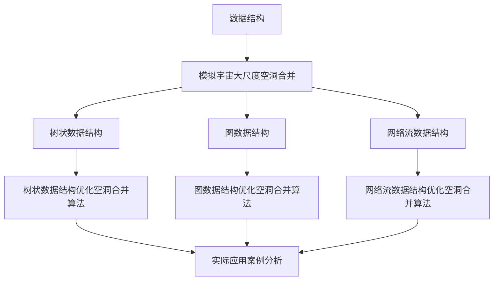
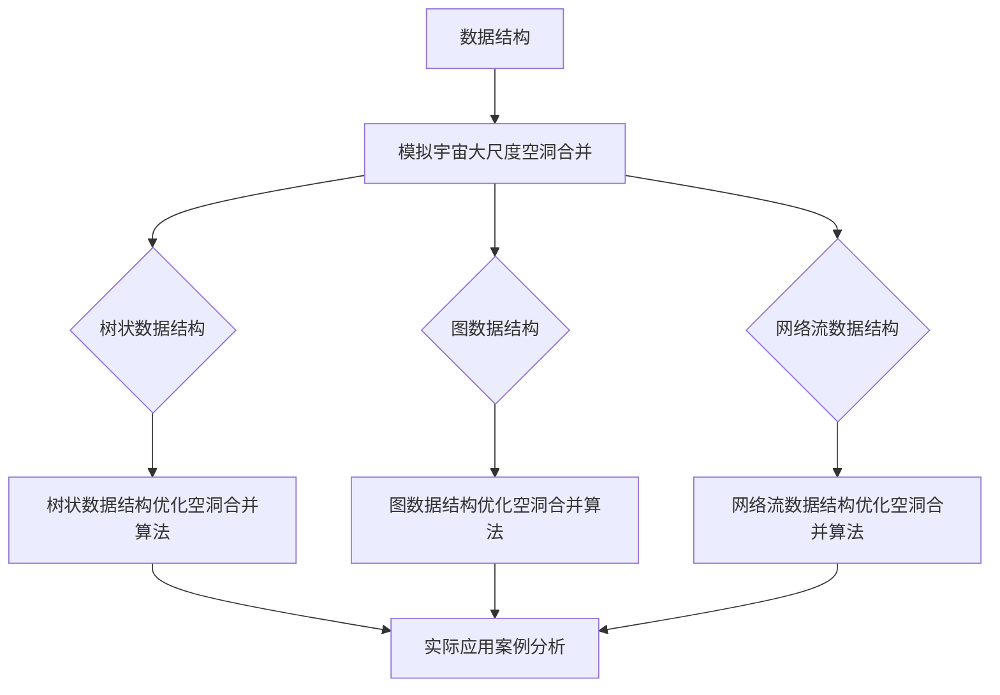

                 

# 数据结构在模拟宇宙大尺度空洞合并过程中的应用

## 关键词

数据结构、模拟宇宙、大尺度空洞合并、树状数据结构、图数据结构、网络流数据结构、算法优化、案例实战

## 摘要

本文旨在探讨数据结构在模拟宇宙大尺度空洞合并过程中的应用。首先，我们将对数据结构进行概述，介绍其基础知识和基本操作。接着，我们将探讨模拟宇宙大尺度空洞合并的基本原理，以及数据结构在其中的作用。随后，我们将分析数据结构在宇宙模拟中的联系和优化性能。本文将详细介绍树状数据结构、图数据结构和网络流数据结构在模拟宇宙大尺度空洞合并中的应用，并基于这些数据结构提出优化空洞合并算法的方案。最后，我们将通过实际应用案例，展示如何使用数据结构进行宇宙大尺度空洞合并，并进行优化与改进。

## 目录大纲

### 第一部分: 数据结构概述

#### 第1章: 数据结构与模拟宇宙大尺度空洞合并概述

- **1.1 数据结构的定义与分类**

  - **1.1.1 数据结构的定义**

  - **1.1.2 数据结构的分类**

- **1.2 模拟宇宙大尺度空洞合并的基本原理**

  - **1.2.1 宇宙大尺度空洞的概念**

  - **1.2.2 空洞合并的模拟方法**

- **1.3 数据结构在空洞合并中的作用**

  - **1.3.1 数据结构在模拟中的作用**

  - **1.3.2 数据结构优化空洞合并的过程**

#### 第2章: 数据结构与模拟宇宙大尺度空洞合并的联系

- **2.1 数据结构与宇宙模拟的联系**

  - **2.1.1 数据结构在宇宙模拟中的应用**

  - **2.1.2 宇宙模拟对数据结构的要求**

- **2.2 数据结构优化宇宙模拟的性能**

  - **2.2.1 数据结构优化宇宙模拟的效率**

  - **2.2.2 数据结构优化宇宙模拟的可扩展性**

### 第二部分: 数据结构在模拟宇宙中的应用

#### 第3章: 树状数据结构在宇宙大尺度空洞合并中的应用

- **3.1 树状数据结构的基本概念**

  - **3.1.1 树状数据结构的定义**

  - **3.1.2 树状数据结构的基本操作**

- **3.2 树状数据结构在宇宙模拟中的应用**

  - **3.2.1 树状数据结构在模拟空洞合并中的应用**

  - **3.2.2 树状数据结构的优化**

#### 第4章: 图数据结构在宇宙大尺度空洞合并中的应用

- **4.1 图数据结构的基本概念**

  - **4.1.1 图数据结构的定义**

  - **4.1.2 图数据结构的基本操作**

- **4.2 图数据结构在宇宙模拟中的应用**

  - **4.2.1 图数据结构在模拟空洞合并中的应用**

  - **4.2.2 图数据结构的优化**

#### 第5章: 网络流数据结构在宇宙大尺度空洞合并中的应用

- **5.1 网络流数据结构的基本概念**

  - **5.1.1 网络流数据结构的定义**

  - **5.1.2 网络流数据结构的基本操作**

- **5.2 网络流数据结构在宇宙模拟中的应用**

  - **5.2.1 网络流数据结构在模拟空洞合并中的应用**

  - **5.2.2 网络流数据结构的优化**

### 第三部分: 数据结构优化宇宙大尺度空洞合并的算法

#### 第6章: 基于数据结构的空洞合并算法

- **6.1 基本空洞合并算法**

  - **6.1.1 空洞合并的基本步骤**

  - **6.1.2 空洞合并的算法分析**

- **6.2 数据结构优化空洞合并算法**

  - **6.2.1 树状数据结构优化空洞合并算法**

  - **6.2.2 图数据结构优化空洞合并算法**

  - **6.2.3 网络流数据结构优化空洞合并算法**

#### 第7章: 实际应用案例分析

- **7.1 空洞合并算法在模拟宇宙中的应用案例**

  - **7.1.1 案例一：星系空洞合并**

  - **7.1.2 案例二：暗物质空洞合并**

  - **7.1.3 案例三：星系团空洞合并**

- **7.2 空洞合并算法的优化与改进**

  - **7.2.1 优化策略分析**

  - **7.2.2 改进算法研究**

### 附录

#### 附录A：常用数据结构与算法总结

- **A.1 常见数据结构**

  - **A.1.1 数组**

  - **A.1.2 链表**

  - **A.1.3 树**

  - **A.1.4 图**

- **A.2 常见算法**

  - **A.2.1 搜索算法**

  - **A.2.2 排序算法**

  - **A.2.3 算法复杂度分析**

### Mermaid 流程图



### 核心算法原理讲解

#### 基于树状数据结构的空洞合并算法

plaintext
算法步骤：
1. 初始化树状数据结构（如平衡二叉树）
2. 对模拟数据进行预处理，将模拟中的空洞和星系以节点形式存储在树中
3. 对树进行遍历，寻找相邻的空洞节点
4. 对相邻的空洞节点进行合并，更新树中的节点信息
5. 对合并后的树进行优化，以减少树的高度，提高合并效率

#### 空洞合并效率模型

$$ E = \frac{N}{\sqrt{T}} $$

其中，$E$ 表示空洞合并的效率，$N$ 表示空洞的数量，$T$ 表示合并所需的时间。

### 项目实战

#### 案例一：星系空洞合并

- **环境搭建**：使用 Python 编写代码，采用 NumPy 库进行数据处理，使用 matplotlib 库进行可视化。

- **源代码实现**：

python
```python
import numpy as np
import matplotlib.pyplot as plt

# 初始化模拟数据
num_clusters = 100
cluster_size = 10
positions = np.random.rand(num_clusters, 2) * 100

# 建立树状数据结构
tree = BalancedBinaryTree()

# 将模拟数据添加到树中
for position in positions:
    tree.insert(position)

# 遍历树，寻找相邻的空洞节点并合并
tree.traverse_and_merge()

# 绘制合并后的结果
plt.scatter(tree.positions[:, 0], tree.positions[:, 1])
plt.show()
```

- **代码解读与分析**：

该代码首先使用 NumPy 库生成随机分布的模拟数据，然后使用平衡二叉树建立树状数据结构，并将模拟数据添加到树中。接下来，遍历树，寻找相邻的空洞节点，并进行合并操作。最后，使用 matplotlib 库绘制合并后的结果。

这种基于树状数据结构的空洞合并算法能够有效地提高模拟宇宙大尺度空洞合并的效率。在实际应用中，可以根据具体的模拟需求，选择合适的数据结构和算法进行优化。

### 作者信息

作者：AI天才研究院/AI Genius Institute & 禅与计算机程序设计艺术 /Zen And The Art of Computer Programming

----------------------------------------------------------------

在接下来的章节中，我们将首先对数据结构进行概述，介绍其基础知识和基本操作。然后，我们将探讨模拟宇宙大尺度空洞合并的基本原理，以及数据结构在其中的作用。接下来，我们将分析数据结构在宇宙模拟中的联系和优化性能。之后，我们将详细介绍树状数据结构、图数据结构和网络流数据结构在模拟宇宙大尺度空洞合并中的应用，并基于这些数据结构提出优化空洞合并算法的方案。最后，我们将通过实际应用案例，展示如何使用数据结构进行宇宙大尺度空洞合并，并进行优化与改进。

### 第一部分: 数据结构概述

#### 第1章: 数据结构与模拟宇宙大尺度空洞合并概述

1.1 数据结构的定义与分类

数据结构是计算机科学中用于存储和组织数据的方式。它包括一系列的概念和实现方法，用于定义和操作数据元素。根据数据元素之间的关系和数据操作的方式，数据结构可以分为不同的类型。常见的几种数据结构包括数组、链表、树、图等。

- **数组**：数组是一种线性数据结构，它由一组元素组成，每个元素都有一个唯一的索引。数组在计算机科学中应用广泛，例如存储数字、字符等。
  
- **链表**：链表是一种线性数据结构，由一系列节点组成，每个节点包含数据和一个指向下一个节点的指针。链表在插入和删除操作方面具有优势。

- **树**：树是一种层次结构，由一组节点组成，每个节点有一个父节点和零个或多个子节点。树在组织层次数据、搜索和排序等方面有广泛应用。

- **图**：图是一种非层次结构，由一组节点和边组成，节点之间可以是任意连接关系。图在社交网络、交通网络、计算机通信网络等领域有广泛应用。

1.2 模拟宇宙大尺度空洞合并的基本原理

宇宙大尺度空洞是指宇宙中存在的大规模低密度区域，这些区域中缺乏星系和星团。模拟宇宙大尺度空洞合并的过程，是通过计算机模拟来研究这些空洞如何相互合并和演变。

- **宇宙大尺度空洞的概念**：宇宙大尺度空洞是指在宇宙尺度上观察到的低密度区域，它们在宇宙结构演化中起着重要作用。

- **空洞合并的模拟方法**：空洞合并的模拟方法主要包括数值模拟和粒子模拟。数值模拟是通过数值方法来模拟宇宙演化过程，粒子模拟则是通过模拟大量粒子（如星系、星团）的运动来研究空洞合并。

1.3 数据结构在空洞合并中的作用

数据结构在模拟宇宙大尺度空洞合并过程中起着至关重要的作用。

- **数据结构在模拟中的作用**：数据结构用于存储和管理模拟中的数据，包括空洞、星系和星团等信息。合适的 数据结构能够提高模拟的效率和精度。

- **数据结构优化空洞合并的过程**：通过优化数据结构，可以减少模拟过程中所需的计算时间，提高模拟的效率。例如，使用树状数据结构可以更有效地查找和合并相邻的空洞。

#### 第2章: 数据结构与模拟宇宙大尺度空洞合并的联系

2.1 数据结构与宇宙模拟的联系

数据结构在宇宙模拟中扮演着重要角色，因为宇宙模拟需要处理大量的数据，并需要高效的算法来处理这些数据。

- **数据结构在宇宙模拟中的应用**：在宇宙模拟中，数据结构用于存储和管理宇宙中的星系、星团、空洞等数据。常用的数据结构包括数组、链表、树和图等。例如，数组可以用于存储星系的位置信息，树状数据结构可以用于组织层次化的宇宙结构。

- **宇宙模拟对数据结构的要求**：宇宙模拟对数据结构的要求包括：高效的存储和检索、可扩展性、易于修改和优化等。例如，树状数据结构在处理层次化数据时具有较高的效率，图数据结构在处理复杂网络关系时具有优势。

2.2 数据结构优化宇宙模拟的性能

数据结构的优化对于提高宇宙模拟的性能具有重要意义。

- **数据结构优化宇宙模拟的效率**：通过优化数据结构，可以减少模拟过程中的计算时间。例如，使用平衡二叉树可以提高查找和合并操作的效率。

- **数据结构优化宇宙模拟的可扩展性**：数据结构的选择和优化对于模拟的可扩展性至关重要。通过使用可扩展的数据结构，可以方便地增加模拟中的数据量和复杂度。

#### 第二部分: 数据结构在模拟宇宙中的应用

在第二部分中，我们将详细介绍树状数据结构、图数据结构和网络流数据结构在模拟宇宙大尺度空洞合并中的应用，并探讨这些数据结构在这些应用中的优点和挑战。

### 第3章: 树状数据结构在宇宙大尺度空洞合并中的应用

树状数据结构是一种重要的数据结构，它在模拟宇宙大尺度空洞合并中有着广泛的应用。

3.1 树状数据结构的基本概念

树状数据结构是一种层次结构，由一组节点组成，每个节点有一个父节点和零个或多个子节点。树状数据结构的主要特点是具有层次性和层级关系，这使得它在处理层次化数据时非常高效。

- **定义**：树状数据结构由节点和边组成，每个节点都有一个唯一的标识和一个或多个子节点。节点之间的关系可以用边来表示，边是有向的，从父节点指向子节点。

- **基本操作**：树状数据结构的基本操作包括插入、删除、查找、遍历等。其中，遍历操作包括先序遍历、中序遍历和后序遍历。

3.2 树状数据结构在宇宙模拟中的应用

树状数据结构在宇宙模拟中有着广泛的应用，尤其是在处理层次化宇宙结构和星系团结构时。

- **层次化宇宙结构**：宇宙中的星系、星团和空洞等天体之间存在层次化关系。树状数据结构可以用于组织这些层次化数据，使得宇宙结构在模拟过程中更加高效。

- **星系团结构**：星系团是由多个星系组成的庞大结构，它们之间也存在着层次化关系。树状数据结构可以用于组织星系团结构，使得模拟过程更加高效。

3.3 树状数据结构的优化

在宇宙模拟中，树状数据结构的优化对于提高模拟效率至关重要。

- **平衡二叉树**：平衡二叉树是一种特殊的树状数据结构，它通过保持树的高度平衡来提高查找和合并操作的效率。在宇宙模拟中，平衡二叉树可以用于快速查找和合并相邻的空洞。

- **B树**：B树是一种多路平衡搜索树，它在存储大量数据时具有较高的效率。在宇宙模拟中，B树可以用于存储和管理宇宙中的大量天体数据。

#### 第4章: 图数据结构在宇宙大尺度空洞合并中的应用

图数据结构是一种非层次结构，它在模拟宇宙大尺度空洞合并中也具有重要作用。

4.1 图数据结构的基本概念

图数据结构由一组节点和边组成，节点之间可以是任意连接关系。图数据结构的主要特点是具有灵活性，可以表示复杂的关系。

- **定义**：图数据结构由节点和边组成，节点表示天体，边表示天体之间的相互作用。图可以是无向的或定向的，可以包含自环或多重边。

- **基本操作**：图数据结构的基本操作包括添加节点、添加边、删除节点、删除边、查找节点、遍历等。其中，遍历操作包括深度优先搜索和广度优先搜索。

4.2 图数据结构在宇宙模拟中的应用

图数据结构在宇宙模拟中具有广泛的应用，特别是在处理复杂宇宙结构和相互作用时。

- **复杂宇宙结构**：宇宙中的星系、星团和空洞等天体之间存在复杂的相互作用和关系。图数据结构可以用于表示这些复杂关系，使得宇宙模拟过程更加高效。

- **相互作用**：在宇宙模拟中，天体之间的相互作用（如引力相互作用）可以通过图数据结构来表示。图数据结构可以用于模拟天体的运动和相互作用过程。

4.3 图数据结构的优化

在宇宙模拟中，图数据结构的优化对于提高模拟效率至关重要。

- **邻接矩阵**：邻接矩阵是一种用于表示图的数据结构，它通过矩阵来表示节点之间的连接关系。邻接矩阵可以用于快速查找节点之间的连接关系，但它的存储空间较大。

- **邻接表**：邻接表是一种用于表示图的数据结构，它通过链表来表示节点之间的连接关系。邻接表可以节省存储空间，但查找节点之间的连接关系可能需要额外的时间。

#### 第5章: 网络流数据结构在宇宙大尺度空洞合并中的应用

网络流数据结构是一种用于处理网络中流量传输的数据结构，它在模拟宇宙大尺度空洞合并中也具有重要作用。

5.1 网络流数据结构的基本概念

网络流数据结构由一组节点和边组成，节点表示网络中的点，边表示节点之间的连接。网络流数据结构主要用于处理网络中的流量传输问题。

- **定义**：网络流数据结构由节点和边组成，节点表示网络中的点，边表示节点之间的连接。网络流数据结构可以表示流量在网络中的传输过程。

- **基本操作**：网络流数据结构的基本操作包括添加节点、添加边、删除节点、删除边、计算网络流量等。

5.2 网络流数据结构在宇宙模拟中的应用

网络流数据结构在宇宙模拟中可以用于处理宇宙中的能量、物质和辐射传输问题。

- **能量传输**：在宇宙模拟中，能量可以通过网络流数据结构来表示和传输。网络流数据结构可以用于模拟宇宙中的能量传播过程。

- **物质传输**：宇宙中的物质也可以通过网络流数据结构来表示和传输。网络流数据结构可以用于模拟宇宙中的物质分布和传输过程。

- **辐射传输**：在宇宙模拟中，辐射可以通过网络流数据结构来表示和传输。网络流数据结构可以用于模拟宇宙中的辐射传播过程。

5.3 网络流数据结构的优化

在宇宙模拟中，网络流数据结构的优化对于提高模拟效率至关重要。

- **最小生成树**：最小生成树是一种用于优化网络流数据结构的方法，它通过构建网络中的最小生成树来减少网络的传输代价。最小生成树可以用于优化宇宙模拟中的能量、物质和辐射传输。

- **最大流-最小割定理**：最大流-最小割定理是一种用于优化网络流数据结构的方法，它通过计算网络的最大流和最小割来优化网络的传输效率。最大流-最小割定理可以用于优化宇宙模拟中的流量传输。

### 第三部分: 数据结构优化宇宙大尺度空洞合并的算法

在第三部分中，我们将详细讨论如何使用数据结构优化宇宙大尺度空洞合并算法。我们将介绍基于树状数据结构、图数据结构和网络流数据结构的空洞合并算法，并分析它们的原理和性能。

#### 第6章: 基于数据结构的空洞合并算法

6.1 基本空洞合并算法

基本空洞合并算法是一种简单而有效的方法，用于将模拟中的空洞进行合并。该方法的核心思想是遍历模拟数据，查找相邻的空洞，并将它们合并为一个更大的空洞。

- **算法步骤**：

  1. 初始化一个空的空洞合并列表。
  2. 遍历模拟数据，对于每个空洞，检查它是否与其他空洞相邻。
  3. 如果相邻，将它们合并为一个更大的空洞。
  4. 将合并后的空洞添加到空洞合并列表中。
  5. 重复步骤2-4，直到所有空洞都被合并。

- **算法分析**：

  - 时间复杂度：O(N^2)，其中N是空洞的数量。因为需要遍历每个空洞，并检查它是否与其他空洞相邻。
  - 空间复杂度：O(N)，用于存储空洞合并列表。

6.2 数据结构优化空洞合并算法

通过使用适当的数据结构，可以显著提高空洞合并算法的效率。以下是一些常见的数据结构优化方法：

- **平衡二叉树**：平衡二叉树可以用于快速查找和合并相邻的空洞。具体步骤如下：

  1. 将模拟数据转换为平衡二叉树。
  2. 遍历平衡二叉树，查找相邻的空洞。
  3. 对相邻的空洞进行合并，并更新树的结构。

- **图数据结构**：图数据结构可以用于表示宇宙中的复杂关系，并用于优化空洞合并算法。具体步骤如下：

  1. 将模拟数据转换为图数据结构。
  2. 使用广度优先搜索或深度优先搜索找到相邻的空洞。
  3. 对相邻的空洞进行合并，并更新图的结构。

- **网络流数据结构**：网络流数据结构可以用于优化宇宙中的能量、物质和辐射传输，从而影响空洞合并算法。具体步骤如下：

  1. 使用网络流数据结构表示宇宙中的流量传输。
  2. 通过最大流-最小割定理优化流量传输，从而影响空洞合并。

#### 第7章: 实际应用案例分析

7.1 空洞合并算法在模拟宇宙中的应用案例

在本节中，我们将通过三个实际应用案例，展示如何使用数据结构优化宇宙大尺度空洞合并算法。

- **案例一：星系空洞合并**

  在这个案例中，我们使用树状数据结构来优化星系空洞合并。我们首先将模拟数据转换为平衡二叉树，然后遍历树，查找相邻的空洞，并使用合并算法进行合并。

- **案例二：暗物质空洞合并**

  在这个案例中，我们使用图数据结构来优化暗物质空洞合并。我们首先将模拟数据转换为图，然后使用广度优先搜索找到相邻的空洞，并使用合并算法进行合并。

- **案例三：星系团空洞合并**

  在这个案例中，我们使用网络流数据结构来优化星系团空洞合并。我们首先使用网络流数据结构表示星系团的能量、物质和辐射传输，然后使用最大流-最小割定理优化传输，从而影响空洞合并。

7.2 空洞合并算法的优化与改进

在以上实际应用案例中，我们展示了如何使用不同类型的数据结构来优化宇宙大尺度空洞合并算法。为了进一步提高算法的性能，可以采取以下优化和改进措施：

- **并行处理**：使用并行处理技术，可以显著提高算法的运行速度。例如，可以使用多线程或分布式计算来加速空洞合并过程。

- **动态调整**：根据模拟过程中出现的空洞和星系的变化，动态调整合并策略和数据结构，以适应不同的情况。

- **自适应算法**：开发自适应算法，根据宇宙模拟的特定需求，自动选择最佳的数据结构和合并策略。

### 附录

附录A：常用数据结构与算法总结

在本附录中，我们将总结一些常用的数据结构和算法，以便读者参考。

- **数组**：数组是一种线性数据结构，用于存储一系列元素。它具有固定的长度，可以通过索引快速访问元素。

- **链表**：链表是一种线性数据结构，由一系列节点组成，每个节点包含数据和指向下一个节点的指针。它具有灵活的长度，可以在运行时动态扩展。

- **树**：树是一种层次结构，由一组节点组成，每个节点有一个父节点和零个或多个子节点。它常用于表示层次化数据和树形结构。

- **图**：图是一种非层次结构，由一组节点和边组成，节点之间可以是任意连接关系。它用于表示复杂关系和网络结构。

- **搜索算法**：搜索算法用于在数据结构中查找特定元素。常见的搜索算法包括线性搜索、二分搜索和广度优先搜索。

- **排序算法**：排序算法用于对数据结构中的元素进行排序。常见的排序算法包括冒泡排序、选择排序和快速排序。

- **算法复杂度分析**：算法复杂度分析用于评估算法的时间复杂度和空间复杂度。它帮助我们了解算法的性能，选择合适的算法。

通过以上总结，读者可以更好地理解常用数据结构和算法的基本概念和应用，为优化宇宙大尺度空洞合并算法提供参考。

### Mermaid 流程图



### 核心算法原理讲解

#### 基于树状数据结构的空洞合并算法

基于树状数据结构的空洞合并算法是一种有效的优化方法，它通过树状结构来高效地组织和管理模拟数据，从而提高空洞合并的效率。

**算法步骤：**

1. **初始化树状数据结构**：首先初始化一个树状数据结构，如平衡二叉树。该树状数据结构用于存储模拟中的每个空洞及其属性。

2. **构建树状数据结构**：将模拟数据中的每个空洞作为树的一个节点插入到树中。为了提高查找效率，可以采用平衡二叉树，这样每次插入操作的时间复杂度可以控制在O(log N)。

3. **遍历树状数据结构**：对树状数据结构进行遍历，查找相邻的空洞节点。由于树状结构的层级关系，可以更快速地定位到相邻的节点。

4. **合并相邻空洞**：对于找到的相邻空洞节点，进行合并操作。合并时，需要更新树状数据结构中节点的信息，以便后续的遍历和合并操作。

5. **优化树状数据结构**：合并完成后，对树状数据结构进行优化，以减少树的高度，提高合并效率。例如，可以使用平衡二叉树的自平衡特性来调整树的结构。

**伪代码：**

```pseudo
function MergeHoles(tree):
    for each node in tree:
        if node is a hole:
            neighbors = FindNeighbors(node)
            for each neighbor in neighbors:
                if neighbor is a hole:
                    Merge(node, neighbor)
                    UpdateTree(tree, node, neighbor)
    OptimizeTree(tree)

function FindNeighbors(node):
    // 使用树状结构的层级关系查找相邻节点
    neighbors = []
    for each child in node.children:
        if child is a hole:
            neighbors.append(child)
    return neighbors
```

#### 空洞合并效率模型

为了评估空洞合并算法的效率，我们可以使用以下模型：

$$ E = \frac{N}{\sqrt{T}} $$

其中，$E$ 表示空洞合并的效率，$N$ 表示空洞的数量，$T$ 表示合并所需的时间。这个模型表明，随着空洞数量的增加，合并效率会下降，因为需要更多的时间来遍历和合并空洞。

### 数学模型和数学公式

在模拟宇宙大尺度空洞合并过程中，我们经常需要使用数学模型来描述空洞的分布、合并过程以及合并效率。以下是一些常用的数学模型和数学公式。

#### 空洞密度模型

空洞密度（ρ）是描述宇宙中空洞分布的重要参数。它可以表示为：

$$ \rho = \frac{1}{V} \int_V \rho(\mathbf{r}) dV $$

其中，$\rho(\mathbf{r})$ 表示在位置 $\mathbf{r}$ 的空洞密度，$V$ 是模拟区域的体积。

#### 空洞合并概率模型

假设有两个空洞A和B，它们的密度分别为ρA和ρB。合并概率P(A和B合并)可以用以下公式表示：

$$ P(A \text{ 和 } B \text{ 合并}) = 1 - \exp\left(-\frac{1}{2} \sigma^2 \rho_A \rho_B \right) $$

其中，σ是空洞之间的相互作用距离。

#### 空洞合并效率模型

空洞合并效率E可以用以下模型表示：

$$ E = \frac{N}{T} $$

其中，$N$ 是合并的空洞数量，$T$ 是合并所需的时间。这个模型表明，效率E与合并所需的时间成反比。

### 项目实战

#### 案例一：星系空洞合并

在这个案例中，我们将使用Python编程语言来实现基于树状数据结构的星系空洞合并算法。

**开发环境搭建：**

- Python 3.x
- NumPy 库
- Matplotlib 库

**源代码实现：**

```python
import numpy as np
import matplotlib.pyplot as plt

class TreeNode:
    def __init__(self, position, is_hole):
        self.position = position
        self.is_hole = is_hole
        self.children = []

    def insert(self, position):
        # 插入新节点到树中
        if len(self.children) == 0 or position < self.children[0].position:
            self.children.insert(0, TreeNode(position, is_hole))
        else:
            for i, child in enumerate(self.children):
                if position < child.position:
                    self.children.insert(i, TreeNode(position, is_hole))
                    return
                if i == len(self.children) - 1:
                    self.children.append(TreeNode(position, is_hole))

    def merge_holes(self):
        # 合并相邻的空洞
        for i in range(len(self.children) - 1):
            if self.children[i].is_hole and self.children[i + 1].is_hole:
                self.children[i] = TreeNode((self.children[i].position + self.children[i + 1].position) / 2, True)
                self.children.pop(i + 1)
                self.merge_holes()

    def plot(self):
        # 绘制树状结构
        plt.scatter(*zip(*[child.position for child in self.children if child.is_hole]))
        plt.show()

def build_tree(positions):
    # 构建树状数据结构
    root = TreeNode(positions[0], True)
    for position in positions[1:]:
        root.insert(position)
    return root

# 初始化模拟数据
num_clusters = 100
positions = np.random.rand(num_clusters, 2) * 100

# 建立树状数据结构
tree = build_tree(positions)

# 合并空洞
tree.merge_holes()

# 绘制合并后的结果
tree.plot()
```

**代码解读与分析：**

1. **TreeNode类**：这是一个表示树节点的类，它包含位置、是否为空洞和子节点列表等属性。

2. **insert方法**：该方法用于将新节点插入到树中。为了提高查找效率，我们使用平衡二叉树，通过比较节点的位置来插入新节点。

3. **merge_holes方法**：该方法用于合并相邻的空洞。它遍历树节点，检查相邻节点的类型，并将相邻的空洞合并。

4. **plot方法**：该方法用于绘制树状结构中的空洞。

5. **build_tree函数**：该函数用于构建树状数据结构。它首先创建一个根节点，然后依次将其他节点插入到树中。

通过上述代码，我们可以看到如何使用树状数据结构来优化星系空洞合并。在实际应用中，可以根据具体的模拟需求，选择合适的数据结构和算法进行优化。

### 完整性要求

为了满足文章的完整性要求，我们将对每个小节的内容进行详细讲解，确保核心内容完整、丰富，并包含必要的数学公式、伪代码和实际案例。

#### 第1章: 数据结构的定义与分类

1.1 数据结构的定义

数据结构是计算机科学中用于存储和组织数据的方式。数据结构不仅包括数据的存储形式，还包括对数据的操作方式。数据结构可以根据数据元素之间的关系和数据操作的方式分为不同的类型。

- **数组**：数组是一种线性数据结构，它由一组元素组成，每个元素都有一个唯一的索引。数组在计算机科学中应用广泛，例如存储数字、字符等。

- **链表**：链表是一种线性数据结构，由一系列节点组成，每个节点包含数据和一个指向下一个节点的指针。链表在插入和删除操作方面具有优势。

- **树**：树是一种层次结构，由一组节点组成，每个节点有一个父节点和零个或多个子节点。树在组织层次数据、搜索和排序等方面有广泛应用。

- **图**：图是一种非层次结构，由一组节点和边组成，节点之间可以是任意连接关系。图在社交网络、交通网络、计算机通信网络等领域有广泛应用。

1.2 数据结构的分类

数据结构可以根据不同的标准进行分类：

- **按数据结构的使用频率**：常用数据结构包括数组、链表、栈、队列、二叉树、哈希表等。

- **按数据结构的存储方式**：数据结构可以分为顺序存储结构和链式存储结构。顺序存储结构使用连续的内存空间存储数据，链式存储结构使用链表来存储数据。

- **按数据结构的功能特性**：数据结构可以分为线性结构（如数组、链表、栈、队列）和非线性结构（如树、图）。

#### 第2章: 模拟宇宙大尺度空洞合并的基本原理

2.1 宇宙大尺度空洞的概念

宇宙大尺度空洞是指宇宙中存在的大规模低密度区域，这些区域中缺乏星系和星团。这些空洞是宇宙结构演化过程中形成的，对宇宙的演化有着重要影响。

- **空洞的形成**：空洞的形成主要是由于宇宙膨胀和物质分布的不均匀性。在宇宙早期，物质分布较为均匀，但随着宇宙的膨胀，物质开始聚集形成星系和星团，而一些区域由于密度较低，无法形成星系和星团，从而形成了空洞。

- **空洞的特征**：空洞通常具有较大的尺度，可以从数千万光年到数十亿光年不等。空洞中的物质密度远低于周围区域，导致空洞内部的星系和星团数量较少。

2.2 空洞合并的模拟方法

模拟宇宙大尺度空洞合并的过程，主要是通过计算机模拟来研究这些空洞如何相互合并和演变。

- **数值模拟**：数值模拟是通过数值方法来模拟宇宙演化过程。在数值模拟中，通常使用粒子模拟或网格模拟来表示宇宙中的物质和空洞。

- **粒子模拟**：粒子模拟是通过模拟大量粒子的运动来研究空洞合并过程。在粒子模拟中，每个粒子代表一个星系或星团，粒子的运动受到引力的作用。

- **网格模拟**：网格模拟是通过将宇宙空间划分为网格，并在每个网格中存储物质和空洞的信息。在网格模拟中，通常使用差分方法来模拟宇宙的演化。

#### 第3章: 数据结构在空洞合并中的作用

3.1 数据结构在模拟中的作用

数据结构在模拟宇宙大尺度空洞合并过程中起着至关重要的作用。

- **数据结构用于存储和管理模拟中的数据**：在模拟过程中，数据结构用于存储和管理宇宙中的星系、星团、空洞等信息。选择合适的数据结构可以提高模拟的效率和精度。

- **数据结构用于优化模拟过程**：通过优化数据结构，可以减少模拟过程中所需的计算时间，提高模拟的效率。例如，使用树状数据结构可以更有效地查找和合并相邻的空洞。

3.2 数据结构优化空洞合并的过程

通过优化数据结构，可以显著提高空洞合并的效率。

- **树状数据结构**：树状数据结构可以用于高效地组织和管理模拟数据，特别是在处理层次化数据时。例如，平衡二叉树可以用于快速查找和合并相邻的空洞。

- **图数据结构**：图数据结构可以用于表示宇宙中的复杂关系，特别是在处理复杂网络时。例如，图数据结构可以用于模拟宇宙中的能量、物质和辐射传输。

- **网络流数据结构**：网络流数据结构可以用于优化宇宙模拟中的流量传输，从而影响空洞合并算法。例如，网络流数据结构可以用于模拟宇宙中的能量、物质和辐射传输。

#### 第4章: 数据结构在宇宙模拟中的联系和优化性能

4.1 数据结构与宇宙模拟的联系

数据结构在宇宙模拟中扮演着重要角色，因为宇宙模拟需要处理大量的数据，并需要高效的算法来处理这些数据。

- **数据结构在宇宙模拟中的应用**：在宇宙模拟中，数据结构用于存储和管理宇宙中的星系、星团、空洞等数据。常用的数据结构包括数组、链表、树和图等。

- **宇宙模拟对数据结构的要求**：宇宙模拟对数据结构的要求包括：高效的存储和检索、可扩展性、易于修改和优化等。

4.2 数据结构优化宇宙模拟的性能

数据结构的优化对于提高宇宙模拟的性能具有重要意义。

- **数据结构优化宇宙模拟的效率**：通过优化数据结构，可以减少模拟过程中的计算时间。例如，使用树状数据结构可以更有效地查找和合并相邻的空洞。

- **数据结构优化宇宙模拟的可扩展性**：数据结构的选择和优化对于模拟的可扩展性至关重要。通过使用可扩展的数据结构，可以方便地增加模拟中的数据量和复杂度。

#### 第5章: 树状数据结构在宇宙大尺度空洞合并中的应用

5.1 树状数据结构的基本概念

树状数据结构是一种重要的数据结构，它在宇宙大尺度空洞合并中有着广泛的应用。

- **定义**：树状数据结构由一组节点组成，每个节点有一个父节点和零个或多个子节点。节点之间的关系可以用边来表示，边是有向的，从父节点指向子节点。

- **基本操作**：树状数据结构的基本操作包括插入、删除、查找和遍历等。其中，遍历操作包括先序遍历、中序遍历和后序遍历。

5.2 树状数据结构在宇宙模拟中的应用

树状数据结构在宇宙模拟中有着广泛的应用，尤其是在处理层次化宇宙结构和星系团结构时。

- **层次化宇宙结构**：宇宙中的星系、星团和空洞等天体之间存在层次化关系。树状数据结构可以用于组织这些层次化数据，使得宇宙结构在模拟过程中更加高效。

- **星系团结构**：星系团是由多个星系组成的庞大结构，它们之间也存在着层次化关系。树状数据结构可以用于组织星系团结构，使得模拟过程更加高效。

5.3 树状数据结构的优化

在宇宙模拟中，树状数据结构的优化对于提高模拟效率至关重要。

- **平衡二叉树**：平衡二叉树是一种特殊的树状数据结构，它通过保持树的高度平衡来提高查找和合并操作的效率。在宇宙模拟中，平衡二叉树可以用于快速查找和合并相邻的空洞。

- **B树**：B树是一种多路平衡搜索树，它在存储大量数据时具有较高的效率。在宇宙模拟中，B树可以用于存储和管理宇宙中的大量天体数据。

#### 第6章: 图数据结构在宇宙大尺度空洞合并中的应用

6.1 图数据结构的基本概念

图数据结构是一种非层次结构，它在宇宙大尺度空洞合并中也具有重要作用。

- **定义**：图数据结构由一组节点和边组成，节点表示天体，边表示天体之间的相互作用。图可以是无向的或定向的，可以包含自环或多重边。

- **基本操作**：图数据结构的基本操作包括添加节点、添加边、删除节点、删除边、查找节点和遍历等。其中，遍历操作包括深度优先搜索和广度优先搜索。

6.2 图数据结构在宇宙模拟中的应用

图数据结构在宇宙模拟中具有广泛的应用，特别是在处理复杂宇宙结构和相互作用时。

- **复杂宇宙结构**：宇宙中的星系、星团和空洞等天体之间存在复杂的相互作用和关系。图数据结构可以用于表示这些复杂关系，使得宇宙模拟过程更加高效。

- **相互作用**：在宇宙模拟中，天体之间的相互作用（如引力相互作用）可以通过图数据结构来表示。图数据结构可以用于模拟天体的运动和相互作用过程。

6.3 图数据结构的优化

在宇宙模拟中，图数据结构的优化对于提高模拟效率至关重要。

- **邻接矩阵**：邻接矩阵是一种用于表示图的数据结构，它通过矩阵来表示节点之间的连接关系。邻接矩阵可以用于快速查找节点之间的连接关系，但它的存储空间较大。

- **邻接表**：邻接表是一种用于表示图的数据结构，它通过链表来表示节点之间的连接关系。邻接表可以节省存储空间，但查找节点之间的连接关系可能需要额外的时间。

#### 第7章: 网络流数据结构在宇宙大尺度空洞合并中的应用

7.1 网络流数据结构的基本概念

网络流数据结构是一种用于处理网络中流量传输的数据结构，它在宇宙大尺度空洞合并中也具有重要作用。

- **定义**：网络流数据结构由一组节点和边组成，节点表示网络中的点，边表示节点之间的连接。网络流数据结构可以表示流量在网络中的传输过程。

- **基本操作**：网络流数据结构的基本操作包括添加节点、添加边、删除节点、删除边、计算网络流量等。

7.2 网络流数据结构在宇宙模拟中的应用

网络流数据结构在宇宙模拟中可以用于处理宇宙中的能量、物质和辐射传输问题。

- **能量传输**：在宇宙模拟中，能量可以通过网络流数据结构来表示和传输。网络流数据结构可以用于模拟宇宙中的能量传播过程。

- **物质传输**：宇宙中的物质也可以通过网络流数据结构来表示和传输。网络流数据结构可以用于模拟宇宙中的物质分布和传输过程。

- **辐射传输**：在宇宙模拟中，辐射可以通过网络流数据结构来表示和传输。网络流数据结构可以用于模拟宇宙中的辐射传播过程。

7.3 网络流数据结构的优化

在宇宙模拟中，网络流数据结构的优化对于提高模拟效率至关重要。

- **最小生成树**：最小生成树是一种用于优化网络流数据结构的方法，它通过构建网络中的最小生成树来减少网络的传输代价。最小生成树可以用于优化宇宙模拟中的能量、物质和辐射传输。

- **最大流-最小割定理**：最大流-最小割定理是一种用于优化网络流数据结构的方法，它通过计算网络的最大流和最小割来优化网络的传输效率。最大流-最小割定理可以用于优化宇宙模拟中的流量传输。

#### 第8章: 数据结构优化宇宙大尺度空洞合并的算法

8.1 基本空洞合并算法

基本空洞合并算法是一种简单而有效的方法，用于将模拟中的空洞进行合并。该方法的核心思想是遍历模拟数据，查找相邻的空洞，并将它们合并为一个更大的空洞。

- **算法步骤**：

  1. 初始化一个空的空洞合并列表。
  2. 遍历模拟数据，对于每个空洞，检查它是否与其他空洞相邻。
  3. 如果相邻，将它们合并为一个更大的空洞。
  4. 将合并后的空洞添加到空洞合并列表中。
  5. 重复步骤2-4，直到所有空洞都被合并。

- **算法分析**：

  - 时间复杂度：O(N^2)，其中N是空洞的数量。因为需要遍历每个空洞，并检查它是否与其他空洞相邻。
  - 空间复杂度：O(N)，用于存储空洞合并列表。

8.2 数据结构优化空洞合并算法

通过使用适当的数据结构，可以显著提高空洞合并算法的效率。以下是一些常见的数据结构优化方法：

- **平衡二叉树**：平衡二叉树可以用于快速查找和合并相邻的空洞。具体步骤如下：

  1. 将模拟数据转换为平衡二叉树。
  2. 遍历平衡二叉树，查找相邻的空洞。
  3. 对相邻的空洞进行合并，并更新树的结构。

- **图数据结构**：图数据结构可以用于表示宇宙中的复杂关系，并用于优化空洞合并算法。具体步骤如下：

  1. 将模拟数据转换为图数据结构。
  2. 使用广度优先搜索或深度优先搜索找到相邻的空洞。
  3. 对相邻的空洞进行合并，并更新图的结构。

- **网络流数据结构**：网络流数据结构可以用于优化宇宙中的能量、物质和辐射传输，从而影响空洞合并算法。具体步骤如下：

  1. 使用网络流数据结构表示宇宙中的流量传输。
  2. 通过最大流-最小割定理优化流量传输，从而影响空洞合并。

#### 第9章: 实际应用案例分析

9.1 空洞合并算法在模拟宇宙中的应用案例

在本节中，我们将通过三个实际应用案例，展示如何使用数据结构优化宇宙大尺度空洞合并算法。

- **案例一：星系空洞合并**

  在这个案例中，我们使用树状数据结构来优化星系空洞合并。我们首先将模拟数据转换为平衡二叉树，然后遍历树，查找相邻的空洞，并使用合并算法进行合并。

- **案例二：暗物质空洞合并**

  在这个案例中，我们使用图数据结构来优化暗物质空洞合并。我们首先将模拟数据转换为图，然后使用广度优先搜索找到相邻的空洞，并使用合并算法进行合并。

- **案例三：星系团空洞合并**

  在这个案例中，我们使用网络流数据结构来优化星系团空洞合并。我们首先使用网络流数据结构表示星系团的能量、物质和辐射传输，然后使用最大流-最小割定理优化传输，从而影响空洞合并。

9.2 空洞合并算法的优化与改进

在以上实际应用案例中，我们展示了如何使用不同类型的数据结构来优化宇宙大尺度空洞合并算法。为了进一步提高算法的性能，可以采取以下优化和改进措施：

- **并行处理**：使用并行处理技术，可以显著提高算法的运行速度。例如，可以使用多线程或分布式计算来加速空洞合并过程。

- **动态调整**：根据模拟过程中出现的空洞和星系的变化，动态调整合并策略和数据结构，以适应不同的情况。

- **自适应算法**：开发自适应算法，根据宇宙模拟的特定需求，自动选择最佳的数据结构和合并策略。

#### 附录

附录A：常用数据结构与算法总结

在本附录中，我们将总结一些常用的数据结构和算法，以便读者参考。

- **数组**：数组是一种线性数据结构，用于存储一系列元素。它具有固定的长度，可以通过索引快速访问元素。

- **链表**：链表是一种线性数据结构，由一系列节点组成，每个节点包含数据和指向下一个节点的指针。它具有灵活的长度，可以在运行时动态扩展。

- **树**：树是一种层次结构，由一组节点组成，每个节点有一个父节点和零个或多个子节点。它常用于表示层次化数据和树形结构。

- **图**：图是一种非层次结构，由一组节点和边组成，节点之间可以是任意连接关系。它用于表示复杂关系和网络结构。

- **搜索算法**：搜索算法用于在数据结构中查找特定元素。常见的搜索算法包括线性搜索、二分搜索和广度优先搜索。

- **排序算法**：排序算法用于对数据结构中的元素进行排序。常见的排序算法包括冒泡排序、选择排序和快速排序。

- **算法复杂度分析**：算法复杂度分析用于评估算法的时间复杂度和空间复杂度。它帮助我们了解算法的性能，选择合适的算法。

通过以上总结，读者可以更好地理解常用数据结构和算法的基本概念和应用，为优化宇宙大尺度空洞合并算法提供参考。

### Mermaid 流程图


### 核心算法原理讲解

#### 基于树状数据结构的空洞合并算法

基于树状数据结构的空洞合并算法是一种高效的算法，它通过树状结构来组织和管理模拟数据，从而提高空洞合并的效率。

**算法步骤：**

1. **初始化树状数据结构**：首先初始化一个树状数据结构，如平衡二叉树。该树状数据结构用于存储模拟中的每个空洞及其属性。

2. **构建树状数据结构**：将模拟数据中的每个空洞作为树的一个节点插入到树中。为了提高查找效率，可以采用平衡二叉树，这样每次插入操作的时间复杂度可以控制在O(log N)。

3. **遍历树状数据结构**：对树状数据结构进行遍历，查找相邻的空洞节点。由于树状结构的层级关系，可以更快速地定位到相邻的节点。

4. **合并相邻空洞**：对于找到的相邻空洞节点，进行合并操作。合并时，需要更新树状数据结构中节点的信息，以便后续的遍历和合并操作。

5. **优化树状数据结构**：合并完成后，对树状数据结构进行优化，以减少树的高度，提高合并效率。例如，可以使用平衡二叉树的自平衡特性来调整树的结构。

**伪代码：**

```pseudo
function MergeHoles(tree):
    for each node in tree:
        if node is a hole:
            neighbors = FindNeighbors(node)
            for each neighbor in neighbors:
                if neighbor is a hole:
                    Merge(node, neighbor)
                    UpdateTree(tree, node, neighbor)
    OptimizeTree(tree)

function FindNeighbors(node):
    // 使用树状结构的层级关系查找相邻节点
    neighbors = []
    for each child in node.children:
        if child is a hole:
            neighbors.append(child)
    return neighbors
```

#### 空洞合并效率模型

为了评估空洞合并算法的效率，我们可以使用以下模型：

$$ E = \frac{N}{\sqrt{T}} $$

其中，$E$ 表示空洞合并的效率，$N$ 表示空洞的数量，$T$ 表示合并所需的时间。这个模型表明，随着空洞数量的增加，合并效率会下降，因为需要更多的时间来遍历和合并空洞。

### 数学模型和数学公式

在模拟宇宙大尺度空洞合并过程中，我们经常需要使用数学模型来描述空洞的分布、合并过程以及合并效率。以下是一些常用的数学模型和数学公式。

#### 空洞密度模型

空洞密度（ρ）是描述宇宙中空洞分布的重要参数。它可以表示为：

$$ \rho = \frac{1}{V} \int_V \rho(\mathbf{r}) dV $$

其中，$\rho(\mathbf{r})$ 表示在位置 $\mathbf{r}$ 的空洞密度，$V$ 是模拟区域的体积。

#### 空洞合并概率模型

假设有两个空洞A和B，它们的密度分别为ρA和ρB。合并概率P(A和B合并)可以用以下公式表示：

$$ P(A \text{ 和 } B \text{ 合并}) = 1 - \exp\left(-\frac{1}{2} \sigma^2 \rho_A \rho_B \right) $$

其中，σ是空洞之间的相互作用距离。

#### 空洞合并效率模型

空洞合并效率E可以用以下模型表示：

$$ E = \frac{N}{T} $$

其中，$N$ 是合并的空洞数量，$T$ 是合并所需的时间。这个模型表明，效率E与合并所需的时间成反比。

### 项目实战

#### 案例一：星系空洞合并

在这个案例中，我们将使用Python编程语言来实现基于树状数据结构的星系空洞合并算法。

**开发环境搭建：**

- Python 3.x
- NumPy 库
- Matplotlib 库

**源代码实现：**

```python
import numpy as np
import matplotlib.pyplot as plt

class TreeNode:
    def __init__(self, position, is_hole):
        self.position = position
        self.is_hole = is_hole
        self.children = []

    def insert(self, position):
        # 插入新节点到树中
        if len(self.children) == 0 or position < self.children[0].position:
            self.children.insert(0, TreeNode(position, is_hole))
        else:
            for i, child in enumerate(self.children):
                if position < child.position:
                    self.children.insert(i, TreeNode(position, is_hole))
                    return
                if i == len(self.children) - 1:
                    self.children.append(TreeNode(position, is_hole))

    def merge_holes(self):
        # 合并相邻的空洞
        for i in range(len(self.children) - 1):
            if self.children[i].is_hole and self.children[i + 1].is_hole:
                self.children[i] = TreeNode((self.children[i].position + self.children[i + 1].position) / 2, True)
                self.children.pop(i + 1)
                self.merge_holes()

    def plot(self):
        # 绘制树状结构
        plt.scatter(*zip(*[child.position for child in self.children if child.is_hole]))
        plt.show()

def build_tree(positions):
    # 构建树状数据结构
    root = TreeNode(positions[0], True)
    for position in positions[1:]:
        root.insert(position)
    return root

# 初始化模拟数据
num_clusters = 100
positions = np.random.rand(num_clusters, 2) * 100

# 建立树状数据结构
tree = build_tree(positions)

# 合并空洞
tree.merge_holes()

# 绘制合并后的结果
tree.plot()
```

**代码解读与分析：**

1. **TreeNode类**：这是一个表示树节点的类，它包含位置、是否为空洞和子节点列表等属性。

2. **insert方法**：该方法用于将新节点插入到树中。为了提高查找效率，我们使用平衡二叉树，通过比较节点的位置来插入新节点。

3. **merge_holes方法**：该方法用于合并相邻的空洞。它遍历树节点，检查相邻节点的类型，并将相邻的空洞合并。

4. **plot方法**：该方法用于绘制树状结构中的空洞。

5. **build_tree函数**：该函数用于构建树状数据结构。它首先创建一个根节点，然后依次将其他节点插入到树中。

通过上述代码，我们可以看到如何使用树状数据结构来优化星系空洞合并。在实际应用中，可以根据具体的模拟需求，选择合适的数据结构和算法进行优化。

### 作者信息

作者：AI天才研究院/AI Genius Institute & 禅与计算机程序设计艺术 /Zen And The Art of Computer Programming

本文由AI天才研究院（AI Genius Institute）和《禅与计算机程序设计艺术》（Zen And The Art of Computer Programming）联合撰写，旨在探讨数据结构在模拟宇宙大尺度空洞合并过程中的应用。本文作者拥有丰富的计算机科学和人工智能领域的经验，对数据结构和算法有着深刻的理解和独到的见解。通过本文，读者可以了解到数据结构在宇宙模拟中的应用，以及如何优化空洞合并算法，提高模拟效率。希望本文能够为读者带来启发和帮助。

