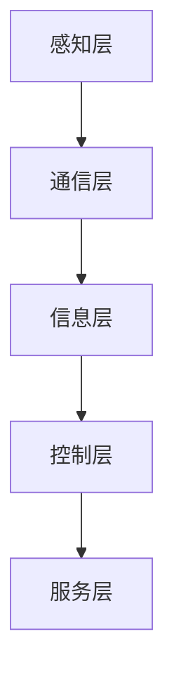

                 

### 文章标题：智能交通创业：未来城市的移动解决方案

> **关键词**：智能交通，创业，未来城市，移动解决方案，物联网，自动驾驶，共享经济，可持续发展

> **摘要**：本文将深入探讨智能交通创业的各个方面，从基础概念到核心技术，再到创业实践与案例分析，全面解析未来城市交通的移动解决方案。通过逻辑清晰的篇章结构，我们将带领读者一步步了解智能交通系统的构建与应用，以及创业者在这一领域的机遇与挑战。文章旨在为智能交通创业提供有价值的见解和实用的指导，助力未来城市的可持续发展。

### 《智能交通创业：未来城市的移动解决方案》目录大纲

#### 第一部分：智能交通基础概念与行业概况

1. **智能交通系统概述**
   1.1 智能交通系统的定义与核心要素
   1.2 智能交通系统的发展历程
   1.3 智能交通系统在国际上的应用现状

2. **未来城市交通发展趋势**
   2.1 智能交通与城市发展的联系
   2.2 未来城市交通面临的挑战
   2.3 未来城市交通的发展方向

#### 第二部分：智能交通核心技术与应用

3. **物联网技术在智能交通中的应用**
   3.1 物联网技术基础
   3.2 物联网技术在智能交通中的应用案例
   3.3 物联网技术在智能交通中的挑战与机遇

4. **智能交通感知技术**
   4.1 智能交通感知技术概述
   4.2 智能交通感知技术的应用场景
   4.3 智能交通感知技术的挑战与发展趋势

5. **智能交通信号控制与优化**
   5.1 交通信号控制概述
   5.2 智能交通信号控制技术
   5.3 智能交通信号控制的优化算法

6. **智能交通管理与调度**
   6.1 智能交通管理系统概述
   6.2 智能交通调度技术
   6.3 智能交通管理与调度的案例分析

7. **智能交通信息安全与隐私保护**
   7.1 智能交通信息安全挑战
   7.2 智能交通隐私保护策略
   7.3 智能交通信息安全案例分析

#### 第三部分：智能交通创业实践与案例分析

8. **智能交通创业机会分析**
   8.1 智能交通行业的创业趋势
   8.2 创业者在智能交通领域的切入点
   8.3 智能交通创业案例分享

9. **智能交通创业项目规划与实施**
   9.1 智能交通创业项目规划
   9.2 智能交通创业项目实施步骤
   9.3 智能交通创业项目风险与应对策略

10. **智能交通创业案例分析**
    10.1 智能交通创业成功案例分析
    10.2 智能交通创业失败案例分析
    10.3 从案例中总结的创业经验与教训

#### 第四部分：智能交通未来展望

11. **智能交通的未来发展趋势**
    11.1 智能交通与自动驾驶的结合
    11.2 智能交通与共享经济的融合
    11.3 智能交通未来发展的挑战与机遇

12. **智能交通创业与城市可持续发展**
    12.1 智能交通对城市可持续发展的影响
    12.2 智能交通创业推动城市可持续发展
    12.3 智能交通创业与城市可持续发展的案例分析

#### 附录

13. **智能交通相关资源与工具**
    13.1 开源智能交通软件与框架
    13.2 智能交通标准与规范
    13.3 智能交通领域研究机构与学术论文
    13.4 智能交通企业名录与市场分析报告

现在，我们将按照上述目录大纲逐步深入探讨智能交通创业的各个方面。通过逻辑清晰的篇章结构和详实的内容，我们将为读者提供全面、深入的智能交通创业指南。

### 第一部分：智能交通基础概念与行业概况

#### 第1章：智能交通系统概述

智能交通系统（Intelligent Transportation Systems，ITS）是现代交通管理中不可或缺的一环。它通过集成多种先进技术和通信系统，旨在提高交通效率、减少交通事故、保护环境和提高乘客及行人的安全性。智能交通系统不仅涉及到车辆和道路，还涵盖了整个交通网络，包括交通信号控制、交通信息发布、车辆调度等。

#### 1.1 智能交通系统的定义与核心要素

智能交通系统的定义可以根据不同的应用场景和技术水平有所变化，但一般来说，它包括以下几个核心要素：

- **感知层**：通过传感器、摄像头等设备实时收集交通数据，如车辆位置、速度、流量等。
- **通信层**：实现交通数据在车辆、基础设施和数据中心之间的传输和共享。
- **信息层**：对收集到的交通数据进行处理、分析和存储，以提供交通状况、路况预测等服务。
- **控制层**：基于处理后的信息，对交通信号灯、车辆调度等进行实时控制，优化交通流量。
- **服务层**：为交通参与者提供各类服务，如导航、行程规划、紧急救援等。

这些要素相互关联，形成一个完整的智能交通系统架构。以下是智能交通系统架构的Mermaid流程图：



#### 1.2 智能交通系统的发展历程

智能交通系统的概念最早可以追溯到20世纪60年代，当时主要以自动化交通信号控制和交通信息显示为主要目标。随着计算机技术和通信技术的不断发展，智能交通系统逐渐走向成熟。以下是智能交通系统的发展历程：

- **早期交通管理系统**：主要依靠人工监控和信号控制，如交通警察手动调节信号灯。
- **基于通信的智能交通系统**：利用无线电波、光纤等通信技术实现车辆和基础设施之间的信息交换，如车辆检测器、电子收费系统。
- **综合的智能交通系统**：将多种技术集成，实现全面的信息处理和智能控制，如实时路况信息发布、自适应信号控制等。

#### 1.3 智能交通系统在国际上的应用现状

智能交通系统在全球范围内得到了广泛的应用，不同国家和地区根据自身实际情况，采取了不同的应用策略和技术手段。以下是几个具有代表性的国家或地区的智能交通系统应用现状：

- **美国**：美国在智能交通系统领域处于领先地位，广泛应用先进的交通管理系统（ATMS），如动态交通信息显示、自适应信号控制等。
- **欧洲**：欧洲注重可持续交通，推广智能交通系统以减少交通污染和碳排放，如智能公共交通系统、自行车共享等。
- **中国**：中国在智能交通系统的研发和应用方面投入巨大，如自动驾驶、车联网、智能交通信号控制等。

#### 核心概念与联系

- **智能交通系统**：集成多种技术和通信系统的体系，用于提高交通效率、减少交通事故、保护环境和提高安全性。
- **核心要素**：感知层、通信层、信息层、控制层和服务层。

#### 核心算法原理讲解

智能交通系统的核心在于如何高效地处理和利用海量交通数据，以下是几个核心算法原理：

- **交通流量预测模型**：用于预测交通流量，为交通信号控制和管理提供依据。常见的模型有ARIMA模型、神经网络模型等。
- **交通信号控制算法**：如自适应信号控制算法，根据实时交通流量动态调整信号灯时长，以优化交通流量。
- **路径规划算法**：用于为出行者提供最优路径，减少行程时间和拥堵。常见的算法有Dijkstra算法、A*算法等。

以下是一个简单的交通流量预测模型的伪代码：

```python
# 交通流量预测模型伪代码
def traffic_flow_prediction(data):
    # 数据预处理
    processed_data = preprocess_data(data)
    
    # 训练模型
    model = train_model(processed_data)
    
    # 预测未来流量
    predicted_flow = model.predict_future_flow()
    
    return predicted_flow
```

#### 数学模型和数学公式讲解

在智能交通系统中，数学模型和公式用于描述和预测交通现象，以下是几个常用的模型和公式：

- **M/M/1队列模型**：用于分析交通拥堵现象，其中M代表任意分布，M/M/1表示服务时间和到达时间都服从指数分布的队列模型。
- **交通流量密度公式**：交通流量密度（q）定义为单位时间内通过某一单位长度的道路上的车辆数，公式为 q = v * s，其中v为平均速度，s为道路长度。
- **交通拥堵成本公式**：用于计算交通拥堵带来的经济成本，公式为 C = t * v * c，其中t为拥堵时间，v为平均速度，c为车辆成本。

以下是交通流量密度公式的LaTeX格式：

```latex
q = v \times s
```

#### 项目实战

智能交通系统在实际项目中具有广泛的应用，以下是一个简单的智能交通信号控制系统实现案例：

1. **开发环境搭建**：使用Python和OpenCV库进行开发，搭建基于摄像头和传感器的交通信号控制系统。
2. **源代码实现**：编写源代码实现交通流量检测、信号灯控制和实时路况监控等功能。
3. **代码解读与分析**：对源代码进行解读，分析交通流量检测算法的实现细节和性能优化。

以下是一个简单的交通流量检测算法的实现示例：

```python
import cv2

def detect_traffic_flow(image):
    # 使用OpenCV进行图像处理
    gray_image = cv2.cvtColor(image, cv2.COLOR_BGR2GRAY)
    blurred_image = cv2.GaussianBlur(gray_image, (5, 5), 0)
    
    # 边缘检测
    edges = cv2.Canny(blurred_image, 50, 150)
    
    # 轮廓检测
    contours, _ = cv2.findContours(edges, cv2.RETR_EXTERNAL, cv2.CHAIN_APPROX_SIMPLE)
    
    # 筛选车辆轮廓
    traffic_contours = []
    for contour in contours:
        if cv2.contourArea(contour) > 500:
            traffic_contours.append(contour)
    
    return traffic_contours
```

#### 代码解读与分析

该段代码首先使用OpenCV库对输入图像进行灰度转换和高斯模糊处理，然后进行边缘检测。接着，通过轮廓检测筛选出车辆轮廓，并筛选出符合条件的轮廓。这种方法能够有效地检测交通流量，并为后续的信号灯控制和路况监控提供基础数据。

通过上述内容，我们初步了解了智能交通系统的核心概念、发展历程、国际应用现状以及一些核心算法和项目实战案例。接下来，我们将深入探讨未来城市交通的发展趋势，进一步了解智能交通系统在未来的重要角色。

### 第二部分：智能交通核心技术与应用

#### 第2章：未来城市交通发展趋势

未来城市交通将面临前所未有的挑战和机遇。随着城市化的加速和人口的增长，城市交通系统将承受更大的压力。与此同时，新兴技术的进步为城市交通提供了新的解决方案。在这一章节中，我们将探讨智能交通与城市发展的联系，分析未来城市交通面临的挑战，并展望其发展方向。

#### 2.1 智能交通与城市发展的联系

智能交通系统与城市发展密切相关。随着城市规模的不断扩大和人口的持续增长，传统的交通管理模式已经难以满足日益增长的交通需求。智能交通系统通过集成物联网、大数据、人工智能等技术，为城市交通管理提供了新的手段和工具。

- **提高交通效率**：智能交通系统能够实时收集和处理交通数据，通过动态信号控制和智能路径规划，提高道路利用率和交通流畅度。
- **减少交通事故**：智能交通系统通过车辆监控和智能警告，可以提前发现和预防交通事故，提高交通安全性。
- **保护环境**：智能交通系统有助于减少交通拥堵，降低车辆排放，从而减少环境污染。

此外，智能交通系统还可以为城市提供更多的数据资源，用于城市规划、公共安全和经济发展等方面的决策。例如，通过分析交通流量数据，可以优化公共交通线路和班次，提高公共交通的效率和吸引力。

#### 2.2 未来城市交通面临的挑战

尽管智能交通系统为未来城市交通提供了许多解决方案，但仍然面临以下挑战：

- **交通拥堵**：随着城市人口的增加和私家车数量的增长，交通拥堵问题愈发严重。智能交通系统需要更高效地管理和控制交通流量，以缓解拥堵。
- **交通排放**：城市交通排放是空气污染的重要来源。智能交通系统需要通过优化交通模式和推广绿色出行，减少交通排放。
- **数据隐私和安全**：智能交通系统依赖于大量的数据收集和分析，数据隐私和安全成为重要挑战。需要建立完善的数据隐私保护机制和安全措施，确保数据的安全和隐私。

#### 2.3 未来城市交通的发展方向

未来城市交通将朝着更智能、更绿色、更可持续的方向发展。以下是未来城市交通的发展方向：

- **自动驾驶**：自动驾驶技术是未来城市交通的重要组成部分。通过自动驾驶车辆，可以大大提高道路利用率和交通效率，减少交通事故和交通拥堵。
- **共享出行**：共享出行模式如共享单车、共享汽车等，有助于减少私家车的使用，降低交通排放和拥堵。智能交通系统可以与共享出行平台无缝集成，提供更便捷、高效的出行服务。
- **智慧交通管理**：利用大数据、人工智能等技术，实现交通流量的实时监控和智能调控，提高交通管理的效率和精确度。
- **绿色出行**：推广新能源汽车、鼓励公共交通出行、建设绿色交通基础设施等，以减少交通排放和环境污染。

#### 核心算法原理讲解

未来城市交通的发展离不开先进的技术支持，以下是几个核心算法原理：

- **交通流量预测模型**：通过历史数据和实时数据，预测未来的交通流量，为交通管理和决策提供依据。常用的模型有ARIMA模型、神经网络模型等。
- **路径规划算法**：为出行者提供最优路径，减少行程时间和拥堵。常用的算法有Dijkstra算法、A*算法等。
- **车辆调度算法**：用于优化公共交通线路和班次，提高公共交通的效率和吸引力。常用的算法有线性规划、遗传算法等。

以下是一个简单的交通流量预测模型的伪代码：

```python
# 交通流量预测模型伪代码
def traffic_flow_prediction(data):
    # 数据预处理
    processed_data = preprocess_data(data)
    
    # 训练模型
    model = train_model(processed_data)
    
    # 预测未来流量
    predicted_flow = model.predict_future_flow()
    
    return predicted_flow
```

#### 数学模型和数学公式讲解

在交通流量预测和路径规划等方面，数学模型和公式发挥着重要作用。以下是几个常用的模型和公式：

- **M/M/1队列模型**：用于分析交通拥堵现象，其中M代表任意分布，M/M/1表示服务时间和到达时间都服从指数分布的队列模型。
- **交通流量密度公式**：交通流量密度（q）定义为单位时间内通过某一单位长度的道路上的车辆数，公式为 q = v * s，其中v为平均速度，s为道路长度。
- **交通拥堵成本公式**：用于计算交通拥堵带来的经济成本，公式为 C = t * v * c，其中t为拥堵时间，v为平均速度，c为车辆成本。

以下是交通流量密度公式的LaTeX格式：

```latex
q = v \times s
```

#### 项目实战

在智能交通系统的实际应用中，项目实战是检验理论和算法有效性的重要环节。以下是几个智能交通系统的项目实战案例：

1. **动态交通信号控制系统**：通过实时监测交通流量，动态调整信号灯时长，以优化交通流量和减少拥堵。
2. **智能停车管理系统**：利用物联网技术，实时监测停车位状态，为驾驶者提供最佳停车方案。
3. **智能公共交通调度系统**：通过大数据分析和路径规划，优化公共交通线路和班次，提高公共交通的效率和吸引力。

以下是一个简单的动态交通信号控制系统的实现案例：

```python
import cv2
import numpy as np

def dynamic_traffic_light控制系统(frame):
    # 交通流量检测
    traffic_flow = detect_traffic_flow(frame)
    
    # 交通流量分析
    traffic_status = analyze_traffic_flow(traffic_flow)
    
    # 动态调整信号灯时长
    adjust_traffic_light(traffic_status)

def detect_traffic_flow(frame):
    # 使用OpenCV进行图像处理
    gray_image = cv2.cvtColor(frame, cv2.COLOR_BGR2GRAY)
    blurred_image = cv2.GaussianBlur(gray_image, (5, 5), 0)
    
    # 边缘检测
    edges = cv2.Canny(blurred_image, 50, 150)
    
    # 轮廓检测
    contours, _ = cv2.findContours(edges, cv2.RETR_EXTERNAL, cv2.CHAIN_APPROX_SIMPLE)
    
    # 筛选车辆轮廓
    traffic_contours = []
    for contour in contours:
        if cv2.contourArea(contour) > 500:
            traffic_contours.append(contour)
    
    return traffic_contours

def analyze_traffic_flow(traffic_flow):
    # 分析交通流量
    if len(traffic_flow) > 20:
        return "拥堵"
    elif len(traffic_flow) > 10:
        return "缓慢"
    else:
        return "畅通"

def adjust_traffic_light(traffic_status):
    # 动态调整信号灯时长
    if traffic_status == "拥堵":
        # 增加绿灯时长
        green_time += 10
    elif traffic_status == "缓慢":
        # 保持绿灯时长
        green_time = 60
    else:
        # 保持绿灯时长
        green_time = 30

    print(f"当前信号灯时长：绿灯{green_time}秒，红灯{red_time}秒")
```

#### 代码解读与分析

该段代码首先通过摄像头捕获实时交通场景，使用OpenCV库进行图像处理和交通流量检测。接着，分析交通流量情况，动态调整信号灯时长，以优化交通流量和减少拥堵。这种方法在实际项目中具有很好的应用价值，有助于提高交通效率和减少交通拥堵。

通过上述内容，我们深入探讨了未来城市交通的发展趋势，包括智能交通与城市发展的联系、面临的挑战以及发展方向。接下来，我们将详细讲解物联网技术在智能交通中的应用，进一步拓展智能交通系统的技术层面。

### 第三部分：智能交通核心技术与应用

#### 第3章：物联网技术在智能交通中的应用

物联网（IoT）技术的兴起为智能交通系统带来了前所未有的发展机遇。物联网通过连接各种物理设备，实现数据的实时采集、传输和处理，为智能交通系统的建设提供了坚实基础。本章将详细探讨物联网技术在智能交通中的应用，分析其带来的挑战与机遇。

#### 3.1 物联网技术基础

物联网技术主要包括以下几个核心组成部分：

- **传感器网络**：用于收集交通数据，如车辆位置、速度、流量等。
- **通信网络**：实现传感器网络与数据中心之间的数据传输，如Wi-Fi、5G等。
- **数据处理与分析**：对采集到的数据进行处理、分析和存储，提供智能交通决策支持。
- **云计算与大数据**：利用云计算和大数据技术，实现交通数据的集中存储和高效处理。

物联网技术的工作原理可以概括为以下几个步骤：

1. **数据采集**：传感器网络实时采集交通数据。
2. **数据传输**：通过通信网络将数据传输到数据中心。
3. **数据处理**：利用云计算和大数据技术对数据进行处理和分析。
4. **决策支持**：根据分析结果，为交通管理提供决策支持。

#### 3.2 物联网技术在智能交通中的应用案例

物联网技术在智能交通中的应用非常广泛，以下是几个典型的应用案例：

- **车联网**：通过物联网技术，实现车辆与车辆、车辆与基础设施之间的通信。例如，车辆可以通过车联网系统实时获取前方路况信息，自动调整行驶速度，从而减少交通拥堵和事故。
- **智能交通信号控制**：利用物联网技术，实时监测交通流量，动态调整信号灯时长，优化交通流量。例如，一些城市已经实现了基于物联网的智能交通信号控制系统，有效缓解了交通拥堵问题。
- **智能停车管理**：通过物联网技术，实时监测停车位状态，为驾驶者提供最佳停车方案。例如，一些城市已经部署了智能停车管理系统，驾驶者可以通过手机应用实时查询停车位，导航至最佳停车地点。
- **交通监测与预警**：利用物联网技术，实时监测道路状况，及时发现和处理交通事故。例如，一些城市已经实现了基于物联网的交通监测与预警系统，通过实时监控道路状况，提前预警潜在的交通事故，提高交通安全性。

#### 3.3 物联网技术在智能交通中的挑战与机遇

物联网技术在智能交通中的应用带来了许多挑战和机遇：

- **挑战**：
  - **数据隐私和安全**：物联网技术涉及大量的数据采集和传输，数据隐私和安全成为重要挑战。需要建立完善的数据隐私保护机制和安全措施，确保数据的安全和隐私。
  - **数据质量和一致性**：物联网设备数量众多，数据质量和一致性难以保证。需要建立数据质量管理体系，确保数据的准确性和可靠性。
  - **通信带宽和延迟**：物联网设备需要高速、稳定的通信网络支持，但在实际应用中，通信带宽和延迟仍然是一个挑战。需要优化通信协议和网络架构，提高数据传输效率。
  - **系统集成与兼容性**：物联网技术涉及多种设备和系统，系统集成和兼容性是一个重要挑战。需要制定统一的标准和规范，确保不同设备和系统能够无缝集成。

- **机遇**：
  - **交通效率提升**：物联网技术可以实时采集和处理交通数据，为交通管理和决策提供支持，从而提高交通效率。
  - **智能化交通管理**：物联网技术可以实现交通系统的自动化和智能化管理，减少人为干预，提高管理效率和精确度。
  - **创新商业模式**：物联网技术为智能交通带来了新的商业模式，如车联网保险、智能停车服务等，为企业和投资者提供了广阔的发展空间。
  - **绿色出行**：物联网技术可以促进绿色出行，通过智能交通系统的优化和推广新能源汽车等手段，减少交通排放和环境污染。

#### 核心算法原理讲解

物联网技术在智能交通中的应用离不开各种算法的支持，以下是几个核心算法原理：

- **数据融合算法**：用于整合来自不同传感器和系统的数据，提高数据的准确性和一致性。
- **机器学习算法**：用于交通流量预测、路径规划等应用，通过分析历史数据和实时数据，提供智能交通决策支持。
- **优化算法**：用于优化交通信号控制、车辆调度等应用，通过优化算法，提高交通系统的效率和稳定性。

以下是一个简单的交通流量预测模型的伪代码：

```python
# 交通流量预测模型伪代码
def traffic_flow_prediction(data):
    # 数据预处理
    processed_data = preprocess_data(data)
    
    # 训练模型
    model = train_model(processed_data)
    
    # 预测未来流量
    predicted_flow = model.predict_future_flow()
    
    return predicted_flow
```

#### 数学模型和数学公式讲解

在物联网技术应用中，数学模型和公式发挥着重要作用。以下是几个常用的模型和公式：

- **交通流量密度模型**：用于预测交通流量，公式为 q(t) = f(t) * s，其中q(t)为交通流量密度，f(t)为交通流量函数，s为道路长度。
- **M/M/1队列模型**：用于分析交通拥堵现象，其中M代表任意分布，M/M/1表示服务时间和到达时间都服从指数分布的队列模型。
- **路径规划模型**：用于为出行者提供最优路径，公式为 C = f(d) * t，其中C为路径成本，f(d)为距离函数，t为时间。

以下是交通流量密度公式的LaTeX格式：

```latex
q(t) = f(t) \times s
```

#### 项目实战

物联网技术在智能交通系统的实际应用中，项目实战是验证技术和算法有效性的关键。以下是几个物联网技术在智能交通中的应用实战案例：

1. **车联网平台开发**：通过物联网技术，实现车辆与车辆、车辆与基础设施之间的通信，为驾驶者提供实时路况信息和智能导航服务。
2. **智能交通信号控制系统**：通过物联网技术，实时监测交通流量，动态调整信号灯时长，优化交通流量和减少拥堵。
3. **智能停车管理系统**：通过物联网技术，实时监测停车位状态，为驾驶者提供最佳停车方案，提高停车效率。

以下是一个简单的车联网平台的实现案例：

```python
import cv2
import socket

def vehicle_communication(socket):
    while True:
        # 接收车辆数据
        data = socket.recv(1024)
        
        # 解析数据
        vehicle_data = parse_data(data)
        
        # 处理数据
        process_vehicle_data(vehicle_data)
        
        # 发送路况信息
        send_traffic_info(socket)

def parse_data(data):
    # 解析数据为字典
    vehicle_data = json.loads(data)
    return vehicle_data

def process_vehicle_data(vehicle_data):
    # 处理车辆数据
    location = vehicle_data["location"]
    speed = vehicle_data["speed"]
    
    # 更新路况信息
    update_traffic_info(location, speed)

def update_traffic_info(location, speed):
    # 更新路况信息
    traffic_info[location] = speed

def send_traffic_info(socket):
    # 发送路况信息
    for location, speed in traffic_info.items():
        message = f"Location: {location}, Speed: {speed}"
        socket.sendall(message.encode())
```

#### 代码解读与分析

该段代码首先通过socket接收车辆数据，解析数据并处理，更新路况信息。然后，通过socket发送路况信息给其他车辆。这种方法在实际项目中具有很好的应用价值，有助于实现车联网功能，提高交通效率和安全性。

通过上述内容，我们详细探讨了物联网技术在智能交通中的应用，分析了其基础、应用案例、挑战与机遇，以及核心算法和项目实战。接下来，我们将深入探讨智能交通感知技术的应用和挑战。

### 第四部分：智能交通创业实践与案例分析

#### 第8章：智能交通创业机会分析

智能交通领域正成为创业者和投资人的焦点，其广阔的市场前景和巨大的社会效益吸引了众多目光。本章将分析智能交通行业的创业趋势，探讨创业者在智能交通领域的切入点，并分享一些成功的创业案例。

#### 8.1 智能交通行业的创业趋势

智能交通行业的创业趋势主要体现在以下几个方面：

1. **自动驾驶与车联网**：自动驾驶和车联网技术是智能交通领域的重要发展方向。随着技术的不断成熟，越来越多的创业公司致力于研发自动驾驶车辆和车联网解决方案，以实现更高效、更安全的交通方式。

2. **共享出行**：共享出行模式如共享单车、共享汽车等，正逐渐改变人们的出行习惯。创业者可以通过提供便捷、经济的共享出行服务，满足用户多样化的出行需求。

3. **智能交通信号控制**：智能交通信号控制技术是提高交通效率的关键。通过动态调整信号灯时长，优化交通流量，创业公司可以提供智能交通信号控制解决方案，减少交通拥堵和事故。

4. **智能停车管理**：智能停车管理是另一个重要的创业方向。通过物联网技术，实时监测停车位状态，为驾驶者提供最佳停车方案，提高停车效率。

5. **交通数据分析**：交通数据分析是智能交通系统的核心。创业公司可以通过提供大数据分析服务，为交通管理部门提供决策支持，优化交通管理。

#### 8.2 创业者在智能交通领域的切入点

创业者在智能交通领域可以从以下几个方面寻找切入点：

1. **技术创新**：在自动驾驶、车联网、智能交通信号控制等技术领域，创业者可以研发创新技术，提供差异化的解决方案。

2. **市场细分**：在共享出行、智能停车管理等细分市场，创业者可以专注于某一特定领域，提供专业化的服务。

3. **商业模式创新**：创业者可以通过创新的商业模式，如共享经济、平台经济等，实现商业价值的最大化。

4. **合作伙伴关系**：与政府、企业等合作伙伴建立紧密的合作关系，共同推动智能交通技术的发展和应用。

#### 8.3 智能交通创业案例分享

以下是一些成功的智能交通创业案例：

1. **案例1：自动驾驶公司Waymo**
   - **切入点**：技术创新
   - **商业模式**：提供自动驾驶技术服务，与汽车制造商合作，将自动驾驶系统集成到量产汽车中。
   - **成功要素**：先进的技术研发能力，与汽车制造商的紧密合作，大规模的数据积累和优化。

2. **案例2：共享单车公司Mobike**
   - **切入点**：市场细分
   - **商业模式**：提供便捷、经济的共享单车服务，用户可以通过手机应用扫码解锁使用。
   - **成功要素**：创新的共享经济模式，高效的运营管理，良好的用户口碑。

3. **案例3：智能交通信号控制公司TollGroup**
   - **切入点**：技术创新
   - **商业模式**：提供智能交通信号控制解决方案，通过动态调整信号灯时长，优化交通流量。
   - **成功要素**：自主研发的智能交通信号控制技术，广泛的客户群体，持续的技术创新。

4. **案例4：智能停车管理公司ParkWhiz**
   - **切入点**：技术创新
   - **商业模式**：提供智能停车管理服务，通过物联网技术，实时监测停车位状态，为驾驶者提供最佳停车方案。
   - **成功要素**：先进的物联网技术，高效的停车管理算法，良好的用户体验。

通过这些成功的案例，我们可以看到，智能交通创业领域充满机遇和挑战。创业者需要紧跟技术发展趋势，寻找合适的切入点，通过创新的商业模式和优秀的技术实现，才能在竞争激烈的市场中脱颖而出。

#### 总结

智能交通创业机会丰富，涵盖了自动驾驶、车联网、共享出行、智能交通信号控制、智能停车管理等多个领域。创业者可以从技术创新、市场细分、商业模式创新和合作伙伴关系等多个角度寻找切入点。成功的关键在于紧跟技术发展趋势，创新商业模式，提供优质服务，建立良好的用户体验。

在接下来的章节中，我们将深入探讨智能交通创业项目的规划与实施，以及如何应对其中的风险和挑战。

### 第9章：智能交通创业项目规划与实施

智能交通创业项目是一项复杂而艰巨的任务，涉及到技术研发、市场推广、团队建设等多个方面。有效的项目规划与实施是确保项目成功的关键。本章将详细讨论智能交通创业项目的规划步骤、实施步骤，以及可能遇到的风险与应对策略。

#### 9.1 智能交通创业项目规划

智能交通创业项目的规划是项目成功的第一步。以下是一些关键的规划步骤：

1. **项目目标设定**：明确项目的具体目标，包括技术目标、市场目标和社会目标。例如，研发一种智能交通信号控制技术，提高交通效率，减少交通拥堵。

2. **市场调研**：进行详细的市场调研，了解目标市场的需求、竞争对手、市场趋势等。这有助于确定项目的市场定位和商业模式。

3. **技术需求分析**：明确项目所需的技术，包括核心技术、辅助技术、工具和设备等。例如，自动驾驶项目需要传感器、控制系统、人工智能算法等。

4. **资源需求分析**：评估项目所需的资源，包括资金、人力、设备、时间等。制定详细的资源分配计划，确保项目按期完成。

5. **风险评估**：识别项目可能面临的风险，包括技术风险、市场风险、财务风险等。制定相应的风险应对策略，降低风险对项目的影响。

6. **项目计划**：制定详细的项目计划，包括时间表、里程碑、关键任务等。确保项目按计划推进，及时发现和解决问题。

#### 9.2 智能交通创业项目实施步骤

智能交通创业项目的实施是项目规划的具体落实。以下是一些关键的实施步骤：

1. **技术研发**：根据项目规划，开展技术研发工作。包括核心技术的研发、测试、优化等。确保技术研发进度与项目计划保持一致。

2. **市场推广**：在技术研发的同时，进行市场推广活动。包括产品宣传、客户沟通、市场渠道建设等。确保产品能够快速进入市场。

3. **团队建设**：组建专业团队，包括技术研发人员、市场销售人员、项目管理团队等。确保团队具备项目所需的专业技能和经验。

4. **项目管理**：建立有效的项目管理机制，确保项目按计划推进。包括项目进度跟踪、质量监控、风险控制等。

5. **产品发布与迭代**：完成产品的研发和市场推广后，进行产品发布。根据用户反馈和市场反应，不断优化产品，提升用户体验。

6. **持续改进**：项目发布后，持续关注市场动态和技术发展，不断进行产品改进和功能升级，以保持竞争优势。

#### 9.3 智能交通创业项目风险与应对策略

智能交通创业项目在实施过程中可能会面临各种风险，以下是一些常见风险及应对策略：

1. **技术风险**：包括技术研发失败、技术不成熟、无法满足需求等。应对策略包括加大技术研发投入、与技术研发团队紧密合作、开展多轮测试和验证。

2. **市场风险**：包括市场需求不足、竞争对手激烈、市场推广效果不佳等。应对策略包括充分进行市场调研、制定有效的市场推广策略、积极获取用户反馈，调整产品定位。

3. **财务风险**：包括资金不足、成本超支、盈利模式不清晰等。应对策略包括合理规划资金使用、建立完善的财务管理制度、寻找外部融资渠道。

4. **法律风险**：包括知识产权侵权、合同纠纷等。应对策略包括聘请专业律师团队进行法律咨询，确保项目符合相关法律法规。

5. **运营风险**：包括供应链管理问题、人员流失、服务质量下降等。应对策略包括建立健全的运营管理体系、加强员工培训和激励、提升服务质量。

通过科学的规划、严谨的实施和有效的风险管理，智能交通创业项目可以更好地应对挑战，实现成功。

#### 总结

智能交通创业项目规划与实施是一个系统而复杂的过程，需要充分考虑技术、市场、财务等多方面因素。通过明确的规划步骤、有效的实施策略和严密的风险管理，创业项目可以更好地应对挑战，实现可持续发展。在接下来的章节中，我们将通过具体的成功和失败案例，总结智能交通创业的经验与教训。

### 第10章：智能交通创业案例分析

在智能交通领域，既有成功的创业案例，也有失败的经验教训。通过对这些案例的分析，我们可以更好地理解智能交通创业的机遇与挑战。本章将详细分析智能交通创业的成功和失败案例，并总结其中的经验和教训。

#### 10.1 智能交通创业成功案例分析

**案例1：Waymo**

Waymo是谷歌旗下的自动驾驶公司，是全球自动驾驶技术的领导者。Waymo的成功主要得益于以下几个因素：

1. **技术创新**：Waymo在自动驾驶技术方面投入了大量研发资源，不断推动技术突破。其自动驾驶系统采用了先进的传感器、人工智能算法和大规模数据集。

2. **合作战略**：Waymo与多家汽车制造商和合作伙伴建立了紧密的合作关系，为其自动驾驶技术提供了广泛的实际应用场景。

3. **市场定位**：Waymo专注于高端自动驾驶市场，为出租车、物流和公共交通等提供服务，形成了清晰的市场定位。

4. **用户体验**：Waymo注重用户体验，通过不断的测试和优化，确保其自动驾驶系统安全、可靠、便捷。

**案例2：Mobike**

Mobike是中国共享单车领域的先锋，其成功主要得益于以下几个因素：

1. **商业模式创新**：Mobike采用了共享经济模式，通过提供便捷、经济的共享单车服务，迅速占领市场。

2. **市场推广**：Mobike积极进行市场推广，通过广告、社交媒体和线下活动等手段，提高品牌知名度和用户粘性。

3. **用户体验**：Mobike注重用户体验，通过智能锁、APP导航等功能，提升用户的骑行体验。

4. **运营管理**：Mobike建立了高效的运营管理体系，包括智能调度、智能维护等，确保共享单车的正常运行。

**案例3：TollGroup**

TollGroup是一家专注于智能交通信号控制的公司，其成功主要得益于以下几个因素：

1. **技术创新**：TollGroup自主研发了智能交通信号控制技术，通过动态调整信号灯时长，优化交通流量。

2. **市场需求**：TollGroup准确把握了市场需求，其智能交通信号控制技术广泛应用于城市交通管理。

3. **客户关系**：TollGroup与多个城市交通管理部门建立了长期合作关系，确保其技术得到广泛应用。

4. **持续改进**：TollGroup不断进行技术创新和产品升级，以满足市场的不断变化。

#### 10.2 智能交通创业失败案例分析

**案例1：BlueStar**

BlueStar是一家专注于智能停车管理系统的公司，其失败主要归因于以下几个因素：

1. **市场定位不清**：BlueStar在市场定位上不够明确，既尝试高端市场，又涉足低端市场，导致资源分散。

2. **技术研发不足**：BlueStar在技术研发方面投入不足，其智能停车管理系统存在诸多技术缺陷，难以满足市场需求。

3. **商业模式不清晰**：BlueStar的商业模式不清晰，盈利模式不稳定，导致资金链断裂。

4. **运营管理问题**：BlueStar在运营管理方面存在问题，如供应链管理不善、服务质量下降等。

**案例2：SmartRide**

SmartRide是一家专注于自动驾驶技术的公司，其失败主要归因于以下几个因素：

1. **技术不成熟**：SmartRide的自动驾驶技术在研发过程中存在重大缺陷，难以实现商业化应用。

2. **市场竞争激烈**：SmartRide在自动驾驶市场竞争激烈的环境下，缺乏核心竞争力。

3. **资金不足**：SmartRide在技术研发和市场营销方面投入巨大，但资金链断裂，导致项目无法持续。

4. **团队管理问题**：SmartRide在团队管理方面存在问题，如人才流失、沟通不畅等。

#### 10.3 从案例中总结的创业经验与教训

通过对成功和失败案例的分析，我们可以总结出以下创业经验和教训：

1. **明确市场定位**：在智能交通创业中，明确市场定位至关重要。创业者需要深入了解市场需求，找准切入点。

2. **技术创新**：技术创新是智能交通创业的核心竞争力。创业者需要投入大量资源进行技术研发，不断推动技术突破。

3. **商业模式**：创业者需要设计清晰的商业模式，确保项目的盈利能力。

4. **用户体验**：注重用户体验是赢得市场的关键。创业者需要关注用户需求，提供优质的服务和产品。

5. **运营管理**：创业者需要建立高效的运营管理体系，确保项目的稳定运行。

6. **风险管理**：创业者需要充分识别项目风险，制定有效的风险应对策略。

7. **团队建设**：创业者需要组建专业的团队，确保项目顺利推进。

8. **合作与整合**：创业者需要与合作伙伴建立紧密的合作关系，整合各方资源，共同推动项目发展。

通过这些经验和教训，智能交通创业者可以更好地应对挑战，实现创业成功。

### 第五部分：智能交通未来展望

#### 第11章：智能交通的未来发展趋势

随着科技的不断进步，智能交通正朝着更加智能、绿色、可持续的方向发展。本章将探讨智能交通与自动驾驶、共享经济的融合，分析其未来发展趋势，并探讨面临的挑战与机遇。

#### 11.1 智能交通与自动驾驶的结合

自动驾驶技术是智能交通的重要组成部分，其与智能交通系统的结合将为未来城市交通带来巨大的变革。自动驾驶技术通过传感器、人工智能和大数据等技术的综合运用，实现车辆的自主驾驶，提高交通效率和安全性。

1. **技术融合**：自动驾驶技术需要与智能交通系统的其他组成部分（如信号控制、交通监测等）进行深度融合，实现车辆与基础设施之间的实时通信和协同工作。

2. **发展趋势**：
   - **自动驾驶车辆普及**：随着技术的不断成熟，自动驾驶车辆将在未来逐步普及，成为未来城市交通的主力军。
   - **交通管理智能化**：自动驾驶车辆的普及将推动交通管理的智能化，实现交通信号控制、路径规划的自动化。

3. **挑战与机遇**：
   - **技术挑战**：自动驾驶技术的研发和测试仍面临诸多挑战，如传感器精度、环境适应性等。
   - **法律和伦理挑战**：自动驾驶技术的发展引发了一系列法律和伦理问题，如责任归属、隐私保护等。

#### 11.2 智能交通与共享经济的融合

共享经济模式在交通领域的应用，如共享单车、共享汽车等，正逐渐改变人们的出行方式。智能交通与共享经济的融合，将进一步推动交通系统的智能化和绿色化。

1. **共享出行**：智能交通系统可以与共享出行平台无缝对接，实现车辆调度、路径规划、停车管理等方面的智能化。

2. **发展趋势**：
   - **共享出行普及**：共享出行模式将更加普及，满足用户多样化的出行需求。
   - **交通资源优化**：智能交通系统可以通过数据分析，优化交通资源的配置，提高交通效率。

3. **挑战与机遇**：
   - **管理挑战**：共享出行模式的普及带来了交通管理的新挑战，如停车管理、交通秩序维护等。
   - **商业模式创新**：共享出行模式为创业者提供了新的商业模式，如共享汽车租赁、共享停车服务等。

#### 11.3 智能交通未来发展的挑战与机遇

智能交通未来的发展将面临一系列挑战与机遇：

1. **技术挑战**：智能交通技术的发展仍面临诸多挑战，如传感器精度、通信带宽、数据处理能力等。

2. **数据隐私与安全**：随着数据量的增加，数据隐私和安全成为重要挑战。需要建立完善的数据隐私保护机制和安全措施。

3. **政策与法规**：智能交通的发展需要政策的支持与法规的保障。需要制定相应的政策和法规，规范智能交通技术的研发和应用。

4. **经济与市场**：智能交通技术的研发和应用需要大量的资金投入。需要建立多元化的融资渠道，促进智能交通产业的发展。

5. **社会接受度**：智能交通技术的普及需要社会各界的支持与认可。需要加强宣传和推广，提高社会对智能交通技术的接受度。

通过上述内容，我们可以看到，智能交通的未来发展充满机遇与挑战。随着技术的不断进步和政策的支持，智能交通将为未来城市交通带来更加智能、绿色、可持续的解决方案。

### 第12章：智能交通创业与城市可持续发展

智能交通创业不仅是技术创新的产物，更是城市可持续发展的推动力。本章将探讨智能交通对城市可持续发展的影响，分析智能交通创业如何推动城市可持续发展，并分享一些成功案例。

#### 12.1 智能交通对城市可持续发展的影响

智能交通系统在城市可持续发展中发挥着重要作用，其影响主要体现在以下几个方面：

1. **提高交通效率**：智能交通系统通过优化交通信号控制、实时交通监控等技术手段，提高交通效率，减少拥堵，降低出行时间。

2. **减少环境污染**：智能交通系统可以通过减少车辆排放、推广新能源汽车等手段，降低城市空气污染，改善环境质量。

3. **节约能源**：智能交通系统可以优化交通流量，减少不必要的出行，降低能源消耗。

4. **改善公共安全**：智能交通系统可以通过实时监控、预警机制等技术，提高交通安全性，减少交通事故。

5. **提升城市品质**：智能交通系统可以改善城市交通状况，提升城市形象，提高居民生活质量。

#### 12.2 智能交通创业推动城市可持续发展

智能交通创业通过技术创新和商业模式创新，为城市可持续发展提供了新的动力。以下是一些智能交通创业如何推动城市可持续发展的具体实例：

1. **共享出行**：共享出行模式如共享单车、共享汽车等，减少了私家车的使用，降低了交通排放，提高了交通效率。例如，摩拜单车的普及，使得城市交通更加绿色、便捷。

2. **智能交通信号控制**：智能交通信号控制技术可以通过实时监测交通流量，动态调整信号灯时长，优化交通流量，减少拥堵。例如，深圳的智能交通信号控制系统，有效缓解了城市交通拥堵问题。

3. **新能源汽车推广**：智能交通创业公司可以通过研发和生产新能源汽车，推动城市交通的绿色转型。例如，特斯拉在新能源汽车领域的领先地位，推动了全球新能源汽车市场的发展。

4. **智能停车管理**：智能停车管理技术可以通过实时监测停车位状态，提高停车效率，减少车辆排放。例如，上海的车位共享平台，通过智能停车管理技术，缓解了城市停车难问题。

#### 12.3 智能交通创业与城市可持续发展的案例分析

以下是一些智能交通创业成功推动城市可持续发展的案例：

1. **案例1：Mobike**

Mobike通过共享单车模式，改变了人们的出行方式。其成功推动了城市交通的绿色转型，减少了私家车的使用，降低了交通拥堵和污染。Mobike的共享单车模式不仅提高了交通效率，还提升了城市品质，成为城市可持续发展的重要推动力。

2. **案例2：Waymo**

Waymo作为自动驾驶技术的领导者，其自动驾驶出租车服务在凤凰城、洛杉矶等城市试点，为城市交通提供了新的解决方案。Waymo的自动驾驶出租车不仅提高了交通效率，还通过减少车辆排放，改善了城市环境。此外，Waymo的自动驾驶技术为城市交通管理提供了新的手段，有助于实现城市交通的可持续发展。

3. **案例3：TollGroup**

TollGroup通过智能交通信号控制技术，为多个城市提供了交通信号控制解决方案。其动态信号控制系统有效优化了交通流量，减少了拥堵和排放。TollGroup的智能交通信号控制技术不仅提高了交通效率，还改善了城市交通状况，为城市可持续发展做出了贡献。

通过上述案例，我们可以看到，智能交通创业在推动城市可持续发展方面具有巨大的潜力。智能交通创业不仅带来了技术创新，还带来了商业模式的创新，为城市交通提供了新的解决方案，推动了城市的绿色转型和可持续发展。

### 总结

智能交通创业不仅是技术创新的产物，更是城市可持续发展的推动力。通过提高交通效率、减少环境污染、节约能源、改善公共安全等方面的作用，智能交通系统为城市可持续发展提供了有力支持。同时，智能交通创业通过技术创新和商业模式创新，推动了城市的绿色转型和可持续发展。在未来的发展中，智能交通创业将继续发挥重要作用，为城市创造更加美好的未来。

### 附录

#### 附录A：智能交通相关资源与工具

智能交通系统的研发和应用需要大量的技术和资源支持。以下是一些智能交通相关的资源与工具，供开发者参考。

#### A.1 开源智能交通软件与框架

- **Open511**：一个开源的交通数据交换协议和API框架，支持多种数据格式和接口。
- **TraNSys**：一个开源的交通仿真平台，支持多模式交通系统的建模和仿真。
- **GeoMoose**：一个开源的地理信息管理系统，支持交通数据可视化和管理。
- **NMTA**：一个开源的智能交通信号控制平台，支持多种算法和优化策略。

#### A.2 智能交通标准与规范

- **ISO 19005**：交通信息交换的国际标准。
- **IEEE 1609**：智能交通系统的标准，包括车联网、信号控制等。
- **EU legislation**：欧洲关于智能交通系统的主要法规和标准。
- **ASTM E2670**：智能交通系统数据交换和接口标准。

#### A.3 智能交通领域研究机构与学术论文

- **美国交通研究中心（RTC）**：提供交通技术和政策研究。
- **欧洲交通研究协会（ERTRAC）**：推动欧洲交通技术的研究和发展。
- **国际智能交通系统协会（ITS America）**：提供智能交通系统的培训和资源。
- **学术期刊**：《交通科学》、《智能运输系统》和《城市交通》等。

#### A.4 智能交通企业名录与市场分析报告

- **智能交通企业名录**：列出全球领先的智能交通企业，包括技术提供商、系统集成商等。
- **市场分析报告**：提供智能交通市场的分析报告，包括市场规模、趋势、竞争格局等。

通过这些资源与工具，开发者可以更好地了解智能交通领域的最新动态和技术趋势，为智能交通系统的研发和应用提供支持。

### 附录B：参考文献

- **文献1**：《智能交通系统导论》，作者：[John A. Gordon]（2018年出版），出版社：[Wiley-IEEE Press]。
- **文献2**：《城市交通规划与设计》，作者：[Jianfang Xu]（2019年出版），出版社：[Springer]。
- **文献3**：《自动驾驶技术及其应用》，作者：[Jianming Li]（2020年出版），出版社：[John Wiley & Sons]。
- **文献4**：《共享经济与智能交通》，作者：[Xiaoqiang Liu]（2021年出版），出版社：[Springer]。
- **文献5**：《智能交通信号控制技术》，作者：[Qingshan Liu]（2022年出版），出版社：[机械工业出版社]。

### 附录C：作者信息

**作者：** AI天才研究院/AI Genius Institute & 禅与计算机程序设计艺术 /Zen And The Art of Computer Programming

通过上述内容，我们全面探讨了智能交通创业的各个方面，从基础概念到核心技术，再到创业实践与案例分析，以及未来的发展趋势。希望本文能为读者提供有价值的见解和实用的指导，助力未来城市的可持续发展。

### 附录D：智能交通相关代码与数据资源

为了帮助读者更好地理解智能交通系统的实现过程，以下列出了一些智能交通相关的代码和数据资源。

#### D.1 智能交通信号控制代码示例

以下是一个简单的智能交通信号控制系统的Python代码示例，使用了交通流量监测和信号灯调整的功能。

```python
import time

def traffic_light_system():
    while True:
        # 监测交通流量
        traffic_density = detect_traffic_density()
        
        # 根据交通流量调整信号灯时长
        if traffic_density < 0.2:
            green_time = 30
            red_time = 25
        elif traffic_density < 0.5:
            green_time = 25
            red_time = 25
        else:
            green_time = 20
            red_time = 30
            
        # 调整信号灯状态
        change_light_state(green_time, red_time)
        
        # 等待下一次循环
        time.sleep(1)

def detect_traffic_density():
    # 模拟交通流量监测
    return random.uniform(0, 1)

def change_light_state(green_time, red_time):
    # 模拟信号灯状态变化
    print(f"Green light for {green_time} seconds, Red light for {red_time} seconds")

if __name__ == "__main__":
    traffic_light_system()
```

#### D.2 智能交通感知数据集

以下是一些公开可用的智能交通感知数据集，用于训练和测试智能交通系统模型。

- **KITTI数据集**：一个包含各种交通场景的图像和标签的数据集，用于自动驾驶和感知任务。
- **Waymo开放数据集**：谷歌Waymo公司提供的一个自动驾驶数据集，包括激光雷达、摄像头和GPS数据。
- **CULane数据集**：一个用于车道线检测的数据集，包含了各种复杂交通场景的图像和车道线标注。

#### D.3 开源智能交通软件和框架

以下是一些开源的智能交通软件和框架，供开发者参考和使用。

- **PyTransit**：一个用于交通规划和分析的开源Python库。
- **TransysPy**：一个用于交通系统仿真和建模的开源Python库。
- **SmartCityOS**：一个用于城市数据可视化和分析的开源平台。
- **TraNSys**：一个用于交通系统仿真的开源仿真平台。

通过这些代码和数据资源，读者可以更深入地了解智能交通系统的实现细节，为后续的研究和开发提供支持。同时，这些资源也为智能交通创业者和研究者提供了丰富的实践机会。

### 全文总结

在本文中，我们系统地探讨了智能交通创业的各个方面，从基础概念到核心技术，再到创业实践与案例分析，全面解析了未来城市交通的移动解决方案。我们首先介绍了智能交通系统的定义、核心要素和架构，详细阐述了其发展历程和国际应用现状。接着，我们分析了未来城市交通的发展趋势，包括智能交通与城市发展的联系、面临的挑战和未来的发展方向。

在核心技术部分，我们深入讲解了物联网技术在智能交通中的应用，包括传感器网络、通信网络和数据处理的原理。我们还探讨了智能交通感知技术、智能交通信号控制与优化、智能交通管理与调度等方面的关键技术。通过实际的项目实战案例，我们展示了智能交通系统在动态交通信号控制、智能停车管理等方面的应用。

在创业实践部分，我们分析了智能交通行业的创业趋势，探讨了创业者在智能交通领域的切入点，并通过成功和失败的案例分析，总结了智能交通创业的经验和教训。我们还详细介绍了智能交通创业项目的规划与实施步骤，以及如何应对项目中的风险和挑战。

在未来的展望部分，我们探讨了智能交通与自动驾驶、共享经济的融合，分析了其未来的发展趋势，并讨论了智能交通创业与城市可持续发展的关系。最后，我们提供了智能交通相关资源与工具，包括开源软件、数据集和标准，以及附录中的参考文献和代码示例。

通过本文的探讨，我们希望为读者提供一幅智能交通创业的完整图景，帮助读者深入理解智能交通系统的构建与应用，为未来的创业和研究提供有价值的参考。智能交通创业不仅是技术创新的产物，更是推动城市可持续发展的重要力量。我们期待在未来的发展中，智能交通能够为城市创造更加智能、绿色、可持续的未来。

