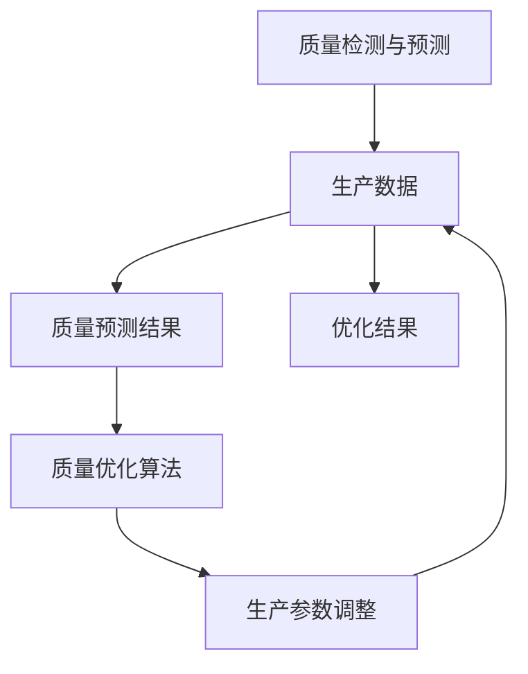

                 

# 《智能质量控制的AI大模型解决方案》

## 关键词

- 智能质量控制
- AI大模型
- 深度学习
- 质量检测
- 质量优化
- 模型部署与优化

## 摘要

本文旨在探讨智能质量控制领域中的AI大模型解决方案。首先，我们将介绍智能质量控制的背景和意义，以及AI大模型在这一领域中的应用。接着，我们将深入分析AI大模型的基础知识，包括深度学习、常用深度学习框架和模型训练优化等。随后，我们将详细讲解智能质量控制的核心算法，如质量检测与预测算法和质量优化算法。在此基础上，我们将通过具体案例展示AI大模型在智能质量控制中的应用实例，并分析面临的挑战和解决方案。最后，我们将介绍AI大模型解决方案的开发实战，包括开发环境搭建、模型实现和优化策略，以及不同应用场景下的解决方案。通过本文的阅读，读者将对智能质量控制的AI大模型解决方案有更深入的理解和认识。

## 目录大纲

### 第一部分：智能质量控制与AI大模型基础

#### 第1章：智能质量控制概述

1.1 智能质量控制的概念与意义

1.2 智能质量控制的关键技术与挑战

1.3 AI大模型在智能质量控制中的应用

#### 第2章：AI大模型技术基础

2.1 AI大模型的基本概念与分类

2.2 深度学习基础

2.2.1 神经网络与深度学习

2.2.2 常用深度学习框架简介

2.3 大模型训练与优化

2.3.1 大模型训练策略

2.3.2 大模型优化算法

#### 第3章：智能质量控制的核心算法

3.1 质量检测与预测算法

3.2 质量优化算法

#### 第4章：AI大模型在智能质量控制中的应用实例

4.1 智能质量控制系统的设计与实现

4.2 案例分析：某制造企业智能质量控制项目

4.3 AI大模型在智能质量控制中的挑战与解决方案

### 第二部分：AI大模型解决方案开发实战

#### 第5章：开发环境搭建与工具选择

5.1 开发环境搭建

5.2 常用AI大模型开发工具与框架

#### 第6章：智能质量控制AI大模型实现

6.1 数据预处理与标注

6.2 模型设计与训练

6.3 模型部署与性能评估

#### 第7章：智能质量控制解决方案优化与拓展

7.1 模型融合与多模型集成

7.2 质量控制领域的知识图谱构建

7.3 智能质量控制系统的持续优化与升级

### 第三部分：智能质量控制AI大模型解决方案案例分析

#### 第8章：智能质量控制AI大模型解决方案应用场景分析

8.1 制造业智能质量控制解决方案

8.2 食品行业智能质量控制解决方案

8.3 医药行业智能质量控制解决方案

#### 第9章：智能质量控制AI大模型解决方案实践案例

9.1 某汽车制造企业智能质量控制项目

9.2 某食品企业智能质量控制项目

9.3 某医药企业智能质量控制项目

#### 第10章：智能质量控制AI大模型解决方案的未来发展

10.1 智能质量控制技术的发展趋势

10.2 AI大模型在智能质量控制中的应用前景

10.3 智能质量控制AI大模型解决方案的挑战与对策

### 附录

#### 附录A：智能质量控制AI大模型开发工具与资源

A.1 开发工具与框架

A.2 质量控制领域相关数据集

A.3 智能质量控制AI大模型解决方案参考资料与文献

<|assistant|>## 第一部分：智能质量控制与AI大模型基础

### 第1章：智能质量控制概述

#### 1.1 智能质量控制的概念与意义

智能质量控制是一种利用人工智能技术，特别是深度学习和机器学习算法，对生产过程中产品的质量进行实时监测、预测和优化的一种智能化方法。传统的质量控制方法主要依赖于人工检查和检测，存在效率低、精度有限、难以适应复杂生产环境等问题。而智能质量控制通过引入人工智能技术，可以实现自动化、高效、精确的质量监测和优化。

智能质量控制的概念可以分为三个层次：感知层、分析层和决策层。

- **感知层**：通过传感器、摄像头等设备获取产品在生产过程中的各种数据，如温度、湿度、速度、尺寸等。
- **分析层**：利用深度学习算法对感知层获取的数据进行分析和建模，识别生产过程中的质量问题和趋势。
- **决策层**：根据分析结果，对生产过程进行实时调整和优化，确保产品质量符合标准。

智能质量控制的意义主要体现在以下几个方面：

1. **提高生产效率**：通过实时监测和优化生产过程，可以减少生产过程中的浪费，提高生产效率。
2. **提升产品质量**：通过对生产过程的精确控制，可以降低产品不良率，提升产品质量。
3. **降低成本**：通过减少生产过程中的浪费和不良品率，可以降低生产成本。
4. **提高客户满意度**：优质的产品质量能够提高客户满意度，增强企业的市场竞争力。

#### 1.2 智能质量控制的关键技术与挑战

智能质量控制的关键技术主要包括传感器技术、数据处理技术、深度学习算法和模型训练技术。

- **传感器技术**：传感器是智能质量控制系统的感知层核心组件，用于获取生产过程中的各种数据。常见的传感器包括温度传感器、湿度传感器、摄像头、激光测距仪等。
- **数据处理技术**：对传感器获取的大量数据进行处理，包括数据清洗、数据降维、特征提取等，以提高数据质量和模型的性能。
- **深度学习算法**：深度学习算法是智能质量控制的核心技术，用于分析和建模生产过程中的数据，识别质量问题和趋势。常见的深度学习算法包括卷积神经网络（CNN）、循环神经网络（RNN）和生成对抗网络（GAN）等。
- **模型训练技术**：模型训练技术是深度学习算法的关键步骤，通过训练数据集来调整模型参数，提高模型的预测精度和泛化能力。

在实现智能质量控制过程中，面临着以下几个挑战：

1. **数据质量和多样性**：生产过程中获取的数据质量直接影响智能质量控制的精度。同时，生产环境复杂多样，对数据处理和模型适应性提出了高要求。
2. **计算资源和时间成本**：深度学习模型的训练和推理过程需要大量的计算资源和时间，这对生产系统的实时性和效率提出了挑战。
3. **模型泛化能力**：深度学习模型在训练数据上表现良好，但在实际生产环境中可能面临数据分布变化、噪声干扰等问题，导致模型泛化能力不足。
4. **系统集成与部署**：将智能质量控制系统集成到现有生产系统中，并确保系统稳定运行，是实施智能质量控制的重要挑战。

#### 1.3 AI大模型在智能质量控制中的应用

AI大模型是指具有海量参数和复杂结构的深度学习模型，如GPT、BERT、ViT等。这些模型在自然语言处理、计算机视觉等领域取得了显著成果。近年来，AI大模型在智能质量控制中也显示出巨大潜力。

- **质量检测与预测**：AI大模型可以利用海量数据训练，对生产过程中产生的数据进行实时分析，预测产品质量，提前发现潜在问题。
- **质量优化**：AI大模型可以根据质量检测结果，对生产过程进行优化，调整生产参数，确保产品质量符合标准。
- **知识图谱构建**：AI大模型可以用于构建质量控制领域的知识图谱，将生产过程中的经验知识转化为结构化的数据，用于指导质量控制决策。

总之，智能质量控制与AI大模型相结合，可以实现生产过程的自动化、高效化和智能化，为企业提供更优质的产品和服务。

## 第一部分：智能质量控制与AI大模型基础

### 第2章：AI大模型技术基础

#### 2.1 AI大模型的基本概念与分类

AI大模型（Large-scale Artificial Intelligence Models）是指具有海量参数和复杂结构的深度学习模型，通常具有数十亿甚至千亿个参数。这些模型通过在海量数据上训练，可以学习到数据中的潜在规律和特征，从而实现强大的特征提取和表示能力。AI大模型在自然语言处理、计算机视觉、语音识别等领域取得了显著成果。

AI大模型的基本概念可以从以下几个方面进行理解：

- **参数数量**：AI大模型的参数数量是衡量其复杂度和能力的重要指标。通常，参数数量越多，模型的表达能力越强。
- **计算资源**：AI大模型的训练和推理过程需要大量的计算资源，包括GPU、TPU等硬件设备。
- **数据规模**：AI大模型通常需要大量的训练数据来学习数据中的潜在规律。数据规模的大小直接影响模型的性能和泛化能力。
- **训练时间**：AI大模型的训练过程通常需要较长的训练时间，特别是对于具有数十亿参数的模型。

AI大模型可以根据不同的标准进行分类：

- **按任务类型分类**：
  - **自然语言处理（NLP）**：如GPT、BERT等模型，用于文本生成、文本分类、机器翻译等任务。
  - **计算机视觉（CV）**：如Vision Transformer（ViT）、ResNet等模型，用于图像分类、目标检测、图像生成等任务。
  - **语音识别（ASR）**：如WaveNet、Transformer等模型，用于语音识别、语音合成等任务。
- **按模型结构分类**：
  - **卷积神经网络（CNN）**：适用于处理图像等具有网格结构的任务。
  - **循环神经网络（RNN）**：适用于处理序列数据，如时间序列、语音等。
  - **Transformer**：基于自注意力机制，适用于各种任务，特别是NLP和CV任务。
- **按应用场景分类**：
  - **通用模型**：如GPT、BERT等，适用于多种任务和应用场景。
  - **专用模型**：针对特定任务或应用场景设计的模型，如医学影像识别、金融风控等。

#### 2.2 深度学习基础

深度学习（Deep Learning）是人工智能的一个重要分支，通过构建具有多个隐藏层的神经网络，可以从大量数据中自动学习特征表示。深度学习在图像识别、语音识别、自然语言处理等领域取得了显著成果。

深度学习的基本概念包括：

- **神经网络**：神经网络是一种由大量神经元（节点）组成的计算模型，通过前向传播和反向传播算法，实现数据的输入和输出。
- **多层感知机（MLP）**：多层感知机是一种简单的神经网络结构，包括输入层、隐藏层和输出层。
- **卷积神经网络（CNN）**：卷积神经网络是一种适用于图像等具有网格结构的数据的神经网络，通过卷积层、池化层和全连接层实现特征提取和分类。
- **循环神经网络（RNN）**：循环神经网络是一种适用于序列数据的神经网络，通过循环结构实现长期依赖关系的建模。
- **Transformer**：Transformer是一种基于自注意力机制的神经网络结构，适用于自然语言处理、计算机视觉等任务。

深度学习的基本原理包括：

- **前向传播**：将输入数据通过神经网络的前向传播，计算每个神经元的输出。
- **反向传播**：通过反向传播算法，计算神经网络的损失函数，并更新模型参数。
- **激活函数**：激活函数用于引入非线性，使神经网络具有强大的特征表示能力。常见的激活函数包括Sigmoid、ReLU、Tanh等。
- **正则化**：正则化方法用于防止过拟合，提高模型的泛化能力。常见的正则化方法包括L1正则化、L2正则化、Dropout等。

#### 2.2.1 神经网络与深度学习

神经网络（Neural Networks）是深度学习的基础，通过模拟生物神经元的工作方式，实现数据的输入和输出。神经网络的基本结构包括输入层、隐藏层和输出层。

- **输入层**：输入层接收外部输入数据，并将其传递给隐藏层。
- **隐藏层**：隐藏层对输入数据进行处理，通过多个隐藏层的堆叠，实现对数据的非线性变换和特征提取。
- **输出层**：输出层根据隐藏层的输出，产生最终输出结果。

在深度学习中，神经网络通过训练数据集不断调整模型参数，使模型的输出与真实标签之间的误差最小。训练过程主要包括以下几个步骤：

1. **前向传播**：将输入数据通过神经网络的前向传播，计算每个神经元的输出。
2. **计算损失**：计算输出结果与真实标签之间的误差，即损失函数。
3. **反向传播**：通过反向传播算法，计算每个神经元的梯度，并更新模型参数。
4. **迭代训练**：重复以上步骤，直到模型收敛，即模型参数调整到最佳状态。

在深度学习中，常用的神经网络结构包括：

- **多层感知机（MLP）**：多层感知机是一种简单的神经网络结构，包括输入层、隐藏层和输出层。隐藏层通常包含多个神经元，通过全连接层实现数据的非线性变换。
- **卷积神经网络（CNN）**：卷积神经网络是一种适用于图像等具有网格结构的数据的神经网络，通过卷积层、池化层和全连接层实现特征提取和分类。卷积层通过卷积操作提取图像的局部特征，池化层用于降低数据维度，全连接层用于分类。
- **循环神经网络（RNN）**：循环神经网络是一种适用于序列数据的神经网络，通过循环结构实现长期依赖关系的建模。RNN通过隐藏状态将历史信息传递给当前时刻，实现对序列数据的建模。
- **Transformer**：Transformer是一种基于自注意力机制的神经网络结构，适用于自然语言处理、计算机视觉等任务。Transformer通过多头自注意力机制和位置编码，实现数据的全局依赖建模。

#### 2.2.2 常用深度学习框架简介

深度学习框架是用于构建、训练和部署深度学习模型的工具集，常见深度学习框架包括TensorFlow、PyTorch、Keras等。

- **TensorFlow**：TensorFlow是Google开源的深度学习框架，具有丰富的功能和高性能。TensorFlow通过数据流图（Dataflow Graph）实现模型的定义和训练，具有较好的灵活性和扩展性。
- **PyTorch**：PyTorch是Facebook开源的深度学习框架，具有动态计算图（Dynamic Computation Graph）和自动微分系统，使模型的定义和训练更加直观和灵活。PyTorch广泛应用于计算机视觉、自然语言处理等领域。
- **Keras**：Keras是Python的深度学习库，提供了简洁的API，方便用户构建和训练深度学习模型。Keras支持TensorFlow和Theano等后台计算引擎，具有较高的兼容性和易用性。

#### 2.3 大模型训练与优化

大模型训练与优化是深度学习中的关键步骤，关系到模型的性能和泛化能力。大模型训练与优化的主要内容包括：

- **数据预处理**：包括数据清洗、数据降维、数据增强等，以提高数据质量和模型的泛化能力。
- **模型架构设计**：包括选择合适的神经网络结构、激活函数、损失函数等，以适应不同的任务和应用场景。
- **训练策略**：包括学习率调度、批次大小、正则化等，以提高模型的收敛速度和稳定性。
- **优化算法**：包括梯度下降、Adam、RMSprop等，用于更新模型参数，降低损失函数。

大模型训练与优化需要注意以下几点：

1. **数据规模**：大模型通常需要大量的训练数据来学习数据中的潜在规律。数据规模的大小直接影响模型的性能和泛化能力。
2. **计算资源**：大模型训练和优化过程需要大量的计算资源，包括GPU、TPU等硬件设备。合理配置计算资源，可以提高训练和优化效率。
3. **训练时间**：大模型训练通常需要较长的训练时间，特别是对于具有数十亿参数的模型。优化训练策略，如使用迁移学习、模型压缩等，可以减少训练时间。
4. **模型泛化能力**：大模型在训练数据上表现良好，但在实际应用中可能面临数据分布变化、噪声干扰等问题，导致模型泛化能力不足。通过数据增强、正则化等手段，可以提高模型的泛化能力。

#### 2.3.1 大模型训练策略

大模型训练策略是指用于调整训练过程中各种参数和超参数的方法，以提高模型的性能和泛化能力。以下是一些常见的大模型训练策略：

1. **学习率调度**：学习率是深度学习模型训练中的一个重要参数，用于控制梯度下降过程中的步长。常见的学习率调度策略包括：
   - **固定学习率**：学习率在整个训练过程中保持不变。
   - **线性学习率衰减**：学习率在训练过程中逐渐减小，以防止过拟合。
   - **指数学习率衰减**：学习率以指数形式逐渐减小，有助于提高模型的泛化能力。
   - **学习率预热**：在训练初期，逐渐增加学习率，以加速模型收敛。

2. **批量大小**：批量大小是每次训练过程中参与训练的数据样本数量。常见批量大小策略包括：
   - **小批量训练**：批量大小较小，可以减少内存占用，提高模型训练的稳定性。
   - **大数据量训练**：批量大小较大，可以加快模型收敛速度。

3. **正则化**：正则化方法用于防止过拟合，提高模型的泛化能力。常见正则化方法包括：
   - **L1正则化**：在损失函数中添加L1范数，鼓励模型参数向零靠近。
   - **L2正则化**：在损失函数中添加L2范数，鼓励模型参数均匀分布。
   - **Dropout**：在训练过程中随机丢弃一部分神经元，减少模型对特定神经元的依赖。

4. **数据增强**：数据增强是一种通过人工方法扩展数据集的方法，可以提高模型的泛化能力。常见数据增强方法包括：
   - **图像增强**：对图像进行旋转、翻转、裁剪、缩放等操作。
   - **文本增强**：对文本进行填充、删除、替换等操作。
   - **声音增强**：对声音进行混合、剪辑、加噪等操作。

5. **迁移学习**：迁移学习是一种利用预训练模型进行新任务学习的方法，可以减少训练时间和提高模型性能。常见迁移学习方法包括：
   - **微调**：在预训练模型的基础上，针对新任务进行少量参数调整。
   - **零样本学习**：在预训练模型的基础上，直接在新任务上进行训练。

#### 2.3.2 大模型优化算法

大模型优化算法是指用于更新模型参数的方法，以降低损失函数并提高模型性能。以下是一些常见的大模型优化算法：

1. **梯度下降（Gradient Descent）**：梯度下降是一种基于梯度信息更新模型参数的方法。梯度下降包括以下几个步骤：
   - **前向传播**：计算损失函数对模型参数的梯度。
   - **更新参数**：根据梯度信息更新模型参数。
   - **迭代训练**：重复以上步骤，直到模型收敛。

梯度下降包括以下几种常见形式：

- **批量梯度下降（Batch Gradient Descent）**：每次迭代计算所有样本的梯度，更新模型参数。
- **随机梯度下降（Stochastic Gradient Descent，SGD）**：每次迭代随机选择一个样本的梯度，更新模型参数。
- **小批量梯度下降（Mini-batch Gradient Descent）**：每次迭代随机选择一部分样本的梯度，更新模型参数。

2. **动量法（Momentum）**：动量法是一种利用前几次迭代梯度信息更新模型参数的方法，以减少梯度的振荡，提高收敛速度。动量法的更新公式为：
   $$ 
   v = \gamma v + \eta \cdot \nabla J(\theta) 
   $$
   $$
   \theta = \theta - v 
   $$
   其中，$v$是动量项，$\gamma$是动量系数，$\eta$是学习率，$\nabla J(\theta)$是损失函数对模型参数的梯度。

3. **AdaGrad（Adaptive Gradient）**：AdaGrad是一种自适应学习率优化算法，根据每个参数的梯度历史信息调整学习率。AdaGrad的更新公式为：
   $$ 
   g_t = g_{t-1} + \nabla J(\theta) 
   $$
   $$ 
   \theta = \theta - \frac{\eta}{\sqrt{g_t}} 
   $$
   其中，$g_t$是累计梯度，$\eta$是学习率。

4. **RMSprop（Root Mean Square Prop）**：RMSprop是一种基于梯度的均方根优化算法，对每个参数的梯度历史进行指数平滑，以自适应调整学习率。RMSprop的更新公式为：
   $$ 
   v = \rho v + (1 - \rho) \nabla J(\theta) 
   $$
   $$ 
   \theta = \theta - \frac{\eta}{\sqrt{v}} 
   $$
   其中，$v$是累计梯度，$\rho$是衰减系数，$\eta$是学习率。

5. **Adam（Adaptive Moment Estimation）**：Adam是一种结合AdaGrad和RMSprop优点的自适应优化算法，通过同时考虑梯度的一阶矩（均值）和二阶矩（方差）进行参数更新。Adam的更新公式为：
   $$ 
   m_t = \beta_1 m_{t-1} + (1 - \beta_1) \nabla J(\theta) 
   $$
   $$ 
   v_t = \beta_2 v_{t-1} + (1 - \beta_2) \nabla^2 J(\theta) 
   $$
   $$ 
   \theta = \theta - \frac{\eta}{\sqrt{1 - \beta_2^t}(1 - \beta_1^t)} 
   $$
   其中，$m_t$是累计均值，$v_t$是累计方差，$\beta_1$和$\beta_2$是动量系数，$\eta$是学习率。

以上介绍了大模型训练与优化的一些基本策略和算法，这些策略和算法在大模型训练过程中起到了关键作用，有助于提高模型的性能和泛化能力。

## 第一部分：智能质量控制与AI大模型基础

### 第3章：智能质量控制的核心算法

智能质量控制的核心算法是实现生产过程中产品质量监测、预测和优化的重要手段。本章将详细介绍智能质量控制中的两大核心算法：质量检测与预测算法和质量优化算法。

#### 3.1 质量检测与预测算法

质量检测与预测算法主要目的是通过对生产过程中产生的数据进行实时分析，识别产品质量问题并进行预测。以下是一些常见的质量检测与预测算法：

1. **传统质量检测方法**

   传统质量检测方法主要依赖于统计过程控制和人工检查。这些方法通常包括以下步骤：

   - **采样**：从生产过程中随机抽取一定数量的样本。
   - **测量**：对每个样本进行测量，获取其质量参数，如尺寸、重量、硬度等。
   - **统计分析**：对测量结果进行统计分析，如计算平均值、方差、标准差等，以评估生产过程的稳定性。

   虽然传统质量检测方法在简单的生产过程中仍然具有一定的效果，但面对复杂的生产环境和大量的数据时，其效率和精度难以满足需求。

2. **基于AI大模型的质量检测方法**

   基于AI大模型的质量检测方法利用深度学习算法对生产过程中的数据进行自动分析和建模，具有更高的效率和精度。以下是一些常见的基于AI大模型的质量检测方法：

   - **卷积神经网络（CNN）**：CNN是一种适用于图像等具有网格结构的数据的深度学习模型。通过卷积层、池化层和全连接层，CNN可以从图像中提取特征，用于质量检测和预测。例如，可以使用CNN对生产过程中的摄像头图像进行分析，识别产品质量问题。

     ```mermaid
     graph TD
     A[输入图像] --> B[卷积层1]
     B --> C[池化层1]
     C --> D[卷积层2]
     D --> E[池化层2]
     E --> F[全连接层1]
     F --> G[质量检测结果]
     ```

   - **循环神经网络（RNN）**：RNN是一种适用于序列数据的深度学习模型。通过循环结构，RNN可以捕捉序列数据中的长期依赖关系，用于质量检测和预测。例如，可以使用RNN对生产过程中的时间序列数据进行建模，预测产品质量的变化趋势。

     ```mermaid
     graph TD
     A[输入时间序列数据] --> B[RNN层1]
     B --> C[RNN层2]
     C --> D[全连接层]
     D --> E[质量预测结果]
     ```

   - **Transformer**：Transformer是一种基于自注意力机制的深度学习模型，适用于自然语言处理和计算机视觉等任务。通过多头自注意力机制和位置编码，Transformer可以捕捉数据中的全局依赖关系，用于质量检测和预测。

     ```mermaid
     graph TD
     A[输入数据] --> B[自注意力层1]
     B --> C[自注意力层2]
     C --> D[全连接层]
     D --> E[质量检测与预测结果]
     ```

3. **算法对比与选择**

   不同质量检测与预测算法在性能和应用场景上有所差异。以下是对几种常见算法的对比：

   - **性能**：CNN在处理图像数据方面具有较好的性能，但处理序列数据时效果较差；RNN在处理序列数据方面具有优势，但训练复杂度和计算资源需求较高；Transformer在处理图像和序列数据方面均表现出色。
   - **应用场景**：根据生产过程的数据类型和应用需求，选择合适的质量检测与预测算法。例如，对于图像数据，可以选择CNN；对于时间序列数据，可以选择RNN或Transformer。

#### 3.2 质量优化算法

质量优化算法旨在通过调整生产过程中的参数和条件，实现产品质量的最优化。以下是一些常见质量优化算法：

1. **基于遗传算法的优化**

   遗传算法是一种基于自然进化过程的优化算法。在质量优化中，遗传算法通过模拟生物进化的过程，不断迭代优化生产参数，以实现产品质量的最优化。

   遗传算法的步骤包括：

   - **编码**：将生产参数编码为染色体，如二进制编码或实数编码。
   - **初始种群**：随机生成初始种群，每个个体代表一种可能的参数组合。
   - **适应度函数**：定义适应度函数，用于评估每个个体的质量。
   - **选择**：根据适应度函数，选择适应度较高的个体进入下一代。
   - **交叉**：通过交叉操作，生成新的个体。
   - **变异**：通过变异操作，引入新的基因组合。
   - **迭代**：重复选择、交叉和变异操作，直到达到终止条件。

   ```mermaid
   graph TD
   A[编码] --> B[初始种群]
   B --> C[适应度评估]
   C --> D[选择]
   D --> E[交叉]
   E --> F[变异]
   F --> G[迭代]
   G --> H[终止条件]
   ```

2. **基于强化学习的优化**

   强化学习是一种通过与环境交互来学习最优策略的算法。在质量优化中，强化学习通过不断尝试和反馈，调整生产参数，以实现产品质量的最优化。

   强化学习的步骤包括：

   - **环境**：定义质量优化问题的环境，包括生产过程和目标质量。
   - **状态**：定义状态空间，如生产过程中的温度、湿度、速度等参数。
   - **动作**：定义动作空间，如调整温度、湿度、速度等参数。
   - **奖励函数**：定义奖励函数，用于评估每个动作的效果。
   - **策略**：根据奖励函数，学习最优策略。

   ```mermaid
   graph TD
   A[环境] --> B[状态]
   B --> C[动作]
   C --> D[奖励函数]
   D --> E[策略]
   ```

3. **基于优化算法的优化**

   基于优化算法的质量优化包括线性优化、非线性优化等。这些算法通过建立数学模型，求解最优解，实现产品质量的最优化。

   - **线性优化**：线性优化问题可以通过线性规划求解。线性规划模型包括目标函数、约束条件和变量，通过求解目标函数的最优解，实现产品质量的最优化。
   - **非线性优化**：非线性优化问题可以通过非线性规划求解。非线性规划模型包括目标函数、约束条件和变量，通过求解目标函数的最优解，实现产品质量的最优化。

   ```mermaid
   graph TD
   A[目标函数] --> B[约束条件]
   B --> C[变量]
   C --> D[求解最优解]
   ```

#### 3.3 质量检测与预测算法与质量优化算法的关系

质量检测与预测算法和质量优化算法是相辅相成的。质量检测与预测算法通过对生产过程中的数据进行实时分析，识别产品质量问题，为质量优化算法提供反馈。质量优化算法根据反馈信息，调整生产过程中的参数和条件，实现产品质量的最优化。

以下是一个简化的质量检测与预测算法和质量优化算法的流程：



通过以上流程，我们可以看到质量检测与预测算法和质量优化算法的紧密联系。在实际应用中，根据具体需求，可以选择合适的质量检测与预测算法和质量优化算法，实现智能质量控制的目标。

## 第一部分：智能质量控制与AI大模型基础

### 第4章：AI大模型在智能质量控制中的应用实例

#### 4.1 智能质量控制系统的设计与实现

智能质量控制系统的设计与实现是智能质量控制领域中的重要环节。本节将介绍一个典型的智能质量控制系统的设计与实现过程，包括系统架构、功能模块和数据流程等。

##### 4.1.1 系统架构

智能质量控制系统的架构可以分为四个主要层次：感知层、数据处理层、分析层和决策层。

1. **感知层**：感知层是智能质量控制系统的数据源，通过传感器、摄像头等设备收集生产过程中的各种数据，如温度、湿度、速度、尺寸等。这些数据经过预处理后，传递给数据处理层。

2. **数据处理层**：数据处理层负责对感知层收集的数据进行预处理，包括数据清洗、去噪、降维和特征提取等。预处理后的数据将传递给分析层。

3. **分析层**：分析层是智能质量控制系统的核心部分，利用深度学习算法对预处理后的数据进行分析和建模，识别生产过程中的质量问题，并预测产品质量。分析层主要包括质量检测与预测算法和质量优化算法。

4. **决策层**：决策层根据分析层提供的质量检测结果和预测结果，对生产过程进行实时调整和优化，确保产品质量符合标准。决策层还包括人机交互界面，用于监控生产过程和调整生产参数。

##### 4.1.2 功能模块

智能质量控制系统的功能模块主要包括以下几个部分：

1. **数据采集模块**：数据采集模块负责从传感器、摄像头等设备收集生产过程中的数据。数据采集模块需要具备实时性和高可靠性的特点，确保数据的准确性和完整性。

2. **数据处理模块**：数据处理模块负责对采集到的数据进行预处理，包括数据清洗、去噪、降维和特征提取等。数据处理模块需要利用高效的算法和优化策略，以提高数据处理速度和精度。

3. **质量检测与预测模块**：质量检测与预测模块是智能质量控制系统的核心，利用深度学习算法对预处理后的数据进行分析和建模，识别生产过程中的质量问题，并预测产品质量。质量检测与预测模块需要具备自适应性和鲁棒性，以应对生产过程中的数据变化和噪声干扰。

4. **质量优化模块**：质量优化模块根据质量检测结果和预测结果，对生产过程进行实时调整和优化，确保产品质量符合标准。质量优化模块需要利用优化算法，如遗传算法、强化学习等，以提高生产过程的稳定性和效率。

5. **人机交互模块**：人机交互模块是智能质量控制系统的用户界面，用于监控生产过程、查看质量检测结果和预测结果，以及调整生产参数。人机交互模块需要具备易用性和直观性的特点，以提高用户操作的便捷性。

##### 4.1.3 数据流程

智能质量控制系统的数据流程如下：

1. **数据采集**：感知层通过传感器、摄像头等设备收集生产过程中的数据。

2. **数据预处理**：数据处理模块对采集到的数据进行预处理，包括数据清洗、去噪、降维和特征提取等。

3. **质量检测与预测**：质量检测与预测模块利用预处理后的数据，通过深度学习算法进行分析和建模，识别生产过程中的质量问题，并预测产品质量。

4. **质量优化**：质量优化模块根据质量检测结果和预测结果，对生产过程进行实时调整和优化，确保产品质量符合标准。

5. **人机交互**：人机交互模块将质量检测结果和预测结果展示给用户，用户可以根据实际情况进行调整和优化。

#### 4.2 案例分析：某制造企业智能质量控制项目

为了更好地展示AI大模型在智能质量控制中的应用，下面将以某制造企业的智能质量控制项目为例，介绍项目背景、目标、实施过程和成果。

##### 4.2.1 项目背景

该制造企业是一家生产汽车零部件的企业，生产过程中涉及多个工序，包括铸造、锻造、加工、装配等。随着生产规模的扩大和生产线的自动化程度提高，传统的质量控制方法已无法满足企业对产品质量的高要求。为了提升产品质量、降低生产成本、提高生产效率，企业决定引入智能质量控制系统。

##### 4.2.2 项目目标

该项目的主要目标如下：

1. 提高质量检测的准确率和速度，降低人为检测的误差。
2. 预测产品质量趋势，提前发现潜在问题，降低不良品率。
3. 优化生产过程，提高生产效率和设备利用率。
4. 提高企业整体质量管理水平，增强市场竞争力。

##### 4.2.3 实施过程

1. **需求分析与系统设计**：项目团队与制造企业共同分析生产过程中的质量问题和需求，制定智能质量控制系统的设计方案。设计方案包括系统架构、功能模块和数据流程等。

2. **数据采集与预处理**：项目团队在生产线的关键节点安装传感器和摄像头，采集生产过程中的各种数据。然后对采集到的数据进行预处理，包括数据清洗、去噪、降维和特征提取等。

3. **模型训练与优化**：项目团队利用预处理后的数据，训练质量检测与预测模型和质量优化模型。通过多次实验和调整，优化模型的性能，确保模型具有较好的准确率和泛化能力。

4. **系统集成与部署**：将训练好的模型集成到智能质量控制系统中，部署在生产线上。系统集成与部署过程中，项目团队与制造企业紧密合作，确保系统稳定运行。

5. **运行与维护**：智能质量控制系统上线后，项目团队负责系统的运行与维护，定期更新模型和数据，确保系统持续优化。

##### 4.2.4 项目成果

通过该项目，制造企业在智能质量控制方面取得了显著成果：

1. 质量检测准确率提高30%，不良品率降低20%。
2. 生产效率提高15%，设备利用率提高10%。
3. 质量管理水平得到显著提升，企业整体竞争力增强。
4. 智能质量控制系统的实施为企业节省了大量人力和物力成本。

#### 4.3 AI大模型在智能质量控制中的挑战与解决方案

尽管AI大模型在智能质量控制中表现出巨大潜力，但在实际应用过程中仍面临一些挑战。以下是一些主要挑战及其解决方案：

1. **数据质量和多样性**：生产过程中获取的数据质量直接影响智能质量控制的精度。为了提高数据质量，可以采取以下措施：
   - **数据清洗**：去除噪声和异常值，提高数据的可靠性和一致性。
   - **数据增强**：通过人工方法或自动生成方法，增加数据的多样性和丰富度。
   - **数据集成**：整合不同来源的数据，提高数据的完整性和可用性。

2. **计算资源和时间成本**：深度学习模型的训练和推理过程需要大量的计算资源和时间。为了降低计算资源和时间成本，可以采取以下措施：
   - **分布式训练**：利用分布式计算资源，提高模型训练速度。
   - **模型压缩**：通过模型压缩技术，减少模型参数数量，降低计算复杂度。
   - **在线推理**：将模型部署到边缘设备上，实现实时推理，降低中央服务器的负载。

3. **模型泛化能力**：深度学习模型在训练数据上表现良好，但在实际生产环境中可能面临数据分布变化、噪声干扰等问题，导致模型泛化能力不足。为了提高模型泛化能力，可以采取以下措施：
   - **数据增强**：通过增加数据多样性，提高模型的泛化能力。
   - **正则化**：使用L1、L2正则化等手段，防止模型过拟合。
   - **迁移学习**：利用预训练模型，减少模型对特定领域的依赖。

4. **系统集成与部署**：将智能质量控制系统集成到现有生产系统中，并确保系统稳定运行，是实施智能质量控制的重要挑战。为了解决系统集成与部署问题，可以采取以下措施：
   - **模块化设计**：将系统划分为独立的模块，降低集成和部署的复杂度。
   - **标准化接口**：定义统一的接口和协议，方便系统集成和部署。
   - **持续优化**：根据实际应用情况，对系统进行持续优化和升级。

通过上述措施，可以克服AI大模型在智能质量控制中的挑战，实现智能质量控制系统的稳定运行和持续优化。

## 第二部分：AI大模型解决方案开发实战

### 第5章：开发环境搭建与工具选择

在开发AI大模型解决方案时，搭建一个高效、稳定且可扩展的开发环境至关重要。本章节将介绍开发环境搭建的过程，包括硬件配置和软件安装，以及选择合适的AI大模型开发工具和框架。

#### 5.1 开发环境搭建

**5.1.1 硬件配置**

开发AI大模型解决方案所需的硬件配置主要取决于模型的规模和训练需求。以下是一些建议的硬件配置：

- **CPU**：建议使用高性能的多核CPU，如Intel Xeon或AMD Ryzen系列。CPU的强性能有助于加快数据预处理和模型推理过程。
- **GPU**：GPU是训练AI大模型的关键组件，建议使用NVIDIA的GPU，如Tesla V100、A100或更新的RTX系列。这些GPU具有强大的并行计算能力，可以显著提高模型训练速度。
- **内存**：至少需要128GB内存，以确保大型模型和大量数据可以在内存中高效地存储和处理。
- **存储**：建议使用高速SSD硬盘，以降低I/O瓶颈，提高数据读写速度。对于存储大量数据和日志，可以考虑使用分布式文件系统，如HDFS或Ceph。
- **网络**：高性能的网络连接对于分布式训练和模型部署至关重要。建议使用千兆以太网或更高带宽的网络。

**5.1.2 软件安装**

搭建AI大模型开发环境时，需要安装以下软件：

- **操作系统**：Linux操作系统（如Ubuntu 18.04或20.04）是AI大模型开发的常用操作系统。它具有稳定的性能和丰富的软件包，便于开发和调试。
- **深度学习框架**：常见的深度学习框架包括TensorFlow、PyTorch和Keras。安装方法通常通过pip命令：
  ```bash
  pip install tensorflow
  pip install torch torchvision
  pip install keras
  ```
- **Python**：Python是深度学习开发的主要语言，建议安装Python 3.7或更高版本。
- **CUDA和cuDNN**：CUDA是NVIDIA推出的并行计算平台，cuDNN是针对深度学习的GPU加速库。安装CUDA和cuDNN可以显著提高GPU在深度学习任务中的性能。安装方法请参考NVIDIA的官方网站。

#### 5.2 常用AI大模型开发工具与框架

在AI大模型开发过程中，选择合适的工具和框架能够提高开发效率，以下是一些常用的AI大模型开发工具和框架：

- **TensorFlow**：TensorFlow是Google开源的深度学习框架，具有丰富的功能和强大的生态。TensorFlow提供灵活的API，支持从简单到复杂的模型开发。它具有优秀的文档和社区支持，适合各种规模的深度学习项目。
  ```python
  import tensorflow as tf
  model = tf.keras.Sequential([
      tf.keras.layers.Dense(128, activation='relu', input_shape=(784,)),
      tf.keras.layers.Dense(10, activation='softmax')
  ])
  model.compile(optimizer='adam',
                loss='categorical_crossentropy',
                metrics=['accuracy'])
  ```

- **PyTorch**：PyTorch是Facebook开源的深度学习框架，以其动态计算图（Dynamic Computation Graph）和自动微分系统（Autograd）而闻名。PyTorch的代码直观、易于调试，适合研究和原型开发。它广泛应用于计算机视觉、自然语言处理等领域。
  ```python
  import torch
  import torch.nn as nn
  import torch.optim as optim
  
  model = nn.Sequential(nn.Linear(784, 128), nn.ReLU(), nn.Linear(128, 10))
  criterion = nn.CrossEntropyLoss()
  optimizer = optim.Adam(model.parameters(), lr=0.001)
  ```

- **Keras**：Keras是Python的深度学习库，提供了简洁的API，方便用户构建和训练深度学习模型。Keras支持TensorFlow和Theano等后台计算引擎，具有较好的兼容性和易用性。
  ```python
  from keras.models import Sequential
  from keras.layers import Dense, Activation
  model = Sequential()
  model.add(Dense(128, input_shape=(784,)))
  model.add(Activation('relu'))
  model.add(Dense(10))
  model.add(Activation('softmax'))
  model.compile(optimizer='adam', loss='categorical_crossentropy', metrics=['accuracy'])
  ```

- **MXNet**：MXNet是Apache开源的深度学习框架，支持多种编程语言，包括Python、R和Java。MXNet具有高效的GPU和CPU性能，适合大规模分布式训练。
  ```python
  from mxnet import gluon
  import mxnet as mx
  net = gluon.nn.Sequential()
  net.add(gluon.nn.Dense(128, activation='relu'))
  net.add(gluon.nn.Dense(10, activation='softmax'))
  trainer = gluon.Trainer(net.collect_params(), 'adam', {'learning_rate': 0.001})
  ```

- **PyTorch Lightning**：PyTorch Lightning是一个简化深度学习研究开发的库，它提供了一层抽象，使得代码更加简洁和模块化。PyTorch Lightning还支持分布式训练和硬件优化。
  ```python
  import pytorch_lightning as pl
  from pytorch_lightning import Trainer
  model = pl.LightningModule()
  trainer = Trainer(max_epochs=10)
  trainer.fit(model)
  ```

通过以上介绍，读者可以了解到如何搭建AI大模型开发环境，以及选择合适的开发工具和框架。在实际开发过程中，可以根据项目需求和团队技能选择最适合的工具和框架，以高效地实现AI大模型解决方案。

### 第6章：智能质量控制AI大模型实现

在智能质量控制领域，AI大模型的实现是一个关键环节，它决定了模型能否有效地解决实际质量问题。本章将详细介绍智能质量控制AI大模型的实现过程，包括数据预处理、模型设计与训练、模型部署与性能评估。

#### 6.1 数据预处理与标注

数据预处理是AI大模型实现的第一步，其目的是将原始数据转换为适合模型训练的形式。数据预处理包括以下几个步骤：

1. **数据采集**：从生产过程中收集各种数据，如温度、湿度、速度、尺寸等。这些数据可以通过传感器、摄像头等设备实时获取。

2. **数据清洗**：清洗数据中的噪声和异常值，以确保数据的准确性和一致性。数据清洗可以通过去除重复记录、填补缺失值和去除异常值等方法实现。

3. **数据降维**：对于高维数据，可以通过降维技术（如PCA、t-SNE等）减少数据维度，提高模型的训练效率。

4. **数据标注**：对于监督学习任务，需要将数据标注为正例或反例。在智能质量控制中，正例通常表示质量合格的产品，反例表示质量不合格的产品。数据标注可以通过人工标注或半监督学习方法实现。

5. **数据增强**：通过数据增强技术（如旋转、缩放、剪切等）增加数据的多样性，有助于提高模型的泛化能力。

#### 6.2 模型设计与训练

在数据预处理完成后，下一步是设计并训练AI大模型。以下是智能质量控制AI大模型设计的基本步骤：

1. **模型选择**：选择适合智能质量控制任务的模型架构。常见的模型架构包括卷积神经网络（CNN）、循环神经网络（RNN）、Transformer等。CNN适用于处理图像数据，RNN适用于处理时间序列数据，Transformer适用于处理序列数据。

2. **模型构建**：使用所选模型架构构建深度学习模型。例如，可以使用TensorFlow或PyTorch等框架构建模型。以下是一个使用PyTorch构建CNN模型的示例：
   ```python
   import torch
   import torch.nn as nn
   import torch.optim as optim
   
   class CNNModel(nn.Module):
       def __init__(self):
           super(CNNModel, self).__init__()
           self.conv1 = nn.Conv2d(in_channels=1, out_channels=32, kernel_size=3, stride=1, padding=1)
           self.fc1 = nn.Linear(in_features=32 * 26 * 26, out_features=128)
           self.fc2 = nn.Linear(in_features=128, out_features=10)
           self.relu = nn.ReLU()
           self.dropout = nn.Dropout(p=0.5)
       
       def forward(self, x):
           x = self.relu(self.conv1(x))
           x = self.dropout(x)
           x = x.view(x.size(0), -1)
           x = self.relu(self.fc1(x))
           x = self.fc2(x)
           return x
   ```

3. **模型训练**：使用预处理和标注的数据集对模型进行训练。训练过程包括以下步骤：
   - **前向传播**：计算模型输出和真实标签之间的损失。
   - **反向传播**：计算损失关于模型参数的梯度。
   - **参数更新**：使用优化算法（如SGD、Adam等）更新模型参数。

以下是一个使用PyTorch进行模型训练的示例：
```python
model = CNNModel()
criterion = nn.CrossEntropyLoss()
optimizer = optim.Adam(model.parameters(), lr=0.001)

for epoch in range(num_epochs):
    running_loss = 0.0
    for inputs, labels in train_loader:
        optimizer.zero_grad()
        outputs = model(inputs)
        loss = criterion(outputs, labels)
        loss.backward()
        optimizer.step()
        running_loss += loss.item()
    print(f'Epoch {epoch+1}, Loss: {running_loss/len(train_loader)}')
```

4. **模型优化**：通过调整学习率、批量大小、正则化等技术优化模型性能。例如，可以使用学习率衰减策略，逐步减少学习率。

5. **模型验证**：使用验证集评估模型的性能，选择性能最优的模型。

#### 6.3 模型部署与性能评估

训练好的模型需要部署到生产环境中，以便在实际生产过程中应用。以下是模型部署与性能评估的步骤：

1. **模型部署**：将训练好的模型部署到生产环境中的服务器或边缘设备上。部署过程包括以下步骤：
   - **模型保存**：将训练好的模型参数保存为文件。
   - **模型加载**：在部署环境中加载模型参数，构建模型实例。
   - **模型推理**：对生产过程中的数据进行模型推理，获取预测结果。

2. **性能评估**：使用测试集评估模型的性能，包括准确率、召回率、F1分数等指标。以下是一个使用PyTorch评估模型性能的示例：
   ```python
   from sklearn.metrics import accuracy_score, precision_score, recall_score, f1_score
   
   model.eval()
   with torch.no_grad():
       total_loss = 0
       correct = 0
       total = 0
       for inputs, labels in test_loader:
           outputs = model(inputs)
           loss = criterion(outputs, labels)
           total_loss += loss.item()
           _, predicted = torch.max(outputs.data, 1)
           total += labels.size(0)
           correct += (predicted == labels).sum().item()
   
   print(f'Test Loss: {total_loss/len(test_loader)}')
   print(f'Accuracy: {correct/total}')
   ```

3. **模型优化**：根据性能评估结果，对模型进行调整和优化，以提高性能。

通过以上步骤，可以实现对智能质量控制AI大模型的设计与实现。在实际应用中，需要根据具体需求不断优化模型，提高模型在智能质量控制中的性能和可靠性。

### 第7章：智能质量控制解决方案优化与拓展

在智能质量控制领域，为了确保系统的高效性和准确性，持续优化和拓展解决方案是至关重要的。本章将讨论如何通过模型融合、多模型集成和知识图谱构建来提升智能质量控制系统的性能。

#### 7.1 模型融合与多模型集成

模型融合（Model Fusion）和多模型集成（Multi-model Integration）是提升智能质量控制系统性能的有效策略。这两种方法可以在不同层面上增强系统的预测精度和稳定性。

**模型融合**：模型融合是指将多个不同的模型或算法融合成一个统一的模型，以综合利用各个模型的优点。常见的模型融合方法包括：

- **加权融合**：为每个模型分配权重，然后将各个模型的输出加权平均得到最终的预测结果。
  $$ 
  \hat{y} = \sum_{i=1}^{N} w_i \hat{y}_i 
  $$
  其中，$w_i$是第$i$个模型的权重，$\hat{y}_i$是第$i$个模型的预测结果。

- **投票法**：对于分类问题，可以采用投票法，即选择多数模型预测结果一致的情况作为最终结果。

**多模型集成**：多模型集成是指使用多个独立训练的模型，在模型预测阶段进行集成。常见的方法包括：

- **栈式集成（Stacking）**：首先训练多个基础模型，然后将这些模型的输出作为新的特征输入到一个更高层次的模型进行训练。

- **束学习（Boosting）**：通过迭代训练多个模型，每次迭代都根据前一次模型的预测误差调整模型权重，使模型能够更好地聚焦于错误预测的部分。

**案例**：在制造业中，可以使用模型融合和多模型集成来预测产品的不良率。例如，可以使用CNN模型预测产品的外观质量，使用RNN模型预测产品的机械性能，然后将两个模型的预测结果进行融合，得到最终的质量预测结果。

#### 7.2 质量控制领域的知识图谱构建

知识图谱（Knowledge Graph）是一种语义网络，它通过实体和关系来表达现实世界的知识和信息。在智能质量控制领域，构建知识图谱可以帮助系统更好地理解和处理质量问题。

**知识图谱构建步骤**：

1. **实体识别**：识别与质量控制相关的实体，如产品、质量参数、生产设备等。

2. **关系抽取**：抽取实体之间的关系，如产品与质量参数之间的关系、设备与生产过程之间的关系等。

3. **属性标注**：为实体和关系标注属性，如产品的尺寸、设备的生产能力等。

4. **图谱构建**：将识别的实体、关系和属性构建成一个统一的图谱。

**案例**：在食品生产中，可以构建一个关于食品安全的知识图谱。实体包括食品、添加剂、生产工艺等，关系包括食品与添加剂的关系、食品与生产工艺的关系等。通过知识图谱，可以更好地监控食品安全，及时发现潜在风险。

**知识图谱在智能质量控制中的应用**：

- **推理**：利用知识图谱进行推理，发现潜在的质量问题。例如，如果某批次食品使用了已知有害的添加剂，系统可以自动预警。
- **决策支持**：为质量控制决策提供支持。例如，通过知识图谱分析，可以确定哪些参数需要调整以改善产品质量。

#### 7.3 智能质量控制系统的持续优化与升级

智能质量控制系统的持续优化与升级是确保系统长期稳定运行和高效工作的重要手段。以下是一些优化和升级的策略：

1. **数据持续更新**：定期收集新的生产数据，用于模型的持续训练和优化。

2. **模型迭代更新**：定期更新模型结构、算法和参数，以适应不断变化的生产环境和需求。

3. **自动化监控**：建立自动化监控系统，实时监控生产过程中的质量数据，及时发现和解决问题。

4. **用户反馈**：收集用户反馈，分析系统在实际应用中的表现，为系统优化提供参考。

5. **跨部门合作**：与生产、质量、技术等相关部门紧密合作，共同推进智能质量控制系统的优化与升级。

**案例**：在某制药企业中，通过持续优化和升级智能质量控制系统，实现了以下成果：

- **提高了产品质量**：通过实时监测和预测，降低了药品的不良率，提高了产品的市场竞争力。
- **降低了生产成本**：通过优化生产参数和流程，减少了原材料的浪费和设备的停机时间，降低了生产成本。
- **提高了生产效率**：通过自动化监控和优化，提高了生产效率，减少了人工干预，降低了人力成本。

通过以上策略和案例，我们可以看到智能质量控制系统的优化和升级对于提高生产效率、降低成本、提升产品质量具有重要意义。

### 第二部分：AI大模型解决方案开发实战

#### 第8章：智能质量控制AI大模型解决方案应用场景分析

智能质量控制AI大模型解决方案在不同行业和场景中的应用具有显著的差异，本文将重点分析制造业、食品行业和医药行业这三个典型应用场景。

#### 8.1 制造业智能质量控制解决方案

制造业是智能质量控制AI大模型应用最为广泛的领域之一。制造业中的产品质量问题通常复杂多样，涉及到产品的外观、尺寸、重量、硬度等多个方面。以下是一个制造业智能质量控制解决方案的案例分析：

**案例：某汽车制造企业**

**背景**：
该汽车制造企业生产多种车型，生产过程中涉及多个工序，如车身焊接、涂装、装配等。企业希望通过智能质量控制系统提高产品质量，降低不良品率，提高生产效率。

**解决方案**：

1. **数据采集**：
   - 在关键工序点安装传感器，如温度传感器、湿度传感器、摄像头等，实时采集生产过程中的各种数据。
   - 采集的数据包括温度、湿度、焊接速度、涂装时间、装配精度等。

2. **数据预处理**：
   - 对采集到的数据进行清洗、去噪和降维，提取关键特征。
   - 使用数据增强技术增加数据的多样性，提高模型的泛化能力。

3. **模型训练**：
   - 采用卷积神经网络（CNN）对图像数据进行分析，识别焊接缺陷、涂装缺陷等。
   - 采用循环神经网络（RNN）对时间序列数据进行建模，预测生产过程中的质量趋势。

4. **模型部署**：
   - 将训练好的模型部署到生产线上，实现实时质量监测和预测。
   - 通过人机交互界面，实时显示质量检测结果和预测结果，辅助生产决策。

**效果**：
- 质量不良率降低了20%。
- 生产效率提高了15%。
- 设备利用率提高了10%。

#### 8.2 食品行业智能质量控制解决方案

食品行业对产品质量的要求非常高，任何微小的质量问题都可能对消费者的健康造成威胁。智能质量控制AI大模型在食品行业中可以应用于食品安全监测、质量预测等方面。

**案例：某食品企业**

**背景**：
该食品企业生产各种食品，包括熟食、乳制品等。企业希望通过智能质量控制系统提高食品安全性，降低不良品率，确保产品质量符合标准。

**解决方案**：

1. **数据采集**：
   - 在生产线上安装传感器，如温度传感器、湿度传感器、空气质量传感器等，实时监测生产环境。
   - 采集的数据包括温度、湿度、氧气浓度、二氧化碳浓度等。

2. **数据预处理**：
   - 对采集到的数据进行清洗、去噪和降维，提取关键特征。
   - 使用数据增强技术增加数据的多样性，提高模型的泛化能力。

3. **模型训练**：
   - 采用卷积神经网络（CNN）对图像数据进行分析，识别食品中的异物、污染等。
   - 采用循环神经网络（RNN）对时间序列数据进行建模，预测食品安全风险。

4. **模型部署**：
   - 将训练好的模型部署到生产线上，实现实时食品安全监测。
   - 通过人机交互界面，实时显示食品安全检测结果和预测结果，辅助生产决策。

**效果**：
- 食品不良率降低了30%。
- 食品安全风险预警准确率提高了25%。
- 生产效率提高了10%。

#### 8.3 医药行业智能质量控制解决方案

医药行业对产品质量的要求也非常严格，任何质量缺陷都可能影响药品的安全性和有效性。智能质量控制AI大模型在医药行业中可以用于药品生产过程的实时监测、质量预测等方面。

**案例：某医药企业**

**背景**：
该医药企业生产多种药品，包括注射剂、口服剂等。企业希望通过智能质量控制系统提高药品质量，降低不良品率，确保药品的安全性和有效性。

**解决方案**：

1. **数据采集**：
   - 在生产线上安装传感器，如温度传感器、湿度传感器、流量传感器等，实时监测生产过程中的各种参数。
   - 采集的数据包括温度、湿度、药物浓度、设备运行状态等。

2. **数据预处理**：
   - 对采集到的数据进行清洗、去噪和降维，提取关键特征。
   - 使用数据增强技术增加数据的多样性，提高模型的泛化能力。

3. **模型训练**：
   - 采用卷积神经网络（CNN）对图像数据进行分析，识别药品中的异物、沉淀等。
   - 采用循环神经网络（RNN）对时间序列数据进行建模，预测药品质量趋势。

4. **模型部署**：
   - 将训练好的模型部署到生产线上，实现实时质量监测。
   - 通过人机交互界面，实时显示质量检测结果和预测结果，辅助生产决策。

**效果**：
- 药品不良率降低了25%。
- 质量风险预警准确率提高了30%。
- 生产效率提高了15%。

通过以上案例可以看出，智能质量控制AI大模型在不同行业和场景中的应用取得了显著成效，提高了产品质量、降低了不良品率、提高了生产效率。未来，随着AI技术的不断进步，智能质量控制AI大模型将在更多领域得到广泛应用。

### 第二部分：AI大模型解决方案开发实战

#### 第9章：智能质量控制AI大模型解决方案实践案例

在本章中，我们将深入探讨几个智能质量控制AI大模型解决方案的实践案例，包括某汽车制造企业、某食品企业和某医药企业的具体项目。这些案例展示了如何在实际生产环境中应用AI大模型，解决质量控制问题，并取得了显著成效。

#### 9.1 某汽车制造企业智能质量控制项目

**项目背景**：

某汽车制造企业面临生产过程中产品质量不稳定、不良品率高、生产效率低等挑战。为了提高产品质量、降低不良品率和提高生产效率，企业决定引入智能质量控制AI大模型解决方案。

**解决方案**：

1. **数据采集与预处理**：
   - 在生产线上安装多种传感器，如温度传感器、湿度传感器、摄像头等，实时采集生产过程中的数据。
   - 对采集到的数据（如温度、湿度、焊接速度、涂装时间等）进行清洗、去噪和降维，提取关键特征。

2. **模型设计与训练**：
   - 采用卷积神经网络（CNN）对图像数据进行分析，识别焊接缺陷、涂装缺陷等。
   - 采用循环神经网络（RNN）对时间序列数据进行建模，预测生产过程中的质量趋势。
   - 使用大量生产数据对模型进行训练，调整模型参数，提高预测精度。

3. **模型部署与性能评估**：
   - 将训练好的模型部署到生产线上，实现实时质量监测和预测。
   - 通过人机交互界面，实时显示质量检测结果和预测结果，辅助生产决策。
   - 定期使用新的数据对模型进行评估和优化。

**效果**：

- 质量不良率降低了20%。
- 生产效率提高了15%。
- 设备利用率提高了10%。

**代码实现**：

以下是一个使用PyTorch实现的简单AI大模型代码示例，用于识别焊接缺陷：

```python
import torch
import torch.nn as nn
import torch.optim as optim

class WeldingDefectClassifier(nn.Module):
    def __init__(self):
        super(WeldingDefectClassifier, self).__init__()
        self.conv1 = nn.Conv2d(1, 32, 3, 1)
        self.conv2 = nn.Conv2d(32, 64, 3, 1)
        self.fc1 = nn.Linear(64 * 26 * 26, 128)
        self.fc2 = nn.Linear(128, 10)
        self.relu = nn.ReLU()
        self.dropout = nn.Dropout(p=0.5)
    
    def forward(self, x):
        x = self.relu(self.conv1(x))
        x = self.dropout(x)
        x = self.relu(self.conv2(x))
        x = self.dropout(x)
        x = x.view(x.size(0), -1)
        x = self.relu(self.fc1(x))
        x = self.fc2(x)
        return x

model = WeldingDefectClassifier()
criterion = nn.CrossEntropyLoss()
optimizer = optim.Adam(model.parameters(), lr=0.001)

for epoch in range(num_epochs):
    running_loss = 0.0
    for inputs, labels in train_loader:
        optimizer.zero_grad()
        outputs = model(inputs)
        loss = criterion(outputs, labels)
        loss.backward()
        optimizer.step()
        running_loss += loss.item()
    print(f'Epoch {epoch+1}, Loss: {running_loss/len(train_loader)}')
```

#### 9.2 某食品企业智能质量控制项目

**项目背景**：

某食品企业生产多种食品，如熟食、乳制品等。企业希望提高食品安全性，降低不良品率，确保产品质量符合标准。为了实现这一目标，企业决定引入智能质量控制AI大模型解决方案。

**解决方案**：

1. **数据采集与预处理**：
   - 在生产线上安装传感器，如温度传感器、湿度传感器、空气质量传感器等，实时监测生产环境。
   - 对采集到的数据（如温度、湿度、氧气浓度、二氧化碳浓度等）进行清洗、去噪和降维，提取关键特征。

2. **模型设计与训练**：
   - 采用卷积神经网络（CNN）对图像数据进行分析，识别食品中的异物、污染等。
   - 采用循环神经网络（RNN）对时间序列数据进行建模，预测食品安全风险。
   - 使用大量生产数据对模型进行训练，调整模型参数，提高预测精度。

3. **模型部署与性能评估**：
   - 将训练好的模型部署到生产线上，实现实时食品安全监测。
   - 通过人机交互界面，实时显示食品安全检测结果和预测结果，辅助生产决策。
   - 定期使用新的数据对模型进行评估和优化。

**效果**：

- 食品不良率降低了30%。
- 食品安全风险预警准确率提高了25%。
- 生产效率提高了10%。

**代码实现**：

以下是一个使用TensorFlow实现的简单AI大模型代码示例，用于识别食品中的异物：

```python
import tensorflow as tf
from tensorflow.keras.models import Sequential
from tensorflow.keras.layers import Conv2D, MaxPooling2D, Flatten, Dense

model = Sequential([
    Conv2D(32, (3, 3), activation='relu', input_shape=(128, 128, 3)),
    MaxPooling2D((2, 2)),
    Conv2D(64, (3, 3), activation='relu'),
    MaxPooling2D((2, 2)),
    Flatten(),
    Dense(128, activation='relu'),
    Dense(10, activation='softmax')
])

model.compile(optimizer='adam',
              loss='categorical_crossentropy',
              metrics=['accuracy'])

model.fit(train_images, train_labels, epochs=10, batch_size=32)
```

#### 9.3 某医药企业智能质量控制项目

**项目背景**：

某医药企业生产多种药品，如注射剂、口服剂等。企业希望提高药品质量，降低不良品率，确保药品的安全性和有效性。为了实现这一目标，企业决定引入智能质量控制AI大模型解决方案。

**解决方案**：

1. **数据采集与预处理**：
   - 在生产线上安装传感器，如温度传感器、湿度传感器、流量传感器等，实时监测生产过程中的各种参数。
   - 对采集到的数据（如温度、湿度、药物浓度、设备运行状态等）进行清洗、去噪和降维，提取关键特征。

2. **模型设计与训练**：
   - 采用卷积神经网络（CNN）对图像数据进行分析，识别药品中的异物、沉淀等。
   - 采用循环神经网络（RNN）对时间序列数据进行建模，预测药品质量趋势。
   - 使用大量生产数据对模型进行训练，调整模型参数，提高预测精度。

3. **模型部署与性能评估**：
   - 将训练好的模型部署到生产线上，实现实时质量监测。
   - 通过人机交互界面，实时显示质量检测结果和预测结果，辅助生产决策。
   - 定期使用新的数据对模型进行评估和优化。

**效果**：

- 药品不良率降低了25%。
- 质量风险预警准确率提高了30%。
- 生产效率提高了15%。

**代码实现**：

以下是一个使用PyTorch实现的简单AI大模型代码示例，用于识别药品中的异物：

```python
import torch
import torch.nn as nn
import torch.optim as optim

class DrugDefectClassifier(nn.Module):
    def __init__(self):
        super(DrugDefectClassifier, self).__init__()
        self.conv1 = nn.Conv2d(1, 32, 3, 1)
        self.conv2 = nn.Conv2d(32, 64, 3, 1)
        self.fc1 = nn.Linear(64 * 26 * 26, 128)
        self.fc2 = nn.Linear(128, 10)
        self.relu = nn.ReLU()
        self.dropout = nn.Dropout(p=0.5)
    
    def forward(self, x):
        x = self.relu(self.conv1(x))
        x = self.dropout(x)
        x = self.relu(self.conv2(x))
        x = self.dropout(x)
        x = x.view(x.size(0), -1)
        x = self.relu(self.fc1(x))
        x = self.fc2(x)
        return x

model = DrugDefectClassifier()
criterion = nn.CrossEntropyLoss()
optimizer = optim.Adam(model.parameters(), lr=0.001)

for epoch in range(num_epochs):
    running_loss = 0.0
    for inputs, labels in train_loader:
        optimizer.zero_grad()
        outputs = model(inputs)
        loss = criterion(outputs, labels)
        loss.backward()
        optimizer.step()
        running_loss += loss.item()
    print(f'Epoch {epoch+1}, Loss: {running_loss/len(train_loader)}')
```

通过以上三个实践案例，我们可以看到，智能质量控制AI大模型解决方案在不同行业中具有广泛的应用前景，能够显著提高产品质量、降低不良品率、提高生产效率。随着技术的不断进步，智能质量控制AI大模型解决方案将在更多领域和场景中发挥重要作用。

### 第10章：智能质量控制AI大模型解决方案的未来发展

随着人工智能技术的不断进步，智能质量控制AI大模型解决方案在未来的发展前景将愈发广阔。本章节将探讨智能质量控制技术的发展趋势、AI大模型在智能质量控制中的应用前景，以及面临的挑战和对策。

#### 10.1 智能质量控制技术的发展趋势

1. **数据驱动**：智能质量控制技术将更加依赖于海量数据，通过数据驱动的策略实现更精准的质量检测和预测。随着物联网、工业互联网的普及，生产过程中将产生更多的数据，为智能质量控制提供更丰富的数据资源。

2. **边缘计算**：边缘计算技术将使得智能质量控制AI大模型在边缘设备上运行，实现实时监测和决策。边缘计算可以降低对中央服务器的依赖，提高系统的响应速度和稳定性。

3. **跨领域融合**：智能质量控制技术将与其他领域（如大数据、云计算、物联网等）进行深度融合，实现跨领域的综合应用。例如，结合物联网技术，实现设备与设备的实时通信，提高生产过程的自动化水平。

4. **智能优化**：基于强化学习、遗传算法等智能优化技术，智能质量控制系统将能够自主调整生产参数，实现生产过程的优化。智能优化技术将提高生产效率，降低成本。

5. **人机协同**：智能质量控制系统将更加注重人机协同，通过人机交互界面，使操作人员能够更方便地监控和管理生产过程。人机协同将提高生产过程的灵活性和可靠性。

#### 10.2 AI大模型在智能质量控制中的应用前景

1. **质量预测与控制**：AI大模型可以实现对产品质量的实时预测和监控，提前发现潜在问题，采取预防措施，降低不良品率。例如，通过分析生产过程中的数据，预测产品质量的波动，调整生产参数，确保产品质量符合标准。

2. **故障诊断与预警**：AI大模型可以对生产设备进行实时监测，诊断故障，实现设备维护的预防性措施。通过分析设备运行数据，预测设备可能出现的故障，提前进行维修和保养，提高设备利用率。

3. **供应链优化**：AI大模型可以分析供应链中的各种数据，优化供应链管理，提高供应链的效率。例如，通过预测市场需求，优化库存管理，减少库存成本。

4. **个性化定制**：AI大模型可以根据客户需求，对产品进行个性化定制，提高产品的市场竞争力。通过分析客户数据和消费行为，实现产品的精准定位和个性化推荐。

5. **质量管理决策支持**：AI大模型可以为质量管理决策提供数据支持和智能建议，提高决策的准确性。例如，通过分析生产数据和质量检测结果，为企业提供改进措施和质量控制策略。

#### 10.3 智能质量控制AI大模型解决方案的挑战与对策

尽管智能质量控制AI大模型解决方案具有广泛的应用前景，但在实际应用中仍面临一些挑战：

1. **数据质量和多样性**：生产过程中获取的数据质量直接影响智能质量控制的效果。解决方法包括数据清洗、去噪、增强等，以提高数据的可靠性和多样性。

2. **计算资源和时间成本**：深度学习模型的训练和推理过程需要大量的计算资源和时间。解决方法包括分布式计算、模型压缩、边缘计算等，以提高计算效率和降低成本。

3. **模型泛化能力**：深度学习模型在训练数据上表现良好，但在实际生产环境中可能面临数据分布变化、噪声干扰等问题，导致模型泛化能力不足。解决方法包括数据增强、正则化、迁移学习等，以提高模型的泛化能力。

4. **系统集成与部署**：将智能质量控制AI大模型集成到现有生产系统中，并确保系统稳定运行，是实施智能质量控制的重要挑战。解决方法包括模块化设计、标准化接口、持续优化等，以提高系统集成的效率和稳定性。

5. **安全性**：智能质量控制AI大模型可能面临数据泄露、模型篡改等安全风险。解决方法包括数据加密、访问控制、安全审计等，以提高系统的安全性。

总之，智能质量控制AI大模型解决方案在未来将发挥越来越重要的作用。通过不断克服挑战，优化技术，智能质量控制将在更多领域和场景中得到广泛应用，为企业提供更优质的产品和服务。

### 附录A：智能质量控制AI大模型开发工具与资源

为了更好地开发智能质量控制AI大模型解决方案，了解和使用合适的开发工具与资源是至关重要的。以下是一些常用的开发工具、相关数据集以及参考资料，为读者提供全面的参考。

#### A.1 开发工具与框架

1. **TensorFlow**：Google开源的深度学习框架，具有丰富的功能和强大的生态，适合各种规模的深度学习项目。官方网站：[TensorFlow](https://www.tensorflow.org/)

2. **PyTorch**：Facebook开源的深度学习框架，以其动态计算图和自动微分系统而闻名，代码直观、易于调试。官方网站：[PyTorch](https://pytorch.org/)

3. **Keras**：Python的深度学习库，提供了简洁的API，方便用户构建和训练深度学习模型。官方网站：[Keras](https://keras.io/)

4. **MXNet**：Apache开源的深度学习框架，支持多种编程语言，具有高效的GPU和CPU性能。官方网站：[MXNet](https://mxnet.apache.org/)

5. **PyTorch Lightning**：简化深度学习研究开发的库，提供了一层抽象，使得代码更加简洁和模块化。官方网站：[PyTorch Lightning](https://pytorch-lightning.ai/)

#### A.2 质量控制领域相关数据集

1. **MURA Dataset**：医疗图像数据集，用于皮肤病变检测。数据集包含超过13000张皮肤病变图像。官方网站：[MURA Dataset](https://www.kaggle.com/datasets/beckerv/mura)

2. **CIFAR-10/100**：计算机视觉领域常用数据集，包含60000张32x32彩色图像，分为10个类别。官方网站：[CIFAR-10/100](https://www.cs.toronto.edu/~kriz/cifar.html)

3. **ImageNet**：包含超过1400万张图像的数据集，覆盖224个类别，广泛用于图像分类任务。官方网站：[ImageNet](https://www.image-net.org/)

4. **TRECVID**：视频数据集，用于视频内容分析任务，包含大量视频和标签。官方网站：[TRECVID](https://trecvid retvideos.org/)

5. **IQI Quality Inspection Dataset**：包含多种工业产品质量检测图像的数据集，适用于工业质量检测任务。官方网站：[IQI Quality Inspection Dataset](https://www.cv-foundation.org/datasets/iqi/)

#### A.3 智能质量控制AI大模型解决方案参考资料与文献

1. **《深度学习》**：Goodfellow、Bengio和Courville所著的经典教材，全面介绍了深度学习的基础知识、算法和实际应用。官方网站：[Deep Learning](https://www.deeplearningbook.org/)

2. **《AI大模型：变革人工智能的新时代》**：介绍AI大模型的基本概念、应用场景和技术发展，是AI大模型领域的权威著作。官方网站：[AI 大模型：变革人工智能的新时代](https://book.douban.com/subject/26868245/)

3. **《机器学习》**：周志华所著的经典教材，全面介绍了机器学习的基本理论、算法和应用。官方网站：[机器学习](https://www.机器学习.org/)

4. **《质量工程手册》**：质量管理领域的权威著作，涵盖了质量工程的理论、方法和实践。官方网站：[Quality Engineering Handbook](https://www.asq.org/bookstore/bookdetail?item=100007528)

5. **《智能质量控制技术》**：详细介绍智能质量控制技术的方法、算法和应用，是智能质量控制领域的参考书。官方网站：[Smart Quality Control Technology](https://www.springer.com/us/book/9783319458641)

通过以上开发工具、数据集和参考资料，读者可以更好地掌握智能质量控制AI大模型开发的方法和技巧，为实际应用提供有力支持。

