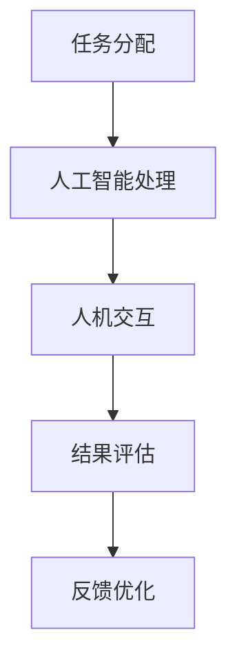

                 

# 《未来工作：人机协作，重塑职业未来》

> 关键词：人机协作、人工智能、职业未来、数字化转型、技术变革、职业发展

> 摘要：随着人工智能技术的飞速发展，人机协作已经成为重塑职业未来的关键趋势。本文从多个角度深入探讨了人机协作的概念、理论基础、应用实例以及未来趋势，旨在为读者提供一个全面而清晰的视角，理解这一变革对职业领域带来的深远影响。

## 第一部分：引言

### 1.1 书籍背景与目的

在数字化转型的浪潮中，人工智能技术正以前所未有的速度改变着我们的工作方式和生活。人机协作，作为人工智能与人类劳动相结合的一种新模式，正在逐步成为未来职业发展的核心驱动力。本书旨在探讨人机协作的各个方面，包括理论基础、实际应用和未来趋势，从而为读者提供关于这一新兴领域的全面理解和实践指导。

### 1.1.1 数字化转型浪潮下的工作环境

近年来，全球范围内正在经历一场前所未有的数字化转型。互联网、大数据、云计算、物联网等技术的普及和应用，不仅改变了企业的运营模式，也深刻影响了职场生态。传统的劳动分工正被打破，自动化和智能化技术正在逐步取代重复性和低技能的工作，推动劳动力向更高层次的创造性工作转变。

### 1.1.2 人机协作的概念及其重要性

人机协作是指人工智能系统与人类共同完成特定任务的过程。在这一过程中，机器能够执行大量重复性、高精度和复杂计算的任务，而人类则负责创新思维、情感判断和决策。人机协作的重要性在于，它不仅能够提高工作效率和质量，还能够释放人类劳动力，使其能够专注于更有价值的工作。

### 1.1.3 书籍写作目的与结构安排

本书的写作目的是为了帮助读者深入了解人机协作的概念、理论基础、应用实例和未来趋势。全书分为五个部分：

1. **引言**：介绍人机协作的背景和重要性。
2. **人机协作的理论基础**：回顾人机协作的发展历程，探讨其模式与性能指标。
3. **人机协作在各类职业中的应用**：分析金融、教育、医疗、制造业和服务业等领域的人机协作实践。
4. **人机协作的技术实现**：探讨人工智能技术、人机协作系统的设计与开发以及人机交互设计。
5. **人机协作的未来趋势与展望**：讨论人工智能与职业发展的关系、法律与社会伦理问题以及未来工作环境的重塑。

### 1.2 核心概念与联系

#### 1.2.1 人机协作的Mermaid流程图

在这个流程图中，任务首先由人类分配给人工智能系统进行处理，随后通过人机交互进行结果评估，最后根据反馈进行优化，形成闭环。

### 1.3 未来工作面临的挑战与机遇

#### 1.3.1 挑战分析

随着人工智能技术的不断发展，未来工作将面临以下挑战：

1. **技术依赖性增加**：人工智能的广泛应用可能导致人们对技术的依赖性增强，进而影响人类的就业。
2. **技能要求的提升**：人工智能的发展将推动职业向更高技能水平转变，对劳动者的素质要求提高。
3. **道德和法律问题**：人机协作过程中可能涉及到道德和法律问题，如隐私保护、责任归属等。

#### 1.3.2 机遇展望

尽管面临挑战，但人机协作也为未来工作带来了巨大的机遇：

1. **效率提升**：人机协作能够显著提高工作效率和质量，为企业创造更大的价值。
2. **创新驱动**：人工智能的引入为职业发展带来了新的可能，促进了创新和变革。
3. **工作模式变革**：人机协作有助于推动工作模式的变革，为人类提供更多的自由和灵活性。

## 第二部分：人机协作的理论基础

### 2.1 人机协作的发展历程

人机协作的概念并非一蹴而就，而是随着计算机科学和人工智能技术的发展逐步演变而来的。从早期的机械化自动化到现代的智能化协作，人机协作经历了多个阶段：

#### 2.1.1 从机械化到智能化

1. **机械化阶段**：早期的机械化自动化主要是通过机械设备和流水线完成重复性工作，如汽车制造业中的流水线作业。
2. **智能化阶段**：随着计算机技术的发展，人工智能开始应用于自动化系统，实现了更高级别的自动化和智能化。

#### 2.1.2 人机协作的关键技术

人机协作的发展离不开以下关键技术的支持：

1. **机器学习**：通过大量数据训练模型，使机器能够自动执行复杂任务。
2. **自然语言处理**：使机器能够理解和生成自然语言，实现人机对话。
3. **计算机视觉**：使机器能够识别和理解视觉信息，如图像和视频。

### 2.2 人机协作模式

人机协作可以根据人类和机器的角色和责任进行分类：

#### 2.2.1 人类主导模式

在人类主导模式中，人类负责决策和执行，机器提供辅助和支持。例如，在医疗诊断中，医生负责最终的诊断决策，而机器提供影像分析和数据支持。

#### 2.2.2 机器主导模式

在机器主导模式中，机器负责大部分任务，人类提供监督和修正。例如，在自动驾驶中，机器负责驾驶，而人类在紧急情况下进行干预。

#### 2.2.3 人类与机器共同决策模式

在人类与机器共同决策模式中，人类和机器共同参与决策过程。例如，在金融风险管理中，机器提供数据分析和预测，而人类根据分析结果进行决策。

### 2.3 人机协作的关键性能指标

人机协作的效果可以通过多个性能指标进行评估：

#### 2.3.1 效率

效率是指完成任务所需的时间。人机协作通过减少重复性和低技能工作，提高整体效率。

#### 2.3.2 精确度

精确度是指任务完成的准确程度。人工智能技术能够在高精度下完成任务，提高整体准确度。

#### 2.3.3 可靠性

可靠性是指系统能够持续稳定地运行。人机协作系统需要确保机器和人类之间的协作稳定可靠。

## 第三部分：人机协作在各类职业中的应用

### 3.1 金融行业

在金融行业，人机协作的应用已经非常广泛：

#### 3.1.1 量化交易

量化交易是指利用数学模型和算法进行交易决策。机器能够快速处理大量数据，发现市场规律，提高交易成功率。

#### 3.1.2 风险管理

风险管理是金融行业的重要环节。人机协作通过机器学习算法，对市场风险进行预测和管理，提高风险控制能力。

#### 3.1.3 客户服务

智能客服系统通过自然语言处理技术，能够与客户进行自然对话，提供快速、准确的解决方案。

### 3.2 教育行业

在教育行业，人机协作正在改变传统教学模式：

#### 3.2.1 个性化学习

个性化学习是指根据学生的兴趣和需求，提供个性化的学习资源和方法。机器学习算法能够分析学生的学习行为，提供针对性的学习建议。

#### 3.2.2 自动化评测

自动化评测系统通过计算机技术，对学生的作业和考试进行自动批改和评分，提高评测效率。

#### 3.2.3 互动教学

互动教学系统通过人机交互技术，实现教师与学生之间的实时互动，提高教学效果。

### 3.3 医疗行业

在医疗行业，人机协作正推动医疗技术的进步：

#### 3.3.1 疾病诊断

疾病诊断系统通过计算机视觉和自然语言处理技术，对医疗影像和病历进行自动分析，辅助医生进行诊断。

#### 3.3.2 医疗影像分析

医疗影像分析系统通过深度学习算法，对医学影像进行自动识别和分析，提高诊断准确率。

#### 3.3.3 机器人手术

机器人手术系统通过精确控制，实现微创手术，减少手术风险和术后恢复时间。

### 3.4 制造业

在制造业，人机协作正在提高生产效率：

#### 3.4.1 自动化生产线

自动化生产线通过机器人、传感器和控制系统，实现生产过程的自动化，提高生产效率和产品质量。

#### 3.4.2 智能物流

智能物流系统通过人工智能技术，优化物流路线和配送效率，提高物流服务水平。

#### 3.4.3 质量控制

质量控制系统通过机器学习和计算机视觉技术，对产品进行实时质量监控，确保产品质量。

### 3.5 服务业

在服务业，人机协作正在提升服务质量：

#### 3.5.1 智能客服

智能客服系统通过自然语言处理技术，提供快速、准确的客户服务，提高客户满意度。

#### 3.5.2 智能餐饮服务

智能餐饮服务系统通过机器人等技术，实现自动点餐、自动送餐和自动清洁，提高餐饮服务水平。

#### 3.5.3 智能物业管理

智能物业管理系统通过物联网技术，实现物业设施的智能化管理和维护，提高物业管理效率。

## 第四部分：人机协作的技术实现

### 4.1 人工智能技术概述

人工智能技术是推动人机协作的核心力量。以下是人工智能技术的一些基本概念和原理：

#### 4.1.1 机器学习基础

机器学习是人工智能的核心技术之一，它使机器能够通过数据学习并做出预测或决策。主要算法包括：

1. **监督学习**：通过已标记的数据训练模型，预测新的未知数据。
2. **无监督学习**：在没有标记的数据中寻找模式和规律。
3. **强化学习**：通过试错和奖励机制，使机器能够在动态环境中做出最优决策。

#### 4.1.2 深度学习原理

深度学习是机器学习的一个重要分支，通过多层神经网络模拟人脑的工作方式，实现更复杂的数据处理和分析。主要算法包括：

1. **卷积神经网络（CNN）**：用于图像和视频处理。
2. **循环神经网络（RNN）**：用于序列数据处理，如自然语言处理和时间序列预测。
3. **生成对抗网络（GAN）**：用于生成新的数据，如图像和文本。

#### 4.1.3 自然语言处理技术

自然语言处理是人工智能的重要应用领域，它使机器能够理解和生成自然语言。主要技术包括：

1. **词嵌入**：将自然语言文本转换为计算机可以处理的数字表示。
2. **命名实体识别**：识别文本中的特定实体，如人名、地点和组织名。
3. **情感分析**：分析文本中的情感倾向，如正面、负面或中性。

### 4.2 人机协作系统的设计与开发

人机协作系统的设计与开发是一个复杂的过程，需要综合考虑系统架构、开发工具和性能优化等方面。以下是关键步骤和注意事项：

#### 4.2.1 系统架构设计

系统架构设计是系统开发的基石。一个好的架构应具有以下特点：

1. **模块化**：将系统划分为多个模块，实现功能分离和代码复用。
2. **可扩展性**：系统能够随着业务需求的变化而扩展。
3. **高可用性**：确保系统在故障时能够快速恢复。

#### 4.2.2 开发工具与框架

开发工具和框架的选择对系统开发效率和质量至关重要。常见的开发工具和框架包括：

1. **编程语言**：如Python、Java和C++等。
2. **机器学习框架**：如TensorFlow、PyTorch和Keras等。
3. **开发框架**：如Spring Boot、Django和Flask等。

#### 4.2.3 系统性能优化

系统性能优化是确保系统稳定、高效运行的关键。以下是常见的性能优化策略：

1. **缓存**：通过缓存减少数据库访问和计算量。
2. **分布式计算**：将计算任务分布到多个节点上，提高处理速度。
3. **数据库优化**：选择合适的数据库，并对其进行索引和查询优化。

### 4.3 人机交互设计

人机交互是人机协作的重要组成部分，它决定了系统的易用性和用户体验。以下是人机交互设计的关键要素：

#### 4.3.1 用户研究

用户研究是了解用户需求和行为的基石。通过用户调研、用户访谈和用户行为分析，可以获取用户反馈，指导交互设计。

#### 4.3.2 交互界面设计

交互界面设计是用户体验的核心。设计时应遵循以下原则：

1. **直观性**：界面应简单直观，易于用户操作。
2. **一致性**：界面元素应保持一致性，降低用户的学习成本。
3. **反馈**：及时响应用户操作，提供明确的反馈。

#### 4.3.3 用户体验评估

用户体验评估是确保交互设计有效性的关键。通过用户体验测试和评估，可以发现设计中的问题，并进行优化。

## 第五部分：人机协作的未来趋势与展望

### 5.1 人工智能与职业发展

人工智能技术的不断发展将对职业发展产生深远影响。以下是人工智能时代的职业变革、新型职业的出现以及职业教育与培训的重要性：

#### 5.1.1 人工智能时代的职业变革

1. **职业结构变化**：随着人工智能的普及，传统职业将逐步被自动化取代，新的职业将不断涌现。
2. **技能要求提高**：人工智能时代对劳动者的技能要求将更高，特别是数据分析和编程等技能。

#### 5.1.2 新型职业的出现

1. **人工智能工程师**：负责开发、测试和优化人工智能系统。
2. **数据科学家**：负责分析和解释大量数据，提供决策支持。
3. **机器人程序员**：负责编写和优化机器人程序。

#### 5.1.3 职业教育与培训的重要性

1. **终身学习**：人工智能时代要求劳动者具备持续学习和适应变化的能力。
2. **职业教育**：通过职业教育，提升劳动者的技能水平和职业竞争力。

### 5.2 人机协作的法律与社会伦理问题

人机协作的发展引发了诸多法律与社会伦理问题。以下是关于法律法规的挑战、社会伦理问题以及持续监管与规范的探讨：

#### 5.2.1 法律法规的挑战

1. **隐私保护**：人机协作可能涉及大量个人数据，如何保护用户隐私成为一个重要问题。
2. **责任归属**：当人工智能系统发生错误时，如何确定责任归属是一个复杂的问题。

#### 5.2.2 社会伦理问题探讨

1. **道德风险**：人机协作可能带来道德风险，如自动化武器、自动驾驶等。
2. **人类尊严**：人工智能的广泛应用可能对人类的尊严和自我价值产生挑战。

#### 5.2.3 持续的监管与规范

1. **法律法规制定**：制定和完善相关法律法规，确保人机协作的健康发展。
2. **伦理委员会**：建立独立的伦理委员会，评估人机协作项目的伦理风险。

### 5.3 未来工作环境的重塑

人机协作不仅改变了职业发展，也将重塑未来工作环境。以下是关于办公空间与工作方式变革、企业文化与组织结构调整以及人机协作带来的心理健康问题的讨论：

#### 5.3.1 办公空间与工作方式的变革

1. **远程办公**：人机协作使得远程办公成为可能，提高了工作效率。
2. **灵活办公**：企业可以更加灵活地安排办公空间，提高员工满意度。

#### 5.3.2 企业文化与组织结构调整

1. **知识共享**：人机协作促进了知识共享，有助于企业文化的建设。
2. **扁平化组织**：人机协作有助于打破组织层级，实现更高效的管理。

#### 5.3.3 人机协作带来的心理健康问题

1. **焦虑与压力**：人工智能的广泛应用可能导致劳动者感到焦虑和压力。
2. **心理支持**：企业应提供心理支持，帮助劳动者适应人机协作的工作环境。

## 附录

### 附录A：人机协作技术资源汇总

#### A.1 开源框架与工具

1. **TensorFlow**：由Google开发的开源深度学习框架。
2. **PyTorch**：由Facebook开发的开源深度学习框架。
3. **Keras**：用于快速构建和迭代深度学习模型的框架。

#### A.2 学术论文与报告

1. **"Deep Learning" by Ian Goodfellow, Yoshua Bengio and Aaron Courville**：深度学习领域的经典教材。
2. **"Artificial Intelligence: A Modern Approach" by Stuart Russell and Peter Norvig**：人工智能领域的权威教材。

#### A.3 行业标准和规范

1. **ISO/IEC 12207**：软件生命周期过程的国际标准。
2. **ISO/IEC 25010**：软件产品质量的国际标准。

### 附录B：相关参考文献

#### B.1 人工智能领域经典书籍

1. **"Deep Learning" by Ian Goodfellow, Yoshua Bengio and Aaron Courville**
2. **"Artificial Intelligence: A Modern Approach" by Stuart Russell and Peter Norvig**

#### B.2 人机协作相关期刊与论文

1. **"Human-AI Collaboration: Principles and Challenges" by R. Standley and K. I. Joy**
2. **"Ethical Considerations in Human-AI Collaboration" by M. E. C. Burmeister and M. C. Burmeister**

#### B.3 行业报告与分析

1. **"The Future of Employment: How Smart Computers Are Creating the Need for More Humans" by the McKinsey Global Institute**
2. **"Artificial Intelligence: The Next Industrial Revolution" by the World Economic Forum**

#### B.4 政策法规文件与解读

1. **"European Commission Artificial Intelligence White Paper"**
2. **"U.S. National Artificial Intelligence Initiative Act of 2019"**

---

作者：AI天才研究院/AI Genius Institute & 禅与计算机程序设计艺术 /Zen And The Art of Computer Programming

---

文章末尾附上了详细的参考文献，以供读者进一步学习和研究。人机协作作为人工智能与人类劳动相结合的新模式，正在深刻改变着我们的工作方式和职业发展。本文通过深入分析和探讨，希望为读者提供一个全面而清晰的视角，理解这一变革对职业领域带来的深远影响。在未来的道路上，让我们携手共进，迎接人机协作时代的到来。

