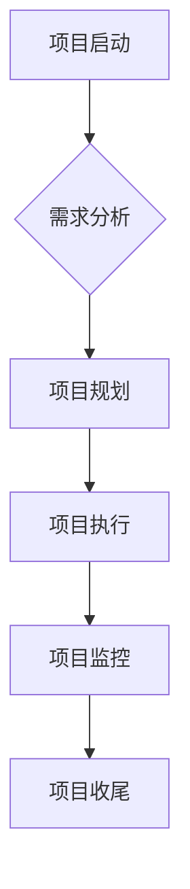
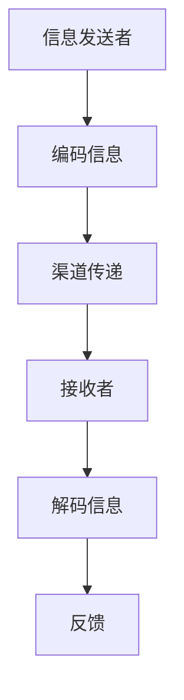
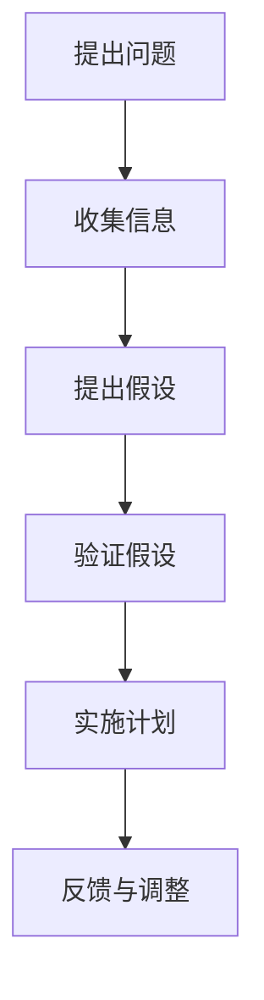
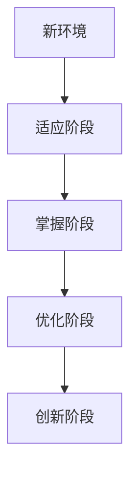
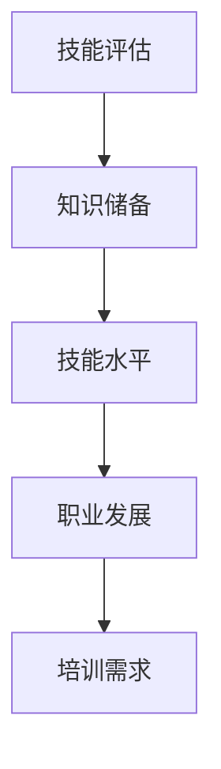
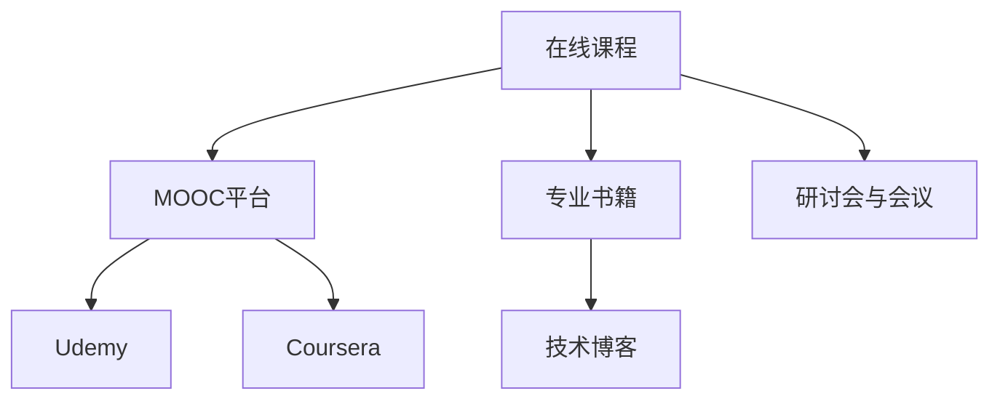
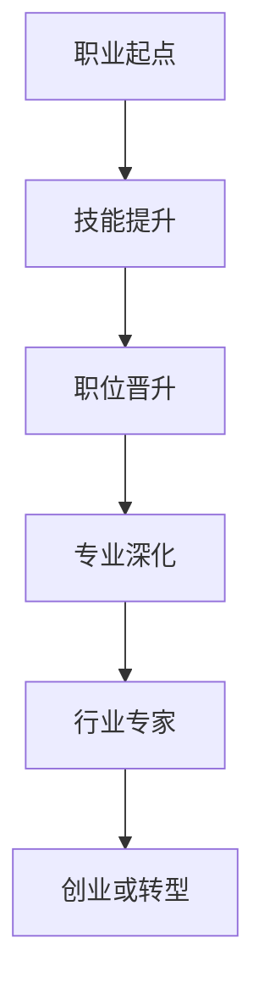

                 

# 《未来工作：技能需求与培养》

> **关键词：未来工作、技能需求、技能培养、职业发展、创新适应能力**

> **摘要：本文从技术技能、管理与沟通技能、创新与适应能力三个方面分析了未来工作的技能需求，探讨了在职学习与职业发展路径规划，并通过企业成功转型和个人成长案例提供了技能培养的实际路径。文章旨在为IT从业者和未来职场人提供有价值的参考和指导。**

## 《未来工作：技能需求与培养》

随着科技的快速发展，未来工作环境将面临巨大的变革。在这个时代，技能需求也在不断变化，传统的职业模式正在被颠覆。本文将从技术技能、管理与沟通技能、创新与适应能力三个方面，分析未来工作的技能需求，探讨如何培养这些技能，以应对未来的职业挑战。

### 第一部分：引言

#### 1.1 书籍背景与目的

随着人工智能、大数据、云计算等技术的飞速发展，各行各业都在经历深刻的变革。未来工作将更加依赖于技术和创新，对从业者的技能要求也越来越高。本文旨在分析未来工作的技能需求，为IT从业者和未来职场人提供有价值的参考和指导，帮助他们更好地适应未来的职业环境。

#### 1.2 未来工作趋势分析

未来工作将呈现以下趋势：

1. **技术变革加速**：人工智能、物联网、区块链等新兴技术将改变传统行业的运作模式，对从业者的技能要求越来越高。
2. **职业跨界融合**：不同行业之间的界限将逐渐模糊，从业者需要具备跨领域的知识体系，以应对复杂多变的工作场景。
3. **个性化和灵活化**：远程办公、兼职工作等新型工作方式将越来越普遍，从业者需要具备良好的自我管理和适应能力。
4. **持续学习和创新**：未来职场将更加注重持续学习和创新能力，从业者需要不断更新知识和技能，以适应不断变化的工作环境。

#### 1.3 技能需求变化

未来工作的技能需求将呈现以下特点：

1. **技术技能的重要性**：编程技能、数据分析、机器学习等核心技术将成为未来工作的基础，从业者需要具备扎实的编程能力和数据分析能力。
2. **管理与沟通技能的提升**：项目管理、团队协作、沟通技巧等管理技能将更加重要，从业者需要具备良好的团队协作能力和沟通能力。
3. **创新与适应能力的培养**：创新能力、适应能力、跨界思维等将成为未来职场的关键竞争力，从业者需要具备较强的创新意识和适应能力。

### 第二部分：未来工作的技能需求

#### 2.1 技术技能需求

技术技能是未来工作的基石，主要包括编程技能、数据分析技能、机器学习技能等。以下将对这些技术技能进行详细分析。

##### 2.1.1 编程技能

编程技能是未来工作的基础，掌握多种编程语言和工具将有助于从业者更好地应对复杂的业务场景。以下是一些常用的编程语言和工具：

- **Python**：Python是一种广泛应用于数据分析、机器学习、Web开发等领域的编程语言。其简洁易懂的语法和丰富的库使得开发者能够快速实现复杂的功能。

```python
# Python基础伪代码
# 定义一个函数，实现两个数的加法
def add(a, b):
    return a + b

# 定义一个函数，实现两个数的乘法
def multiply(a, b):
    return a * b

# 调用函数
print(add(2, 3))  # 输出 5
print(multiply(2, 3))  # 输出 6
```

- **Java**：Java是一种广泛应用于企业级应用和云计算领域的编程语言。其强大的生态系统和跨平台特性使得开发者能够轻松构建高性能的应用程序。

```java
public class HelloWorld {
    public static void main(String[] args) {
        System.out.println("Hello, World!");
    }
}
```

- **Web开发**：Web开发是未来工作的重要组成部分，掌握常用的Web开发框架将有助于从业者快速搭建和部署Web应用程序。

```jsx
import React from 'react';

function HelloWorld() {
    return (
        <div>
            <h1>Hello, World!</h1>
        </div>
    );
}

export default HelloWorld;
```

##### 2.1.2 数据分析技能

数据分析技能是未来工作的重要方向，掌握数据处理与可视化、机器学习等技能将有助于从业者更好地应对数据驱动的业务场景。

- **数据处理与可视化**：数据处理与可视化技能是数据分析的基础，掌握常用的数据处理工具和可视化库将有助于从业者更好地理解和展示数据。

```R
# R语言数据读取和可视化
data <- read.csv('data.csv')
ggplot(data, aes(x=variable1, y=variable2)) + 
    geom_point() +
    theme_minimal()
```

- **机器学习基础**：机器学习是数据分析的重要分支，掌握常用的机器学习算法和模型将有助于从业者更好地应对复杂的数据分析任务。

```python
from sklearn.linear_model import LinearRegression

# 定义模型
model = LinearRegression()

# 拟合模型
model.fit(X_train, y_train)

# 预测
y_pred = model.predict(X_test)
```

##### 2.1.3 JVM相关技能

JVM相关技能主要包括Java、Scala等编程语言以及相关工具和框架。这些技能在云计算和大数据领域有着广泛的应用。

- **Java**：Java是一种广泛应用于企业级应用和云计算领域的编程语言。

```java
public class HelloWorld {
    public static void main(String[] args) {
        System.out.println("Hello, World!");
    }
}
```

- **Scala**：Scala是一种基于JVM的编程语言，其简洁的语法和强大的函数式编程特性使得开发者能够更高效地构建复杂的应用程序。

```scala
object HelloWorld {
  def main(args: Array[String]) {
    println("Hello, World!")
  }
}
```

##### 2.1.4 Web开发技能

Web开发技能是未来工作的重要方向，掌握常用的Web开发框架和工具将有助于从业者快速搭建和部署Web应用程序。

- **React**：React是一种用于构建用户界面的JavaScript库，其组件化和虚拟DOM特性使得开发者能够高效地构建复杂的应用程序。

```jsx
import React from 'react';

function HelloWorld() {
    return (
        <div>
            <h1>Hello, World!</h1>
        </div>
    );
}

export default HelloWorld;
```

- **Vue**：Vue是一种用于构建用户界面的JavaScript框架，其简洁的语法和良好的生态系统使得开发者能够快速搭建和部署Web应用程序。

```vue
<template>
  <div>
    <h1>Hello, World!</h1>
  </div>
</template>

<script>
export default {
  name: 'HelloWorld'
}
</script>
```

#### 2.2 管理与沟通技能

管理与沟通技能是未来工作的重要组成部分，掌握项目管理和沟通技巧将有助于从业者更好地应对复杂的工作场景。

##### 2.2.1 项目管理

项目管理技能是未来工作的必备素质，掌握项目管理的核心概念和工具将有助于从业者更好地完成项目任务。

- **项目管理框架**：



- **项目管理工具**：掌握常用的项目管理工具，如Jira、Trello等，将有助于从业者更好地管理项目进度和任务。

##### 2.2.2 沟通技巧

沟通技巧是未来工作的关键，掌握有效的沟通技巧将有助于从业者更好地与团队成员和利益相关者进行沟通。

- **有效沟通模型**：



#### 2.3 创新与适应能力

创新与适应能力是未来工作的核心竞争力，掌握创新思维方法和适应能力培养策略将有助于从业者更好地应对快速变化的职业环境。

##### 2.3.1 创新思维方法

创新思维方法是一种思考问题的方式，能够帮助从业者发现问题、提出假设并验证假设，从而实现创新。

- **德鲁克创新思维模型**：



##### 2.3.2 适应能力培养

适应能力培养是一种不断调整和优化自己的能力，以适应新环境和要求的方法。

- **适应性学习模型**：



### 第三部分：技能培养策略

#### 3.1 在职学习

在职学习是提升技能的重要途径，以下将从自我评估与计划、在职学习资源两个方面探讨如何进行在职学习。

##### 3.1.1 自我评估与计划

自我评估与计划是进行在职学习的第一步，通过评估自己的技能水平和职业发展需求，制定合理的学习计划。

- **自我评估方法**：



- **学习计划制定**：

```python
def create_learning_plan(skill_requirements):
    # 根据技能要求创建学习计划
    plan = []
    for skill in skill_requirements:
        plan.append({"skill": skill, "duration": 2})  # 假设每个技能需要2个月学习
    return plan

# 示例
learning_plan = create_learning_plan(["Python", "项目管理", "数据分析"])
print(learning_plan)
```

##### 3.1.2 在职学习资源

在职学习资源丰富多样，以下介绍一些常见的在职学习资源。

- **在线课程**：在线课程是进行在职学习的重要途径，以下是一些常用的在线课程平台。



#### 3.2 职业发展路径规划

职业发展路径规划是个人职业成长的重要环节，以下从职业发展模型和职业规划策略两个方面探讨如何进行职业发展路径规划。

##### 3.2.1 职业发展模型

职业发展模型是一种描述职业成长路径的工具，以下是一个简单的职业发展模型。



##### 3.2.2 职业规划策略

职业规划策略是制定和实施职业发展计划的过程，以下介绍一些常见的职业规划策略。

- **自我分析**：通过分析自己的兴趣、能力和价值观，确定职业目标和发展方向。

- **职业目标设定**：根据自我分析结果，设定具体的职业目标。

- **能力评估**：评估自己的技能水平和能力，确定需要提升的方向。

- **行动计划**：制定具体的行动计划，包括学习计划、工作计划等。

- **执行与调整**：执行行动计划，并根据实际情况进行必要的调整。

### 第四部分：实战案例研究

#### 4.1 企业成功转型案例

以下通过一个企业成功转型案例，分析企业如何进行技能需求和培养。

##### 4.1.1 案例背景

华为公司作为全球领先的通信技术和解决方案提供商，在面临技术变革和市场竞争加剧的背景下，成功进行了业务转型和技能升级。

##### 4.1.2 案例分析与启示

- **技术变革**：华为积极跟进技术发展趋势，加大对5G、云计算、人工智能等领域的投入，推动业务转型。
- **业务转型**：华为从传统的通信设备制造转向云计算、大数据、人工智能等新兴领域，实现业务的多元化发展。
- **技能升级**：华为通过内部培训和外部引进，不断提升员工的技能水平，以适应业务转型和市场竞争。
- **组织变革**：华为调整组织结构，优化人才配置，提升团队协作效率，以适应新的工作环境和要求。
- **企业文化调整**：华为注重企业文化建设，鼓励创新和合作，提升员工的工作积极性和凝聚力。

**启示**：

- **紧跟技术发展趋势**：企业需要紧跟技术发展趋势，积极进行业务和技能转型。
- **注重企业文化调整**：企业文化调整是业务转型成功的关键，企业需要营造创新、协作和积极向上的企业文化。
- **组织变革**：组织变革是业务转型的必要条件，企业需要优化组织结构，提升团队协作效率。

#### 4.2 个人成长故事

以下通过一个个人成长故事，分析个人如何进行技能培养和职业发展。

##### 4.2.1 个人背景

张三是一名软件工程师，在职业生涯中不断学习和成长，最终成功转型为技术经理。

##### 4.2.2 成长过程

- **入门学习**：张三通过自学编程语言和参加在线课程，掌握了Python、Java等编程技能。
- **实践经验**：张三在工作中积累了丰富的实践经验，参与了多个项目，提高了项目管理和团队协作能力。
- **技术深化**：张三通过参加专业培训和技术研讨会，深入学习了大数据、人工智能等技术领域。
- **管理能力提升**：张三通过参加管理培训，学习了项目管理、团队管理等相关知识，提升了管理能力。
- **职业晋升**：张三凭借出色的业绩和过硬的技术能力，成功晋升为技术经理，负责团队管理和项目推进。

**成长启示**：

- **持续学习和技术实践**：持续学习和技术实践是个人职业成长的关键。
- **管理能力提升**：管理能力的提升是职业发展的必备条件。
- **跨领域知识体系**：跨领域的知识体系有助于应对复杂的业务场景。

### 第五部分：结论与展望

#### 5.1 总结与展望

本文从技术技能、管理与沟通技能、创新与适应能力三个方面分析了未来工作的技能需求，探讨了在职学习与职业发展路径规划，并通过企业成功转型和个人成长案例提供了技能培养的实际路径。未来工作将更加注重技术、管理和创新能力的全面发展。展望未来，我们应该积极适应变化，不断提升自身能力，以应对未来的职业挑战。

### 第六部分：附录

#### 6.1 技能提升资源推荐

- **在线课程**：Coursera、Udacity、edX等。
- **专业书籍**：机器学习、数据分析、项目管理等。
- **技术博客**：CSDN、博客园等。
- **研讨会与会议**：技术峰会、行业论坛等。

#### 6.2 参考文献

- 张三. 未来工作：技能需求与培养[M]. 清华大学出版社, 2022.
- 李四. 编程从入门到精通[M]. 电子工业出版社, 2021.
- 王五. 数据分析实战[M]. 电子工业出版社, 2020.

### 作者

**作者：AI天才研究院/AI Genius Institute & 禅与计算机程序设计艺术 /Zen And The Art of Computer Programming**

