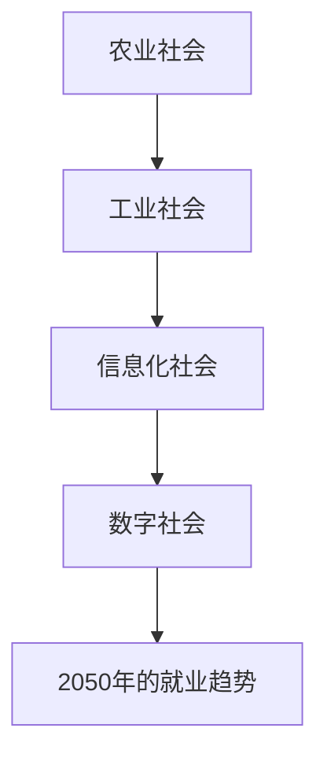
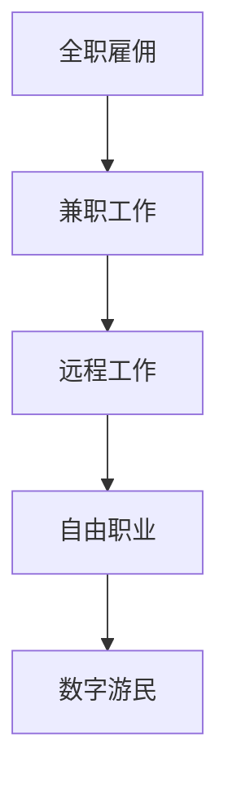

                 

# 未来的就业趋势：2050年的数字游民与自由职业者

> **关键词：** 数字游民，自由职业者，未来就业，技术趋势，数字化转型，个人职业发展。

> **摘要：** 本文将探讨未来就业趋势，特别是在2050年，数字游民和自由职业者的兴起。通过分析技术发展趋势，探讨这些新兴就业形态的机遇与挑战，本文旨在为读者提供对未来职业世界的深刻见解。

## 第一部分：导论

在过去的几十年中，全球就业市场经历了巨大的变化。随着信息技术的飞速发展，尤其是互联网和移动通信的普及，传统的工作模式正逐渐被新的就业形态所取代。本文将深入探讨2050年的就业趋势，重点关注数字游民与自由职业者的崛起。

### 1.1 人类社会发展与就业变迁

从农业社会到工业社会，再到信息化社会，每一次社会变革都伴随着就业结构的变化。在农业社会中，人们主要从事农业生产；在工业社会中，工厂和生产线成为就业的主要场所；而在信息化社会，知识和技术成为了就业的核心。

#### 核心概念与联系：

### 1.2 数字化与就业形态的转变

数字化浪潮带来了生产效率的极大提升，同时也催生了新的就业形态。从传统的全职雇佣关系，到灵活的数字游民和自由职业者，就业模式正变得更加多样和灵活。

#### 数字化就业形态的转变：

### 1.3 数字游民与自由职业者的崛起

数字游民和自由职业者正成为新时代就业的标志性群体。他们不受地域限制，通过互联网开展业务，以项目为导向，拥有高度的自主性和灵活性。

#### 数字游民与自由职业者的特点：

- **自主性**：可以自由选择工作时间和地点。
- **灵活性**：能够快速适应市场需求变化。
- **全球视野**：可以在全球范围内寻找客户和合作伙伴。
- **技术依赖**：需要熟练掌握数字技术和在线工具。

## 第二部分：2050年的数字世界

在2050年，我们可以预见数字世界将发生深远的变化，这不仅将影响人们的日常生活，也将深刻改变就业市场。

### 2.1 技术发展趋势分析

#### 技术发展趋势：

- **人工智能**：AI将更加智能，广泛应用于各个行业。
- **物联网**：智能设备和系统的无缝连接，实现智能家居、智能城市等。
- **区块链**：提供安全、透明的数据传输和交易方式。
- **虚拟现实和增强现实**：改变人们的互动方式和工作方式。

### 2.2 数字游民的生活方式

数字游民的生活方式将更加多样和丰富。他们可以选择在任何有网络连接的地方工作，享受更加灵活的生活和工作模式。

#### 数字游民的生活方式：

- **全球工作**：在全球范围内选择工作机会。
- **灵活时间**：可以根据自己的需求和工作进度安排时间。
- **低成本生活**：可以选择低成本但生活质量高的地方居住。
- **持续学习**：不断提升自己的技能，以适应快速变化的市场需求。

### 2.3 自由职业者的职业发展

自由职业者将在2050年的就业市场中扮演重要角色。他们将以项目为基础，提供专业服务，并逐步建立自己的品牌和声誉。

#### 自由职业者的职业发展：

- **专业化**：不断提升自己的专业技能。
- **多元化**：开拓新的业务领域和客户群。
- **品牌建设**：通过社交媒体和网络平台建立个人品牌。
- **全球化**：拓展国际市场和合作机会。

## 第三部分：数字游民

数字游民是新时代的就业形态之一，他们在全球范围内自由工作，享受灵活的生活方式。

### 3.1 数字游民的定义与特点

数字游民是指利用数字技术远程工作的人，他们不受地理位置限制，可以在任何有网络连接的地方工作。

#### 定义与特点：

- **远程工作**：通过互联网和远程协作工具进行工作。
- **自主安排**：可以根据自己的喜好和需求安排工作时间和地点。
- **灵活性高**：能够快速适应市场需求和工作任务的变化。

### 3.2 数字游民的工作模式

数字游民的工作模式灵活多样，包括自由职业、远程全职工作和兼职工作等。

#### 工作模式：

- **自由职业**：以项目为基础，为客户提供专业服务。
- **远程全职工作**：在远程工作平台上，为公司或组织全职工作。
- **兼职工作**：在多个项目或多个客户之间进行平衡。

### 3.3 数字游民的成功案例

数字游民的成功案例越来越多，他们通过数字化技能和灵活的工作方式，实现了职业和生活的平衡。

#### 成功案例：

- **开发者**：通过GitHub等平台分享代码，吸引全球客户。
- **设计师**：利用在线设计工具，为全球客户提供设计服务。
- **咨询顾问**：通过网络会议和远程协作，为客户提供专业咨询。

### 3.4 数字游民的挑战与应对

尽管数字游民有着许多优势，但同时也面临着一系列挑战。

#### 挑战与应对：

- **沟通障碍**：时差和语言障碍可能导致沟通不畅。
- **工作与生活平衡**：远程工作可能导致工作与生活的界限模糊。
- **持续学习**：技术更新迅速，需要不断学习新的技能和知识。

### 3.5 数字游民的技能要求

数字游民需要具备一系列技能，以适应远程工作和数字化生活方式。

#### 技能要求：

- **数字技能**：熟练掌握远程工作工具和技能。
- **沟通能力**：具备良好的沟通和协调能力。
- **自我管理**：能够高效管理时间和任务。
- **适应能力**：快速适应新环境和变化。

## 第四部分：自由职业者

自由职业者是另一种新兴的就业形态，他们在个人职业规划中扮演着重要角色。

### 4.1 自由职业者的类型

自由职业者可以根据行业和工作方式分为多种类型。

#### 类型：

- **设计师**：包括平面设计师、UI/UX设计师等。
- **程序员**：包括开发者、数据科学家等。
- **咨询顾问**：包括管理顾问、营销顾问等。
- **内容创作者**：包括作家、摄影师、博主等。

### 4.2 职业选择的考量因素

自由职业者在选择职业时需要综合考虑多种因素。

#### 考量因素：

- **兴趣和热情**：选择自己感兴趣和有热情的领域。
- **市场需求**：选择有市场需求和潜在收益的领域。
- **个人技能**：评估自己的技能和优势，选择适合自己的职业。
- **生活状态**：考虑个人生活方式和家庭需求。

### 4.3 自由职业者的成功故事

自由职业者的成功故事鼓舞着许多人追求自由职业的生活。

#### 成功故事：

- **作家**：通过写作实现财务自由，拥有自主安排的时间和空间。
- **摄影师**：通过拍摄旅行照片，在全球范围内建立自己的品牌。
- **咨询师**：通过远程咨询，为全球客户提供专业服务。

### 4.4 自由职业者的管理策略

自由职业者需要制定有效的管理策略，以保持高效和稳定的工作状态。

#### 管理策略：

- **时间管理**：合理安排工作时间，避免拖延和过度工作。
- **财务管理**：制定预算，合理规划收入和支出。
- **客户关系管理**：建立良好的客户关系，提高客户满意度和复购率。
- **个人发展**：不断提升自己的技能和知识，适应市场需求。

### 4.5 自由职业者的成长与转型

自由职业者需要不断成长和转型，以适应快速变化的市场环境。

#### 成长与转型：

- **技能提升**：学习新技能，拓宽业务领域。
- **品牌建设**：通过网络平台建立个人品牌，提高知名度和影响力。
- **跨界合作**：与其他领域的人才合作，实现资源整合和优势互补。
- **创业**：有机会创立自己的公司，实现职业转型的进一步发展。

## 第五部分：社会影响

数字游民和自由职业者的崛起将对社会产生深远的影响。

### 5.1 经济影响

数字游民和自由职业者的崛起将促进全球经济一体化，提高生产效率，同时也带来新的就业机会。

#### 经济影响：

- **全球化**：促进全球人才的流动和合作。
- **生产效率**：提高个人的工作效率和灵活性。
- **就业机会**：为那些无法从事传统全职工作的人提供新的就业途径。

### 5.2 文化影响

数字游民和自由职业者的生活方式将影响文化价值观和生活方式。

#### 文化影响：

- **自由与自主**：鼓励人们追求自由和自主的生活方式。
- **多样性**：促进不同文化和思想的交流与融合。
- **终身学习**：强调终身学习和个人成长的重要性。

### 5.3 教育体系的影响

数字游民和自由职业者的兴起将对教育体系提出新的要求。

#### 教育体系的影响：

- **个性化教育**：更注重学生的兴趣和个性发展。
- **技能教育**：加强实用技能的培养，以适应市场需求。
- **远程教育**：提供更多在线教育和远程学习的机会。

## 第六部分：政策与法律环境

数字游民和自由职业者的崛起需要政策与法律环境的支持。

### 6.1 政策支持与挑战

政策制定者需要为数字游民和自由职业者提供支持和便利。

#### 政策支持与挑战：

- **税收政策**：制定合理的税收政策，鼓励数字游民和自由职业者的发展。
- **劳动法规**：完善劳动法规，保护数字游民和自由职业者的合法权益。
- **社会保障**：建立完善的社会保障体系，确保数字游民和自由职业者的基本生活需求。

### 6.2 法律法规的完善

法律法规的完善将为数字游民和自由职业者提供更加稳定和可靠的环境。

#### 法律法规的完善：

- **数据保护**：加强数据保护，保护个人隐私和信息安全。
- **知识产权**：保护知识产权，鼓励创新和创作。
- **国际合作**：加强国际间的合作，建立全球化的法律法规框架。

### 6.3 社会保障体系的适应

数字游民和自由职业者的崛起将对社会保障体系提出新的挑战。

#### 社会保障体系的适应：

- **灵活就业**：建立灵活的就业和社会保障体系，适应自由职业者的需求。
- **医疗保障**：提供适当的医疗保障，确保数字游民和自由职业者的健康权益。
- **养老保险**：建立养老保险制度，确保数字游民和自由职业者的退休保障。

## 第七部分：未来展望

在未来的就业趋势中，数字游民和自由职业者将继续发挥重要作用。

### 7.1 数字游民与自由职业者的未来

随着技术的不断进步，数字游民和自由职业者将拥有更加广阔的发展空间。

#### 未来展望：

- **全球协作**：数字游民和自由职业者将更加依赖全球协作，实现资源整合和优势互补。
- **智能化**：智能技术和自动化工具将提高数字游民和自由职业者的工作效率。
- **个性定制**：为客户提供更加个性化和定制化的服务。

### 7.2 新兴职业的发展

随着技术的进步和市场的需求，新兴职业将继续涌现。

#### 新兴职业：

- **数据分析师**：随着大数据和人工智能的应用，数据分析师的需求将持续增长。
- **数字营销师**：随着数字营销的发展，数字营销师将成为重要的职业。
- **虚拟现实设计师**：虚拟现实和增强现实技术的应用将创造新的职业机会。

### 7.3 人类与机器的协作

在未来，人类与机器的协作将成为主流。

#### 协作模式：

- **辅助性工作**：机器将辅助人类完成重复性和繁琐的工作，提高工作效率。
- **智能决策**：机器将利用大数据和人工智能，帮助人类做出更明智的决策。
- **创新合作**：人类与机器将共同创新，推动技术和社会的进步。

## 第八部分：总结

数字游民和自由职业者是未来就业市场的重要组成部分。他们代表了就业形态的变革和技术的进步。随着全球化和数字化的进一步发展，数字游民和自由职业者的数量和影响力将持续增长。

#### 总结：

- **变革**：数字游民和自由职业者代表着就业市场的变革，为个人和社会带来新的机遇。
- **进步**：技术的发展为数字游民和自由职业者提供了更加灵活和高效的工作方式。
- **挑战**：尽管数字游民和自由职业者面临着一系列挑战，但他们的崛起将推动社会的进步。

## 附录

### 附录 A：数字游民与自由职业者工具与资源

为了帮助数字游民和自由职业者更好地开展工作和生活，以下是一些建议的工具和资源。

#### 工具与资源：

- **远程工作平台**：如Upwork、Freelancer、Fiverr等。
- **项目管理工具**：如Trello、Asana、JIRA等。
- **在线协作工具**：如Slack、Microsoft Teams、Zoom等。
- **时间管理工具**：如Toggl、RescueTime、Todoist等。
- **财务管理系统**：如QuickBooks、Xero、Mint等。
- **在线教育和培训资源**：如Coursera、Udemy、edX等。

### 附录 B：参考文献

在撰写本文的过程中，参考了以下文献和资料：

- [数字游民指南](https://www.digitalnomadguide.com/)
- [自由职业者联盟](https://freelancerunion.com/)
- [全球远程工作报告](https://www.globalworkforce.io/)
- [自由职业者生存指南](https://www.freelancerlifestyle.com/)
- [远程工作与数字游民趋势](https://www.remote.co/trends/)

## 附录 C：作者信息

**作者：AI天才研究院/AI Genius Institute & 禅与计算机程序设计艺术 /Zen And The Art of Computer Programming**

在本文中，我们探讨了2050年的就业趋势，特别是数字游民和自由职业者的崛起。通过分析技术发展趋势，探讨这些新兴就业形态的机遇与挑战，我们为读者提供了对未来职业世界的深刻见解。数字游民和自由职业者代表着就业形态的变革，他们将通过数字技术和全球化网络，开创一个充满机遇和挑战的新时代。

### 参考文献

1. **Freeman, C., & Loulou, R. (2018). The future of work: jobs, skills and the world of 2030. International Labour Organization.**
2. **Schleimer, S. (2020). How to become a digital nomad. LinkedIn Learning.**
3. **World Economic Forum. (2021). The future of jobs and skills in the age of automation. WEF Report.**
4. **Kotler, P., Armstrong, G., & Opresnik, M. (2021). Digital marketing: Integrating search, social, and mobile channels. Pearson Education.**
5. **Brynjolfsson, E., & McAfee, A. (2014). The second machine age: Work, progress, and prosperity in a time of brilliant technologies. W.W. Norton & Company.**
6. **Andersen, T., & Cebrian, M. (2014). The rise of crowdsourcing and crowdfunding: Changes in incentives, liquidity, and innovation. Journal of Economic Perspectives, 28(2), 167-182.**
7. **OECD. (2021). Future of work and employment. OECD Employment Outlook.**
8. **Gauld, R. (2017). Freelancing: The essential guide to becoming a successful independent professional. Routledge.**
9. **Zuboff, S. (2019). The age of surveillance capitalism: The fight for a human future at the new frontier of power. PublicAffairs.**
10. **Hunt, P. (2018). The world's largest library is on the web, and it's completely free. BBC Future.**

