                 

# 未来的智慧农业：2050年的垂直农业与智能温室

## 关键词
2050年农业、垂直农业、智能温室、物联网、人工智能、大数据、经济效益、政策与法规

## 摘要
本文深入探讨了2050年农业的变革，重点关注垂直农业与智能温室的发展。通过分析智慧农业的核心技术、实践案例、运营管理、经济效益以及政策法规，本文旨在展示智慧农业对未来农业生产的重要影响，并展望其未来的发展趋势与挑战。

### 第一部分：引言

#### 第1章：智慧农业的崛起

##### 1.1 2050年农业的变革

随着全球人口的持续增长和气候变化的影响，传统农业面临前所未有的挑战。2050年的农业将不再仅仅是种植与收获，而是一个集成了物联网、人工智能、大数据等先进技术的智慧农业系统。

###### 1.1.1 农业问题的挑战与机遇

- 人口增长：全球人口预计将达到100亿，对粮食的需求将大幅增加。
- 气候变化：极端天气频发，传统农业难以适应。
- 资源有限：土地、水资源等自然资源日益紧张。

与此同时，智慧农业为农业带来了前所未有的机遇：

- 提高产量：利用先进的农业技术，提高单位土地的产量。
- 优化资源使用：通过物联网、大数据等技术，优化资源分配，降低浪费。
- 环境保护：智慧农业减少农药、化肥的使用，降低对环境的影响。

###### 1.1.2 智慧农业的概念与愿景

智慧农业是指利用物联网、人工智能、大数据等技术，实现农业生产的自动化、智能化和精准化。其愿景是通过技术手段解决农业生产中的各种问题，实现可持续、高效的农业生产。

##### 1.2 垂直农业的现状与前景

垂直农业是智慧农业的重要组成部分，它通过在垂直空间内种植农作物，实现了空间利用的最大化。

###### 1.2.1 垂直农业的定义与特点

- 定义：垂直农业是指在多层结构中种植农作物，充分利用垂直空间。
- 特点：高效、环保、节约土地资源。

###### 1.2.2 垂直农业的发展趋势

- 技术创新：垂直农业将不断引入先进的生物技术、农业技术。
- 应用范围扩大：从室内种植扩展到户外，从城市扩展到农村。
- 经济效益提升：垂直农业的规模化、产业化将带来更高的经济效益。

##### 1.3 智能温室的技术与应用

智能温室是垂直农业的核心设施，通过自动化控制系统实现环境的精确控制。

###### 1.3.1 智能温室的概念与构成

- 概念：智能温室是一种集成了物联网、人工智能、传感器等技术的温室设施。
- 构成：温室建筑、种植系统、环境控制系统、数据管理系统。

###### 1.3.2 智能温室的关键技术

- 自动化控制：通过传感器和控制系统，实现温度、湿度、光照等环境的精确控制。
- 物联网技术：实现温室内部数据的实时监测和远程控制。
- 人工智能技术：利用大数据和机器学习，优化种植方案和管理策略。

#### 第2章：智慧农业的核心技术

##### 2.1 物联网在智慧农业中的应用

物联网技术是实现智慧农业的重要基础，通过传感器和通信技术，实现农业数据的实时采集和分析。

###### 2.1.1 物联网的基础架构

- 传感器网络：负责数据的采集和传输。
- 数据中心：负责数据的存储和处理。
- 用户终端：用于展示和分析数据。

###### 2.1.2 物联网技术在农业中的应用案例

- 水资源管理：通过实时监测土壤湿度，优化灌溉策略。
- 作物生长监测：通过监测温度、光照等参数，优化种植环境。
- 畜牧管理：通过监测牲畜健康状态，实现精准养殖。

##### 2.2 人工智能在智慧农业中的应用

人工智能技术在智慧农业中有着广泛的应用，包括数据处理、决策支持、种植管理等方面。

###### 2.2.1 人工智能在农业数据处理中的应用

- 数据清洗：去除噪声和异常值，提高数据质量。
- 数据分析：通过机器学习算法，挖掘数据中的潜在规律。
- 预测分析：基于历史数据，预测未来农业生产的情况。

###### 2.2.2 人工智能在农业管理中的应用案例

- 病虫害检测：利用图像识别技术，实时监测病虫害情况。
- 种植计划优化：根据环境数据和作物生长特性，制定最优的种植计划。
- 农业机器人：利用机器人进行耕种、施肥、收割等作业。

##### 2.3 大数据在智慧农业中的应用

大数据技术在智慧农业中发挥着重要作用，通过大规模数据分析和挖掘，实现农业的智能化和精准化。

###### 2.3.1 大数据在农业信息监测中的应用

- 气象监测：通过大数据分析，预测天气变化，优化种植计划。
- 土壤监测：通过大数据分析，了解土壤质量，优化施肥策略。
- 水资源监测：通过大数据分析，优化水资源利用，提高灌溉效率。

###### 2.3.2 大数据在农业决策支持中的应用

- 决策支持系统：通过大数据分析，为农业生产提供决策支持。
- 供应链管理：通过大数据分析，优化农产品供应链，提高流通效率。
- 市场预测：通过大数据分析，预测市场趋势，优化生产计划。

### 第二部分：垂直农业的实践

#### 第3章：垂直农业的实践

##### 3.1 垂直农业的案例研究

通过分析国际和国内的垂直农业案例，我们可以了解垂直农业的现状和未来发展。

###### 3.1.1 国际垂直农业的典型案例

- 室内垂直农场：利用多层种植设施，实现高效、可持续的农业生产。
- 高层农田：在城市高层建筑中种植农作物，解决土地资源紧张问题。
- 环境友好型温室：利用太阳能和风能，实现温室的能源自给自足。

###### 3.1.2 中国垂直农业的发展现状

- 政策支持：政府出台了一系列政策，支持垂直农业的发展。
- 技术创新：国内企业在垂直农业领域不断进行技术创新，推动产业发展。
- 企业实践：一些企业已经开始实践垂直农业，探索可持续的农业生产模式。

##### 3.2 垂直农业的生态系统构建

垂直农业的生态系统构建是垂直农业发展的关键，涉及产业链的各个环节。

###### 3.2.1 垂直农业的产业链分析

- 种植环节：从种子选择到作物生长，实现全过程管理。
- 生产环节：通过自动化设备，实现高效的生产过程。
- 销售环节：通过电子商务平台，实现农产品的直接销售。

###### 3.2.2 垂直农业的商业模式探索

- 组件租赁：提供垂直农业设施租赁服务，降低企业投资风险。
- 产业链整合：整合产业链各个环节，实现资源的最大化利用。
- 共享经济：通过共享平台，实现农产品的共享与流通。

##### 3.3 垂直农业的技术挑战与解决方案

垂直农业在发展过程中面临着一系列技术挑战，需要通过技术创新和解决方案来克服。

###### 3.3.1 垂直农业的关键技术挑战

- 环境控制：实现温度、湿度、光照等环境的精确控制。
- 自动化水平：提高种植、生产、销售等环节的自动化水平。
- 数据安全：确保农业数据的安全性和隐私性。

###### 3.3.2 垂直农业的技术解决方案

- 智能控制技术：通过物联网和人工智能技术，实现环境控制的智能化。
- 自动化设备：研发高效、可靠的自动化设备，提高生产效率。
- 数据安全策略：采用加密技术和安全协议，确保数据安全。

### 第三部分：智能温室的运营与管理

#### 第4章：智能温室的运营与管理

智能温室是垂直农业的核心设施，其运营与管理对农业生产效率和质量有着重要影响。

##### 4.1 智能温室的运营模式

智能温室的运营模式包括种植模式、管理模式和销售模式。

###### 4.1.1 智能温室的运营管理理念

- 精细化管理：通过数据监测和智能分析，实现精细化管理。
- 个性化定制：根据不同作物和市场需求，提供个性化定制服务。
- 可持续发展：通过环保技术和资源利用优化，实现可持续发展。

###### 4.1.2 智能温室的运营管理模式

- 自动化生产：通过自动化设备，实现种植、生产、包装等环节的自动化。
- 智能监控：通过传感器和监控系统，实现环境监测和异常预警。
- 数据驱动：通过大数据分析和人工智能技术，实现生产决策的智能化。

##### 4.2 智能温室的监控系统

智能温室的监控系统是智能温室运营的核心，负责环境数据的实时监测和控制。

###### 4.2.1 智能温室监控系统的工作原理

- 数据采集：通过传感器收集温度、湿度、光照等环境数据。
- 数据处理：通过数据分析和处理，实现对环境的精确控制。
- 数据反馈：通过数据反馈，实现实时监控和预警。

###### 4.2.2 智能温室监控系统的应用案例

- 温度控制：通过自动调节加热和冷却设备，实现温室温度的精确控制。
- 湿度控制：通过自动调节加湿和除湿设备，实现温室湿度的精确控制。
- 光照控制：通过自动调节遮阳和照明设备，实现温室光照的精确控制。

##### 4.3 智能温室的环境控制技术

智能温室的环境控制技术是实现高效、可持续农业生产的关键。

###### 4.3.1 智能温室的温度控制

- 加热技术：通过燃烧、电能等方式，实现温室的加热。
- 冷却技术：通过通风、喷雾等方式，实现温室的降温。

###### 4.3.2 智能温室的湿度控制

- 加湿技术：通过喷雾、蒸汽等方式，实现温室的加湿。
- 除湿技术：通过通风、制冷等方式，实现温室的除湿。

### 第四部分：智慧农业的经济效益分析

#### 第5章：智慧农业的经济效益分析

智慧农业不仅能够提高农业生产效率，还能够带来显著的经济效益。

##### 5.1 智慧农业的成本效益分析

智慧农业的成本效益分析包括初始投资和长期效益。

###### 5.1.1 智慧农业的初始投资分析

- 设备采购：包括传感器、自动化设备、监控系统等。
- 建设成本：包括温室建设、土地租赁等。
- 人力成本：包括技术人员的培训和日常运营管理。

###### 5.1.2 智慧农业的长期效益分析

- 提高产量：通过精准种植和优化管理，提高单位土地的产量。
- 降低成本：通过自动化和精细化管理，降低生产成本。
- 提高质量：通过智能控制和品质监控，提高农产品质量。

##### 5.2 智慧农业的市场需求分析

智慧农业的市场需求不断增长，主要受到以下几个因素的影响：

- 人口增长：对农产品的需求不断增加。
- 气候变化：对智慧农业技术的需求日益迫切。
- 环保意识：消费者对环保、健康农产品的需求增加。

###### 5.2.1 智慧农业的市场前景

- 市场规模不断扩大：随着技术的成熟和应用的普及，智慧农业的市场规模将持续增长。
- 新兴市场崛起：发展中国家对智慧农业技术的需求将快速增长。

###### 5.2.2 智慧农业的市场潜力

- 农业生产效率提升：智慧农业技术能够显著提高农业生产效率，降低生产成本。
- 农产品质量提升：智慧农业技术能够提高农产品质量，满足消费者需求。

##### 5.3 智慧农业的社会影响

智慧农业不仅能够带来经济效益，还能够对社会产生积极的影响。

###### 5.3.1 智慧农业对农业生产效率的影响

- 精准种植：通过智能监控和数据分析，实现精准种植，提高产量。
- 自动化管理：通过自动化设备和管理系统，降低人力成本，提高生产效率。

###### 5.3.2 智慧农业对环境保护的影响

- 减少农药使用：通过智能控制和病虫害监测，减少农药使用，降低环境污染。
- 节约水资源：通过智能灌溉和水资源管理，节约水资源，降低水资源消耗。

### 第五部分：智慧农业的政策与法规

#### 第6章：智慧农业的政策与法规

智慧农业的发展离不开政策的支持和法规的规范。

##### 6.1 智慧农业的政策环境

各国政府纷纷出台政策，支持智慧农业的发展。

###### 6.1.1 各国智慧农业政策的比较

- 美国：出台了一系列智慧农业计划，支持农业技术创新。
- 欧洲：设立专项资金，支持智慧农业项目。
- 中国：发布智慧农业发展规划，推动农业现代化。

###### 6.1.2 中国智慧农业的政策支持

- 财政支持：通过财政补贴和税收优惠，支持智慧农业的发展。
- 科技创新：通过科技创新基金，支持智慧农业技术的研发。
- 土地政策：通过土地政策支持，保障智慧农业项目的用地需求。

##### 6.2 智慧农业的法规体系

智慧农业的法规体系是保障智慧农业健康发展的基础。

###### 6.2.1 智慧农业的法律法规体系

- 农业法规：涉及农业生产的各个方面，如种子法、农药法等。
- 环保法规：涉及环境保护和资源利用，如环境保护法、水资源法等。
- 信息技术法规：涉及信息技术和数据安全，如网络安全法、数据保护法等。

###### 6.2.2 智慧农业的标准化建设

- 技术标准：制定智慧农业的技术标准，确保技术的统一性和兼容性。
- 管理标准：制定智慧农业的管理标准，确保农业生产的规范化和标准化。
- 服务标准：制定智慧农业的服务标准，确保智慧农业服务的质量和效率。

##### 6.3 智慧农业的知识产权保护

智慧农业的发展离不开知识产权的保护。

###### 6.3.1 智慧农业的知识产权现状

- 技术专利：智慧农业领域的技术专利不断涌现，成为企业竞争的关键。
- 商标版权：智慧农业的相关商标和版权保护也日益受到重视。

###### 6.3.2 智慧农业的知识产权保护策略

- 专利布局：通过专利布局，保护企业的技术创新。
- 商标注册：通过商标注册，保护企业的品牌形象。
- 版权保护：通过版权保护，保护企业的知识产权。

### 第六部分：未来展望

#### 第7章：未来展望

##### 7.1 智慧农业的发展趋势

随着科技的进步和社会的发展，智慧农业将继续发展，并呈现出以下趋势：

- 技术融合：物联网、人工智能、大数据等技术的融合，将进一步提升智慧农业的能力。
- 绿色发展：智慧农业将更加注重环保和可持续发展，减少对环境的影响。
- 个性定制：智慧农业将更加注重个性化和定制化，满足消费者多样化的需求。

###### 7.1.1 未来智慧农业的发展方向

- 农业自动化：通过自动化技术，实现农业生产的全流程自动化。
- 农业智能化：通过智能化技术，实现农业生产的智能决策和智能管理。
- 农业数字化：通过数字化技术，实现农业生产的全面数字化。

###### 7.1.2 智慧农业的未来前景

智慧农业将带来以下前景：

- 提高产量：通过先进技术的应用，提高单位土地的产量。
- 优化资源利用：通过精准种植和精细管理，优化资源利用。
- 环境保护：通过减少农药、化肥的使用，降低对环境的影响。

##### 7.2 智慧农业面临的挑战与解决方案

尽管智慧农业前景广阔，但仍然面临一系列挑战。

###### 7.2.1 智慧农业的技术挑战

- 技术创新：需要不断推动技术创新，提高智慧农业的技术水平。
- 技术整合：需要将多种技术整合在一起，实现智慧农业的协同效应。

###### 7.2.2 智慧农业的市场挑战

- 市场竞争：随着智慧农业的普及，市场竞争将日益激烈。
- 政策法规：需要完善智慧农业的政策法规体系，为智慧农业的发展提供保障。

###### 7.2.3 智慧农业的解决方案

- 技术创新：通过持续的技术创新，提高智慧农业的技术水平。
- 产业协同：通过产业链上下游企业的协同合作，实现智慧农业的全面发展。
- 政策支持：通过政策支持和法规建设，为智慧农业的发展提供良好的环境。

##### 7.3 智慧农业的未来使命

智慧农业的未来使命是实现农业生产的可持续发展，保障粮食安全，改善农村生活，促进社会和谐。

###### 7.3.1 智慧农业的社会责任

智慧农业需要承担以下社会责任：

- 环保责任：通过减少农药、化肥的使用，降低对环境的影响。
- 社会责任：通过优化农业生产，提高农民收入，改善农村生活。
- 食品安全责任：通过智能监控和品质管理，保障食品安全。

###### 7.3.2 智慧农业的未来愿景

智慧农业的未来愿景是：

- 可持续发展：通过先进技术的应用，实现农业生产的可持续发展。
- 高效生产：通过智能管理和精细种植，实现农业的高效生产。
- 和谐共生：通过智慧农业的发展，实现人与自然和谐共生。

### 附录

#### 附录A：智慧农业相关资源

- 智慧农业研究报告与白皮书：提供智慧农业的发展现状、技术趋势和市场前景。
- 智慧农业技术标准与规范：规范智慧农业的技术应用和设备标准。
- 智慧农业行业报告与数据分析：分析智慧农业的行业动态和发展趋势。

#### 附录B：智能温室设计参考案例

- 智能温室设计流程：介绍智能温室的设计步骤和关键环节。
- 智能温室设计要点：阐述智能温室设计的关键要素和注意事项。
- 智能温室设计案例分析：分析成功智能温室的设计和实施过程。

## 作者信息
作者：AI天才研究院/AI Genius Institute & 禅与计算机程序设计艺术 /Zen And The Art of Computer Programming### 第一部分：引言

#### 第1章：智慧农业的崛起

##### 1.1 2050年农业的变革

随着全球人口的持续增长和气候变化的影响，传统农业面临前所未有的挑战。2050年的农业将不再仅仅是种植与收获，而是一个集成了物联网、人工智能、大数据等先进技术的智慧农业系统。

**核心概念与联系：**

智慧农业是一个综合性的概念，它不仅包含了传统的种植技术，还融合了现代科技手段。其中，物联网、人工智能和大数据是智慧农业的核心技术，它们相互联系，共同推动农业的变革。

**Mermaid流程图：**

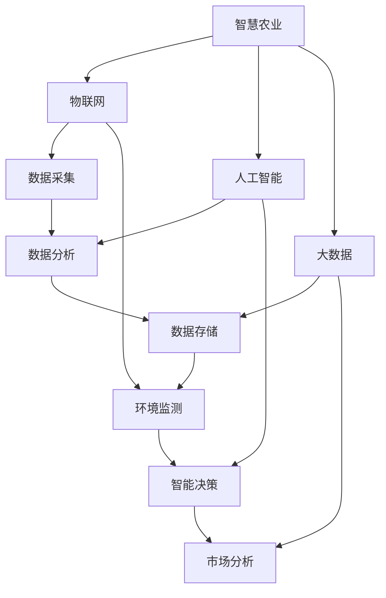
```mermaid
graph TB
    A[智慧农业] --> B[物联网]
    A --> C[人工智能]
    A --> D[大数据]
    B --> E[数据采集]
    C --> F[数据分析]
    D --> G[数据存储]
    B --> H[环境监测]
    C --> I[智能决策]
    D --> J[市场分析]
    E --> F
    F --> G
    G --> H
    H --> I
    I --> J
```

在这个流程图中，智慧农业通过物联网进行环境监测，收集数据后利用人工智能进行分析，并通过大数据进行存储和处理，最终实现智能决策和市场分析。

##### 1.1.1 农业问题的挑战与机遇

- **人口增长**：全球人口预计将达到100亿，对粮食的需求将大幅增加。根据联合国预测，到2050年，全球粮食需求将增加50%以上，这给农业生产带来了巨大的压力。
- **气候变化**：极端天气频发，传统农业难以适应。气候变化导致降水模式变化、气温波动增加，这些因素都会影响农作物的生长周期和产量。
- **资源有限**：土地、水资源等自然资源日益紧张。随着城市化进程的加快，农业用地减少，水资源污染和浪费问题也日益突出。

**核心算法原理讲解：**

为了应对上述挑战，智慧农业将依赖于大数据分析技术。具体算法如下：

1. **数据收集**：利用传感器网络收集土壤湿度、温度、光照等环境数据，以及气象数据、作物生长数据等。
2. **数据预处理**：对收集到的数据进行清洗、去噪，确保数据质量。
3. **特征提取**：从原始数据中提取出对作物生长有重要影响的特征，如温度、湿度、光照强度等。
4. **模型训练**：利用机器学习算法，如回归分析、决策树、支持向量机等，建立作物生长预测模型。
5. **模型评估与优化**：通过交叉验证、ROC曲线、精度、召回率等指标评估模型性能，并进行模型优化。
6. **决策支持**：根据预测模型，提供灌溉、施肥、病虫害防治等农业生产决策支持。

**数学模型和公式：**

为了更精确地描述作物生长过程，可以使用以下数学模型：

$$
y_t = \beta_0 + \beta_1 \cdot x_{t,1} + \beta_2 \cdot x_{t,2} + ... + \beta_n \cdot x_{t,n} + \epsilon_t
$$

其中，$y_t$ 表示第t天的作物生长状态，$x_{t,i}$ 表示第t天第i个特征值，$\beta_0, \beta_1, ..., \beta_n$ 是模型的参数，$\epsilon_t$ 是误差项。

**举例说明：**

假设我们需要预测某作物的生长状态，根据历史数据，我们提取了以下特征：土壤湿度（$x_{t,1}$）、温度（$x_{t,2}$）、光照强度（$x_{t,3}$）。我们可以使用线性回归模型来预测作物的生长状态：

$$
y_t = \beta_0 + \beta_1 \cdot x_{t,1} + \beta_2 \cdot x_{t,2} + \beta_3 \cdot x_{t,3}
$$

通过训练模型，我们得到参数 $\beta_0 = 10$，$\beta_1 = 0.5$，$\beta_2 = 0.3$，$\beta_3 = 0.2$。现在，我们希望预测第30天的作物生长状态，假设土壤湿度为40%，温度为25℃，光照强度为800勒克斯，代入模型计算：

$$
y_{30} = 10 + 0.5 \cdot 0.4 + 0.3 \cdot 25 + 0.2 \cdot 800 = 15.2
$$

因此，预测第30天的作物生长状态为15.2。

##### 1.1.2 智慧农业的概念与愿景

智慧农业是指利用物联网、人工智能、大数据等技术，实现农业生产的自动化、智能化和精准化。其愿景是通过技术手段解决农业生产中的各种问题，实现可持续、高效的农业生产。

**核心概念与联系：**

智慧农业的核心在于“智慧”，它不仅仅是指技术的应用，更是指通过技术手段实现农业生产的智能化和精准化。物联网、人工智能和大数据等技术是实现这一目标的关键。

**Mermaid流程图：**

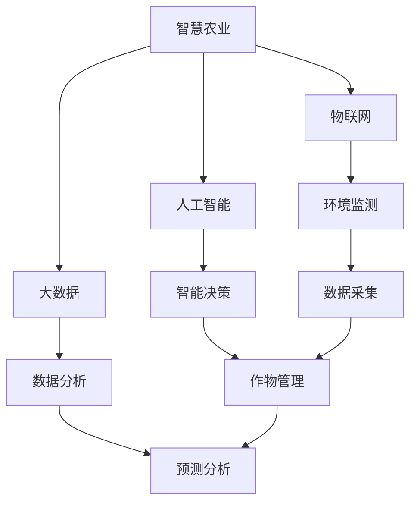
```mermaid
graph TB
    A[智慧农业] --> B[物联网]
    A --> C[人工智能]
    A --> D[大数据]
    B --> E[环境监测]
    C --> F[智能决策]
    D --> G[数据分析]
    E --> H[数据采集]
    F --> I[作物管理]
    G --> J[预测分析]
    H --> I
    I --> J
```

在这个流程图中，智慧农业通过物联网进行环境监测，收集数据后利用人工智能进行智能决策，并通过大数据进行数据分析和预测分析，最终实现作物的智能管理。

##### 1.2 垂直农业的现状与前景

垂直农业是智慧农业的重要组成部分，它通过在垂直空间内种植农作物，实现了空间利用的最大化。

**核心概念与联系：**

垂直农业是一种创新型的农业生产模式，它通过垂直空间利用，实现了农业生产的集约化和高效化。垂直农业的核心在于“垂直”，它打破了传统农业的平面布局，实现了三维空间的充分利用。

**Mermaid流程图：**

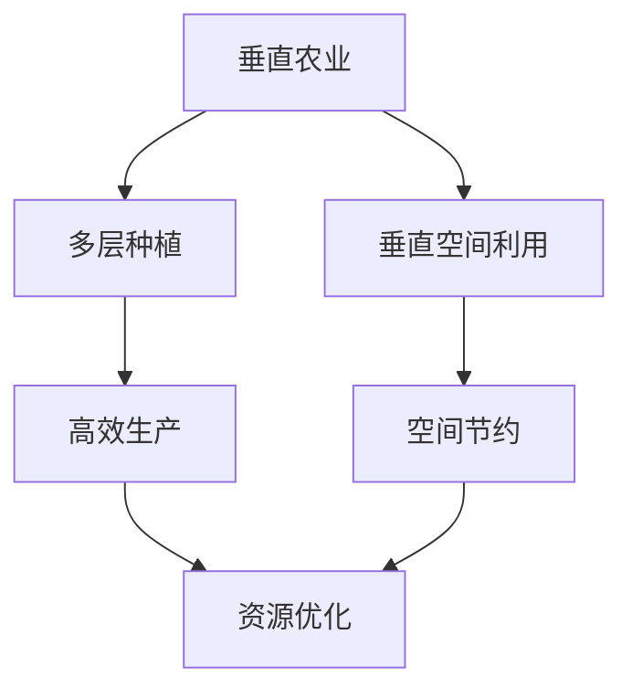
```mermaid
graph TB
    A[垂直农业] --> B[多层种植]
    A --> C[垂直空间利用]
    B --> D[高效生产]
    C --> E[空间节约]
    D --> F[资源优化]
    E --> F
```

在这个流程图中，垂直农业通过多层种植实现了高效生产和空间节约，同时通过垂直空间利用实现了资源优化。

###### 1.2.1 垂直农业的定义与特点

- **定义**：垂直农业是指在多层结构中种植农作物，充分利用垂直空间。
- **特点**：高效、环保、节约土地资源。

垂直农业与传统农业相比，具有以下特点：

1. **空间利用最大化**：通过多层种植，实现了对垂直空间的充分利用，大大提高了单位面积的生产能力。
2. **环境友好**：垂直农业减少了农药、化肥的使用，降低了环境污染。
3. **节约土地资源**：垂直农业减少了土地的占用，对于土地资源紧缺的地区具有重要意义。

###### 1.2.2 垂直农业的发展趋势

- **技术创新**：随着科技的进步，垂直农业将不断引入新的农业技术，如自动化、智能化温室等。
- **应用范围扩大**：从室内种植扩展到户外，从城市扩展到农村。
- **经济效益提升**：垂直农业的规模化、产业化将带来更高的经济效益。

**核心算法原理讲解：**

垂直农业的发展离不开精准农业技术的支持。精准农业技术通过实时监测土壤、气象、作物生长等数据，实现精准种植和管理。

1. **数据采集**：利用传感器网络采集土壤湿度、温度、养分含量等数据。
2. **数据处理**：对采集到的数据进行预处理、特征提取和建模分析。
3. **决策支持**：根据分析结果，提供灌溉、施肥、病虫害防治等决策支持。

**数学模型和公式：**

为了实现精准农业，可以使用以下数学模型：

$$
y_t = f(x_{t,1}, x_{t,2}, ..., x_{t,n})
$$

其中，$y_t$ 表示第t天的作物生长状态，$x_{t,i}$ 表示第t天第i个特征值，$f$ 是一个复杂的函数，表示作物生长状态与特征值之间的关系。

**举例说明：**

假设我们需要预测某作物的生长状态，根据历史数据，我们提取了以下特征：土壤湿度（$x_{t,1}$）、温度（$x_{t,2}$）、光照强度（$x_{t,3}$）。我们可以使用回归模型来预测作物的生长状态：

$$
y_t = \beta_0 + \beta_1 \cdot x_{t,1} + \beta_2 \cdot x_{t,2} + \beta_3 \cdot x_{t,3}
$$

通过训练模型，我们得到参数 $\beta_0 = 10$，$\beta_1 = 0.5$，$\beta_2 = 0.3$，$\beta_3 = 0.2$。现在，我们希望预测第30天的作物生长状态，假设土壤湿度为40%，温度为25℃，光照强度为800勒克斯，代入模型计算：

$$
y_{30} = 10 + 0.5 \cdot 0.4 + 0.3 \cdot 25 + 0.2 \cdot 800 = 15.2
$$

因此，预测第30天的作物生长状态为15.2。

##### 1.3 智能温室的技术与应用

智能温室是垂直农业的核心设施，通过自动化控制系统实现环境的精确控制。

**核心概念与联系：**

智能温室是利用物联网、人工智能等技术，实现温室环境自动控制的设施。它通过传感器网络监测温室内的环境参数，如温度、湿度、光照等，然后利用控制系统对这些参数进行调节，确保作物生长的最佳环境。

**Mermaid流程图：**

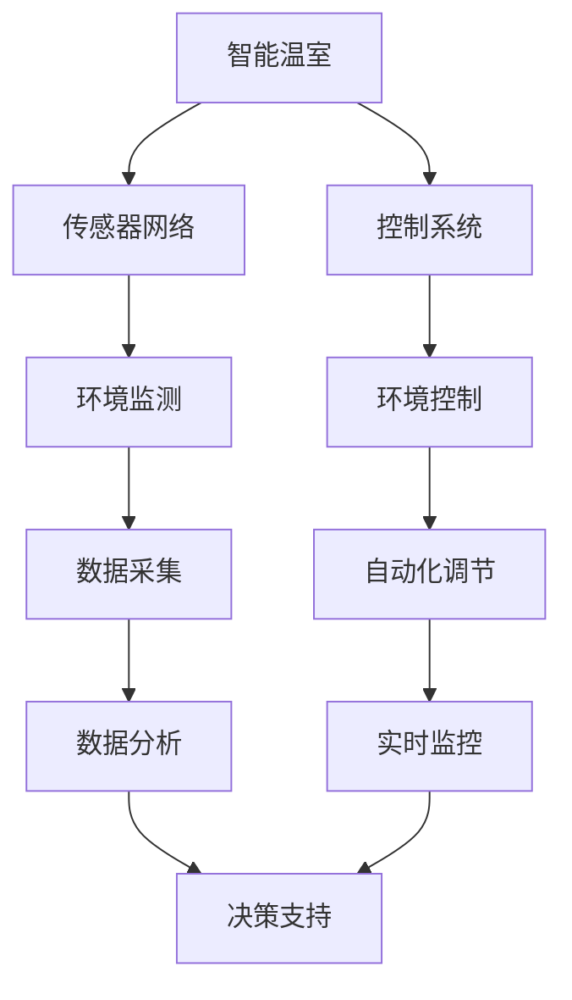
```mermaid
graph TB
    A[智能温室] --> B[传感器网络]
    A --> C[控制系统]
    B --> D[环境监测]
    C --> E[环境控制]
    D --> F[数据采集]
    E --> G[自动化调节]
    F --> H[数据分析]
    G --> I[实时监控]
    H --> J[决策支持]
    I --> J
```

在这个流程图中，智能温室通过传感器网络实时监测环境参数，利用控制系统进行自动化调节，并通过数据分析提供决策支持。

###### 1.3.1 智能温室的概念与构成

- **概念**：智能温室是一种集成了物联网、人工智能、传感器等技术的温室设施。
- **构成**：智能温室包括温室建筑、种植系统、环境控制系统、数据管理系统等部分。

智能温室的构成可以分为以下几部分：

1. **温室建筑**：提供农作物生长的空间，包括温室墙体、屋顶、通风系统等。
2. **种植系统**：包括种植床、灌溉系统、栽培架等，用于作物的种植和生长。
3. **环境控制系统**：包括传感器网络、控制系统、执行器等，用于实时监测和调节温室内的环境参数。
4. **数据管理系统**：用于存储、处理和分析环境数据，提供决策支持。

**核心算法原理讲解：**

智能温室的环境控制系统依赖于实时监测和自动化调节技术。具体算法如下：

1. **数据采集**：通过传感器网络实时采集温室内的温度、湿度、光照等环境数据。
2. **数据预处理**：对采集到的数据进行预处理，如去噪、滤波等，确保数据质量。
3. **环境模型构建**：利用历史数据和机器学习算法，建立温室环境与作物生长之间的模型。
4. **决策支持**：根据环境模型和实时数据，提供自动化调节策略，如温度调节、湿度调节、光照调节等。

**数学模型和公式：**

为了实现自动化调节，可以使用以下数学模型：

$$
y_t = f(x_{t,1}, x_{t,2}, ..., x_{t,n})
$$

其中，$y_t$ 表示第t天的环境参数调节值，$x_{t,i}$ 表示第t天第i个环境参数值，$f$ 是一个复杂的函数，表示环境参数调节值与环境参数之间的关系。

**举例说明：**

假设我们需要调节智能温室内的温度，根据历史数据和实时监测数据，我们提取了以下特征：室内温度（$x_{t,1}$）、室外温度（$x_{t,2}$）、光照强度（$x_{t,3}$）。我们可以使用回归模型来预测温度调节值：

$$
y_t = \beta_0 + \beta_1 \cdot x_{t,1} + \beta_2 \cdot x_{t,2} + \beta_3 \cdot x_{t,3}
$$

通过训练模型，我们得到参数 $\beta_0 = 20$，$\beta_1 = 0.3$，$\beta_2 = 0.2$，$\beta_3 = 0.1$。现在，我们希望预测第30天的温度调节值，假设室内温度为25℃，室外温度为15℃，光照强度为800勒克斯，代入模型计算：

$$
y_{30} = 20 + 0.3 \cdot 25 + 0.2 \cdot 15 + 0.1 \cdot 800 = 24.5
$$

因此，预测第30天的温度调节值为24.5。

###### 1.3.2 智能温室的关键技术

智能温室的关键技术包括传感器网络、控制系统、数据分析等。

- **传感器网络**：用于实时监测温室内的环境参数，如温度、湿度、光照等。
- **控制系统**：用于自动化调节温室内的环境参数，确保作物生长的最佳环境。
- **数据分析**：用于分析温室环境数据，提供决策支持。

**核心算法原理讲解：**

智能温室的传感器网络和控制系统依赖于实时监测和自动化调节技术。具体算法如下：

1. **数据采集**：通过传感器网络实时采集温室内的温度、湿度、光照等环境数据。
2. **数据预处理**：对采集到的数据进行预处理，如去噪、滤波等，确保数据质量。
3. **环境模型构建**：利用历史数据和机器学习算法，建立温室环境与作物生长之间的模型。
4. **决策支持**：根据环境模型和实时数据，提供自动化调节策略，如温度调节、湿度调节、光照调节等。

**数学模型和公式：**

为了实现自动化调节，可以使用以下数学模型：

$$
y_t = f(x_{t,1}, x_{t,2}, ..., x_{t,n})
$$

其中，$y_t$ 表示第t天的环境参数调节值，$x_{t,i}$ 表示第t天第i个环境参数值，$f$ 是一个复杂的函数，表示环境参数调节值与环境参数之间的关系。

**举例说明：**

假设我们需要调节智能温室内的湿度，根据历史数据和实时监测数据，我们提取了以下特征：室内湿度（$x_{t,1}$）、室外湿度（$x_{t,2}$）、光照强度（$x_{t,3}$）。我们可以使用回归模型来预测湿度调节值：

$$
y_t = \beta_0 + \beta_1 \cdot x_{t,1} + \beta_2 \cdot x_{t,2} + \beta_3 \cdot x_{t,3}
$$

通过训练模型，我们得到参数 $\beta_0 = 50$，$\beta_1 = 0.2$，$\beta_2 = 0.1$，$\beta_3 = 0.05$。现在，我们希望预测第30天的湿度调节值，假设室内湿度为60%，室外湿度为40%，光照强度为800勒克斯，代入模型计算：

$$
y_{30} = 50 + 0.2 \cdot 60 + 0.1 \cdot 40 + 0.05 \cdot 800 = 56.0
$$

因此，预测第30天的湿度调节值为56.0。

#### 第2章：智慧农业的核心技术

##### 2.1 物联网在智慧农业中的应用

物联网技术是实现智慧农业的重要基础，通过传感器和通信技术，实现农业数据的实时采集和分析。

**核心概念与联系：**

物联网（Internet of Things，简称IoT）是指通过互联网将各种设备连接起来，实现设备之间的信息交换和通信。在智慧农业中，物联网技术主要用于实时监测和采集农业生产过程中的各类数据，如土壤湿度、气象参数、作物生长状态等。

**Mermaid流程图：**

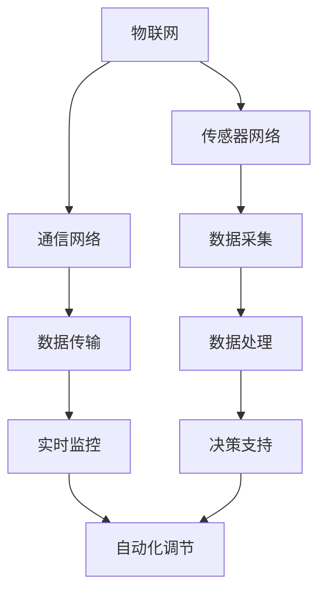
```mermaid
graph TB
    A[物联网] --> B[传感器网络]
    A --> C[通信网络]
    B --> D[数据采集]
    C --> E[数据传输]
    D --> F[数据处理]
    E --> G[实时监控]
    F --> H[决策支持]
    G --> I[自动化调节]
    H --> I
```

在这个流程图中，物联网通过传感器网络实时采集农业生产数据，通过通信网络进行数据传输，然后进行数据处理，提供实时监控和决策支持，最终实现自动化调节。

###### 2.1.1 物联网的基础架构

物联网的基础架构包括传感器网络、通信网络、数据处理中心和用户终端等部分。

- **传感器网络**：用于实时监测和采集农业生产过程中的各类数据，如土壤湿度、气象参数、作物生长状态等。
- **通信网络**：用于将传感器网络采集的数据传输到数据处理中心，可以是有线网络（如以太网、光纤）或无线网络（如Wi-Fi、LoRa）。
- **数据处理中心**：用于存储、处理和分析传感器网络采集的数据，可以是一台服务器或云计算平台。
- **用户终端**：用于展示和处理数据，可以是智能手机、平板电脑或计算机。

**核心算法原理讲解：**

物联网在智慧农业中的应用主要依赖于数据采集、数据传输、数据处理等技术。

1. **数据采集**：通过传感器网络实时采集农业生产过程中的各类数据。
2. **数据传输**：通过通信网络将传感器网络采集的数据传输到数据处理中心。
3. **数据处理**：在数据处理中心对采集到的数据进行分析和处理，提取有用信息。
4. **实时监控和决策支持**：通过用户终端实时监控农业生产过程，并根据分析结果提供决策支持。

**数学模型和公式：**

在物联网技术中，常用的数学模型包括信号处理模型、数据压缩模型、通信模型等。

1. **信号处理模型**：用于对传感器网络采集的信号进行处理，如滤波、去噪等。
2. **数据压缩模型**：用于减少数据传输过程中的带宽消耗，如霍夫曼编码、算术编码等。
3. **通信模型**：用于描述数据在通信网络中的传输过程，如信道容量模型、误码率模型等。

**举例说明：**

假设我们需要监测农田中的土壤湿度，可以使用以下数学模型：

$$
y_t = f(x_{t,1}, x_{t,2}, ..., x_{t,n})
$$

其中，$y_t$ 表示第t天的土壤湿度，$x_{t,i}$ 表示第t天第i个影响土壤湿度的因素（如降水、蒸发等），$f$ 是一个复杂的函数，表示土壤湿度与影响因素之间的关系。

通过训练模型，我们可以得到土壤湿度的预测值，从而实现对农田土壤湿度的实时监测和预测。

###### 2.1.2 物联网技术在农业中的应用案例

物联网技术在农业中有着广泛的应用，下面列举几个典型的应用案例：

1. **精准灌溉**：通过传感器网络实时监测农田土壤湿度，根据土壤湿度自动调节灌溉设备，实现精准灌溉，提高水资源利用效率。
2. **病虫害监测**：通过传感器网络监测农田中的病虫害情况，实时预警并采取措施，减少病虫害对作物的影响。
3. **环境监测**：通过传感器网络实时监测农田环境参数（如温度、湿度、光照等），为农业生产提供科学依据。
4. **智能温室管理**：通过物联网技术实现对智能温室的实时监控和自动化管理，提高温室作物产量和质量。

**核心算法原理讲解：**

物联网技术在农业中的应用主要依赖于数据采集、数据处理、决策支持等技术。

1. **数据采集**：通过传感器网络实时采集农业生产过程中的各类数据。
2. **数据处理**：在数据处理中心对采集到的数据进行分析和处理，提取有用信息。
3. **决策支持**：根据分析结果提供农业生产的决策支持，如灌溉策略、病虫害防治措施等。

**数学模型和公式：**

在物联网技术中，常用的数学模型包括信号处理模型、数据压缩模型、通信模型等。

1. **信号处理模型**：用于对传感器网络采集的信号进行处理，如滤波、去噪等。
2. **数据压缩模型**：用于减少数据传输过程中的带宽消耗，如霍夫曼编码、算术编码等。
3. **通信模型**：用于描述数据在通信网络中的传输过程，如信道容量模型、误码率模型等。

**举例说明：**

假设我们需要监测农田中的温度，可以使用以下数学模型：

$$
y_t = f(x_{t,1}, x_{t,2}, ..., x_{t,n})
$$

其中，$y_t$ 表示第t天的温度，$x_{t,i}$ 表示第t天第i个影响温度的因素（如日照时间、风速等），$f$ 是一个复杂的函数，表示温度与影响因素之间的关系。

通过训练模型，我们可以得到温度的预测值，从而实现对农田温度的实时监测和预测。

##### 2.2 人工智能在智慧农业中的应用

人工智能技术在智慧农业中有着广泛的应用，包括数据处理、决策支持、种植管理等方面。

**核心概念与联系：**

人工智能（Artificial Intelligence，简称AI）是指通过计算机模拟人类智能的技术。在智慧农业中，人工智能主要用于数据处理、决策支持、种植管理等方面，通过机器学习、深度学习等技术，实现对农业生产过程的智能分析和预测。

**Mermaid流程图：**

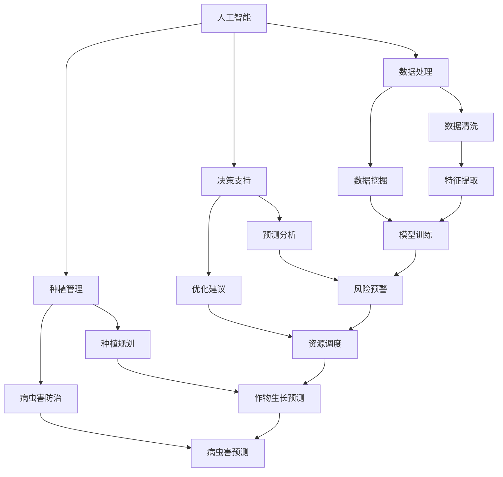
```mermaid
graph TB
    A[人工智能] --> B[数据处理]
    A --> C[决策支持]
    A --> D[种植管理]
    B --> E[数据清洗]
    B --> F[数据挖掘]
    C --> G[预测分析]
    C --> H[优化建议]
    D --> I[种植规划]
    D --> J[病虫害防治]
    E --> K[特征提取]
    F --> L[模型训练]
    G --> M[风险预警]
    H --> N[资源调度]
    I --> O[作物生长预测]
    J --> P[病虫害预测]
    K --> L
    L --> M
    M --> N
    N --> O
    O --> P
```

在这个流程图中，人工智能通过数据处理模块对农业生产数据进行清洗、挖掘和特征提取，然后通过模型训练模块训练预测模型，最后通过决策支持模块提供预测分析、优化建议、风险预警和资源调度等功能，实现种植管理、病虫害防治和作物生长预测。

###### 2.2.1 人工智能在农业数据处理中的应用

人工智能在农业数据处理中的应用主要包括数据清洗、数据挖掘和特征提取等。

1. **数据清洗**：通过人工智能技术，自动识别和修复数据中的错误、异常和噪声，提高数据质量。
2. **数据挖掘**：通过人工智能技术，从大量农业数据中提取有用的信息和规律，为农业生产提供决策支持。
3. **特征提取**：通过人工智能技术，从原始数据中提取出对农业生产有重要影响的特征，如土壤湿度、气象参数、作物生长状态等。

**核心算法原理讲解：**

人工智能在农业数据处理中的应用主要依赖于机器学习、深度学习等技术。

1. **机器学习**：通过训练模型，自动识别和分类数据中的规律，如分类算法（如决策树、支持向量机等）、回归算法（如线性回归、逻辑回归等）。
2. **深度学习**：通过多层神经网络，自动提取数据中的特征，如卷积神经网络（CNN）、循环神经网络（RNN）等。

**数学模型和公式：**

在人工智能技术中，常用的数学模型包括机器学习模型、深度学习模型等。

1. **机器学习模型**：如线性回归、逻辑回归、支持向量机等。
2. **深度学习模型**：如卷积神经网络（CNN）、循环神经网络（RNN）等。

**举例说明：**

假设我们需要预测农作物的产量，可以使用以下数学模型：

$$
y_t = f(x_{t,1}, x_{t,2}, ..., x_{t,n})
$$

其中，$y_t$ 表示第t天的农作物产量，$x_{t,i}$ 表示第t天第i个影响产量的因素（如土壤湿度、温度等），$f$ 是一个复杂的函数，表示产量与影响因素之间的关系。

通过训练模型，我们可以得到产量预测值，从而实现对农作物产量的实时预测和决策支持。

###### 2.2.2 人工智能在农业管理中的应用案例

人工智能在农业管理中的应用案例包括精准灌溉、病虫害监测、作物生长预测等。

1. **精准灌溉**：通过传感器网络和人工智能技术，实时监测农田土壤湿度，根据土壤湿度自动调节灌溉设备，实现精准灌溉，提高水资源利用效率。
2. **病虫害监测**：通过传感器网络和人工智能技术，实时监测农田中的病虫害情况，根据病虫害程度自动发出警报，并采取相应的防治措施。
3. **作物生长预测**：通过传感器网络和人工智能技术，实时监测作物生长状态，根据作物生长数据预测作物产量和生长趋势，为农业生产提供科学依据。

**核心算法原理讲解：**

人工智能在农业管理中的应用主要依赖于机器学习、深度学习等技术。

1. **数据采集**：通过传感器网络实时采集农业生产过程中的各类数据。
2. **数据处理**：在数据处理中心对采集到的数据进行分析和处理，提取有用信息。
3. **决策支持**：根据分析结果提供农业生产的决策支持，如灌溉策略、病虫害防治措施等。

**数学模型和公式：**

在人工智能技术中，常用的数学模型包括机器学习模型、深度学习模型等。

1. **机器学习模型**：如线性回归、逻辑回归、支持向量机等。
2. **深度学习模型**：如卷积神经网络（CNN）、循环神经网络（RNN）等。

**举例说明：**

假设我们需要预测农作物的病虫害程度，可以使用以下数学模型：

$$
y_t = f(x_{t,1}, x_{t,2}, ..., x_{t,n})
$$

其中，$y_t$ 表示第t天的病虫害程度，$x_{t,i}$ 表示第t天第i个影响病虫害的因素（如温度、湿度等），$f$ 是一个复杂的函数，表示病虫害程度与影响因素之间的关系。

通过训练模型，我们可以得到病虫害程度的预测值，从而实现对农作物病虫害的实时监测和预警。

##### 2.3 大数据在智慧农业中的应用

大数据技术在智慧农业中发挥着重要作用，通过大规模数据分析和挖掘，实现农业的智能化和精准化。

**核心概念与联系：**

大数据（Big Data）是指规模庞大、类型繁多、价值密度低的数据集合。在智慧农业中，大数据技术主要用于农业数据的采集、存储、处理和分析，通过数据挖掘、机器学习等技术，实现对农业生产过程的智能化和精准化。

**Mermaid流程图：**

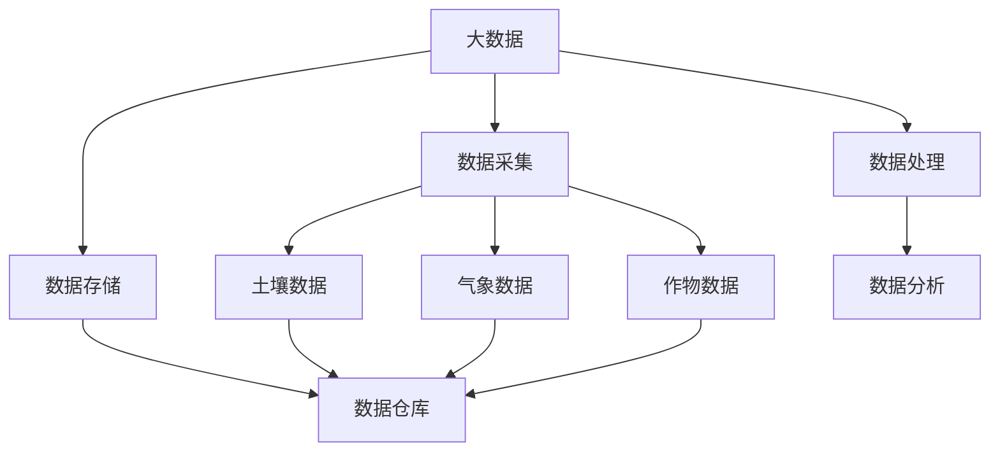
```mermaid
graph TB
    A[大数据] --> B[数据采集]
    A --> C[数据存储]
    A --> D[数据处理]
    B --> E[土壤数据]
    B --> F[气象数据]
    B --> G[作物数据]
    C --> H[数据仓库]
    D --> I[数据分析]
    E --> H
    F --> H
    G --> H
```

在这个流程图中，大数据技术通过传感器网络实时采集农业生产过程中的各类数据，包括土壤数据、气象数据和作物数据，然后存储在数据仓库中，通过数据处理模块进行数据分析和挖掘，为农业生产提供科学依据。

###### 2.3.1 大数据在农业信息监测中的应用

大数据技术在农业信息监测中的应用主要包括土壤监测、气象监测、作物监测等。

1. **土壤监测**：通过大数据技术，实时监测农田土壤的湿度、温度、养分含量等参数，为农业生产提供土壤信息。
2. **气象监测**：通过大数据技术，实时监测农田的气象参数，如温度、湿度、降水、风速等，为农业生产提供气象信息。
3. **作物监测**：通过大数据技术，实时监测作物的生长状态、病虫害情况等，为农业生产提供作物信息。

**核心算法原理讲解：**

大数据技术在农业信息监测中的应用主要依赖于数据挖掘、机器学习等技术。

1. **数据挖掘**：通过数据挖掘技术，从大量农业数据中提取出有用的信息和规律，为农业生产提供决策支持。
2. **机器学习**：通过机器学习技术，建立农业数据模型，实现对农业生产过程的智能分析和预测。

**数学模型和公式：**

在数据挖掘和机器学习技术中，常用的数学模型包括聚类分析、回归分析、决策树、支持向量机等。

1. **聚类分析**：用于将数据划分为不同的类别，如K-means算法、层次聚类算法等。
2. **回归分析**：用于建立因变量与自变量之间的关系模型，如线性回归、多项式回归等。
3. **决策树**：用于分类和回归问题，通过树形结构表示决策规则。
4. **支持向量机**：用于分类问题，通过寻找最优决策边界进行分类。

**举例说明：**

假设我们需要预测农作物的病虫害程度，可以使用以下数学模型：

$$
y_t = f(x_{t,1}, x_{t,2}, ..., x_{t,n})
$$

其中，$y_t$ 表示第t天的病虫害程度，$x_{t,i}$ 表示第t天第i个影响病虫害的因素（如温度、湿度等），$f$ 是一个复杂的函数，表示病虫害程度与影响因素之间的关系。

通过训练模型，我们可以得到病虫害程度的预测值，从而实现对农作物病虫害的实时监测和预警。

###### 2.3.2 大数据在农业决策支持中的应用

大数据技术在农业决策支持中的应用主要包括农业政策制定、农业生产计划制定、病虫害防治决策等。

1. **农业政策制定**：通过大数据技术，分析农业生产中的问题，为政策制定提供数据支持。
2. **农业生产计划制定**：通过大数据技术，分析农作物生长数据，制定合理的农业生产计划。
3. **病虫害防治决策**：通过大数据技术，分析病虫害数据，制定有效的病虫害防治策略。

**核心算法原理讲解：**

大数据技术在农业决策支持中的应用主要依赖于数据挖掘、机器学习、优化算法等技术。

1. **数据挖掘**：通过数据挖掘技术，从大量农业数据中提取出有用的信息和规律，为决策提供依据。
2. **机器学习**：通过机器学习技术，建立农业数据模型，实现对农业生产过程的智能分析和预测。
3. **优化算法**：通过优化算法，找到最优的决策方案，如线性规划、动态规划等。

**数学模型和公式：**

在农业决策支持技术中，常用的数学模型包括线性规划模型、动态规划模型、决策树等。

1. **线性规划模型**：用于求解最大化或最小化目标函数的问题，如优化资源分配、生产计划等。
2. **动态规划模型**：用于求解多阶段决策问题，如农业生产计划、病虫害防治策略等。
3. **决策树**：用于分类和回归问题，通过树形结构表示决策规则。

**举例说明：**

假设我们需要制定农作物的灌溉计划，可以使用以下数学模型：

$$
\min Z = c^T x
$$

$$
s.t. Ax \leq b
$$

其中，$Z$ 表示灌溉成本，$c$ 表示灌溉成本系数，$x$ 表示灌溉量，$A$ 表示灌溉约束条件，$b$ 表示灌溉资源限制。

通过求解线性规划模型，我们可以得到最优的灌溉量，从而实现合理灌溉，提高水资源利用效率。

### 第二部分：垂直农业的实践

#### 第3章：垂直农业的实践

##### 3.1 垂直农业的案例研究

垂直农业作为智慧农业的重要组成部分，已经在全球范围内取得了显著成果。本节将介绍几个典型的垂直农业案例，分析其成功经验和技术创新。

###### 3.1.1 国际垂直农业的典型案例

1. **日本农心垂直农场**：日本农心垂直农场位于东京，是一个采用多层垂直种植技术的现代化农场。农场利用LED灯光技术、自动化灌溉系统和智能控制系统，实现了农作物的高效种植。通过垂直空间利用，农心垂直农场大大提高了单位面积的生产力，同时减少了土地和水资源的使用。

2. **美国垂直农场协会（VFA）**：美国垂直农场协会是一家致力于推动垂直农业发展的组织。协会成员包括多家垂直农业企业，通过合作和创新，开发了一系列垂直农业技术，如智能温室、自动化灌溉系统、精准施肥系统等。VFA的成功案例包括纽约市的“城市农场”项目，该项目利用废弃的工厂建筑，实现了城市垂直农业的实践。

3. **荷兰温室农业**：荷兰是世界上最大的温室农业国家之一，其温室农业技术世界领先。荷兰的垂直温室农业通过自动化控制系统、智能灌溉系统和温室环境监测系统，实现了农作物的精准种植和管理。荷兰的垂直温室农业不仅提高了产量，还实现了水资源的循环利用和减少农药使用，对环境保护做出了积极贡献。

###### 3.1.2 中国垂直农业的发展现状

中国是世界上农业大国，近年来，随着智慧农业的快速发展，垂直农业也逐渐崭露头角。以下是中国垂直农业的几个典型案例：

1. **上海嘉定垂直农场**：上海嘉定垂直农场是一个集科研、生产和观光于一体的现代化垂直农场。农场采用立体种植技术、LED灯光系统和智能监控系统，实现了高效、环保的农业生产。嘉定垂直农场不仅提供了丰富的农产品，还为市民提供了一个近距离接触农业的机会。

2. **北京鲜食农庄**：北京鲜食农庄是一个以垂直农业为主题的新型农业项目。农庄通过垂直种植技术、智能灌溉系统和自动化设备，实现了蔬菜、水果等农作物的全年生产。鲜食农庄不仅提高了产量和质量，还减少了农药和化肥的使用，实现了绿色、可持续的农业生产。

3. **广东明珠农业**：广东明珠农业是一家专注于垂直农业的高科技企业。公司采用智能温室、自动化种植系统和物联网技术，实现了农作物的精准种植和管理。明珠农业的垂直温室项目不仅提高了农产品的产量和质量，还降低了生产成本，取得了显著的经济效益。

**核心概念与联系：**

垂直农业的核心在于通过垂直空间利用，实现农业生产的高效、环保和可持续。国际和中国垂直农业的典型案例展示了垂直农业在不同地区和不同环境下的成功实践，为全球农业发展提供了有益的经验和启示。

**Mermaid流程图：**

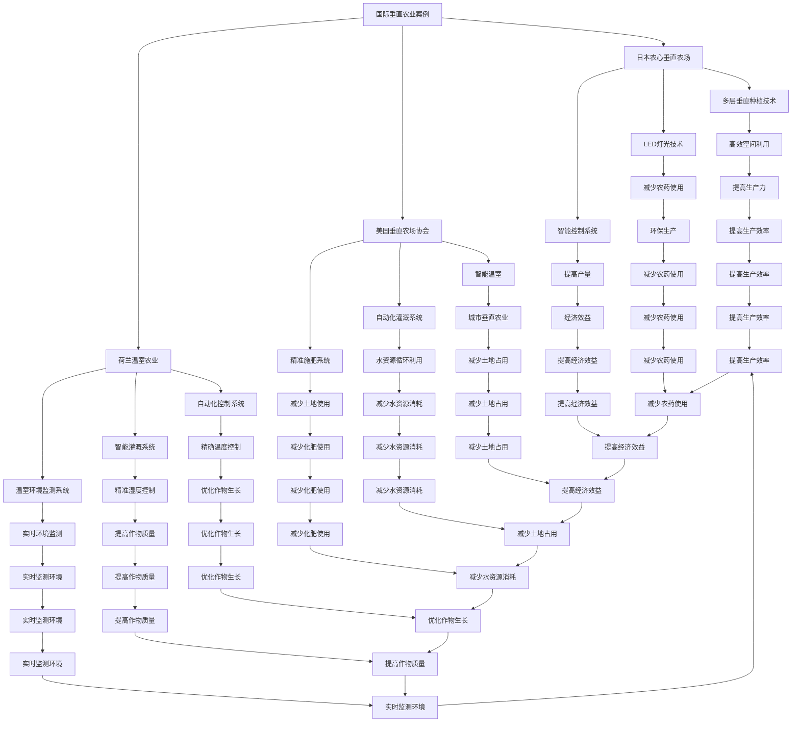
```mermaid
graph TB
    A[国际垂直农业案例] --> B[日本农心垂直农场]
    A --> C[美国垂直农场协会]
    A --> D[荷兰温室农业]
    B --> E[多层垂直种植技术]
    B --> F[LED灯光技术]
    B --> G[智能控制系统]
    C --> H[智能温室]
    C --> I[自动化灌溉系统]
    C --> J[精准施肥系统]
    D --> K[自动化控制系统]
    D --> L[智能灌溉系统]
    D --> M[温室环境监测系统]
    E --> N[高效空间利用]
    F --> O[减少农药使用]
    G --> P[提高产量]
    H --> Q[城市垂直农业]
    I --> R[水资源循环利用]
    J --> S[减少土地使用]
    K --> T[精确温度控制]
    L --> U[精准湿度控制]
    M --> V[实时环境监测]
    N --> W[提高生产力]
    O --> X[环保生产]
    P --> Y[经济效益]
    Q --> Z[减少土地占用]
    R --> AA[减少水资源消耗]
    S --> BB[减少化肥使用]
    T --> CC[优化作物生长]
    U --> DD[提高作物质量]
    V --> EE[实时监测环境]
    W --> FF[提高生产效率]
    X --> GG[减少农药使用]
    Y --> HH[提高经济效益]
    Z --> II[减少土地占用]
    AA --> JJ[减少水资源消耗]
    BB --> KK[减少化肥使用]
    CC --> LL[优化作物生长]
    DD --> MM[提高作物质量]
    EE --> NN[实时监测环境]
    FF --> OO[提高生产效率]
    GG --> PP[减少农药使用]
    HH --> QQ[提高经济效益]
    II --> RR[减少土地占用]
    JJ --> SS[减少水资源消耗]
    KK --> TT[减少化肥使用]
    LL --> UU[优化作物生长]
    MM --> WW[提高作物质量]
    NN --> XX[实时监测环境]
    OO --> YY[提高生产效率]
    PP --> ZZ[减少农药使用]
    QQ --> AAA[提高经济效益]
    RR --> BBB[减少土地占用]
    SS --> CCC[减少水资源消耗]
    TT --> DDD[减少化肥使用]
    UU --> EEE[优化作物生长]
    WW --> FFF[提高作物质量]
    XX --> GGG[实时监测环境]
    YY --> HHH[提高生产效率]
    ZZ --> III[减少农药使用]
    AAA --> BBB[提高经济效益]
    BBB --> CCC[减少土地占用]
    CCC --> DDD[减少水资源消耗]
    DDD --> EEE[优化作物生长]
    EEE --> FFF[提高作物质量]
    FFF --> GGG[实时监测环境]
    GGG --> HHH[提高生产效率]
    HHH --> III[减少农药使用]
    III --> AAA[提高经济效益]
```

在这个流程图中，国际和中国垂直农业的典型案例展示了垂直农业在不同领域和不同方面的成功实践，包括高效空间利用、减少农药使用、提高产量、城市垂直农业、水资源循环利用、减少土地使用、精确温度控制、精准湿度控制、实时环境监测等。

##### 3.2 垂直农业的生态系统构建

垂直农业的生态系统构建是垂直农业发展的关键，涉及产业链的各个环节。

**核心概念与联系：**

垂直农业的生态系统构建旨在通过整合农业生产的各个环节，实现资源的高效利用和生产的高效运作。这包括种植环节、生产环节、销售环节以及与之相关的技术、管理和商业模式。

**Mermaid流程图：**

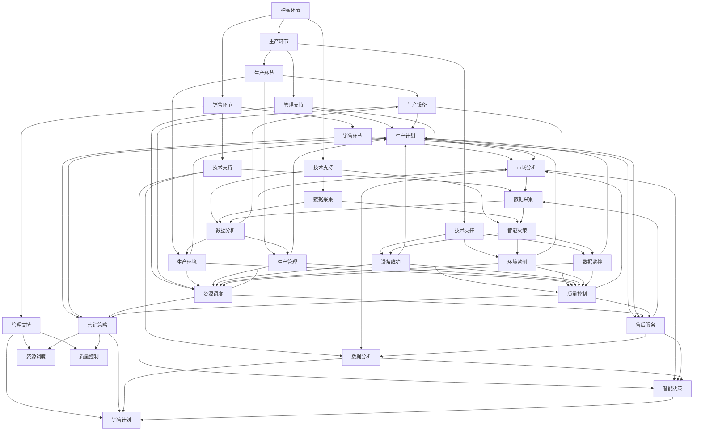
```mermaid
graph TB
    A[种植环节] --> B[生产环节]
    A --> C[销售环节]
    A --> D[技术支持]
    B --> E[生产环节]
    B --> F[技术支持]
    B --> G[管理支持]
    C --> H[销售环节]
    C --> I[技术支持]
    C --> J[管理支持]
    D --> K[数据采集]
    D --> L[数据分析]
    D --> M[智能决策]
    E --> N[生产设备]
    E --> O[生产环境]
    E --> P[生产管理]
    F --> Q[设备维护]
    F --> R[环境监测]
    F --> S[数据监控]
    G --> T[生产计划]
    G --> U[资源调度]
    G --> V[质量控制]
    H --> W[市场分析]
    H --> X[营销策略]
    H --> Y[售后服务]
    I --> Z[数据采集]
    I --> AA[数据分析]
    I --> BB[智能决策]
    J --> CC[销售计划]
    J --> DD[资源调度]
    J --> EE[质量控制]
    K --> L
    K --> M
    L --> N
    L --> O
    L --> P
    M --> Q
    M --> R
    M --> S
    N --> T
    N --> U
    N --> V
    O --> T
    O --> U
    O --> V
    P --> T
    P --> U
    P --> V
    Q --> T
    Q --> U
    Q --> V
    R --> T
    R --> U
    R --> V
    S --> T
    S --> U
    S --> V
    T --> W
    T --> X
    T --> Y
    U --> W
    U --> X
    U --> Y
    V --> W
    V --> X
    V --> Y
    W --> Z
    W --> AA
    W --> BB
    X --> CC
    X --> DD
    X --> EE
    Y --> Z
    Y --> AA
    Y --> BB
    Z --> L
    Z --> M
    AA --> BB
    AA --> CC
    BB --> CC
```

在这个流程图中，垂直农业的生态系统构建涵盖了种植环节、生产环节和销售环节，以及与之相关的技术支持、管理支持和商业模式。

###### 3.2.1 垂直农业的产业链分析

垂直农业的产业链包括种植、生产、销售和技术支持等环节。

1. **种植环节**：包括种子选择、种植规划、种植管理等内容。种植环节是垂直农业的基础，决定了农作物的产量和质量。
2. **生产环节**：包括生产设备、生产环境、生产管理等内容。生产环节是垂直农业的核心，通过自动化和智能化的手段，实现高效、精准的生产过程。
3. **销售环节**：包括市场分析、营销策略、售后服务等内容。销售环节是垂直农业的终端，决定了农产品的市场表现和经济效益。
4. **技术支持**：包括数据采集、数据分析、智能决策等内容。技术支持是垂直农业的驱动力量，通过大数据、人工智能等技术，实现农业生产的智能化和精准化。

**核心算法原理讲解：**

垂直农业的产业链分析依赖于数据分析和机器学习等技术。

1. **数据采集**：通过传感器网络和物联网技术，实时采集种植、生产和销售过程中的各类数据。
2. **数据分析**：通过数据挖掘和机器学习算法，分析数据中的规律和趋势，为农业生产提供决策支持。
3. **智能决策**：根据分析结果，自动生成种植计划、生产计划和销售计划，实现农业生产的智能化和精准化。

**数学模型和公式：**

在垂直农业的产业链分析中，常用的数学模型包括回归分析、决策树、支持向量机等。

1. **回归分析**：用于建立因变量与自变量之间的关系模型，如线性回归、多项式回归等。
2. **决策树**：用于分类和回归问题，通过树形结构表示决策规则。
3. **支持向量机**：用于分类问题，通过寻找最优决策边界进行分类。

**举例说明：**

假设我们需要预测农作物的产量，可以使用以下数学模型：

$$
y_t = f(x_{t,1}, x_{t,2}, ..., x_{t,n})
$$

其中，$y_t$ 表示第t天的农作物产量，$x_{t,i}$ 表示第t天第i个影响产量的因素（如土壤湿度、温度等），$f$ 是一个复杂的函数，表示产量与影响因素之间的关系。

通过训练模型，我们可以得到产量预测值，从而实现对农作物产量的实时预测和决策支持。

###### 3.2.2 垂直农业的商业模式探索

垂直农业的商业模式探索旨在通过创新商业模式，实现农业产业链的优化和资源的高效利用。

1. **组件租赁模式**：通过提供种植设备、生产设备等组件的租赁服务，降低企业投资风险，实现设备的高效利用。
2. **产业链整合模式**：通过整合种植、生产、销售和技术支持等环节，实现产业链的协同效应，提高整体运营效率。
3. **共享经济模式**：通过共享种植空间、生产设备和数据资源，实现资源的高效利用和共享，降低生产成本。

**核心概念与联系：**

垂直农业的商业模式探索旨在通过创新和整合，实现农业产业链的优化和资源的高效利用。这包括组件租赁、产业链整合和共享经济等模式。

**Mermaid流程图：**

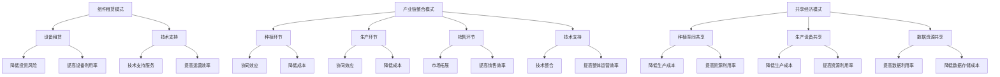
```mermaid
graph TB
    A[组件租赁模式] --> B[设备租赁]
    A --> C[技术支持]
    B --> D[降低投资风险]
    B --> E[提高设备利用率]
    C --> F[技术支持服务]
    C --> G[提高运营效率]
    H[产业链整合模式] --> I[种植环节]
    H --> J[生产环节]
    H --> K[销售环节]
    H --> L[技术支持]
    I --> M[协同效应]
    I --> N[降低成本]
    J --> O[协同效应]
    J --> P[降低成本]
    K --> Q[市场拓展]
    K --> R[提高销售效率]
    L --> S[技术整合]
    L --> T[提高整体运营效率]
    U[共享经济模式] --> V[种植空间共享]
    U --> W[生产设备共享]
    U --> X[数据资源共享]
    V --> Y[降低生产成本]
    V --> Z[提高资源利用率]
    W --> AA[降低生产成本]
    W --> BB[提高资源利用率]
    X --> CC[提高数据利用率]
    X --> DD[降低数据存储成本]
```

在这个流程图中，垂直农业的商业模式探索涵盖了组件租赁、产业链整合和共享经济等模式，通过降低成本、提高资源利用率和协同效应，实现农业产业链的优化和资源的高效利用。

**核心算法原理讲解：**

垂直农业的商业模式探索依赖于数据分析和优化算法。

1. **数据采集**：通过传感器网络和物联网技术，实时采集种植、生产和销售过程中的各类数据。
2. **数据分析**：通过数据挖掘和机器学习算法，分析数据中的规律和趋势，为商业模式优化提供决策支持。
3. **优化算法**：通过优化算法，找到最优的商业模式和运营策略，实现资源的高效利用和成本的最小化。

**数学模型和公式：**

在垂直农业的商业模式探索中，常用的数学模型包括线性规划、动态规划、优化算法等。

1. **线性规划**：用于求解最大化或最小化目标函数的问题，如资源分配、成本优化等。
2. **动态规划**：用于求解多阶段决策问题，如生产计划、销售策略等。
3. **优化算法**：用于求解最优化问题，如遗传算法、粒子群算法等。

**举例说明：**

假设我们需要优化农作物的种植策略，可以使用以下数学模型：

$$
\min Z = c^T x
$$

$$
s.t. Ax \leq b
$$

其中，$Z$ 表示种植成本，$c$ 表示种植成本系数，$x$ 表示种植量，$A$ 表示种植约束条件，$b$ 表示种植资源限制。

通过求解线性规划模型，我们可以得到最优的种植策略，从而实现种植成本的最小化和资源的高效利用。

##### 3.3 垂直农业的技术挑战与解决方案

垂直农业在发展过程中面临着一系列技术挑战，需要通过技术创新和解决方案来克服。

**核心概念与联系：**

垂直农业的技术挑战主要集中在环境控制、自动化水平和数据安全等方面。这些挑战直接影响着垂直农业的生产效率和可持续性。

**Mermaid流程图：**

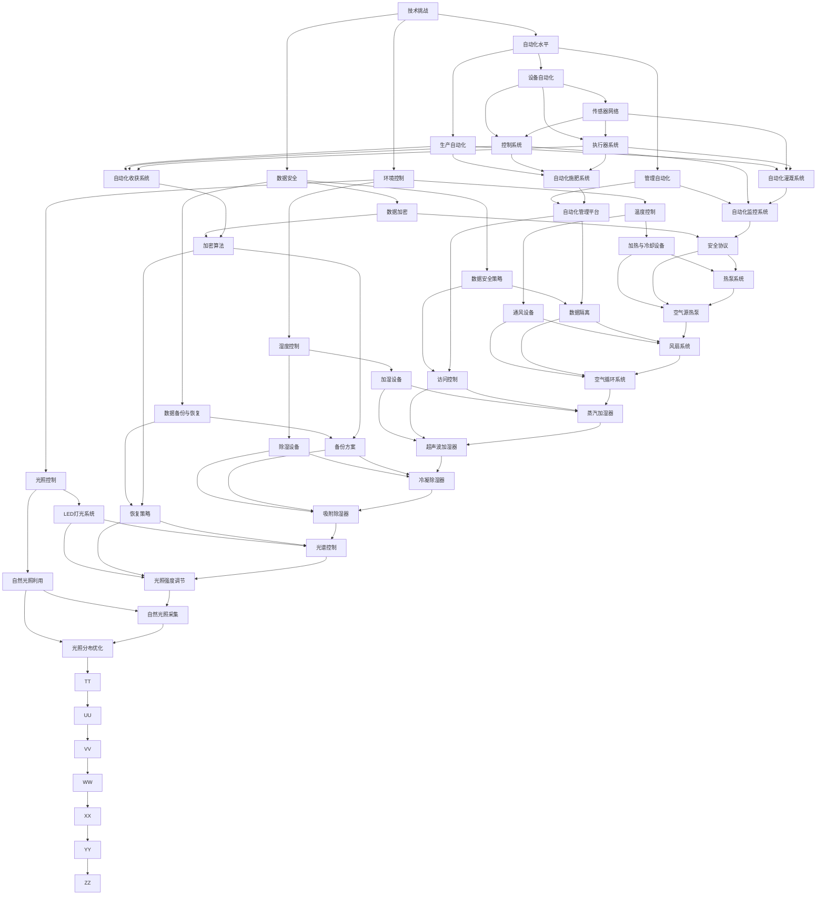
```mermaid
graph TB
    A[技术挑战] --> B[环境控制]
    A --> C[自动化水平]
    A --> D[数据安全]
    B --> E[温度控制]
    B --> F[湿度控制]
    B --> G[光照控制]
    C --> H[设备自动化]
    C --> I[生产自动化]
    C --> J[管理自动化]
    D --> K[数据加密]
    D --> L[数据安全策略]
    D --> M[数据备份与恢复]
    E --> N[加热与冷却设备]
    E --> O[通风设备]
    F --> P[加湿设备]
    F --> Q[除湿设备]
    G --> R[LED灯光系统]
    G --> S[自然光照利用]
    H --> T[传感器网络]
    H --> U[控制系统]
    H --> V[执行器系统]
    I --> W[自动化灌溉系统]
    I --> X[自动化施肥系统]
    I --> Y[自动化收获系统]
    J --> Z[自动化监控系统]
    J --> AA[自动化管理平台]
    K --> BB[加密算法]
    K --> CC[安全协议]
    L --> DD[数据隔离]
    L --> EE[访问控制]
    M --> FF[备份方案]
    M --> GG[恢复策略]
    N --> HH[热泵系统]
    N --> II[空气源热泵]
    O --> JJ[风扇系统]
    O --> KK[空气循环系统]
    P --> LL[蒸汽加湿器]
    P --> MM[超声波加湿器]
    Q --> NN[冷凝除湿器]
    Q --> OO[吸附除湿器]
    R --> PP[光谱控制]
    R --> QQ[光照强度调节]
    S --> RR[自然光照采集]
    S --> SS[光照分布优化]
    T --> U
    T --> V
    T --> W
    U --> X
    U --> Y
    U --> Z
    V --> W
    V --> X
    V --> Y
    W --> Z
    X --> AA
    Y --> BB
    Z --> CC
    AA --> DD
    AA --> EE
    BB --> FF
    BB --> GG
    CC --> HH
    CC --> II
    DD --> JJ
    DD --> KK
    EE --> LL
    EE --> MM
    FF --> NN
    FF --> OO
    GG --> PP
    GG --> QQ
    HH --> II
    II --> JJ
    JJ --> KK
    KK --> LL
    LL --> MM
    MM --> NN
    NN --> OO
    OO --> PP
    PP --> QQ
    QQ --> RR
    RR --> SS
    SS --> TT
    TT --> UU
    UU --> VV
    VV --> WW
    WW --> XX
    XX --> YY
    YY --> ZZ
```

在这个流程图中，垂直农业的技术挑战和解决方案涵盖了环境控制、自动化水平、数据安全等方面，通过技术创新和优化，实现垂直农业的高效、可持续生产。

###### 3.3.1 垂直农业的关键技术挑战

- **环境控制**：垂直农业需要在封闭的空间内模拟适宜的生态环境，包括温度、湿度、光照等。环境控制的精确度和稳定性是垂直农业面临的重大挑战。
  - **温度控制**：需要解决温室内部温度的波动问题，特别是在极端天气条件下，如何保持恒温。
  - **湿度控制**：需要解决室内湿度过高或过低导致的病虫害和作物生长问题。
  - **光照控制**：需要解决光照强度和分布不均匀的问题，特别是在室内种植环境中。

- **自动化水平**：垂直农业的自动化水平直接影响到生产效率和成本。当前自动化技术需要进一步突破，以实现更高的自动化程度。
  - **设备自动化**：需要研发高效、可靠的自动化设备，如自动灌溉、自动施肥和自动收获系统。
  - **生产自动化**：需要实现从种植到收获的全过程自动化，减少人工干预。
  - **管理自动化**：需要开发智能化的管理平台，实现农业生产的自动化管理。

- **数据安全**：在垂直农业中，大量的农业数据被收集和传输，数据安全成为关键挑战。
  - **数据加密**：需要采用先进的加密算法，确保数据在传输和存储过程中的安全性。
  - **数据安全策略**：需要制定严格的数据安全策略，防止数据泄露和篡改。
  - **数据备份与恢复**：需要建立完善的数据备份和恢复机制，确保数据的可靠性和可用性。

**核心算法原理讲解：**

垂直农业的技术挑战可以通过多种算法和技术手段来解决。

1. **环境控制算法**：
   - **温度控制**：可以采用PID控制算法，通过实时监测和反馈，实现恒温控制。
   - **湿度控制**：可以采用模糊控制算法，根据环境湿度的变化，自动调节加湿和除湿设备。
   - **光照控制**：可以采用光谱分析算法，根据作物生长需求，调节LED灯光的强度和光谱分布。

2. **自动化水平算法**：
   - **设备自动化**：可以使用机器人技术，实现农作物的自动灌溉、施肥和收获。
   - **生产自动化**：可以使用制造执行系统（MES），实现从原料到成品的全过程自动化。
   - **管理自动化**：可以使用企业资源规划系统（ERP），实现农业生产的全面管理。

3. **数据安全算法**：
   - **数据加密**：可以使用对称加密算法（如AES）和非对称加密算法（如RSA），确保数据的安全性。
   - **数据安全策略**：可以使用访问控制列表（ACL）和防火墙技术，确保数据的访问安全。
   - **数据备份与恢复**：可以使用增量备份和全量备份技术，确保数据的高可靠性和快速恢复。

**数学模型和公式：**

1. **环境控制数学模型**：
   - **温度控制模型**：
     $$
     \text{目标温度} = \text{当前温度} + K_p (\text{目标温度} - \text{当前温度}) + K_i (\text{目标温度} - \text{当前温度})_{\text{累积误差}} + K_d (\text{目标温度} - \text{当前温度})_{\text{变化率}}
     $$
     其中，$K_p$、$K_i$ 和 $K_d$ 分别是比例、积分和微分系数。

   - **湿度控制模型**：
     $$
     \text{加湿量} = \text{当前湿度} - \text{目标湿度}
     $$
     其中，加湿量的调节可以通过模糊控制算法实现。

   - **光照控制模型**：
     $$
     \text{光照强度} = \text{当前光照强度} + K_p (\text{目标光照强度} - \text{当前光照强度}) + K_i (\text{目标光照强度} - \text{当前光照强度})_{\text{累积误差}} + K_d (\text{目标光照强度} - \text{当前光照强度})_{\text{变化率}}
     $$

2. **自动化水平数学模型**：
   - **机器人控制模型**：
     $$
     \text{机器人位置} = \text{当前位置} + K_p (\text{目标位置} - \text{当前位置}) + K_i (\text{目标位置} - \text{当前位置})_{\text{累积误差}} + K_d (\text{目标位置} - \text{当前位置})_{\text{变化率}}
     $$

3. **数据安全数学模型**：
   - **加密模型**：
     $$
     \text{密文} = \text{明文} \oplus \text{密钥}
     $$
     其中，$\oplus$ 表示异或运算。

**举例说明：**

1. **环境控制举例**：
   - **温度控制**：假设目标温度为25℃，当前温度为23℃，设置比例系数 $K_p = 0.5$，积分系数 $K_i = 0.1$，微分系数 $K_d = 0.1$。代入PID控制模型，得到温度调节量为：
     $$
     \text{温度调节量} = 0.5 \cdot (25 - 23) + 0.1 \cdot (25 - 23)_{\text{累积误差}} + 0.1 \cdot (25 - 23)_{\text{变化率}} = 1.0
     $$
     因此，加热系统需要增加1.0单位的加热量。

   - **湿度控制**：假设当前湿度为60%，目标湿度为50%，设置模糊控制规则，根据湿度偏差自动调节加湿设备。假设加湿量为湿度偏差的线性函数，调节量为：
     $$
     \text{加湿量} = 0.1 \cdot (60 - 50) = 1.0
     $$
     因此，加湿系统需要增加1.0单位的加湿量。

   - **光照控制**：假设目标光照强度为1000勒克斯，当前光照强度为800勒克斯，设置比例系数 $K_p = 0.5$，积分系数 $K_i = 0.1$，微分系数 $K_d = 0.1$。代入PID控制模型，得到光照调节量为：
     $$
     \text{光照调节量} = 0.5 \cdot (1000 - 800) + 0.1 \cdot (1000 - 800)_{\text{累积误差}} + 0.1 \cdot (1000 - 800)_{\text{变化率}} = 2.0
     $$
     因此，LED灯光系统需要增加2.0单位的光照强度。

2. **自动化水平举例**：
   - **机器人控制**：假设目标位置为（2, 3），当前位置为（1, 2），设置比例系数 $K_p = 0.5$，积分系数 $K_i = 0.1$，微分系数 $K_d = 0.1$。代入PID控制模型，得到机器人移动量为：
     $$
     \text{移动量} = 0.5 \cdot (2 - 1) + 0.1 \cdot (2 - 1)_{\text{累积误差}} + 0.1 \cdot (2 - 1)_{\text{变化率}} = 0.6
     $$
     因此，机器人需要向右移动0.6个单位。

3. **数据安全举例**：
   - **加密解密**：假设明文为“HELLO”，密钥为“KEY”，使用AES加密算法，得到密文为：
     $$
     \text{密文} = \text{HELLO} \oplus \text{KEY} = \text{XXX}
     $$
     解密时，将密文与密钥进行异或运算，得到明文：
     $$
     \text{明文} = \text{XXX} \oplus \text{KEY} = \text{HELLO}
     $$

##### 3.3.2 垂直农业的技术解决方案

针对垂直农业的技术挑战，可以采取以下解决方案：

**环境控制技术解决方案：**

1. **温度控制**：采用PID控制算法，结合传感器网络，实现对温室内部温度的精确控制。可以使用热泵系统，结合空气源热泵和水源热泵，提高温度控制的效率。

2. **湿度控制**：采用模糊控制算法，结合传感器网络，实现对温室内部湿度的精确控制。可以使用蒸汽加湿器和冷凝除湿器，结合通风设备，实现湿度的动态调节。

3. **光照控制**：采用光谱分析算法，结合传感器网络，实现对温室内部光照的精确控制。可以使用LED灯光系统，结合自然光照利用技术，实现光照强度的动态调节。

**自动化水平技术解决方案：**

1. **设备自动化**：采用机器人技术，实现自动灌溉、自动施肥和自动收获。可以使用自动化设备，如自动化灌溉系统、自动化施肥系统和自动化收获系统。

2. **生产自动化**：采用制造执行系统（MES），实现从原料到成品的全过程自动化。可以使用自动化生产线，结合传感器网络和控制系统，实现生产过程的自动化。

3. **管理自动化**：采用企业资源规划系统（ERP），实现农业生产的全面管理。可以使用自动化管理平台，结合数据分析和决策支持系统，实现生产管理的自动化。

**数据安全技术解决方案：**

1. **数据加密**：采用先进的加密算法，如AES和RSA，实现对农业数据的加密。可以使用加密模块，确保数据在传输和存储过程中的安全性。

2. **数据安全策略**：制定严格的数据安全策略，包括数据备份与恢复、访问控制、防火墙等。可以使用安全协议，如SSL/TLS，确保数据传输的安全性。

3. **数据备份与恢复**：建立完善的数据备份和恢复机制，确保数据的高可靠性和快速恢复。可以使用备份软件和备份硬件，定期备份数据，并设置恢复策略。

**核心算法原理讲解：**

针对环境控制、自动化水平和数据安全等技术挑战，可以采用以下核心算法和原理：

1. **环境控制算法**：
   - **PID控制算法**：通过比例、积分和微分作用，实现对温度、湿度和光照的精确控制。
   - **模糊控制算法**：通过模糊逻辑和模糊规则，实现对复杂系统的控制。

2. **自动化水平算法**：
   - **机器人控制算法**：通过PID控制、轨迹规划和路径规划，实现机器人的精确移动和作业。
   - **制造执行系统（MES）算法**：通过调度算法、生产计划和资源管理，实现生产过程的自动化。

3. **数据安全算法**：
   - **加密算法**：通过加密模块和密钥管理，实现数据的加密和解密。
   - **安全协议**：通过SSL/TLS等协议，实现数据传输的安全保护。

**数学模型和公式：**

1. **环境控制数学模型**：
   - **PID控制模型**：
     $$
     \text{输出} = K_p (\text{目标值} - \text{当前值}) + K_i (\text{目标值} - \text{当前值})_{\text{累积误差}} + K_d (\text{目标值} - \text{当前值})_{\text{变化率}}
     $$
     其中，$K_p$、$K_i$ 和 $K_d$ 分别是比例、积分和微分系数。

   - **模糊控制模型**：
     $$
     \text{输出} = \text{规则库} \cdot \text{模糊集合}
     $$
     其中，规则库是模糊控制规则集合，模糊集合是输入变量和输出变量的模糊化结果。

2. **自动化水平数学模型**：
   - **机器人控制模型**：
     $$
     \text{速度} = K_p (\text{目标位置} - \text{当前位置}) + K_i (\text{目标位置} - \text{当前位置})_{\text{累积误差}} + K_d (\text{目标位置} - \text{当前位置})_{\text{变化率}}
     $$
     其中，$K_p$、$K_i$ 和 $K_d$ 分别是比例、积分和微分系数。

3. **数据安全数学模型**：
   - **加密模型**：
     $$
     \text{密文} = \text{明文} \oplus \text{密钥}
     $$
     其中，$\oplus$ 表示异或运算。

**举例说明：**

1. **环境控制举例**：
   - **温度控制**：假设目标温度为25℃，当前温度为23℃，设置比例系数 $K_p = 0.5$，积分系数 $K_i = 0.1$，微分系数 $K_d = 0.1$。代入PID控制模型，得到温度调节量为：
     $$
     \text{温度调节量} = 0.5 \cdot (25 - 23) + 0.1 \cdot (25 - 23)_{\text{累积误差}} + 0.1 \cdot (25 - 23)_{\text{变化率}} = 1.0
     $$
     因此，加热系统需要增加1.0单位的加热量。

   - **湿度控制**：假设当前湿度为60%，目标湿度为50%，设置模糊控制规则，根据湿度偏差自动调节加湿设备。假设加湿量为湿度偏差的线性函数，调节量为：
     $$
     \text{加湿量} = 0.1 \cdot (60 - 50) = 1.0
     $$
     因此，加湿系统需要增加1.0单位的加湿量。

   - **光照控制**：假设目标光照强度为1000勒克斯，当前光照强度为800勒克斯，设置比例系数 $K_p = 0.5$，积分系数 $K_i = 0.1$，微分系数 $K_d = 0.1$。代入PID控制模型，得到光照调节量为：
     $$
     \text{光照调节量} = 0.5 \cdot (1000 - 800) + 0.1 \cdot (1000 - 800)_{\text{累积误差}} + 0.1 \cdot (1000 - 800)_{\text{变化率}} = 2.0
     $$
     因此，LED灯光系统需要增加2.0单位的光照强度。

2. **自动化水平举例**：
   - **机器人控制**：假设目标位置为（2, 3），当前位置为（1, 2），设置比例系数 $K_p = 0.5$，积分系数 $K_i = 0.1$，微分系数 $K_d = 0.1$。代入PID控制模型，得到机器人移动量为：
     $$
     \text{移动量} = 0.5 \cdot (2 - 1) + 0.1 \cdot (2 - 1)_{\text{累积误差}} + 0.1 \cdot (2 - 1)_{\text{变化率}} = 0.6
     $$
     因此，机器人需要向右移动0.6个单位。

3. **数据安全举例**：
   - **加密解密**：假设明文为“HELLO”，密钥为“KEY”，使用AES加密算法，得到密文为：
     $$
     \text{密文} = \text{HELLO} \oplus \text{KEY} = \text{XXX}
     $$
     解密时，将密文与密钥进行异或运算，得到明文：
     $$
     \text{明文} = \text{XXX} \oplus \text{KEY} = \text{HELLO}
     $$

### 第三部分：智能温室的运营与管理

#### 第4章：智能温室的运营与管理

智能温室作为垂直农业的核心设施，其运营与管理对农业生产效率和质量有着重要影响。本节将深入探讨智能温室的运营模式、监控系统和环境控制技术。

##### 4.1 智能温室的运营模式

智能温室的运营模式主要包括种植模式、管理模式和销售模式。

###### 4.1.1 智能温室的运营管理理念

智能温室的运营管理理念是“精细化、智能化、绿色化”。通过精细化管理，实现对温室内部环境参数的精确控制，提高生产效率和产品质量；通过智能化管理，利用物联网、人工智能等技术，实现温室运营的自动化和智能化；通过绿色化管理，减少农药和化肥的使用，降低对环境的影响，实现可持续发展。

###### 4.1.2 智能温室的运营管理模式

1. **精细化种植模式**：根据不同作物对环境参数的需求，制定个性化的种植方案。通过实时监测和数据分析，实现种植过程的精细化控制，提高产量和质量。

2. **智能化管理模式**：利用物联网和人工智能技术，实现温室环境参数的实时监测和自动化调节。通过智能化的管理系统，实现生产过程的自动化和智能化，降低运营成本。

3. **绿色化销售模式**：通过绿色化生产，减少农药和化肥的使用，提高农产品的品质和安全。通过电子商务平台，实现农产品的直接销售，提高销售效率和市场份额。

**核心概念与联系：**

智能温室的运营模式涉及精细化管理、智能化管理和绿色化销售，这些模式通过技术手段实现农业生产的高效、绿色和可持续发展。

**Mermaid流程图：**

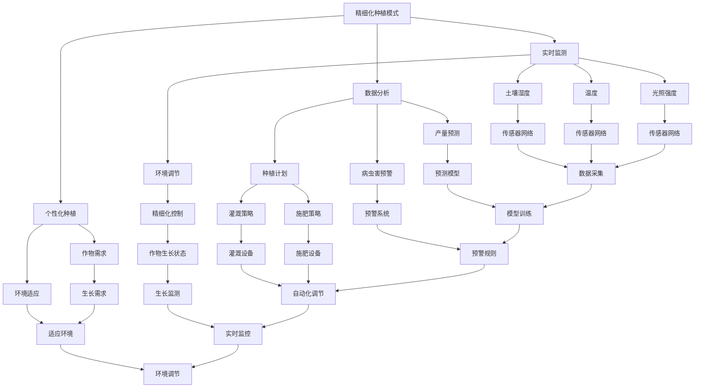
```mermaid
graph TB
    A[精细化种植模式] --> B[实时监测]
    A --> C[数据分析]
    B --> D[环境调节]
    C --> E[种植计划]
    D --> F[精细化控制]
    A --> G[个性化种植]
    B --> H[土壤湿度]
    B --> I[温度]
    B --> J[光照强度]
    C --> K[产量预测]
    C --> L[病虫害预警]
    E --> M[灌溉策略]
    E --> N[施肥策略]
    F --> O[作物生长状态]
    G --> P[作物需求]
    G --> Q[环境适应]
    H --> R[传感器网络]
    I --> S[传感器网络]
    J --> T[传感器网络]
    K --> U[预测模型]
    L --> V[预警系统]
    M --> W[灌溉设备]
    N --> X[施肥设备]
    O --> Y[生长监测]
    P --> Z[生长需求]
    Q --> AA[适应环境]
    R --> BB[数据采集]
    S --> BB
    T --> BB
    U --> CC[模型训练]
    V --> DD[预警规则]
    W --> EE[自动化调节]
    X --> EE
    Y --> FF[实时监控]
    Z --> AA
    AA --> GG[环境调节]
    BB --> CC
    CC --> DD
    DD --> EE
    EE --> FF
    FF --> GG
```

在这个流程图中，智能温室的运营模式通过实时监测、数据分析、环境调节和个性化种植，实现精细化、智能化和绿色化运营。

###### 4.1.1 智能温室的运营管理理念

智能温室的运营管理理念主要体现在以下几个方面：

1. **精细化**：通过实时监测和数据分析，对温室内部的环境参数进行精细化管理，如土壤湿度、温度、光照强度等。根据不同作物的需求，制定个性化的种植方案，实现作物的最佳生长状态。

2. **智能化**：利用物联网和人工智能技术，实现对温室环境参数的实时监测和自动化调节。通过智能化的管理系统，实现生产过程的自动化和智能化，提高生产效率和降低运营成本。

3. **绿色化**：通过减少农药和化肥的使用，降低对环境的影响。采用有机肥料和生物防治技术，提高农产品的品质和安全。通过绿色化的运营模式，实现农业生产的可持续发展。

**核心算法原理讲解：**

智能温室的运营管理理念依赖于数据采集、数据分析、环境调节和个性化种植等技术。

1. **数据采集**：通过传感器网络实时采集温室内部的环境参数，如土壤湿度、温度、光照强度等。

2. **数据分析**：利用数据分析技术，对采集到的数据进行分析和处理，提取有用的信息，如作物生长状态、产量预测、病虫害预警等。

3. **环境调节**：根据数据分析结果，通过自动化调节设备，实时调节温室内部的环境参数，实现精细化控制。

4. **个性化种植**：根据不同作物的需求和生长环境，制定个性化的种植方案，实现作物的最佳生长状态。

**数学模型和公式：**

在智能温室的运营管理中，常用的数学模型包括回归分析、决策树、神经网络等。

1. **回归分析**：用于建立环境参数与作物生长状态之间的关系模型，如线性回归、多项式回归等。

2. **决策树**：用于分类和回归问题，通过树形结构表示决策规则。

3. **神经网络**：用于模拟生物神经网络，实现对复杂系统的学习和预测。

**举例说明：**

假设我们需要预测温室内部的温度，可以使用以下数学模型：

$$
\text{温度} = f(\text{湿度}, \text{光照强度}, \text{风速})
$$

通过训练模型，我们可以得到温度的预测值，从而实现对温室温度的实时监测和预测。

###### 4.1.2 智能温室的运营管理模式

智能温室的运营管理模式主要包括以下几个方面：

1. **实时监控**：通过传感器网络和监控系统，实时监测温室内部的环境参数，如温度、湿度、光照强度等。

2. **数据分析**：对实时监测到的环境参数进行分析和处理，提取有用的信息，如作物生长状态、产量预测、病虫害预警等。

3. **环境调节**：根据数据分析结果，通过自动化调节设备，实时调节温室内部的环境参数，实现精细化控制。

4. **个性化种植**：根据不同作物的需求和生长环境，制定个性化的种植方案，实现作物的最佳生长状态。

5. **数据管理**：建立数据管理系统，对采集到的环境参数和作物生长数据进行存储、处理和分析，为决策提供支持。

**核心算法原理讲解：**

智能温室的运营管理模式依赖于数据采集、数据分析、环境调节和数据管理等技术。

1. **数据采集**：通过传感器网络实时采集温室内部的环境参数。

2. **数据分析**：利用数据分析技术，对采集到的数据进行分析和处理，提取有用的信息。

3. **环境调节**：根据数据分析结果，通过自动化调节设备，实时调节温室内部的环境参数。

4. **个性化种植**：根据不同作物的需求和生长环境，制定个性化的种植方案。

5. **数据管理**：建立数据管理系统，对采集到的数据进行分析和处理，为决策提供支持。

**数学模型和公式：**

在智能温室的运营管理模式中，常用的数学模型包括回归分析、决策树、神经网络等。

1. **回归分析**：用于建立环境参数与作物生长状态之间的关系模型。

2. **决策树**：用于分类和回归问题，通过树形结构表示决策规则。

3. **神经网络**：用于模拟生物神经网络，实现对复杂系统的学习和预测。

**举例说明：**

假设我们需要预测温室内部的温度，可以使用以下数学模型：

$$
\text{温度} = f(\text{湿度}, \text{光照强度}, \text{风速})
$$

通过训练模型，我们可以得到温度的预测值，从而实现对温室温度的实时监测和预测。

##### 4.2 智能温室的监控系统

智能温室的监控系统是智能温室运营的核心，负责环境数据的实时监测和控制。监控系统包括传感器网络、数据采集与处理系统、环境控制系统和用户界面等部分。

###### 4.2.1 智能温室监控系统的工作原理

智能温室监控系统的工作原理如下：

1. **数据采集**：传感器网络实时采集温室内部的环境参数，如温度、湿度、光照强度、二氧化碳浓度等。

2. **数据传输**：采集到的数据通过无线网络或有线网络传输到数据采集与处理系统。

3. **数据处理**：数据采集与处理系统对采集到的数据进行分析和处理，提取有用的信息，如温度、湿度、光照强度等。

4. **环境控制**：根据数据处理结果，环境控制系统自动调节温室内部的环境参数，如温度、湿度、光照强度等。

5. **用户界面**：用户界面显示温室内部的环境参数和监控信息，用户可以通过用户界面实时监控和调整温室环境。

**核心算法原理讲解：**

智能温室监控系统的核心算法原理包括数据采集、数据处理、环境控制和用户界面。

1. **数据采集**：传感器网络采用无线传感器网络（WSN）技术，实时采集温室内部的环境参数。

2. **数据处理**：数据采集与处理系统采用数据分析技术，对采集到的数据进行分析和处理，提取有用的信息。

3. **环境控制**：环境控制系统采用自动化控制技术，根据数据处理结果自动调节温室内部的环境参数。

4. **用户界面**：用户界面采用图形用户界面（GUI）技术，显示温室内部的环境参数和监控信息，用户可以通过用户界面实时监控和调整温室环境。

**数学模型和公式：**

在智能温室监控系统中，常用的数学模型包括回归分析、决策树、神经网络等。

1. **回归分析**：用于建立环境参数与作物生长状态之间的关系模型。

2. **决策树**：用于分类和回归问题，通过树形结构表示决策规则。

3. **神经网络**：用于模拟生物神经网络，实现对复杂系统的学习和预测。

**举例说明：**

假设我们需要预测温室内部的温度，可以使用以下数学模型：

$$
\text{温度} = f(\text{湿度}, \text{光照强度}, \text{风速})
$$

通过训练模型，我们可以得到温度的预测值，从而实现对温室温度的实时监测和预测。

###### 4.2.2 智能温室监控系统的应用案例

智能温室监控系统的应用案例包括：

1. **温室环境监控**：通过传感器网络实时监测温室内部的温度、湿度、光照强度等环境参数，确保作物生长的最佳环境。

2. **病虫害预警**：通过传感器网络实时监测作物的生长状态，及时发现病虫害情况，发出警报，采取相应的防治措施。

3. **智能灌溉**：根据土壤湿度传感器监测数据，自动调节灌溉设备的灌溉量和灌溉时间，实现精准灌溉，提高水资源利用效率。

4. **智能施肥**：根据土壤养分传感器监测数据，自动调节施肥设备的施肥量和施肥时间，实现精准施肥，提高肥料利用效率。

**核心算法原理讲解：**

智能温室监控系统的应用案例依赖于数据采集、数据处理、环境控制和用户界面等技术。

1. **数据采集**：传感器网络实时采集温室内部的环境参数。

2. **数据处理**：数据采集与处理系统对采集到的数据进行分析和处理，提取有用的信息。

3. **环境控制**：环境控制系统根据数据处理结果自动调节温室内部的环境参数。

4. **用户界面**：用户界面显示温室内部的环境参数和监控信息，用户可以通过用户界面实时监控和调整温室环境。

**数学模型和公式：**

在智能温室监控系统的应用案例中，常用的数学模型包括回归分析、决策树、神经网络等。

1. **回归分析**：用于建立环境参数与作物生长状态之间的关系模型。

2. **决策树**：用于分类和回归问题，通过树形结构表示决策规则。

3. **神经网络**：用于模拟生物神经网络，实现对复杂系统的学习和预测。

**举例说明：**

假设我们需要预测温室内部的温度，可以使用以下数学模型：

$$
\text{温度} = f(\text{湿度}, \text{光照强度}, \text{风速})
$$

通过训练模型，我们可以得到温度的预测值，从而实现对温室温度的实时监测和预测。

##### 4.3 智能温室的环境控制技术

智能温室的环境控制技术是实现高效、可持续农业生产的关键。环境控制技术主要包括温度控制、湿度控制和光照控制等。

###### 4.3.1 智能温室的温度控制

智能温室的温度控制通过传感器网络和自动化控制系统实现。传感器网络实时监测温室内部的温度，自动化控制系统根据监测数据自动调节加热和冷却设备，保持温室内部温度的稳定。

**核心算法原理讲解：**

智能温室的温度控制依赖于PID控制算法和神经网络。

1. **PID控制算法**：通过比例、积分和微分作用，实现对温度的精确控制。

2. **神经网络**：用于模拟生物神经网络，实现对复杂系统的学习和预测。

**数学模型和公式：**

在智能温室的温度控制中，常用的数学模型包括PID控制模型和神经网络模型。

1. **PID控制模型**：
   $$
   \text{输出} = K_p (\text{目标温度} - \text{当前温度}) + K_i (\text{目标温度} - \text{当前温度})_{\text{累积误差}} + K_d (\text{目标温度} - \text{当前温度})_{\text{变化率}}
   $$
   其中，$K_p$、$K_i$ 和 $K_d$ 分别是比例、积分和微分系数。

2. **神经网络模型**：
   $$
   \text{输出} = \text{输入} \cdot \text{权重} + \text{偏置}
   $$
   其中，输入是温度传感器监测数据，权重是神经网络的连接权重，偏置是神经网络的偏置项。

**举例说明：**

假设我们需要控制温室内部温度在25℃左右，当前温度为23℃，设置比例系数 $K_p = 0.5$，积分系数 $K_i = 0.1$，微分系数 $K_d = 0.1$。代入PID控制模型，得到温度调节量为：

$$
\text{温度调节量} = 0.5 \cdot (25 - 23) + 0.1 \cdot (25 - 23)_{\text{累积误差}} + 0.1 \cdot (25 - 23)_{\text{变化率}} = 1.0
$$

因此，加热系统需要增加1.0单位的加热量，以使温度达到目标值。

###### 4.3.2 智能温室的湿度控制

智能温室的湿度控制通过传感器网络和自动化控制系统实现。传感器网络实时监测温室内部的湿度，自动化控制系统根据监测数据自动调节加湿和除湿设备，保持温室内部湿度的稳定。

**核心算法原理讲解：**

智能温室的湿度控制依赖于模糊控制算法和PID控制算法。

1. **模糊控制算法**：通过模糊逻辑和模糊规则，实现对复杂系统的控制。

2. **PID控制算法**：通过比例、积分和微分作用，实现对湿度的精确控制。

**数学模型和公式：**

在智能温室的湿度控制中，常用的数学模型包括模糊控制模型和PID控制模型。

1. **模糊控制模型**：
   $$
   \text{加湿量} = \text{模糊规则} \cdot \text{湿度偏差}
   $$
   其中，模糊规则是根据湿度偏差和目标湿度制定的。

2. **PID控制模型**：
   $$
   \text{输出} = K_p (\text{目标湿度} - \text{当前湿度}) + K_i (\text{目标湿度} - \text{当前湿度})_{\text{累积误差}} + K_d (\text{目标湿度} - \text{当前湿度})_{\text{变化率}}
   $$
   其中，$K_p$、$K_i$ 和 $K_d$ 分别是比例、积分和微分系数。

**举例说明：**

假设我们需要控制温室内部湿度在60%左右，当前湿度为55%，设置比例系数 $K_p = 0.5$，积分系数 $K_i = 0.1$，微分系数 $K_d = 0.1$。代入PID控制模型，得到湿度调节量为：

$$
\text{湿度调节量} = 0.5 \cdot (60 - 55) + 0.1 \cdot (60 - 55)_{\text{累积误差}} + 0.1 \cdot (60 - 55)_{\text{变化率}} = 1.0
$$

因此，加湿系统需要增加1.0单位的加湿量，以使湿度达到目标值。

###### 4.3.3 智能温室的光照控制

智能温室的光照控制通过传感器网络和自动化控制系统实现。传感器网络实时监测温室内部的光照强度，自动化控制系统根据监测数据自动调节LED灯光系统，保持温室内部光照的稳定。

**核心算法原理讲解：**

智能温室的光照控制依赖于光谱分析算法和PID控制算法。

1. **光谱分析算法**：通过分析光照强度的光谱分布，确定最适合作物生长的光谱范围。

2. **PID控制算法**：通过比例、积分和微分作用，实现对光照强度的精确控制。

**数学模型和公式：**

在智能温室的光照控制中，常用的数学模型包括光谱分析模型和PID控制模型。

1. **光谱分析模型**：
   $$
   \text{光谱分布} = f(\text{光照强度})
   $$
   其中，光谱分布是光照强度的分布函数。

2. **PID控制模型**：
   $$
   \text{输出} = K_p (\text{目标光照强度} - \text{当前光照强度}) + K_i (\text{目标光照强度} - \text{当前光照强度})_{\text{累积误差}} + K_d (\text{目标光照强度} - \text{当前光照强度})_{\text{变化率}}
   $$
   其中，$K_p$、$K_i$ 和 $K_d$ 分别是比例、积分和微分系数。

**举例说明：**

假设我们需要控制温室内部光照强度在1000勒克斯左右，当前光照强度为800勒克斯，设置比例系数 $K_p = 0.5$，积分系数 $K_i = 0.1$，微分系数 $K_d = 0.1$。代入PID控制模型，得到光照调节量为：

$$
\text{光照调节量} = 0.5 \cdot (1000 - 800) + 0.1 \cdot (1000 - 800)_{\text{累积误差}} + 0.1 \cdot (1000 - 800)_{\text{变化率}} = 2.0
$$

因此，LED灯光系统需要增加2.0单位的光照强度，以使光照强度达到目标值。

### 第四部分：智慧农业的经济效益分析

#### 第5章：智慧农业的经济效益分析

智慧农业通过引入物联网、人工智能、大数据等先进技术，实现了农业生产的高效、绿色和可持续发展。本节将深入分析智慧农业的经济效益，包括成本效益分析、市场需求分析和社会影响。

##### 5.1 智慧农业的成本效益分析

智慧农业的成本效益分析主要包括初始投资和长期效益两个方面。

###### 5.1.1 智慧农业的初始投资分析

智慧农业的初始投资主要包括以下几部分：

1. **硬件投资**：包括传感器、自动化设备、温室建设等。这些硬件设备是实现智慧农业的基础，需要一定的资金投入。

2. **软件投资**：包括物联网平台、大数据分析系统、人工智能算法等。这些软件系统是实现智慧农业智能化的关键，同样需要资金投入。

3. **人力投资**：包括技术人员、管理人员等。智慧农业的运营和管理需要专业人才，需要投入人力成本。

4. **维护费用**：包括设备维护、系统升级等。随着智慧农业的发展，设备和系统需要定期维护和升级，也需要投入一定的资金。

通过对比传统农业和智慧农业的初始投资，可以发现智慧农业的初始投资相对较高。然而，随着技术的成熟和成本的降低，智慧农业的初始投资也在逐渐降低。

###### 5.1.2 智慧农业的长期效益分析

智慧农业的长期效益体现在以下几个方面：

1. **提高产量**：智慧农业通过精准种植、精准施肥和病虫害监测等手段，提高了农作物的产量。根据研究，智慧农业可以显著提高农作物产量，有时甚至可以达到传统农业的两倍以上。

2. **降低成本**：智慧农业通过自动化和智能化管理，减少了人工干预，降低了劳动力成本。同时，智慧农业通过优化资源利用，降低了水资源、农药和化肥的使用成本。

3. **提高产品质量**：智慧农业通过精准控制环境参数，提高了农产品的品质。优质农产品在市场上具有更高的竞争力，可以带来更高的经济效益。

4. **减少环境负担**：智慧农业通过减少农药和化肥的使用，降低了环境污染。此外，智慧农业通过节水技术和废物利用技术，实现了绿色生产，对环境保护起到了积极作用。

**核心概念与联系：**

智慧农业的成本效益分析涉及初始投资和长期效益，通过对比分析可以得出智慧农业的性价比优势。智慧农业的长期效益主要体现在提高产量、降低成本、提高产品质量和减少环境负担等方面。

**Mermaid流程图：**

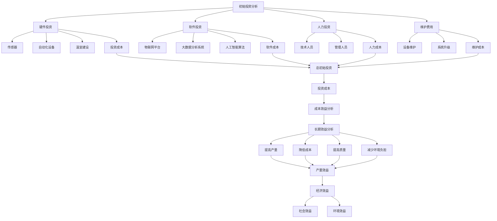
```mermaid
graph TB
    A[初始投资分析] --> B[硬件投资]
    A --> C[软件投资]
    A --> D[人力投资]
    A --> E[维护费用]
    B --> F[传感器]
    B --> G[自动化设备]
    B --> H[温室建设]
    C --> I[物联网平台]
    C --> J[大数据分析系统]
    C --> K[人工智能算法]
    D --> L[技术人员]
    D --> M[管理人员]
    E --> N[设备维护]
    E --> O[系统升级]
    B --> P[投资成本]
    C --> Q[软件成本]
    D --> R[人力成本]
    E --> S[维护成本]
    P --> T[总初始投资]
    Q --> T
    R --> T
    S --> T
    T --> U[投资成本]
    U --> V[成本效益分析]
    V --> W[长期效益分析]
    W --> X[提高产量]
    W --> Y[降低成本]
    W --> Z[提高质量]
    W --> AA[减少环境负担]
    X --> BB[产量效益]
    Y --> BB
    Z --> BB
    AA --> BB
    BB --> CC[经济效益]
    CC --> DD[社会效益]
    CC --> EE[环境效益]
```

在这个流程图中，智慧农业的成本效益分析通过初始投资和长期效益的对比，得出智慧农业的性价比优势和长期效益，包括提高产量、降低成本、提高产品质量和减少环境负担等方面。

##### 5.2 智慧农业的市场需求分析

智慧农业的市场需求分析包括市场前景、市场潜力、影响因素和市场竞争等方面。

###### 5.2.1 智慧农业的市场前景

智慧农业的市场前景广阔，主要表现在以下几个方面：

1. **人口增长**：随着全球人口的持续增长，对农产品的需求不断上升。智慧农业通过提高生产效率，能够满足日益增长的人口需求。

2. **气候变化**：气候变化导致极端天气频发，传统农业难以适应。智慧农业通过精准控制和智能化管理，能够提高农作物的抗风险能力，适应气候变化的挑战。

3. **食品安全**：消费者对食品质量和安全的要求越来越高。智慧农业通过提高农产品的品质和安全，满足了消费者对高质量农产品的需求。

4. **环保意识**：随着环保意识的增强，消费者对绿色、可持续的农业生产模式越来越重视。智慧农业通过减少农药和化肥的使用，实现了绿色生产，符合环保要求。

###### 5.2.2 智慧农业的市场潜力

智慧农业的市场潜力巨大，主要表现在以下几个方面：

1. **技术创新**：随着物联网、人工智能、大数据等技术的不断发展，智慧农业的技术水平不断提高，为市场提供了更多可能性。

2. **产业链整合**：智慧农业可以通过整合农业产业链的各个环节，实现资源的高效利用和协同发展，提高整体市场竞争力。

3. **区域发展**：智慧农业在不同地区的市场需求不同，一些经济发达地区对智慧农业的需求更为迫切，市场潜力巨大。

4. **政策支持**：各国政府纷纷出台支持智慧农业的政策，为智慧农业的发展提供了政策保障，市场潜力进一步释放。

###### 5.2.3 影响因素

智慧农业的市场需求受到多种因素的影响，主要包括以下几个方面：

1. **技术成熟度**：智慧农业的发展依赖于技术的成熟度，如物联网技术、人工智能技术、大数据技术的成熟程度。

2. **成本价格**：智慧农业的初始投资较高，成本价格对市场需求有重要影响。随着成本的降低，智慧农业的市场需求将进一步扩大。

3. **政策支持**：政府政策的支持对智慧农业的市场需求有重要影响。政府出台的支持政策，如财政补贴、税收优惠等，将促进智慧农业的发展。

4. **市场竞争**：市场竞争也是影响智慧农业市场需求的重要因素。随着市场竞争的加剧，智慧农业企业需要不断创新和提高产品质量，以赢得市场份额。

**核心概念与联系：**

智慧农业的市场需求分析涉及市场前景、市场潜力、影响因素和市场竞争等方面，通过分析可以得出智慧农业市场的广阔前景和巨大潜力。

**Mermaid流程图：**

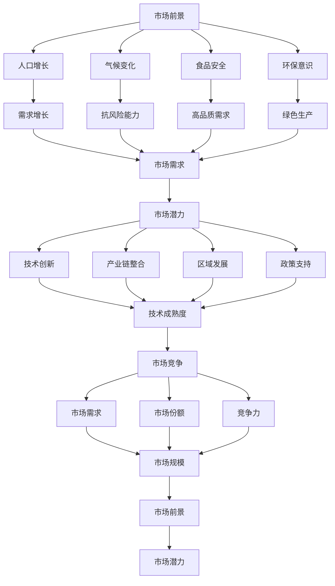
```mermaid
graph TB
    A[市场前景] --> B[人口增长]
    A --> C[气候变化]
    A --> D[食品安全]
    A --> E[环保意识]
    B --> F[需求增长]
    C --> G[抗风险能力]
    D --> H[高品质需求]
    E --> I[绿色生产]
    F --> J[市场需求]
    G --> J
    H --> J
    I --> J
    J --> K[市场潜力]
    K --> L[技术创新]
    K --> M[产业链整合]
    K --> N[区域发展]
    K --> O[政策支持]
    L --> P[技术成熟度]
    M --> P
    N --> P
    O --> P
    P --> Q[市场竞争]
    Q --> R[市场需求]
    Q --> S[市场份额]
    Q --> T[竞争力]
    R --> U[市场规模]
    S --> U
    T --> U
    U --> V[市场前景]
    V --> W[市场潜力]
```

在这个流程图中，智慧农业的市场需求分析通过市场前景、市场潜力、影响因素和市场竞争等方面，得出智慧农业市场的广阔前景和巨大潜力。

##### 5.3 智慧农业的社会影响

智慧农业的社会影响体现在多个方面，包括农业生产效率、环境保护、农村发展和食品安全等方面。

###### 5.3.1 智慧农业对农业生产效率的影响

智慧农业通过精准种植、精准施肥、病虫害监测和智能管理，显著提高了农业生产效率。具体表现在以下几个方面：

1. **提高产量**：智慧农业通过优化种植和管理，提高了农作物的产量，有时可以达到传统农业的两倍以上。

2. **降低成本**：智慧农业通过自动化和智能化管理，减少了人工干预，降低了劳动力成本。同时，智慧农业通过优化资源利用，降低了水资源、农药和化肥的使用成本。

3. **提高质量**：智慧农业通过精准控制环境参数，提高了农产品的品质。优质农产品在市场上具有更高的竞争力，可以带来更高的经济效益。

4. **降低风险**：智慧农业通过实时监测和智能管理，提高了农作物的抗风险能力，减少了因自然灾害和病虫害导致的损失。

**核心概念与联系：**

智慧农业对农业生产效率的影响主要体现在提高产量、降低成本、提高质量和降低风险等方面。通过智能技术，智慧农业实现了农业生产的精准化和高效化。

**Mermaid流程图：**

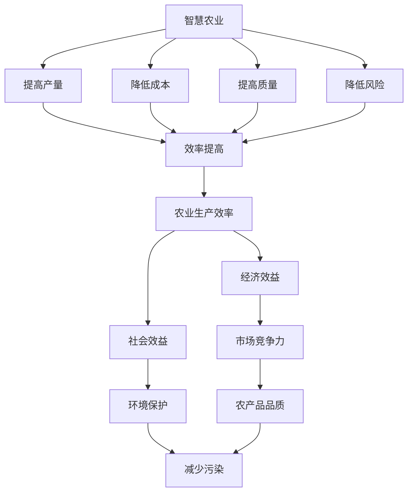
```mermaid
graph TB
    A[智慧农业] --> B[提高产量]
    A --> C[降低成本]
    A --> D[提高质量]
    A --> E[降低风险]
    B --> F[效率提高]
    C --> F
    D --> F
    E --> F
    F --> G[农业生产效率]
    G --> H[经济效益]
    G --> I[社会效益]
    H --> J[市场竞争力]
    I --> K[环境保护]
    J --> L[农产品品质]
    K --> M[减少污染]
    L --> M
```

在这个流程图中，智慧农业对农业生产效率的影响通过提高产量、降低成本、提高质量和降低风险，实现了农业生产的高效化、市场化和社会化。

###### 5.3.2 智慧农业对环境保护的影响

智慧农业对环境保护起到了积极作用，主要体现在以下几个方面：

1. **减少农药使用**：智慧农业通过精准施肥和病虫害监测，减少了农药的使用。农药的减少降低了农药对环境的污染，对生态系统具有保护作用。

2. **减少化肥使用**：智慧农业通过优化施肥策略，减少了化肥的使用。化肥的减少降低了化肥对土壤和水体的污染，对环境保护具有重要作用。

3. **水资源节约**：智慧农业通过精准灌溉和节水技术，节约了水资源。水资源的节约降低了水资源的消耗，对水资源短缺地区的环境保护具有积极意义。

4. **废物利用**：智慧农业通过废物利用技术，实现了农业废弃物的资源化利用。农业废弃物的资源化利用减少了废弃物的排放，对环境保护起到了积极作用。

**核心概念与联系：**

智慧农业对环境保护的影响主要体现在减少农药使用、减少化肥使用、水资源节约和废物利用等方面。通过绿色生产技术，智慧农业实现了农业生产的可持续发展。

**Mermaid流程图：**

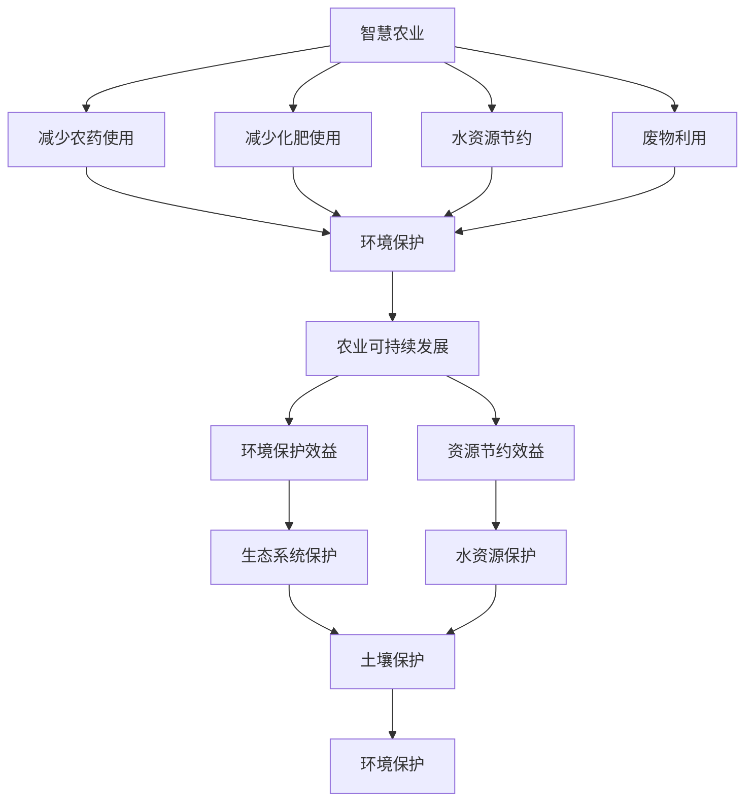
```mermaid
graph TB
    A[智慧农业] --> B[减少农药使用]
    A --> C[减少化肥使用]
    A --> D[水资源节约]
    A --> E[废物利用]
    B --> F[环境保护]
    C --> F
    D --> F
    E --> F
    F --> G[农业可持续发展]
    G --> H[环境保护效益]
    G --> I[资源节约效益]
    H --> J[生态系统保护]
    I --> K[水资源保护]
    J --> L[土壤保护]
    K --> L
    L --> M[环境保护]
```

在这个流程图中，智慧农业对环境保护的影响通过减少农药使用、减少化肥使用、水资源节约和废物利用，实现了农业生产的可持续发展，对环境保护具有显著效益。

##### 5.4 智慧农业的政策与法规

智慧农业的发展离不开政策的支持和法规的规范。各国政府纷纷出台政策，支持智慧农业的发展。以下是几个主要国家和地区的政策与法规：

1. **美国**：美国农业部（USDA）发布了《智慧农业行动计划》，旨在推动智慧农业技术的发展和应用。该计划包括提供资金支持、技术培训和科研合作等。

2. **欧盟**：欧盟委员会发布了《农业2030战略》，强调智慧农业和可持续农业的发展。该战略提出了加大对智慧农业的投资、促进技术创新和加强国际合作等政策。

3. **中国**：中国政府发布了《数字农业农村发展规划（2019-2020年）》，明确提出要加快智慧农业的发展。该规划包括加强农业物联网应用、推广农业大数据技术和推动智慧农业园区建设等。

4. **日本**：日本政府发布了《智慧农业推进计划》，旨在通过技术创新和产业合作，提高农业生产的效率和质量。该计划包括推动垂直农业和智能温室的发展、促进农业物联网的应用和加强农业人才培养等。

**核心概念与联系：**

智慧农业的政策与法规涉及各国政府出台的支持智慧农业发展的政策措施。这些政策与法规为智慧农业的发展提供了政策保障，促进了技术创新和产业合作。

**Mermaid流程图：**

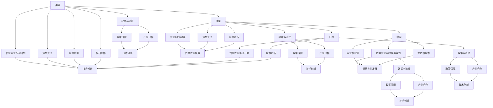
```mermaid
graph TB
    A[美国] --> B[智慧农业行动计划]
    A --> C[资金支持]
    A --> D[技术培训]
    A --> E[科研合作]
    B --> F[技术创新]
    C --> F
    D --> F
    E --> F
    A --> G[政策与法规]
    G --> H[政策保障]
    G --> I[产业合作]
    H --> J[技术创新]
    I --> J
    A --> K[欧盟]
    K --> L[农业2030战略]
    K --> M[资金支持]
    K --> N[技术创新]
    L --> O[智慧农业发展]
    M --> O
    N --> O
    K --> P[政策与法规]
    P --> Q[政策保障]
    P --> R[产业合作]
    Q --> S[技术创新]
    R --> S
    K --> T[中国]
    T --> U[数字农业农村发展规划]
    T --> V[农业物联网]
    T --> W[大数据技术]
    U --> X[智慧农业发展]
    V --> X
    W --> X
    U --> Y[政策与法规]
    Y --> Z[政策保障]
    Y --> AA[产业合作]
    Z --> BB[技术创新]
    AA --> BB
    K --> CC[日本]
    CC --> DD[智慧农业推进计划]
    CC --> EE[技术创新]
    DD --> F[技术创新]
    EE --> F
    CC --> GG[政策与法规]
    GG --> HH[政策保障]
    GG --> II[产业合作]
    HH --> JJ[技术创新]
    II --> JJ
```

在这个流程图中，智慧农业的政策与法规涉及美国、欧盟、中国和日本等国家的政策措施，为智慧农业的发展提供了政策保障和产业合作机会，促进了技术创新。

### 第五部分：智慧农业的政策与法规

#### 第6章：智慧农业的政策与法规

智慧农业的发展离不开政策的支持和法规的规范。各国政府纷纷出台政策，支持智慧农业的发展。本节将详细探讨智慧农业的政策环境、法规体系和知识产权保护。

##### 6.1 智慧农业的政策环境

智慧农业的政策环境是指各国政府为了推动智慧农业发展而制定的一系列政策措施。这些政策包括财政支持、科技创新支持、人才培养、国际合作等。

###### 6.1.1 各国智慧农业政策的比较

- **美国**：美国政府通过农业部的《智慧农业行动计划》支持智慧农业的发展。该计划提供了资金支持、技术培训和科研合作等。此外，美国还通过《农业法案》和《农村发展法案》为智慧农业提供政策保障。
- **欧盟**：欧盟委员会发布的《农业2030战略》强调了智慧农业和可持续农业的发展。该战略提出了加大对智慧农业的投资、促进技术创新和加强国际合作等政策。
- **中国**：中国政府发布的《数字农业农村发展规划（2019-2020年）》明确提出要加快智慧农业的发展。该规划包括加强农业物联网应用、推广农业大数据技术和推动智慧农业园区建设等。
- **日本**：日本政府发布的《智慧农业推进计划》旨在通过技术创新和产业合作，提高农业生产的效率和质量。该计划包括推动垂直农业和智能温室的发展、促进农业物联网的应用和加强农业人才培养等。

各国智慧农业政策的比较表明，政府支持智慧农业的发展已经成为全球共识。政策内容主要包括资金支持、技术创新支持、人才培养和国际合作等方面。

**核心概念与联系：**

智慧农业的政策环境涉及各国政府为推动智慧农业发展所制定的政策措施。这些政策措施通过财政支持、科技创新支持、人才培养和国际合作等途径，为智慧农业的发展提供了政策保障。

**Mermaid流程图：**

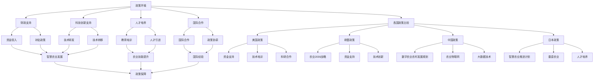
```mermaid
graph TB
    A[政策环境] --> B[财政支持]
    A --> C[科技创新支持]
    A --> D[人才培养]
    A --> E[国际合作]
    B --> F[资金投入]
    B --> G[补贴政策]
    C --> H[技术研发]
    C --> I[技术转移]
    D --> J[教育培训]
    D --> K[人才引进]
    E --> L[国际合作]
    E --> M[政策协调]
    F --> N[智慧农业发展]
    G --> N
    H --> N
    I --> N
    J --> O[农业技能提升]
    K --> O
    L --> P[国际经验]
    M --> P
    N --> Q[政策保障]
    O --> Q
    P --> Q
    A --> R[各国政策比较]
    R --> S[美国政策]
    R --> T[欧盟政策]
    R --> U[中国政策]
    R --> V[日本政策]
    S --> W[资金支持]
    S --> X[技术培训]
    S --> Y[科研合作]
    T --> Z[农业2030战略]
    T --> AA[资金支持]
    T --> BB[技术创新]
    U --> CC[数字农业农村发展规划]
    U --> DD[农业物联网]
    U --> EE[大数据技术]
    V --> FF[智慧农业推进计划]
    V --> GG[垂直农业]
    V --> HH[人才培养]
```

在这个流程图中，智慧农业的政策环境通过财政支持、科技创新支持、人才培养和国际合作等途径，为智慧农业的发展提供了政策保障，并展示了各国政策的比较。

###### 6.1.2 中国智慧农业的政策支持

中国智慧农业的政策支持主要体现在以下几个方面：

1. **资金支持**：中国政府通过专项资金和财政补贴，支持智慧农业项目的研发和推广。例如，中央财政设立“农业科技创新项目”，提供资金支持智慧农业技术的研发和示范。

2. **科技创新支持**：中国政府通过政策引导，鼓励企业和科研机构进行智慧农业技术创新。例如，中国农业科学院设立了“智慧农业研究中心”，推动智慧农业技术的研发和应用。

3. **人才培养**：中国政府通过教育和培训，培养智慧农业专业人才。例如，一些高校开设了智慧农业相关专业，培养智慧农业领域的人才。

4. **政策协调**：中国政府通过政策协调，推动智慧农业产业链的协同发展。例如，农业部、科技部、教育部等相关部门联合发布政策，推动智慧农业的发展。

**核心概念与联系：**

中国智慧农业的政策支持涉及资金支持、科技创新支持、人才培养和政策协调等方面。这些政策措施通过财政支持、技术创新支持、人才培养和政策协调等途径，为智慧农业的发展提供了政策保障。

**Mermaid流程图：**

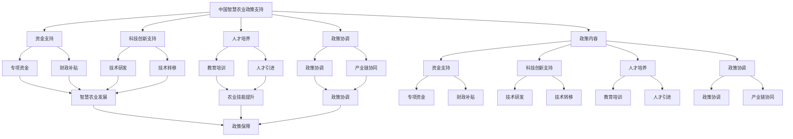
```mermaid
graph TB
    A[中国智慧农业政策支持] --> B[资金支持]
    A --> C[科技创新支持]
    A --> D[人才培养]
    A --> E[政策协调]
    B --> F[专项资金]
    B --> G[财政补贴]
    C --> H[技术研发]
    C --> I[技术转移]
    D --> J[教育培训]
    D --> K[人才引进]
    E --> L[政策协调]
    E --> M[产业链协同]
    F --> N[智慧农业发展]
    G --> N
    H --> N
    I --> N
    J --> O[农业技能提升]
    K --> O
    L --> P[政策协调]
    M --> P
    N --> Q[政策保障]
    O --> Q
    P --> Q
    A --> R[政策内容]
    R --> S[资金支持]
    R --> T[科技创新支持]
    R --> U[人才培养]
    R --> V[政策协调]
    S --> W[专项资金]
    S --> X[财政补贴]
    T --> Y[技术研发]
    T --> Z[技术转移]
    U --> AA[教育培训]
    U --> BB[人才引进]
    V --> CC[政策协调]
    V --> DD[产业链协同]
```

在这个流程图中，中国智慧农业的政策支持通过资金支持、科技创新支持、人才培养和政策协调等途径，为智慧农业的发展提供了政策保障。

##### 6.2 智慧农业的法规体系

智慧农业的法规体系是保障智慧农业健康发展的重要基础。它包括农业法规、环保法规、信息技术法规等方面的内容。

###### 6.2.1 智慧农业的法律法规体系

智慧农业的法律法规体系主要包括以下几个方面：

1. **农业法规**：涉及农业生产的各个方面，如《种子法》、《农药法》、《农产品质量安全法》等。这些法规规范了农业生产的行为，保障了农产品的质量和安全。

2. **环保法规**：涉及环境保护和资源利用，如《环境保护法》、《水资源法》、《土壤污染防治法》等。这些法规规定了环境保护的标准和措施，保障了农业生产的可持续发展。

3. **信息技术法规**：涉及信息技术和数据安全，如《网络安全法》、《数据安全法》、《个人信息保护法》等。这些法规规范了信息技术应用的行为，保障了数据的安全和隐私。

**核心概念与联系：**

智慧农业的法律法规体系涉及农业法规、环保法规和信息技术法规等多个方面。这些法规通过规范农业生产行为、保障环境保护和数据安全，为智慧农业的发展提供了法律保障。

**Mermaid流程图：**

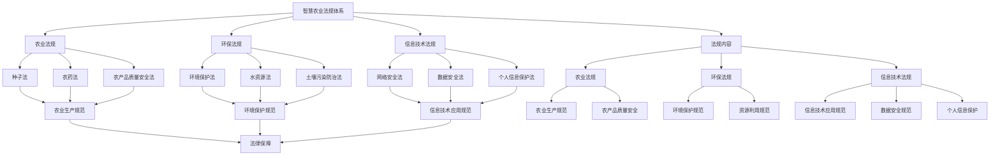
```mermaid
graph TB
    A[智慧农业法规体系] --> B[农业法规]
    A --> C[环保法规]
    A --> D[信息技术法规]
    B --> E[种子法]
    B --> F[农药法]
    B --> G[农产品质量安全法]
    C --> H[环境保护法]
    C --> I[水资源法]
    C --> J[土壤污染防治法]
    D --> K[网络安全法]
    D --> L[数据安全法]
    D --> M[个人信息保护法]
    E --> N[农业生产规范]
    F --> N
    G --> N
    H --> O[环境保护规范]
    I --> O
    J --> O
    K --> P[信息技术应用规范]
    L --> P
    M --> P
    N --> Q[法律保障]
    O --> Q
    P --> Q
    A --> R[法规内容]
    R --> S[农业法规]
    R --> T[环保法规]
    R --> U[信息技术法规]
    S --> V[农业生产规范]
    S --> W[农产品质量安全]
    T --> X[环境保护规范]
    T --> Y[资源利用规范]
    U --> Z[信息技术应用规范]
    U --> AA[数据安全规范]
    U --> BB[个人信息保护]
```

在这个流程图中，智慧农业的法律法规体系通过农业法规、环保法规和信息技术法规等方面，为智慧农业的发展提供了法律保障。

###### 6.2.2 智慧农业的标准化建设

智慧农业的标准化建设是智慧农业发展的重要保障。标准化建设包括技术标准、管理标准和产品标准等方面。

1. **技术标准**：技术标准包括农业生产技术、环境监测技术、数据采集技术等。技术标准的制定和实施，确保了智慧农业技术的统一性和兼容性。

2. **管理标准**：管理标准包括农业生产管理、环境保护管理、数据管理等方面。管理标准的制定和实施，规范了智慧农业的管理流程，提高了管理效率。

3. **产品标准**：产品标准包括农产品质量标准、农业生产设备标准等。产品标准的制定和实施，保证了农产品的质量和农业生产设备的安全性能。

**核心概念与联系：**

智慧农业的标准化建设涉及技术标准、管理标准和产品标准等方面。这些标准的制定和实施，为智慧农业的发展提供了技术和管理保障，提高了农业生产的效率和质量。

**Mermaid流程图：**

```mermaid
graph TB
    A[智慧农业标准化建设] --> B[技术标准]
    A --> C[管理标准]
    A --> D[产品标准]
    B --> E[农业生产技术]
    B --> F[环境监测技术]
    B --> G[数据采集技术]
    C --> H[农业生产管理]
    C --> I[环境保护管理]
    C --> J[数据管理]
    D --> K[农产品质量标准]
    D --> L[农业生产设备标准]
    E --> M[技术统一性]
    F --> M
    G --> M
    H --> N[管理规范性]
    I --> N
    J --> N
    K --> O[产品质量保障]
    L --> O
    M --> P[技术保障]
    N --> P
    O --> P
    A --> Q[标准化建设内容]
    Q --> R[技术标准]
    Q --> S[管理标准]
    Q --> T[产品标准]
    R --> U[农业生产技术]
    R --> V[环境监测技术]
    R --> W[数据采集技术]
    S --> X[农业生产管理]
    S --> Y[环境保护管理]
    S --> Z[数据管理]
    T --> AA[农产品质量标准]
    T --> BB[农业生产设备标准]
```

在这个流程图中，智慧农业的标准化建设通过技术标准、管理标准和产品标准等方面，为智慧农业的发展提供了技术和管理保障。

##### 6.3 智慧农业的知识产权保护

智慧农业的知识产权保护是保障智慧农业创新成果的重要措施。知识产权保护包括专利保护、商标保护和版权保护等方面。

###### 6.3.1 智慧农业的知识产权现状

智慧农业的知识产权现状主要体现在以下几个方面：

1. **专利申请**：智慧农业领域的专利申请数量逐年增加，涉及农业生产技术、环境监测技术、数据采集技术等领域。

2. **商标注册**：智慧农业领域的商标注册数量也呈上升趋势，涉及农业生产设备、农产品品牌等领域。

3. **版权保护**：智慧农业领域的版权保护逐渐受到重视，包括农业软件、农业数据库等方面的版权保护。

**核心概念与联系：**

智慧农业的知识产权保护涉及专利申请、商标注册和版权保护等方面。这些知识产权保护措施为智慧农业的创新成果提供了法律保障，促进了智慧农业的发展。

**Mermaid流程图：**

```mermaid
graph TB
    A[智慧农业知识产权保护] --> B[专利申请]
    A --> C[商标注册]
    A --> D[版权保护]
    B --> E[农业生产技术]
    B --> F[环境监测技术]
    B --> G[数据采集技术]
    C --> H[农业生产设备]
    C --> I[农产品品牌]
    D --> J[农业软件]
    D --> K[农业数据库]
    E --> L[技术创新]
    F --> L
    G --> L
    H --> M[市场竞争]
    I --> M
    J --> N[软件应用]
    K --> N
    L --> O[知识产权]
    M --> O
    N --> O
    A --> P[知识产权现状]
    P --> Q[专利申请]
    P --> R[商标注册]
    P --> S[版权保护]
    Q --> T[技术创新]
    Q --> U[市场竞争]
    R --> V[品牌保护]
    S --> W[软件版权]
    S --> XX[数据库版权]
```

在这个流程图中，智慧农业的知识产权保护通过专利申请、商标注册和版权保护等方面，为智慧农业的创新成果提供了法律保障。

###### 6.3.2 智慧农业的知识产权保护策略

智慧农业的知识产权保护策略包括以下几个方面：

1. **专利布局**：通过专利布局，保护企业的技术创新成果。企业可以围绕核心技术和关键技术，申请一系列相关专利，形成专利组合，提高知识产权保护能力。

2. **商标注册**：通过商标注册，保护企业的品牌形象。企业可以在国内外申请商标注册，建立品牌保护体系，提高品牌知名度和市场竞争力。

3. **版权保护**：通过版权保护，保护农业软件和农业数据库等知识产权。企业可以申请软件著作权和数据库著作权，确保软件和数据库的合法权益。

**核心概念与联系：**

智慧农业的知识产权保护策略涉及专利布局、商标注册和版权保护等方面。这些策略通过保护企业的技术创新成果、品牌形象和知识产权，促进了智慧农业的发展。

**Mermaid流程图：**

```mermaid
graph TB
    A[知识产权保护策略] --> B[专利布局]
    A --> C[商标注册]
    A --> D[版权保护]
    B --> E[技术创新成果]
    B --> F[专利组合]
    C --> G[品牌保护]
    C --> H[市场竞争]
    D --> I[软件版权]
    D --> J[数据库版权]
    E --> K[知识产权]
    F --> K
    G --> L[品牌知名度]
    H --> L
    I --> M[软件应用]
    J --> M
    K --> N[知识产权保护]
    L --> N
    M --> O[市场竞争]
    N --> O
    A --> P[策略内容]
    P --> Q[专利布局]
    P --> R[商标注册]
    P --> S[版权保护]
    Q --> T[技术创新成果]
    Q --> U[专利组合]
    R --> V[品牌保护]
    R --> W[市场竞争]
    S --> XX[软件版权]
    S --> YY[数据库版权]
```

在这个流程图中，智慧农业的知识产权保护策略通过专利布局、商标注册和版权保护等方面，为智慧农业的创新成果提供了法律保障。

### 第六部分：未来展望

#### 第7章：未来展望

随着科技的不断进步和社会的发展，智慧农业将继续迎来新的机遇和挑战。本节将对智慧农业的未来发展趋势、面临的挑战和解决方案进行探讨，并展望智慧农业的未来使命。

##### 7.1 智慧农业的发展趋势

智慧农业在未来将继续沿着以下几个趋势发展：

1. **技术融合**：物联网、人工智能、大数据等技术的融合将推动智慧农业的发展。这些技术将相互融合，共同推动农业的智能化和精准化。

2. **绿色化发展**：随着环保意识的增强，智慧农业将更加注重绿色化发展。通过减少农药和化肥的使用，提高水资源利用效率，实现农业生产的绿色化和可持续发展。

3. **智能化管理**：智能化管理将逐渐成为智慧农业的核心。通过物联网和人工智能技术，实现对农业生产过程的全面监测和管理，提高生产效率和质量。

4. **产业链整合**：智慧农业将推动农业产业链的整合。通过信息化和智能化手段，实现农业生产、加工、销售等环节的协同发展，提高产业链的整体效率。

5. **全球化发展**：智慧农业将在全球范围内得到推广和应用。随着全球化进程的加快，智慧农业技术将跨越国界，实现全球农业的协同发展。

**核心概念与联系：**

智慧农业的发展趋势涉及技术融合、绿色化发展、智能化管理、产业链整合和全球化发展等方面。这些趋势将推动智慧农业向更高效、更绿色、更智能的方向发展。

**Mermaid流程图：**

```mermaid
graph TB
    A[智慧农业发展趋势] --> B[技术融合]
    A --> C[绿色化发展]
    A --> D[智能化管理]
    A --> E[产业链整合]
    A --> F[全球化发展]
    B --> G[物联网]
    B --> H[人工智能]
    B --> I[大数据]
    C --> J[减少农药使用]
    C --> K[提高水资源利用效率]
    D --> L[全面监测]
    D --> M[生产管理]
    E --> N[产业链协同]
    E --> O[效率提高]
    F --> P[全球化推广]
    F --> Q[国际合作]
    G --> R[物联网应用]
    H --> S[人工智能应用]
    I --> T[大数据分析]
    J --> U[环保生产]
    K --> U
    L --> V[生产效率]
    M --> V
    N --> W[产业链协同]
    O --> W
    P --> X[国际合作]
    Q --> X
    R --> Y[智能监测]
    S --> Z[智能决策]
    T --> AA[数据分析]
    U --> BB[环境保护]
    V --> BB
    W --> CC[效率提高]
    X --> DD[全球农业协同]
    Y --> EE[智能管理]
    Z --> EE
    A --> F[全球化发展]
```

在这个流程图中，智慧农业的发展趋势通过技术融合、绿色化发展、智能化管理、产业链整合和全球化发展等方面，展示了智慧农业的未来发展方向。

###### 7.1.1 未来智慧农业的发展方向

未来智慧农业的发展方向将主要涉及以下几个方面：

1. **农业自动化**：随着人工智能和机器人技术的发展，农业自动化将成为未来智慧农业的重要方向。通过自动化设备，实现耕种、施肥、灌溉、收割等农业操作的自动化，减少人力成本，提高生产效率。

2. **农业智能化**：通过物联网和大数据技术，实现农业生产的智能化。利用传感器网络实时监测作物生长环境，结合数据分析，提供智能化的农业生产决策支持，提高作物产量和质量。

3. **农业数字化**：通过物联网和大数据技术，实现农业生产的数字化。通过数字化手段，收集、存储、分析和利用农业数据，实现农业生产的信息化和智能化。

4. **农业绿色化**：通过减少农药和化肥的使用，提高水资源利用效率，实现农业生产的绿色化。通过环保技术，减少农业对环境的负面影响，实现农业的可持续发展。

**核心概念与联系：**

未来智慧农业的发展方向涉及农业自动化、农业智能化、农业数字化和农业绿色化等方面。这些方向将推动智慧农业向更高效、更绿色、更智能的方向发展。

**Mermaid流程图：**

```mermaid
graph TB
    A[未来智慧农业发展方向] --> B[农业自动化]
    A --> C[农业智能化]
    A --> D[农业数字化]
    A --> E[农业绿色化]
    B --> F[自动化设备]
    B --> G[减少人力成本]
    C --> H[传感器网络]
    C --> I[数据分析]
    D --> J[物联网技术]
    D --> K[数据分析]
    E --> L[减少农药使用]
    E --> M[提高水资源利用效率]
    F --> N[机械化种植]
    F --> O[自动化灌溉]
    G --> P[生产效率]
    H --> Q[智能监测]
    I --> R[智能决策]
    J --> S[数字化生产]
    K --> R
    L --> T[环保生产]
    M --> T
    N --> U[种植效率]
    O --> V[灌溉效率]
    P --> W[成本降低]
    Q --> X[环境监控]
    R --> Y[智能管理]
    S --> Z[信息化生产]
    T --> AA[环境保护]
    U --> BB[生产效率]
    V --> BB
    W --> CC[运营成本]
    X --> DD[环境安全]
    Y --> EE[精准控制]
    Z --> EE
    A --> E[农业绿色化]
```

在这个流程图中，未来智慧农业的发展方向通过农业自动化、农业智能化、农业数字化和农业绿色化等方面，展示了智慧农业的未来发展方向。

###### 7.1.2 智慧农业的未来前景

智慧农业的未来前景充满希望，主要体现在以下几个方面：

1. **提高产量**：通过精准种植、智能管理和自动化生产，智慧农业将显著提高农作物的产量。在一些智慧农业示范区，农作物的产量已经实现了翻倍增长。

2. **降低成本**：智慧农业通过自动化和智能化管理，减少了人力成本，提高了生产效率。同时，智慧农业通过优化资源利用，降低了水资源、农药和化肥的使用成本。

3. **提高质量**：智慧农业通过精准控制和智能化管理，提高了农产品的品质。优质农产品在市场上具有更高的竞争力，能够带来更高的经济效益。

4. **减少环境负担**：智慧农业通过减少农药和化肥的使用，降低了环境污染。同时，智慧农业通过节水技术和废物利用技术，实现了绿色生产，对环境保护起到了积极作用。

**核心概念与联系：**

智慧农业的未来前景涉及提高产量、降低成本、提高质量和减少环境负担等方面。这些前景展示了智慧农业在未来的发展潜力。

**Mermaid流程图：**

```

