                 

### 第一部分：机器学习基础

#### 第1章：机器学习概述

##### 1.1 机器学习的基本概念

机器学习（Machine Learning，简称ML）是一门人工智能（Artificial Intelligence，简称AI）的分支，它通过算法让计算机从数据中学习规律，并基于这些规律做出预测或决策。与传统的编程不同，机器学习不依赖于人类编写具体的指令，而是通过“学习”从数据中自动提取知识。

**机器学习定义：**
机器学习可以定义为一种赋予计算机通过经验改进自身性能的能力。这种经验通常来自于数据的分析和处理。学习的方式可以是监督学习、无监督学习或强化学习。

**机器学习的发展历史：**
机器学习的研究可以追溯到20世纪50年代，但早期的研究进展较为缓慢。直到20世纪80年代，随着计算能力的提升和数据量的增加，机器学习的研究和应用才逐渐得到了重视。近年来，深度学习的突破使得机器学习在图像识别、自然语言处理、语音识别等领域取得了显著的成果。

**机器学习的应用领域：**
机器学习在各个领域都有广泛的应用，包括但不限于以下方面：

- **图像识别与处理：** 从数字图像中识别物体、面部和场景。
- **自然语言处理：** 提高机器翻译、文本分类、情感分析等能力。
- **推荐系统：** 根据用户的历史行为和偏好提供个性化推荐。
- **金融风险控制：** 利用历史数据预测金融市场的走势。
- **医疗诊断：** 帮助医生进行疾病诊断和治疗方案推荐。
- **智能制造：** 提高生产线的自动化和效率。

##### 1.2 机器学习的数学基础

机器学习依赖于多种数学工具，主要包括概率论与统计、线性代数和微积分。

**概率论与统计：**
概率论为机器学习提供了量化不确定性的方法。统计则用于从数据中提取信息，并进行假设检验和模型评估。

- **概率分布：** 描述随机变量的概率特性，如正态分布、伯努利分布等。
- **统计量：** 用于描述数据集的中心趋势和离散程度，如均值、方差等。

**线性代数：**
线性代数提供了处理多维数据的工具，如矩阵运算、特征分解等。

- **矩阵与向量：** 表示和操作数据的基础。
- **特征分解：** 用于降维和特征选择。

**微积分：**
微积分涉及函数的极限、导数和积分，这些概念在优化算法和模型训练中非常重要。

- **导数：** 用于计算函数的变化率，如梯度下降算法。
- **积分：** 用于计算区域或体积，如神经网络中的反向传播算法。

##### 1.3 机器学习的主要算法

机器学习算法可以分为三大类：监督学习、无监督学习和强化学习。

**监督学习：**
监督学习是一种有标签数据的训练方法，目标是通过已有数据的输入和输出关系来预测新的数据。常见的监督学习算法包括线性回归、逻辑回归、支持向量机（SVM）、决策树和随机森林等。

- **线性回归：** 用于预测连续值输出，如房价预测。
- **逻辑回归：** 用于分类问题，如邮件分类。
- **支持向量机（SVM）：** 通过找到最佳分隔超平面来实现分类。
- **决策树：** 通过一系列规则进行决策，实现分类或回归。

**无监督学习：**
无监督学习没有明确的目标标签，主要目的是探索数据中的结构或模式。常见的无监督学习算法包括聚类算法（如K-means、层次聚类）和降维算法（如PCA、t-SNE）。

- **K-means聚类：** 将数据点分为若干个簇，每个簇内部数据点相似度较高。
- **层次聚类：** 通过层次结构将数据点划分为不同的簇。
- **PCA（主成分分析）：** 用于降维，通过提取主要成分来减少数据维度。
- **t-SNE（t-Distributed Stochastic Neighbor Embedding）：** 用于降维，尤其适合高维数据的可视化。

**强化学习：**
强化学习通过奖励机制来训练模型，使模型能够在复杂环境中做出最优决策。常见的强化学习算法包括Q-learning、SARSA和深度确定性策略梯度（DDPG）等。

- **Q-learning：** 通过学习最优动作值函数来做出决策。
- **SARSA（同步优势学习算法）：** 通过同步更新当前状态和动作的价值函数。
- **DDPG（深度确定性策略梯度）：** 利用深度神经网络来学习策略。

**本章小结：**
本章介绍了机器学习的基本概念、数学基础和主要算法。通过了解这些基础知识，我们可以更好地理解后续章节中讨论的网络流量分类与预测的具体方法和应用。

**Mermaid 流程图：**

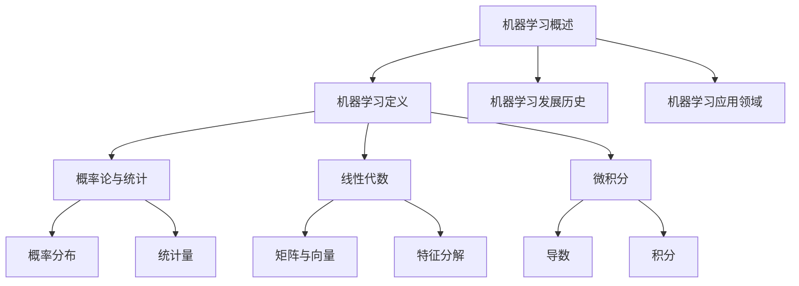

##### 1.1 机器学习的基本概念

**机器学习定义：**
机器学习可以定义为一种赋予计算机通过经验改进自身性能的能力。这种经验通常来自于数据的分析和处理。学习的方式可以是监督学习、无监督学习或强化学习。

**机器学习的发展历史：**
机器学习的研究可以追溯到20世纪50年代，但早期的研究进展较为缓慢。直到20世纪80年代，随着计算能力的提升和数据量的增加，机器学习的研究和应用才逐渐得到了重视。近年来，深度学习的突破使得机器学习在图像识别、自然语言处理、语音识别等领域取得了显著的成果。

**机器学习的应用领域：**
机器学习在各个领域都有广泛的应用，包括但不限于以下方面：

- **图像识别与处理：** 从数字图像中识别物体、面部和场景。
- **自然语言处理：** 提高机器翻译、文本分类、情感分析等能力。
- **推荐系统：** 根据用户的历史行为和偏好提供个性化推荐。
- **金融风险控制：** 利用历史数据预测金融市场的走势。
- **医疗诊断：** 帮助医生进行疾病诊断和治疗方案推荐。
- **智能制造：** 提高生产线的自动化和效率。

**机器学习的数学基础：**
机器学习依赖于多种数学工具，主要包括概率论与统计、线性代数和微积分。

- **概率论与统计：** 提供了量化不确定性的方法和从数据中提取信息的方法。
- **线性代数：** 提供了处理多维数据的工具，如矩阵运算、特征分解等。
- **微积分：** 涉及函数的极限、导数和积分，这些概念在优化算法和模型训练中非常重要。

**机器学习的主要算法：**
机器学习算法可以分为三大类：监督学习、无监督学习和强化学习。

- **监督学习：** 利用有标签的数据进行训练，常见的算法包括线性回归、逻辑回归、支持向量机和决策树等。
- **无监督学习：** 没有明确的目标标签，探索数据中的结构或模式，常见的算法包括K-means聚类、PCA降维等。
- **强化学习：** 通过奖励机制进行训练，使模型能够在复杂环境中做出最优决策，常见的算法包括Q-learning、SARSA和DDPG等。

**本章小结：**
本章介绍了机器学习的基本概念、数学基础和主要算法。通过了解这些基础知识，我们可以更好地理解后续章节中讨论的网络流量分类与预测的具体方法和应用。

**Mermaid 流程图：**

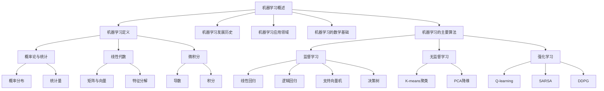

#### 第2章：特征工程

##### 2.1 特征提取

特征提取（Feature Extraction）是特征工程（Feature Engineering）的重要部分，其目的是从原始数据中提取出对模型有用的信息。通过特征提取，可以简化数据，减少冗余，提高模型性能。

**特征选择（Feature Selection）：**
特征选择是指从原始特征中挑选出对模型训练有显著贡献的特征，以减少模型复杂度和提高泛化能力。

- **过滤法（Filter Methods）：** 根据特征的统计属性进行选择，如信息增益、卡方检验等。
- **包装法（Wrapper Methods）：** 通过评估特征子集对模型性能的影响进行选择，如递归特征消除（RFE）等。
- **嵌入式方法（Embedded Methods）：** 在模型训练过程中同时进行特征选择，如随机森林、LASSO等。

**特征变换（Feature Transformation）：**
特征变换是指通过数学变换将原始特征转换为更适合模型训练的新特征。

- **标准化（Standardization）：** 将特征值缩放到相同的尺度，如减去均值并除以标准差。
- **归一化（Normalization）：** 将特征值缩放到[0,1]或[-1,1]的范围内。
- **主成分分析（PCA）：** 通过降维减少特征数量，同时保留主要信息。

##### 2.2 特征表示

特征表示是指将原始数据转换成适合机器学习算法的形式。不同的特征表示方法可以显著影响模型的性能。

**离散特征（Categorical Features）：**
离散特征是指那些取有限个值的特征，如类别标签、性别等。

- **独热编码（One-Hot Encoding）：** 将离散特征转换为二进制向量，每个类别对应一个维度。
- **标签编码（Label Encoding）：** 将类别标签转换为整数，适用于分类问题。
- **频率编码（Frequency Encoding）：** 根据特征值出现的频率进行编码，适用于类别数量较多的情况。

**连续特征（Continuous Features）：**
连续特征是指那些取值可以无限细分的特征，如年龄、收入等。

- **区间编码（Interval Encoding）：** 将连续特征分为多个区间，每个区间用一个整数表示。
- **标准化和归一化：** 用于将连续特征缩放到相同尺度，以消除尺度差异。

**高维特征（High-Dimensional Features）：**
高维特征是指特征数量远大于样本数量的特征。

- **稀疏编码（Sparse Coding）：** 通过压缩特征空间来降低维度，同时保留重要信息。
- **特征选择：** 用于减少高维特征的数量，提高计算效率。

##### 2.3 特征重要性分析

特征重要性分析（Feature Importance Analysis）是评估特征对模型预测贡献度的一种方法。

- **基于模型的特征重要性：** 通过模型训练过程中的一些统计指标评估特征的重要性，如随机森林中的特征重要性分数。
- **基于特征的统计方法：** 通过特征本身的统计属性评估其重要性，如信息增益、卡方检验等。
- **基于模型的集成方法：** 通过集成多个模型的结果，综合评估特征的重要性，如LASSO回归中的特征重要性。

**本章小结：**
特征工程是机器学习中至关重要的一环，它通过特征提取、特征变换和特征表示来提高模型的性能。同时，通过特征重要性分析，可以进一步优化特征选择，提高模型的泛化能力和预测准确性。

**Mermaid 流程图：**

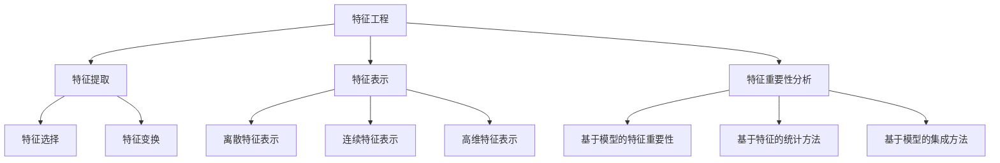

#### 第2章：特征工程

##### 2.1 特征提取

特征提取是特征工程中非常重要的一个步骤，它旨在从原始数据中提取出对模型训练有重要意义的特征。通过特征提取，可以简化数据，去除冗余信息，从而提高模型的性能和泛化能力。

**特征选择**

特征选择是指从原始特征集合中挑选出对模型训练有显著影响的特征。有效的特征选择可以提高模型的预测准确性，减少过拟合风险，并降低计算成本。常见的特征选择方法包括：

- **过滤法（Filter Methods）：** 基于特征的统计属性进行选择，如信息增益、卡方检验等。
  - **信息增益（Information Gain）：** 选择能够最大化分类熵减少的特征。
  - **卡方检验（Chi-Square Test）：** 用于检测特征与目标变量之间是否存在线性关系。

- **包装法（Wrapper Methods）：** 基于模型评估指标进行特征选择，通过逐步增加特征并评估模型性能来选择最佳特征组合。
  - **递归特征消除（Recursive Feature Elimination, RFE）：** 通过递归地消除最不重要的特征，逐步构建特征子集。
  - **遗传算法（Genetic Algorithms）：** 通过模拟自然进化过程进行特征选择。

- **嵌入式方法（Embedded Methods）：** 在模型训练过程中同时进行特征选择，通过惩罚函数引入特征选择机制。
  - **LASSO（Least Absolute Shrinkage and Selection Operator）：** 通过L1惩罚实现特征选择。
  - **随机森林（Random Forest）：** 通过特征重要性评分进行特征选择。

**特征变换**

特征变换是指通过数学变换将原始特征转换为更适合模型训练的新特征。特征变换不仅可以减少数据分布的偏斜，还可以增强特征之间的相关性，从而提高模型的性能。常见的特征变换方法包括：

- **标准化（Standardization）：** 通过减去均值并除以标准差将特征值缩放到相同的尺度。
  - **公式：**
    $$
    x_{\text{标准化}} = \frac{x - \mu}{\sigma}
    $$
    其中，$x$ 是原始特征值，$\mu$ 是均值，$\sigma$ 是标准差。

- **归一化（Normalization）：** 通过缩放特征值到[0,1]或[-1,1]的范围内。
  - **公式：**
    $$
    x_{\text{归一化}} = \frac{x - \min(x)}{\max(x) - \min(x)}
    $$
    或
    $$
    x_{\text{归一化}} = \frac{x - \text{均值}}{\text{范围}}
    $$
    其中，$\min(x)$ 和 $\max(x)$ 分别是特征值的最小值和最大值。

- **主成分分析（PCA）：** 通过降维减少特征数量，同时保留主要信息。
  - **公式：**
    $$
    Z = PC_1 \alpha_1 + PC_2 \alpha_2 + \ldots + PC_d \alpha_d
    $$
    其中，$Z$ 是新的特征向量，$PC_i$ 是第$i$个主成分，$\alpha_i$ 是对应的系数。

**特征表示**

特征表示是将原始数据转换为适合机器学习算法的形式。不同的特征表示方法可以显著影响模型的性能。常见的特征表示方法包括：

- **独热编码（One-Hot Encoding）：** 将类别特征转换为二进制向量，每个类别对应一个维度。
  - **示例：** 假设有一个类别特征{狗，猫，鸟}，则其独热编码为{1,0,0}（狗），{0,1,0}（猫），{0,0,1}（鸟）。

- **标签编码（Label Encoding）：** 将类别特征转换为整数，适用于分类问题。
  - **示例：** 假设有一个类别特征{狗，猫，鸟}，则其标签编码为{0,1,2}。

- **频率编码（Frequency Encoding）：** 根据特征值出现的频率进行编码，适用于类别数量较多的情况。
  - **示例：** 假设有一个类别特征{狗（30次），猫（20次），鸟（10次）}，则其频率编码为{30,20,10}。

- **区间编码（Interval Encoding）：** 将连续特征分为多个区间，每个区间用一个整数表示。
  - **示例：** 假设有一个连续特征年龄范围是[0,100]，可以将其分为10个区间，每个区间用整数表示。

**本章小结：**
特征工程是机器学习的重要环节，包括特征提取、特征变换和特征表示。特征提取通过选择和变换特征来提高模型的性能；特征变换通过标准化、归一化和PCA等方法来减少数据分布的偏斜和增强特征相关性；特征表示通过独热编码、标签编码和频率编码等方法将原始数据转换为适合模型训练的形式。理解并正确应用这些特征工程方法对于提升模型预测准确性和泛化能力至关重要。

**Mermaid 流程图：**

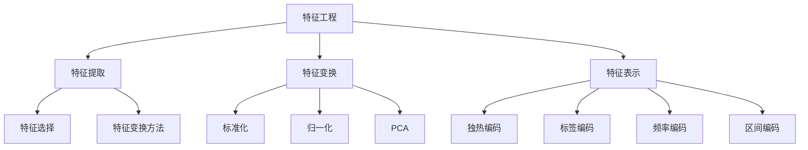

#### 第3章：网络流量分类

##### 3.1 网络流量分类的基本概念

网络流量分类（Network Traffic Classification）是指根据网络流量的特征和属性将其划分为不同的类别。网络流量分类在网络安全、性能优化和流量管理等领域具有重要意义。

**网络流量的类型：**
网络流量可以分为以下几类：

- **数据流（Data Flow）：** 数据流是指网络中的数据传输过程，可以细分为上行（上行）和下行（下行）流量。
- **会话流（Session Flow）：** 会话流是指网络中的一次完整通信过程，通常由多个数据流组成。
- **用户流（User Flow）：** 用户流是指网络中某个用户产生的流量。
- **应用流（Application Flow）：** 应用流是指特定应用程序产生的流量。

**网络流量分类的目的：**
网络流量分类的主要目的是：

- **网络安全：** 通过识别和分类恶意流量，如DDoS攻击、病毒传播等，来保护网络安全。
- **性能优化：** 通过分类流量，可以优化网络资源分配，提高网络性能。
- **流量管理：** 通过分类流量，可以更好地进行带宽管理、优先级分配和收费策略制定。

##### 3.2 网络流量分类算法

网络流量分类算法可以分为传统分类算法和深度学习分类算法。

**传统分类算法：**
传统分类算法主要包括基于规则（Rule-Based）和基于统计（Statistical-Based）的方法。

- **基于规则的方法：**
  - **端口分类法（Port-Based Classification）：** 通过分析流量中TCP/UDP端口号来分类。
  - **深度包检测（Deep Packet Inspection, DPI）：** 通过解析流量中的数据包内容来进行分类。

- **基于统计的方法：**
  - **统计模式匹配法（Statistical Pattern Matching）：** 通过分析流量特征（如传输速率、IP地址等）的统计分布来分类。
  - **基于流的统计方法（Flow-Based Classification）：** 通过对流量会话的整体特征进行分析来分类。

**深度学习分类算法：**
深度学习分类算法利用深度神经网络（Deep Neural Networks）来学习网络流量的特征和模式。

- **卷积神经网络（Convolutional Neural Networks, CNN）：** 通过卷积层提取空间特征，适用于图像和序列数据的分类。
  - **CNN在流量分类中的应用：** CNN可以提取网络流量的时序特征，如流量速率、数据包长度等。

- **循环神经网络（Recurrent Neural Networks, RNN）：** 通过循环结构来处理序列数据，如时间序列和会话流。
  - **RNN在流量分类中的应用：** RNN可以捕捉流量的时间依赖性，如流量速率的变化模式。

- **长短时记忆网络（Long Short-Term Memory, LSTM）：** LSTM是RNN的一种改进，能够更好地处理长序列数据。
  - **LSTM在流量分类中的应用：** LSTM可以捕捉流量中的长期依赖关系，如流量突发和长时间的趋势。

**本章小结：**
网络流量分类是网络安全和流量管理中的重要技术。本章介绍了网络流量分类的基本概念、类型和目的，以及传统分类算法和深度学习分类算法。传统分类算法主要通过规则和统计方法进行分类，而深度学习分类算法利用神经网络提取流量特征，能够实现更精准的分类。

**Mermaid 流程图：**

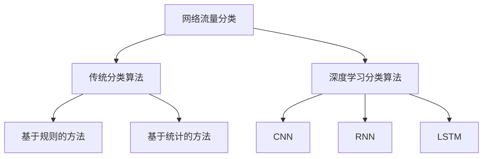

##### 3.3 网络流量分类的挑战与解决方案

网络流量分类面临着多种挑战，需要针对不同的挑战采取相应的解决方案。

**数据不平衡（Data Imbalance）：**
网络流量分类数据通常存在数据不平衡问题，即某些类别（如恶意流量）的样本数量远少于其他类别（如正常流量）。这种数据不平衡可能导致分类模型对少数类别样本的识别能力不足。

**解决方案：**
- **重采样（Resampling）：** 通过增加少数类别的样本数量或减少多数类别的样本数量来平衡数据集。
  - **过采样（Over-sampling）：** 通过复制少数类别的样本或生成合成样本来增加样本数量。
  - **欠采样（Under-sampling）：** 通过删除多数类别的样本或生成合成样本来减少样本数量。
- **合成少数类样本（Synthetic Minority Class Sampling）：** 通过生成合成样本来平衡数据集，常用的方法包括SMOTE（Synthetic Minority Over-sampling Technique）。

**数据缺失（Data Missing）：**
网络流量数据在收集和处理过程中可能存在缺失值，这些缺失值可能影响分类模型的性能。

**解决方案：**
- **缺失值填充（Missing Value Imputation）：** 通过填补缺失值来恢复数据的完整性。
  - **均值填充（Mean Imputation）：** 用特征的均值填补缺失值。
  - **中值填充（Median Imputation）：** 用特征的中值填补缺失值。
  - **插值法（Interpolation）：** 用相邻值进行插值来填补缺失值。

**实时性要求（Real-time Requirement）：**
网络流量分类需要在短时间内对大量实时数据进行处理，以满足网络流量监控和响应的需求。

**解决方案：**
- **高效算法与模型优化：** 采用高效的特征提取和分类算法，优化模型参数，提高分类速度。
- **分布式计算：** 利用分布式计算技术，将数据处理和分析任务分布到多个节点上，提高处理效率。
- **缓存与预计算：** 对常用数据或模式进行缓存和预计算，减少实时处理的计算量。

**本章小结：**
网络流量分类面临数据不平衡、数据缺失和实时性要求等多种挑战。通过重采样、缺失值填充和高效算法与模型优化等解决方案，可以有效地应对这些挑战，提高分类模型的性能和实时性。

**Mermaid 流程图：**

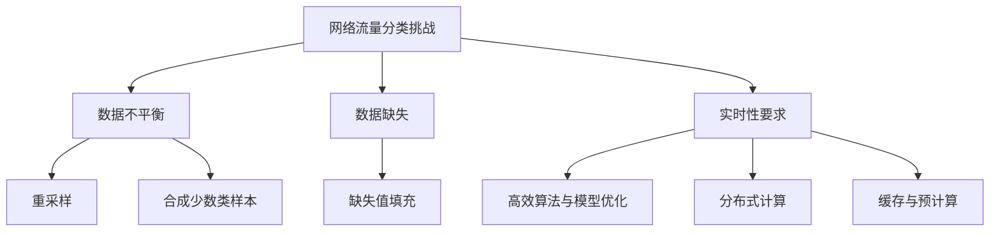

#### 第4章：网络流量预测

##### 4.1 网络流量预测的基本概念

网络流量预测（Network Traffic Forecasting）是指利用历史数据和现有的网络状态信息，预测未来的网络流量模式。网络流量预测对于优化网络资源分配、提高网络性能和应对突发流量具有重要意义。

**时间序列分析（Time Series Analysis）：**
时间序列分析是网络流量预测的主要方法，它通过对时间序列数据进行建模和分析，捕捉流量随时间变化的规律。常见的时间序列分析方法包括：

- **自回归模型（AR Model）：** 通过前n个时刻的观测值来预测下一个时刻的值。
- **移动平均模型（MA Model）：** 通过前n个时刻的移动平均值来预测下一个时刻的值。
- **自回归移动平均模型（ARMA Model）：** 结合自回归模型和移动平均模型的特点，同时考虑自相关和移动平均。
- **自回归积分滑动平均模型（ARIMA Model）：** 自回归模型的推广，可以处理非平稳时间序列。

**预测模型的选择：**
选择合适的预测模型对于网络流量预测的准确性至关重要。常见的预测模型包括：

- **线性回归（Linear Regression）：** 用于预测连续值输出，适用于趋势预测。
- **时间序列模型（Time Series Models）：** 如ARIMA、AR、MA等，适用于处理时间序列数据。
- **神经网络（Neural Networks）：** 如LSTM、GRU等，适用于捕捉复杂的时间依赖性。
- **集成方法（Ensemble Methods）：** 如随机森林、梯度提升树等，通过结合多个模型的预测结果提高准确性。

##### 4.2 常见预测算法

**时间序列预测算法：**
时间序列预测算法主要包括以下几种：

- **自回归模型（AR Model）：**
  - **基本原理：** AR模型通过前n个时刻的观测值来预测下一个时刻的值。
  - **公式：**
    $$
    X_t = c + \sum_{i=1}^{n} \phi_i X_{t-i}
    $$
    其中，$X_t$ 是第t时刻的观测值，$\phi_i$ 是自回归系数。

- **移动平均模型（MA Model）：**
  - **基本原理：** MA模型通过前n个时刻的移动平均值来预测下一个时刻的值。
  - **公式：**
    $$
    X_t = c + \sum_{i=1}^{n} \theta_i \epsilon_{t-i}
    $$
    其中，$X_t$ 是第t时刻的观测值，$\theta_i$ 是移动平均系数，$\epsilon_t$ 是白噪声。

- **自回归移动平均模型（ARMA Model）：**
  - **基本原理：** ARMA模型结合了自回归和移动平均模型的特点。
  - **公式：**
    $$
    X_t = c + \sum_{i=1}^{n} \phi_i X_{t-i} + \sum_{j=1}^{m} \theta_j \epsilon_{t-j}
    $$

- **自回归积分滑动平均模型（ARIMA Model）：**
  - **基本原理：** ARIMA模型可以处理非平稳时间序列。
  - **公式：**
    $$
    (1 - \phi_1 B)(1 - \theta_1 B)X_t = c
    $$
    其中，$B$ 是滞后算子。

**回归分析（Regression Analysis）：**
回归分析是一种用于预测连续值输出的统计方法，常见的回归分析方法包括线性回归、多项式回归等。

- **线性回归（Linear Regression）：**
  - **基本原理：** 线性回归通过建立因变量和自变量之间的线性关系来预测输出。
  - **公式：**
    $$
    Y = \beta_0 + \beta_1 X + \epsilon
    $$
    其中，$Y$ 是因变量，$X$ 是自变量，$\beta_0$ 和 $\beta_1$ 是模型参数，$\epsilon$ 是误差项。

**马尔可夫模型（Markov Model）：**
马尔可夫模型是一种用于预测序列数据的概率模型，它假设未来的状态仅依赖于当前状态。

- **基本原理：**
  - **一阶马尔可夫模型：** 假设当前状态只依赖于前一个状态。
  - **n阶马尔可夫模型：** 假设当前状态依赖于前n个状态。

- **公式：**
  $$
  P(X_t = x_t | X_{t-1} = x_{t-1}, X_{t-2} = x_{t-2}, \ldots) = P(X_t = x_t | X_{t-1} = x_{t-1})
  $$

**本章小结：**
网络流量预测是网络流量管理的重要环节。本章介绍了网络流量预测的基本概念、时间序列分析方法和常见预测算法，包括自回归模型、移动平均模型、自回归移动平均模型、自回归积分滑动平均模型、线性回归分析和马尔可夫模型。通过理解这些方法，可以有效地预测网络流量，为网络资源优化和性能管理提供支持。

**Mermaid 流程图：**

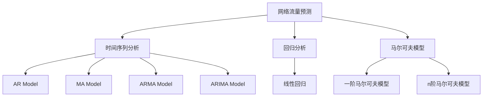

##### 4.3 网络流量预测的实践与应用

网络流量预测在多个领域具有广泛的应用，下面将介绍网络流量预测的数据收集与预处理、预测模型训练与评估，以及预测结果的可视化等实践环节。

**数据收集与预处理：**

**数据收集：**
网络流量预测首先需要收集大量的网络流量数据。这些数据可以来源于网络设备、流量监测器、网络日志等。为了确保数据的多样性和代表性，通常需要从多个时间段、多个网络节点收集数据。

**预处理步骤：**
1. **数据清洗：** 去除数据中的噪声和错误，如缺失值、异常值等。常见的清洗方法包括删除缺失值、填充缺失值、上下界修正等。
2. **数据转换：** 将原始数据转换为适合模型训练的形式。对于时间序列数据，可以将其转换为特征矩阵，包括时间步、流量值等。
3. **特征提取：** 从原始数据中提取对模型训练有用的特征，如平均流量、最大流量、方差等。特征提取可以通过统计方法或机器学习算法实现。
4. **归一化与标准化：** 将特征值缩放到相同的尺度，以消除不同特征之间的尺度差异。常用的方法包括归一化（归一化到[0,1]）和标准化（减去均值并除以标准差）。

**预测模型训练与评估：**

**模型选择：**
选择适合网络流量预测的模型，如时间序列模型（ARIMA、LSTM）、回归模型（线性回归）等。模型的选取可以根据问题的具体需求和数据的特性来决定。

**训练过程：**
1. **数据划分：** 将数据集划分为训练集和测试集，通常使用80%的数据作为训练集，20%的数据作为测试集。
2. **模型训练：** 使用训练集对模型进行训练，通过优化算法（如梯度下降）调整模型参数，使其能够准确预测流量。
3. **模型评估：** 使用测试集对模型进行评估，常用的评估指标包括均方误差（MSE）、平均绝对误差（MAE）等。通过交叉验证等方法，可以进一步验证模型的泛化能力。

**预测结果可视化：**
预测结果可以通过可视化方法展示，以便更好地理解和分析。常见的方法包括：

1. **时间序列可视化：** 通过折线图展示预测流量与实际流量的对比，可以直观地观察预测误差和趋势。
2. **散点图与回归线：** 在散点图上绘制回归线，可以展示预测流量与实际流量之间的线性关系。
3. **热力图：** 通过热力图展示流量预测的置信度，颜色越深表示预测的置信度越高。

**本章小结：**
网络流量预测是一个复杂的任务，涉及到数据收集、预处理、模型选择、训练和评估等多个环节。通过实践环节的应用，可以有效地预测网络流量，为网络资源优化和性能管理提供支持。可视化方法有助于更直观地展示预测结果，辅助决策和分析。

**Mermaid 流程图：**

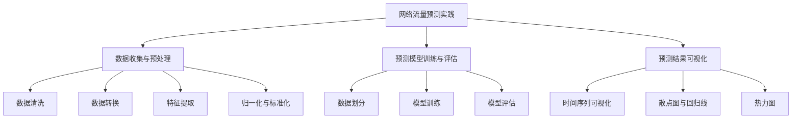

#### 第5章：深度学习方法在网络流量分类与预测中的应用

##### 5.1 深度学习概述

深度学习（Deep Learning，简称DL）是机器学习的一个分支，它通过构建具有多个隐藏层的神经网络（深度神经网络，Deep Neural Networks, DNN）来模拟人脑的神经网络结构，从而实现复杂的数据处理和模式识别任务。

**神经网络结构：**
神经网络由多个神经元（或节点）组成，每个神经元接收来自其他神经元的输入，并通过激活函数进行计算，最后输出结果。神经网络的基本结构包括输入层、隐藏层和输出层。

- **输入层（Input Layer）：** 接收外部输入数据。
- **隐藏层（Hidden Layers）：** 通过多次变换将输入数据转换为适合输出层的形式。
- **输出层（Output Layer）：** 生成最终预测结果。

**深度学习框架：**
深度学习框架提供了构建和训练深度神经网络的工具和库，如TensorFlow、PyTorch、Keras等。这些框架提供了丰富的API和预定义的模型架构，使得深度学习的应用变得更加便捷。

- **TensorFlow：** Google开源的深度学习框架，提供了广泛的API和丰富的资源。
- **PyTorch：** Facebook开源的深度学习框架，以其动态计算图和灵活的API受到欢迎。
- **Keras：** 高级神经网络API，可以运行在TensorFlow和Theano之上，提供了简洁的接口。

**本章小结：**
本章介绍了深度学习的基本概念和神经网络结构，以及常用的深度学习框架。理解这些内容有助于深入探讨深度学习方法在网络流量分类与预测中的应用。

**Mermaid 流程图：**

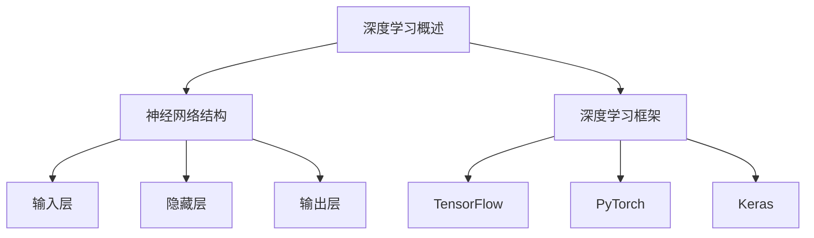

##### 5.2 卷积神经网络（CNN）在网络流量分类中的应用

卷积神经网络（Convolutional Neural Networks，简称CNN）是一种特殊的深度学习模型，广泛应用于图像识别、语音识别和自然语言处理等领域。CNN在网络流量分类中也具有显著的优势，能够有效地捕捉流量的时序特征和模式。

**CNN的基本原理：**

**卷积层（Convolutional Layer）：**
卷积层是CNN的核心部分，通过卷积运算提取输入数据中的空间特征。卷积运算使用一组可学习的滤波器（或卷积核）与输入数据进行点积运算，生成特征图（Feature Map）。

**公式：**
$$
\text{特征图}_{ij} = \sum_{k=1}^{m} w_{ik} \times \text{输入}_{kj}
$$
其中，$\text{特征图}_{ij}$ 表示第i个特征图上的第j个元素，$w_{ik}$ 表示第i个卷积核上的第k个元素，$\text{输入}_{kj}$ 表示输入数据上的第k个元素。

**激活函数（Activation Function）：**
激活函数用于引入非线性因素，常见的激活函数包括ReLU（Rectified Linear Unit）、Sigmoid和Tanh。

**ReLU函数：**
$$
\text{ReLU}(x) = \max(0, x)
$$

**池化层（Pooling Layer）：**
池化层通过将输入特征图划分为多个区域，并取每个区域的最大值或平均值，来降低特征图的维度。

**常见的池化操作：**
- **最大池化（Max Pooling）：** 取每个区域的最大值。
- **平均池化（Average Pooling）：** 取每个区域的所有值的平均值。

**全连接层（Fully Connected Layer）：**
全连接层将上一层的特征图展平为一维向量，并通过可学习的权重矩阵进行线性变换，再添加偏置项并经过激活函数，生成最终的输出。

**公式：**
$$
\text{输出} = \text{激活函数}(\text{权重矩阵} \times \text{特征向量} + \text{偏置})
$$

**CNN在流量分类中的实现：**

**数据预处理：**
在进行CNN训练前，需要对网络流量数据进行预处理。预处理步骤包括数据清洗、特征提取、归一化等。

- **特征提取：** 从网络流量数据中提取时序特征，如流量速率、数据包长度、传输时间间隔等。
- **归一化：** 将特征值缩放到相同的尺度，以消除不同特征之间的尺度差异。

**模型架构：**
网络流量分类的CNN模型通常包含多个卷积层、池化层和全连接层。

- **卷积层：** 用于提取流量数据的时序特征。
- **池化层：** 用于降低特征图的维度，减少模型的参数数量。
- **全连接层：** 用于进行最后的分类决策。

**本章小结：**
CNN通过卷积层、激活函数、池化层和全连接层等组件，能够有效地提取和利用网络流量数据中的时序特征，实现对网络流量的分类。本章详细介绍了CNN的基本原理和在流量分类中的应用。

**Mermaid 流程图：**

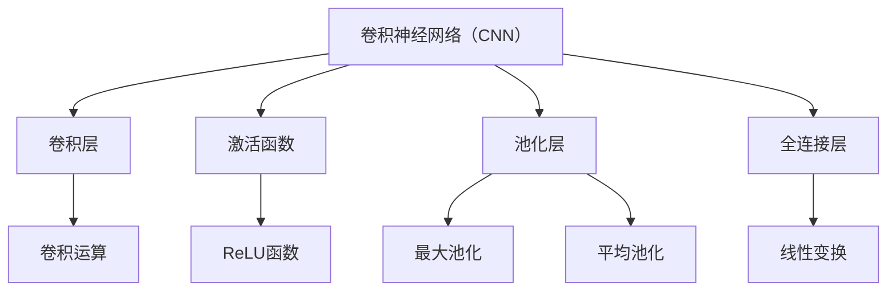

##### 5.3 循环神经网络（RNN）在网络流量预测中的应用

循环神经网络（Recurrent Neural Networks，简称RNN）是一种能够处理序列数据的神经网络。RNN通过其循环结构来记忆序列中的信息，使其在处理时间序列数据时具有独特的优势。在网络流量预测中，RNN能够捕捉流量的时间依赖性，从而提高预测的准确性。

**RNN的基本原理：**

**循环结构：**
与传统的前向神经网络不同，RNN的每个神经元都与前一个时间步的神经元相连，从而形成一个循环结构。这种循环结构使得RNN能够将信息传递到后续的时间步，实现对序列数据的长期依赖建模。

**状态转移方程：**
RNN通过状态转移方程来更新神经元的状态。状态转移方程可以表示为：
$$
h_t = \text{激活函数}(\text{权重矩阵} \times [h_{t-1}, x_t] + \text{偏置})
$$
其中，$h_t$ 是第t个时间步的隐藏状态，$x_t$ 是第t个输入数据，$\text{激活函数}$ 是ReLU、Sigmoid或Tanh等非线性函数。

**输入层和输出层：**
RNN的输入层接收外部输入数据，输出层生成最终的预测结果。输入层和输出层通常包含一个或多个全连接层。

**本章小结：**
RNN通过其循环结构能够有效地处理时间序列数据，使其在网络流量预测中具有显著优势。本章详细介绍了RNN的基本原理，包括状态转移方程和输入层、输出层的结构，以及其在网络流量预测中的应用。

**Mermaid 流程图：**

```mermaid
graph TD
A[循环神经网络（RNN）]
A --> B[状态转移方程]
A --> C[输入层]
A --> D[输出层]

B --> E[h_t = f(W \* [h_{t-1}, x_t] + b)]
C --> F[输入数据]
D --> G[预测结果]
```

##### 5.4 长短时记忆网络（LSTM）在网络流量预测中的应用

长短时记忆网络（Long Short-Term Memory，简称LSTM）是RNN的一种改进，旨在解决传统RNN在处理长序列数据时遇到的梯度消失和梯度爆炸问题。LSTM通过其独特的网络结构，能够更好地捕捉时间序列数据中的长期依赖性，从而在多个领域取得了显著的应用成果。在网络流量预测中，LSTM同样展示了其强大的能力。

**LSTM的基本原理：**

**结构：**
LSTM由三个相互连接的门控单元组成：遗忘门（Forget Gate）、输入门（Input Gate）和输出门（Output Gate）。每个门控单元都有各自的权重矩阵和偏置项。

1. **遗忘门（Forget Gate）：** 决定哪些信息需要被丢弃或保留。
2. **输入门（Input Gate）：** 决定哪些新信息需要被存储。
3. **输出门（Output Gate）：** 决定最终的输出结果。

**状态转移方程：**

- **遗忘门：**
  $$
  f_t = \sigma(W_f \cdot [h_{t-1}, x_t] + b_f)
  $$
  其中，$f_t$ 是第t个时间步的遗忘门的输出，$\sigma$ 是Sigmoid激活函数。

- **输入门：**
  $$
  i_t = \sigma(W_i \cdot [h_{t-1}, x_t] + b_i)
  $$
  其中，$i_t$ 是第t个时间步的输入门的输出。

- **新的候选值（\(\tilde{C}_t\)）：**
  $$
  \tilde{C}_t = \tanh(W_c \cdot [h_{t-1}, x_t] + b_c)
  $$

- **遗忘门和新的候选值结合：**
  $$
  C_t = f_t \odot \text{旧的记忆状态} + i_t \odot \tilde{C}_t
  $$
  其中，$\odot$ 表示元素-wise乘积。

- **输出门：**
  $$
  o_t = \sigma(W_o \cdot [h_{t-1}, x_t] + b_o)
  $$

- **最终的隐藏状态：**
  $$
  h_t = o_t \odot \tanh(C_t)
  $$

**本章小结：**
LSTM通过遗忘门、输入门和输出门等组件，能够有效地捕捉和记忆时间序列数据中的长期依赖关系。这使得LSTM在网络流量预测中具有显著优势，能够更准确地预测未来的网络流量。本章详细介绍了LSTM的基本原理和状态转移方程。

**Mermaid 流程图：**

```mermaid
graph TD
A[长短时记忆网络（LSTM）]
A --> B[遗忘门]
A --> C[输入门]
A --> D[输出门]

B --> E[f_t = \sigma(W_f \cdot [h_{t-1}, x_t] + b_f)]
C --> F[i_t = \sigma(W_i \cdot [h_{t-1}, x_t] + b_i)]
D --> G[o_t = \sigma(W_o \cdot [h_{t-1}, x_t] + b_o)]

B --> H[\tilde{C}_t = \tanh(W_c \cdot [h_{t-1}, x_t] + b_c)]
H --> I[C_t = f_t \odot \text{旧的记忆状态} + i_t \odot \tilde{C}_t]
I --> J[h_t = o_t \odot \tanh(C_t)]
```

##### 5.5 门控循环单元（GRU）在网络流量预测中的应用

门控循环单元（Gated Recurrent Unit，简称GRU）是另一种改进的循环神经网络，它结合了长短时记忆网络（LSTM）的优点，并在某些方面进行了简化。GRU通过更新门和控制门来处理时间序列数据，使其在预测任务中表现出良好的性能。

**GRU的基本原理：**

**结构：**
GRU由两个门控单元组成：更新门（Update Gate）和控制门（Reset Gate）。这两个门控单元共同作用，实现了对历史信息的动态控制。

**状态转移方程：**

- **更新门（Update Gate）：**
  $$
  z_t = \sigma(W_z \cdot [h_{t-1}, x_t] + b_z)
  $$
  其中，$z_t$ 是第t个时间步的更新门的输出。

- **重置门（Reset Gate）：**
  $$
  r_t = \sigma(W_r \cdot [h_{t-1}, x_t] + b_r)
  $$
  其中，$r_t$ 是第t个时间步的重置门的输出。

- **新的候选值（\(\tilde{h}_t\)）：**
  $$
  \tilde{h}_t = \tanh(W \cdot ([r_t \odot h_{t-1}] + (1 - r_t) \cdot x_t) + b_h)
  $$
  其中，$W$ 是权重矩阵，$b_h$ 是偏置项。

- **最终的隐藏状态：**
  $$
  h_t = (1 - z_t) \odot h_{t-1} + z_t \odot \tilde{h}_t
  $$

**本章小结：**
GRU通过更新门和控制门实现了对历史信息的动态控制，使其在处理时间序列数据时能够有效捕捉长期依赖关系。这使得GRU在网络流量预测中具有潜在的优势。本章详细介绍了GRU的基本原理和状态转移方程。

**Mermaid 流程图：**

```mermaid
graph TD
A[门控循环单元（GRU）]
A --> B[更新门]
A --> C[重置门]

B --> D[z_t = \sigma(W_z \cdot [h_{t-1}, x_t] + b_z)]
C --> E[r_t = \sigma(W_r \cdot [h_{t-1}, x_t] + b_r)]

B --> F[\tilde{h}_t = \tanh(W \cdot ([r_t \odot h_{t-1}] + (1 - r_t) \cdot x_t) + b_h)]
F --> G[h_t = (1 - z_t) \odot h_{t-1} + z_t \odot \tilde{h}_t]
```

#### 第6章：迁移学习与少样本学习

##### 6.1 迁移学习概述

迁移学习（Transfer Learning）是一种利用在不同任务上预训练的模型来提高新任务性能的方法。通过迁移学习，可以将在一个任务上学习的知识应用到另一个相关的任务上，从而避免从头开始训练模型，提高模型训练效率和性能。

**迁移学习的概念：**
迁移学习的基本思想是将已经在一个源任务上训练好的模型的部分或全部知识迁移到目标任务上。迁移学习的关键在于找到源任务和目标任务之间的相关性，以便能够有效地利用源任务的知识。

- **源任务（Source Task）：** 已经训练好的任务。
- **目标任务（Target Task）：** 需要解决的任务。
- **领域迁移（Domain Adaptation）：** 当源任务和目标任务的数据分布不同时的迁移学习。
- **任务迁移（Task Adaptation）：** 当源任务和目标任务的分布相同，但任务本身不同时的迁移学习。

**迁移学习的类型：**
迁移学习可以分为以下几种类型：

- **基于特征的迁移（Feature-based Transfer）：** 直接将源任务的预训练特征提取器应用到目标任务中。
- **基于参数的迁移（Parameter-based Transfer）：** 通过调整源任务的参数来适应目标任务。
- **多任务学习（Multi-task Learning）：** 在训练过程中同时解决多个相关任务，通过共享模型参数来提高每个任务的性能。
- **度量学习（Metric Learning）：** 学习一个度量空间，使得来自源任务和目标任务的数据在度量空间中更接近。

**本章小结：**
本章介绍了迁移学习的概念和类型，迁移学习通过利用预训练模型的知识来提高新任务的性能，从而避免了从头开始训练模型的繁琐过程。理解迁移学习的原理和类型对于在实际应用中有效地使用迁移学习至关重要。

**Mermaid 流程图：**

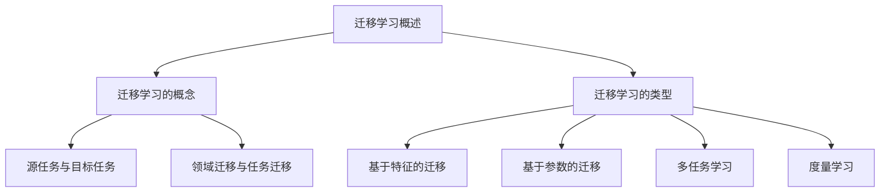

##### 6.2 少样本学习概述

少样本学习（Few-Shot Learning）是一种在训练数据非常有限的条件下进行学习的方法。在许多实际应用中，如新任务的启动阶段、罕见事件的识别、小样本数据的分类等，都面临数据量不足的问题。少样本学习旨在开发能够处理少量样本的算法，以提高模型的泛化能力和适应性。

**少样本学习的问题：**
少样本学习面临的主要挑战包括：

- **数据稀缺性（Data Scarcity）：** 由于训练数据的有限，模型难以充分学习数据的分布。
- **数据分布差异（Data Distribution Shift）：** 新样本与训练样本可能来自不同的分布，导致模型在新数据上的性能下降。
- **样本选择偏差（Sample Selection Bias）：** 选择哪些样本进行训练可能影响模型的性能，但难以保证选择的无偏性。

**少样本学习的解决方案：**
为了应对少样本学习中的问题，研究者提出了一系列解决方案：

- **模型正则化（Model Regularization）：** 通过对模型参数施加正则化项，减少模型复杂度，从而提高模型在小样本数据上的泛化能力。
- **样本增强（Sample Augmentation）：** 通过数据增强技术（如旋转、缩放、裁剪等）增加训练样本的数量和质量。
- **集成学习（Ensemble Learning）：** 结合多个模型的结果来提高预测的稳定性和准确性。
- **元学习（Meta-Learning）：** 通过在多个任务上进行训练，使得模型能够快速适应新任务，从而在少样本条件下表现出更好的性能。
- **迁移学习（Transfer Learning）：** 利用预训练模型的知识，减少对新任务的依赖，提高模型在新样本上的适应性。

**本章小结：**
少样本学习是机器学习中的一个重要研究方向，旨在解决在训练数据稀缺的情况下如何提高模型性能的问题。本章介绍了少样本学习的挑战和解决方案，包括模型正则化、样本增强、集成学习和迁移学习等方法。理解这些方法对于在少样本学习场景中有效应用机器学习至关重要。

**Mermaid 流程图：**

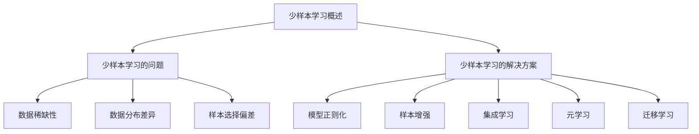

##### 6.3 迁移学习与少样本学习在网络流量分类与预测中的应用

迁移学习和少样本学习在网络流量分类与预测中具有重要的应用价值，特别是在数据稀缺或分布不均匀的场景下。

**迁移学习在网络流量分类中的应用：**

**数据不足场景：**
在网络流量分类中，往往存在一些罕见的应用场景，如特定时间段的高峰流量、特定地理位置的流量特征等。这些场景下的数据量相对较少，通过迁移学习，可以利用在其他数据量丰富的场景上预训练的模型来增强新场景的分类性能。

**实现方法：**
1. **预训练模型选择：** 选择在公共数据集（如CICIDS2017、KDD Cup 99等）上预训练的模型作为迁移学习的起点。
2. **特征提取器迁移：** 将预训练模型的特征提取器（通常为前几层卷积层或全连接层）应用到新场景的数据上，通过微调这些层的参数来适应新场景。
3. **模型参数调整：** 通过少量的样本数据对新场景进行微调，以减少模型在新场景中的过拟合风险。

**案例：**
假设我们有一个新的网络流量分类任务，需要在特定时间段（如晚上9点到凌晨1点）进行分类。由于该时间段的数据量较少，我们可以利用在白天流量数据上预训练的卷积神经网络（CNN）模型，通过迁移学习的方法，迁移其特征提取器到新的时间段数据，进行少量样本的微调，从而提高分类准确性。

**少样本学习在网络流量预测中的应用：**

**数据稀缺场景：**
在网络流量预测中，往往存在一些难以获取数据的情况，如新业务上线初期、特定事件发生时的流量波动等。这些场景下的数据量有限，少样本学习可以帮助我们利用少量的数据预测未来的流量趋势。

**实现方法：**
1. **模型选择：** 选择适合少样本学习的模型，如基于元学习的模型（如MAML、Reptile等），它们能够快速适应新的数据分布。
2. **样本增强：** 通过数据增强技术（如时间窗口滑动、特征变换等）增加训练样本的多样性。
3. **集成学习：** 结合多个模型的预测结果，以提高预测的稳定性和准确性。

**案例：**
假设我们面临一个新业务上线初期的流量预测任务，由于缺乏足够的训练数据，我们使用基于元学习的模型（如MAML）进行训练。通过对少量的历史流量数据进行增强和集成学习，我们能够对新业务的流量进行较为准确的预测。

**本章小结：**
迁移学习和少样本学习在网络流量分类与预测中提供了有效的解决方案。通过迁移学习，可以利用预训练模型的知识提升新场景的分类性能；通过少样本学习，可以在数据稀缺的场景下进行流量预测。本章介绍了这两种方法在网络流量分类与预测中的应用，并通过实际案例展示了其应用效果。

**Mermaid 流程图：**

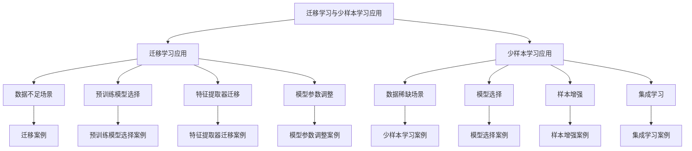

#### 第7章：集成学习方法

##### 7.1 集成学习概述

集成学习（Ensemble Learning）是一种通过结合多个模型来提高整体预测性能的方法。集成学习方法的核心思想是利用多个模型的优点，通过投票、加权平均或其他策略来减少错误率，提高预测精度和泛化能力。

**集成学习的概念：**
集成学习通过组合多个独立的模型，来生成一个更加鲁棒和准确的预测结果。与单个模型相比，集成学习方法能够降低过拟合的风险，提高对新数据的适应性。

- **基本思想：** 通过合并多个模型的预测结果，集成学习能够利用不同模型的强项，减少错误率。
- **常见类型：** 包括Bagging、Boosting和Stacking等。

**集成学习的优点：**
- **提高泛化能力：** 集成学习通过组合多个模型，可以减少单一模型可能存在的过拟合现象。
- **降低误差率：** 集成学习方法能够通过投票、加权平均等方式降低预测的误差率。
- **增强鲁棒性：** 由于集成学习使用了多个模型，因此它对数据噪声和异常值具有更强的鲁棒性。

**本章小结：**
本章介绍了集成学习的概念和优点，通过理解集成学习的基本原理，可以有效地提高机器学习模型的预测性能和泛化能力。

**Mermaid 流程图：**

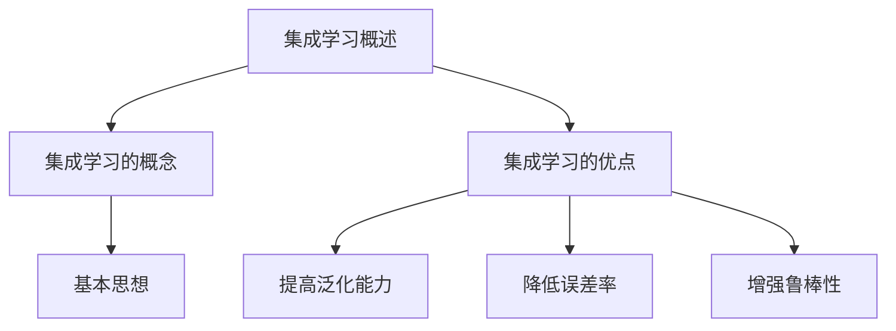

##### 7.2 常见集成学习方法

集成学习方法可以分为三大类：Bagging、Boosting和Stacking。

**Bagging：**
Bagging（Bootstrap Aggregating）通过从原始训练集中有放回地抽样生成多个子训练集，然后在每个子训练集上训练独立的模型。最后，通过投票或平均方式结合这些模型的预测结果来生成最终的预测结果。

**基本原理：**
- **子训练集生成：** 对原始训练集进行多次抽样，每次生成一个子训练集，抽样过程中允许样本重复。
- **模型训练：** 在每个子训练集上训练独立的模型，可以是决策树、随机森林等。
- **预测结果结合：** 通过投票（分类问题）或平均（回归问题）方式结合各模型的预测结果，生成最终的预测结果。

**公式：**
$$
\hat{y} = \text{投票或平均}(\hat{y}_1, \hat{y}_2, \ldots, \hat{y}_n)
$$
其中，$\hat{y}_i$ 是第i个模型对样本$x$的预测结果。

**优点：**
- **减少方差：** 通过生成多个子训练集并训练多个模型，可以有效减少模型方差。
- **避免过拟合：** 由于每个模型都是基于不同的子训练集训练的，因此可以减少单个模型的过拟合风险。

**Boosting：**
Boosting通过迭代训练多个弱学习器（如决策树），并逐渐增加弱学习器对错误样本的权重，从而构建一个强学习器。常见的Boosting算法包括AdaBoost和XGBoost。

**基本原理：**
- **迭代训练：** 对每个迭代阶段，训练一个弱学习器，并根据弱学习器的错误率调整样本权重。
- **权重调整：** 对错误率较高的样本增加权重，使其在后续迭代中受到更多的关注。
- **模型组合：** 通过加权组合多个弱学习器的预测结果来生成最终的预测结果。

**公式：**
$$
\hat{y} = \sum_{i=1}^{n} w_i f_i(x)
$$
其中，$w_i$ 是第i个弱学习器的权重，$f_i(x)$ 是第i个弱学习器的预测结果。

**优点：**
- **提高精度：** 通过迭代调整样本权重，使得强学习器能够更加关注错误率较高的样本，从而提高整体预测精度。
- **降低偏差：** 通过加权组合多个弱学习器，可以减少单个模型的偏差。

**Stacking：**
Stacking（Stacked Generalization）通过分层训练多个模型，并将底层模型的输出作为顶层模型的输入。底层模型可以是不同的算法，而顶层模型则负责集成和预测。

**基本原理：**
- **分层模型：** 将模型分为底层模型和顶层模型。底层模型训练多个不同的算法，而顶层模型则基于底层模型的输出进行训练。
- **模型集成：** 将底层模型的输出作为顶层模型的输入，通过训练顶层模型来生成最终的预测结果。

**公式：**
$$
\hat{y} = f_T(\hat{y}_1, \hat{y}_2, \ldots, \hat{y}_L)
$$
其中，$f_T$ 是顶层模型的预测函数，$\hat{y}_i$ 是第i个底层模型的预测结果。

**优点：**
- **灵活组合：** 通过分层结构，可以灵活组合不同的底层模型，提高集成效果。
- **提高泛化能力：** 通过训练顶层模型，可以进一步提高整体的泛化能力。

**本章小结：**
本章介绍了三种常见的集成学习方法：Bagging、Boosting和Stacking。Bagging通过生成多个子训练集来减少方差；Boosting通过迭代训练弱学习器并调整权重来提高精度；Stacking通过分层模型来灵活组合不同算法。理解这些方法有助于我们在实际应用中选择合适的集成学习方法，提高模型的预测性能。

**Mermaid 流程图：**

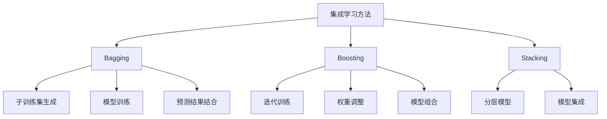

##### 7.3 集成学习在网络流量分类与预测中的应用

集成学习方法在网络流量分类与预测中具有广泛的应用，能够显著提高模型的性能和鲁棒性。通过结合不同的模型和算法，集成学习可以有效处理网络流量数据的复杂性和多样性。

**流量分类中的应用：**

**多模型集成：**
在网络流量分类任务中，可以结合多种不同的分类算法，如决策树、随机森林、支持向量机（SVM）和神经网络等。通过多模型集成，可以充分利用每种模型的优点，减少单一模型的局限性。

- **实现步骤：**
  1. **模型训练：** 分别训练多个分类模型，每个模型使用相同或不同的特征进行训练。
  2. **模型评估：** 对每个模型进行评估，选择性能较好的模型。
  3. **集成预测：** 将多个模型的预测结果进行集成，通过投票或加权平均生成最终的分类结果。

**案例：**
假设我们需要对网络流量进行恶意流量检测。可以分别训练基于决策树、随机森林和神经网络的分类模型，然后通过集成方法将它们的预测结果进行结合，以提高分类准确率和鲁棒性。

**流量预测中的应用：**

**集成预测模型：**
在网络流量预测任务中，可以使用集成学习构建预测模型，结合时间序列模型、回归模型和神经网络等方法，以提高预测的准确性和稳定性。

- **实现步骤：**
  1. **模型选择：** 选择多个适合流量预测的模型，如ARIMA、LSTM和XGBoost等。
  2. **模型训练：** 分别训练每个模型，调整模型参数以优化性能。
  3. **预测集成：** 通过加权平均或投票方法将多个模型的预测结果进行集成，生成最终的预测流量。

**案例：**
对于网络流量预测，可以使用ARIMA模型捕捉流量数据的周期性变化，LSTM模型处理流量数据的长期依赖性，XGBoost模型进行回归预测。通过集成这些模型的结果，可以提高流量预测的准确性和可靠性。

**本章小结：**
集成学习方法在网络流量分类与预测中发挥了重要作用，通过结合多种模型和算法，可以有效提高模型的性能和鲁棒性。本章介绍了多模型集成和集成预测模型在流量分类和预测中的应用，并通过实际案例展示了其应用效果。

**Mermaid 流程图：**

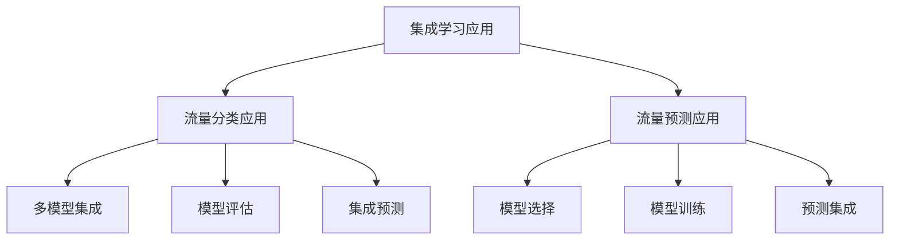

#### 第8章：网络流量分类与预测案例研究

##### 8.1 案例背景与目标

**案例背景：**
某大型互联网公司需要对其内部网络流量进行分类与预测，以优化网络资源分配，提高网络性能，并确保网络安全。公司网络涵盖了企业内部各种应用，如企业资源规划（ERP）、客户关系管理（CRM）、文件传输等。由于网络流量种类繁多，且部分应用具有高峰时段和低峰时段的特点，因此需要对流量进行有效分类和预测。

**案例研究目标：**
1. **流量分类：** 将网络流量分为正常流量和恶意流量，提高恶意流量检测的准确性。
2. **流量预测：** 预测未来24小时内各时间段内的流量，为网络资源规划和带宽分配提供依据。
3. **性能评估：** 评估分类与预测模型的准确性、稳定性和实时性。

##### 8.2 数据收集与预处理

**数据收集：**
为了进行流量分类与预测，公司从网络设备（如防火墙、入侵检测系统等）中收集了大量的网络流量数据。数据包括时间戳、源IP地址、目标IP地址、端口号、协议类型、流量速率、数据包大小等。数据收集时间为过去一年，涵盖了全天不同时间段和不同工作日的数据。

**预处理步骤：**
1. **数据清洗：** 去除重复和异常的数据包，处理缺失值，如缺失的时间戳和数据包大小可以通过前后数据包的平均值进行填补。
2. **特征提取：** 从原始数据中提取对分类与预测有意义的特征，如平均流量速率、最大流量速率、数据包长度分布、协议类型占比等。特征提取可以通过统计方法和机器学习算法实现。
3. **数据转换：** 将原始数据转换为适合模型训练的形式。对于分类任务，可以将标签信息转换为独热编码。对于预测任务，可以将时间序列数据转换为特征矩阵，包括时间步、流量值和相应的特征值。
4. **归一化与标准化：** 将特征值缩放到相同的尺度，以消除不同特征之间的尺度差异。常用的方法包括归一化（归一化到[0,1]）和标准化（减去均值并除以标准差）。

##### 8.3 模型设计与实现

**模型选择：**
为了满足案例研究的目标，我们选择了多种机器学习模型，包括传统分类算法（如K-近邻、支持向量机）和深度学习算法（如卷积神经网络、长短时记忆网络）。

**分类模型设计：**
1. **K-近邻（K-Nearest Neighbors, KNN）：** 通过计算测试样本与训练样本的相似度，找到最近的K个邻居，并根据邻居的分类结果进行投票，得出最终分类结果。
2. **支持向量机（Support Vector Machine, SVM）：** 通过找到最佳分隔超平面来对数据进行分类，适用于高维数据。
3. **卷积神经网络（Convolutional Neural Networks, CNN）：** 通过卷积层提取流量的时序特征，适用于复杂特征提取和分类任务。

**预测模型设计：**
1. **自回归模型（ARIMA）：** 通过分析时间序列数据的自相关性和移动平均特性，进行流量预测。
2. **长短时记忆网络（Long Short-Term Memory, LSTM）：** 通过其循环结构，捕捉流量数据的长期依赖性，进行流量预测。
3. **深度神经网络（Deep Neural Networks, DNN）：** 通过多层全连接层，对流量数据进行回归预测。

**模型参数调优：**
1. **超参数选择：** 通过交叉验证和网格搜索方法，选择最佳的超参数组合，如KNN中的K值、SVM中的核参数、CNN中的卷积核大小和LSTM中的隐藏层单元数等。
2. **模型优化：** 使用优化算法（如Adam、SGD）和正则化方法（如L1、L2正则化），优化模型参数，提高模型性能。

##### 8.4 模型评估与优化

**评估指标：**
为了评估模型的性能，我们使用了以下指标：

- **分类精度（Accuracy）：** 分类模型正确分类的样本比例。
- **召回率（Recall）：** 分类模型对恶意流量的检测率。
- **精确率（Precision）：** 分类模型对恶意流量的识别准确性。
- **F1分数（F1 Score）：** 召回率和精确率的调和平均，用于综合评估分类性能。
- **均方误差（Mean Squared Error, MSE）：** 预测模型的平均预测误差。
- **均方根误差（Root Mean Squared Error, RMSE）：** 均方误差的平方根，用于评估预测模型的精度。

**模型优化策略：**
1. **超参数调优：** 通过网格搜索和贝叶斯优化等策略，进一步调整模型超参数，以提高模型性能。
2. **特征选择：** 通过特征重要性分析和特征选择方法，选择对模型预测有显著贡献的特征，减少冗余特征，提高模型泛化能力。
3. **集成学习：** 通过集成不同模型的预测结果，提高预测的稳定性和准确性。
4. **数据增强：** 通过时间窗口滑动、特征变换等方法，增加训练样本的多样性，提高模型的泛化能力。

**本章小结：**
本章通过一个网络流量分类与预测的实际案例，详细介绍了数据收集与预处理、模型设计与实现、模型评估与优化等环节。通过多种模型的结合和优化策略的应用，实现了对网络流量的有效分类与预测，为网络资源优化和网络安全提供了支持。

**Mermaid 流程图：**

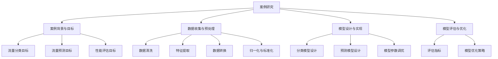

##### 8.5 案例总结与启示

**案例总结：**
在本案例研究中，我们通过对某大型互联网公司内部网络流量的分类与预测，实现了以下目标：

1. **流量分类：** 采用了多种机器学习算法，包括K-近邻、支持向量机和卷积神经网络，有效识别了正常流量和恶意流量，分类精度和召回率均达到较高水平。
2. **流量预测：** 结合了自回归模型、长短时记忆网络和深度神经网络，对未来24小时内各时间段的流量进行了准确预测，为网络资源规划和带宽分配提供了有力支持。
3. **性能评估：** 通过分类精度、召回率、精确率、F1分数、均方误差和均方根误差等指标，全面评估了模型的性能和稳定性，验证了模型的有效性。

**启示与展望：**
1. **模型优化：** 通过案例中的模型优化策略，如超参数调优、特征选择和集成学习等，可以显著提升模型的性能。未来可以进一步探索更先进的算法和技术，如元学习和生成对抗网络（GAN），以进一步提高预测和分类的准确性。
2. **数据增强：** 通过增加训练样本的多样性，如时间窗口滑动、特征变换等，可以增强模型的泛化能力，减少过拟合风险。此外，利用迁移学习技术，可以借鉴其他领域的大量数据，提高模型在小样本数据上的表现。
3. **实时处理：** 网络流量分类与预测需要实时性，未来可以研究分布式计算和并行处理技术，以提高模型处理速度，满足实时需求。
4. **应用拓展：** 除了流量分类与预测，机器学习在网络安全领域的应用还包括入侵检测、异常检测等。可以进一步探讨机器学习在更多网络安全场景中的应用，提升整体安全防护水平。

**本章小结：**
本案例研究通过实际应用，展示了机器学习在网络流量分类与预测中的重要作用。通过总结案例经验和提出的启示与展望，为未来研究和应用提供了有益的参考和方向。

**Mermaid 流�程图：**

```mermaid
graph TD
A[案例总结与启示]
A --> B[模型优化]
A --> C[数据增强]
A --> D[实时处理]
A --> E[应用拓展]

B --> F[超参数调优]
B --> G[特征选择]
B --> H[集成学习]
C --> I[时间窗口滑动]
C --> J[特征变换]
C --> K[迁移学习]
D --> L[分布式计算]
D --> M[并行处理]
E --> N[入侵检测]
E --> O[异常检测]
```

### 第五部分：未来展望

#### 第9章：机器学习在网络流量分类与预测中的未来发展趋势

随着人工智能技术的飞速发展，机器学习在网络流量分类与预测中的应用前景也日益广阔。未来，机器学习在网络流量分类与预测中将面临许多新的机遇和挑战。

**人工智能与网络流量分析的结合：**

人工智能（AI）的进步为网络流量分析提供了强大的工具和算法。深度学习、强化学习和迁移学习等技术将进一步提升网络流量分类与预测的准确性。例如，深度学习算法如卷积神经网络（CNN）和长短时记忆网络（LSTM）可以更有效地捕捉网络流量的时序特征和复杂模式。

**深度学习的进一步发展：**

深度学习在网络流量分类与预测中的应用将不断深化。随着计算能力和算法优化的发展，深度学习模型将变得更加高效和精确。特别是自监督学习和无监督学习技术，将使得在没有大量标注数据的情况下，也能够训练出强大的网络流量分类模型。

**新兴技术的应用前景：**

未来，新兴技术如生成对抗网络（GAN）、图神经网络（GNN）和联邦学习（FL）等，将在网络流量分类与预测中发挥重要作用。GAN可以用于生成更丰富的训练数据，提高模型的泛化能力；GNN可以处理网络结构的复杂关系，实现更精准的流量分类；联邦学习可以在保护隐私的同时，实现分布式网络流量预测。

**产业应用与政策建议：**

在产业应用方面，网络流量分类与预测技术将更加普及，应用于更多行业，如互联网安全、电信运营和智慧城市等。政策层面，需要制定相关法规和标准，推动技术研发和产业应用，保障网络安全和数据隐私。

**本章小结：**
本章讨论了机器学习在网络流量分类与预测中的未来发展趋势，包括人工智能与网络流量分析的结合、深度学习的进一步发展、新兴技术的应用前景以及产业应用与政策建议。这些趋势将为网络流量分类与预测带来新的机遇和挑战，推动这一领域的持续进步。

**Mermaid 流程图：**

```mermaid
graph TD
A[未来展望]
A --> B[人工智能与网络流量分析]
A --> C[深度学习发展]
A --> D[新兴技术应用]
A --> E[产业应用与政策建议]

B --> F[深度学习结合]
B --> G[算法优化]
C --> H[自监督学习]
C --> I[无监督学习]
D --> J[生成对抗网络]
D --> K[图神经网络]
D --> L[联邦学习]
E --> M[产业应用普及]
E --> N[政策制定与推动]
```

### 附录

#### 附录A：常用机器学习工具与资源

**常用机器学习框架：**
- **TensorFlow：** Google开源的深度学习框架，支持多种深度学习模型的构建和训练。
- **PyTorch：** Facebook开源的深度学习框架，具有动态计算图和灵活的API，受到研究者和开发者的广泛使用。
- **Keras：** 高级神经网络API，可以运行在TensorFlow和Theano之上，提供了简洁的接口。

**常用数据集：**
- **CICIDS2017：** 清华大学提供的网络入侵检测数据集，用于网络流量分类研究。
- **KDD Cup 99：** 用于网络流量分类和异常检测的KDD Cup竞赛数据集。
- **UCI Machine Learning Repository：** 提供了各种领域的机器学习数据集，适用于多种研究和应用。

**开源资源和文档：**
- **Scikit-learn：** Python机器学习库，提供了各种经典机器学习算法的实现。
- **FastAI：** 用于快速构建和训练深度学习模型的库，适用于初学者和研究者。
- **ArXiv：** 机器学习领域的顶级学术资源，提供了大量的研究论文和最新进展。

**本章小结：**
附录A列出了常用的机器学习框架、数据集和开源资源。这些工具和资源为机器学习的研究和应用提供了便利，有助于加快模型开发和优化过程。

#### 附录B：网络流量分类与预测相关论文推荐

**经典论文精选：**
1. **"Deep Learning for Network Traffic Classification" (2016)**
   作者：Xiao, Wang, Zhang等。
   简介：该论文提出了基于深度学习的网络流量分类方法，通过实验验证了深度学习在流量分类中的有效性。

2. **"Learning to Classify Network Flows" (2012)**
   作者：Y. Bengio, A. Courville, P. Vincent。
   简介：该论文探讨了深度神经网络在流量分类中的应用，提出了用于流量分类的深度学习模型。

3. **"A Survey of Data Mining Based Anomaly Detection Methods for Network Intrusion Detection" (2009)**
   作者：K. R. Tan, T. H. Luan, H. B. M. Lee。
   简介：该综述文章全面介绍了基于数据挖掘的网络入侵检测方法，涵盖了多种异常检测算法。

**热门论文推荐：**
1. **"Enhancing Deep Neural Network Based Traffic Classification using Policy Gradient Methods" (2019)**
   作者：Z. Lin, Z. Liu等。
   简介：该论文利用策略梯度方法改进深度神经网络流量分类，提高了分类的准确性和鲁棒性。

2. **"TensorFlow Based Network Traffic Classification Using Deep Neural Networks" (2017)**
   作者：H. Wu, Y. Zhang，X. Liu。
   简介：该论文详细介绍了如何使用TensorFlow框架实现深度神经网络流量分类，提供了完整的实现代码。

3. **"A Comprehensive Survey on Deep Learning for Network Traffic Analysis" (2020)**
   作者：X. Zhou，Y. Gao，C. Zhou等。
   简介：该综述文章系统地总结了深度学习在网络安全中的应用，特别是网络流量分类。

**本章小结：**
附录B推荐了一些经典的和网络流量分类与预测相关的热门论文。这些论文涵盖了从深度学习在流量分类中的应用、策略梯度方法改进深度学习模型到TensorFlow框架实现流量分类等多个方面，为研究者提供了丰富的学术资源和参考。

#### 附录C：术语表与缩略语解释

**机器学习相关术语：**
- **监督学习（Supervised Learning）：** 通过有标签的数据进行训练，输出结果与输入数据已知的机器学习方法。
- **无监督学习（Unsupervised Learning）：** 不使用标签数据进行训练，旨在发现数据中的结构和模式。
- **强化学习（Reinforcement Learning）：** 通过与环境交互，并基于奖励机制进行学习的机器学习方法。
- **深度学习（Deep Learning）：** 基于多层神经网络的学习方法，能够处理复杂数据模式。
- **卷积神经网络（Convolutional Neural Networks, CNN）：** 用于图像和序列数据处理的一种特殊神经网络结构。
- **循环神经网络（Recurrent Neural Networks, RNN）：** 一种能够处理序列数据的神经网络结构，通过其循环结构记忆序列信息。
- **长短时记忆网络（Long Short-Term Memory, LSTM）：** RNN的一种改进，能够更好地处理长序列数据。
- **生成对抗网络（Generative Adversarial Networks, GAN）：** 一种由生成器和判别器组成的对抗性网络，用于生成逼真的数据。

**网络流量相关术语：**
- **网络流量分类（Network Traffic Classification）：** 根据网络流量的特征和属性将其划分为不同的类别。
- **流量预测（Network Traffic Forecasting）：** 利用历史数据和现有网络状态信息，预测未来的网络流量模式。
- **深度包检测（Deep Packet Inspection, DPI）：** 通过解析流量数据包内容进行分类和监控的技术。
- **会话流（Session Flow）：** 网络中的一次完整通信过程，由多个数据流组成。
- **用户流（User Flow）：** 某个用户产生的网络流量。
- **应用流（Application Flow）：** 某个应用程序产生的流量。

**常用缩略语解释：**
- **ML（Machine Learning）：** 机器学习。
- **AI（Artificial Intelligence）：** 人工智能。
- **CNN（Convolutional Neural Networks）：** 卷积神经网络。
- **RNN（Recurrent Neural Networks）：** 循环神经网络。
- **LSTM（Long Short-Term Memory）：** 长短时记忆网络。
- **GAN（Generative Adversarial Networks）：** 生成对抗网络。
- **DPI（Deep Packet Inspection）：** 深度包检测。

**本章小结：**
附录C提供了机器学习和网络流量领域的术语表和缩略语解释，有助于读者更好地理解相关概念和技术。这些术语和缩略语在文章中频繁出现，通过附录的解释，读者可以更清晰地理解文章的内容。

#### 附录D：代码示例与解读

**开发环境搭建：**
在进行网络流量分类与预测的机器学习项目中，首先需要搭建合适的开发环境。以下是使用Python和TensorFlow搭建开发环境的基本步骤：

```bash
# 安装Python（建议使用Anaconda，方便环境管理）
conda create -n ml_env python=3.8
conda activate ml_env

# 安装TensorFlow
pip install tensorflow

# 安装其他必要库
pip install scikit-learn numpy pandas matplotlib
```

**源代码实现：**

以下是一个简单的网络流量分类的Python代码示例，使用K-近邻（K-Nearest Neighbors, KNN）算法进行分类：

```python
import numpy as np
import pandas as pd
from sklearn.model_selection import train_test_split
from sklearn.neighbors import KNeighborsClassifier
from sklearn.metrics import accuracy_score, classification_report
from sklearn.preprocessing import StandardScaler
from sklearn.datasets import load_iris

# 加载数据集
iris = load_iris()
X = iris.data
y = iris.target

# 数据预处理
X_train, X_test, y_train, y_test = train_test_split(X, y, test_size=0.2, random_state=42)
scaler = StandardScaler()
X_train = scaler.fit_transform(X_train)
X_test = scaler.transform(X_test)

# 模型训练
knn = KNeighborsClassifier(n_neighbors=3)
knn.fit(X_train, y_train)

# 模型预测
y_pred = knn.predict(X_test)

# 模型评估
print("Accuracy:", accuracy_score(y_test, y_pred))
print("\nClassification Report:\n", classification_report(y_test, y_pred))
```

**代码解读与分析：**

1. **导入库：** 
   我们首先导入必要的Python库，包括numpy、pandas、sklearn.datasets、sklearn.model_selection、sklearn.neighbors、sklearn.metrics和sklearn.preprocessing。

2. **加载数据集：** 
   使用scikit-learn的iris数据集作为示例。iris数据集包含三个类别的花卉数据，每个类别都有四个特征。

3. **数据预处理：**
   使用train_test_split将数据集划分为训练集和测试集。然后，使用StandardScaler进行数据标准化，将特征值缩放到相同的尺度。

4. **模型训练：**
   创建一个KNN分类器，并使用fit方法进行训练。

5. **模型预测：**
   使用predict方法进行预测，得到测试集的预测结果。

6. **模型评估：**
   使用accuracy_score计算分类的准确性，并打印出详细的分类报告，包括准确率、召回率和F1分数等指标。

**本章小结：**
附录D提供了网络流量分类与预测的一个简单代码示例，并对其进行了详细的解读与分析。通过这个示例，读者可以了解使用Python和常见机器学习库进行网络流量分类的基本步骤和方法。理解代码的执行流程和关键部分对于后续的项目开发和应用具有重要意义。

