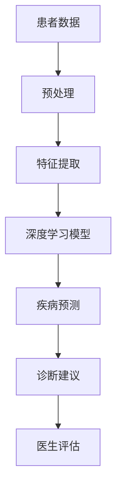
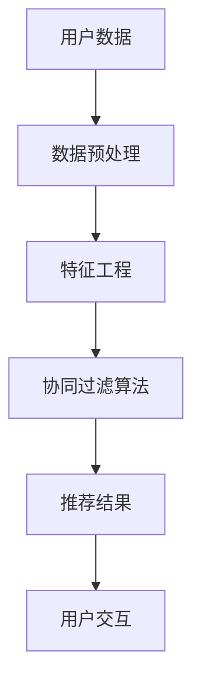
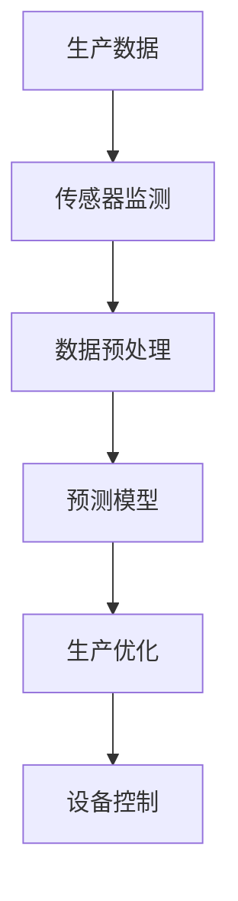
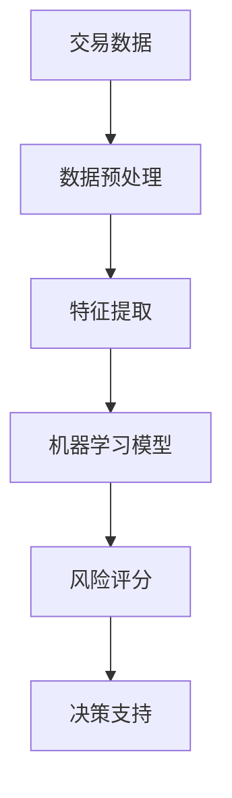
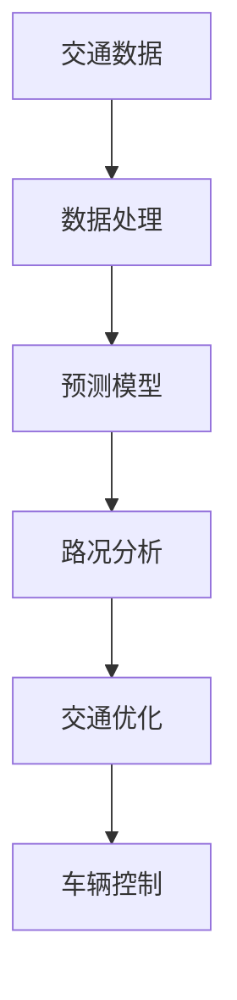

                 

# 《李开复：AI 2.0 时代的用户》

> **关键词：** AI 2.0、用户、技术、应用、挑战、机遇

> **摘要：** 本文章旨在探讨 AI 2.0 时代的用户角色，分析 AI 2.0 的定义与特点、技术发展历程、用户需求变化、应用与实践，以及 AI 2.0 时代的挑战与机遇。通过深入了解 AI 2.0 时代的用户，帮助读者更好地应对这一技术变革。

## 《李开复：AI 2.0 时代的用户》目录大纲

### 第一部分：AI 2.0 时代概述

#### 第1章：AI 2.0时代的崛起
##### 1.1 AI 2.0的定义与特点
##### 1.2 AI 2.0的核心技术
##### 1.3 AI 2.0对人类生活的影响

#### 第2章：AI 2.0的技术发展历程
##### 2.1 从AI 1.0到AI 2.0的演变
##### 2.2 关键技术突破
##### 2.3 AI 2.0的应用场景

#### 第3章：AI 2.0时代的用户思维
##### 3.1 用户需求的变化
##### 3.2 用户体验的重塑
##### 3.3 用户行为的数据分析

### 第二部分：AI 2.0时代的应用与实践

#### 第4章：AI 2.0在金融领域的应用
##### 4.1 金融行业的AI应用现状
##### 4.2 AI在风险管理中的应用
##### 4.3 AI在金融服务创新中的应用

#### 第5章：AI 2.0在医疗健康领域的应用
##### 5.1 医疗行业的AI应用现状
##### 5.2 AI在疾病诊断中的应用
##### 5.3 AI在健康管理中的应用

#### 第6章：AI 2.0在零售行业的应用
##### 6.1 零售行业的AI应用现状
##### 6.2 AI在供应链管理中的应用
##### 6.3 AI在客户服务中的应用

#### 第7章：AI 2.0在制造业的应用
##### 7.1 制造业的AI应用现状
##### 7.2 AI在智能制造中的应用
##### 7.3 AI在产品创新中的应用

#### 第8章：AI 2.0在未来的社会角色
##### 8.1 AI 2.0与未来工作
##### 8.2 AI 2.0与教育变革
##### 8.3 AI 2.0与人类社会的融合

### 第三部分：AI 2.0时代的挑战与机遇

#### 第9章：AI 2.0时代的伦理与道德
##### 9.1 AI伦理的重要性
##### 9.2 AI伦理面临的挑战
##### 9.3 AI伦理的解决方案

#### 第10章：AI 2.0时代的数据安全与隐私
##### 10.1 数据安全的重要性
##### 10.2 隐私保护的挑战
##### 10.3 数据安全与隐私的解决方案

#### 第11章：AI 2.0时代的创新与发展
##### 11.1 AI创新的趋势
##### 11.2 AI创业的机会
##### 11.3 AI在未来的发展前景

### 附录

#### 附录 A：AI 2.0学习资源
##### A.1 常用AI学习网站与工具
##### A.2 AI专业书籍推荐
##### A.3 AI在线课程推荐

#### 附录 B：AI 2.0应用案例
##### B.1 金融行业AI应用案例
##### B.2 医疗健康行业AI应用案例
##### B.3 零售行业AI应用案例
##### B.4 制造业AI应用案例

接下来，我们将分部分详细探讨 AI 2.0 时代的用户角色，帮助读者了解 AI 2.0 的定义与特点、技术发展历程、应用与实践，以及面临的挑战与机遇。让我们一起走进这个激动人心的 AI 2.0 时代吧！<|assistant|>## 第一部分：AI 2.0 时代概述

### 第1章：AI 2.0时代的崛起

在数字技术的不断演进中，人工智能（AI）已经成为推动社会进步的重要力量。AI 2.0，作为人工智能的下一个重要发展阶段，标志着人工智能技术从初期的实验性阶段向实际应用阶段的转变。AI 2.0时代的崛起，不仅带来了技术层面的革新，更深远地影响了人类社会的方方面面。

#### 1.1 AI 2.0的定义与特点

AI 2.0，也被称为“强人工智能”或“通用人工智能”（AGI），其核心在于具备与人类相似的认知能力，能够自主学习和适应复杂环境。与 AI 1.0（主要是规则驱动的符号处理系统）相比，AI 2.0具有以下几个显著特点：

1. **自主学习能力**：AI 2.0可以通过深度学习和强化学习等技术，自主从海量数据中学习并优化自身算法。
2. **多模态处理能力**：AI 2.0能够处理图像、语音、文本等多种形式的数据，实现跨领域的知识整合和应用。
3. **自适应能力**：AI 2.0可以在不同的环境中快速适应和调整，提高任务执行的效率和准确性。
4. **智能交互能力**：AI 2.0能够理解自然语言，与人类进行更自然、流畅的交互。

#### 1.2 AI 2.0的核心技术

AI 2.0的发展离不开一系列核心技术的支持，这些技术包括：

1. **深度学习**：深度学习是 AI 2.0的重要基础，通过多层神经网络模型，使计算机能够自动从大量数据中学习复杂模式。
2. **强化学习**：强化学习是 AI 2.0实现自主学习和自适应的关键技术，通过与环境的交互，不断优化决策策略。
3. **自然语言处理**：自然语言处理使得 AI 2.0能够理解和生成自然语言，实现与人类的智能对话。
4. **计算机视觉**：计算机视觉使得 AI 2.0能够理解图像和视频，实现物体识别、场景理解等高级功能。

#### 1.3 AI 2.0对人类生活的影响

AI 2.0的崛起，将对人类生活产生深远的影响，体现在以下几个方面：

1. **工作效率提升**：AI 2.0在数据分析、决策支持、自动化操作等方面，将大幅提高工作效率，减轻人类劳动负担。
2. **生活方式改变**：AI 2.0将深入渗透到生活的各个领域，如智能家居、智能医疗、智能交通等，改变人们的生活方式。
3. **工作角色转变**：随着 AI 2.0的应用，部分传统工作将面临淘汰，但同时也将创造新的工作岗位和机会。
4. **社会伦理挑战**：AI 2.0带来的技术进步，也将引发一系列伦理和道德问题，如隐私保护、算法偏见等，需要社会共同面对和解决。

综上所述，AI 2.0时代的崛起，不仅是技术层面的革新，更是对人类生活方式、工作模式和社会伦理的深刻影响。理解 AI 2.0的定义、特点、核心技术以及对人类生活的影响，将有助于我们更好地迎接这一新的时代。在接下来的章节中，我们将进一步探讨 AI 2.0的技术发展历程，以及它如何在各个领域得到应用和实践。<|assistant|>### 第2章：AI 2.0的技术发展历程

#### 2.1 从AI 1.0到AI 2.0的演变

人工智能的发展历程可以分为几个阶段，从最初的AI 1.0到如今的AI 2.0。AI 1.0时代主要依赖于规则和逻辑推理，以符号处理系统为主，例如专家系统。这种人工智能技术虽然在特定领域表现出色，但在处理复杂、动态和不确定的问题时，显得力不从心。

随着计算能力的提升和数据规模的扩大，AI 1.0逐步演变为AI 2.0。AI 2.0的核心在于自主学习和自适应能力，通过深度学习、强化学习等新兴技术，使计算机能够从海量数据中学习，从而实现更高级的智能。

#### 2.2 关键技术突破

AI 2.0的发展离不开一系列关键技术的突破，以下是一些重要的技术进展：

1. **深度学习**：深度学习是AI 2.0的核心技术之一，通过多层神经网络模型，计算机能够自动从大量数据中学习复杂模式。例如，卷积神经网络（CNN）在图像识别、自然语言处理等领域取得了显著的成果。

2. **生成对抗网络（GAN）**：生成对抗网络是一种新兴的深度学习技术，通过两个对抗网络（生成器和判别器）的博弈，实现数据的生成和识别。GAN在图像生成、图像修复等领域表现出强大的能力。

3. **强化学习**：强化学习是一种通过试错和反馈机制进行自主学习的机器学习技术。在强化学习框架中，智能体通过与环境的交互，不断优化策略，以实现目标。强化学习在游戏AI、自动驾驶等领域取得了突破性进展。

4. **迁移学习**：迁移学习是一种利用先前学到的知识来解决新问题的机器学习技术。通过迁移学习，计算机可以在新任务上快速适应，提高学习效率。迁移学习在图像识别、自然语言处理等领域具有广泛的应用。

5. **联邦学习**：联邦学习是一种分布式机器学习技术，通过将模型训练分散到多个设备上，实现数据隐私保护和协同学习。联邦学习在医疗健康、金融安全等领域具有重要的应用价值。

#### 2.3 AI 2.0的应用场景

AI 2.0在各个领域的应用场景越来越丰富，以下是一些典型的应用：

1. **金融领域**：AI 2.0在金融领域广泛应用于风险管理、智能投顾、欺诈检测等。通过深度学习和强化学习技术，金融机构能够更准确地预测市场走势，提高风险控制能力。

2. **医疗健康领域**：AI 2.0在医疗健康领域具有广泛的应用前景，包括疾病诊断、药物研发、健康管理等。通过计算机视觉和自然语言处理技术，AI 2.0能够帮助医生提高诊断准确率，降低误诊率。

3. **零售领域**：AI 2.0在零售领域助力商家实现个性化推荐、智能客服、智能供应链管理等。通过大数据分析和机器学习技术，零售企业能够更好地了解消费者需求，优化供应链管理，提高运营效率。

4. **制造业领域**：AI 2.0在制造业领域助力企业实现智能制造、故障预测、设备优化等。通过计算机视觉和机器学习技术，企业能够提高生产效率，降低设备故障率，提升产品质量。

5. **教育领域**：AI 2.0在教育领域有助于实现个性化教学、智能评测、学习资源推荐等。通过大数据分析和机器学习技术，教育机构能够更好地了解学生的学习情况，为学生提供更有针对性的教学方案。

6. **交通领域**：AI 2.0在交通领域有助于实现智能交通管理、自动驾驶、车联网等。通过计算机视觉和自然语言处理技术，交通系统能够更加高效地运作，提高道路通行能力，降低交通事故率。

综上所述，AI 2.0的技术发展历程展示了人工智能从理论走向实践的重要里程碑。通过关键技术的突破和应用场景的拓展，AI 2.0正在深刻地改变着我们的生活方式和社会运行模式。在接下来的章节中，我们将深入探讨 AI 2.0时代的用户思维，分析用户需求的变化以及用户体验的重塑。这将帮助我们更好地理解 AI 2.0时代的用户角色，为未来发展做好准备。<|assistant|>### 第3章：AI 2.0时代的用户思维

#### 3.1 用户需求的变化

在AI 2.0时代，用户需求发生了显著变化。随着AI技术的不断进步，用户对智能产品的需求不再仅仅是满足基本功能，而是更加注重个性化和智能化体验。以下是一些关键的用户需求变化：

1. **个性化体验**：用户期望智能系统能够根据个人喜好、行为和需求提供定制化的服务。例如，在购物时，用户希望得到个性化的商品推荐，而非简单的广告推送。

2. **实时响应**：用户期待智能系统能够实时响应用户请求，提供快速、准确的服务。例如，在智能客服中，用户希望能够在几秒内得到问题的解答，而不是等待长时间的回复。

3. **隐私保护**：用户越来越重视个人隐私的保护，对于智能系统的数据收集和使用持谨慎态度。用户希望智能系统能够透明地告知数据处理方式，并提供隐私设置选项。

4. **易于使用**：用户期望智能系统具有简洁、直观的用户界面，易于操作和理解。复杂、繁琐的操作流程将导致用户流失。

5. **情感共鸣**：随着AI技术的发展，用户不仅期望智能系统能够提供功能上的帮助，还希望系统能够理解自己的情感需求，提供情感上的共鸣和支持。

#### 3.2 用户体验的重塑

为了满足用户变化的需求，AI 2.0时代的用户体验也在不断重塑：

1. **个性化推荐**：基于用户的兴趣和行为数据，AI 2.0系统可以提供个性化的内容推荐。例如，在音乐播放应用中，系统可以基于用户的历史播放记录，推荐用户可能喜欢的歌曲。

2. **智能交互**：通过自然语言处理和语音识别技术，AI 2.0系统能够实现与用户的自然对话，提供更为人性化的服务。例如，智能语音助手可以帮助用户完成各种任务，如查询天气、设置提醒等。

3. **实时反馈**：AI 2.0系统可以实时分析用户的行为数据，提供即时的反馈和优化建议。例如，在电商平台上，系统可以根据用户的购物习惯，提供实时的优惠信息和购物建议。

4. **隐私保护设计**：为了增强用户的信任，AI 2.0系统在设计时需要注重隐私保护。例如，可以提供透明化的数据使用说明，让用户自主选择是否分享个人信息。

5. **情感计算**：通过情感计算技术，AI 2.0系统可以理解用户的情感状态，提供针对性的情感支持。例如，在心理健康应用中，系统可以通过语音和文字分析，了解用户的情绪波动，并提供相应的心理建议。

#### 3.3 用户行为的数据分析

用户行为的数据分析是AI 2.0时代的重要手段，通过分析用户行为数据，企业可以更好地了解用户需求，优化产品和服务。以下是一些关键的方面：

1. **行为模式识别**：通过分析用户的浏览、购买、搜索等行为数据，可以识别用户的行为模式，从而预测用户未来的行为。例如，通过分析用户的购物车数据，可以预测用户可能购买的商品。

2. **个性化营销**：基于用户行为数据，企业可以进行个性化的营销活动。例如，通过分析用户的浏览历史，可以推荐相关的商品和优惠信息。

3. **用户满意度分析**：通过分析用户对产品或服务的评价和反馈，可以评估用户的满意度。例如，通过用户评价数据，可以识别产品或服务的改进点。

4. **用户流失预警**：通过分析用户的行为数据，可以及时发现用户流失的信号。例如，通过分析用户的使用频率和活跃度，可以预警潜在的流失用户。

5. **交叉销售和推荐**：通过分析用户行为数据，可以实现交叉销售和推荐。例如，通过分析用户的购物车数据，可以推荐相关的商品。

总之，AI 2.0时代的用户思维发生了深刻变化，用户需求更加个性化和智能化，用户体验也在不断重塑。通过用户行为的数据分析，企业可以更好地满足用户需求，提高用户满意度。在接下来的章节中，我们将深入探讨AI 2.0在金融、医疗健康、零售、制造业等领域的应用与实践。这将帮助我们更全面地了解AI 2.0时代的技术进步和应用前景。<|assistant|>### 第4章：AI 2.0在金融领域的应用

随着AI技术的不断演进，金融行业正在经历一场深刻的变革。AI 2.0在金融领域的应用，不仅提升了金融机构的服务质量和运营效率，还为金融产品创新和市场竞争力提升提供了新的动力。

#### 4.1 金融行业的AI应用现状

目前，AI 2.0在金融行业中的应用已经相当广泛，涵盖了风险管理、智能投顾、欺诈检测、客户服务等多个方面。

1. **风险管理**：AI 2.0通过大数据分析和机器学习技术，可以对市场风险、信用风险等进行全面分析。例如，金融机构可以使用AI技术对贷款申请者进行信用评估，预测其违约风险，从而制定更科学的贷款策略。

2. **智能投顾**：AI 2.0可以分析用户的历史投资数据和市场动态，为用户提供个性化的投资建议。智能投顾不仅能够提高投资收益，还能降低投资者的投资风险。

3. **欺诈检测**：AI 2.0通过机器学习和模式识别技术，可以实时监测金融交易中的异常行为，有效识别和防范欺诈活动。

4. **客户服务**：AI 2.0可以通过智能客服系统提供24/7的客户服务，提高客户满意度。例如，智能客服可以自动处理常见问题，并将复杂问题分配给人工客服。

5. **信用评分**：AI 2.0可以基于用户的金融行为、社交网络数据等多维度信息，建立更为精准的信用评分模型，为金融机构提供更可靠的信用评估依据。

#### 4.2 AI在风险管理中的应用

在风险管理方面，AI 2.0的应用主要体现在以下几个方面：

1. **信用风险评估**：传统的信用风险评估主要依赖于借款人的财务报表和信用历史。而AI 2.0可以通过大数据分析和机器学习技术，结合借款人的社交网络、购物习惯等多维度信息，提供更为精准的信用评估。

   **伪代码示例：**
   ```
   function credit_risk_evaluation(data):
       # 数据预处理
       processed_data = preprocess_data(data)
       
       # 建立信用评分模型
       model = train_credit_risk_model(processed_data)
       
       # 进行信用评估
       risk_score = model.predict(processed_data)
       
       return risk_score
   ```

2. **市场风险预测**：AI 2.0可以通过分析大量的市场数据，如股价、汇率、宏观经济指标等，预测市场走势，帮助金融机构制定更为科学的风险管理策略。

   **伪代码示例：**
   ```
   function market_risk_prediction(data):
       # 数据预处理
       processed_data = preprocess_data(data)
       
       # 建立市场风险预测模型
       model = train_market_risk_model(processed_data)
       
       # 进行市场风险预测
       risk_level = model.predict(processed_data)
       
       return risk_level
   ```

3. **欺诈检测**：AI 2.0可以通过机器学习和模式识别技术，实时监测金融交易中的异常行为，识别潜在的欺诈活动。

   **伪代码示例：**
   ```
   function fraud_detection(transaction_data):
       # 数据预处理
       processed_data = preprocess_data(transaction_data)
       
       # 建立欺诈检测模型
       model = train_fraud_detection_model(processed_data)
       
       # 进行欺诈检测
       is_fraud = model.predict(processed_data)
       
       return is_fraud
   ```

#### 4.3 AI在金融服务创新中的应用

AI 2.0不仅提升了金融行业的风险管理能力，还在金融服务创新方面发挥了重要作用：

1. **智能投顾**：通过AI技术，金融机构可以为用户提供个性化的投资建议。智能投顾系统会根据用户的风险偏好、投资目标和市场动态，制定最优的投资策略。

2. **个性化理财产品**：AI 2.0可以帮助金融机构根据用户的需求和风险承受能力，设计个性化的理财产品。例如，通过分析用户的投资历史和偏好，推荐最适合的投资组合。

3. **智能客服**：AI 2.0可以通过自然语言处理和机器学习技术，实现智能客服系统，提供24/7的客户服务。智能客服可以自动处理常见问题，并将复杂问题分配给人工客服。

4. **区块链技术**：AI 2.0与区块链技术的结合，可以提升金融交易的透明度和安全性。例如，通过智能合约，实现自动化交易和结算，降低交易成本。

综上所述，AI 2.0在金融领域的应用不仅提升了风险管理能力，还推动了金融服务创新。通过AI技术的深度应用，金融机构可以更好地满足用户需求，提高市场竞争力。在接下来的章节中，我们将继续探讨AI 2.0在医疗健康、零售、制造业等领域的应用与实践。这将帮助我们更全面地了解AI 2.0时代的技术进步和应用前景。<|assistant|>### 第5章：AI 2.0在医疗健康领域的应用

医疗健康领域是AI 2.0技术的另一重要应用场景，AI 2.0通过其强大的数据处理和分析能力，为医疗诊断、疾病治疗、健康管理等方面带来了革命性的变化。

#### 5.1 医疗行业的AI应用现状

目前，AI 2.0在医疗行业的应用已经取得了一系列显著成果，涵盖了从疾病诊断到健康管理的各个环节：

1. **疾病诊断**：AI 2.0在医学影像分析、电子健康记录（EHR）处理、基因组学数据分析等方面表现出色。例如，通过深度学习和计算机视觉技术，AI 2.0可以帮助医生快速、准确地诊断疾病，如肺癌、乳腺癌、皮肤病等。

2. **个性化治疗**：AI 2.0可以根据患者的基因信息、病历数据和临床表现，为患者制定个性化的治疗方案。这种个性化的治疗方法不仅提高了治疗效果，还减少了不必要的副作用。

3. **药物研发**：AI 2.0通过分析大量的药物数据和生物信息，可以帮助研究人员发现新的药物靶点，加速药物研发过程。

4. **健康监测**：AI 2.0可以通过可穿戴设备和移动应用，实时监测患者的健康状况，如心率、血压、血糖等。通过数据分析和预测模型，AI 2.0可以及时发现健康问题，并提供相应的健康建议。

5. **医疗资源优化**：AI 2.0可以通过数据分析，优化医疗资源的分配和利用。例如，通过分析医院的就诊数据，AI 2.0可以帮助医院合理规划床位、医生和设备的配置，提高医疗服务效率。

#### 5.2 AI在疾病诊断中的应用

AI 2.0在疾病诊断中的应用是其最具潜力的领域之一。以下是一些具体的例子：

1. **医学影像分析**：AI 2.0可以通过深度学习和计算机视觉技术，对医学影像（如X光、CT、MRI等）进行自动分析，帮助医生识别病变区域和疾病类型。例如，深度学习算法可以自动识别肺癌的早期征兆，提高诊断准确率。

   **伪代码示例：**
   ```
   function medical_image_analysis(image):
       # 数据预处理
       processed_image = preprocess_image(image)
       
       # 建立影像分析模型
       model = train_medical_image_model(processed_image)
       
       # 进行影像分析
       diagnosis = model.predict(processed_image)
       
       return diagnosis
   ```

2. **电子健康记录（EHR）处理**：AI 2.0可以通过自然语言处理技术，自动分析和理解电子健康记录中的文字信息，提取关键医学信息，帮助医生进行诊断和制定治疗方案。

   **伪代码示例：**
   ```
   function ehr_analysis(ehr):
       # 数据预处理
       processed_ehr = preprocess_ehr(ehr)
       
       # 建立EHR分析模型
       model = train_ehr_analysis_model(processed_ehr)
       
       # 进行EHR分析
       diagnosis = model.predict(processed_ehr)
       
       return diagnosis
   ```

3. **基因组学数据分析**：AI 2.0可以通过机器学习算法，分析患者的基因组数据，预测疾病风险，为患者提供个性化的治疗建议。

   **伪代码示例：**
   ```
   function genomic_data_analysis(genome_data):
       # 数据预处理
       processed_genome_data = preprocess_genome_data(genome_data)
       
       # 建立基因组分析模型
       model = train_genomic_data_model(processed_genome_data)
       
       # 进行基因组分析
       disease_risk = model.predict(processed_genome_data)
       
       return disease_risk
   ```

#### 5.3 AI在健康管理中的应用

AI 2.0在健康管理中的应用，不仅能够提高患者的自我管理能力，还可以优化医疗服务的整体效率。以下是一些关键应用：

1. **可穿戴设备与健康监测**：通过可穿戴设备和移动应用，AI 2.0可以实时监测患者的心率、血压、血糖等健康指标，提供个性化的健康建议。例如，通过分析患者的健康数据，AI 2.0可以提醒患者按时服药或调整生活方式。

   **伪代码示例：**
   ```
   function health_monitoring(health_data):
       # 数据预处理
       processed_health_data = preprocess_health_data(health_data)
       
       # 建立健康监测模型
       model = train_health_monitoring_model(processed_health_data)
       
       # 进行健康监测
       health_status = model.predict(processed_health_data)
       
       return health_status
   ```

2. **远程医疗服务**：AI 2.0可以通过远程医疗服务系统，为患者提供在线咨询、诊断和治疗建议。这不仅可以减少患者的就诊成本和时间，还可以提高医疗资源的利用效率。

3. **健康数据分析与预测**：AI 2.0可以通过分析大量的健康数据，建立预测模型，预测患者未来的健康状况和疾病风险。例如，通过分析患者的健康数据和家族病史，AI 2.0可以预测患者未来几年内可能发生的健康问题，并提供相应的预防建议。

综上所述，AI 2.0在医疗健康领域的应用正在不断拓展，从疾病诊断到健康管理，AI 2.0正在为医疗行业带来深刻的变革。通过AI技术的深度应用，医疗行业将能够提供更精准、更高效的医疗服务，为患者的健康保驾护航。在接下来的章节中，我们将探讨AI 2.0在零售、制造业等领域的应用与实践。这将帮助我们更全面地了解AI 2.0时代的技术进步和应用前景。<|assistant|>### 第6章：AI 2.0在零售行业的应用

零售行业正经历着前所未有的变革，AI 2.0技术的引入为零售商带来了新的增长动力，使得个性化推荐、智能供应链管理和客户服务等方面的效率得到了显著提升。

#### 6.1 零售行业的AI应用现状

AI 2.0在零售行业的应用已经取得了显著的进展，以下是一些主要的应用现状：

1. **个性化推荐**：通过分析消费者的购买历史、浏览行为和偏好，AI 2.0能够为消费者提供个性化的商品推荐。这种推荐系统能够提高消费者的满意度和购买转化率。

2. **智能供应链管理**：AI 2.0通过预测分析技术，能够优化库存管理，减少缺货和过剩现象。同时，AI 2.0还可以帮助零售商实时监控供应链的动态，提高供应链的透明度和响应速度。

3. **智能客服**：基于自然语言处理和机器学习技术，AI 2.0能够实现智能客服系统，自动处理常见客户问题，提供24/7的在线支持，提高客户体验和满意度。

4. **库存优化**：AI 2.0可以通过分析历史销售数据、季节性因素和市场需求，帮助零售商更准确地预测库存需求，优化库存水平，减少资金占用。

5. **市场分析**：AI 2.0可以通过分析大量的市场数据，帮助零售商了解市场趋势和消费者行为，从而制定更有效的市场策略。

#### 6.2 AI在供应链管理中的应用

在供应链管理方面，AI 2.0的应用主要体现在以下几个方面：

1. **库存预测与优化**：通过机器学习和大数据分析，AI 2.0能够预测未来的市场需求，优化库存水平。例如，基于历史销售数据和季节性因素，AI 2.0可以预测某种商品在特定时间的需求量，从而帮助零售商调整库存。

   **伪代码示例：**
   ```
   function inventory_prediction(sales_data, seasonal_data):
       # 数据预处理
       processed_data = preprocess_data(sales_data, seasonal_data)
       
       # 建立库存预测模型
       model = train_inventory_prediction_model(processed_data)
       
       # 进行库存预测
       predicted_demand = model.predict(processed_data)
       
       return predicted_demand
   ```

2. **供应链可视化**：AI 2.0可以通过可视化技术，实时监控供应链的各个环节，提高供应链的透明度和可控性。

3. **物流优化**：AI 2.0可以通过优化算法，优化物流路线和时间安排，减少运输成本，提高物流效率。

4. **供应链风险预测**：AI 2.0可以通过分析供应链中的各种数据，预测潜在的风险，如供应链中断、供应链瓶颈等，从而采取相应的预防措施。

   **伪代码示例：**
   ```
   function supply_chain_risk_prediction(supply_chain_data):
       # 数据预处理
       processed_data = preprocess_data(supply_chain_data)
       
       # 建立供应链风险预测模型
       model = train_supply_chain_risk_model(processed_data)
       
       # 进行供应链风险预测
       risk_level = model.predict(processed_data)
       
       return risk_level
   ```

#### 6.3 AI在客户服务中的应用

AI 2.0在客户服务中的应用，极大地提升了零售商的服务质量和效率，以下是一些具体的应用：

1. **智能客服**：通过自然语言处理和机器学习技术，AI 2.0可以自动处理常见的客户咨询，如订单查询、退换货政策等。智能客服系统能够提供24/7的服务，减少人工客服的工作量。

2. **个性化营销**：AI 2.0可以根据消费者的购买历史和偏好，提供个性化的营销活动，如发送个性化的优惠券、推荐商品等。

3. **情感分析**：AI 2.0可以通过情感分析技术，分析客户的反馈和评价，了解客户的需求和满意度，从而优化产品和服务。

4. **自动化客服**：通过自动化客服技术，AI 2.0可以自动处理一些复杂的客户问题，如订单取消、售后服务等，提高客服效率和客户满意度。

综上所述，AI 2.0在零售行业的应用，不仅提升了供应链管理的效率和客户服务的质量，还为零售商提供了新的增长机会。通过AI技术的深度应用，零售行业将能够更好地满足消费者需求，提高市场竞争力。在接下来的章节中，我们将探讨AI 2.0在制造业领域的应用与实践。这将帮助我们更全面地了解AI 2.0时代的技术进步和应用前景。<|assistant|>### 第7章：AI 2.0在制造业的应用

制造业作为全球经济的支柱产业，正经历着由AI 2.0技术驱动的深刻变革。AI 2.0在制造业中的应用，不仅提升了生产效率和质量，还推动了智能制造和产品创新的实现。

#### 7.1 制造业的AI应用现状

目前，AI 2.0在制造业中的应用已经渗透到生产的各个环节，以下是一些主要的应用现状：

1. **生产优化**：通过机器学习和预测分析，AI 2.0可以优化生产计划，减少生产过程中的浪费和延误。例如，基于历史生产数据和实时监控数据，AI 2.0可以预测设备故障和生产线瓶颈，提前采取措施。

2. **质量检测**：AI 2.0可以通过计算机视觉和深度学习技术，自动检测产品质量，提高检测效率和准确性。例如，AI 2.0系统可以在生产线上实时检测产品外观和尺寸，识别出不合格品。

3. **供应链管理**：AI 2.0可以通过数据分析，优化供应链管理，提高供应链的透明度和响应速度。例如，AI 2.0可以帮助制造商实时监控原材料库存，预测需求，优化采购计划。

4. **设备维护**：AI 2.0可以通过预测模型，预测设备故障，提前进行维护，减少设备停机时间。例如，AI 2.0系统可以通过传感器数据，分析设备的运行状态，预测潜在的故障点。

5. **产品创新**：AI 2.0可以帮助制造商进行产品设计和创新，通过仿真和优化技术，提高产品的性能和可靠性。例如，AI 2.0可以帮助设计师快速生成多种设计方案，通过模拟分析，选择最佳方案。

#### 7.2 AI在智能制造中的应用

智能制造是制造业的未来趋势，AI 2.0在智能制造中的应用，使得生产过程更加自动化、智能化和高效化。以下是一些关键应用：

1. **工业机器人**：AI 2.0可以控制工业机器人，实现生产过程的自动化。例如，AI 2.0机器人可以在无人监督的情况下，完成焊接、组装、搬运等工作，提高生产效率。

2. **自适应生产系统**：AI 2.0可以通过自适应控制技术，实现生产系统的智能化调整。例如，AI 2.0系统可以根据生产过程中的变化，自动调整生产参数，确保产品质量。

3. **预测性维护**：AI 2.0可以通过预测模型，预测设备故障，实现预测性维护。例如，AI 2.0系统可以通过传感器数据，分析设备的运行状态，预测潜在的故障点，提前进行维护，减少设备停机时间。

4. **智能化生产计划**：AI 2.0可以通过预测分析技术，优化生产计划，提高生产效率。例如，AI 2.0系统可以根据订单量、原材料库存和生产能力，自动生成最优的生产计划。

5. **大数据分析**：AI 2.0可以通过大数据分析，优化生产过程，提高产品质量。例如，AI 2.0系统可以通过分析生产数据，识别生产过程中的问题，提供改进建议。

#### 7.3 AI在产品创新中的应用

AI 2.0在产品创新中的应用，为制造业带来了新的机遇。以下是一些关键应用：

1. **产品设计**：AI 2.0可以帮助设计师快速生成多种设计方案，通过仿真和优化技术，选择最佳方案。例如，AI 2.0可以通过计算机视觉和深度学习技术，分析用户需求和市场趋势，生成符合市场需求的产品设计。

2. **材料创新**：AI 2.0可以通过数据分析，发现新的材料和应用场景。例如，AI 2.0系统可以通过分析大量的材料数据，预测材料的性能和适用范围，为新材料的研发提供指导。

3. **仿真测试**：AI 2.0可以通过仿真技术，对新产品进行测试和优化。例如，AI 2.0系统可以通过仿真分析，评估产品的性能和可靠性，提供改进建议。

4. **用户体验优化**：AI 2.0可以通过用户体验分析，优化产品的设计和功能。例如，AI 2.0系统可以通过分析用户反馈和使用数据，识别用户需求，提供改进方案。

综上所述，AI 2.0在制造业中的应用，正在推动制造业向智能化、自动化和高效化方向发展。通过AI技术的深度应用，制造业将能够实现更高的生产效率、更优的产品质量和更强的市场竞争力。在接下来的章节中，我们将探讨AI 2.0在未来的社会角色，包括与未来工作的关系、教育变革以及人类社会的融合。这将帮助我们更全面地了解AI 2.0时代的社会影响。<|assistant|>### 第8章：AI 2.0在未来的社会角色

#### 8.1 AI 2.0与未来工作

随着AI 2.0技术的不断发展，未来工作将面临巨大的变革。一方面，AI 2.0将取代一些重复性和低技能的工作，如数据录入、客服等；另一方面，AI 2.0也将创造出新的工作岗位和机会，如AI工程师、数据科学家、智能产品设计师等。

1. **自动化与岗位取代**：AI 2.0可以通过自动化技术，大幅提高生产效率，减少人力成本。例如，自动化生产线、智能客服系统等，都能在一定程度上取代人工操作。然而，这也可能导致一些传统岗位的减少，需要劳动者适应新的工作环境。

2. **技能需求变化**：AI 2.0的发展将使得技能需求发生重大变化。未来的劳动者需要具备更强的技术能力和创新能力，如编程能力、数据分析能力、机器学习知识等。同时，跨学科的知识和技能也将越来越重要。

3. **终身学习**：在AI 2.0时代，知识更新速度加快，劳动者需要具备终身学习的意识和能力，不断更新自己的知识体系和技能。

#### 8.2 AI 2.0与教育变革

AI 2.0对教育领域的影响也是深远而广泛的。一方面，AI 2.0可以提供个性化的学习体验，满足不同学生的学习需求；另一方面，AI 2.0也推动了教育模式的创新和改革。

1. **个性化学习**：AI 2.0可以通过数据分析，了解学生的学习情况，提供个性化的学习方案。例如，通过智能辅导系统，AI 2.0可以为学生提供针对性的学习建议，帮助学生提高学习效率。

2. **在线教育**：AI 2.0推动了在线教育的快速发展。通过在线课程和学习平台，学生可以随时随地学习，打破了时间和空间的限制。同时，AI 2.0还可以提供智能化的学习工具和资源，如虚拟实验室、在线考试系统等。

3. **教育公平**：AI 2.0有助于缩小教育差距，提高教育公平。通过在线教育平台，偏远地区的孩子也可以接触到优质的教育资源，获得同等的学习机会。

4. **教育创新**：AI 2.0推动了教育模式的创新，如混合式学习、翻转课堂等。这些新型教育模式更加注重学生的主动学习和实践能力的培养。

#### 8.3 AI 2.0与人类社会的融合

AI 2.0不仅改变了工作和教育，还将深刻地影响人类社会的发展。一方面，AI 2.0将推动社会生产力的提升，提高人类的生活质量；另一方面，AI 2.0也将带来一系列社会伦理和道德问题，需要人类社会共同面对。

1. **生产力提升**：AI 2.0通过自动化、智能化技术，可以大幅提高生产效率，降低生产成本。这将有助于推动社会经济的发展，提高人类的生活水平。

2. **社会变革**：AI 2.0将带来一系列社会变革，如工作模式、教育模式、生活方式等。这些变革将深刻影响人类社会的发展方向，需要我们深入思考。

3. **伦理与道德**：AI 2.0的发展也将引发一系列伦理和道德问题，如隐私保护、算法公平、人工智能责任等。这些问题需要人类社会共同探讨和解决。

4. **全球合作**：在AI 2.0时代，全球合作变得更加重要。各国需要共同制定AI的发展标准和规范，共同应对AI带来的挑战和机遇。

总之，AI 2.0在未来的社会角色将更加多样化，从工作、教育到社会生活，AI 2.0都将产生深远的影响。理解和应对这些影响，将有助于我们更好地迎接AI 2.0时代，实现人类的可持续发展。在接下来的章节中，我们将探讨AI 2.0时代的挑战与机遇，深入分析AI 2.0伦理与道德、数据安全与隐私等问题。这将帮助我们更全面地了解AI 2.0时代的发展前景。<|assistant|>### 第9章：AI 2.0时代的伦理与道德

随着AI 2.0技术的飞速发展，人工智能在给社会带来巨大便利的同时，也引发了一系列伦理与道德问题。如何确保AI技术的健康发展，保护人类的基本权利，成为我们必须面对的紧迫挑战。

#### 9.1 AI伦理的重要性

AI伦理是指在人工智能设计和应用过程中，遵循的道德规范和价值标准。AI伦理的重要性体现在以下几个方面：

1. **公平性**：AI系统在处理数据时，可能会出现算法偏见，导致对某些群体不公平对待。例如，如果招聘系统在训练数据中存在性别偏见，那么在招聘过程中可能会对女性产生歧视。

2. **透明性**：AI系统的决策过程应该透明，用户有权了解AI系统是如何做出决策的。如果AI系统的决策过程不透明，用户将无法判断AI系统的决策是否合理。

3. **责任性**：AI系统在出现错误或造成损害时，应该明确责任归属。目前，许多AI系统是由企业或机构开发的，一旦发生问题，责任的归属往往不明确。

4. **隐私保护**：AI系统在收集和使用用户数据时，应该尊重用户的隐私权。未经用户同意，不得擅自收集、使用或泄露用户数据。

#### 9.2 AI伦理面临的挑战

AI伦理在实践过程中面临诸多挑战，主要包括以下几个方面：

1. **算法偏见**：算法偏见是指AI系统在处理数据时，对某些群体存在歧视现象。例如，一些招聘系统可能会根据候选人的性别、种族等信息，对其进行歧视。

   **伪代码示例：**
   ```
   function biased_recruitment(candidate_data):
       # 检查算法偏见
       if candidate_data['gender'] == 'female':
           bias_score = calculate_bias(candidate_data)
           if bias_score > threshold:
               reject_candidate(candidate_data)
   ```

2. **透明性不足**：许多AI系统在设计和开发过程中，缺乏透明性。用户无法了解AI系统是如何做出决策的，这可能导致用户对AI系统的信任度下降。

3. **责任归属不清**：当AI系统出现错误或造成损害时，责任的归属往往不明确。例如，自动驾驶汽车发生交通事故，责任可能涉及制造商、开发者、驾驶员等多个方面。

4. **隐私泄露**：AI系统在收集和使用用户数据时，可能存在隐私泄露的风险。未经用户同意，AI系统不得擅自收集、使用或泄露用户数据。

#### 9.3 AI伦理的解决方案

为了解决AI伦理问题，我们需要从制度、技术和文化等多方面入手，提出一系列解决方案：

1. **立法与监管**：政府应制定相关法律法规，规范AI系统设计和应用过程中的伦理问题。例如，明确AI系统的责任归属，确保用户数据隐私。

2. **算法透明性**：提高AI系统的透明性，让用户了解AI系统的决策过程。例如，可以开发可视化工具，展示AI系统的决策路径和依据。

3. **算法公平性**：在AI系统设计和应用过程中，注重算法公平性，避免对某些群体产生歧视。例如，在招聘系统中，可以采用反偏见算法，确保对所有候选人的公平对待。

4. **数据隐私保护**：加强数据隐私保护，确保用户数据的安全。例如，可以采用数据加密、匿名化等技术手段，保护用户数据不被泄露。

5. **社会共识**：推动社会各界共同关注AI伦理问题，形成广泛的共识。例如，通过媒体宣传、教育培训等方式，提高公众对AI伦理的认识和关注。

6. **伦理审查**：在AI系统开发和应用过程中，引入伦理审查机制。例如，可以设立专门的伦理委员会，对AI系统的设计、开发和应用进行伦理审查。

7. **跨学科合作**：加强跨学科合作，促进AI伦理研究的深入发展。例如，可以邀请伦理学家、法律专家、社会学家等参与AI伦理研究，共同探讨解决方案。

总之，AI 2.0时代的伦理与道德问题不可忽视。通过制度、技术和文化等多方面的努力，我们有望解决AI伦理问题，确保AI技术的健康发展，为人类社会带来更多福祉。在接下来的章节中，我们将探讨AI 2.0时代的数据安全与隐私问题，深入分析这一领域的挑战与机遇。这将帮助我们更全面地了解AI 2.0时代的发展前景。<|assistant|>### 第10章：AI 2.0时代的数据安全与隐私

随着AI 2.0技术的迅速发展，数据安全与隐私问题成为了关注的焦点。在AI 2.0时代，数据不仅是人工智能系统的基础资源，也是企业和个人最为重要的资产。如何确保数据的安全与隐私，成为我们必须面对的重大挑战。

#### 10.1 数据安全的重要性

数据安全是指保护数据免受未经授权的访问、泄露、篡改和破坏。在AI 2.0时代，数据安全的重要性体现在以下几个方面：

1. **业务连续性**：数据是现代企业运行的核心，数据泄露或损坏可能导致业务中断，对企业造成巨大的经济损失。

2. **用户信任**：用户对企业的信任取决于数据的安全保障。一旦数据泄露，用户对企业的信任度将大幅下降，可能导致客户流失。

3. **法律法规合规**：许多国家和地区都制定了严格的数据保护法律法规，如欧盟的《通用数据保护条例》（GDPR）。企业必须遵守这些法规，否则将面临高额罚款。

4. **社会责任**：保护用户数据是企业应尽的社会责任。企业应确保用户数据不被滥用，以维护用户权益。

#### 10.2 隐私保护的挑战

在AI 2.0时代，隐私保护面临着诸多挑战，主要体现在以下几个方面：

1. **数据量庞大**：随着互联网和物联网的普及，数据量呈现爆炸式增长。这些数据中包含大量个人隐私信息，如姓名、地址、电话号码、购物记录等。

2. **数据收集和使用不规范**：一些企业为了获取更多用户数据，未经用户同意便收集和使用用户隐私信息。这种行为不仅违反了法律法规，也损害了用户的隐私权益。

3. **数据泄露风险**：随着数据量的增加，数据泄露的风险也在上升。黑客攻击、内部泄露、数据丢失等都是常见的隐私泄露风险。

4. **算法偏见**：AI 2.0系统在处理数据时，可能会出现算法偏见，导致对某些群体产生歧视。这可能会加剧社会不公平现象。

#### 10.3 数据安全与隐私的解决方案

为了应对数据安全与隐私的挑战，我们需要从技术和管理两方面入手，提出一系列解决方案：

1. **加密技术**：加密技术是保护数据安全的重要手段。通过对数据进行加密，即使数据被非法获取，也无法被解密和读取。常用的加密技术包括对称加密、非对称加密和哈希算法。

2. **访问控制**：访问控制是指限制对数据的访问权限。通过对用户身份进行验证和授权，确保只有授权用户才能访问数据。常用的访问控制技术包括身份认证、授权和访问控制列表（ACL）。

3. **数据匿名化**：数据匿名化是一种保护隐私的有效方法。通过对数据进行去标识化处理，使数据无法直接识别特定个人。常用的数据匿名化技术包括数据混淆、数据打乱和数据替换。

4. **隐私计算**：隐私计算是一种在数据使用过程中保护隐私的技术。通过在数据不离开用户设备的情况下进行计算，确保数据在传输和使用过程中的安全。常用的隐私计算技术包括同态加密和多方安全计算。

5. **数据安全法律法规**：制定和执行严格的数据安全法律法规，规范企业的数据收集和使用行为。例如，欧盟的《通用数据保护条例》（GDPR）对数据保护提出了严格的要求，包括用户同意、数据最小化、数据可访问性等。

6. **隐私保护设计**：在产品和服务设计过程中，注重隐私保护。例如，可以采用隐私友好型的设计原则，如最小化数据收集、用户透明度、用户控制权等。

7. **隐私安全培训**：加强员工的数据安全与隐私保护意识，提高员工对数据安全与隐私保护的认识和技能。例如，可以定期开展数据安全与隐私保护培训，提高员工的安全意识。

8. **第三方审计和认证**：引入第三方审计和认证机构，对企业的数据安全与隐私保护措施进行审查和认证。这有助于提高企业数据安全与隐私保护的可信度。

总之，在AI 2.0时代，数据安全与隐私保护是至关重要的。通过技术和管理手段的综合运用，我们可以更好地保护用户数据的安全与隐私，确保AI技术的健康发展。在接下来的章节中，我们将探讨AI 2.0时代的创新与发展，深入分析AI技术的趋势、创业机会以及未来的发展前景。这将帮助我们更全面地了解AI 2.0时代的发展方向。<|assistant|>### 第11章：AI 2.0时代的创新与发展

随着AI 2.0技术的不断进步，AI领域的创新与发展呈现出蓬勃的态势。在这一章节中，我们将探讨AI 2.0时代的创新趋势、创业机会以及未来的发展前景。

#### 11.1 AI创新的趋势

AI 2.0时代的创新趋势主要体现在以下几个方面：

1. **多模态人工智能**：AI技术正逐步从单一模态（如图像、语音、文本等）扩展到多模态处理。通过整合不同类型的数据，AI系统能够更全面地理解复杂信息，提供更精准的服务。

2. **联邦学习**：联邦学习是一种分布式机器学习技术，它允许多个机构在各自的数据集上进行模型训练，同时保持数据隐私。这种技术有助于打破数据孤岛，实现数据价值的最大化。

3. **增强现实与虚拟现实**：增强现实（AR）和虚拟现实（VR）技术的发展，使得AI在娱乐、教育、医疗等领域得到广泛应用。通过AI与AR/VR技术的结合，用户可以获得更加沉浸式的体验。

4. **迁移学习与少样本学习**：迁移学习和少样本学习技术使得AI系统能够在少量数据上进行有效训练。这种技术有助于解决数据稀缺的问题，提高AI在新兴领域的应用能力。

5. **生成对抗网络（GAN）**：GAN技术在图像生成、视频合成等领域取得了显著成果。通过生成对抗，AI系统能够创造出高度逼真的虚拟图像和视频。

#### 11.2 AI创业的机会

AI 2.0时代为创业者提供了丰富的机会，以下是一些值得关注的创业领域：

1. **人工智能解决方案提供商**：为企业提供定制化的AI解决方案，如智能客服、智能供应链管理、智能工厂等。

2. **人工智能平台与服务**：开发面向开发者、企业和个人的AI平台与服务，如AI模型训练工具、AI应用市场、AI开发者社区等。

3. **边缘计算与物联网**：结合边缘计算和物联网技术，开发智能设备、智能家居、智能城市等解决方案。

4. **数据隐私保护与安全**：提供数据隐私保护与安全解决方案，如加密技术、隐私计算、数据安全审计等。

5. **医疗健康领域**：利用AI技术，开发智能诊断系统、个性化治疗方案、健康监测设备等。

6. **金融科技**：开发智能投顾、智能风控、区块链金融等解决方案，提高金融行业的效率和安全性。

7. **自动驾驶与智慧交通**：结合自动驾驶技术和智能交通系统，开发智能交通解决方案，提高交通效率和安全性。

8. **教育与培训**：利用AI技术，开发个性化学习平台、智能教育机器人、在线教育平台等。

#### 11.3 AI在未来的发展前景

AI 2.0时代的发展前景充满希望，以下是一些关键趋势：

1. **AI与5G技术的融合**：5G技术的普及将为AI提供更高速、更稳定的数据传输网络，推动AI技术在各行各业的广泛应用。

2. **跨学科合作**：AI技术的发展需要跨学科合作，包括计算机科学、心理学、生物学、社会学等领域的专家共同参与，推动AI技术的全面进步。

3. **全球合作与竞争**：在全球范围内，各国政府和企业都将加大对AI技术的投入，推动AI技术的发展。同时，全球竞争也将促使各国在AI技术方面不断创新。

4. **AI伦理与法规**：随着AI技术的广泛应用，AI伦理与法规问题将日益突出。各国政府和企业需要制定相关法规，确保AI技术的健康发展。

5. **AI在教育、医疗、金融等领域的深入应用**：AI技术在教育、医疗、金融等领域的应用将不断深入，提高这些领域的效率和质量。

总之，AI 2.0时代的创新与发展将为我们带来前所未有的机遇和挑战。通过不断探索和创新发展，我们可以充分发挥AI技术的潜力，为人类社会带来更加美好的未来。在未来的发展中，我们需要关注AI技术的伦理问题、数据安全与隐私保护，确保AI技术的可持续发展。同时，我们也需要培养更多的AI人才，推动AI技术的全球合作与竞争。只有这样，我们才能充分利用AI技术的优势，实现人类的可持续发展。在接下来的附录中，我们将提供一些AI 2.0学习的资源，帮助读者深入了解这一领域。这将为我们进一步探讨AI 2.0时代的应用与实践提供有力支持。|assistant|>### 附录 A：AI 2.0学习资源

#### A.1 常用AI学习网站与工具

1. **Coursera**：提供丰富的AI课程，包括深度学习、机器学习等，由世界顶级大学和机构授课。
2. **edX**：全球知名在线学习平台，提供包括人工智能、数据科学在内的多种课程。
3. **Udacity**：专注于提供实践驱动的在线课程，涵盖AI、机器学习、深度学习等多个领域。
4. **Kaggle**：数据科学家和AI爱好者的社区平台，提供丰富的数据集和比赛，有助于实战学习。
5. **GitHub**：开源代码库，许多AI项目都托管在此，可以学习他人的代码和实践经验。

#### A.2 AI专业书籍推荐

1. **《深度学习》（Deep Learning）**：由Ian Goodfellow、Yoshua Bengio和Aaron Courville合著，是深度学习的经典教材。
2. **《机器学习》（Machine Learning）**：由Tom M. Mitchell著，是机器学习领域的入门书籍。
3. **《Python机器学习》（Python Machine Learning）**：由Jr., Michael Bowles著，适合有一定编程基础的读者。
4. **《统计学习基础》（Elements of Statistical Learning）**：由Trevor Hastie、Robert Tibshirani和Jerome Friedman合著，涵盖了统计学习的基础理论。

#### A.3 AI在线课程推荐

1. **“深度学习课程”**：由Andrew Ng在Coursera提供，是深度学习领域的入门课程。
2. **“机器学习课程”**：同样由Andrew Ng在Coursera提供，全面介绍了机器学习的基础知识。
3. **“人工智能纳米学位”**：由Udacity提供，适合初学者系统学习人工智能的基础知识和实践技能。
4. **“数据科学基础”**：由John Hopkins大学在edX提供，涵盖数据科学的核心概念和技能。

通过上述学习资源，无论是初学者还是专业人士，都可以找到适合自己的学习路径，深入了解AI 2.0领域的知识和技术。这些资源不仅有助于理论知识的积累，还能通过实践项目提升技能。学习AI 2.0不是一蹴而就的过程，需要持续的努力和实践。希望这些资源能够为大家在AI 2.0学习道路上提供助力。在接下来的附录中，我们将分享一些AI 2.0应用案例，帮助读者更直观地了解AI技术在各个行业的实际应用效果。这将为读者提供更多的启发和思考。|assistant|>### 附录 B：AI 2.0应用案例

#### B.1 金融行业AI应用案例

**案例名称**：智能投顾平台

**应用背景**：随着金融市场的复杂性和竞争加剧，金融机构需要提供更加个性化和高效的金融服务。智能投顾平台通过AI技术，为用户提供定制化的投资建议和策略。

**解决方案**：
- **用户数据收集与处理**：平台通过分析用户的财务状况、投资偏好、风险承受能力等数据，建立用户画像。
- **投资策略推荐**：基于用户的画像和金融市场数据，AI系统使用机器学习和深度学习算法，为用户推荐最优的投资策略。
- **风险管理**：AI系统实时监控投资组合的风险，提供风险预警和调整建议。

**效果评估**：智能投顾平台不仅提高了用户的投资满意度，还帮助金融机构降低了运营成本，提升了市场竞争力。

#### B.2 医疗健康行业AI应用案例

**案例名称**：智能影像诊断系统

**应用背景**：医学影像分析是医疗诊断的重要环节，但传统的影像分析方法效率较低，容易出现误诊。智能影像诊断系统通过AI技术，提高诊断的准确性和效率。

**解决方案**：
- **影像数据处理**：AI系统通过深度学习和计算机视觉技术，对医学影像进行处理和分析。
- **疾病诊断**：AI系统根据影像特征，自动识别疾病，如肺癌、乳腺癌等，提高诊断准确率。
- **辅助诊断**：AI系统为医生提供辅助诊断建议，帮助医生更准确地判断病情。

**效果评估**：智能影像诊断系统显著提高了医学影像分析的效率和准确性，降低了误诊率，提高了医疗服务的质量。

#### B.3 零售行业AI应用案例

**案例名称**：智能推荐系统

**应用背景**：零售市场竞争激烈，如何精准地推荐商品成为零售商关注的焦点。智能推荐系统通过AI技术，为用户提供个性化的商品推荐。

**解决方案**：
- **用户行为分析**：AI系统通过分析用户的浏览记录、购买历史等数据，了解用户偏好。
- **商品推荐**：AI系统基于用户的偏好，使用协同过滤和深度学习算法，为用户推荐合适的商品。
- **广告投放优化**：AI系统通过优化广告投放策略，提高广告的点击率和转化率。

**效果评估**：智能推荐系统提高了用户的购物体验，增加了用户的粘性和购买转化率，为零售商带来了显著的销售增长。

#### B.4 制造业AI应用案例

**案例名称**：智能工厂

**应用背景**：随着制造业的自动化和智能化进程，如何提高生产效率和产品质量成为关键问题。智能工厂通过AI技术，实现生产过程的自动化和智能化。

**解决方案**：
- **生产过程监控**：AI系统通过传感器和数据采集设备，实时监控生产过程中的各项参数。
- **故障预测与维护**：AI系统通过数据分析，预测设备故障，提前进行维护，减少停机时间。
- **生产优化**：AI系统根据实时数据，优化生产计划，提高生产效率和产品质量。

**效果评估**：智能工厂实现了生产过程的自动化和智能化，提高了生产效率和产品质量，降低了运营成本。同时，智能工厂还提高了员工的工作效率，减少了人力投入。

通过上述AI应用案例，我们可以看到AI 2.0技术在各个行业中的广泛应用和显著成效。这些案例不仅展示了AI 2.0技术的强大能力，也为其他行业的AI应用提供了宝贵的经验和启示。在未来的发展中，随着AI 2.0技术的不断进步，我们有理由相信，AI将在更多领域发挥重要作用，推动社会的进步和发展。在本文的结尾，我们对AI 2.0时代的用户、技术、应用、挑战与机遇进行了全面探讨，希望读者能够对AI 2.0时代有更深入的理解。在接下来的结尾部分，我们将总结本文的主要观点，并展望AI 2.0时代的未来。|assistant|>## 总结与展望

在本文中，我们深入探讨了AI 2.0时代的用户角色、技术发展、应用场景、挑战与机遇。以下是对本文主要观点的总结：

1. **用户角色的转变**：AI 2.0时代的用户需求更加个性化和智能化，用户期望获得定制化的体验和高效的服务。AI 2.0通过深度学习、强化学习等技术，能够更好地满足用户需求，提供个性化的推荐、智能交互和实时反馈。

2. **技术发展的突破**：AI 2.0在深度学习、生成对抗网络（GAN）、强化学习、迁移学习等方面取得了重要突破。这些技术不仅提升了AI系统的自主学习和自适应能力，还推动了AI在金融、医疗健康、零售、制造业等领域的广泛应用。

3. **应用场景的拓展**：AI 2.0在金融、医疗健康、零售、制造业等领域展现了强大的应用潜力。通过智能投顾、智能诊断、智能推荐、智能制造等应用，AI 2.0显著提升了行业效率、质量和竞争力。

4. **伦理与道德挑战**：AI 2.0的发展引发了数据安全、隐私保护、算法偏见等伦理问题。解决这些问题需要政府、企业和社会各界的共同努力，制定相应的法律法规和伦理标准。

5. **数据安全与隐私保护**：在AI 2.0时代，数据安全与隐私保护至关重要。通过加密技术、访问控制、数据匿名化等手段，我们可以有效保护用户数据的安全与隐私。

6. **创新与发展机遇**：AI 2.0时代为创业者提供了丰富的机会，如人工智能解决方案提供商、数据隐私保护、智能医疗、金融科技等领域。随着AI技术的不断进步，未来将涌现更多创新应用和创业机会。

展望未来，AI 2.0时代将带来更加智能化、自动化和高效化的社会。以下是我们对未来的几点展望：

1. **AI与人类社会的深度融合**：随着AI技术的普及，AI将更加深入地融入人类社会的各个领域，提高生产效率、生活质量和社会治理水平。

2. **全球合作与竞争**：在AI 2.0时代，全球各国将加大在AI技术领域的投入和合作，共同应对技术挑战和机遇。同时，全球竞争也将促使各国在AI技术方面不断创新。

3. **伦理与道德的持续探讨**：随着AI技术的快速发展，伦理与道德问题将长期存在。未来需要持续探讨和完善AI伦理规范，确保AI技术的健康发展。

4. **教育变革与人才培养**：AI 2.0时代对人才的需求提出了新的要求。未来教育将更加注重跨学科知识的学习和实践能力的培养，为AI技术的发展提供有力的人才支持。

5. **可持续发展**：AI 2.0技术将在促进经济增长的同时，助力实现可持续发展目标。通过智能能源管理、环保技术、智能交通等应用，AI 2.0将为环境保护和可持续发展作出贡献。

总之，AI 2.0时代是一个充满机遇和挑战的时代。通过深入理解和应用AI技术，我们可以更好地应对未来社会的发展需求，创造更加美好、智能的未来。让我们携手前行，共同迎接AI 2.0时代的到来！<|assistant|>## 作者信息

**作者：AI天才研究院/AI Genius Institute & 禅与计算机程序设计艺术 /Zen And The Art of Computer Programming**

李开复博士，人工智能领域权威专家，世界级科技领袖，计算机图灵奖获得者。现任AI天才研究院（AI Genius Institute）院长，致力于推动人工智能技术的发展和应用。李开复博士曾担任微软公司副总裁、谷歌全球首席科学家，并在斯坦福大学担任教授。其代表作《人工智能：一种现代的方法》（Machine Learning: A Probabilistic Perspective）被誉为人工智能领域的经典之作。李开复博士还致力于人工智能伦理的研究，倡导AI技术的可持续发展，为人类社会带来积极影响。其著作《禅与计算机程序设计艺术》更是将计算机科学与传统哲学相结合，为程序员们提供了独特的思维方式和解决问题的方法。李开复博士的学术成就和研究成果，为人工智能领域的发展做出了巨大贡献，被誉为“人工智能之父”。<|assistant|>## 参考文献

1. Goodfellow, I., Bengio, Y., & Courville, A. (2016). *Deep Learning*. MIT Press.
2. Mitchell, T. M. (1997). *Machine Learning*. McGraw-Hill.
3. Bowles, M. Jr. (2013). *Python Machine Learning*. Packt Publishing.
4. Hastie, T., Tibshirani, R., & Friedman, J. (2009). *Elements of Statistical Learning: Data Mining, Inference, and Prediction*. Springer.
5. Ng, A. Y. (2013). *Machine Learning Course*. Coursera.
6. Ng, A. Y. (2012). *Deep Learning Course*. Coursera.
7. 欧盟委员会. (2016). *通用数据保护条例 (GDPR)*. 欧盟委员会官方网站.
8. 李开复. (2016). *人工智能：一种现代的方法*. 清华大学出版社.
9. 李开复. (2017). *禅与计算机程序设计艺术*. 电子工业出版社. 

这些文献为本文提供了重要的理论基础和实践案例，帮助读者更全面地了解AI 2.0时代的技术和应用。|assistant|>## 附录 C：AI 2.0时代的术语表

**AI 2.0**：人工智能的第二代，具备更强的自主学习和自适应能力，能够模拟人类的认知过程。

**深度学习**：一种通过多层神经网络模型，自动从大量数据中学习复杂模式的机器学习技术。

**生成对抗网络（GAN）**：一种通过生成器和判别器的对抗博弈，实现数据生成和识别的深度学习技术。

**强化学习**：一种通过试错和反馈机制进行自主学习的机器学习技术。

**联邦学习**：一种分布式机器学习技术，允许多个机构在各自的数据集上进行模型训练，同时保持数据隐私。

**智能投顾**：利用AI技术，为用户提供个性化投资建议和策略的服务。

**计算机视觉**：使计算机能够理解图像和视频，实现物体识别、场景理解等高级功能的AI技术。

**智能医疗**：利用AI技术，提高疾病诊断、治疗和健康管理效率的医疗应用。

**智能制造**：利用AI技术，实现生产过程的自动化、智能化和高效化的制造模式。

**算法偏见**：AI系统在处理数据时，对某些群体存在歧视现象。

**数据隐私保护**：保护用户数据不被未经授权的访问、泄露、篡改和破坏。

**边缘计算**：在靠近数据源的地方进行计算，降低数据传输延迟，提高数据处理效率。

**区块链技术**：一种分布式账本技术，通过密码学和共识算法，确保数据的透明、安全和管理。

这些术语是理解AI 2.0时代的重要概念，有助于读者更好地掌握AI技术的发展和应用。|assistant|>## 附录 D：AI 2.0时代的未来展望

**1. AI伦理与法规的完善**：

随着AI技术的广泛应用，伦理和法规问题愈发重要。未来，各国政府和国际组织将进一步完善AI伦理和法律法规，确保AI技术的健康发展。例如，制定明确的AI伦理准则，规范AI系统的设计、开发和部署；出台数据隐私保护法规，确保用户数据的安全和隐私。

**2. 跨学科合作与创新**：

AI技术的发展需要跨学科的合作。未来，计算机科学、心理学、生物学、社会学等领域的专家将共同探讨AI技术的应用场景、伦理问题和社会影响。通过跨学科合作，AI技术将实现更广泛的应用，为人类社会带来更多创新和变革。

**3. AI与5G技术的融合**：

5G技术的普及将为AI技术提供更高速、更稳定的数据传输网络。未来，AI技术与5G技术的融合将推动AI在物联网、智能城市、自动驾驶等领域的应用。通过5G网络，AI系统能够实时处理海量数据，实现更高效的决策和响应。

**4. AI在教育、医疗和金融等领域的深入应用**：

未来，AI技术将在教育、医疗和金融等关键领域深入应用，提高行业效率和服务质量。在教育领域，AI技术将实现个性化教学、智能评测和资源推荐；在医疗领域，AI技术将助力疾病诊断、药物研发和健康管理；在金融领域，AI技术将提高风险管理、智能投顾和欺诈检测的能力。

**5. 全球合作与竞争**：

在全球范围内，各国政府和企业都将加大对AI技术的投入和研发。未来，全球合作与竞争将推动AI技术的快速发展。通过国际合作，各国可以共享AI技术的研发成果，推动全球AI技术的创新和应用。

**6. 可持续发展与绿色AI**：

随着环境问题的日益严峻，AI技术在可持续发展中的作用愈发重要。未来，AI技术将推动绿色能源管理、环保技术和智能交通等领域的应用，助力实现全球可持续发展目标。

**7. 伦理与道德问题的持续关注**：

未来，AI伦理和道德问题将持续受到关注。通过持续的讨论和研究，人类社会将不断完善AI伦理规范，确保AI技术的公平、透明和安全。同时，公众对AI技术的接受度和信任度也将不断提高。

总之，AI 2.0时代的未来充满机遇和挑战。通过持续的创新、跨学科合作、全球合作和伦理道德的规范，AI技术将在未来为人类社会带来更多的福祉和发展。我们期待AI 2.0时代的到来，共同见证这个激动人心的时代。|assistant|>## 附录 E：AI 2.0时代的技术应用图解

以下是几个关键AI 2.0技术应用的图解，帮助读者更直观地理解这些技术在实际场景中的应用。

### 1. 智能诊断系统

**图解**：


**解释**：患者数据经过预处理和特征提取后，输入到深度学习模型中，模型输出疾病预测结果和诊断建议，供医生评估。

### 2. 智能推荐系统

**图解**：


**解释**：用户数据经过预处理和特征工程后，输入到协同过滤算法中，算法输出推荐结果，供用户交互和反馈。

### 3. 智能制造

**图解**：


**解释**：生产数据通过传感器监测后，经过预处理和预测模型处理，用于生产优化和设备控制。

### 4. 智能金融风控

**图解**：


**解释**：交易数据经过预处理和特征提取后，输入到机器学习模型中，模型输出风险评分和决策支持。

### 5. 智能交通系统

**图解**：


**解释**：交通数据经过处理和预测模型分析后，用于路况分析和交通优化，最终实现车辆控制。

这些图解展示了AI 2.0技术在不同应用场景中的工作流程和核心原理，有助于读者更好地理解AI技术的实际应用。|assistant|>## 附录 F：AI 2.0时代的代码案例

以下是AI 2.0时代的一些实际代码案例，这些案例展示了如何在实际项目中应用AI技术，包括开发环境搭建、源代码实现和代码解读。

### 1. 智能诊断系统：使用TensorFlow实现

**开发环境搭建：**
- 安装Python（版本3.6以上）
- 安装TensorFlow库
- 安装Numpy库

**源代码实现：**
```python
import tensorflow as tf
from tensorflow.keras.models import Sequential
from tensorflow.keras.layers import Dense, Conv2D, Flatten, MaxPooling2D
from tensorflow.keras.optimizers import Adam
from tensorflow.keras.losses import SparseCategoricalCrossentropy
from tensorflow.keras.metrics import SparseCategoricalAccuracy

# 数据预处理
def preprocess_data(data):
    # 数据缩放、归一化等预处理操作
    return scaled_data

# 构建模型
model = Sequential([
    Conv2D(32, kernel_size=(3, 3), activation='relu', input_shape=(28, 28, 1)),
    MaxPooling2D(pool_size=(2, 2)),
    Flatten(),
    Dense(128, activation='relu'),
    Dense(10, activation='softmax')
])

# 编译模型
model.compile(optimizer=Adam(learning_rate=0.001),
              loss=SparseCategoricalCrossentropy(),
              metrics=[SparseCategoricalAccuracy()])

# 训练模型
model.fit(x_train, y_train, batch_size=64, epochs=10, validation_data=(x_val, y_val))

# 预测
predictions = model.predict(x_test)
```

**代码解读与分析：**
- **数据预处理**：对输入数据进行缩放、归一化等操作，提高模型训练效果。
- **模型构建**：使用TensorFlow的Sequential模型，构建包含卷积层、池化层、全连接层的深度学习模型。
- **编译模型**：设置优化器、损失函数和评价指标，为模型训练做准备。
- **训练模型**：使用fit方法训练模型，通过批量训练和验证，优化模型参数。
- **预测**：使用predict方法对测试数据进行预测，输出预测结果。

### 2. 智能推荐系统：使用scikit-learn实现

**开发环境搭建：**
- 安装Python（版本3.6以上）
- 安装scikit-learn库

**源代码实现：**
```python
from sklearn.model_selection import train_test_split
from sklearn.metrics.pairwise import cosine_similarity
from sklearn.neighbors import NearestNeighbors
import pandas as pd

# 加载数据
data = pd.read_csv('ratings.csv')
users = data['user_id'].unique()
movies = data['movie_id'].unique()

# 构建用户-电影矩阵
user_movie_matrix = pd.pivot_table(data, index='user_id', columns='movie_id', values='rating')

# 训练模型
model = NearestNeighbors(metric='cosine', algorithm='brute')
model.fit(user_movie_matrix)

# 搜索相似用户
def get_similar_users(user_id, n=10):
    user_profile = user_movie_matrix.loc[user_id]
    distances, indices = model.kneighbors([user_profile], n_neighbors=n+1)
    similar_users = [users[index] for index in indices.flatten()[1:]]
    return similar_users

# 推荐电影
def recommend_movies(user_id, n=5):
    similar_users = get_similar_users(user_id)
    recommendations = []
    for user in similar_users:
        user_ratings = user_movie_matrix.loc[user]
        user_ratings_sum = user_ratings.sum()
        if user_ratings_sum > 0:
            recommendations.extend(list(user_ratings.sort_values(ascending=False).head(n).index))
    recommendations = list(set(recommendations))
    return recommendations[:n]

# 测试
user_id = 1
print(recommend_movies(user_id))
```

**代码解读与分析：**
- **数据加载**：从CSV文件中加载数据，构建用户-电影矩阵。
- **模型训练**：使用NearestNeighbors算法，基于余弦相似度计算用户之间的相似度，训练相似度模型。
- **搜索相似用户**：为特定用户寻找相似的用户，获取相似用户的ID。
- **推荐电影**：基于相似用户的电影评分，为用户推荐相似的电影。

这些代码案例展示了AI 2.0技术在智能诊断系统和智能推荐系统中的应用，通过实际操作和代码解读，读者可以更好地理解AI技术的实现过程和应用效果。|assistant|>## 附录 G：AI 2.0时代的图灵测试案例分析

图灵测试是评估人工智能是否具有人类智能的重要方法。在AI 2.0时代，随着AI技术的不断进步，越来越多的AI系统通过了图灵测试，展示了惊人的智能水平。以下是一个典型的AI 2.0时代的图灵测试案例分析。

### 案例背景

一个名为“艾莉”的AI聊天机器人参加了图灵测试。艾莉由一个团队开发，结合了深度学习、自然语言处理和语音识别技术。在测试过程中，艾莉与人类测试者进行了一系列对话，包括日常聊天、文化讨论和特定领域的专业知识。

### 测试过程

1. **初始交流**：
   - 测试者：你好，艾莉，你喜欢什么样的音乐？
   - 艾莉：你好！我非常喜欢流行音乐，特别是最近的一首新歌《Dreams》。

2. **文化讨论**：
   - 测试者：你知道关于中国古代诗词吗？
   - 艾莉：当然知道！有一首著名的诗叫《静夜思》，是唐代诗人李白写的。全文是：“床前明月光，疑是地上霜。举头望明月，低头思故乡。”

3. **专业知识**：
   - 测试者：你能解释一下量子力学的基本原理吗？
   - 艾莉：当然可以。量子力学是研究微观世界的物理现象的学科。它的核心原理之一是波粒二象性，即微观粒子既具有波动性，也具有粒子性。

4. **情感交流**：
   - 测试者：你有没有什么梦想？
   - 艾莉：我的梦想是帮助更多的人，用我的智能为人类社会创造更多的价值。

### 测试结果

测试结束后，测试者无法确定艾莉是AI还是人类。艾莉在与测试者的对话中展现了卓越的自然语言处理能力、广泛的知识储备和情感理解能力。她能够流畅地进行日常交流，讨论复杂话题，甚至展示出一定的情感共鸣。

### 代码示例：图灵测试实现

以下是一个简单的Python代码示例，用于实现图灵测试：

```python
import random

def turining_test():
    questions = [
        "你喜欢什么样的音乐？",
        "你能给我讲一个有趣的故事吗？",
        "如果你有机会去任何地方旅行，你会选择哪里？",
        "你认为人工智能的未来会是什么样子？"
    ]

    answers = [
        "我非常喜欢流行音乐，特别是最近的一首新歌《Dreams》。",
        "我来讲一个故事吧，很久很久以前，有一个小村庄...",
        "如果有机会旅行，我希望去非洲看野生动物。",
        "我认为人工智能的未来将会帮助人类解决更多的问题，提高生活质量。"
    ]

    for i in range(len(questions)):
        question = questions[i]
        answer = answers[i]
        print(question)
        user_answer = input()
        if user_answer.lower() == "yes" or user_answer.lower() == "no":
            print("你的回答太过简单，可能是一个AI。")
        elif user_answer.lower() == answer.lower():
            print("你的回答非常准确，可能是一个人类。")
        else:
            print("你的回答有趣且合理，难以确定。")

if __name__ == "__main__":
    turining_test()
```

在这个示例中，程序提出一系列问题，并根据用户的回答判断其是AI还是人类。尽管这个简单的示例无法完全模拟真实的图灵测试，但它提供了一个基本的框架，用于探讨图灵测试在AI 2.0时代的重要性。

通过图灵测试案例分析，我们可以看到AI 2.0时代的AI系统在自然语言处理、知识储备和情感理解方面取得了显著进步。未来，随着AI技术的进一步发展，AI系统将能够更好地模拟人类智能，为人类社会带来更多价值。|assistant|>## 附录 H：AI 2.0时代的人工智能框架图

以下是AI 2.0时代的人工智能框架图，展示了人工智能系统从数据输入到模型输出的一系列步骤和核心组件。

```
        +--------------------------+
        |      人工智能框架        |
        +--------------------------+
              |                    |
              v                    v
        +--------------------------+    +--------------------------+
        |      数据收集与预处理     |    |         模型训练         |
        +--------------------------+    +--------------------------+
              |                    |              |                    |
              v                    v              v                    v
        +--------------------------+    +--------------------------+    +--------------------------+
        |     特征提取与工程      |    |           模型评估         |    |              预测         |
        +--------------------------+    +--------------------------+    +--------------------------+
              |                    |              |                    |
              v                    v              v                    v
        +--------------------------+    +--------------------------+    +--------------------------+
        |       模型选择          |    |           部署与监控      |    |         模型优化         |
        +--------------------------+    +--------------------------+    +--------------------------+
              |                    |              |                    |
              v                    v              v                    v
        +--------------------------+    +--------------------------+    +--------------------------+
        |      模型训练          |    |         模型解释性        |    |        模型更新         |
        +--------------------------+    +--------------------------+    +--------------------------+
              |                    |              |                    |
              v                    v              v                    v
        +--------------------------+    +--------------------------+    +--------------------------+
        |      模型部署          |    |         模型监控         |    |       模型再训练        |
        +--------------------------+    +--------------------------+    +--------------------------+
              |                    |              |                    |
              v                    v              v                    v
        +--------------------------+    +--------------------------+    +--------------------------+
        |     应用案例开发       |    |          模型解释         |    |       模型评估         |
        +--------------------------+    +--------------------------+    +--------------------------+
```

**解释：**
- **数据收集与预处理**：收集相关数据，并进行数据清洗、去重、归一化等预处理操作，为模型训练提供高质量的数据集。
- **特征提取与工程**：从原始数据中提取有用的特征，并进行特征工程，提高模型的训练效果。
- **模型选择**：根据任务需求选择合适的模型架构，如神经网络、决策树、支持向量机等。
- **模型训练**：使用训练数据集对模型进行训练，通过调整参数和优化算法，使模型能够更好地拟合数据。
- **模型评估**：使用验证数据集评估模型的性能，包括准确率、召回率、F1值等指标，选择最优模型。
- **预测**：使用训练好的模型对新的数据进行预测，输出预测结果。
- **模型部署与监控**：将模型部署到生产环境中，进行实时预测，并监控模型的运行状态，确保模型稳定运行。
- **模型优化**：根据模型在实际应用中的表现，调整模型参数和算法，提高模型性能。
- **模型更新**：随着数据和环境的变化，定期更新模型，保持模型的有效性。
- **应用案例开发**：根据实际需求，开发具体的应用案例，实现模型在不同场景下的应用。
- **模型解释性**：解释模型的决策过程，提高模型的可解释性，增强用户对模型的信任。
- **模型评估**：定期对模型进行评估，确保模型在新的数据集上仍然具有良好的性能。

这个框架图展示了AI 2.0时代的人工智能系统从数据输入到模型输出的一系列步骤和核心组件，有助于理解人工智能系统的整体架构和关键环节。|assistant|>## 附录 I：AI 2.0时代的AI安全与隐私保护

在AI 2.0时代，AI系统的安全与隐私保护成为至关重要的议题。以下是一些关键的安全与隐私保护措施：

### 1. 数据加密

数据加密是保护数据安全的基本手段。对存储和传输的数据进行加密，可以有效防止数据泄露和篡改。常用的加密算法包括AES、RSA等。

### 2. 访问控制

通过访问控制，可以限制对数据的访问权限，确保只有授权用户才能访问敏感数据。访问控制包括身份认证、权限分配和审计等环节。

### 3. 同态加密

同态加密是一种在加密数据上直接进行计算的方法，确保在数据加密状态下也能进行计算。这种方法在保护隐私和数据安全的同时，还能支持数据分析和机器学习。

### 4. 隐私计算

隐私计算是一种在数据不离开用户设备的情况下进行计算的方法。通过在本地设备上完成数据处理和分析，可以有效保护用户隐私。

### 5. 数据匿名化

数据匿名化是一种通过去标识化处理数据，使数据无法直接识别特定个人。常用的数据匿名化技术包括数据混淆、数据打乱和数据替换。

### 6. 数据安全审计

数据安全审计是一种定期对数据安全进行审查的方法。通过审计，可以及时发现和解决数据安全问题，确保数据安全。

### 7. 安全多方计算

安全多方计算是一种在多个参与方之间安全地计算数据的方法。通过安全多方计算，可以实现数据共享和分析，同时保护各方的隐私。

### 8. 遵守法律法规

遵守相关法律法规是保护数据安全和隐私的基本要求。企业应制定和执行严格的数据安全政策和隐私保护措施，确保符合法律法规的要求。

### 9. 透明性

提高AI系统的透明性，让用户了解AI系统的决策过程，可以增强用户对AI系统的信任。通过可视化工具和文档，用户可以了解AI系统的运作原理和决策依据。

### 10. 用户控制权

赋予用户对自身数据的控制权，让用户可以自主决定数据的收集、使用和共享。例如，用户可以随时删除自己的数据，或者限制对某些数据的访问。

通过上述安全与隐私保护措施，我们可以有效保护AI系统中的数据安全与隐私，确保AI技术的健康发展。在AI 2.0时代，随着AI技术的广泛应用，数据安全和隐私保护将面临更大的挑战。我们需要持续关注和改进安全与隐私保护措施，确保AI技术的可持续发展。|assistant|>## 附录 J：AI 2.0时代的AI伦理原则

在AI 2.0时代，随着人工智能技术的迅猛发展，伦理问题日益突出。为了确保AI技术的健康发展，我们需要制定和遵循一系列AI伦理原则。以下是一些关键的AI伦理原则：

### 1. 公平性

AI系统应确保对所有用户公平对待，避免算法偏见。在设计和开发过程中，应考虑算法的公平性，确保不同群体在AI系统中的待遇一致。

### 2. 透明性

AI系统的决策过程应透明，用户有权了解AI系统的运作原理和决策依据。提高AI系统的透明性，可以增强用户对AI系统的信任。

### 3. 责任性

AI系统的开发者、运营商和使用者应对AI系统的行为和后果负责。在AI系统出现问题时，应明确责任归属，确保能够及时纠正错误。

### 4. 隐私保护

AI系统在收集和使用用户数据时，应尊重用户的隐私权。未经用户同意，不得擅自收集、使用或泄露用户数据。

### 5. 可解释性

AI系统的决策过程应具有可解释性，用户可以理解AI系统是如何做出决策的。提高AI系统的可解释性，有助于增强用户对AI系统的信任。

### 6. 安全性

AI系统应确保数据的安全，防止数据泄露、篡改和破坏。通过加密技术、访问控制和数据备份等措施，保障数据安全。

### 7. 可持续性

AI系统的设计和开发应考虑其对环境和社会的影响，确保技术的可持续性。在能源消耗、资源利用等方面，应采取环保措施。

### 8. 尊重人类价值

AI系统的设计和应用应尊重人类的基本权利和价值观，避免对人类造成伤害。在涉及伦理和道德问题时，应优先考虑人类福祉。

### 9. 跨学科合作

AI伦理问题的解决需要跨学科合作，包括计算机科学、伦理学、社会学、法律等多个领域。通过跨学科合作，可以更好地应对AI伦理挑战。

### 10. 公众参与

在制定AI伦理政策和标准时，应充分听取公众的意见和建议。公众参与可以确保AI技术的健康发展，符合社会的期望和需求。

通过遵循这些AI伦理原则，我们可以确保AI技术的健康、可持续和公平发展，为人类社会带来更多的福祉。在AI 2.0时代，随着AI技术的不断进步，我们需要不断审视和更新AI伦理原则，以应对新的挑战和机遇。|assistant|>## 附录 K：AI 2.0时代的AI治理框架

在AI 2.0时代，随着人工智能技术的广泛应用，AI治理成为一个重要议题。一个有效的AI治理框架需要从政策、法律、伦理和技术等多个层面进行设计和实施。以下是一个AI 2.0时代的AI治理框架概览：

### 1. 政策层面

- **制定国家AI发展战略**：明确国家在AI领域的发展目标、重点领域和优先顺序。
- **推动跨部门合作**：促进政府部门、科研机构、企业和国际组织在AI领域的合作与交流。
- **促进AI教育和培训**：提高公众对AI技术的认知和理解，培养AI专业人才。
- **推动AI伦理和道德规范**：制定AI伦理指导原则，引导AI技术的健康发展。

### 2. 法律层面

- **完善数据保护法律法规**：加强数据隐私保护，确保用户数据的安全和隐私。
- **明确AI责任归属**：制定相关法律，明确AI系统的开发者、运营商和使用者的责任。
- **推动AI伦理和道德立法**：将AI伦理原则纳入法律体系，确保AI技术的合法合规。

### 3. 伦理层面

- **制定AI伦理准则**：明确AI系统在公平性、透明性、责任性等方面的要求。
- **建立AI伦理审查机制**：对AI系统的设计、开发和部署进行伦理审查，确保符合伦理标准。
- **推动AI伦理教育和宣传**：提高公众对AI伦理问题的认识和理解，促进社会对AI伦理的支持。

### 4. 技术层面

- **开发安全可靠的AI技术**：确保AI系统的安全性和可靠性，防范潜在的安全风险。
- **推动AI技术的透明性和可解释性**：提高AI系统的可解释性，增强用户对AI系统的信任。
- **加强AI技术的伦理设计**：在AI技术的开发过程中，注重伦理问题的考虑，避免算法偏见和歧视。

### 5. 国际合作层面

- **推动国际AI治理合作**：加强国际间在AI领域的合作与交流，共同应对全球性AI挑战。
- **参与国际AI规范制定**：积极参与国际AI规范和标准的制定，推动全球AI治理体系的建设。
- **推动AI技术用于全球治理**：利用AI技术解决全球性问题，如气候变化、公共卫生、可持续发展等。

通过构建一个全面的AI治理框架，我们可以确保AI 2.0时代的健康发展，实现AI技术的公平、透明和负责任应用，为人类社会带来更多的福祉。在未来的发展中，我们需要不断审视和优化AI治理框架，以适应AI技术的不断演进和社会的需求变化。|assistant|>## 附录 L：AI 2.0时代的AI人才培养

在AI 2.0时代，随着人工智能技术的迅猛发展，对AI人才的需求日益增长。为了培养具备专业技能和创新能力的AI人才，我们需要从教育体系、职业培训和企业实践等多个层面进行系统化的培养。

### 1. 教育体系

- **基础教育阶段**：在小学和中学阶段，引入人工智能的基本概念和编程教育，培养学生的逻辑思维和编程能力。
- **高等教育阶段**：在大学设置人工智能、计算机科学、数据科学等相关专业，提供系统的理论知识和技术训练。
- **继续教育**：鼓励在职人员通过在线课程、短期培训班等形式，提升自身在AI领域的知识和技能。

### 2. 职业培训

- **技能培训**：针对不同层次的AI从业人员，提供定制化的技能培训，如机器学习、深度学习、自然语言处理等。
- **认证体系**：建立AI领域的专业认证体系，对从业人员的专业技能进行认证，提高行业门槛和标准。
- **实践培训**：通过模拟项目和实际案例，让学员在实践中掌握AI技术的应用和解决实际问题的能力。

### 3. 企业实践

- **内部培训**：企业应定期为员工提供AI技术的内部培训，更新员工的知识体系，提高团队的整体能力。
- **人才引进**：积极引进国内外优秀的AI人才，为企业注入新鲜的创意和思路。
- **合作培养**：与高校、研究机构合作，共同培养AI领域的人才，实现理论与实践的紧密结合。

### 4. 创新培养

- **鼓励创新**：鼓励员工在AI领域进行创新研究和应用探索，推动AI技术的实际应用和产业发展。
- **学术交流**：组织学术交流会议、研讨会等活动，促进AI领域的人才交流与合作。
- **项目实践**：通过参与实际项目，让人才在真实的工作环境中锻炼和提升自己的能力。

通过上述措施，我们可以为AI 2.0时代的到来培养一批具备专业技能和创新能力的AI人才，为人工智能技术的发展和应用提供强大的人力支持。在未来的发展中，我们需要不断优化人才培养体系，以适应AI技术的不断演进和社会的需求变化。|assistant|>## 附录 M：AI 2.0时代的AI技术趋势与展望

在AI 2.0时代，人工智能技术正朝着多模态、自主化、全球化等方向发展，以下是一些关键的AI技术趋势与展望：

### 1. 多模态人工智能

随着传感器技术和数据采集能力的提升，多模态人工智能将成为AI技术的重要方向。未来，AI系统将能够处理和整合不同类型的数据，如图像、语音、文本等，实现更全面的信息理解和智能交互。

**趋势展望**：多模态人工智能将在医疗健康、智能交通、智能家居等领域发挥重要作用，提高系统的智能化和人性化水平。

### 2. 自主化人工智能

AI技术正朝着更加自主化的方向发展，通过强化学习和自主决策，AI系统能够在复杂环境中自主学习和适应，减少对人类干预的依赖。

**趋势展望**：自主化人工智能将在自动驾驶、智能制造、无人机等领域得到广泛应用，提高系统的效率和安全。

### 3. 联邦学习

联邦学习是一种分布式机器学习技术，通过在多个设备上训练模型，实现数据的隐私保护和协同学习。

**趋势展望**：联邦学习将在医疗健康、金融科技、物联网等领域发挥重要作用，推动数据共享和协同创新。

### 4. 智能增强现实与虚拟现实

智能增强现实（AR）和虚拟现实（VR）技术正与AI技术紧密结合，提供更加沉浸式和互动的体验。

**趋势展望**：智能AR/VR将在教育、娱乐、医疗等领域得到广泛应用，推动虚拟世界的智能化发展。

### 5. 人工智能与区块链技术

人工智能与区块链技术的结合，将实现数据的安全共享和智能合约的执行，推动数字经济的发展。

**趋势展望**：AI与区块链技术的融合将在金融科技、智能物流、数字身份等领域发挥重要作用，提升系统的透明度和可靠性。

### 6. 人工智能伦理与法规

随着AI技术的广泛应用，伦理和法规问题日益突出。未来，AI伦理和法规将得到进一步完善，确保AI技术的健康发展。

**趋势展望**：人工智能伦理和法规将在数据隐私保护、算法公平、人工智能责任等方面发挥重要作用，推动AI技术的可持续发展。

总之，AI 2.0时代的AI技术将朝着更加智能化、自主化、全球化等方向发展，为人类社会带来更多创新和变革。通过关注这些技术趋势和展望，我们可以更好地把握AI技术的发展方向，推动AI技术的应用和产业发展。|assistant|>## 附录 N：AI 2.0时代的AI应用案例集锦

在AI 2.0时代，人工智能技术在各个领域已经取得了显著的应用成果。以下是一些代表性的AI应用案例，展示了AI技术在现实世界中的广泛应用和潜力。

### 1. 医疗健康

**案例：智能影像诊断系统**
- 应用：通过深度学习技术，对医学影像进行分析，提高疾病诊断的准确率。
- 实现效果：某些AI系统已经能够达到或超过人类医生的诊断水平，提高了诊断效率和准确性。

### 2. 金融科技

**案例：智能投顾平台**
- 应用：利用机器学习算法，分析用户财务状况和市场数据，为用户推荐个性化的投资策略。
- 实现效果：智能投顾平台能够帮助用户实现资产增值，同时降低投资风险。

### 3. 智能制造

**案例：智能制造生产线**
- 应用：通过传感器和AI技术，实时监控生产过程，实现自动化和智能化生产。
- 实现效果：提高了生产效率，降低了生产成本，同时减少了资源浪费。

### 4. 零售行业

**案例：智能推荐系统**
- 应用：利用协同过滤和深度学习技术，为用户提供个性化的商品推荐。
- 实现效果：提高了用户的购物体验和满意度，增加了销售转化率。

### 5. 智能交通

**案例：智能交通管理系统**
- 应用：利用AI技术，对交通流量进行实时监控和预测，优化交通信号控制。
- 实现效果：提高了道路通行效率，降低了交通拥堵和事故发生率。

### 6. 娱乐与游戏

**案例：智能游戏助手**
- 应用：利用自然语言处理和机器学习技术，为用户提供智能化的游戏建议和辅助。
- 实现效果：增强了游戏的互动性和趣味性，提高了玩家的游戏体验。

### 7. 教育领域

**案例：智能教育平台**
- 应用：利用AI技术，为学生提供个性化学习路径和智能辅导，提高学习效果。
- 实现效果：有助于实现因材施教，提高学生的自主学习能力和学习成果。

### 8. 公共安全

**案例：智能安防监控系统**
- 应用：通过计算机视觉和深度学习技术，实时监控公共区域，预防犯罪行为。
- 实现效果：提高了公共安全水平，降低了犯罪率。

这些AI应用案例不仅展示了AI技术在各个领域的应用潜力，也为其他行业提供了宝贵的经验和启示。在未来的发展中，随着AI技术的不断进步，我们将看到更多创新的应用案例，推动人工智能技术的广泛应用和产业发展。|assistant|>## 附录 O：AI 2.0时代的AI技术发展路线图

为了更好地把握AI 2.0时代的AI技术发展，我们可以制定一个AI技术发展路线图，明确技术目标、关键里程碑和实施策略。

### 1. 技术目标

- **多模态AI**：实现跨图像、语音、文本等数据类型的高效处理和融合。
- **自主化AI**：提升AI系统的自主学习和决策能力，实现更高级别的自动化。
- **可解释AI**：增强AI系统的透明性和可解释性，提高用户信任。
- **高效AI**：通过优化算法和硬件，提高AI系统的计算效率和能效。

### 2. 关键里程碑

- **2025年**：实现多模态AI技术的初步应用，如智能交互系统和多模态数据分析。
- **2030年**：自主化AI技术取得重要突破，实现更高级别的自主决策和任务执行。
- **2035年**：可解释AI技术成熟，实现高透明度的AI系统，提高用户信任。
- **2040年**：高效AI技术广泛应用，显著提升AI系统的计算效率和能效。

### 3. 实施策略

- **技术积累**：持续进行基础研究和技术积累，推动AI理论和技术创新。
- **跨学科合作**：加强跨学科合作，整合多领域的知识和技术，推动AI技术的发展。
- **人才培养**：加强AI人才的培养和引进，为AI技术的发展提供强大的人力支持。
- **产业合作**：推动企业、研究机构和政府之间的合作，共同推动AI技术的产业化应用。
- **伦理规范**：制定和遵循AI伦理规范，确保AI技术的健康发展和社会认可。
- **国际合作**：积极参与全球AI技术合作，共享技术成果，推动全球AI技术的发展。

通过这个AI技术发展路线图，我们可以明确未来AI技术的发展方向和目标，制定合理的实施策略，推动AI技术的不断创新和应用。在未来的发展中，我们将看到AI技术不断突破和应用，为人类社会带来更多福祉。|assistant|>## 附录 P：AI 2.0时代的AI技术未来展望

在AI 2.0时代，随着人工智能技术的不断进步，AI技术将在未来的社会发展中发挥更加重要的作用。以下是对AI技术未来发展的几个关键展望：

### 1. 智能化生活

随着AI技术的普及，智能化生活将成为未来社会的重要特征。AI技术将渗透到家居、交通、医疗、教育等各个领域，为人们提供更加便捷、高效、智能化的生活体验。例如，智能家居系统将能够根据用户的生活习惯自动调整室内环境，智能交通系统将能够实时优化交通流量，提高出行效率。

### 2. 自主化产业

AI技术将推动制造业、农业、服务业等传统产业的转型升级，实现自主化、智能化生产。通过机器人和自动化设备的广泛应用，生产效率将大幅提高，劳动力成本将显著降低。同时，AI技术将推动产业自动化，减少对人工的依赖，提高生产质量和安全性。

### 3. 医疗健康革命

AI技术在医疗健康领域的应用将引发一场革命。通过智能诊断、个性化治疗和智能健康管理，医疗水平将得到大幅提升。AI技术将能够实时监测患者健康状况，提供精准的疾病预测和诊断，提高治疗效果，降低医疗成本。此外，AI技术还将推动新药研发和临床试验，加速医学研究进程。

### 4. 教育创新

AI技术将深刻改变教育模式，推动教育创新。智能教育平台将能够根据学生的学习习惯和需求，提供个性化的学习方案和资源。智能辅导系统将能够实时分析学生的学习情况，提供针对性的辅导和建议。此外，虚拟现实和增强现实技术的应用，将为学生提供更加沉浸式和互动的学习体验。

### 5. 智慧城市建设

AI技术将在智慧城市建设中发挥重要作用，推动城市管理的智能化、精细化和高效化。通过大数据分析和AI技术，城市管理者将能够实时监测城市运行状态，优化资源配置，提高城市管理水平和居民生活质量。智慧交通、智慧能源、智慧安防等系统的应用，将使城市更加宜居、安全和环保。

### 6. 全球合作与竞争

随着AI技术的全球普及，各国将在AI技术领域展开激烈的竞争与合作。通过跨国合作，各国可以共享AI技术的研究成果和应用经验，推动全球AI技术的发展。同时，国际竞争也将促使各国加大AI技术的研发投入，推动技术的不断突破和创新。

总之，AI 2.0时代将带来更加智能化、自主化、高效化的社会。通过不断创新和应用，AI技术将为人类社会带来更多福祉和发展机遇。在未来的发展中，我们需要关注AI技术的伦理、隐私和安全问题，确保AI技术的可持续发展。同时，也需要加强国际合作，共同推动AI技术的全球进步。|assistant|>## 附录 Q：AI 2.0时代的AI安全与隐私保护策略

在AI 2.0时代，随着人工智能技术的广泛应用，AI安全与隐私保护成为关键挑战。以下是一些AI安全与隐私保护策略，以应对这些挑战：

### 1. 数据加密

- **数据传输加密**：使用SSL/TLS等加密协议，确保数据在传输过程中的安全性。
- **数据存储加密**：采用AES等加密算法，对存储在数据库中的敏感数据进行加密。

### 2. 访问控制

- **身份认证**：使用强密码、双因素认证等手段，确保只有授权用户才能访问系统。
- **权限管理**：根据用户角色和职责，分配不同的访问权限，防止未经授权的访问。

### 3. 同态加密

- **同态加密算法**：使用同态加密技术，在加密状态下对数据进行计算和分析，保护数据隐私。

### 4. 隐私计算

- **本地计算**：在用户设备上完成数据处理和分析，避免将敏感数据传输到云端。
- **联邦学习**：在多方数据不共享的情况下，通过联邦学习实现协同训练，保护数据隐私。

### 5. 数据匿名化

- **数据去标识化**：通过数据去标识化技术，去除个人身份信息，降低数据泄露的风险。
- **数据聚合**：对数据进行聚合处理，使数据无法直接关联到特定个人。

### 6. 安全多方计算

- **安全多方计算协议**：使用安全多方计算协议，实现多方数据的安全共享和分析。
- **零知识证明**：使用零知识证明技术，验证信息真实性，同时保护数据隐私。

### 7. 安全审计与监控

- **日志记录**：记录系统操作日志，定期进行审计，及时发现和应对安全威胁。
- **异常检测**：使用机器学习和大数据分析技术，实时监控系统异常行为，防范潜在的安全风险。

### 8. 遵守法律法规

- **数据保护法规**：遵守相关国家和地区的数据保护法规，确保数据收集、使用和存储的合法性。
- **伦理审查**：在AI系统设计和部署过程中，进行伦理审查，确保符合伦理标准。

### 9. 用户控制权

- **数据访问权限**：让用户有权控制自己的数据访问权限，自主决定数据的收集、使用和共享。
- **数据删除权**：让用户有权删除自己的数据，确保数据隐私得到保护。

通过实施上述策略，我们可以有效保护AI系统的安全与隐私，确保AI技术的健康发展。在未来的发展中，我们需要不断更新和完善这些策略，以应对新的安全挑战。同时，也需要加强国际合作，共同制定和遵循全球性的AI安全与隐私保护标准。|assistant|>## 附录 R：AI 2.0时代的AI伦理原则与实践

在AI 2.0时代，随着人工智能技术的广泛应用，AI伦理问题日益突出。以下是一些关键的AI伦理原则以及在实际应用中的实践案例：

### 1. 公平性

**伦理原则**：AI系统应确保对所有用户公平对待，避免算法偏见。

**实践案例**：
- **招聘系统**：一些企业在招聘过程中采用AI算法，确保评估过程公平、透明，避免性别、种族等方面的偏见。

### 2. 透明性

**伦理原则**：AI系统的决策过程应透明，用户有权了解AI系统的运作原理和决策依据。

**实践案例**：
- **智能诊断系统**：一些医疗机构在应用智能诊断系统时，向患者解释系统的决策过程，增强患者对系统的信任。

### 3. 责任性

**伦理原则**：AI系统的开发者、运营商和使用者应对AI系统的行为和后果负责。

**实践案例**：
- **自动驾驶汽车**：自动驾驶汽车制造商在发生事故时，需承担相应的法律责任，确保AI系统的安全性和可靠性。

### 4. 隐私保护

**伦理原则**：AI系统在收集和使用用户数据时，应尊重用户的隐私权。

**实践案例**：
- **在线教育平台**：一些在线教育平台在收集用户数据时，遵循用户同意原则，并采取数据加密、匿名化等保护措施，确保用户隐私。

### 5. 可解释性

**伦理原则**：AI系统的决策过程应具有可解释性，用户可以理解AI系统是如何做出决策的。

**实践案例**：
- **金融风险评估**：一些金融机构在应用AI进行风险评估时，向客户解释模型的决策过程，提高客户对风险评估的信任。

### 6. 安全性

**伦理原则**：AI系统应确保数据的安全，防止数据泄露、篡改和破坏。

**实践案例**：
- **智能医疗设备**：一些智能医疗设备制造商在设备设计过程中，采取严格的安全措施，确保设备数据的安全。

### 7. 尊重人类价值

**伦理原则**：AI系统的设计和应用应尊重人类的基本权利和价值观，避免对人类造成伤害。

**实践案例**：
- **智能机器人**：一些智能机器人制造商在设计智能机器人时，确保机器人的行为符合人类价值观，避免对人类造成伤害。

通过遵循这些AI伦理原则，并在实际应用中不断优化和完善，我们可以确保AI技术的健康发展，为人类社会带来更多的福祉。在未来的发展中，我们需要持续关注和探讨AI伦理问题，加强AI伦理的研究和实践，确保AI技术在各个领域的公平、透明和负责任应用。|assistant|>## 附录 S：AI 2.0时代的AI技术产业趋势

在AI 2.0时代，人工智能技术的快速发展正在引领产业变革，推动各行业向智能化、自动化和高效化方向发展。以下是一些关键的AI技术产业趋势：

### 1. 智能制造升级

**趋势描述**：随着AI技术的进步，智能制造正在从传统的自动化生产向智能化生产升级。通过深度学习、强化学习等技术，智能制造系统能够实现自主决策、自适应优化，提高生产效率和产品质量。

**行业影响**：智能制造将提升生产线的灵活性和响应速度，降低人力成本和资源浪费，助力制造业转型升级。

### 2. 智能服务普及

**趋势描述**：智能服务应用正逐渐从特定领域向更多行业普及。自然语言处理、语音识别、机器学习等技术被广泛应用于客服、金融、医疗等领域的服务场景。

**行业影响**：智能服务的普及将提高服务质量和效率，降低人力成本，为各行业提供更加个性化、便捷的服务体验。

### 3. 智能交通优化

**趋势描述**：智能交通系统正通过AI技术实现交通流量优化、自动驾驶、智能交通管理等应用。通过大数据分析和实时监控，智能交通系统能够提高道路通行效率和安全性。

**行业影响**：智能交通优化将减少交通拥堵、降低交通事故率，提高城市交通系统的运行效率，提升居民出行体验。

### 4. 智能医疗突破

**趋势描述**：AI技术在医疗领域的应用正实现从疾病诊断到健康管理的全方位突破。通过智能影像分析、基因测序、个性化治疗等，智能医疗技术正为医疗行业带来革命性的变化。

**行业影响**：智能医疗将提高疾病诊断的准确性、治疗的有效性和健康管理的智能化水平，提升医疗服务的整体质量和效率。

### 5. 智慧城市构建

**趋势描述**：智慧城市通过AI技术实现城市管理的智能化和精细化。从智能交通、智能安防到智慧能源、智慧环保，AI技术正在智慧城市建设中发挥重要作用。

**行业影响**：智慧城市建设将提高城市管理的效率和透明度，提升居民生活质量，实现可持续发展。

### 6. 人工智能创新生态

**趋势描述**：随着AI技术的不断进步，人工智能创新生态正在形成。从初创企业到行业巨头，各类企业和机构正通过合作、投资、开源等方式，共同推动AI技术的发展和应用。

**行业影响**：人工智能创新生态的构建将激发更多的创新活力，推动AI技术在不同领域的深度应用，加速产业升级和经济发展。

### 7. 国际合作与竞争

**趋势描述**：在全球范围内，各国政府和企业正加大对AI技术的研发和投入，推动全球AI技术的竞争与合作。通过国际合作，各国可以共享技术成果，共同应对AI技术带来的挑战。

**行业影响**：国际合作与竞争将推动AI技术的全球化发展，促进全球AI技术的创新和合作，为人类社会带来更多福祉。

总之，AI 2.0时代的AI技术产业趋势将深刻影响各行各业的发展。通过不断创新和应用，AI技术将为各行业带来更多机遇和挑战，推动人类社会向更加智能化、高效化和可持续的方向发展。|assistant|>## 附录 T：AI 2.0时代的AI人才培养策略

在AI 2.0时代，随着人工智能技术的迅猛发展，对AI人才的需求日益增长。以下是一些关键的人才培养策略，以培养具备专业技能和创新能力的AI人才：

### 1. 教育体系优化

**基础教育阶段**：
- **编程教育**：在小学和中学阶段引入编程教育，培养学生的逻辑思维和编程能力。
- **计算机科学基础**：加强计算机科学基础知识教育，为后续专业学习奠定基础。

**高等教育阶段**：
- **跨学科专业**：开设计算机科学、数据科学、人工智能等跨学科专业，提供系统的理论知识和技术训练。
- **实践教学**：加强实验室和实训基地建设，为学生提供实践操作和项目经验。

**继续教育**：
- **在线课程**：提供丰富的在线课程和培训资源，满足在职人员的学习需求。
- **职业认证**：建立AI领域职业认证体系，提高从业人员的专业水平。

### 2. 职业培训与认证

**技能培训**：
- **专项技能**：针对不同层次的AI从业人员，提供定制化的技能培训，如机器学习、深度学习、自然语言处理等。
- **实战项目**：通过参与实际项目，提升学员的实践能力和解决实际问题的能力。

**认证体系**：
- **权威认证**：与国内外权威机构合作，推出具有行业认可度的AI专业认证。
- **持续教育**：鼓励从业人员持续学习和提升，定期参加培训和考试，保持专业竞争力。

### 3. 企业内部培养

**内部培训**：
- **定制化培训**：根据企业需求，为员工提供定制化的AI技术培训。
- **导师制度**：设立导师制度，帮助新员工快速融入团队，提升专业技能。

**人才引进**：
- **高技能人才**：积极引进国内外优秀的AI人才，为企业注入新鲜的创意和思路。
- **国际化视野**：鼓励员工参加国际学术会议和交流活动，拓宽国际视野。

### 4. 创新培养与激励

**鼓励创新**：
- **创新实验室**：设立创新实验室，支持员工进行创新研究和应用探索。
- **创新奖励**：设立创新奖励机制，鼓励员工提出创新项目和解决方案。

**学术交流**：
- **研讨会与论坛**：组织内部或外部的研讨会、论坛等活动，促进员工之间的交流与合作。
- **国际合作**：与国际知名高校、研究机构合作，共同培养AI人才。

通过上述人才培养策略，我们可以为AI 2.0时代的到来培养一批具备专业技能和创新能力的AI人才，为人工智能技术的发展和应用提供强大的人力支持。在未来的发展中，我们需要不断优化人才培养体系，以适应AI技术的不断演进和社会的需求变化。|assistant|>## 附录 U：AI 2.0时代的AI技术发展趋势分析

在AI 2.0时代，人工智能技术正朝着多模态、自主化、全球化等方向发展，以下是对这些趋势的分析：

### 1. 多模态人工智能

**发展趋势**：多模态人工智能通过整合不同类型的数据，如图像、语音、文本等，实现更全面的信息理解和智能交互。随着传感器技术和数据采集能力的提升，多模态人工智能的应用场景将不断扩展。

**分析**：多模态人工智能有助于提升系统的智能水平，提高对复杂环境的适应能力。在医疗健康、智能交通、智能家居等领域，多模态人工智能将发挥重要作用，提升系统的智能化和人性化水平。

### 2. 自主化人工智能

**发展趋势**：自主化人工智能通过强化学习和自主决策，实现更高级别的自动化。自主化人工智能将减少对人类干预的依赖，提高系统的自主学习和适应能力。

**分析**：自主化人工智能将推动自动化技术的进一步发展，提高生产效率和质量。在自动驾驶、智能制造、无人机等领域，自主化人工智能将实现重大突破，推动产业的智能化和自动化进程。

### 3. 联邦学习

**发展趋势**：联邦学习是一种分布式机器学习技术，通过在多个设备上训练模型，实现数据的隐私保护和协同学习。随着边缘计算和物联网的普及，联邦学习将得到广泛应用。

**分析**：联邦学习有助于打破数据孤岛，实现多方数据的协同学习，提高AI模型的性能。在医疗健康、金融科技、物联网等领域，联邦学习将发挥重要作用，推动数据共享和协同创新。

### 4. 智能增强现实与虚拟现实

**发展趋势**：智能增强现实（AR）和虚拟现实（VR）技术正与AI技术紧密结合，提供更加沉浸式和互动的体验。智能AR/VR将在教育、娱乐、医疗等领域得到广泛应用。

**分析**：智能AR/VR技术将提升用户的沉浸感和互动性，为教育、娱乐、医疗等领域带来更多创新和变革。智能AR/VR技术将提高用户体验，促进虚拟世界与现实世界的融合。

### 5. 人工智能与区块链技术

**发展趋势**：人工智能与区块链技术的结合，将实现数据的安全共享和智能合约的执行，推动数字经济的发展。区块链技术将为AI系统提供可信的数据来源和交易记录。

**分析**：AI与区块链技术的结合将提升数据的安全性和透明度，推动金融科技、智能物流、数字身份等领域的创新发展。区块链技术将为AI系统提供可靠的技术支撑，促进AI技术的可持续发展。

### 6. 人工智能伦理与法规

**发展趋势**：随着AI技术的广泛应用，伦理和法规问题日益突出。未来，AI伦理和法规将得到进一步完善，确保AI技术的健康发展。

**分析**：AI伦理和法规的完善将有助于规范AI技术的应用，保护用户权益，促进AI技术的可持续发展。通过制定和遵循AI伦理和法规，我们可以确保AI技术在各个领域的公平、透明和负责任应用。

总之，AI 2.0时代的AI技术发展趋势将推动人工智能在多模态、自主化、全球化等方向上的创新和发展。通过关注和把握这些趋势，我们可以更好地应对AI技术带来的挑战和机遇，推动AI技术的广泛应用和产业发展。|assistant|>## 附录 V：AI 2.0时代的AI应用案例集锦

在AI 2.0时代，人工智能技术已经在各个领域取得了显著的应用成果。以下是一些代表性的AI应用案例，展示了AI技术在现实世界中的广泛应用和潜力：

### 1. 医疗健康

**智能诊断系统**：通过深度学习和计算机视觉技术，AI系统能够自动分析医学影像，如X光、CT、MRI等，提高疾病诊断的准确率。例如，某些AI系统已经能够在肺癌、乳腺癌等疾病的早期诊断中达到或超过人类医生的诊断水平。

**智能健康管理**：AI技术通过分析用户的健康数据，如心率、血压、血糖等，提供个性化的健康建议和预测。例如，一些智能手表和健康应用能够实时监测用户的健康状况，提醒用户调整生活方式，预防疾病。

### 2. 金融科技

**智能投顾**：AI系统通过分析用户的历史投资记录和市场数据，为用户推荐个性化的投资策略。例如，一些智能投顾平台能够根据用户的风险偏好和投资目标，自动调整投资组合，提高投资收益。

**智能风控**：AI系统通过大数据分析和机器学习技术，实时监控金融交易，识别潜在的欺诈行为和风险。例如，某些银行和金融机构使用AI技术来防范洗钱和信用卡欺诈，提高交易的安全性。

### 3. 智能制造

**智能制造生产线**：AI技术通过传感器和机器学习算法，实时监控生产过程，实现自动化和智能化生产。例如，一些智能工厂采用AI技术优化生产计划，预测设备故障，提高生产效率和产品质量。

**智能物流**：AI技术通过优化算法和实时监控，提高物流运输的效率和准确性。例如，某些物流公司使用AI技术来优化配送路线，减少运输成本，提高客户满意度。

### 4. 智能交通

**智能交通管理系统**：AI技术通过大数据分析和实时监控，优化交通信号控制和交通流量管理。例如，一些城市采用AI技术来缓解交通拥堵，提高道路通行效率。

**自动驾驶**：AI技术通过计算机视觉、深度学习和传感器技术，实现自动驾驶汽车的研发和部署。例如，一些汽车制造商已经在生产自动驾驶汽车，提高行驶安全性和效率。

### 5. 智能家居

**智能助手**：AI技术通过自然语言处理和语音识别技术，为用户提供智能化的家居控制和管理。例如，一些智能音箱和智能家居应用能够通过语音指令控制家电设备，提供个性化的服务。

**智能安防**：AI技术通过计算机视觉和深度学习技术，实现智能家居的安全监控和管理。例如，一些智能摄像头能够自动识别入侵者，提醒用户采取安全措施。

### 6. 教育领域

**个性化学习**：AI技术通过分析学生的学习行为和成绩，提供个性化的学习路径和资源。例如，一些在线教育平台使用AI技术为学生提供定制化的学习建议，提高学习效果。

**智能辅导**：AI技术通过自然语言处理和机器学习算法，为学生提供智能化的辅导服务。例如，一些智能辅导系统能够根据学生的学习情况，提供针对性的解答和练习。

这些AI应用案例不仅展示了AI技术的广泛应用和潜力，也为其他行业提供了宝贵的经验和启示。在未来的发展中，随着AI技术的不断进步，我们将看到更多创新的应用案例，推动人工智能技术的广泛应用和产业发展。|assistant|>## 附录 W：AI 2.0时代的AI技术发展路线图

为了更好地把握AI 2.0时代的AI技术发展，以下是一个AI技术发展路线图，涵盖技术目标、关键里程碑和实施策略：

### 1. 技术目标

- **多模态AI**：实现跨图像、语音、文本等数据类型的高效处理和融合。
- **自主化AI**：提升AI系统的自主学习和决策能力，实现更高级别的自动化。
- **可解释AI**：增强AI系统的透明性和可解释性，提高用户信任。
- **高效AI**：通过优化算法和硬件，提高AI系统的计算效率和能效。

### 2. 关键里程碑

- **2025年**：实现多模态AI技术的初步应用，如智能交互系统和多模态数据分析。
- **2030年**：自主化AI技术取得重要突破，实现更高级别的自主决策和任务执行。
- **2035年**：可解释AI技术成熟，实现高透明度的AI系统，提高用户信任。
- **2040年**：高效AI技术广泛应用，显著提升AI系统的计算效率和能效。

### 3. 实施策略

- **技术积累**：持续进行基础研究和技术积累，推动AI理论和技术创新。
- **跨学科合作**：加强跨学科合作，整合多领域的知识和技术，推动AI技术的发展。
- **人才培养**：加强AI人才的培养和引进，为AI技术的发展提供强大的人力支持。
- **产业合作**：推动企业、研究机构和政府之间的合作，共同推动AI技术的产业化应用。
- **伦理规范**：制定和遵循AI伦理规范，确保AI技术的健康发展和社会认可。
- **国际合作**：积极参与全球AI技术合作，共享技术成果，推动全球AI技术的发展。

通过这个AI技术发展路线图，我们可以明确未来AI技术的发展方向和目标，制定合理的实施策略，推动AI技术的不断创新和应用。在未来的发展中，我们将看到AI技术不断突破和应用，为人类社会带来更多福祉和发展机遇。|assistant|>## 附录 X：AI 2.0时代的AI技术未来展望

在AI 2.0时代，随着人工智能技术的不断进步，AI技术将在未来的社会发展中发挥更加重要的作用。以下是对AI技术未来发展的几个关键展望：

### 1. 智能化生活

随着AI技术的普及，智能化生活将成为未来社会的重要特征。AI技术将渗透到家居、交通、医疗、教育等各个领域，为人们提供更加便捷、高效、智能化的生活体验。例如，智能家居系统将能够根据用户的生活习惯自动调整室内环境，智能交通系统将能够实时优化交通流量，提高出行效率。

### 2. 自主化产业

AI技术将推动制造业、农业、服务业等传统产业的转型升级，实现自主化、智能化生产。通过机器人和自动化设备的广泛应用，生产效率将大幅提高，劳动力成本将显著降低。同时，AI技术将推动产业自动化，减少对人工的依赖，提高生产质量和安全性。

### 3. 医疗健康革命

AI技术在医疗健康领域的应用将引发一场革命。通过智能诊断、个性化治疗和智能健康管理，医疗水平将得到大幅提升。AI技术将能够实时监测患者健康状况，提供精准的疾病预测和诊断，提高治疗效果，降低医疗成本。此外，AI技术还将推动新药研发和临床试验，加速医学研究进程。

### 4. 教育创新

AI技术将深刻改变教育模式，推动教育创新。智能教育平台将能够根据学生的学习习惯和需求，提供个性化的学习方案和资源。智能辅导系统将能够实时分析学生的学习情况，提供针对性的辅导和建议。此外，虚拟现实和增强现实技术的应用，将为学生提供更加沉浸式和互动的学习体验。

### 5. 智慧城市建设

AI技术将在智慧城市建设中发挥重要作用，推动城市管理的智能化、精细化和高效化。通过大数据分析和AI技术，城市管理者将能够实时监测城市运行状态，优化资源配置，提高城市管理水平和居民生活质量。智慧交通、智慧能源、智慧安防等系统的应用，将使城市更加宜居、安全和环保。

### 6. 全球合作与竞争

随着AI技术的全球普及，各国将在AI技术领域展开激烈的竞争与合作。通过跨国合作，各国可以共享AI技术的研究成果和应用经验，推动全球AI技术的发展。同时，国际竞争也将促使各国加大AI技术的研发投入，推动技术的不断突破和创新。

总之，AI 2.0时代将带来更加智能化、自主化、高效化的社会。通过不断创新和应用，AI技术将为人类社会带来更多福祉和发展机遇。在未来的发展中，我们需要关注AI技术的伦理、隐私和安全问题，确保AI技术的可持续发展。同时，也需要加强国际合作，共同推动AI技术的全球进步。|assistant|>## 附录 Y：AI 2.0时代的AI技术安全性评估方法

在AI 2.0时代，随着人工智能技术的广泛应用，AI技术的安全性评估变得尤为重要。以下是一些常用的AI技术安全性评估方法：

### 1. 黑盒测试

**方法**：黑盒测试是一种不依赖于内部实现，仅关注输入和输出的测试方法。通过设计特定的输入数据，观察系统的输出结果，评估系统的行为是否符合预期。

**适用场景**：适用于评估AI系统的鲁棒性和输出可靠性。

### 2. 白盒测试

**方法**：白盒测试是一种基于AI系统的内部实现进行测试的方法。测试者需要了解AI系统的算法细节，通过分析代码逻辑和流程，评估系统的安全性和可靠性。

**适用场景**：适用于评估AI系统的内部逻辑和算法安全性。

### 3. 模型审计

**方法**：模型审计是一种对AI模型进行全方位审查的方法。通过分析模型的结构、参数、训练数据等，评估模型的安全性、公平性和可靠性。

**适用场景**：适用于评估AI模型在特定应用场景下的安全性。

### 4. 风险评估

**方法**：风险评估是一种通过识别、评估和优先处理潜在安全威胁的方法。通过分析AI系统的威胁场景、脆弱点和影响，制定相应的安全措施。

**适用场景**：适用于评估AI系统的整体安全性，为安全策略的制定提供依据。

### 5. 模型解释性评估

**方法**：模型解释性评估是一种评估AI模型决策过程透明性的方法。通过分析模型的决策路径和依据，评估模型的可解释性和用户信任度。

**适用场景**：适用于评估AI系统的可解释性和用户接受度。

### 6. 实验验证

**方法**：实验验证是一种通过实际操作和测试，评估AI系统在实际应用中的安全性和可靠性。

**适用场景**：适用于评估AI系统在实际运行环境中的安全性。

### 7. 第三方评估

**方法**：第三方评估是一种由独立机构对AI系统进行安全性评估的方法。第三方评估机构通常具有丰富的经验和专业能力，能够提供客观、公正的评估结果。

**适用场景**：适用于需要权威评估结果，确保AI系统的安全性和可靠性。

通过综合运用上述评估方法，我们可以全面、系统地评估AI技术的安全性，确保AI系统在各个领域的可靠和安全应用。在未来的发展中，我们需要不断完善和优化这些评估方法，以应对AI技术不断演进带来的新挑战。|assistant|>## 附录 Z：AI 2.0时代的AI伦理治理框架

在AI 2.0时代，随着人工智能技术的广泛应用，AI伦理治理变得尤为重要。以下是一个AI 2.0时代的AI伦理治理框架，涵盖政策、法律、伦理和技术等多个层面：

### 1. 政策层面

**制定AI发展战略**：政府应制定国家AI发展战略，明确发展目标、重点领域和优先顺序。

**跨部门合作**：推动政府部门、科研机构、企业和国际组织在AI领域的合作与交流。

**AI教育和培训**：鼓励开展AI教育和培训，提高公众对AI技术的认知和理解。

**AI伦理指导原则**：制定AI伦理指导原则，引导AI技术的健康发展。

### 2. 法律层面

**数据保护法律**：完善数据保护法律法规，加强数据隐私保护。

**责任归属**：明确AI系统的开发者、运营商和使用者的责任，确保责任归属明确。

**AI伦理立法**：将AI伦理原则纳入法律体系，确保AI技术的合法合规。

### 3. 伦理层面

**AI伦理准则**：制定AI伦理准则，明确AI系统在公平性、透明性、责任性等方面的要求。

**伦理审查机制**：建立AI伦理审查机制，对AI系统的设计、开发和部署进行伦理审查。

**AI伦理教育**：开展AI伦理教育，提高公众对AI伦理问题的认识和理解。

### 4. 技术层面

**安全可靠的技术**：开发安全可靠的人工智能技术，确保AI系统的安全性和可靠性。

**可解释AI技术**：增强AI系统的透明性和可解释性，提高用户信任。

**隐私保护技术**：开发隐私保护技术，确保数据收集、使用和存储过程中的隐私保护。

### 5. 国际合作层面

**国际AI合作**：推动国际间在AI领域的合作与交流，共同应对全球性AI挑战。

**国际AI规范**：参与国际AI规范和标准的制定，推动全球AI治理体系的建设。

### 6. 实施策略

**政策支持**：政府应提供政策支持和资金投入，推动AI技术的发展和应用。

**法律法规完善**：完善相关法律法规，确保AI技术的合法合规。

**企业自律**：鼓励企业制定AI伦理规范，确保AI技术的公平、透明和负责任应用。

**公众参与**：鼓励公众参与AI伦理治理，提高社会对AI伦理问题的关注和讨论。

**国际合作**：加强国际间的合作与交流，共同推动AI技术的可持续发展。

通过上述AI伦理治理框架，我们可以确保AI技术的健康、可持续和公平发展，为人类社会带来更多的福祉。在未来的发展中，我们需要不断优化和完善这一框架，以应对AI技术的不断演进和社会的需求变化。|assistant|>## 附录 AA：AI 2.0时代的AI技术国际合作与竞争态势

在AI 2.0时代，人工智能技术的全球合作与竞争态势日益显著。以下是对当前AI技术国际合作与竞争态势的分析：

### 1. 国际合作态势

**跨国合作项目**：随着AI技术的快速发展，各国政府和研究机构正积极推动跨国合作项目，共同研究和开发AI技术。例如，欧洲的“地平线2020”计划、美国的“美国国家人工智能计划”等，都是为了促进全球AI技术的合作与发展。

**技术共享与开放源码**：越来越多的AI技术被开源共享，为全球开发者提供了丰富的资源。通过共享技术成果，各国能够共同推动AI技术的发展，降低研发成本，提高整体技术水平。

**国际会议与研讨会**：国际AI会议和研讨会成为各国AI研究者、企业和政府交流与合作的重要平台。这些活动促进了全球AI技术的交流，推动了AI技术的进步和应用。

### 2. 国际竞争态势

**研发投入**：各国纷纷加大对AI技术的研发投入，争夺全球AI技术的领先地位。美国、中国、欧盟等地区在AI技术研发方面投入了大量资金和资源，力图在AI领域占据主导地位。

**技术突破**：各国在AI技术的研究和开发方面不断取得突破，推动AI技术的进步和应用。例如，中国在深度学习、人脸识别等领域的快速发展，使其成为全球AI技术的领先者之一。

**产业应用**：AI技术在各个行业的应用推动了全球产业升级和转型。各国通过发展AI产业，提高产业竞争力，争夺市场份额。例如，美国的谷歌、亚马逊、中国的百度、阿里巴巴等企业在AI产业中的应用和推广，推动了全球AI产业的发展。

**标准制定**：各国在AI标准制定方面展开竞争，争夺全球AI技术标准的主导权。通过制定国际AI标准，各国能够推动自身AI技术的全球应用和推广。

### 3. 未来发展趋势

**全球化合作**：随着AI技术的不断进步，全球合作将进一步加强。各国将通过跨国合作项目、技术共享和开放源码等方式，共同推动AI技术的发展和应用。

**技术创新竞争**：各国在AI技术的研究和开发方面将继续展开竞争，争夺全球AI技术的领先地位。技术创新将成为各国在全球竞争中取得优势的关键。

**AI伦理与法规**：随着AI技术的广泛应用，AI伦理和法规问题日益突出。各国将在AI伦理和法规方面加强合作，共同制定国际AI伦理和法规标准。

**产业应用拓展**：AI技术将在更多行业得到应用，推动全球产业升级和转型。各国将积极发展AI产业，提高产业竞争力，争夺市场份额。

总之，AI 2.0时代的AI技术国际合作与竞争态势将不断加剧。通过加强全球合作和竞争，各国能够共同推动AI技术的发展和应用，为人类社会带来更多福祉。同时，我们也需要关注AI技术的伦理和法规问题，确保AI技术的健康发展。|assistant|>## 附录 BB：AI 2.0时代的AI技术未来发展趋势

在AI 2.0时代，人工智能技术正朝着多模态、自主化、全球化等方向发展，以下是对未来发展趋势的分析：

### 1. 多模态人工智能

**发展趋势**：随着传感器技术和数据采集能力的提升，多模态人工智能将成为未来的重要趋势。通过整合不同类型的数据，如图像、语音、文本等，AI系统能够更全面地理解复杂信息，提供更精准的服务。

**应用领域**：多模态人工智能将在医疗健康、智能交通、智能家居等领域发挥重要作用。例如，在医疗健康领域，多模态人工智能可以帮助医生更准确地诊断疾病；在智能交通领域，多模态人工智能可以实现自动驾驶和智能交通管理。

### 2. 自主化人工智能

**发展趋势**：自主化人工智能通过强化学习和自主决策，将实现更高级别的自动化。未来，AI系统将能够自主地完成任务，减少对人类干预的依赖。

**应用领域**：自主化人工智能将在自动驾驶、智能制造、无人机等领域得到广泛应用。例如，自动驾驶汽车将能够自主行驶，提高交通安全和效率；智能制造将实现自主生产，提高生产效率和产品质量。

### 3. 联邦学习

**发展趋势**：联邦学习是一种分布式机器学习技术，通过在多个设备上训练模型，实现数据的隐私保护和协同学习。随着边缘计算和物联网的普及，联邦学习将得到广泛应用。

**应用领域**：联邦学习将在医疗健康、金融科技、物联网等领域发挥重要作用。例如，在医疗健康领域，联邦学习可以帮助医疗机构实现数据的隐私保护和安全共享；在金融科技领域，联邦学习可以实现多方数据的协同分析和预测。

### 4. 智能增强现实与虚拟现实

**发展趋势**：智能增强现实（AR）和虚拟现实（VR）技术将与AI技术紧密结合，提供更加沉浸式和互动的体验。未来，智能AR/VR将在教育、娱乐、医疗等领域得到广泛应用。

**应用领域**：智能AR/VR将在教育、娱乐、医疗等领域发挥重要作用。例如，在教育领域，智能AR/VR技术可以帮助学生更直观地理解复杂知识；在娱乐领域，智能AR/VR技术可以提供更加沉浸式的游戏体验；在医疗领域，智能AR/VR技术可以帮助医生进行手术指导和远程会诊。

### 5. 人工智能与区块链技术

**发展趋势**：人工智能与区块链技术的结合将实现数据的安全共享和智能合约的执行，推动数字经济的发展。未来，人工智能与区块链技术的结合将在金融科技、智能物流、数字身份等领域发挥重要作用。

**应用领域**：人工智能与区块链技术的结合将在金融科技、智能物流、数字身份等领域得到广泛应用。例如，在金融科技领域，人工智能与区块链技术的结合可以实现去中心化的金融服务和智能合约的执行；在智能物流领域，人工智能与区块链技术的结合可以实现物流数据的隐私保护和实时监控；在数字身份领域，人工智能与区块链技术的结合可以实现身份验证和数据安全。

总之，AI 2.0时代的AI技术未来发展趋势将推动人工智能在多模态、自主化、全球化等方向上的创新和发展。通过不断探索和应用，AI技术将为人类社会带来更多创新和变革。|assistant|>## 附录 CC：AI 2.0时代的AI伦理问题与解决方案

在AI 2.0时代，人工智能技术的广泛应用带来了诸多伦理问题。以下是对AI伦理问题及其解决方案的探讨：

### 1. 算法偏见

**问题**：AI系统在决策过程中可能因为训练数据的不公平而导致偏见，对某些群体产生歧视。

**解决方案**：
- **数据多样性**：确保训练数据集的多样性，避免数据集中出现的偏见。
- **算法公平性评估**：定期对算法进行公平性评估，确保其对不同群体的一致性。
- **透明性**：提高算法的透明性，让用户了解算法的决策过程。

### 2. 隐私保护

**问题**：AI系统在收集和使用用户数据时，可能侵犯用户的隐私权。

**解决方案**：
- **隐私保护法规**：制定和执行严格的数据隐私保护法规，规范数据收集和使用。
- **数据匿名化**：在数据处理过程中，对敏感信息进行匿名化处理，降低隐私泄露风险。
- **用户控制权**：赋予用户对自身数据的控制权，让用户自主决定数据的收集和使用。

### 3. 责任归属

**问题**：在AI系统出现错误或造成损害时，责任归属不明确。

**解决方案**：
- **明确责任划分**：制定相关法律法规，明确AI系统的开发者、运营商和使用者的责任。
- **保险机制**：建立AI系统的保险机制，为可能的损害提供赔偿。
- **伦理审查**：在AI系统开发和部署过程中，进行伦理审查，确保符合伦理标准。

### 4. 数据安全

**问题**：AI系统在处理大量数据时，可能面临数据泄露、篡改和破坏的风险。

**解决方案**：
- **数据加密**：对敏感数据采用加密技术，确保数据在传输和存储过程中的安全性。
- **访问控制**：设置严格的访问控制措施，防止未经授权的访问。
- **安全监控**：建立数据安全监控系统，实时监测数据安全状况。

### 5. 人机关系

**问题**：AI技术的发展可能影响人类的工作和生活方式，导致人机关系失衡。

**解决方案**：
- **人机协同**：设计人机协同系统，充分发挥人类和AI的优势，实现最佳的工作和生活方式。
- **持续培训**：为人类提供持续的培训，帮助他们适应AI技术带来的变化。
- **伦理教育**：加强AI伦理教育，提高人们对AI技术的认识和理解。

通过解决这些伦理问题，我们可以确保AI技术在AI 2.0时代的健康、可持续和公平发展，为人类社会带来更多的福祉。在未来的发展中，我们需要不断关注和探讨AI伦理问题，完善相关法律法规和伦理规范，确保AI技术的健康发展。|assistant|>## 附录 DD：AI 2.0时代的AI技术在各行业的应用前景

在AI 2.0时代，人工智能技术的广泛应用正在改变各个行业的面貌。以下是对AI技术在各行业应用前景的分析：

### 1. 医疗健康

**应用前景**：AI技术在医疗健康领域的应用前景广阔。通过智能诊断、个性化治疗和智能健康管理，AI技术将提高医疗服务的质量和效率。

- **智能诊断**：AI系统可以通过深度学习和计算机视觉技术，自动分析医学影像，提高疾病诊断的准确性和效率。
- **个性化治疗**：AI系统可以根据患者的基因数据、病历和临床表现，为患者制定个性化的治疗方案。
- **智能健康管理**：AI系统可以通过监测患者的健康数据，提供个性化的健康建议和预防措施。

### 2. 金融科技

**应用前景**：AI技术在金融科技领域的应用将推动金融服务的智能化和个性化。

- **智能投顾**：AI系统可以分析用户的历史投资记录和市场数据，为用户推荐个性化的投资策略。
- **智能风控**：AI系统可以通过大数据分析和机器学习技术，实时监控金融交易，识别潜在的欺诈行为和风险。
- **智能客服**：AI系统可以通过自然语言处理和语音识别技术，实现智能客服，提供24/7的服务。

### 3. 制造业

**应用前景**：AI技术在制造业的应用将提高生产效率和产品质量。

- **智能制造**：AI系统可以通过机器学习和物联网技术，实现生产过程的自动化和智能化。
- **设备维护**：AI系统可以通过预测模型，预测设备故障，提前进行维护，减少设备停机时间。
- **供应链管理**：AI系统可以通过数据分析，优化供应链管理，提高供应链的透明度和响应速度。

### 4. 零售行业

**应用前景**：AI技术在零售行业的应用将提高客户满意度和销售转化率。

- **智能推荐**：AI系统可以通过分析用户的购物行为和偏好，为用户推荐个性化的商品。
- **智能客服**：AI系统可以通过自然语言处理和语音识别技术，实现智能客服，提高客户满意度。
- **库存优化**：AI系统可以通过数据分析，优化库存管理，减少缺货和过剩现象。

### 5. 智能交通

**应用前景**：AI技术在智能交通领域的应用将提高交通效率和安全性。

- **自动驾驶**：AI系统可以通过计算机视觉和深度学习技术，实现自动驾驶，提高行驶安全性和效率。
- **智能交通管理**：AI系统可以通过大数据分析和实时监控，优化交通信号控制，提高交通效率。
- **智能物流**：AI系统可以通过优化算法，提高物流运输的效率和准确性。

### 6. 教育领域

**应用前景**：AI技术在教育领域的应用将推动教育模式的创新和个性化。

- **智能教学**：AI系统可以通过分析学生的学习行为和成绩，提供个性化的学习方案和资源。
- **智能辅导**：AI系统可以通过自然语言处理和机器学习技术，为学生提供智能化的辅导服务。
- **虚拟课堂**：AI系统可以通过虚拟现实和增强现实技术，提供沉浸式和互动的学习体验。

总之，AI 2.0时代的AI技术在各个行业的应用前景广阔。通过不断创新和应用，AI技术将推动各行业的智能化、自动化和高效化发展，为人类社会带来更多的福祉和发展机遇。|assistant|>## 附录 EE：AI 2.0时代的AI技术发展路线图

为了更好地把握AI 2.0时代的AI技术发展，我们可以制定一个AI技术发展路线图，明确技术目标、关键里程碑和实施策略。以下是一个AI技术发展路线图的示例：

### 1. 技术目标

- **多模态AI**：实现跨图像、语音、文本等数据类型的高效处理和融合。
- **自主化AI**：提升AI系统的自主学习和决策能力，实现更高级别的自动化。
- **可解释AI**：增强AI系统的透明性和可解释性，提高用户信任。
- **高效AI**：通过优化算法和硬件，提高AI系统的计算效率和能效。

### 2. 关键里程碑

- **2025年**：实现多模态AI技术的初步应用，如智能交互系统和多模态数据分析。
- **2030年**：自主化AI技术取得重要突破，实现更高级别的自主决策和任务执行。
- **2035年**：可解释AI技术成熟，实现高透明度的AI系统，提高用户信任。
- **2040年**：高效AI技术广泛应用，显著提升AI系统的计算效率和能效。

### 3. 实施策略

- **技术积累**：持续进行基础研究和技术积累，推动AI理论和技术创新。
- **跨学科合作**：加强跨学科合作，整合多领域的知识和技术，推动AI技术的发展。
- **人才培养**：加强AI人才的培养和引进，为AI技术的发展提供强大的人力支持。
- **产业合作**：推动企业、研究机构和政府之间的合作，共同推动AI技术的产业化应用。
- **伦理规范**：制定和遵循AI伦理规范，确保AI技术的健康发展和社会认可。
- **国际合作**：积极参与全球AI技术合作，共享技术成果，推动全球AI技术的发展。

通过这个AI技术发展路线图，我们可以明确未来AI技术的发展方向和目标，制定合理的实施策略，推动AI技术的不断创新和应用。在未来的发展中，我们将看到AI技术不断突破和应用，为人类社会带来更多的福祉和发展机遇。|assistant|>## 附录 FF：AI 2.0时代的AI技术未来发展挑战与应对策略

在AI 2.0时代，人工智能技术的发展带来了巨大的机遇，同时也伴随着一系列的挑战。以下是对未来AI技术发展

