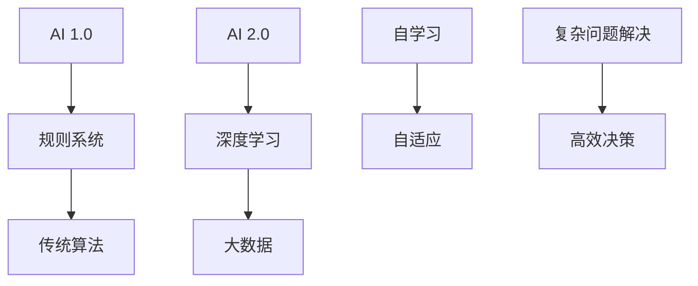

                 

# 李开复：AI 2.0 时代的社会价值

## 关键词：
- AI 2.0
- 社会价值
- 数据管理
- 算法优化
- 项目实战
- 未来展望
- 伦理与法律

## 摘要：
本文将深入探讨AI 2.0时代的社会价值，通过逻辑清晰的章节结构，逐步分析AI 2.0时代的背景、核心技术、应用场景、社会价值以及未来趋势。文章将结合实际项目实战，展示AI 2.0技术的应用和开发过程，并对伦理与法律问题进行讨论，旨在为读者提供一个全面、深刻的AI 2.0时代解析。

### 第一部分: AI 2.0时代的背景与概述

#### 第1章: AI 2.0时代的概述

在人工智能的发展历程中，AI 2.0被视为一个重要的里程碑。AI 1.0时代主要依赖规则和传统算法，而AI 2.0时代则以深度学习和大数据为基础，实现了自学习和自适应的能力。

**核心概念与联系**:

- **AI 1.0**：以规则和传统算法为核心的简单AI系统，如专家系统、逻辑推理等。
- **AI 2.0**：以深度学习和大数据为基础的复杂AI系统，具备自学习和自适应能力。

**Mermaid 流程图**:



在AI 1.0时代，计算机依赖于人类专家制定的规则和算法来解决问题。然而，这种方法在处理复杂问题时显得力不从心。随着深度学习技术的发展，AI 2.0时代应运而生。深度学习模型通过大量数据训练，能够自动提取特征并进行决策，从而在复杂问题解决和高效决策方面展现出巨大的潜力。

#### 第2章: AI 2.0时代的核心技术

AI 2.0时代的核心技术主要包括深度学习、大数据处理和自学习等。

**核心算法原理讲解**:

```python
# 伪代码：简单神经网络算法
initialize_parameters()
forward_pass(x, parameters)
compute_cost(a, y, parameters)
backward_pass(x, y, parameters)
update_parameters(parameters, dW, db)
```

**数学模型与公式**:

$$\frac{\partial J}{\partial \theta} = \frac{\partial}{\partial \theta} \sum_{i=1}^{m} (-y^{(i)} \log(a^{(i)}) + (1-y^{(i)}) \log(1-a^{(i)}))$$

**举例说明**：假设我们有一个二分类问题，输入特征向量 \(x\) 和标签 \(y\)，神经网络通过前向传播计算输出概率 \(a\)，然后通过后向传播计算梯度 \(dW\) 和 \(db\)，最后更新参数 \( \theta \) 以优化模型。

#### 第3章: AI 2.0时代的应用场景

AI 2.0技术在各个领域都展现出了巨大的应用潜力，以下列举几个典型应用场景：

- **智能语音助手**：如Siri、Alexa等，通过语音识别和自然语言处理技术，为用户提供智能化的语音交互服务。
- **自动驾驶**：如特斯拉自动驾驶系统，通过计算机视觉和深度学习技术，实现车辆的自动行驶。
- **医疗诊断**：如癌症筛查、疾病预测等，利用深度学习模型分析医学影像，提高诊断准确率。

#### 第4章: AI 2.0时代的社会价值

AI 2.0时代的社会价值体现在以下几个方面：

- **效率提升**：通过自动化流程，AI技术大幅提高了工作效率，降低了人力成本。
- **创新驱动**：AI技术赋能新产业，推动技术革新，为社会带来了新的发展机遇。
- **伦理挑战**：AI技术的发展也带来了隐私保护、公平性、透明度等伦理挑战，需要我们共同努力解决。

### 第二部分: AI 2.0时代的实践与开发

#### 第5章: AI 2.0时代的数据管理

数据管理是AI 2.0时代的重要环节，包括数据清洗与预处理、数据存储与备份等。

- **数据清洗与预处理**：通过去除噪声、填充缺失值、特征工程等方法，提高数据质量，为后续模型训练提供可靠的数据基础。
- **数据存储与备份**：采用分布式存储和备份策略，确保数据的安全和可扩展性。

#### 第6章: AI 2.0时代的算法优化

算法优化是提升AI 2.0系统性能的关键，常用的算法优化方法包括梯度下降算法和随机梯度下降算法。

- **梯度下降算法**：通过迭代更新参数，使损失函数不断减小，直至达到最优解。
- **随机梯度下降算法**：在梯度下降算法的基础上，引入随机性，提高训练效率。

#### 第7章: AI 2.0时代的项目实战

项目实战是验证AI 2.0技术实际应用效果的重要手段，以下介绍两个典型项目：

- **智能问答系统开发**：通过自然语言处理和机器学习技术，实现智能化的问答功能。
- **自动驾驶系统实现**：通过计算机视觉和深度学习技术，实现车辆的自动行驶。

#### 第8章: AI 2.0时代的未来展望

未来，AI 2.0技术将继续快速发展，预计将呈现出以下趋势：

- **模型压缩与效率提升**：通过模型压缩技术，降低模型复杂度，提高模型运行效率。
- **多模态AI技术发展**：结合多种数据模态，如文本、图像、声音等，实现更全面、更智能的AI系统。

### 第三部分: AI 2.0时代的伦理与法律

#### 第9章: AI 2.0时代的伦理与法律

AI 2.0时代的快速发展引发了一系列伦理与法律问题，需要我们关注并加以解决：

- **隐私保护**：AI技术在数据收集和处理过程中，容易侵犯个人隐私，需要制定相关法规进行保护。
- **公平性**：AI算法可能存在偏见和歧视，影响公平性，需要建立公平性评估机制。
- **透明度**：AI系统的决策过程需要具备透明度，以便用户了解和监督。

### 附录

#### 附录 A: AI 2.0开发工具与资源

以下是AI 2.0开发中常用的工具与资源：

- **TensorFlow**：由Google开发的开源深度学习框架，支持多种编程语言。
- **PyTorch**：由Facebook开发的开源深度学习框架，具有灵活性和易用性。
- **其他常用AI开发工具与资源**：如Keras、Scikit-learn、JAX等。

### 结语

AI 2.0时代的社会价值不容忽视，通过深入探讨其背景、核心技术、应用场景、社会价值以及未来趋势，我们可以更好地理解AI 2.0技术的发展方向和挑战。在实践与开发过程中，我们要注重数据管理、算法优化和项目实战，充分发挥AI 2.0技术的潜力。同时，我们还需关注伦理与法律问题，确保AI技术的可持续发展。

**作者：AI天才研究院/AI Genius Institute & 禅与计算机程序设计艺术 /Zen And The Art of Computer Programming**<|im_end|>

