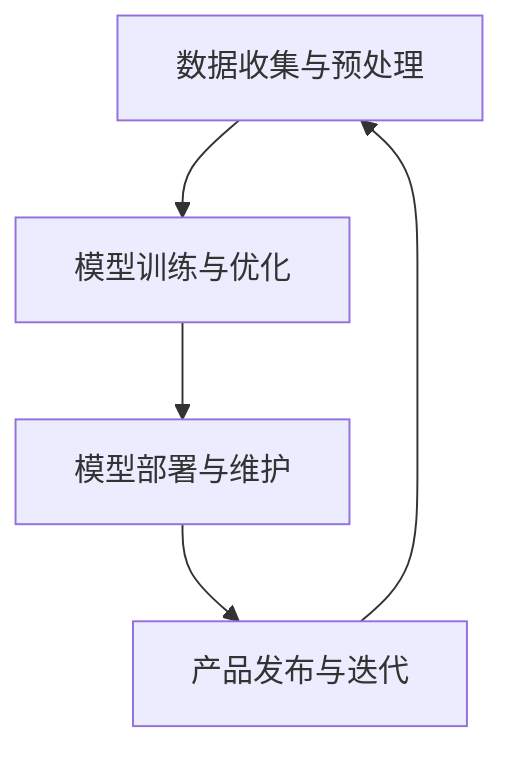

                 

# 《构建充满活力的AI创业生态系统的挑战》

> **关键词**：AI创业生态系统、技术挑战、市场挑战、资金与人力资源、核心算法、数学模型、项目实战、开发环境搭建

> **摘要**：本文旨在探讨构建充满活力的AI创业生态系统的挑战。从技术、市场、资金和人力资源等方面进行分析，详细介绍AI创业生态系统的核心概念和算法原理，并通过实际案例进行讲解，帮助创业者应对构建AI创业生态系统的各种挑战。

## 第一部分：AI创业生态系统的概述

### 第1章：AI创业生态系统的概念与重要性

#### 1.1.1 AI创业生态系统的定义

AI创业生态系统是指在人工智能技术快速发展的背景下，由创业者、投资者、研究机构、技术公司等组成的一个相互依存、相互促进的生态圈。它不仅包括技术层面的创新，还涵盖了市场、资金、人力资源等多个方面。

#### 1.1.2 AI创业生态系统的重要性

AI创业生态系统的重要性主要体现在以下几个方面：

1. **技术驱动**：AI创业生态系统为创业者提供了丰富的技术资源和创新环境，有助于推动技术的进步和突破。
2. **市场开拓**：通过AI创业生态系统，创业者可以更好地了解市场需求，把握市场动态，开拓新的市场空间。
3. **资本聚集**：AI创业生态系统能够吸引更多的资本投入，为创业者提供充足的资金支持。
4. **人才汇聚**：AI创业生态系统吸引了大量的技术人才，为创业项目提供了强大的人力资源保障。

#### 1.1.3 AI创业生态系统的组成部分

AI创业生态系统主要包括以下几部分：

1. **技术层**：包括AI算法、数据资源、技术工具等，是生态系统的核心。
2. **市场层**：包括市场需求、竞争态势、用户反馈等，是生态系统的基础。
3. **资金层**：包括投资者、风险投资、政府补贴等，是生态系统的动力。
4. **人力资源层**：包括创业者、技术专家、研究人员等，是生态系统的支撑。

### 第2章：构建AI创业生态系统的挑战

#### 2.1.1 技术挑战

1. **数据获取与处理**：AI系统对数据的需求量巨大，且数据质量直接影响模型的性能。如何高效获取和处理海量数据，是技术挑战之一。
2. **算法创新与优化**：AI算法的不断优化和创新是提升模型性能的关键。然而，算法的创新难度较大，需要大量的研究和实践。
3. **安全性与隐私保护**：随着AI技术的应用越来越广泛，数据安全和隐私保护成为越来越重要的问题。如何在保证数据安全的同时，确保用户隐私不被泄露，是技术挑战之一。

#### 2.2.1 市场挑战

1. **市场需求预测**：市场需求的变化难以预测，创业者需要准确把握市场趋势，才能在激烈的市场竞争中立于不败之地。
2. **竞争压力**：AI领域竞争激烈，创业者需要不断提高自身的技术和市场竞争力，才能在市场中站稳脚跟。
3. **用户接受度**：AI技术的普及和推广需要用户的认可和接受。如何提高用户的接受度，是市场挑战之一。

#### 2.3.1 资金与人力资源挑战

1. **资金筹措**：创业者需要找到合适的资金来源，以支持项目的持续发展。风险投资、政府补贴等是常见的资金来源，但筹集资金的难度较大。
2. **人才招聘与培养**：AI创业项目需要大量的技术人才，如何招聘和培养优秀的人才，是人力资源挑战之一。
3. **团队建设与管理**：创业者需要构建一支高效的团队，进行有效的团队管理和协作，以实现项目目标。

## 第二部分：核心概念与联系

### 第3章：核心概念原理和架构

#### 3.1 AI算法原理

1. **监督学习**：监督学习是一种从标记数据中学习的方法。通过输入和输出的对应关系，训练模型来预测未知数据的输出。
2. **无监督学习**：无监督学习是一种在没有标记数据的情况下，通过探索数据内在结构来学习的方法。常见的方法包括聚类、降维等。
3. **强化学习**：强化学习是一种通过与环境互动来学习最优策略的方法。通过试错和反馈，不断调整策略，以实现最大化收益。

#### 3.2 AI系统架构

1. **端到端系统**：端到端系统是一种将输入直接映射到输出的系统。通过深度学习等技术，实现从输入到输出的端到端映射。
2. **微服务架构**：微服务架构是将系统划分为多个独立的、松耦合的服务，每个服务负责不同的功能。通过微服务架构，提高系统的灵活性和可扩展性。
3. **容器化与云原生**：容器化是一种轻量级的虚拟化技术，可以封装应用程序及其运行环境。云原生是一种在云计算环境下构建和运行应用程序的方法。通过容器化和云原生技术，提高系统的部署和运维效率。

### 第4章：AI创业生态系统的Mermaid流程图

#### 4.1 AI创业生态系统流程图

#### 4.1.1 数据收集与预处理

1. 收集数据：从各种渠道获取数据，包括公开数据、企业内部数据等。
2. 数据清洗：去除重复、异常和错误的数据，提高数据质量。
3. 数据预处理：对数据进行归一化、标准化等处理，为模型训练做准备。

#### 4.1.2 模型训练与优化

1. 数据集划分：将数据集划分为训练集、验证集和测试集。
2. 模型训练：使用训练集对模型进行训练，调整模型参数。
3. 模型优化：通过验证集和测试集，对模型进行优化，提高模型性能。

#### 4.1.3 模型部署与维护

1. 模型部署：将训练好的模型部署到生产环境中，进行实时预测。
2. 模型监控：监控模型运行状态，及时发现和解决问题。
3. 模型更新：根据用户反馈和业务需求，对模型进行更新和迭代。

#### 4.1.4 产品发布与迭代

1. 产品发布：将经过测试和优化的产品发布到市场。
2. 用户反馈：收集用户反馈，了解产品在实际应用中的表现。
3. 产品迭代：根据用户反馈和市场需求，对产品进行迭代和优化。

## 第三部分：核心算法原理讲解

### 第5章：核心算法原理讲解

#### 5.1 监督学习算法

1. **线性回归**

   线性回归是一种简单的监督学习算法，用于预测连续值。其数学模型为：

   $$ y = wx + b $$

   其中，$x$ 为输入特征，$w$ 为权重，$b$ 为偏置。

2. **支持向量机（SVM）**

   支持向量机是一种用于分类的监督学习算法。其目标是找到最佳的超平面，将不同类别的数据点分开。其数学模型为：

   $$ max \ \frac{1}{2} \ w^Tw \ subjected \ to \ |w| \leq C \ \ and \ \ y_i(w^Tx_i + b) \ \geq 1 $$

   其中，$C$ 为惩罚参数，$y_i$ 为标签，$x_i$ 为数据点。

3. **决策树与随机森林**

   决策树是一种用于分类和回归的监督学习算法。它通过一系列的决策规则，将数据划分为不同的类别或连续值。随机森林是一种基于决策树的集成学习算法，通过随机选择特征和随机切分节点，提高模型的泛化能力。

#### 5.2 无监督学习算法

1. **K-means聚类**

   K-means聚类是一种基于距离的聚类算法。它将数据点分为 $k$ 个簇，使得簇内的数据点距离较小，簇间的数据点距离较大。其数学模型为：

   $$ \ min \ \sum \ (x_i - \mu_j)^2 $$

   其中，$x_i$ 为数据点，$\mu_j$ 为第 $j$ 个簇的中心。

2. **主成分分析（PCA）**

   主成分分析是一种用于降维的算法。它通过线性变换，将原始数据映射到新的坐标系中，保留主要的信息，减少冗余。其数学模型为：

   $$ \ min \ \ \sum \ (x_i - \mu)^T \ \Sigma \ (x_i - \mu) \ subjected \ to \ A \ x = \mu $$

   其中，$x_i$ 为数据点，$\mu$ 为均值，$\Sigma$ 为协方差矩阵。

3. **自编码器**

   自编码器是一种基于神经网络的无监督学习算法。它通过编码和解码两个过程，将原始数据映射到低维空间，再重构回原始数据。其数学模型为：

   $$ z = \sigma(W_2 \cdot \sigma(W_1 \cdot x + b_1) + b_2) $$

   其中，$x$ 为输入数据，$z$ 为编码后的数据，$W_1$ 和 $W_2$ 为权重矩阵，$b_1$ 和 $b_2$ 为偏置。

#### 5.3 强化学习算法

1. **Q-learning**

   Q-learning是一种基于值函数的强化学习算法。它通过迭代更新值函数，以找到最优策略。其数学模型为：

   $$ Q(s, a) = r + \gamma \ max_{a'} Q(s', a') $$

   其中，$s$ 为状态，$a$ 为动作，$r$ 为奖励，$\gamma$ 为折扣因子。

2. **模型预测控制（MPC）**

   模型预测控制是一种用于控制系统的强化学习算法。它通过预测系统的未来行为，并选择最佳动作来控制系统的状态。其数学模型为：

   $$ u(t) = \arg \ max \ u(s_t) \ subjected \ to \ \dot{s}(t) = f(s(t), u(t)) $$

   其中，$s$ 为状态，$u$ 为动作，$f$ 为系统模型。

3. **回合学习**

   回合学习是一种基于回合的强化学习算法。它通过记录回合中的状态和动作，更新策略以最大化回报。其数学模型为：

   $$ policy \ \theta \ = \ \arg \ max \ \sum \ r(t) \ P(s(t+1)|s(t), a(t), \theta) $$

   其中，$s$ 为状态，$a$ 为动作，$r$ 为奖励，$P$ 为状态转移概率。

## 第四部分：项目实战

### 第8章：AI创业项目实战

#### 8.1 项目实战概述

本项目旨在构建一个基于AI的智能客服系统，通过自然语言处理技术，实现用户与客服的智能交互。项目包括数据收集与预处理、模型设计与训练、模型部署与测试等环节。

#### 8.2 数据收集与预处理

1. 数据收集：从社交媒体、客服日志等渠道收集用户提问和回答数据。
2. 数据清洗：去除重复、异常和错误的数据，提高数据质量。
3. 数据预处理：对文本数据进行分词、去停用词、词性标注等处理，为模型训练做准备。

#### 8.3 模型设计与训练

1. 模型设计：选择基于神经网络的语言模型，用于生成回答。
2. 数据集划分：将数据集划分为训练集、验证集和测试集。
3. 模型训练：使用训练集对模型进行训练，调整模型参数。
4. 模型优化：通过验证集和测试集，对模型进行优化，提高模型性能。

#### 8.4 模型部署与测试

1. 模型部署：将训练好的模型部署到生产环境中，进行实时预测。
2. 模型测试：使用测试集对模型进行测试，评估模型性能。

#### 8.5 项目评估与优化

1. 项目评估：根据用户反馈和业务指标，评估项目效果。
2. 项目优化：针对评估结果，对项目进行优化和改进。

## 第9章：开发环境搭建

#### 9.1 环境准备

1. 安装Python环境：在服务器上安装Python，并配置必要的库和依赖。
2. 安装深度学习框架：如TensorFlow、PyTorch等，用于构建和训练模型。
3. 安装自然语言处理库：如NLTK、SpaCy等，用于处理文本数据。

#### 9.2 数据库搭建

1. 安装数据库：如MySQL、PostgreSQL等，用于存储用户提问和回答数据。
2. 设计数据库表结构：根据业务需求，设计合适的表结构和字段。
3. 数据导入与导出：使用数据库管理工具，导入和导出数据。

#### 9.3 算法库搭建

1. 搭建算法库：收集和整理常用的算法模型，如线性回归、决策树、神经网络等。
2. 算法库接口设计：设计统一的接口，方便调用和扩展。
3. 算法库测试与优化：对算法库进行测试和优化，确保性能和稳定性。

#### 9.4 实时监控与日志系统搭建

1. 安装监控工具：如Prometheus、Grafana等，用于监控服务器性能和模型运行状态。
2. 设计日志系统：收集和存储模型运行日志，方便调试和排查问题。
3. 日志系统分析与报警：对日志进行分析，设置报警规则，及时发现和解决问题。

## 第10章：源代码实现与解读

#### 10.1 源代码结构

本项目采用模块化设计，将源代码分为数据预处理模块、模型训练模块、模型部署模块等。

#### 10.2 数据预处理代码解读

1. 数据读取：从数据库中读取用户提问和回答数据。
2. 数据清洗：去除重复、异常和错误的数据。
3. 数据预处理：对文本数据进行分词、去停用词、词性标注等处理。

#### 10.3 模型训练代码解读

1. 模型设计：选择合适的神经网络模型。
2. 数据集划分：将数据集划分为训练集、验证集和测试集。
3. 模型训练：使用训练集对模型进行训练。
4. 模型优化：通过验证集和测试集，对模型进行优化。

#### 10.4 模型部署代码解读

1. 模型加载：从文件中加载训练好的模型。
2. 模型预测：对输入数据进行预测。
3. 预测结果输出：将预测结果输出到数据库或API接口。

#### 10.5 实时监控与日志系统代码解读

1. 监控数据收集：收集服务器性能数据和模型运行状态。
2. 日志收集与存储：收集模型运行日志，存储到日志系统。
3. 日志分析：对日志进行分析，发现和解决潜在问题。

## 第11章：代码解读与分析

#### 11.1 数据预处理代码分析

1. 数据读取：使用数据库连接库，从数据库中读取用户提问和回答数据。
2. 数据清洗：使用Python内置函数和第三方库，去除重复、异常和错误的数据。
3. 数据预处理：使用自然语言处理库，对文本数据进行分词、去停用词、词性标注等处理。

#### 11.2 模型训练代码分析

1. 模型设计：使用深度学习框架，设计合适的神经网络模型。
2. 数据集划分：使用Python内置函数和第三方库，将数据集划分为训练集、验证集和测试集。
3. 模型训练：使用训练集对模型进行训练，调整模型参数。
4. 模型优化：使用验证集和测试集，对模型进行优化，提高模型性能。

#### 11.3 模型部署代码分析

1. 模型加载：使用深度学习框架，从文件中加载训练好的模型。
2. 模型预测：使用加载好的模型，对输入数据进行预测。
3. 预测结果输出：将预测结果输出到数据库或API接口。

#### 11.4 实时监控与日志系统代码分析

1. 监控数据收集：使用监控工具，收集服务器性能数据和模型运行状态。
2. 日志收集与存储：使用日志系统，收集模型运行日志，存储到日志系统。
3. 日志分析：使用日志分析工具，对日志进行分析，发现和解决潜在问题。

## 附录

### 附录A：AI创业生态系统的工具与资源

#### A.1 主流深度学习框架对比

| 框架         | 语言   | 特点                                                     | 应用领域                     |
|--------------|--------|----------------------------------------------------------|-----------------------------|
| TensorFlow   | Python | 开源、灵活、支持多种硬件平台                             | 图像识别、自然语言处理、强化学习 |
| PyTorch      | Python | 开源、灵活、动态图计算                                   | 图像识别、自然语言处理、强化学习 |
| Keras        | Python | 高层API，简化模型构建和训练                              | 快速原型开发、图像识别、自然语言处理 |
| MXNet        | Python/C++ | 开源、支持多种硬件平台，与Apache MXNet深度集成           | 图像识别、自然语言处理、强化学习 |
| Caffe        | Python/C++ | 开源、适用于深度神经网络研究                           | 图像识别、自然语言处理           |

#### A.2 开源数据集资源

| 数据集         | 描述                                                   | 应用领域                     |
|--------------|----------------------------------------------------------|-----------------------------|
| ImageNet     | 包含1000个类别的120万张图像                             | 图像识别、机器学习研究       |
| CIFAR-10     | 包含10个类别的共60000张32x32彩色图像                   | 图像识别、机器学习研究       |
| MNIST        | 包含0-9数字的手写体图像，共计70000张训练图像和10000张测试图像 | 机器学习、图像识别           |
| COCO         | 目标检测、分割、关键点检测的多任务数据集                   | 图像识别、目标检测           |
| Quora Question Pairs | 包含一亿多条问答对，用于自然语言处理任务                   | 自然语言处理、文本分类       |

#### A.3 AI创业生态系统相关的在线课程与书籍

| 课程/书籍               | 描述                                                         | 链接                                      |
|------------------------|--------------------------------------------------------------|-------------------------------------------|
| 《深度学习》            | 吴恩达主讲，系统介绍深度学习的基本概念和方法                   | https://www.deeplearning.ai/              |
| 《Python机器学习》       | 符合Python初学者的入门书籍，介绍机器学习的基本概念和应用       | https://www(machinelearningmastery.com/   |
| 《自然语言处理综论》     | 综合介绍自然语言处理的基本概念和技术，适合自然语言处理初学者   | https://www.nltk.org/                     |
| 《强化学习》            | 系统介绍强化学习的基本概念和方法，适合强化学习初学者           | https://www.dreamقولات.com/reinforcement-learning/ |

### 附录B：常见问题与解决方案

#### B.1 数据处理常见问题与解决方案

| 问题                 | 解决方案                                                     |
|----------------------|--------------------------------------------------------------|
| 数据质量不高         | 数据清洗、去噪、标准化等处理，提高数据质量                   |
| 数据量不足           | 扩展数据集、使用生成对抗网络（GAN）等方法生成数据           |
| 数据分布不均         | 数据增强、重采样等方法，平衡数据分布                         |

#### B.2 模型训练与优化常见问题与解决方案

| 问题                 | 解决方案                                                     |
|----------------------|--------------------------------------------------------------|
| 训练时间过长         | 使用GPU、TPU等硬件加速训练，优化模型结构                     |
| 过拟合               | 使用正则化、 dropout、集成学习等方法，提高模型泛化能力       |
| 模型性能不稳定         | 使用更多的数据、增加训练次数，优化超参数                     |

#### B.3 模型部署与维护常见问题与解决方案

| 问题                 | 解决方案                                                     |
|----------------------|--------------------------------------------------------------|
| 部署效率低           | 使用容器化、微服务架构等，提高部署效率                       |
| 模型维护困难         | 使用模型版本管理、自动化部署等，简化模型维护流程           |
| 系统稳定性差         | 使用监控、日志分析等，及时发现和解决问题                     |

#### B.4 项目评估与优化常见问题与解决方案

| 问题                 | 解决方案                                                     |
|----------------------|--------------------------------------------------------------|
| 评估指标不准确       | 选择合适的评估指标，结合业务需求进行评估                     |
| 项目效果不明显       | 根据评估结果，对项目进行优化和改进                         |
| 项目进度延误         | 优化项目管理流程，合理分配资源和时间                         |

## 作者信息

**作者**：AI天才研究院/AI Genius Institute & 禅与计算机程序设计艺术 /Zen And The Art of Computer Programming

---

本文详细探讨了构建充满活力的AI创业生态系统的挑战，从技术、市场、资金和人力资源等方面进行分析，并通过实际案例进行讲解，帮助创业者应对构建AI创业生态系统的各种挑战。文章内容丰富，结构清晰，旨在为创业者提供有益的参考和指导。希望本文能对您在AI创业领域的探索和实践有所帮助。祝您创业成功！<|im_end|>

