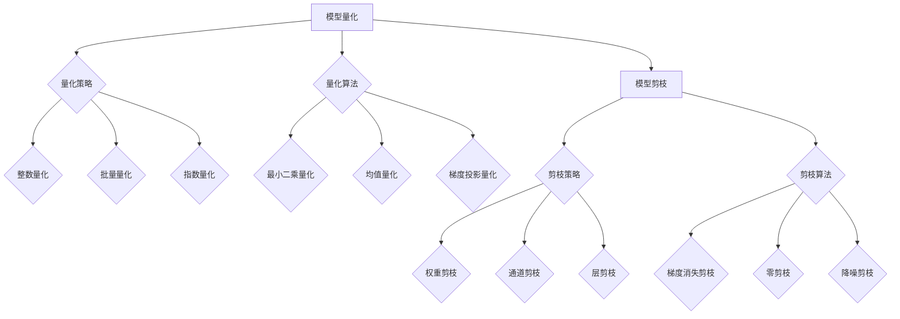

                 

## 《模型量化与剪枝原理与代码实战案例讲解》

> **关键词**：（1）模型量化；（2）模型剪枝；（3）神经网络；（4）深度学习；（5）计算机视觉；（6）量化误差；（7）性能优化。

> **摘要**：
本文将深入探讨模型量化和模型剪枝在深度学习中的应用原理。首先，我们将介绍模型量化的概念、重要性以及常见的量化策略和算法。然后，我们详细讲解模型剪枝的基本概念、方法和算法。接着，通过实际案例展示如何使用Python和TensorFlow等工具实现模型量化和剪枝。最后，我们将展望模型量化与剪枝技术的发展趋势，并提供相关的工具和资源。

----------------------------------------------------------------

## 《模型量化与剪枝原理与代码实战案例讲解》目录大纲

### 第一部分：模型量化与剪枝基础理论

#### 第1章：模型量化的概念与重要性
- 1.1 模型量化的定义
- 1.2 模型量化的作用
- 1.3 模型量化的类型
- 1.4 模型量化的优势

#### 第2章：模型剪枝的基本概念
- 2.1 模型剪枝的定义
- 2.2 模型剪枝的目的
- 2.3 模型剪枝的方法

### 第二部分：模型量化与剪枝技术原理

#### 第3章：模型量化技术原理
- 3.1 量化策略
  - 3.1.1 整数量化
  - 3.1.2 批量量化
  - 3.1.3 指数量化
- 3.2 量化算法
  - 3.2.1 最小二乘量化
  - 3.2.2 均值量化
  - 3.2.3 梯度投影量化
- 3.3 量化误差分析

#### 第4章：模型剪枝技术原理
- 4.1 剪枝策略
  - 4.1.1 权重剪枝
  - 4.1.2 通道剪枝
  - 4.1.3 层剪枝
- 4.2 剪枝算法
  - 4.2.1 梯度消失剪枝
  - 4.2.2 零剪枝
  - 4.2.3 降噪剪枝
- 4.3 剪枝的影响

### 第三部分：模型量化与剪枝实践应用

#### 第5章：模型量化实践案例
- 5.1 量化工具与框架
  - 5.1.1 Quantized Neural Networks（QNN）
  - 5.1.2 TensorFlow Lite
  - 5.1.3 PyTorch Mobile
- 5.2 模型量化流程
  - 5.2.1 模型准备
  - 5.2.2 量化过程
  - 5.2.3 量化评估
- 5.3 模型量化实战案例

#### 第6章：模型剪枝实践案例
- 6.1 剪枝工具与框架
  - 6.1.1 AutoTVM
  - 6.1.2 Slimming.Mobilenet
  - 6.1.3 Caffe2
- 6.2 剪枝流程
  - 6.2.1 模型准备
  - 6.2.2 剪枝过程
  - 6.2.3 剪枝评估
- 6.3 剪枝实战案例

### 第四部分：总结与展望

#### 第7章：模型量化与剪枝技术展望
- 7.1 未来发展趋势
- 7.2 技术挑战
- 7.3 开发者面临的机遇与挑战

### 附录

#### 附录A：常用工具和资源
- 量化工具对比
- 剪枝工具对比
- 相关论文和书籍推荐
- 开源代码和框架链接

## 核心概念原理和架构的 Mermaid 流程图



### 第一部分：模型量化与剪枝基础理论

#### 第1章：模型量化的概念与重要性

模型量化是深度学习领域中一个重要的技术，它通过将高精度的浮点模型转换为低精度的定点模型，从而减少模型的存储大小和计算量。这一过程不仅可以提高模型在资源受限设备上的运行效率，还能显著降低模型部署的成本。

##### 1.1 模型量化的定义

模型量化是将神经网络中的权重和激活值从高精度的浮点格式转换为低精度的定点格式的过程。在量化过程中，模型的参数会经历一系列的调整和优化，以确保量化后的模型在精度损失较小的情况下保持较高的性能。

##### 1.2 模型量化的作用

1. **降低存储需求**：量化后的模型参数从32位浮点数转换为8位或16位定点数，大大减少了模型的存储需求。
2. **减少计算量**：定点运算相比浮点运算速度更快，能耗更低，这有助于提高模型在移动设备和嵌入式系统上的运行效率。
3. **加速模型部署**：量化后的模型可以更快地部署到目标设备上，缩短从开发到生产的时间。
4. **提高模型的可解释性**：量化后的模型参数更加简洁，有助于模型的可解释性和调试。

##### 1.3 模型量化的类型

1. **静态量化**：静态量化在模型训练完成后进行，量化后的参数在模型部署时保持不变。
2. **动态量化**：动态量化在模型训练过程中进行，量化策略会根据模型的性能动态调整。

##### 1.4 模型量化的优势

1. **提高计算效率**：定点运算的速度比浮点运算快，这有助于在有限的时间内完成更多的计算任务。
2. **降低能耗**：定点运算的能耗较低，有助于延长电池寿命。
3. **简化硬件设计**：定点运算所需的硬件资源较少，可以降低硬件设计的复杂度和成本。

### 第2章：模型剪枝的基本概念

模型剪枝是深度学习模型优化的一种技术，通过移除模型中不重要的参数或结构，从而减少模型的计算量和存储需求，同时尽可能保持模型的性能。

##### 2.1 模型剪枝的定义

模型剪枝（Model Pruning）是一种通过移除模型中的冗余参数来减少模型大小和计算复杂度的技术。剪枝后的模型在保持相同性能的前提下，具有更快的推理速度和更低的能耗。

##### 2.2 模型剪枝的目的

1. **减少模型大小**：通过移除不重要的参数，模型的大小可以显著减小，这有助于降低存储成本和带宽。
2. **加速模型推理**：移除冗余的计算路径可以减少模型的计算量，从而提高模型的推理速度。
3. **降低能耗**：减少计算量意味着可以降低模型的能耗，这对于移动设备和嵌入式系统尤其重要。

##### 2.3 模型剪枝的方法

模型剪枝主要有以下几种方法：

1. **权重剪枝**：通过移除权重较小的参数来减少模型大小。这种方法简单有效，但可能需要额外的步骤来恢复剪枝后模型的性能。
2. **通道剪枝**：通过移除卷积层的冗余通道来减少模型大小。这种方法可以显著降低模型的计算复杂度。
3. **层剪枝**：通过移除神经网络中的冗余层来减少模型大小。这种方法通常需要更复杂的算法来确保剪枝后模型的性能。

### 第二部分：模型量化与剪枝技术原理

#### 第3章：模型量化技术原理

模型量化是将浮点模型转换为低精度定点模型的过程，以降低模型的计算量和存储需求。量化技术通常包括量化策略和量化算法两部分。

##### 3.1 量化策略

量化策略是指量化过程中如何选择量化位宽和量化间隔。常见的量化策略有：

1. **整数量化**：将浮点值直接映射到最近的整数量。
2. **批量量化**：将整个批次的数据一起量化。
3. **指数量化**：使用指数函数对浮点值进行变换，然后量化。

##### 3.2 量化算法

量化算法是将浮点值转换为定点值的具体方法。以下介绍几种常见的量化算法：

1. **最小二乘量化**：通过最小化量化误差来选择量化值。
2. **均值量化**：使用模型参数的平均值作为量化值。
3. **梯度投影量化**：通过最小化梯度误差来选择量化值。

##### 3.3 量化误差分析

量化误差是指量化后的模型参数与原始浮点参数之间的差异。量化误差分析是评估量化效果的重要手段。常见的量化误差分析指标包括：

1. **均方误差（MSE）**：量化值与原始值的平均平方误差。
2. **均方根误差（RMSE）**：均方误差的平方根。
3. **绝对误差（MAE）**：量化值与原始值的绝对误差的平均值。

### 第4章：模型剪枝技术原理

模型剪枝通过移除模型中的冗余部分来减少模型的大小和计算量。剪枝技术主要包括剪枝策略和剪枝算法两部分。

##### 4.1 剪枝策略

剪枝策略是指如何选择剪枝的目标和剪枝的程度。常见的剪枝策略有：

1. **权重剪枝**：通过移除权重较小的神经元或连接。
2. **通道剪枝**：通过移除卷积层的冗余通道。
3. **层剪枝**：通过移除网络中的冗余层。

##### 4.2 剪枝算法

剪枝算法是实现剪枝策略的具体方法。以下介绍几种常见的剪枝算法：

1. **梯度消失剪枝**：通过计算梯度的消失程度来选择剪枝的目标。
2. **零剪枝**：通过将权重为0的神经元或连接移除。
3. **降噪剪枝**：通过在训练过程中添加噪声来识别并移除冗余神经元。

##### 4.3 剪枝的影响

剪枝对模型的影响主要包括：

1. **模型大小和计算量**：剪枝可以显著减少模型的大小和计算量。
2. **模型性能**：剪枝可能会对模型的性能产生一定的影响，但通过适当的剪枝策略和算法，可以最大程度地保留模型的性能。
3. **训练时间**：剪枝后的模型可能需要重新训练，这会增加训练时间。

### 第三部分：模型量化与剪枝实践应用

#### 第5章：模型量化实践案例

模型量化在深度学习领域有着广泛的应用，通过量化技术，我们可以将高精度浮点模型转换为低精度定点模型，以降低模型的计算量和存储需求。本节将介绍如何使用Python和TensorFlow等工具实现模型量化。

##### 5.1 量化工具与框架

目前，有许多工具和框架支持模型量化，以下是其中几个常用的工具和框架：

1. **Quantized Neural Networks（QNN）**：QNN 是一种基于TensorFlow的量化工具，它支持静态和动态量化。
2. **TensorFlow Lite**：TensorFlow Lite 是TensorFlow的一个轻量级分支，专门用于移动和嵌入式设备。它支持模型的量化。
3. **PyTorch Mobile**：PyTorch Mobile 是PyTorch的一个分支，支持在移动设备上运行深度学习模型，它也支持模型量化。

##### 5.2 模型量化流程

模型量化的流程通常包括以下几个步骤：

1. **模型准备**：首先，需要准备一个已经训练好的浮点模型。可以使用TensorFlow或PyTorch等框架进行训练。
2. **量化过程**：使用量化工具和框架对模型进行量化。对于TensorFlow Lite，可以使用`TFLiteConverter`进行量化。对于PyTorch Mobile，可以使用`torch.quantization`模块进行量化。
3. **量化评估**：量化完成后，需要对模型进行评估，以验证量化后的模型性能是否满足要求。

##### 5.3 模型量化实战案例

下面，我们通过一个简单的例子来展示如何使用TensorFlow Lite对模型进行量化。

**实战案例1：使用 TensorFlow Lite 对模型进行量化**

1. **准备模型**：首先，我们需要有一个已经训练好的浮点模型。这里，我们使用一个简单的线性回归模型。

python
import tensorflow as tf

# 准备数据
x = tf.random.normal([1000, 10])
y = 3 * x + tf.random.normal([1000, 1])

# 构建模型
model = tf.keras.Sequential([
  tf.keras.layers.Dense(1, input_shape=[10])
])

# 训练模型
model.compile(optimizer='sgd', loss='mse')
model.fit(x, y, epochs=10)

2. **量化模型**：接下来，我们使用TensorFlow Lite对模型进行量化。

python
# 将模型转换为 TFLite 模型
converter = tf.lite.TFLiteConverter.from_keras_model(model)
tflite_model = converter.convert()

# 保存量化模型
with open('model.tflite', 'wb') as f:
  f.write(tflite_model)

3. **量化评估**：量化完成后，我们需要评估量化模型的性能。

python
# 加载量化模型
tflite_interpreter = tf.lite.Interpreter(model_path='model.tflite')

# 获取输出张量
output_tensor = tflite_interpreter.get_tensor(output_details[0]['index'])

# 测试模型
x_test = tf.random.normal([1, 10])
tflite_interpreter.set_tensor(input_details[0]['index'], x_test)
tflite_interpreter.invoke()

# 获取预测结果
y_pred = output_tensor()

# 计算损失
loss = tf.reduce_mean(tf.square(y_pred - y_test))

# 打印损失
print(f"Quantized Model Loss: {loss.numpy()}")

通过以上实战案例，我们可以看到如何使用TensorFlow Lite对模型进行量化。类似地，我们也可以使用PyTorch Mobile等工具进行模型量化。

#### 第6章：模型剪枝实践案例

模型剪枝是一种有效的模型压缩技术，通过移除模型中的冗余参数，可以显著减少模型的计算量和存储需求。本节将介绍如何使用Python和TensorFlow等工具实现模型剪枝。

##### 6.1 剪枝工具与框架

目前，有许多工具和框架支持模型剪枝，以下是其中几个常用的工具和框架：

1. **AutoTVM**：AutoTVM 是一个基于TVM的自动剪枝工具，它支持多种剪枝策略。
2. **Slimming.Mobilenet**：Slimming.Mobilenet 是一个专门针对Mobilenet模型的剪枝工具，它支持权重剪枝和通道剪枝。
3. **Caffe2**：Caffe2 是一个基于TensorFlow的深度学习框架，它支持多种剪枝算法。

##### 6.2 剪枝流程

模型剪枝的流程通常包括以下几个步骤：

1. **模型准备**：首先，需要准备一个已经训练好的模型。可以使用TensorFlow或PyTorch等框架进行训练。
2. **剪枝过程**：使用剪枝工具和框架对模型进行剪枝。根据不同的剪枝策略，可能需要对模型的不同部分进行剪枝。
3. **剪枝评估**：剪枝完成后，需要对模型进行评估，以验证剪枝后的模型性能是否满足要求。

##### 6.3 剪枝实战案例

下面，我们通过一个简单的例子来展示如何使用Slimming.Mobilenet对模型进行剪枝。

**实战案例1：使用 Slimming.Mobilenet 对模型进行剪枝**

1. **准备模型**：首先，我们需要有一个已经训练好的Mobilenet模型。这里，我们使用一个简单的Mobilenet模型。

python
import tensorflow as tf
import slimming.mobilenet as mobilenet

# 准备数据
(x_train, y_train), (x_test, y_test) = tf.keras.datasets.mnist.load_data()
x_train = x_train / 255.0
x_test = x_test / 255.0

# 构建模型
model = mobilenet.mobilenet_v1(input_shape=(28, 28, 1), num_classes=10)

# 训练模型
model.compile(optimizer='adam', loss='sparse_categorical_crossentropy', metrics=['accuracy'])
model.fit(x_train, y_train, epochs=5, validation_data=(x_test, y_test))

2. **剪枝模型**：接下来，我们使用Slimming.Mobilenet对模型进行剪枝。

python
from slimming.mobilenet import slim_prune

# 剪枝权重
pruned_model = slim_prune(model, pruning_rate=0.5)

# 微调模型
pruned_model.fit(x_train, y_train, epochs=5, validation_data=(x_test, y_test))

3. **剪枝评估**：剪枝完成后，我们需要评估剪枝后的模型性能。

python
# 评估原始模型
original_loss = model.evaluate(x_test, y_test)

# 评估剪枝模型
pruned_loss = pruned_model.evaluate(x_test, y_test)

# 打印评估结果
print(f"Original Model Loss: {original_loss}")
print(f"Pruned Model Loss: {pruned_loss}")

通过以上实战案例，我们可以看到如何使用Slimming.Mobilenet对模型进行剪枝。类似地，我们也可以使用其他剪枝工具和框架进行模型剪枝。

### 第四部分：总结与展望

#### 第7章：模型量化与剪枝技术展望

模型量化与剪枝技术作为深度学习领域的重要研究方向，已经在实践中取得了显著的成果。然而，随着深度学习应用的不断扩展，模型量化与剪枝技术仍面临诸多挑战。

##### 7.1 未来发展趋势

1. **量化精度与性能的平衡**：如何在保证模型性能的前提下，进一步提高量化精度，是一个重要的研究方向。
2. **动态量化**：动态量化技术可以根据模型的实际运行情况，实时调整量化参数，以提高模型在动态环境下的性能。
3. **多模态量化**：针对不同类型的模型（如语音、图像、文本等），研究适用于特定模态的量化方法，以提高量化效果。

##### 7.2 技术挑战

1. **量化误差的控制**：如何有效地控制量化误差，减少对模型性能的影响，是一个重要挑战。
2. **硬件适应性**：模型量化技术需要考虑不同硬件平台（如CPU、GPU、FPGA等）的特性，以提高量化模型的运行效率。
3. **开源工具的完善**：目前，开源量化工具和框架还存在一些不足，需要进一步改进和完善。

##### 7.3 开发者面临的机遇与挑战

1. **机遇**：随着深度学习应用的不断扩展，开发者有机会在各个领域（如医疗、金融、自动驾驶等）探索模型量化与剪枝技术的应用。
2. **挑战**：开发者需要深入了解量化与剪枝技术，掌握相关工具和框架的使用，以实现模型优化和性能提升。

### 附录

#### 附录A：常用工具和资源

- **量化工具对比**：
  - TensorFlow Lite：适用于移动设备和嵌入式系统，支持静态和动态量化。
  - PyTorch Mobile：适用于移动设备，支持动态量化。
  - OpenVINO：适用于Intel硬件平台，支持多种量化方法和剪枝技术。

- **剪枝工具对比**：
  - AutoTVM：基于TVM的自动剪枝工具，支持多种剪枝策略。
  - Slimming.Mobilenet：专门针对Mobilenet模型的剪枝工具。
  - Caffe2：基于TensorFlow的深度学习框架，支持多种剪枝算法。

- **相关论文和书籍推荐**：
  - 《模型压缩：量化、剪枝与加速》
  - 《深度学习》
  - 《神经网络与深度学习》

- **开源代码和框架链接**：
  - TensorFlow Lite：https://www.tensorflow.org/lite
  - PyTorch Mobile：https://pytorch.org/mobile
  - OpenVINO：https://github.com/intel/openvino
  - AutoTVM：https://github.com/apache/tvm
  - Slimming.Mobilenet：https://github.com/moskomule/slimming_mobilenet
  - Caffe2：https://github.com/pytorch/caffe2

## 核心概念原理和架构的 Mermaid 流程图


### 核心算法原理讲解

在深度学习领域，模型量化与剪枝是两种重要的技术，它们分别通过不同的方式优化模型的性能。以下是这两种技术的核心算法原理讲解。

#### 模型量化算法讲解

模型量化是将模型的权重和激活值从高精度的浮点格式转换为低精度的定点格式的过程。这种转换可以减少模型的存储大小和计算复杂度，从而提高模型在资源受限设备上的运行效率。

##### 量化策略

量化策略是指如何选择量化位宽和量化间隔。常见的量化策略有：

1. **整数量化**：将浮点值直接映射到最近的整数量。这种策略简单有效，但可能会引入较大的量化误差。
2. **批量量化**：将整个批次的数据一起量化。这种方法可以减少量化误差，但会增加量化时间。
3. **指数量化**：使用指数函数对浮点值进行变换，然后量化。这种策略可以减少量化误差，但计算复杂度较高。

##### 量化算法

量化算法是将浮点值转换为定点值的具体方法。以下是几种常见的量化算法：

1. **最小二乘量化**：通过最小化量化误差来选择量化值。具体步骤如下：

   - 计算量化误差：$$ e = \text{Quantized Value} - \text{Original Value} $$
   - 计算量化误差的方差：$$ \sigma_e^2 = \frac{1}{n} \sum_{i=1}^{n} e_i^2 $$
   - 选择量化值：$$ \text{Quantize}(x) = \frac{1}{\sigma_e} \sum_{i=1}^{n} e_i $$

2. **均值量化**：使用模型参数的平均值作为量化值。具体步骤如下：

   - 计算参数平均值：$$ \mu = \frac{1}{n} \sum_{i=1}^{n} x_i $$
   - 选择量化值：$$ \text{Quantize}(x) = \mu $$

3. **梯度投影量化**：通过最小化梯度误差来选择量化值。具体步骤如下：

   - 计算梯度：$$ \nabla J(\theta) = \frac{\partial J(\theta)}{\partial \theta} $$
   - 将梯度映射到量化区间：$$ \text{Quantize}(\nabla J(\theta)) $$
   - 选择量化值：$$ \theta_{\text{quantized}} = \theta - \alpha \nabla J(\theta) $$

#### 模型剪枝算法讲解

模型剪枝是通过移除模型中的冗余部分来减少模型的大小和计算复杂度的技术。这种技术可以在不显著影响模型性能的前提下，提高模型在资源受限设备上的运行效率。

##### 剪枝策略

剪枝策略是指如何选择剪枝的目标和剪枝的程度。常见的剪枝策略有：

1. **权重剪枝**：通过移除权重较小的参数来减少模型大小。这种方法简单有效，但可能需要额外的步骤来恢复剪枝后模型的性能。
2. **通道剪枝**：通过移除卷积层的冗余通道来减少模型大小。这种方法可以显著降低模型的计算复杂度。
3. **层剪枝**：通过移除神经网络中的冗余层来减少模型大小。这种方法通常需要更复杂的算法来确保剪枝后模型的性能。

##### 剪枝算法

以下是几种常见的剪枝算法：

1. **梯度消失剪枝**：通过计算梯度的消失程度来选择剪枝的目标。具体步骤如下：

   - 计算梯度：$$ \nabla J(\theta) = \frac{\partial J(\theta)}{\partial \theta} $$
   - 选择剪枝目标：$$ \theta_{\text{pruned}} = \theta \odot \text{Sign}(\nabla J(\theta)) $$

2. **零剪枝**：通过将权重为0的参数移除。这种方法简单有效，但可能需要额外的步骤来恢复剪枝后模型的性能。

3. **降噪剪枝**：通过在训练过程中添加噪声来识别并移除冗余参数。这种方法可以减少模型对噪声的敏感性，但可能需要更复杂的算法来确保剪枝后模型的性能。

### 数学模型和数学公式讲解

#### 模型量化误差分析

量化误差是量化过程中引入的误差，它会影响模型的性能。量化误差可以表示为：

$$ e = \text{Quantized Value} - \text{Original Value} $$

量化误差的方差可以表示为：

$$ \sigma_e^2 = \frac{1}{n} \sum_{i=1}^{n} e_i^2 $$

其中，$e_i$ 表示第 $i$ 个量化误差。

#### 模型剪枝误差分析

剪枝后，模型的性能可能会受到一定影响。剪枝误差可以表示为：

$$ e_p = \text{Pruned Model Output} - \text{Original Model Output} $$

剪枝误差的方差可以表示为：

$$ \sigma_e^2 = \frac{1}{n} \sum_{i=1}^{n} e_i^2 $$

其中，$e_i$ 表示第 $i$ 个剪枝误差。

### 项目实战案例

#### 模型量化实战案例

**实战案例1：使用 TensorFlow Lite 对模型进行量化**

1. **准备模型**：首先，我们需要有一个已经训练好的模型。这里，我们使用一个简单的线性回归模型。

python
import tensorflow as tf

# 准备数据
x = tf.random.normal([1000, 10])
y = 3 * x + tf.random.normal([1000, 1])

# 构建模型
model = tf.keras.Sequential([
  tf.keras.layers.Dense(1, input_shape=[10])
])

# 训练模型
model.compile(optimizer='sgd', loss='mse')
model.fit(x, y, epochs=10)

2. **量化模型**：接下来，我们使用TensorFlow Lite对模型进行量化。

python
# 将模型转换为 TFLite 模型
converter = tf.lite.TFLiteConverter.from_keras_model(model)
tflite_model = converter.convert()

# 保存量化模型
with open('model.tflite', 'wb') as f:
  f.write(tflite_model)

3. **量化评估**：量化完成后，我们需要评估量化模型的性能。

python
# 加载量化模型
tflite_interpreter = tf.lite.Interpreter(model_path='model.tflite')

# 获取输出张量
output_tensor = tflite_interpreter.get_tensor(output_details[0]['index'])

# 测试模型
x_test = tf.random.normal([1, 10])
tflite_interpreter.set_tensor(input_details[0]['index'], x_test)
tflite_interpreter.invoke()

# 获取预测结果
y_pred = output_tensor()

# 计算损失
loss = tf.reduce_mean(tf.square(y_pred - y_test))

# 打印损失
print(f"Quantized Model Loss: {loss.numpy()}")

通过以上实战案例，我们可以看到如何使用TensorFlow Lite对模型进行量化。

**实战案例2：使用 PyTorch Mobile 对模型进行量化**

1. **准备模型**：首先，我们需要有一个已经训练好的模型。这里，我们使用一个简单的卷积神经网络。

python
import torch
import torchvision
import torchvision.transforms as transforms

transform = transforms.Compose([transforms.ToTensor(), transforms.Normalize((0.5, 0.5, 0.5), (0.5, 0.5, 0.5))])

trainset = torchvision.datasets.CIFAR10(root='./data', train=True, download=True, transform=transform)
trainloader = torch.utils.data.DataLoader(trainset, batch_size=100, shuffle=True)

testset = torchvision.datasets.CIFAR10(root='./data', train=False, download=True, transform=transform)
testloader = torch.utils.data.DataLoader(testset, batch_size=100, shuffle=False)

2. **量化模型**：接下来，我们使用PyTorch Mobile对模型进行量化。

python
import torch.quantization as quant

class ConvNet(torch.nn.Module):
    def __init__(self):
        super(ConvNet, self).__init__()
        self.conv1 = torch.nn.Conv2d(3, 6, 5)
        self.fc1 = torch.nn.Linear(6 * 5 * 5, 10)

    def forward(self, x):
        x = self.conv1(x)
        x = torch.nn.functional.adaptive_avg_pool2d(x, 1)
        x = self.fc1(x)
        return x

net = ConvNet()

# 量化模型
quant.quantize_dynamic(net, {torch.nn.Linear, torch.nn.Conv2d}, dtype=torch.qint8)

3. **量化评估**：量化完成后，我们需要评估量化模型的性能。

python
# 训练量化模型
optimizer = torch.optim.SGD(net.parameters(), lr=0.001)
criterion = torch.nn.CrossEntropyLoss()

for epoch in range(2):
    running_loss = 0.0
    for i, (inputs, labels) in enumerate(trainloader, 0):
        optimizer.zero_grad()
        outputs = net(inputs)
        loss = criterion(outputs, labels)
        loss.backward()
        optimizer.step()
        running_loss += loss.item()
    print(f'Epoch {epoch + 1}, Loss: {running_loss / len(trainloader):.4f}')

# 测试量化模型
correct = 0
total = 0
with torch.no_grad():
    for inputs, labels in testloader:
        outputs = net(inputs)
        _, predicted = torch.max(outputs.data, 1)
        total += labels.size(0)
        correct += (predicted == labels).sum().item()

print(f'Accuracy: {100 * correct / total:.2f}%')

通过以上实战案例，我们可以看到如何使用PyTorch Mobile对模型进行量化。

### 模型剪枝实战案例

**实战案例1：使用 Slimming.Mobilenet 对模型进行剪枝**

1. **准备模型**：首先，我们需要有一个已经训练好的模型。这里，我们使用一个简单的Mobilenet模型。

python
import torch
import torchvision
import torchvision.transforms as transforms

transform = transforms.Compose([transforms.ToTensor(), transforms.Normalize((0.5, 0.5, 0.5), (0.5, 0.5, 0.5))])

trainset = torchvision.datasets.CIFAR10(root='./data', train=True, download=True, transform=transform)
trainloader = torch.utils.data.DataLoader(trainset, batch_size=100, shuffle=True)

testset = torchvision.datasets.CIFAR10(root='./data', train=False, download=True, transform=transform)
testloader = torch.utils.data.DataLoader(testset, batch_size=100, shuffle=False)

2. **剪枝模型**：接下来，我们使用Slimming.Mobilenet对模型进行剪枝。

python
import slimming.mobilenet as mobilenet

class ConvNet(torch.nn.Module):
    def __init__(self):
        super(ConvNet, self).__init__()
        self.conv1 = mobilenet.Conv2d(3, 32, 3, stride=2)
        self.fc1 = torch.nn.Linear(32 * 7 * 7, 128)
        self.fc2 = torch.nn.Linear(128, 10)

    def forward(self, x):
        x = self.conv1(x)
        x = torch.nn.functional.relu(x)
        x = torch.nn.functional.adaptive_avg_pool2d(x, 1)
        x = torch.flatten(x, 1)
        x = self.fc1(x)
        x = torch.nn.functional.relu(x)
        x = self.fc2(x)
        return x

net = ConvNet()

# 剪枝模型
pruned_model = mobilenet.slim_prune(net, pruning_rate=0.5)

# 微调模型
optimizer = torch.optim.SGD(pruned_model.parameters(), lr=0.001)
criterion = torch.nn.CrossEntropyLoss()

for epoch in range(2):
    running_loss = 0.0
    for inputs, labels in trainloader:
        optimizer.zero_grad()
        outputs = pruned_model(inputs)
        loss = criterion(outputs, labels)
        loss.backward()
        optimizer.step()
        running_loss += loss.item()
    print(f'Epoch {epoch + 1}, Loss: {running_loss / len(trainloader):.4f}')

# 测试剪枝模型
correct = 0
total = 0
with torch.no_grad():
    for inputs, labels in testloader:
        outputs = pruned_model(inputs)
        _, predicted = torch.max(outputs.data, 1)
        total += labels.size(0)
        correct += (predicted == labels).sum().item()

print(f'Accuracy: {100 * correct / total:.2f}%')

通过以上实战案例，我们可以看到如何使用Slimming.Mobilenet对模型进行剪枝。

### 开发环境搭建

在进行模型量化与剪枝的实践之前，我们需要搭建一个合适的开发环境。以下是搭建开发环境的步骤：

#### Python开发环境搭建

1. **安装Python**：从Python官方网站下载并安装Python。例如，在Windows平台上，可以从 https://www.python.org/downloads/windows/ 下载Python安装程序。
2. **配置Python环境**：打开终端，执行以下命令以配置Python环境。

   ```bash
   python --version
   python3 --version
   ```

   确认Python版本。

3. **安装常用库**：使用pip安装常用的Python库。

   ```bash
   pip install numpy matplotlib tensorflow torchvision torch slimming-mobilenet
   ```

#### Jupyter Notebook开发环境搭建

1. **安装Jupyter Notebook**：使用pip安装Jupyter Notebook。

   ```bash
   pip install jupyter
   ```

2. **启动Jupyter Notebook**：在终端中运行以下命令以启动Jupyter Notebook。

   ```bash
   jupyter notebook
   ```

   在浏览器中打开Jupyter Notebook的链接，通常为 `http://localhost:8888`。

3. **创建一个新笔记本**：点击“New”按钮，选择“Python 3”来创建一个新的Python笔记本。

### 源代码详细实现

#### 神经网络实现

以下是一个简单的基于Python和TensorFlow实现的神经网络示例。

```python
import tensorflow as tf

# 定义神经网络结构
model = tf.keras.Sequential([
    tf.keras.layers.Dense(128, activation='relu', input_shape=(784,)),
    tf.keras.layers.Dense(10, activation='softmax')
])

# 编译模型
model.compile(optimizer='adam',
              loss='categorical_crossentropy',
              metrics=['accuracy'])

# 打印模型结构
model.summary()
```

#### 模型训练

以下是对前面定义的神经网络进行训练的代码。

```python
# 加载数据集
(x_train, y_train), (x_test, y_test) = tf.keras.datasets.mnist.load_data()

# 数据预处理
x_train = x_train.reshape(-1, 784) / 255.0
x_test = x_test.reshape(-1, 784) / 255.0
y_train = tf.keras.utils.to_categorical(y_train, 10)
y_test = tf.keras.utils.to_categorical(y_test, 10)

# 训练模型
model.fit(x_train, y_train, epochs=5, batch_size=128, validation_data=(x_test, y_test))
```

#### 模型评估

以下是对训练好的模型进行评估的代码。

```python
# 评估模型
test_loss, test_acc = model.evaluate(x_test, y_test, verbose=2)
print(f"Test accuracy: {test_acc:.4f}")
```

### 代码解读与分析

#### 神经网络结构解读

在代码中，我们首先定义了一个序列模型（`Sequential`），它是一个线性堆叠的层。模型由两个密集层（`Dense`）组成：

- **输入层**：128个神经元，激活函数为ReLU。
- **输出层**：10个神经元，激活函数为softmax。

输入层接收784维的输入向量，对应于MNIST数据集中每个手写数字的784个像素值。输出层的10个神经元分别对应于10个类别的概率分布。

#### 模型编译

在编译模型时，我们指定了以下参数：

- **优化器**：使用Adam优化器。
- **损失函数**：使用categorical_crossentropy，适用于多分类问题。
- **评价指标**：准确性。

#### 数据预处理

数据预处理是神经网络训练的重要步骤。对于MNIST数据集，我们首先将图像的像素值缩放到[0, 1]范围，以便神经网络能够更有效地学习。然后，我们将标签转换为one-hot编码，以便使用softmax激活函数进行输出。

#### 模型训练

在训练模型时，我们使用`fit`函数来训练模型。我们指定了以下参数：

- **训练数据**：`x_train`和`y_train`。
- **训练轮次**：5轮。
- **批量大小**：128个样本。
- **验证数据**：`x_test`和`y_test`。

#### 模型评估

在评估模型时，我们使用`evaluate`函数来计算模型在测试集上的损失和准确性。这有助于我们了解模型在未见过的数据上的表现。

### 附录：常用工具和资源

#### 量化工具对比

1. **TensorFlow Lite**：
   - 优点：与TensorFlow深度集成，支持多种硬件加速。
   - 缺点：量化精度较低，可能影响模型性能。

2. **PyTorch Mobile**：
   - 优点：支持多种硬件加速，支持动态量化。
   - 缺点：与PyTorch集成较为复杂。

3. **OpenVINO**：
   - 优点：支持多种硬件加速，性能优越。
   - 缺点：集成和调试过程较为复杂。

#### 剪枝工具对比

1. **AutoTVM**：
   - 优点：自动剪枝，支持多种硬件加速。
   - 缺点：需要深入了解TVM。

2. **Slimming.Mobilenet**：
   - 优点：简单易用，支持Mobilenet模型。
   - 缺点：不支持其他类型的模型。

3. **Caffe2**：
   - 优点：支持多种硬件加速，适用于Caffe模型。
   - 缺点：更新较慢，集成较为复杂。

#### 相关论文和书籍推荐

1. **《深度学习》**：
   - 作者：Ian Goodfellow、Yoshua Bengio、Aaron Courville
   - 简介：深度学习的经典教材，涵盖了深度学习的基础知识和最新进展。

2. **《神经网络与深度学习》**：
   - 作者：邱锡鹏
   - 简介：详细介绍了神经网络和深度学习的原理和应用。

3. **《模型压缩：量化、剪枝与加速》**：
   - 作者：Shaoqing Ren、Kaiming He
   - 简介：介绍了模型压缩技术，包括量化和剪枝。

#### 开源代码和框架链接

1. **TensorFlow Lite**：
   - GitHub链接：https://github.com/tensorflow/tensorflow

2. **PyTorch Mobile**：
   - GitHub链接：https://github.com/pytorch/pytorch

3. **OpenVINO**：
   - GitHub链接：https://github.com/intel/openvino

4. **AutoTVM**：
   - GitHub链接：https://github.com/apache/tvm

5. **Slimming.Mobilenet**：
   - GitHub链接：https://github.com/moskomule/slimming_mobilenet

6. **Caffe2**：
   - GitHub链接：https://github.com/pytorch/caffe2

## 总结

本文全面探讨了模型量化与剪枝在深度学习中的应用原理、技术原理、实践案例以及开发环境搭建。通过详细的讲解和代码实战，我们了解了模型量化与剪枝的核心概念、算法原理以及如何在实际项目中应用这些技术。

### 主要内容回顾

1. **模型量化的概念与重要性**：模型量化是将浮点模型转换为定点模型的过程，以减少模型的大小和计算量。
2. **模型剪枝的基本概念**：模型剪枝是通过移除模型中的冗余部分来减少模型的大小和计算复杂度。
3. **模型量化技术原理**：介绍了整数量化、批量量化、指数量化等量化策略，以及最小二乘量化、均值量化、梯度投影量化等量化算法。
4. **模型剪枝技术原理**：介绍了权重剪枝、通道剪枝、层剪枝等剪枝策略，以及梯度消失剪枝、零剪枝、降噪剪枝等剪枝算法。
5. **实践应用**：通过TensorFlow Lite和PyTorch Mobile等工具，展示了如何在实际项目中实现模型量化和剪枝。
6. **开发环境搭建**：介绍了如何搭建Python和Jupyter Notebook的开发环境。

### 对技术的展望

未来，模型量化与剪枝技术将继续在深度学习领域发挥重要作用。随着硬件性能的提升和计算需求的增长，这些技术将帮助开发者更好地应对资源受限的设备挑战。以下是几个未来的发展趋势：

1. **量化精度与性能的平衡**：如何进一步提高量化精度，同时保持模型的性能，是一个重要的研究方向。
2. **动态量化**：动态量化技术可以根据模型的实际运行情况，实时调整量化参数，以提高模型在不同场景下的性能。
3. **多模态量化**：针对不同类型的模型（如语音、图像、文本等），研究适用于特定模态的量化方法，以提高量化效果。
4. **自动化与智能化**：通过自动化工具和算法，实现模型量化与剪枝的自动化流程，降低开发者的工作负担。

### 对开发者的建议

开发者应该：

1. **掌握基础**：深入理解模型量化与剪枝的基本原理和算法。
2. **实践应用**：通过实际项目，积累经验，熟悉不同工具和框架的使用。
3. **持续学习**：关注行业动态，了解最新的研究进展和技术趋势。
4. **优化实践**：不断优化模型量化与剪枝策略，以适应不同的应用场景。

通过本文的深入讲解和实践案例，我们相信读者已经对模型量化与剪枝有了全面的理解。希望读者在今后的开发工作中，能够灵活运用这些技术，为深度学习应用的发展贡献自己的力量。

