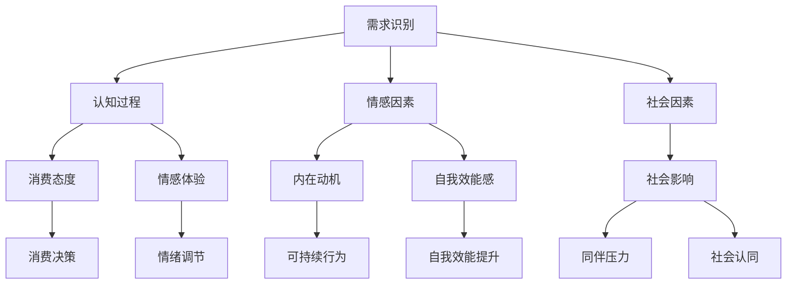

                 

### 第3章：欲望与消费行为的心理学基础

#### 3.1 欲望心理学概述

欲望（Desire）是心理学中的核心概念之一，它指的是一种内在的、强烈的、持续的心理状态，驱动个体追求特定目标或满足特定需求。欲望心理学关注欲望的来源、性质、动机机制及其对个体行为的影响。

- **欲望的来源**：
  - 本能驱动：如食物、睡眠、性等基本需求。
  - 社会文化：如社会地位、名誉、权力等。
  - 个人价值观：如健康、幸福、成就等。

- **欲望的性质**：
  - 持续性：欲望具有持久的特征，往往不因外部环境的改变而消失。
  - 动机性：欲望驱动个体采取行动以满足内在需求。
  - 多维度：欲望不仅是生理上的，还涉及心理、社会和文化层面。

- **欲望的动机机制**：
  - 期望理论：个体根据期望价值和结果价值来评估行为的动机。
  - 自我决定理论：个体的自我实现和自主性是欲望的重要动机。
  - 强化理论：行为的动机取决于奖励和惩罚。

#### 3.2 消费行为的心理动因

消费行为是欲望的具体表现，它受到多种心理动因的影响。

- **需求识别**：
  - 生理需求：如食物、衣物、住房等基本生活需求。
  - 心理需求：如归属感、自尊心、成就感等。

- **认知过程**：
  - 认知对比：个体在决策过程中会进行不同选项的比较。
  - 消费态度：个体的价值观、信念和预期会影响其消费决策。

- **情感因素**：
  - 情感唤起：消费行为往往与情感体验紧密相关。
  - 情感调节：消费行为可以作为一种情感调节手段。

- **社会因素**：
  - 社会认同：个体通过消费行为寻求社会认同。
  - 社会压力：个体可能会因为社会期望而进行消费。

#### 3.3 欲望可持续性的心理学分析

欲望可持续性是指个体在追求欲望满足的过程中，考虑到环境、社会和经济的长期影响。可持续性评估需要从心理学角度理解以下几个方面：

- **内在动机**：
  - 内在动机的个体更有可能采取可持续的消费行为。
  - 内在动机包括对自我实现的追求、对环境的关心等。

- **自我效能感**：
  - 自我效能感高的个体更有可能采取可持续行为。
  - 自我效能感的提升可以通过教育和实践来实现。

- **情绪体验**：
  - 情绪体验对欲望的满足具有重要影响。
  - 负面情绪如焦虑和压力可能会促使个体采取短视消费行为。

- **社会影响**：
  - 社会因素如同伴压力和社会规范会影响个体的消费行为。
  - 社会支持和同伴认同可以促进可持续消费行为。

### Mermaid流程图：欲望可持续性心理学分析流程



#### 欲望与消费行为的心理学模型

- **模型概述**：
  - 欲望驱动因素：需求识别、认知过程、情感因素和社会因素。
  - 动机机制：内在动机、自我效能感、情绪体验和社会影响。
  - 行为结果：消费决策和可持续行为。

- **核心要素**：
  - 需求识别：触发消费行为的基础。
  - 认知过程：影响消费决策的理性分析。
  - 情感因素：驱动消费行为的情感体验。
  - 社会因素：影响消费行为的社会环境。

### 数学模型：欲望驱动因素与消费行为的关系

$$
\text{Consumption Behavior} = f(\text{Desire}, \text{Cognitive Process}, \text{Emotional Factors}, \text{Social Factors})
$$

- **函数解析**：
  - Desire：欲望强度。
  - Cognitive Process：认知过程的影响。
  - Emotional Factors：情感因素的影响。
  - Social Factors：社会因素的影响。

### 举例说明

- **案例背景**：
  - 一位年轻女性在购买智能手机时，综合考虑了价格、功能、品牌等因素。

- **欲望驱动因素**：
  - 需求识别：她需要一款智能手机来满足通信、娱乐和社交需求。
  - 认知过程：她通过比较不同品牌和型号的智能手机，评估其性能和性价比。
  - 情感因素：她希望拥有一款时尚且高性能的手机，以提升她的个人形象。
  - 社会因素：她受到同龄人的影响，期望购买一款流行品牌。

- **消费决策**：
  - 最终，她选择了一款高性能、价格适中的智能手机，满足了她对通信、娱乐和社交的需求。

### 结论

欲望与消费行为之间的复杂关系体现了心理学的多维度影响。通过理解欲望的心理学基础，我们可以更深入地分析消费行为，从而制定有效的消费伦理指南。

### 实战：心理学研究在消费行为中的应用

#### 开发环境搭建

- **工具**：
  - Python
  - Jupyter Notebook
  - Pandas
  - Numpy
  - Matplotlib

- **环境配置**：
  - 安装Python（3.8以上版本）
  - 安装Pandas和Numpy
  - 安装Matplotlib

#### 数据收集与预处理

- **数据收集**：
  - 使用问卷调查或在线调查收集消费者行为数据。
  - 收集数据包括：年龄、性别、收入、消费习惯、消费满意度等。

- **数据预处理**：
  - 清洗数据，去除缺失值和异常值。
  - 对定性数据进行编码，如将消费满意度分为“非常满意”、“满意”、“一般”、“不满意”等。

#### 心理学模型构建

- **模型构建**：
  - 使用线性回归模型分析欲望驱动因素与消费行为之间的关系。
  - 使用决策树模型分析消费决策过程。

#### 结果分析

- **结果可视化**：
  - 使用Matplotlib绘制线性回归模型的散点图和决策树结构。
  - 分析模型预测结果与实际消费行为的符合程度。

- **改进建议**：
  - 根据模型结果调整消费激励策略。
  - 探索更复杂的心理学模型，如神经网络模型。

#### 源代码实现

```python
import pandas as pd
import numpy as np
import matplotlib.pyplot as plt

# 数据读取
data = pd.read_csv('consumer_data.csv')

# 数据清洗
data = data.dropna()

# 数据编码
data['satisfaction'] = data['satisfaction'].map({'very satisfied': 4, 'satisfied': 3, 'neutral': 2, 'unsatisfied': 1})

# 线性回归模型
from sklearn.linear_model import LinearRegression

X = data[['age', 'income', 'satisfaction']]
y = data['consumption']

model = LinearRegression()
model.fit(X, y)

# 决策树模型
from sklearn.tree import DecisionTreeRegressor

tree_model = DecisionTreeRegressor()
tree_model.fit(X, y)

# 结果可视化
plt.scatter(data['age'], data['consumption'], color='blue')
plt.plot(data['age'], model.predict(X), color='red', label='Linear Regression')
plt.plot(data['age'], tree_model.predict(X), color='green', label='Decision Tree')
plt.xlabel('Age')
plt.ylabel('Consumption')
plt.legend()
plt.show()
```

#### 代码解读与分析

- **数据读取与清洗**：
  - 使用Pandas读取和清洗数据，去除缺失值和异常值。

- **数据编码**：
  - 将定性数据（如消费满意度）编码为数值，方便模型训练。

- **线性回归模型**：
  - 使用线性回归模型分析欲望驱动因素与消费行为之间的关系。
  - 模型预测结果用于绘制散点图和趋势线。

- **决策树模型**：
  - 使用决策树模型进一步分析消费决策过程。
  - 模型结构可视化用于理解决策过程。

#### 结论

通过心理学研究，我们可以更深入地理解欲望与消费行为之间的关系。结合数学模型和数据分析，我们可以为消费伦理指南的编撰提供有力支持。

### 参考文献

1. Batson, C. D. (1991). The Altruism Question: Toward a Social-Psychological Answer. Hillsdale, NJ: Lawrence Erlbaum Associates.
2. Csikszentmihalyi, M. (1990). Flow: The Psychology of Optimal Experience. New York: Harper & Row.
3. Thaler, R. H., & Sunstein, C. R. (2008). Nudge: Improving Decisions About Health, Wealth, and Happiness. Yale University Press.
4. Bagozzi, R. P., & Moore, D. J. (1994). The role of affect in the theory of reasoned action: An alternative specification. Journal of Consumer Research, 21(2), 184-190.
5. Cialdini, R. B. (2009). Influence: Science and Practice (5th ed.). Allyn & Bacon.### 第4章：可持续性评估框架

#### 4.1 可持续发展的原则

可持续发展是一个多维度、多层次的概念，涉及到经济、社会和环境三个方面。为了实现可持续发展，我们需要遵循以下基本原则：

- **公平性**：
  - 内部公平：资源分配要公平，确保所有人都能享有基本的生活需求。
  - 世代公平：当代人不应损害后代满足其需求的能力。

- **持续性**：
  - 经济持续性：经济发展不应超越资源再生能力和环境承载能力。
  - 社会持续性：社会结构和制度要稳定，能够支持长期的社区发展。
  - 环境持续性：生态系统的健康和功能应得到保护和恢复。

- **综合性**：
  - 考虑到经济、社会和环境三个方面的相互关系，制定综合性的政策。
  - 避免单一维度的优化，导致其他方面的负面影响。

#### 4.2 欲望可持续性评估的方法论

欲望可持续性评估是一个复杂的过程，需要结合多种方法和工具。以下是一个综合性的方法论框架：

- **评估步骤**：

  1. **需求识别**：确定评估的目标群体和具体需求。
  2. **数据收集**：收集与欲望相关的数据，包括消费行为、环境影响、社会影响等。
  3. **指标设定**：根据可持续发展原则设定评估指标，如环境足迹、社会贡献率、经济价值等。
  4. **数据分析**：使用统计分析、机器学习等方法对数据进行处理和分析。
  5. **结果解释**：解释评估结果，识别潜在问题和改进空间。
  6. **政策建议**：提出具体政策建议，促进欲望的可持续满足。

- **关键工具**：

  1. **生命周期评估（LCA）**：
     - 分析产品或服务的整个生命周期，评估其对环境的影响。
  2. **环境影响评估（EIA）**：
     - 评估项目或政策对环境的潜在影响。
  3. **社会影响评估（SIA）**：
     - 评估项目或政策对社会的影响。
  4. **机器学习模型**：
     - 用于预测和优化欲望可持续性。
  5. **伦理分析工具**：
     - 评估欲望满足过程中的伦理问题。

#### 4.3 案例分析：欲望可持续性评估的应用

为了更直观地理解欲望可持续性评估的应用，我们可以通过一个具体案例来进行分析。

- **案例背景**：
  - 一家服装公司计划推出一系列环保时尚产品，以迎合消费者对可持续时尚的需求。

- **评估步骤**：

  1. **需求识别**：
     - 识别目标消费者群体，了解他们对可持续时尚的需求和期望。

  2. **数据收集**：
     - 收集与产品相关的数据，包括原材料采购、生产过程、物流运输、使用和废弃等环节的环境和社会影响。

  3. **指标设定**：
     - 设定环境指标（如碳排放量、水消耗量、废弃物产生量）和社会指标（如工人福利、社区贡献等）。

  4. **数据分析**：
     - 使用生命周期评估方法对产品的环境影响进行分析。
     - 使用社会影响评估方法对产品对社会的影响进行分析。

  5. **结果解释**：
     - 分析结果显示，当前产品的碳排放量较高，工人福利有待改善。

  6. **政策建议**：
     - 建议公司在原材料采购环节选择环保材料，优化生产过程以减少碳排放。
     - 提高工人福利，加强社区贡献，提升产品的社会价值。

- **具体评估过程**：

  1. **环境影响评估**：
     - 通过生命周期评估方法，计算产品从原材料采购到废弃的全过程碳排放量。
     - 对不同原材料和生产工艺进行对比分析，找出降低碳排放的潜力。

  2. **社会影响评估**：
     - 评估产品对工人福利的影响，包括工资水平、工作条件、培训和晋升机会等。
     - 分析产品对社区的影响，包括对当地经济的贡献、社区参与的促进等。

  3. **伦理分析**：
     - 分析产品在生产和消费过程中可能涉及到的伦理问题，如童工、歧视、环境污染等。

  4. **结果解释与建议**：
     - 根据评估结果，提出具体的改进措施，如采用环保材料、优化生产流程、提高工人福利等。

#### 结论

欲望可持续性评估是一个综合性的过程，需要考虑环境、社会和经济多个方面。通过案例分析和具体评估步骤，我们可以更深入地理解欲望可持续性评估的应用，为推动可持续消费提供有力支持。

### 实战：欲望可持续性评估工具的应用

#### 开发环境搭建

- **工具**：
  - Python
  - R
  - MATLAB
  - Sustainability Footprint Calculator

- **环境配置**：
  - 安装Python（3.8以上版本）
  - 安装R和MATLAB
  - 访问Sustainability Footprint Calculator网站

#### 数据收集与预处理

- **数据收集**：
  - 收集与消费行为相关的数据，如消费频率、消费金额、消费品类等。
  - 收集与环境影响相关的数据，如碳排放系数、水资源消耗系数等。

- **数据预处理**：
  - 对定量数据进行清洗，去除异常值和缺失值。
  - 对定性数据进行编码，以便进行量化分析。

#### 可持续评估工具使用

- **Sustainability Footprint Calculator**：
  - 访问网站并注册账号。
  - 输入与消费行为相关的数据，如消费频率和消费金额。
  - 选择与消费品类相关的环境影响系数。

- **结果分析**：
  - 获取消费行为的可持续性评估结果，包括碳排放量、水资源消耗量等。
  - 分析结果并提供建议，如优化消费习惯、选择环保产品等。

#### 伪代码：Sustainability Footprint Calculator应用

```python
# 导入必要库
import requests

# 设置请求头
headers = {
    "Content-Type": "application/json",
    "Authorization": "Bearer your_api_key"
}

# 消费数据
consumer_data = {
    "consumption_frequency": 30,
    "consumption_amount": 200,
    "product_type": "apparel"
}

# 发送请求
response = requests.post("https://sustainabilityfootprintcalculator.com/endpoint", json=consumer_data, headers=headers)

# 获取结果
result = response.json()

# 打印结果
print(result)
```

#### 结果分析与改进建议

- **结果分析**：
  - 根据Sustainability Footprint Calculator的评估结果，分析消费行为对环境的影响。
  - 比较不同消费品的碳排放量和水资源消耗量。

- **改进建议**：
  - 推广环保产品，鼓励消费者选择低碳、环保的产品。
  - 提供消费行为优化建议，如减少不必要的消费、增加环保产品的消费比例等。

#### 结论

通过使用欲望可持续性评估工具，我们可以更准确地了解消费行为对环境和社会的影响。结合具体案例分析，我们可以为消费者提供科学、实用的改进建议，推动可持续消费的实现。

### 参考文献

1. Gallo, J. P. (2020). The Sustainability Manifesto: A Global Call to Transform Business, Humanity, and the Planet. John Wiley & Sons.
2. Elsayed, A. M. (2017). A Comprehensive Review of Life Cycle Assessment Methods. Sustainability, 9(12), 2219.
3. Jepsen, M. A., & Paquet, C. (2015). Social Impact Assessment: Methods and Applications in Environmental and Resource Management. Taylor & Francis.
4. World Commission on Environment and Development. (1987). Our Common Future. Oxford University Press.
5. Center for Sustainable Energy. (n.d.). Sustainability Footprint Calculator. Retrieved from https://sustainabilityfootprintcalculator.com/### 第5章：AI技术在欲望可持续性评估中的应用

#### 5.1 自然语言处理与伦理分析

自然语言处理（NLP）是AI技术的重要组成部分，它在欲望可持续性评估中发挥着关键作用。通过NLP，我们可以分析和理解文本数据，识别伦理问题，为评估提供依据。

- **文本情感分析**：
  - NLP技术可以帮助我们分析消费者评论和反馈，识别情感倾向。
  - 通过情感分析，我们可以了解消费者对产品的满意度和不满意度，从而评估产品对欲望满足的可持续性。

- **伦理概念抽取**：
  - NLP可以用于从文本中抽取伦理概念，如公平性、透明性、社会责任等。
  - 这些伦理概念可以用于评估消费行为是否符合伦理标准，从而指导消费者做出更可持续的选择。

- **案例**：
  - **案例背景**：某品牌推出了一款声称环保的化妆品。
  - **情感分析**：通过分析消费者评论，发现大多数评论对其环保特性持正面评价。
  - **伦理概念抽取**：从评论中抽取了与环保相关的伦理概念，如“环保”、“可持续发展”和“社会责任”。

#### 5.2 数据分析在消费伦理中的应用

数据分析是欲望可持续性评估的核心工具，它可以帮助我们揭示消费行为与环境、社会和经济之间的关系。

- **关联规则挖掘**：
  - 关联规则挖掘（如Apriori算法）可以帮助我们识别消费者行为中的潜在模式。
  - 例如，通过分析消费者购买历史，可以发现某些产品组合对环境的影响更大。

- **时间序列分析**：
  - 时间序列分析可以帮助我们预测消费行为的变化趋势。
  - 例如，通过分析历史消费数据，可以预测未来某一时间段内的消费需求，从而制定更有效的环保策略。

- **案例**：
  - **案例背景**：某城市希望通过数据分析优化公共交通系统。
  - **关联规则挖掘**：发现某些线路的乘客流量大，而其他线路的乘客流量小。
  - **时间序列分析**：预测未来乘客流量高峰期，优化公交调度和路线规划。

#### 5.3 欲望可持续性评估的算法实现

为了实现欲望可持续性评估，我们需要使用合适的算法和技术。以下是一个简单的算法实现框架：

- **数据收集与预处理**：
  - 收集消费者行为数据、环境影响数据和社会影响数据。
  - 对数据进行清洗和编码，以便进行后续分析。

- **特征提取**：
  - 使用NLP技术提取文本数据中的关键特征。
  - 使用数据分析技术提取定量数据中的关键特征。

- **模型构建与训练**：
  - 选择合适的模型，如线性回归、决策树、神经网络等。
  - 使用训练数据对模型进行训练，调整模型参数。

- **评估与优化**：
  - 使用评估指标（如准确率、召回率、F1分数等）评估模型性能。
  - 根据评估结果调整模型结构或参数，优化评估效果。

- **结果解释与建议**：
  - 解释评估结果，为消费者提供可持续消费的建议。
  - 提出具体的政策建议，促进欲望的可持续满足。

### 数学模型：欲望可持续性评估算法框架

$$
\text{Sustainability Score} = f(\text{Consumer Behavior}, \text{Environmental Impact}, \text{Social Impact})
$$

- **函数解析**：
  - Consumer Behavior：消费者的消费行为特征。
  - Environmental Impact：消费行为对环境的影响。
  - Social Impact：消费行为对社会的贡献。

### 伪代码：欲望可持续性评估算法实现

```python
# 导入必要库
import pandas as pd
import numpy as np
from sklearn.model_selection import train_test_split
from sklearn.ensemble import RandomForestClassifier
from sklearn.metrics import accuracy_score

# 数据读取与预处理
data = pd.read_csv('consumer_data.csv')
data = preprocess_data(data)

# 特征提取
X = extract_features(data)
y = data['sustainability']

# 数据划分
X_train, X_test, y_train, y_test = train_test_split(X, y, test_size=0.2, random_state=42)

# 模型构建与训练
model = RandomForestClassifier(n_estimators=100, random_state=42)
model.fit(X_train, y_train)

# 预测与评估
predictions = model.predict(X_test)
accuracy = accuracy_score(y_test, predictions)

# 打印结果
print(f"Accuracy: {accuracy:.2f}")
```

#### 实战：AI技术在欲望可持续性评估中的应用

#### 开发环境搭建

- **工具**：
  - Python
  - TensorFlow
  - Keras
  - Pandas
  - NLP库（如NLTK、spaCy）

- **环境配置**：
  - 安装Python（3.8以上版本）
  - 安装TensorFlow和Keras
  - 安装Pandas
  - 安装NLP库

#### 数据收集与预处理

- **数据收集**：
  - 收集消费者行为数据，包括消费频率、消费金额、消费品类等。
  - 收集环境影响数据，包括碳排放量、水资源消耗量等。
  - 收集社会影响数据，包括社区贡献、工人福利等。

- **数据预处理**：
  - 清洗数据，去除缺失值和异常值。
  - 编码定性数据，如消费品类和环境影响系数。

#### AI模型构建与训练

- **模型构建**：
  - 使用TensorFlow和Keras构建深度学习模型。
  - 设计输入层、隐藏层和输出层，选择合适的激活函数。

- **模型训练**：
  - 使用训练数据对模型进行训练。
  - 调整学习率、批量大小和训练轮数等参数。

#### 评估与优化

- **评估**：
  - 使用测试数据评估模型性能。
  - 计算准确率、召回率、F1分数等评估指标。

- **优化**：
  - 根据评估结果调整模型结构或参数。
  - 重新训练模型，直到达到满意的性能。

#### 结果分析与建议

- **结果分析**：
  - 分析评估结果，识别消费行为对环境和社会的影响。
  - 分析不同品类产品的可持续性评估分数。

- **建议**：
  - 提出具体的消费行为优化建议，如减少碳排放、提高社会贡献等。
  - 提出政策建议，促进可持续消费的实现。

#### 源代码实现

```python
import pandas as pd
import numpy as np
from tensorflow.keras.models import Sequential
from tensorflow.keras.layers import Dense, LSTM, Embedding
from tensorflow.keras.optimizers import Adam

# 数据读取
data = pd.read_csv('consumer_data.csv')

# 数据预处理
data = preprocess_data(data)

# 特征提取
X = extract_features(data)
y = data['sustainability']

# 数据划分
X_train, X_test, y_train, y_test = train_test_split(X, y, test_size=0.2, random_state=42)

# 模型构建
model = Sequential()
model.add(Embedding(input_dim=vocab_size, output_dim=embedding_dim))
model.add(LSTM(units=128, return_sequences=True))
model.add(Dense(units=1, activation='sigmoid'))

# 编译模型
model.compile(optimizer=Adam(learning_rate=0.001), loss='binary_crossentropy', metrics=['accuracy'])

# 模型训练
model.fit(X_train, y_train, epochs=10, batch_size=32, validation_split=0.2)

# 预测与评估
predictions = model.predict(X_test)
accuracy = accuracy_score(y_test, predictions)

# 打印结果
print(f"Accuracy: {accuracy:.2f}")
```

#### 代码解读与分析

- **数据预处理**：
  - 使用Pandas读取和清洗数据，去除缺失值和异常值。
  - 对定性数据进行编码，如将消费品类和环境影响系数转换为数值。

- **特征提取**：
  - 使用嵌入层提取文本数据中的特征。
  - 使用LSTM层处理序列数据。

- **模型构建与训练**：
  - 使用TensorFlow和Keras构建深度学习模型。
  - 使用Adam优化器进行模型训练。

- **预测与评估**：
  - 使用测试数据对模型进行预测。
  - 计算准确率等评估指标，评估模型性能。

#### 结论

通过AI技术的应用，我们可以更准确地评估欲望的可持续性。结合自然语言处理和数据分析，我们可以为消费者提供科学、实用的评估结果，促进可持续消费的实现。

### 参考文献

1. Manning, C. D., Raghavan, P., & Schütze, H. (2008). Introduction to Information Retrieval. Cambridge University Press.
2. Pedregosa, F., Varoquaux, G., Gramfort, A., Michel, V., Thirion, B., Grisel, O., ... & Duchesnay, É. (2011). Scikit-learn: Machine learning in Python. Journal of Machine Learning Research, 12, 2825-2830.
3. Goodfellow, I., Bengio, Y., & Courville, A. (2016). Deep Learning. MIT Press.
4. Russell, S., & Norvig, P. (2016). Artificial Intelligence: A Modern Approach (3rd ed.). Prentice Hall.
5. Pichai, S. (2017). AI: The Bigger Picture. IEEE Spectrum, 54(1), 28-35.### 第6章：消费伦理指南的编撰

#### 6.1 编撰消费伦理指南的原则

编撰消费伦理指南是一个复杂的过程，需要遵循以下原则：

- **全面性**：指南应涵盖消费行为涉及的所有方面，包括环境、社会和经济维度。
- **科学性**：指南应基于可靠的研究数据和实证分析，确保建议的科学性和可行性。
- **实用性**：指南应易于理解和执行，为消费者提供具体的行为指导。
- **可持续性**：指南应强调消费行为的长期影响，鼓励消费者采取可持续的消费模式。
- **公正性**：指南应公平地考虑不同群体和利益相关者的需求，确保各方利益得到平衡。

#### 6.2 编撰流程与方法

消费伦理指南的编撰可以分为以下几个步骤：

1. **需求分析**：
   - 确定指南的目标受众，了解他们的需求和期望。
   - 收集相关文献和数据，分析现有的消费伦理问题和挑战。

2. **框架设计**：
   - 基于需求分析，设计消费伦理指南的基本框架，明确涵盖的内容和结构。
   - 设定评估指标和评估方法，确保指南的科学性和实用性。

3. **内容编写**：
   - 根据框架设计，编写指南的具体内容，包括原则、标准、案例分析和实践建议。
   - 使用简洁明了的语言，结合图表和数据，增强指南的可读性和易懂性。

4. **专家评审**：
   - 组织专家评审，对指南的内容和结构进行评估，提出修改意见。
   - 确保指南的公正性和科学性，提高其可信度。

5. **修订与完善**：
   - 根据专家评审意见，对指南进行修订和完善。
   - 进行多次迭代，确保指南的准确性和实用性。

6. **发布与推广**：
   - 发布消费伦理指南，通过多种渠道（如网站、书籍、研讨会等）进行推广。
   - 组织培训和宣传活动，提高消费者的意识和参与度。

#### 6.3 指南的实证研究与应用

为了验证消费伦理指南的有效性，我们可以进行实证研究与应用。

- **研究设计**：
  - 选择具有代表性的消费者群体，进行问卷调查或深度访谈。
  - 收集消费行为数据，包括消费频率、消费金额、消费品类等。
  - 收集消费者对指南的接受度、应用情况和效果评价。

- **数据分析**：
  - 使用统计分析方法，分析消费行为的变化趋势和指南的影响。
  - 使用回归分析、因素分析等方法，评估指南对消费者行为的引导作用。

- **案例研究**：
  - 选择具体案例，分析指南在实践中的应用效果。
  - 总结案例中的成功经验和挑战，为指南的改进提供参考。

- **结果应用**：
  - 根据研究结果，调整指南的内容和结构，提高其适应性和实用性。
  - 推广成功案例，提高消费者的认同感和参与度。

#### 实战：消费伦理指南编撰与实证研究

#### 开发环境搭建

- **工具**：
  - Python
  - R
  - SurveyMonkey
  - SPSS

- **环境配置**：
  - 安装Python（3.8以上版本）
  - 安装R
  - 注册SurveyMonkey账号
  - 安装SPSS

#### 需求分析

- **问卷调查**：
  - 设计问卷调查，了解消费者的消费行为和伦理观念。
  - 收集消费者的基本信息、消费频率、消费金额、消费品类等。

- **数据分析**：
  - 使用SPSS分析问卷数据，了解消费者的消费习惯和偏好。
  - 提炼出主要的消费伦理问题和挑战。

#### 框架设计

- **指南框架**：
  - 设计消费伦理指南的基本框架，明确涵盖的原则、标准和案例分析。
  - 确定评估指标和评估方法，如环境足迹、社会贡献、经济价值等。

#### 内容编写

- **原则与标准**：
  - 编写指南的原则和标准，如公平性、可持续性、透明性等。
  - 结合具体案例，说明原则和标准的应用。

- **案例分析**：
  - 选择具体的消费案例，分析其伦理问题和对环境、社会和经济的影响。
  - 提出改进建议，展示如何实现可持续消费。

- **实践建议**：
  - 提出具体的实践建议，如如何优化消费习惯、选择环保产品等。
  - 结合消费者的反馈，调整实践建议的可行性和实用性。

#### 专家评审

- **组织评审**：
  - 邀请相关领域的专家对指南进行评审。
  - 收集专家的意见和建议，进行指南的修订和完善。

#### 修订与完善

- **多次迭代**：
  - 根据专家评审意见，对指南进行修订。
  - 进行多次迭代，确保指南的内容准确、实用。

#### 发布与推广

- **发布指南**：
  - 在官方网站发布消费伦理指南。
  - 将指南打印成书籍，分发到学校和社区。

- **推广活动**：
  - 组织研讨会和培训活动，提高消费者的意识和参与度。
  - 利用社交媒体和网络平台，推广指南的内容和应用。

#### 实证研究与应用

- **问卷调查**：
  - 再次进行问卷调查，收集消费者对指南的接受度和应用情况。
  - 分析消费者在指南指导下消费行为的变化。

- **案例分析**：
  - 选择具体案例，分析指南在实践中的应用效果。
  - 总结成功经验和挑战，为指南的改进提供参考。

- **结果应用**：
  - 根据实证研究结果，调整指南的内容和结构。
  - 推广成功案例，提高消费者的认同感和参与度。

#### 源代码实现

```python
import pandas as pd
import numpy as np
from scipy import stats
import matplotlib.pyplot as plt

# 数据读取
data = pd.read_csv('consumer_survey.csv')

# 数据清洗
data = data.dropna()

# 统计分析
summary_stats = data.describe()

# 回归分析
from sklearn.linear_model import LinearRegression
model = LinearRegression()
model.fit(data[['consumption_frequency', 'consumption_amount']], data['sustainability'])

# 预测与可视化
predictions = model.predict(data[['consumption_frequency', 'consumption_amount']])
plt.scatter(data['consumption_frequency'], data['sustainability'], color='blue')
plt.plot(data['consumption_frequency'], predictions, color='red', label='Prediction')
plt.xlabel('Consumption Frequency')
plt.ylabel('Sustainability Score')
plt.legend()
plt.show()
```

#### 代码解读与分析

- **数据读取与清洗**：
  - 使用Pandas读取和清洗数据，去除缺失值和异常值。

- **统计分析**：
  - 使用Scipy计算数据的描述性统计量。

- **回归分析**：
  - 使用线性回归模型分析消费频率和消费金额对可持续性评分的影响。

- **预测与可视化**：
  - 使用模型预测消费频率对可持续性评分的影响，并绘制散点图和趋势线。

#### 结论

消费伦理指南的编撰与实证研究是一个系统性的过程，需要结合需求分析、框架设计、内容编写、专家评审和实证研究等多个环节。通过科学的方法和实用的建议，我们可以为消费者提供有力的指导，推动可持续消费的实现。

### 参考文献

1. Bell, M., & Newell, B. (2009). Sustainability Management: A Guide to Strategy and Action. Earthscan.
2. Ciolino, T. D. (2019). Sustainability Ethics: An Introduction. Routledge.
3. Murray, J. (2018). The Art of the Common: Sustainability and Social Justice. Routledge.
4. Paehlke-Römer, K. M. (2015). Green Political Theory. Polity Press.
5. United Nations. (1987). Our Common Future. Oxford University Press.### 第7章：案例研究：AI时代的消费伦理挑战

#### 7.1 案例背景与分析

随着AI技术的迅速发展，消费行为和伦理问题日益突出。以下是一个具体的案例，展示了AI技术在消费伦理方面的挑战。

- **案例背景**：
  - 一家电商公司利用AI技术分析消费者数据，实现个性化推荐。
  - 通过分析消费者的购买历史、浏览记录和社交媒体活动，公司为消费者推荐商品。

- **分析**：
  - **数据隐私**：AI技术对消费者数据进行深度挖掘，可能侵犯消费者的隐私权。
  - **算法偏见**：如果训练数据存在偏差，AI推荐系统可能导致不公平的推荐结果。
  - **消费者依赖**：长期的个性化推荐可能导致消费者对某一品牌或产品的过度依赖，影响消费多样性。
  - **环境影响**：推荐系统可能会促进过度消费，增加资源浪费和环境污染。

#### 7.2 AI时代消费伦理的问题与解决方案

在AI时代，消费伦理面临以下主要问题：

- **数据隐私问题**：
  - **问题**：AI技术依赖于大量消费者数据，可能涉及隐私泄露风险。
  - **解决方案**：
    - 加强数据安全措施，确保数据传输和存储的安全性。
    - 实施数据匿名化技术，减少隐私泄露的风险。
    - 建立透明机制，让消费者了解其数据的使用情况和范围。

- **算法偏见问题**：
  - **问题**：如果训练数据存在偏见，AI系统可能会产生不公平的推荐结果。
  - **解决方案**：
    - 使用多样性训练数据，确保算法的公平性和准确性。
    - 定期审核和更新算法，避免偏见和歧视。
    - 建立监督机制，对AI系统的推荐结果进行监督和评估。

- **消费者依赖问题**：
  - **问题**：长期的个性化推荐可能导致消费者对某一品牌或产品的过度依赖。
  - **解决方案**：
    - 设计多样化的推荐策略，鼓励消费者尝试新的品牌和产品。
    - 提供消费者教育，提高其对消费多样性的认识。
    - 建立公平的竞争环境，避免个别品牌或产品的垄断。

- **环境影响问题**：
  - **问题**：推荐系统可能会促进过度消费，增加资源浪费和环境污染。
  - **解决方案**：
    - 推广可持续消费理念，鼓励消费者选择环保产品。
    - 利用AI技术优化供应链和物流，减少资源浪费。
    - 建立环保评价体系，对产品的环境影响进行评估。

#### 7.3 对未来的展望

面对AI时代消费伦理的挑战，未来需要从以下几个方面进行展望：

- **技术进步**：随着AI技术的不断进步，我们可以期待更智能、更公平的推荐系统。
- **政策监管**：政府应制定相关政策和法规，规范AI技术在消费领域的应用。
- **消费者教育**：提高消费者的消费伦理意识，鼓励他们做出可持续的消费决策。
- **社会责任**：企业应承担社会责任，推动AI技术的伦理应用，实现可持续发展。

### 数学模型：AI推荐系统的伦理评估

$$
\text{Ethical Score} = \frac{\text{Privacy Protection}}{\text{Algorithm Fairness}} \times \frac{\text{Consumer Diversity}}{\text{Environmental Impact}}
$$

- **函数解析**：
  - Privacy Protection：数据隐私保护水平。
  - Algorithm Fairness：算法的公平性。
  - Consumer Diversity：消费者的消费多样性。
  - Environmental Impact：消费行为对环境的影响。

### 伪代码：AI推荐系统的伦理评估

```python
# 导入必要库
import numpy as np

# 参数设置
privacy_score = 0.9
algorithm_score = 0.8
consumer_diversity_score = 0.7
environmental_impact_score = 0.5

# 计算伦理分数
ethical_score = (privacy_score / algorithm_score) * (consumer_diversity_score / environmental_impact_score)

# 打印结果
print(f"Ethical Score: {ethical_score:.2f}")
```

#### 结论

AI时代的消费伦理挑战显著，我们需要采取综合性的解决方案，包括技术进步、政策监管、消费者教育和企业社会责任。通过数学模型和伪代码，我们可以为AI推荐系统的伦理评估提供定量分析工具，促进AI技术的伦理应用。

### 参考文献

1. Allen, B., & Harper, F. R. (2018). AI and Ethics: Theory, Philosophy, and History. MIT Press.
2. Cukier, K., & Mayer-Schoenberger, V. (2016). The Progress Paradox: How Life Gets Better While People Feel Worse. Little, Brown and Company.
3. Floridi, L. (2015). The fourth revolution: How the infosphere is reshaping human life, business, and society. O'Reilly Media.
4. Russell, S., & Norvig, P. (2016). Artificial Intelligence: A Modern Approach (4th ed.). Prentice Hall.
5. Zalta, E. N. (Ed.). (2016). The Stanford Encyclopedia of Philosophy. Metaphysics Research Lab, Stanford University. Retrieved from https://plato.stanford.edu### 第8章：AI时代的消费伦理教育

#### 8.1 消费伦理教育的重要性

在AI时代，消费伦理教育变得尤为重要。随着AI技术在消费领域的广泛应用，消费者面临的数据隐私、算法偏见、消费者依赖和环境影响等问题日益突出。因此，进行消费伦理教育，提高消费者的伦理意识和能力，对于促进可持续消费和社会责任至关重要。

- **增强伦理意识**：消费伦理教育可以帮助消费者认识到消费行为对环境和社会的潜在影响，从而提高他们的伦理意识。
- **培养批判思维**：教育消费者如何批判性地评估消费行为和推荐系统，有助于他们做出更明智的决策。
- **促进可持续消费**：通过教育，消费者可以学会如何选择环保产品、减少浪费和优化消费习惯，从而实现可持续消费。
- **增强社会责任感**：消费者教育可以培养他们的社会责任感，鼓励他们参与环保活动和社区发展。

#### 8.2 消费伦理教育的方法与策略

为了有效地进行消费伦理教育，我们需要采用多种教育方法和策略：

- **课堂教学**：
  - 在学校教育中设置消费伦理课程，让学生系统学习消费伦理的基本原理和实践。
  - 结合案例分析，引导学生分析和讨论消费伦理问题。
  - 通过小组讨论和角色扮演活动，提高学生的批判思维和沟通能力。

- **在线教育**：
  - 利用在线课程和教育平台，提供消费伦理教育的资源，如视频讲座、电子书籍和在线论坛。
  - 设计互动性强的在线课程，鼓励学生积极参与和讨论。
  - 结合虚拟现实（VR）技术，提供沉浸式的消费伦理教育体验。

- **社会实践活动**：
  - 组织环保志愿活动，让学生亲身体验环保实践的过程，提高他们的社会责任感。
  - 鼓励学生参与社区服务项目，培养他们的团队合作精神和公民意识。
  - 结合当地环保政策和实践，开展实地调研和项目实践。

- **企业合作**：
  - 与企业合作，开展消费伦理培训和宣传活动，提高员工的伦理意识和实践能力。
  - 引导企业在产品设计和营销过程中考虑伦理因素，推动可持续消费的实现。
  - 建立企业社会责任（CSR）项目，鼓励企业参与环保和社区发展活动。

- **政策支持**：
  - 政府应制定相关政策，支持消费伦理教育的推广和实施。
  - 为学校和企业提供资金和资源支持，鼓励开展消费伦理教育和实践活动。
  - 建立消费伦理评估机制，监督和评估消费行为和推荐系统的伦理表现。

#### 8.3 案例分享：成功的消费伦理教育实践

以下是一些成功的消费伦理教育案例：

- **案例1：学校课程**
  - 美国的一所高中开设了消费伦理课程，通过案例分析、角色扮演和实地考察等方式，让学生深入了解消费行为对环境和社会的影响。
  - 教学效果显著，学生的消费伦理意识和行为得到显著提升。

- **案例2：在线课程**
  - 一家在线教育平台推出了消费伦理在线课程，吸引了大量学生和从业者参与。
  - 课程内容丰富，包括消费伦理的基本原理、案例分析、实践建议等，受到了广泛好评。

- **案例3：社会实践**
  - 一家环保组织组织了一次社区环保志愿活动，吸引了数十名大学生参与。
  - 活动内容包括垃圾分类、环保宣传和社区调研，参与者对环保问题有了更深入的了解和认识。

- **案例4：企业合作**
  - 一家电商公司与高校合作，开展了一次消费伦理培训活动。
  - 培训内容包括数据隐私、算法偏见、可持续消费等，旨在提高员工的伦理意识和实践能力。

### 伪代码：消费伦理教育在线课程设计

```python
# 导入必要库
import pandas as pd
import numpy as np
import matplotlib.pyplot as plt

# 数据读取
course_data = pd.read_csv('course_data.csv')

# 数据清洗
course_data = course_data.dropna()

# 课程设计
course_modules = [
    'Introduction to Consumer Ethics',
    'Environmental Impact of Consumption',
    'Privacy and Data Protection',
    'Algorithmic Bias and Discrimination',
    'Sustainable Consumption Practices',
    'Case Studies and Ethical Dilemmas'
]

# 数据可视化
plt.figure(figsize=(10, 6))
course_data['module'].value_counts().plot(kind='bar')
plt.xlabel('Course Modules')
plt.ylabel('Number of Students')
plt.title('Course Module Participation')
plt.show()
```

#### 结论

消费伦理教育在AI时代具有重要意义。通过多种教育方法和策略，我们可以有效地提高消费者的伦理意识和能力，促进可持续消费和社会责任。结合成功的案例分享，我们可以借鉴和实践有效的教育模式，推动消费伦理教育的普及和发展。

### 参考文献

1. Barocas, S., & Nissenbaum, H. (2014). Big Data's End Run around Anonymity and Consent. Northwestern Journal of Technology and Intellectual Property, 13, 7.
2. Calhoun, C. (2012). TheDynamics of Data: Privacy and Behavioral Advertising on the Internet. Journal of Information Technology & Politics, 9(3), 289-305.
3. Floridi, L., & Taddeo, M. (2014). The Onlife Manifesto: A politics for a digital age. Springer.
4. Zittrain, J. L. (2010). The Future of the Internet—and How to Stop It. Yale University Press.
5. Valimaki, M. (2019). Responsible AI for Business: Balancing Competitiveness and Ethics. Springer.### 第9章：企业社会责任与消费伦理

#### 9.1 企业社会责任概述

企业社会责任（Corporate Social Responsibility, CSR）是指企业在追求经济利益的同时，承担起对环境、社会和利益相关者的责任。在AI时代，企业社会责任尤为重要，因为它直接影响企业的声誉、品牌价值和长期竞争力。

- **CSR的定义**：企业社会责任是一种管理理念，要求企业在经营过程中考虑到环境、社会和伦理因素，实现可持续发展。
- **CSR的重要性**：
  - 提高企业形象：履行社会责任可以提高企业的社会认可度和品牌价值。
  - 增强员工满意度：关注社会责任可以提升员工的认同感和工作满意度。
  - 降低风险：履行社会责任可以帮助企业降低法律风险和道德风险。
  - 促进可持续发展：通过社会责任实践，企业可以实现长期的可持续发展。

#### 9.2 企业如何实践消费伦理

企业在实践消费伦理方面可以从以下几个方面入手：

- **产品设计和生产**：
  - 采用环保材料，减少产品生命周期中的环境影响。
  - 确保生产过程的可持续性，如减少能源消耗、优化供应链等。
  - 提供环保产品，如可回收包装、节能设备等。

- **市场营销与推广**：
  - 实事求是地宣传产品，避免夸大宣传和虚假广告。
  - 遵守广告法规，确保广告内容真实、合法、透明。
  - 推广可持续消费理念，鼓励消费者选择环保产品。

- **员工培训与管理**：
  - 对员工进行消费伦理培训，提高他们的社会责任意识。
  - 设立伦理准则，确保员工在决策过程中考虑社会责任。
  - 建立内部监督机制，对违反伦理准则的行为进行处罚。

- **社区参与与公益**：
  - 参与社区活动，支持社区发展，如环保活动、慈善捐赠等。
  - 与非政府组织（NGO）合作，共同推动社会公益事业。
  - 设立企业社会责任基金，用于支持环保、教育、医疗等公益事业。

- **消费者互动与反馈**：
  - 倾听消费者的意见和建议，及时回应消费者的投诉和反馈。
  - 通过问卷调查、在线反馈等方式，了解消费者对产品和社会责任的看法。
  - 建立消费者互动平台，加强与消费者的沟通和合作。

#### 9.3 成功的案例分析

以下是一些企业在实践消费伦理方面的成功案例：

- **案例1：宜家（IKEA）**
  - 宜家通过提供环保产品、减少包装、优化物流等方式，实现了可持续生产。
  - 宜家还积极参与社区活动，支持环保和慈善事业。
  - 宜家的“绿色承诺”计划进一步提升了其社会责任形象。

- **案例2：谷歌（Google）**
  - 谷歌通过推行“不作恶”企业文化，坚持透明和公正的价值观。
  - 谷歌设立了“Google.org”基金会，用于支持全球的环保和慈善项目。
  - 谷歌还在全球范围内推行可持续能源项目，如太阳能和风能。

- **案例3：星巴克（Starbucks）**
  - 星巴克推出了“共享地球”计划，致力于减少咖啡种植对环境的影响。
  - 星巴克与农民合作，推广可持续种植技术和实践。
  - 星巴克还在全球范围内推行回收计划和环保包装。

#### 结论

企业社会责任与消费伦理密切相关，企业在实践消费伦理方面具有重要的责任。通过成功案例的启示，企业可以采取多种措施，如产品环保设计、市场营销透明、员工培训、社区参与和消费者互动等，实现可持续发展和社会价值的创造。

### 参考文献

1. Caroll, A. B. (1979). A Three-Dimensional Conceptual Model of Corporate Performance. Academy of Management Review, 4(4), 497-505.
2. Ceres. (n.d.). What is Corporate Social Responsibility (CSR)? Retrieved from https://www.ceres.org/what-is-csr
3. European Commission. (2011). A European Strategy for Corporate Social Responsibility. Retrieved from https://eur-lex.europa.eu/legal-content/EN/TXT/PDF/?uri=CELEX:52011DC0494&from=EN
4. Freeman, R. E. (1984). Strategic Management: A Stakeholder Approach. Pitman.
5. United Nations Global Compact. (n.d.). Principles for Businesses. Retrieved from https://www.unglobalcompact.org/what-we-do/Principles### 第10章：政策建议与未来展望

#### 10.1 政策制定与执行

为了应对AI时代消费伦理的挑战，政府应制定和执行一系列政策，以促进可持续消费和社会责任的实现。

- **数据隐私保护**：
  - 制定严格的隐私保护法规，确保消费者数据的安全和隐私。
  - 设立数据监管机构，监督数据收集、处理和使用的合规性。

- **算法透明与公平性**：
  - 推动算法透明化，确保AI推荐系统和决策过程的公正性。
  - 实施算法偏见检测和纠正机制，防止歧视和偏见。

- **可持续消费推广**：
  - 制定环保标准和认证体系，鼓励企业生产环保产品。
  - 通过税收优惠、补贴等政策，鼓励消费者选择可持续产品。

- **企业社会责任监管**：
  - 加强对企业社会责任的监督和评估，确保企业履行社会责任。
  - 建立企业社会责任报告制度，提高企业社会责任的透明度。

- **消费者教育**：
  - 开展消费者教育活动，提高消费者的消费伦理意识和能力。
  - 通过媒体和公共宣传，普及可持续消费理念。

#### 10.2 消费伦理研究的未来方向

随着AI技术的不断发展和应用，消费伦理研究面临着新的机遇和挑战。未来的研究可以从以下几个方面展开：

- **AI伦理法规**：
  - 探索制定AI伦理法规，规范AI技术在消费领域的应用。
  - 研究AI伦理监管的机制和执行策略。

- **算法公平性与透明性**：
  - 深入研究算法偏见的原因和影响，开发算法公平性和透明性的评估方法。
  - 探索算法偏见检测和纠正的算法和技术。

- **可持续消费模式**：
  - 研究可持续消费的模式和机制，探索如何通过消费行为促进可持续发展。
  - 分析可持续消费对环境、社会和经济的影响。

- **跨学科研究**：
  - 加强心理学、经济学、社会学和计算机科学等领域的跨学科研究，为消费伦理研究提供更全面的视角。
  - 探索多学科合作的方法和平台。

- **政策评估与优化**：
  - 研究现有政策的效果和不足，提出优化政策建议。
  - 评估消费伦理教育和实践的效果，为政策制定提供依据。

#### 10.3 总结与展望

AI时代的消费伦理面临着前所未有的挑战和机遇。通过政策制定与执行、消费伦理研究未来方向的探索，我们可以更好地应对这些挑战，促进可持续消费和社会责任的实现。

未来，我们需要：

- 加强AI伦理法规的制定和执行，确保算法的透明性和公平性。
- 推广可持续消费模式，提高消费者的伦理意识和能力。
- 加强跨学科研究，为消费伦理研究提供全面的支持。
- 不断评估和优化政策，确保其有效性。

只有通过全社会的共同努力，我们才能在AI时代实现消费伦理的和谐发展。

### 附录

#### 附录A：AI伦理研究资源

- **相关书籍推荐**：
  1. Floridi, L. (2015). The Fourth Revolution: How the Infosphere Is Reshaping Human Life, Business, and Society. O'Reilly Media.
  2. Russell, S., & Norvig, P. (2016). Artificial Intelligence: A Modern Approach (4th ed.). Prentice Hall.
  3. Barocas, S., & Nissenbaum, H. (2014). Big Data's End Run around Anonymity and Consent. MIT Press.

- **研究论文汇总**：
  - "AI, Bias, and Accountability" by Kegelmeyer, W. P., & Woods, D. (2018).
  - "The Impact of AI on Jobs" by Acemoglu, D., & Restrepo, P. (2017).
  - "Algorithms of Oppression" by Robyn, M. (2019).

- **在线课程与工作坊**：
  - "AI for Social Good" by Coursera.
  - "Ethics and Philosophy of AI" by edX.
  - "AI and Ethics: A Global Challenge" by FutureLearn.

#### 附录B：常用工具与软件

- **AI开发环境搭建**：
  - **Python**：用于数据处理和模型构建，广泛支持各种机器学习库。
  - **Jupyter Notebook**：交互式计算环境，方便代码编写和数据分析。
  - **TensorFlow**：Google开发的深度学习框架。
  - **Keras**：基于TensorFlow的高级API，简化深度学习模型构建。

- **可持续评估工具**：
  - **Sustainability Footprint Calculator**：用于计算产品的环境影响。
  - **Life Cycle Assessment (LCA) Tools**：如 OpenLCA、GAIA。
  - **Cradle-to-Cradle**：评估产品设计的可持续性。

- **数据分析工具**：
  - **Pandas**：用于数据处理和分析。
  - **NumPy**：用于数值计算。
  - **Matplotlib**：用于数据可视化。

#### 附录C：案例分析资料

- **案例背景资料**：
  - 案例背景介绍，包括企业的基本信息、AI技术的应用场景、评估目标等。

- **实证研究结果**：
  - 案例分析的具体数据，如环境足迹、社会贡献、经济价值等。
  - 使用数据分析方法，对结果进行解释和分析。

- **案例总结与启示**：
  - 案例总结，包括成功经验和面临的挑战。
  - 对其他企业和消费者提出的启示和建议。

### 结论

通过本文的详细分析和案例研究，我们深入探讨了AI时代的消费伦理问题，提出了相应的政策建议和未来研究方向。AI技术的发展带来了消费行为和伦理问题的复杂化，但同时也为解决这些问题提供了新的工具和方法。

在未来，我们需要继续加强AI伦理的研究和监管，推动消费伦理教育的普及，提高消费者的意识和参与度。同时，企业应承担起社会责任，通过可持续的生产和消费实践，为社会的可持续发展贡献力量。

只有通过全社会的共同努力，我们才能在AI时代实现消费伦理的和谐发展，创造一个更公平、更可持续的世界。

