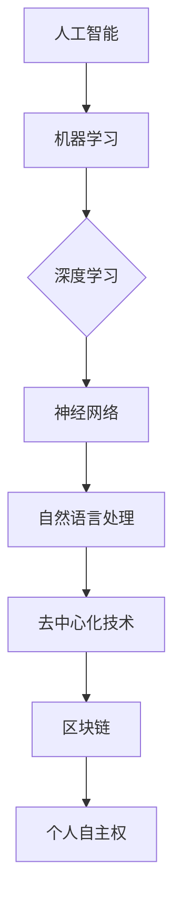

                 

### 引言与概述

在当今快速发展的科技时代，人工智能（AI）的去中心化应用正逐渐成为焦点。本文旨在探讨AI与去中心化技术如何结合，以促进个人自主权的发展。本文分为六个主要部分：引言与概述、AI与去中心化技术、AI与去中心化的结合、个人自主权的挑战与机遇、政策与法律框架以及未来展望。

**关键词：** AI、去中心化、个人自主权、区块链、智能合约、数字身份。

**摘要：** 本文首先介绍了AI和去中心化技术的基本概念，探讨了它们如何相互促进，从而增强个人自主权。接着，通过分析AI在去中心化系统中的应用，探讨了个人自主权面临的挑战与机遇。最后，本文提出了相关政策与法律框架，并展望了AI与去中心化技术的未来趋势。

### 第一部分：引言与概述

**1.1** 本书主题与目的

人工智能（AI）作为当前科技领域的一个重大突破，已经深刻地影响了社会各个方面。从智能家居到自动驾驶，AI技术的应用日益广泛。然而，随着AI技术的不断发展，其带来的挑战也日益显著。特别是，如何确保个人自主权，在AI时代得以维护，成为一个亟待解决的问题。

去中心化技术，如区块链，提供了实现个人自主权的一种潜在途径。去中心化技术通过去除了传统的中心化控制机制，使得权力分散，数据透明，从而提高了系统的可靠性和安全性。本文将探讨AI与去中心化技术的结合，分析其如何促进个人自主权的发展。

**1.2** AI与去中心化：概念解析

**人工智能（AI）：** 人工智能是指计算机系统模拟人类智能行为的能力。它涵盖了多个领域，包括机器学习、深度学习、自然语言处理等。AI的核心目标是使计算机能够自动执行复杂的任务，从而减少人类干预。

**去中心化技术：** 去中心化技术是指一种分布式计算模型，其中没有中央控制机构，所有参与者都有平等的权力。这种模型通过去除了传统的中心化控制，实现了权力分散、数据透明和安全性提高。

**1.3** 个人自主权的重要性

个人自主权是指个人在自由、平等、知情的基础上，自主决策和行动的能力。在数字化时代，个人自主权尤为重要，因为它关系到个人的隐私、自由和权利。AI技术的普及，虽然为我们的生活带来了便利，但也带来了隐私泄露、数据滥用等问题。因此，如何确保个人自主权在AI时代得以维护，是一个亟待解决的问题。

去中心化技术，通过提供一种去除了中心化控制的机制，为个人自主权的实现提供了一种潜在的解决方案。例如，通过区块链技术，个人可以拥有对自己数据的完全控制权，从而防止数据滥用和隐私泄露。

### 第二部分：AI技术概述

**2.1** 人工智能的定义与分类

人工智能（AI）是指计算机系统模拟人类智能行为的能力。它涵盖了多个领域，包括机器学习、深度学习、自然语言处理等。AI的目标是使计算机能够自动执行复杂的任务，从而减少人类干预。

**机器学习：** 机器学习是一种通过数据学习模式的AI方法。它利用统计方法和算法，使计算机能够从数据中自动学习，并作出预测或决策。

**深度学习：** 深度学习是机器学习的一个分支，它使用多层神经网络来学习数据。深度学习在图像识别、语音识别和自然语言处理等领域取得了显著成果。

**自然语言处理：** 自然语言处理是AI的一个分支，它致力于使计算机能够理解和处理自然语言。自然语言处理的应用包括机器翻译、情感分析和语音识别等。

**2.2** AI的发展历程与趋势

AI的研究始于20世纪50年代，经历了几次起伏。在20世纪80年代和90年代，基于规则的专家系统是AI的主流。然而，随着计算能力的提高和数据量的增加，机器学习和深度学习逐渐成为AI的核心。

**2012年：** AlexNet在ImageNet比赛中取得巨大成功，标志着深度学习的崛起。

**2016年：** Google的AlphaGo在围棋比赛中战胜人类顶尖选手，展示了AI的强大能力。

**当前趋势：** AI正在向更多领域扩展，包括自动驾驶、智能医疗和金融科技等。同时，AI也在不断向更加智能化、自适应化的方向发展。

**2.3** 人工智能的核心算法原理（伪代码讲解）

**深度学习算法原理：** 深度学习算法基于多层神经网络，通过反向传播算法训练模型。

```python
# 伪代码：深度学习算法
def NeuralNetworkTraining(data, learning_rate, epochs):
    for epoch in range(epochs):
        for sample in data:
            output = ForwardPass(sample)
            loss = CalculateLoss(output, target)
            BackwardPass(loss, learning_rate)
    return TrainedModel

def ForwardPass(sample):
    # 前向传播，计算输出
    return activation_function(Z)

def CalculateLoss(output, target):
    # 计算损失函数
    return (output - target) ** 2

def BackwardPass(loss, learning_rate):
    # 反向传播，更新权重
    dZ = dLoss / dOutput
    dOutput = dActivationFunction(Z)
    dZ = dOutput * dZ
    dW = dZ * dInput
    dInput = dZ * dWeight
    W -= learning_rate * dW
    b -= learning_rate * dB
```

**神经网络训练过程：** 
1. 输入训练数据。
2. 对于每个样本，执行前向传播，计算输出。
3. 计算损失函数。
4. 执行反向传播，更新权重和偏置。
5. 重复上述步骤，直到达到预定的训练轮次。

### 第三部分：去中心化技术

**3.1** 去中心化的定义与优势

去中心化是指系统中的权力和责任分散到多个参与者之间，而不是集中在一个中央机构手中。去中心化技术通过分布式计算和网络结构，实现了一种去除了中心化控制的机制。

**优势：**
1. **可靠性：** 去中心化系统具有较高的可靠性，因为即使某个节点出现故障，整个系统仍然可以正常运作。
2. **安全性：** 去中心化技术提供了更高的安全性，因为攻击者需要同时攻击多个节点才能破坏系统。
3. **透明性：** 去中心化系统具有较高的透明性，因为所有交易和操作都可以公开查看。

**3.2** 区块链技术的基本原理

区块链技术是一种分布式数据库技术，通过多个节点共同维护一个共享的账本。区块链的主要特点是去中心化、不可篡改和透明。

**基本原理：**
1. **区块链结构：** 区块链由多个区块组成，每个区块包含一定数量的交易记录。每个区块都与前一个区块通过哈希值连接，形成一个链式结构。
2. **加密算法：** 区块链使用加密算法确保数据的完整性和安全性。每个区块的哈希值由交易数据和前一个区块的哈希值计算得到。
3. **共识机制：** 区块链通过共识机制确保所有节点对账本的一致性。常见的共识机制包括工作量证明（PoW）和权益证明（PoS）。

**3.3** 去中心化金融（DeFi）的应用

去中心化金融（DeFi）是一种通过区块链技术实现的金融服务体系。DeFi去除了传统的金融机构，使个人可以直接进行金融交易。

**应用：**
1. **去中心化交易所（DEX）：** 去中心化交易所允许用户直接在区块链上进行加密货币交易，去除了中心化交易所的中介角色。
2. **借贷平台：** 去中心化借贷平台允许用户直接进行借贷，去除了传统金融机构的中介角色。
3. **稳定币：** 稳定币是一种价值稳定的加密货币，通过算法控制供应量，以保持币值稳定。

### 第四部分：AI与去中心化的结合

**4.1** AI与区块链的协同作用

AI与区块链的结合为去中心化系统提供了新的可能性。AI可以用于优化区块链网络的性能，提高交易速度和安全性。

**应用：**
1. **智能合约：** 智能合约是区块链上自动执行的合同。AI可以用于编写和优化智能合约，提高其效率和安全性。
2. **区块链分析：** AI可以用于分析和预测区块链网络中的交易模式，提高系统的安全性。
3. **去中心化身份验证：** AI可以用于实现去中心化身份验证，确保用户身份的合法性和安全性。

**4.2** AI赋能去中心化自治组织（DAO）

去中心化自治组织（DAO）是一种基于区块链的分布式组织形式。AI可以用于优化DAO的决策过程，提高组织的效率和透明度。

**应用：**
1. **投票系统：** AI可以用于优化DAO的投票系统，确保投票的公正性和有效性。
2. **预算管理：** AI可以用于优化DAO的预算管理，提高资金使用的效率和透明度。
3. **项目评估：** AI可以用于评估DAO的项目提案，提高项目的可行性和成功率。

**4.3** AI去中心化决策系统的设计与实现

AI去中心化决策系统是一种基于AI和区块链技术的决策系统。它通过去除了中心化控制，实现了决策过程的透明性和公正性。

**设计与实现：**
1. **数据收集与预处理：** 收集与决策相关的数据，并进行预处理，以供AI模型训练。
2. **模型训练与优化：** 使用训练数据训练AI模型，并优化模型性能。
3. **区块链集成：** 将AI模型集成到区块链网络中，实现去中心化决策。
4. **共识机制设计：** 设计合适的共识机制，确保决策过程的一致性和安全性。

### 第五部分：个人自主权的挑战与机遇

**6.1** 数字身份与隐私保护

数字身份是指个人在数字世界中的身份信息。随着AI和区块链技术的发展，数字身份的保护变得尤为重要。

**挑战：**
1. **隐私泄露：** AI和区块链技术可能会收集和存储大量的个人数据，导致隐私泄露的风险。
2. **数据滥用：** 未经授权的实体可能会滥用个人数据，导致身份被盗用。

**机遇：**
1. **隐私保护技术：** AI和区块链技术可以用于实现隐私保护，如差分隐私和零知识证明。
2. **数字身份验证：** AI和区块链技术可以用于实现更安全的数字身份验证，提高身份的合法性。

**6.2** 去中心化身份验证技术

去中心化身份验证技术是一种通过去中心化网络验证身份的技术。它通过去除了中心化控制，实现了身份验证的透明性和安全性。

**应用：**
1. **跨境身份验证：** 去中心化身份验证技术可以用于实现跨境身份验证，提高身份验证的效率和可靠性。
2. **数字证件：** 去中心化身份验证技术可以用于实现数字证件，如数字护照和数字身份证。
3. **身份验证平台：** 去中心化身份验证技术可以用于构建身份验证平台，提供更安全、更高效的验证服务。

**6.3** AI算法的透明性与可解释性

AI算法的透明性与可解释性是确保AI系统公正性和可信性的关键。

**挑战：**
1. **黑箱算法：** 许多AI算法，特别是深度学习算法，具有高度的非线性，导致其决策过程不透明。
2. **偏见问题：** AI算法可能会在训练数据中引入偏见，导致决策的不公平。

**机遇：**
1. **可解释性技术：** AI和区块链技术可以用于实现AI算法的可解释性，提高系统的透明性和可信性。
2. **公平性评估：** AI和区块链技术可以用于评估AI系统的公平性和公正性，确保系统的决策过程合理。

### 第六部分：政策与法律框架

**8.1** 全球监管趋势与政策

随着AI和区块链技术的发展，全球各国开始加强对这些技术的监管。

**趋势：**
1. **数据保护：** 全球各国加强了对个人数据的保护，如欧盟的《通用数据保护条例》（GDPR）。
2. **网络安全：** 全球各国加强了对网络安全的监管，以防止AI和区块链技术被用于非法活动。

**政策：**
1. **美国：** 美国政府提出了《国家人工智能战略》，旨在推动AI技术的发展和监管。
2. **欧盟：** 欧盟提出了《数字市场法》和《数字服务法》，旨在规范AI和区块链技术的应用。

**8.2** 个人数据保护法律框架

个人数据保护法律框架是确保个人自主权的重要保障。

**框架：**
1. **数据收集：** 在收集个人数据时，必须获得用户的明确同意。
2. **数据存储：** 个人数据必须存储在安全的地方，防止数据泄露。
3. **数据使用：** 个人数据只能用于用户授权的目的。

**8.3** 去中心化AI系统的合规性挑战与解决方案

去中心化AI系统的合规性挑战主要集中在数据保护、网络安全和算法公平性等方面。

**解决方案：**
1. **数据保护：** 采用隐私保护技术，如差分隐私和零知识证明，确保个人数据的安全。
2. **网络安全：** 采用区块链技术确保系统的安全性，防止黑客攻击。
3. **算法公平性：** 采用可解释性技术，确保AI算法的决策过程透明和公正。

### 第七部分：未来展望

**9.1** AI驱动的去中心化社会

随着AI和区块链技术的发展，未来可能会出现一个由AI驱动的去中心化社会。在这个社会中，个人拥有更多的自主权和控制权。

**9.2** 个人自主权的数字化转型

个人自主权的数字化转型意味着个人可以更加便捷地管理自己的数字身份和数据。

**9.3** 去中心化AI的创新应用场景

去中心化AI的创新应用场景包括智能合约、数字身份验证、数字医疗和智能交通等。这些应用将极大地改变我们的生活方式和工作方式。

### 附录与资源

**10.1** 常用AI与去中心化技术工具列表

- **AI工具：** TensorFlow、PyTorch、Keras
- **区块链工具：** Ethereum、Hyperledger Fabric、EOSIO

**10.2** 进一步阅读推荐

- 《区块链技术指南》
- 《深度学习》（Goodfellow, Bengio, Courville）
- 《智能合约：设计、开发与部署》（Andersen, Camp）

**10.3** 相关政策与法律文档汇编

- 《欧盟通用数据保护条例》（GDPR）
- 《美国国家人工智能战略》
- 《数字市场法》和《数字服务法》

**核心概念与联系流程图（Mermaid）**



**核心算法原理讲解（伪代码）**

```python
# 伪代码：深度学习算法
def NeuralNetworkTraining(data, learning_rate, epochs):
    for epoch in range(epochs):
        for sample in data:
            output = ForwardPass(sample)
            loss = CalculateLoss(output, target)
            BackwardPass(loss, learning_rate)
    return TrainedModel

def ForwardPass(sample):
    # 前向传播，计算输出
    return activation_function(Z)

def CalculateLoss(output, target):
    # 计算损失函数
    return (output - target) ** 2

def BackwardPass(loss, learning_rate):
    # 反向传播，更新权重
    dZ = dLoss / dOutput
    dOutput = dActivationFunction(Z)
    dZ = dOutput * dZ
    dW = dZ * dInput
    dInput = dZ * dWeight
    W -= learning_rate * dW
    b -= learning_rate * dB
```

**数学模型和数学公式讲解**

$$
\text{Cost} = \frac{1}{2m}\sum_{i=1}^{m}(h_\theta(x^{(i)}) - y^{(i)})^2
$$

详细讲解：
- $h_\theta(x)$：神经网络预测的输出
- $y^{(i)}$：实际的标签
- $m$：样本数量
- $L$：损失函数

举例说明：
假设有一个二分类问题，给定一个输入$x$，通过神经网络预测出的概率为$P(y=1|x)$，我们可以使用以下公式计算损失：

$$
\text{Cost} = -\sum_{i=1}^{m} y^{(i)} \log(h_\theta(x^{(i)})) - (1 - y^{(i)}) \log(1 - h_\theta(x^{(i)}))
$$

其中，$y^{(i)}$为实际标签，$h_\theta(x^{(i)}))$为预测的概率。

**项目实战**

**开发环境搭建**

- 安装Python环境
- 安装TensorFlow库
- 安装Ethereum客户端

**代码实现与解读**

```python
import tensorflow as tf

# 定义神经网络模型
model = tf.keras.Sequential([
    tf.keras.layers.Dense(128, activation='relu', input_shape=(784,)),
    tf.keras.layers.Dense(10, activation='softmax')
])

# 编译模型
model.compile(optimizer='adam',
              loss='categorical_crossentropy',
              metrics=['accuracy'])

# 加载训练数据
(x_train, y_train), (x_test, y_test) = tf.keras.datasets.mnist.load_data()

# 预处理数据
x_train = x_train / 255.0
x_test = x_test / 255.0
x_train = x_train.reshape(-1, 784)
x_test = x_test.reshape(-1, 784)

# 转换为one-hot编码
y_train = tf.keras.utils.to_categorical(y_train, 10)
y_test = tf.keras.utils.to_categorical(y_test, 10)

# 训练模型
model.fit(x_train, y_train, epochs=5, batch_size=32, validation_data=(x_test, y_test))

```

**代码解读与分析：**
- **模型定义**：使用TensorFlow的Sequential模型定义了一个简单的全连接神经网络，包括一个输入层、一个隐藏层和一个输出层。
- **编译模型**：指定使用adam优化器和categorical_crossentropy损失函数。
- **数据预处理**：将图像数据缩放到0-1范围内，并调整为784维向量。
- **训练模型**：使用fit方法训练模型，指定训练轮次和批量大小，并在验证数据上评估模型性能。

### 结论

本文探讨了AI与去中心化技术的结合如何促进个人自主权的发展。通过分析AI和去中心化技术的基本原理，展示了它们在实现个人自主权方面的潜力。同时，本文也提出了个人自主权在数字化时代面临的挑战和机遇，并提出了相应的解决方案。

随着AI和去中心化技术的不断发展，我们可以期待一个更加自主、自由和安全的未来。通过合理的政策和法律框架，我们可以确保这些技术为人类带来最大的利益，同时保护个人自主权。

**作者：** AI天才研究院/AI Genius Institute & 禅与计算机程序设计艺术 /Zen And The Art of Computer Programming。

