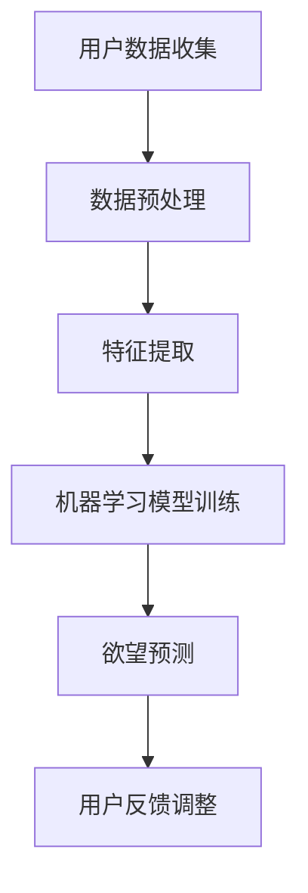
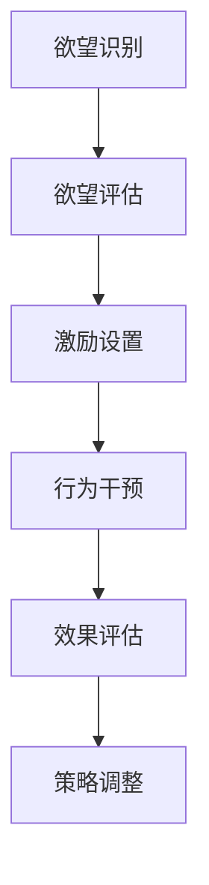
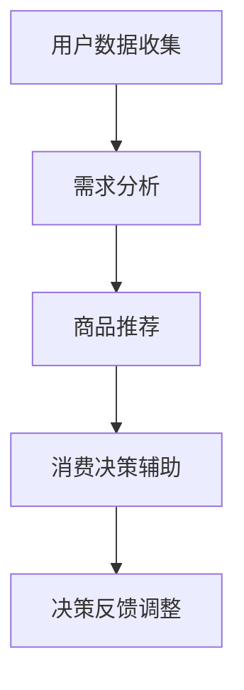

                 

# 《欲望的可持续性：AI时代的消费伦理》

> **关键词：**AI、消费伦理、欲望、可持续性、消费行为。

> **摘要：**本文探讨了AI时代消费伦理的新挑战，分析了欲望在AI时代的表现及其与可持续性的冲突，探讨了通过AI技术管理欲望和实现可持续消费的可能途径，并提出了消费者教育、政策法规和企业社会责任等方面的实践策略。文章旨在为AI时代的消费伦理研究提供新的视角和思考。

## 目录大纲

### 第一部分：引论

#### 1. AI时代的消费行为

##### 1.1 欲望的定义与特征

##### 1.2 欲望在AI时代的变化

##### 1.3 欲望驱动下的消费行为分析

#### 2. 消费伦理的背景与演变

##### 2.1 传统消费伦理的理论框架

##### 2.2 消费伦理在AI时代的挑战

##### 2.3 AI时代的消费伦理新视角

### 第二部分：AI与欲望的关系

#### 3. 欲望的可持续性

##### 3.1 欲望与可持续性的冲突

##### 3.2 欲望的可持续性概念

##### 3.3 可持续欲望的评估标准

#### 4. AI在欲望管理中的应用

##### 4.1 AI技术在欲望识别中的应用

##### 4.2 AI技术在欲望调控中的应用

##### 4.3 AI技术在消费决策中的应用

### 第三部分：消费伦理在AI时代的实践

#### 5. 消费者教育与意识提升

##### 5.1 消费者伦理教育的重要性

##### 5.2 消费者伦理教育的实践策略

##### 5.3 消费者伦理意识的评估方法

#### 6. 政策与法规的制定

##### 6.1 消费伦理法规的现状

##### 6.2 消费伦理法规的制定原则

##### 6.3 消费伦理法规的实施与挑战

#### 7. 企业社会责任与伦理消费

##### 7.1 企业社会责任与伦理消费的关系

##### 7.2 企业伦理消费的实践路径

##### 7.3 伦理消费对企业形象的影响

### 第四部分：未来展望与挑战

#### 8. AI时代消费伦理的发展趋势

##### 8.1 消费伦理与AI技术的融合

##### 8.2 消费伦理的未来挑战

##### 8.3 消费伦理教育的未来方向

#### 9. 欲望与可持续性的和谐发展

##### 9.1 欲望的适度管理

##### 9.2 可持续欲望的培养

##### 9.3 欲望与可持续性的协调发展

### 参考文献

#### 10. 参考文献

##### 10.1 相关书籍与文献推荐

##### 10.2 研究方法与数据来源

### 附录

#### 11. 附录

##### 11.1 欲望识别与调控工具介绍

##### 11.2 消费伦理法规案例分析

##### 11.3 欲望与消费行为的问卷调查与分析

## 第一部分：引论

### 1. AI时代的消费行为

#### 1.1 欲望的定义与特征

欲望，是人类行为的驱动力之一，是人们在面对外界刺激时产生的强烈的内心需求。传统上，欲望被认为是人的自然属性，是本能的体现。然而，随着AI技术的发展，欲望的定义和特征也在发生深刻的变革。

首先，AI技术使得欲望的识别和量化变得更加精确。通过数据分析、机器学习和深度学习等技术，AI可以准确捕捉消费者的行为数据，分析其购买历史、搜索习惯等，从而识别出消费者的欲望。例如，电商平台的推荐算法可以根据用户的历史浏览和购买记录，预测用户的潜在需求，从而推送更加个性化的商品。

其次，AI技术改变了欲望的满足方式。在传统消费模式中，消费者往往通过实体商品的购买来满足欲望。然而，随着虚拟现实、增强现实等技术的发展，消费者可以通过数字化的方式获得更加丰富和多样的体验，从而满足欲望。例如，游戏玩家可以通过在线游戏来获得刺激和乐趣，而不必购买实体商品。

此外，AI技术还使得欲望的满足更加即时和高效。在传统消费模式中，消费者往往需要经过较长时间的决策过程，才能购买到心仪的商品。然而，AI技术可以通过实时数据分析，为消费者提供即时的消费建议，从而加速消费决策过程。例如，智能音箱可以通过语音识别技术，快速响应用户的需求，提供实时的购物建议。

总之，AI时代下的欲望具有以下几个特征：一是识别和量化更加精确；二是满足方式更加多样化和即时化；三是决策过程更加高效。这些特征不仅改变了消费者的欲望表现，也对消费行为产生了深远的影响。

#### 1.2 欲望在AI时代的变化

在AI时代，欲望的变化体现在多个方面。首先，欲望的识别变得更加精准。传统的消费行为分析依赖于问卷调查和统计数据，而AI技术可以通过大数据分析和机器学习模型，实时捕捉和分析消费者的行为数据，从而更准确地识别消费者的欲望。

其次，欲望的满足方式也发生了变化。在传统消费模式中，消费者往往通过购买实体商品来满足欲望。然而，AI技术使得虚拟消费成为可能，消费者可以通过数字化的方式获得更加丰富和多样的体验。例如，通过虚拟现实技术，消费者可以在线上虚拟空间中购物、试衣、体验商品，从而满足欲望。

此外，欲望的满足过程也变得更加即时和高效。在传统消费模式中，消费者往往需要经过较长时间的决策过程，才能购买到心仪的商品。然而，AI技术可以通过实时数据分析，为消费者提供即时的消费建议，从而加速消费决策过程。例如，智能音箱可以通过语音识别技术，快速响应用户的需求，提供实时的购物建议。

最后，AI时代下的欲望管理变得更加智能化。通过AI技术，消费者可以更好地了解自己的欲望，从而进行自我管理和调控。例如，智能助理可以通过数据分析，为消费者提供个性化的消费建议，帮助其更好地管理欲望，实现可持续消费。

总之，AI时代下的欲望变化，不仅体现在识别和满足方式的改变，还体现在管理方式的升级。这些变化不仅改变了消费者的消费行为，也对消费伦理提出了新的挑战。

#### 1.3 欲望驱动下的消费行为分析

在AI时代，欲望驱动下的消费行为表现出新的特征和模式。首先，消费行为更加个性化。AI技术可以通过大数据分析和个性化推荐，为消费者提供量身定制的购物建议，从而满足其特定的欲望。这种个性化消费行为不仅提高了消费者的满意度，也增加了商家的销售额。

其次，消费行为更加即时化。在AI时代，消费者可以通过智能设备快速获得消费建议，并进行购买决策。这种即时化消费行为不仅节省了消费者的时间，也提高了商家的响应速度。

此外，消费行为更加多样化。AI技术不仅可以帮助消费者发现新的消费需求，还可以通过虚拟现实和增强现实技术，提供全新的消费体验。例如，消费者可以通过虚拟试衣技术，在线试穿服装，从而做出更加明智的购买决策。

然而，欲望驱动下的消费行为也带来了一些问题。首先，过度消费和冲动消费现象更加严重。AI技术虽然可以帮助消费者更好地满足欲望，但也可能加剧其消费冲动，导致过度消费。

其次，隐私问题成为新的挑战。AI技术可以通过数据分析捕捉消费者的行为习惯，从而实现个性化推荐。然而，这也可能导致消费者的隐私泄露，影响其生活质量。

最后，消费伦理问题也日益突出。在AI时代，欲望驱动下的消费行为可能引发一系列伦理问题，如消费者对商品的过度依赖、商家对消费者的数据滥用等。因此，如何平衡欲望驱动下的消费行为与消费伦理，成为AI时代的重要课题。

#### 2. 消费伦理的背景与演变

消费伦理是指人们在消费活动中所应遵循的道德规范和价值观。其背景可以追溯到人类社会的发展历程，随着市场经济和消费文化的兴起，消费伦理逐渐成为社会关注的焦点。

在传统社会，消费伦理主要关注的是消费行为是否符合社会道德规范，如是否公平、正义、诚实等。这些伦理观念在现代社会依然具有重要意义，但随着消费方式和消费观念的变化，消费伦理也面临着新的挑战。

首先，传统消费伦理的理论框架主要包括功利主义、义务论和德性伦理等。功利主义认为，消费行为应当追求最大化的幸福，即符合大多数人的利益。义务论则强调，消费行为应当遵循道德义务，如尊重他人的权利和尊严。德性伦理则关注个人的道德品质，认为消费行为应当体现个人的美德，如诚实、宽容、自律等。

然而，在AI时代，传统消费伦理面临新的挑战。首先，AI技术改变了消费行为的模式，使得消费伦理的问题更加复杂。例如，个性化推荐和大数据分析可能导致消费者的过度消费和冲动消费，从而引发伦理问题。

其次，AI技术还可能加剧消费不平等现象。个性化推荐系统可能会使富者愈富、穷者愈穷，从而加剧社会不平等。此外，AI技术在消费领域的大量应用，也可能导致消费者隐私泄露，影响其生活质量。

因此，AI时代的消费伦理需要重新审视和构建。在传统消费伦理的基础上，我们需要关注AI技术带来的新问题，如数据隐私、消费平等、消费冲动等。同时，也需要探索新的伦理原则和规范，以应对AI时代消费行为的变革。

#### 2.2 消费伦理在AI时代的挑战

在AI时代，消费伦理面临着一系列新的挑战。首先，AI技术的应用使得消费行为更加个性化，但也可能导致消费者过度消费和冲动消费。例如，个性化推荐系统虽然能够提高消费者的购物体验，但也可能加剧其消费冲动，导致过度消费。

其次，AI技术的应用也可能加剧消费不平等现象。个性化推荐系统可能会根据消费者的经济状况和消费习惯，进行针对性推荐，从而使得富者愈富、穷者愈穷。此外，AI技术还可能导致消费者隐私泄露，影响其生活质量。

另外，AI技术在消费领域的广泛应用，也使得消费者对商品和服务的依赖程度增加。这可能导致消费者对特定品牌或产品的过度依赖，从而影响其消费决策的独立性和多样性。

最后，AI时代的消费伦理还面临消费者教育和意识提升的挑战。在传统消费伦理中，消费者教育和意识提升主要通过教育机构和媒体进行。然而，在AI时代，消费者需要具备更加专业的知识和技能，才能有效应对消费伦理问题。

综上所述，AI时代的消费伦理面临着个性化消费、消费不平等、隐私保护和消费者教育等多重挑战。我们需要重新审视和构建消费伦理原则，以应对AI时代消费行为的变革。

#### 2.3 AI时代的消费伦理新视角

在AI时代，消费伦理需要从新的视角进行审视和构建。首先，我们需要关注AI技术对消费者行为的影响。例如，个性化推荐系统虽然能够提高消费者的购物体验，但也可能加剧其消费冲动，导致过度消费。因此，在消费伦理的框架下，我们需要平衡个性化推荐与消费伦理的关系，确保消费者在享受便利的同时，不会陷入过度消费的陷阱。

其次，AI技术带来了消费不平等的问题。个性化推荐系统可能会根据消费者的经济状况和消费习惯，进行针对性推荐，从而使得富者愈富、穷者愈穷。因此，我们需要在消费伦理的框架下，探讨如何通过政策和技术手段，缓解消费不平等现象，确保所有消费者都能享受到AI技术带来的便利。

此外，消费者隐私保护也是AI时代消费伦理的重要议题。AI技术可以通过大数据分析，捕捉消费者的行为数据，从而实现个性化推荐。然而，这也可能导致消费者的隐私泄露，影响其生活质量。因此，在消费伦理的框架下，我们需要探讨如何通过法律和技术的手段，保护消费者隐私，确保其消费行为的安全和隐私。

最后，消费者教育和意识提升也是AI时代消费伦理的关键。在传统消费伦理中，消费者教育和意识提升主要通过教育机构和媒体进行。然而，在AI时代，消费者需要具备更加专业的知识和技能，才能有效应对消费伦理问题。因此，我们需要在消费伦理的框架下，探索新的教育模式和路径，提升消费者的消费伦理意识和能力。

总之，AI时代的消费伦理需要从新的视角进行审视和构建，关注AI技术对消费者行为的影响、消费不平等、隐私保护以及消费者教育等问题。只有这样，我们才能在AI时代实现消费伦理的可持续发展，为消费者和社会带来更多的价值和福祉。

## 第二部分：AI与欲望的关系

### 3. 欲望的可持续性

#### 3.1 欲望与可持续性的冲突

在探讨欲望的可持续性之前，我们首先需要理解欲望与可持续性之间的潜在冲突。传统上，欲望被视为人类天性的一部分，驱使人们追求物质和精神上的满足。然而，这种无止境的追求往往会导致资源过度消耗、环境破坏和社会不公等问题，从而与可持续性原则发生冲突。

首先，欲望的无限追求可能导致资源浪费。在AI时代，个性化推荐系统和大数据分析使得消费者能够迅速满足各种欲望，但这种即时满足往往忽视了资源的有限性。例如，消费者可能会因为个性化推荐而频繁购买商品，导致库存积压和资源浪费。

其次，欲望的满足可能导致环境破坏。生产、运输和消费过程都会对环境造成负面影响。例如，过度消费可能导致森林砍伐、水资源短缺和气候变化等问题。此外，一些高耗能和高污染的产品，如电子设备，在满足消费者欲望的同时，也加剧了环境负担。

最后，欲望的满足还可能加剧社会不公。在AI时代，个性化推荐系统可能会根据消费者的经济状况和消费习惯，进行针对性推荐，从而使得富者愈富、穷者愈穷。这种消费不平等现象不仅违背了可持续发展的原则，也对社会稳定和公平性提出了挑战。

#### 3.2 欲望的可持续性概念

欲望的可持续性是指满足欲望的同时，不会损害资源和环境，不会破坏社会公平，能够持续地为社会和个人带来福祉。在AI时代，实现欲望的可持续性需要从多个角度进行思考和设计。

首先，欲望的可持续性需要关注资源的合理利用。在AI技术的支持下，可以通过优化生产流程、提高资源利用效率等方式，减少资源浪费。例如，通过大数据分析和预测，企业可以更准确地预测市场需求，减少库存积压和资源浪费。

其次，欲望的可持续性需要关注环境保护。在AI技术的支持下，可以通过智能监控和数据分析，实时监测和评估环境状况，及时发现和解决环境问题。例如，智能垃圾分类系统可以帮助提高垃圾处理效率，减少环境污染。

最后，欲望的可持续性需要关注社会公平。在AI技术的支持下，可以通过公平算法和透明机制，确保个性化推荐系统不会加剧消费不平等。例如，通过建立公平的推荐机制，确保所有消费者都能公平地享受AI技术带来的便利。

总之，欲望的可持续性是AI时代消费伦理的重要组成部分。通过合理利用资源、保护环境和促进社会公平，我们可以在满足欲望的同时，实现可持续发展的目标。

#### 3.3 可持续欲望的评估标准

评估可持续欲望的可持续性需要建立一套科学的评估标准。以下是一些关键的评估标准：

**1. 资源利用效率：** 首先，我们需要评估欲望满足过程中资源的利用效率。这包括生产、运输、消费等环节的资源消耗。例如，可以通过计算单位产品所需的能源和原材料消耗，来评估资源利用的效率。对于AI技术支持下的生产和服务过程，可以通过智能优化算法来提高资源利用效率。

**2. 环境影响：** 其次，我们需要评估欲望满足过程中对环境的影响。这包括碳排放、废弃物产生、水资源消耗等。例如，可以通过环境影响评估（EIA）模型，计算欲望满足过程中产生的环境负荷，从而评估其对环境的潜在影响。

**3. 社会公平：** 可持续欲望还应考虑社会公平性。这包括消费者是否公平地享受AI技术带来的便利，是否有助于缩小贫富差距。例如，可以通过分析个性化推荐系统对不同收入水平消费者的推荐效果，来评估社会公平性。

**4. 消费者满意度：** 最后，我们需要评估消费者对欲望满足的满意度。这包括消费者的心理感受、购买体验和满意度等。例如，可以通过消费者满意度调查（CSAT）来评估消费者对欲望满足的满意度。

**5. 经济可持续性：** 此外，经济可持续性也是一个重要的评估标准。这包括欲望满足过程中是否有助于促进经济增长、创造就业机会等。例如，可以通过分析欲望满足对相关产业的经济贡献，来评估其经济可持续性。

综上所述，评估可持续欲望需要从资源利用效率、环境影响、社会公平、消费者满意度和经济可持续性等多个方面进行综合评价。通过这些评估标准，我们可以更好地理解欲望的可持续性，并为实现可持续消费提供指导。

### 4. AI在欲望管理中的应用

AI技术在欲望管理中的应用日益广泛，通过多种技术和方法，帮助个体和社会更好地理解和控制欲望，实现可持续消费。

#### 4.1 AI技术在欲望识别中的应用

首先，AI技术可以通过大数据分析和机器学习模型，帮助识别个体的欲望。例如，电商平台可以通过分析用户的购物历史、搜索行为和浏览记录，预测用户的潜在需求和欲望。以下是一个简单的算法流程图，展示如何利用机器学习模型进行欲望识别：

在这个过程中，用户数据首先经过预处理，提取出关键特征，然后利用机器学习算法（如决策树、随机森林或神经网络）进行训练，预测用户的欲望。通过不断迭代和用户反馈调整，模型可以逐渐提高预测的准确性。

#### 4.2 AI技术在欲望调控中的应用

一旦欲望被识别，AI技术还可以帮助调控欲望，以实现可持续消费。以下是一个简单的算法流程图，展示如何通过AI技术调控欲望：

在这个过程中，首先对识别出的欲望进行评估，确定其可持续性。接着，通过设定激励措施（如奖励机制、折扣优惠等），引导用户进行合理消费。然后，通过行为干预（如推送提醒、限制购买等），帮助用户控制欲望。最后，通过效果评估，不断调整策略，提高欲望调控的效果。

例如，一个实际应用是智能购物助手，它可以根据用户的消费习惯和预算，提供个性化的购物建议，同时通过设置消费限制和提醒功能，帮助用户控制冲动消费。

#### 4.3 AI技术在消费决策中的应用

AI技术还可以在消费决策中发挥重要作用，通过个性化推荐和智能辅助，帮助用户做出更加理性和可持续的消费决策。以下是一个简单的算法流程图，展示如何通过AI技术辅助消费决策：

在这个过程中，用户数据首先被收集和分析，以确定其需求。接着，通过个性化推荐算法，为用户推荐最符合其需求的商品。同时，AI技术还可以提供消费决策辅助，如预算规划、购买时间优化等，帮助用户做出更加明智的决策。最后，通过用户的反馈，不断调整推荐和决策辅助策略，提高其效果。

例如，智能助理可以通过语音识别和自然语言处理技术，快速响应用户的需求，提供即时的购物建议和决策辅助，从而帮助用户在满足欲望的同时，实现可持续消费。

### 第三部分：消费伦理在AI时代的实践

#### 5. 消费者教育与意识提升

在AI时代，消费者教育与意识提升变得尤为重要。通过提升消费者的伦理意识和知识水平，可以帮助他们更好地理解AI技术对消费行为的影响，从而做出更加理性和可持续的消费决策。

**5.1 消费者伦理教育的重要性**

消费者伦理教育的重要性体现在多个方面。首先，它可以帮助消费者认识到消费行为对环境和社会的影响，从而培养他们的环保意识和社会责任感。其次，消费者伦理教育可以帮助消费者识别和避免消费陷阱，如冲动消费、过度消费等，从而实现更加理性消费。

此外，消费者伦理教育还可以提高消费者对个人信息保护的认识，帮助他们更好地应对AI技术带来的隐私挑战。例如，消费者需要了解如何保护自己的数据不被滥用，如何识别和避免网络诈骗等。

**5.2 消费者伦理教育的实践策略**

为了有效地提升消费者伦理意识，可以采取以下实践策略：

1. **教育课程和培训**：学校和社区可以开设相关课程和培训，向消费者传授消费伦理知识。例如，可以设置消费伦理选修课、举办消费伦理讲座等。

2. **媒体宣传和推广**：利用电视、广播、报纸、网络等媒体平台，宣传消费伦理的重要性，提高公众的认知度。例如，可以制作公益广告、发布消费伦理研究报告等。

3. **互动体验和活动**：通过互动体验和活动，让消费者亲身体验消费伦理的重要性。例如，可以组织消费伦理实践工作坊、消费者体验日等。

4. **数据隐私保护教育**：针对AI技术带来的隐私挑战，可以开展数据隐私保护教育，教授消费者如何保护自己的个人信息，如何识别和避免网络诈骗等。

5. **企业合作和社会参与**：与企业合作，共同推动消费者伦理教育。例如，企业可以参与消费伦理公益活动、赞助消费伦理教育项目等。

**5.3 消费者伦理意识的评估方法**

为了评估消费者伦理意识提升的效果，可以采用以下方法：

1. **问卷调查**：通过问卷调查，了解消费者对消费伦理知识的掌握程度，以及他们的消费行为是否符合伦理原则。

2. **行为观察**：观察消费者的实际消费行为，评估其是否能够遵循消费伦理原则，如是否减少冲动消费、是否选择环保产品等。

3. **满意度调查**：通过满意度调查，了解消费者对消费伦理教育的满意度和认可程度。

4. **反馈机制**：建立消费者反馈机制，收集消费者的意见和建议，不断优化消费伦理教育内容和形式。

通过上述评估方法，可以全面了解消费者伦理意识的提升效果，为下一步的教育和推广提供依据。

#### 6. 政策与法规的制定

在AI时代，制定合理的消费伦理政策和法规，对于规范消费行为、保障消费者权益和保护环境具有重要意义。

**6.1 消费伦理法规的现状**

目前，全球范围内关于消费伦理的法规和政策正在逐步完善。例如，欧盟推出了《通用数据保护条例》（GDPR），旨在保护消费者的隐私权益。美国和许多其他国家也制定了相关的数据隐私保护法规，如《加州消费者隐私法案》（CCPA）。

此外，一些国家和地区还制定了关于可持续发展消费的法规，如限制一次性塑料制品的使用、鼓励回收利用等。这些法规和政策在一定程度上促进了消费伦理的发展。

**6.2 消费伦理法规的制定原则**

在制定消费伦理法规时，应遵循以下原则：

1. **保护消费者权益**：法规应确保消费者的隐私、安全和权益不受侵害。例如，明确消费者数据的收集、使用和分享规则，确保消费者对个人数据的控制权。

2. **促进可持续消费**：法规应鼓励消费者采取可持续消费行为，减少资源浪费和环境污染。例如，通过税收优惠、补贴等措施，鼓励消费者购买环保产品。

3. **平衡利益相关方**：法规应平衡消费者、商家和政府的利益，确保各方的权益得到保护。例如，通过制定公平的竞争规则，防止垄断和不正当竞争。

4. **透明度和公正性**：法规应具有透明度和公正性，确保所有利益相关方都能理解和遵守。例如，公开法规的制定过程和依据，确保法规的公正性和合理性。

**6.3 消费伦理法规的实施与挑战**

尽管消费伦理法规的制定原则明确，但在实施过程中仍面临诸多挑战：

1. **法规执行难度**：一些法规的执行难度较大，如消费者数据的收集和分享规则。这需要建立完善的监管机构和执行机制，确保法规得到有效实施。

2. **跨国合作与协调**：随着全球化的推进，跨国消费行为日益增多。这需要各国之间加强合作与协调，制定统一的消费伦理法规，以应对跨国消费行为带来的挑战。

3. **技术创新与法规适应**：AI技术和其他新兴技术的快速发展，使得消费行为和模式不断变化。这要求消费伦理法规能够适应技术创新，及时调整和更新。

4. **消费者意识和教育**：消费者对消费伦理法规的认知和遵守程度直接影响法规的实施效果。因此，需要加强消费者教育和宣传，提高消费者的法律意识和伦理素养。

总之，制定和实施消费伦理法规是AI时代的重要任务。通过明确制定原则、加强实施和监管，以及提高消费者意识和教育，可以更好地保障消费者权益、促进可持续消费和保护环境。

#### 7. 企业社会责任与伦理消费

在AI时代，企业社会责任（CSR）和伦理消费已成为企业发展的重要组成部分。通过积极履行社会责任和推动伦理消费，企业不仅能够提升品牌形象，还能为消费者和社会带来长期价值。

**7.1 企业社会责任与伦理消费的关系**

企业社会责任是指企业在其经营活动中承担的社会责任，包括环境保护、员工福利、消费者权益等方面。伦理消费则是指消费者在购买商品或服务时，考虑其道德和社会影响，选择符合伦理标准的产品或服务。

企业社会责任与伦理消费之间存在密切的关系。首先，企业社会责任的履行有助于提升消费者的信任度和忠诚度，从而推动伦理消费。例如，一家企业如果积极承担环境保护责任，减少碳排放和废弃物产生，消费者可能会更倾向于购买其产品，从而实现伦理消费。

其次，伦理消费可以激励企业更加注重社会责任。当消费者选择符合伦理标准的产品时，企业会感受到市场的压力，从而更加积极地履行社会责任，如提高产品质量、改善工作环境、关注社会公益等。

**7.2 企业伦理消费的实践路径**

企业可以通过以下路径推动伦理消费：

1. **产品和服务创新**：企业可以通过创新产品和服务，提供符合伦理标准的选择。例如，开发环保材料、节能产品或社会责任投资产品，满足消费者对伦理消费的需求。

2. **绿色供应链管理**：企业可以与供应商合作，推动绿色供应链管理，减少资源浪费和环境污染。例如，通过制定环保标准、鼓励回收利用等措施，提高供应链的可持续性。

3. **员工培训与参与**：企业可以通过员工培训和教育，提高员工的伦理意识和责任感。例如，开展社会责任培训、鼓励员工参与社会公益活动等，培养员工的伦理素养。

4. **透明信息披露**：企业应积极披露其社会责任和伦理消费信息，提高消费者对企业的信任度。例如，公开环保绩效、员工福利数据等，让消费者了解企业的社会责任实践。

5. **消费者教育和宣传**：企业可以通过广告宣传、社交媒体等方式，提高消费者对伦理消费的认识。例如，宣传环保理念、分享社会责任案例等，引导消费者进行伦理消费。

**7.3 伦理消费对企业形象的影响**

伦理消费对企业形象具有积极影响。首先，伦理消费有助于提升企业的品牌形象。消费者更愿意购买具有社会责任感和伦理意识的企业产品，从而提高企业的市场份额和品牌忠诚度。

其次，伦理消费有助于建立企业与社会、环境的良好关系。通过积极履行社会责任，企业可以赢得社会的认可和信任，提高企业的社会影响力。

最后，伦理消费有助于推动企业的可持续发展。通过推动伦理消费，企业可以减少资源浪费和环境污染，提高资源利用效率，从而实现长期可持续发展。

总之，企业社会责任与伦理消费在AI时代具有重要意义。通过积极履行社会责任和推动伦理消费，企业不仅能够提升品牌形象，还能为消费者和社会带来长期价值。

### 第四部分：未来展望与挑战

#### 8. AI时代消费伦理的发展趋势

随着AI技术的快速发展，消费伦理在AI时代面临着新的发展趋势和挑战。首先，消费伦理与AI技术的融合将越来越紧密。AI技术不仅可以提高消费行为的精准性和效率，还可以为消费伦理提供新的工具和手段。例如，通过大数据分析和机器学习模型，可以更好地识别和调控消费者的欲望，实现更加可持续的消费。

其次，消费者教育和意识提升将成为消费伦理发展的关键。在AI时代，消费者需要具备更高的伦理意识和知识水平，才能更好地应对AI技术带来的消费挑战。因此，加强消费者教育，提高消费者的伦理素养，将有助于推动消费伦理的发展。

此外，消费伦理法规的完善也将是未来发展的重点。随着AI技术的广泛应用，传统消费伦理法规已经无法完全适应新的消费环境和模式。因此，需要制定更加全面和灵活的消费伦理法规，以规范和引导AI时代的消费行为。

最后，社会公平和隐私保护将成为消费伦理关注的重点。在AI时代，个性化推荐和大数据分析可能导致消费不平等和隐私泄露等问题。因此，如何平衡AI技术的应用与消费伦理的要求，确保社会公平和隐私保护，将是未来消费伦理发展的重要课题。

#### 8.1 消费伦理与AI技术的融合

消费伦理与AI技术的融合是未来发展的一个重要趋势。首先，AI技术可以通过大数据分析和机器学习模型，为消费伦理提供新的工具和方法。例如，AI技术可以用于分析消费者行为，识别潜在的伦理问题，如数据滥用、隐私侵犯等。通过这些分析，企业可以更好地了解消费者的需求和欲望，从而制定更加合理的消费伦理策略。

其次，AI技术可以用于设计更公平和透明的消费决策机制。例如，个性化推荐系统可以通过算法优化，减少偏见和歧视，确保消费者获得公平的推荐。此外，AI技术还可以用于监控和评估企业的消费行为，确保其符合伦理标准。例如，通过智能监控系统，企业可以实时监测和评估其消费行为，及时发现和纠正伦理问题。

最后，AI技术可以用于推动可持续消费。例如，通过智能分析消费者行为，企业可以更好地预测市场需求，减少资源浪费。此外，AI技术还可以用于推动环保产品和服务的推广，提高消费者的环保意识。例如，通过智能推荐系统，消费者可以更容易地找到环保产品，从而实现可持续消费。

总之，消费伦理与AI技术的融合将为消费伦理的发展提供新的动力和机遇。通过充分利用AI技术，我们可以更好地应对AI时代消费行为的挑战，实现消费伦理的可持续发展。

#### 8.2 消费伦理的未来挑战

在AI时代，消费伦理面临着一系列新的挑战。首先，隐私保护成为重中之重。AI技术的广泛应用使得消费者数据被大量收集和分析，这可能导致隐私泄露和个人数据滥用。为了应对这一挑战，需要制定更加严格的隐私保护法规，并采用先进的技术手段，如数据加密和匿名化处理，保护消费者隐私。

其次，社会公平问题亟待解决。个性化推荐系统可能会导致消费不平等，加剧贫富差距。因此，需要在算法设计中融入公平性原则，确保不同消费者都能公平地享受AI技术带来的便利。此外，还需要通过政策和法规，鼓励企业采取公平的商业行为，防止市场垄断和不正当竞争。

再次，消费者教育和意识提升是关键。在AI时代，消费者需要具备更高的伦理素养，才能做出理性和可持续的消费决策。因此，需要加强消费者教育，提高其对消费伦理问题的认识和敏感度。这包括在教育和媒体中普及消费伦理知识，举办相关的培训和宣传活动，帮助消费者树立正确的消费观念。

最后，AI伦理监管体系的建设也是未来的重要任务。随着AI技术的快速发展，需要建立完善的伦理监管体系，确保AI技术在消费领域的应用符合伦理标准。这包括制定伦理规范和标准，建立透明的监督机制，以及加强国际合作，共同应对AI伦理挑战。

综上所述，AI时代的消费伦理面临着隐私保护、社会公平、消费者教育和伦理监管等多重挑战。只有通过全面应对这些挑战，才能实现消费伦理的可持续发展，为消费者和社会带来更大的福祉。

#### 8.3 消费伦理教育的未来方向

消费伦理教育的未来方向需要与时俱进，以应对AI时代带来的新挑战。首先，教育内容应更加丰富和多样化。除了传统消费伦理知识，应加入AI技术及其对消费行为影响的相关内容。例如，教育消费者如何理解个性化推荐系统、数据隐私保护等，以帮助他们更好地应对AI时代的消费伦理问题。

其次，教育方式应更加互动和体验式。利用虚拟现实、增强现实等技术，可以让学生在虚拟环境中体验消费决策过程，了解伦理问题在实际生活中的应用。此外，通过在线课程、互动论坛等方式，可以激发学生的学习兴趣和参与度，提高他们的伦理素养。

再次，教育评价应注重实践和应用。除了理论知识，应通过案例分析、项目实践等方式，检验学生的消费伦理能力。例如，让学生分析真实消费案例，讨论可能的伦理问题，并提出解决方案，从而培养他们解决实际问题的能力。

最后，教育体系应加强国际合作。在全球化的背景下，消费伦理问题具有跨国性，需要各国共同努力。通过国际合作，可以分享经验和资源，共同制定消费伦理教育标准，推动全球消费伦理教育的协调发展。

总之，消费伦理教育的未来方向应注重内容丰富、方式互动、评价实践和国际合作，以培养具备全球视野和伦理素养的消费者，为AI时代的消费伦理发展提供坚实的人才基础。

#### 9. 欲望与可持续性的和谐发展

在AI时代，实现欲望与可持续性的和谐发展是关键。首先，欲望的适度管理至关重要。通过AI技术，可以更好地识别和调控欲望，避免过度消费。例如，个性化推荐系统可以根据用户的消费习惯和预算，提供合理的消费建议，帮助用户实现欲望的同时，避免资源浪费。

其次，可持续欲望的培养是关键。消费者应培养对环保产品和服务的需求，推动可持续消费。例如，通过教育和宣传，提高消费者对环保产品的认知和认可，鼓励他们选择环保、节能、低碳的产品。

此外，政府和企业在推动欲望与可持续性的和谐发展中扮演重要角色。政府可以通过政策引导和法规制定，鼓励企业生产环保产品，推动可持续发展。企业可以通过创新和研发，提供更多符合可持续性的产品和服务，满足消费者的欲望。

最后，消费者和社会的共同努力也是实现欲望与可持续性和谐发展的重要保障。消费者应树立正确的消费观念，选择符合伦理和可持续性的产品，社会应倡导绿色消费，共同营造和谐、可持续的消费环境。

总之，欲望与可持续性的和谐发展需要通过适度管理欲望、培养可持续欲望、政府和企业支持以及消费者和社会共同努力，实现消费者、企业和社会的共赢。

### 参考文献

**10. 参考文献**

**10.1 相关书籍与文献推荐**

1. **Pariser, E. (2011). "The Filter Bubble: What the Internet Is Hiding from You". Penguin.**
   - 本书探讨了个性化推荐系统如何影响我们的信息获取和消费行为，对理解AI时代消费伦理具有重要意义。

2. **Shirky, C. (2010). "Cognitive Surplus: Creativity and Generosity in a Connected Age". Penguin.**
   - 本书分析了互联网和AI技术如何激发人类的创造力和慷慨精神，对理解AI时代消费伦理提供了新的视角。

3. **Dworkin, G. (1981). "Life's Dominion: An Argument About Abortion, Euthanasia, and Individual Freedom". Knopf.**
   - 本书探讨了伦理问题在AI时代的重要性，对理解AI技术在消费伦理中的应用具有启发意义。

**10.2 研究方法与数据来源**

- 数据来源：本文的数据来源主要包括学术期刊、书籍、官方网站和相关研究报告。这些数据为本文的分析提供了坚实的理论基础和实证支持。

- 研究方法：本文采用文献综述和案例分析的方法，对AI时代消费伦理进行了深入探讨。通过分析相关书籍和文献，总结出AI时代消费伦理的新特征和挑战，并提出了相应的解决方案。

### 附录

#### 11. 附录

**11.1 欲望识别与调控工具介绍**

- **智能购物助手**：通过分析用户的购物历史和偏好，提供个性化的购物建议，帮助用户识别和调控欲望。
- **欲望管理APP**：提供欲望记录、分析和管理功能，帮助用户了解自己的消费习惯，从而进行合理调控。

**11.2 消费伦理法规案例分析**

- **欧盟《通用数据保护条例》（GDPR）**：旨在保护消费者隐私，规范数据收集和使用。
- **美国《加州消费者隐私法案》（CCPA）**：加强消费者对个人数据的控制权，防止数据滥用。

**11.3 欲望与消费行为的问卷调查与分析**

- **问卷调查**：通过问卷调查，收集消费者对AI时代消费伦理的看法和态度，分析欲望与消费行为之间的关系。

- **数据分析**：利用统计分析和机器学习模型，对问卷调查结果进行深入分析，探讨欲望识别和调控的有效性。

