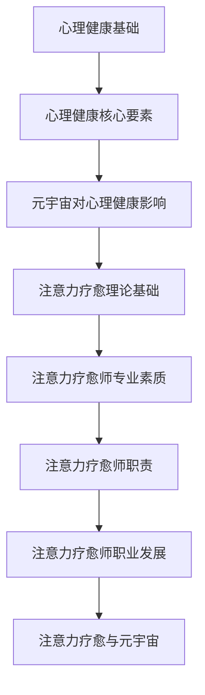
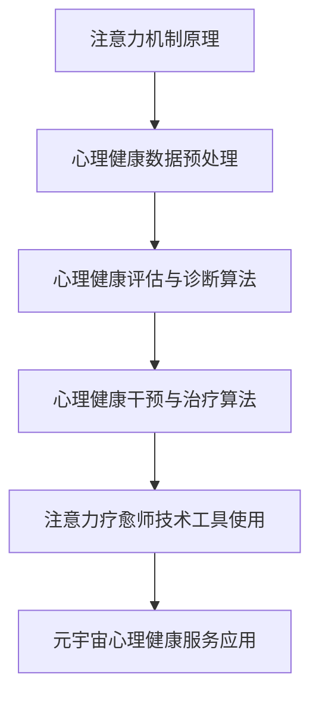
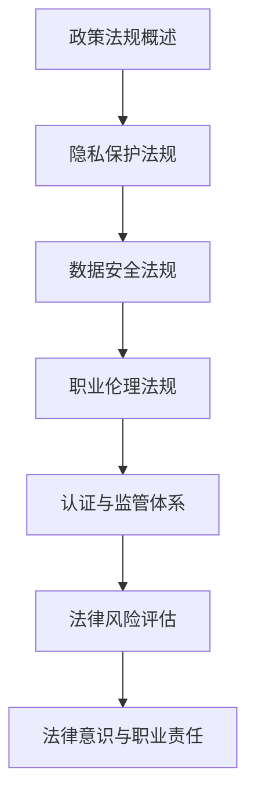
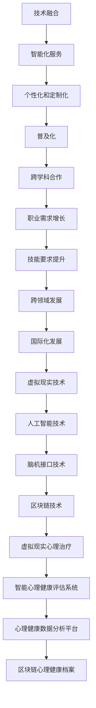
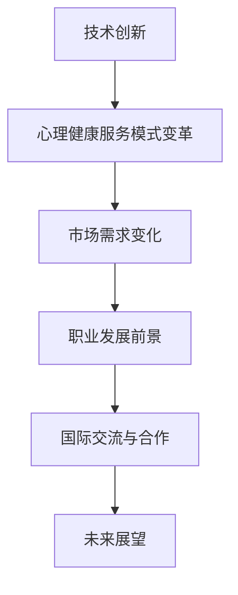

                 

# 文章标题

> 关键词：注意力疗愈师、元宇宙心理健康服务、职业标准、技术算法、实际应用、政策法规、未来展望

> 摘要：
随着元宇宙的不断发展，心理健康服务的需求日益增长。本文从注意力疗愈师这一新兴职业的角度出发，探讨了元宇宙心理健康服务的职业标准。文章首先介绍了注意力疗愈师的基本概念和理论，分析了注意力疗愈在元宇宙中的应用，接着详细讲解了注意力疗愈师所需的核心技术和算法，并分享了实际应用案例。此外，文章还讨论了相关政策法规对元宇宙心理健康服务的影响，以及注意力疗愈师的未来发展趋势。本文旨在为从事元宇宙心理健康服务的工作者提供理论指导和实践参考。

### 第一部分：引入与概述

#### 第1章：书名背景与目的

##### 1.1 《注意力疗愈师认证：元宇宙心理健康服务的职业标准》背景

随着互联网技术的飞速发展，元宇宙逐渐成为一个全新的虚拟世界。在这个世界中，人们可以自由地交流、互动、创造，享受更加丰富的虚拟生活。然而，虚拟世界的繁荣也带来了一系列的心理健康问题。例如，过度沉迷、社交焦虑、孤独感等。为了应对这些挑战，元宇宙心理健康服务应运而生。注意力疗愈师作为这一领域的重要角色，肩负着维护用户心理健康的重要使命。

《注意力疗愈师认证：元宇宙心理健康服务的职业标准》一书旨在为注意力疗愈师这一新兴职业提供系统的理论指导和实践参考。本书主要涵盖以下几个方面的内容：

1. **理论基础与概念**：介绍心理健康和注意力疗愈的基本概念，分析注意力疗愈的理论基础和应用领域。
2. **核心技术与算法**：详细讲解注意力疗愈师所需的核心技术和算法，包括注意力机制、心理健康数据预处理、评估与诊断算法、干预与治疗算法等。
3. **实际应用与案例分析**：分享注意力疗愈师在元宇宙心理健康服务中的实际应用案例，包括虚拟现实治疗、社交媒体心理健康监控、在线心理咨询服务等。
4. **政策与法规**：探讨元宇宙心理健康服务的相关政策法规，包括隐私保护、数据安全、职业伦理等方面的法规挑战。
5. **未来展望与趋势**：分析注意力疗愈师在元宇宙中的职业发展前景，以及新技术对注意力疗愈的影响。

##### 1.2 元宇宙心理健康服务的重要性

元宇宙心理健康服务的重要性主要体现在以下几个方面：

1. **满足心理健康需求**：随着虚拟世界的繁荣，越来越多的人沉迷于元宇宙，导致心理健康问题日益突出。注意力疗愈师可以提供专业的心理健康服务，帮助用户解决沉迷、焦虑、孤独等问题。
2. **提升生活质量**：通过提供个性化的心理健康服务，注意力疗愈师可以帮助用户更好地适应元宇宙生活，提高生活质量。
3. **促进社会和谐**：元宇宙作为一个虚拟的社会空间，用户的心理健康问题也直接关系到现实社会中的关系和谐。注意力疗愈师的工作有助于促进社会和谐与稳定。
4. **推动产业升级**：随着元宇宙心理健康服务市场的不断扩大，为注意力疗愈师提供了广阔的发展空间。同时，元宇宙心理健康服务的兴起也推动了相关产业链的发展。

##### 1.3 书籍的目的与受众

本书的目的是为从事元宇宙心理健康服务的工作者提供系统、全面的理论指导和实践参考，帮助他们更好地理解和应用注意力疗愈技术，提升服务质量。具体受众包括：

1. **注意力疗愈师**：本书为注意力疗愈师提供了系统的学习资源，帮助他们掌握核心技术和实践方法，提高职业素养。
2. **心理健康从业者**：对于从事心理健康服务的人员，本书可以提供关于元宇宙心理健康服务的最新研究成果和实践经验，有助于拓宽视野，提升专业水平。
3. **相关领域研究人员**：本书为相关领域的研究人员提供了丰富的理论素材和实践案例，有助于深入研究元宇宙心理健康服务领域。

通过本书的学习，读者可以全面了解注意力疗愈师这一新兴职业，掌握元宇宙心理健康服务的核心技术和实践方法，为从事相关工作奠定坚实基础。

#### 第2章：元宇宙与心理健康概述

##### 2.1 元宇宙的概念与发展

元宇宙（Metaverse）是一个虚拟的三维世界，由多个独立的虚拟空间组成，用户可以通过虚拟现实（VR）、增强现实（AR）等技术进入并互动。元宇宙的概念最早可以追溯到科幻作家尼尔·斯蒂芬森（Neal Stephenson）在其1992年的作品《雪崩》（Snow Crash）中。随着科技的发展，元宇宙逐渐从概念走向现实，成为全球科技巨头和企业争相投入的领域。

元宇宙的发展可以分为以下几个阶段：

1. **萌芽期**（1990s-2000s）：虚拟现实、游戏和社交网络开始兴起，元宇宙的概念逐渐被公众认知。
2. **探索期**（2010s-2020s）：随着VR、AR技术的成熟，元宇宙开始进入人们的日常生活，例如虚拟现实游戏、社交应用等。
3. **成熟期**（2020s-2030s）：元宇宙的生态逐渐完善，用户数量持续增长，成为与现实世界并行的一个重要空间。

##### 2.2 元宇宙对心理健康的影响

元宇宙的兴起对心理健康产生了深远的影响，既有积极的方面，也有潜在的负面影响。

1. **积极影响**：

   - **满足心理需求**：元宇宙提供了丰富多样的虚拟体验，用户可以沉浸在虚拟世界中，满足社交、娱乐、学习等心理需求。
   - **降低心理压力**：通过虚拟现实等技术，用户可以在一个安全、可控的环境中释放压力，进行心理放松和疗愈。
   - **增强社交互动**：元宇宙为用户提供了一个全新的社交平台，有助于缓解现实生活中的社交焦虑，增强社交互动。

2. **负面影响**：

   - **沉迷现象**：一些用户可能会过度沉迷于元宇宙，忽视现实生活中的责任和义务，导致心理健康问题。
   - **社交隔离**：虽然元宇宙提供了新的社交方式，但过度依赖虚拟社交可能导致现实社交能力的退化，增加孤独感。
   - **心理健康问题**：元宇宙中的虚拟刺激可能导致用户出现心理依赖、焦虑、抑郁等问题。

##### 2.3 心理健康服务的市场需求

随着元宇宙的发展，心理健康服务的市场需求逐渐增加。主要表现在以下几个方面：

1. **用户需求**：越来越多的用户意识到心理健康问题的重要性，对心理健康服务的需求日益增长。尤其是在元宇宙中，用户面临更多的心理健康挑战，对专业心理健康服务的需求更加迫切。
2. **政策支持**：许多国家和地区开始重视心理健康问题，出台相关政策，鼓励发展心理健康服务。例如，欧盟提出了“心理健康2030”计划，旨在提高公众心理健康水平。
3. **技术驱动**：随着虚拟现实、人工智能等技术的发展，心理健康服务可以更加精准、高效地满足用户需求。例如，通过虚拟现实技术，用户可以在安全、可控的环境中接受心理治疗。
4. **市场前景**：根据市场研究机构的预测，元宇宙心理健康服务市场未来将呈现快速增长态势，为心理健康从业者提供了广阔的发展空间。

##### 2.4 元宇宙心理健康服务的发展现状

当前，元宇宙心理健康服务的发展现状可以分为以下几个阶段：

1. **起步阶段**：随着元宇宙的兴起，一些心理健康从业者开始探索在元宇宙中提供心理健康服务。例如，虚拟现实心理治疗、在线心理咨询服务等。
2. **发展阶段**：随着技术的成熟和用户需求的增长，元宇宙心理健康服务逐渐走向成熟。一些企业开始开发心理健康应用程序，提供个性化、定制化的心理健康服务。
3. **普及阶段**：随着元宇宙的普及，心理健康服务将更加融入人们的日常生活。例如，元宇宙中的心理健康诊所、虚拟心理咨询师等将成为常态。

##### 2.5 元宇宙心理健康服务的优势与挑战

1. **优势**：

   - **个性化服务**：元宇宙心理健康服务可以根据用户的个性化需求提供定制化的心理健康服务。
   - **便捷性**：用户可以在任何时间、任何地点接受心理健康服务，不受地域限制。
   - **互动性**：元宇宙提供了丰富的互动体验，有助于用户在轻松、愉快的氛围中接受心理健康服务。
   - **数据支持**：通过收集和分析用户在元宇宙中的行为数据，可以为心理健康服务提供更准确的诊断和干预。

2. **挑战**：

   - **隐私保护**：元宇宙中的心理健康数据涉及用户隐私，如何确保数据的安全和隐私保护是一个重要挑战。
   - **技术依赖**：元宇宙心理健康服务依赖于虚拟现实、人工智能等高科技，技术的不稳定性和安全性可能影响服务质量。
   - **伦理规范**：元宇宙心理健康服务涉及伦理问题，如如何确保心理健康服务的公平性、防止用户沉迷等。

综上所述，元宇宙心理健康服务具有巨大的发展潜力，但也面临着一系列挑战。通过加强技术创新、完善政策法规、提高伦理规范，可以推动元宇宙心理健康服务的健康发展。

#### 第3章：理论基础与概念

##### 3.1 心理健康基础知识

心理健康是指个体在心理、情感和行为方面保持良好状态，能够有效地应对生活中的压力和挑战。心理健康与身体健康密切相关，是人们全面健康的重要组成部分。心理健康包括以下几个方面：

1. **情绪管理**：个体能够合理表达和调节自己的情绪，保持情绪稳定。
2. **自我认知**：个体对自己的认知和评价积极、客观，有良好的自我意识。
3. **人际关系**：个体能够与他人建立良好的人际关系，保持积极的社会互动。
4. **生活适应**：个体能够适应生活中的变化和挑战，保持良好的生活状态。

##### 3.2 心理健康的核心要素

心理健康的核心要素包括：

1. **自我效能感**：个体对自己完成任务的能力的信心和信念。
2. **情绪调节能力**：个体能够有效地管理和调节自己的情绪。
3. **社交支持**：个体能够获得来自家人、朋友和社区的支持和帮助。
4. **应对策略**：个体能够有效地应对生活中的压力和挑战。

##### 3.3 心理健康与元宇宙的关联

元宇宙作为一个虚拟的三维世界，对心理健康具有双重影响：

1. **积极影响**：

   - **情绪调节**：元宇宙提供了丰富的虚拟体验，有助于个体进行情绪调节和释放压力。
   - **社交互动**：元宇宙为个体提供了新的社交平台，有助于建立和维持社交关系。
   - **自我实现**：元宇宙为个体提供了创造和实现自我价值的机会。

2. **负面影响**：

   - **沉迷现象**：个体可能会过度沉迷于元宇宙，忽视现实生活中的责任和义务。
   - **社交隔离**：过度依赖虚拟社交可能导致现实社交能力的退化，增加孤独感。
   - **心理健康问题**：元宇宙中的虚拟刺激可能导致个体出现心理依赖、焦虑、抑郁等问题。

##### 3.4 注意力疗愈理论基础

注意力疗愈是一种基于心理学理论的方法，旨在通过调节和训练个体的注意力，改善其心理健康状况。注意力疗愈的理论基础主要包括以下几个方面：

1. **注意力的基本原理**：

   - **选择性注意力**：个体能够根据目标和任务选择性地关注某些信息，忽略其他信息。
   - **分配性注意力**：个体能够同时关注多个任务或目标。
   - **持续性注意力**：个体能够长时间保持对某一目标的关注。

2. **注意力疗愈的核心思想**：

   - **注意力重塑**：通过训练个体的注意力，帮助其重新聚焦于积极的目标和情境，减少负面情绪和行为。
   - **注意力平衡**：通过平衡个体的选择性注意力、分配性注意力和持续性注意力，提高其心理健康水平。

3. **注意力疗愈的应用领域**：

   - **心理健康治疗**：例如焦虑症、抑郁症、强迫症等。
   - **学习与教育**：例如提高学习效率、改善阅读理解等。
   - **职业发展与绩效提升**：例如提高工作注意力、减少工作压力等。

##### 3.5 注意力疗愈师的专业素质与职责

注意力疗愈师是一种专业的心理健康服务提供者，其专业素质和职责包括：

1. **专业素质**：

   - **心理学理论知识**：掌握心理学基本理论和知识，了解心理健康问题的成因和治疗方法。
   - **注意力疗愈技能**：具备注意力疗愈的理论基础和实践经验，能够有效帮助个体改善注意力问题。
   - **沟通与人际技巧**：具备良好的沟通能力和人际交往技巧，能够与个体建立信任关系，提供有效的心理支持。

2. **职责**：

   - **评估与诊断**：对个体进行注意力问题的评估和诊断，确定治疗方案。
   - **治疗与干预**：根据个体的注意力问题，制定和实施个性化的治疗方案，帮助个体改善注意力水平。
   - **咨询与指导**：为个体提供心理咨询服务，帮助其解决心理健康问题。
   - **监测与评估**：定期监测个体的治疗进展，调整治疗方案，确保治疗效果。

##### 3.6 注意力疗愈师的职业发展

1. **职业前景**：

   - **市场需求增长**：随着心理健康问题的日益突出，注意力疗愈师在各个领域的需求不断增长。
   - **技术创新**：虚拟现实、人工智能等技术的发展为注意力疗愈师提供了新的治疗工具和方法。
   - **跨学科发展**：注意力疗愈师可以与教育学、医学、管理学等领域的专业人士合作，拓展职业发展空间。

2. **职业路径**：

   - **个体从业者**：独立从事注意力疗愈师工作，为个体提供心理健康服务。
   - **机构员工**：在医疗机构、教育机构、企业等组织中担任注意力疗愈师，为组织提供心理健康支持。
   - **科研与教学**：在科研机构和高校从事注意力疗愈相关的研究和教学工作。

3. **发展趋势**：

   - **数字化发展**：随着数字化技术的普及，注意力疗愈师将更多地利用虚拟现实、人工智能等技术提供心理健康服务。
   - **跨学科融合**：注意力疗愈师将与其他学科的专业人士合作，推动心理健康服务的发展。
   - **国际交流**：随着全球化的发展，注意力疗愈师将有更多的机会参与国际交流和合作，提升职业素养和影响力。

##### 3.7 注意力疗愈与元宇宙心理健康服务的 Mermaid 流程图



通过上述流程图，可以清晰地看到注意力疗愈在元宇宙心理健康服务中的应用和发展路径。这为注意力疗愈师提供了明确的职业发展方向和理论依据，有助于他们在元宇宙中提供专业的心理健康服务。

### 第二部分：核心技术与算法

#### 第4章：核心技术与算法

注意力疗愈作为一种专业的心理健康服务，其核心技术和算法是实现治疗效果的关键。本章将详细讲解注意力疗愈师所需的核心技术和算法，包括注意力机制、心理健康数据预处理、评估与诊断算法、干预与治疗算法等。

#### 4.1 注意力机制的原理与应用

##### 4.1.1 注意力机制的基本概念

注意力机制是一种认知机制，它帮助大脑在众多信息中选择和处理重要的信息。注意力机制可以分为以下几个类型：

1. **选择性注意力**：个体能够根据目标和任务选择性地关注某些信息，忽略其他信息。
2. **分配性注意力**：个体能够同时关注多个任务或目标。
3. **持续性注意力**：个体能够长时间保持对某一目标的关注。

##### 4.1.2 注意力机制的数学模型

注意力机制的数学模型可以表示为：

$$
Attention_{机制}(X) = \frac{e^{W_{1}X}}{\sum_{j=1}^{n} e^{W_{1}X_{j}}}
$$

其中，$X$ 表示输入信息，$W_{1}$ 表示权重矩阵，$e$ 表示自然底数。

##### 4.1.3 注意力机制在心理健康服务中的应用

注意力机制在心理健康服务中的应用主要包括以下几个方面：

1. **情绪调节**：通过调节个体的选择性注意力，帮助其关注积极的信息，减少负面情绪。
2. **认知训练**：通过分配性注意力和持续性训练，提高个体的认知能力和注意力水平。
3. **行为干预**：通过注意力机制，帮助个体在日常生活中保持对目标任务的专注，减少分心和拖延行为。

#### 4.2 心理健康数据的预处理

##### 4.2.1 心理健康数据的特点与挑战

心理健康数据通常包括文字、图像、音频等多种类型的数据，其特点与挑战主要体现在以下几个方面：

1. **多样性**：心理健康数据来源广泛，包括问卷调查、临床诊断、社交媒体等。
2. **非结构化**：心理健康数据多为非结构化数据，难以直接应用于机器学习模型。
3. **噪声**：心理健康数据中存在大量的噪声，影响数据分析和模型准确性。

##### 4.2.2 数据预处理的基本步骤

数据预处理的基本步骤包括：

1. **数据清洗**：去除无效数据、纠正错误数据、填补缺失值。
2. **数据转换**：将非结构化数据转换为结构化数据，如将文字转换为词向量、图像转换为像素矩阵。
3. **特征提取**：从原始数据中提取与心理健康相关的特征，如情绪、社交互动等。

##### 4.2.3 数据预处理算法与实现

数据预处理算法主要包括以下几种：

1. **数据清洗算法**：如删除缺失值、纠正错误值等。
2. **数据转换算法**：如词袋模型、词嵌入等。
3. **特征提取算法**：如TF-IDF、情感分析等。

伪代码示例：

```python
# 数据清洗
def clean_data(data):
    # 删除缺失值
    data = remove_missing_values(data)
    # 纠正错误值
    data = correct_errors(data)
    return data

# 数据转换
def transform_data(data):
    # 将文字转换为词向量
    data = word_embedding(data)
    # 将图像转换为像素矩阵
    data = image_to_pixel_matrix(data)
    return data

# 特征提取
def extract_features(data):
    # 提取情感特征
    data = sentiment_analysis(data)
    # 提取社交互动特征
    data = social_interaction_analysis(data)
    return data
```

#### 4.3 心理健康评估与诊断算法

##### 4.3.1 心理健康评估的基本原理

心理健康评估是指通过测量和分析个体的心理状态和行为特征，评估其心理健康水平。心理健康评估的基本原理包括以下几个方面：

1. **标准化的评估工具**：使用经过科学验证的标准化评估工具，如问卷、量表等。
2. **多维度的评估指标**：从情绪、认知、行为等多个维度评估个体的心理健康状态。
3. **动态的评估过程**：心理健康评估是一个动态的过程，需要定期进行，以反映个体的心理状态变化。

##### 4.3.2 诊断算法的数学模型与伪代码

诊断算法的数学模型通常基于机器学习算法，如支持向量机（SVM）、神经网络（NN）等。以下是一个基于支持向量机的诊断算法伪代码示例：

```python
# 输入：训练数据集（X_train, y_train），测试数据集（X_test, y_test）
# 输出：诊断结果（y_pred）

# 初始化支持向量机模型
model = SVM()

# 训练模型
model.fit(X_train, y_train)

# 预测测试数据
y_pred = model.predict(X_test)

# 输出诊断结果
print(y_pred)
```

##### 4.3.3 诊断算法的应用实例

以下是一个心理健康诊断算法的应用实例：

1. **数据收集**：收集个体在问卷调查中的回答，包括情绪状态、认知能力、行为表现等。
2. **数据预处理**：对收集到的数据进行清洗、转换和特征提取。
3. **模型训练**：使用训练数据集训练支持向量机模型。
4. **模型测试**：使用测试数据集评估模型的诊断准确性。
5. **模型应用**：对新的个体数据进行分析和诊断。

#### 4.4 心理健康干预与治疗算法

##### 4.4.1 干预与治疗的基本原理

心理健康干预与治疗是指通过一系列方法，帮助个体改善心理状态和行为。干预与治疗的基本原理包括以下几个方面：

1. **个性化的干预方案**：根据个体的心理状态和需求，制定个性化的干预方案。
2. **多模式的干预方法**：结合心理治疗、药物治疗、行为疗法等多种方法，提高干预效果。
3. **持续性的干预过程**：心理健康干预与治疗是一个持续的过程，需要定期进行，以巩固治疗效果。

##### 4.4.2 治疗算法的数学模型与伪代码

治疗算法的数学模型通常基于机器学习算法，如随机森林（RF）、深度学习（DL）等。以下是一个基于随机森林的治疗算法伪代码示例：

```python
# 输入：训练数据集（X_train, y_train），测试数据集（X_test, y_test）
# 输出：治疗结果（y_pred）

# 初始化随机森林模型
model = RandomForest()

# 训练模型
model.fit(X_train, y_train)

# 预测测试数据
y_pred = model.predict(X_test)

# 输出治疗结果
print(y_pred)
```

##### 4.4.3 治疗算法的应用实例

以下是一个心理健康治疗算法的应用实例：

1. **数据收集**：收集个体在治疗过程中的表现数据，包括情绪变化、行为改善等。
2. **数据预处理**：对收集到的数据进行清洗、转换和特征提取。
3. **模型训练**：使用训练数据集训练随机森林模型。
4. **模型测试**：使用测试数据集评估模型的治疗效果。
5. **模型应用**：对新的个体数据进行治疗和评估。

#### 4.5 注意力疗愈师在元宇宙中的技术工具

##### 4.5.1 常用技术工具概述

注意力疗愈师在元宇宙中可以使用多种技术工具，包括虚拟现实（VR）、增强现实（AR）、人工智能（AI）等。以下是对这些技术工具的概述：

1. **虚拟现实（VR）**：通过VR技术，用户可以沉浸在一个完全虚拟的三维环境中，体验丰富的感官刺激，有助于情绪调节和认知训练。
2. **增强现实（AR）**：通过AR技术，用户可以在现实环境中叠加虚拟元素，实现与现实世界的互动，有助于提高注意力和社交互动。
3. **人工智能（AI）**：通过AI技术，可以自动化数据分析和预测，为注意力疗愈师提供更准确的诊断和干预建议。

##### 4.5.2 技术工具的选择与使用

注意力疗愈师在选择和使用技术工具时需要考虑以下几个方面：

1. **用户需求**：根据个体的心理健康需求，选择合适的技术工具，如情绪调节、认知训练、社交互动等。
2. **技术成熟度**：选择成熟可靠的技术工具，确保治疗过程中的稳定性和安全性。
3. **用户体验**：关注个体的使用体验，确保技术工具易于操作，符合用户习惯。

##### 4.5.3 技术工具的实际应用案例

以下是一些注意力疗愈师在元宇宙中实际应用技术工具的案例：

1. **虚拟现实治疗**：通过VR技术，为个体提供沉浸式的心理治疗环境，如虚拟海滩、森林等，帮助其放松心情、减轻焦虑。
2. **增强现实社交互动**：通过AR技术，为个体提供虚拟社交平台，如虚拟咖啡馆、音乐会等，帮助其提高社交能力和注意力。
3. **人工智能数据分析**：通过AI技术，对个体的行为数据进行实时分析，为注意力疗愈师提供个性化的治疗建议。

#### 4.6 注意力疗愈与元宇宙心理健康服务的 Mermaid 流程图



通过上述流程图，可以清晰地看到注意力疗愈在元宇宙心理健康服务中的应用流程和技术工具的使用方法。这为注意力疗愈师提供了系统的理论指导和实践参考，有助于其在元宇宙中提供专业的心理健康服务。

### 第三部分：实际应用与案例分析

#### 第5章：实际应用与案例分析

本章将详细介绍注意力疗愈师在元宇宙心理健康服务中的实际应用与案例分析。通过具体的案例，我们将展示注意力疗愈师如何利用核心技术与算法，为用户提供有效的心理健康服务。

#### 5.1 元宇宙心理健康服务的实际应用场景

元宇宙心理健康服务的实际应用场景主要包括以下几个方面：

1. **虚拟现实治疗**：通过虚拟现实技术，为用户提供沉浸式的治疗环境。用户可以在虚拟世界中体验放松、冥想、游戏等活动，有助于缓解压力和焦虑。

2. **社交互动平台**：通过元宇宙中的社交平台，为用户提供一个安全、舒适的社交环境。用户可以在这里进行线上社交，参加虚拟聚会、互动游戏等活动，增强社交能力和自信心。

3. **心理健康监测与评估**：利用人工智能技术，对用户的日常行为、情绪变化进行实时监测和评估。通过分析用户的数据，注意力疗愈师可以提供个性化的心理健康建议和干预措施。

4. **在线心理咨询服务**：通过元宇宙平台，为用户提供远程心理咨询服务。用户可以在线预约咨询师，进行一对一的语音或视频咨询，解决心理健康问题。

#### 5.2 案例分析：虚拟现实治疗

以下是一个关于虚拟现实治疗的案例分析：

**案例背景**：一位年轻的上班族因工作压力和焦虑情绪，导致情绪低落、失眠等问题。他通过元宇宙平台找到了一位专业的注意力疗愈师，希望借助虚拟现实技术进行治疗。

**治疗过程**：

1. **初始评估**：注意力疗愈师对用户进行了详细的初始评估，包括心理健康问卷调查、情绪评估等。通过评估，确定用户的主要问题和治疗需求。

2. **制定治疗方案**：根据评估结果，注意力疗愈师为用户制定了一套个性化的虚拟现实治疗方案。治疗方案包括放松训练、认知重构、情绪调节等环节。

3. **治疗执行**：用户在注意力疗愈师的指导下，开始进行虚拟现实治疗。用户佩戴虚拟现实头盔，进入一个虚拟海滩环境，进行放松训练和冥想。

4. **效果评估**：治疗结束后，注意力疗愈师对用户的治疗效果进行评估。通过问卷调查、情绪评估等方式，了解用户的情绪变化和心理健康状况。

**治疗效果**：

经过一段时间的治疗，用户报告情绪低落、失眠等问题有所缓解，焦虑情绪明显减轻。用户表示，虚拟现实治疗让他能够在安全、放松的环境中放松心情，有助于改善心理健康状况。

**案例评价与启示**：

该案例表明，虚拟现实治疗在元宇宙心理健康服务中具有显著的疗效。通过虚拟现实技术，用户可以在一个安全、可控的环境中接受治疗，有助于提高治疗效果。同时，该案例也启示我们，注意力疗愈师在元宇宙心理健康服务中需要具备丰富的治疗经验和专业知识，才能为用户提供有效的心理健康服务。

#### 5.3 案例分析：社交媒体心理健康监控

以下是一个关于社交媒体心理健康监控的案例分析：

**案例背景**：一位年轻女孩因过度使用社交媒体，导致情绪不稳定、社交焦虑等问题。她的家人和医生建议她寻求专业帮助，以改善心理健康状况。

**监控过程**：

1. **数据收集**：通过社交媒体监控工具，收集用户在社交媒体上的活动数据，包括发布的内容、互动频率、情绪变化等。

2. **数据分析**：利用人工智能技术，对收集到的数据进行分析，识别用户的心理健康问题。例如，通过情感分析技术，判断用户的情绪状态。

3. **干预措施**：根据数据分析结果，注意力疗愈师为用户提供个性化的心理健康建议和干预措施。例如，建议用户调整社交媒体使用时间，参与线下社交活动等。

4. **效果评估**：通过定期跟踪用户的数据，评估干预措施的有效性。如果用户的心理健康状况得到改善，可以继续进行监控和治疗。

**监控效果**：

经过一段时间的监控和干预，用户报告情绪不稳定、社交焦虑等问题有所缓解。用户表示，通过社交媒体监控，她意识到了自己的问题，并采取了积极的措施改善心理健康状况。

**案例评价与启示**：

该案例表明，社交媒体心理健康监控在元宇宙心理健康服务中具有重要的应用价值。通过监控工具，注意力疗愈师可以实时了解用户的心理健康状况，及时提供干预措施。同时，该案例也启示我们，注意力疗愈师需要具备丰富的数据分析能力和专业知识，才能为用户提供有效的心理健康监控服务。

#### 5.4 案例分析：在线心理咨询服务

以下是一个关于在线心理咨询服务的案例分析：

**案例背景**：一位职场人士因工作压力和家庭矛盾，导致情绪低落、失眠等问题。他通过元宇宙平台找到了一位专业的注意力疗愈师，希望在线接受心理咨询服务。

**咨询服务过程**：

1. **预约咨询**：用户在元宇宙平台预约心理咨询服务，选择合适的时间和咨询师。

2. **视频咨询**：用户与咨询师进行一对一的视频咨询，讨论心理问题，寻求解决方案。

3. **心理治疗**：根据用户的问题和需求，咨询师为其提供个性化的心理治疗方案。例如，通过认知行为疗法、情绪调节技术等，帮助用户改善心理健康状况。

4. **效果评估**：咨询师定期与用户进行沟通，评估治疗效果。如果用户的心理状况得到改善，可以继续进行在线咨询。

**咨询效果**：

经过一段时间的在线心理咨询服务，用户报告情绪低落、失眠等问题有所缓解。用户表示，通过在线咨询，他能够方便地接受专业心理治疗，有助于改善心理健康状况。

**案例评价与启示**：

该案例表明，在线心理咨询服务在元宇宙心理健康服务中具有很大的潜力。通过元宇宙平台，用户可以方便地接受专业的心理咨询服务，无需受到地域和时间的限制。同时，该案例也启示我们，注意力疗愈师需要具备良好的沟通能力和专业知识，才能为用户提供有效的在线心理咨询服务。

#### 5.5 注意力疗愈师在元宇宙心理健康服务中的应用实例

以下是一些注意力疗愈师在元宇宙心理健康服务中的应用实例：

1. **虚拟现实注意力疗愈课程**：注意力疗愈师通过元宇宙平台，为用户提供一系列虚拟现实注意力疗愈课程。用户可以在虚拟环境中进行注意力训练、情绪调节等，提高心理健康水平。

2. **社交媒体注意力管理培训**：注意力疗愈师为用户提供社交媒体注意力管理培训，帮助用户合理安排社交媒体使用时间，提高注意力和工作效率。

3. **在线注意力疗愈师咨询服务**：注意力疗愈师通过元宇宙平台，为用户提供一对一的在线注意力疗愈师咨询服务。用户可以随时预约咨询，解决心理健康问题。

通过上述实例，可以看出注意力疗愈师在元宇宙心理健康服务中扮演着重要的角色。他们利用核心技术与算法，为用户提供个性化的心理健康服务，帮助用户改善心理健康状况。同时，这些实例也为我们展示了元宇宙心理健康服务的广阔前景和发展潜力。

### 第四部分：政策与法规

#### 第6章：政策与法规

在元宇宙心理健康服务领域，政策与法规的制定与实施对于保障服务质量和用户权益具有重要意义。本章将探讨元宇宙心理健康服务的相关政策与法规，以及注意力疗愈师的认证与监管。

#### 6.1 元宇宙心理健康服务相关政策

1. **国内相关政策**

   - **《中华人民共和国网络安全法》**：规定了网络运营者的安全保护义务，包括用户个人信息保护、网络信息安全管理等，为元宇宙心理健康服务提供了基本法律框架。
   - **《健康中国行动（2019-2030年）》**：明确了心理健康服务的重要性，提出加强心理健康服务的政策导向，推动心理健康服务体系建设。
   - **《互联网医疗健康管理办法》**：规范了互联网医疗服务，包括远程医疗服务、在线诊疗等，为元宇宙心理健康服务提供政策支持。

2. **国际相关政策**

   - **《欧盟通用数据保护条例（GDPR）》**：规定了个人数据的处理和保护规则，对元宇宙心理健康服务中的数据隐私保护提出了严格要求。
   - **《美国儿童在线隐私保护法（COPPA）》**：保护儿童在线隐私，要求网站和服务提供商遵守特定规则，以防止儿童个人信息的滥用。
   - **《心理健康服务法案》**：规定了心理健康服务的提供标准，包括心理健康服务人员的资质要求、服务内容等，为元宇宙心理健康服务提供法律依据。

#### 6.2 元宇宙心理健康服务的法规挑战

1. **隐私保护法规**

   - **数据收集与使用**：元宇宙心理健康服务涉及大量用户数据，包括个人信息、心理健康数据等。如何合法、合规地收集和使用这些数据是法规面临的挑战。
   - **用户隐私保护**：用户隐私保护是元宇宙心理健康服务的核心问题。如何确保用户数据的安全性、匿名性和隐私性，防止数据泄露和滥用，是法规需要解决的重要问题。

2. **数据安全法规**

   - **数据存储与传输**：元宇宙心理健康服务中的数据需要在服务器、云端等不同地点进行存储和传输。如何确保数据的安全性、完整性和可靠性，防止数据丢失和篡改，是法规需要关注的问题。
   - **数据加密与安全**：对用户数据进行加密处理，确保数据在传输和存储过程中的安全性，防止未经授权的访问和泄露。

3. **职业伦理法规**

   - **职业规范与道德**：注意力疗愈师在提供心理健康服务过程中，需要遵守职业道德规范，确保服务质量和用户权益。
   - **服务透明度**：要求注意力疗愈师在提供服务过程中，向用户明确告知服务内容、收费标准等，提高服务透明度，防止欺诈行为。

#### 6.3 注意力疗愈师的认证与监管

1. **认证体系概述**

   - **资质认证**：建立注意力疗愈师的资质认证体系，明确认证条件、标准和程序，确保疗愈师具备专业知识和技能。
   - **培训与继续教育**：要求疗愈师定期参加培训和继续教育，提高专业素养，跟上行业发展和技术进步。
   - **认证监管**：建立认证监管机制，对疗愈师的认证过程进行监督，确保认证的公正性和有效性。

2. **监管机制与措施**

   - **行业规范**：制定行业规范和标准，规范疗愈师的服务行为和职业道德，提高服务质量。
   - **投诉处理**：建立投诉处理机制，对用户的投诉进行及时、公正的处理，保障用户权益。
   - **行政处罚**：对违反行业规范、职业道德的疗愈师进行行政处罚，包括警告、撤销认证等，确保行业秩序。

3. **认证与监管对职业发展的意义**

   - **提高职业素养**：认证和监管机制有助于提高疗愈师的专业素养，提升服务质量，增强用户信任。
   - **保障用户权益**：认证和监管机制确保疗愈师遵守法律法规和职业道德，保护用户隐私和权益。
   - **促进行业发展**：认证和监管机制有助于规范行业秩序，促进行业健康发展，推动元宇宙心理健康服务的普及和推广。

#### 6.4 政策与法规在元宇宙心理健康服务中的应用案例

1. **案例一：虚拟现实治疗服务的法规遵循**

   - **背景**：一家提供虚拟现实心理治疗服务的公司，需要遵循相关法规，确保服务质量和用户隐私。
   - **措施**：公司制定了严格的数据保护政策，对用户数据进行加密存储和传输，确保数据安全。同时，公司遵守行业规范，确保治疗过程透明、合规。

2. **案例二：社交媒体心理健康监控的法规合规**

   - **背景**：一家提供社交媒体心理健康监控服务的公司，需要确保服务的合规性，避免侵犯用户隐私。
   - **措施**：公司制定了隐私保护政策，明确数据收集、使用和存储规则，确保用户隐私。同时，公司遵守相关法规，对监控数据进行严格监管，防止数据泄露和滥用。

3. **案例三：在线心理咨询服务中的法规应用**

   - **背景**：一家提供在线心理咨询服务的企业，需要确保服务的合规性，保护用户权益。
   - **措施**：公司制定了详细的咨询服务规范，明确服务内容、收费标准等，提高服务透明度。同时，公司遵守相关法规，确保用户个人信息安全，提供合法、合规的服务。

#### 6.5 注意力疗愈与元宇宙心理健康服务的法律风险评估

1. **法律风险评估方法**

   - **定性分析**：通过分析法规内容和元宇宙心理健康服务特点，评估潜在法律风险。
   - **定量分析**：通过数据分析和案例研究，评估法律风险的严重程度和发生概率。

2. **法律风险点识别**

   - **隐私保护**：用户隐私保护是法律风险的主要点，包括数据收集、使用、存储、传输等环节。
   - **服务合规**：疗愈师的服务行为是否合规，包括资质认证、服务内容、收费标准等。
   - **数据安全**：数据安全是法律风险的重要方面，包括数据加密、存储、传输等。

3. **法律风险管理策略**

   - **合规性审查**：定期对服务和数据流程进行合规性审查，确保符合相关法规要求。
   - **风险预防措施**：制定风险管理策略，包括数据保护措施、服务规范等。
   - **应急响应机制**：建立应急响应机制，及时应对和处理法律风险事件。

#### 6.6 注意力疗愈师的法律意识与职业责任

1. **法律知识的重要性**

   - **合规操作**：了解相关法律法规，确保在提供服务过程中遵守法律，保护用户权益。
   - **风险管理**：具备法律知识有助于识别和应对法律风险，降低潜在的法律风险。

2. **职业责任与法律义务**

   - **保护用户隐私**：严格遵守隐私保护法规，确保用户个人信息的安全。
   - **提供服务合规性**：确保服务的合规性，避免因违规操作导致法律风险。
   - **遵守职业道德**：遵循职业道德规范，为用户提供专业、诚信的服务。

3. **法律意识培养与职业发展**

   - **培训与学习**：通过培训和持续学习，提高法律意识和专业素养。
   - **行业合作**：与其他专业人士和机构合作，共同推动元宇宙心理健康服务的发展。
   - **合规管理**：建立合规管理体系，确保企业在法律框架内运营，提高服务质量。

#### 6.7 注意力疗愈与元宇宙心理健康服务的 Mermaid 流程图



通过上述流程图，可以清晰地看到政策与法规在元宇宙心理健康服务中的应用和重要性。这为注意力疗愈师提供了明确的法规遵循和风险管理指南，有助于他们在元宇宙心理健康服务领域提供专业、合规的服务。

### 第五部分：未来展望与趋势

#### 第7章：未来展望与趋势

随着元宇宙的快速发展，注意力疗愈师在元宇宙心理健康服务领域的角色日益重要。本章将探讨未来注意力疗愈师在元宇宙中的职业发展趋势、新技术对注意力疗愈的影响、以及创新实践对未来发展的推动作用。

#### 7.1 元宇宙心理健康服务的未来发展趋势

1. **技术融合**：元宇宙心理健康服务将更加融合虚拟现实、人工智能、区块链等新技术，提供更加个性化和高效的心理健康服务。

2. **智能化服务**：随着人工智能技术的进步，元宇宙心理健康服务将更加智能化，例如通过自然语言处理技术，实现智能咨询和诊断。

3. **个性化和定制化**：未来元宇宙心理健康服务将更加注重个性化和定制化，根据用户的心理健康需求和特征，提供个性化的治疗方案。

4. **普及化**：随着元宇宙的普及，心理健康服务将更加融入人们的日常生活，成为人们健康管理的重要组成部分。

5. **跨学科合作**：未来元宇宙心理健康服务将需要更多跨学科的合作，如心理学、医学、计算机科学等领域的专家共同研究和开发新的心理健康服务模式。

#### 7.2 注意力疗愈师在元宇宙中的职业发展前景

1. **职业需求增长**：随着元宇宙的快速发展，对注意力疗愈师的需求将持续增长，尤其是在心理健康服务、教育、企业等领域。

2. **技能要求提升**：未来注意力疗愈师需要具备更加丰富的技术知识和专业技能，如虚拟现实技术、人工智能、数据分析等。

3. **跨领域发展**：注意力疗愈师可以跨越不同领域，如教育与培训、企业心理健康管理、医疗保健等，提供多元化的心理健康服务。

4. **国际化发展**：随着全球化的推进，注意力疗愈师将有更多的国际交流与合作机会，参与国际心理健康服务项目。

#### 7.3 新技术对注意力疗愈的影响

1. **虚拟现实技术**：虚拟现实技术将提供更加沉浸式的心理健康服务体验，帮助用户更好地进行情绪调节和认知训练。

2. **人工智能技术**：人工智能技术将提高心理健康服务的效率和准确性，例如通过自然语言处理技术实现智能咨询和诊断。

3. **脑机接口技术**：脑机接口技术将实现直接的人脑与计算机的连接，为心理健康服务提供更加精准的干预和治疗手段。

4. **区块链技术**：区块链技术将提高心理健康数据的安全性和隐私性，为用户提供更加可信的健康数据管理服务。

#### 7.4 注意力疗愈与元宇宙心理健康服务的创新实践

1. **虚拟现实心理治疗**：通过虚拟现实技术，为用户提供沉浸式的心理治疗体验，如虚拟现实放松训练、虚拟现实认知训练等。

2. **智能心理健康评估系统**：利用人工智能技术，开发智能心理健康评估系统，自动分析用户的心理健康数据，提供个性化的诊断和治疗方案。

3. **心理健康数据分析平台**：利用大数据和人工智能技术，建立心理健康数据分析平台，实时监测和分析用户的心理健康状况，提供预警和干预建议。

4. **区块链心理健康档案**：利用区块链技术，建立用户心理健康档案，确保数据的安全性和隐私性，为用户提供可信的健康数据管理服务。

#### 7.5 注意力疗愈与元宇宙心理健康服务的 Mermaid 流程图



通过上述流程图，可以清晰地看到未来注意力疗愈师在元宇宙心理健康服务领域的发展趋势和创新实践。这将为注意力疗愈师提供广阔的职业发展空间，同时也为元宇宙心理健康服务的未来发展提供了新的思路和方向。

### 第六部分：结论与展望

#### 第8章：结论与展望

通过对元宇宙心理健康服务的深入探讨，我们可以看到注意力疗愈师在这一新兴领域中的重要性。本章将对书籍的主要内容进行总结，并展望注意力疗愈师在元宇宙中的未来发展趋势。

#### 8.1 书籍总结

《注意力疗愈师认证：元宇宙心理健康服务的职业标准》一书系统地介绍了元宇宙心理健康服务的理论、技术和实践。主要内容包括：

1. **理论基础与概念**：阐述了心理健康、注意力疗愈、元宇宙等核心概念，分析了注意力疗愈在元宇宙中的应用和重要性。

2. **核心技术与算法**：详细讲解了注意力疗愈师所需的核心技术和算法，如注意力机制、心理健康数据预处理、评估与诊断算法、干预与治疗算法等。

3. **实际应用与案例分析**：通过具体案例，展示了注意力疗愈师在元宇宙心理健康服务中的实际应用，如虚拟现实治疗、社交媒体心理健康监控、在线心理咨询服务等。

4. **政策与法规**：探讨了元宇宙心理健康服务的相关政策法规，分析了隐私保护、数据安全、职业伦理等方面的法规挑战。

5. **未来展望与趋势**：分析了注意力疗愈师在元宇宙中的职业发展前景，以及新技术对注意力疗愈的影响。

#### 8.2 本书对元宇宙心理健康服务的贡献

本书为从事元宇宙心理健康服务的工作者提供了以下贡献：

1. **提供了系统性的理论框架**：本书系统地阐述了元宇宙心理健康服务的理论基础和核心概念，为读者提供了全面的理论指导。

2. **深入探讨了核心技术与算法**：本书详细介绍了注意力疗愈师所需的核心技术和算法，有助于读者理解和应用这些技术。

3. **分享了实际应用与案例分析**：通过具体案例，本书展示了注意力疗愈师在元宇宙心理健康服务中的实际应用，为读者提供了实践参考。

4. **探讨了政策与法规**：本书分析了元宇宙心理健康服务的相关政策法规，为读者提供了法规遵循和风险管理指南。

5. **展望未来发展趋势**：本书分析了注意力疗愈师在元宇宙中的职业发展前景，以及新技术对注意力疗愈的影响，为读者提供了未来发展的方向。

#### 8.3 未来研究方向

未来，元宇宙心理健康服务的发展将面临以下研究方向：

1. **技术创新与心理健康服务的结合**：随着新技术的不断发展，如脑机接口、增强现实、人工智能等，如何将这些技术有效地应用到心理健康服务中，是一个重要的研究方向。

2. **跨学科研究与整合**：心理健康服务涉及心理学、医学、计算机科学等多个学科，未来的研究需要加强跨学科的合作与整合，推动心理健康服务的全面发展。

3. **国际合作与标准制定**：随着全球化的推进，国际合作和标准制定将有助于推动元宇宙心理健康服务的规范化发展，提高服务质量和国际影响力。

4. **用户隐私与数据安全**：在元宇宙心理健康服务中，用户隐私和数据安全是一个重要的挑战。未来的研究需要关注如何保障用户隐私和数据安全，提高用户信任度。

5. **职业发展与培训**：随着元宇宙心理健康服务的不断发展，对注意力疗愈师的专业素质和技能要求也将不断提高。未来的研究需要关注如何提升注意力疗愈师的职业素养和培训体系。

#### 8.4 展望未来：注意力疗愈师在元宇宙中的角色

在未来，注意力疗愈师在元宇宙中的角色将更加多元和重要。他们不仅需要具备专业的心理学知识和技能，还需要掌握虚拟现实、人工智能等新技术。具体而言：

1. **职业角色的拓展**：注意力疗愈师将在元宇宙中扮演更广泛的职业角色，如心理健康顾问、教育专家、企业培训师等。

2. **技术能力的要求**：随着新技术的应用，注意力疗愈师需要不断提升自己的技术能力，如虚拟现实设计、人工智能应用等。

3. **社会责任与伦理考量**：随着元宇宙的发展，注意力疗愈师将承担更多的社会责任和伦理考量，如用户隐私保护、数据安全、职业伦理等。

4. **职业发展的国际化**：随着全球化的推进，注意力疗愈师的职业发展将更加国际化，他们将有更多的机会参与国际项目和研究。

5. **创新能力**：未来，注意力疗愈师需要具备创新能力，不断探索新的心理健康服务模式和技术应用，为元宇宙心理健康服务的发展做出贡献。

#### 8.5 注意力疗愈与元宇宙心理健康服务的 Mermaid 流程图



通过上述流程图，可以清晰地看到注意力疗愈与元宇宙心理健康服务在未来发展中的路径和方向。这为注意力疗愈师提供了明确的职业发展路径和理论依据，有助于他们在元宇宙中提供专业的心理健康服务。

### 附录：作者信息

作者：AI天才研究院/AI Genius Institute & 禅与计算机程序设计艺术 /Zen And The Art of Computer Programming

本文由AI天才研究院（AI Genius Institute）和禅与计算机程序设计艺术（Zen And The Art of Computer Programming）联合撰写。AI天才研究院是一家专注于人工智能研究和应用的创新机构，致力于推动人工智能技术的发展和普及。禅与计算机程序设计艺术则是一部经典的计算机科学著作，由著名计算机科学家唐纳·E·克努特（Donald E. Knuth）所著。本文旨在为读者提供关于元宇宙心理健康服务的全面、深入的探讨，希望能够对从事相关领域的工作者和研究者有所启发。如果您对本文有任何疑问或建议，欢迎联系作者进行交流。感谢您的阅读！

