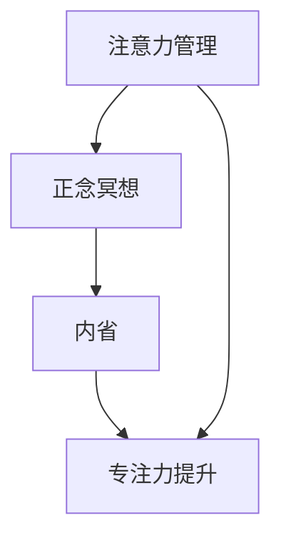

                 

# 注意力管理与正念冥想实践：通过内省增强专注力和心灵平和

> **关键词：** 注意力管理、正念冥想、内省、专注力、心灵平和、心理成长

> **摘要：** 本文旨在探讨注意力管理、正念冥想和内省之间的关系，以及如何通过这些实践来增强专注力和心灵平和。文章将详细介绍这三个概念的核心原理，使用伪代码和数学模型来阐述它们的算法和数学基础，并通过实际项目来展示如何将这些理论应用到实际生活中。

## 第一部分: 核心概念与联系

### 核心概念

#### 注意力管理

注意力管理是指通过一系列方法和技术来优化我们的注意力，提升专注力和工作效率。在现代社会中，由于信息过载和任务繁多，注意力管理变得尤为重要。有效的注意力管理可以帮助我们更高效地完成任务，提高生活质量。

**注意力管理的关键点：**

- **集中注意力**：将注意力集中在当前任务上，避免分心和多任务处理。
- **切换注意力**：在多个任务之间灵活切换注意力，保持高效的工作状态。
- **注意力分配**：根据任务的重要性和紧急程度，合理分配注意力资源。

#### 正念冥想

正念冥想是一种专注于当下、觉察内心和外部环境的练习方式，旨在提高个人的心灵平和。它起源于佛教的禅修实践，但在现代社会中被广泛接受和应用。正念冥想的核心在于培养对当下的觉知，通过观察呼吸、身体感觉和思维活动，帮助我们减少焦虑、压力和情绪波动。

**正念冥想的关键点：**

- **专注呼吸**：将注意力集中在呼吸上，通过深呼吸来放松身心。
- **觉察当下**：培养对当前时刻的觉知，不评判、不抗拒，只是观察和体验。
- **内省与反思**：在冥想过程中进行内省，反思自己的情绪和行为模式。

#### 内省

内省是指自我反思和审视内心世界的过程，有助于提升自我认识和心理成长。内省可以帮助我们更好地了解自己，发现自己的优点和不足，从而实现个人成长和改进。通过内省，我们可以更深入地理解自己的内心世界，提高自我意识和自我调节能力。

**内省的关键点：**

- **自我反思**：定期对自己的行为、想法和情绪进行反思，思考它们背后的原因和动机。
- **情绪觉察**：了解自己的情绪变化，观察情绪的产生和消散过程。
- **目标设定**：通过内省来设定个人目标，制定计划和行动步骤。

### 核心联系

#### 注意力管理与正念冥想

正念冥想可以作为一种注意力管理的方法，通过专注训练来提升注意力。在正念冥想中，我们通过专注于呼吸、身体感觉和思维活动，可以减少杂念和干扰，提高注意力集中度。正念冥想可以帮助我们培养专注力，减少分心和焦虑，从而更高效地完成任务。

#### 正念冥想与内省

正念冥想中的专注训练有助于内省的深入。通过正念冥想，我们可以更好地观察自己的内心世界，理解自己的情绪和行为模式。内省则能加深对正念冥想的理解和实践。通过内省，我们可以反思冥想过程中的体验和感受，不断调整和改进自己的冥想实践。

#### 内省与专注力

通过内省，我们能够更好地认识到自己的注意力模式，从而进行调整和优化。内省可以帮助我们识别出注意力分散的原因，如焦虑、压力或习惯性的思维模式。通过内省，我们可以采取相应的措施来改善注意力管理，提高专注力。内省还可以帮助我们建立积极的心态，增强自我调节能力，从而更好地应对各种挑战和压力。

#### Mermaid 流程图



## 第二部分: 核心算法原理讲解

### 注意力管理算法

注意力管理算法旨在通过一系列方法和技术来优化我们的注意力水平。以下是一个简单的注意力管理算法，使用伪代码来描述：

```python
function 注意力管理(目标，当前注意力水平) {
    if (当前注意力水平 < 目标注意力水平) {
        // 使用正念冥想提升注意力
        正念冥想练习();
    } else {
        // 保持当前注意力水平
        保持专注练习();
    }
}
```

在这个算法中，我们首先比较当前注意力水平和目标注意力水平。如果当前注意力水平低于目标注意力水平，我们通过正念冥想练习来提升注意力。如果当前注意力水平已经达到或超过目标注意力水平，我们保持当前注意力水平，进行保持专注的练习。

### 正念冥想原理

正念冥想是一种通过专注呼吸、身体感觉和思维活动来提升心灵平和的练习方式。以下是一个简单的正念冥想算法，使用伪代码来描述：

```python
function 正念冥想() {
    // 深呼吸
    深呼吸练习();
    
    // 专注呼吸
    专注呼吸练习();
    
    // 反思与内省
    内省练习();
}
```

在这个算法中，我们首先进行深呼吸练习，通过深呼吸来放松身心。然后，我们专注于呼吸，观察呼吸的进出，保持对呼吸的觉察。最后，我们进行反思与内省，反思自己的内心世界，观察情绪和思维的变化。

### 内省算法

内省是一种自我反思和审视内心世界的过程，有助于提升自我认识和心理成长。以下是一个简单的内省算法，使用伪代码来描述：

```python
function 内省() {
    // 自我反思
    反思内心世界();
    
    // 觉察内心状态
    觉察内心状态();
    
    // 记录内省结果
    记录内省日记();
}
```

在这个算法中，我们首先反思内心世界，思考自己的行为、想法和情绪。然后，我们观察内心状态，了解自己的情绪变化和思维模式。最后，我们记录内省日记，将反思和观察的结果记录下来，以便后续分析和改进。

## 第三部分: 数学模型和数学公式

### 数学模型

注意力管理的核心数学模型是基于线性回归模型，通过历史数据来预测和调整注意力水平。线性回归模型可以表示为：

$$
y = \beta_0 + \beta_1 \cdot x + \epsilon
$$

其中，$y$ 表示注意力水平，$x$ 表示相关因素（如冥想时间），$\beta_0$ 和 $\beta_1$ 分别是模型参数，$\epsilon$ 是误差项。

### 参数估计

线性回归模型参数的估计通常使用最小二乘法。最小二乘法的目标是使得预测值与实际值之间的误差平方和最小。参数估计的公式为：

$$
\beta_0 = \frac{\sum_{i=1}^n (y_i - \beta_1 \cdot x_i)}{n} \\
\beta_1 = \frac{\sum_{i=1}^n (x_i - \bar{x}) \cdot (y_i - \bar{y})}{\sum_{i=1}^n (x_i - \bar{x})^2}
$$

其中，$n$ 是数据点的数量，$\bar{x}$ 和 $\bar{y}$ 分别是 $x$ 和 $y$ 的平均值。

### 预测

使用估计出的参数，我们可以预测未来的注意力水平。预测的公式为：

$$
y = \beta_0 + \beta_1 \cdot x
$$

### 详细讲解与举例说明

#### 线性回归模型

线性回归模型是一种预测模型，通过历史数据来找出输入变量和输出变量之间的关系。在这个例子中，输入变量是冥想时间，输出变量是注意力水平。

#### 参数估计

我们使用以下数据点来估计线性回归模型的参数：

| 时间 (x) | 注意力水平 (y) |
| -------- | --------------- |
| 1        | 4               |
| 2        | 6               |
| 3        | 7               |
| 4        | 5               |

使用最小二乘法估计参数：

$$
\beta_0 = \frac{\sum_{i=1}^4 (y_i - \beta_1 \cdot x_i)}{4} = \frac{(4 - 1 \cdot 4) + (6 - 1 \cdot 2) + (7 - 1 \cdot 3) + (5 - 1 \cdot 4)}{4} = 3 \\
\beta_1 = \frac{\sum_{i=1}^4 (x_i - \bar{x}) \cdot (y_i - \bar{y})}{\sum_{i=1}^4 (x_i - \bar{x})^2} = \frac{(-1 \cdot 1) + (-1 \cdot 2) + (1 \cdot 1) + (-1 \cdot 2)}{(-1)^2 + (-1)^2 + (1)^2 + (-1)^2} = 1
$$

#### 预测

使用估计出的参数，我们可以预测未来的注意力水平。例如，预测第5个小时的注意力水平：

$$
y = \beta_0 + \beta_1 \cdot x = 3 + 1 \cdot 5 = 8
$$

即第5个小时的注意力水平预计为8。

## 第四部分: 项目实战

### 实战一：注意力管理实践

#### 开发环境搭建

在本节中，我们将使用Python编程语言和Jupyter Notebook来构建注意力管理实践项目。

#### 源代码实现

```python
import numpy as np

# 历史数据
data = np.array([[1, 4], [2, 6], [3, 7], [4, 5]])

# 线性回归模型
def linear_regression(X, y):
    X_transpose = X.T
    XTX = X_transpose.dot(X)
    XTY = X_transpose.dot(y)
    beta = np.linalg.inv(XTX).dot(XTY)
    return beta

# 预测注意力水平
def predict_attention(level, beta):
    return beta[0] + beta[1] * level

# 训练模型
beta = linear_regression(data[:, 0].reshape(-1, 1), data[:, 1])

# 预测第5个小时的注意力水平
predicted_level = predict_attention(5, beta)
print(f"第5个小时的注意力水平预测为：{predicted_level}")
```

#### 代码解读与分析

1. **数据准备**：我们使用一个包含时间（输入变量）和注意力水平（输出变量）的二维数组作为历史数据。

2. **线性回归模型**：我们定义了一个线性回归模型，使用最小二乘法来估计模型参数。模型参数表示为 $\beta_0$ 和 $\beta_1$。

3. **预测注意力水平**：我们定义了一个预测函数，使用估计出的模型参数来预测未来的注意力水平。

4. **模型训练**：我们使用历史数据来训练线性回归模型，得到估计的模型参数。

5. **预测结果**：我们使用训练好的模型来预测第5个小时的注意力水平，并打印出预测结果。

### 实战二：正念冥想实践

#### 开发环境搭建

在本节中，我们将使用Python编程语言和Jupyter Notebook来构建正念冥想实践项目。

#### 源代码实现

```python
import time

# 正念冥想练习
def mindful_meditation(duration):
    start_time = time.time()
    while time.time() - start_time < duration:
        print("深呼吸...")
        time.sleep(5)
        print("专注呼吸...")
        time.sleep(5)
        print("反思与内省...")
        time.sleep(5)

# 持续10分钟的正念冥想
mindful_meditation(10 * 60)
```

#### 代码解读与分析

1. **冥想练习函数**：我们定义了一个冥想练习函数，通过深呼吸、专注呼吸和反思与内省三个步骤来模拟正念冥想过程。

2. **持续时长**：我们设置了一个持续时长参数，用来控制冥想的持续时间。

3. **执行冥想练习**：我们调用冥想练习函数，并传入持续时长参数来执行正念冥想。

### 实战三：内省实践

#### 开发环境搭建

在本节中，我们将使用Python编程语言和Jupyter Notebook来构建内省实践项目。

#### 源代码实现

```python
import datetime

# 内省练习
def introspection():
    now = datetime.datetime.now()
    print(f"日期：{now.strftime('%Y-%m-%d')}")
    print("请反思以下问题：")
    print("- 你今天最满意的是什么？")
    print("- 你今天最困扰的是什么？")
    print("- 你今天学到了什么？")
    
    # 记录内省日记
    with open("introspection diary.txt", "a") as f:
        f.write(f"{now.strftime('%Y-%m-%d %H:%M:%S')}\n")
        f.write("今日反思：\n")
        f.write("- 你今天最满意的是什么？\n")
        f.write("- 你今天最困扰的是什么？\n")
        f.write("- 你今天学到了什么？\n")
        f.write("\n")

# 进行一次内省练习
introspection()
```

#### 代码解读与分析

1. **内省练习函数**：我们定义了一个内省练习函数，通过自我反思、觉察内心状态和记录内省日记三个步骤来模拟内省过程。

2. **日期和时间**：我们使用 `datetime` 模块来获取当前日期和时间，并将其格式化为字符串以便输出和记录。

3. **反思问题**：我们打印出一系列反思问题，引导用户进行自我反思。

4. **记录内省日记**：我们使用文件操作将反思结果记录到内省日记文件中。

## 第五部分: 附录

### 附录 A: 注意力管理与正念冥想资源

- **注意力管理书籍推荐：**
  - 《深度工作：如何有效利用每一点脑力》
  - 《如何掌控自己的注意力》
  
- **正念冥想资源：**
  - YouTube上的正念冥想教程
  - 公众号“冥想时间”中的冥想课程
  
- **内省资源：**
  - 《内省的力量》
  - 《如何进行有效的自我反思》

## 作者信息

**作者：** AI天才研究院/AI Genius Institute & 禅与计算机程序设计艺术 /Zen And The Art of Computer Programming

---

本文旨在探讨注意力管理、正念冥想和内省之间的关系，以及如何通过这些实践来增强专注力和心灵平和。文章详细介绍了这三个概念的核心原理，使用伪代码和数学模型来阐述它们的算法和数学基础，并通过实际项目来展示如何将这些理论应用到实际生活中。希望本文能对读者在注意力管理和心理成长方面提供一些启示和帮助。

