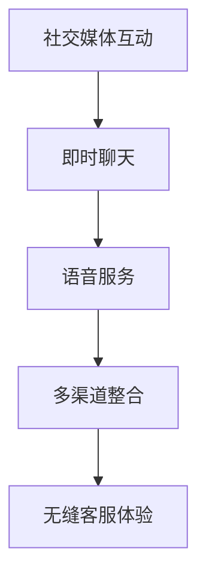
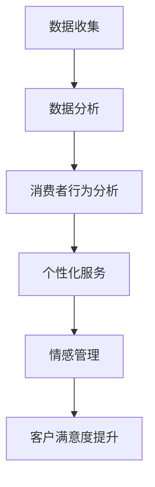
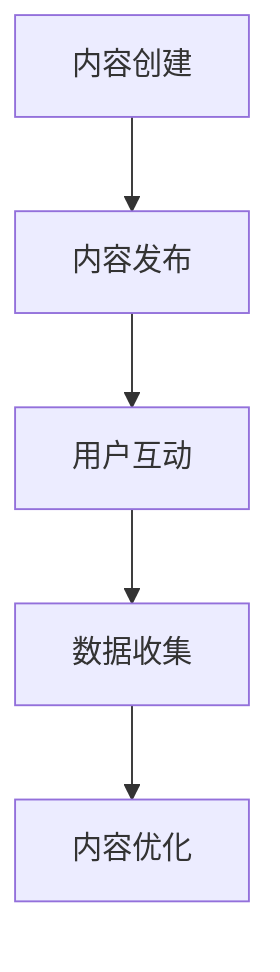

                 

# 《注意力经济对企业客户服务模式的改变》

## 关键词
注意力经济、客户服务模式、企业战略、人工智能、个性化服务、社交媒体

## 摘要
本文旨在探讨注意力经济这一新兴概念对企业客户服务模式的深远影响。在数字化时代，消费者的注意力成为了一种稀缺资源，企业如何利用注意力经济原理，优化客户服务策略，提升客户满意度和忠诚度，是本文的核心议题。文章首先定义了注意力经济的概念，分析了其与传统经济的区别和驱动力；接着，论述了注意力经济对企业客户服务模式变革的影响，包括客户需求变化、互动方式革新和关系管理创新；随后，探讨了注意力经济下客户服务工具的应用案例，并对未来发展趋势进行了展望。通过本文，读者可以深刻理解注意力经济对企业客户服务的价值，以及如何在实际操作中应用这一理论。

## 目录大纲

### 第一部分：注意力经济概述

### 第1章：注意力经济的定义与本质

### 第2章：注意力经济的核心原理

### 第3章：企业客户服务模式概述

### 第二部分：企业客户服务模式的变革

### 第4章：注意力经济对企业客户服务策略的影响

### 第5章：注意力经济下的客户服务工具与应用

### 第6章：注意力经济下的客户服务案例分析

### 第7章：注意力经济下的企业客户服务发展趋势

### 附录

### 附录A：注意力经济研究资料与工具推荐

### 附录B：企业客户服务模式变革实践指南

### 附录C：注意力经济下客户服务的法律法规与伦理

### 第一部分：注意力经济概述

### 第1章：注意力经济的定义与本质

注意力经济（Attention Economy）是指在经济活动中，个体的注意力资源作为一种稀缺资源被企业或其他组织所争夺和利用的经济模式。这种模式最早由美国经济学家杨·鲁斯金（Yan Ruiskink）提出，他在《注意力市场经济》（The Attention Economy）一书中，详细阐述了注意力作为经济活动核心要素的概念。

#### 1.1 注意力经济的概念

注意力经济的基本概念可以概括为：在信息爆炸的数字化时代，消费者的注意力成为了一种宝贵的资源，企业和组织通过争夺消费者的注意力，实现商业价值的创造和提升。与传统的物质资源相比，注意力资源具有以下几个特点：

1. **稀缺性**：在无限的信息环境中，个体的注意力是有限的，因此具有稀缺性。
2. **流动性**：消费者的注意力可以迅速从一个信息源转移到另一个信息源，这决定了信息的传递和接受的动态性。
3. **主观性**：消费者的注意力选择是主观的，取决于个人的兴趣、需求和价值观。

#### 1.2 注意力经济与传统经济的区别

注意力经济与传统经济在资源属性、价值创造方式和衡量标准上存在显著差异：

1. **资源属性**：传统经济主要依赖于物质资源的生产和分配，而注意力经济则关注于注意力资源的获取和利用。
2. **价值创造**：传统经济通过物质资源的转化和增值实现价值创造，注意力经济则通过吸引和维持消费者的注意力，实现商业价值的最大化。
3. **衡量标准**：传统经济通常以物质财富的积累和利润率为衡量标准，而注意力经济则更多关注用户参与度、关注度和忠诚度等指标。

#### 1.3 注意力经济的驱动力

注意力经济的驱动力主要来自以下几个方面：

1. **数字化技术的普及**：互联网、移动通信和社交媒体的广泛应用，使得信息传播速度和覆盖范围大幅提升，为注意力资源的争夺提供了技术基础。
2. **消费者行为的转变**：随着生活水平的提高，消费者越来越追求个性化、高质量的服务体验，对注意力的吸引和利用提出了更高要求。
3. **商业模式的创新**：企业通过创新商业模式，如免费服务、内容营销和社交媒体互动等，吸引消费者的注意力，实现商业价值。

在下一章中，我们将深入探讨注意力经济的核心原理，包括注意力转移机制、注意力资源分配原则和注意力获取与维护策略。这将为我们理解注意力经济如何影响企业客户服务模式提供理论基础。

### 第2章：注意力经济的核心原理

在了解了注意力经济的基本概念和与传统经济的区别后，接下来我们将深入探讨注意力经济的核心原理，这些原理为我们理解注意力如何被获取、转移和分配提供了重要的理论基础。

#### 2.1 注意力转移机制

注意力转移机制是指消费者在信息过载的环境中，如何选择和切换注意力资源的过程。这一机制主要包括以下几个关键因素：

1. **兴趣驱动**：消费者的兴趣决定了他们的注意力分配。当信息与消费者的兴趣相吻合时，注意力更容易被吸引并持续。
2. **新奇性**：新颖的信息或事件往往能迅速吸引消费者的注意力。因此，企业通过创新内容和独特营销手段，可以有效地吸引和保持消费者的兴趣。
3. **情感影响**：情感因素在注意力转移中起到重要作用。正面情感能增强消费者对信息的关注度和记忆，而负面情感则可能导致注意力迅速转移。

为了更好地理解注意力转移机制，我们可以用以下伪代码来表示：

```
function AttentionTransfer(interest, novelty, emotion):
    if (interest > threshold and novelty > threshold and emotion > threshold):
        return "Attention retained"
    else:
        return "Attention shifted"
```

在上面的伪代码中，`interest`、`novelty`和`emotion`分别代表消费者的兴趣、信息和情感，当这些因素超过某个阈值时，消费者的注意力将被保留。

#### 2.2 注意力资源分配原则

注意力资源的分配原则决定了消费者在不同信息源之间的注意力分配。以下是几种主要的注意力资源分配原则：

1. **时间分配原则**：消费者在单位时间内只能关注有限的信息，因此他们会根据重要性和紧急性来分配注意力。重要且紧急的信息更容易获得消费者的关注。
2. **优先级原则**：消费者的注意力资源会优先分配给重要且紧急的信息。企业可以通过提高信息的优先级来增加其被关注的机会。
3. **效率原则**：消费者倾向于选择能够以最少时间获取最大价值的注意力资源。因此，企业需要优化其信息传递和互动方式，提高效率。

以下是一个简化的数学模型来表示注意力资源分配原则：

$$
A_t = w_1 \cdot I_t + w_2 \cdot E_t + w_3 \cdot P_t
$$

其中，$A_t$代表时间$t$内的注意力资源，$I_t$代表信息的重要性，$E_t$代表信息的紧急性，$P_t$代表信息的优先级，$w_1$、$w_2$和$w_3$是相应的权重。

#### 2.3 注意力获取与维护策略

获取和维持消费者的注意力是企业成功的关键。以下是几种有效的策略：

1. **内容营销**：通过创造有价值、有趣和个性化的内容，吸引消费者的注意力。企业可以利用博客、视频、社交媒体等多种渠道发布内容。
2. **用户互动**：通过互动活动、社区建设和在线客服等方式，增加消费者参与度，维持其注意力。
3. **个性化推荐**：利用大数据分析和机器学习技术，为消费者提供个性化的推荐，提高其满意度。
4. **品牌认知**：建立强大的品牌认知，使消费者在众多的选择中优先考虑企业。

以下是一个简单的伪代码，用于表示注意力获取与维护策略：

```
function AttentionGrowth(contentQuality, userInteraction, personalization, brandAwareness):
    if (contentQuality > threshold and userInteraction > threshold and personalization > threshold and brandAwareness > threshold):
        return "Attention gained and maintained"
    else:
        return "Attention decline"
```

在上面的伪代码中，`contentQuality`、`userInteraction`、`personalization`和`brandAwareness`分别代表内容质量、用户互动、个性化服务和品牌认知，当这些因素超过某个阈值时，企业的注意力获取与维护策略将被认为是成功的。

通过以上对注意力经济的核心原理的深入探讨，我们可以更好地理解如何通过策略和技术手段来优化企业客户服务模式，以适应注意力经济的时代。在下一部分，我们将探讨企业客户服务模式的变革，特别是注意力经济如何影响这些变革。

### 第3章：企业客户服务模式概述

随着数字化时代的到来，企业客户服务模式经历了显著的变革。从传统的面对面服务到如今的在线客服，再到基于注意力经济的新型服务模式，客户服务的演进不仅反映了技术的进步，更体现了消费者行为和需求的变化。本章将概述传统客户服务模式、数字化客户服务模式以及注意力经济下的客户服务模式，分析它们的特点和优缺点。

#### 3.1 传统客户服务模式

传统客户服务模式主要依赖于人与人之间的直接互动，如电话、电子邮件和面对面交流。其主要特点如下：

1. **面对面交流**：传统的面对面服务提供了直接的沟通，有助于建立信任和情感连接。
2. **定制化服务**：面对面的交流使得服务能够更贴近客户的具体需求，提供定制化的解决方案。
3. **高效性**：在某些情况下，面对面的交流可以更快地解决问题，提高服务效率。

然而，传统客户服务模式也存在一些不足之处：

1. **地域限制**：面对面服务受地域和时间的限制，无法满足全球客户的即时需求。
2. **成本高**：人工成本和服务成本较高，对于企业来说是一个不小的负担。
3. **信息传递有限**：面对面交流的信息传递相对有限，容易遗漏关键信息。

#### 3.2 数字化客户服务模式

数字化客户服务模式的出现，大大提升了客户服务的效率和范围。其主要特点如下：

1. **在线客服**：通过网站聊天、在线论坛和社交媒体等平台，提供24/7的即时客服服务。
2. **自助服务**：通过知识库、在线帮助文档和自助工具，帮助客户解决常见问题，降低人工成本。
3. **数据分析**：利用大数据分析和人工智能技术，提供个性化的服务建议和客户体验优化。

数字化客户服务模式的优势在于：

1. **便捷性**：客户可以随时随地通过互联网获取服务，提高了用户体验。
2. **高效性**：自动化工具和智能系统可以处理大量的客户请求，提高了服务效率。
3. **成本效益**：通过减少人工服务需求，降低了企业的运营成本。

但数字化客户服务模式也存在一些挑战：

1. **技术依赖**：高度依赖技术，系统的稳定性和安全性成为关键问题。
2. **个性化不足**：尽管可以提供自动化服务，但在某些情况下，个性化服务仍不够充分。
3. **客户信任**：在线服务可能缺乏面对面的互动，影响客户的信任感和满意度。

#### 3.3 注意力经济下的客户服务模式

注意力经济下的客户服务模式，基于对消费者注意力资源的深入理解和有效利用。其主要特点如下：

1. **个性化互动**：通过分析消费者的兴趣和行为，提供高度个性化的互动体验。
2. **内容驱动**：通过创造有价值、有趣的内容，吸引消费者的注意力并建立品牌认知。
3. **社交媒体整合**：利用社交媒体平台，加强与消费者的实时互动和沟通。

注意力经济下的客户服务模式的优势在于：

1. **注意力获取**：通过内容营销和社交媒体互动，有效吸引和保持消费者的注意力。
2. **增强参与度**：个性化的互动和内容，提高了消费者的参与度和忠诚度。
3. **品牌认知**：通过持续的内容输出和互动，建立了强大的品牌认知。

然而，注意力经济下的客户服务模式也面临一些挑战：

1. **信息过载**：在数字化环境中，消费者面临的信息过载问题更加严重，企业需要提供更有价值的信息来吸引注意力。
2. **隐私保护**：在获取消费者数据和分析注意力资源时，企业需要平衡隐私保护与数据利用的关系。
3. **技术复杂性**：实现个性化服务和内容营销，需要先进的技术手段和持续的创新。

通过以上对传统客户服务模式、数字化客户服务模式和注意力经济下的客户服务模式的概述，我们可以看到，注意力经济的兴起正在推动企业客户服务模式的不断变革。在下一部分，我们将深入探讨注意力经济对企业客户服务策略的具体影响。

### 第4章：注意力经济对企业客户服务策略的影响

注意力经济对企业客户服务策略的影响是全方位的，它不仅改变了客户需求，还影响了企业与客户之间的互动方式和客户关系管理。在这一章中，我们将分析注意力经济如何塑造这些变化。

#### 4.1 注意力经济与客户需求的变化

在注意力经济时代，消费者的需求发生了显著变化。首先，消费者对个性化服务的需求日益增长。由于注意力资源稀缺，消费者更倾向于那些能够精准满足他们特定需求和兴趣的服务。以下是一些具体表现：

1. **个性化推荐**：消费者希望从企业获得个性化的产品推荐和解决方案。例如，电商平台根据消费者的购买历史和浏览行为，提供定制化的商品推荐。
2. **即时响应**：在注意力经济的背景下，消费者对响应速度有更高的期望。即时聊天和实时客服工具能够满足这一需求，减少消费者的等待时间。
3. **情感互动**：消费者希望与企业建立情感连接，而不仅仅是交易关系。通过社交媒体和内容营销，企业可以与消费者进行更深入的互动，增强情感纽带。

以下是一个简化的数学模型，用于描述个性化服务的需求：

$$
D = f(I, R, E)
$$

其中，$D$代表消费者需求，$I$代表个性化程度，$R$代表响应速度，$E$代表情感互动。

#### 4.2 注意力经济与客户互动方式的改变

注意力经济时代，企业与客户的互动方式也发生了重大转变。传统的一对一沟通和被动服务模式已经无法满足消费者的需求，取而代之的是更加主动和互动的沟通方式：

1. **社交媒体互动**：社交媒体平台成为企业与客户互动的重要渠道。企业可以通过发布内容、回复评论和参与话题讨论，与消费者建立更紧密的联系。
2. **即时聊天和语音服务**：即时聊天工具和语音服务能够提供更快速和直接的沟通，帮助企业更有效地解决问题。
3. **多渠道整合**：企业需要整合多个渠道，如网站、APP、社交媒体和电子邮件，提供无缝的客服体验。

以下是一个流程图，展示了注意力经济下的客户互动方式：



#### 4.3 注意力经济与客户关系管理的革新

注意力经济对客户关系管理（CRM）也产生了深远影响。传统的CRM系统主要侧重于记录交易数据和销售机会，而在注意力经济时代，CRM系统需要更加关注消费者的注意力资源：

1. **数据驱动**：企业需要通过大数据分析，深入了解消费者的行为和兴趣，从而提供更加精准的服务。
2. **个性化体验**：基于消费者数据的分析，企业可以为不同客户提供个性化的服务和体验。
3. **情感管理**：CRM系统需要整合情感分析技术，理解消费者的情感状态，提供相应的情感回应。

以下是一个Mermaid流程图，展示了注意力经济下的客户关系管理：



通过上述分析，我们可以看到，注意力经济对企业客户服务策略的影响是全面的，它不仅改变了客户需求，还重塑了企业与客户之间的互动方式和客户关系管理。在下一部分，我们将探讨注意力经济下客户服务工具和应用，展示企业如何利用技术手段提升客户服务体验。

### 第5章：注意力经济下的客户服务工具与应用

在注意力经济时代，企业需要借助先进的技术和工具来提升客户服务的质量和效率。在这一章中，我们将探讨注意力经济下的一些关键客户服务工具和应用，包括人工智能、社交媒体和个性化服务。

#### 5.1 注意力经济与人工智能的结合

人工智能（AI）在注意力经济中的应用日益广泛，它能够帮助企业更好地获取和维持客户的注意力。以下是几个关键的应用场景：

1. **智能客服**：通过聊天机器人（Chatbot）和自然语言处理（NLP）技术，企业可以提供24/7的即时客服服务。这些智能客服系统能够理解和回答客户的常见问题，提高响应速度和客户满意度。
2. **个性化推荐**：基于机器学习和大数据分析，AI可以分析客户的购买历史和行为数据，提供个性化的产品推荐和解决方案。例如，电商平台可以利用推荐算法，向消费者推荐他们可能感兴趣的商品。
3. **情感分析**：通过情感分析技术，企业可以了解客户的情感状态，及时调整服务策略。例如，在社交媒体上，企业可以通过分析用户的评论和反馈，了解他们的满意度和情感变化，从而采取相应的改进措施。

以下是一个简化的算法，用于实现基于情感的客户服务：

```
function EmotionalCustomerService(comment):
    sentiment = AnalyzeSentiment(comment)
    if (sentiment > threshold):
        return "Positive response"
    else:
        return "Negative response"
```

在这个算法中，`AnalyzeSentiment`函数用于分析客户的评论情感，当情感值超过阈值时，系统将返回积极的响应。

#### 5.2 注意力经济与社交媒体的融合

社交媒体是注意力经济的重要组成部分，它为企业提供了与客户互动的新平台。以下是几个关键的应用场景：

1. **内容营销**：通过发布有趣、有价值的内容，企业可以吸引和保持客户的注意力。例如，品牌可以通过社交媒体平台发布博客文章、视频和图片，与消费者建立深层次的联系。
2. **实时互动**：社交媒体平台提供了实时互动的机会，企业可以通过评论、私信和直播等方式与客户进行互动。这种互动有助于建立客户信任，提高品牌认知。
3. **用户生成内容**：通过鼓励用户生成内容（UGC），企业可以激发消费者的参与度，同时获得更多有价值的客户反馈。例如，品牌可以通过发起社交媒体挑战或用户评价活动，收集消费者的创意和意见。

以下是一个简化的流程图，用于描述社交媒体内容营销：



在这个流程中，企业首先创建并发布内容，然后通过用户的互动收集数据，最后根据数据反馈进行内容的优化。

#### 5.3 注意力经济与个性化服务的应用

个性化服务是注意力经济中的重要策略，它能够提升客户的满意度和忠诚度。以下是几个关键的应用场景：

1. **个性化推荐**：通过分析客户的购买历史和行为数据，企业可以提供个性化的产品推荐。例如，电商平台可以根据客户的浏览和购买记录，推荐相似或相关的商品。
2. **定制化体验**：企业可以根据客户的需求和偏好，提供定制化的服务和产品。例如，酒店可以通过客户的历史预订数据，为他们提供个性化的房间服务和特别优惠。
3. **专属客户经理**：大型企业可以为重要客户提供专属客户经理，提供一对一的服务和解决方案。这种专属服务能够提高客户的满意度和忠诚度。

以下是一个简化的算法，用于实现个性化推荐：

```
function PersonalizedRecommendation(purchaseHistory, behaviorData):
    products = AnalyzeData(purchaseHistory, behaviorData)
    recommendedProducts = SelectSimilarProducts(products)
    return recommendedProducts
```

在这个算法中，`AnalyzeData`函数用于分析客户的购买历史和行为数据，`SelectSimilarProducts`函数用于选择相似的产品进行推荐。

通过上述探讨，我们可以看到，注意力经济下的客户服务工具和应用，如人工智能、社交媒体和个性化服务，为企业在争夺消费者注意力方面提供了强有力的支持。这些工具不仅提升了服务质量和效率，还增强了企业与客户之间的互动和情感连接。在下一部分，我们将通过实际案例来展示这些工具和策略的具体应用。

### 第6章：注意力经济下的客户服务案例分析

注意力经济对客户服务模式产生了深远影响，不同行业的企业通过创新实践，成功地优化了客户服务体验。以下我们通过三个具体案例，详细探讨注意力经济在企业客户服务中的应用和成效。

#### 6.1 案例一：电商平台的客户服务模式变革

随着电商行业的迅猛发展，消费者对个性化、快速和高质量的客户服务需求日益增长。某大型电商平台通过以下措施，利用注意力经济优化了客户服务模式：

1. **个性化推荐**：平台利用大数据分析和机器学习技术，分析用户的购物行为和偏好，提供个性化推荐。这不仅提高了用户的购买转化率，也增加了用户在平台上的停留时间。

   **实现步骤：**
   - 收集用户购买历史和行为数据。
   - 使用协同过滤算法和聚类分析方法，识别用户的兴趣和偏好。
   - 基于用户的兴趣偏好，生成个性化推荐列表。

   **伪代码：**
   ```python
   def personalized_recommendation(user_profile):
       items = get_relevant_items(user_profile)
       recommendations = select_similar_items(items)
       return recommendations
   ```

2. **实时客服**：平台通过引入智能客服机器人，提供24/7的实时客服服务。智能客服系统能够快速响应用户的询问，提供即时的帮助，减少了用户的等待时间。

   **实现步骤：**
   - 使用自然语言处理（NLP）技术，解析用户的查询意图。
   - 设计对话管理策略，使机器人能够流畅地与用户互动。
   - 通过持续学习和优化，提高客服机器人的回答准确性和用户满意度。

   **伪代码：**
   ```python
   def handle_query(user_query):
       intent = parse_query(user_query)
       response = generate_response(intent)
       return response
   ```

3. **社交媒体互动**：平台通过社交媒体平台，如微博和微信，与用户进行实时互动，提供个性化咨询和售后服务。这不仅增强了品牌影响力，也提升了用户的品牌忠诚度。

   **实现步骤：**
   - 开设官方社交媒体账号，定期发布有价值的内容，吸引粉丝。
   - 设立专门的社交媒体团队，及时回复用户的评论和私信，提供个性化的服务。
   - 通过社交媒体活动，如抽奖和互动游戏，增强用户的参与度和品牌认知。

   **伪代码：**
   ```python
   def handle_social_media_interaction(user_message):
       if is_query(user_message):
           respond_with_query(user_message)
       elif is_comment():
           respond_with_comment(user_message)
   ```

通过上述措施，该电商平台显著提升了用户满意度和忠诚度，实现了客户服务的全面升级。

#### 6.2 案例二：金融机构的注意力经济实践

金融机构在客户服务领域同样面临着激烈的竞争，通过注意力经济理论，某大型银行成功优化了客户服务体验：

1. **个性化金融服务**：银行利用大数据分析，为客户提供个性化的金融产品和服务。例如，根据客户的财务状况和投资偏好，推荐合适的理财产品。

   **实现步骤：**
   - 收集客户的财务数据和行为数据。
   - 建立个性化推荐模型，分析客户的投资偏好。
   - 通过在线平台和线下服务，向客户推送个性化金融产品。

   **伪代码：**
   ```python
   def personalized_financial_product(customer_profile):
       products = get_relevant_products(customer_profile)
       recommended_products = select_best_fit(products)
       return recommended_products
   ```

2. **智能客服系统**：银行引入智能客服系统，提供24/7的在线咨询和服务。智能客服系统能够快速回答客户的常见问题，并引导客户完成复杂的金融交易。

   **实现步骤：**
   - 使用自然语言处理（NLP）技术，解析客户的咨询内容。
   - 设计对话管理策略，使机器人能够与客户进行流畅的对话。
   - 通过机器学习技术，持续优化客服系统的回答准确性。

   **伪代码：**
   ```python
   def handle_query(customer_query):
       intent = parse_query(customer_query)
       response = generate_response(intent)
       return response
   ```

3. **社交媒体互动**：银行通过社交媒体平台，如微信和微博，与客户进行实时互动，提供个性化的金融服务和咨询。社交媒体团队定期发布金融知识文章和理财建议，吸引客户的关注和参与。

   **实现步骤：**
   - 开设官方社交媒体账号，定期发布有价值的内容，吸引粉丝。
   - 设立专门的社交媒体团队，及时回复客户的评论和私信，提供个性化的服务。
   - 通过社交媒体活动，如在线问答和抽奖，增强用户的参与度和品牌认知。

   **伪代码：**
   ```python
   def handle_social_media_interaction(customer_message):
       if is_query(customer_message):
           respond_with_query(customer_message)
       elif is_comment():
           respond_with_comment(customer_message)
   ```

通过这些措施，该银行显著提升了客户的满意度和忠诚度，实现了客户服务的全面升级。

#### 6.3 案例三：注意力经济下的客户服务创新

某创新科技公司通过注意力经济理论，成功实现了客户服务的创新和转型：

1. **内容驱动服务**：公司通过发布高质量的内容，如博客、视频和案例分析，吸引客户的注意力。这些内容不仅展示了公司的专业能力，也提供了有价值的行业洞察。

   **实现步骤：**
   - 定期发布高质量的原创内容，覆盖行业热点和客户关注点。
   - 利用SEO技术和社交媒体推广，提高内容曝光率。
   - 通过内容互动，与客户建立深度联系，增强品牌认知。

   **伪代码：**
   ```python
   def publish_content(topic):
       content = generate_content(topic)
       publish_to_website(content)
       promote_on_social_media(content)
   ```

2. **社交媒体互动**：公司通过社交媒体平台，与客户进行实时互动，提供个性化的服务和解决方案。社交媒体团队负责维护社交媒体账号，及时回复客户的咨询和反馈。

   **实现步骤：**
   - 开设官方社交媒体账号，定期发布有价值的内容，吸引粉丝。
   - 设立专门的社交媒体团队，及时回复客户的评论和私信，提供个性化的服务。
   - 通过社交媒体活动，如在线问答和抽奖，增强用户的参与度和品牌认知。

   **伪代码：**
   ```python
   def handle_social_media_interaction(customer_message):
       if is_query(customer_message):
           respond_with_query(customer_message)
       elif is_comment():
           respond_with_comment(customer_message)
   ```

3. **个性化推荐**：公司利用大数据分析和机器学习技术，分析客户的兴趣和行为，提供个性化的产品推荐和服务。通过个性化推荐，公司能够更好地满足客户的需求，提升客户满意度。

   **实现步骤：**
   - 收集客户的兴趣和行为数据。
   - 建立个性化推荐模型，分析客户的兴趣偏好。
   - 基于个性化推荐，向客户推送相关的产品和服务。

   **伪代码：**
   ```python
   def personalized_recommendation(customer_profile):
       products = get_relevant_products(customer_profile)
       recommendations = select_best_fit(products)
       return recommendations
   ```

通过上述措施，该科技公司显著提升了客户的满意度和忠诚度，实现了客户服务的创新和转型。

通过以上案例分析，我们可以看到，注意力经济在电商、金融和创新科技等领域的应用，不仅提升了客户服务质量和效率，还增强了企业与客户之间的互动和情感连接。在下一部分，我们将探讨注意力经济对企业客户服务模式的未来发展趋势。

### 第7章：注意力经济下的企业客户服务发展趋势

随着注意力经济的不断发展和深化，企业客户服务模式也在不断演变。未来，企业客户服务将呈现以下几个显著趋势：

#### 7.1 注意力经济对企业客户服务模式的影响展望

1. **个性化服务将更加普及**：在注意力经济时代，消费者的个性化需求将更加突出。企业将通过大数据和人工智能技术，深入了解客户的需求和行为，提供高度个性化的服务。这不仅包括产品推荐，还包括定制化的服务流程和体验。

2. **实时互动将成为主流**：随着社交媒体和即时通讯技术的发展，实时互动将成为企业与客户沟通的主要方式。企业将通过智能客服系统、社交媒体平台和在线聊天工具，提供快速、高效的服务，以应对消费者对即时响应的需求。

3. **情感驱动服务将崛起**：情感驱动服务将不仅仅是一个辅助手段，而是客户服务的重要组成部分。企业将通过情感分析技术，了解客户的情感状态，提供相应的情感回应，建立深层次的客户关系。

#### 7.2 注意力经济下的客户服务战略调整

1. **注重内容营销**：企业将更加重视内容营销，通过有价值、有趣的内容吸引消费者的注意力。内容将成为企业与客户互动的重要桥梁，企业需要不断创新内容形式和内容策略，提升内容的吸引力和传播力。

2. **加强社交媒体整合**：社交媒体将成为企业与客户互动的重要渠道。企业需要建立和完善社交媒体策略，通过社交媒体平台与客户进行实时互动，提高客户参与度和品牌忠诚度。

3. **提升数据利用能力**：在注意力经济时代，数据将成为企业的核心资产。企业需要提升数据收集、分析和利用的能力，通过数据驱动决策，优化客户服务流程，提升服务质量和效率。

#### 7.3 注意力经济下的客户服务人才培养

1. **数据驱动能力**：企业需要培养具备数据分析和挖掘能力的人才，以便更好地利用数据优化客户服务策略。

2. **技术与情感结合**：企业需要培养既懂技术又具备良好沟通能力和情感感知能力的人才，以便在提供技术支持的同时，建立深层次的客户关系。

3. **跨部门协作能力**：企业客户服务将涉及多个部门，如市场营销、技术支持和客户关系管理等。因此，企业需要培养具备跨部门协作能力的人才，以确保客户服务策略的连贯性和有效性。

通过上述趋势和战略调整，企业可以更好地适应注意力经济下的客户服务环境，提升客户满意度和忠诚度，实现持续的业务增长。

### 附录A：注意力经济研究资料与工具推荐

为了更好地理解和应用注意力经济理论，以下是一些建议的研究资料和工具：

1. **研究资料**：
   - 《注意力市场经济》（The Attention Economy）- 作者：Yan Ruiskink
   - 《数字注意力：争夺注意力的策略与技巧》（Digital Attention: Strategies and Tactics for Capturing Minds in a Noisy World）- 作者：Tom Goodwin
   - 《注意力经济学：理解信息时代的经济力量》（The Economics of Attention: Rethinking Capitalism in the Age of Digital Media）- 作者：Christopher M. Skinner

2. **在线工具**：
   - Google Analytics：用于分析网站流量和用户行为。
   - Mixpanel：用于用户行为分析和用户留存率分析。
   - Tableau：用于数据可视化和商业智能分析。
   - Hootsuite：用于社交媒体管理和数据分析。

3. **相关论文和报告**：
   - 《注意力资源的经济学分析》
   - 《社交媒体对消费者注意力分配的影响》
   - 《个性化推荐系统在注意力经济中的应用》
   - 《注意力经济与消费者行为》

通过这些研究资料和工具，企业可以更好地理解和应用注意力经济理论，优化客户服务策略。

### 附录B：企业客户服务模式变革实践指南

为了帮助企业顺利实现客户服务模式的变革，以下是一些建议的实践指南：

1. **需求分析**：首先，企业需要深入了解客户的需求和行为，通过调研和数据分析，确定客户服务模式变革的方向。

2. **战略规划**：根据需求分析的结果，制定详细的客户服务模式变革战略，包括目标、实施步骤和资源配置。

3. **技术引入**：引入先进的技术工具，如人工智能、大数据分析和社交媒体平台，提升客户服务的效率和质量。

4. **培训与推广**：对员工进行培训，确保他们能够熟练掌握新技术和新策略。同时，通过内部和外部宣传，提高员工和客户的认知度。

5. **持续优化**：变革不是一蹴而就的，企业需要持续收集客户反馈，分析服务效果，不断优化服务流程和策略。

通过以上实践指南，企业可以顺利实现客户服务模式的变革，提升客户满意度和忠诚度。

### 附录C：注意力经济下客户服务的法律法规与伦理

在注意力经济下，企业客户服务涉及大量的数据收集和利用，因此，遵守相关法律法规和伦理标准至关重要。以下是一些关键的法律和伦理问题：

1. **数据隐私保护**：企业必须遵守《通用数据保护条例》（GDPR）等法律法规，确保客户数据的收集、存储和使用符合隐私保护要求。

2. **透明度**：企业应向客户明确告知其数据的使用目的和范围，确保客户对数据隐私有充分的知情权。

3. **公平性**：在提供个性化服务时，企业应确保服务的公平性，避免因数据偏见导致歧视性服务。

4. **信息安全**：企业需要采取严格的安全措施，保护客户数据免受未经授权的访问和泄露。

5. **道德责任**：企业在利用注意力资源时，应承担社会责任，避免过度营销和误导消费者。

通过遵守相关法律法规和伦理标准，企业可以在注意力经济下实现可持续发展，建立长期客户信任。

### 结语

作者：AI天才研究院/AI Genius Institute & 禅与计算机程序设计艺术 /Zen And The Art of Computer Programming

本文通过对注意力经济的定义、核心原理和具体应用的深入探讨，揭示了其在企业客户服务模式中的深远影响。从传统的面对面服务到数字化客服，再到基于注意力经济的新型服务模式，企业客户服务正在经历一场深刻的变革。在这一过程中，企业需要不断创新和优化服务策略，以适应消费者的需求变化和注意力资源的争夺。未来，随着人工智能、大数据和社交媒体等技术的不断发展，注意力经济将为企业客户服务带来更多机遇和挑战。希望本文能为读者提供有益的启示，助力企业在注意力经济时代实现客户服务的持续提升。

