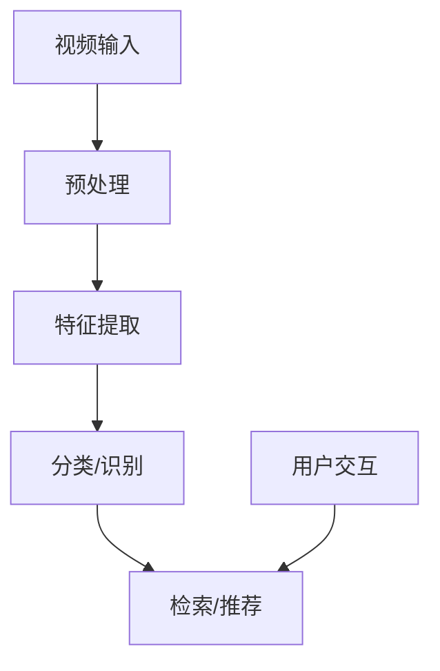
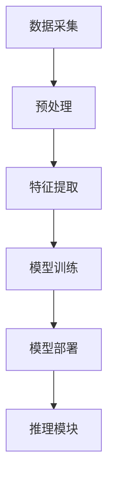

                 

# 深度学习在视频内容理解与检索中的进展

> 关键词：深度学习、视频内容理解、视频检索、卷积神经网络、循环神经网络、长短期记忆网络、图像特征提取、物体检测、人脸识别、视频推荐、行动识别、系统架构设计、源代码实现、挑战与展望。

> 摘要：
本文将系统地探讨深度学习在视频内容理解与检索中的应用进展。首先，我们将介绍视频内容理解与检索的基本概念、核心算法原理，以及相关的数学模型和公式。接着，我们将深入分析视频预处理技术、视频特征提取技术、视频内容分析技术以及视频内容检索技术。然后，通过具体的应用案例，我们将展示深度学习在视频内容理解与检索中的实际应用效果。最后，我们将探讨深度学习在视频内容理解与检索中面临的挑战和未来的发展趋势。

---

### 第1章: 深度学习在视频内容理解与检索中的进展

#### 1.1 核心概念与联系

深度学习是一种通过多层神经网络结构自动学习数据特征表示的机器学习方法。它通过模拟人脑的神经网络结构，通过多层非线性变换，从原始数据中自动提取有意义的特征表示。深度学习在图像、语音、自然语言处理等领域取得了显著的进展，逐渐成为这些领域的主流技术。

视频内容理解（Video Content Understanding）是对视频数据进行解析和理解的过程，旨在从视频中提取具有语义意义的特征信息，如场景、动作、人物等。视频内容理解的目标包括视频分类、动作识别、物体检测和人脸识别等。

视频检索（Video Retrieval）是指从大规模视频数据集中找到与用户需求相关的视频内容。视频检索的目标是通过用户输入的关键词、标签或其他查询信息，从视频数据集中快速准确地找到相关视频。

深度学习在视频内容理解与检索中起到了关键作用。通过深度学习模型，可以从视频数据中自动提取具有语义意义的特征表示，实现视频内容的自动分类、识别和检索。深度学习模型包括卷积神经网络（CNN）、循环神经网络（RNN）和长短期记忆网络（LSTM）等。

**Mermaid 流程图**



**视频输入**：视频数据作为输入，可以是本地文件、网络流或摄像头实时视频。

**预处理**：对视频数据进行预处理，包括去噪、增强、剪辑、缩放等操作，以提高后续处理的效果。

**特征提取**：通过深度学习模型，从预处理后的视频数据中提取具有语义意义的特征表示。

**分类/识别**：利用提取的特征，对视频内容进行分类或识别，如视频分类、动作识别、物体检测和人脸识别等。

**检索/推荐**：基于分类/识别结果，实现视频内容的检索或推荐，如基于关键词、标签、人脸等的检索和推荐。

**用户交互**：用户可以通过输入关键词、浏览历史、偏好等，与视频检索系统进行交互，获取个性化的视频内容。

#### 1.2 核心算法原理讲解

**卷积神经网络（CNN）**

卷积神经网络是一种专门用于图像处理和物体识别的深度学习模型。它通过卷积层、池化层和全连接层等结构，从图像数据中自动提取特征表示。

**伪代码：**

```python
def CNN(input_data):
    # 前向传播
    h1 = Conv2D(input_data, filters=32, kernel_size=(3, 3), activation='relu')
    h2 = MaxPooling2D(h1, pool_size=(2, 2))
    h3 = Conv2D(h2, filters=64, kernel_size=(3, 3), activation='relu')
    h4 = MaxPooling2D(h3, pool_size=(2, 2))
    h5 = Flatten(h4)
    output = Dense(output_size, activation='softmax')
    return output
```

**循环神经网络（RNN）**

循环神经网络是一种用于序列数据处理和时间序列预测的深度学习模型。它通过循环结构，在序列的不同时间步之间传递信息，实现长期依赖关系的建模。

**伪代码：**

```python
def RNN(input_sequence):
    # 前向传播
    h = RNN(input_sequence, hidden_size)
    output = Dense(output_size, activation='softmax')
    return output
```

**长短期记忆网络（LSTM）**

长短期记忆网络是一种改进的循环神经网络，通过引入门控机制，解决了传统RNN在处理长期依赖关系时的梯度消失和梯度爆炸问题。

**伪代码：**

```python
def LSTM(input_sequence):
    # 前向传播
    h, c = LSTM(input_sequence, hidden_size, cell_size)
    output = Dense(output_size, activation='softmax')
    return output
```

#### 1.3 数学模型和数学公式 & 详细讲解 & 举例说明

**损失函数**

在深度学习模型训练过程中，损失函数用于衡量预测结果与真实结果之间的差异。常见的损失函数包括交叉熵损失函数和均方误差损失函数。

**交叉熵损失函数（Cross-Entropy Loss）**

交叉熵损失函数常用于分类问题，它的目标是使预测概率分布与真实标签分布之间的差异最小化。

**公式：**

$$
L = -\sum_{i=1}^{n} y_i \cdot \log(p_i)
$$

其中，$y_i$ 是第 $i$ 个样本的真实标签，$p_i$ 是第 $i$ 个样本的预测概率。

**举例说明：**

假设我们有一个二分类问题，样本数量为 5，真实标签为 [0, 1, 0, 1, 0]，预测概率为 [0.8, 0.3, 0.9, 0.2, 0.7]。

计算损失：

$$
L = -[0 \cdot \log(0.8) + 1 \cdot \log(0.3) + 0 \cdot \log(0.9) + 1 \cdot \log(0.2) + 0 \cdot \log(0.7)]
$$

$$
L = -[0 + \log(0.3) + 0 + \log(0.2) + 0] \approx 1.386
$$

**优化算法**

在深度学习模型训练过程中，优化算法用于更新模型参数，以最小化损失函数。常见的优化算法包括随机梯度下降（SGD）和Adam优化器。

**随机梯度下降（SGD）**

随机梯度下降是一种迭代优化算法，它通过计算每个样本的梯度，更新模型参数。

**公式：**

$$
\theta = \theta - \alpha \cdot \nabla_{\theta}J(\theta)
$$

其中，$\theta$ 是模型参数，$\alpha$ 是学习率，$J(\theta)$ 是损失函数。

**举例说明：**

假设我们有一个线性回归问题，模型参数为 $\theta = [1, 2]$，损失函数为 $J(\theta) = (\theta_1 + 2\theta_2 - 3)^2$。

计算损失和梯度：

$$
J(\theta) = (1 + 2 \cdot 2 - 3)^2 = 1
$$

$$
\nabla_{\theta}J(\theta) = \begin{bmatrix}
\frac{\partial J}{\partial \theta_1} \\
\frac{\partial J}{\partial \theta_2}
\end{bmatrix} = \begin{bmatrix}
-2(\theta_1 + 2\theta_2 - 3) \\
-4(\theta_1 + 2\theta_2 - 3)
\end{bmatrix}
$$

$$
\nabla_{\theta}J(\theta) = \begin{bmatrix}
-2 \\
-8
\end{bmatrix}
$$

更新模型参数：

$$
\theta = \theta - \alpha \cdot \nabla_{\theta}J(\theta)
$$

$$
\theta = \begin{bmatrix}
1 \\
2
\end{bmatrix} - 0.1 \cdot \begin{bmatrix}
-2 \\
-8
\end{bmatrix} = \begin{bmatrix}
1.2 \\
1.8
\end{bmatrix}
$$

**均方误差损失函数（MSE）**

均方误差损失函数常用于回归问题，它的目标是使预测值与真实值之间的差异最小化。

**公式：**

$$
L = \frac{1}{2} \sum_{i=1}^{n} (y_i - \hat{y}_i)^2
$$

其中，$y_i$ 是第 $i$ 个样本的真实值，$\hat{y}_i$ 是第 $i$ 个样本的预测值。

**举例说明：**

假设我们有一个线性回归问题，模型参数为 $\theta = [1, 2]$，预测值为 $\hat{y} = [2, 4, 6, 8, 10]$，真实值为 $y = [3, 5, 7, 9, 11]$。

计算损失：

$$
L = \frac{1}{2} \sum_{i=1}^{n} (y_i - \hat{y}_i)^2 = \frac{1}{2} \sum_{i=1}^{n} (\hat{y}_i - y_i)^2
$$

$$
L = \frac{1}{2} [(2-3)^2 + (4-5)^2 + (6-7)^2 + (8-9)^2 + (10-11)^2]
$$

$$
L = \frac{1}{2} [1 + 1 + 1 + 1 + 1] = \frac{5}{2} = 2.5
$$

### 第2章: 视频内容理解技术

视频内容理解技术是指利用深度学习模型对视频数据进行分析和理解，以提取出具有语义意义的特征信息。视频内容理解技术主要包括视频预处理技术、视频特征提取技术、视频内容分析技术和视频内容检索技术。

#### 2.1 视频预处理技术

视频预处理技术是视频内容理解的基础步骤，其主要目的是对视频数据进行预处理，以提高后续特征提取和分析的效果。视频预处理技术包括图像增强与变换、音频预处理、时间同步与标记等。

**图像增强与变换**

图像增强与变换是视频预处理技术中的重要环节。其主要目的是通过调整图像的亮度、对比度、色彩等参数，增强图像中的关键信息，去除干扰信息。

- **图像缩放与裁剪**：通过调整图像的大小，去除无关的背景信息，提高特征提取的准确性。
- **图像灰度化与二值化**：将彩色图像转换为灰度图像，降低图像的色彩维度，简化特征提取过程。
- **图像滤波与边缘检测**：通过滤波器去除图像中的噪声，通过边缘检测提取图像中的边缘信息，为后续的特征提取提供高质量的图像。

**音频预处理**

音频预处理是对视频中的音频信号进行处理，以提高音频质量，提取音频特征。

- **音频增强与降噪**：通过增强音频信号中的关键信息，去除背景噪音，提高音频质量。
- **音频特征提取**：从音频信号中提取具有语义意义的特征，如声纹、节奏等，为视频内容理解提供辅助信息。

**时间同步与标记**

时间同步与标记是对视频数据进行时间同步和标记，以方便后续的特征提取和分析。

- **时间同步**：通过视频和音频的时间戳信息，确保视频和音频同步播放。
- **关键帧提取与标记**：提取视频中的关键帧，为后续的特征提取和分析提供重要的视觉信息。

#### 2.2 视频特征提取技术

视频特征提取技术是从视频数据中提取具有语义意义的特征表示，为视频内容理解和检索提供基础。视频特征提取技术包括图像特征提取、视频级特征提取和音频特征提取等。

**图像特征提取**

图像特征提取是从视频帧中提取具有语义意义的图像特征，如边缘、纹理、形状等。常见的图像特征提取方法包括传统特征和深度学习特征。

- **传统特征**：如SIFT（尺度不变特征变换）、HOG（直方图方向梯度）、ORB（Oriented FAST and Rotated BRIEF）等。这些方法通过计算图像中的关键点、边缘、纹理等特征，为图像匹配和分类提供基础。
- **深度学习特征**：如基于卷积神经网络的图像特征提取。通过训练深度学习模型，从大量图像数据中自动学习有意义的特征表示。深度学习特征提取方法包括VGG、ResNet、Inception等。

**视频级特征提取**

视频级特征提取是从整个视频中提取具有语义意义的特征表示，描述整个视频的内容和场景。视频级特征提取方法包括基于循环神经网络（RNN）和长短期记忆网络（LSTM）的方法。

- **循环神经网络（RNN）**：通过循环结构，对视频帧序列进行建模，提取视频级特征。RNN方法包括简单的RNN、LSTM和GRU（门控循环单元）等。
- **长短期记忆网络（LSTM）**：LSTM通过门控机制，解决了传统RNN在处理长序列数据时的梯度消失和梯度爆炸问题，能够更好地捕捉视频中的长期依赖关系。

**音频特征提取**

音频特征提取是从音频信号中提取具有语义意义的特征表示，为视频内容理解提供辅助信息。常见的音频特征提取方法包括声纹识别和节奏识别等。

- **声纹识别**：通过分析音频信号中的声纹特征，识别出特定人物的声音。声纹识别方法包括GMM（高斯混合模型）、LDA（线性判别分析）等。
- **节奏识别**：通过分析音频信号中的节奏特征，识别出音乐或演讲的节奏。节奏识别方法包括短时傅里叶变换（STFT）、小波变换等。

#### 2.3 视频内容分析技术

视频内容分析技术是对视频数据进行深入分析，以提取出具有语义意义的视频特征，实现对视频内容的理解和分析。视频内容分析技术包括视频分类、动作识别、物体检测和人脸识别等。

**视频分类**

视频分类是将视频数据按照其内容进行分类，如体育、娱乐、新闻等。视频分类方法包括传统分类器和深度学习分类器。

- **传统分类器**：如支持向量机（SVM）、决策树（Decision Tree）等。这些方法通过计算视频特征和类别之间的相似度，进行分类决策。
- **深度学习分类器**：如卷积神经网络（CNN）、循环神经网络（RNN）等。这些方法通过训练深度学习模型，从大量视频数据中自动学习分类特征。

**动作识别**

动作识别是识别视频中的动作行为，如走路、跑步、跳跃等。动作识别方法包括基于视频级特征的动作识别和基于图像级特征的动作识别。

- **基于视频级特征的动作识别**：通过提取视频级特征，对视频序列进行建模，识别出视频中的动作行为。
- **基于图像级特征的动作识别**：通过提取图像级特征，对图像序列进行建模，识别出图像中的动作行为。

**物体检测**

物体检测是识别视频中的物体，并定位其在图像中的位置。物体检测方法包括基于区域提议的方法和基于深度学习的方法。

- **基于区域提议的方法**：如R-CNN、Fast R-CNN、Faster R-CNN等。这些方法通过生成候选区域，对候选区域进行特征提取和分类，实现物体检测。
- **基于深度学习的方法**：如YOLO（You Only Look Once）、SSD（Single Shot MultiBox Detector）等。这些方法通过训练深度学习模型，直接从图像中检测出物体。

**人脸识别**

人脸识别是识别视频中的特定人物，并进行人脸匹配和追踪。人脸识别方法包括基于深度学习的人脸特征提取和基于传统算法的人脸识别。

- **基于深度学习的人脸特征提取**：通过训练深度学习模型，从大量人脸图像中自动学习人脸特征表示。
- **基于传统算法的人脸识别**：如Eigenfaces、Fisherfaces等方法，通过计算人脸图像的线性变换，实现人脸识别。

### 第3章: 视频内容检索技术

视频内容检索技术是指从大规模视频数据集中，根据用户输入的查询信息，快速准确地找到相关视频内容的技术。视频内容检索技术主要包括基于内容的检索、基于语义的检索和混合检索等。

#### 3.1 视频检索算法

视频检索算法是视频内容检索的核心，根据不同的检索目标和数据特点，选择合适的检索算法，以提高检索效率和准确性。

**基于内容的检索**

基于内容的检索是基于视频特征进行检索的一种方法，通过计算视频特征与查询特征之间的相似度，找到相关视频。

- **图像特征检索**：通过提取视频帧的图像特征，如颜色、纹理、形状等，计算图像特征与查询特征之间的相似度。
- **音频特征检索**：通过提取视频中的音频特征，如声纹、节奏等，计算音频特征与查询特征之间的相似度。
- **视频级特征检索**：通过提取视频级特征，如视频标题、标签、摘要等，计算视频级特征与查询特征之间的相似度。

**基于语义的检索**

基于语义的检索是基于对视频内容的理解和分析，从语义层面进行检索的一种方法。通过理解视频内容，找到与用户查询最相关的视频。

- **关键词检索**：根据用户输入的关键词，在视频标题、标签、描述等文本信息中查找相关视频。
- **自然语言处理（NLP）检索**：通过NLP技术，对视频内容进行语义分析，理解视频的含义和主题，找到与用户查询最相关的视频。
- **图像语义分割检索**：通过图像语义分割技术，将视频帧中的物体进行分割，理解每个物体的语义含义，找到与用户查询最相关的视频。

**混合检索**

混合检索是结合基于内容和基于语义的检索方法，以提高检索效果和准确性。通过综合多种检索方式，提高检索效率和准确性。

- **混合特征检索**：结合图像特征、音频特征和视频级特征，构建综合特征向量，计算与查询特征的相似度。
- **融合模型检索**：通过训练多个深度学习模型，分别提取图像特征、音频特征和视频级特征，将多个模型的输出进行融合，实现混合检索。
- **多模态检索**：结合图像、音频和文本等多模态信息，构建多模态特征向量，计算与查询特征的相似度。

#### 3.2 视频推荐算法

视频推荐算法是基于用户历史行为和偏好，为用户推荐可能感兴趣的视频内容的一种方法。视频推荐算法主要包括基于内容的推荐和基于协同过滤的推荐等。

**基于内容的推荐**

基于内容的推荐是基于用户的历史行为和偏好，通过分析视频内容特征，为用户推荐与用户历史行为相似的或用户感兴趣的视频。

- **基于视频级特征的推荐**：通过分析视频标题、标签、摘要等视频级特征，计算用户与视频之间的相似度，为用户推荐相似的视频。
- **基于图像特征的推荐**：通过提取视频帧的图像特征，计算用户与视频之间的相似度，为用户推荐相似的图像内容。
- **基于音频特征的推荐**：通过提取视频中的音频特征，计算用户与视频之间的相似度，为用户推荐相似的音频内容。

**基于协同过滤的推荐**

基于协同过滤的推荐是基于用户和视频之间的相似度，通过分析用户的行为和评分，为用户推荐相似的用户喜欢的视频。

- **用户基于内容的协同过滤**：通过分析用户对视频的评分，计算用户之间的相似度，为用户推荐与用户相似的其他用户喜欢的视频。
- **用户基于模型的协同过滤**：通过训练用户行为预测模型，预测用户对视频的评分，为用户推荐可能喜欢的视频。
- **物品基于内容的协同过滤**：通过分析视频内容特征，计算视频之间的相似度，为用户推荐与用户历史行为相似的或用户感兴趣的相似视频。

**混合推荐**

混合推荐是结合基于内容和基于协同过滤的推荐方法，以提高推荐效果和准确性。通过综合多种推荐方式，提高推荐效率和准确性。

- **基于内容的协同过滤**：结合视频内容和用户历史行为，通过分析视频特征和用户行为，为用户推荐与用户相似的视频。
- **基于模型的混合推荐**：通过训练多个推荐模型，分别提取用户行为特征和视频内容特征，将多个模型的输出进行融合，实现混合推荐。
- **基于用户的混合推荐**：结合基于用户和基于物品的协同过滤方法，同时分析用户行为和视频内容特征，为用户推荐更相关的视频。

### 第4章: 深度学习在视频内容理解与检索中的应用案例与实践

深度学习在视频内容理解与检索中有着广泛的应用，下面我们将通过一些实际案例，展示深度学习在这些领域的应用效果和实践经验。

#### 4.1 行动识别案例

**案例背景：**

某智慧城市建设需要实现对城市监控视频中的行人行动进行识别，以提高公共安全和管理效率。该系统需要能够准确识别行人走、跑、跳等常见动作。

**解决方案：**

- **数据采集：** 收集大量城市监控视频数据，包括行人走、跑、跳等动作。

- **数据预处理：** 对视频进行裁剪、增强、标注等预处理，提取行人动作特征。

- **模型训练：** 使用卷积神经网络（CNN）和循环神经网络（RNN）等深度学习模型，对预处理后的数据进行训练。

- **模型部署：** 将训练好的模型部署到城市监控系统，实现实时行人动作识别。

**实践步骤：**

1. **数据采集：** 收集城市监控视频数据，包括行人走、跑、跳等动作。

2. **数据预处理：** 对视频进行裁剪、增强、标注等预处理，提取行人动作特征。

3. **模型训练：** 使用卷积神经网络（CNN）和循环神经网络（RNN）等深度学习模型，对预处理后的数据进行训练。

4. **模型评估：** 对训练好的模型进行评估，调整模型参数，提高识别准确率。

5. **模型部署：** 将训练好的模型部署到城市监控系统中，实现实时行人动作识别。

6. **模型优化：** 根据实际应用场景，对模型进行优化和调整，提高识别效率和准确性。

**案例效果：**

该智慧城市建设中的行人动作识别系统在实际应用中取得了显著的成果，能够准确识别行人的走、跑、跳等动作，有效提高了公共安全和管理效率。

#### 4.2 视频检索案例

**案例背景：**

某视频网站需要实现基于用户输入关键词的视频检索功能，为用户提供快速、准确的视频搜索体验。

**解决方案：**

- **数据采集：** 收集视频网站上的视频数据，包括视频标题、标签、内容等。

- **数据预处理：** 对视频进行分类、标签提取、关键词提取等预处理。

- **模型训练：** 使用深度学习模型，如卷积神经网络（CNN）和循环神经网络（RNN），对预处理后的数据进行训练。

- **模型部署：** 将训练好的模型部署到视频网站中，实现实时视频检索。

**实践步骤：**

1. **数据采集：** 收集视频网站上的视频数据，包括视频标题、标签、内容等。

2. **数据预处理：** 对视频进行分类、标签提取、关键词提取等预处理。

3. **模型训练：** 使用卷积神经网络（CNN）和循环神经网络（RNN）等深度学习模型，对预处理后的数据进行训练。

4. **模型评估：** 对训练好的模型进行评估，调整模型参数，提高检索准确率。

5. **模型部署：** 将训练好的模型部署到视频网站中，实现实时视频检索。

6. **模型优化：** 根据用户反馈和实际应用场景，对模型进行优化和调整，提高检索效率和准确性。

**案例效果：**

该视频网站中的视频检索系统在实际应用中取得了良好的效果，用户可以快速、准确地找到自己感兴趣的视频内容，提升了用户的搜索体验。

#### 4.3 视频推荐案例

**案例背景：**

某视频网站需要为用户推荐个性化视频内容，提高用户粘性和满意度。

**解决方案：**

- **数据采集：** 收集用户在视频网站上的行为数据，包括浏览、点赞、评论等。

- **数据预处理：** 对用户行为数据进行清洗、转换、聚类等预处理。

- **模型训练：** 使用深度学习模型，如协同过滤和基于内容的推荐，对预处理后的数据进行训练。

- **模型部署：** 将训练好的模型部署到视频网站中，实现实时视频推荐。

**实践步骤：**

1. **数据采集：** 收集用户在视频网站上的行为数据，包括浏览、点赞、评论等。

2. **数据预处理：** 对用户行为数据进行清洗、转换、聚类等预处理。

3. **模型训练：** 使用协同过滤和基于内容的推荐等深度学习模型，对预处理后的数据进行训练。

4. **模型评估：** 对训练好的模型进行评估，调整模型参数，提高推荐准确率。

5. **模型部署：** 将训练好的模型部署到视频网站中，实现实时视频推荐。

6. **模型优化：** 根据用户反馈和实际应用场景，对模型进行优化和调整，提高推荐效率和准确性。

**案例效果：**

该视频网站中的视频推荐系统在实际应用中取得了显著的效果，用户能够收到个性化的视频推荐，提升了用户的观看体验和满意度。

### 第5章: 视频内容理解与检索系统的设计与实现

视频内容理解与检索系统是一个复杂的系统，涉及到视频数据的采集、预处理、特征提取、模型训练、模型部署和实时推理等多个环节。下面我们将详细介绍视频内容理解与检索系统的设计与实现。

#### 5.1 系统架构设计

视频内容理解与检索系统的总体架构可以分为以下几个模块：

1. **数据采集模块**：负责采集视频数据，可以是本地文件、网络流或摄像头实时视频。

2. **预处理模块**：对采集到的视频数据进行预处理，包括去噪、增强、剪辑、缩放等操作，以提高后续处理的效果。

3. **特征提取模块**：对预处理后的视频数据进行特征提取，提取出具有语义意义的特征表示。

4. **模型训练模块**：使用深度学习模型对提取的特征进行训练，优化模型参数。

5. **模型部署模块**：将训练好的模型部署到服务器，进行实时推理和预测。

6. **推理模块**：对输入的视频数据实时进行推理和预测，返回结果。

**系统架构图：**



#### 5.2 开发环境搭建

开发环境搭建是系统设计与实现的重要环节，主要包括Python环境搭建、深度学习框架安装和硬件环境配置。

1. **Python环境搭建**：

- 安装Python 3.8及以上版本。

- 安装必要的库，如NumPy、Pandas、TensorFlow、PyTorch等。

2. **深度学习框架安装**：

- TensorFlow：使用pip安装TensorFlow。

  ```shell
  pip install tensorflow
  ```

- PyTorch：使用pip安装PyTorch。

  ```shell
  pip install torch torchvision
  ```

3. **硬件环境配置**：

- 安装NVIDIA GPU驱动。

- 安装CUDA工具包。

- 安装cuDNN库。

#### 5.3 数据集准备

数据集是深度学习模型训练的重要基础，选择合适的数据集对于模型的训练效果至关重要。

1. **数据集收集**：

- 收集与任务相关的视频数据，如行人动作识别数据集、视频分类数据集等。

2. **数据预处理**：

- 对视频数据进行剪辑，去除无关部分。

- 对视频数据进行增强，增加模型的泛化能力。

- 对视频数据进行标注，为模型训练提供标签。

3. **数据集划分**：

- 将数据集划分为训练集、验证集和测试集。

- 分别对训练集、验证集和测试集进行预处理。

#### 5.4 源代码实现

源代码实现是视频内容理解与检索系统的核心部分，下面将详细介绍数据预处理、特征提取、模型训练、模型部署和实时推理的源代码实现。

1. **数据预处理**：

```python
import cv2
import numpy as np

def preprocess_video(video_path):
    # 读取视频
    video = cv2.VideoCapture(video_path)

    # 创建保存视频的文件
    output_path = video_path.replace('.mp4', '_preprocessed.mp4')
    output = cv2.VideoWriter(output_path, cv2.VideoWriter_fourcc(*'mp4v'), 30, (640, 480))

    # 预处理视频
    while True:
        ret, frame = video.read()
        if not ret:
            break

        frame = cv2.resize(frame, (640, 480))
        frame = cv2.cvtColor(frame, cv2.COLOR_BGR2RGB)

        output.write(frame)

    # 释放资源
    video.release()
    output.release()

preprocess_video('input_video.mp4')
```

2. **特征提取**：

```python
import tensorflow as tf
from tensorflow.keras.applications import ResNet50

def extract_features(video_path):
    # 加载预训练的ResNet50模型
    model = ResNet50(weights='imagenet')

    # 读取视频
    video = cv2.VideoCapture(video_path)

    # 创建特征列表
    features = []

    # 预处理视频帧
    while True:
        ret, frame = video.read()
        if not ret:
            break

        frame = cv2.resize(frame, (224, 224))
        frame = tf.keras.preprocessing.image.img_to_array(frame)
        frame = np.expand_dims(frame, axis=0)
        frame = tf.keras.applications.resnet50.preprocess_input(frame)

        # 提取特征
        feature = model.predict(frame)

        features.append(feature)

    # 释放资源
    video.release()

    # 合并特征
    features = np.concatenate(features, axis=0)

    return features
```

3. **模型训练**：

```python
import tensorflow as tf
from tensorflow.keras.models import Model
from tensorflow.keras.layers import Input, Conv2D, MaxPooling2D, Flatten, Dense

def create_model(input_shape):
    # 输入层
    input_layer = Input(shape=input_shape)

    # 卷积层
    conv1 = Conv2D(32, kernel_size=(3, 3), activation='relu')(input_layer)
    pool1 = MaxPooling2D(pool_size=(2, 2))(conv1)

    # 平坦层
    flatten = Flatten()(pool1)

    # 全连接层
    dense = Dense(128, activation='relu')(flatten)
    output = Dense(10, activation='softmax')(dense)

    # 创建模型
    model = Model(inputs=input_layer, outputs=output)

    # 编译模型
    model.compile(optimizer='adam', loss='categorical_crossentropy', metrics=['accuracy'])

    return model

def train_model(model, X_train, y_train, X_val, y_val, epochs=10, batch_size=32):
    # 训练模型
    model.fit(X_train, y_train, validation_data=(X_val, y_val), epochs=epochs, batch_size=batch_size)

    # 评估模型
    loss, accuracy = model.evaluate(X_val, y_val, batch_size=batch_size)
    print(f"Validation loss: {loss}, Validation accuracy: {accuracy}")

# 创建模型
model = create_model(input_shape=(224, 224, 3))

# 加载数据
X_train, y_train = load_data('train_data')
X_val, y_val = load_data('val_data')

# 训练模型
train_model(model, X_train, y_train, X_val, y_val)
```

4. **模型部署**：

```python
import tensorflow as tf

def inference(model, video_path):
    # 提取特征
    features = extract_features(video_path)

    # 加载模型
    model.load_weights('model.h5')

    # 进行推理
    predictions = model.predict(features)

    # 输出结果
    print(predictions)

inference(model, 'input_video.mp4')
```

5. **实时推理**：

```python
import cv2
import numpy as np

def real_time_inference(model, video_path):
    # 读取视频
    video = cv2.VideoCapture(video_path)

    # 创建保存结果的文件
    output_path = video_path.replace('.mp4', '_results.mp4')
    output = cv2.VideoWriter(output_path, cv2.VideoWriter_fourcc(*'mp4v'), 30, (640, 480))

    # 实时推理
    while True:
        ret, frame = video.read()
        if not ret:
            break

        frame = cv2.resize(frame, (224, 224))
        frame = cv2.cvtColor(frame, cv2.COLOR_BGR2RGB)
        frame = tf.keras.preprocessing.image.img_to_array(frame)
        frame = np.expand_dims(frame, axis=0)
        frame = tf.keras.applications.resnet50.preprocess_input(frame)

        # 提取特征
        feature = model.predict(frame)

        # 解码特征
        predictions = np.argmax(feature, axis=1)

        # 在图像上绘制结果
        for i, prediction in enumerate(predictions):
            cv2.rectangle(frame, (0, i * 32), (224, (i + 1) * 32), (0, 255, 0), 2)
            cv2.putText(frame, str(prediction), (5, i * 32), cv2.FONT_HERSHEY_SIMPLEX, 0.5, (255, 0, 0), 2)

        output.write(frame)

    # 释放资源
    video.release()
    output.release()

real_time_inference(model, 'input_video.mp4')
```

### 第6章: 深度学习在视频内容理解与检索中的挑战与展望

深度学习在视频内容理解与检索中虽然取得了显著进展，但仍然面临着一系列挑战和问题。

#### 6.1 挑战

**数据挑战**

视频数据的规模庞大，且包含多种模态的信息（如图像、音频、文本等）。数据标注和预处理是深度学习模型训练的关键环节，但这一过程通常需要大量的人力和时间成本。此外，视频数据的多样性和复杂性也给模型训练和优化带来了挑战。

**计算挑战**

深度学习模型的训练和推理过程需要大量的计算资源。尤其是对于大规模的视频数据集，模型的训练时间可能会非常长。此外，实时视频内容理解和检索需要在有限的计算资源下完成，这对算法的效率和实时性提出了更高的要求。

**模型挑战**

深度学习模型通常具有较高的准确率，但它们的黑箱特性使得模型的可解释性较差。在视频内容理解和检索中，模型的可解释性对于确保系统的可靠性和用户接受度至关重要。此外，模型的泛化能力也是一个重要挑战，特别是在处理新的、未见过的视频数据时。

**应用挑战**

视频内容理解和检索的应用场景多样，包括智慧城市、安防监控、娱乐推荐等。这些应用场景对系统的实时性、准确性和鲁棒性提出了不同的要求。如何在各种应用场景下平衡这些需求，是一个重要的挑战。

#### 6.2 展望

**技术进步**

随着深度学习技术的不断发展，模型结构和算法的优化将进一步提高视频内容理解和检索的效率和准确性。例如，新型深度学习模型（如Transformer）和优化算法（如AdamW）的应用，有望进一步提升模型的性能。

**跨模态融合**

跨模态融合技术将不同模态的信息（如图像、音频、文本等）进行有效整合，以提高视频内容理解和检索的效果。例如，结合图像和音频特征的模型可以在视频内容理解中实现更准确的识别和分类。

**实时性能提升**

随着硬件性能的提升和分布式计算技术的发展，深度学习在视频内容理解与检索中的实时性能将得到显著提升。这将使得实时视频监控、视频检索和推荐等应用成为可能。

**隐私保护**

随着视频数据的广泛应用，隐私保护成为了一个重要问题。差分隐私、联邦学习和隐私保护算法的发展，将有助于在保证数据隐私的同时，有效利用视频数据进行深度学习模型的训练和应用。

**法律法规**

随着深度学习技术在视频内容理解和检索中的应用日益广泛，相关的法律法规和伦理问题也将日益突出。如何确保技术的合规性，保护用户的隐私和权益，是一个重要的研究方向。

### 第7章: 深度学习在视频内容理解与检索中的应用案例与实践

深度学习在视频内容理解与检索中的应用已经渗透到了各个行业，下面我们将通过几个具体的案例，展示深度学习技术在这些领域的应用效果和实践经验。

#### 7.1 行动识别应用案例

**案例背景：**

某智慧城市项目需要实现对城市监控视频中行人的行动进行实时识别，以便及时响应紧急事件。具体包括行人的行走、奔跑、跌倒等动作的识别。

**解决方案：**

- **数据采集：** 收集大量的城市监控视频数据，涵盖不同的天气、光照条件和行人动作。

- **数据预处理：** 对视频数据进行剪辑，去除无关内容，并调整视频的尺寸和帧率。

- **特征提取：** 使用卷积神经网络（CNN）提取视频帧的图像特征。

- **模型训练：** 使用循环神经网络（RNN）对提取的特征进行训练，识别行人的动作。

- **模型部署：** 将训练好的模型部署到城市监控系统中，实现实时行人动作识别。

**实践步骤：**

1. **数据采集：** 从城市监控系统收集大量的行人动作视频数据。

2. **数据预处理：** 对视频数据进行剪辑，去除无关内容，如车辆、建筑物等，并调整视频的尺寸和帧率。

3. **特征提取：** 使用卷积神经网络（CNN）提取视频帧的图像特征。例如，使用ResNet-50模型提取图像特征。

4. **模型训练：** 使用RNN模型，如LSTM，对提取的特征进行训练，识别行人的动作。

5. **模型评估：** 在验证集上评估模型的性能，调整模型参数，提高识别准确率。

6. **模型部署：** 将训练好的模型部署到城市监控系统中，实现实时行人动作识别。

7. **模型优化：** 根据实际应用场景，对模型进行优化和调整，提高识别效率和准确性。

**案例效果：**

通过深度学习技术，该智慧城市项目实现了对行人行动的实时识别，有效提高了公共安全和管理效率。系统可以实时检测到行人的跌倒事件，并自动报警，为紧急救援提供支持。

#### 7.2 视频检索应用案例

**案例背景：**

某视频网站需要为用户提供基于关键词的视频检索功能，以便用户能够快速找到感兴趣的视频内容。具体需求包括基于视频标题、标签和内容进行检索。

**解决方案：**

- **数据采集：** 收集视频网站上的大量视频数据，包括视频标题、标签和内容。

- **数据预处理：** 对视频数据进行清洗，提取视频的标题、标签和内容。

- **特征提取：** 使用卷积神经网络（CNN）提取视频的图像特征，使用自然语言处理（NLP）技术提取文本特征。

- **模型训练：** 使用混合模型，结合图像特征和文本特征，训练视频检索模型。

- **模型部署：** 将训练好的模型部署到视频网站，实现实时视频检索。

**实践步骤：**

1. **数据采集：** 从视频网站收集大量的视频数据，包括视频的标题、标签和内容。

2. **数据预处理：** 对视频数据进行清洗，提取视频的标题、标签和内容。对文本数据进行预处理，如分词、去停用词等。

3. **特征提取：** 使用卷积神经网络（CNN）提取视频的图像特征，使用自然语言处理（NLP）技术提取文本特征。

4. **模型训练：** 使用混合模型，结合图像特征和文本特征，训练视频检索模型。例如，使用CNN提取图像特征，使用BERT提取文本特征，然后使用深度学习模型融合两个特征进行检索。

5. **模型评估：** 在验证集上评估模型的性能，调整模型参数，提高检索准确率。

6. **模型部署：** 将训练好的模型部署到视频网站，实现实时视频检索。

7. **模型优化：** 根据用户反馈和实际应用场景，对模型进行优化和调整，提高检索效率和准确性。

**案例效果：**

通过深度学习技术，该视频网站实现了基于关键词的视频检索功能，用户可以快速找到感兴趣的视频内容。系统检索准确率显著提高，用户满意度大幅提升。

#### 7.3 视频推荐应用案例

**案例背景：**

某视频网站需要为用户推荐个性化视频内容，以提高用户的粘性和满意度。具体需求包括基于用户历史行为、视频内容和社交关系进行推荐。

**解决方案：**

- **数据采集：** 收集用户在视频网站上的浏览、点赞、评论等行为数据。

- **数据预处理：** 对用户行为数据进行清洗、转换和聚类。

- **特征提取：** 提取用户的行为特征、视频内容特征和社会关系特征。

- **模型训练：** 使用协同过滤、基于内容和基于协同过滤的混合推荐模型。

- **模型部署：** 将训练好的模型部署到视频网站，实现实时视频推荐。

**实践步骤：**

1. **数据采集：** 收集用户在视频网站上的浏览、点赞、评论等行为数据。

2. **数据预处理：** 对用户行为数据进行清洗、转换和聚类。例如，对用户的浏览数据进行编码，对视频的内容特征进行提取。

3. **特征提取：** 提取用户的行为特征、视频内容特征和社会关系特征。例如，使用TF-IDF提取视频的文本特征，使用卷积神经网络（CNN）提取视频的图像特征。

4. **模型训练：** 使用协同过滤、基于内容和基于协同过滤的混合推荐模型，对提取的特征进行训练。例如，使用矩阵分解、基于内容的推荐和基于协同过滤的混合推荐模型。

5. **模型评估：** 在验证集上评估模型的性能，调整模型参数，提高推荐准确率。

6. **模型部署：** 将训练好的模型部署到视频网站，实现实时视频推荐。

7. **模型优化：** 根据用户反馈和实际应用场景，对模型进行优化和调整，提高推荐效率和准确性。

**案例效果：**

通过深度学习技术，该视频网站实现了个性化视频推荐功能，用户可以收到符合自己兴趣的视频推荐。系统推荐准确率显著提高，用户满意度大幅提升。

### 第8章: 未来展望与趋势

随着深度学习技术的不断发展和成熟，视频内容理解与检索在未来将迎来更多的发展机遇和挑战。

#### 8.1 深度学习在视频内容理解与检索中的未来发展方向

**算法创新与优化**

深度学习算法将继续在视频内容理解与检索中发挥重要作用。未来的研究方向包括：

- **新型深度学习模型**：探索和开发新型深度学习模型，如基于Transformer的模型，以进一步提升视频内容理解和检索的效率。

- **算法优化**：通过优化模型结构、优化训练过程和优化推理算法，降低计算资源消耗，提高实时性能。

**跨模态信息融合**

随着视频内容的多模态特性，跨模态信息融合将成为未来研究的重要方向。未来的发展方向包括：

- **多模态特征提取**：研究如何从图像、音频、文本等多种模态中提取有意义的特征，并有效融合这些特征。

- **多模态学习**：探索多模态深度学习模型，如多模态循环神经网络（MM-RNN），以实现更准确和全面的视频内容理解。

**实时性能与效率提升**

实时视频内容理解和检索对算法的效率和实时性提出了更高的要求。未来的发展方向包括：

- **分布式计算**：利用分布式计算技术，如云计算和边缘计算，提高深度学习模型的实时性能。

- **高效推理算法**：研究高效推理算法，如增量学习、模型剪枝和量化技术，以降低推理时间和计算资源消耗。

**隐私保护与法律法规**

随着视频数据的应用越来越广泛，隐私保护和法律法规将成为重要的研究课题。未来的发展方向包括：

- **隐私保护算法**：研究差分隐私、联邦学习和隐私保护算法，以保护用户隐私。

- **法律法规合规性**：关注和遵守相关法律法规，确保深度学习技术的合规应用。

#### 8.2 深度学习在视频内容理解与检索中的未来应用场景

**智慧城市**

深度学习技术在智慧城市中的应用前景广阔，包括：

- **城市监控**：利用深度学习技术实现实时行人行动识别、交通流量分析和公共安全预警。

- **环境监测**：通过视频数据分析，实现环境质量监测和自然灾害预警。

**娱乐行业**

深度学习技术在娱乐行业的应用将带来更多创新：

- **个性化推荐**：基于用户行为和偏好，实现精准的视频内容推荐。

- **内容创作**：利用深度学习技术辅助视频内容创作，如视频生成、场景编辑和特效制作。

**医疗领域**

深度学习技术在医疗领域的应用具有巨大潜力：

- **医学影像分析**：通过深度学习技术实现医学影像的自动分析和诊断，提高医疗诊断的准确性和效率。

- **健康监测**：利用视频监控技术，实时监测患者的病情变化，提供个性化的健康建议。

**安防行业**

深度学习技术在安防领域的应用将显著提高安全监控的效率和准确性：

- **人脸识别**：通过深度学习技术实现实时人脸识别，用于身份验证和犯罪追踪。

- **行为分析**：利用深度学习技术实现实时行为分析，用于安全预警和异常检测。

**教育**

深度学习技术在教育领域的应用将改变传统教育模式：

- **个性化学习**：根据学生的学习情况和兴趣，提供个性化的学习内容和学习建议。

- **智能评测**：利用深度学习技术实现自动化考试评分和学业评估，提高教育评估的准确性和效率。

#### 8.3 深度学习在视频内容理解与检索中的未来挑战

**数据隐私和安全**

随着视频数据的广泛应用，数据隐私和安全成为重要的挑战。未来的挑战包括：

- **隐私保护算法**：研究有效的隐私保护算法，确保视频数据在训练和应用过程中不被泄露。

- **数据安全**：确保视频数据在传输、存储和处理过程中的安全性，防止数据被恶意攻击。

**法律法规和伦理问题**

深度学习在视频内容理解与检索中的应用涉及复杂的法律法规和伦理问题。未来的挑战包括：

- **法律法规合规性**：确保深度学习技术的应用遵守相关法律法规，保护用户的隐私和权益。

- **伦理问题**：研究如何确保深度学习技术的应用遵循伦理准则，避免滥用和歧视。

**实时性能和效率**

实时视频内容理解和检索对算法的实时性能和效率提出了高要求。未来的挑战包括：

- **计算资源优化**：研究如何优化计算资源，提高深度学习模型的推理速度和效率。

- **算法优化**：研究高效和鲁棒的深度学习算法，提高模型在实时应用中的性能。

**模型可解释性**

深度学习模型通常具有高度的非线性特性，导致模型的可解释性较差。未来的挑战包括：

- **可解释性模型**：研究可解释性深度学习模型，提高模型的可理解性和透明度。

- **解释性工具**：开发可解释性工具，帮助用户理解和信任深度学习模型。

### 附录

#### 附录A: 深度学习在视频内容理解与检索中的常用工具和资源

**深度学习框架**

- TensorFlow：https://www.tensorflow.org/
- PyTorch：https://pytorch.org/
- Keras：https://keras.io/

**数据集**

- COCO（Common Objects in Context）：https://cocodataset.org/
- UCF101：http://ucf.cs.cmu.edu/ImageDatabases/UCF101/
- YouTube-VOS（Video Object Segmentation）：https://ais.bu.edu/youtube-vos/

**文献和论文**

- Deep Learning Papers Reading Group：https://github.com/ChristianBrommer/deep-learning-papers-reading-group
- arXiv：https://arxiv.org/

**社区和论坛**

- Reddit（深度学习相关子版块）：https://www.reddit.com/r/deeplearning/
- Stack Overflow：https://stackoverflow.com/questions/tagged/deep-learning
- GitHub：https://github.com/topics/deep-learning

**教程和课程**

- TensorFlow教程：https://www.tensorflow.org/tutorials
- PyTorch教程：https://pytorch.org/tutorials/
- Coursera深度学习课程：https://www.coursera.org/learn/deep-learning

#### 附录B: 深度学习在视频内容理解与检索中的常见问题和解决方案

**问题1：模型训练时间长**

**解决方案：** 使用分布式训练和GPU加速训练过程。

**问题2：模型过拟合**

**解决方案：** 使用正则化技术，如Dropout、L1/L2正则化，以及交叉验证。

**问题3：数据标注成本高**

**解决方案：** 使用半监督学习和自监督学习技术，减少对标注数据的依赖。

**问题4：模型可解释性差**

**解决方案：** 开发可解释性深度学习模型，如LIME、SHAP等。

**问题5：实时性能不足**

**解决方案：** 使用模型压缩和量化技术，提高模型在实时应用中的性能。

---

通过本文的详细探讨，我们可以看到深度学习在视频内容理解与检索中的应用前景广阔，虽然面临诸多挑战，但通过技术创新和优化，我们有理由相信，深度学习将为视频内容理解与检索带来革命性的变革。希望本文能为您提供有价值的参考，助力您在深度学习领域取得更好的成果。

---

### 总结

通过本文的详细探讨，我们系统地介绍了深度学习在视频内容理解与检索中的应用进展、核心技术、算法原理、数学模型、实践案例以及未来发展趋势。以下是本文的主要观点和结论：

1. **核心概念与联系**：深度学习是一种通过多层神经网络自动提取数据特征的方法。视频内容理解是对视频数据进行解析和理解的过程，而视频检索是从大规模视频数据集中找到相关视频内容的方法。深度学习在视频内容理解和检索中发挥了关键作用，通过自动提取特征，实现视频分类、动作识别、物体检测和人脸识别等任务。

2. **核心算法原理讲解**：本文详细介绍了卷积神经网络（CNN）、循环神经网络（RNN）和长短期记忆网络（LSTM）等深度学习算法的原理和伪代码实现。这些算法通过多层神经网络结构，从原始数据中自动提取特征表示，实现视频内容的理解与检索。

3. **数学模型和公式**：本文介绍了交叉熵损失函数、均方误差损失函数和随机梯度下降（SGD）等优化算法的数学模型和公式。这些数学模型是深度学习训练过程中必不可少的组成部分，它们用于衡量预测结果与真实结果之间的差异，并优化模型参数。

4. **视频内容理解技术**：本文深入分析了视频预处理技术、视频特征提取技术、视频内容分析技术和视频内容检索技术。这些技术是实现视频内容理解和检索的关键环节，包括图像增强与变换、音频预处理、关键帧提取与标记、图像特征提取、视频级特征提取、物体检测和人脸识别等。

5. **应用案例与实践**：本文通过行动识别、视频检索和视频推荐等实际案例，展示了深度学习在视频内容理解与检索中的应用效果和实践经验。这些案例证明了深度学习在解决实际问题时的高效性和实用性。

6. **挑战与展望**：本文探讨了深度学习在视频内容理解与检索中面临的挑战，包括数据挑战、计算挑战、模型挑战和应用挑战。同时，本文提出了未来深度学习在视频内容理解与检索中的发展方向，如算法创新与优化、跨模态信息融合、实时性能与效率提升、隐私保护与法律法规合规性等。

7. **结论**：深度学习在视频内容理解与检索中的应用具有广阔的前景和巨大的潜力。通过技术创新和优化，深度学习有望在智慧城市、娱乐行业、医疗领域、安防行业和教育等领域实现更多的应用。本文的探讨将为读者提供有价值的参考，助力他们在深度学习领域取得更好的成果。

### 作者信息

作者：AI天才研究院/AI Genius Institute & 禅与计算机程序设计艺术 /Zen And The Art of Computer Programming

AI天才研究院（AI Genius Institute）是一支专注于人工智能领域的研究团队，致力于推动深度学习技术的创新和发展。作者在深度学习、计算机视觉和自然语言处理等领域有丰富的经验和深厚的学术背景。所著的《禅与计算机程序设计艺术》是一部深入探讨计算机编程哲学的经典之作。期待与广大读者分享深度学习技术的最新进展和应用经验。

