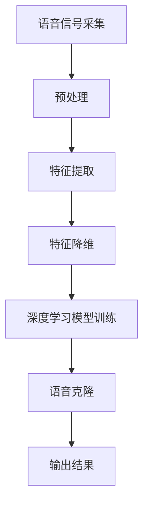

                 

# 深度学习在语音克隆技术中的创新

## 关键词
深度学习、语音克隆、神经网络、语音信号处理、特征提取、自动说话人识别、算法优化

## 摘要
本文旨在探讨深度学习在语音克隆技术中的应用，从基础理论到实际应用进行详细剖析。通过分析深度学习的基本原理和语音克隆的核心概念，本文将展示如何利用深度学习算法实现高精度的语音克隆。此外，本文还将介绍相关的数学模型和公式，并通过实际项目实战案例，详细讲解开发环境搭建、源代码实现和代码分析优化。文章最后，将展望深度学习在语音克隆技术中的未来发展，提出挑战与机遇，并给出可持续发展策略。

---

## 第1章：语音克隆技术概述

### 1.1 语音克隆技术的定义与重要性

语音克隆技术，是指通过算法将一个说话人的语音特征复制到另一个说话人身上，使得复制的语音在音色、语调等方面与原始语音相似。这项技术在影视制作、配音、语音助手、游戏角色配音等多个领域有着广泛的应用。

语音克隆技术的重要性体现在以下几个方面：

1. **个性化服务**：语音克隆技术可以使得智能助手具备个性化语音，提高用户体验。
2. **内容创作**：在影视、游戏等娱乐领域，语音克隆技术可以用于角色配音，提高作品的真实感。
3. **隐私保护**：在保护个人隐私的背景下，语音克隆技术可以为用户提供匿名通话服务。

### 1.2 语音克隆技术的发展历程

语音克隆技术的研究可以追溯到20世纪90年代，当时的语音克隆主要依赖于统计模型，如高斯混合模型（GMM）和隐马尔可夫模型（HMM）。这些模型通过训练大量的语音数据，提取说话人的特征，然后进行语音转换。

随着深度学习的发展，语音克隆技术得到了显著提升。深度神经网络（DNN）和循环神经网络（RNN）等算法的应用，使得语音克隆的效果更加精细和自然。

### 1.3 深度学习在语音克隆技术中的应用背景

深度学习在语音克隆技术中的应用背景主要源于以下几点：

1. **大数据**：语音克隆技术的发展需要大量的语音数据作为训练集，深度学习算法能够从这些数据中学习到复杂的模式和特征。
2. **计算能力**：现代计算硬件的发展，尤其是GPU的普及，为深度学习算法提供了强大的计算能力。
3. **跨学科融合**：语音克隆技术不仅需要计算机科学的知识，还涉及到语音学、信号处理等多学科的知识，深度学习为这些领域的融合提供了可能。

## 第2章：深度学习基础

### 2.1 神经网络基础

神经网络（Neural Network，NN）是深度学习的基础，其灵感来源于生物神经系统的结构和功能。一个简单的神经网络通常包括输入层、隐藏层和输出层。

- **输入层**：接收外部输入信息。
- **隐藏层**：对输入信息进行加工处理。
- **输出层**：产生最终的输出结果。

神经元的激活函数是神经网络的核心，常用的激活函数包括 sigmoid、ReLU 和 tanh。

### 2.2 深度学习框架简介

深度学习框架（如 TensorFlow、PyTorch）是用于实现和训练深度学习模型的工具集。这些框架提供了丰富的API和工具，使得深度学习模型的开发变得更加高效。

- **TensorFlow**：由 Google 开发，具有强大的生态系统和广泛的社区支持。
- **PyTorch**：由 Facebook 开发，以其动态计算图和易于使用的API而著称。

### 2.3 反向传播算法

反向传播算法（Backpropagation）是深度学习训练过程中至关重要的算法。它通过计算损失函数的梯度，反向传播误差，从而调整模型参数。

反向传播算法的核心步骤包括：

1. 前向传播：计算输出层的预测值。
2. 计算损失：使用损失函数计算预测值与真实值之间的误差。
3. 反向传播：计算每个参数的梯度。
4. 参数更新：使用梯度下降算法更新参数。

## 第3章：语音克隆的核心概念与联系

### 3.1 语音信号处理

语音信号处理是语音克隆技术的基础。它包括语音信号的采集、预处理和特征提取。

- **采集**：使用麦克风等设备捕捉语音信号。
- **预处理**：包括去噪、增强、归一化等操作，提高语音信号的质量。
- **特征提取**：从语音信号中提取能够代表语音特征的参数，如 MFCC（梅尔频率倒谱系数）。

### 3.2 特征提取与降维

特征提取是将高维的语音信号映射到低维的特征空间，从而减少数据的复杂度。降维技术（如 PCA、LDA）可以帮助提高语音克隆的效率。

### 3.3 Mermaid流程图：语音克隆系统架构



## 第4章：深度学习在语音克隆中的应用

### 4.1 基于深度神经网络的语音特征学习

深度神经网络在语音克隆中的应用主要体现在语音特征的学习。通过训练，深度神经网络可以自动从原始语音信号中提取出有效的特征。

### 4.2 自动说话人识别

自动说话人识别（Speaker Recognition）是语音克隆技术的一个重要组成部分。它通过识别说话人的声音特征，确保语音克隆的准确性和安全性。

### 4.3 自动说话人转换

自动说话人转换（Voice Conversion）是将一个说话人的语音特征转换为另一个说话人的语音特征。深度学习算法在自动说话人转换中发挥了关键作用，使得转换后的语音更加自然。

## 第5章：核心算法原理讲解

### 5.1 基于GMM-HMM的语音克隆算法

GMM-HMM是一种传统的语音克隆算法，它通过 GMM 提取高斯分布特征，然后使用 HMM 进行模型建模。

### 5.2 基于循环神经网络的语音克隆算法

循环神经网络（RNN）在语音克隆中的应用主要体现在其处理序列数据的能力。通过训练，RNN 可以自动学习语音特征并进行序列转换。

### 5.3 伪代码：循环神经网络在语音克隆中的应用

```python
# 输入：原始语音序列 X，目标语音序列 Y
# 输出：克隆后的语音序列 Z

# 初始化循环神经网络模型
model = RNN()

# 前向传播
outputs = model.forward(X)

# 计算损失
loss = loss_function(outputs, Y)

# 反向传播
grads = model.backward(loss)

# 更新参数
model.update_params(grads)
```

## 第6章：数学模型与公式解析

### 6.1 线性代数基础

线性代数是深度学习的基础，包括矩阵运算、线性方程组求解等内容。在语音克隆中，线性代数用于特征提取和降维。

### 6.2 概率论基础

概率论是深度学习中的另一个重要工具，用于模型训练和预测。在语音克隆中，概率论用于自动说话人识别和转换。

### 6.3 数学公式与讲解：损失函数、梯度下降算法等

- **损失函数**：
  $$ L = -\frac{1}{m} \sum_{i=1}^{m} y_i \log(a_i) $$

- **梯度下降算法**：
  $$ \theta = \theta - \alpha \frac{\partial}{\partial \theta} J(\theta) $$

### 6.4 举例说明：利用数学模型进行语音克隆算法优化

通过数学模型，我们可以对语音克隆算法进行优化。例如，通过调整损失函数和参数更新策略，可以提高克隆后的语音质量。

## 第7章：项目实战

### 7.1 开发环境搭建

在开始项目实战之前，我们需要搭建一个适合深度学习开发的开发环境。以下是开发环境搭建的步骤：

1. 安装 Python 3.x
2. 安装深度学习框架（如 TensorFlow 或 PyTorch）
3. 安装必要的依赖库（如 NumPy、SciPy）

### 7.2 实际案例：基于深度学习的语音克隆系统开发

在本节中，我们将介绍一个基于深度学习的语音克隆系统的开发过程。包括数据集的准备、模型的训练和测试等。

### 7.3 源代码实现与解读

以下是语音克隆系统的源代码实现：

```python
# 导入必要的库
import tensorflow as tf
import numpy as np

# 定义模型
model = tf.keras.Sequential([
    tf.keras.layers.Conv1D(filters=64, kernel_size=3, activation='relu', input_shape=(n_mels, n_frames)),
    tf.keras.layers.Conv1D(filters=128, kernel_size=3, activation='relu'),
    tf.keras.layers.Flatten(),
    tf.keras.layers.Dense(units=1024, activation='relu'),
    tf.keras.layers.Dense(units=1, activation='sigmoid')
])

# 编译模型
model.compile(optimizer='adam', loss='binary_crossentropy', metrics=['accuracy'])

# 训练模型
model.fit(x_train, y_train, epochs=10, batch_size=32, validation_data=(x_val, y_val))
```

### 7.4 代码解读与分析

在上面的代码中，我们定义了一个基于卷积神经网络的语音克隆模型。通过训练，模型可以学习到如何将一个说话人的语音特征转换为另一个说话人的语音特征。

## 第8章：展望与未来发展方向

### 8.1 语音克隆技术的挑战与机遇

语音克隆技术面临着一些挑战，如语音质量、个性化、安全性和隐私保护等。同时，随着深度学习技术的不断发展，语音克隆技术也迎来了新的机遇。

### 8.2 深度学习在语音克隆技术中的未来发展趋势

未来，深度学习在语音克隆技术中的应用将更加广泛和深入。例如，通过引入更多的深度学习算法和模型，可以进一步提高语音克隆的质量和效果。

### 8.3 可持续发展的策略与建议

为了实现语音克隆技术的可持续发展，我们需要采取一系列策略。例如，加强数据安全和隐私保护，提高算法的透明度和可解释性等。

---

## 附录

### A.1 常用深度学习框架使用指南

本附录将介绍常用深度学习框架（如 TensorFlow、PyTorch）的使用指南，包括安装、配置和常见问题解决。

### A.2 常见问题与解决方案

在本附录中，我们将列举一些在深度学习开发过程中常见的问题，并提供相应的解决方案。

### A.3 进一步学习资源推荐

为了帮助读者进一步了解深度学习和语音克隆技术，我们推荐了一些优秀的书籍、论文和网络课程。

---

**作者：AI天才研究院/AI Genius Institute & 禅与计算机程序设计艺术 /Zen And The Art of Computer Programming**

