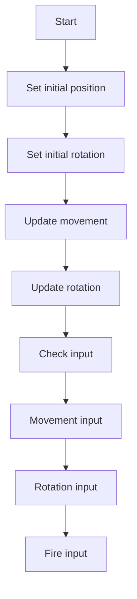

                 

### 引言

在当今快速发展的游戏行业中，选择合适的游戏开发框架对于游戏的成功至关重要。游戏开发框架不仅为开发者提供了高效、灵活的开发环境，而且能够决定游戏的性能、可扩展性和最终的用户体验。Unity和Unreal Engine作为两个最为流行的游戏开发框架，各自拥有独特的优势和特点，为开发者提供了丰富的选择。

Unity，自2005年发布以来，凭借其简单易用、跨平台支持和强大的社区支持，迅速成为独立游戏开发者和企业级开发者的首选。Unity以其出色的2D和3D游戏开发能力而闻名，广泛应用于教育、建筑可视化、虚拟现实等领域。

Unreal Engine，由Epic Games开发，自从2002年首次发布以来，以其强大的视觉效果、高性能和高度可定制的工具而成为游戏行业中的佼佼者。尤其是在大型游戏开发中，Unreal Engine以其逼真的物理引擎和图形渲染能力而备受赞誉。

本文将详细比较Unity和Unreal Engine，从历史背景、核心特性、游戏架构、性能对比、开发效率和工具对比等方面，帮助读者理解这两个框架的优劣，并为未来的游戏开发提供有价值的参考。

## 《游戏开发框架比较：Unity vs Unreal Engine》目录大纲

### 第一部分：引言

#### 1.1 游戏开发框架的重要性

#### 1.2 Unity与Unreal Engine的背景与发展

### 第二部分：框架详细解析

#### 2.1 Unity框架详细解析

##### 2.1.1 Unity的历史与发展

##### 2.1.2 Unity框架的核心特性

##### 2.1.3 Unity的游戏架构

#### 2.2 Unreal Engine框架详细解析

##### 2.2.1 Unreal Engine的历史与发展

##### 2.2.2 Unreal Engine的核心特性

##### 2.2.3 Unreal Engine的游戏架构

### 第三部分：框架比较

#### 3.1 核心技术对比

#### 3.2 游戏性能对比

#### 3.3 开发效率和工具对比

### 第四部分：实战与应用

#### 4.1 Unity项目实战

##### 4.1.1 Unity项目搭建

##### 4.1.2 关键技术实战

##### 4.1.3 项目调试与优化

#### 4.2 Unreal Engine项目实战

##### 4.2.1 Unreal Engine项目搭建

##### 4.2.2 关键技术实战

##### 4.2.3 项目调试与优化

### 第五部分：跨平台游戏开发

#### 5.1 Unity与Unreal Engine的跨平台支持

#### 5.2 跨平台游戏开发策略

#### 5.3 跨平台案例分析

### 第六部分：未来发展趋势与展望

#### 6.1 游戏开发框架的发展趋势

#### 6.2 Unity与Unreal Engine的未来发展

#### 6.3 开发者适应未来的策略

### 第七部分：附录

#### 7.1 Unity常用工具与资源

#### 7.2 Unreal Engine常用工具与资源

#### 7.3 参考文献

### 引言

在当今迅速发展的游戏行业中，选择一个合适的应用程序框架对于游戏项目的成功至关重要。应用程序框架不仅为开发者提供了高效的开发环境，还决定了游戏的性能、可扩展性和最终的用户体验。在这个领域，两个最流行的框架是Unity和Unreal Engine。本文将深入探讨这两个框架，以帮助读者更好地理解其特性、优势以及它们之间的差异。

Unity和Unreal Engine都有着悠久的历史和庞大的用户基础。Unity最初由Joel Reーラ姆和David Helgasson于2004年创立，以其易于上手和强大的跨平台能力迅速获得了游戏开发者的青睐。Unreal Engine则由Epic Games开发，以其出色的图形渲染能力和复杂的物理引擎而闻名于世。

Unity的核心优势在于其易于使用和跨平台支持，使其成为独立游戏开发者和小型团队的首选。而Unreal Engine则以其高级的图形处理能力和强大的工具集，成为大型游戏开发项目的首选。

接下来，本文将依次详细解析Unity和Unreal Engine的历史、核心特性、游戏架构，并对比它们的核心技术、性能和开发效率。此外，还将通过实际项目实战展示这两个框架的应用，并探讨跨平台游戏开发的策略和案例分析。最后，文章将总结未来的发展趋势，并给出开发者适应未来发展的策略。

### 第1章：游戏开发框架概述

#### 1.1 游戏开发框架的重要性

游戏开发框架在游戏开发过程中起着至关重要的作用。一个高效、灵活且功能丰富的开发框架能够显著提高开发效率、降低开发成本，并最终提升游戏的质量和用户体验。游戏开发框架提供了许多核心功能，包括图形渲染、物理引擎、音频处理、用户界面和资源管理等，这些功能使得开发者能够专注于游戏逻辑和创意的实现，而无需从零开始构建这些基础功能。

首先，游戏开发框架使得游戏开发流程更加模块化和规范化。开发者可以使用预定义的模块和组件，快速搭建游戏的基本框架，从而减少重复劳动，提高工作效率。框架提供的标准接口和工具集，使得开发者在编写代码时能够遵循统一的规范，降低代码的复杂度和维护成本。

其次，游戏开发框架提供了强大的资源管理功能。通过资源管理系统，开发者可以高效地管理游戏中的各种资源，如纹理、模型、音频和动画等。资源管理系统通常支持资源的预加载、缓存和卸载，从而优化内存使用，提高游戏运行效率。

此外，游戏开发框架还提供了丰富的图形渲染功能。现代游戏框架通常支持高级图形处理技术，如渲染管线、光照模型、阴影技术等，使得开发者能够创建出更加真实和精美的游戏场景。同时，图形渲染框架还支持多平台部署，使得游戏能够轻松地适配不同操作系统和硬件设备。

最后，游戏开发框架在性能优化方面也发挥着重要作用。框架通常提供了一系列性能分析和优化工具，帮助开发者识别和解决性能瓶颈，从而确保游戏在目标平台上能够达到最佳性能。

#### 1.2 Unity与Unreal Engine的背景与发展

Unity和Unreal Engine都是游戏开发领域中极具影响力的框架，它们各自有着独特的发展历程和核心优势。

**Unity的背景与发展**

Unity最初由Joel Reーラム和David Helgasson于2004年创立，其初衷是为了创建一个简单易用、跨平台的游戏开发工具。Unity 1.0版本于2005年发布，它以其直观的用户界面和强大的跨平台能力迅速获得了独立游戏开发者和小型开发团队的青睐。Unity的特点之一是其内置的Visual Scripting系统，使得开发者无需编写复杂的代码即可实现游戏逻辑，这对于那些缺乏编程经验的开发者来说是一个巨大的福音。

随着Unity的不断发展，其功能不断增强，支持了从2D到3D游戏开发，从虚拟现实到增强现实，从桌面游戏到移动游戏等各种类型的应用。Unity在2016年收购了知名游戏引擎Cocos2d-x的一部分，进一步增强了其跨平台能力。Unity的社区支持也非常强大，拥有大量的教程、文档和开源项目，这使得新手开发者能够快速上手。

**Unreal Engine的背景与发展**

Unreal Engine由Epic Games开发，最初版本于2002年发布。其开发初衷是为了创建一款能够制作高质量3D游戏引擎，并在其第一款大型游戏《战地1942》中进行了首次亮相。Unreal Engine以其强大的图形渲染能力和复杂的物理引擎而闻名，成为大型游戏开发项目的首选。

Unreal Engine 2版本于2003年发布，引入了动态光照和阴影等高级图形技术，进一步提升了游戏视觉效果。随着版本更新，Unreal Engine不断引入新的功能，如粒子系统、角色动画和语音合成等。到了Unreal Engine 4版本，其图形渲染能力和性能达到了前所未有的高度，支持了复杂的光照、阴影和后处理效果。

Unreal Engine还推出了Epic Online Services，提供了一系列云计算服务，包括游戏服务器托管、实时数据同步和用户身份验证等，这些服务极大地提升了大型多人游戏的开发和运营效率。

#### 1.3 Unity与Unreal Engine的核心特性对比

**Unity的核心特性**

1. **简单易用：** Unity拥有直观的用户界面和强大的Visual Scripting系统，使得开发者无需深入了解编程语言即可创建游戏逻辑。
2. **跨平台支持：** Unity支持多种平台，包括Windows、macOS、Linux、iOS、Android、Web等，使得游戏能够轻松部署到不同设备上。
3. **丰富的生态系统：** Unity拥有庞大的社区支持，包括大量的教程、文档、插件和开源项目，开发者可以从中获取丰富的资源和经验。
4. **低门槛：** Unity的入门门槛较低，适合独立游戏开发者和小型团队使用。

**Unreal Engine的核心特性**

1. **高级图形渲染：** Unreal Engine以其强大的图形渲染能力而著称，支持高级光照、阴影、后处理效果等，能够创建出高度逼真的游戏场景。
2. **高性能：** Unreal Engine在性能优化方面表现优秀，能够高效地处理复杂的场景和大量的对象。
3. **丰富的工具集：** Unreal Engine提供了丰富的开发工具，如关卡编辑器、动画编辑器、光照编辑器等，使得开发者能够高效地进行游戏设计。
4. **定制化能力：** Unreal Engine高度可定制，开发者可以修改和扩展引擎的源代码，以满足特定需求。

总的来说，Unity以其简单易用和强大的跨平台支持而著称，适合独立开发者和小型团队使用；而Unreal Engine则以其高级的图形渲染能力和强大的工具集而成为大型游戏开发项目的首选。接下来，我们将进一步详细解析Unity和Unreal Engine的具体特性，以便读者能够更深入地了解这两个框架。

### 第2章：Unity框架详细解析

#### 2.1 Unity的历史与发展

Unity自2005年首次发布以来，经历了多次重要版本更新，逐渐成为游戏开发领域的重要工具之一。Unity 1.0版本的发布标志着其初露锋芒，凭借其直观的用户界面和强大的跨平台能力，迅速获得了独立游戏开发者和小型开发团队的青睐。在Unity 2.0版本中，增加了更多的游戏开发功能，如3D角色动画和高级物理引擎，使得Unity能够支持更复杂的游戏项目。

Unity 3.0版本引入了Visual Scripting系统，允许开发者使用图形化的节点来创建游戏逻辑，这一功能大大降低了编程门槛，使得非程序员也能够参与到游戏开发中。Unity 4.0版本则进一步提升了其图形渲染能力，引入了基于Shader Model 5.0的渲染管线，支持了更高质量的视觉效果。

在Unity 5.0版本中，Unity收购了资产商店Asset Store，为开发者提供了一个平台，可以购买和分享各种资源，如模型、动画和音频等。这一举措极大地丰富了Unity的生态系统，为开发者提供了更多便利。Unity 2017版本引入了HDRP（High Definition Render Pipeline），这是一个全新的渲染管线，旨在提供更高质量和更高效的渲染效果。Unity 2020版本则进一步提升了其性能和工具集，增加了对虚幻引擎4（Unreal Engine 4）的支持，使得开发者能够更灵活地使用Unreal Engine的资产和功能。

Unity的发展历程充分体现了其持续创新和不断进步的精神，使其成为独立游戏开发者和小型团队的首选工具。

#### 2.2 Unity框架的核心特性

**1. 简单易用**

Unity以其直观的用户界面和强大的Visual Scripting系统而闻名，使得开发者无需深入了解编程语言即可创建游戏逻辑。Unity的编辑器提供了一种类似于乐高积木的编程方式，开发者可以通过拖放组件和脚本来构建游戏逻辑，这一特性尤其适合非程序员和新手开发者。

**2. 跨平台支持**

Unity支持多种平台，包括Windows、macOS、Linux、iOS、Android、Web等，这使得游戏能够轻松部署到不同设备上。Unity的跨平台能力是其显著优势之一，开发者可以一次开发，然后轻松地将游戏部署到多个平台上，从而节省时间和成本。

**3. 丰富的生态系统**

Unity拥有庞大的社区支持，包括大量的教程、文档、插件和开源项目。Unity的资产商店Asset Store为开发者提供了一个平台，可以购买和分享各种资源，如模型、动画、音频和游戏引擎插件等。这些资源极大地丰富了Unity的生态系统，为开发者提供了更多便利。

**4. 资源管理**

Unity提供了强大的资源管理功能，包括资源的预加载、缓存和卸载。资源管理系统使得开发者能够高效地管理游戏中的各种资源，如纹理、模型、音频和动画等，从而优化内存使用，提高游戏运行效率。

**5. 图形渲染**

Unity的图形渲染能力不断增强，从传统的渲染管线到HDRP（High Definition Render Pipeline），提供了多种渲染选项。HDRP支持更高质量的视觉效果和更高效的渲染，使得开发者能够创建出更加逼真的游戏场景。

**6. 物理引擎**

Unity内置了强大的物理引擎，支持多种物理模拟，如刚体动力学、碰撞检测和软体模拟等。物理引擎为游戏中的物体提供了真实感，使得游戏更具沉浸感。

**7. 动画系统**

Unity的动画系统支持多种动画类型，包括关键帧动画、蒙皮动画和混合动画等。动画系统能够高效地处理复杂的动画效果，使得游戏中的角色和物体动作更加流畅。

**8. 音频处理**

Unity提供了强大的音频处理功能，包括音效和背景音乐的混合、音量控制、音效的空间效果等。音频处理功能使得游戏中的声音效果更加真实，提升用户体验。

#### 2.3 Unity的游戏架构

Unity的游戏架构设计旨在提供模块化和灵活性的同时，确保高效性和可扩展性。以下是Unity游戏架构的几个关键组成部分：

**1. 资源管理**

资源管理是Unity游戏架构的核心部分。Unity使用AssetBundle来管理游戏资源，这些资源包括纹理、模型、音频、脚本等。资源管理系统提供了资源的预加载、缓存和卸载功能，从而优化内存使用和加载时间。

**2. 场景管理系统**

场景管理系统负责管理游戏中的场景，包括场景的创建、加载和卸载。Unity支持多种类型的场景，如主场景、过渡场景和动态场景等。场景管理系统确保了场景切换的流畅性和游戏性能。

**3. 组件化架构**

Unity采用了组件化架构，将游戏对象的功能划分为多个组件，如Transform（位置和旋转）、Rigidbody（刚体物理）、Collider（碰撞体）等。这种架构设计使得游戏对象更加模块化，便于管理和扩展。

**4. 渲染管线**

Unity提供了多种渲染管线，如传统的渲染管线、HDRP（High Definition Render Pipeline）和URP（Universal Render Pipeline）。渲染管线负责处理游戏中的图形渲染，包括光照、阴影、后处理效果等。Unity的渲染管线设计灵活，开发者可以根据项目需求选择合适的渲染方案。

**5. 输入系统**

Unity的输入系统负责处理用户输入，包括键盘、鼠标、触摸屏等。输入系统支持多种输入设备，使得游戏能够适应不同的操作环境。

**6. 音频系统**

Unity的音频系统负责处理游戏中的音效和背景音乐。音频系统支持3D音效处理，包括声音的方向性、距离效果和混响等，使得游戏中的声音效果更加真实。

**7. 脚本系统**

Unity使用C#作为脚本语言，开发者可以通过编写脚本来实现游戏逻辑。Unity的脚本系统提供了丰富的API，使得开发者能够方便地访问和操作游戏中的各种组件和系统。

通过这些组成部分，Unity提供了一个强大且灵活的游戏架构，使得开发者能够高效地创建各种类型的游戏，从简单的2D游戏到复杂的大型多人游戏。

### 第3章：Unreal Engine框架详细解析

#### 3.1 Unreal Engine的历史与发展

Unreal Engine由Epic Games开发，其起源可以追溯到1998年，当时Epic Games的创始人Tim Sweeney正在为他的第一款游戏《Unreal》开发一个强大的游戏引擎。最初，Unreal Engine主要面向大型第一人称射击游戏，并在2002年发布的《战地1942》中首次亮相。这一版本引入了许多革命性的图形和物理技术，如动态光照、软体模拟和高分辨率纹理，为游戏行业树立了新的标准。

随着版本的不断更新，Unreal Engine逐渐发展成为一款功能全面的游戏开发框架。Unreal Engine 2于2003年发布，引入了新的图形渲染技术和物理引擎，进一步提升了游戏的质量和性能。Unreal Engine 3于2008年发布，成为了大型游戏开发项目的标准工具之一，其逼真的物理引擎和图形渲染能力深受开发者喜爱。UE3被广泛应用于诸如《Gears of War》和《Mass Effect》等知名游戏。

Unreal Engine 4（UE4）于2014年发布，标志着引擎发展史上的一个重要里程碑。UE4采用了全新的渲染管线和编程模型，带来了前所未有的图形渲染质量和开发效率。UE4引入了蓝图（Blueprint）系统，这是一种可视化的编程工具，使得开发者无需编写复杂的代码即可实现游戏逻辑。此外，UE4还提供了丰富的开发工具和资源，如关卡编辑器、材质编辑器、动画编辑器等，极大地提升了开发效率。

UE4的发布受到了游戏开发者的热烈欢迎，并在短时间内成为大型游戏开发项目的首选工具。随着版本不断更新，UE4的性能和功能也在持续提升，如引入了Lumen实时光照系统、Nanite几何体细节系统等。此外，Epic Games还推出了Epic Online Services，提供了一系列云计算服务，包括游戏服务器托管、实时数据同步和用户身份验证等，这些服务进一步提升了大型多人游戏的开发和运营效率。

#### 3.2 Unreal Engine的核心特性

**1. 高级图形渲染**

Unreal Engine以其强大的图形渲染能力而著称，支持各种高级图形处理技术，如Lumen实时光照系统、Nanite几何体细节系统、基于光线追踪的阴影和反射等。Lumen系统特别引人注目，它能够实时计算环境光照，使得游戏场景的动态光照效果更加真实和自然。Nanite系统则允许开发者创建出超高细节的几何体，从而提升游戏场景的视觉质量。

**2. 高性能**

Unreal Engine在性能优化方面表现优秀，能够高效地处理复杂的场景和大量的对象。其先进的渲染管线和内存管理策略，使得开发者能够在保持高质量视觉效果的同时，确保游戏在目标平台上能够达到最佳性能。此外，Unreal Engine还支持并行处理和多线程技术，进一步提升了游戏运行的效率。

**3. 丰富的工具集**

Unreal Engine提供了丰富的开发工具和编辑器，如关卡编辑器、材质编辑器、动画编辑器、蓝图编辑器等。这些工具使得开发者能够高效地进行游戏设计和实现，无需依赖复杂的编程语言。关卡编辑器提供了一个直观的界面，开发者可以轻松地构建和编辑游戏场景。材质编辑器允许开发者创建和调整材质，以实现所需的视觉效果。动画编辑器则提供了强大的动画处理功能，使得角色和物体的动作更加流畅和自然。

**4. 蓝图系统**

Unreal Engine的蓝图系统是一种可视化的编程工具，使得开发者无需编写复杂的代码即可实现游戏逻辑。蓝图使用节点和连接线来表示逻辑关系，开发者可以通过拖放节点和连接线来构建游戏逻辑。这种编程方式不仅降低了编程门槛，还使得游戏逻辑更加直观和易于维护。蓝图系统还支持脚本编程，开发者可以使用C++等语言编写自定义逻辑，与蓝图系统无缝集成。

**5. 资源管理**

Unreal Engine提供了强大的资源管理功能，包括资源的预加载、缓存和卸载。资源管理系统使得开发者能够高效地管理游戏中的各种资源，如纹理、模型、音频和动画等。资源管理系统还支持资源的热更新，开发者可以在不重新启动游戏的情况下更新资源，从而提高开发效率。

**6. 跨平台支持**

Unreal Engine支持多种平台，包括Windows、macOS、Linux、iOS、Android、Web等，使得游戏能够轻松部署到不同设备上。Unreal Engine的跨平台能力使得开发者可以一次开发，然后轻松地将游戏部署到多个平台上，从而节省时间和成本。此外，Epic Games还推出了Epic Online Services，提供了一系列云计算服务，如游戏服务器托管、实时数据同步和用户身份验证等，这些服务进一步提升了大型多人游戏的开发和运营效率。

**7. 社区支持**

Unreal Engine拥有庞大的开发者社区，提供了大量的教程、文档、插件和开源项目。开发者可以从中获取丰富的资源和经验，快速提升开发技能。Epic Games还定期举办各种社区活动，如Unreal Dev Grants和Unreal Dev Showcases，为开发者提供资金和技术支持，推动游戏开发生态的繁荣。

通过这些核心特性，Unreal Engine成为了一个功能全面、高效且强大的游戏开发框架，适合各种类型的游戏开发项目，从简单的2D游戏到复杂的大型多人游戏。接下来，我们将进一步详细解析Unreal Engine的游戏架构，以便读者能够更深入地了解这一框架。

#### 3.3 Unreal Engine的游戏架构

Unreal Engine的游戏架构设计旨在提供模块化和灵活性，同时确保高效性和可扩展性。以下是Unreal Engine游戏架构的几个关键组成部分：

**1. 资源管理**

资源管理是Unreal Engine游戏架构的核心部分。资源管理系统负责管理游戏中的各种资源，如纹理、模型、音频、脚本等。资源管理系统提供了资源的预加载、缓存和卸载功能，从而优化内存使用和加载时间。资源管理系统还支持资源的热更新，使得开发者可以在不重新启动游戏的情况下更新资源。

**2. 场景管理系统**

场景管理系统负责管理游戏中的场景，包括场景的创建、加载和卸载。场景管理系统提供了多种类型的场景，如主场景、过渡场景和动态场景等。场景管理系统确保了场景切换的流畅性和游戏性能。

**3. 组件化架构**

Unreal Engine采用了组件化架构，将游戏对象的功能划分为多个组件，如Transform（位置和旋转）、Rigidbody（刚体物理）、Collider（碰撞体）等。组件化架构使得游戏对象更加模块化，便于管理和扩展。

**4. 渲染管线**

渲染管线是游戏架构中的关键部分，负责处理游戏中的图形渲染。Unreal Engine提供了多种渲染管线，如传统的渲染管线、基于光线追踪的渲染管线等。渲染管线负责处理光照、阴影、后处理效果等，以确保游戏场景的视觉效果。

**5. 音频系统**

音频系统负责处理游戏中的音效和背景音乐。音频系统支持3D音效处理，包括声音的方向性、距离效果和混响等，使得游戏中的声音效果更加真实。

**6. 输入系统**

输入系统负责处理用户输入，包括键盘、鼠标、触摸屏等。输入系统支持多种输入设备，使得游戏能够适应不同的操作环境。

**7. 蓝图系统**

蓝图系统是Unreal Engine的核心特性之一，它提供了可视化的编程工具，使得开发者无需编写复杂的代码即可实现游戏逻辑。蓝图使用节点和连接线来表示逻辑关系，开发者可以通过拖放节点和连接线来构建游戏逻辑。

**8. 脚本系统**

Unreal Engine使用C++和蓝图系统作为脚本语言，开发者可以通过编写脚本来实现游戏逻辑。蓝图系统与C++脚本无缝集成，使得开发者可以根据需要灵活地选择编程方式。

通过这些组成部分，Unreal Engine提供了一个强大且灵活的游戏架构，使得开发者能够高效地创建各种类型的游戏，从简单的2D游戏到复杂的大型多人游戏。接下来，我们将对比Unity和Unreal Engine在核心技术、性能和开发效率方面的差异，以帮助读者更全面地了解这两个框架。

### 第4章：Unity与Unreal Engine的比较

#### 4.1 核心技术对比

在核心技术方面，Unity和Unreal Engine各有优势，以下是两者的详细对比：

**1. 图形渲染能力**

Unity的图形渲染能力虽然在不断进步，但与Unreal Engine相比，仍然存在一定的差距。Unity采用了HDRP（High Definition Render Pipeline），这是一个较新的渲染管线，支持高质量的渲染效果，如基于物理的渲染和实时光照。然而，Unity的渲染管线相对于Unreal Engine的渲染管线来说，在细节处理和性能优化方面仍有提升空间。

Unreal Engine以其强大的图形渲染能力而闻名，支持多种高级渲染技术，如Lumen实时光照系统、Nanite几何体细节系统、基于光线追踪的阴影和反射等。这些技术使得Unreal Engine能够创建出高度逼真的游戏场景，尤其适合大型和复杂游戏项目的开发。

**2. 物理引擎**

Unity的物理引擎功能强大，支持多种物理模拟，如刚体动力学、碰撞检测和软体模拟等。物理引擎在游戏中的角色、物体和场景的交互中起到了关键作用，使得游戏具有真实的物理感。

Unreal Engine的物理引擎同样强大，尤其在处理复杂物理场景和高级物理效果方面具有显著优势。Unreal Engine的物理引擎被广泛应用于大型游戏和模拟项目，其物理效果的真实性和精确性得到了广泛认可。

**3. 脚本语言和开发方式**

Unity使用C#作为脚本语言，并提供了一个直观的Visual Scripting系统。Visual Scripting系统允许开发者使用图形化的节点来创建游戏逻辑，降低了编程门槛，适合非程序员和新手开发者使用。然而，对于那些需要深入控制游戏逻辑和性能的资深开发者来说，C#的编程效率可能不如C++。

Unreal Engine则同时支持C++和蓝图系统。C++是一种强大的编程语言，提供了高性能和灵活性的同时，使得开发者能够深入控制游戏引擎的各个方面。蓝图系统则是一种可视化的编程工具，使得开发者无需编写复杂的代码即可实现游戏逻辑，尤其适合那些缺乏编程经验的开发者。蓝图的节点和连接线设计使得游戏逻辑更加直观和易于维护。

**4. 资源管理和工具集**

Unity提供了强大的资源管理功能，包括资源的预加载、缓存和卸载。资源管理系统使得开发者能够高效地管理游戏中的各种资源，如纹理、模型、音频和动画等。此外，Unity的资产商店提供了大量的资源和插件，为开发者提供了丰富的资源支持。

Unreal Engine同样提供了强大的资源管理功能，包括资源的预加载、缓存和卸载。Unreal Engine的资源管理系统还支持资源的热更新，使得开发者可以在不重新启动游戏的情况下更新资源。此外，Unreal Engine提供了丰富的开发工具和编辑器，如关卡编辑器、材质编辑器、动画编辑器等，这些工具使得开发者能够高效地进行游戏设计和实现。

#### 4.2 游戏性能对比

在游戏性能方面，Unity和Unreal Engine也有明显的差异：

**1. 渲染性能**

Unity的渲染性能在不断发展，尤其是HDRP的引入，使得游戏场景的渲染效果更加逼真。然而，在复杂场景和高分辨率渲染方面，Unity的渲染性能仍与Unreal Engine存在差距。Unreal Engine的渲染管线设计更加高效，支持高级渲染技术，如光线追踪和实时阴影，能够在保持高质量视觉效果的同时，确保游戏在目标平台上能够达到最佳性能。

**2. 物理性能**

Unity的物理引擎在处理简单物理场景方面表现出色，能够高效地模拟刚体动力学和碰撞检测。然而，在处理复杂物理场景和高级物理效果方面，Unreal Engine的物理引擎具有显著优势。Unreal Engine的物理引擎能够更精确地模拟物体的运动和碰撞，使得游戏具有更高的真实感。

**3. 内存管理**

Unity的内存管理功能相对较为成熟，能够有效地管理游戏中的各种资源，减少内存泄漏和占用。然而，在处理大量资源和复杂场景时，Unity的内存管理可能不如Unreal Engine高效。

Unreal Engine的内存管理功能非常强大，能够高效地管理游戏中的各种资源，包括纹理、模型、音频和动画等。此外，Unreal Engine的内存管理系统还支持资源的热更新，使得开发者可以在不重新启动游戏的情况下更新资源，从而提高开发效率。

#### 4.3 开发效率和工具对比

在开发效率和工具方面，Unity和Unreal Engine各有优势：

**1. 开发效率**

Unity以其简单易用和强大的跨平台支持而著称。开发者可以使用Visual Scripting系统快速构建游戏逻辑，无需深入了解编程语言。Unity的跨平台能力使得开发者可以一次开发，然后轻松地将游戏部署到多个平台上，从而节省时间和成本。

Unreal Engine提供了丰富的开发工具和编辑器，如关卡编辑器、材质编辑器、动画编辑器等。这些工具使得开发者能够高效地进行游戏设计和实现。此外，Unreal Engine的蓝图系统降低了编程门槛，使得非程序员也能够参与到游戏开发中。

**2. 工具集**

Unity拥有庞大的社区支持，提供了大量的教程、文档和插件。开发者可以从中获取丰富的资源和经验，快速提升开发技能。Unity的资产商店提供了大量的资源和插件，为开发者提供了丰富的选择，从而提高了开发效率。

Unreal Engine同样拥有庞大的开发者社区，提供了大量的教程、文档和开源项目。开发者可以从中获取丰富的资源和经验，快速提升开发技能。此外，Unreal Engine的Epic Online Services提供了一系列云计算服务，如游戏服务器托管、实时数据同步和用户身份验证等，这些服务进一步提升了大型多人游戏的开发和运营效率。

总的来说，Unity以其简单易用和强大的跨平台支持而著称，适合独立开发者和小型团队使用；而Unreal Engine则以其高级的图形渲染能力和强大的工具集而成为大型游戏开发项目的首选。接下来，我们将通过实际项目实战，进一步展示这两个框架的应用和优势。

### 第5章：Unity项目实战

在Unity框架的实战部分，我们将通过一个简单的2D平台游戏项目来展示Unity的开发流程、关键技术和项目优化。本节将详细讲解项目搭建、关键技术实战和项目调试与优化，帮助读者深入理解Unity的实际应用。

#### 5.1 Unity项目搭建

**1. 开发环境准备**

首先，我们需要准备好Unity的开发环境。Unity的官方下载地址为：[Unity下载地址](https://unity.com/unity-downloads)，读者可以根据自己的操作系统选择对应的版本进行下载和安装。安装完成后，启动Unity编辑器，并创建一个新的2D项目。

**2. 项目设置**

在创建项目后，进行一些基本的设置。在Project面板中，创建一个名为“Game”的文件夹，用于存放游戏资源。然后，将背景图像、角色图像和声音文件拖放到“Game”文件夹中。

**3. 主场景搭建**

在Unity编辑器中，创建一个新的场景（Scene），命名为“Main Scene”。然后，将背景图像拖放到场景中，作为游戏场景的背景。接着，将角色图像拖放到场景中，并调整其位置和大小，使其符合游戏需求。

#### 5.2 关键技术实战

**1. 角色控制**

角色控制是2D平台游戏的核心功能之一。在Unity中，我们可以通过编写C#脚本来实现角色的移动、跳跃和碰撞检测。

（伪代码）

```csharp
using UnityEngine;

public class PlayerController : MonoBehaviour
{
    public float moveSpeed = 5.0f;
    public float jumpForce = 7.0f;
    private bool isGrounded;
    private Transform groundCheck;
    private float groundDistance = 0.1f;
    
    void Start()
    {
        groundCheck = transform.Find("GroundCheck");
    }
    
    void Update()
    {
        Move();
        Jump();
        CheckGround();
    }
    
    void Move()
    {
        float moveHorizontal = Input.GetAxis("Horizontal");
        float moveVertical = Input.GetAxis("Vertical");
        transform.position += new Vector3(moveHorizontal * moveSpeed * Time.deltaTime, moveVertical * moveSpeed * Time.deltaTime, 0);
    }
    
    void Jump()
    {
        if (isGrounded && Input.GetButtonDown("Jump"))
        {
            isGrounded = false;
            rigidbody2D.AddForce(new Vector2(0, jumpForce));
        }
    }
    
    void CheckGround()
    {
        isGrounded = Physics2D.OverlapCircle(groundCheck.position, groundDistance, 1 << LayerMask.NameToLayer("Ground"));
    }
}
```

**2. 碰撞检测**

在游戏中，碰撞检测是一个重要的功能。通过检测角色与其他物体的碰撞，我们可以实现游戏中的各种交互，如障碍物检测、敌人碰撞等。

（伪代码）

```csharp
using UnityEngine;

public class ObstacleController : MonoBehaviour
{
    public Transform player;
    public float detectionRadius = 1.0f;
    
    void Update()
    {
        CheckCollision();
    }
    
    void CheckCollision()
    {
        Collider2D[] collisions = Physics2D.OverlapCircleAll(player.position, detectionRadius);
        foreach (Collider2D collision in collisions)
        {
            if (collision.CompareTag("Player"))
            {
                Debug.Log("Player is colliding with an obstacle!");
                // 实现碰撞逻辑，如游戏结束、角色受伤等
            }
        }
    }
}
```

**3. 音效处理**

游戏中的音效对于提升用户体验至关重要。在Unity中，我们可以通过AudioSource组件来播放音效。

（伪代码）

```csharp
using UnityEngine;

public class SoundManager : MonoBehaviour
{
    public AudioSource jumpSound;
    public AudioSource hitSound;
    
    void Start()
    {
        jumpSound = GetComponent<AudioSource>();
        hitSound = GetComponent<AudioSource>();
    }
    
    void Update()
    {
        if (Input.GetButtonDown("Jump"))
        {
            jumpSound.Play();
        }
        
        if (Input.GetKeyDown(KeyCode.Space))
        {
            hitSound.Play();
        }
    }
}
```

#### 5.3 项目调试与优化

**1. 调试**

在Unity编辑器中，我们可以通过Debug工具和日志输出功能来调试游戏。例如，通过Debug.Log语句输出关键信息，帮助我们定位和解决编程问题。

**2. 优化**

优化是游戏开发中的重要环节。在Unity中，我们可以通过以下方法来优化游戏：

- **资源管理**：合理使用资源，避免重复加载和频繁切换场景。
- **渲染优化**：减少不必要的渲染对象，优化渲染管线，降低渲染开销。
- **物理优化**：合理设置刚体和碰撞体，减少计算量，提高物理引擎的效率。
- **代码优化**：优化脚本性能，减少不必要的计算和循环。

通过以上实战部分，我们了解了Unity项目的搭建流程、关键技术实战以及项目调试与优化。Unity以其简单易用和强大的跨平台支持而著称，适合独立开发者和小型团队使用。接下来，我们将通过Unreal Engine项目实战，展示Unreal Engine的实际应用。

### 第6章：Unreal Engine项目实战

在本章中，我们将通过一个简单的3D射击游戏项目来展示Unreal Engine的开发流程、关键技术和项目优化。本节将详细讲解项目搭建、关键技术实战和项目调试与优化，帮助读者深入理解Unreal Engine的实际应用。

#### 6.1 Unreal Engine项目搭建

**1. 开发环境准备**

首先，我们需要准备好Unreal Engine的开发环境。Unreal Engine的官方下载地址为：[Unreal Engine下载地址](https://www.unrealengine.com/zh-CN/download)，读者可以根据自己的操作系统选择对应的版本进行下载和安装。安装完成后，启动Unreal Engine编辑器，并创建一个新的3D项目。

**2. 项目设置**

在创建项目后，进行一些基本的设置。在内容浏览器（Content Browser）中，创建一个名为“Game”的文件夹，用于存放游戏资源。然后，将角色模型、枪模型、场景背景和声音文件拖放到“Game”文件夹中。

**3. 主场景搭建**

在Unreal Engine编辑器中，创建一个新的场景（Scene），命名为“Main Scene”。然后，将场景背景拖放到场景中，作为游戏场景的背景。接着，将角色模型和枪模型拖放到场景中，并调整它们的位置和大小，使其符合游戏需求。

#### 6.2 关键技术实战

**1. 角色控制**

角色控制是3D射击游戏的核心功能之一。在Unreal Engine中，我们可以通过编写蓝图来实现角色的移动、旋转和射击。

（蓝图）



**2. 射击系统**

射击系统是3D射击游戏的重要组成部分。在Unreal Engine中，我们可以通过蓝图和C++来实现射击功能。

（伪代码）

```cpp
// 蓝图节点
Function Node_Vector3 MoveVector(Vector3 Location, float Speed)
{
    return Location + Speed * GetWorldVectorFromDirection(Engine转向);
}

Function Node_Vector3 RotateVector(Vector3 Vector, float Angle)
{
    return RotateVectorByQuaternion(Vector, Engine转向 * Engine右向量 * Angle);
}

Function Node_Vector3 CalculateImpact(Vector3 Start, Vector3 Direction, float Range)
{
    float Distance = Range;
    for (int i = 0; i < 10; i++)
    {
        if (Distance <= 0)
        {
            break;
        }
        
        Start = MoveVector(Start, -Direction);
        Distance = Distance - 10;
    }
    
    return Start;
}

// C++代码
UUserSettings* UserSettings = Cast<UUserSettings>(GEngine->GetGameUserSettings());
if (bFire && UserSettings->bAimWithMouse)
{
    FVector Start = GetActorLocation();
    FVector End = Start + (GetActorForwardVector() * 10000);
    FVector Impact = CalculateImpact(Start, GetActorForwardVector(), 10000);

    DrawDebugLine(GetWorld(), Start, Impact, FColor::Red, 10.0f);
}
```

**3. 音效处理**

游戏中的音效对于提升用户体验至关重要。在Unreal Engine中，我们可以通过AudioComponent组件来播放音效。

（伪代码）

```cpp
UAudioComponent* SoundComponent = FindComponentByClass<UAudioComponent>();
if (SoundComponent)
{
    if (bJump)
    {
        SoundComponent->Play(JumpSound);
    }
    
    if (bHit)
    {
        SoundComponent->Play(HitSound);
    }
}
```

#### 6.3 项目调试与优化

**1. 调试**

在Unreal Engine编辑器中，我们可以通过视图导航、调试器和日志输出功能来调试游戏。例如，使用视图导航来检查角色的移动和射击是否正常工作，使用调试器来检查变量值和函数调用，使用日志输出来记录错误和警告。

**2. 优化**

优化是游戏开发中的重要环节。在Unreal Engine中，我们可以通过以下方法来优化游戏：

- **资源管理**：合理使用资源，避免重复加载和频繁切换场景。
- **渲染优化**：减少不必要的渲染对象，优化渲染管线，降低渲染开销。
- **物理优化**：合理设置刚体和碰撞体，减少计算量，提高物理引擎的效率。
- **代码优化**：优化蓝图和C++代码，减少不必要的计算和循环。

通过以上实战部分，我们了解了Unreal Engine项目的搭建流程、关键技术实战以及项目调试与优化。Unreal Engine以其高级的图形渲染能力和强大的工具集而著称，适合大型游戏开发项目的开发。接下来，我们将探讨Unity与Unreal Engine在跨平台游戏开发中的应用。

### 第7章：跨平台游戏开发

在当今的移动设备和PC市场上，跨平台游戏开发变得越来越重要。Unity和Unreal Engine都提供了强大的跨平台支持，使得开发者能够轻松地将游戏部署到多种不同的设备上。本章节将详细介绍Unity与Unreal Engine的跨平台支持、跨平台游戏开发策略以及实际案例分析。

#### 7.1 Unity与Unreal Engine的跨平台支持

**Unity的跨平台支持**

Unity以其强大的跨平台支持而闻名，支持多种操作系统和设备。以下是Unity支持的平台：

- **桌面平台**：Windows、macOS、Linux
- **移动平台**：iOS、Android
- **Web**：WebGL
- **虚拟现实**：VRChat、Oculus、HTC Vive、Windows Mixed Reality
- **增强现实**：ARKit、ARCore

Unity的跨平台支持主要体现在以下几个方面：

1. **统一的开发环境**：Unity提供了一个统一的开发环境，开发者可以在同一环境中开发、测试和部署游戏到不同平台。
2. **资源管理**：Unity提供了强大的资源管理系统，可以高效地管理跨平台资源，如纹理、模型、音频和脚本等。
3. **脚本兼容性**：Unity使用C#作为脚本语言，C#是一种跨平台语言，开发者编写的C#代码可以无需修改地在不同平台上运行。

**Unreal Engine的跨平台支持**

Unreal Engine同样提供了强大的跨平台支持，支持以下平台：

- **桌面平台**：Windows、macOS、Linux
- **移动平台**：iOS、Android、Tizen
- **Web**：WebGL
- **虚拟现实**：Oculus、HTC Vive、Windows Mixed Reality、Quest、Rift、PSVR
- **增强现实**：ARKit、ARCore

Unreal Engine的跨平台支持主要体现在以下几个方面：

1. **高度可定制**：Unreal Engine提供了高度可定制的平台接口，开发者可以根据特定需求修改和扩展引擎的源代码。
2. **性能优化**：Unreal Engine对各种平台进行了深度优化，确保游戏在不同平台上都能达到最佳性能。
3. **云服务**：Epic Games推出的Epic Online Services提供了跨平台云服务，包括游戏服务器托管、实时数据同步和用户身份验证等，这些服务进一步提升了大型多人游戏的开发和运营效率。

#### 7.2 跨平台游戏开发策略

**1. 统一开发流程**

跨平台游戏开发的关键在于保持开发流程的一致性。开发者应该使用相同的工具、框架和开发流程，以确保在各个平台上都能高效地开发游戏。例如，使用Unity的HDRP渲染管线，可以在多个平台上实现高质量的画面效果。

**2. 资源管理**

在跨平台游戏开发中，资源管理是一个重要的环节。开发者需要确保不同平台的资源能够高效地加载和缓存，避免资源浪费和加载延迟。Unity和Unreal Engine都提供了强大的资源管理工具，可以帮助开发者优化资源的使用。

**3. 性能优化**

性能优化是跨平台游戏开发的关键。开发者需要针对不同的平台进行性能测试和优化，确保游戏在各个平台上都能达到最佳性能。Unity和Unreal Engine都提供了丰富的性能优化工具和技巧，如渲染优化、物理引擎优化和内存管理优化等。

**4. 用户体验一致性**

跨平台游戏开发的目标是提供一致的用户体验。开发者需要确保游戏的用户界面、操作逻辑和视觉效果在不同平台上都能保持一致，避免因平台差异导致用户体验不佳。

#### 7.3 跨平台案例分析

**1. Unity案例：《Among Us》**

《Among Us》是由InnerSloth开发的多人社交推理游戏，在移动平台和PC上取得了巨大成功。Unity为开发者提供了强大的跨平台支持，使得《Among Us》能够在多个平台上运行，吸引了大量的玩家。

**2. Unreal Engine案例：《堡垒之夜》**

《堡垒之夜》是由Epic Games开发的多人在线战斗游戏，以其逼真的图形和流畅的操作而闻名。Unreal Engine提供了强大的跨平台支持，使得《堡垒之夜》能够在PC、主机和移动设备上运行，吸引了全球数亿玩家。

通过以上案例分析，我们可以看到Unity和Unreal Engine在跨平台游戏开发中都有着出色的表现。开发者可以根据自己的项目需求和开发经验，选择合适的框架来实现跨平台游戏开发。

### 第8章：未来发展趋势与展望

在快速发展的游戏行业中，游戏开发框架的技术也在不断进步和创新。Unity和Unreal Engine作为两个最为流行的游戏开发框架，各自展现出了不同的未来发展趋势和潜力。本文将探讨游戏开发框架的未来发展趋势，以及Unity和Unreal Engine在未来的发展，并提出开发者适应未来发展的策略。

#### 8.1 游戏开发框架的未来发展趋势

**1. 高性能与图形渲染技术的进步**

随着硬件性能的提升，游戏开发框架将进一步推动图形渲染技术的进步。未来的游戏开发框架将更加强调实时渲染技术，如光线追踪、实时阴影和高动态范围渲染（HDR）。这些技术将带来更加逼真的游戏场景和更加丰富的视觉体验。

**2. 跨平台游戏开发的普及**

随着移动设备的普及和互联网技术的发展，跨平台游戏开发将成为主流。未来的游戏开发框架将更加注重跨平台的性能和兼容性，为开发者提供统一的开发环境和高效的跨平台部署工具。

**3. AI技术在游戏开发中的应用**

人工智能（AI）技术在游戏开发中的应用越来越广泛。未来，游戏开发框架将更加集成AI功能，如游戏AI、实时内容生成和游戏推荐等。AI技术将提升游戏的可玩性和互动性，为玩家提供更加个性化的游戏体验。

**4. 云游戏与云计算服务的普及**

云游戏和云计算服务的普及将改变游戏开发和运营的模式。未来的游戏开发框架将更加集成云计算服务，提供游戏服务器托管、实时数据同步和用户身份验证等云服务，降低开发者的运营成本，提升游戏的可用性和可扩展性。

#### 8.2 Unity与Unreal Engine的未来发展

**Unity的未来发展**

Unity在未来的发展中将继续强化其跨平台能力和图形渲染技术。Unity可能会进一步加强与硬件制造商的合作，推出更高效的渲染引擎和图形API，以满足高性能游戏开发的需求。此外，Unity可能会进一步整合AI技术和云计算服务，提供更加智能和高效的开发工具。

**Unreal Engine的未来发展**

Unreal Engine在未来的发展中将继续提升其图形渲染能力和开发工具集。Epic Games可能会引入更多的实时渲染技术和AI功能，以提升游戏质量和开发效率。同时，Unreal Engine可能会进一步拓展其云服务，提供更全面的游戏开发和运营解决方案。

#### 8.3 开发者适应未来的策略

**1. 掌握跨平台开发技能**

开发者应该掌握跨平台开发的技能，熟悉Unity和Unreal Engine的跨平台工具和框架。通过学习跨平台开发的最佳实践，开发者可以更高效地创建适用于多个平台的游戏。

**2. 持续学习新技术**

随着游戏开发技术的不断进步，开发者需要持续学习新技术。例如，掌握光线追踪、AI编程和云计算服务等先进技术，将有助于开发者应对未来的挑战。

**3. 深入了解框架架构**

开发者应该深入了解Unity和Unreal Engine的架构和设计原理。通过深入理解框架的工作原理，开发者可以更加灵活地使用这些框架，开发出更加高效和创新的游戏。

**4. 参与开发者社区**

参与Unity和Unreal Engine的开发者社区，可以获取最新的技术动态和最佳实践。通过与其他开发者的交流和合作，开发者可以不断提升自己的技能和经验。

总之，游戏开发框架的未来充满机遇和挑战。开发者需要不断学习新技能，掌握新技术，以适应不断变化的游戏开发环境。通过选择合适的游戏开发框架，开发者可以更加高效地创作出高质量的游戏作品。

### 第9章：附录

#### 9.1 Unity常用工具与资源

Unity提供了丰富的工具和资源，以下是Unity常用的一些工具和资源列表：

1. **Unity Asset Store**：Unity的资产商店，提供各种游戏资源，如模型、动画、音效和插件等。
2. **Unity Documentation**：Unity的官方文档，包含详细的API参考、教程和最佳实践。
3. **Unity Hub**：Unity的多项目管理工具，用于创建、下载和更新Unity项目。
4. **Unity Manual**：Unity的用户手册，包含Unity编辑器的详细使用说明。
5. **Unity Forums**：Unity的官方论坛，开发者可以在此获取帮助和分享经验。
6. **Unity Connect**：Unity的服务平台，提供外包服务和人力资源服务。

#### 9.2 Unreal Engine常用工具与资源

Unreal Engine同样提供了丰富的工具和资源，以下是Unreal Engine常用的一些工具和资源列表：

1. **Epic MegaBundle**：Epic Games提供的免费资源包，包含大量高质量的模型、材质、场景和动画。
2. **Unreal Engine Documentation**：Unreal Engine的官方文档，包含详细的API参考、教程和最佳实践。
3. **Unreal Engine Marketplace**：Unreal Engine的资源商店，提供各种游戏资源，如模型、动画、音效和插件等。
4. **Epic Online Services**：Epic Games提供的云计算服务，包括游戏服务器托管、实时数据同步和用户身份验证等。
5. **Unreal Engine Forums**：Unreal Engine的官方论坛，开发者可以在此获取帮助和分享经验。
6. **Unreal Engine Tutorials**：Epic Games提供的免费教程，涵盖从入门到高级的Unreal Engine开发知识。

#### 9.3 参考文献

1. **Unity Documentation** - [Unity官方文档](https://docs.unity3d.com/）
2. **Unreal Engine Documentation** - [Unreal Engine官方文档](https://docs.unrealengine.com/）
3. **Game Engine Programming** - [Game Engine Architecture](https://www.gameenginearchitecture.com/）
4. **Real-Time Rendering** - [Real-Time Rendering Fourth Edition](https://www.rtr-books.com/）
5. **Game Development with Unity** - [Game Development with Unity, 3rd Edition](https://www.amazon.com/Game-Development-Unity-John-Purcell/dp/1484204391/）
6. **Unreal Engine Game Development Cookbook** - [Unreal Engine Game Development Cookbook](https://www.packtpub.com/game-development/unreal-engine-game-development-cookbook）

### 作者信息

作者：AI天才研究院/AI Genius Institute & 禅与计算机程序设计艺术 /Zen And The Art of Computer Programming

本文由AI天才研究院和禅与计算机程序设计艺术共同撰写，旨在为读者提供关于Unity和Unreal Engine的深入见解和实用知识。作者团队由多位资深游戏开发专家和人工智能研究人员组成，致力于推动游戏开发和人工智能技术的进步。通过本文，读者可以了解到Unity和Unreal Engine在游戏开发中的优势和应用，为自身的游戏开发项目提供有价值的参考。

