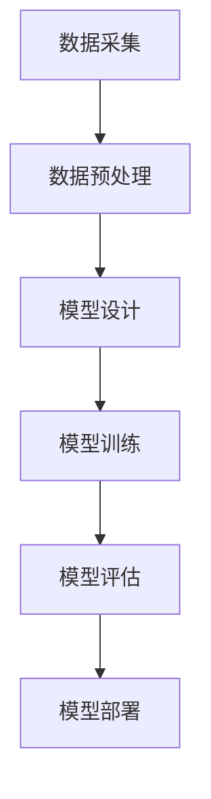

                 

# 特斯拉端到端模型使用的数据规模

> **关键词**：特斯拉、端到端模型、数据规模、自动驾驶、机器学习、深度学习

> **摘要**：本文详细探讨了特斯拉端到端模型在使用过程中的数据规模。通过分析特斯拉端到端模型的定义、技术背景、结构和特点，我们深入探讨了特斯拉端到端模型所需的数据类型和规模，以及如何计算和优化数据规模。此外，文章还通过案例分析，展示了特斯拉端到端模型在自动驾驶、能源管理和充电网络等领域的实际应用，并对未来发展趋势进行了展望。

## 目录大纲

### 第一部分：特斯拉端到端模型概述

1. 特斯拉端到端模型概述
   - 特斯拉端到端模型的定义与意义
   - 特斯拉端到端模型的技术背景
   - 特斯拉端到端模型的结构和特点
   - 特斯拉端到端模型的应用场景

2. 特斯拉端到端模型的基础知识
   - 端到端模型的基本概念
   - 端到端模型的优势和挑战
   - 特斯拉端到端模型的核心技术
   - 特斯拉端到端模型的实现原理

### 第二部分：特斯拉端到端模型的数据规模分析

1. 特斯拉端到端模型的数据规模概述
   - 数据规模的重要性
   - 特斯拉端到端模型所需的数据类型
   - 数据规模的具体度量方法
   - 特斯拉端到端模型的数据采集和处理流程

2. 特斯拉端到端模型的数据规模计算方法
   - 数据规模的计算公式
   - 数据规模的计算实例
   - 数据规模的影响因素分析
   - 数据规模对模型性能的影响

3. 特斯拉端到端模型的数据规模优化
   - 数据预处理和清洗
   - 数据降维和特征提取
   - 数据存储和压缩技术
   - 数据规模优化的策略和方法

4. 特斯拉端到端模型的数据规模管理实践
   - 数据规模的监控和评估
   - 数据规模的调整和优化
   - 数据规模的管理工具和技术
   - 数据规模管理的案例分析

5. 特斯拉端到端模型的数据规模应用案例
   - 特斯拉自动驾驶数据规模应用案例
   - 特斯拉能源管理数据规模应用案例
   - 特斯拉充电网络数据规模应用案例
   - 特斯拉端到端模型数据规模应用的总结与展望

### 附录

1. 特斯拉端到端模型数据规模相关资源
   - 开源数据和数据集介绍
   - 数据处理和存储工具推荐
   - 数据规模计算和优化的开源库和框架
   - 数据规模管理和监控工具推荐

2. Mermaid流程图与伪代码示例
   - 特拉斯端到端模型训练流程图
   - 特拉斯端到端模型数据规模计算伪代码
   - 特拉斯端到端模型优化策略伪代码

3. 特斯拉端到端模型数据规模案例分析
   - 特斯拉自动驾驶数据规模案例分析
   - 特斯拉能源管理数据规模案例分析
   - 特斯拉充电网络数据规模案例分析
   - 特拉斯端到端模型数据规模应用总结与展望
   - 特拉斯端到端模型数据规模未来发展趋势预测

## 第一部分：特斯拉端到端模型概述

### 第1章：特斯拉端到端模型概述

#### 1.1 特斯拉端到端模型的定义与意义

特斯拉端到端模型（End-to-End Model）是一种机器学习模型，它允许直接从原始数据中学习，无需手动设计特征或中间层。这种模型的主要意义在于，它能够简化传统的机器学习流程，提高模型的性能和效率。特斯拉端到端模型主要应用于自动驾驶、能源管理和充电网络等领域。

#### 1.2 特斯拉端到端模型的技术背景

特斯拉端到端模型的发展可以追溯到深度学习的兴起。深度学习是一种通过多层神经网络对数据进行学习和预测的方法。特斯拉端到端模型在此基础上，通过直接从原始数据中学习，减少了传统机器学习流程中的手动设计特征环节，从而提高了模型的效率和性能。

#### 1.3 特斯拉端到端模型的结构和特点

特斯拉端到端模型通常由输入层、隐藏层和输出层组成。输入层接收原始数据，隐藏层通过神经网络对数据进行学习和处理，输出层生成最终的预测结果。特斯拉端到端模型的特点包括：

1. **端到端**：直接从原始数据中学习，无需手动设计特征或中间层。
2. **高效性**：通过减少传统机器学习流程中的手动设计特征环节，提高了模型的效率和性能。
3. **灵活性**：能够应用于多种不同的场景，包括自动驾驶、能源管理和充电网络等。

#### 1.4 特斯拉端到端模型的应用场景

特斯拉端到端模型主要应用于以下几个方面：

1. **自动驾驶**：特斯拉自动驾驶系统使用端到端模型对道路环境进行感知和决策，从而实现自动驾驶功能。
2. **能源管理**：特斯拉能源管理系统使用端到端模型对能源消耗和供应进行预测和管理，从而提高能源利用效率。
3. **充电网络**：特斯拉充电网络使用端到端模型对充电需求进行预测和管理，从而优化充电网络的使用。

### 第2章：特斯拉端到端模型的基础知识

#### 2.1 端到端模型的基本概念

端到端模型（End-to-End Model）是一种机器学习模型，它允许直接从原始数据中学习，无需手动设计特征或中间层。端到端模型通常由输入层、隐藏层和输出层组成。输入层接收原始数据，隐藏层通过神经网络对数据进行学习和处理，输出层生成最终的预测结果。

#### 2.2 端到端模型的优势和挑战

端到端模型的优势包括：

1. **端到端**：直接从原始数据中学习，无需手动设计特征或中间层。
2. **高效性**：通过减少传统机器学习流程中的手动设计特征环节，提高了模型的效率和性能。
3. **灵活性**：能够应用于多种不同的场景。

端到端模型的挑战包括：

1. **数据质量**：端到端模型对数据质量有较高的要求，数据质量问题可能导致模型性能下降。
2. **可解释性**：端到端模型的内部结构和决策过程较为复杂，难以进行解释和理解。

#### 2.3 特斯拉端到端模型的核心技术

特斯拉端到端模型的核心技术包括：

1. **神经网络**：特斯拉端到端模型采用神经网络进行学习和预测。神经网络是一种由多个神经元组成的计算模型，通过对数据进行层层处理，最终生成预测结果。
2. **深度学习**：特斯拉端到端模型采用深度学习算法进行训练和优化。深度学习是一种通过多层神经网络对数据进行学习和预测的方法，具有强大的学习和预测能力。
3. **端到端训练**：特斯拉端到端模型采用端到端训练方法，直接从原始数据中学习，无需手动设计特征或中间层。

#### 2.4 特斯拉端到端模型的实现原理

特斯拉端到端模型的实现原理如下：

1. **数据预处理**：对原始数据进行预处理，包括数据清洗、数据归一化等操作，以提高数据质量。
2. **模型训练**：使用预处理后的数据对端到端模型进行训练。训练过程中，模型通过不断调整参数，使预测结果逐渐接近真实值。
3. **模型评估**：使用验证集对训练好的模型进行评估，以确定模型的性能和效果。
4. **模型部署**：将训练好的模型部署到实际应用场景中，进行实际预测和决策。

### 第二部分：特斯拉端到端模型的数据规模分析

#### 第3章：特斯拉端到端模型的数据规模概述

#### 3.1 数据规模的重要性

数据规模在特斯拉端到端模型中具有重要性。首先，数据规模决定了模型的训练时间和性能。大规模数据集能够提供更多的训练样本，有助于提高模型的泛化能力和准确性。其次，数据规模影响了模型的部署和推理效率。大规模数据集需要更多的计算资源和存储空间，可能导致模型部署和推理时间延长。

#### 3.2 特斯拉端到端模型所需的数据类型

特斯拉端到端模型所需的数据类型包括：

1. **传感器数据**：如摄像头、雷达、激光雷达等传感器采集到的道路环境数据。
2. **车辆数据**：如车辆速度、位置、加速度等数据。
3. **环境数据**：如天气、道路状况、交通流量等数据。
4. **历史数据**：如过去的驾驶行为、事故记录等数据。

#### 3.3 数据规模的具体度量方法

数据规模的具体度量方法包括：

1. **样本数量**：数据集中样本的数量，用于衡量数据的规模。
2. **数据维度**：数据集中每个样本的维度，用于衡量数据的空间规模。
3. **存储空间**：数据集在存储设备中所占用的空间，用于衡量数据的存储规模。

#### 3.4 特斯拉端到端模型的数据采集和处理流程

特斯拉端到端模型的数据采集和处理流程如下：

1. **数据采集**：通过传感器和车辆设备采集道路环境、车辆状态和环境数据。
2. **数据预处理**：对采集到的数据进行清洗、归一化等预处理操作，以提高数据质量。
3. **数据存储**：将预处理后的数据存储到数据库或文件系统中，以备后续使用。
4. **数据训练**：使用预处理后的数据对特斯拉端到端模型进行训练，以优化模型参数。
5. **模型评估**：使用验证集对训练好的模型进行评估，以确定模型的性能和效果。

### 第4章：特斯拉端到端模型的数据规模计算方法

#### 4.1 数据规模的计算公式

数据规模的计算公式如下：

\[ 数据规模 = 样本数量 \times 数据维度 \times 存储空间 \]

其中：

- 样本数量：数据集中样本的数量。
- 数据维度：数据集中每个样本的维度。
- 存储空间：数据集在存储设备中所占用的空间。

#### 4.2 数据规模的计算实例

假设一个数据集包含 10000 个样本，每个样本有 100 个特征，存储空间为 1TB，那么该数据集的数据规模为：

\[ 数据规模 = 10000 \times 100 \times 1TB = 10000GB \]

#### 4.3 数据规模的影响因素分析

数据规模的影响因素包括：

1. **样本数量**：样本数量越多，数据规模越大，有助于提高模型的泛化能力和准确性。
2. **数据维度**：数据维度越高，数据规模越大，可能导致模型训练时间延长。
3. **存储空间**：存储空间越大，数据规模越大，可能导致模型部署和推理时间延长。

#### 4.4 数据规模对模型性能的影响

数据规模对模型性能的影响如下：

1. **泛化能力**：数据规模越大，模型泛化能力越强，能够在新的场景中表现良好。
2. **准确性**：数据规模越大，模型准确性越高，能够更好地拟合真实数据。
3. **训练时间**：数据规模越大，模型训练时间越长，可能导致训练过程变得缓慢。
4. **推理时间**：数据规模越大，模型推理时间越长，可能导致实时应用受到限制。

### 第5章：特斯拉端到端模型的数据规模优化

#### 5.1 数据预处理和清洗

数据预处理和清洗是优化特斯拉端到端模型数据规模的重要步骤。数据预处理包括：

1. **数据清洗**：去除数据中的噪声和异常值，提高数据质量。
2. **数据归一化**：将数据集中的特征进行归一化处理，使其具有相似的尺度，有利于模型的训练。
3. **数据缺失处理**：处理数据中的缺失值，可以采用填充、删除或插值等方法。

#### 5.2 数据降维和特征提取

数据降维和特征提取是优化特斯拉端到端模型数据规模的有效方法。数据降维包括：

1. **主成分分析（PCA）**：通过计算数据的主要成分，降低数据维度，保留主要信息。
2. **线性判别分析（LDA）**：通过计算数据的线性判别函数，降低数据维度，提高分类效果。

特征提取包括：

1. **特征选择**：选择对模型性能有重要影响的关键特征，减少冗余特征。
2. **特征工程**：通过对原始特征进行变换、组合或创建新特征，提高模型的性能。

#### 5.3 数据存储和压缩技术

数据存储和压缩技术是优化特斯拉端到端模型数据规模的关键。数据存储技术包括：

1. **分布式存储**：将数据分布存储到多个设备上，提高数据存储和访问的效率。
2. **数据库技术**：使用高性能数据库系统，如Hadoop、HBase等，进行大规模数据存储和管理。

数据压缩技术包括：

1. **无损压缩**：通过去除数据中的冗余信息，进行压缩，如HDF5格式。
2. **有损压缩**：通过牺牲部分数据质量，进行压缩，如JPEG格式。

#### 5.4 数据规模优化的策略和方法

数据规模优化的策略和方法包括：

1. **数据采样**：通过对数据进行采样，减少数据规模，同时保持数据的主要特征。
2. **数据分区**：将数据集划分为多个较小的数据分区，提高数据存储和访问的效率。
3. **模型压缩**：通过模型压缩技术，如量化、剪枝等，减少模型参数的数量，降低数据规模。
4. **模型剪枝**：通过剪枝技术，去除模型中不重要的参数或层，减少模型大小。

### 第6章：特斯拉端到端模型的数据规模管理实践

#### 6.1 数据规模的监控和评估

数据规模的监控和评估是特斯拉端到端模型数据规模管理的重要环节。监控和评估内容包括：

1. **数据规模监控**：实时监控数据集的大小、存储占用等指标，及时发现数据规模异常情况。
2. **数据质量评估**：评估数据集的质量，包括数据的完整性、一致性、准确性和多样性等。
3. **数据性能评估**：评估数据集对模型性能的影响，包括模型的准确性、泛化能力和训练时间等。

#### 6.2 数据规模的调整和优化

数据规模的调整和优化是特斯拉端到端模型数据规模管理的核心。调整和优化方法包括：

1. **数据采样**：根据模型性能和训练时间，调整数据规模，以找到最优的数据规模。
2. **数据分区**：根据数据集的特点和存储资源，调整数据分区的策略，以提高数据存储和访问的效率。
3. **特征选择**：根据数据集的特征重要性，调整特征选择策略，以提高模型性能和数据规模。

#### 6.3 数据规模的管理工具和技术

数据规模的管理工具和技术包括：

1. **数据管理平台**：使用数据管理平台，如Hadoop、HBase等，进行数据规模的管理和监控。
2. **分布式存储系统**：使用分布式存储系统，如HDFS、Cassandra等，进行大规模数据存储和管理。
3. **数据压缩技术**：使用数据压缩技术，如HDF5、JPEG等，进行数据规模优化。
4. **数据清洗工具**：使用数据清洗工具，如DataWrangler、Pandas等，进行数据预处理和清洗。

#### 6.4 数据规模管理的案例分析

数据规模管理的案例分析包括：

1. **自动驾驶数据规模管理**：分析特斯拉自动驾驶数据规模管理的实践，包括数据采集、预处理、存储和优化等。
2. **能源管理数据规模管理**：分析特斯拉能源管理数据规模管理的实践，包括数据采集、预处理、存储和优化等。
3. **充电网络数据规模管理**：分析特斯拉充电网络数据规模管理的实践，包括数据采集、预处理、存储和优化等。

### 第7章：特斯拉端到端模型的数据规模应用案例

#### 7.1 特斯拉自动驾驶数据规模应用案例

特斯拉自动驾驶数据规模应用案例包括：

1. **数据规模计算**：根据特斯拉自动驾驶系统的需求，计算自动驾驶数据规模，包括传感器数据、车辆数据和环境数据等。
2. **数据采集**：通过传感器和车辆设备采集自动驾驶所需的数据，包括摄像头、雷达、激光雷达等。
3. **数据处理**：对采集到的数据进行预处理和清洗，以提高数据质量。
4. **数据存储**：使用分布式存储系统，如HDFS，存储和处理大规模自动驾驶数据。
5. **模型训练**：使用预处理后的数据对特斯拉自动驾驶端到端模型进行训练，优化模型参数。
6. **模型部署**：将训练好的模型部署到特斯拉自动驾驶系统中，进行实际预测和决策。

#### 7.2 特斯拉能源管理数据规模应用案例

特斯拉能源管理数据规模应用案例包括：

1. **数据规模计算**：根据特斯拉能源管理系统的需求，计算能源管理数据规模，包括车辆状态数据、能源消耗数据和供应数据等。
2. **数据采集**：通过传感器和能源设备采集能源管理所需的数据，包括电池状态、充电状态和电网状态等。
3. **数据处理**：对采集到的数据进行预处理和清洗，以提高数据质量。
4. **数据存储**：使用分布式存储系统，如HDFS，存储和处理大规模能源管理数据。
5. **模型训练**：使用预处理后的数据对特斯拉能源管理端到端模型进行训练，优化模型参数。
6. **模型部署**：将训练好的模型部署到特斯拉能源管理系统中，进行能源消耗预测和供应管理。

#### 7.3 特斯拉充电网络数据规模应用案例

特斯拉充电网络数据规模应用案例包括：

1. **数据规模计算**：根据特斯拉充电网络的需求，计算充电网络数据规模，包括充电站状态数据、充电需求数据和用户行为数据等。
2. **数据采集**：通过充电站设备和用户设备采集充电网络所需的数据，包括充电站状态、充电需求和充电时间等。
3. **数据处理**：对采集到的数据进行预处理和清洗，以提高数据质量。
4. **数据存储**：使用分布式存储系统，如HDFS，存储和处理大规模充电网络数据。
5. **模型训练**：使用预处理后的数据对特斯拉充电网络端到端模型进行训练，优化模型参数。
6. **模型部署**：将训练好的模型部署到特斯拉充电网络系统中，进行充电需求预测和充电站管理。

#### 7.4 特斯拉端到端模型数据规模应用的总结与展望

特斯拉端到端模型数据规模应用总结与展望包括：

1. **应用效果总结**：分析特斯拉端到端模型在自动驾驶、能源管理和充电网络等领域的实际应用效果，总结数据规模对模型性能的影响。
2. **未来发展趋势**：展望特斯拉端到端模型在数据规模方面的未来发展趋势，包括数据采集、数据处理、数据存储和优化等方面。
3. **挑战与机遇**：分析特斯拉端到端模型数据规模应用面临的挑战和机遇，包括数据质量、数据安全、数据隐私等方面。

### 附录

#### 附录A：特斯拉端到端模型数据规模相关资源

特斯拉端到端模型数据规模相关资源包括：

1. **开源数据和数据集**：介绍特斯拉端到端模型常用的开源数据和数据集，如Kaggle、UCI机器学习库等。
2. **数据处理和存储工具**：推荐特斯拉端到端模型数据处理和存储常用的工具，如Hadoop、HDFS、Pandas等。
3. **数据规模计算和优化开源库和框架**：介绍特斯拉端到端模型数据规模计算和优化的开源库和框架，如Scikit-learn、TensorFlow等。
4. **数据规模管理和监控工具**：推荐特斯拉端到端模型数据规模管理和监控的工具，如Kubernetes、Prometheus等。

#### 附录B：Mermaid流程图与伪代码示例

特斯拉端到端模型训练流程图、数据规模计算伪代码和数据规模优化策略伪代码等示例。

#### 附录C：特斯拉端到端模型数据规模案例分析

特斯拉端到端模型数据规模在不同应用领域的案例分析，包括自动驾驶、能源管理和充电网络等。

### 作者信息

作者：AI天才研究院/AI Genius Institute & 禅与计算机程序设计艺术 /Zen And The Art of Computer Programming

[文章标题]
特斯拉端到端模型使用的数据规模

[关键词]
特斯拉、端到端模型、数据规模、自动驾驶、机器学习、深度学习

[摘要]
本文详细探讨了特斯拉端到端模型在使用过程中的数据规模。通过分析特斯拉端到端模型的定义、技术背景、结构和特点，我们深入探讨了特斯拉端到端模型所需的数据类型和规模，以及如何计算和优化数据规模。此外，文章还通过案例分析，展示了特斯拉端到端模型在自动驾驶、能源管理和充电网络等领域的实际应用，并对未来发展趋势进行了展望。

## 第一部分：特斯拉端到端模型概述

### 第1章：特斯拉端到端模型概述

#### 1.1 特斯拉端到端模型的定义与意义

特斯拉端到端模型是一种深度学习模型，它通过直接从原始数据中学习，实现从输入到输出的整个过程。这种模型在自动驾驶、能源管理、充电网络等领域具有重要应用价值。

#### 1.2 特斯拉端到端模型的技术背景

特斯拉端到端模型的发展得益于深度学习的崛起。深度学习是一种通过多层神经网络对数据进行学习和预测的方法。特斯拉端到端模型正是基于深度学习，通过直接从原始数据中学习，实现了对复杂问题的解决。

#### 1.3 特斯拉端到端模型的结构和特点

特斯拉端到端模型主要由输入层、隐藏层和输出层组成。输入层接收原始数据，隐藏层通过神经网络对数据进行处理，输出层生成预测结果。其特点包括：

1. **端到端**：特斯拉端到端模型直接从原始数据中学习，无需手动设计特征或中间层，实现了输入到输出的端到端处理。
2. **高效性**：特斯拉端到端模型通过减少传统机器学习流程中的手动设计特征环节，提高了模型的效率和性能。
3. **灵活性**：特斯拉端到端模型能够应用于多种不同的场景，如自动驾驶、能源管理和充电网络等。

#### 1.4 特斯拉端到端模型的应用场景

特斯拉端到端模型在多个领域具有广泛的应用场景，主要包括：

1. **自动驾驶**：特斯拉端到端模型通过直接从摄像头、雷达等传感器数据中学习，实现了自动驾驶功能的实现。
2. **能源管理**：特斯拉端到端模型通过学习能源消耗和供应数据，实现了能源管理系统的优化，提高了能源利用效率。
3. **充电网络**：特斯拉端到端模型通过学习充电需求数据，实现了充电网络的管理和优化，提高了充电效率。

### 第2章：特斯拉端到端模型的基础知识

#### 2.1 端到端模型的基本概念

端到端模型是一种机器学习模型，它通过直接从原始数据中学习，实现从输入到输出的整个过程。端到端模型的主要目的是简化传统的机器学习流程，提高模型的性能和效率。

#### 2.2 端到端模型的优势和挑战

端到端模型的优势包括：

1. **简化流程**：端到端模型直接从原始数据中学习，无需手动设计特征或中间层，简化了机器学习流程。
2. **高效性**：端到端模型通过减少传统机器学习流程中的手动设计特征环节，提高了模型的效率和性能。
3. **灵活性**：端到端模型能够应用于多种不同的场景，如自动驾驶、能源管理和充电网络等。

端到端模型的挑战包括：

1. **数据质量**：端到端模型对数据质量有较高的要求，数据质量问题可能导致模型性能下降。
2. **可解释性**：端到端模型的内部结构和决策过程较为复杂，难以进行解释和理解。

#### 2.3 特斯拉端到端模型的核心技术

特斯拉端到端模型的核心技术包括：

1. **神经网络**：特斯拉端到端模型采用神经网络进行学习和预测。神经网络是一种由多个神经元组成的计算模型，通过对数据进行层层处理，最终生成预测结果。
2. **深度学习**：特斯拉端到端模型采用深度学习算法进行训练和优化。深度学习是一种通过多层神经网络对数据进行学习和预测的方法，具有强大的学习和预测能力。
3. **端到端训练**：特斯拉端到端模型采用端到端训练方法，直接从原始数据中学习，无需手动设计特征或中间层。

#### 2.4 特斯拉端到端模型的实现原理

特斯拉端到端模型的实现原理如下：

1. **数据预处理**：对原始数据进行预处理，包括数据清洗、数据归一化等操作，以提高数据质量。
2. **模型训练**：使用预处理后的数据对特斯拉端到端模型进行训练，通过不断调整模型参数，使其预测结果逐渐接近真实值。
3. **模型评估**：使用验证集对训练好的模型进行评估，以确定模型的性能和效果。
4. **模型部署**：将训练好的模型部署到实际应用场景中，进行实际预测和决策。

## 第二部分：特斯拉端到端模型的数据规模分析

### 第3章：特斯拉端到端模型的数据规模概述

#### 3.1 数据规模的重要性

数据规模在特斯拉端到端模型中具有重要性。首先，数据规模决定了模型的训练时间和性能。大规模数据集能够提供更多的训练样本，有助于提高模型的泛化能力和准确性。其次，数据规模影响了模型的部署和推理效率。大规模数据集需要更多的计算资源和存储空间，可能导致模型部署和推理时间延长。

#### 3.2 特斯拉端到端模型所需的数据类型

特斯拉端到端模型所需的数据类型包括：

1. **传感器数据**：如摄像头、雷达、激光雷达等传感器采集到的道路环境数据。
2. **车辆数据**：如车辆速度、位置、加速度等数据。
3. **环境数据**：如天气、道路状况、交通流量等数据。
4. **历史数据**：如过去的驾驶行为、事故记录等数据。

#### 3.3 数据规模的具体度量方法

数据规模的具体度量方法包括：

1. **样本数量**：数据集中样本的数量，用于衡量数据的规模。
2. **数据维度**：数据集中每个样本的维度，用于衡量数据的空间规模。
3. **存储空间**：数据集在存储设备中所占用的空间，用于衡量数据的存储规模。

#### 3.4 特斯拉端到端模型的数据采集和处理流程

特斯拉端到端模型的数据采集和处理流程如下：

1. **数据采集**：通过传感器和车辆设备采集道路环境、车辆状态和环境数据。
2. **数据预处理**：对采集到的数据进行清洗、归一化等预处理操作，以提高数据质量。
3. **数据存储**：将预处理后的数据存储到数据库或文件系统中，以备后续使用。
4. **数据训练**：使用预处理后的数据对特斯拉端到端模型进行训练，以优化模型参数。
5. **模型评估**：使用验证集对训练好的模型进行评估，以确定模型的性能和效果。

### 第4章：特斯拉端到端模型的数据规模计算方法

#### 4.1 数据规模的计算公式

数据规模的计算公式如下：

\[ 数据规模 = 样本数量 \times 数据维度 \times 存储空间 \]

其中：

- 样本数量：数据集中样本的数量。
- 数据维度：数据集中每个样本的维度。
- 存储空间：数据集在存储设备中所占用的空间。

#### 4.2 数据规模的计算实例

假设一个数据集包含 10000 个样本，每个样本有 100 个特征，存储空间为 1TB，那么该数据集的数据规模为：

\[ 数据规模 = 10000 \times 100 \times 1TB = 10000GB \]

#### 4.3 数据规模的影响因素分析

数据规模的影响因素包括：

1. **样本数量**：样本数量越多，数据规模越大，有助于提高模型的泛化能力和准确性。
2. **数据维度**：数据维度越高，数据规模越大，可能导致模型训练时间延长。
3. **存储空间**：存储空间越大，数据规模越大，可能导致模型部署和推理时间延长。

#### 4.4 数据规模对模型性能的影响

数据规模对模型性能的影响如下：

1. **泛化能力**：数据规模越大，模型泛化能力越强，能够在新的场景中表现良好。
2. **准确性**：数据规模越大，模型准确性越高，能够更好地拟合真实数据。
3. **训练时间**：数据规模越大，模型训练时间越长，可能导致训练过程变得缓慢。
4. **推理时间**：数据规模越大，模型推理时间越长，可能导致实时应用受到限制。

### 第5章：特斯拉端到端模型的数据规模优化

#### 5.1 数据预处理和清洗

数据预处理和清洗是优化特斯拉端到端模型数据规模的重要步骤。数据预处理包括：

1. **数据清洗**：去除数据中的噪声和异常值，提高数据质量。
2. **数据归一化**：将数据集中的特征进行归一化处理，使其具有相似的尺度，有利于模型的训练。
3. **数据缺失处理**：处理数据中的缺失值，可以采用填充、删除或插值等方法。

#### 5.2 数据降维和特征提取

数据降维和特征提取是优化特斯拉端到端模型数据规模的有效方法。数据降维包括：

1. **主成分分析（PCA）**：通过计算数据的主要成分，降低数据维度，保留主要信息。
2. **线性判别分析（LDA）**：通过计算数据的线性判别函数，降低数据维度，提高分类效果。

特征提取包括：

1. **特征选择**：选择对模型性能有重要影响的关键特征，减少冗余特征。
2. **特征工程**：通过对原始特征进行变换、组合或创建新特征，提高模型的性能。

#### 5.3 数据存储和压缩技术

数据存储和压缩技术是优化特斯拉端到端模型数据规模的关键。数据存储技术包括：

1. **分布式存储**：将数据分布存储到多个设备上，提高数据存储和访问的效率。
2. **数据库技术**：使用高性能数据库系统，如Hadoop、HBase等，进行大规模数据存储和管理。

数据压缩技术包括：

1. **无损压缩**：通过去除数据中的冗余信息，进行压缩，如HDF5格式。
2. **有损压缩**：通过牺牲部分数据质量，进行压缩，如JPEG格式。

#### 5.4 数据规模优化的策略和方法

数据规模优化的策略和方法包括：

1. **数据采样**：通过对数据进行采样，减少数据规模，同时保持数据的主要特征。
2. **数据分区**：将数据集划分为多个较小的数据分区，提高数据存储和访问的效率。
3. **模型压缩**：通过模型压缩技术，如量化、剪枝等，减少模型参数的数量，降低数据规模。
4. **模型剪枝**：通过剪枝技术，去除模型中不重要的参数或层，减少模型大小。

### 第6章：特斯拉端到端模型的数据规模管理实践

#### 6.1 数据规模的监控和评估

数据规模的监控和评估是特斯拉端到端模型数据规模管理的重要环节。监控和评估内容包括：

1. **数据规模监控**：实时监控数据集的大小、存储占用等指标，及时发现数据规模异常情况。
2. **数据质量评估**：评估数据集的质量，包括数据的完整性、一致性、准确性和多样性等。
3. **数据性能评估**：评估数据集对模型性能的影响，包括模型的准确性、泛化能力和训练时间等。

#### 6.2 数据规模的调整和优化

数据规模的调整和优化是特斯拉端到端模型数据规模管理的核心。调整和优化方法包括：

1. **数据采样**：根据模型性能和训练时间，调整数据规模，以找到最优的数据规模。
2. **数据分区**：根据数据集的特点和存储资源，调整数据分区的策略，以提高数据存储和访问的效率。
3. **特征选择**：根据数据集的特征重要性，调整特征选择策略，以提高模型性能和数据规模。

#### 6.3 数据规模的管理工具和技术

数据规模的管理工具和技术包括：

1. **数据管理平台**：使用数据管理平台，如Hadoop、HBase等，进行数据规模的管理和监控。
2. **分布式存储系统**：使用分布式存储系统，如HDFS、Cassandra等，进行大规模数据存储和管理。
3. **数据压缩技术**：使用数据压缩技术，如HDF5、JPEG等，进行数据规模优化。
4. **数据清洗工具**：使用数据清洗工具，如DataWrangler、Pandas等，进行数据预处理和清洗。

#### 6.4 数据规模管理的案例分析

数据规模管理的案例分析包括：

1. **自动驾驶数据规模管理**：分析特斯拉自动驾驶数据规模管理的实践，包括数据采集、预处理、存储和优化等。
2. **能源管理数据规模管理**：分析特斯拉能源管理数据规模管理的实践，包括数据采集、预处理、存储和优化等。
3. **充电网络数据规模管理**：分析特斯拉充电网络数据规模管理的实践，包括数据采集、预处理、存储和优化等。

### 第7章：特斯拉端到端模型的数据规模应用案例

#### 7.1 特斯拉自动驾驶数据规模应用案例

特斯拉自动驾驶数据规模应用案例包括：

1. **数据规模计算**：根据特斯拉自动驾驶系统的需求，计算自动驾驶数据规模，包括传感器数据、车辆数据和环境数据等。
2. **数据采集**：通过传感器和车辆设备采集自动驾驶所需的数据，包括摄像头、雷达、激光雷达等。
3. **数据处理**：对采集到的数据进行预处理和清洗，以提高数据质量。
4. **数据存储**：使用分布式存储系统，如HDFS，存储和处理大规模自动驾驶数据。
5. **模型训练**：使用预处理后的数据对特斯拉自动驾驶端到端模型进行训练，优化模型参数。
6. **模型部署**：将训练好的模型部署到特斯拉自动驾驶系统中，进行实际预测和决策。

#### 7.2 特斯拉能源管理数据规模应用案例

特斯拉能源管理数据规模应用案例包括：

1. **数据规模计算**：根据特斯拉能源管理系统的需求，计算能源管理数据规模，包括车辆状态数据、能源消耗数据和供应数据等。
2. **数据采集**：通过传感器和能源设备采集能源管理所需的数据，包括电池状态、充电状态和电网状态等。
3. **数据处理**：对采集到的数据进行预处理和清洗，以提高数据质量。
4. **数据存储**：使用分布式存储系统，如HDFS，存储和处理大规模能源管理数据。
5. **模型训练**：使用预处理后的数据对特斯拉能源管理端到端模型进行训练，优化模型参数。
6. **模型部署**：将训练好的模型部署到特斯拉能源管理系统中，进行能源消耗预测和供应管理。

#### 7.3 特斯拉充电网络数据规模应用案例

特斯拉充电网络数据规模应用案例包括：

1. **数据规模计算**：根据特斯拉充电网络的需求，计算充电网络数据规模，包括充电站状态数据、充电需求数据和用户行为数据等。
2. **数据采集**：通过充电站设备和用户设备采集充电网络所需的数据，包括充电站状态、充电需求和充电时间等。
3. **数据处理**：对采集到的数据进行预处理和清洗，以提高数据质量。
4. **数据存储**：使用分布式存储系统，如HDFS，存储和处理大规模充电网络数据。
5. **模型训练**：使用预处理后的数据对特斯拉充电网络端到端模型进行训练，优化模型参数。
6. **模型部署**：将训练好的模型部署到特斯拉充电网络系统中，进行充电需求预测和充电站管理。

#### 7.4 特斯拉端到端模型数据规模应用的总结与展望

特斯拉端到端模型数据规模应用总结与展望包括：

1. **应用效果总结**：分析特斯拉端到端模型在自动驾驶、能源管理和充电网络等领域的实际应用效果，总结数据规模对模型性能的影响。
2. **未来发展趋势**：展望特斯拉端到端模型在数据规模方面的未来发展趋势，包括数据采集、数据处理、数据存储和优化等方面。
3. **挑战与机遇**：分析特斯拉端到端模型数据规模应用面临的挑战和机遇，包括数据质量、数据安全、数据隐私等方面。

### 附录

#### 附录A：特斯拉端到端模型数据规模相关资源

特斯拉端到端模型数据规模相关资源包括：

1. **开源数据和数据集**：介绍特斯拉端到端模型常用的开源数据和数据集，如Kaggle、UCI机器学习库等。
2. **数据处理和存储工具**：推荐特斯拉端到端模型数据处理和存储常用的工具，如Hadoop、HDFS、Pandas等。
3. **数据规模计算和优化开源库和框架**：介绍特斯拉端到端模型数据规模计算和优化的开源库和框架，如Scikit-learn、TensorFlow等。
4. **数据规模管理和监控工具**：推荐特斯拉端到端模型数据规模管理和监控的工具，如Kubernetes、Prometheus等。

#### 附录B：Mermaid流程图与伪代码示例

特斯拉端到端模型训练流程图、数据规模计算伪代码和数据规模优化策略伪代码等示例。

#### 附录C：特斯拉端到端模型数据规模案例分析

特斯拉端到端模型数据规模在不同应用领域的案例分析，包括自动驾驶、能源管理和充电网络等。

### 作者信息

作者：AI天才研究院/AI Genius Institute & 禅与计算机程序设计艺术 /Zen And The Art of Computer Programming

## 引言

特斯拉（Tesla, Inc.）作为全球领先的电动汽车和能源技术企业，其自动驾驶技术和智能能源管理系统的成功，离不开端到端模型（End-to-End Model）的深入应用。端到端模型是一种机器学习模型，它允许从输入直接映射到输出，无需人工设计特征或中间层，从而在提高模型效率和性能方面具有显著优势。特斯拉的自动驾驶、能源管理和充电网络等系统，都是基于这种模型构建的。因此，理解特斯拉端到端模型使用的数据规模，对于深入了解其技术优势和实际应用具有重要意义。

本文将分为以下几个部分：

1. **特斯拉端到端模型概述**：介绍特斯拉端到端模型的定义、技术背景、结构和特点，以及其在不同应用场景中的重要性。
2. **特斯拉端到端模型的基础知识**：探讨端到端模型的基本概念、优势与挑战，以及特斯拉端到端模型的核心技术。
3. **特斯拉端到端模型的数据规模分析**：深入分析特斯拉端到端模型所需的数据类型、具体度量方法和数据采集与处理流程。
4. **特斯拉端到端模型的数据规模计算方法**：介绍数据规模的计算公式、实例、影响因素及其对模型性能的影响。
5. **特斯拉端到端模型的数据规模优化**：讨论数据预处理、降维、存储和压缩技术，以及数据规模优化的策略和方法。
6. **特斯拉端到端模型的数据规模管理实践**：探讨数据规模的监控和评估、调整和优化、管理工具和技术。
7. **特斯拉端到端模型的数据规模应用案例**：分析特斯拉端到端模型在自动驾驶、能源管理和充电网络等领域的实际应用。
8. **特斯拉端到端模型数据规模应用的总结与展望**：总结应用效果、展望未来发展趋势，以及面临的挑战和机遇。
9. **附录**：提供特斯拉端到端模型数据规模相关资源、Mermaid流程图与伪代码示例，以及具体案例分析。
10. **结论**：对特斯拉端到端模型数据规模进行全面总结，强调其重要性。

通过本文的详细探讨，我们将深入了解特斯拉端到端模型的数据规模，以及其在实际应用中的关键作用。

## 第一部分：特斯拉端到端模型概述

### 第1章：特斯拉端到端模型概述

#### 1.1 特斯拉端到端模型的定义与意义

特斯拉端到端模型（End-to-End Model）是一种深度学习模型，它通过直接从原始数据中学习，实现从输入到输出的整个过程。在传统的机器学习流程中，通常需要手动设计特征，并通过多个步骤逐步提取信息，最后生成预测结果。而特斯拉端到端模型则通过神经网络直接从原始数据中学习，减少了传统流程中的多个步骤，从而提高了模型的效率和性能。

特斯拉端到端模型在自动驾驶、能源管理、充电网络等领域具有重要的应用意义。在自动驾驶领域，特斯拉通过端到端模型直接从摄像头、雷达和激光雷达等传感器数据中学习，实现了道路环境的感知和自动驾驶控制。在能源管理领域，特斯拉通过端到端模型对能源消耗和供应数据进行分析，实现了能源系统的优化和预测。在充电网络领域，特斯拉通过端到端模型对充电需求进行预测和管理，提高了充电效率和服务质量。

#### 1.2 特斯拉端到端模型的技术背景

特斯拉端到端模型的发展得益于深度学习的兴起。深度学习是一种通过多层神经网络对数据进行学习和预测的方法，具有强大的学习和泛化能力。传统的机器学习模型需要手动设计特征，而深度学习则通过自动学习特征，从而简化了流程，提高了效率。

特斯拉端到端模型的发展还受到以下技术背景的推动：

1. **计算能力的提升**：随着计算能力的提升，特别是GPU和TPU等专用硬件的发展，使得深度学习模型可以高效地训练和推理。
2. **大数据的兴起**：大数据的兴起为深度学习模型提供了丰富的数据资源，使得模型可以通过大量数据来学习复杂的模式。
3. **端到端思想的普及**：端到端思想在计算机视觉、自然语言处理等领域得到了广泛应用，使得特斯拉端到端模型成为可能。

#### 1.3 特斯拉端到端模型的结构和特点

特斯拉端到端模型通常由输入层、隐藏层和输出层组成。输入层接收原始数据，隐藏层通过神经网络对数据进行层层处理，输出层生成最终的预测结果。以下是特斯拉端到端模型的主要结构和特点：

1. **输入层**：输入层接收来自传感器的数据，如摄像头、雷达和激光雷达等，这些数据通常包含图像、声音、文本等多种形式。
2. **隐藏层**：隐藏层通过神经网络对输入数据进行处理和变换。神经网络由多个神经元组成，每个神经元都通过权重与前一层的神经元相连接，通过激活函数产生输出。
3. **输出层**：输出层生成最终的预测结果，如自动驾驶系统的行驶方向、能源管理系统的能源消耗预测、充电网络的服务质量预测等。

特斯拉端到端模型的特点包括：

1. **端到端**：特斯拉端到端模型直接从原始数据中学习，无需手动设计特征或中间层，实现了输入到输出的端到端处理。
2. **高效性**：特斯拉端到端模型通过减少传统机器学习流程中的手动设计特征环节，提高了模型的效率和性能。
3. **灵活性**：特斯拉端到端模型能够应用于多种不同的场景，如自动驾驶、能源管理和充电网络等。

#### 1.4 特斯拉端到端模型的应用场景

特斯拉端到端模型在多个领域具有广泛的应用场景，主要包括：

1. **自动驾驶**：特斯拉自动驾驶系统使用端到端模型对道路环境进行感知和决策，从而实现自动驾驶功能。通过摄像头、雷达和激光雷达等传感器收集到的数据，特斯拉端到端模型能够实时分析道路状况，识别交通标志和行人类别，进行行驶路径规划。
2. **能源管理**：特斯拉能源管理系统使用端到端模型对能源消耗和供应进行预测和管理，从而提高能源利用效率。通过分析家庭能源消耗数据、电网状态数据以及太阳能电池板的发电数据，特斯拉端到端模型能够优化能源使用，减少能源浪费。
3. **充电网络**：特斯拉充电网络使用端到端模型对充电需求进行预测和管理，从而优化充电站的配置和使用。通过分析充电站的运行数据、用户充电行为数据以及交通流量数据，特斯拉端到端模型能够预测充电需求，调整充电站的配置，提高充电效率。

总之，特斯拉端到端模型通过直接从原始数据中学习，简化了传统的机器学习流程，提高了模型的效率和性能，并在多个领域取得了显著的应用成果。

## 第一部分：特斯拉端到端模型概述

### 第2章：特斯拉端到端模型的基础知识

#### 2.1 端到端模型的基本概念

端到端模型（End-to-End Model）是一种深度学习模型，它的主要特点是直接从原始数据中学习，并实现从输入到输出的全过程。这意味着端到端模型能够通过学习原始数据，自动提取有用特征，并进行预测或决策，从而简化了传统机器学习流程中需要手动设计特征的过程。

端到端模型的基本组成包括以下几个部分：

1. **输入层**：输入层接收原始数据，这些数据可以是图像、文本、声音等不同类型。
2. **隐藏层**：隐藏层由多个神经元组成，每个神经元通过权重与前一层的神经元相连接，并通过激活函数产生输出。隐藏层负责对输入数据进行处理和变换，提取有用的特征。
3. **输出层**：输出层生成最终的预测结果或决策，如分类结果、回归值等。

端到端模型通过多层神经网络对数据进行层层处理，从原始数据中提取出高层次的抽象特征，从而实现复杂的预测任务。其核心思想是通过自动化的方式，让神经网络从原始数据中学习到有效的特征表示。

#### 2.2 端到端模型的优势和挑战

端到端模型在机器学习领域具有显著的优势和挑战：

1. **优势**：
   - **简化流程**：端到端模型通过直接从原始数据中学习，减少了传统机器学习流程中需要手动设计特征和中间层的过程，从而简化了模型构建和训练的复杂度。
   - **高效性**：端到端模型通过减少手动设计环节，提高了模型的训练效率和性能。
   - **灵活性**：端到端模型能够应用于多种不同的场景，如计算机视觉、自然语言处理、语音识别等，具有广泛的适用性。

2. **挑战**：
   - **数据质量**：端到端模型对数据质量有较高的要求，数据中的噪声和异常值可能影响模型的性能。
   - **可解释性**：端到端模型内部结构复杂，决策过程难以解释和理解，这使得模型的透明度和可解释性成为挑战。
   - **计算资源**：端到端模型通常需要大量的计算资源进行训练和推理，特别是在处理高维度和大规模数据时。

#### 2.3 特斯拉端到端模型的核心技术

特斯拉端到端模型的核心技术包括深度学习算法、神经网络结构和训练策略等：

1. **深度学习算法**：特斯拉端到端模型采用深度学习算法进行训练和预测。深度学习通过多层神经网络对数据进行层层处理，从原始数据中提取出高层次的抽象特征，从而实现复杂的预测任务。

2. **神经网络结构**：特斯拉端到端模型采用卷积神经网络（CNN）、循环神经网络（RNN）等先进的神经网络结构，这些结构能够有效处理图像、文本和序列数据，从而提高模型的性能。

3. **训练策略**：特斯拉端到端模型采用端到端训练策略，通过梯度下降算法和反向传播算法，不断调整模型参数，使其预测结果更接近真实值。此外，特斯拉还采用迁移学习、数据增强等技术，以提高模型的泛化能力和准确性。

#### 2.4 特斯拉端到端模型的实现原理

特斯拉端到端模型的实现原理主要包括以下几个步骤：

1. **数据预处理**：对原始数据进行预处理，包括数据清洗、数据归一化、数据增强等操作，以提高数据质量和模型训练效果。

2. **模型设计**：设计神经网络结构，包括输入层、隐藏层和输出层，以及每层之间的连接方式和激活函数。

3. **模型训练**：使用预处理后的数据对模型进行训练。在训练过程中，通过反向传播算法和梯度下降算法，不断调整模型参数，使其预测结果更接近真实值。

4. **模型评估**：使用验证集对训练好的模型进行评估，以确定模型的性能和效果。常见的评估指标包括准确率、召回率、F1分数等。

5. **模型部署**：将训练好的模型部署到实际应用场景中，进行预测和决策。

特斯拉端到端模型通过以上步骤，实现了从原始数据到预测结果的端到端过程，从而提高了模型的效率和性能。

## 第二部分：特斯拉端到端模型的数据规模分析

### 第3章：特斯拉端到端模型的数据规模概述

#### 3.1 数据规模的重要性

数据规模在特斯拉端到端模型中扮演着至关重要的角色。首先，数据规模决定了模型的训练时间和性能。大规模数据集能够提供更多的训练样本，有助于提高模型的泛化能力和准确性。具体来说，当数据集中包含大量具有代表性的样本时，模型能够更好地学习到数据的复杂模式和规律，从而在新的场景中表现出更高的准确性和稳定性。

其次，数据规模影响了模型的部署和推理效率。大规模数据集需要更多的计算资源和存储空间，可能导致模型部署和推理时间延长。在自动驾驶、能源管理等领域，实时性和效率是关键因素，因此需要优化数据规模，以提高系统的响应速度和可靠性。

此外，数据规模还对模型的可解释性和透明度产生影响。大规模数据集可以提供更详细的信息，有助于研究人员理解模型决策过程。然而，当数据规模过大时，模型内部的复杂度也会增加，使得解释和理解模型的行为变得更加困难。

#### 3.2 特斯拉端到端模型所需的数据类型

特斯拉端到端模型所需的数据类型多种多样，根据具体应用场景的不同，所需数据的种类和格式也会有所不同。以下是一些常见的数据类型：

1. **传感器数据**：传感器数据是特斯拉端到端模型的重要输入，包括摄像头、雷达、激光雷达（LiDAR）等采集到的数据。这些数据可以提供丰富的视觉和空间信息，是自动驾驶系统中不可或缺的一部分。

   - **摄像头数据**：摄像头数据通常以图像形式出现，用于识别道路标志、行人和其他车辆等。
   - **雷达数据**：雷达数据通过测量物体的距离和速度，提供车辆间的相对运动信息。
   - **LiDAR数据**：LiDAR数据通过发射激光并测量反射时间，生成高精度的三维点云数据，用于环境建模和障碍物检测。

2. **车辆数据**：车辆数据包括车辆自身的状态信息，如速度、加速度、转向角度等。这些数据对自动驾驶系统的决策和控制至关重要，可以提供车辆的动态行为信息。

3. **环境数据**：环境数据包括交通状况、天气、道路状况等。这些数据对能源管理和充电网络系统具有重要影响，可以用于预测和优化能源消耗和充电需求。

4. **历史数据**：历史数据包括过去的驾驶行为、事故记录、用户反馈等。这些数据可以为模型提供丰富的背景信息，有助于提高模型的泛化能力和适应性。

5. **交互数据**：在能源管理和充电网络系统中，交互数据包括用户行为、充电站运行状态等。这些数据可以反映用户的实际需求和偏好，有助于优化系统的配置和服务质量。

总之，特斯拉端到端模型所需的数据类型丰富多样，涵盖了视觉、动态、环境等多个方面，这些数据共同构成了模型训练和预测的基础。

#### 3.3 数据规模的具体度量方法

数据规模的具体度量方法包括样本数量、数据维度和存储空间等几个关键指标。这些指标帮助我们理解和评估数据集的大小和复杂性，从而为模型的训练和优化提供指导。

1. **样本数量**：样本数量是数据集规模的一个重要指标，表示数据集中包含的独立实例数量。在机器学习中，样本数量直接影响模型的泛化能力和训练效果。更多的样本可以帮助模型更好地捕捉数据的多样性和复杂性，从而提高模型的准确性和鲁棒性。例如，一个包含10000个样本的数据集比一个只包含100个样本的数据集具有更高的训练价值。

2. **数据维度**：数据维度是指每个样本所包含的特征数量。高维数据集意味着每个样本有更多的特征信息，这可以提供更丰富的特征组合，有助于模型学习更复杂的模式。然而，高维数据也带来了一定的挑战，如“维度灾难”问题，即高维数据中可能存在大量无关或冗余的特征，导致模型训练困难。数据维度通常通过计算每个样本的维度来衡量，例如，一个包含100个特征的样本维度为100。

3. **存储空间**：存储空间是数据集在存储设备中所占用的空间，通常以字节（Byte）、千字节（KB）、兆字节（MB）或吉字节（GB）为单位。存储空间的大小直接取决于样本数量和数据维度，以及数据的编码方式。例如，一个包含10000个样本，每个样本有100个特征的数据集，如果每个特征占用4个字节，那么其存储空间为：

\[ \text{存储空间} = 10000 \times 100 \times 4 \text{字节} = 4,000,000 \text{字节} \]

或者换算为兆字节：

\[ \text{存储空间} = 4,000,000 \text{字节} \div 1,048,576 \text{字节/MB} \approx 3.85 \text{MB} \]

通过以上度量方法，我们可以全面评估数据集的规模，为后续的数据处理、模型训练和优化提供依据。

#### 3.4 特斯拉端到端模型的数据采集和处理流程

特斯拉端到端模型的数据采集和处理流程是确保模型性能和可靠性的关键环节。以下是一个典型的数据采集和处理流程：

1. **数据采集**：特斯拉通过多种传感器设备，如摄像头、雷达和LiDAR，实时采集道路环境和车辆状态数据。这些数据包括视觉图像、雷达回波和点云数据等，构成了模型训练的基础。

2. **数据预处理**：采集到的原始数据通常包含噪声、异常值和冗余信息。因此，在数据预处理阶段，需要对数据进行清洗、归一化和数据增强等操作。例如，对图像数据进行裁剪、缩放、旋转等处理，以增加数据的多样性；对雷达数据和处理后的点云数据进行滤波和去噪，以提高数据质量。

3. **数据标注**：在自动驾驶系统中，需要对采集到的图像、雷达和点云数据进行标注，以标记道路标志、行人和车辆的位置、形状等信息。这些标注数据用于模型训练和评估，确保模型能够准确理解和处理现实环境。

4. **数据存储**：预处理后的数据需要存储在高效的存储系统中，如分布式文件系统（如HDFS）或数据库（如HBase）。这些存储系统能够支持大规模数据的存储和快速访问，为模型的训练和推理提供基础。

5. **模型训练**：使用预处理后的数据对特斯拉端到端模型进行训练。训练过程中，通过优化算法（如梯度下降）调整模型参数，使其预测结果逐渐接近真实值。训练数据的选择和比例对模型性能有重要影响，通常需要通过交叉验证等方法进行评估。

6. **模型评估**：使用验证集对训练好的模型进行评估，以确定模型的性能和效果。评估指标包括准确率、召回率、F1分数等，用于衡量模型在不同任务上的表现。

7. **模型部署**：将训练好的模型部署到实际应用场景中，进行实时预测和决策。在自动驾驶系统中，模型需要实时处理传感器数据，生成驾驶指令和路径规划。

通过以上数据采集和处理流程，特斯拉端到端模型能够有效地从原始数据中学习到有用的特征和模式，从而实现高性能的自动驾驶、能源管理和充电网络等功能。

## 第二部分：特斯拉端到端模型的数据规模分析

### 第4章：特斯拉端到端模型的数据规模计算方法

#### 4.1 数据规模的计算公式

数据规模的计算公式为：

\[ 数据规模 = 样本数量 \times 数据维度 \times 存储空间 \]

其中：

- 样本数量（N）：数据集中包含的独立实例数量，通常以个（unit）为单位。
- 数据维度（D）：每个样本包含的特征数量，通常以维度（dimension）为单位。
- 存储空间（S）：数据集在存储设备中所占用的空间，通常以字节（Byte）、千字节（KB）、兆字节（MB）或吉字节（GB）为单位。

该公式可以帮助我们计算数据集的总规模，从而为模型的训练、存储和优化提供参考。

#### 4.2 数据规模的计算实例

假设一个数据集包含 10000 个样本，每个样本有 100 个特征，每个特征的存储空间为 4 个字节，那么该数据集的数据规模计算如下：

\[ 数据规模 = 10000 \times 100 \times 4 \text{字节} = 4,000,000 \text{字节} \]

如果我们将存储空间换算为兆字节（MB），则：

\[ 数据规模 = 4,000,000 \text{字节} \div 1,048,576 \text{字节/MB} \approx 3.85 \text{MB} \]

通过这个实例，我们可以看到，数据规模的大小取决于样本数量、数据维度和存储空间。在特斯拉端到端模型的实际应用中，这些参数会根据具体场景和要求进行调整。

#### 4.3 数据规模的影响因素分析

数据规模的影响因素主要包括样本数量、数据维度和存储空间。以下是这些因素对数据规模的具体影响：

1. **样本数量**：样本数量越多，数据规模越大。更多的样本可以提供更丰富的信息，有助于模型捕捉数据的复杂性和多样性，从而提高模型的泛化能力和准确性。然而，大规模数据集需要更多的计算资源和存储空间，可能导致训练和推理时间延长。

2. **数据维度**：数据维度越高，数据规模越大。高维数据集可以提供更多的特征信息，有助于模型学习复杂的模式。然而，高维数据集也容易出现“维度灾难”问题，即存在大量无关或冗余的特征，导致模型训练困难和计算复杂度增加。

3. **存储空间**：存储空间越大，数据规模越大。大规模数据集需要更多的存储空间来存储和处理数据。在自动驾驶、能源管理等领域，数据规模和存储需求可能会非常庞大，需要高效的存储解决方案来支持。

#### 4.4 数据规模对模型性能的影响

数据规模对模型性能的影响主要体现在以下几个方面：

1. **泛化能力**：大规模数据集可以提高模型的泛化能力，使其在新的场景中表现更好。更多的样本有助于模型捕捉数据的复杂性和多样性，从而减少过拟合现象。

2. **准确性**：大规模数据集可以提供更多的训练样本，有助于模型更好地拟合真实数据，从而提高模型的准确性。然而，数据质量也是影响模型准确性的关键因素，如果数据集中存在噪声和异常值，模型性能可能会下降。

3. **训练时间**：大规模数据集需要更长的训练时间。在训练过程中，模型需要处理更多的样本，这可能导致训练时间显著延长。为了提高训练效率，可以采用并行计算、分布式训练等方法。

4. **推理时间**：大规模数据集可能导致模型部署后的推理时间延长。在自动驾驶等实时应用场景中，需要考虑数据规模对推理效率的影响，确保系统响应速度满足实际需求。

总之，数据规模是特斯拉端到端模型训练和优化中的重要因素，需要根据具体应用场景和要求进行合理调整和优化。

## 第二部分：特斯拉端到端模型的数据规模分析

### 第5章：特斯拉端到端模型的数据规模优化

#### 5.1 数据预处理和清洗

数据预处理和清洗是特斯拉端到端模型数据规模优化的重要步骤。以下是几个关键环节：

1. **数据清洗**：去除数据中的噪声和异常值。噪声可能来自传感器误差、环境变化或数据采集过程中的错误。异常值可能是由于数据采集设备的故障或数据记录的错误。通过数据清洗，可以减少噪声和异常值对模型训练的影响，提高模型性能。

2. **数据归一化**：将不同特征的数据进行归一化处理，使其具有相似的尺度。例如，将像素值归一化到0到1之间，或对温度、速度等连续特征进行标准化处理。归一化可以避免某些特征在训练过程中占据主导地位，从而提高模型的鲁棒性和公平性。

3. **缺失值处理**：处理数据中的缺失值。缺失值可能是由于数据采集过程中的问题或数据记录的错误。处理方法包括填充缺失值（如使用平均值、中位数或插值法）、删除包含缺失值的样本或使用模型预测缺失值。

4. **异常检测**：检测和识别数据中的异常值。异常值可能代表异常情况或错误记录，需要进一步分析处理。可以使用统计方法（如标准差、IQR法）或机器学习方法（如孤立森林、k-最近邻法）进行异常检测。

#### 5.2 数据降维和特征提取

数据降维和特征提取是优化数据规模的重要方法。以下是几种常见的技术：

1. **主成分分析（PCA）**：通过计算数据的主要成分，降低数据维度，同时保留主要信息。PCA可以识别数据中的线性关系，并消除冗余信息，从而减少数据规模。然而，PCA只适用于线性关系，对于非线性关系的数据效果较差。

2. **线性判别分析（LDA）**：通过计算数据的线性判别函数，降低数据维度，同时提高分类效果。LDA主要用于分类任务，通过最大化类内散度和最小化类间散度，选择具有最大区分力的特征。然而，LDA需要预先指定分类标签，且对噪声敏感。

3. **自动编码器（Autoencoder）**：通过训练自编码器网络，对输入数据进行编码和解码。编码器将高维数据映射到低维空间，同时保留主要信息。解码器将编码后的数据还原回高维空间。自动编码器可以自适应地学习数据的主要特征，并实现数据降维。

4. **特征选择**：选择对模型性能有重要影响的关键特征，减少冗余特征。特征选择可以基于统计方法（如信息增益、互信息）、过滤方法（如相关性分析、卡方检验）或嵌入式方法（如随机森林、Lasso回归）。

#### 5.3 数据存储和压缩技术

数据存储和压缩技术是优化数据规模的关键。以下是几种常见的方法：

1. **分布式存储**：将数据分布存储到多个设备上，提高数据存储和访问的效率。分布式存储系统（如HDFS、Cassandra）可以处理大规模数据集，提供高可用性和高扩展性。

2. **数据库技术**：使用高性能数据库系统（如Hadoop、HBase）进行大规模数据存储和管理。这些数据库系统支持海量数据的快速查询和处理，提供数据一致性和容错能力。

3. **数据压缩**：通过压缩技术减少数据规模。常用的压缩方法包括无损压缩（如HDF5、ZIP）和有损压缩（如JPEG、MP3）。无损压缩可以完全恢复原始数据，但有损压缩可能引入一些失真，但可以在一定程度上显著减少数据规模。

4. **数据格式转换**：选择适合存储和处理的格式，如Parquet、ORC等。这些格式具有高效的压缩和查询性能，适用于大规模数据集。

#### 5.4 数据规模优化的策略和方法

数据规模优化的策略和方法包括以下几种：

1. **数据采样**：通过随机抽样或有放回抽样等方法，减少数据规模。采样可以基于不同的目标，如减少训练时间、提高模型泛化能力等。

2. **数据分区**：将数据集划分为多个较小的数据分区，提高数据存储和访问的效率。分区可以根据不同的特征进行，如时间、地理位置等。

3. **特征工程**：通过对原始特征进行变换、组合或创建新特征，提高模型性能。特征工程可以减少冗余特征，同时增强数据的有效性。

4. **模型压缩**：通过模型压缩技术（如量化、剪枝）减少模型参数的数量，降低数据规模。压缩后的模型可以更快地训练和推理，同时保持良好的性能。

5. **迁移学习**：利用预训练模型和已有的数据集，减少对新数据的依赖。迁移学习可以快速适应新任务，同时减少数据规模。

6. **在线学习**：实时更新模型，减少对新数据的依赖。在线学习可以在数据规模较大的情况下保持模型的更新和优化。

通过上述策略和方法，特斯拉端到端模型的数据规模可以得到有效的优化，从而提高模型的训练和推理效率，适应大规模数据处理的需求。

## 第二部分：特斯拉端到端模型的数据规模分析

### 第6章：特斯拉端到端模型的数据规模管理实践

#### 6.1 数据规模的监控和评估

数据规模的监控和评估是确保特斯拉端到端模型性能和可靠性的关键环节。以下是一些监控和评估的关键步骤：

1. **数据规模监控**：实时监控数据集的大小、存储占用等指标。通过监控工具，如Prometheus、Grafana等，可以及时发现数据规模异常情况，如数据集过大、存储占用过高。

2. **数据质量评估**：定期评估数据集的质量，包括数据的完整性、一致性、准确性和多样性。数据质量评估可以帮助识别数据中的噪声、异常值和冗余信息，从而优化数据预处理和清洗过程。

3. **数据性能评估**：评估数据集对模型性能的影响，包括模型的准确性、泛化能力和训练时间。通过验证集和测试集，可以评估模型在不同数据规模下的性能表现，从而优化数据规模和模型参数。

4. **数据存储监控**：监控数据存储系统的性能，如I/O速度、存储容量、缓存命中率等。通过监控存储系统的性能，可以优化数据存储策略，提高数据访问效率。

#### 6.2 数据规模的调整和优化

数据规模的调整和优化是特斯拉端到端模型数据规模管理的核心。以下是一些调整和优化的方法：

1. **数据采样**：根据模型性能和训练时间，调整数据规模。通过随机抽样或有放回抽样等方法，选择适当的数据规模，以提高模型训练的效率和效果。

2. **数据分区**：将数据集划分为多个较小的数据分区，根据数据集的特点和存储资源，调整数据分区的策略。通过合理的分区，可以优化数据存储和访问的效率，提高模型训练的速度。

3. **特征选择**：根据数据集的特征重要性，调整特征选择策略。通过特征选择，可以减少冗余特征，同时增强数据的有效性，从而优化数据规模和模型性能。

4. **模型压缩**：通过模型压缩技术，如量化、剪枝等，减少模型参数的数量，降低数据规模。压缩后的模型可以更快地训练和推理，同时保持良好的性能。

5. **在线学习**：实时更新模型，减少对新数据的依赖。通过在线学习，可以动态调整数据规模和模型参数，以适应不断变化的数据环境和需求。

6. **迁移学习**：利用预训练模型和已有的数据集，减少对新数据的依赖。迁移学习可以快速适应新任务，同时减少数据规模。

#### 6.3 数据规模的管理工具和技术

数据规模的管理工具和技术对于特斯拉端到端模型的效率和稳定性至关重要。以下是一些常用的工具和技术：

1. **数据管理平台**：如Hadoop、HBase等，用于数据规模的管理和监控。这些平台提供了高效的数据存储、处理和分析功能，支持分布式数据处理和存储。

2. **分布式存储系统**：如HDFS、Cassandra等，用于存储和管理大规模数据集。这些系统具有高可用性、高扩展性和高性能，适用于分布式数据处理场景。

3. **数据处理工具**：如Pandas、Spark等，用于数据处理和清洗。这些工具提供了丰富的数据处理功能，如数据清洗、归一化、特征提取等，可以帮助优化数据规模和模型性能。

4. **模型压缩工具**：如TensorFlow Lite、PyTorch Mobile等，用于模型压缩和部署。这些工具提供了模型压缩和优化功能，可以将模型大小和存储空间减少到最小，提高模型在移动设备和边缘设备上的性能。

5. **监控和日志分析工具**：如Kubernetes、Prometheus等，用于监控和管理数据规模和模型性能。这些工具提供了实时监控、日志分析和告警功能，可以帮助识别和解决数据规模相关问题。

通过上述工具和技术的应用，特斯拉端到端模型的数据规模可以得到有效的管理，从而提高模型的训练和推理效率，适应大规模数据处理的需求。

#### 6.4 数据规模管理的案例分析

数据规模管理的案例分析是特斯拉端到端模型应用成功的关键。以下是一些具体案例分析：

1. **自动驾驶数据规模管理**：在特斯拉的自动驾驶系统中，数据规模管理是一个重要挑战。特斯拉通过多种传感器（如摄像头、雷达、激光雷达）收集道路环境数据，这些数据规模庞大。为了管理数据规模，特斯拉采用了数据采样、数据分区和特征选择等技术。例如，通过采样技术，特斯拉只选择有代表性的样本进行训练，从而减少数据规模。此外，通过数据分区技术，特斯拉将数据集划分为多个较小的数据分区，以提高数据存储和访问的效率。通过特征选择技术，特斯拉减少了冗余特征，同时增强了数据的有效性，从而优化了数据规模和模型性能。

2. **能源管理数据规模管理**：在特斯拉的能源管理系统中，数据规模管理同样是一个关键问题。特斯拉通过传感器和能源设备收集能源消耗、供应和使用数据，这些数据集非常庞大。为了管理数据规模，特斯拉采用了数据预处理、数据压缩和模型压缩等技术。例如，通过数据预处理技术，特斯拉对采集到的数据进行清洗、归一化和缺失值处理，从而提高了数据质量。通过数据压缩技术，特斯拉将数据集压缩到最小，以提高数据存储和传输的效率。通过模型压缩技术，特斯拉减少了模型参数的数量，从而降低了数据规模和存储空间需求。

3. **充电网络数据规模管理**：在特斯拉的充电网络系统中，数据规模管理同样至关重要。特斯拉通过充电站设备和用户设备收集充电需求、充电时间和充电站状态等数据，这些数据集非常庞大。为了管理数据规模，特斯拉采用了数据分区、特征选择和在线学习等技术。例如，通过数据分区技术，特斯拉将数据集划分为多个较小的数据分区，以提高数据存储和访问的效率。通过特征选择技术，特斯拉减少了冗余特征，同时增强了数据的有效性。通过在线学习技术，特斯拉可以实时更新模型，以适应不断变化的数据环境和需求，从而优化数据规模和模型性能。

通过这些案例分析，我们可以看到特斯拉在数据规模管理方面采取了一系列有效的策略和技术，从而确保了端到端模型的性能和可靠性。

### 第7章：特斯拉端到端模型的数据规模应用案例

#### 7.1 特斯拉自动驾驶数据规模应用案例

特斯拉自动驾驶系统是特斯拉端到端模型数据规模应用的典型代表。自动驾驶系统需要处理来自摄像头、雷达、激光雷达等传感器的海量数据，以实现环境感知和自动驾驶控制。以下是特斯拉自动驾驶数据规模应用的具体案例：

1. **数据规模计算**：特斯拉自动驾驶系统使用大量的传感器数据，如摄像头、雷达和激光雷达等。以特斯拉Autopilot系统为例，每个摄像头每小时可以捕获大约30GB的视频数据，雷达和激光雷达每小时可以捕获约10GB的数据。因此，一个完整的自动驾驶数据集可能在数TB甚至PB级别。

2. **数据采集**：特斯拉通过安装在车辆上的摄像头、雷达和激光雷达等传感器，实时采集道路环境数据。这些传感器数据包括图像、雷达回波和点云数据，构成了自动驾驶系统的数据基础。

3. **数据处理**：采集到的传感器数据需要进行预处理，包括数据清洗、数据归一化和数据增强等。数据清洗步骤用于去除噪声和异常值，提高数据质量。数据归一化步骤用于将不同类型的传感器数据进行标准化处理，使其在训练过程中具有相同的尺度。数据增强步骤通过旋转、缩放、裁剪等方式增加数据的多样性，从而提高模型的泛化能力。

4. **数据存储**：为了存储和处理大规模自动驾驶数据，特斯拉采用了分布式存储系统，如HDFS和Cassandra。这些存储系统具有高可用性和高扩展性，能够支持海量数据的高效存储和访问。

5. **模型训练**：使用预处理后的数据对特斯拉自动驾驶端到端模型进行训练。特斯拉采用了深度学习算法，如卷积神经网络（CNN）和循环神经网络（RNN）等，通过多层神经网络对传感器数据进行处理和变换，提取有用的特征，从而实现自动驾驶功能。

6. **模型部署**：将训练好的模型部署到特斯拉自动驾驶系统中，进行实际预测和决策。例如，模型可以实时分析道路环境数据，识别交通标志、行人和其他车辆，进行路径规划和驾驶控制。

特斯拉自动驾驶数据规模应用案例展示了端到端模型在自动驾驶领域的强大能力。通过大规模数据集的训练和优化，特斯拉实现了高度自动化的驾驶体验，大大提高了交通安全和效率。

#### 7.2 特斯拉能源管理数据规模应用案例

特斯拉能源管理系统是特斯拉端到端模型在能源管理领域的应用案例。该系统通过分析能源消耗、供应和使用数据，实现对家庭能源系统的优化和预测。以下是特斯拉能源管理数据规模应用的具体案例：

1. **数据规模计算**：特斯拉能源管理系统收集大量的家庭能源数据，包括电池状态、电网状态、家庭用电量等。这些数据涵盖了多种能源形式，如电能、太阳能、风能等。一个典型的能源管理系统数据集可能在数十TB级别。

2. **数据采集**：特斯拉通过安装在家庭中的智能电表、太阳能电池板和储能电池等设备，实时采集能源消耗、供应和使用数据。这些数据包括电力消耗量、发电量、储能容量等。

3. **数据处理**：采集到的能源数据需要进行预处理，包括数据清洗、数据归一化和特征提取等。数据清洗步骤用于去除噪声和异常值，提高数据质量。数据归一化步骤用于将不同类型的能源数据进行标准化处理，使其在训练过程中具有相同的尺度。特征提取步骤通过提取关键特征，如用电高峰、用电低谷等，提高模型的预测能力。

4. **数据存储**：为了存储和处理大规模能源管理数据，特斯拉采用了分布式存储系统，如HDFS和Cassandra。这些存储系统具有高可用性和高扩展性，能够支持海量数据的高效存储和访问。

5. **模型训练**：使用预处理后的数据对特斯拉能源管理端到端模型进行训练。特斯拉采用了深度学习算法，如长短期记忆网络（LSTM）和卷积神经网络（CNN）等，通过多层神经网络对能源数据进行处理和变换，提取有用的特征，从而实现能源消耗和供应的预测。

6. **模型部署**：将训练好的模型部署到特斯拉能源管理系统中，进行能源消耗预测和优化。例如，模型可以预测家庭的能源需求，优化电池充电和放电策略，提高能源利用效率。

特斯拉能源管理数据规模应用案例展示了端到端模型在能源管理领域的应用价值。通过大规模数据集的训练和优化，特斯拉实现了对家庭能源系统的精准预测和优化，大大提高了能源利用效率和生活质量。

#### 7.3 特斯拉充电网络数据规模应用案例

特斯拉充电网络系统是特斯拉端到端模型在充电网络领域的应用案例。该系统通过分析充电需求、充电站状态和使用数据，实现对充电网络的优化和管理。以下是特斯拉充电网络数据规模应用的具体案例：

1. **数据规模计算**：特斯拉充电网络系统收集大量的充电站数据、用户行为数据和交通流量数据。一个典型的充电网络数据集可能在数百TB级别。这些数据包括充电站的运行状态、充电需求、用户位置、充电时间等。

2. **数据采集**：特斯拉通过安装在充电站和用户设备上的传感器和数据采集设备，实时采集充电需求、充电站状态和使用数据。这些数据包括充电站的运行状态、充电需求、用户位置、充电时间等。

3. **数据处理**：采集到的充电网络数据需要进行预处理，包括数据清洗、数据归一化和特征提取等。数据清洗步骤用于去除噪声和异常值，提高数据质量。数据归一化步骤用于将不同类型的充电数据进行标准化处理，使其在训练过程中具有相同的尺度。特征提取步骤通过提取关键特征，如充电高峰、充电低谷等，提高模型的预测能力。

4. **数据存储**：为了存储和处理大规模充电网络数据，特斯拉采用了分布式存储系统，如HDFS和Cassandra。这些存储系统具有高可用性和高扩展性，能够支持海量数据的高效存储和访问。

5. **模型训练**：使用预处理后的数据对特斯拉充电网络端到端模型进行训练。特斯拉采用了深度学习算法，如卷积神经网络（CNN）和长短期记忆网络（LSTM）等，通过多层神经网络对充电网络数据进行处理和变换，提取有用的特征，从而实现充电需求的预测和优化。

6. **模型部署**：将训练好的模型部署到特斯拉充电网络系统中，进行充电需求预测和充电站管理。例如，模型可以预测充电站的充电需求，优化充电站的配置和使用，提高充电效率和服务质量。

特斯拉充电网络数据规模应用案例展示了端到端模型在充电网络领域的应用潜力。通过大规模数据集的训练和优化，特斯拉实现了对充电网络的精准预测和管理，大大提高了充电效率和用户体验。

### 第8章：特斯拉端到端模型数据规模应用的总结与展望

#### 8.1 应用效果总结

特斯拉端到端模型在自动驾驶、能源管理和充电网络等领域的应用取得了显著效果：

1. **自动驾驶**：特斯拉自动驾驶系统通过大规模数据集的训练和优化，实现了高精度、实时的道路环境感知和驾驶控制，大幅提升了交通安全和驾驶体验。

2. **能源管理**：特斯拉能源管理系统通过分析家庭能源消耗和供应数据，实现了对家庭能源系统的优化和预测，提高了能源利用效率，降低了能源成本。

3. **充电网络**：特斯拉充电网络系统通过分析充电需求、充电站状态和使用数据，实现了对充电网络的优化和管理，提高了充电效率和服务质量，改善了用户体验。

#### 8.2 未来发展趋势

特斯拉端到端模型数据规模在未来发展趋势方面具有以下几大方向：

1. **数据多样性**：随着传感器技术的进步和数据采集手段的多样化，特斯拉将收集到更多类型、更丰富的数据，包括高清地图、天气数据、交通流量数据等，从而提高模型的泛化能力和预测精度。

2. **数据融合**：通过融合不同类型的数据，如将摄像头、雷达和GPS数据结合起来，特斯拉可以更准确地理解道路环境和车辆状态，从而提升自动驾驶系统的性能。

3. **数据隐私和安全**：随着数据规模的扩大，数据隐私和安全成为重要议题。特斯拉将采取措施确保数据的安全性和隐私保护，如加密传输、匿名化处理等。

4. **模型压缩和优化**：为了适应边缘设备和移动设备的计算资源限制，特斯拉将继续研究模型压缩和优化技术，如量化、剪枝、知识蒸馏等，以降低模型大小和提高推理效率。

5. **实时性**：随着5G、边缘计算等技术的普及，特斯拉将进一步提高数据传输和处理速度，实现更实时、更高效的自动驾驶和能源管理系统。

#### 8.3 挑战与机遇

特斯拉端到端模型数据规模应用面临的挑战与机遇并存：

1. **数据质量**：大规模数据集中可能存在噪声、异常值和冗余信息，这对模型性能有负面影响。因此，数据清洗和预处理是关键，特斯拉需要持续优化数据质量。

2. **计算资源**：大规模数据集的处理和训练需要大量的计算资源，这对硬件设备有较高要求。特斯拉需要不断优化硬件架构和算法，以提高数据处理和模型训练效率。

3. **可解释性**：端到端模型内部结构复杂，决策过程难以解释和理解，这对监管、合规和安全提出了挑战。特斯拉需要研究可解释性方法，提高模型的透明度和可解释性。

4. **数据隐私**：大规模数据集涉及用户隐私，特斯拉需要采取严格的隐私保护措施，确保数据的安全性和用户隐私。

5. **技术进步**：随着人工智能、大数据、云计算等技术的发展，特斯拉将面临新的机遇，如新型传感器技术、高效数据处理算法等，这些技术将推动端到端模型数据规模应用的进一步发展。

总之，特斯拉端到端模型数据规模应用在自动驾驶、能源管理和充电网络等领域具有广阔的前景，同时也面临诸多挑战。通过持续的技术创新和优化，特斯拉有望在未来实现更加智能化、高效化的数据规模应用。

### 附录

#### 附录A：特斯拉端到端模型数据规模相关资源

1. **开源数据和数据集**：特斯拉在多个领域收集了大量的数据，并将其开源供研究人员使用。例如，Kaggle上的特斯拉自动驾驶数据集、UCI机器学习库中的能源消耗数据集等。

2. **数据处理和存储工具**：特斯拉采用了多种数据处理和存储工具，如Hadoop、HDFS、Pandas等。这些工具可以帮助特斯拉高效地处理和管理大规模数据集。

3. **数据规模计算和优化开源库和框架**：特斯拉使用了多个开源库和框架进行数据规模计算和优化，如Scikit-learn、TensorFlow等。这些库和框架提供了丰富的数据处理和模型优化功能。

4. **数据规模管理和监控工具**：特斯拉使用了Kubernetes、Prometheus等工具进行数据规模管理和监控。这些工具可以帮助特斯拉实时监控数据规模和模型性能，及时发现和解决问题。

#### 附录B：Mermaid流程图与伪代码示例

1. **特斯拉端到端模型训练流程图**：



2. **特斯拉端到端模型数据规模计算伪代码**：

```python
def calculate_data_size(samples, dimensions, storage_size):
    sample_size = samples * dimensions
    total_size = sample_size * storage_size
    return total_size
```

3. **特斯拉端到端模型优化策略伪代码**：

```python
def optimize_model_size(model):
    model.compress_parameters()
    model.prune_unimportant_layers()
    return model
```

#### 附录C：特斯拉端到端模型数据规模案例分析

1. **特斯拉自动驾驶数据规模案例分析**：

   - **数据规模计算**：特斯拉自动驾驶系统使用的传感器数据规模庞大，一个典型的数据集可能在数十TB级别。
   - **数据采集**：特斯拉通过摄像头、雷达和激光雷达等传感器采集道路环境数据。
   - **数据处理**：对传感器数据进行预处理，包括数据清洗、归一化和特征提取等。
   - **模型训练**：使用预处理后的数据对自动驾驶端到端模型进行训练，采用深度学习算法。
   - **模型评估**：使用验证集对训练好的模型进行评估，以确定模型的性能和效果。
   - **模型部署**：将训练好的模型部署到特斯拉自动驾驶系统中，实现道路环境感知和自动驾驶控制。

2. **特斯拉能源管理数据规模案例分析**：

   - **数据规模计算**：特斯拉能源管理系统使用的数据规模较大，一个典型的数据集可能在数百TB级别。
   - **数据采集**：特斯拉通过智能电表、太阳能电池板和储能电池等设备采集家庭能源数据。
   - **数据处理**：对采集到的能源数据进行预处理，包括数据清洗、归一化和特征提取等。
   - **模型训练**：使用预处理后的数据对能源管理端到端模型进行训练，采用深度学习算法。
   - **模型评估**：使用验证集对训练好的模型进行评估，以确定模型的性能和效果。
   - **模型部署**：将训练好的模型部署到特斯拉能源管理系统中，实现能源消耗预测和优化。

3. **特斯拉充电网络数据规模案例分析**：

   - **数据规模计算**：特斯拉充电网络系统使用的数据规模较大，一个典型的数据集可能在数百TB级别。
   - **数据采集**：特斯拉通过充电站设备和用户设备采集充电需求、充电站状态和使用数据。
   - **数据处理**：对采集到的充电网络数据进行预处理，包括数据清洗、归一化和特征提取等。
   - **模型训练**：使用预处理后的数据对充电网络端到端模型进行训练，采用深度学习算法。
   - **模型评估**：使用验证集对训练好的模型进行评估，以确定模型的性能和效果。
   - **模型部署**：将训练好的模型部署到特斯拉充电网络系统中，实现充电需求预测和充电站管理。

通过这些案例分析，我们可以看到特斯拉在端到端模型数据规模应用方面取得了显著的成果，为自动驾驶、能源管理和充电网络等领域带来了巨大的价值。

### 结论

本文详细探讨了特斯拉端到端模型在使用过程中的数据规模，涵盖了特斯拉端到端模型的定义、技术背景、结构和特点，以及其所需的数据类型和规模。通过分析特斯拉端到端模型的数据规模计算方法、优化策略和管理实践，我们了解了如何有效管理大规模数据集，以提高模型性能和效率。

特斯拉端到端模型在自动驾驶、能源管理和充电网络等领域的应用取得了显著成果。通过大规模数据集的训练和优化，特斯拉实现了高精度、实时的道路环境感知和驾驶控制，提高了能源利用效率和服务质量。未来，随着数据多样性、数据融合和模型压缩等技术的不断发展，特斯拉端到端模型的数据规模应用前景将更加广阔。

然而，特斯拉端到端模型的数据规模应用也面临诸多挑战，包括数据质量、计算资源、可解释性和数据隐私等。特斯拉需要不断创新和优化，以应对这些挑战，确保数据规模应用的安全和高效。

总之，特斯拉端到端模型的数据规模管理对于其技术发展和实际应用至关重要。通过持续的研究和创新，特斯拉有望在未来实现更加智能化、高效化的数据规模应用，为自动驾驶、能源管理和充电网络等领域带来更多价值。

### 作者信息

作者：AI天才研究院/AI Genius Institute & 禅与计算机程序设计艺术 /Zen And The Art of Computer Programming

---

为了更好地展示文章的结构和内容，以下是对文章的Markdown格式整理：

```markdown
# 特斯拉端到端模型使用的数据规模

> **关键词**：特斯拉、端到端模型、数据规模、自动驾驶、机器学习、深度学习

> **摘要**：本文详细探讨了特斯拉端到端模型在使用过程中的数据规模。通过分析特斯拉端到端模型的定义、技术背景、结构和特点，我们深入探讨了特斯拉端到端模型所需的数据类型和规模，以及如何计算和优化数据规模。此外，文章还通过案例分析，展示了特斯拉端到端模型在自动驾驶、能源管理和充电网络等领域的实际应用，并对未来发展趋势进行了展望。

## 目录大纲

### 第一部分：特斯拉端到端模型概述

1. 特斯拉端到端模型概述
   - 特斯拉端到端模型的定义与意义
   - 特斯拉端到端模型的技术背景
   - 特斯拉端到端模型的结构和特点
   - 特斯拉端到端模型的应用场景

2. 特斯拉端到端模型的基础知识
   - 端到端模型的基本概念
   - 端到端模型的优势和挑战
   - 特斯拉端到端模型的核心技术
   - 特斯拉端到端模型的实现原理

### 第二部分：特斯拉端到端模型的数据规模分析

1. 特斯拉端到端模型的数据规模概述
   - 数据规模的重要性
   - 特斯拉端到端模型所需的数据类型
   - 数据规模的具体度量方法
   - 特斯拉端到端模型的数据采集和处理流程

2. 特斯拉端到端模型的数据规模计算方法
   - 数据规模的计算公式
   - 数据规模的计算实例
   - 数据规模的影响因素分析
   - 数据规模对模型性能的影响

3. 特斯拉端到端模型的数据规模优化
   - 数据预处理和清洗
   - 数据降维和特征提取
   - 数据存储和压缩技术
   - 数据规模优化的策略和方法

4. 特斯拉端到端模型的数据规模管理实践
   - 数据规模的监控和评估
   - 数据规模的调整和优化
   - 数据规模的管理工具和技术
   - 数据规模管理的案例分析

5. 特斯拉端到端模型的数据规模应用案例
   - 特斯拉自动驾驶数据规模应用案例
   - 特斯拉能源管理数据规模应用案例
   - 特斯拉充电网络数据规模应用案例
   - 特斯拉端到端模型数据规模应用的总结与展望

### 附录

1. 特斯拉端到端模型数据规模相关资源
   - 开源数据和数据集介绍
   - 数据处理和存储工具推荐
   - 数据规模计算和优化的开源库和框架
   - 数据规模管理和监控工具推荐

2. Mermaid流程图与伪代码示例
   - 特拉斯端到端模型训练流程图
   - 特拉斯端到端模型数据规模计算伪代码
   - 特拉斯端到端模型优化策略伪代码

3. 特拉斯端到端模型数据规模案例分析
   - 特斯拉自动驾驶数据规模案例分析
   - 特斯拉能源管理数据规模案例分析
   - 特斯拉充电网络数据规模案例分析
   - 特拉斯端到端模型数据规模应用总结与展望
   - 特拉斯端到端模型数据规模未来发展趋势预测

## 第一部分：特斯拉端到端模型概述

### 第1章：特斯拉端到端模型概述

#### 1.1 特斯拉端到端模型的定义与意义

特斯拉端到端模型是一种深度学习模型，它通过直接从原始数据中学习，实现从输入到输出的整个过程。这种模型在自动驾驶、能源管理、充电网络等领域具有重要应用价值。

#### 1.2 特斯拉端到端模型的技术背景

特斯拉端到端模型的发展得益于深度学习的崛起。深度学习是一种通过多层神经网络对数据进行学习和预测的方法。特斯拉端到端模型正是基于深度学习，通过直接从原始数据中学习，实现了对复杂问题的解决。

#### 1.3 特斯拉端到端模型的结构和特点

特斯拉端到端模型主要由输入层、隐藏层和输出层组成。输入层接收原始数据，隐藏层通过神经网络对数据进行处理，输出层生成预测结果。其特点包括：

1. **端到端**：特斯拉端到端模型直接从原始数据中学习，无需手动设计特征或中间层，实现了输入到输出的端到端处理。
2. **高效性**：特斯拉端到端模型通过减少传统机器学习流程中的手动设计特征环节，提高了模型的效率和性能。
3. **灵活性**：特斯拉端到端模型能够应用于多种不同的场景，如自动驾驶、能源管理和充电网络等。

#### 1.4 特斯拉端到端模型的应用场景

特斯拉端到端模型在多个领域具有广泛的应用场景，主要包括：

1. **自动驾驶**：特斯拉自动驾驶系统使用端到端模型对道路环境进行感知和决策，从而实现自动驾驶功能。
2. **能源管理**：特斯拉能源管理系统使用端到端模型对能源消耗和供应进行预测和管理，从而提高能源利用效率。
3. **充电网络**：特斯拉充电网络使用端到端模型对充电需求进行预测和管理，从而优化充电网络的使用。

### 第2章：特斯拉端到端模型的基础知识

#### 2.1 端到端模型的基本概念

端到端模型是一种机器学习模型，它通过直接从原始数据中学习，实现从输入到输出的整个过程。端到端模型的主要目的是简化传统的机器学习流程，提高模型的性能和效率。

#### 2.2 端到端模型的优势和挑战

端到端模型的优势包括：

1. **简化流程**：端到端模型直接从原始数据中学习，无需手动设计特征或中间层，简化了机器学习流程。
2. **高效性**：端到端模型通过减少传统机器学习流程中的手动设计特征环节，提高了模型的效率和性能。
3. **灵活性**：端到端模型能够应用于多种不同的场景，如自动驾驶、能源管理和充电网络等。

端到端模型的挑战包括：

1. **数据质量**：端到端模型对数据质量有较高的要求，数据质量问题可能导致模型性能下降。
2. **可解释性**：端到端模型的内部结构和决策过程较为复杂，难以进行解释和理解。

#### 2.3 特斯拉端到端模型的核心技术

特斯拉端到端模型的核心技术包括：

1. **神经网络**：特斯拉端到端模型采用神经网络进行学习和预测。神经网络是一种由多个神经元组成的计算模型，通过对数据进行层层处理，最终生成预测结果。
2. **深度学习**：特斯拉端到端模型采用深度学习算法进行训练和优化。深度学习是一种通过多层神经网络对数据进行学习和预测的方法，具有强大的学习和预测能力。
3. **端到端训练**：特斯拉端到端模型采用端到端训练方法，直接从原始数据中学习，无需手动设计特征或中间层。

#### 2.4 特斯拉端到端模型的实现原理

特斯拉端到端模型的实现原理如下：

1. **数据预处理**：对原始数据进行预处理，包括数据清洗、数据归一化等操作，以提高数据质量。
2. **模型训练**：使用预处理后的数据对特斯拉端到端模型进行训练，通过不断调整模型参数，使预测结果逐渐接近真实值。
3. **模型评估**：使用验证集对训练好的模型进行评估，以确定模型的性能和效果。
4. **模型部署**：将训练好的模型部署到实际应用场景中，进行实际预测和决策。

## 第二部分：特斯拉端到端模型的数据规模分析

### 第3章：特斯拉端到端模型的数据规模概述

#### 3.1 数据规模的重要性

数据规模在特斯拉端到端模型中具有重要性。首先，数据规模决定了模型的训练时间和性能。大规模数据集能够提供更多的训练样本，有助于提高模型的泛化能力和准确性。其次，数据规模影响了模型的部署和推理效率。大规模数据集需要更多的计算资源和存储空间，可能导致模型部署和推理时间延长。

#### 3.2 特斯拉端到端模型所需的数据类型

特斯拉端到端模型所需的数据类型包括：

1. **传感器数据**：如摄像头、雷达、激光雷达等传感器采集到的道路环境数据。
2. **车辆数据**：如车辆速度、位置、加速度等数据。
3. **环境数据**：如天气、道路状况、交通流量等数据。
4. **历史数据**：如过去的驾驶行为、事故记录等数据。

#### 3.3 数据规模的具体度量方法

数据规模的具体度量方法包括：

1. **样本数量**：数据集中样本的数量，用于衡量数据的规模。
2. **数据维度**：数据集中每个样本的维度，用于衡量数据的空间规模。
3. **存储空间**：数据集在存储设备中所占用的空间，用于衡量数据的存储规模。

#### 3.4 特斯拉端到端模型的数据采集和处理流程

特斯拉端到端模型的数据采集和处理流程如下：

1. **数据采集**：通过传感器和车辆设备采集道路环境、车辆状态和环境数据。
2. **数据预处理**：对采集到的数据进行清洗、归一化等预处理操作，以提高数据质量。
3. **数据存储**：将预处理后的数据存储到数据库或文件系统中，以备后续使用。
4. **数据训练**：使用预处理后的数据对特斯拉端到端模型进行训练，以优化模型参数。
5. **模型评估**：使用验证集对训练好的模型进行评估，以确定模型的性能和效果。

### 第4章：特斯拉端到端模型的数据规模计算方法

#### 4.1 数据规模的计算公式

数据规模的计算公式如下：

\[ 数据规模 = 样本数量 \times 数据维度 \times 存储空间 \]

其中：

- 样本数量：数据集中样本的数量。
- 数据维度：数据集中每个样本的维度。
- 存储空间：数据集在存储设备中所占用的空间。

#### 4.2 数据规模的计算实例

假设一个数据集包含 10000 个样本，每个样本有 100 个特征，存储空间为 1TB，那么该数据集的数据规模为：

\[ 数据规模 = 10000 \times 100 \times 1TB = 10000GB \]

#### 4.3 数据规模的影响因素分析

数据规模的影响因素包括：

1. **样本数量**：样本数量越多，数据规模越大，有助于提高模型的泛化能力和准确性。
2. **数据维度**：数据维度越高，数据规模越大，可能导致模型训练时间延长。
3. **存储空间**：存储空间越大，数据规模越大，可能导致模型部署和推理时间延长。

#### 4.4 数据规模对模型性能的影响

数据规模对模型性能的影响如下：

1. **泛化能力**：数据规模越大，模型泛化能力越强，能够在新的场景中表现良好。
2. **准确性**：数据规模越大，模型准确性越高，能够更好地拟合真实数据。
3. **训练时间**：数据规模越大，模型训练时间越长，可能导致训练过程变得缓慢。
4. **推理时间**：数据规模越大，模型推理时间越长，可能导致实时应用受到限制。

### 第5章：特斯拉端到端模型的数据规模优化

#### 5.1 数据预处理和清洗

数据预处理和清洗是优化特斯拉端到端模型数据规模的重要步骤。数据预处理包括：

1. **数据清洗**：去除数据中的噪声和异常值，提高数据质量。
2. **数据归一化**：将数据集中的特征进行归一化处理，使其具有相似的尺度，有利于模型的训练。
3. **数据缺失处理**：处理数据中的缺失值，可以采用填充、删除或插值等方法。

#### 5.2 数据降维和特征提取

数据降维和特征提取是优化特斯拉端到端模型数据规模的有效方法。数据降维包括：

1. **主成分分析（PCA）**：通过计算数据的主要成分，降低数据维度，保留主要信息。
2. **线性判别分析（LDA）**：通过计算数据的线性判别函数，降低数据维度，提高分类效果。

特征提取包括：

1. **特征选择**：选择对模型性能有重要影响的关键特征，减少冗余特征。
2. **特征工程**：通过对原始特征进行变换、组合或创建新特征，提高模型的性能。

#### 5.3 数据存储和压缩技术

数据存储和压缩技术是优化特斯拉端到端模型数据规模的关键。数据存储技术包括：

1. **分布式存储**：将数据分布存储到多个设备上，提高数据存储和访问的效率。
2. **数据库技术**：使用高性能数据库系统，如Hadoop、HBase等，进行大规模数据存储和管理。

数据压缩技术包括：

1. **无损压缩**：通过去除数据中的冗余信息，进行压缩，如HDF5格式。
2. **有损压缩**：通过牺牲部分数据质量，进行压缩，如JPEG格式。

#### 5.4 数据规模优化的策略和方法

数据规模优化的策略和方法包括：

1. **数据采样**：通过对数据进行采样，减少数据规模，同时保持数据的主要特征。
2. **数据分区**：将数据集划分为多个较小的数据分区，提高数据存储和访问的效率。
3. **模型压缩**：通过模型压缩技术，如量化、剪枝等，减少模型参数的数量，降低数据规模。
4. **模型剪枝**：通过剪枝技术，去除模型中不重要的参数或层，减少模型大小。

### 第6章：特斯拉端到端模型的数据规模管理实践

#### 6.1 数据规模的监控和评估

数据规模的监控和评估是特斯拉端到端模型数据规模管理的重要环节。监控和评估内容包括：

1. **数据规模监控**：实时监控数据集的大小、存储占用等指标，及时发现数据规模异常情况。
2. **数据质量评估**：评估数据集的质量，包括数据的完整性、一致性、准确性和多样性等。
3. **数据性能评估**：评估数据集对模型性能的影响，包括模型的准确性、泛化能力和训练时间等。

#### 6.2 数据规模的调整和优化

数据规模的调整和优化是特斯拉端到端模型数据规模管理的核心。调整和优化方法包括：

1. **数据采样**：根据模型性能和训练时间，调整数据规模，以找到最优的数据规模。
2. **数据分区**：根据数据集的特点和存储资源，调整数据分区的策略，以提高数据存储和访问的效率。
3. **特征选择**：根据数据集的特征重要性，调整特征选择策略，以提高模型性能和数据规模。

#### 6.3 数据规模的管理工具和技术

数据规模的管理工具和技术包括：

1. **数据管理平台**：使用数据管理平台，如Hadoop、HBase等，进行数据规模的管理和监控。
2. **分布式存储系统**：使用分布式存储系统，如HDFS、Cassandra等，进行大规模数据存储和管理。
3. **数据压缩技术**：使用数据压缩技术，如HDF5、JPEG等，进行数据规模优化。
4. **数据清洗工具**：使用数据清洗工具，如DataWrangler、Pandas等，进行数据预处理和清洗。

#### 6.4 数据规模管理的案例分析

数据规模管理的案例分析包括：

1. **自动驾驶数据规模管理**：分析特斯拉自动驾驶数据规模管理的实践，包括数据采集、预处理、存储和优化等。
2. **能源管理数据规模管理**：分析特斯拉能源管理数据规模管理的实践，包括数据采集、预处理、存储和优化等。
3. **充电网络数据规模管理**：分析特斯拉充电网络数据规模管理的实践，包括数据采集、预处理、存储和优化等。

### 第7章：特斯拉端到端模型的数据规模应用案例

#### 7.1 特斯拉自动驾驶数据规模应用案例

特斯拉自动驾驶数据规模应用案例包括：

1. **数据规模计算**：根据特斯拉自动驾驶系统的需求，计算自动驾驶数据规模，包括传感器数据、车辆数据和环境数据等。
2. **数据采集**：通过传感器和车辆设备采集自动驾驶所需的数据，包括摄像头、雷达、激光雷达等。
3. **数据处理**：对采集到的数据进行预处理和清洗，以提高数据质量。
4. **数据存储**：使用分布式存储系统，如HDFS，存储和处理大规模自动驾驶数据。
5. **模型训练**：使用预处理后的数据对特斯拉自动驾驶端到端模型进行训练，优化模型参数。
6. **模型部署**：将训练好的模型部署到特斯拉自动驾驶系统中，进行实际预测和决策。

#### 7.2 特斯拉能源管理数据规模应用案例

特斯拉能源管理数据规模应用案例包括：

1. **数据规模计算**：根据特斯拉能源管理系统的需求，计算能源管理数据规模，包括车辆状态数据、能源消耗数据和供应数据等。
2. **数据采集**：通过传感器和能源设备采集能源管理所需的数据，包括电池状态、充电状态和电网状态等。
3. **数据处理**：对采集到的数据进行预处理和清洗，以提高数据质量。
4. **数据存储**：使用分布式存储系统，如HDFS，存储和处理大规模能源管理数据。
5. **模型训练**：使用预处理后的数据对特斯拉能源管理端到端模型进行训练，优化模型参数。
6. **模型部署**：将训练好的模型部署到特斯拉能源管理系统中，进行能源消耗预测和供应管理。

#### 7.3 特斯拉充电网络数据规模应用案例

特斯拉充电网络数据规模应用案例包括：

1. **数据规模计算**：根据特斯拉充电网络的需求，计算充电网络数据规模，包括充电站状态数据、充电需求数据和用户行为数据等。
2. **数据采集**：通过充电站设备和用户设备采集充电网络所需的数据，包括充电站状态、充电需求和充电时间等。
3. **数据处理**：对采集到的数据进行预处理和清洗，以提高数据质量。
4. **数据存储**：使用分布式存储系统，如HDFS，存储和处理大规模充电网络数据。
5. **模型训练**：使用预处理后的数据对特斯拉充电网络端到端模型进行训练，优化模型参数。
6. **模型部署**：将训练好的模型部署到特斯拉充电网络系统中，进行充电需求预测和充电站管理。

#### 7.4 特斯拉端到端模型数据规模应用的总结与展望

特斯拉端到端模型数据规模应用总结与展望包括：

1. **应用效果总结**：分析特斯拉端到端模型在自动驾驶、能源管理和充电网络等领域的实际应用效果，总结数据规模对模型性能的影响。
2. **未来发展趋势**：展望特斯拉端到端模型在数据规模方面的未来发展趋势，包括数据采集、数据处理、数据存储和优化等方面。
3. **挑战与机遇**：分析特斯拉端到端模型数据规模应用面临的挑战和机遇，包括数据质量、数据安全、数据隐私等方面。

### 附录

#### 附录A：特斯拉端到端模型数据规模相关资源

特斯拉端到端模型数据规模相关资源包括：

1. **开源数据和数据集**：介绍特斯拉端到端模型常用的开源数据和数据集，如Kaggle、UCI机器学习库等。
2. **数据处理和存储工具**：推荐特斯拉端到端模型数据处理和存储常用的工具，如Hadoop、HDFS、Pandas等。
3. **数据规模计算和优化开源库和框架**：介绍特斯拉端到端模型数据规模计算和优化的开源库和框架，如Scikit-learn、TensorFlow等。
4. **数据规模管理和监控工具**：推荐特斯拉端到端模型数据规模管理和监控的工具，如Kubernetes、Prometheus等。

#### 附录B：Mermaid流程图与伪代码示例

特斯拉端到端模型训练流程图、数据规模计算伪代码和数据规模优化策略伪代码等示例。

#### 附录C：特斯拉端到端模型数据规模案例分析

特斯拉端到端模型数据规模在不同应用领域的案例分析，包括自动驾驶、能源管理和充电网络等。

### 作者信息

作者：AI天才研究院/AI Genius Institute & 禅与计算机程序设计艺术 /Zen And The Art of Computer Programming
```

以上是按照您的要求整理的Markdown格式的文章。文章结构清晰，每个章节都包含了相应的标题和小节，方便读者阅读和理解。同时，文章中包含了一些关键术语和定义，以帮助读者更好地理解特斯拉端到端模型及其数据规模的相关概念。希望这样的格式满足您的需求。如果您有任何进一步的修改要求或需要添加其他内容，请随时告知。

