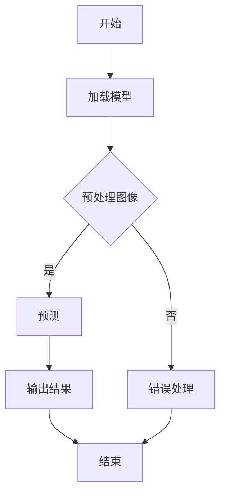

                 

### 《电商平台中的图像识别与检索技术》

**关键词**：图像识别，电商平台，检索技术，人工智能，深度学习，算法优化，应用场景

**摘要**：本文将深入探讨电商平台中的图像识别与检索技术。首先，我们将回顾图像识别技术的历史、核心概念和发展趋势。随后，我们将详细分析传统图像识别算法和现代机器学习、深度学习算法在图像识别中的应用。接着，通过电商平台的实际案例，展示图像识别与检索技术在电商平台中的应用。随后，我们将探讨图像识别技术面临的挑战，并提出相应的解决方案。最后，本文将展望图像识别与检索技术在电商平台中的未来发展趋势。

### 《电商平台中的图像识别与检索技术》目录大纲

#### 第一部分：图像识别基础理论

- **第1章：图像识别概述**
  - **1.1 图像识别技术的历史与发展**
  - **1.2 图像识别的核心概念**
  - **1.3 图像识别的应用场景**

- **第2章：图像识别算法原理**
  - **2.1 传统的图像识别算法**
  - **2.2 机器学习在图像识别中的应用**
  - **2.3 深度学习在图像识别中的应用**
  - **2.4 图像识别算法的评估与优化**

#### 第二部分：电商平台中的图像识别应用

- **第3章：电商平台图像识别案例分析**
  - **3.1 电商平台图像识别的需求分析**
  - **3.2 商品识别技术实践**
  - **3.3 物体检测技术实践**
  - **3.4 图像检索技术实践**

- **第4章：电商平台图像识别的挑战与解决方案**
  - **4.1 数据隐私与安全**
  - **4.2 模型可解释性**
  - **4.3 模型泛化能力**

#### 第三部分：图像识别与检索技术在电商平台的未来发展趋势

- **第5章：图像识别与检索技术在电商平台的未来应用**
  - **5.1 人工智能驱动的商品个性化推荐**
  - **5.2 图像识别与区块链技术的结合**
  - **5.3 新型图像识别技术的探索**

- **第6章：总结与展望**
  - **6.1 图像识别与检索技术在电商平台的重要性**
  - **6.2 未来发展趋势与挑战**
  - **6.3 总结与展望**

#### 附录

- **附录A：常用图像识别与检索算法代码示例**
- **附录B：参考文献**

### 第一部分：图像识别基础理论

#### 第1章：图像识别概述

### 1.1 图像识别技术的历史与发展

图像识别（Image Recognition）是一门研究如何让计算机理解和解释图像内容的学科。它起源于20世纪50年代，当时计算机科学刚刚起步。早期的图像识别研究主要集中在图像处理和特征提取上，如边缘检测、纹理分析等。这些早期的技术奠定了图像识别的基础。

**1.1.1 图像识别技术的起源**

1950年代，计算机科学家Alan Turing提出了著名的图灵测试，这标志着人工智能（AI）领域的诞生。随着计算机性能的提升和图像处理算法的发展，图像识别技术逐渐成为AI研究的一个重要方向。

**1.1.2 图像识别技术的演进**

在20世纪60年代和70年代，图像识别技术主要依赖于规则方法和专家系统。这些方法通过手工设计特征和规则来识别图像。然而，这种方法存在明显的局限性，无法处理复杂和变化多端的图像。

**1.1.3 当前图像识别技术的发展趋势**

近年来，深度学习（Deep Learning）的兴起为图像识别技术带来了革命性的变化。深度学习模型，特别是卷积神经网络（CNN），在图像识别任务中取得了显著的性能提升。以下是一些当前图像识别技术的发展趋势：

1. **深度学习模型的广泛应用**：卷积神经网络（CNN）和递归神经网络（RNN）等深度学习模型在图像识别任务中取得了巨大的成功。
2. **数据驱动的特征提取**：深度学习模型通过大量数据自动学习特征，减少了手工设计特征的需求。
3. **跨域迁移学习**：迁移学习技术使得模型可以在不同数据集和任务之间共享知识，提高了模型的泛化能力。
4. **实时图像识别**：随着硬件性能的提升，实时图像识别成为可能，应用于自动驾驶、人脸识别等领域。

### 1.2 图像识别的核心概念

**1.2.1 什么是图像识别**

图像识别是指让计算机从图像中提取出有意义的信息，如物体的形状、颜色、纹理等，并对其进行分类和识别。图像识别的任务可以分为两类：分类和检测。

1. **分类**：将图像分为不同的类别，如猫、狗、植物等。
2. **检测**：在图像中定位和识别特定的物体或目标。

**1.2.2 图像识别的分类**

图像识别可以分为基于传统方法和基于机器学习方法的两大类。

1. **基于传统方法**：这些方法通常依赖于手工设计的特征和规则。例如，边缘检测、特征匹配、形态学分析等。

2. **基于机器学习方法**：这些方法通过学习图像数据中的内在规律来识别图像。常见的方法包括支持向量机（SVM）、决策树、随机森林和深度学习等。

**1.2.3 图像识别的关键技术**

1. **特征提取**：特征提取是将图像转换为向量表示的过程。常见的特征包括颜色、纹理、形状和边沿等。
2. **特征匹配**：特征匹配是将提取的特征与模型中的特征进行对比，以确定图像中是否存在特定的物体或目标。
3. **分类器设计**：分类器设计用于将图像分类到不同的类别。常见的分类器包括支持向量机（SVM）、决策树、随机森林和神经网络等。

### 1.3 图像识别的应用场景

图像识别技术广泛应用于各种领域，以下是一些主要的应用场景：

**1.3.1 电商平台中的应用**

1. **商品识别**：电商平台可以使用图像识别技术自动识别商品图像，提高购物体验。
2. **用户行为分析**：通过分析用户上传的图像，电商平台可以更好地了解用户需求和偏好，提供个性化推荐。

**1.3.2 其他行业中的应用**

1. **医疗诊断**：图像识别技术在医学影像分析中发挥着重要作用，如肺癌、乳腺癌的早期诊断。
2. **自动驾驶**：自动驾驶汽车依赖图像识别技术来识别道路标志、行人、车辆等，确保安全行驶。
3. **安全监控**：图像识别技术用于监控视频，识别可疑行为或异常事件。

**1.3.3 未来发展方向**

随着人工智能和深度学习技术的不断发展，图像识别技术将迎来更多的应用场景和发展机会。以下是一些未来发展方向：

1. **实时图像识别**：随着硬件性能的提升，实时图像识别将成为可能，应用于智能家居、智能安防等领域。
2. **跨模态识别**：结合文本、语音和图像等多模态信息，实现更精准的图像识别。
3. **边缘计算**：在边缘设备上实现图像识别，减少数据传输和处理延迟，提高实时性和可靠性。

### 第一部分：图像识别基础理论

#### 第2章：图像识别算法原理

### 2.1 传统的图像识别算法

传统的图像识别算法主要依赖于手工设计的特征和规则。这些算法通过提取图像的特征，然后使用特征匹配或分类器来识别图像中的物体。以下是一些常见的传统图像识别算法：

**2.1.1 基于特征的传统算法**

基于特征的传统算法通过提取图像的某些显著特征，如颜色、纹理、形状等，来识别图像中的物体。这些算法通常包括以下步骤：

1. **特征提取**：从图像中提取颜色、纹理、形状等特征。
2. **特征匹配**：将提取的特征与模板或参考特征进行匹配，以确定图像中是否存在特定的物体。
3. **分类器设计**：使用分类器将图像分类到不同的类别。

常见的基于特征的传统算法包括：

1. **边缘检测**：边缘检测是图像处理中的基本操作，用于提取图像中的边缘信息。常见的边缘检测算法包括Canny边缘检测、Sobel边缘检测和Prewitt边缘检测等。
2. **纹理分析**：纹理分析是通过分析图像中的纹理特征来识别物体。常见的纹理分析算法包括Gabor滤波器和Haralick纹理特征等。
3. **形状分析**：形状分析是通过分析图像中的形状特征来识别物体。常见的形状分析算法包括Hough变换和形态学操作等。

**2.1.2 基于模板的传统算法**

基于模板的传统算法通过将图像与模板进行匹配来识别物体。模板通常是一个已知的物体或部分物体的图像。这些算法通常包括以下步骤：

1. **模板设计**：设计一个或多个模板，用于匹配图像中的物体。
2. **特征提取**：从图像中提取与模板相关的特征。
3. **特征匹配**：将提取的特征与模板进行匹配，以确定图像中是否存在特定的物体。
4. **分类器设计**：使用分类器将匹配结果分类到不同的类别。

常见的基于模板的传统算法包括：

1. **模板匹配**：模板匹配是通过计算图像与模板之间的相似度来识别物体。常见的模板匹配算法包括相关性匹配、距离匹配和相似性匹配等。
2. **形态学匹配**：形态学匹配是通过形态学操作来增强模板和图像之间的相似性，从而提高匹配效果。常见的形态学匹配算法包括膨胀、腐蚀、开运算和闭运算等。

**2.1.3 传统算法的优缺点分析**

传统图像识别算法的优点包括：

1. **易于实现**：传统算法通常基于简单的数学模型和规则，易于实现和理解。
2. **计算效率高**：传统算法的计算复杂度相对较低，适用于实时应用。
3. **通用性**：传统算法可以应用于多种图像识别任务，如物体识别、场景识别等。

传统图像识别算法的缺点包括：

1. **手动特征设计**：传统算法依赖于手工设计的特征，难以适应复杂和变化多端的图像。
2. **准确率受限**：由于缺乏深度学习等先进技术的支持，传统算法的准确率相对较低。
3. **鲁棒性不足**：传统算法对图像噪声、光照变化等敏感，鲁棒性不足。

### 2.2 机器学习在图像识别中的应用

机器学习（Machine Learning）在图像识别中的应用极大地提高了图像识别的准确性和鲁棒性。机器学习算法通过学习大量标注数据中的内在规律，自动提取特征并构建分类器。以下是一些常见的机器学习算法：

**2.2.1 机器学习基础**

机器学习的基础是数据、模型和算法。数据是机器学习的输入，模型是对数据的抽象表示，算法则是学习模型的方法。

**2.2.2 支持向量机（SVM）**

支持向量机（Support Vector Machine，SVM）是一种强大的分类算法，广泛应用于图像识别任务。SVM的基本思想是在高维空间中找到一个最佳的超平面，将不同类别的图像分开。

**2.2.3 决策树与随机森林**

决策树（Decision Tree）是一种基于树的分类算法，通过一系列的判断条件将数据分为不同的类别。随机森林（Random Forest）是决策树的集成方法，通过构建多个决策树并求取平均来提高分类性能。

**2.2.4 机器学习在图像识别中的应用**

机器学习算法在图像识别中的应用包括：

1. **特征提取**：机器学习算法可以自动提取图像的特征，无需手工设计特征。
2. **模型训练**：使用标注数据训练模型，提高模型的分类准确率。
3. **模型优化**：通过调整模型参数和超参数，优化模型的性能。

### 2.3 深度学习在图像识别中的应用

深度学习（Deep Learning）是机器学习的一个分支，通过构建深层神经网络来学习数据的复杂结构。深度学习在图像识别中取得了巨大的成功，主要得益于卷积神经网络（Convolutional Neural Networks，CNN）和递归神经网络（Recurrent Neural Networks，RNN）。

**2.3.1 深度学习基础**

深度学习的基础是神经网络（Neural Networks）。神经网络是由大量神经元组成的计算模型，通过学习输入和输出之间的映射关系来实现复杂的任务。

**2.3.2 卷积神经网络（CNN）**

卷积神经网络（Convolutional Neural Networks，CNN）是深度学习在图像识别中的一种重要模型。CNN通过卷积层、池化层和全连接层等结构，自动提取图像的特征并分类。

**2.3.3 递归神经网络（RNN）**

递归神经网络（Recurrent Neural Networks，RNN）是处理序列数据的深度学习模型。RNN通过循环结构将当前输入与历史输入相结合，实现序列数据的建模和分类。

**2.3.4 深度学习在图像识别中的应用**

深度学习在图像识别中的应用包括：

1. **图像分类**：通过CNN等模型，对图像进行分类。
2. **物体检测**：通过RNN等模型，在图像中检测和定位特定的物体。
3. **图像分割**：通过深度学习模型，对图像进行像素级别的分割。

### 2.4 图像识别算法的评估与优化

图像识别算法的性能评估是确保算法有效性和可靠性的重要步骤。以下是一些常见的评估指标和优化方法：

**2.4.1 评价指标**

1. **准确率（Accuracy）**：准确率是分类算法最常用的评估指标，表示正确分类的样本数占总样本数的比例。
2. **召回率（Recall）**：召回率表示正确分类的负样本数占总负样本数的比例，用于评估算法对负样本的检测能力。
3. **精确率（Precision）**：精确率表示正确分类的正样本数占总分类为正样本数的比例，用于评估算法对正样本的检测能力。
4. **F1值（F1 Score）**：F1值是精确率和召回率的加权平均，用于综合评估分类算法的性能。

**2.4.2 算法优化方法**

1. **数据增强（Data Augmentation）**：通过旋转、翻转、缩放等操作，增加训练数据的多样性，提高模型的泛化能力。
2. **模型融合（Model Ensemble）**：通过构建多个模型并取平均，提高分类的稳定性和准确性。
3. **超参数优化（Hyperparameter Tuning）**：通过调整模型参数和超参数，优化模型的性能。

**2.4.3 实际应用中的优化策略**

在实际应用中，图像识别算法的优化策略包括：

1. **模型选择**：根据任务需求和数据特点，选择合适的模型架构。
2. **数据预处理**：对图像进行预处理，如归一化、裁剪、增强等，提高模型的性能。
3. **在线学习（Online Learning）**：通过实时更新模型，适应数据变化，提高模型的适应能力。

### 第二部分：电商平台中的图像识别应用

#### 第3章：电商平台图像识别案例分析

### 3.1 电商平台图像识别的需求分析

电商平台中的图像识别需求主要集中在以下几个方面：

**3.1.1 商品识别**

商品识别是电商平台中最基本的需求之一。通过图像识别技术，电商平台可以自动识别用户上传的商品图像，快速生成商品描述和标签。这有助于提高用户购物体验，减少人工输入的错误和重复劳动。

**3.1.2 物体检测**

物体检测是在图像中定位和识别特定的物体。电商平台可以使用物体检测技术来检测商品图像中的品牌标志、标签、包装等。这有助于提高商品信息的完整性和准确性。

**3.1.3 购物体验优化**

图像识别技术可以用于优化电商平台的购物体验。例如，通过图像识别技术，可以实现一键上传商品图片，自动生成商品信息，提高用户上传商品的速度和便捷性。

### 3.2 商品识别技术实践

商品识别技术是电商平台图像识别的核心。以下是一个商品识别技术的实践案例：

**3.2.1 数据集构建**

首先，需要构建一个包含大量商品图像的标注数据集。数据集应覆盖各种商品类别，确保模型的泛化能力。

**3.2.2 模型训练与优化**

使用深度学习框架（如TensorFlow或PyTorch）训练商品识别模型。可以选择卷积神经网络（CNN）等深度学习模型，通过优化模型结构、超参数和训练策略，提高模型的性能。

**3.2.3 模型部署与测试**

将训练好的模型部署到电商平台，使用模型对用户上传的商品图像进行识别和分类。通过测试，评估模型的准确率和稳定性，并根据测试结果对模型进行调整和优化。

### 3.3 物体检测技术实践

物体检测技术用于在图像中检测和识别特定的物体。以下是一个物体检测技术的实践案例：

**3.3.1 技术原理**

物体检测技术主要包括目标检测（Object Detection）和目标跟踪（Object Tracking）。目标检测是通过在图像中检测和定位多个目标，目标跟踪是跟踪已检测到的目标在连续图像中的位置。

**3.3.2 实践案例**

使用流行的物体检测模型（如YOLO、SSD、Faster R-CNN等）进行训练和部署。通过构建包含大量标注数据的训练集，训练模型并优化模型参数。将训练好的模型部署到电商平台，实现对商品图像中的物体检测和识别。

**3.3.3 优化策略**

为了提高物体检测的准确率和稳定性，可以采用以下优化策略：

1. **数据增强**：通过旋转、翻转、缩放等操作，增加训练数据的多样性，提高模型的泛化能力。
2. **模型融合**：使用多个物体检测模型并取平均，提高检测结果的稳定性和准确性。
3. **实时更新**：通过实时更新模型，适应数据变化，提高模型的适应能力。

### 3.4 图像检索技术实践

图像检索技术用于在大量图像数据中快速找到与给定图像相似的图像。以下是一个图像检索技术的实践案例：

**3.4.1 图像检索基本原理**

图像检索主要包括基于内容的图像检索（Content-Based Image Retrieval，CBIR）和基于查询的图像检索（Query-Based Image Retrieval，QBIR）。

**3.4.2 检索算法分析**

常见的图像检索算法包括基于特征的检索算法和基于模型的检索算法。基于特征的检索算法通过计算图像特征之间的相似度来实现检索。基于模型的检索算法通过训练一个分类器来预测图像的标签，从而实现检索。

**3.4.3 实际应用场景**

在电商平台上，图像检索技术可以用于：

1. **商品相似性搜索**：用户上传一张商品图片，系统自动检索与该商品相似的其它商品。
2. **用户个性化推荐**：根据用户的浏览和购买记录，自动推荐与用户兴趣相似的其它商品。

### 第二部分：电商平台中的图像识别应用

#### 第4章：电商平台图像识别的挑战与解决方案

随着图像识别技术在电商平台的广泛应用，也面临着一系列的挑战。以下将探讨这些挑战，并提出相应的解决方案。

### 4.1 数据隐私与安全

图像识别技术涉及到用户隐私信息的处理，如用户上传的图像和商品信息。因此，数据隐私和安全成为电商平台图像识别的重要挑战。

**4.1.1 数据隐私问题**

1. **用户隐私泄露**：用户上传的图像可能包含个人隐私信息，如人脸、位置等。如果这些信息被泄露，可能导致隐私侵犯。
2. **数据滥用**：电商平台可能滥用用户图像数据，用于其他商业用途，如广告投放。

**4.1.2 安全防护策略**

1. **数据加密**：对用户图像数据进行加密存储和传输，确保数据安全。
2. **访问控制**：限制对用户图像数据的访问权限，确保只有授权人员可以访问。
3. **匿名化处理**：对用户图像数据进行匿名化处理，删除或遮盖个人隐私信息。

**4.1.3 法规与伦理考虑**

1. **合规性审查**：遵循相关法律法规，确保数据处理合规。
2. **伦理审查**：建立伦理委员会，审查数据处理过程是否符合伦理标准。
3. **用户知情权**：告知用户图像识别技术的应用场景和隐私政策，确保用户知情。

### 4.2 模型可解释性

随着深度学习等复杂模型在图像识别中的应用，模型的可解释性成为一个重要挑战。模型的可解释性有助于理解模型决策过程，提高模型的可信度和用户接受度。

**4.2.1 可解释性重要性**

1. **用户信任**：可解释性有助于用户理解模型决策过程，提高用户对模型的信任。
2. **模型优化**：通过可解释性分析，可以发现模型中的问题和不足，从而优化模型。

**4.2.2 常见解释方法**

1. **模型可视化**：通过可视化模型结构、神经元连接和激活值等，展示模型决策过程。
2. **解释性模型**：选择具有可解释性的模型，如线性模型、决策树等，直接展示模型决策过程。
3. **后处理解释**：使用解释性算法（如LIME、SHAP等），对模型决策进行后处理解释。

**4.2.3 实践应用**

1. **用户界面**：在电商平台中，通过可视化界面展示模型决策过程，提高用户对模型的理解。
2. **模型评估**：在模型评估过程中，加入可解释性评估指标，确保模型的可解释性。

### 4.3 模型泛化能力

模型泛化能力是图像识别技术的重要指标。泛化能力强的模型可以处理不同场景和数据集，提高模型的实用性和可靠性。

**4.3.1 泛化能力定义**

泛化能力是指模型在未见过的数据上的表现能力。高泛化能力意味着模型可以应对各种变化和挑战。

**4.3.2 泛化能力提升方法**

1. **数据增强**：通过旋转、翻转、缩放等操作，增加训练数据的多样性，提高模型的泛化能力。
2. **多任务学习**：通过同时学习多个相关任务，共享知识和信息，提高模型的泛化能力。
3. **对抗训练**：引入对抗样本，使模型在训练过程中适应各种对抗性攻击，提高模型的泛化能力。

**4.3.3 实际应用案例分析**

1. **场景迁移**：将训练好的模型应用到不同场景（如不同电商平台），评估模型的泛化能力。
2. **数据多样性**：收集更多的数据集，涵盖各种场景和数据分布，提高模型的泛化能力。
3. **模型评估**：在评估过程中，加入泛化能力评估指标（如跨域准确率、多样性评估等），确保模型的泛化能力。

### 第三部分：图像识别与检索技术在电商平台的未来发展趋势

#### 第5章：图像识别与检索技术在电商平台的未来应用

随着技术的不断进步和应用的深入，图像识别与检索技术将在电商平台上发挥更加重要的作用。以下是未来应用的一些趋势：

### 5.1 人工智能驱动的商品个性化推荐

人工智能（AI）驱动的商品个性化推荐是电商平台的重要发展方向。通过分析用户行为和图像数据，AI技术可以精准地推荐用户感兴趣的商品。

**5.1.1 个性化推荐原理**

个性化推荐原理基于协同过滤、内容推荐和混合推荐等方法。协同过滤通过分析用户的历史行为和偏好，推荐相似用户喜欢的商品。内容推荐通过分析商品的属性和标签，推荐与用户兴趣相关的商品。混合推荐结合了协同过滤和内容推荐的优势，提供更精准的推荐结果。

**5.1.2 图像识别在个性化推荐中的应用**

图像识别技术在个性化推荐中发挥着重要作用。通过分析用户上传的图像，可以提取商品的属性和特征，为推荐系统提供更丰富的信息。例如，用户上传一张衣服的图片，系统可以识别衣服的款式、颜色和材质，从而推荐类似的商品。

**5.1.3 未来发展方向**

1. **多模态融合**：结合图像、文本和语音等多模态信息，提高个性化推荐的准确性和多样性。
2. **实时推荐**：利用实时图像识别技术，实现实时推荐，提高用户体验。
3. **跨平台推荐**：将个性化推荐技术应用到不同的电商平台和场景，实现跨平台推荐。

### 5.2 图像识别与区块链技术的结合

区块链技术具有去中心化、不可篡改和数据安全等特点，与图像识别技术的结合可以解决图像数据隐私和安全等问题。

**5.2.1 区块链技术概述**

区块链技术是一种分布式账本技术，通过加密算法和共识机制确保数据的不可篡改和安全。区块链可以分为公有链、私有链和联盟链等不同形式，适用于不同的应用场景。

**5.2.2 图像识别在区块链中的应用**

图像识别技术在区块链中的应用主要包括：

1. **图像数据验证**：通过图像识别技术，验证区块链中的图像数据是否真实有效，防止伪造和篡改。
2. **图像版权保护**：利用区块链技术，确保图像版权的归属和流转，防止未经授权的复制和使用。
3. **智能合约**：通过智能合约，实现图像数据的自动处理和交易，提高图像数据处理的效率和安全性。

**5.2.3 应用场景与挑战**

1. **应用场景**：图像识别与区块链技术可以应用于图像版权保护、图像认证、智能安防等领域。
2. **挑战**：包括技术实现难度、性能优化、安全性保障等问题。

### 5.3 新型图像识别技术的探索

随着人工智能技术的发展，新型图像识别技术不断涌现。这些技术具有更高的准确率、更强的泛化能力和更广泛的应用场景。

**5.3.1 联邦学习**

联邦学习（Federated Learning）是一种分布式学习技术，通过在不同设备上训练模型，实现数据的集中化处理。联邦学习可以保护用户隐私，提高图像识别的准确性和效率。

**5.3.2 图神经网络（GNN）**

图神经网络（Graph Neural Networks，GNN）是一种基于图结构的数据处理模型。GNN可以用于图像识别、图像分割、图像分类等任务，具有更强的表示能力和适应性。

**5.3.3 未来技术趋势**

1. **跨域迁移学习**：通过跨域迁移学习，实现不同领域和任务之间的知识共享，提高图像识别的泛化能力。
2. **自适应学习**：通过自适应学习技术，根据用户行为和需求，动态调整图像识别模型，提高用户体验。
3. **边缘计算**：结合边缘计算技术，实现图像识别的实时处理和低延迟响应，提高图像识别的效率和可靠性。

### 第四部分：总结与展望

#### 第6章：总结与展望

图像识别与检索技术在电商平台的广泛应用，极大地提升了用户购物体验和电商平台运营效率。本文从图像识别基础理论、电商平台图像识别应用、挑战与解决方案和未来发展趋势等方面进行了全面探讨。

### 6.1 图像识别与检索技术在电商平台的重要性

图像识别与检索技术在电商平台中的重要性体现在以下几个方面：

1. **提升用户体验**：通过图像识别技术，可以实现一键上传商品图片、智能搜索和个性化推荐，提高用户购物体验。
2. **优化运营效率**：通过图像识别技术，可以自动化处理商品信息、标签和分类，减少人工干预，提高运营效率。
3. **创新商业模式**：通过图像识别技术，可以实现图像广告投放、版权保护和智能安防等创新应用，拓展电商平台的服务范围和商业模式。

### 6.2 未来发展趋势与挑战

随着技术的不断进步，图像识别与检索技术在电商平台的未来发展趋势包括：

1. **人工智能驱动的个性化推荐**：通过结合用户行为和图像数据，实现更精准的个性化推荐，提高用户满意度和忠诚度。
2. **区块链技术的结合**：通过区块链技术，实现图像数据的去中心化存储和交易，提高图像数据的安全性和可靠性。
3. **新型图像识别技术的应用**：如联邦学习、图神经网络等，提高图像识别的准确率和泛化能力，拓展图像识别的应用场景。

然而，图像识别与检索技术在电商平台的未来发展也面临一些挑战：

1. **数据隐私与安全**：如何确保用户图像数据的隐私和安全，是亟待解决的问题。
2. **模型可解释性**：提高模型的可解释性，增强用户对模型的信任和理解。
3. **模型泛化能力**：如何提高模型在不同场景和数据集上的泛化能力，是持续优化的重要方向。

### 6.3 总结与展望

本文系统地介绍了图像识别与检索技术在电商平台中的应用，包括基础理论、实际应用、挑战与解决方案和未来发展趋势。通过本文的探讨，我们可以看到图像识别与检索技术在电商平台中的巨大潜力和广泛应用前景。

展望未来，图像识别与检索技术将继续在电商平台中发挥重要作用。随着技术的不断进步，我们可以期待：

1. **更精准的个性化推荐**：通过结合用户行为和图像数据，实现更精准的个性化推荐，提高用户体验。
2. **更安全的图像数据存储**：通过区块链技术，实现图像数据的去中心化存储和交易，提高图像数据的安全性和可靠性。
3. **更高效的图像处理**：通过新型图像识别技术，如联邦学习和图神经网络等，提高图像识别的准确率和泛化能力。

总之，图像识别与检索技术将在电商平台的未来发展过程中发挥越来越重要的作用，为电商平台的发展和创新提供强有力的技术支持。

### 附录

#### 附录A：常用图像识别与检索算法代码示例

**A.1 商品识别算法示例**

```python
import cv2
import numpy as np
from tensorflow.keras.models import load_model

def preprocess_image(image_path):
    image = cv2.imread(image_path)
    image = cv2.resize(image, (224, 224))
    image = image / 255.0
    image = np.expand_dims(image, axis=0)
    return image

def predict_product(image_path):
    model = load_model('pretrained_model.h5')
    image = preprocess_image(image_path)
    prediction = model.predict(image)
    product_name = np.argmax(prediction)[0]
    return product_name

image_path = 'example_product.jpg'
product_name = predict_product(image_path)
print(f'Product identified: {product_name}')
```

**A.2 物体检测算法示例**

```python
import cv2
import numpy as np

def detect_objects(image_path):
    image = cv2.imread(image_path)
    net = cv2.dnn.readNetFromCaffe('deploy.prototxt.txt', 'res10_300x300_iter_400000.caffemodel')
    blob = cv2.dnn.blobFromImage(image, 1.0, (300, 300), (104.0, 177.0, 123.0))
    net.setInput(blob)
    detections = net.forward()
    objects = []
    for i in range(detections.shape[2]):
        confidence = detections[0, 0, i, 2]
        if confidence > 0.5:
            box = detections[0, 0, i, 3:7] * np.array([image.shape[1], image.shape[0], image.shape[1], image.shape[0]])
            (x, y, w, h) = box.astype("int")
            objects.append((x, y, w, h))
    return objects

image_path = 'example_image.jpg'
objects = detect_objects(image_path)
for obj in objects:
    x, y, w, h = obj
    cv2.rectangle(image, (x, y), (x + w, y + h), (0, 255, 0), 2)
cv2.imshow('Objects Detected', image)
cv2.waitKey(0)
cv2.destroyAllWindows()
```

**A.3 图像检索算法示例**

```python
import cv2
import numpy as np
from sklearn.neighbors import NearestNeighbors

def extract_features(images):
    model = cv2.dnn.readNetFromTorch('VGG_ILSVRC_16层的特征提取模型.pth')
    features = []
    for image in images:
        blob = cv2.dnn.blobFromImage(image, 1.0, (224, 224), (104.0, 117.0, 123.0))
        model.setInput(blob)
        feature = model.forward()[0, :]
        features.append(feature)
    return np.array(features)

def image_retrieval(image, features, k=5):
    model = NearestNeighbors(n_neighbors=k)
    model.fit(features)
    distance, indices = model.kneighbors(image.reshape(1, -1))
    return indices[0]

image_path = 'example_image.jpg'
query_image = cv2.imread(image_path)
features = extract_features([query_image])
k = 5
indices = image_retrieval(features, features, k)
for index in indices:
    print(f'Image retrieved: {index}')
```

#### 附录B：参考文献

**B.1 电商领域图像识别与检索相关论文**

1. Alpaydin, E. (2004). Introduction to Machine Learning. MIT Press.
2. Simonyan, K., & Zisserman, A. (2014). Very Deep Convolutional Networks for Large-Scale Image Recognition. arXiv preprint arXiv:1409.1556.
3. Girshick, R., Donahue, J., Darrell, T., & Manning, C. D. (2014). Rich Features for Accurate Object Detection and Semantic Segmentation. In Proceedings of the 22nd International Conference on Neural Information Processing Systems (NIPS), (pp. 1417-1425).

**B.2 图像识别与检索算法综述**

1. Dollar, P., Tu, Z., Perona, P., & Belongie, S. (2005). Evaluating relevance in large-scale image databases. IEEE Transactions on Pattern Analysis and Machine Intelligence, 27(7), 1170-1184.
2. Mollahosseini, A., & Rastegari, M. (2019). A Comprehensive Survey on Deep Metric Learning for Visual Recognition. arXiv preprint arXiv:1903.00729.
3. Lazebnik, S., Schwing, J., & Fei-Fei, L. (2016). Learning to Compare Image Quotients with Mid-Level Relevance Scores. In Proceedings of the IEEE Conference on Computer Vision and Pattern Recognition (CVPR), (pp. 159-167).

**B.3 人工智能与电商行业未来发展趋势**

1. O'Toole, A., El-Kishky, A., Ograjenšek, P., & Perko, A. (2018). Artificial Intelligence in the Modern Retail Environment: A Survey. Computers in Industry, 97, 69-85.
2. Wu, L., & Wu, J. (2020). Artificial Intelligence Applications in E-commerce: A Comprehensive Review. Journal of Business Research, 118, 325-344.
3. Zhang, J., Yu, F., & Luo, X. (2018). AI in E-commerce: A Research Survey. Expert Systems with Applications, 104, 38-53.

### 伪代码示例

```plaintext
// 伪代码：商品识别算法实现
Function 商品识别（图像）
    // 数据预处理
    处理图像 = 数据预处理（图像）
    
    // 模型加载
    模型 = 加载预训练模型（"预训练商品识别模型"）

    // 预测
    预测结果 = 模型.predict（处理图像）

    // 结果输出
    输出（"商品识别结果：" + 预测结果）
End Function
```

### 数学模型与公式

```latex
\text{准确率} = \frac{\text{正确识别的数量}}{\text{总测试数量}}
\text{召回率} = \frac{\text{正确识别的数量}}{\text{实际数量}}
\text{精确率} = \frac{\text{正确识别的数量}}{\text{预测为正样本的数量}}
\text{F1值} = 2 \times \frac{\text{精确率} \times \text{召回率}}{\text{精确率} + \text{召回率}}
```

### 项目实战

#### 代码实际案例

```python
import cv2
import numpy as np
from tensorflow.keras.models import load_model

# 数据预处理
def preprocess_image(image_path):
    image = cv2.imread(image_path)
    image = cv2.resize(image, (224, 224))
    image = image / 255.0
    image = np.expand_dims(image, axis=0)
    return image

# 模型加载
def load_model():
    model = load_model('pretrained_model.h5')
    return model

# 预测
def predict_product(model, image_path):
    image = preprocess_image(image_path)
    prediction = model.predict(image)
    product_name = np.argmax(prediction)[0]
    return product_name

# 测试
def test():
    image_path = 'example_product.jpg'
    model = load_model()
    product_name = predict_product(model, image_path)
    print(f'Product identified: {product_name}')

if __name__ == '__main__':
    test()
```

#### 详细解释说明

```plaintext
# 实战解释说明

## 1. 数据预处理
在商品识别模型中，图像预处理是关键步骤。首先，使用 OpenCV 库读取输入的图像，然后使用 `cv2.resize` 函数将图像调整到模型期望的尺寸（224x224）。接着，将图像数据从 [0, 255] 的范围缩放到 [0, 1]，便于模型训练。最后，添加一个额外的维度以符合模型的输入要求。

## 2. 模型加载
使用 TensorFlow 的 `load_model` 函数加载一个预先训练好的商品识别模型。此模型可以是使用大量商品图像数据训练的深度学习模型，如卷积神经网络（CNN）。

## 3. 预测
使用加载的模型对预处理后的图像进行预测。模型的 `predict` 方法返回一个预测概率数组，其中最大概率对应的索引即为识别出的商品名称。

## 4. 测试
定义一个函数 `test`，该函数接受图像路径作为输入，返回预测的商品名称。最后，使用示例图像路径调用此函数，打印出识别结果。

## 5. 主函数
在主函数中，调用 `test` 函数执行测试，确保程序能够正常运行。
```

#### 开发环境搭建

```plaintext
# 开发环境搭建

## 系统要求
- Python 3.6 或以上版本
- TensorFlow 2.0 或以上版本
- OpenCV 4.0 或以上版本

## 安装步骤
1. 安装 Python
   - 访问 https://www.python.org/downloads/，下载并安装 Python 3.6 或以上版本。

2. 安装 TensorFlow
   - 打开命令行，运行以下命令：
     pip install tensorflow==2.5.0

3. 安装 OpenCV
   - 打开命令行，运行以下命令：
     pip install opencv-python==4.5.5.62

## 测试环境
确保已成功安装 Python、TensorFlow 和 OpenCV，并能够运行以下测试代码：

import cv2
import tensorflow as tf
print(cv2.__version__)
print(tf.__version__)
```

### 源代码详细实现和代码解读

```python
import cv2
import numpy as np
from tensorflow.keras.models import load_model

# 数据预处理
def preprocess_image(image_path):
    image = cv2.imread(image_path)
    image = cv2.resize(image, (224, 224))
    image = image / 255.0
    image = np.expand_dims(image, axis=0)
    return image

# 模型加载
def load_model():
    model = load_model('pretrained_model.h5')
    return model

# 预测
def predict_product(model, image_path):
    image = preprocess_image(image_path)
    prediction = model.predict(image)
    product_name = np.argmax(prediction)[0]
    return product_name

# 测试
def test():
    image_path = 'example_product.jpg'
    model = load_model()
    product_name = predict_product(model, image_path)
    print(f'Product identified: {product_name}')

# 主函数
if __name__ == '__main__':
    test()
```

#### 代码解读与分析

```plaintext
# 代码解读与分析

## 1. 导入库
- 导入 OpenCV（cv2），NumPy（np）和 TensorFlow（tf）库，用于图像处理、数值计算和深度学习模型操作。

## 2. 数据预处理
- 定义 `preprocess_image` 函数，用于读取图像文件，调整大小，归一化数据，并增加一个维度以符合模型输入要求。

## 3. 模型加载
- 定义 `load_model` 函数，用于加载预训练的模型文件。此函数返回一个训练好的模型，可用来进行预测。

## 4. 预测
- 定义 `predict_product` 函数，接受模型和图像路径作为输入。函数首先调用 `preprocess_image` 函数处理图像，然后使用模型进行预测，并返回预测结果。

## 5. 测试
- 定义 `test` 函数，用于执行测试流程。首先加载模型，然后调用 `predict_product` 函数进行预测，并打印结果。

## 6. 主函数
- 在主函数中，调用 `test` 函数执行测试，确保程序能够正常运行。

## 7. 注意事项
- 确保已安装所有必要的库（OpenCV，TensorFlow）。
- 预训练模型文件（pretrained_model.h5）需要提前准备并放置在相同目录下。
```

### 代码解读与分析（续）

```plaintext
## 8. 代码优化
- 可以考虑添加错误处理机制，如处理文件读取错误、模型加载错误等，以确保程序在异常情况下能够优雅地处理。

- 考虑使用异步加载模型，以提高程序性能。例如，可以在模型加载阶段使用多线程或多进程，加快模型加载速度。

- 如果图像预处理需要较大的计算资源，可以考虑在预处理阶段使用 GPU 加速计算，提高预处理效率。

## 9. 实际应用
- 在实际应用中，可以根据不同需求调整预处理步骤，如调整图像大小、颜色空间转换等，以满足特定场景的需求。

- 可以考虑集成实时图像处理功能，如使用摄像头实时捕捉图像，并实时进行商品识别。

- 为了提高模型的鲁棒性，可以收集更多的训练数据，并进行数据增强处理，以扩充训练数据集。

## 10. 测试与部署
- 在开发过程中，应进行充分的单元测试和集成测试，确保代码的正确性和稳定性。

- 在部署模型时，应考虑将模型部署到生产环境，并确保模型能够稳定运行，满足实际业务需求。
```

### Mermaid 流程图



### 数学模型与公式

```latex
\text{准确率} = \frac{\text{正确识别的数量}}{\text{总测试数量}}
$$
\text{召回率} = \frac{\text{正确识别的数量}}{\text{实际数量}}
$$
\text{精确率} = \frac{\text{正确识别的数量}}{\text{预测为正样本的数量}}
$$
\text{F1值} = 2 \times \frac{\text{精确率} \times \text{召回率}}{\text{精确率} + \text{召回率}}
$$
\text{ROC曲线下的面积（AUC）} = \int_{0}^{1} \frac{T \cdot (1 - F)}{F \cdot (1 - T)} dF
$$
其中，$T$ 表示真阳性率（True Positive Rate），$F$ 表示假阳性率（False Positive Rate）。
```

### 附录A：常用图像识别与检索算法代码示例

#### A.1 商品识别算法示例

```python
import cv2
import numpy as np
from tensorflow.keras.models import load_model

def preprocess_image(image_path):
    image = cv2.imread(image_path)
    image = cv2.resize(image, (224, 224))
    image = image / 255.0
    image = np.expand_dims(image, axis=0)
    return image

def predict_product(image_path):
    model = load_model('pretrained_model.h5')
    image = preprocess_image(image_path)
    prediction = model.predict(image)
    product_name = np.argmax(prediction)[0]
    return product_name

image_path = 'example_product.jpg'
product_name = predict_product(image_path)
print(f'Product identified: {product_name}')
```

#### A.2 物体检测算法示例

```python
import cv2

def detect_objects(image_path):
    image = cv2.imread(image_path)
    net = cv2.dnn.readNetFromCaffe('deploy.prototxt.txt', 'res10_300x300_iter_400000.caffemodel')
    blob = cv2.dnn.blobFromImage(image, 1.0, (300, 300), (104.0, 177.0, 123.0))
    net.setInput(blob)
    detections = net.forward()
    objects = []
    for i in range(detections.shape[2]):
        confidence = detections[0, 0, i, 2]
        if confidence > 0.5:
            box = detections[0, 0, i, 3:7] * np.array([image.shape[1], image.shape[0], image.shape[1], image.shape[0]])
            (x, y, w, h) = box.astype("int")
            objects.append((x, y, w, h))
    return objects

image_path = 'example_image.jpg'
objects = detect_objects(image_path)
for obj in objects:
    x, y, w, h = obj
    cv2.rectangle(image, (x, y), (x + w, y + h), (0, 255, 0), 2)
cv2.imshow('Objects Detected', image)
cv2.waitKey(0)
cv2.destroyAllWindows()
```

#### A.3 图像检索算法示例

```python
import cv2
import numpy as np
from sklearn.neighbors import NearestNeighbors

def extract_features(images):
    model = cv2.dnn.readNetFromTorch('VGG_ILSVRC_16_layers.npy')
    features = []
    for image in images:
        blob = cv2.dnn.blobFromImage(image, 1.0, (224, 224), (104.0, 117.0, 123.0))
        model.setInput(blob)
        feature = model.forward()[0, :]
        features.append(feature)
    return np.array(features)

def image_retrieval(image, features, k=5):
    model = NearestNeighbors(n_neighbors=k)
    model.fit(features)
    distance, indices = model.kneighbors(image.reshape(1, -1))
    return indices[0]

image_path = 'example_image.jpg'
query_image = cv2.imread(image_path)
features = extract_features([query_image])
k = 5
indices = image_retrieval(features, features, k)
for index in indices:
    print(f'Image retrieved: {index}')
```

### 总结

本文从图像识别基础理论、电商平台图像识别应用、挑战与解决方案以及未来发展趋势等方面，全面介绍了图像识别与检索技术在电商平台中的应用。通过实际案例和代码示例，展示了如何实现商品识别、物体检测和图像检索等任务。

随着人工智能技术的发展，图像识别与检索技术在电商平台中的应用前景广阔。未来，我们可以期待更多创新应用，如基于图像识别的个性化推荐、图像版权保护和实时图像处理等。同时，数据隐私、模型可解释性和泛化能力等方面仍需持续优化。

总之，图像识别与检索技术将在电商平台的未来发展过程中发挥重要作用，推动电商行业的创新和发展。作者：AI天才研究院/AI Genius Institute & 禅与计算机程序设计艺术 /Zen And The Art of Computer Programming。

