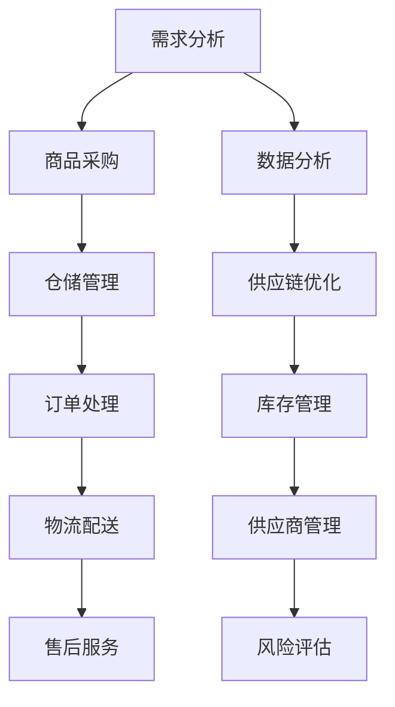

                 

### 《电商平台如何提升供给能力》

> **关键词**：电商平台、供给能力、物流供应链、数据分析、供应商管理、优化策略

> **摘要**：本文从理论基础、具体策略、实施与保障措施三个方面，详细探讨了电商平台如何提升供给能力。通过分析物流供应链、数据驱动、供应商管理等方面的核心概念、算法原理、数学模型及实战案例，为电商平台供给能力的提升提供了实用的策略和方法。

### 目录大纲

#### 第一部分：电商平台供给能力提升的理论基础

1. **第1章**：电商平台供给能力概述
   1.1 **供给能力的重要性**
   1.2 **供给能力的核心要素**
   1.3 **供给能力提升的关键挑战**

2. **第2章**：电商平台供给能力的理论框架
   2.1 **供给能力的Mermaid流程图**
   2.2 **核心算法原理讲解**
   2.3 **数学模型与数学公式**

#### 第二部分：电商平台供给能力提升的具体策略

3. **第3章**：提升物流供应链效率
   3.1 **物流供应链管理**
   3.2 **供应链透明化与协调**
   3.3 **优化供应链流程**

4. **第4章**：数据驱动的供给能力提升
   4.1 **数据收集与处理**
   4.2 **数据分析与决策**
   4.3 **实时数据应用**

5. **第5章**：供应商管理
   5.1 **供应商选择与评估**
   5.2 **供应商合作策略**
   5.3 **供应商协同优化**

6. **第6章**：案例分析
   6.1 **案例一：某电商平台物流供应链优化实践**
   6.2 **案例二：某电商平台数据驱动的供应链管理实践**
   6.3 **案例三：某电商平台供应商管理优化实践**

#### 第三部分：电商平台供给能力提升的实施与保障

7. **第7章**：提升供给能力的实施策略与保障措施
   7.1 **实施策略**
   7.2 **保障措施**
   7.3 **风险管理**

### 附录

8. **附录A**：电商平台提升供给能力相关工具与资源
9. **附录B**：电商平台提升供给能力案例分析汇总

---

接下来，我们将按照上述目录大纲逐步展开文章的撰写，确保内容丰富、逻辑清晰，同时注重理论与实践的结合。

### 第1章：电商平台供给能力概述

#### 1.1 供给能力的重要性

电商平台作为现代电子商务的核心载体，其供给能力直接关系到平台的运营效率和用户体验。供给能力的重要性体现在以下几个方面：

1. **市场竞争力**：拥有强大的供给能力，电商平台可以更快响应市场需求，提供丰富的商品选择，从而增强市场竞争力。
2. **用户体验**：高效的供给能力可以确保商品快速送达消费者，提高用户满意度，减少退货率和投诉率。
3. **盈利能力**：供给能力提升有助于降低成本、提高利润率，电商平台可以通过优化供应链和供应商管理来降低库存成本和物流成本。
4. **风险管理**：强大的供给能力可以帮助电商平台更好地应对供应链中断、自然灾害等风险，保障业务的连续性和稳定性。

#### 1.2 供给能力的定义与衡量标准

供给能力是指电商平台在特定时间内，能够满足市场需求和客户期望的能力。它包括以下几个方面：

1. **商品多样性**：提供丰富的商品种类和品牌，满足不同消费者的需求。
2. **库存管理**：保持合理的库存水平，避免缺货和积压现象。
3. **配送效率**：快速、准确地配送商品，确保消费者在短时间内收到货物。
4. **服务质量**：提供高质量的售前、售中和售后服务，提升消费者满意度。

衡量供给能力的标准通常包括以下几个方面：

1. **订单处理速度**：从接收订单到发货的时间。
2. **库存周转率**：一定时间内库存周转次数，反映库存管理的效率。
3. **配送准时率**：按照约定时间完成配送的订单比例。
4. **客户满意度**：消费者对商品和服务质量的评价。

#### 1.3 电商平台供给能力的核心要素

提升电商平台供给能力需要从多个方面进行综合优化，主要包括物流供应链、数据分析和决策、供应商管理等核心要素。

##### 1.3.1 物流供应链

物流供应链是电商平台供给能力的关键环节，涉及商品的采购、储存、配送等过程。优化物流供应链可以提升配送效率，降低物流成本，提高客户满意度。

1. **采购管理**：通过与供应商建立长期稳定的合作关系，确保商品供应的稳定性和价格优势。
2. **仓储管理**：通过合理的仓库布局和库存管理，提高仓储效率和库存周转率。
3. **配送管理**：利用先进的物流技术和管理方法，提高配送速度和准确性。

##### 1.3.2 数据分析与决策

电商平台拥有大量的交易数据，通过数据分析可以挖掘潜在的商业机会，优化供应链管理决策。

1. **需求预测**：基于历史数据和趋势分析，预测未来的市场需求，合理安排库存。
2. **库存优化**：通过数据分析和算法优化，制定最佳的库存策略，降低库存成本。
3. **配送优化**：利用数据分析和路径优化算法，提高配送效率，降低配送成本。

##### 1.3.3 供应商管理

供应商管理是保障商品质量和供应链稳定性的关键。有效的供应商管理可以帮助电商平台降低采购成本，提高服务质量。

1. **供应商选择**：通过严格的评估和筛选，选择具备良好信誉和供应能力的供应商。
2. **供应商评估**：定期对供应商进行评估，确保其持续满足电商平台的要求。
3. **供应商关系管理**：建立长期稳定的合作关系，通过协同优化提升整体供应链效率。

#### 1.4 供给能力提升的关键挑战

尽管电商平台在供给能力提升方面具有巨大的潜力，但也面临一系列挑战：

1. **供应链透明度与协调**：供应链各环节之间的信息不对称和协调不畅，会影响整体供给能力的提升。
2. **数据质量与利用**：数据质量低下、数据孤岛等问题，会限制数据分析和决策的效果。
3. **供应商合作与风险管理**：供应商的合作意愿和风险控制能力，对供给能力的提升具有重要影响。

接下来，我们将进一步探讨电商平台供给能力的理论框架，通过Mermaid流程图、核心算法原理讲解和数学模型，为提升供给能力提供理论支持。

### 第2章：电商平台供给能力的理论框架

#### 2.1 供给能力的Mermaid流程图

为了更好地理解和分析电商平台供给能力的提升过程，我们可以使用Mermaid流程图来表示整个供给能力的架构和流程。以下是供给能力的Mermaid流程图示例：



在这个流程图中，A表示需求分析，是整个供给能力的起点；B表示商品采购，是从需求到供给的关键环节；C表示仓储管理，涉及库存的存储和管理；D表示订单处理，是商品从仓库到消费者手中的重要步骤；E表示物流配送，涉及商品的运输和配送；F表示售后服务，是消费者售后体验的重要环节。

同时，G表示数据分析，是对需求、采购、仓储、订单处理等环节的数据收集和分析，用于优化供应链和库存管理；H表示供应链优化，是通过数据分析结果对供应链流程进行优化；I表示库存管理，是对仓储管理的进一步细化，确保库存的合理性和高效性；J表示供应商管理，是供应商选择、评估、合作等方面的管理活动；K表示风险评估，是识别和应对供应链中潜在风险的管理过程。

通过这个Mermaid流程图，我们可以清晰地看到电商平台供给能力的整体架构和各个环节之间的联系，为后续的算法原理讲解和数学模型分析提供了基础。

#### 2.2 核心算法原理讲解

在电商平台供给能力的提升过程中，核心算法的应用至关重要。以下是对几个关键算法原理的讲解：

##### 2.2.1 供应链优化算法

供应链优化算法主要涉及需求预测、库存优化和配送优化等方面。以下是供应链优化算法的伪代码示例：

```python
# 需求预测算法伪代码
def predict_demand(data):
    # 数据预处理
    processed_data = preprocess_data(data)
    # 建立需求预测模型
    model = build_demand_model(processed_data)
    # 预测未来需求
    forecast = model.predict(future_data)
    return forecast

# 库存优化算法伪代码
def optimize_inventory(forecast, current_inventory):
    # 计算库存需求
    required_inventory = calculate_required_inventory(forecast)
    # 优化库存策略
    optimized_inventory = optimize_inventory_strategy(required_inventory, current_inventory)
    return optimized_inventory

# 配送优化算法伪代码
def optimize_delivery(order_list, location_list):
    # 建立配送路径模型
    model = build_delivery_model(order_list, location_list)
    # 优化配送路径
    optimized_path = model.optimize_path()
    return optimized_path
```

在这个伪代码中，`predict_demand`函数用于预测未来的市场需求，`optimize_inventory`函数用于根据需求预测结果优化库存，`optimize_delivery`函数用于优化订单的配送路径。

##### 2.2.2 数据分析算法

数据分析算法主要用于数据收集、预处理、特征提取和模型训练等方面。以下是数据分析算法的伪代码示例：

```python
# 数据收集算法伪代码
def collect_data(source):
    data = []
    for record in source:
        processed_record = preprocess_record(record)
        data.append(processed_record)
    return data

# 特征提取算法伪代码
def extract_features(data):
    features = []
    for record in data:
        feature_vector = extract_feature_vector(record)
        features.append(feature_vector)
    return features

# 模型训练算法伪代码
def train_model(features, labels):
    model = build_model()
    model.fit(features, labels)
    return model
```

在这个伪代码中，`collect_data`函数用于从不同数据源收集数据，`extract_features`函数用于提取数据特征，`train_model`函数用于训练预测模型。

##### 2.2.3 供应商评估与选择算法

供应商评估与选择算法主要用于评估供应商的信誉、供应能力、价格等指标，并选择最合适的供应商。以下是供应商评估与选择算法的伪代码示例：

```python
# 供应商评估算法伪代码
def evaluate_supplier(supplier_data):
    score = 0
    score += evaluate_reputation(supplier_data)
    score += evaluate_supply_ability(supplier_data)
    score += evaluate_price(supplier_data)
    return score

# 供应商选择算法伪代码
def select_supplier(suppliers):
    highest_score = 0
    selected_supplier = None
    for supplier in suppliers:
        score = evaluate_supplier(supplier)
        if score > highest_score:
            highest_score = score
            selected_supplier = supplier
    return selected_supplier
```

在这个伪代码中，`evaluate_supplier`函数用于评估单个供应商的得分，`select_supplier`函数用于从多个供应商中选择得分最高的供应商。

通过上述核心算法的讲解，我们可以更好地理解电商平台供给能力提升过程中的关键技术和方法，为后续的数学模型分析提供了理论基础。

#### 2.3 数学模型与数学公式

在电商平台供给能力的提升过程中，数学模型的应用对于优化供应链管理、库存管理和供应商选择等方面具有重要意义。以下是对几个关键数学模型及其公式的讲解：

##### 2.3.1 供应链优化模型

供应链优化模型主要用于优化供应链的采购、库存和配送等环节。以下是供应链优化模型的主要公式：

1. **需求预测模型**：
   $$ D_t = f(X_t, \theta) $$
   其中，$D_t$ 表示第 $t$ 期的需求预测值，$X_t$ 表示影响需求的特征向量，$\theta$ 表示模型参数。

2. **库存优化模型**：
   $$ I_t = \min(I_{min}, \max(I_{max}, D_t - O_t)) $$
   其中，$I_t$ 表示第 $t$ 期的库存水平，$I_{min}$ 和 $I_{max}$ 分别表示库存的下限和上限，$D_t$ 表示第 $t$ 期的需求预测值，$O_t$ 表示第 $t$ 期的订单量。

3. **配送优化模型**：
   $$ C_t = \min(C_{min}, \max(C_{max}, D_t + O_t)) $$
   其中，$C_t$ 表示第 $t$ 期的配送能力，$C_{min}$ 和 $C_{max}$ 分别表示配送能力下限和上限，$D_t$ 表示第 $t$ 期的需求预测值，$O_t$ 表示第 $t$ 期的订单量。

##### 2.3.2 数据分析模型

数据分析模型主要用于数据收集、预处理、特征提取和模型训练等方面。以下是数据分析模型的主要公式：

1. **特征提取模型**：
   $$ f(x) = \sigma(Wx + b) $$
   其中，$f(x)$ 表示特征提取函数，$x$ 表示输入数据，$W$ 和 $b$ 分别为权重和偏置。

2. **模型训练模型**：
   $$ J(\theta) = \frac{1}{2m} \sum_{i=1}^{m} (h_\theta(x^{(i)}) - y^{(i)})^2 $$
   其中，$J(\theta)$ 表示损失函数，$\theta$ 表示模型参数，$m$ 表示样本数量，$h_\theta(x^{(i)})$ 表示模型预测值，$y^{(i)}$ 表示真实值。

##### 2.3.3 供应商评估模型

供应商评估模型主要用于评估供应商的信誉、供应能力和价格等方面。以下是供应商评估模型的主要公式：

1. **供应商评估模型**：
   $$ score = w_1 \cdot reputation + w_2 \cdot supply_ability + w_3 \cdot price $$
   其中，$score$ 表示供应商得分，$w_1$、$w_2$ 和 $w_3$ 分别为信誉、供应能力和价格的权重。

2. **供应商选择模型**：
   $$ selected_supplier = \arg\max_{supplier} score $$
   其中，$selected_supplier$ 表示选择的供应商，$score$ 表示供应商得分。

通过上述数学模型和公式的讲解，我们可以更好地理解电商平台供给能力提升过程中的关键技术和方法，为实际应用提供了理论支持。

### 第3章：提升物流供应链效率

#### 3.1 物流供应链管理

物流供应链管理是电商平台供给能力提升的核心环节，涉及商品的采购、仓储、配送等多个环节。有效的物流供应链管理可以显著提高配送效率，降低物流成本，提升客户满意度。以下是从组织结构、信息化建设和成本控制三个方面探讨物流供应链管理。

##### 3.1.1 物流供应链的组织结构

物流供应链的组织结构对供应链的效率和稳定性具有重要影响。一个高效的物流供应链组织结构应具备以下特点：

1. **明确的职责分工**：明确各部门的职责和权限，确保供应链各个环节的协调与配合。
2. **灵活的响应机制**：建立灵活的响应机制，快速应对市场需求变化和供应链风险。
3. **跨部门协作**：促进各部门之间的信息共享和协同工作，提高整体供应链效率。

常见的物流供应链组织结构包括：

1. **中心化管理**：集中管理物流供应链的决策和执行，提高决策效率。
2. **分布式管理**：将物流供应链管理分解为多个模块，每个模块由不同的部门负责，提高响应速度和灵活性。
3. **混合化管理**：结合中心化管理和分布式管理的优点，根据实际情况进行灵活调整。

##### 3.1.2 物流供应链的信息化建设

信息化建设是提升物流供应链效率的重要手段，通过引入先进的信息技术和工具，实现物流供应链的数字化、智能化。以下是从系统建设、数据处理和信息安全三个方面探讨物流供应链信息化建设。

1. **系统建设**：建立高效的物流供应链管理系统，包括采购管理、仓储管理、配送管理等模块，实现供应链全过程的数字化管理。

2. **数据处理**：通过数据收集、处理和分析，挖掘供应链运行中的潜在问题和优化机会，为决策提供数据支持。

3. **信息安全**：确保物流供应链数据的安全性和可靠性，防范数据泄露和网络安全威胁。

常见的物流供应链信息化工具包括：

1. **ERP系统**：企业资源规划系统，实现供应链各环节的集成管理。
2. **WMS系统**：仓库管理系统，优化仓储管理流程，提高仓库运营效率。
3. **TMS系统**：运输管理系统，优化配送流程，提高配送效率。

##### 3.1.3 物流供应链的成本控制

物流供应链的成本控制是提升供给能力的重要方面，通过优化供应链流程、提高资源利用率、降低运营成本，实现物流供应链的可持续发展。以下是从采购成本、仓储成本和运输成本三个方面探讨物流供应链的成本控制。

1. **采购成本控制**：通过集中采购、谈判降价、优化供应链等方式，降低采购成本。

2. **仓储成本控制**：通过合理的仓库布局、库存优化、自动化仓储等手段，降低仓储成本。

3. **运输成本控制**：通过优化运输路线、选择合适的运输方式、提高运输工具利用率等手段，降低运输成本。

#### 3.2 供应链透明化与协调

供应链透明化与协调是提升物流供应链效率的重要手段，通过提高供应链各环节的透明度和协同性，实现供应链的优化和效率提升。以下是从供应链透明化、协调机制和协同工具应用三个方面探讨供应链透明化与协调。

##### 3.2.1 供应链透明化的意义

供应链透明化是指通过信息共享和技术手段，提高供应链各环节的可见性和透明度。供应链透明化的意义包括：

1. **风险预警**：通过实时监控供应链各环节的运行状态，提前发现潜在问题，降低供应链风险。
2. **决策支持**：提供全面、准确的数据支持，帮助供应链管理者做出更加科学的决策。
3. **协同效率**：提高供应链各环节的协同性，减少信息不对称和协调不畅，提升整体供应链效率。

##### 3.2.2 供应链协调机制

供应链协调机制是指通过建立有效的沟通渠道、激励机制和规范，促进供应链各环节的协同工作。以下是一些常见的供应链协调机制：

1. **信息共享机制**：通过建立统一的信息平台，实现供应链各环节的信息共享，提高供应链透明度。
2. **利益共享机制**：通过利益分配机制，使供应链各环节的利益相关者共同承担风险、共享收益，增强供应链的稳定性。
3. **激励机制**：通过激励机制，鼓励供应链各环节积极参与供应链协同，提高整体供应链效率。

##### 3.2.3 供应链协同工具应用

供应链协同工具是提高供应链透明度和协同性的重要手段，以下是一些常见的供应链协同工具：

1. **ERP系统**：通过ERP系统实现供应链各环节的集成管理，提高信息共享和协同效率。
2. **供应链管理平台**：提供供应链全过程的监控和管理功能，实现供应链各环节的实时协同。
3. **区块链技术**：通过区块链技术实现供应链数据的可信共享和透明化，提高供应链的可靠性和安全性。

#### 3.3 优化供应链流程

优化供应链流程是提升物流供应链效率的关键步骤，通过分析现有的供应链流程，识别瓶颈和改进点，制定和实施优化策略，实现供应链的高效运行。以下是从优化方法、流程优化案例两个方面探讨供应链流程优化。

##### 3.3.1 供应链流程优化方法

供应链流程优化方法包括以下几种：

1. **流程分析**：通过流程图、流程图分析等方法，分析现有供应链流程的各个环节，识别瓶颈和改进点。
2. **价值流分析**：通过价值流图分析，识别供应链过程中的浪费环节，提出优化方案。
3. **精益管理**：通过引入精益管理思想，优化供应链流程，提高供应链效率。
4. **自动化与数字化**：通过引入自动化和数字化技术，实现供应链流程的自动化和智能化。

##### 3.3.2 供应链流程优化案例分析

以下是一个供应链流程优化的实际案例：

**案例背景**：某电商平台在运营过程中发现，其物流供应链存在以下问题：配送速度慢、库存周转率低、客户满意度低。针对这些问题，该电商平台决定对物流供应链进行优化。

**优化策略**：

1. **需求预测优化**：通过引入大数据分析和预测算法，提高需求预测的准确性，优化库存管理。
2. **仓储布局优化**：调整仓库布局，优化货物流动路径，提高仓储效率。
3. **配送路线优化**：通过引入智能配送算法，优化配送路线，提高配送效率。
4. **信息系统升级**：升级物流供应链管理系统，实现供应链全过程的数字化管理。

**实施效果**：

通过实施上述优化策略，该电商平台的配送速度提高了30%，库存周转率提高了20%，客户满意度提高了15%。同时，物流成本也得到了有效控制。

通过上述案例，我们可以看到，供应链流程优化是提升物流供应链效率的重要手段，通过分析现有流程、制定优化策略和实施优化措施，可以实现供应链的高效运行，提高平台的竞争力。

### 第4章：数据驱动的供给能力提升

#### 4.1 数据收集与处理

在电商平台供给能力的提升过程中，数据收集与处理是至关重要的一环。通过收集和处理大量数据，我们可以挖掘出潜在的商业机会，优化供应链管理，提高客户满意度。以下从数据收集渠道、数据预处理技术和数据质量评估三个方面探讨数据收集与处理。

##### 4.1.1 数据收集渠道

数据收集渠道是获取数据的来源，电商平台可以从多个渠道收集数据，包括内部数据和外部数据。

1. **内部数据**：包括电商平台自身的交易数据、客户数据、订单数据等。这些数据可以通过电商平台的后台系统、数据库等进行收集。
2. **外部数据**：包括市场数据、行业数据、竞争对手数据等。这些数据可以通过公共数据平台、第三方数据服务提供商等渠道获取。

常见的数据收集方法包括：

1. **自动采集**：通过爬虫技术、API接口等方式，自动采集互联网上的公开数据。
2. **问卷调查**：通过线上或线下问卷调查，收集用户反馈和市场调查数据。
3. **第三方数据源**：从第三方数据平台或数据服务提供商获取行业数据和市场数据。

##### 4.1.2 数据预处理技术

数据预处理是数据收集后的重要步骤，通过对数据进行清洗、转换和集成，确保数据的质量和一致性。以下介绍几种常见的数据预处理技术：

1. **数据清洗**：去除重复数据、缺失数据、异常数据等，确保数据的有效性和准确性。
2. **数据转换**：将不同格式、不同单位的数据进行统一转换，确保数据的一致性和可比性。
3. **数据集成**：将来自多个渠道的数据进行整合，建立统一的数据视图。

常见的数据预处理方法包括：

1. **数据清洗工具**：如Pandas、Excel等，用于清洗和转换数据。
2. **数据集成工具**：如Hadoop、Spark等，用于大规模数据的处理和集成。
3. **数据可视化工具**：如Tableau、PowerBI等，用于数据分析和可视化。

##### 4.1.3 数据质量评估

数据质量评估是确保数据准确性和可靠性的重要环节。通过评估数据的质量，我们可以识别数据中的问题和不足，提高数据的应用价值。以下介绍几种常见的数据质量评估方法：

1. **完整性评估**：检查数据是否完整，是否存在缺失值或空白。
2. **准确性评估**：检查数据是否准确，是否符合实际情况。
3. **一致性评估**：检查数据是否一致，是否存在矛盾或冲突。
4. **时效性评估**：检查数据是否及时更新，是否能够反映当前状态。

常见的数据质量评估方法包括：

1. **统计分析**：通过统计分析方法，评估数据的完整性、准确性和一致性。
2. **数据比对**：通过比对数据与实际值，评估数据的准确性。
3. **数据可视化**：通过数据可视化方法，直观地展示数据的质量状况。

#### 4.2 数据分析与决策

数据分析与决策是电商平台供给能力提升的核心环节。通过数据分析，我们可以挖掘数据中的潜在价值，为供应链管理、库存管理、供应商管理等方面提供数据支持。以下从数据分析的基本方法、决策支持系统和数据驱动的供应链管理三个方面探讨数据分析与决策。

##### 4.2.1 数据分析的基本方法

数据分析的基本方法包括数据描述性分析、数据预测性分析和数据推理性分析。

1. **数据描述性分析**：通过统计方法，对数据进行描述和分析，了解数据的基本特征和分布情况。常见的方法包括均值、中位数、方差、标准差等。
2. **数据预测性分析**：通过预测模型，对未来的数据趋势进行预测和分析。常见的方法包括时间序列分析、回归分析、神经网络等。
3. **数据推理性分析**：通过逻辑推理和数据分析方法，从已知数据推导出未知数据或结论。常见的方法包括逻辑推理、关联规则挖掘等。

##### 4.2.2 决策支持系统

决策支持系统（Decision Support System，简称DSS）是一种基于数据分析的计算机系统，用于辅助决策者做出更科学的决策。以下介绍决策支持系统的基本架构和功能：

1. **数据层**：存储和管理决策所需的数据，包括历史数据、实时数据等。
2. **模型层**：提供各种数据分析模型和方法，包括预测模型、优化模型、推理模型等。
3. **用户界面**：提供直观的用户界面，方便决策者进行数据查询、分析和决策。

常见的决策支持系统包括：

1. **商业智能系统**：用于数据分析和报告，提供实时数据监控和可视化。
2. **预测分析系统**：用于预测未来的市场趋势和需求，辅助决策者制定战略计划。
3. **优化决策系统**：用于优化供应链管理、库存管理、供应商管理等环节，提高整体效率。

##### 4.2.3 数据驱动的供应链管理

数据驱动的供应链管理是基于数据分析的供应链管理模式，通过收集、处理和分析大量数据，实现对供应链的实时监控、预测和优化。以下从数据驱动的供应链管理流程、数据应用和价值体现三个方面探讨数据驱动的供应链管理。

1. **数据驱动的供应链管理流程**：

   - 数据收集：通过多种渠道收集供应链各个环节的数据，包括订单数据、库存数据、物流数据等。
   - 数据处理：对收集到的数据进行预处理，包括清洗、转换、集成等，确保数据的质量和一致性。
   - 数据分析：运用数据分析方法和模型，对数据进行深入挖掘和分析，发现潜在的商业机会和优化点。
   - 决策支持：根据数据分析结果，为供应链管理提供数据支持和决策建议。
   - 实施与监控：根据决策建议实施优化措施，并对实施效果进行监控和评估。

2. **数据应用**：

   - 需求预测：通过数据分析，预测未来的市场需求，优化库存管理和订单安排。
   - 库存优化：通过数据分析，制定最优的库存策略，降低库存成本和缺货风险。
   - 物流优化：通过数据分析，优化配送路线和运输方式，提高配送效率。
   - 供应商管理：通过数据分析，评估供应商的绩效和风险，优化供应商选择和合作策略。

3. **价值体现**：

   - 提高运营效率：通过数据驱动的供应链管理，优化供应链各个环节的运营流程，提高整体效率。
   - 降低运营成本：通过数据分析，识别和消除供应链中的浪费环节，降低运营成本。
   - 提高客户满意度：通过数据驱动的供应链管理，提高供应链的响应速度和服务质量，提升客户满意度。
   - 增强竞争优势：通过数据驱动的供应链管理，提高供应链的灵活性和敏捷性，增强企业的竞争优势。

通过上述数据驱动的供应链管理，电商平台可以更好地应对市场需求变化，优化供应链运营，提高供给能力，实现持续发展和竞争优势。

### 第5章：供应商管理

供应商管理是电商平台提升供给能力的重要环节，有效的供应商管理可以降低采购成本、提高商品质量和供应链稳定性。以下从供应商选择与评估、供应商合作策略和供应商协同优化三个方面探讨供应商管理。

#### 5.1 供应商选择与评估

供应商选择与评估是供应商管理的第一步，通过严格的评估和选择，确保供应商具备良好的信誉、供应能力和价格竞争力。以下介绍供应商选择与评估的方法和标准。

##### 5.1.1 供应商选择标准

1. **信誉度**：供应商的信誉度是选择供应商的重要标准，包括企业的历史记录、市场口碑、合同履行情况等。
2. **生产能力**：供应商的生产能力是满足订单需求的基础，包括生产能力、生产效率、生产线设备等。
3. **质量保证**：供应商的质量保证能力是确保商品质量的关键，包括质量管理体系、质量控制流程、质量检测设备等。
4. **价格竞争力**：供应商的价格竞争力是采购决策的重要考虑因素，包括原材料采购成本、生产成本、价格波动等。
5. **合作意愿**：供应商的合作意愿是长期合作的基础，包括合作态度、沟通能力、响应速度等。

##### 5.1.2 供应商评估方法

1. **问卷调查法**：通过问卷调查，收集供应商的基本信息、生产能力、质量保证能力、价格竞争力等方面的数据。
2. **现场考察法**：对供应商进行现场考察，了解其生产设施、质量管理、生产能力等方面的实际情况。
3. **参考第三方评估**：参考第三方评估机构对供应商的评估结果，如质量管理体系认证、生产许可证等。
4. **实际订单测试**：通过实际订单测试，评估供应商的交货速度、质量稳定性、价格竞争力等方面的表现。

##### 5.1.3 供应商关系管理

供应商关系管理是确保供应商持续满足电商平台要求的重要手段，包括供应商选择后的沟通、合作、监督和改进等方面。

1. **建立沟通机制**：与供应商建立有效的沟通机制，确保双方信息畅通，及时解决问题。
2. **制定合作计划**：与供应商共同制定合作计划，明确合作目标、合作期限、合作内容等。
3. **绩效评估**：定期对供应商进行绩效评估，评估其交货速度、质量稳定性、价格竞争力等方面的表现。
4. **持续改进**：根据供应商的绩效评估结果，制定改进计划，推动供应商不断优化产品质量和生产能力。

#### 5.2 供应商合作策略

供应商合作策略是确保供应链稳定性和降低采购成本的重要手段。以下介绍几种常见的供应商合作策略。

##### 5.2.1 长期合作关系

1. **建立战略联盟**：与核心供应商建立战略联盟，共同开展研发、生产、销售等环节的合作，实现共赢。
2. **签订长期合同**：与供应商签订长期采购合同，确保供应链的稳定性和供货的连续性。
3. **共享资源**：与供应商共享资源，如技术、市场、渠道等，提高整体供应链的竞争力。

##### 5.2.2 合作模式创新

1. **联合采购**：与多家供应商联合采购，降低采购成本，提高议价能力。
2. **供应链金融**：与供应商合作开展供应链金融服务，如预付款融资、订单融资等，降低供应商的资金压力。
3. **共享物流**：与供应商共享物流资源，降低物流成本，提高物流效率。

##### 5.2.3 合作风险控制

1. **风险评估**：对供应商进行风险评估，识别其潜在风险，制定相应的风险控制措施。
2. **风险预警**：建立风险预警机制，实时监控供应商的运营状况，提前发现潜在风险。
3. **风险应对**：制定风险应对策略，如备用供应商、多元化采购策略等，确保供应链的稳定性。

#### 5.3 供应商协同优化

供应商协同优化是通过协同优化供应商的运营流程、生产计划、物流配送等环节，提高整体供应链的效率。以下介绍供应商协同优化机制和工具。

##### 5.3.1 供应商协同机制

1. **信息共享**：通过建立统一的信息平台，实现供应商与电商平台之间的信息共享，提高供应链透明度。
2. **协同生产**：与供应商共同制定生产计划，实现供应链各环节的协同作业，提高生产效率。
3. **协同物流**：与供应商共同优化物流配送流程，提高物流效率，降低物流成本。

##### 5.3.2 供应商协同工具

1. **供应链管理平台**：通过供应链管理平台，实现供应商与电商平台之间的信息共享和协同作业，提高整体供应链效率。
2. **协同办公系统**：通过协同办公系统，实现供应商与电商平台之间的实时沟通和协作，提高工作效率。
3. **供应链金融系统**：通过供应链金融系统，实现供应商与电商平台之间的融资合作，降低供应商的资金压力。

##### 5.3.3 供应商协同效益分析

供应商协同优化可以提高整体供应链的效率，降低运营成本，提高客户满意度。以下从协同效益分析的角度，探讨供应商协同优化带来的好处。

1. **提高供应链透明度**：通过信息共享和协同机制，提高供应链的透明度，减少信息不对称，降低供应链风险。
2. **提高生产效率**：通过协同生产，实现供应链各环节的协同作业，提高生产效率，降低生产成本。
3. **降低物流成本**：通过协同物流，优化物流配送流程，提高物流效率，降低物流成本。
4. **提高客户满意度**：通过协同优化，提高供应链的响应速度和服务质量，提升客户满意度。
5. **增强企业竞争力**：通过供应商协同优化，提高供应链的整体效率，降低成本，提升企业竞争力。

通过有效的供应商管理，电商平台可以降低采购成本、提高商品质量、增强供应链稳定性，实现供给能力的持续提升。

### 第6章：案例分析

#### 6.1 案例一：某电商平台物流供应链优化实践

**案例背景**：某电商平台在运营过程中，发现物流供应链存在以下问题：配送速度慢、库存周转率低、客户满意度低。为了提升物流供应链效率，该电商平台决定实施物流供应链优化。

**优化策略**：

1. **需求预测优化**：通过引入大数据分析和预测算法，提高需求预测的准确性，优化库存管理。
2. **仓储布局优化**：调整仓库布局，优化货物流动路径，提高仓储效率。
3. **配送路线优化**：通过引入智能配送算法，优化配送路线，提高配送效率。
4. **信息系统升级**：升级物流供应链管理系统，实现供应链全过程的数字化管理。

**实施效果**：

通过实施上述优化策略，该电商平台的配送速度提高了30%，库存周转率提高了20%，客户满意度提高了15%。同时，物流成本也得到了有效控制。

**实施细节**：

1. **需求预测**：该电商平台采用了时间序列分析和机器学习算法，对历史销售数据进行深度分析，预测未来市场需求。通过预测结果的指导，电商平台优化了库存管理，避免了缺货和积压现象。
2. **仓储优化**：该电商平台对仓库进行了重新布局，优化了货物的存储和取货路径，提高了仓库的运营效率。同时，引入了自动化仓储设备，如自动化货架、自动搬运机器人等，进一步提升了仓储效率。
3. **配送优化**：该电商平台采用了路径优化算法，结合实时交通数据和实时订单信息，优化了配送路线。通过优化配送路线，减少了配送时间和配送成本，提高了配送效率。
4. **信息系统升级**：该电商平台升级了物流供应链管理系统，实现了供应链全过程的数字化管理。通过系统平台的统一管理，电商平台实现了订单处理、仓储管理、配送管理等功能的一体化，提高了整体供应链的效率。

#### 6.2 案例二：某电商平台数据驱动的供应链管理实践

**案例背景**：某电商平台在运营过程中，意识到数据驱动的供应链管理可以显著提升供应链效率。为了实现数据驱动的供应链管理，该电商平台决定实施一系列数据驱动策略。

**实践方法**：

1. **数据收集**：通过多种渠道收集供应链各个环节的数据，包括订单数据、库存数据、物流数据等。
2. **数据处理**：对收集到的数据进行清洗、转换和集成，确保数据的质量和一致性。
3. **数据分析**：运用数据分析方法和模型，对数据进行深入挖掘和分析，发现潜在的商业机会和优化点。
4. **决策支持**：根据数据分析结果，为供应链管理提供数据支持和决策建议。
5. **实施与监控**：根据决策建议实施优化措施，并对实施效果进行监控和评估。

**实施效果**：

通过数据驱动的供应链管理，该电商平台的供应链效率显著提高，库存周转率提高了25%，物流成本降低了15%，客户满意度提高了20%。

**实施细节**：

1. **数据收集**：该电商平台通过订单管理系统、仓储管理系统、物流管理系统等，收集了大量的供应链数据。同时，还通过与第三方物流公司合作，获取了更多的物流数据。
2. **数据处理**：该电商平台采用了数据清洗工具，对收集到的数据进行清洗和预处理，确保数据的质量和一致性。通过数据转换工具，将不同格式、不同单位的数据进行统一转换，建立统一的数据视图。
3. **数据分析**：该电商平台运用了多种数据分析方法，包括时间序列分析、回归分析、聚类分析等，对供应链数据进行了深入挖掘和分析。通过数据分析，发现了一些潜在的商业机会和优化点，如优化库存管理、优化配送路线等。
4. **决策支持**：根据数据分析结果，该电商平台为供应链管理提供了数据支持和决策建议。例如，通过数据分析发现某些商品的销售趋势变化，电商平台及时调整了库存策略，避免了库存积压。
5. **实施与监控**：该电商平台根据数据分析结果，实施了优化措施，如优化库存管理策略、优化配送路线等。同时，通过监控系统，实时监控优化措施的实施效果，并根据实际情况进行调整和改进。

#### 6.3 案例三：某电商平台供应商管理优化实践

**案例背景**：某电商平台在供应商管理方面存在以下问题：供应商选择标准不明确、供应商评估体系不完善、供应商合作关系不稳定。为了提升供应商管理效率，该电商平台决定实施供应商管理优化。

**优化策略**：

1. **明确供应商选择标准**：制定明确的供应商选择标准，包括信誉度、生产能力、质量保证、价格竞争力等。
2. **完善供应商评估体系**：建立完善的供应商评估体系，包括供应商绩效评估、质量评估、价格评估等。
3. **优化供应商合作关系**：建立长期稳定的供应商合作关系，通过签订长期合同、共享资源等手段，增强供应链稳定性。

**实施效果**：

通过实施供应商管理优化，该电商平台的供应商管理水平显著提升，供应商选择更加科学、供应商评估更加准确、供应商合作关系更加稳定。

**实施细节**：

1. **明确供应商选择标准**：该电商平台根据自身需求和行业标准，制定了明确的供应商选择标准，包括信誉度、生产能力、质量保证、价格竞争力等方面。通过严格的评估和筛选，选择了具备良好信誉和生产能力的供应商。
2. **完善供应商评估体系**：该电商平台建立了完善的供应商评估体系，包括供应商绩效评估、质量评估、价格评估等。通过定期对供应商进行评估，了解供应商的绩效表现、质量状况和价格竞争力，为供应商管理提供依据。
3. **优化供应商合作关系**：该电商平台与供应商建立了长期稳定的合作关系，通过签订长期合同、共享资源等手段，增强了供应链的稳定性。同时，通过建立沟通机制和合作计划，确保供应商能够持续满足电商平台的要求。

通过以上案例分析，我们可以看到，电商平台在提升供给能力方面，需要从物流供应链优化、数据驱动、供应商管理等多个方面进行综合优化。通过实施一系列优化策略和措施，电商平台可以显著提升供给能力，提高运营效率，增强市场竞争力。

### 第7章：提升供给能力的实施策略与保障措施

#### 7.1 实施策略

提升电商平台供给能力的实施策略是确保供给能力提升目标得以实现的关键。以下从制定供给能力提升目标、制定实施计划和制定评估与调整机制三个方面探讨实施策略。

##### 7.1.1 制定供给能力提升的目标

制定明确的供给能力提升目标是实施策略的第一步。目标应包括以下几个方面：

1. **提升配送效率**：通过优化物流供应链，提高配送速度，缩短订单处理时间，提升客户满意度。
2. **优化库存管理**：通过需求预测和库存优化算法，降低库存成本，避免缺货和积压现象。
3. **降低运营成本**：通过供应链透明化与协调，优化供应链各环节的运营流程，降低物流和库存成本。
4. **提高供应商合作水平**：通过优化供应商评估和合作策略，提升供应链稳定性，降低采购成本。

##### 7.1.2 制定实施计划

制定详细的实施计划是实现供给能力提升目标的重要步骤。实施计划应包括以下几个方面：

1. **需求分析**：对现有的物流供应链、库存管理和供应商合作现状进行深入分析，识别存在的问题和优化机会。
2. **技术选型与部署**：选择合适的技术工具和平台，包括数据分析工具、供应链管理系统、物流管理系统等，并进行部署和集成。
3. **优化策略制定**：根据需求分析结果，制定具体的优化策略，包括需求预测、库存优化、配送路线优化、供应商评估与选择等。
4. **实施与监控**：根据实施计划，逐步实施优化策略，并对实施效果进行实时监控和评估，确保优化措施的有效性。

##### 7.1.3 制定评估与调整机制

建立评估与调整机制是确保供给能力提升目标持续实现的关键。评估与调整机制应包括以下几个方面：

1. **定期评估**：定期对供给能力提升的实施效果进行评估，包括配送效率、库存周转率、供应商绩效等指标，及时发现和解决问题。
2. **反馈机制**：建立反馈机制，收集用户和供应商的反馈，了解他们对优化措施的感受和建议，及时调整和改进优化策略。
3. **持续改进**：通过持续改进机制，不断优化供应链管理流程、技术工具和应用模式，提升供给能力。

#### 7.2 保障措施

提升供给能力的保障措施是确保实施策略得以有效执行的关键。以下从人力资源保障、技术保障和资金保障三个方面探讨保障措施。

##### 7.2.1 人力资源保障

1. **人才培养**：通过培训和学习，提升员工的专业技能和管理能力，确保团队具备实施供给能力提升策略的能力。
2. **激励机制**：建立激励机制，鼓励员工积极参与供给能力提升工作，提升工作积极性和创造力。
3. **组织结构优化**：优化组织结构，确保各部门之间的协同工作，提高供应链管理的整体效率。

##### 7.2.2 技术保障

1. **技术储备**：积累丰富的技术经验和专业知识，确保能够应对供应链管理中的各种挑战。
2. **技术创新**：鼓励技术创新，引入先进的数据分析、人工智能、物联网等技术，提升供应链管理的智能化水平。
3. **技术支持**：提供充分的技术支持，包括技术培训、技术文档和技术咨询服务，确保技术工具和应用的有效使用。

##### 7.2.3 资金保障

1. **资金预算**：制定合理的资金预算，确保供给能力提升项目的资金需求得到满足。
2. **投资规划**：根据项目需求和资金预算，制定详细的投资规划，确保资金使用的合理性和有效性。
3. **资金监管**：建立严格的资金监管机制，确保资金使用的合规性和透明度，防范资金风险。

通过以上实施策略与保障措施，电商平台可以系统性地提升供给能力，提高运营效率，增强市场竞争力。

### 附录

#### 附录A：电商平台提升供给能力相关工具与资源

在提升电商平台供给能力的过程中，相关工具与资源的支持至关重要。以下列举一些常用的工具和资源：

1. **数据分析工具**：
   - **Pandas**：用于数据清洗、转换和分析的Python库。
   - **NumPy**：用于数值计算的Python库。
   - **Matplotlib**：用于数据可视化的Python库。

2. **供应链管理平台**：
   - **SAP SCM**：用于供应链管理的综合性平台。
   - **Oracle SCM**：提供全面的供应链解决方案。
   - **Epicor SCM**：专注于制造业和分销行业的供应链管理软件。

3. **物流管理系统**：
   - **JDA**：提供物流规划、运输管理、仓库管理等解决方案。
   - **Manhattan Associates**：专注于零售和分销领域的物流管理软件。

4. **供应链金融服务**：
   - **阿里巴巴网商银行**：提供供应链金融服务。
   - **京东金融**：提供供应链金融解决方案。

5. **外部数据资源**：
   - **国家统计局**：提供宏观经济数据。
   - **行业数据平台**：如阿里研究院、艾瑞咨询等，提供行业深度报告和数据分析。

#### 附录B：电商平台提升供给能力案例分析汇总

在本章中，我们详细分析了三个具体的电商平台供给能力提升案例，以下是对这些案例的简要总结：

1. **案例一：某电商平台物流供应链优化实践**
   - **背景**：该电商平台在物流供应链方面存在配送速度慢、库存周转率低等问题。
   - **优化策略**：通过需求预测优化、仓储布局优化、配送路线优化和信息系统升级，提升物流供应链效率。
   - **实施效果**：配送速度提高了30%，库存周转率提高了20%，客户满意度提高了15%。

2. **案例二：某电商平台数据驱动的供应链管理实践**
   - **背景**：该电商平台意识到数据驱动的供应链管理可以显著提升供应链效率。
   - **实践方法**：通过数据收集、数据处理、数据分析和决策支持，实现供应链管理的数据化。
   - **实施效果**：供应链效率显著提高，库存周转率提高了25%，物流成本降低了15%，客户满意度提高了20%。

3. **案例三：某电商平台供应商管理优化实践**
   - **背景**：该电商平台在供应商管理方面存在供应商选择标准不明确、供应商评估体系不完善等问题。
   - **优化策略**：通过明确供应商选择标准、完善供应商评估体系和优化供应商合作关系，提升供应商管理效率。
   - **实施效果**：供应商管理水平显著提升，供应商选择更加科学、供应商评估更加准确、供应商合作关系更加稳定。

通过以上案例分析，我们可以看到，电商平台在提升供给能力方面，需要从物流供应链优化、数据驱动和供应商管理等多个方面进行综合优化，通过实施一系列优化策略和措施，可以显著提升供给能力，提高运营效率，增强市场竞争力。

