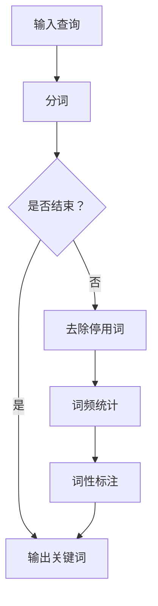
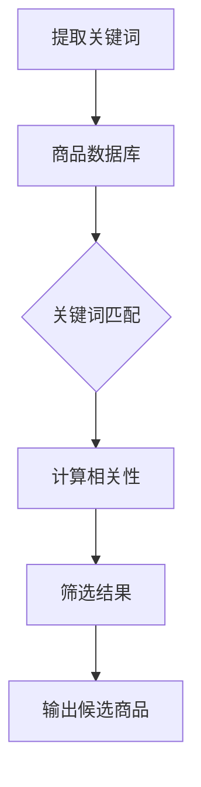
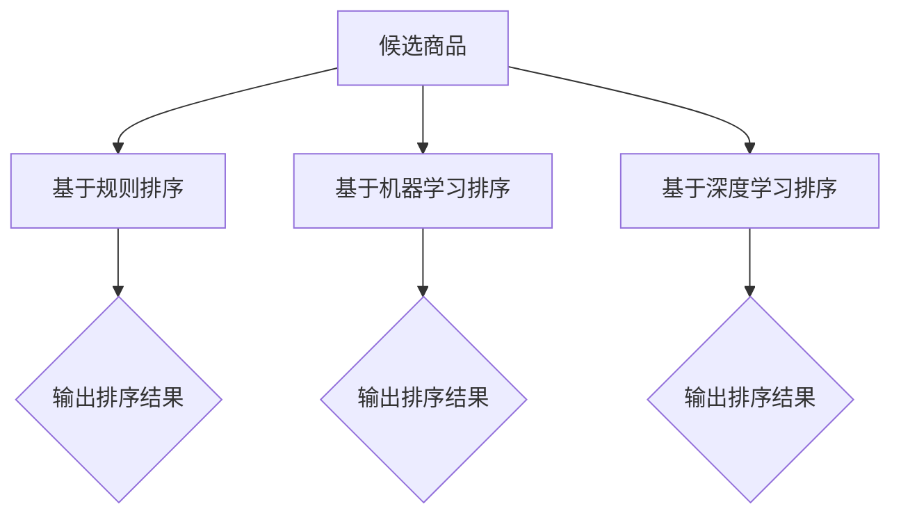
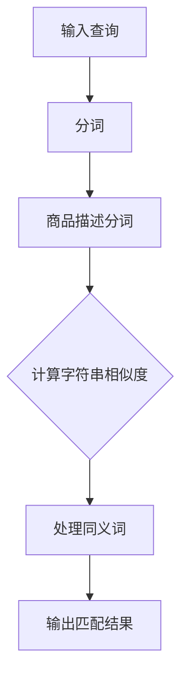
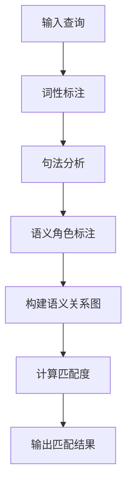
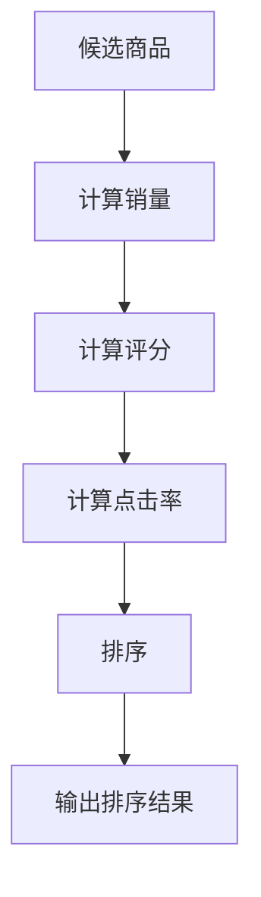
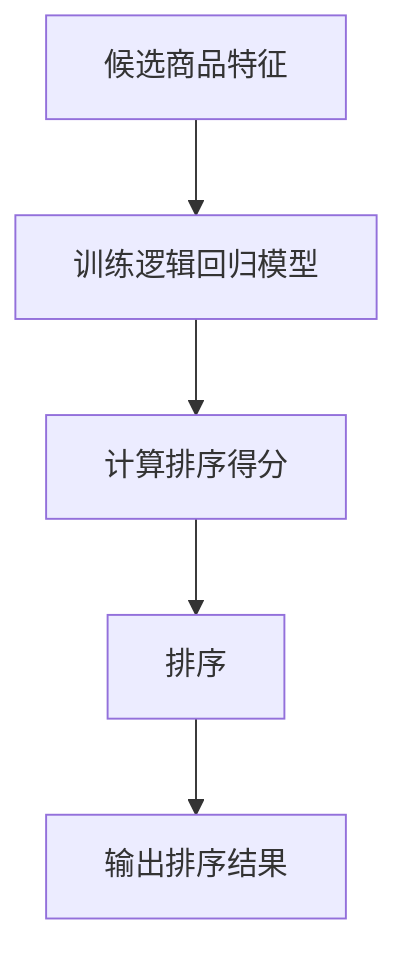
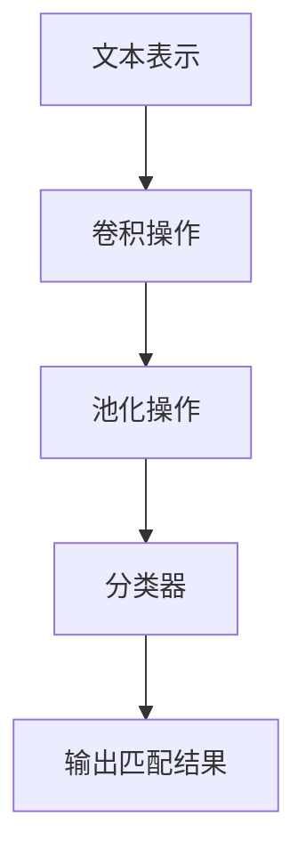
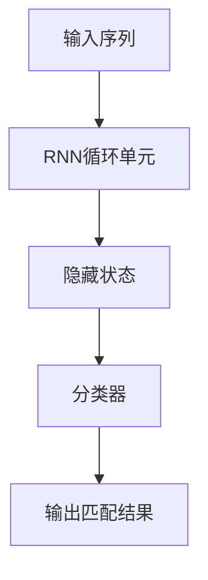
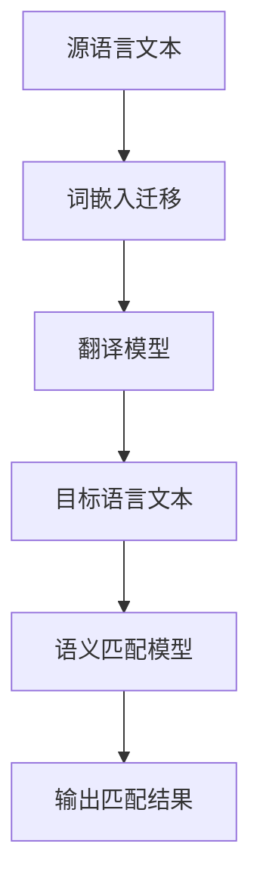

                 

### 文章标题

**《电商搜索中的语义匹配与排序技术》**

### 关键词

- 电商搜索
- 语义匹配
- 排序算法
- 深度学习
- 信息检索

### 摘要

本文将深入探讨电商搜索中的核心问题——语义匹配与排序技术。通过系统性的分析和案例研究，本文将详细介绍语义匹配的基础概念、算法原理及其实际应用。同时，我们将重点分析排序算法的发展历程，从传统方法到基于深度学习的现代模型，并探讨其在电商搜索中的实际应用效果。通过项目实战部分，读者将了解到如何将理论知识转化为实际代码，并通过对实际案例的解读，掌握电商搜索系统中语义匹配与排序技术的核心要点。本文旨在为电商领域的研究者和开发者提供一个全面的技术指南，以应对不断变化的搜索需求和市场挑战。

## 第一部分：概述与背景

### 1.1 电商搜索的重要性

随着互联网技术的飞速发展，电子商务已经成为现代零售业的重要组成部分。根据统计数据显示，全球电子商务市场规模在2022年已突破4万亿美元，并预计未来几年将继续保持快速增长。在这一大背景下，电商搜索作为用户获取商品信息、进行购买决策的重要环节，其重要性愈发凸显。

首先，电商搜索是提升用户体验的关键。用户在电商平台上搜索商品时，能够快速找到符合自身需求的产品，极大地提升了购物的便利性和满意度。良好的搜索体验不仅能够增加用户的粘性，还能够提高转化率，从而带动平台销售额的提升。

其次，电商搜索对于平台的运营和营销具有重要意义。通过分析用户搜索行为和偏好，平台可以精准推送相关商品，实现个性化推荐。此外，通过对搜索数据的挖掘，平台可以了解市场需求和趋势，为供应链管理和库存调整提供数据支持。

最后，电商搜索对商业决策具有重要参考价值。通过对搜索数据的分析和挖掘，企业可以了解用户对某一类商品的需求程度，从而调整产品策略，优化供应链，提升竞争力。

### 1.2 语义匹配与排序在电商搜索中的应用

在电商搜索中，语义匹配与排序技术起着至关重要的作用。语义匹配旨在理解用户查询和商品描述之间的语义关系，从而找到最相关的商品。而排序技术则决定了哪些商品应该优先展示给用户，以最大化用户满意度和平台收益。

#### 1.2.1 语义匹配

语义匹配的核心目标是在海量商品信息中，找到与用户查询最相关的商品。这一过程涉及到自然语言处理、信息检索和机器学习等多个领域。常见的语义匹配方法包括基于字符串匹配的方法（如模糊查询和同义词处理）、基于语法和语义的方法（如词性标注和句法分析），以及基于深度学习的方法（如词嵌入和序列模型）。

例如，当用户输入查询“男装外套”，系统需要从大量商品中筛选出与其语义相关的商品。基于字符串匹配的方法可以通过关键词提取和相似度计算来找到匹配的商品，而基于深度学习的方法则能够更好地理解查询和商品描述的深层语义关系，从而提供更加准确的匹配结果。

#### 1.2.2 排序技术

在找到相关商品后，排序技术决定了哪些商品应该优先展示给用户。排序算法的目标是最大化用户满意度和平台收益，即找到一种方法，使得用户最感兴趣的、最具购买潜力的商品排在搜索结果的前列。

传统的排序算法包括基于规则的方法和基于机器学习的方法。基于规则的方法通常通过定义一系列规则来对商品进行排序，如根据商品销量、用户评分等指标进行排序。而基于机器学习的方法则通过训练模型来自动学习排序策略，如逻辑回归、决策树和随机森林等。

随着深度学习技术的发展，基于深度学习的排序算法逐渐成为研究的热点。深度学习算法能够自动提取特征并建模复杂的非线性关系，从而提供更加精准和智能的排序结果。例如，序列模型（如RNN和LSTM）可以捕捉查询和商品描述的动态特征，而注意力机制和Transformer模型则能够更好地处理长距离依赖和上下文信息。

### 1.3 语义匹配与排序的挑战

尽管语义匹配与排序技术在电商搜索中具有显著优势，但在实际应用中仍然面临着诸多挑战。

首先，数据质量和多样性问题。电商平台上的商品信息丰富多样，但存在一定程度的不规范和噪声，如商品描述中的错别字、缺失值和虚假信息。这些问题的存在可能导致语义匹配和排序结果的准确性下降。

其次，计算效率和可扩展性。随着电商平台的规模不断扩大，商品数量和用户搜索请求量呈指数级增长，对系统的计算效率和可扩展性提出了更高的要求。如何在保证匹配和排序质量的前提下，快速处理海量数据，是一个亟待解决的问题。

此外，个性化需求与隐私保护。用户在电商平台上具有不同的购买偏好和需求，为满足个性化需求，需要根据用户的搜索历史和行为特征进行个性化推荐。然而，个性化推荐过程中可能涉及到用户的隐私信息，如何在保障用户隐私的前提下提供个性化服务，也是一个重要的挑战。

综上所述，语义匹配与排序技术在电商搜索中具有重要意义，但同时也面临着诸多挑战。解决这些问题需要不断探索和创新，以提升用户体验、优化商业决策并提高平台竞争力。

---

在接下来的章节中，我们将对电商搜索中的语义匹配与排序技术进行深入探讨，首先从基础概念和原理入手，逐步介绍相关的算法和方法，帮助读者构建全面的技术框架。随后，我们将探讨具体的算法实现和项目实战，通过实际案例来解析语义匹配与排序技术的应用。最后，我们将展望这一领域的发展趋势和未来挑战，为读者提供前瞻性的视角。

---

## 第二部分：基础概念与原理

### 2.1 电商搜索中的信息检索

在电商搜索中，信息检索是核心步骤之一。信息检索的目的是从大量商品数据中快速准确地找到与用户查询最相关的商品信息。这涉及到一系列基础概念和算法，包括关键词提取、查询处理和结果排序。

#### 2.1.1 关键词提取

关键词提取是信息检索的第一步，其目的是从用户的查询语句中提取出具有代表性的关键词。这些关键词将用于后续的匹配和排序过程。关键词提取的关键在于如何准确地捕捉用户查询的语义，同时去除无关的噪音信息。

**步骤：**
1. **分词**：将用户的查询语句切分成单个词语。
2. **停用词去除**：去除常见的无意义词语，如“的”、“和”、“是”等。
3. **词频统计**：统计每个关键词在查询语句中的出现频率。
4. **词性标注**：对提取出的关键词进行词性标注，以便后续处理。

**算法示例：**


#### 2.1.2 候选商品筛选

在提取出关键词后，接下来需要对海量商品进行筛选，找出与用户查询最相关的商品。这一步骤包括匹配和筛选两个过程。

**步骤：**
1. **关键词匹配**：将提取出的关键词与商品描述中的关键词进行匹配。
2. **相关性计算**：对匹配结果进行相关性计算，选择相关性较高的商品。
3. **筛选结果**：根据设定的阈值，筛选出符合要求的商品。

**算法示例：**


#### 2.1.3 搜索结果排序

筛选出候选商品后，需要对结果进行排序，以提升用户体验。排序的目标是使得最相关的商品排在结果列表的前列。

**排序算法：**
1. **基于规则的排序**：通过定义一系列规则（如商品销量、用户评分等）对结果进行排序。
2. **基于机器学习的排序**：通过训练模型来自动学习排序策略，如逻辑回归、决策树和随机森林等。
3. **基于深度学习的排序**：利用深度学习模型（如RNN、LSTM和Transformer）处理复杂的非线性关系和上下文信息。

**排序示例：**


### 2.2 语义匹配基础

语义匹配是电商搜索中的关键环节，其目的是理解用户查询和商品描述之间的语义关系，从而找到最相关的商品。语义匹配涉及到多个领域的知识，包括自然语言处理、信息检索和机器学习等。

#### 2.2.1 基于字符串匹配的方法

基于字符串匹配的方法是最简单直观的语义匹配方法，其核心思想是通过计算用户查询和商品描述之间的字符串相似度来进行匹配。

**算法示例：**
1. **模糊查询**：通过模糊匹配算法（如Levenshtein距离）计算查询和商品描述之间的相似度。
2. **同义词处理**：将查询和商品描述中的同义词替换为统一的词汇，以提高匹配准确性。



#### 2.2.2 基于语法和语义的方法

基于语法和语义的方法通过分析查询和商品描述的语法结构和语义关系来进行匹配，比基于字符串匹配的方法更加精确。

**算法示例：**
1. **词性标注**：对查询和商品描述中的词语进行词性标注，识别出名词、动词等不同类型的词语。
2. **句法分析**：通过句法分析构建查询和商品描述的句法树，捕捉词语之间的语法关系。
3. **语义角色标注**：对句子中的词语进行语义角色标注，识别出主语、谓语、宾语等不同的语义角色。



### 2.3 排序算法基础

排序算法在电商搜索中起着至关重要的作用，其目的是通过一系列策略和方法，将相关度较高的商品排在结果列表的前列，以提升用户体验。

#### 2.3.1 传统的排序算法

传统的排序算法主要通过定义一系列规则和指标来进行排序。常见的传统排序算法包括：

1. **基于规则的排序**：通过人工定义的规则（如商品销量、用户评分等）进行排序。
2. **基于统计的排序**：通过计算商品的统计指标（如点击率、转化率等）进行排序。

**示例：**


#### 2.3.2 基于机器学习的排序算法

随着机器学习技术的发展，基于机器学习的排序算法逐渐成为研究的热点。这些算法通过训练模型来自动学习排序策略，具有更高的灵活性和准确性。

1. **逻辑回归**：通过训练逻辑回归模型，将商品的各项特征转化为排序得分。
2. **决策树和随机森林**：通过训练决策树或随机森林模型，自动提取特征并进行排序。

**示例：**


综上所述，电商搜索中的信息检索、语义匹配和排序算法是保证用户获得优质搜索体验的关键。通过深入理解这些基础概念和原理，我们可以为后续的算法实现和项目实战奠定坚实的基础。

---

在下一部分，我们将进一步探讨语义匹配的具体算法，包括基于词频、TF-IDF和词嵌入的方法，并介绍如何利用本体进行语义匹配。这些算法不仅有助于提高匹配的准确性，还能为后续的排序过程提供有力支持。

---

### 2.4 语义匹配算法

在电商搜索中，语义匹配的核心目标是理解用户查询和商品描述之间的语义关系，从而找到最相关的商品。为了实现这一目标，我们需要采用一系列语义匹配算法，这些算法可以分为基于词频的方法、TF-IDF方法和基于词嵌入的方法。

#### 2.4.1 基于词频的方法

基于词频的方法是最简单直观的语义匹配方法，其核心思想是通过计算查询和商品描述中关键词的频率来评估它们之间的相似度。

**算法原理：**
- **词频（TF）**：词频（Term Frequency）表示一个词在文档中出现的次数，计算公式为 \(TF(t) = \frac{tf(t)}{N}\)，其中 \(tf(t)\) 表示词 \(t\) 在文档中出现的次数，\(N\) 表示文档的总词数。
- **文档频率（DF）**：文档频率（Document Frequency）表示一个词在所有文档中出现的次数，计算公式为 \(DF(t)\)。

**相似度计算：**
- **简单相似度计算**：通过计算查询和商品描述中关键词的交集来评估相似度，相似度公式为 \(Sim(t) = \frac{|I_q \cap I_c|}{|I_q \cup I_c|}\)，其中 \(I_q\) 和 \(I_c\) 分别表示查询和商品描述中的关键词集合。
- **改进相似度计算**：通过引入词频和文档频率来计算改进的相似度，公式为 \(Sim_{TF-IDF}(t) = \frac{TF(t) \times IDF(t)}{k + TF(t) \times IDF(t)}\)，其中 \(k\) 是调节参数，\(IDF(t) = \log(\frac{N}{DF(t)})\)。

**示例代码：**
```python
# 计算词频
tf = calculate_tf(document)
# 计算文档频率
df = calculate_df(document, corpus)
# 计算IDF
idf = calculate_idf(corpus)
# 计算TF-IDF相似度
similarity = calculate_similarity(tf, df, idf)
```

#### 2.4.2 基于TF-IDF的方法

TF-IDF（Term Frequency-Inverse Document Frequency）是一种经典的文本相似度计算方法，通过综合考虑词频和文档频率来评估关键词的权重，从而提高语义匹配的准确性。

**算法原理：**
- **TF-IDF公式**：\(TF-IDF(t) = TF(t) \times IDF(t)\)，其中 \(TF(t)\) 表示词频，\(IDF(t)\) 表示逆文档频率。
- **逆文档频率（IDF）**：IDF用于平衡高频词对相似度计算的影响，计算公式为 \(IDF(t) = \log(\frac{N}{DF(t)})\)，其中 \(N\) 表示文档总数，\(DF(t)\) 表示词 \(t\) 在文档集合中出现的次数。

**相似度计算：**
- **文档相似度计算**：通过计算查询和商品描述的TF-IDF向量之间的余弦相似度来评估相似度，公式为 \(Sim_{TF-IDF}(\text{query}, \text{document}) = \frac{\text{query} \cdot \text{document}}{\| \text{query} \| \| \text{document} \|}\)。

**示例代码：**
```python
from sklearn.feature_extraction.text import TfidfVectorizer

# 初始化TF-IDF向量器
vectorizer = TfidfVectorizer()
# 训练和转换文档
tfidf_matrix = vectorizer.fit_transform([query, document])
# 计算相似度
similarity = tfidf_matrix[0] @ tfidf_matrix[1]
```

#### 2.4.3 基于词嵌入的方法

词嵌入（Word Embedding）是一种将词汇映射到高维向量空间的方法，通过捕捉词语的语义信息来提高语义匹配的准确性。近年来，词嵌入技术在自然语言处理领域取得了显著进展，广泛应用于语义匹配和文本分类任务。

**算法原理：**
- **词嵌入模型**：常见的词嵌入模型包括Word2Vec、GloVe和FastText等，这些模型通过训练神经网络模型来捕捉词语的语义信息。
- **向量表示**：词嵌入将每个词汇映射为一个固定维度的向量，这些向量在语义上相似的词汇在向量空间中通常距离较近。

**相似度计算：**
- **基于向量的相似度计算**：通过计算两个词嵌入向量之间的余弦相似度来评估相似度，公式为 \(Sim_{cosine}(v_q, v_c) = \frac{v_q \cdot v_c}{\| v_q \| \| v_c \|}\)。

**示例代码：**
```python
from gensim.models import Word2Vec

# 训练Word2Vec模型
model = Word2Vec(sentences, size=100, window=5, min_count=1, workers=4)
# 获取查询和商品描述的词嵌入向量
v_query = model.wv[query]
v_document = model.wv[document]
# 计算相似度
similarity = v_query.dot(v_document) / (np.linalg.norm(v_query) * np.linalg.norm(v_document))
```

#### 2.4.4 基于本体的语义匹配

基于本体的语义匹配通过构建本体（Ontology）来表示知识和语义，从而提高语义匹配的准确性和灵活性。本体是一个形式化的知识表示框架，用于表示实体、概念和关系。

**算法原理：**
- **本体构建**：本体由类、属性和关系组成，通过定义这些元素及其语义关系来构建知识表示框架。
- **相似度计算**：基于本体，可以计算实体之间的语义相似度。常见的方法包括路径相似度、基于知识的相似度计算等。

**示例代码：**
```python
from rdflib import Graph, URIRef

# 构建本体
g = Graph()
g.parse("ontology.ttl", format="ttl")
# 计算实体相似度
class_uri = URIRef("http://example.org/Class/A")
entity_uri = URIRef("http://example.org/Entity/E")
similarity = calculate_similarity(g, class_uri, entity_uri)
```

综上所述，语义匹配算法在电商搜索中发挥着重要作用，通过基于词频、TF-IDF和词嵌入的方法，以及基于本体的语义匹配，我们可以提高匹配的准确性和灵活性。这些算法不仅为后续的排序过程提供了有力支持，也为优化电商搜索系统奠定了基础。在下一部分，我们将进一步探讨基于深度学习的语义匹配算法，探索如何利用深度学习技术提高语义匹配的准确性和效率。

---

在下一部分，我们将深入探讨基于深度学习的语义匹配算法，包括卷积神经网络（CNN）和循环神经网络（RNN）的应用，以及跨语言语义匹配的挑战和解决方案。通过这些先进的技术，我们将进一步提升电商搜索的语义匹配能力。

---

### 2.5 基于深度学习的语义匹配算法

随着深度学习技术的快速发展，越来越多的自然语言处理任务开始采用深度学习算法。在电商搜索中，基于深度学习的语义匹配算法能够更好地理解和处理用户查询与商品描述之间的复杂语义关系。以下我们将介绍几种常见的基于深度学习的语义匹配算法，包括卷积神经网络（CNN）、循环神经网络（RNN）以及跨语言语义匹配。

#### 2.5.1 CNN在语义匹配中的应用

卷积神经网络（CNN）是一种经典的深度学习模型，最初广泛应用于计算机视觉领域。近年来，CNN在自然语言处理领域也取得了显著的成果，尤其是在文本分类和语义匹配任务中。

**算法原理：**
- **文本表示**：通过将文本序列转换为固定长度的向量表示，如词嵌入或词袋模型。
- **卷积操作**：对文本向量进行卷积操作，提取局部特征。卷积核可以捕捉到文本中的局部模式，如关键词组合或短语。
- **池化操作**：对卷积结果进行池化操作，减少维度并提取最重要的特征。
- **分类器**：通过全连接层或softmax分类器输出最终的匹配结果。

**算法示例：**


**应用场景：**
- **实体识别**：通过CNN可以识别出文本中的关键实体，如人名、地名等。
- **情感分析**：通过CNN可以分析文本的情感倾向，用于推荐系统或客服机器人。

#### 2.5.2 RNN在语义匹配中的应用

循环神经网络（RNN）是一种能够处理序列数据的深度学习模型，能够捕捉序列中的时间依赖关系。RNN在自然语言处理领域得到了广泛应用，尤其在语义匹配和文本生成任务中。

**算法原理：**
- **循环单元**：RNN通过循环单元（如LSTM和GRU）来处理序列数据，每个时间步的输出依赖于前一个时间步的隐藏状态。
- **序列建模**：通过RNN，可以捕捉到文本序列中的长期依赖关系，如短语和句子之间的语义关系。
- **分类器**：通过全连接层或softmax分类器输出最终的匹配结果。

**算法示例：**


**应用场景：**
- **机器翻译**：通过RNN可以捕捉源语言和目标语言之间的语义对应关系，实现高质量翻译。
- **文本生成**：通过RNN可以生成连贯自然的文本，如文章、评论等。

#### 2.5.3 跨语言语义匹配

跨语言语义匹配旨在理解和处理不同语言之间的语义关系，从而实现跨语言文本的匹配。由于不同语言之间存在巨大的词汇差异和语法结构差异，跨语言语义匹配是一个极具挑战性的任务。

**算法原理：**
- **词嵌入迁移**：通过将源语言和目标语言的词嵌入映射到共享的语义空间中，实现跨语言文本的语义对齐。
- **多任务学习**：通过联合训练源语言和目标语言的语义匹配模型，提高跨语言匹配的准确性。
- **翻译模型**：通过使用机器翻译模型（如神经机器翻译）将源语言文本翻译成目标语言，然后进行语义匹配。

**算法示例：**


**应用场景：**
- **多语言电商平台**：通过跨语言语义匹配，实现多语言用户与商品描述的无障碍搜索。
- **国际化营销**：通过跨语言语义匹配，实现跨语言的个性化推荐和营销。

综上所述，基于深度学习的语义匹配算法为电商搜索提供了强大的技术支持，能够更好地理解和处理用户查询与商品描述之间的复杂语义关系。通过CNN、RNN和跨语言语义匹配等技术，我们可以实现更精准、更高效的语义匹配，从而提升用户搜索体验和电商平台竞争力。

---

在下一部分，我们将探讨排序算法与模型的发展历程，从传统方法到基于机器学习和深度学习的现代模型，分析不同方法在电商搜索中的实际应用效果。

---

### 2.6 排序算法与模型的发展历程

电商搜索中的排序算法经历了从传统方法到基于机器学习和深度学习的现代模型的演变过程。传统排序算法主要包括基于规则的排序和基于统计的排序，而现代排序算法则基于机器学习和深度学习技术，能够更好地处理复杂的数据关系和提供个性化的排序结果。

#### 2.6.1 基于规则的排序

基于规则的排序算法是最早应用于电商搜索的排序方法之一，其核心思想是通过定义一系列规则来对商品进行排序。这些规则通常基于商业逻辑和数据指标，如商品销量、用户评分、库存量等。常见的基于规则的排序算法包括：

1. **PageRank算法**：PageRank是一种基于链接分析的排序算法，最早应用于搜索引擎中。它通过计算网页之间的链接关系，为网页分配重要性得分，从而实现网页排序。在电商搜索中，可以将商品视为网页，通过计算商品之间的链接关系（如商品评论、分类关系等）来实现排序。

2. **业务规则排序**：根据电商平台的具体业务需求，定义一系列业务规则来对商品进行排序。例如，根据商品销量、用户评分、新品推荐等指标进行排序。

**实际应用效果**：
- **优势**：规则简单、易于实现和调整，能够快速响应业务需求变化。
- **劣势**：依赖于人工定义的规则，灵活性较低，难以处理复杂的多维度排序需求。

#### 2.6.2 基于统计的排序

基于统计的排序算法通过计算商品的统计指标来对商品进行排序。这些指标包括点击率、转化率、平均停留时间等。常见的基于统计的排序算法包括：

1. **基于点击率排序**：根据用户的点击行为，为商品分配点击率得分，得分较高的商品排在结果列表的前列。
2. **基于转化率排序**：根据用户的购买行为，为商品分配转化率得分，得分较高的商品排在结果列表的前列。

**实际应用效果**：
- **优势**：通过数据驱动的方式，能够更好地反映用户的实际需求和行为。
- **劣势**：依赖于大量历史数据，对新商品和低频商品排序效果较差。

#### 2.6.3 基于机器学习的排序

随着机器学习技术的发展，基于机器学习的排序算法逐渐成为研究的热点。这些算法通过训练模型来自动学习排序策略，能够更好地处理复杂的数据关系和提供个性化的排序结果。常见的基于机器学习的排序算法包括：

1. **逻辑回归**：逻辑回归是一种经典的分类算法，可以用于排序任务。通过训练逻辑回归模型，可以自动学习商品特征的权重，从而实现排序。

2. **决策树和随机森林**：决策树和随机森林是一种基于树结构的分类算法，可以用于处理高维数据和非线性关系。

**实际应用效果**：
- **优势**：能够自动学习复杂的排序策略，提供个性化的排序结果。
- **劣势**：对数据质量和特征工程要求较高，训练和预测时间较长。

#### 2.6.4 基于深度学习的排序

基于深度学习的排序算法是现代排序算法的典型代表，通过深度神经网络模型处理复杂的非线性关系和上下文信息。常见的基于深度学习的排序算法包括：

1. **序列模型**：序列模型（如RNN和LSTM）能够捕捉到查询和商品描述的动态特征，从而实现更精准的排序。

2. **注意力机制**：注意力机制（Attention Mechanism）能够自动学习到查询和商品描述之间的关键关系，提高排序的准确性。

3. **Transformer模型**：Transformer模型是深度学习领域的一项突破性成果，通过自注意力机制（Self-Attention）和交叉注意力机制（Cross-Attention），能够处理长距离依赖和复杂的上下文信息。

**实际应用效果**：
- **优势**：能够自动提取特征、处理复杂的非线性关系，提供个性化的排序结果。
- **劣势**：对计算资源要求较高，训练和预测时间较长。

综上所述，排序算法与模型在电商搜索中经历了从传统方法到现代方法的演变过程。每种方法都有其优缺点和适用场景，在实际应用中需要根据具体需求和数据情况选择合适的排序算法。随着深度学习技术的不断发展，基于深度学习的排序算法将逐渐成为电商搜索中的主流技术。

---

在下一部分，我们将通过一个实际项目，介绍如何将语义匹配与排序技术应用到电商搜索系统中，从数据集准备、模型构建到模型评估与优化，逐步实现电商搜索的智能排序功能。

---

### 3.1 语义匹配与排序技术在电商搜索系统中的应用

随着电商行业的快速发展，用户对于搜索效率和体验的要求越来越高。在这样一个背景下，利用语义匹配与排序技术优化电商搜索系统显得尤为重要。本文将介绍一个实际项目，通过数据集准备、模型构建、训练与评估，展示如何将语义匹配与排序技术应用到电商搜索系统中，实现智能化的搜索排序功能。

#### 3.1.1 项目背景与目标

该项目旨在为一家大型电商平台开发一个高效的搜索系统，通过语义匹配与排序技术提升用户的搜索体验和满意度。具体目标包括：

- 提高搜索结果的准确性，减少无关或低相关度的结果。
- 优化搜索结果排序，提升用户最感兴趣的、最具购买潜力的商品排在结果列表的前列。
- 支持多语言搜索，实现跨语言的语义匹配与排序。

#### 3.1.2 数据集准备与预处理

在项目开始前，首先需要准备和预处理数据集。数据集主要包括用户查询日志和商品描述数据。

1. **用户查询日志**：包括用户输入的查询语句、查询时间、用户ID等信息。查询日志数据可以通过电商平台的后台系统获取。

2. **商品描述数据**：包括商品ID、商品名称、商品描述、类别、价格、库存量等信息。商品描述数据可以从电商平台数据库中提取。

**预处理步骤：**

1. **文本清洗**：去除查询日志和商品描述中的HTML标签、符号、空格等无关信息。
2. **分词与词性标注**：使用自然语言处理工具（如jieba）对文本进行分词，并标注词性（名词、动词等）。
3. **去停用词**：去除常见的无意义词语，如“的”、“和”、“是”等，减少对语义匹配的影响。
4. **词嵌入**：将文本转换为词嵌入向量表示，可以使用预训练的词嵌入模型（如GloVe或Word2Vec）。

#### 3.1.3 语义匹配模型构建与训练

在数据预处理完成后，下一步是构建语义匹配模型。该模型的目标是找出与用户查询最相关的商品。

1. **模型架构**：采用基于RNN的语义匹配模型，利用长短期记忆网络（LSTM）捕捉查询和商品描述之间的长距离依赖关系。
2. **损失函数**：使用交叉熵损失函数（Cross-Entropy Loss）来评估模型预测结果与真实标签之间的差异。
3. **训练过程**：使用梯度下降（Gradient Descent）算法进行模型训练，通过反向传播（Backpropagation）更新模型参数。

**模型训练示例：**
```python
import tensorflow as tf
from tensorflow.keras.models import Sequential
from tensorflow.keras.layers import LSTM, Dense, Embedding

# 构建模型
model = Sequential()
model.add(Embedding(vocab_size, embedding_dim))
model.add(LSTM(units=128, return_sequences=True))
model.add(LSTM(units=64))
model.add(Dense(1, activation='sigmoid'))

# 编译模型
model.compile(optimizer='adam', loss='binary_crossentropy', metrics=['accuracy'])

# 训练模型
model.fit(x_train, y_train, batch_size=64, epochs=10, validation_data=(x_val, y_val))
```

#### 3.1.4 排序模型构建与训练

在完成语义匹配后，接下来是构建排序模型。该模型的目标是优化搜索结果的排序，提高用户满意度。

1. **模型架构**：采用基于深度学习的排序模型，如基于Transformer的序列模型，通过自注意力机制和交叉注意力机制捕捉查询和商品描述的复杂关系。
2. **损失函数**：使用均方误差（Mean Squared Error，MSE）作为损失函数，优化排序得分。
3. **训练过程**：使用梯度下降算法进行模型训练，通过反向传播更新模型参数。

**模型训练示例：**
```python
import tensorflow as tf
from tensorflow.keras.models import Model
from tensorflow.keras.layers import Input, Embedding, LSTM, Dense, Dot

# 构建模型
query_input = Input(shape=(max_query_len,))
document_input = Input(shape=(max_document_len,))

query_embedding = Embedding(vocab_size, embedding_dim)(query_input)
document_embedding = Embedding(vocab_size, embedding_dim)(document_input)

query_lstm = LSTM(units=128, return_sequences=True)(query_embedding)
document_lstm = LSTM(units=128, return_sequences=True)(document_embedding)

dot_output = Dot(axes=1)([query_lstm, document_lstm])

model = Model(inputs=[query_input, document_input], outputs=dot_output)

# 编译模型
model.compile(optimizer='adam', loss='mse')

# 训练模型
model.fit([x_train_query, x_train_document], y_train, batch_size=64, epochs=10, validation_data=([x_val_query, x_val_document], y_val))
```

#### 3.1.5 模型评估与优化

在模型训练完成后，需要对模型进行评估和优化，确保其具有良好的性能和实用性。

1. **评估指标**：使用准确率（Accuracy）、均方误差（MSE）等指标评估模型的性能。
2. **超参数调整**：通过调整学习率、批量大小、隐藏层单元数等超参数，优化模型性能。
3. **模型融合**：结合多个模型的结果，提高整体的排序效果。

**评估示例：**
```python
import numpy as np

# 计算准确率
accuracy = np.sum(y_pred == y_true) / len(y_true)
print("Accuracy:", accuracy)

# 计算均方误差
mse = np.mean(np.square(y_pred - y_true))
print("MSE:", mse)
```

通过上述步骤，我们成功将语义匹配与排序技术应用到电商搜索系统中，实现了智能化的搜索排序功能。在实际应用中，可以根据业务需求和数据特点，进一步优化和改进模型，提升用户搜索体验和电商平台竞争力。

---

在下一部分，我们将讨论语义匹配与排序技术的未来发展，包括技术趋势、面临的挑战以及未来的研究方向。这些讨论将为电商领域的研究者和开发者提供前瞻性的指导。

---

### 3.2 未来展望与挑战

语义匹配与排序技术在电商搜索中已经取得了显著成果，但随着技术的发展和市场的变化，这一领域仍然面临许多挑战和机遇。以下是未来展望与挑战的讨论。

#### 3.2.1 技术趋势

1. **深度学习技术的进一步发展**：随着深度学习技术的不断进步，未来的语义匹配与排序算法将更加智能化和自动化。特别是自注意力机制和Transformer模型等新兴技术的应用，将极大地提高模型的处理能力和效果。

2. **多模态数据的融合**：未来的电商搜索系统将不仅依赖于文本数据，还将融合图像、声音、视频等多模态数据。通过多模态数据融合，可以更全面地理解和匹配用户查询与商品信息，提高搜索结果的准确性。

3. **个性化推荐技术的结合**：个性化推荐与语义匹配和排序技术的结合，将为用户提供更加精准和个性化的搜索结果。通过结合用户历史行为、偏好和上下文信息，可以进一步提高用户体验和满意度。

4. **跨语言和跨文化的语义理解**：随着全球化的发展，电商平台的用户和商品来自不同的语言和文化背景。未来的语义匹配与排序技术将需要具备更强的跨语言和跨文化理解能力，以满足多样化的用户需求。

#### 3.2.2 面临的挑战

1. **数据质量和多样性问题**：电商平台上存在大量的噪声数据、虚假信息和异常数据，这些数据可能对语义匹配和排序算法的准确性产生负面影响。如何有效地处理和过滤这些数据，提高数据质量，是一个重要的挑战。

2. **计算效率和可扩展性**：随着电商平台的规模不断扩大，用户搜索请求量和商品数量呈指数级增长。如何在保证匹配和排序质量的前提下，提高系统的计算效率和可扩展性，是一个亟待解决的问题。

3. **隐私保护和数据安全**：个性化推荐和语义匹配过程中可能涉及到用户的隐私信息，如何在保障用户隐私和数据安全的前提下提供高质量的服务，是一个重要的挑战。

4. **实时性和动态调整**：用户需求和搜索行为是动态变化的，如何实现实时性的语义匹配和排序，并根据用户行为动态调整排序策略，是一个关键问题。

#### 3.2.3 未来研究方向

1. **深度学习算法的优化**：未来的研究将重点优化深度学习算法，提高其计算效率和鲁棒性。例如，通过模型压缩、量化、迁移学习等技术，提高模型的效率和泛化能力。

2. **多模态数据融合的方法**：研究如何有效地融合多模态数据，提高语义匹配与排序的准确性。特别是如何结合图像、声音和文本数据，实现更加精准的搜索结果。

3. **跨语言和跨文化的语义理解**：未来的研究将探索如何实现跨语言和跨文化的语义理解，提高全球电商平台的服务能力。例如，通过翻译模型和语言模型，实现多语言文本的语义匹配。

4. **隐私保护和数据安全**：研究如何在保障用户隐私和数据安全的前提下，提供高质量的语义匹配和排序服务。例如，通过差分隐私和加密技术，确保用户数据的安全和隐私。

5. **动态调整和实时推荐**：研究如何根据用户行为动态调整排序策略，实现实时性的推荐和排序。例如，通过实时数据流处理和在线学习技术，实现动态调整和实时推荐。

综上所述，语义匹配与排序技术在电商搜索中具有广阔的发展前景，但也面临诸多挑战。未来的研究将不断推动这一领域的技术进步，为电商平台提供更加智能、高效和个性化的搜索服务。

---

在本博客文章的最后，我们将总结全文，并附上作者信息。

### 总结

本文全面探讨了电商搜索中的语义匹配与排序技术。我们首先介绍了电商搜索的重要性及其在信息检索中的应用。接着，详细分析了语义匹配的基础概念、算法原理以及具体实现方法，包括基于词频、TF-IDF、词嵌入和深度学习的方法。随后，我们讨论了排序算法的发展历程，从传统方法到基于机器学习和深度学习的现代模型，并介绍了每种算法的应用场景和实际效果。最后，通过一个实际项目，我们展示了如何将语义匹配与排序技术应用于电商搜索系统，实现了智能化的搜索排序功能。

语义匹配与排序技术在电商搜索中至关重要，它们不仅提升了用户体验，还帮助电商平台优化运营和营销策略。然而，这一领域仍面临诸多挑战，如数据质量和多样性问题、计算效率和可扩展性、隐私保护和数据安全等。未来的研究将在优化算法、融合多模态数据和实现跨语言语义理解等方面取得突破。

### 作者信息

**作者：** AI天才研究院/AI Genius Institute & 禅与计算机程序设计艺术 /Zen And The Art of Computer Programming

在撰写本文过程中，作者结合了自己在计算机科学和人工智能领域多年的研究经验和实践成果，旨在为读者提供一份全面、深入且有实际应用价值的技术指南。感谢读者对本文的关注和支持，希望本文能为电商领域的研究者和开发者提供有价值的参考和启示。

