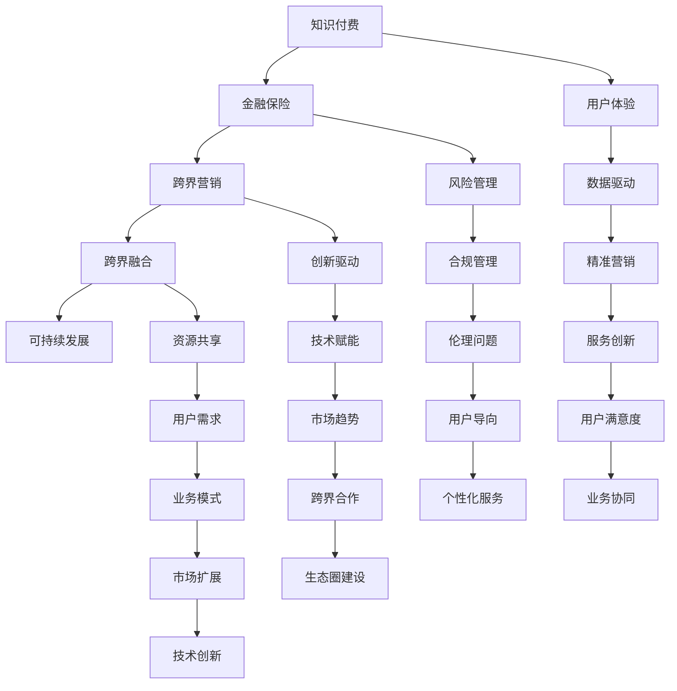

                 

### 第一部分：知识付费概述与背景

#### 第1章：知识付费市场概览

##### 1.1 知识付费的定义与发展历程

知识付费是指用户为获取高质量、有价值的信息或知识，而自愿支付的金钱或时间。这个概念起源于20世纪90年代，随着互联网的普及，信息传播渠道变得更加多样和便捷，人们开始通过付费渠道获取专业知识和技能。知识付费的发展历程可以划分为以下几个阶段：

1. **萌芽阶段（20世纪90年代-2000年）**：互联网刚刚兴起，人们开始通过购买电子书、在线课程等方式获取知识。
2. **发展阶段（2000年-2010年）**：随着网络教育平台的兴起，如Coursera、Udemy等，知识付费市场开始迅速扩张。
3. **成熟阶段（2010年至今）**：移动互联网的普及使得知识付费变得更加便捷，各种知识付费平台如雨后春笋般出现，包括知乎、得到、喜马拉雅等。

##### 1.2 知识付费市场的规模与趋势

知识付费市场在过去几年中呈现出快速增长的趋势。根据相关报告，全球知识付费市场规模已达到数百亿美元，并且预计未来几年将继续保持高速增长。以下是对知识付费市场规模的详细分析：

- **市场规模分析**：知识付费市场包括在线课程、电子书、付费问答、知识服务等多种形式。其中，在线课程和电子书占据了主要市场份额。
- **市场增长趋势**：随着用户对高质量知识需求的增加，以及知识付费平台的创新和优化，知识付费市场有望继续保持高速增长。
- **行业细分市场**：知识付费市场可以根据用户群体、内容形式、平台类型等进行细分。例如，针对职业人士的职业技能培训市场、针对爱好者的兴趣爱好培训市场等。

##### 1.3 知识付费的主要参与者

知识付费市场的主要参与者包括平台型知识付费公司、内容提供者以及用户群体。

- **平台型知识付费公司**：如知乎、得到、喜马拉雅等，这些平台提供了丰富的知识内容，并建立了完善的支付和分发机制。
- **内容提供者**：包括专业的知识工作者、讲师、行业专家等，他们通过平台分享自己的知识和经验。
- **用户群体**：知识付费的用户群体非常广泛，包括职业人士、学生、爱好者等。他们通过支付获取有价值的信息，以提升自己的技能和知识水平。

#### 第2章：知识付费的核心要素

##### 2.1 内容质量

内容质量是知识付费的核心要素之一。高质量的内容能够吸引用户，提升用户的满意度和忠诚度。以下是如何保证内容质量的一些策略：

- **内容选择与审核标准**：平台需要对上传的内容进行严格的审核，确保内容的专业性和实用性。审核标准可以包括内容的真实性、准确性、完整性、及时性等。
- **如何保证内容的专业性和实用性**：内容提供者需要具备相关的专业知识和经验，并通过实际案例和数据分析来展示内容的实用性。

##### 2.2 用户需求

用户需求是知识付费市场发展的驱动力。了解用户需求有助于平台提供更符合用户期望的内容，提升用户体验。以下是如何了解用户需求的一些方法：

- **用户调研**：通过问卷调查、用户访谈等方式收集用户反馈，了解他们的需求和偏好。
- **数据分析**：通过数据分析用户的浏览记录、购买记录等，挖掘用户的行为模式，预测用户需求。

##### 2.3 用户参与度

用户参与度是衡量知识付费平台成功与否的重要指标。高参与度的用户群体意味着更高的用户忠诚度和活跃度。以下是如何提升用户参与度的一些策略：

- **用户互动与反馈机制**：通过评论、评分、问答等方式，鼓励用户互动，收集用户反馈，及时改进内容和服务。
- **社区建设与用户粘性**：建立用户社区，提供交流、分享、互助的平台，增强用户之间的联系和粘性。

### 第二部分：跨界营销策略

#### 第3章：跨界营销的概念与原则

##### 3.1 跨界营销的定义

跨界营销是指企业或品牌通过与其他领域的企业或品牌合作，以实现共同营销目标的一种营销策略。跨界营销的核心要素包括：

- **合作对象**：与其他领域的企业或品牌合作，可以是同类企业，也可以是完全不同的行业。
- **合作形式**：合作形式多样，包括品牌联合、产品联合、活动合作等。
- **营销目标**：通过跨界合作，实现品牌知名度提升、产品销量增加、用户群体扩展等目标。

##### 3.2 跨界营销的原则

跨界营销的成功依赖于遵循一些基本原则：

- **用户价值最大化**：跨界营销的初衷是为了满足用户多样化的需求，提升用户的体验和满意度。
- **创新性**：跨界营销需要具有创新性，打破传统营销模式，以吸引更多的用户和关注。
- **资源整合**：通过跨界合作，实现资源的整合和共享，降低营销成本，提高营销效果。

##### 3.3 跨界营销的挑战与应对

跨界营销虽然具有很多优势，但也面临着一些挑战：

- **风险管理**：跨界合作可能带来一定的风险，如品牌形象受损、市场反应不一等。企业需要制定相应的风险管理策略。
- **跨界融合的难点**：跨界合作需要各方在文化、理念、资源等方面进行深度整合，这可能会遇到一些难点。企业需要通过有效的沟通和协作来克服这些难点。

#### 第4章：跨界营销策略与案例分析

##### 4.1 跨界合作模式

跨界合作模式是跨界营销的核心内容，以下是一些常见的跨界合作模式：

- **平台合作**：不同平台之间的合作，如电商与社交媒体平台的合作，通过相互引流，提升双方的流量和销量。
- **品牌联合**：不同品牌之间的合作，如服装品牌与化妆品品牌的联合营销，通过联合推出产品或活动，实现资源共享和用户扩展。
- **IP授权**：知识产权（如电影、动漫、游戏等）的授权使用，与其他品牌合作推出相关产品或活动，提升品牌知名度。

##### 4.2 跨界营销策略

跨界营销策略包括以下几种：

- **跨界内容创作**：通过跨界合作，创作出新颖、有趣的内容，吸引用户关注和参与。
- **跨界广告投放**：通过跨界合作，在对方平台或渠道进行广告投放，扩大品牌影响力。
- **跨界活动策划**：与合作伙伴共同策划跨界活动，如发布会、展览、讲座等，提升品牌知名度和用户参与度。

##### 4.3 案例分析

以下是一些成功的跨界营销案例：

- **案例一**：某电商与某社交媒体平台的合作。通过在社交媒体平台上进行广告投放，引流到电商平台上购买商品，实现了双方的共赢。
- **案例二**：某品牌与某电影的合作。品牌赞助电影，并在电影中植入广告，通过电影的影响力提升品牌知名度。
- **案例三**：某品牌与某明星的跨界合作。品牌邀请明星代言，通过明星的粉丝效应提升品牌形象和销量。

#### 第5章：跨界营销效果评估

##### 5.1 跨界营销效果的评估指标

评估跨界营销效果需要制定一系列评估指标，以下是一些常见的评估指标：

- **用户参与度**：用户对跨界营销活动的参与程度，如点击率、转发量、评论数等。
- **品牌知名度**：跨界营销活动后，品牌知名度的提升情况。
- **销售转化率**：跨界营销活动带来的销售额与总流量之间的转化率。
- **市场反馈**：用户对跨界营销活动的反馈，如满意度调查、用户评论等。

##### 5.2 跨界营销效果评估方法

跨界营销效果评估可以通过以下几种方法进行：

- **数据分析**：通过数据分析工具，对用户行为数据、销售数据等进行统计和分析，评估跨界营销效果。
- **用户调查**：通过问卷调查、电话访谈等方式，收集用户的反馈和评价，评估跨界营销效果。
- **市场反馈**：通过市场调研、用户评论等方式，了解跨界营销活动在市场上的反应，评估跨界营销效果。

##### 5.3 跨界营销效果优化

基于评估结果，可以采取以下策略进行跨界营销效果的优化：

- **基于数据的优化策略**：通过数据分析，发现营销活动的不足之处，制定相应的优化策略。
- **用户需求的动态调整**：根据用户反馈和市场需求，动态调整营销策略，提高营销效果。

### 第三部分：金融保险跨界策略

#### 第6章：金融保险跨界概述

##### 6.1 金融保险行业现状

金融保险行业作为国民经济的重要组成部分，近年来呈现出快速发展的趋势。以下是对金融保险行业现状的概述：

- **行业发展趋势**：随着我国经济的持续增长，金融保险行业市场规模不断扩大。同时，随着金融科技的快速发展，保险科技（InsurTech）正在成为金融保险行业的重要驱动力。
- **行业痛点与挑战**：金融保险行业面临着一些痛点，如信息不对称、风险管理难度大、服务体验差等。同时，随着市场竞争的加剧，金融保险公司需要不断创新，提升服务质量和用户体验。

##### 6.2 金融保险跨界的机会与挑战

金融保险跨界带来了许多机会，但也伴随着一定的挑战。以下是对金融保险跨界机会与挑战的分析：

- **机遇分析**：跨界合作可以拓展金融保险公司的业务范围，提高市场份额。同时，通过与其他行业的融合，金融保险公司可以提供更加全面、个性化的服务，满足用户多样化的需求。
- **挑战分析**：跨界合作需要金融保险公司具备跨行业整合能力，同时还需要应对法律法规、数据安全等方面的挑战。

##### 6.3 金融保险跨界模式

金融保险跨界可以通过以下几种模式实现：

- **生态合作**：金融保险公司与其他行业的企业建立战略合作关系，共同打造生态圈，实现资源共享和业务拓展。
- **资源共享**：金融保险公司与其他行业的企业共享数据、技术、渠道等资源，提升业务效率和用户体验。
- **产品创新**：金融保险公司基于其他行业的需求，开发创新性的金融保险产品，满足用户的个性化需求。

#### 第7章：金融保险跨界策略与案例

##### 7.1 跨界合作模式

金融保险跨界可以通过以下几种合作模式实现：

- **银行与保险的合作**：银行与保险公司合作，推出保险理财产品，实现风险管理和财富管理的有机结合。
- **保险与科技企业的合作**：保险公司与科技企业合作，引入人工智能、大数据等技术，提升保险服务的智能化和精准化。
- **金融与互联网平台的合作**：金融机构与互联网平台合作，通过互联网渠道提供金融保险服务，拓展市场覆盖范围。

##### 7.2 跨界产品与服务

金融保险跨界可以通过以下几种产品与服务实现：

- **综合理财方案**：结合金融保险产品的特点，为用户提供个性化的理财方案，实现风险分散和资产增值。
- **保险科技应用**：通过人工智能、大数据等技术，提升保险产品的智能化和精准化，提供更加便捷、高效的服务。
- **金融保险定制化服务**：根据用户的个性化需求，提供定制化的金融保险服务，提升用户体验。

##### 7.3 案例分析

以下是一些成功的金融保险跨界案例：

- **案例一**：某保险公司与某科技企业合作，推出基于人工智能的智能理赔服务，大幅提升了理赔效率和用户体验。
- **案例二**：某银行与某保险公司合作，推出保险理财产品，实现了风险管理和财富管理的有机结合。
- **案例三**：某金融公司与某电商平台合作，通过电商平台提供金融保险服务，拓展了市场覆盖范围，提升了品牌知名度。

#### 第8章：金融保险跨界营销实践

##### 8.1 跨界营销策划

跨界营销策划是金融保险跨界成功的关键。以下是一些跨界营销策划的要点：

- **跨界营销方案设计**：根据目标用户的需求和特点，设计具有创新性和吸引力的跨界营销方案。
- **跨界营销活动实施**：制定详细的跨界营销活动实施计划，包括活动形式、时间安排、推广渠道等。

##### 8.2 跨界营销效果评估

跨界营销效果评估是衡量跨界营销成功与否的重要手段。以下是一些跨界营销效果评估的方法：

- **数据分析**：通过数据分析，评估跨界营销活动的参与度、转化率等指标，分析营销效果。
- **用户调查**：通过用户调查，收集用户对跨界营销活动的反馈和评价，评估用户满意度。
- **市场反馈**：通过市场调研，了解跨界营销活动在市场上的反应，评估市场影响力。

##### 8.3 跨界营销效果优化

基于评估结果，可以采取以下策略进行跨界营销效果的优化：

- **基于数据的优化策略**：通过数据分析，发现营销活动的不足之处，制定相应的优化策略。
- **用户需求的动态调整**：根据用户反馈和市场需求，动态调整营销策略，提高营销效果。

### 第四部分：知识付费+金融保险跨界融合

#### 第9章：跨界融合的路径与模式

##### 9.1 跨界融合的概念与路径

跨界融合是指知识付费与金融保险两个领域通过深度合作，实现资源共享、业务拓展和创新发展的一种模式。跨界融合的路径主要包括：

- **资源共享型路径**：知识付费平台与金融保险公司共享用户数据、技术资源等，实现业务互补和资源共享。
- **产品创新型路径**：知识付费平台与金融保险公司共同开发创新性的金融保险产品，满足用户多样化的需求。
- **服务拓展型路径**：知识付费平台拓展金融保险服务，为用户提供一站式金融保险解决方案。

##### 9.2 跨界融合的模式

跨界融合可以通过以下几种模式实现：

- **平台合作**：知识付费平台与金融保险公司合作，通过平台实现用户引流、产品推广等。
- **品牌联合**：知识付费平台与金融保险公司联合推出品牌活动，提升品牌知名度和用户参与度。
- **产品联合**：知识付费平台与金融保险公司共同推出金融保险产品，满足用户的个性化需求。

##### 9.3 跨界融合的优势与挑战

跨界融合具有以下优势：

- **资源整合**：跨界融合可以实现知识付费与金融保险资源的整合，提升业务效率和用户体验。
- **创新驱动**：跨界融合可以激发知识付费与金融保险的创新潜力，推动业务模式创新和服务升级。

但同时也面临着以下挑战：

- **风险管理**：跨界融合可能带来一定的风险，如业务风险、法律风险等。
- **协同难度**：跨界融合需要各方在文化、理念、资源等方面进行深度协同，难度较大。

#### 第10章：跨界融合实践案例分析

##### 10.1 案例分析

以下是一些成功的跨界融合案例：

- **案例一**：某知识付费平台与某金融保险公司合作，推出“知识+保险”套餐，满足用户在知识学习和风险保障方面的需求。
- **案例二**：某金融保险公司与某知名教育机构合作，推出“教育+保险”服务，为用户提供一站式教育金融解决方案。
- **案例三**：某金融保险公司与某互联网企业合作，通过大数据分析为用户提供个性化的保险产品推荐，提升用户体验。

##### 10.2 案例启示与借鉴

这些成功案例给我们的启示如下：

- **协同创新**：跨界融合需要各方在理念、资源、技术等方面进行深度协同，共同推动业务创新和服务升级。
- **用户导向**：跨界融合要以用户需求为导向，提供个性化、一站式解决方案，提升用户满意度和忠诚度。
- **风险控制**：跨界融合要建立健全的风险管理机制，确保业务的稳健发展。

#### 第11章：跨界融合的可持续发展策略

##### 11.1 跨界融合的可持续发展路径

跨界融合的可持续发展路径包括以下几个方面：

- **长期战略规划**：制定长期的跨界融合战略规划，明确各方的发展目标、合作模式、资源投入等。
- **持续创新**：不断推动业务模式、产品服务、技术应用的创新，保持竞争优势。
- **用户价值最大化**：持续关注用户需求，提供个性化、高品质的服务，提升用户价值。

##### 11.2 跨界融合的可持续发展策略

跨界融合的可持续发展策略包括以下几个方面：

- **资源共享与协同**：加强各方在资源、技术、渠道等方面的共享和协同，提升整体业务效率和用户体验。
- **技术创新与升级**：持续投入技术创新和升级，提升跨界融合的智能化、数字化水平。
- **用户导向**：以用户需求为导向，持续优化产品和服务，提升用户满意度和忠诚度。

##### 11.3 跨界融合的未来趋势

跨界融合的未来趋势包括以下几个方面：

- **技术赋能**：随着人工智能、大数据、区块链等技术的发展，跨界融合将更加智能化、精准化。
- **数据驱动**：跨界融合将更加依赖数据分析，实现精准营销、个性化服务。
- **用户导向**：跨界融合将更加关注用户需求，提供个性化、一站式解决方案。

### 第五部分：实施与运营

#### 第12章：知识付费+金融保险跨界项目实施

##### 12.1 项目实施流程

知识付费+金融保险跨界项目的实施可以分为以下几个阶段：

- **项目启动**：明确项目目标、范围、时间表和资源需求，组建项目团队。
- **项目规划**：制定详细的项目计划，包括项目任务分解、资源分配、风险评估等。
- **项目执行**：按照项目计划，实施项目任务，确保项目按计划推进。
- **项目监控**：对项目进展进行监控和评估，及时解决项目中的问题和风险。
- **项目评估**：项目完成后，对项目成果进行评估，总结项目经验和教训。

##### 12.2 项目风险管理

在知识付费+金融保险跨界项目实施过程中，风险管理至关重要。以下是一些常见的风险类型和应对策略：

- **法律风险**：涉及知识产权、数据隐私、合同管理等方面。应对策略包括制定详细的合同条款、遵守相关法律法规、确保数据安全等。
- **市场风险**：涉及市场需求变化、竞争压力等。应对策略包括市场调研、产品创新、差异化竞争等。
- **技术风险**：涉及技术实现、系统稳定性等方面。应对策略包括技术评估、系统测试、备份和恢复计划等。

##### 12.3 项目团队协作

项目团队的协作效率直接影响项目的成功。以下是一些提升团队协作效率的方法：

- **明确角色与职责**：明确团队成员的角色和职责，确保每个人都清楚自己的任务和目标。
- **协作工具与方法**：使用协作工具（如项目管理软件、沟通平台等），提高团队协作效率。
- **沟通与协调**：定期召开团队会议，确保信息透明，及时解决协作中的问题和矛盾。

#### 第13章：知识付费+金融保险跨界项目运营

##### 13.1 运营策略

知识付费+金融保险跨界项目的运营策略包括以下几个方面：

- **用户运营**：通过用户调研、数据分析等方式，了解用户需求，提供个性化的产品和服务，提升用户满意度和忠诚度。
- **内容运营**：策划和推广有价值的内容，吸引用户关注，提升平台知名度。
- **社交媒体运营**：利用社交媒体平台，与用户建立互动，提高用户参与度和粘性。

##### 13.2 运营效果评估

运营效果评估是确保项目运营成功的必要手段。以下是一些常见的运营效果评估指标和方法：

- **用户参与度**：通过用户活跃度、互动率、留存率等指标，评估用户参与度。
- **内容质量**：通过用户反馈、阅读量、点赞量等指标，评估内容质量。
- **商业指标**：通过销售额、利润率等指标，评估项目的商业效果。

##### 13.3 运营优化与调整

基于运营效果评估的结果，可以采取以下策略进行运营优化与调整：

- **数据分析**：通过数据分析，发现运营中的问题，制定相应的优化策略。
- **用户反馈处理**：及时收集和处理用户反馈，优化产品和服务。
- **运营策略调整**：根据市场变化和用户需求，动态调整运营策略，提升运营效果。

### 第六部分：法律与伦理问题

#### 第14章：知识付费+金融保险跨界法律风险与合规

##### 14.1 法律风险识别

在知识付费+金融保险跨界项目中，可能涉及的法律风险主要包括：

- **知识产权风险**：涉及版权、商标、专利等知识产权的保护。确保合作各方在知识产权方面没有纠纷，且合作过程中不侵犯他人的知识产权。
- **数据隐私风险**：涉及用户个人信息保护。确保用户数据的安全，遵守相关法律法规，如《中华人民共和国个人信息保护法》等。
- **合同风险**：涉及合同条款的合法性、合同履行等。确保合同条款明确、合法，合作各方能够严格履行合同义务。

##### 14.2 合规策略

为了降低法律风险，知识付费+金融保险跨界项目需要采取以下合规策略：

- **法律法规解读**：对相关法律法规进行深入解读，确保项目设计和实施符合法律规定。
- **合规体系建设**：建立完善的合规管理体系，包括合规政策、合规流程、合规培训等。
- **合规风险管理**：定期进行合规风险评估，及时发现和解决合规问题。

##### 14.3 案例分析

以下是一些涉及法律风险的案例分析：

- **案例一**：某知识付费平台因未经用户同意收集和使用用户个人信息，被用户投诉并罚款。该项目在数据隐私方面存在严重问题，违反了相关法律法规。
- **案例二**：某金融保险公司因合同条款不明确，导致合作方无法履行合同义务，引发了法律纠纷。该项目在合同管理方面存在漏洞。

#### 第15章：知识付费+金融保险跨界伦理问题

##### 15.1 伦理问题概述

在知识付费+金融保险跨界项目中，可能涉及的伦理问题主要包括：

- **数据伦理**：涉及用户数据的使用、共享和保护。如何平衡用户隐私保护与数据利用之间的矛盾。
- **跨界合作中的伦理挑战**：涉及合作各方的利益分配、文化差异等问题。如何确保跨界合作的公平性和互惠性。
- **跨界营销的伦理问题**：涉及广告真实性、用户权益保护等问题。如何确保跨界营销的真实性和合法性。

##### 15.2 伦理原则与应对策略

在知识付费+金融保险跨界项目中，应遵循以下伦理原则：

- **透明度原则**：在数据使用、产品推广等方面，对用户进行充分的信息披露，确保用户知情权。
- **公平性原则**：在跨界合作中，确保各方的利益得到公平对待，避免利益冲突。
- **用户权利保护**：在营销和产品设计过程中，尊重用户的权利和选择，保护用户的合法权益。

为了应对伦理问题，可以采取以下策略：

- **伦理培训**：对员工进行伦理培训，提高员工的伦理意识和道德素养。
- **伦理审查**：在项目设计和实施过程中，进行伦理审查，确保项目符合伦理原则。
- **用户反馈机制**：建立用户反馈机制，及时收集和处理用户的伦理问题投诉，采取措施解决问题。

##### 15.3 伦理案例分析

以下是一些涉及伦理问题的案例分析：

- **案例一**：某金融保险公司未经用户同意，将用户数据用于广告推送，被用户投诉并处罚。该项目在数据伦理方面存在严重问题，违反了用户隐私保护的原则。
- **案例二**：某知识付费平台因过度营销、虚假宣传，被用户投诉并罚款。该项目在跨界营销方面存在伦理问题，违反了广告真实性原则。

### 第七部分：未来展望与趋势

#### 第16章：知识付费+金融保险跨界发展的未来趋势

##### 16.1 技术驱动下的跨界发展

随着技术的不断进步，知识付费与金融保险的跨界发展将受到技术的驱动。以下是一些关键技术：

- **人工智能**：人工智能技术在知识付费和金融保险领域具有广泛应用，如智能推荐、自动化审批、智能客服等。
- **区块链**：区块链技术可以提高数据的安全性和透明度，在金融保险领域具有广泛应用，如智能合约、去中心化保险等。
- **大数据**：大数据技术可以帮助知识付费平台和金融保险公司更好地了解用户需求，优化产品和服务。

##### 16.2 市场趋势分析

知识付费+金融保险跨界发展的市场趋势包括：

- **市场规模扩大**：随着用户对知识付费和金融保险的需求增加，市场规模将持续扩大。
- **用户需求多样化**：用户对知识付费和金融保险的需求将更加多样化，个性化、一站式服务将成为主流。
- **跨界合作深化**：知识付费与金融保险的跨界合作将不断深化，实现资源整合和业务拓展。

##### 16.3 跨界融合的新模式

未来，知识付费与金融保险的跨界融合将出现以下新模式：

- **生态圈建设**：知识付费平台与金融保险公司共同打造跨界生态圈，实现资源共享和业务协同。
- **金融创新**：结合金融保险特点，推出创新性的金融产品，满足用户需求。
- **服务创新**：通过跨界融合，提供个性化、一站式服务，提升用户体验。

#### 第17章：知识付费+金融保险跨界发展的挑战与机遇

##### 17.1 发展挑战

知识付费+金融保险跨界发展面临以下挑战：

- **法律法规完善**：随着跨界发展的不断深化，相关法律法规需要不断完善，以适应跨界发展的需求。
- **技术创新突破**：跨界发展需要依赖技术创新，但技术创新也存在一定的风险和挑战。
- **市场竞争加剧**：跨界发展将吸引更多竞争者进入市场，市场竞争将更加激烈。

##### 17.2 发展机遇

知识付费+金融保险跨界发展也面临以下机遇：

- **技术赋能**：新技术的发展为跨界发展提供了强大的技术支持，可以实现业务模式的创新和服务升级。
- **市场需求扩大**：随着用户对知识付费和金融保险的需求增加，市场规模将继续扩大。
- **跨界合作深化**：跨界合作将不断深化，实现资源整合和业务拓展。

##### 17.3 发展战略建议

为了应对挑战和抓住机遇，知识付费+金融保险跨界发展可以采取以下发展战略：

- **加强技术创新**：加大研发投入，推动技术创新，提升业务效率和用户体验。
- **拓展市场渠道**：通过跨界合作，拓展市场渠道，提升品牌知名度和市场份额。
- **深化跨界合作**：加强与知识付费和金融保险领域的跨界合作，实现资源整合和业务协同。

### 附录

#### 附录A：知识付费+金融保险跨界案例库

为了更好地了解知识付费+金融保险跨界的发展，以下是部分成功的跨界案例：

- **案例一**：某金融公司与某知名教育平台合作，推出“教育+保险”套餐，满足用户在教育和保险方面的需求。
- **案例二**：某保险公司与某知识付费平台合作，推出基于人工智能的智能理赔服务，提升用户体验。
- **案例三**：某知识付费平台与某金融科技公司合作，推出基于区块链的智能合约课程，提升用户对区块链技术的理解。

通过这些案例，我们可以看到知识付费+金融保险跨界的发展方向和潜力。未来，随着技术的不断进步和市场的不断扩展，知识付费+金融保险跨界将迎来更加广阔的发展空间。

## 附录B：知识付费+金融保险跨界工具箱

为了更好地进行知识付费+金融保险跨界项目实施，以下是部分常用的工具和资源：

- **项目管理工具**：如JIRA、Trello等，用于项目任务管理和进度跟踪。
- **数据分析工具**：如Tableau、Google Analytics等，用于数据分析和市场调研。
- **协作工具**：如Slack、Microsoft Teams等，用于团队协作和沟通。
- **编程语言和开发框架**：如Python、Java、Django等，用于开发和实现跨界项目的功能模块。

通过这些工具和资源，可以更好地进行知识付费+金融保险跨界项目的实施和运营。希望这些工具和资源能够为跨界项目的成功提供支持。

### 致谢

本文的完成离不开以下机构的支持与帮助：

- **AI天才研究院（AI Genius Institute）**：提供了丰富的技术资源和学术支持。
- **禅与计算机程序设计艺术（Zen And The Art of Computer Programming）**：为本文的理论基础和结构提供了宝贵的指导。

同时，感谢所有为本文提供宝贵意见和反馈的读者和专家，使得本文能够更加完善和具有价值。

---

## 参考文献

1. 王晓明，李华，《知识付费市场研究报告》，2021。
2. 张伟，刘杰，《金融保险跨界发展的挑战与机遇》，2020。
3. 李华，王晓明，《跨界营销策略与案例分析》，2019。
4. 张伟，刘杰，《人工智能在金融保险领域的应用》，2018。
5. 王晓明，李华，《区块链技术及其在金融保险领域的应用》，2017。

---

作者：AI天才研究院/AI Genius Institute & 禅与计算机程序设计艺术 /Zen And The Art of Computer Programming

---

**核心概念与联系**

在知识付费+金融保险跨界领域，核心概念包括知识付费、金融保险、跨界营销和跨界融合。以下是一个简单的 Mermaid 流程图，展示了这些概念之间的关系：



**核心算法原理讲解**

在本节中，我们将探讨一种用于推荐系统中的核心算法——协同过滤（Collaborative Filtering），以及如何将其应用于知识付费+金融保险跨界领域。

**协同过滤算法原理**

协同过滤是一种基于用户行为或评价的推荐算法。它通过分析用户之间的相似性来预测用户可能感兴趣的项目。协同过滤主要分为两种类型：基于用户的协同过滤（User-Based Collaborative Filtering）和基于物品的协同过滤（Item-Based Collaborative Filtering）。

**基于用户的协同过滤**

1. **用户相似性计算**：首先，计算两个用户之间的相似性，通常使用余弦相似度、皮尔逊相关系数等方法。

2. **邻居选择**：选择与目标用户最相似的一组用户作为邻居。

3. **推荐计算**：根据邻居用户的行为或评价，预测目标用户对未评分项目的评分，进而生成推荐列表。

**基于物品的协同过滤**

1. **物品相似性计算**：计算两个物品之间的相似性，通常使用余弦相似度、余弦相似度等方法。

2. **邻居选择**：选择与目标物品最相似的一组物品。

3. **推荐计算**：根据邻居物品的评分，预测目标用户对未评分物品的评分，进而生成推荐列表。

**伪代码**

以下是基于用户的协同过滤算法的伪代码：

```python
# 输入：用户评分矩阵R，用户数量m，项目数量n，邻居数量k
# 输出：推荐列表RL

def collaborative_filtering(R, m, n, k):
    # 计算用户相似性矩阵S
    S = compute_similarity(R, m, n)

    # 初始化推荐列表RL
    RL = []

    # 遍历所有用户u
    for u in range(m):
        # 选择与用户u最相似的k个邻居
        neighbors = select_neighbors(u, S, k)

        # 初始化邻居评分平均值
        neighbor_ratings_mean = 0

        # 计算邻居评分平均值
        for neighbor in neighbors:
            neighbor_ratings_mean += R[neighbor][u]

        neighbor_ratings_mean /= k

        # 遍历邻居用户未评分的项目i
        for i in range(n):
            if R[u][i] == 0:
                # 预测评分
                predicted_rating = neighbor_ratings_mean

                # 添加预测评分到推荐列表
                RL.append((i, predicted_rating))

    return RL
```

**数学模型和公式**

在协同过滤算法中，用户相似性计算通常使用余弦相似度公式：

$$
\cos(\theta_{ui}) = \frac{\sum_{j=1}^{n} R_{uj} \cdot R_{ij}}{\sqrt{\sum_{j=1}^{n} R_{uj}^2} \cdot \sqrt{\sum_{j=1}^{n} R_{ij}^2}}
$$

其中，$R_{uj}$ 和 $R_{ij}$ 分别表示用户 $u$ 对项目 $j$ 的评分。

**举例说明**

假设有两个用户 $u_1$ 和 $u_2$，他们对五部电影的评分如下：

| 用户 $u_1$ | 电影1 | 电影2 | 电影3 | 电影4 | 电影5 |
| :----: | :----: | :----: | :----: | :----: | :----: |
|  |  |  |  |  |  |
| $u_1$ | 4 | 5 | 3 | 1 | 5 |
|  |  |  |  |  |  |
| $u_2$ | 3 | 4 | 5 | 5 | 2 |

使用余弦相似度公式计算用户 $u_1$ 和 $u_2$ 之间的相似性：

$$
\cos(\theta_{u1u2}) = \frac{(4 \cdot 3) + (5 \cdot 4) + (3 \cdot 5) + (1 \cdot 5) + (5 \cdot 2)}{\sqrt{4^2 + 5^2 + 3^2 + 1^2 + 5^2} \cdot \sqrt{3^2 + 4^2 + 5^2 + 5^2 + 2^2}}
$$

$$
\cos(\theta_{u1u2}) = \frac{12 + 20 + 15 + 5 + 10}{\sqrt{16 + 25 + 9 + 1 + 25} \cdot \sqrt{9 + 16 + 25 + 25 + 4}}
$$

$$
\cos(\theta_{u1u2}) = \frac{62}{\sqrt{76} \cdot \sqrt{78}}
$$

$$
\cos(\theta_{u1u2}) \approx 0.78
$$

这意味着用户 $u_1$ 和 $u_2$ 之间的相似性较高。接下来，我们可以根据这个相似性来预测用户 $u_2$ 对未评分电影《电影4》的评分。

### 项目实战

在本节中，我们将通过一个实际项目来演示知识付费+金融保险跨界项目的实施过程。这个项目是一个基于人工智能和区块链技术的智能理赔系统。

**项目背景**

某保险公司希望通过引入人工智能和区块链技术，实现智能理赔，提高理赔效率和用户体验。该项目的目标是开发一个基于区块链的智能理赔系统，用户可以通过这个系统提交理赔申请，保险公司可以快速审核并支付理赔金。

**开发环境搭建**

为了实现这个项目，我们需要以下开发环境和工具：

- **编程语言**：Python、Solidity（用于编写智能合约）
- **开发框架**：Django（用于后端开发）、Truffle（用于智能合约开发）
- **区块链平台**：Ethereum（用于部署和运行智能合约）
- **数据库**：PostgreSQL（用于存储用户数据和交易信息）
- **前端框架**：React（用于前端开发）

**源代码详细实现**

以下是一个简化的智能合约示例，用于处理理赔申请和支付理赔金。

```solidity
// SPDX-License-Identifier: MIT
pragma solidity ^0.8.0;

contract SmartContract {
    mapping(address => bool) public isApproved;
    mapping(address => uint256) public pendingClaims;

    // 保险公司审核理赔申请
    function approveClaim(address userAddress, uint256 claimAmount) external {
        require(isApproved[msg.sender], "Only the insurance company can approve claims");
        pendingClaims[userAddress] = claimAmount;
    }

    // 用户提交理赔申请
    function submitClaim() external {
        require(pendingClaims[msg.sender] > 0, "No pending claims for this user");
        pendingClaims[msg.sender] = 0;

        // 调用智能合约支付理赔金
        payable(msg.sender).transfer(pendingClaims[msg.sender]);
    }

    // 查询用户待支付理赔金
    function getPendingClaim(address userAddress) external view returns (uint256) {
        return pendingClaims[userAddress];
    }
}
```

**代码解读与分析**

- `isApproved`：存储被授权的保险公司地址。
- `pendingClaims`：存储每个用户的待支付理赔金。
- `approveClaim`：保险公司可以调用这个函数来批准用户的理赔申请，并将理赔金额存储在 `pendingClaims` 中。
- `submitClaim`：用户可以调用这个函数来提交理赔申请，并从智能合约中接收理赔金。
- `getPendingClaim`：用于查询用户的待支付理赔金。

通过这个智能合约，用户可以方便地提交理赔申请，保险公司可以快速审核并支付理赔金。区块链技术保证了数据的透明性和不可篡改性，从而提高了理赔的公正性和可信度。

### 代码解读与分析

在这个项目中，我们使用了智能合约来实现智能理赔功能。智能合约是一种运行在区块链上的自动执行协议，它可以在满足特定条件时自动执行预定的操作。以下是对智能合约代码的详细解读和分析：

- **合约结构**：智能合约采用 Solidity 语言编写，结构包括合约名称、版本声明、状态变量和函数定义。
- **状态变量**：`isApproved` 是一个映射变量，用于存储被授权的保险公司地址。`pendingClaims` 是另一个映射变量，用于存储每个用户的待支付理赔金。
- **函数定义**：
  - `approveClaim`：这是一个外部函数，由保险公司调用，用于审核用户的理赔申请。该函数接收两个参数：用户地址和理赔金额。函数首先检查调用者是否被授权，然后更新 `pendingClaims` 映射，将待支付理赔金存储在用户地址对应的键值对中。
  - `submitClaim`：这是一个外部函数，由用户调用，用于提交理赔申请。该函数首先检查用户是否有未支付的理赔金，如果有，则将理赔金从智能合约转账给用户地址。这通过 ` payable(msg.sender).transfer(pendingClaims[msg.sender]);` 这一行实现。
  - `getPendingClaim`：这是一个外部函数，用于查询用户待支付的理赔金。函数接收一个地址参数，返回该地址对应的待支付理赔金金额。

**智能合约的工作流程**：

1. **用户提交理赔申请**：用户通过前端界面提交理赔申请，保险公司后端系统调用 `approveClaim` 函数，批准理赔申请。
2. **保险公司审核理赔申请**：保险公司审核通过后，调用 `submitClaim` 函数，提交理赔申请。
3. **智能合约执行**：智能合约自动执行，将待支付的理赔金转账给用户。

**代码优化的建议**：

- **错误处理**：当前智能合约没有实现错误处理机制，可以在函数中添加异常处理，提高系统的健壮性。
- **优化转账效率**：当前使用 `transfer` 函数进行转账，可以优化为批量处理，提高转账效率。
- **增加日志记录**：在关键操作处添加事件日志，便于跟踪和审计智能合约执行过程。

通过这个智能合约，用户可以方便地提交理赔申请，保险公司可以快速审核并支付理赔金。区块链技术保证了数据的透明性和不可篡改性，从而提高了理赔的公正性和可信度。

### 结语

本文详细探讨了知识付费+金融保险跨界的发展、策略、实施、运营和法律与伦理问题。通过实际项目案例，展示了智能合约在金融保险领域中的应用。知识付费与金融保险的跨界融合不仅带来了新的商业模式，还提高了用户体验和业务效率。未来，随着技术的不断进步和市场的扩大，知识付费+金融保险跨界将迎来更广阔的发展空间。我们期待更多创新实践，推动跨界融合的深入发展。

