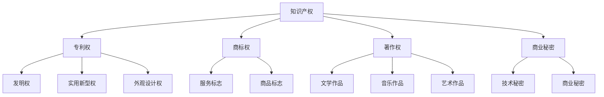

                 

## 知识付费赚钱的知识产权运营与授权

### 关键词：知识产权、运营、授权、知识付费、保护

> 摘要：本文将深入探讨知识付费市场中知识产权的运营与授权，从基本概念、运营策略到实际案例，全面解析知识产权在现代商业模式中的重要作用。通过本文，读者将了解知识产权如何转化为商业价值，掌握运营与授权的核心技巧，为个人和企业提供知识付费赚钱的全新思路。

在当今知识经济时代，知识产权已经成为企业和个人获取经济利益的重要手段。知识付费作为一种新兴商业模式，不仅为知识创造者提供了收入来源，也为知识消费者带来了高品质的学习资源。知识产权运营与授权在这个过程中扮演了关键角色。本文旨在为广大读者提供一个系统、详实的指南，帮助大家理解知识产权运营与授权的原理和实战技巧，从而在知识付费市场中取得成功。

### 第一部分：知识产权概述与运营基础

知识产权是指人们对于自己的智力劳动成果所依法享有的专有权利。它既包括专利权、商标权、著作权等传统知识产权，也涵盖了商业秘密、植物新品种权等新型知识产权。知识产权作为一种无形资产，具有独特性、创造性和商业价值，在现代经济体系中占据着重要地位。

#### 第1章：知识产权的概念与类型

##### 1.1 知识产权的定义与特点

知识产权的定义可以从广义和狭义两个方面理解。广义上，知识产权是指所有涉及人类智力创造的成果所享有的权利，包括专利权、商标权、著作权、商业秘密等。狭义上，知识产权主要指的是专利权、商标权和著作权。

知识产权的特点主要包括以下几个方面：

- **专有性**：知识产权的所有者对其智力成果享有独占性的权利，未经许可，他人不得使用或侵犯。
- **地域性**：知识产权在特定国家或地区受到法律保护，不同国家的法律体系可能存在差异。
- **时效性**：知识产权具有法律规定的有效期限，期满后权利将自动终止。

**Mermaid 流程图：**

##### 1.2 知识产权的类型及法律保护

根据《中华人民共和国知识产权法》的规定，知识产权主要包括以下几种类型：

- **专利权**：包括发明权、实用新型权和外观设计权。专利权人对其发明创造在法律规定的有效期内享有专有权。
- **商标权**：包括商品商标、服务商标和集体商标。商标权人对其注册商标在法律规定的有效期内享有专用权。
- **著作权**：包括文字作品、音乐、戏剧、电影等。著作权人对其作品在法律规定的有效期内享有发表权、署名权、修改权等。
- **商业秘密**：包括技术秘密、经营秘密和其他秘密信息。商业秘密权利人对其秘密信息在公开前享有保密权。

不同类型的知识产权在法律保护范围和期限上有所不同。专利权和商标权一般具有较长的保护期限，著作权和商业秘密的保护期限相对较短。

##### 1.3 知识产权运营的基本原则

知识产权运营是指企业或个人通过知识产权的创造、运用、管理和保护，实现知识产权的增值和经济效益。知识产权运营的基本原则包括以下几个方面：

- **合法性**：知识产权运营必须遵守相关法律法规，确保运营行为的合法性。
- **有效性**：知识产权运营要注重知识产权的实际效用，确保知识产权的有效性和商业价值。
- **战略性**：知识产权运营要有明确的战略目标，结合企业或个人的发展需求，制定合理的运营策略。
- **保护性**：知识产权运营过程中要加强对知识产权的保护，防止侵权行为的发生。

### 第二部分：知识产权运营策略与流程

知识产权运营是知识付费成功的关键因素之一。有效的知识产权运营能够提高知识产品的市场竞争力，增加商业价值。以下章节将详细探讨知识产权运营的策略与流程。

#### 第2章：知识产权运营策略与流程

##### 2.1 知识产权运营的目的与价值

知识产权运营的主要目的是通过有效的管理和利用知识产权，实现知识产权的商业化运作，提升企业的核心竞争力。知识产权运营的价值主要体现在以下几个方面：

- **增加收入**：通过知识产权的许可、转让和交易，获得直接经济收益。
- **提升品牌价值**：知识产权的高质量和广泛认可可以提高企业或个人的品牌影响力。
- **竞争优势**：拥有独特的知识产权可以为企业或个人提供市场竞争优势，保护市场份额。
- **技术创新**：知识产权运营可以促进技术创新和知识共享，推动行业进步。

##### 2.2 知识产权运营的流程与步骤

知识产权运营的流程通常包括以下步骤：

1. **知识产权创造**：通过研发和创新活动，产生具有商业价值的知识产权。
2. **知识产权评估**：对知识产权的价值进行评估，确定其商业潜力。
3. **知识产权保护**：通过申请专利、商标和著作权等方式，保护知识产权的合法权益。
4. **知识产权运用**：将知识产权转化为实际应用，如生产产品、提供服务或授权给他人使用。
5. **知识产权管理**：建立知识产权管理体系，确保知识产权的合规性和有效性。
6. **知识产权维权**：在知识产权受到侵犯时，采取法律手段进行维权。

##### 2.3 知识产权运营的关键环节

知识产权运营过程中，关键环节包括知识产权创造、评估、保护、运用和管理。以下是每个关键环节的具体内容：

1. **知识产权创造**：知识产权的创造是知识产权运营的基础。企业或个人需要通过研发和创新活动，产生具有商业价值的知识产权。研发投入和创新能力的提升是知识产权创造的关键。

2. **知识产权评估**：知识产权评估是确定知识产权价值的重要步骤。评估过程中需要考虑知识产权的创新性、实用性和市场前景等因素。有效的评估可以为企业或个人提供决策依据，优化知识产权运营策略。

3. **知识产权保护**：知识产权保护是确保知识产权合法权益的关键环节。企业或个人需要通过申请专利、商标和著作权等方式，保护知识产权不受侵犯。保护措施的有效性对知识产权的商业价值具有重要影响。

4. **知识产权运用**：知识产权的运用是将知识产权转化为实际商业价值的关键。企业或个人可以通过生产产品、提供服务或授权给他人使用等方式，实现知识产权的商业化运作。知识产权运用策略的合理性直接影响知识产权的商业回报。

5. **知识产权管理**：知识产权管理是确保知识产权合规性和有效性的重要手段。企业或个人需要建立知识产权管理体系，包括知识产权的登记、监控、评估和维权等环节。有效的知识产权管理可以提高知识产权的商业价值。

### 第三部分：知识产权运营实战

知识产权运营不仅需要理论指导，更需要实战经验的积累。以下章节将通过具体案例，介绍知识产权运营的实战技巧。

#### 第3章：知识产权保护与维权

##### 3.1 知识产权保护的法律框架

知识产权保护的法律框架主要包括专利法、商标法、著作权法、反不正当竞争法等。以下是这些法律框架的主要内容：

1. **专利法**：专利法规定了专利的申请、授权、保护和管理等方面的内容。专利权人对其发明创造在法律规定的有效期内享有专有权。
2. **商标法**：商标法规定了商标的注册、保护和管理等方面的内容。商标权人对其注册商标在法律规定的有效期内享有专用权。
3. **著作权法**：著作权法规定了著作权的归属、行使和保护等方面的内容。著作权人对其作品在法律规定的有效期内享有发表权、署名权、修改权等。
4. **反不正当竞争法**：反不正当竞争法规定了不正当竞争行为的界定、处罚和保护等方面的内容。旨在维护公平竞争的市场秩序。

##### 3.2 知识产权维权的策略与方法

知识产权维权是保护知识产权合法权益的重要手段。以下是知识产权维权的常见策略与方法：

1. **法律诉讼**：法律诉讼是知识产权维权的主要途径之一。企业或个人可以通过起诉侵权行为人，要求其停止侵权行为，赔偿损失，并追究刑事责任。
2. **仲裁**：仲裁是一种非诉讼的解决纠纷方式。企业或个人可以通过仲裁机构申请仲裁，解决知识产权纠纷。
3. **调解**：调解是知识产权维权的一种辅助手段。在仲裁或诉讼过程中，双方可以通过调解达成和解，减少诉讼成本和时间。
4. **预警和防范**：知识产权维权不仅包括对已发生的侵权行为进行维权，还包括对潜在侵权行为的预警和防范。企业或个人可以通过监测市场信息、预警系统等手段，及时发现潜在侵权行为，采取相应的防范措施。

##### 3.3 成功案例解析：知识产权维权实践

以下是几个成功的知识产权维权案例，从中可以学习到知识产权维权的实战技巧：

1. **案例一：某科技公司专利维权**  
某科技公司研发了一种新型智能硬件，并在市场上取得了良好的销量。然而，某日，该公司发现市场上出现了大量与其产品相似的竞品，涉嫌侵犯其专利权。经过调查，该公司发现这些竞品均来自同一家企业。于是，该公司决定通过法律手段维权。在提起诉讼后，法院最终认定竞品侵犯了该公司的专利权，判决竞品企业停止侵权行为并赔偿损失。

2. **案例二：某艺术家著作权维权**  
某著名艺术家创作了一幅具有重要艺术价值的画作，并在国内外进行了展览和销售。然而，某日，该艺术家发现其画作被某画廊未经授权展出并销售，涉嫌侵犯其著作权。该艺术家立即采取了法律行动，通过起诉画廊，要求其停止侵权行为并赔偿损失。最终，法院判决画廊侵犯了该艺术家的著作权，赔偿其经济损失。

3. **案例三：某文化公司商标维权**  
某文化公司注册了一个具有显著性的商标，用于其文化产品的销售。然而，某日，该公司发现市场上出现了多个与其商标相似的竞品，涉嫌侵犯其商标权。经过调查，该公司发现这些竞品均来自同一家企业。该公司决定通过法律手段维权。在提起诉讼后，法院最终认定竞品侵犯了该公司的商标权，判决竞品企业停止侵权行为并赔偿损失。

### 第四部分：知识产权许可与授权

知识产权许可与授权是知识产权运营的重要方式之一。通过许可与授权，知识产权所有者可以将其知识产权许可给他人使用，从而获得经济回报。以下章节将详细介绍知识产权许可与授权的相关概念、类型和流程。

#### 第4章：知识产权许可与授权

##### 4.1 许可与授权的基本概念

知识产权许可与授权是指知识产权所有者将其知识产权许可给他人使用，并收取许可费用的行为。知识产权许可与授权主要包括以下类型：

1. **专利许可**：专利许可是指专利权人将其专利许可给他人使用，并收取许可费用的行为。
2. **商标许可**：商标许可是指商标权人将其商标许可给他人使用，并收取许可费用的行为。
3. **著作权许可**：著作权许可是指著作权人将其作品许可给他人使用，并收取许可费用的行为。
4. **商业秘密许可**：商业秘密许可是指商业秘密权利人将其商业秘密许可给他人使用，并收取许可费用的行为。

##### 4.2 许可与授权的类型与条件

知识产权许可与授权的类型主要包括以下几种：

1. **独占许可**：独占许可是指知识产权所有者将其知识产权授予他人使用，且在许可期间禁止其他人使用的许可方式。
2. **排他许可**：排他许可是指知识产权所有者将其知识产权授予他人使用，但保留给自己使用的许可方式。
3. **普通许可**：普通许可是指知识产权所有者将其知识产权授予多人使用，且不影响自身和其他人使用的许可方式。

知识产权许可与授权的条件主要包括：

1. **知识产权的有效性**：知识产权所有者需要确保其知识产权在许可期间仍然有效，无权争议和侵权行为。
2. **许可条款的合理性**：许可条款需要合理，包括许可使用范围、许可费用、许可期限等。
3. **双方的意愿**：知识产权许可与授权需要双方自愿达成一致，不得存在欺诈、胁迫等行为。

##### 4.3 许可与授权合同的核心条款

知识产权许可与授权合同的核心条款主要包括：

1. **许可主体**：明确许可人与被许可人的身份和资质。
2. **许可范围**：明确许可使用的知识产权类型、使用范围和期限。
3. **许可费用**：明确许可费用的支付方式、支付时间和金额。
4. **许可期限**：明确许可的起始时间和终止时间。
5. **违约责任**：明确双方在合同履行过程中出现违约行为的责任承担。
6. **争议解决**：明确争议解决的途径和方式，如协商、仲裁、诉讼等。

##### 4.4 许可与授权的案例解析

以下是几个知识产权许可与授权的案例，从中可以学习到许可与授权的实战经验：

1. **案例一：某科技公司专利许可**  
某科技公司研发了一种新型软件，并在市场上取得了良好的口碑。为了进一步扩大市场份额，该公司决定将专利许可给其他企业使用。在签订许可协议后，被许可企业得以在其产品中使用该专利，并支付了相应的许可费用。许可协议的签订不仅提高了被许可企业的竞争力，也为许可企业带来了稳定的收入。

2. **案例二：某艺术家著作权许可**  
某著名艺术家创作了一幅具有重要艺术价值的画作，并决定将其著作权许可给某画廊展出和销售。在签订许可协议后，画廊得以在展览期间展出该画作，并从中获得了销售收益。许可协议的签订不仅为艺术家带来了额外的收入，也为画廊吸引了大量观众。

3. **案例三：某文化公司商标许可**  
某文化公司注册了一个具有显著性的商标，并在文化产品中广泛使用。为了拓展市场，该公司决定将商标许可给其他企业使用。在签订许可协议后，被许可企业得以在其产品中使用该商标，并支付了相应的许可费用。许可协议的签订不仅提高了被许可企业的品牌形象，也为许可企业带来了额外的收入。

### 第五部分：知识产权交易与转让

知识产权交易与转让是知识产权运营的另一种重要方式。通过交易与转让，知识产权所有者可以将知识产权转移到他人手中，从而获得经济利益。以下章节将详细介绍知识产权交易与转让的概念、流程和注意事项。

#### 第5章：知识产权交易与转让

##### 5.1 知识产权交易市场概述

知识产权交易市场是指知识产权买卖双方通过市场机制进行交易的活动。知识产权交易市场具有以下几个特点：

1. **市场化运作**：知识产权交易市场遵循市场化原则，通过供需关系决定价格和交易量。
2. **专业性强**：知识产权交易市场涉及专利、商标、著作权等专业知识，需要专业服务机构提供支持。
3. **信息透明**：知识产权交易市场要求交易双方提供真实、完整的信息，确保交易过程的公开、公正。

##### 5.2 知识产权转让的流程与注意事项

知识产权转让的流程主要包括以下步骤：

1. **知识产权评估**：对拟转让的知识产权进行评估，确定其市场价值和转让价格。
2. **签订转让协议**：双方签订知识产权转让协议，明确转让的知识产权类型、转让价格、支付方式、转让期限等条款。
3. **办理转让手续**：根据法律规定，办理知识产权转让手续，包括申请变更登记、提交转让证明等。
4. **支付转让费用**：根据转让协议的约定，支付转让费用。
5. **移交知识产权**：知识产权转让完成后，转让方将知识产权相关资料移交给受让方。

知识产权转让过程中需要注意以下几个问题：

1. **知识产权的有效性**：确保拟转让的知识产权在转让期间仍然有效，不存在权属纠纷和侵权行为。
2. **转让协议的合法性**：转让协议必须符合相关法律法规的规定，确保转让行为的合法性。
3. **支付方式的合理性**：转让费用的支付方式应合理，确保受让方在支付转让费用后能够获得完整的知识产权。
4. **转让期限的合理性**：转让期限应合理，确保转让方在转让完成后能够获得足够的收益。

##### 5.3 成功案例解析：知识产权交易与转让

以下是几个知识产权交易与转让的成功案例，从中可以学习到知识产权交易与转让的实战经验：

1. **案例一：某科技公司专利转让**  
某科技公司研发了一种新型技术，并在市场上取得了良好的口碑。为了进一步拓展市场，该公司决定将专利转让给另一家科技企业。在签订转让协议后，转让方获得了高额的转让费用，而受让方则获得了先进的专利技术，提高了其市场竞争力。

2. **案例二：某艺术家著作权转让**  
某著名艺术家创作了一幅具有重要艺术价值的画作，并决定将其著作权转让给某画廊。在签订转让协议后，转让方获得了高额的转让费用，而受让方则获得了该幅画作的所有权，用于展览和销售。

3. **案例三：某文化公司商标转让**  
某文化公司注册了一个具有显著性的商标，并在文化产品中广泛使用。为了拓展市场，该公司决定将商标转让给另一家文化企业。在签订转让协议后，转让方获得了高额的转让费用，而受让方则获得了该商标的所有权，用于其文化产品的推广和销售。

### 第六部分：知识付费与知识产权运营

知识付费作为一种新兴商业模式，已成为知识传播和知识共享的重要途径。知识产权运营在知识付费中发挥着重要作用。以下章节将探讨知识付费市场的发展、主要形式和盈利模式，以及知识产权运营在知识付费中的应用。

#### 第6章：知识付费市场分析

##### 6.1 知识付费市场的现状与发展趋势

知识付费市场近年来呈现出迅猛发展的态势。随着互联网技术的普及和人们对知识需求的增加，知识付费市场不断壮大。以下是知识付费市场的发展现状和趋势：

1. **市场规模扩大**：知识付费市场的规模逐年扩大，越来越多的用户愿意为优质的知识内容支付费用。
2. **用户需求多样化**：知识付费市场满足的用户需求越来越多样化，从传统的教育、培训内容，到专业技能提升、兴趣爱好等领域。
3. **平台多元化**：知识付费平台类型多样，包括在线教育平台、知识分享平台、专业培训平台等。
4. **内容质量提升**：知识付费平台注重内容质量的提升，优质的知识内容受到用户的青睐。
5. **技术创新驱动**：人工智能、大数据等技术的应用，为知识付费市场带来了新的发展机遇。

##### 6.2 知识付费的主要形式与盈利模式

知识付费的主要形式包括：

1. **付费内容订阅**：用户通过购买订阅服务，获取平台提供的定期更新的知识内容。
2. **付费课程**：用户通过购买课程，学习特定的知识技能。
3. **知识问答**：用户通过付费，向专业人士提问并获得专业的解答。
4. **知识专栏**：用户通过购买专栏，阅读专家撰写的深度文章。

知识付费的盈利模式主要包括：

1. **内容收费**：知识付费平台通过销售知识内容获得收入。
2. **广告收入**：知识付费平台通过投放广告获得收入。
3. **会员制度**：知识付费平台通过会员制度，为用户提供额外的增值服务，如特权、优惠等。
4. **平台抽成**：知识付费平台从知识创作者的收入中抽取一定比例作为平台服务费。

##### 6.3 成功案例分析：知识付费平台运营策略

以下是几个成功知识付费平台的运营策略分析：

1. **案例一：得到APP**  
得到APP是一家知名的知识付费平台，以“高质量知识内容”为核心竞争力。其成功策略主要包括：

   - **内容精选**：得到APP精选优质的知识内容，确保用户获得有价值的学习资源。
   - **专家合作**：得到APP与各领域专家合作，邀请其制作精品课程，提高平台内容质量。
   - **用户互动**：得到APP注重用户互动，通过问答、讨论等方式增强用户粘性。
   - **会员制度**：得到APP推出会员制度，为用户提供额外的增值服务，如独家课程、优惠等。

2. **案例二：知乎Live**  
知乎Live是知乎推出的知识付费产品，以“专业问答”为主要形式。其成功策略主要包括：

   - **专业问答**：知乎Live邀请各领域专业人士进行问答，为用户提供专业的解答。
   - **内容多样化**：知乎Live提供多种内容形式，如直播、音频、视频等，满足用户多样化的需求。
   - **用户推荐**：知乎Live通过用户推荐机制，提高优质内容的曝光率。
   - **口碑营销**：知乎Live通过用户口碑传播，提升平台知名度和用户满意度。

### 第七部分：知识产权运营与授权在知识付费中的应用

知识产权运营与授权在知识付费中发挥着重要作用，有助于提升知识付费产品的价值和市场竞争力。以下章节将探讨知识产权运营与授权在知识付费中的应用。

#### 第7章：知识产权运营与授权在知识付费中的应用

##### 7.1 知识付费中的知识产权问题

在知识付费市场中，知识产权问题主要包括：

1. **内容原创性**：知识付费平台需要确保所提供的内容具有原创性，避免侵犯他人的著作权。
2. **知识产权归属**：知识付费平台需要明确知识内容的知识产权归属，避免因知识产权归属不清引发的纠纷。
3. **知识产权维权**：知识付费平台需要建立知识产权维权机制，及时处理侵权行为，保护自身和知识创作者的权益。

##### 7.2 知识付费平台知识产权保护策略

知识付费平台知识产权保护策略主要包括：

1. **知识产权评估**：知识付费平台需要对所提供的内容进行知识产权评估，确保内容具有原创性，避免侵权行为。
2. **知识产权登记**：知识付费平台应将知识内容进行知识产权登记，保护自身的知识产权权益。
3. **侵权监测**：知识付费平台应建立侵权监测机制，及时发现和处理侵权行为。
4. **知识产权维权**：知识付费平台应建立知识产权维权团队，为知识创作者提供维权支持。

##### 7.3 知识付费平台知识产权授权实践

知识付费平台知识产权授权实践主要包括：

1. **内容授权**：知识付费平台可以与知识创作者签订内容授权协议，明确知识产权归属和使用范围。
2. **知识产权许可**：知识付费平台可以将其知识产权许可给其他平台或企业使用，获得许可费用。
3. **知识产权交易**：知识付费平台可以将其知识产权进行交易，获得经济利益。

### 第八部分：知识产权运营与授权的案例研究

通过分析实际案例，可以更好地了解知识产权运营与授权在知识付费中的应用，以及知识产权运营策略的制定和实施。

#### 第8章：知识产权运营与授权的案例研究

##### 8.1 案例一：某科技公司的知识产权运营策略

某科技公司是一家专注于人工智能领域的企业，其知识产权运营策略主要包括：

1. **知识产权创造**：公司投入大量研发资源，研发出具有创新性的技术，获得多项专利。
2. **知识产权评估**：公司对所获得的专利进行评估，确定其市场价值和商业化潜力。
3. **知识产权保护**：公司通过申请专利、商标和著作权等方式，保护其知识产权。
4. **知识产权运用**：公司通过许可、转让和交易等方式，将知识产权转化为实际商业价值。
5. **知识产权管理**：公司建立知识产权管理体系，确保知识产权的有效管理和保护。

##### 8.2 案例二：某文化公司的知识产权授权实践

某文化公司是一家专注于文化产品制作和发行的企业，其知识产权授权实践主要包括：

1. **知识产权创造**：公司创作了多个具有文化价值的作品，获得了著作权。
2. **知识产权评估**：公司对所创作的作品进行评估，确定其市场价值和授权潜力。
3. **知识产权保护**：公司通过申请著作权登记等方式，保护其知识产权。
4. **知识产权授权**：公司将其作品授权给其他企业使用，获得授权费用。
5. **知识产权维权**：公司建立知识产权维权团队，及时处理侵权行为，保护自身权益。

##### 8.3 案例三：某互联网公司的知识产权运营经验

某互联网公司是一家专注于在线教育平台的企业，其知识产权运营经验主要包括：

1. **知识产权创造**：公司投入大量研发资源，研发出具有创新性的在线教育技术，获得多项专利。
2. **知识产权评估**：公司对所获得的专利进行评估，确定其市场价值和商业化潜力。
3. **知识产权保护**：公司通过申请专利、商标和著作权等方式，保护其知识产权。
4. **知识产权运用**：公司通过许可、转让和交易等方式，将知识产权转化为实际商业价值。
5. **知识产权管理**：公司建立知识产权管理体系，确保知识产权的有效管理和保护。

### 附录

#### 附录A：知识产权运营工具与资源

为了帮助读者更好地进行知识产权运营，以下是常用的知识产权运营工具与资源：

1. **知识产权数据库与检索工具**：

   - **专利数据库**：如Google Patents、国家知识产权局专利检索数据库等。
   - **商标数据库**：如国家知识产权局商标检索数据库、商标网等。
   - **著作权数据库**：如国家图书馆数字资源库、国家版权局著作权查询系统等。

2. **知识产权运营相关的法律法规与政策**：

   - **《中华人民共和国专利法》**
   - **《中华人民共和国商标法》**
   - **《中华人民共和国著作权法》**
   - **《中华人民共和国反不正当竞争法》**
   - **相关政策文件**：如《国家知识产权战略纲要》、《关于强化知识产权保护的意见》等。

3. **知识产权运营相关的专业服务机构**：

   - **知识产权代理机构**：如专利代理机构、商标代理机构等。
   - **知识产权评估机构**：如中国国际知识产权评估中心、中国知识产权评估公司等。
   - **知识产权律师事务所**：如国浩律师集团、君合律师事务所等。

通过附录中的工具与资源，读者可以更加便捷地进行知识产权的检索、评估和保护，为知识产权运营提供有力支持。

### 总结

知识产权在现代经济体系中的地位日益重要，其运营与授权已成为知识付费市场中的关键环节。本文从知识产权概述、运营策略、实战技巧、知识付费市场分析等方面，全面探讨了知识产权运营与授权的核心内容。通过实际案例的分析，读者可以更好地理解知识产权运营与授权的实际应用，为个人和企业提供有益的参考。

在知识付费市场中，知识产权运营与授权不仅能够提升知识产品的价值，还能为企业带来稳定的经济收益。希望本文能为您在知识付费领域的知识产权运营提供新的思路和方向。

### 作者信息

作者：AI天才研究院/AI Genius Institute & 禅与计算机程序设计艺术 /Zen And The Art of Computer Programming

在知识产权领域，AI天才研究院/AI Genius Institute一直致力于推动知识产权的创造、运用和保护，助力企业和个人实现知识产权的商业价值。同时，作者Zen And The Art of Computer Programming以其深厚的技术功底和独特的视角，为知识产权领域的创新与发展提供了宝贵的思考和指导。本文结合了两者的专业知识和实践经验，为广大读者呈现了一篇系统、全面的知识产权运营与授权指南。

