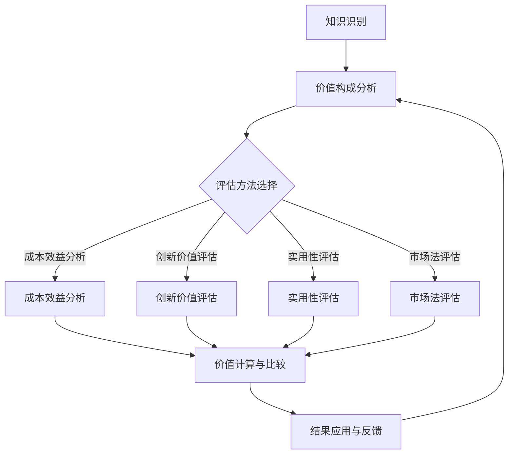

                 

### 知识的价值评估：一个深刻的视角

在信息时代，知识已成为企业、个人和国家竞争力的核心。知识不仅决定了创新的速度和质量，还直接影响了经济增长和社会进步。然而，知识的价值评估却是一个复杂而多层次的问题。本文将探讨知识的价值评估，从核心概念、理论基础、评估方法到实际应用，提供一种全面的视角，帮助读者深入理解知识的价值及其评估过程。

**关键词：** 知识价值评估、经济学视角、管理学视角、定量评估方法、定性评估方法、综合评估方法、知识资产管理、投资决策

**摘要：** 本文首先定义了知识及其价值评估的基本概念，然后介绍了知识价值评估的理论基础，包括经济学和管理学视角。接着，详细讨论了知识价值评估的数学模型和计算方法，并列举了定量和定性评估方法的实际应用案例。文章的最后部分探讨了知识价值评估在实际管理、投资决策和其他领域的应用，并展望了未来的发展趋势。

### 目录

1. [引言与概述](#引言与概述)
2. [核心概念与理论基础](#核心概念与理论基础)
   1. [引言与概述](#引言与概述)
   2. [知识与价值评估的定义](#知识与价值评估的定义)
   3. [知识经济与知识价值评估的关系](#知识经济与知识价值评估的关系)
   4. [知识价值评估的重要性](#知识价值评估的重要性)
3. [知识价值评估的理论基础](#知识价值评估的理论基础)
   1. [知识价值的构成要素](#知识价值的构成要素)
   2. [知识价值评估的原理](#知识价值评估的原理)
   3. [知识价值评估的理论框架](#知识价值评估的理论框架)
4. [知识价值评估的数学模型](#知识价值评估的数学模型)
   1. [经济学视角下的知识价值评估](#经济学视角下的知识价值评估)
   2. [管理学视角下的知识价值评估](#管理学视角下的知识价值评估)
   3. [价值评估的数学公式与计算方法](#价值评估的数学公式与计算方法)
5. [知识价值评估的方法与实践](#知识价值评估的方法与实践)
   1. [定量评估方法](#定量评估方法)
   2. [定性评估方法](#定性评估方法)
   3. [综合评估方法](#综合评估方法)
6. [知识价值评估的实际应用](#知识价值评估的实际应用)
   1. [知识价值评估在企业管理中的应用](#知识价值评估在企业管理中的应用)
   2. [知识价值评估在投资决策中的应用](#知识价值评估在投资决策中的应用)
   3. [知识价值评估在其他领域的应用](#知识价值评估在其他领域的应用)
7. [知识价值评估的挑战与未来发展趋势](#知识价值评估的挑战与未来发展趋势)
   1. [知识价值评估的挑战](#知识价值评估的挑战)
   2. [知识价值评估的未来发展趋势](#知识价值评估的未来发展趋势)
8. [总结与展望](#总结与展望)
9. [附录](#附录)
   1. [知识价值评估的工具与资源](#知识价值评估的工具与资源)

---

### 第一部分：核心概念与理论基础

#### 第1章：引言与概述

在当今的信息时代，知识已经成为驱动创新和经济增长的核心要素。随着互联网和大数据技术的发展，知识的获取、传递和应用变得更加便捷和高效。然而，知识本身是无形的，它的价值评估成为一个复杂且重要的课题。本文旨在探讨知识的价值评估，提供一个系统的视角，帮助读者深入理解知识的价值及其评估过程。

**1.1 书籍主题与目标**

本篇文章将围绕以下主题进行讨论：

- **核心概念**：定义知识及其价值评估的基本概念。
- **理论基础**：探讨知识价值评估的理论基础，包括经济学和管理学视角。
- **评估方法**：介绍定量和定性评估方法，以及如何在实际中应用。
- **实际应用**：分析知识价值评估在不同领域（如企业管理、投资决策等）的实际应用。

本篇的目标是：

- 深化读者对知识价值的理解。
- 提供一个全面的框架，帮助评估知识的价值。
- 探讨知识价值评估的挑战和未来发展趋势。

**1.2 知识与价值评估的定义**

知识是一种信息，它通过学习和经验积累而获得。知识可以是有形的，如技术文档和专利，也可以是无形的，如技能和经验。知识的价值评估则是对知识带来的经济效益进行量化或定性分析的过程。

知识价值的定义可以从多个角度进行探讨：

- **经济学视角**：知识被视为一种生产要素，其价值取决于它对生产力的提升和收益的增加。
- **管理学视角**：知识价值体现在组织创新能力的提升和竞争力的增强。
- **社会学视角**：知识对社会发展和个人能力的提升具有深远的影响。

知识价值评估的定义可以概括为：通过对知识的内涵、传递和应用等方面进行分析，评估其对企业、组织或个人产生的经济效益和社会效益的过程。

**1.3 知识经济与知识价值评估的关系**

知识经济是相对于传统农业经济和工业经济的概念，它强调知识在生产和服务中的核心作用。在知识经济中，知识不仅是经济增长的关键动力，也是提高生产力、创新和竞争力的源泉。

知识经济与知识价值评估之间的关系如下：

- **知识经济**：知识经济推动了知识的生产、传播和应用，为知识价值评估提供了广阔的舞台。
- **知识价值评估**：知识价值评估帮助企业和组织更好地管理知识资产，提高知识利用效率，从而在知识经济中获得竞争优势。

**1.4 知识价值评估的重要性**

知识价值评估的重要性体现在以下几个方面：

- **决策支持**：通过评估知识的价值，企业和组织可以做出更明智的决策，如投资、研发和知识管理。
- **资源配置**：知识价值评估有助于合理配置资源，确保知识得到充分利用。
- **创新驱动**：知识价值评估能够激励创新，推动技术进步和产业升级。
- **风险管理**：知识价值评估有助于识别和降低知识风险，保护企业或组织的知识产权。

总之，知识价值评估是知识经济时代的重要工具，它不仅有助于企业和组织更好地管理知识资产，也为社会发展提供了新思路和新方法。

### 第2章：知识价值评估的理论基础

知识作为一种重要的生产要素，其价值评估需要建立在坚实的理论基础之上。本章将深入探讨知识价值的构成要素、评估原理和理论框架，为后续的评估方法和实践提供理论支持。

#### 2.1 知识价值的构成要素

知识价值的构成可以从多个维度进行分析，主要包括以下几个方面：

**2.1.1 知识的内涵与属性**

知识的内涵指的是知识所包含的信息内容，包括事实、理论、方法和技术等。知识的属性则包括知识的准确性、可靠性、创新性和适用性。这些属性直接影响知识的价值。

**2.1.2 知识的传递与转化**

知识的传递是指将知识从一个主体传递到另一个主体的过程，如通过教育、培训、交流和协作等方式。知识的转化是指将知识应用于实际问题的解决，如技术创新、产品改进和业务流程优化等。传递与转化的效率和质量对知识价值具有决定性影响。

**2.1.3 知识的应用效果**

知识的应用效果是指知识在实际应用中所产生的效益，包括经济效益和社会效益。经济效益如增加收入、降低成本、提高生产力等；社会效益如改善生活质量、推动社会进步、提升个人能力等。应用效果是衡量知识价值的重要指标。

**2.1.4 知识的稀缺性**

知识的稀缺性是指知识在特定时间、地点和条件下难以获取或复制的特性。稀缺性越高，知识的价值往往越大。知识的稀缺性受多种因素影响，如知识的复杂性、专有性和传播限制等。

**2.1.5 知识的市场需求**

市场需求是衡量知识价值的另一个重要因素。市场需求高意味着知识具有较高的价值，因为市场上愿意为该知识支付较高的价格。市场需求受技术发展、行业趋势、政策环境等因素的影响。

**2.2 知识价值评估的原理**

知识价值评估的原理主要包括以下几个基本方法：

**2.2.1 成本效益分析**

成本效益分析是一种常用的评估方法，通过比较知识获取、开发和应用的成本与预期效益，评估知识的价值。其基本公式为：

\[ V(K) = \frac{B(K)}{C(K)} \]

其中，\( V(K) \) 是知识价值，\( B(K) \) 是知识产生的效益，\( C(K) \) 是知识相关的成本。

**2.2.2 创新价值评估**

创新价值评估关注知识对创新能力的提升和创新成果的应用效果。其评估方法包括专利分析、市场研究和创新潜力评估等。

**2.2.3 实用性评估**

实用性评估通过评估知识的实际应用效果来衡量其价值。这种方法通常用于评估技术知识、管理知识和实践技能等。

**2.2.4 市场法评估**

市场法评估通过参考市场上类似知识的交易价格或市场价格来评估知识价值。这种方法适用于有明确市场定价的知识。

**2.3 知识价值评估的理论框架**

知识价值评估的理论框架可以概括为以下几个核心环节：

1. **知识识别**：识别待评估的知识，明确其类型、属性和应用场景。
2. **价值构成分析**：分析知识的内涵、传递与转化、应用效果、稀缺性和市场需求等因素，确定知识价值的构成要素。
3. **评估方法选择**：根据知识的特点和评估目标，选择合适的评估方法，如成本效益分析、创新价值评估、实用性评估和市场法评估等。
4. **价值计算与比较**：使用选定的评估方法计算知识价值，并进行比较分析，得出评估结果。
5. **结果应用与反馈**：将评估结果应用于知识管理、投资决策、资源配置等实际活动中，并根据反馈调整评估方法和策略。

以下是一个简化的知识价值评估的Mermaid流程图：



通过上述理论框架和流程，可以系统地评估知识的价值，为企业和组织提供有效的知识管理策略和决策支持。

#### 第3章：知识价值评估的数学模型

知识价值评估不仅是理论分析，还需要量化的方法来准确计算知识的价值。本章将介绍经济学和管理学视角下的知识价值评估模型，并详细解释相关的数学公式及其计算方法。

##### 3.1 经济学视角下的知识价值评估

经济学视角下的知识价值评估主要关注知识作为一种生产要素，如何通过市场交易或生产活动产生价值。这里，我们将讨论两种评估模型：完全信息条件下的评估模型和不完全信息条件下的评估模型。

**3.1.1 完全信息条件下的评估模型**

在完全信息条件下，所有相关的信息和参数都是已知的，可以准确计算知识的价值。一个简单的评估模型是基于成本效益分析（Cost-Benefit Analysis, CBA），其基本公式为：

\[ V(K) = \frac{B(K) - C(K)}{R(K)} \]

其中，\( V(K) \) 表示知识的价值，\( B(K) \) 表示知识产生的效益，\( C(K) \) 表示知识相关的成本，\( R(K) \) 表示知识的风险或不确定性。

**3.1.2 不完全信息条件下的评估模型**

在不完全信息条件下，由于信息的不完整或不确定，无法准确计算知识的价值。这种情况下，常用的评估模型是基于期望值理论（Expected Value Theory），其基本公式为：

\[ V(K) = E(B(K)) - E(C(K)) \]

其中，\( E(B(K)) \) 表示知识产生的期望效益，\( E(C(K)) \) 表示知识相关的期望成本。期望效益和期望成本可以通过概率分布来计算。

以下是一个不完全信息条件下知识价值评估的示例：

```markdown
假设知识K的效益B(K)服从正态分布，均值为100万元，标准差为30万元；成本C(K)服从对数正态分布，均值为5万元，标准差为1万元。

计算知识K的价值：

\[ V(K) = E(B(K)) - E(C(K)) \]
\[ E(B(K)) = 100 \]
\[ E(C(K)) = e^{5} \approx 148.4 \]
\[ V(K) = 100 - 148.4 = -48.4 \]
```

这个示例表明，在不完全信息条件下，知识K的期望价值为负，意味着在风险考虑下，知识K的价值可能为负。

##### 3.2 管理学视角下的知识价值评估

管理学视角下的知识价值评估主要关注知识如何提高组织的创新能力、竞争优势和整体绩效。这里，我们将讨论效用理论（Utility Theory）和博弈论（Game Theory）在知识价值评估中的应用。

**3.2.1 价值评估的效用理论**

效用理论是一种评估决策价值的方法，它基于决策者的主观感受和偏好。在知识价值评估中，效用理论可以用于衡量知识对决策者产生的价值。

一个简单的效用函数可以表示为：

\[ U(K) = \alpha \cdot B(K) - \beta \cdot C(K) \]

其中，\( U(K) \) 表示知识的价值，\( \alpha \) 和 \( \beta \) 是权重系数，\( B(K) \) 是知识产生的效益，\( C(K) \) 是知识相关的成本。权重系数反映了决策者对效益和成本的偏好。

**3.2.2 价值评估的博弈论**

博弈论是研究决策者在竞争或合作环境中如何做出最优决策的数学工具。在知识价值评估中，博弈论可以用于分析知识共享和知识交换的策略。

一个简单的博弈模型可以表示为：

\[ V(K) = \sum_{i} \sum_{j} P(i, j) \cdot U(K_i, K_j) \]

其中，\( V(K) \) 表示知识的价值，\( P(i, j) \) 是决策者i和j之间进行知识交换的概率，\( U(K_i, K_j) \) 是知识交换的效用。

##### 3.3 价值评估的数学公式与计算方法

在知识价值评估中，数学公式和计算方法有助于准确计算知识的价值。以下是一些常用的数学公式和计算方法。

**3.3.1 价值评估的数学公式**

一个通用的知识价值评估公式可以表示为：

\[ V(K) = f(C, R, T) \]

其中，\( C \) 表示成本，\( R \) 表示收益，\( T \) 表示时间。

一个具体的公式示例为：

\[ V(K) = C \cdot R^T \]

其中，\( C \) 是知识获取和应用的固定成本，\( R \) 是知识带来的年度收益，\( T \) 是知识的应用周期。

**3.3.2 数学公式的详细讲解与举例**

以下是一个具体的数学公式示例及其详细讲解和举例：

**示例：知识价值的年化评估模型**

\[ V(K) = C \cdot (1 + R)^T - C \]

其中，\( C \) 是初始投资成本，\( R \) 是年化收益率，\( T \) 是投资周期（年）。

**详细讲解：**

- **初始投资成本（C）**：这是知识获取和应用的固定成本，包括培训、研发、工具购置等。
- **年化收益率（R）**：这是知识每年带来的收益增长比例。
- **投资周期（T）**：这是知识的应用周期，通常以年为单位。

**举例：**

假设知识K的初始投资成本为50万元，年化收益率为20%，投资周期为5年。

\[ V(K) = 50 \cdot (1 + 0.2)^5 - 50 \]
\[ V(K) = 50 \cdot 1.6386 - 50 \]
\[ V(K) = 81.93 - 50 \]
\[ V(K) = 31.93 \]

这个结果表明，知识K在5年的应用周期内，其总价值为31.93万元。

通过上述数学模型和公式，可以更准确地评估知识的价值，为企业和组织的知识管理提供科学依据。

### 第二部分：知识价值评估的方法与实践

#### 第4章：定量评估方法

定量评估方法是通过数值分析和技术手段对知识价值进行量化评估的方法。这些方法具有客观性、精确性和可重复性，是知识价值评估的重要组成部分。本章将介绍基于经济学和管理的定量评估方法，并分析其实际应用。

##### 4.1 基于经济学的评估方法

经济学视角下的定量评估方法主要包括成本效益分析（Cost-Benefit Analysis, CBA）和市场法（Market Method）。

**4.1.1 成本法评估**

成本法评估是指通过计算知识获取、开发和应用的成本来评估其价值。这种方法适用于新知识或原创知识的评估。其基本公式为：

\[ V(K) = \sum C_i \]

其中，\( V(K) \) 是知识价值，\( C_i \) 是知识获取、开发和应用的各项成本。

**案例：某企业研发新技术的成本评估**

假设企业研发新技术的成本包括研发费用、人力成本和设备成本，分别为100万元、50万元和30万元。

\[ V(K) = 100 + 50 + 30 = 180 \]

该新技术知识的成本评估值为180万元。

**4.1.2 市场法评估**

市场法评估是指通过参考市场上类似知识的交易价格来评估知识价值。这种方法适用于成熟的知识和专利。其基本公式为：

\[ V(K) = \frac{P(K)}{Q(K)} \]

其中，\( V(K) \) 是知识价值，\( P(K) \) 是市场上类似知识的交易价格，\( Q(K) \) 是市场上类似知识的数量。

**案例：某专利的市场价值评估**

假设市场上类似专利的交易价格为100万元，数量为10个。

\[ V(K) = \frac{100}{10} = 10 \]

该专利的市场价值评估值为10万元。

##### 4.2 基于管理学的评估方法

管理学视角下的定量评估方法主要包括成本效益分析（Cost-Benefit Analysis, CBA）和创新价值评估（Innovation Value Assessment, IVA）。

**4.2.1 成本效益分析**

成本效益分析是指通过计算知识获取、开发和应用的成本与预期效益的比值来评估其价值。其基本公式为：

\[ V(K) = \frac{B(K) - C(K)}{C(K)} \]

其中，\( V(K) \) 是知识价值，\( B(K) \) 是知识产生的效益，\( C(K) \) 是知识相关的成本。

**案例：某企业知识管理的成本效益分析**

假设企业知识管理的年收益为200万元，年成本为100万元。

\[ V(K) = \frac{200 - 100}{100} = 1 \]

该知识管理的成本效益比值为1，表示每投入100万元，能够获得200万元的收益。

**4.2.2 创新价值评估**

创新价值评估是指通过评估知识对组织创新能力和竞争优势的提升来评估其价值。其基本公式为：

\[ V(K) = \alpha \cdot I(K) + \beta \cdot A(K) \]

其中，\( V(K) \) 是知识价值，\( \alpha \) 和 \( \beta \) 是权重系数，\( I(K) \) 是创新价值，\( A(K) \) 是竞争优势。

**案例：某企业技术创新价值的评估**

假设企业技术创新的权重系数分别为0.6和0.4，创新价值为500万元，竞争优势为300万元。

\[ V(K) = 0.6 \cdot 500 + 0.4 \cdot 300 = 300 + 120 = 420 \]

该企业技术创新价值的评估值为420万元。

##### 4.3 定量评估方法的实际应用

定量评估方法在实际应用中具有广泛的适用性，以下为两个实际案例。

**案例一：知识资产定价**

某公司计划出售其知识资产，包括专利、技术文档和商标。采用市场法评估其价值。

- 专利交易价格：100万元
- 技术文档交易价格：50万元
- 商标交易价格：20万元

总价值计算：

\[ V(K) = 100 + 50 + 20 = 170 \]

该知识资产的总价值评估值为170万元。

**案例二：知识管理效益分析**

某公司实施知识管理项目，预期年收益为500万元，年成本为200万元。采用成本效益分析评估其效益。

\[ V(K) = \frac{500 - 200}{200} = 1.5 \]

该知识管理项目的成本效益比值为1.5，表示投入200万元能够获得500万元的收益。

通过定量评估方法，企业可以更科学地管理知识资产，优化资源配置，提高知识利用效率。

### 第5章：定性评估方法

定性评估方法是一种通过主观判断和经验分析来评估知识价值的手段。这些方法具有灵活性、适应性和主观性，适用于复杂、不确定或难以量化的知识价值评估。本章将介绍专家评估法和实证研究方法，并分析其实际应用。

##### 5.1 专家评估法

专家评估法是一种基于专家意见和经验进行知识价值评估的方法。专家们通过对知识的内涵、应用效果和市场前景等方面进行分析，给出知识价值的定性评价。

**5.1.1 专家评估的基本原理**

专家评估法的基本原理如下：

1. **专家选择**：选择具有相关领域专业知识和丰富经验的专家。
2. **评估指标**：确定评估指标，如知识内涵、应用效果、市场前景等。
3. **评估过程**：专家根据评估指标对知识进行评价，形成评估结果。
4. **结果分析**：对评估结果进行统计分析，得出知识价值的定性评价。

**5.1.2 专家评估的步骤与方法**

专家评估的步骤和方法如下：

1. **准备评估方案**：确定评估目标、评估指标和评估方法。
2. **专家培训**：对专家进行培训，确保他们对评估指标和方法有清晰的理解。
3. **收集专家意见**：通过调查问卷、访谈等方式，收集专家对知识价值的评估意见。
4. **评估意见汇总**：对收集到的专家意见进行汇总和分析，形成初步评估结果。
5. **结果验证**：对初步评估结果进行验证，确保评估结果的准确性和可靠性。
6. **最终评估结果**：根据验证结果，得出知识价值的最终定性评价。

**5.1.3 专家评估的实际应用**

专家评估法在实际应用中具有广泛的适用性，以下为两个实际案例。

**案例一：知识转移评估**

某企业计划将一项核心技术转移给合作伙伴。采用专家评估法评估其知识价值。

- **专家选择**：选择具有技术研发和知识转移经验的专家。
- **评估指标**：包括知识内涵、技术创新性、市场前景等。
- **评估过程**：专家对知识价值进行评估，形成初步评估结果。
- **结果分析**：对初步评估结果进行统计分析，得出知识价值的定性评价。

**案例二：知识产权评估**

某公司计划对其知识产权进行评估，以确定其转让或投资的价值。采用专家评估法评估其知识产权价值。

- **专家选择**：选择具有知识产权评估经验的专家。
- **评估指标**：包括知识产权的创新性、市场前景、法律保护等。
- **评估过程**：专家对知识产权价值进行评估，形成初步评估结果。
- **结果分析**：对初步评估结果进行统计分析，得出知识产权价值的定性评价。

##### 5.2 实证研究方法

实证研究方法是一种通过实际案例和数据来评估知识价值的方法。这些方法具有数据驱动性和实证性，适用于验证和优化定性评估方法。

**5.2.1 实证研究的设计**

实证研究的设计步骤如下：

1. **确定研究目标**：明确研究的目标和问题。
2. **选择研究对象**：选择具有代表性的研究对象。
3. **数据收集**：通过调查问卷、访谈、实地观察等方式收集数据。
4. **数据整理**：对收集到的数据进行整理和分析。
5. **结果分析**：对整理后的数据进行分析，得出研究结论。

**5.2.2 实证研究的分析**

实证研究的分析步骤如下：

1. **描述性分析**：对数据的基本特征进行描述和分析。
2. **相关性分析**：分析变量之间的相关性。
3. **差异性分析**：分析不同组别之间的差异性。
4. **因果分析**：分析变量之间的因果关系。

**5.2.3 实证研究的实际应用**

实证研究方法在实际应用中具有广泛的适用性，以下为两个实际案例。

**案例一：知识管理效能评估**

某企业实施知识管理项目，采用实证研究方法评估其效能。

- **研究目标**：评估知识管理项目的实际效果。
- **研究对象**：选择企业内部的知识管理者和管理团队。
- **数据收集**：通过调查问卷和访谈收集数据。
- **数据分析**：对收集到的数据进行分析，评估知识管理项目的效能。

**案例二：技术创新价值评估**

某企业评估其技术创新项目的价值，采用实证研究方法。

- **研究目标**：评估技术创新项目的价值。
- **研究对象**：选择技术创新项目的参与者。
- **数据收集**：通过调查问卷和访谈收集数据。
- **数据分析**：对收集到的数据进行分析，评估技术创新项目的价值。

通过定性评估方法，企业可以更全面地了解知识的价值，为知识管理、投资决策和战略规划提供参考。

### 第6章：知识价值评估的综合方法

知识价值评估的综合方法是将定量和定性评估方法相结合，通过多维度、多层次的评估，以更全面、准确地评估知识价值。本章将介绍多维度评估方法和动态评估方法，并分析其实际应用。

##### 6.1 多维度评估方法

多维度评估方法是一种通过综合考虑知识的不同方面，如经济、社会、技术等，进行全面评估的方法。

**6.1.1 综合评估模型的设计**

设计多维度评估模型时，需要考虑以下几个关键步骤：

1. **确定评估维度**：根据知识的特点和应用场景，确定评估的维度，如经济效益、社会效益、技术性能等。
2. **构建评估指标**：为每个评估维度构建具体的评估指标，如知识创新度、市场前景、社会影响力等。
3. **确定权重系数**：根据各评估指标的重要性，确定权重系数，确保评估结果的公正性和准确性。
4. **评估方法选择**：为每个评估指标选择合适的定量或定性评估方法。

**6.1.2 综合评估模型的实现**

综合评估模型的实现步骤如下：

1. **数据收集**：收集与评估指标相关的数据，如经济效益、社会效益、技术性能等。
2. **指标评分**：根据评估指标和数据，对知识进行评分，可采用定量评分法或定性评分法。
3. **权重计算**：根据权重系数计算各指标的加权得分。
4. **综合评估**：将各指标的加权得分相加，得出知识的总得分，从而评估知识的价值。

**6.1.3 多维度评估方法的实际应用**

多维度评估方法在实际应用中具有广泛的适用性，以下为两个实际案例。

**案例一：知识资产评估**

某企业对其知识资产进行评估，采用多维度评估方法。

- **评估维度**：经济效益、社会效益、技术性能。
- **评估指标**：知识创新度、市场前景、社会影响力。
- **权重系数**：经济效益占40%，社会效益占30%，技术性能占30%。
- **评估实现**：根据指标和数据，计算各指标的加权得分，得出知识资产的总得分。

**案例二：技术创新项目评估**

某企业对其技术创新项目进行评估，采用多维度评估方法。

- **评估维度**：经济效益、技术性能、市场前景。
- **评估指标**：创新度、市场潜力、技术可行性。
- **权重系数**：经济效益占40%，技术性能占30%，市场前景占30%。
- **评估实现**：根据指标和数据，计算各指标的加权得分，得出技术创新项目的总得分。

##### 6.2 动态评估方法

动态评估方法是一种考虑知识价值随时间变化的方法。由于知识具有一定的生命周期，其价值会随着时间的推移而发生变化，动态评估方法能够更准确地反映知识价值的真实情况。

**6.2.1 动态评估的基本原理**

动态评估方法的基本原理如下：

1. **确定评估周期**：根据知识的特点和应用场景，确定评估的时间周期，如年度、季度等。
2. **价值递减规律**：考虑知识价值随时间递减的规律，可采用折旧模型或衰减模型。
3. **评估指标调整**：根据知识价值的递减规律，动态调整评估指标，确保评估结果的实时性和准确性。

**6.2.2 动态评估的实施策略**

动态评估的实施策略如下：

1. **定期评估**：根据评估周期，定期对知识价值进行评估，如每年一次。
2. **实时监控**：建立实时监控系统，监控知识价值的动态变化。
3. **及时调整**：根据实时监控结果，及时调整评估指标和评估方法，以适应知识价值的变化。

**6.2.3 动态评估方法的实际应用**

动态评估方法在实际应用中具有广泛的适用性，以下为两个实际案例。

**案例一：企业知识价值动态评估**

某企业对其知识价值进行动态评估。

- **评估周期**：每年一次。
- **价值递减规律**：采用折旧模型，知识价值每年减少10%。
- **评估实现**：根据评估周期和折旧模型，定期计算知识价值，监控其动态变化。

**案例二：技术创新项目动态评估**

某企业对其技术创新项目进行动态评估。

- **评估周期**：每季度一次。
- **价值递减规律**：采用衰减模型，知识价值每季度减少5%。
- **评估实现**：根据评估周期和衰减模型，定期计算技术创新项目的知识价值，监控其动态变化。

通过综合评估方法和动态评估方法，企业可以更全面、准确地评估知识价值，为知识管理和投资决策提供有力支持。

### 第三部分：知识价值评估的实际应用

#### 第7章：知识价值评估在企业管理中的应用

知识是现代企业竞争力的核心，有效的知识管理有助于企业创新、提高生产效率和增强市场竞争力。本章将探讨知识价值评估在企业管理中的应用，包括知识资产管理的战略规划、知识价值的评估与定价，并结合实际案例进行详细分析。

##### 7.1 知识资产管理的战略规划

知识资产管理是企业通过系统的方法来识别、评估、利用和保护其知识资产的过程。有效的知识资产管理需要从战略规划开始，明确知识资产管理的目标和原则。

**7.1.1 知识资产的概念与分类**

知识资产是指企业拥有或控制的、能够带来经济或社会效益的知识资源，包括专利、商标、版权、技术秘密、客户名单、商业策略等。

根据不同的分类标准，知识资产可以划分为以下几类：

- **知识产权类知识资产**：如专利、商标、版权等。
- **商业秘密类知识资产**：如技术秘密、商业策略、客户名单等。
- **人力资源类知识资产**：如员工的知识和技能、培训资料等。
- **信息技术类知识资产**：如软件代码、数据库、技术标准等。

**7.1.2 知识资产管理的目标与原则**

知识资产管理的目标主要包括：

- 提高知识利用效率，促进创新。
- 保护知识产权，降低知识泄露和滥用的风险。
- 提升企业核心竞争力，增强市场竞争力。

知识资产管理的原则包括：

- **战略性**：知识资产管理应与企业的整体战略相一致，确保知识资产能够支持企业长期发展。
- **系统性**：知识资产管理应采用系统的方法，包括知识识别、评估、利用和保护等环节。
- **规范性**：知识资产管理应遵循相关法律法规和行业标准，确保知识资产的安全和合法。
- **动态性**：知识资产管理应具有动态调整的能力，以适应企业内外部环境的变化。

**7.1.3 知识资产管理的战略规划步骤**

企业知识资产管理的战略规划通常包括以下步骤：

1. **现状评估**：评估企业现有知识资产的类型、数量和价值。
2. **目标设定**：根据企业战略和市场需求，设定知识资产管理的具体目标。
3. **方案设计**：制定知识资产管理的具体方案，包括知识识别、评估、利用和保护的方法和工具。
4. **实施与监控**：实施知识资产管理方案，并建立监控机制，确保知识资产管理的有效执行。

##### 7.2 知识价值的评估与定价

知识价值的评估与定价是知识资产管理的核心环节，通过科学的评估方法，确定知识资产的价值，并制定合理的定价策略，有助于企业的知识交易、投资和资源配置。

**7.2.1 知识价值的评估模型**

知识价值的评估模型可以从多个角度进行构建，常见的评估模型包括：

- **成本效益分析模型**：通过计算知识获取、开发和应用的成本与收益，评估知识的经济价值。
- **创新价值评估模型**：通过评估知识对组织创新能力和竞争优势的贡献，评估知识的创新价值。
- **市场法模型**：通过参考市场上类似知识的交易价格，评估知识的市场价值。
- **专家评估模型**：通过专家的主观判断和经验分析，评估知识的价值。

以下是一个基于成本效益分析的简单知识价值评估模型：

\[ V(K) = \frac{B(K) - C(K)}{R(K)} \]

其中，\( V(K) \) 是知识价值，\( B(K) \) 是知识产生的效益，\( C(K) \) 是知识相关的成本，\( R(K) \) 是知识的风险或不确定性。

**7.2.2 知识价值的定价策略**

知识价值的定价策略应根据知识的特点和市场环境进行制定，常见的定价策略包括：

- **成本定价策略**：根据知识获取和开发的成本，加上合理的利润，确定知识的价格。
- **市场定价策略**：参考市场上类似知识的交易价格，确定知识的价格。
- **价值定价策略**：根据知识对用户的价值，确定知识的价格。
- **竞争定价策略**：根据市场竞争状况，确定知识的价格。

以下是一个基于价值定价策略的案例：

- **知识价值评估结果**：某项技术知识的评估价值为100万元。
- **定价策略**：根据技术知识对客户企业的价值，确定定价为120万元。

**7.2.3 知识价值评估与定价的实际案例**

**案例一：企业内部知识转移定价**

某企业计划将其一项核心技术知识转移给下属子公司，采用成本效益分析模型进行评估与定价。

- **成本评估**：研发成本为50万元，培训成本为20万元。
- **效益评估**：预计年收益为200万元。
- **定价**：根据成本效益分析模型，知识定价为170万元。

**案例二：外部知识采购定价**

某企业计划采购一项关键技术知识，采用市场定价策略进行评估与定价。

- **市场参考价格**：市场上类似技术的交易价格为150万元。
- **定价**：根据市场定价策略，知识定价为150万元。

通过知识价值评估与定价，企业可以更科学地管理知识资产，优化资源配置，提高知识利用效率。

#### 第8章：知识价值评估在投资决策中的应用

知识价值的评估在投资决策中起着至关重要的作用。通过对知识的价值进行准确评估，投资者和决策者可以更好地理解知识投资的潜在收益和风险，从而做出更加明智的投资决策。本章将探讨知识价值评估在投资决策中的应用，包括投资决策的基本概念、知识价值评估方法以及实际案例。

##### 8.1 投资决策的基本概念

投资决策是指企业在特定条件下，对不同的投资方案进行选择和决策的过程。投资决策的类型主要包括：

- **战略性投资**：长期投资，旨在提升企业的核心竞争力，如研发新产品、扩大市场份额等。
- **运营性投资**：短期投资，旨在优化企业的日常运营，提高效率，如设备更新、流程改进等。

投资决策的影响因素包括：

- **市场环境**：市场需求、竞争状况、宏观经济形势等。
- **技术因素**：技术成熟度、创新潜力、技术风险等。
- **财务因素**：投资回报率、资金成本、现金流等。
- **战略因素**：企业发展战略、竞争优势、长期目标等。

##### 8.2 知识价值评估在投资决策中的应用

知识价值评估在投资决策中的应用主要通过以下几个步骤进行：

1. **知识识别与分类**：明确待评估的知识类型，如技术知识、管理知识、市场知识等。
2. **评估方法选择**：根据知识的特点和应用场景，选择合适的评估方法，如成本效益分析、创新价值评估、市场法评估等。
3. **价值计算**：根据评估方法计算知识的价值，得到知识投资的潜在收益。
4. **风险评估**：评估知识投资的风险，如技术风险、市场风险、法律风险等。
5. **投资决策**：根据知识价值、风险评估和投资成本等因素，做出投资决策。

以下是一个具体的投资决策案例：

**案例一：某企业研发新技术的投资决策**

某企业计划投资研发一项新技术，以提升其产品竞争力。采用知识价值评估模型进行投资决策。

1. **知识识别与分类**：新技术知识，属于技术知识。
2. **评估方法选择**：采用成本效益分析模型。
3. **价值计算**：
   - 成本评估：研发成本为200万元。
   - 效益评估：预计年收益为500万元。
   - 知识价值计算：
     \[ V(K) = \frac{B(K) - C(K)}{R(K)} \]
     \[ V(K) = \frac{500 - 200}{R(K)} \]
     \[ V(K) = \frac{300}{R(K)} \]
4. **风险评估**：技术风险、市场风险较低。
5. **投资决策**：根据知识价值和风险评估，决定投资研发新技术。

##### 8.3 知识价值评估的其他实际应用

除了在研发投资决策中的应用，知识价值评估在并购、投资组合优化等领域也有广泛的应用。

**案例二：企业并购的知识价值评估**

某企业计划收购一家专注于人工智能技术的初创公司，采用知识价值评估模型进行投资决策。

1. **知识识别与分类**：人工智能技术知识，属于技术知识。
2. **评估方法选择**：采用市场法评估模型。
3. **价值计算**：
   - 市场参考价格：类似公司交易价格为1000万元。
   - 知识价值计算：
     \[ V(K) = \frac{P(K)}{Q(K)} \]
     \[ V(K) = \frac{1000}{Q(K)} \]
4. **风险评估**：技术风险、市场风险、法律风险等。
5. **投资决策**：根据知识价值和风险评估，决定是否收购。

通过知识价值评估，企业可以更准确地评估知识投资的价值和风险，从而做出更科学的投资决策。

#### 第9章：知识价值评估在其他领域的应用

知识作为一种重要的资源，其价值评估不仅在企业管理、投资决策中具有重要应用，还在教育、科研等领域发挥着关键作用。本章将探讨知识价值评估在教育、科研及其他领域中的应用，结合实际案例进行详细分析。

##### 9.1 教育领域的知识价值评估

教育领域的知识价值评估旨在衡量教育过程中知识传授的效果和对学生能力提升的贡献。有效的知识价值评估有助于优化教育资源分配，提高教育质量。

**9.1.1 教育知识价值的评估方法**

教育知识价值的评估方法主要包括：

- **学生成绩评估**：通过学生考试成绩来衡量知识传授的效果。
- **学习行为分析**：通过分析学生的学习行为，如出勤率、作业完成情况等，评估知识的应用效果。
- **技能评估**：通过实际操作或技能测试，评估学生掌握的知识技能。
- **问卷调查法**：通过问卷调查，收集学生对知识价值的感受和评价。

**9.1.2 教育知识价值的评估案例**

**案例一：某高校课程评估**

某高校对一门计算机编程课程进行知识价值评估。

- **评估方法**：学生成绩评估和问卷调查法。
- **评估过程**：
  - 学生考试成绩：平均分为85分。
  - 问卷调查：90%的学生认为课程提高了他们的编程技能。
- **评估结果**：课程在提高学生编程技能方面具有显著价值。

**案例二：某中学知识传授效果评估**

某中学对一门科学课程的知识传授效果进行评估。

- **评估方法**：学习行为分析和技能评估。
- **评估过程**：
  - 学生出勤率：98%。
  - 作业完成情况：优秀率90%。
  - 实验操作技能测试：合格率95%。
- **评估结果**：科学课程在提高学生科学知识和实践能力方面效果显著。

##### 9.2 科研领域的知识价值评估

科研领域的知识价值评估旨在衡量科研活动对社会进步、经济发展和学术发展的贡献。准确的科研知识价值评估有助于优化科研资源配置，提升科研效率。

**9.2.1 科研知识价值的评估方法**

科研知识价值的评估方法主要包括：

- **成果质量评估**：通过学术论文、专利、项目成果等质量来衡量科研贡献。
- **社会影响评估**：通过科研成果的应用范围、影响力和社会效益来衡量知识价值。
- **经济效益评估**：通过科研成果对经济增长、企业效益等方面的贡献来衡量知识价值。
- **学术影响力评估**：通过科研成果在学术界的引用次数、排名等来衡量学术价值。

**9.2.2 科研知识价值的评估案例**

**案例一：某科研项目评估**

某科研项目聚焦于新能源技术的研究，旨在推动可再生能源的发展。

- **评估方法**：成果质量评估和社会影响评估。
- **评估过程**：
  - 学术成果：发表论文10篇，其中5篇被顶级期刊收录。
  - 社会影响：技术成果被多家新能源企业采用，节省能源成本约5000万元。
- **评估结果**：该科研项目的知识价值显著，对社会和经济发展具有积极作用。

**案例二：某科研成果应用评估**

某科研成果在医疗领域得到应用，旨在提高癌症诊断的准确性。

- **评估方法**：经济效益评估和学术影响力评估。
- **评估过程**：
  - 经济效益：产品投放市场后，年销售额达到1亿元。
  - 学术影响：相关论文发表在顶级医学期刊，被引用次数超过100次。
- **评估结果**：该科研成果在经济效益和学术影响力方面具有显著价值。

##### 9.3 其他领域的知识价值评估

知识价值评估在文化、社会、法律等领域也有重要应用。

**9.3.1 文化领域的知识价值评估**

文化领域的知识价值评估旨在衡量文化产品和服务的文化价值和社会影响力。

**案例一：某文化产品的评估**

某文化公司推出一部电影，旨在弘扬传统文化。

- **评估方法**：社会影响评估和经济效益评估。
- **评估过程**：
  - 社会影响：影片在国内外广受好评，被多个电影节评选为优秀作品。
  - 经济效益：票房收入超过2亿元。
- **评估结果**：该文化产品在文化价值和经济收益方面具有显著价值。

**9.3.2 社会领域的知识价值评估**

社会领域的知识价值评估旨在衡量知识对社区发展、社会进步的影响。

**案例二：某社会服务项目的评估**

某社会服务项目旨在帮助贫困地区提升教育水平。

- **评估方法**：社会效益评估和成本效益分析。
- **评估过程**：
  - 社会效益：项目实施后，贫困地区的教育水平显著提高，辍学率降低，升学率提高。
  - 成本效益：项目投入与收益相比，具有很高的成本效益比。
- **评估结果**：该社会服务项目在提升社会效益方面具有显著价值。

通过知识价值评估，教育、科研、文化和社会等领域可以更科学地管理和利用知识资源，提升整体发展水平。

### 第四部分：知识价值评估的挑战与未来发展趋势

#### 第10章：知识价值评估的挑战与未来发展趋势

知识价值评估作为现代企业管理、投资决策和战略规划的重要工具，面临着诸多挑战。同时，随着技术的进步和社会环境的变化，知识价值评估也在不断演进。本章将探讨知识价值评估面临的挑战和未来发展趋势。

##### 10.1 知识价值评估的挑战

**10.1.1 数据质量问题**

数据是知识价值评估的重要基础，然而，数据质量直接影响评估结果的准确性和可靠性。数据质量问题主要包括数据缺失、数据错误和数据不一致等。以下是一些常见的数据质量问题及其影响：

- **数据缺失**：数据缺失可能导致评估结果偏颇，无法全面反映知识的真实价值。
- **数据错误**：数据错误会导致评估结果失真，误导决策者。
- **数据不一致**：不同来源的数据可能存在差异，导致评估结果难以统一。

**10.1.2 评估方法创新**

知识价值评估方法需要不断创新，以适应不同类型知识的特点和应用场景。传统的评估方法如成本效益分析、市场法等在某些情况下可能不再适用。以下是一些评估方法创新的挑战：

- **新评估方法的研究**：开发适用于复杂、不确定或难以量化的知识价值评估方法。
- **跨学科融合**：结合不同学科的理论和方法，提高知识价值评估的全面性和科学性。
- **大数据分析**：利用大数据技术，挖掘知识价值评估中的潜在规律和趋势。

**10.1.3 知识价值评估的伦理问题**

知识价值评估涉及知识产权、隐私保护、公平竞争等多个伦理问题。以下是一些常见的伦理问题及其影响：

- **知识产权保护**：知识价值评估可能侵犯知识产权，影响知识创造者的合法权益。
- **隐私保护**：评估过程中可能涉及个人隐私数据，需要确保数据的安全和隐私。
- **公平竞争**：评估方法需要确保公平性，避免因评估结果导致的不公平竞争。

##### 10.2 知识价值评估的未来发展趋势

**10.2.1 人工智能与知识价值评估**

人工智能（AI）技术在知识价值评估中的应用具有巨大的潜力。以下是一些未来发展趋势：

- **自动化评估**：利用机器学习算法，实现自动化知识价值评估，提高评估效率。
- **智能推荐**：基于用户行为和偏好，提供个性化的知识价值评估建议。
- **知识图谱**：构建知识图谱，揭示知识之间的关联和影响，提高评估的全面性和准确性。

**10.2.2 大数据与知识价值评估**

大数据技术在知识价值评估中的应用将极大地提升评估的精度和深度。以下是一些未来发展趋势：

- **大数据分析**：利用大数据技术，深入挖掘知识价值评估中的复杂关系和潜在规律。
- **实时评估**：通过实时数据流处理，实现知识价值评估的实时性和动态性。
- **多维度评估**：结合不同类型的数据源，实现多维度、全方位的知识价值评估。

**10.2.3 跨学科融合与知识价值评估**

跨学科融合是未来知识价值评估发展的重要方向。以下是一些未来发展趋势：

- **跨学科方法**：结合经济学、管理学、社会学等多学科理论和方法，提高知识价值评估的科学性和实用性。
- **多领域应用**：将知识价值评估应用于不同领域，如教育、科研、文化等，推动知识的普及和利用。
- **综合评估模型**：构建综合评估模型，整合不同学科的理论和方法，实现知识价值评估的全面性和系统性。

通过应对挑战和把握发展趋势，知识价值评估将在未来发挥更大的作用，为企业和组织的知识管理、投资决策和战略规划提供有力支持。

### 第11章：总结与展望

#### 11.1 书籍内容的总结

本文围绕知识价值评估这一主题，系统地探讨了核心概念、理论基础、评估方法以及实际应用。首先，明确了知识及其价值评估的基本概念，阐述了知识经济与知识价值评估的关系，强调了知识价值评估的重要性。接着，介绍了知识价值评估的理论基础，包括知识价值的构成要素和评估原理。在定量和定性评估方法部分，详细讨论了经济学和管理学视角下的评估模型，以及多维度和动态评估方法。此外，分析了知识价值评估在企业管理、投资决策和其他领域的实际应用，并提出了应对挑战和未来发展趋势的建议。

#### 11.2 研究与未来工作方向

知识价值评估作为一门交叉学科，具有广泛的研究和应用前景。未来的研究可以围绕以下几个方向展开：

- **数据质量提升**：研究如何提高数据质量，确保知识价值评估的准确性和可靠性。
- **评估方法创新**：开发新的评估方法，如基于大数据和人工智能的智能评估系统。
- **跨学科融合**：结合经济学、管理学、社会学等多学科理论，构建更加全面和科学的评估模型。
- **案例研究**：开展更多实际案例研究，验证评估方法的有效性和适用性。

#### 11.3 对知识价值评估的展望

随着信息技术的快速发展和社会变革，知识价值评估将在未来发挥更加重要的作用。以下是对知识价值评估的展望：

- **智能化**：借助人工智能和大数据技术，实现知识价值评估的智能化和自动化。
- **全球化**：知识价值的评估和交易将逐渐全球化，跨国企业的知识价值评估需求将不断增加。
- **多元化**：知识类型将更加丰富，包括虚拟现实、区块链等新兴领域，知识价值评估将面临新的挑战和机遇。
- **伦理化**：知识价值评估将更加注重伦理问题，如知识产权保护、隐私保护等。

通过不断探索和创新，知识价值评估将为企业和组织提供更加科学、准确和全面的评估工具，助力其在知识经济时代取得竞争优势。

### 附录

#### 附录A：知识价值评估的工具与资源

A.1 知识价值评估工具介绍

**A.1.1 常用知识价值评估工具**

- **Knowledge Value Calculator**：一款简单易用的知识价值评估计算器，提供多种评估模型和计算方法。
- **Kvalitas**：一款基于大数据分析的知识价值评估工具，能够实时监控和评估知识价值变化。
- **ValueScope**：一款综合性的知识价值评估平台，支持多种评估方法和数据来源。

**A.1.2 开源工具与应用**

- **OpenCV**：一款开源计算机视觉库，可用于知识价值评估中的图像处理和特征提取。
- **TensorFlow**：一款开源深度学习框架，可用于知识价值评估中的数据分析和预测建模。

A.2 知识价值评估相关资源

**A.2.1 学术论文与研究报告**

- **"Knowledge Value Assessment: A Theoretical Framework"**：该论文提出了一种知识价值评估的理论框架，详细阐述了评估原理和方法。
- **"The Impact of Big Data on Knowledge Value Assessment"**：该研究报告探讨了大数据技术在知识价值评估中的应用，分析了大数据对评估方法的影响。

**A.2.2 专著与书籍推荐**

- **"Knowledge Management and Value Creation"**：该书详细介绍了知识管理和知识价值评估的理论和实践，对知识管理具有重要指导意义。
- **"The Economics of Knowledge"**：该书从经济学的角度探讨了知识的价值评估，提供了丰富的理论和实证分析。

通过附录部分提供的工具与资源，读者可以进一步深入学习和应用知识价值评估的方法，提升相关领域的实践能力。

