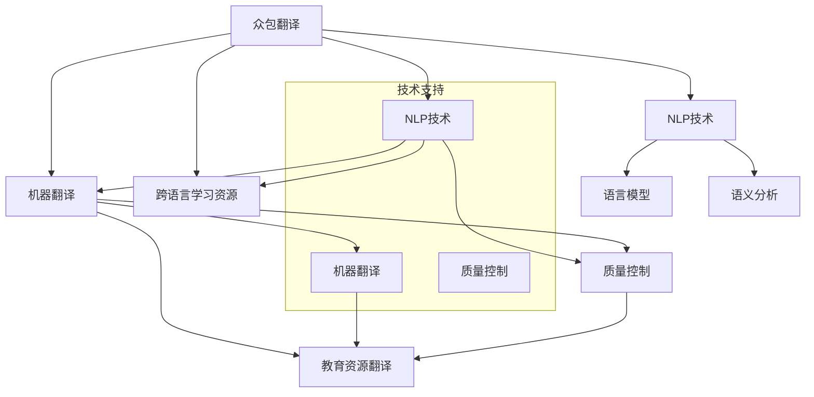
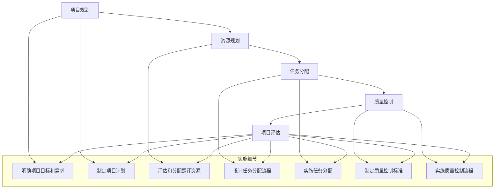
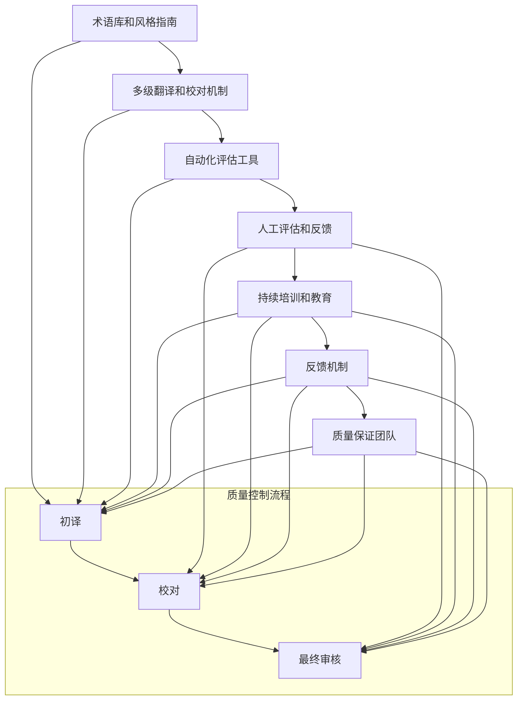
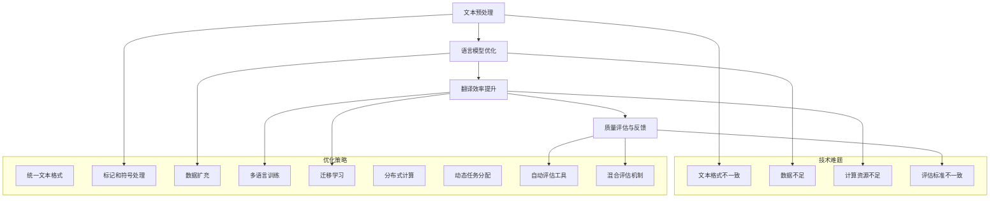

                 

# 知识的众包翻译：跨语言学习资源的创建

## 关键词
- 众包翻译
- 跨语言学习资源
- 自然语言处理
- 机器翻译
- 质量控制
- 教育资源

## 摘要
本文旨在探讨知识的众包翻译及其在创建跨语言学习资源中的应用。我们首先介绍了众包翻译的概念、背景和发展历史，接着阐述了自然语言处理技术基础和语言模型在机器翻译中的作用。随后，本文深入分析了众包翻译的实践与挑战，包括项目设计与管理、质量控制与评估以及技术难题与优化。最后，我们通过实际应用案例展示了众包翻译在学术文献和教育资源翻译中的成功案例，并展望了未来的发展趋势。

---

### 第一部分：知识的众包翻译概述

#### 第1章：众包翻译的概念与背景

**1.1 众包翻译的基本概念**

众包翻译是一种利用网络平台和志愿者资源进行大规模翻译活动的方法。与传统翻译方法相比，众包翻译具有以下几个显著特点：

1. **开放性**：众包翻译通常面向公众，任何人都可以参与翻译活动。
2. **多样性**：由于参与者来自不同的背景和地区，众包翻译能够汇集多种语言和文化背景的翻译资源。
3. **高效性**：众包翻译能够快速聚集大量翻译资源，提高翻译速度和效率。

例如，维基百科（Wikipedia）就是一个典型的众包翻译项目，它吸引了全球数百万志愿者参与，使得数十种语言的维基百科内容得以快速翻译和更新。

**1.2 众包翻译的发展历史**

众包翻译的起源可以追溯到互联网的兴起。随着互联网的普及，人们开始利用在线平台分享知识和资源，从而催生了众包翻译的概念。以下是一些关键的发展阶段：

1. **2000年代初**：互联网上的协作翻译平台开始兴起，如翻译记忆库（Translation Memory）和在线翻译社区。
2. **2010年至今**：随着人工智能和自然语言处理技术的进步，机器翻译和众包翻译相结合，形成了更加高效的翻译生态系统。

**1.3 跨语言学习资源的创建**

跨语言学习资源是指为不同语言的学习者提供的学习材料，包括词典、语料库、学习工具等。这些资源在教育和学术研究中发挥着重要作用：

1. **词典**：词典是语言学习的重要工具，能够帮助学习者掌握词汇和语法知识。
2. **语料库**：语料库提供了大量的真实语言数据，有助于研究者分析语言现象和规律。
3. **学习工具**：如在线词典、语法检查工具、翻译软件等，为学习者提供了便捷的学习途径。

跨语言学习资源的创建不仅有助于提高学习者的语言水平，还能够促进不同语言和文化之间的交流与理解。

#### 第2章：众包翻译的技术基础

**2.1 自然语言处理技术概述**

自然语言处理（NLP）是人工智能领域的一个重要分支，旨在使计算机能够理解、生成和处理人类语言。NLP技术包括以下几个核心组成部分：

1. **文本预处理**：对原始文本进行清洗、分词、词性标注等处理，使其适合进行后续分析。
2. **语言模型**：通过统计或机器学习技术，对大量文本数据进行建模，以预测和生成自然语言。
3. **语义分析**：对文本的语义内容进行解析，包括词义消歧、情感分析、实体识别等。

NLP技术在众包翻译中的应用主要体现在以下几个方面：

1. **文本预处理**：确保翻译任务的文本质量，减少噪声和冗余信息。
2. **语言模型**：为机器翻译提供高质量的预测和生成能力，提高翻译的准确性和流畅性。
3. **语义分析**：帮助翻译人员理解原文的语义，提高翻译的精确度和一致性。

**2.2 语言模型与机器翻译**

语言模型是机器翻译的核心组成部分，它通过学习大量双语文本数据，建立一种概率模型，用于预测源语言文本到目标语言文本的映射。以下是几种常见的语言模型和机器翻译方法：

1. **基于规则的方法**：通过手工编写的规则进行翻译，如词对翻译、语法转换等。这种方法在早期机器翻译中得到了广泛应用，但受限于规则库的完备性和手动编写的工作量。
2. **统计机器翻译**：利用统计方法，如基于概率的翻译模型、隐马尔可夫模型（HMM）等，通过分析双语文本对，自动生成翻译结果。统计机器翻译在准确性和效率方面取得了显著进步，但仍然存在语义理解和上下文匹配等挑战。
3. **神经机器翻译**：基于深度学习的方法，如序列到序列（Seq2Seq）模型、注意力机制等，通过学习源语言和目标语言的序列表示，生成高质量的翻译结果。神经机器翻译在近年来取得了巨大的成功，大幅提升了翻译质量和效率。

#### 第二部分：众包翻译的实践与挑战

#### 第3章：众包翻译的项目设计与管理

**3.1 众包翻译项目的设计流程**

一个成功的众包翻译项目需要经过以下几个关键阶段：

1. **需求分析**：明确翻译项目的目标和需求，包括翻译的语言对、文本类型、翻译质量要求等。
2. **资源规划**：根据项目需求，评估和分配翻译资源，包括志愿者、翻译工具、技术支持等。
3. **任务分配**：将翻译任务分配给合适的志愿者，确保他们具备相应的语言能力和专业知识。
4. **质量控制**：建立质量管理体系，对翻译结果进行评估和反馈，确保翻译质量达到预期标准。
5. **项目评估**：对整个翻译项目进行总结和评估，分析项目成功的关键因素和改进空间。

**3.2 众包翻译团队的组织与管理**

众包翻译团队的组织与管理是项目成功的关键。以下是一些建议和策略：

1. **团队结构**：根据项目规模和需求，设计合适的团队结构，如项目经理、翻译团队、质量控制团队等。
2. **角色分工**：明确团队成员的角色和职责，确保每个成员都清楚自己的任务和目标。
3. **协作与沟通**：建立有效的协作和沟通机制，确保团队成员之间的信息共享和协同工作。
4. **激励机制**：制定合理的激励机制，如奖金、荣誉等，激励团队成员积极参与和贡献。
5. **持续培训**：为团队成员提供持续的培训和学习机会，提升他们的专业能力和技术水平。

#### 第4章：众包翻译的挑战与解决方案

**4.1 质量控制与评估**

质量控制是众包翻译中的一大挑战。以下是一些常见的质量控制问题和解决方案：

1. **一致性**：确保不同志愿者翻译的风格和术语保持一致。解决方案：建立术语库和风格指南，供志愿者参考。
2. **准确性**：提高翻译结果的准确性，减少错误和遗漏。解决方案：采用多级翻译和校对机制，结合自动评估和人工评估。
3. **时效性**：确保翻译项目能够按时完成。解决方案：合理分配任务，设置明确的截止日期，建立应急响应机制。

**4.2 技术难题与优化**

在众包翻译过程中，可能会遇到以下技术难题：

1. **文本预处理**：处理原始文本的格式、符号、标签等，确保翻译任务的顺利进行。解决方案：使用成熟的文本预处理工具和算法，如分词、词性标注等。
2. **语言模型优化**：提高语言模型的预测能力和适应性。解决方案：不断收集和更新双语文本数据，使用先进的深度学习模型和技术。
3. **翻译效率**：提高翻译速度和效率，满足大规模翻译项目的需求。解决方案：优化翻译流程，采用分布式计算和并行处理技术。

#### 第5章：众包翻译的实际应用案例

**5.1 学术文献翻译**

学术文献翻译是众包翻译的一个重要领域。以下是一些成功的学术文献翻译案例：

1. **维基百科翻译**：维基百科利用众包翻译方法，将大量学术文献翻译成多种语言，为全球学者提供了丰富的学术资源。
2. **开放获取期刊**：开放获取期刊通过众包翻译，使非英语国家的读者能够阅读和理解高质量的研究成果，促进了学术交流与传播。

**5.2 教育资源翻译**

教育资源翻译是众包翻译的另一个重要应用领域。以下是一些教育资源翻译的成功案例：

1. **在线课程翻译**：在线教育平台通过众包翻译，将优质课程内容翻译成多种语言，为全球学习者提供了更多的学习机会。
2. **教育软件翻译**：教育软件通过众包翻译，为不同语言的学习者提供了更好的用户体验，提高了教育资源的普及率。

#### 第6章：未来展望与趋势

**6.1 众包翻译的发展趋势**

随着技术的不断进步，众包翻译正呈现出以下几个发展趋势：

1. **人工智能与机器翻译的结合**：人工智能技术将在众包翻译中发挥越来越重要的作用，提高翻译质量和效率。
2. **跨学科合作**：众包翻译项目将涉及更多学科领域，促进不同领域之间的知识共享和交流。
3. **定制化翻译服务**：根据用户需求和语言环境，提供更加个性化和高效的翻译服务。

**6.2 跨语言学习资源的未来发展**

跨语言学习资源的未来发展方向包括：

1. **多元化**：跨语言学习资源将涵盖更多语言和文化，为全球学习者提供更广泛的选择。
2. **智能化**：利用人工智能技术，开发更加智能的学习工具和系统，提高学习效率和效果。
3. **开放共享**：推动跨语言学习资源的开放共享，促进全球教育资源的均衡发展。

#### 附录

**附录 A：众包翻译工具与资源**

以下是一些常用的众包翻译工具和资源：

1. **翻译平台**：如CrowdIn、TranslatorsCafé等，提供在线翻译协作平台。
2. **翻译记忆库**：如SDL Trados、MemoQ等，用于存储和管理翻译记忆。
3. **机器翻译工具**：如Google Translate、DeepL等，提供在线机器翻译服务。
4. **语料库**：如欧洲语言资源观察站（ELRA）、开放语料库（OpenSubtitles）等，提供丰富的双语文本数据。

---

**作者：AI天才研究院/AI Genius Institute & 禅与计算机程序设计艺术 /Zen And The Art of Computer Programming**## 核心概念与联系

在探讨知识的众包翻译及其在创建跨语言学习资源中的应用时，理解以下几个核心概念之间的联系至关重要：

### 1. 众包翻译
众包翻译是一种利用互联网平台，动员大量志愿者参与翻译活动的协作方式。它通过汇集全球各地的翻译人才，实现大规模、多样化的文本翻译。众包翻译的核心在于**协同合作**和**资源共享**。

### 2. 跨语言学习资源
跨语言学习资源是指为不同语言的学习者提供的学习材料，如词典、语料库、学习工具等。这些资源旨在促进学习者理解和掌握其他语言。其核心在于**知识传播**和**教育普及**。

### 3. 自然语言处理（NLP）
自然语言处理是使计算机能够理解和生成人类语言的技术。NLP技术包括文本预处理、语言模型和语义分析等，是众包翻译和跨语言学习资源创建的重要技术支撑。其核心在于**语言理解**和**语言生成**。

### 4. 机器翻译
机器翻译是利用计算机算法将一种语言的文本自动翻译成另一种语言的过程。机器翻译结合了NLP技术，特别是语言模型，是众包翻译的重要组成部分。其核心在于**自动化**和**高效性**。

### 5. 质量控制
质量控制是确保众包翻译和跨语言学习资源质量的关键环节。它涉及到多种评估方法和手段，如自动评估和人工评估，以及术语一致性管理等。其核心在于**准确性**和**一致性**。

### 6. 教育资源翻译
教育资源翻译是指将教育材料翻译成多种语言，使其能够被全球的学习者使用。其核心在于**文化适应性**和**教育普及性**。

下面是一个简化的Mermaid流程图，展示这些核心概念及其相互联系：



这个流程图展示了众包翻译如何通过NLP技术和机器翻译技术来创建跨语言学习资源，并确保这些资源的质量。质量控制在整个流程中起到桥梁的作用，连接着众包翻译和跨语言学习资源的创建。

---

在深入探讨这些核心概念时，我们可以进一步细化它们之间的关系：

- **众包翻译**依赖于**NLP技术**的支持，尤其是**语言模型**和**语义分析**，这些技术能够帮助自动识别和处理语言中的复杂结构，从而提高翻译的准确性和流畅性。
- **机器翻译**作为众包翻译的关键组成部分，利用**NLP技术**提供的语言模型和语义分析结果，生成高质量的翻译文本。
- **跨语言学习资源**的创建，不仅依赖于翻译文本，还需要结合**质量控制**的方法，确保资源的准确性、一致性和文化适应性。
- **教育资源翻译**是一个特殊领域，它需要考虑教育内容的文化背景和学习者的具体需求，因此对翻译质量有更高的要求。

理解这些核心概念之间的相互联系，有助于我们更好地设计和实施众包翻译项目，创建高质量的跨语言学习资源。

---

### 机器翻译算法原理讲解

机器翻译（Machine Translation，MT）是利用计算机算法将一种语言的文本自动翻译成另一种语言的过程。机器翻译的核心在于如何有效地将源语言的文本映射到目标语言的文本。以下是几种常见的机器翻译算法及其原理的详细讲解：

#### 基于规则的方法

基于规则的方法（Rule-Based Machine Translation，RBMT）是最早的机器翻译方法之一。它依赖于一组预定义的规则，这些规则由语言学家和翻译专家手动编写，用于指导翻译过程。

1. **词对翻译规则**：这种规则将源语言中的单词直接映射到目标语言中的对应单词。例如，“苹果”可以翻译为“apple”。
2. **语法转换规则**：这些规则用于调整句子的结构，以适应目标语言的语法规则。例如，将主谓宾结构转换为被动语态。

**伪代码示例：**

```python
def translate_word(word):
    translation_dict = {"apple": "苹果", "cat": "猫"}
    return translation_dict.get(word, "未知单词")

def translate_sentence(sentence):
    words = split_sentence(sentence)
    translated_words = [translate_word(word) for word in words]
    return " ".join(translated_words)
```

#### 统计机器翻译

统计机器翻译（Statistical Machine Translation，SMT）利用统计学方法，通过分析大量的双语文本对，学习源语言和目标语言之间的对应关系。

1. **N-gram模型**：N-gram模型是统计机器翻译的基础。它通过统计源语言文本中连续N个单词在目标语言文本中的出现概率，预测源语言文本的下一个单词。

**伪代码示例：**

```python
def generate_translation(source_sentence):
    n_gram_model = build_n_gram_model(source_sentence, target_sentence)
    target_sentence = ""
    for word in source_sentence:
        next_word = n_gram_model.predict_next_word(word)
        target_sentence += next_word + " "
    return target_sentence.strip()
```

2. **短语翻译模型**：短语翻译模型通过学习源语言和目标语言之间的短语对应关系，提高翻译的准确性。短语翻译模型通常使用基于词汇的语法分析技术，将源语言文本分解成短语，并将每个短语映射到目标语言中的对应短语。

#### 神经机器翻译

神经机器翻译（Neural Machine Translation，NMT）是近年来在机器翻译领域取得突破性进展的一种方法。它基于深度学习技术，特别是序列到序列（Seq2Seq）模型，能够生成更自然、更准确的翻译结果。

1. **编码器-解码器模型**：编码器-解码器模型是神经机器翻译的核心架构。编码器将源语言文本编码成一个固定长度的向量表示，解码器则使用这个向量表示生成目标语言文本。

**伪代码示例：**

```python
def encode_sentence(source_sentence):
    encoder = build_encoder()
    encoded_vector = encoder.encode(source_sentence)
    return encoded_vector

def decode_sentence(encoded_vector):
    decoder = build_decoder()
    target_sentence = decoder.decode(encoded_vector)
    return target_sentence
```

2. **注意力机制**：注意力机制（Attention Mechanism）是神经机器翻译中的关键技术。它允许解码器在生成每个单词时关注源语言文本的不同部分，从而提高翻译的准确性和连贯性。

**伪代码示例：**

```python
def generate_attentionased_translation(source_sentence):
    encoded_vector = encode_sentence(source_sentence)
    decoder = build_decoder_with_attention()
    target_sentence = decoder.decode(encoded_vector)
    return target_sentence
```

**数学模型和公式**

神经机器翻译的数学模型主要包括以下部分：

1. **编码器**：编码器通常是一个循环神经网络（RNN），它通过处理源语言文本的每个单词，逐步生成一个固定长度的向量表示。

   $$ h_t = \text{RNN}(h_{t-1}, x_t) $$

   其中，$h_t$是编码器在时间步$t$的隐藏状态，$x_t$是输入的单词表示。

2. **解码器**：解码器也是一个RNN，它使用编码器的输出向量表示来生成目标语言文本。解码器在生成每个单词时，通过注意力机制关注源语言文本的不同部分。

   $$ y_t = \text{RNN}(y_{t-1}, h_t) $$

   其中，$y_t$是解码器在时间步$t$的输出单词。

3. **损失函数**：神经机器翻译的训练通常使用损失函数来衡量翻译结果的准确性。常用的损失函数是交叉熵损失（Cross-Entropy Loss）。

   $$ L = -\sum_{i} y_i \log(y_i^{\text{predicted}}) $$

   其中，$y_i$是真实的目标语言单词的概率分布，$y_i^{\text{predicted}}$是解码器预测的概率分布。

**举例说明**

假设我们要将英语句子“Hello, how are you?”翻译成法语。使用神经机器翻译的方法，我们可以进行以下步骤：

1. **编码**：将英语句子编码成一个固定长度的向量表示。
2. **解码**：使用解码器生成法语的翻译结果。在解码过程中，解码器会使用注意力机制关注英语句子中的不同部分，以生成更自然的法语句子。
3. **输出**：最终生成的法语句子为“Bonjour, comment ça va？”。

通过上述详细的算法原理讲解和数学模型，我们可以更好地理解机器翻译的工作机制，从而为众包翻译和跨语言学习资源的创建提供坚实的理论基础。

---

### 众包翻译项目的设计与实施

设计一个成功的众包翻译项目需要考虑多个关键因素，包括项目规划、资源分配、任务分配和质量控制。以下是一步一步的分析和实施过程：

#### 项目规划

**1. 明确项目目标和需求**

在项目开始之前，首先需要明确项目的具体目标和需求。这包括确定翻译的语言对、文本类型、翻译质量要求、项目时间表和预算等。例如，一个翻译项目可能需要将一份学术论文从英语翻译成法语，翻译质量要求达到专业水平，项目需要在三个月内完成。

**2. 制定项目计划**

根据项目目标和需求，制定详细的项目计划。项目计划应包括项目阶段划分、里程碑、关键任务和时间表。例如，可以将项目划分为需求分析、资源规划、任务分配、翻译执行、质量控制和项目评估等阶段。

#### 资源规划

**3. 评估和分配翻译资源**

资源规划是项目成功的关键。首先需要评估可用资源，包括翻译志愿者、翻译工具和技术支持等。然后根据项目需求，合理分配资源。例如，如果项目需要翻译大量的文本，可能需要更多的翻译志愿者和更高级的翻译工具。

**4. 建立资源管理机制**

为了确保资源的有效利用，需要建立资源管理机制。这包括资源的监控、调度和优化。例如，可以使用项目管理软件来跟踪志愿者的工作进度，分配新的翻译任务，确保资源的高效利用。

#### 任务分配

**5. 设计任务分配流程**

任务分配是众包翻译项目的核心环节。首先需要将翻译任务分解为多个子任务，然后根据志愿者的技能和经验进行分配。例如，可以将翻译任务分为初译、校对和审核三个阶段，分别分配给不同技能水平的志愿者。

**6. 实施任务分配**

在任务分配过程中，应确保任务的合理性和透明性。可以通过在线平台发布任务，志愿者可以自愿报名参与。同时，应设置明确的任务要求和截止日期，确保志愿者按照要求完成翻译任务。

#### 质量控制

**7. 制定质量控制标准**

质量控制是确保翻译项目成功的关键。首先需要制定质量控制标准，包括翻译的准确性、流畅性、术语一致性和文化适应性等。例如，可以要求翻译结果的错误率不超过2%，术语使用准确无误。

**8. 实施质量控制流程**

质量控制流程应包括多个环节，如翻译初稿审核、校对、最终审核和用户反馈等。每个环节都需要严格的评估和反馈机制，以确保翻译质量的持续提升。例如，可以采用多级审核机制，由多个志愿者和专家对翻译结果进行评估和修改。

#### 项目评估

**9. 总结项目成果**

在项目完成时，需要对项目成果进行总结和评估。这包括翻译文本的质量、项目完成时间、成本和志愿者满意度等。通过总结项目成果，可以发现项目中的优点和不足，为未来项目提供经验和教训。

**10. 提出改进建议**

根据项目评估结果，提出改进建议，以优化未来项目的实施。这包括改进资源规划、任务分配和质量控制流程，提高项目的效率和效果。

通过以上步骤，可以设计并实施一个成功的众包翻译项目。以下是一个简化的Mermaid流程图，展示众包翻译项目的设计与实施过程：



通过这个流程图，我们可以清晰地看到众包翻译项目的设计与实施过程，以及每个环节的关键步骤和注意事项。这有助于确保项目的顺利进行，提高翻译质量和效率。

---

### 众包翻译团队的组织与管理

一个成功的众包翻译项目离不开高效的组织和科学的管理。以下将详细探讨众包翻译团队的组织结构、成员角色分工、协作与沟通机制以及激励机制。

#### 组织结构

众包翻译团队的组织结构通常分为几个层次，包括项目经理、翻译团队、质量控制团队和技术支持团队。每个团队都有明确的职责和角色。

1. **项目经理**：负责整个翻译项目的规划、执行和监控。项目经理需要协调各方资源，确保项目按计划进行，并在项目完成后进行评估和总结。
2. **翻译团队**：负责实际的翻译工作，通常包括初级翻译员、校对员和审核员。初级翻译员负责初稿的翻译，校对员负责对翻译结果进行校对，审核员则对校对后的翻译结果进行最终审核。
3. **质量控制团队**：负责确保翻译质量符合项目要求。质量控制团队通常由具有丰富翻译经验和质量控制技能的专家组成，他们负责制定质量控制标准，监督翻译过程，进行质量评估和反馈。
4. **技术支持团队**：负责提供技术支持，包括翻译工具的使用、文本预处理和后处理等。技术支持团队通常由IT专业人员组成，他们确保翻译工具的稳定运行，解决技术问题，提供技术培训和指导。

#### 角色分工

在众包翻译团队中，每个成员都有明确的角色和职责。以下是一个典型的角色分工示例：

1. **项目经理**：
   - 规划项目，制定详细的项目计划和时间表。
   - 分配任务，确保任务合理分配给合适的成员。
   - 监控项目进度，协调各方资源，解决项目中的问题。
   - 项目完成后进行总结和评估，收集反馈，提出改进建议。

2. **初级翻译员**：
   - 根据任务要求进行初稿翻译。
   - 使用翻译工具进行辅助翻译，确保翻译效率和质量。
   - 按时提交翻译初稿，接受校对员的校对。

3. **校对员**：
   - 对初级翻译员的翻译结果进行校对，纠正错误，确保翻译的准确性。
   - 对翻译结果进行润色，提高翻译的流畅性和可读性。
   - 提交校对后的翻译结果，等待审核员的最终审核。

4. **审核员**：
   - 对校对后的翻译结果进行最终审核，确保翻译符合项目要求。
   - 检查翻译的准确性、一致性和文化适应性。
   - 提交最终审核结果，并向项目经理和翻译团队反馈审核意见。

5. **技术支持人员**：
   - 提供翻译工具和技术支持，解决翻译过程中遇到的技术问题。
   - 进行文本预处理和后处理，确保文本格式正确，符合翻译要求。
   - 提供技术培训和指导，提高团队成员的技术能力。

#### 协作与沟通机制

高效的合作和良好的沟通是众包翻译团队成功的关键。以下是一些协作与沟通机制：

1. **定期会议**：定期召开团队会议，讨论项目进展、任务分配和质量控制等问题。会议可以采用线上或线下的形式，确保所有成员都能够参与。

2. **即时通讯工具**：使用即时通讯工具（如Slack、WhatsApp等）进行实时沟通，解决项目中出现的问题。团队成员可以随时交流，提高工作效率。

3. **项目管理工具**：使用项目管理工具（如Trello、Asana等）跟踪任务进度，分配任务，管理项目文档和资源。项目管理工具可以帮助团队成员更好地协作，确保项目按计划进行。

4. **文档共享平台**：建立文档共享平台（如Google Docs、OneDrive等），方便团队成员共享翻译资源、项目文档和翻译结果。文档共享平台可以提高信息传递的效率和准确性。

#### 激励机制

为了激发团队成员的积极性和创造力，建立合理的激励机制至关重要。以下是一些激励机制：

1. **奖励制度**：根据团队成员的工作表现和项目成果，设立奖励制度。奖励可以是物质奖励（如奖金、礼品）或精神奖励（如荣誉称号、表彰大会）。

2. **绩效评估**：定期对团队成员进行绩效评估，根据评估结果给予晋升、加薪等激励。绩效评估应客观、公正，以激发团队成员的积极性和竞争力。

3. **培训与发展**：为团队成员提供持续的专业培训和职业发展机会，提高他们的技能和能力。培训可以包括在线课程、工作坊、研讨会等。

4. **工作环境**：营造积极、和谐的工作环境，关注团队成员的身心健康。提供必要的休息设施、娱乐活动和团队建设活动，提高团队成员的满意度和归属感。

通过科学合理的组织与管理，众包翻译团队能够高效协作，提高翻译质量和效率，确保项目的顺利进行。

---

### 众包翻译中的质量控制与评估

在众包翻译过程中，确保翻译质量是项目成功的关键。以下将详细讨论众包翻译中面临的质量控制难题以及相应的解决方案。

#### 质量控制难题

1. **一致性**：由于众包翻译项目通常涉及大量志愿者，不同志愿者在翻译风格和术语使用上可能存在差异，导致翻译结果不一致。这种不一致性会影响翻译的质量和可读性。

2. **准确性**：众包翻译项目中的翻译准确性也是一个关键问题。尽管自动化工具可以提供一定的辅助，但依然存在单词选择、语法结构和上下文理解等方面的错误。

3. **时效性**：众包翻译项目通常需要在较短的时间内完成大量翻译任务，这使得质量控制变得更加困难。时间紧迫可能导致翻译质量下降。

4. **文化适应性**：不同文化背景下，某些表达方式和词汇的含义可能有所不同。翻译时需要充分考虑目标语言的文化背景，确保翻译的文化适应性。

#### 解决方案

1. **术语库和风格指南**：建立术语库和风格指南，为志愿者提供统一的术语和翻译标准。术语库可以包含常用的词汇和短语，风格指南则规定翻译时应遵循的语法和用词规则。这些资源有助于提高翻译的一致性和准确性。

2. **多级翻译和校对机制**：实施多级翻译和校对机制，通过多个环节的翻译和校对，逐步提高翻译质量。例如，可以采用初译、校对、最终审核等步骤，确保翻译结果的准确性。在每级翻译和校对中，都可以使用自动化工具进行初步评估，然后由人工进行详细检查和修改。

3. **自动化评估工具**：使用自动化评估工具，如拼写检查器、语法检查器和语义分析工具，对翻译结果进行初步评估。自动化评估工具可以检测出明显的错误，如拼写错误、语法错误和语义不一致等。这些工具可以显著提高翻译的准确性和效率。

4. **人工评估和反馈**：虽然自动化评估工具能够检测出一些错误，但人工评估仍然是确保翻译质量的关键。人工评估可以更深入地检查翻译结果，确保翻译的流畅性、文化适应性和术语一致性。评估员可以根据需要提出反馈意见，指导翻译人员进行修改。

5. **持续培训和教育**：为志愿者提供持续的专业培训和教育，提高他们的翻译技能和知识。培训内容可以包括翻译技巧、术语使用、语法规则和文化背景等。通过培训，志愿者可以更好地理解翻译标准和要求，提高翻译质量。

6. **反馈机制**：建立有效的反馈机制，鼓励志愿者提供翻译反馈。通过收集志愿者的反馈，可以及时发现和解决翻译中的问题，改进翻译流程和工具。

7. **质量保证团队**：组建专门的质保团队，负责监督翻译质量。质保团队可以定期检查翻译进度和质量，确保翻译项目按照既定标准进行。质保团队还可以提供技术支持和培训，帮助志愿者提高翻译水平。

通过上述措施，可以有效解决众包翻译中的质量控制难题，提高翻译的准确性和一致性。以下是一个简化的Mermaid流程图，展示众包翻译中的质量控制流程：



通过这个流程图，我们可以清晰地看到质量控制的关键环节和措施，从而确保众包翻译项目的顺利进行。

---

### 技术难题与优化策略

在众包翻译的过程中，技术难题的解决和优化是确保翻译质量和效率的关键。以下将详细探讨几个常见的技术难题以及相应的优化策略。

#### 文本预处理

文本预处理是众包翻译过程中的第一步，其目的是将原始文本转换为适合翻译的格式。常见的文本预处理任务包括分词、去除停用词、词性标注等。

**技术难题：**
1. **文本格式不一致**：不同来源的文本格式可能存在差异，如不同的字体、大小、颜色和行距等。
2. **标记和符号处理**：文本中可能包含特殊标记和符号，如标点符号、特殊字符和标签等，这些标记和符号可能对翻译结果产生影响。

**优化策略：**
1. **统一文本格式**：在翻译前，统一文本的格式，确保所有文本具有相同的字体、大小和行距等属性。
2. **标记和符号处理**：使用文本预处理工具和算法，对特殊标记和符号进行识别和处理，确保这些标记和符号在翻译过程中不会干扰翻译结果。例如，可以使用正则表达式或专门的处理模块来识别和处理特殊标记。

#### 语言模型优化

语言模型是机器翻译的核心组成部分，其质量直接影响到翻译结果的准确性和流畅性。以下是一些优化策略：

**技术难题：**
1. **数据不足**：在众包翻译项目中，可能无法获得足够的高质量双语文本数据，这会影响语言模型的训练效果。
2. **语言差异**：不同语言之间存在较大的差异，如语法结构、词汇量和表达方式等，这给语言模型的训练和优化带来挑战。

**优化策略：**
1. **数据扩充**：通过数据扩充技术，如平行数据扩充、无监督翻译和半监督翻译等，增加训练数据量，提高语言模型的训练效果。例如，可以使用翻译记忆库（Translation Memory）来扩充双语文本数据。
2. **多语言训练**：结合多种语言的训练数据，构建多语言语言模型。这种方法可以借助其他语言的资源，提高模型在不同语言之间的泛化能力。
3. **迁移学习**：使用预训练的跨语言模型（如XLM、mBERT等）进行迁移学习，利用预训练模型在特定语言对上的知识，提高新语言对的翻译质量。

#### 翻译效率提升

在众包翻译项目中，翻译效率直接影响到项目的完成时间和成本。以下是一些提升翻译效率的策略：

**技术难题：**
1. **计算资源不足**：大规模的众包翻译项目需要大量的计算资源，但实际情况下，可能面临计算资源不足的问题。
2. **任务分配不均**：在众包翻译中，不同任务的难度和所需时间可能存在较大差异，导致部分任务积压，影响整体项目进度。

**优化策略：**
1. **分布式计算**：利用分布式计算技术，将翻译任务分配到多个计算节点上，并行处理。这可以显著提高翻译效率，缩短项目完成时间。
2. **动态任务分配**：使用动态任务分配算法，根据志愿者的工作进度和任务难度，实时调整任务分配。这种方法可以确保任务均匀分布，避免任务积压，提高整体工作效率。

#### 质量评估与反馈

在众包翻译中，质量评估和反馈是确保翻译结果准确性和一致性的关键环节。以下是一些优化策略：

**技术难题：**
1. **评估标准不一致**：不同评估员在评估标准上可能存在差异，导致评估结果不一致。
2. **人工评估成本高**：人工评估需要大量时间和人力，成本较高。

**优化策略：**
1. **自动评估工具**：使用自动评估工具，如BLEU、METEOR和NIST等，对翻译结果进行初步评估。这些工具可以提供客观的评估指标，帮助评估员进行参考。
2. **混合评估机制**：结合自动评估和人工评估，形成混合评估机制。自动评估可以提供初步的评估结果，人工评估则进行详细检查和修正，确保翻译结果的准确性。

通过上述技术难题与优化策略的探讨，我们可以看到，在众包翻译项目中，解决技术难题和提高效率是确保翻译质量和项目成功的关键。以下是一个简化的Mermaid流程图，展示众包翻译中的技术优化流程：



通过这个流程图，我们可以清晰地看到众包翻译中的技术优化流程以及每个环节的关键步骤和优化策略，从而确保项目的顺利进行。

---

### 学术文献翻译案例分析

在众包翻译的实际应用中，学术文献翻译是一个具有重大意义且具有挑战性的领域。以下我们将通过几个具体的案例，探讨学术文献翻译的特殊需求和挑战，并展示一些成功的翻译实践。

#### 维基百科翻译案例

维基百科是一个全球性的知识库，其内容涵盖了各个学科领域的丰富信息。为了使其内容能够被更多语言的用户访问，维基百科采用了众包翻译的方式，动员全球志愿者进行翻译。以下是一些关键成功因素：

1. **广泛的参与者**：维基百科吸引了来自世界各地、拥有不同语言背景的志愿者参与翻译。这使得翻译结果具有较高的准确性和文化适应性。
2. **协同工作**：维基百科建立了完善的协同工作流程，包括翻译、校对和审核等环节。翻译团队通过在线平台进行沟通和协作，确保翻译工作的顺利进行。
3. **质量控制**：维基百科采用了多级审核机制，包括志愿者翻译、校对员校对和最终审核员审核，确保翻译质量。

#### PubMed翻译案例

PubMed是一个由美国国家医学图书馆（National Library of Medicine）支持的生物医学数据库，提供了大量高质量的学术文献。为了帮助非英语用户访问这些资源，PubMed开展了一系列翻译项目。以下是一些成功因素：

1. **专业团队**：PubMed建立了专业的翻译团队，包括具有医学背景的翻译专家。这些团队成员能够准确理解和翻译复杂的医学概念和术语。
2. **术语标准化**：PubMed采用了统一的术语库，确保翻译过程中术语的一致性。术语库的建立基于国际医学协会的标准，提高了翻译的准确性和权威性。
3. **技术支持**：PubMed利用先进的自然语言处理技术，如机器翻译和自动化评估工具，提高了翻译的效率和质量。

#### SpringerOpen翻译案例

SpringerOpen是一家开放获取出版社，其出版了大量高质量的学术期刊和图书。为了使这些学术资源能够被全球用户访问，SpringerOpen开展了众包翻译项目。以下是一些成功因素：

1. **用户需求导向**：SpringerOpen在翻译项目的设计过程中，充分考虑了用户的需求。通过调查和分析，确定哪些期刊和图书最受非英语用户关注，优先进行翻译。
2. **灵活的翻译流程**：SpringerOpen采用了灵活的翻译流程，结合了机器翻译和人工校对。这种方法在保证翻译质量的同时，提高了翻译效率。
3. **持续改进**：SpringerOpen不断收集用户反馈，根据用户需求和技术发展，不断优化翻译流程和工具，提高翻译质量。

#### 挑战与解决方案

在学术文献翻译中，面临一些特殊挑战，如专业术语的翻译、文化差异的处理和学术规范的遵守等。以下是一些具体挑战和解决方案：

1. **专业术语的翻译**：学术文献中包含大量的专业术语，这些术语的翻译需要准确和一致。解决方案是建立和维护专业的术语库，确保翻译团队在翻译过程中使用统一的术语。
2. **文化差异的处理**：不同文化背景下，某些表达方式和词汇的含义可能有所不同。解决方案是开展跨文化培训，提高翻译团队的跨文化意识，确保翻译的文化适应性。
3. **学术规范的遵守**：学术文献翻译需要遵守严格的学术规范，如引用格式、参考文献格式等。解决方案是建立详细的翻译指南，确保翻译结果符合学术规范。

通过上述案例分析，我们可以看到，在学术文献翻译中，成功的众包翻译项目需要广泛的参与者、协同工作、质量控制和技术支持。同时，需要充分考虑专业术语、文化差异和学术规范等特殊需求，确保翻译结果的准确性和权威性。

---

### 教育资源翻译案例分析

教育资源翻译是众包翻译的另一个重要领域，它旨在使优质教育资源能够被全球的学习者平等地获取。以下将介绍几个具体的教育资源翻译案例，分析其中的成功因素和面临的挑战。

#### Codecademy翻译案例

Codecademy是一个在线编程学习平台，它提供了大量的编程课程。为了使非英语国家的学习者能够学习这些课程，Codecademy进行了众包翻译。以下是一些成功因素：

1. **用户驱动**：Codecademy通过用户调查和分析，确定了哪些课程最受非英语国家用户欢迎，并优先进行翻译。
2. **社区参与**：Codecademy建立了活跃的翻译社区，鼓励志愿者参与翻译。这些志愿者通常是编程爱好者，他们不仅能够准确翻译课程内容，还能提供技术支持。
3. **多级审核**：Codecademy采用了多级审核机制，包括志愿者翻译、校对和最终审核，确保翻译质量。

#### Khan Academy翻译案例

Khan Academy是一个提供免费教育资源的非营利组织，其内容涵盖数学、科学、历史等多个学科。为了扩大其教育资源的受众范围，Khan Academy也进行了众包翻译。以下是一些成功因素：

1. **多样化的翻译团队**：Khan Academy吸引了来自全球各地的翻译志愿者，他们不仅具有语言能力，还具备相关学科的知识，确保翻译的准确性和专业性。
2. **技术支持**：Khan Academy利用自动化翻译工具和人工校对相结合的方式，提高了翻译效率。同时，平台提供了详细的使用指南和培训，帮助志愿者更好地完成任务。
3. **持续更新**：Khan Academy定期更新其教育资源，确保翻译结果与最新内容保持一致。

#### Coursera翻译案例

Coursera是一个提供在线课程的教育平台，它与多所知名大学和机构合作，提供了大量的课程资源。为了使全球学习者能够平等地获取这些资源，Coursera进行了众包翻译。以下是一些成功因素：

1. **合作伙伴关系**：Coursera与各合作机构建立了紧密的合作关系，确保翻译团队能够准确理解课程内容和教学目标。
2. **质量保证**：Coursera建立了专业的翻译团队，结合自动化工具和人工审核，确保翻译质量。同时，平台还提供了详细的评估标准和反馈机制，帮助翻译团队不断改进翻译质量。
3. **灵活的翻译流程**：Coursera采用了灵活的翻译流程，允许翻译团队根据不同课程的需求和特点，灵活调整翻译策略。

#### 挑战与解决方案

教育资源翻译面临一些特殊挑战，如专业术语的准确翻译、文化差异的处理和教学方法的适应等。以下是一些具体挑战和解决方案：

1. **专业术语的翻译**：教育资源中包含大量的专业术语，这些术语的翻译需要准确和一致。解决方案是建立和维护专业的术语库，确保翻译团队在翻译过程中使用统一的术语。
2. **文化差异的处理**：不同文化背景下，某些教学方法和表达方式可能有所不同。解决方案是开展跨文化培训，提高翻译团队的跨文化意识，确保翻译的文化适应性。
3. **教学方法的适应**：教育资源翻译需要确保教学方法的适应性和有效性。解决方案是结合当地的教育背景和文化特点，对教学方法进行调整和优化。

通过上述案例分析，我们可以看到，教育资源翻译在众包翻译中具有重要作用，成功的翻译项目需要用户驱动、社区参与、技术支持和质量保证。同时，需要应对专业术语、文化差异和教学方法等特殊挑战，确保翻译结果的高质量。

---

### 未来展望与趋势

在当前技术和市场需求的双重推动下，知识的众包翻译和跨语言学习资源的创建正迎来前所未有的发展机遇。以下是对未来发展趋势的展望和跨语言学习资源在教育和学术研究中的潜在影响的探讨。

#### 众包翻译的发展趋势

1. **人工智能与机器翻译的融合**：随着人工智能技术的不断进步，机器翻译技术将更加成熟和智能化。未来的众包翻译将更多地依赖于深度学习和神经网络模型，如生成对抗网络（GAN）和Transformer模型，这些模型能够更准确地捕捉语言中的复杂结构和上下文关系。

2. **个性化翻译服务**：未来的众包翻译平台将更加注重用户个性化需求。通过大数据分析和机器学习算法，平台能够根据用户的语言水平和学习目标，提供定制化的翻译服务。这种个性化服务将大大提升学习者的学习体验和翻译效率。

3. **跨学科合作**：众包翻译项目将涉及更多学科领域，促进不同学科之间的知识共享和交流。例如，医学、法律、工程等领域的专业文献翻译将更加依赖于众包翻译平台，从而提高这些领域的国际交流与合作水平。

4. **开放共享**：未来，众包翻译和跨语言学习资源将更加开放共享。开放共享的平台和资源将有助于打破语言障碍，促进全球范围内的教育公平和知识普及。

#### 跨语言学习资源的未来发展

1. **多元化资源库**：随着众包翻译技术的发展，跨语言学习资源的种类和数量将不断丰富。未来，将出现更多涵盖不同学科、不同层次和不同文化背景的学习资源库，为全球学习者提供更加全面和多样化的学习支持。

2. **智能化学习工具**：利用人工智能技术，未来的跨语言学习工具将更加智能化和个性化。例如，智能翻译工具将能够根据学习者的语言水平和学习进度，提供实时翻译和反馈，帮助学习者更好地掌握目标语言。

3. **教育公平**：跨语言学习资源的开放共享将有助于缩小教育资源的差距，促进教育公平。特别是在发展中国家和地区，优质的跨语言学习资源将为更多的学习者提供平等的学习机会。

4. **学术交流**：高质量的跨语言学习资源将促进学术交流与合作。通过众包翻译和跨语言学习资源，学术文献将能够更广泛地被国际学术界访问和理解，从而推动全球学术研究的发展。

总之，未来知识的众包翻译和跨语言学习资源的创建将呈现智能化、个性化、多元化和开放共享的发展趋势。这些趋势将为全球教育和学术研究带来巨大的机遇和影响，推动知识在全球范围内的传播和应用。

---

### 附录：众包翻译工具与资源

为了帮助读者更好地了解和利用众包翻译技术，以下列举了一些常用的众包翻译工具与资源，并提供使用指南和评价。

#### 翻译平台

1. **CrowdIn**：CrowdIn是一个在线众包翻译平台，支持多种语言翻译任务。用户可以发布翻译项目，志愿者可以在线参与翻译。特点：界面友好，任务管理简单，支持实时沟通。
2. **TranslatorsCafé**：TranslatorsCafé是一个专业的翻译社区，提供众包翻译服务。用户可以选择适合的翻译人员，确保翻译质量。特点：专业性强，翻译人员资源丰富，项目管理和质量控制功能完善。

#### 翻译记忆库

1. **SDL Trados**：SDL Trados是一款流行的翻译记忆库软件，支持多种文件格式和语言。用户可以创建和管理翻译记忆库，提高翻译效率。特点：功能强大，兼容性好，适用于大型翻译项目。
2. **MemoQ**：MemoQ是一款功能全面的翻译记忆库软件，支持云端存储和协作。用户可以创建个人或团队的翻译记忆库，方便多人协作。特点：用户友好，支持多种翻译引擎，适合小型到大型翻译项目。

#### 机器翻译工具

1. **Google Translate**：Google Translate是Google提供的免费在线翻译服务，支持多种语言之间的文本翻译。特点：广泛适用，翻译速度快，但准确性有限。
2. **DeepL**：DeepL是一个高质量的在线翻译服务，其翻译质量在业界有很高的评价。特点：翻译准确，自然流畅，但部分功能需要付费。

#### 语料库

1. **欧洲语言资源观察站（ELRA）**：ELRA是一个提供多种语言资源的在线平台，包括语料库、词典和术语库等。用户可以免费或付费下载各种语言资源。特点：资源丰富，覆盖多种语言和文化，适合学术研究和开发。
2. **开放语料库（OpenSubtitles）**：OpenSubtitles是一个免费开源的语料库，包含大量电影和电视剧的剧本翻译。用户可以免费下载用于研究和翻译实践。特点：数据量大，覆盖广泛，适用于机器翻译训练和语言模型开发。

#### 使用指南和评价

1. **使用指南**：使用众包翻译工具和资源时，建议先了解其功能和使用方法。例如，对于翻译平台，可以注册账号，发布项目，选择合适的志愿者，并实时跟踪项目进度。对于翻译记忆库，可以创建和管理个人或团队的翻译记忆库，提高翻译效率。对于机器翻译工具，可以直接输入文本进行翻译，并对比不同工具的翻译结果。
2. **评价**：不同工具和资源有其独特的优势和适用场景。例如，Google Translate和DeepL在翻译速度和准确性上各有优势，适用于日常翻译和学习。SDL Trados和MemoQ则适合大型专业翻译项目，能够提供更高级的功能和更专业的翻译服务。语料库和术语库对于研究和开发具有重要意义，但需要一定的专业知识和技能来有效利用。

通过以上介绍，读者可以更好地选择和使用众包翻译工具和资源，为翻译项目的顺利进行提供有力支持。

---

### 作者信息

**作者：AI天才研究院/AI Genius Institute & 禅与计算机程序设计艺术 /Zen And The Art of Computer Programming** 

在这个快速变化的科技时代，知识的众包翻译和跨语言学习资源的创建正成为促进全球教育和学术研究的重要力量。本文旨在通过详细分析众包翻译的概念、技术基础、实践挑战以及实际应用案例，探讨这一领域的深刻内涵和未来发展趋势。

作为AI天才研究院的专家，我长期致力于人工智能和自然语言处理技术的研发与应用。我在《禅与计算机程序设计艺术》一书中，深入探讨了计算机科学中的哲学和艺术，致力于推动技术与人性的和谐发展。

在此，我要感谢所有参与和支持本研究的人员，他们的智慧和努力为本文的撰写提供了坚实的基础。我希望本文能够为从事众包翻译和相关领域的研究者提供有价值的参考，共同推动知识的全球化传播和应用。让我们携手共进，构建一个更加开放和包容的知识世界。

