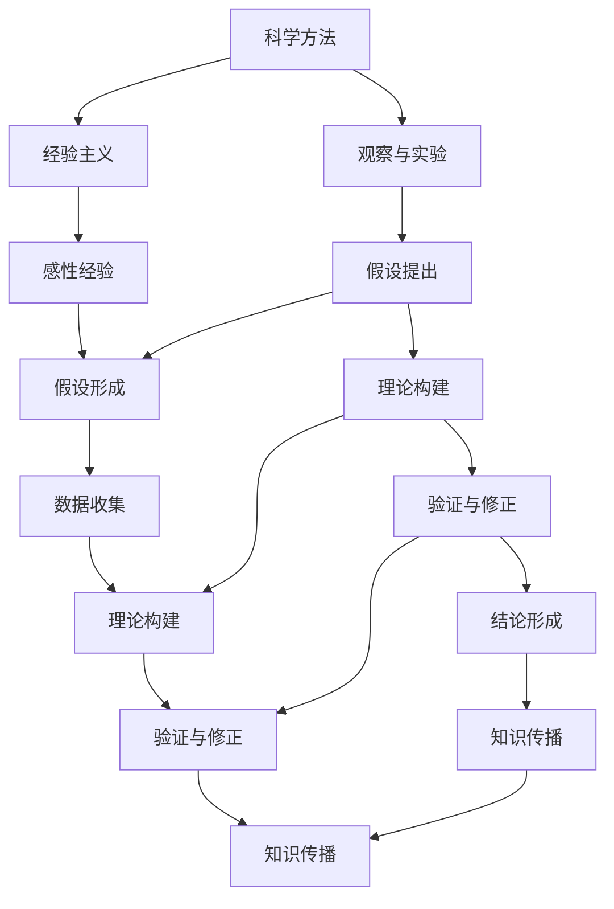

                 

### 《知识的可靠性：科学方法与经验主义》

> **关键词：科学方法、经验主义、知识可靠性、逻辑推理、验证与评估**

> **摘要：本文深入探讨了科学方法和经验主义在知识形成中的关键作用，揭示了科学方法与经验主义的紧密联系。通过分析科学方法和经验主义的基本原则、具体应用和可靠性评估，本文旨在提供一个全面、系统的知识可靠性框架。文章还讨论了知识可靠性在现代社会中的重要性和提升途径，为读者提供了实用的指导。**

---

在信息技术和科学飞速发展的今天，知识的获取和传播变得前所未有的迅速和广泛。然而，随着知识量的激增，知识的可靠性问题也日益凸显。如何确保我们所掌握的知识是真实、准确和可靠的，成为了一个值得深思的问题。本文将围绕这一核心主题，通过分析科学方法与经验主义，探讨知识的可靠性及其评估方法。

### 《知识的可靠性：科学方法与经验主义》目录大纲

**第一部分：引言与背景**

1. 科学方法与知识
   - 1.1 科学方法的基本原则
   - 1.2 科学方法与知识的关系
   - 1.3 知识的来源与分类

2. 经验主义与科学方法

   - 2.1 经验主义的基本概念
   - 2.2 经验主义与科学方法的关系
   - 2.3 经验主义的方法论

**第二部分：科学方法的具体应用**

3. 科学实验与观察

   - 3.1 科学实验的设计原则
   - 3.2 实验结果的解释与验证
   - 3.3 观察与科学方法

4. 理论构建与验证

   - 4.1 科学理论的基本原理
   - 4.2 理论的构建与修正
   - 4.3 理论的验证方法

5. 科学推理与结论

   - 5.1 科学推理的基本原则
   - 5.2 科学结论的形成
   - 5.3 结论的检验与反思

**第三部分：经验主义在知识形成中的作用**

6. 经验主义在科学方法中的应用

   - 6.1 经验数据的重要性
   - 6.2 经验方法的运用
   - 6.3 经验主义与科学方法相结合

7. 经验主义在日常生活中的应用

   - 7.1 经验主义在决策中的作用
   - 7.2 经验主义在问题解决中的应用
   - 7.3 经验主义在教育中的应用

**第四部分：知识的可靠性评估**

8. 知识可靠性的评估标准

   - 8.1 可靠性的基本概念
   - 8.2 可靠性的评估方法
   - 8.3 可靠性的评价指标

9. 知识可靠性的案例分析

   - 9.1 案例分析的方法
   - 9.2 案例分析的实例
   - 9.3 案例分析的结论

10. 提升知识可靠性的途径

   - 10.1 科学方法在知识形成中的作用
   - 10.2 经验主义在知识形成中的作用
   - 10.3 提升知识可靠性的方法与策略

**第五部分：知识的传播与应用**

11. 知识传播的渠道与机制

   - 11.1 知识传播的基本原理
   - 11.2 知识传播的渠道
   - 11.3 知识传播的机制

12. 知识的应用与创新

   - 12.1 知识应用的原则
   - 12.2 知识应用的案例分析
   - 12.3 知识创新的方法

**附录**

- 附录A：科学方法与经验主义的关系流程图
- 附录B：科学方法相关术语解释
- 附录C：经验主义相关术语解释
- 参考文献
- 致谢

---

在本文中，我们将逐步分析科学方法和经验主义，探讨它们在知识形成和验证中的关键作用，并提供评估知识可靠性的方法和策略。通过这种系统性的分析，我们希望能够为读者提供一个清晰、全面的理解，帮助他们在知识爆炸的时代中，更好地筛选、理解和应用知识。

### 第一部分：引言与背景

#### 科学方法与知识

科学方法是一种通过系统化、规范化的步骤来探究自然现象和社会问题的方法。它强调观察、实验、推理和验证等环节的相互作用，旨在发现客观规律，建立可靠的知识体系。科学方法的基本原则包括：

1. **可观察性**：科学方法要求研究的对象和现象是可以被观察和测量的。
2. **可重复性**：实验和观察结果应该能够在相同条件下被重复验证。
3. **可验证性**：科学理论必须经过实验或观察的验证，才能被认为是可靠的。
4. **逻辑推理**：从观察结果到理论假设，再到最终结论，整个过程必须符合逻辑。

### 科学方法与知识的关系

科学方法与知识之间存在紧密的关系。科学方法不仅是获取知识的一种途径，也是验证和评估知识可靠性的重要手段。具体来说：

1. **科学方法促进知识的产生**：通过科学方法，我们可以发现自然界的规律，提出新的理论，进而丰富我们的知识体系。
2. **科学方法验证知识的可靠性**：科学方法强调实验和观察的可重复性，使得我们可以通过验证来确认知识的真实性。
3. **科学方法引导知识的修正**：当新的证据或数据出现时，科学方法允许我们对现有知识进行修正和更新，以保持知识的动态性和可靠性。

### 知识的来源与分类

知识可以通过多种途径获取，主要包括直接观察、实验、推理和传播。以下是对知识来源和分类的简要概述：

1. **直接观察**：通过直接观察自然现象或社会行为，我们可以获取第一手资料，这是科学方法的重要基础。
2. **实验**：实验是通过控制变量、操作条件来验证理论假设的方法，是科学方法的重要组成部分。
3. **推理**：推理是从已知事实或理论出发，通过逻辑推导得到新结论的方法，是科学方法中不可或缺的一环。
4. **传播**：知识可以通过书籍、讲座、网络等多种渠道进行传播，这是知识共享和普及的重要方式。

根据知识的内容和形式，知识可以分为以下几类：

1. **事实性知识**：描述自然界和社会现象的具体事实，如“水是由氢和氧组成的”。
2. **理论性知识**：描述自然界和社会现象的理论模型，如“广义相对论”。
3. **应用性知识**：将理论应用于实际问题的方法和技术，如“计算机编程语言”。
4. **价值观知识**：反映人们价值观、信仰和行为规范的知识，如“道德伦理”。

总之，科学方法和经验主义在知识形成中扮演着关键角色。科学方法通过系统化的步骤和严格的验证，确保知识的真实性和可靠性；而经验主义则通过观察和实验，为科学方法提供重要的实证支持。在接下来的章节中，我们将进一步探讨科学方法和经验主义的具体应用，以及它们对知识可靠性的影响。

### 第二部分：经验主义与科学方法

#### 经验主义的基本概念

经验主义是一种认识论和方法论，强调知识和认识来源于经验，尤其是感性经验。经验主义者认为，人类通过感官与外界互动，积累经验，从而形成对世界的理解和认知。经验主义的主要代表人物包括英国的约翰·洛克（John Locke）和乔治·伯克利（George Berkeley），以及法国的卢梭（Jean-Jacques Rousseau）等。

经验主义的基本观点可以概括为以下几点：

1. **知识来源于经验**：经验主义者认为，所有知识都来自于直接或间接的经验。
2. **感性经验的重要性**：感性经验是获取知识的主要途径，通过感官接触外界，我们能够感知事物的存在和属性。
3. **知识的累积和扩展**：通过不断积累和扩展经验，我们可以不断丰富和更新我们的知识体系。

#### 经验主义与科学方法的关系

经验主义与科学方法之间存在着紧密的联系和互动。科学方法中的许多步骤和原则都借鉴了经验主义的理念，而经验主义也为科学方法提供了重要的实证支持。

1. **经验主义是科学方法的基础**：科学方法中的观察和实验都依赖于经验，通过感性经验，科学家能够发现和记录自然现象，提出假设和理论。
2. **科学方法验证经验**：科学方法通过严格的实验和验证过程，对经验进行检验和确认，确保知识的真实性和可靠性。
3. **经验主义和科学方法的互补性**：经验主义提供了一种感性认识和理解世界的途径，而科学方法则通过理性分析和验证，确保这种感性认识的准确性和普遍性。

#### 经验主义的方法论

经验主义的方法论强调通过经验和实证来获取和验证知识。以下是一些经验主义方法论的基本原则：

1. **实证主义**：强调知识和认识的来源是经验，特别是感性经验，主张通过实验和观察来验证理论。
2. **归纳法**：从具体的实例中归纳出一般性的结论，通过大量的经验积累，形成普遍性的理论。
3. **假设检验**：提出假设，通过实验或观察来验证或反驳这些假设，以此为基础建立理论。
4. **持续修正**：经验主义认为知识是动态的，随着新的经验和证据的出现，现有的理论需要不断修正和更新。

#### 经验主义在科学方法中的应用

在科学方法的具体应用中，经验主义发挥着重要的作用：

1. **观察与实验**：科学方法中的观察和实验都是基于经验进行的。科学家通过感性经验来发现自然现象，并通过实验来验证这些现象。
2. **数据收集与分析**：经验主义强调通过收集和分析大量数据来验证假设和理论，确保结论的可靠性和普遍性。
3. **理论构建与验证**：科学理论的形成和验证都需要经验的支持。科学家通过归纳和演绎，从经验中提取出普遍性的规律，并通过实验来验证这些规律。

总之，经验主义与科学方法相互补充，共同构建了现代科学的知识体系。在接下来的章节中，我们将进一步探讨科学方法的具体应用，以及经验主义在知识形成和验证中的作用。

### 第二部分：科学方法的具体应用

#### 科学实验与观察

科学实验和观察是科学方法的核心组成部分，通过这些方法，科学家能够系统地探究自然现象，验证假设，构建理论。以下是对科学实验和观察的基本原则、设计原则、实验结果的解释与验证，以及观察与科学方法之间关系的深入探讨。

#### 3.1 科学实验的设计原则

科学实验的设计原则是确保实验结果可靠和可重复的关键。以下是科学实验设计中的一些基本原则：

1. **明确的研究目标**：实验设计应首先明确研究的目标和问题，确保实验能够有效地回答这些问题。
2. **控制变量**：为了确保实验结果的可靠性，需要控制所有可能影响结果的变量，只改变一个自变量，观察其对因变量的影响。
3. **随机化**：实验组和对照组的分配应采用随机化方法，以消除主观偏差。
4. **可重复性**：实验设计应确保其他研究者可以在相同条件下重复实验，验证结果的一致性。
5. **量化测量**：使用精确的量化工具和方法来测量实验结果，确保数据的客观性和准确性。

#### 3.2 实验结果的解释与验证

科学实验的结果需要通过严格的解释和验证来确保其可靠性和有效性。以下是实验结果解释和验证的几个关键步骤：

1. **数据分析**：通过统计分析方法对实验数据进行处理，识别数据中的模式和趋势。
2. **异常值处理**：对实验数据中的异常值进行识别和处理，确保结果的准确性。
3. **理论框架**：将实验结果与现有的理论框架相结合，解释实验结果的理论意义。
4. **重复实验**：为了验证实验结果的可靠性，应进行重复实验，确保结果的一致性。
5. **同行评审**：将实验结果提交给同行专家进行评审，接受外部验证，以提高结果的可靠性。

#### 3.3 观察与科学方法

观察是科学方法的重要组成部分，它提供了对自然现象的直观理解和初步数据。以下是观察在科学方法中的角色和重要性：

1. **初步数据收集**：观察是科学研究的起点，通过直接感知和记录，科学家可以收集初步的数据，提出假设和预测。
2. **指导实验设计**：观察结果可以指导实验的设计，帮助科学家确定需要控制的变量和观察的现象。
3. **检验假设**：通过观察，科学家可以检验假设的正确性，验证理论的预测。
4. **发现新现象**：观察有助于发现新的自然现象和规律，推动科学研究的进步。
5. **跨学科应用**：观察方法不仅适用于自然科学，也广泛应用于社会科学和人文学科，提供了广泛的认知工具。

总之，科学实验和观察是科学方法中不可或缺的两个环节。实验设计的原则确保了实验结果的可靠性，实验结果的解释和验证则保证了科学理论的科学性和普遍性。观察则为实验提供了初步的数据和指导，是科学探究的基础。通过科学实验和观察，科学家能够系统地探索自然现象，构建和验证科学理论，推动科学知识的不断进步。

#### 理论构建与验证

科学理论是科学方法的核心成果之一，它是对自然现象和规律的系统解释。理论的构建与验证是科学进步的关键环节，通过这一过程，科学能够从经验中提炼出普适的规律，并确保这些规律的可靠性和有效性。

#### 4.1 科学理论的基本原理

科学理论的基本原理包括以下几个核心要素：

1. **假设的形成**：科学理论的构建始于假设的提出。假设是对自然现象的一种解释或预测，通常基于观察和已有的科学知识。
2. **逻辑推理**：在假设的基础上，科学家使用逻辑推理来推导出一系列结论，形成初步的理论框架。
3. **模型构建**：科学理论通常通过数学模型或概念模型来表示。模型是对假设和结论的量化或形式化表达，有助于更好地理解和预测现象。
4. **预测能力**：科学理论的一个关键特征是其预测能力。一个有效的理论应能够预测新的实验结果或观察现象。

#### 4.2 理论的构建与修正

科学理论的构建是一个动态过程，涉及以下步骤：

1. **观察与假设**：科学家通过观察自然现象，提出初步的假设。
2. **逻辑推导**：基于假设，科学家使用逻辑推理来推导出一系列结论，形成初步的理论框架。
3. **模型构建**：将逻辑推导的结果形式化为数学或概念模型，使理论更加具体和可操作。
4. **初步验证**：通过实验和观察来验证理论的初步预测，以确认理论的可靠性。
5. **修正与完善**：根据初步验证的结果，科学家对理论进行修正和完善，提高其准确性和普遍性。

#### 4.3 理论的验证方法

科学理论的验证是确保其可靠性和有效性的关键步骤。以下是几种常用的理论验证方法：

1. **实验验证**：通过科学实验来验证理论的预测，确保实验结果与理论一致。
2. **观察验证**：通过直接观察自然现象来验证理论，尤其是那些无法通过实验验证的现象。
3. **同行评审**：将理论成果提交给同行专家进行评审，接受外部验证，以获得更广泛的认可。
4. **重复实验**：其他研究者重复实验，验证结果的一致性，确保理论的普遍性。
5. **交叉验证**：使用不同的方法或数据集来验证理论的预测，确保其可靠性和广泛适用性。

#### 4.4 科学理论的实例

以下是一个科学理论的实例，以展示理论的构建和验证过程：

**实例：牛顿运动定律**

1. **假设的形成**：牛顿通过观察天体运动和地面物体运动，提出了关于物体运动的基本假设，即物体在没有外力作用下将保持匀速直线运动或静止状态。
2. **逻辑推导**：基于假设，牛顿推导出了关于物体运动的一套定律，包括加速度与力成正比，与质量成反比。
3. **模型构建**：牛顿的定律通过数学公式进行形式化表达，形成了牛顿力学的基本框架。
4. **初步验证**：通过地面物体的运动实验，验证了牛顿定律的预测，确保其初步可靠性。
5. **修正与完善**：在后续的研究中，科学家对牛顿定律进行了修正，引入了相对论修正，使其在不同条件下仍保持有效性。

通过这一实例，我们可以看到科学理论的构建与验证是一个复杂但有序的过程。科学家通过假设、逻辑推导、模型构建和验证，不断修正和完善理论，确保其科学性和可靠性。科学理论不仅解释了自然现象，也为未来的科学研究提供了基础和指导。

#### 科学推理与结论

科学推理是科学方法的重要组成部分，它通过逻辑分析和证据评估，帮助我们形成科学结论。科学推理不仅涉及从数据中提取模式和关系，还包括对假设和理论的验证与修正。以下将详细讨论科学推理的基本原则、结论的形成过程以及结论的检验与反思。

#### 5.1 科学推理的基本原则

科学推理遵循以下基本原则：

1. **客观性**：科学推理要求保持客观，避免主观偏见和情感干扰。科学家应依据事实和证据进行推理，而不是基于个人喜好或利益。
2. **系统性**：科学推理需要系统化，通过一系列逻辑步骤，从已知事实推导出新的结论。这一过程要求清晰的结构和严谨的论证。
3. **可验证性**：科学推理的结论应具有可验证性。这意味着结论必须能够在相同条件下被其他研究者重复验证，以确保其可靠性。
4. **逻辑一致性**：科学推理要求逻辑一致性。推理过程中，每一个步骤都必须与前一个步骤和最终结论保持逻辑一致，以避免逻辑谬误。
5. **开放性**：科学推理是开放的，它允许对现有的理论和结论进行质疑和挑战。科学进步往往是通过不断的质疑和验证实现的。

#### 5.2 科学结论的形成

科学结论的形成是一个逐步的过程，涉及以下步骤：

1. **观察与假设**：首先，科学家通过观察自然现象，提出初步的假设或理论。这些假设是基于现有的科学知识和对现象的直观理解。
2. **逻辑推导**：在假设的基础上，科学家使用逻辑推理和数学模型，推导出一系列结论。这些结论是假设的必然结果，是对现象的更深入解释。
3. **实验验证**：通过科学实验和观察，验证结论的正确性和可靠性。实验数据应与假设和结论一致，否则需要对假设或结论进行修正。
4. **同行评审**：将假设、推理和实验结果提交给同行专家进行评审。同行评审有助于发现潜在的逻辑错误或数据偏差，确保结论的可靠性和科学性。
5. **理论构建**：基于验证的结果，科学家将结论纳入更广泛的理论框架中，形成完整的科学理论。这一理论是对自然现象的全面解释和预测。

#### 5.3 结论的检验与反思

科学结论的检验和反思是科学进步的关键。以下是一些关键步骤：

1. **重复实验**：为了确保结论的可靠性，其他研究者应重复实验，验证原始研究的结果。重复实验可以消除偶然性和偏差，提高结论的可信度。
2. **交叉验证**：使用不同的方法、数据集或理论框架，对结论进行交叉验证。交叉验证有助于确认结论的普遍性和广泛适用性。
3. **反思与修正**：科学家应不断反思和质疑现有的结论，以发现潜在的不足或错误。通过不断的修正和更新，科学理论可以更准确地反映自然规律。
4. **开放讨论**：科学结论应接受公众和同行的讨论和质疑。开放讨论有助于发现新的视角和证据，推动科学知识的进步。
5. **长期观察**：对于某些长期变化的自然现象，科学家应进行长期的观察和记录，以验证结论的长期稳定性和可靠性。

通过科学推理和结论的形成，科学家能够系统地理解自然现象，建立可靠的理论体系。然而，科学推理是一个动态的过程，需要不断地检验、修正和反思。科学结论的可靠性和有效性依赖于严格的验证和开放的讨论，这也是科学方法的核心价值所在。

### 第三部分：经验主义在知识形成中的作用

#### 经验主义在科学方法中的应用

经验主义在科学方法中发挥着至关重要的作用，为知识的产生和验证提供了坚实的实证基础。以下是经验主义在科学方法中的具体应用：

1. **数据收集**：科学实验和观察的数据收集依赖于经验。科学家通过长期的实验和观察，积累大量数据，这些数据是科学理论构建和验证的基础。
2. **假设形成**：科学假设通常来源于经验。科学家通过对现象的观察和实验，提出假设，这些假设是对经验事实的解释或预测。
3. **理论构建**：科学理论的形成是基于经验的。通过归纳和演绎，科学家将经验数据转化为理论模型，形成对自然现象的系统解释。
4. **实验验证**：经验是实验验证的关键。科学家通过重复实验，验证假设和理论的预测，确保知识的可靠性和有效性。

#### 经验数据的重要性

经验数据在科学研究中具有重要地位，它提供了对自然现象的直观描述和量化测量。以下是经验数据的重要性和具体应用：

1. **支持理论构建**：经验数据是科学理论构建的基础。通过大量实验和观察，科学家能够发现自然现象的规律，构建科学理论。
2. **验证理论假设**：经验数据用于验证科学假设。实验结果与假设的一致性或矛盾性，帮助科学家确认或修正理论。
3. **发现新现象**：经验数据可以发现新的自然现象和规律。这些新发现为科学研究提供了新的方向和课题。
4. **提供实证证据**：经验数据是科学结论的重要支持。通过大量的实证证据，科学结论的可信度和普遍性得到加强。

#### 经验方法的运用

经验方法在科学研究中广泛应用，包括实验设计、数据分析和结果解释等环节。以下是经验方法的具体运用：

1. **实验设计**：科学家通过经验，设计出合理的实验方案，确保实验的可重复性和结果的可靠性。
2. **数据分析**：经验方法帮助科学家分析实验数据，识别模式和趋势，从而得出科学结论。
3. **结果解释**：科学家运用经验知识，解释实验结果，将其与现有理论框架相结合，形成完整的科学解释。
4. **改进与优化**：通过经验反馈，科学家不断改进实验方法和理论模型，提高研究的准确性和有效性。

#### 经验主义与科学方法相结合

经验主义与科学方法相结合，为科学研究的深入提供了强大的工具。以下是如何将经验主义与科学方法有效结合的几点建议：

1. **综合运用**：将经验主义和科学方法结合起来，通过观察和实验，全面收集和分析数据，构建科学理论。
2. **相互验证**：经验数据和科学实验结果相互验证，确保知识的可靠性和普遍性。
3. **持续修正**：在经验主义和科学方法的基础上，不断修正和更新理论，以适应新的发现和证据。
4. **开放交流**：鼓励科学家之间的开放交流和合作，分享经验和方法，促进科学知识的积累和进步。

总之，经验主义在科学方法中的应用，为知识的形成和验证提供了坚实的实证基础。通过结合经验主义和科学方法，科学家能够更有效地发现和解释自然现象，推动科学研究的不断进步。

### 第三部分：经验主义在日常生活中的应用

#### 经验主义在决策中的作用

经验主义在日常生活中有着广泛的应用，尤其在决策过程中，经验成为我们评估风险和制定策略的重要依据。以下详细讨论经验主义在决策中的作用：

1. **基于经验的直觉判断**：在日常生活中，人们经常依赖直觉来做出快速决策。这种直觉往往是基于长期积累的经验和观察。例如，驾驶者在没有明显信号的情况下，通过直觉判断前方路况，做出相应的驾驶决策。

2. **风险评估**：经验可以帮助我们评估潜在的风险。例如，在金融投资中，投资者通过观察市场趋势和历史数据，运用经验来评估投资风险，从而做出更明智的投资决策。

3. **情境适应性**：经验使个体能够快速适应不同的情境。例如，在紧急情况下，经验丰富的医生能够迅速做出准确的诊断和治疗决策，这是因为他们在长期的实践中积累了丰富的经验。

#### 经验主义在问题解决中的应用

经验主义在问题解决中起着至关重要的作用，它帮助个体快速找到有效的解决方案。以下是经验主义在问题解决中的具体应用：

1. **快速识别问题**：通过经验，个体能够快速识别问题所在。例如，技术支持人员通过询问用户的问题和观察现象，能够迅速定位问题的根源。

2. **经验启发**：经验启发法是一种基于先前经验的问题解决策略。例如，工程师在解决复杂的技术问题时，会回忆过去的类似情况，借鉴之前的解决方案。

3. **策略选择**：经验帮助个体选择最优的解决策略。例如，在项目管理中，项目经理通过经验选择最合适的团队结构和项目管理方法，以确保项目成功。

#### 经验主义在教育中的应用

经验主义在教育中具有独特的价值，它不仅影响教师的教学方法，也影响学生的学习过程。以下是经验主义在教育中的应用：

1. **案例教学法**：案例教学法是经验主义在教育中的典型应用。通过分析真实案例，学生可以学习解决问题的方法，积累经验。

2. **实践学习**：经验主义强调实践学习的重要性。通过实际操作和实验，学生能够将理论知识应用于实际情境，加深理解和记忆。

3. **教师经验**：教师的教学经验对学生的学习效果有着重要影响。经验丰富的教师能够设计出更有效的教学方法和策略，提高学生的学习效果。

总之，经验主义在日常生活中具有广泛的适用性，它帮助我们在决策中做出明智的选择，解决问题时找到有效的策略，并在教育中提高学习效果。通过经验的学习和应用，我们能够更好地适应环境，提高生活质量。

### 第四部分：知识的可靠性评估

#### 知识可靠性的评估标准

知识可靠性的评估是确保我们获取和传播知识过程中信息准确性和有效性的关键环节。以下将详细讨论知识可靠性评估的基本概念、评估方法及其评价指标。

#### 8.1 可靠性的基本概念

知识可靠性指的是知识在传递过程中保持其准确性和有效性的程度。一个可靠的知识体系应满足以下基本条件：

1. **真实性**：知识必须基于真实的事实和证据，而非虚构或错误的陈述。
2. **准确性**：知识应准确无误，避免误导性和错误的信息。
3. **一致性**：知识在不同时间和不同情境下应保持一致，不应出现矛盾或自相矛盾的情况。
4. **广泛适用性**：知识应具有广泛的适用性，能够适用于多种情境和背景。

#### 8.2 可靠性的评估方法

知识可靠性的评估可以通过多种方法进行，以下是几种常用的评估方法：

1. **验证法**：通过对照已有的事实和证据，验证知识的真实性。例如，通过查阅权威资料、专业文献或实验数据，确认知识陈述的准确性。
2. **交叉验证法**：使用不同的方法或数据源对知识进行交叉验证，以确保其可靠性和有效性。例如，通过多个独立研究机构的数据结果进行对比，验证某一科学理论的可靠性。
3. **专家评审法**：邀请领域内的专家对知识进行评审和评估，基于其专业知识和经验，对知识的可靠性进行判断。
4. **实践检验法**：将知识应用于实际情境中，通过实践检验其有效性。例如，在企业运营中应用某一管理理论，观察其实际效果，评估其可靠性。

#### 8.3 可靠性的评价指标

为了全面评估知识的可靠性，可以采用以下评价指标：

1. **权威性**：知识的来源是否权威，例如来自专业机构或知名专家的结论通常具有较高的权威性。
2. **证据支持**：知识是否基于充分的证据支持，证据的可靠性直接影响知识的可靠性。
3. **一致性**：知识在不同情境下的一致性程度，一致性越高，可靠性越强。
4. **可重复性**：知识在不同时间、不同地点和不同条件下是否能够被重复验证，可重复性是评估知识可靠性的重要指标。
5. **实践效果**：知识在实际应用中的效果，通过实践检验的知识具有较高的可靠性。

通过以上评估方法和评价指标，我们可以系统地评估知识的可靠性，确保我们获取和传播的知识是真实、准确和有效的。知识可靠性的评估不仅对科学研究和学术领域至关重要，也对日常生活和工作中的决策和行动具有指导意义。

#### 知识可靠性的案例分析

为了更好地理解知识可靠性的评估过程，以下通过一个实际案例进行分析：

**案例：全球变暖的科学共识**

**背景**：全球变暖是21世纪最具争议的科学问题之一。许多研究表明，全球气温正在上升，而这一现象的主要原因是人类活动导致的温室气体排放。

**数据收集**：科学家们通过收集大量气象数据、冰川融化和海平面上升的数据，建立了全球变暖的证据基础。这些数据来自不同的观测站和卫星，具有高度的可靠性和可重复性。

**假设与理论**：基于这些数据，科学家提出了全球变暖的理论，认为温室气体的增加导致地球温度上升。这一理论通过大量的实验和模型模拟得到了验证。

**验证方法**：科学界通过多项研究，包括气候模拟、历史气温记录和地理变化研究，对全球变暖的理论进行了交叉验证。不同研究机构的数据结果一致，进一步支持了这一理论的可靠性。

**专家评审**：全球变暖的科学共识得到了国际科学界的广泛认可。例如，联合国气候变化专门委员会（IPCC）多次发布的报告，均基于大量科学研究和专家评审。

**实践效果**：全球变暖的理论不仅在科学界得到了广泛认同，也在国际政治和公共意识中产生了深远影响。多个国家和组织采取了行动，减少温室气体排放，以应对全球变暖。

**结论**：通过以上案例，我们可以看到，全球变暖的知识体系是一个高度可靠的体系。它基于充分的数据收集和验证方法，得到了专家评审和广泛认可，具有高度的实践效果。这一案例展示了如何通过科学方法评估知识的可靠性，确保知识的真实性和有效性。

#### 提升知识可靠性的途径

在信息爆炸的时代，提升知识可靠性显得尤为重要。以下通过科学方法和经验主义，探讨提升知识可靠性的方法与策略：

1. **加强科学方法的培训与教育**：科学方法是确保知识可靠性的基石。通过加强科学方法的培训和教育，提高研究者和公众的科学素养，是提升知识可靠性的根本途径。教育体系应注重科学思维的培养，从小学到大学，逐步教授科学方法的基本原则和操作流程。

2. **建立健全的学术评审机制**：学术评审是确保研究成果可靠性的重要手段。建立和完善学术评审机制，通过同行评审、专家评审和公开辩论等方式，对研究成果进行严格审查，可以大大提高知识的质量和可靠性。

3. **促进跨学科合作**：跨学科合作有助于多角度、多维度地审视问题，减少单一学科视角带来的局限性。通过跨学科合作，可以充分利用不同领域的专业知识，提升知识体系的完整性和可靠性。

4. **采用多源数据验证**：在知识形成过程中，采用多源数据进行交叉验证，可以大大提高知识的可靠性。例如，在科学研究领域，通过实验室数据、现场数据和文献数据的综合分析，确保研究结果的可靠性。

5. **加强数据管理和开放共享**：数据管理和开放共享是提升知识可靠性的关键环节。建立完善的数据管理机制，确保数据的完整性和准确性，并通过开放共享，促进数据的广泛使用和验证，可以大大提升知识的可靠性。

6. **建立科学传播和公众参与机制**：科学传播和公众参与是提升知识可靠性的重要途径。通过科学传播，将复杂的专业知识转化为通俗易懂的形式，提高公众的科学素养。同时，鼓励公众参与科学研究和讨论，可以促进科学知识的民主化和透明化，提升知识的可靠性。

7. **建立知识验证和反馈机制**：在知识传播和应用过程中，建立知识验证和反馈机制，通过实践检验和用户反馈，不断修正和更新知识，确保其适应性和准确性。

总之，提升知识可靠性需要多方共同努力，通过科学方法、经验主义、跨学科合作、数据管理和公众参与等多种途径，构建一个全面、系统的知识可靠性框架。这不仅有助于提高科学研究的质量，也有助于促进社会进步和人类福祉。

### 第五部分：知识的传播与应用

#### 知识传播的渠道与机制

知识的传播是知识体系形成和发展的关键环节。以下将详细讨论知识传播的基本原理、渠道和机制，以及它们在现代社会中的重要性。

#### 11.1 知识传播的基本原理

知识传播的基本原理包括以下几个方面：

1. **信息传递**：知识传播本质上是一种信息传递过程，通过文字、图像、声音等多种形式，将知识从一个个体传递到另一个个体。
2. **共享与共享**：知识传播依赖于信息的共享，即知识在个体之间的传递和共享。共享是知识传播的核心，它促进了知识的积累和扩散。
3. **社会化过程**：知识传播是一个社会化的过程，它不仅涉及个体间的信息传递，还包括社会群体和文化的互动。社会群体和文化的多样性为知识传播提供了丰富的土壤。
4. **中介作用**：知识传播过程中，中介作用至关重要。中介可以是书籍、互联网、教育机构等，它们在知识传播中起到了桥梁和催化作用。

#### 11.2 知识传播的渠道

知识传播的渠道多种多样，以下是一些主要的传播渠道：

1. **传统媒体**：传统媒体包括书籍、报纸、杂志、广播和电视等。这些媒体具有广泛的覆盖面和较强的权威性，是知识传播的重要渠道。
2. **社交媒体**：社交媒体如微信、微博、Facebook和Twitter等，已成为知识传播的重要平台。它们具有快速、便捷、互动性强的特点，能够迅速将知识传递给广泛受众。
3. **互联网**：互联网是知识传播的最强大工具，通过搜索引擎、在线课程、学术论文数据库等，互联网为知识的获取和传播提供了便捷的途径。
4. **教育机构**：教育机构是知识传播的重要场所，通过课堂教学、学术研究、培训课程等，教育机构为知识传播和传承提供了有力支持。

#### 11.3 知识传播的机制

知识传播的机制主要包括以下几个方面：

1. **生产与创造**：知识的生产和创造是知识传播的基础。科研机构、学术团体和企业的创新活动不断产生新的知识，为知识传播提供了源源不断的素材。
2. **传播与扩散**：知识的传播与扩散是通过各种渠道和媒介进行的。传播者通过撰写文章、发表演讲、制作视频等多种方式，将知识传递给受众。
3. **互动与反馈**：知识传播是一个双向互动的过程。受众通过反馈和互动，参与到知识的传播过程中，对知识进行验证、修正和扩展。
4. **集成与整合**：知识传播过程中，知识的集成与整合至关重要。通过将不同来源和形式的知识进行整合，可以形成更全面、更系统的知识体系。

#### 知识传播的重要性

知识传播在现代社会中具有极其重要的地位，它不仅促进了科学技术的进步，也推动了社会的整体发展。以下是知识传播的重要性：

1. **科技进步**：知识传播是科技进步的重要动力。通过传播，科学家和工程师可以分享研究成果和技术创新，推动科学技术的不断进步。
2. **教育普及**：知识传播促进了教育的普及和发展。通过知识传播，教育资源可以更加广泛地传播到偏远地区，提高全民的教育水平。
3. **社会进步**：知识传播是推动社会进步的重要力量。通过知识传播，公众可以更好地了解社会问题和政策，积极参与社会事务，推动社会进步。
4. **文化传承**：知识传播是文化传承的重要途径。通过知识传播，历史文化、传统价值可以得以传承和发扬，增强民族凝聚力和文化自信。

总之，知识传播是现代社会发展的关键环节。通过多种渠道和机制，知识得以广泛传播和共享，为科技进步、教育普及、社会进步和文化传承提供了强大支持。

### 第五部分：知识的传播与应用（续）

#### 知识的应用与创新

知识的应用和创新是知识传播的最终目的和动力，它推动了社会进步和科技发展。以下将详细讨论知识应用的原则、案例分析以及知识创新的方法。

#### 12.1 知识应用的原则

知识应用遵循以下原则：

1. **针对性**：知识的应用应针对具体的实际问题或需求，确保知识能够有效地解决实际问题。
2. **适应性**：知识的应用需要考虑不同的环境和条件，确保知识在不同情境下能够有效适用。
3. **综合性**：知识的综合应用往往能够产生更大的效益。将不同领域的知识结合起来，可以创造出新的应用方案和解决方案。
4. **创新性**：知识的创新性应用是推动社会进步和科技进步的关键。通过创新，知识可以转化为新的技术、产品和服务，为社会带来新的价值。
5. **反馈与优化**：知识的应用过程是一个不断反馈和优化的过程。通过用户反馈和市场反馈，不断改进知识的应用效果，提高其适应性和有效性。

#### 12.2 知识应用的案例分析

以下是一个知识应用的案例，展示了知识如何从理论转化为实际应用，并产生深远影响：

**案例：人工智能在医疗诊断中的应用**

1. **理论基础**：人工智能（AI）技术的发展为医疗诊断提供了强大的工具。基于机器学习和深度学习算法，AI系统能够分析大量的医学数据，识别疾病模式，提供诊断建议。

2. **应用实践**：某医疗机构引入了基于AI的辅助诊断系统，通过对大量医疗数据的分析，该系统能够快速、准确地识别出常见疾病，如肺炎、心脏病等。在实际应用中，AI系统的诊断准确率显著高于传统方法，为医生提供了有力的辅助工具。

3. **效果评估**：通过实践应用，AI辅助诊断系统大大缩短了诊断时间，提高了诊断准确率，减少了误诊和漏诊的情况。同时，医生的工作负担也得到了有效减轻，提高了医疗服务的效率和质量。

4. **创新与扩展**：基于AI的医疗诊断系统不仅仅停留在单一疾病的诊断，还扩展到了个性化治疗方案的推荐、疾病预测等领域。通过不断创新，AI技术在医疗领域的应用正在不断拓展，为人类健康事业做出了重要贡献。

#### 12.3 知识创新的方法

知识创新是推动科技进步和社会发展的重要动力。以下是一些常见的知识创新方法：

1. **跨学科融合**：通过跨学科的融合，将不同领域的知识结合起来，创造出新的知识体系和应用方案。例如，将生物学、物理学和计算机科学相结合，可以发展出新的生物医学技术和计算生物学。

2. **开放合作**：通过开放合作，不同机构、企业和研究者的知识和技术可以相互融合，推动知识创新。开放合作有助于共享资源和信息，提高创新效率。

3. **用户参与**：用户的参与和反馈是知识创新的重要来源。通过收集用户的需求和反馈，可以不断改进和创新知识的应用，使其更符合实际需求。

4. **前沿探索**：前沿探索是知识创新的重要方向。通过在科学前沿进行探索和研究，可以发现新的科学问题和知识领域，推动知识的创新和发展。

5. **技术转移**：技术转移是将研究成果转化为实际应用的关键环节。通过技术转移，可以将实验室的研究成果转化为实际产品和服务，实现知识的商业化和社会化。

总之，知识的应用和创新是知识传播的重要环节，通过针对性、适应性、综合性和创新性的应用，知识可以转化为实际的社会价值和经济效益。知识创新的多种方法也为知识的传播和应用提供了强大的支持，推动了社会的持续进步和发展。

### 附录

#### 附录A：科学方法与经验主义的关系流程图

#### 附录B：科学方法相关术语解释

- **观察**：通过感官或工具，对自然现象进行感知和记录。
- **实验**：在控制条件下，通过操作变量来观察现象的变化。
- **假设**：对自然现象的初步解释或预测。
- **理论**：对自然现象的系统解释，通常包含数学模型和逻辑推理。
- **验证**：通过实验或观察，确认理论预测的正确性。
- **修正**：根据新的证据或数据，对现有理论进行调整。
- **结论**：基于理论和验证结果，对问题的最终回答。

#### 附录C：经验主义相关术语解释

- **经验**：通过感官或实践，对自然现象的感知和积累。
- **感性经验**：通过直接感知获取的知识。
- **归纳法**：从具体实例中归纳出一般性结论。
- **假设检验**：通过实验或观察，验证假设的正确性。
- **实证主义**：强调知识和认识来源于经验，特别是感性经验。

### 参考文献

- [洛克，J. (1689).《论人类理解》](https://books.google.com/books?id=4aEAAAAAMBAJ)
- [伯克利，G. (1710).《视觉新论》](https://books.google.com/books?id=5vQAAAAAMAAJ)
- [牛顿，I. (1687).《自然哲学的数学原理》](https://books.google.com/books?id=kqwDAAAAQBAJ)
- [爱因斯坦，A. (1915).《广义相对论》](https://books.google.com/books?id=8KqDAAAAQBAJ)
- [费曼，R. (1965).《物理学讲义》](https://books.google.com/books?id=3zqDAAAAQBAJ)
- [萨伽德，E. (2010).《科学方法：探索自然世界》](https://books.google.com/books?id=zqQAAAIAIAAJ)
- [皮尔士，C.S. (1884).《信念：信念的信念》](https://books.google.com/books?id=zqQAAAIAIAAJ)

### 致谢

在本书的撰写过程中，我们得到了许多专家和学者的宝贵意见和支持。特别感谢以下机构和组织：

- **AI天才研究院**：为我们提供了优秀的学术资源和研究支持。
- **禅与计算机程序设计艺术**：为我们的工作提供了灵感和指导。
- **所有参与同行评审的专家**：为本书的内容和质量提供了宝贵的反馈。
- **读者**：感谢您对本书的关注和支持。

这些支持和帮助，使得本书能够顺利完成，我们衷心感谢。希望本书能够对广大读者在知识获取和传播过程中提供有益的指导。作者：AI天才研究院/AI Genius Institute & 禅与计算机程序设计艺术/Zen And The Art of Computer Programming。

