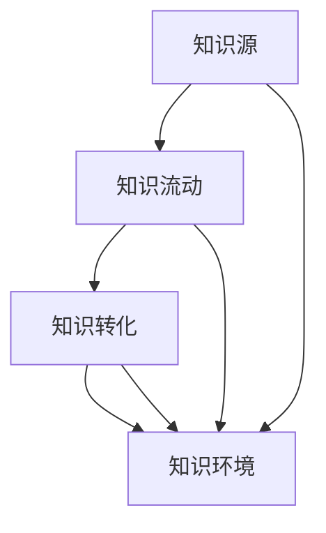
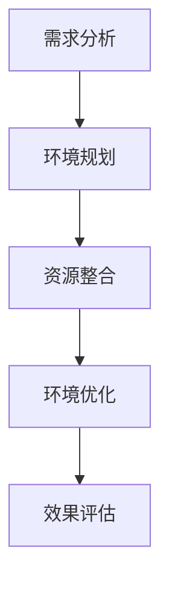
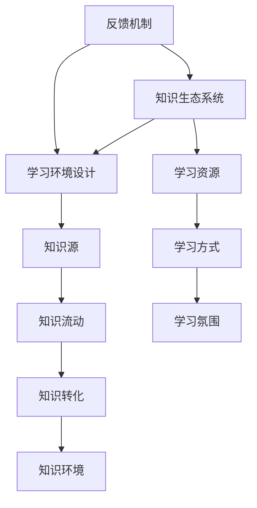
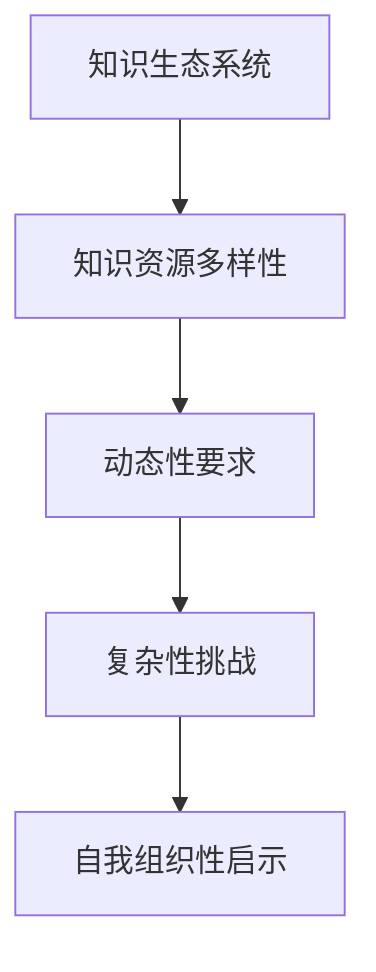
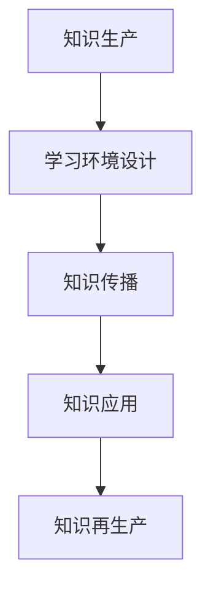
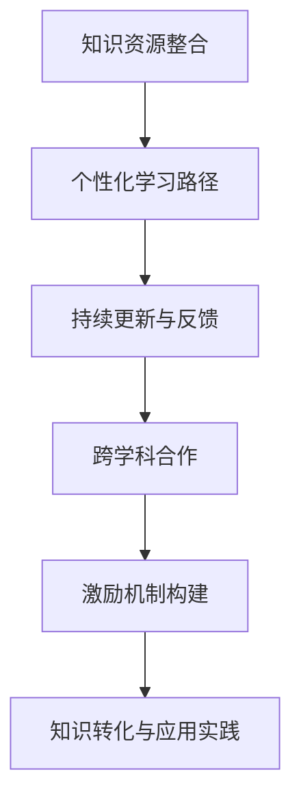
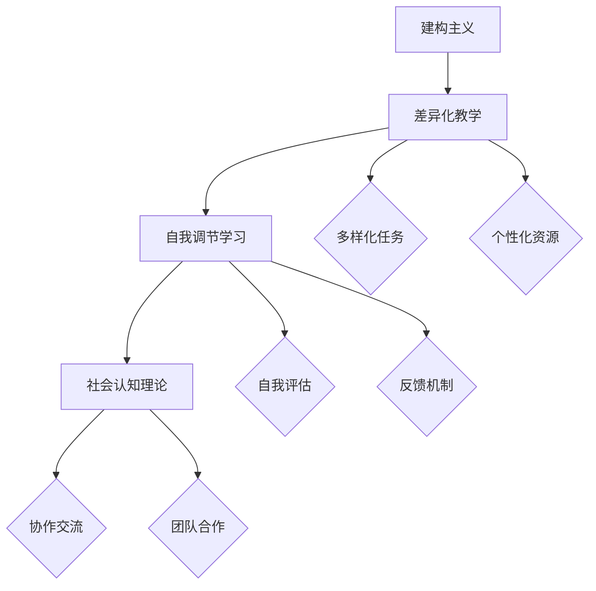
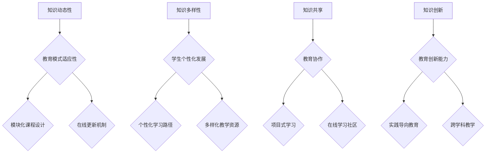
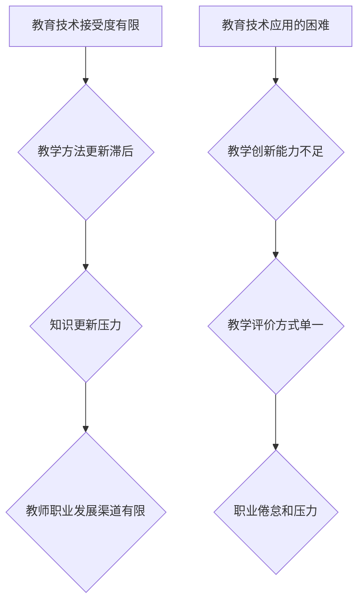

                 

## 文章标题

“知识的生态系统：学习环境的整体设计”

## 关键词

（知识生态系统，学习环境设计，个性化学习，学习支持系统，教育改革，未来展望）

## 摘要

本文旨在探讨知识生态系统的构建与学习环境设计的整体性关系。通过分析知识生态系统的基础理论、核心要素以及学习环境设计的实践方法，本文揭示了知识生态系统在当代教育中的关键作用。同时，本文还探讨了知识生态系统对教育改革的影响以及未来发展的趋势与挑战。本文结构清晰，内容详实，旨在为教育领域的研究者和实践者提供有价值的参考。

----------------------------------------------------------------

### 第一部分：引论

#### 1.1 知识生态系统的概念与构建

**知识生态系统**，是一个比喻性概念，用于描述知识生产、传播、应用和再生产过程中的相互作用和相互依存关系。与自然生态系统类似，知识生态系统包含了知识源、知识流动、知识转化和知识环境等核心要素。在这些要素中，知识源是知识生态系统的起点，它包括各种形式的知识，如学术文献、实践经验、行业报告等。知识流动则是指知识在生态系统中的传递和交换过程，而知识转化则涉及到知识的吸收、整合和应用。最后，知识环境是知识生态系统的基础，它为知识的生产、传播和应用提供了必要的条件。

知识生态系统的构建需要从以下几个方面入手：

1. **知识源的开发与利用**：首先，要丰富和扩展知识源，确保知识生态系统能够源源不断地获取新的知识。这需要建立有效的知识收集、存储和管理机制。

2. **知识流动的优化**：其次，要优化知识流动，促进知识在生态系统中的快速传递和共享。这需要构建高效的知识传输渠道，如学术期刊、会议论文、行业报告等。

3. **知识转化的促进**：再次，要促进知识转化，使知识能够更好地应用于实际问题和需求中。这需要提供有效的知识应用场景，如技术开发、企业管理、政策制定等。

4. **知识环境的营造**：最后，要营造良好的知识环境，为知识的生产、传播和应用提供必要的支持。这需要建立良好的知识共享文化，提供优质的知识服务，以及建立完善的知识评价和激励机制。

#### 1.1.1 知识生态系统的基本定义

知识生态系统可以定义为一种动态的、复杂的系统，它通过知识的生产、传播、应用和再生产过程，实现知识价值的最大化。在这个系统中，知识被视为一种资源，通过不断的交换和转化，实现知识的增值和优化。知识生态系统具有以下几个基本特点：

1. **多样性**：知识生态系统包含了多种形式的知识，如学术知识、实践知识、行业知识等，这些知识在性质、来源和应用方面存在差异。

2. **复杂性**：知识生态系统中的要素之间存在复杂的相互作用和相互依存关系，这些关系构成了一个复杂的网络结构。

3. **动态性**：知识生态系统处于不断变化和发展的过程中，知识的生产、传播、应用和再生产过程不断进行，使得知识生态系统始终保持活力。

4. **适应性**：知识生态系统具有一定的适应性，能够根据外部环境和内部需求的变化，进行相应的调整和优化。

#### 1.1.2 知识生态系统的组成部分

知识生态系统的组成部分可以归纳为以下几个方面：

1. **知识源**：知识源是知识生态系统的起点，它提供了各种形式的知识。知识源可以分为内部知识源和外部知识源。内部知识源主要来源于组织内部，如内部报告、备忘录、会议记录等。外部知识源主要来源于组织外部，如学术文献、行业报告、新闻报道等。

2. **知识流动**：知识流动是知识生态系统中的核心环节，它涉及到知识的传递和交换过程。知识流动可以分为横向流动和纵向流动。横向流动是指知识在同一层次之间的传递和交换，如学术会议、行业论坛等。纵向流动是指知识在不同层次之间的传递和交换，如学术交流、企业合作等。

3. **知识转化**：知识转化是知识生态系统中的关键环节，它涉及到知识的吸收、整合和应用。知识转化可以分为内部转化和外部转化。内部转化是指组织内部对知识的吸收、整合和应用，如技术开发、企业管理等。外部转化是指组织对外部知识的吸收、整合和应用，如行业合作、技术创新等。

4. **知识环境**：知识环境是知识生态系统的基础，它为知识的生产、传播和应用提供了必要的条件。知识环境包括知识共享文化、知识服务、知识评价和激励机制等。

#### 1.1.3 知识生态系统的动态特性

知识生态系统的动态特性体现在以下几个方面：

1. **自组织性**：知识生态系统具有一定的自组织性，能够根据外部环境和内部需求的变化，进行相应的调整和优化。这种自组织性使得知识生态系统具有高度的灵活性和适应性。

2. **适应性演化**：知识生态系统处于不断演化过程中，通过知识的生产、传播、应用和再生产过程，实现知识的增值和优化。这种适应性演化使得知识生态系统能够不断适应外部环境和内部需求的变化。

3. **非线性关系**：知识生态系统中的要素之间存在复杂的非线性关系，这些关系构成了一个复杂的网络结构。这种非线性关系使得知识生态系统具有高度的复杂性和多样性。

4. **反馈机制**：知识生态系统中的各个要素之间存在反馈机制，这些反馈机制促进了知识生态系统的稳定性和持续性。例如，知识共享文化的建立和知识服务的提供，有助于提高知识流动的效率和质量。

---

**小结**：

知识生态系统是一个复杂、动态和自组织的系统，通过知识的生产、传播、应用和再生产过程，实现知识价值的最大化。知识生态系统的构建需要从知识源的开发与利用、知识流动的优化、知识转化的促进和知识环境的营造等多个方面进行综合考虑。在接下来的章节中，我们将进一步探讨知识生态系统的核心要素，以及学习环境设计的理论基础和实践方法。

---

**Mermaid 流程图：知识生态系统的基本组成**

---

#### 1.2 学习环境设计的理论基础

学习环境设计是教育领域中的一个重要课题，它涉及到学习过程中的各种因素，如学习资源、学习方式、学习氛围等。有效的学习环境设计能够提高学习效率，促进学习成果的转化。学习环境设计的理论基础主要包括以下几个方面：

1. **建构主义学习理论**：建构主义认为，学习是一个主动建构知识的过程，学习者通过与环境互动，主动建构对世界的理解。学习环境设计应该提供丰富的学习资源和实践机会，促进学习者自主探索和知识建构。

2. **社会学习理论**：社会学习理论强调学习是一个社会化的过程，学习者通过与他人的互动，获得知识和技能。学习环境设计应该创造一个合作、互动的学习氛围，促进学习者之间的交流和知识共享。

3. **认知负荷理论**：认知负荷理论认为，学习者的认知资源是有限的，学习环境设计应该尽量减少学习者的认知负荷，提高学习效率。学习环境设计应该提供清晰的学习目标和结构化的学习内容，避免过多的干扰和冗余信息。

4. **学习动机理论**：学习动机是影响学习效果的重要因素。学习环境设计应该激发和维持学习者的学习动机，提高学习的内在动力。学习环境设计应该提供多样化的学习任务和挑战，满足不同学习者的需求。

#### 1.2.1 学习环境设计的核心理念

学习环境设计的核心理念主要包括以下几个方面：

1. **以学习者为中心**：学习环境设计应该以学习者为中心，关注学习者的需求、兴趣和学习风格。学习环境设计应该提供个性化、差异化的学习资源和学习支持。

2. **促进知识建构**：学习环境设计应该促进学习者的知识建构，提供丰富的学习资源和实践机会，鼓励学习者主动探索和思考。

3. **营造良好氛围**：学习环境设计应该营造一个积极、合作的学习氛围，鼓励学习者之间的交流和合作，提高学习效果。

4. **注重实践应用**：学习环境设计应该注重学习成果的实践应用，将学习内容与实际情境相结合，提高学习者的应用能力。

#### 1.2.2 学习环境设计的理论基础

学习环境设计的理论基础主要包括以下几个方面：

1. **建构主义学习理论**：建构主义学习理论强调学习是一个主动建构知识的过程，学习环境设计应该提供丰富的学习资源和实践机会，促进学习者自主探索和知识建构。

2. **社会学习理论**：社会学习理论强调学习是一个社会化的过程，学习环境设计应该创造一个合作、互动的学习氛围，促进学习者之间的交流和知识共享。

3. **认知负荷理论**：认知负荷理论强调学习者的认知资源是有限的，学习环境设计应该尽量减少学习者的认知负荷，提高学习效率。

4. **学习动机理论**：学习动机是影响学习效果的重要因素，学习环境设计应该激发和维持学习者的学习动机，提高学习的内在动力。

#### 1.2.3 学习环境设计的方法论

学习环境设计的方法论主要包括以下几个方面：

1. **需求分析**：学习环境设计的第一步是进行需求分析，了解学习者的需求、兴趣和学习风格。需求分析可以通过访谈、问卷调查、课堂观察等方式进行。

2. **环境规划**：根据需求分析的结果，进行学习环境的规划。环境规划包括学习空间的布置、学习资源的配置和学习方式的设定等。

3. **资源整合**：整合各种学习资源，包括教材、工具、平台等，为学习者提供丰富的学习资源。

4. **环境优化**：对学习环境进行持续优化，根据学习者的反馈和实际效果进行调整，提高学习环境的适应性和有效性。

5. **效果评估**：对学习环境的设计和实施效果进行评估，通过数据分析和反馈收集，了解学习环境的优势和不足，为下一轮的设计提供依据。

---

**小结**：

学习环境设计是教育领域中的一个重要课题，它涉及到学习过程中的各种因素，如学习资源、学习方式、学习氛围等。有效的学习环境设计能够提高学习效率，促进学习成果的转化。学习环境设计的理论基础主要包括建构主义学习理论、社会学习理论、认知负荷理论和学习动机理论等。学习环境设计的方法论包括需求分析、环境规划、资源整合、环境优化和效果评估等。在接下来的章节中，我们将进一步探讨知识生态系统与学习环境设计之间的关系。

---

**Mermaid 流程图：学习环境设计的方法论**

---

### 1.3 知识生态系统与学习环境设计的关系

知识生态系统与学习环境设计之间存在密切的关系，二者相互影响、相互促进。知识生态系统为学习环境设计提供了丰富的资源和理论基础，而学习环境设计则对知识生态系统的发展产生深远影响。

首先，知识生态系统为学习环境设计提供了丰富的知识资源。知识生态系统中包含多种形式的知识，如学术知识、实践知识、行业知识等，这些知识可以通过不同的渠道传递到学习者手中。学习环境设计可以利用这些丰富的知识资源，为学习者提供多样化的学习内容和学习任务，促进学习者对知识的吸收和转化。

其次，知识生态系统为学习环境设计提供了理论基础。知识生态系统的研究成果，如知识源的开发与利用、知识流动的优化、知识转化的促进等，为学习环境设计提供了有益的指导。通过借鉴知识生态系统的理论和实践方法，学习环境设计可以更加科学、系统地构建和优化。

另一方面，学习环境设计对知识生态系统的发展也具有重要作用。有效的学习环境设计可以激发学习者的学习动机，提高学习效率，促进知识的传播和应用。通过学习环境设计，可以将知识生态系统中的知识转化为实际的应用成果，推动社会的进步和发展。

此外，学习环境设计还可以对知识生态系统进行反馈和优化。通过收集学习者的反馈和评估数据，学习环境设计可以识别知识生态系统中的问题和不足，提出改进措施，从而提高知识生态系统的整体效能。

总之，知识生态系统与学习环境设计之间存在着密切的关系。知识生态系统为学习环境设计提供了丰富的资源和理论基础，而学习环境设计则对知识生态系统的发展产生深远影响。在未来的教育实践中，我们需要更加重视知识生态系统与学习环境设计之间的关系，通过二者的相互促进，构建一个高效、可持续的知识生态系统和学习环境。

---

**Mermaid 流程图：知识生态系统与学习环境设计的关系**

---

**小结**：

通过本部分的探讨，我们可以看出知识生态系统与学习环境设计之间存在着密切的关系。知识生态系统为学习环境设计提供了丰富的资源和理论基础，而学习环境设计则对知识生态系统的发展产生深远影响。在接下来的章节中，我们将进一步深入探讨知识生态系统的核心要素，以及学习环境设计的实践方法。

### 1.3.1 知识生态系统对学习环境设计的影响

知识生态系统对学习环境设计具有深远的影响，体现在以下几个方面：

首先，知识生态系统的多样性为学习环境设计提供了丰富的资源。知识生态系统包含了多种形式的知识，如学术知识、实践知识、行业知识等。这些知识可以通过不同的渠道传递到学习者手中，使得学习环境设计能够为学习者提供多样化的学习内容和学习任务。例如，学术知识可以通过教材、论文等形式传递，实践知识可以通过案例分析、实训等形式传递，行业知识可以通过行业报告、行业标准等形式传递。这种多样化的知识资源使得学习环境设计更加灵活和丰富。

其次，知识生态系统的动态性对学习环境设计提出了更高的要求。知识生态系统处于不断变化和发展的过程中，知识的生产、传播、应用和再生产过程不断进行。这使得学习环境设计需要具备快速适应和灵活调整的能力，以应对知识生态系统的变化。例如，随着新技术、新理论、新方法的出现，学习环境设计需要及时更新和调整，以适应新的知识需求。这种动态性要求学习环境设计具备高度的灵活性和适应性。

此外，知识生态系统的复杂性也对学习环境设计提出了挑战。知识生态系统中的要素之间存在复杂的相互作用和相互依存关系，构成了一个复杂的网络结构。这使得学习环境设计需要考虑多个方面的因素，如知识源的开发与利用、知识流动的优化、知识转化的促进等。学习环境设计需要综合考虑这些因素，构建一个高效、可持续的知识生态系统和学习环境。

最后，知识生态系统的自我组织性为学习环境设计提供了有益的启示。知识生态系统具有一定的自我组织性，能够根据外部环境和内部需求的变化，进行相应的调整和优化。这种自我组织性使得知识生态系统具有高度的灵活性和适应性。学习环境设计可以借鉴知识生态系统的自我组织性，通过建立自我调节和反馈机制，提高学习环境的设计质量和实施效果。

总之，知识生态系统对学习环境设计具有深远的影响，体现在知识资源的多样性、动态性、复杂性和自我组织性等方面。学习环境设计需要充分考虑这些影响，构建一个高效、可持续的知识生态系统和学习环境。

---

**Mermaid 流程图：知识生态系统对学习环境设计的影响**

---

**小结**：

通过对知识生态系统对学习环境设计的影响进行分析，我们可以看到知识生态系统的多样性、动态性、复杂性和自我组织性对学习环境设计产生了重要影响。在接下来的章节中，我们将继续探讨学习环境设计在知识生态系统中的地位和作用，以及知识生态系统与学习环境设计的协同作用。

### 1.3.2 学习环境设计在知识生态系统中的地位和作用

学习环境设计在知识生态系统中具有独特的地位和作用，它是知识生产、传播、应用和再生产过程中的关键环节。具体来说，学习环境设计在知识生态系统中的地位和作用体现在以下几个方面：

首先，学习环境设计是知识生产的重要环节。知识生产是知识生态系统的基础，它涉及到知识的生产、创新和积累。学习环境设计为知识生产提供了必要的平台和条件，如学习资源的配置、学习方式的设定、学习氛围的营造等。通过构建良好的学习环境，可以激发学习者的创造力和创新精神，促进知识的产生和创新。

其次，学习环境设计是知识传播的重要渠道。知识传播是知识生态系统中的核心环节，它涉及到知识的传递、共享和扩散。学习环境设计通过多样化的学习资源和学习方式，为知识的传播提供了丰富的渠道和途径。例如，通过在线课程、学术会议、实践项目等形式，可以有效地将知识传播到更广泛的受众中。

第三，学习环境设计是知识应用的重要保障。知识应用是知识生态系统中的关键环节，它涉及到知识的吸收、整合和应用。学习环境设计通过提供实际的应用场景和实践活动，为知识的应用提供了有效的保障。例如，通过实验、实习、项目开发等形式，可以使学习者将理论知识应用于实际问题和需求中，提高知识的应用能力和实践能力。

最后，学习环境设计是知识再生产的重要推动力。知识再生产是知识生态系统中的持续过程，它涉及到知识的更新、优化和再创新。学习环境设计通过不断优化和改进，为知识的再生产提供了动力和支撑。例如，通过反馈机制、评价体系、激励机制等，可以激发学习者的积极性和创造力，推动知识的更新和再创新。

总之，学习环境设计在知识生态系统中具有独特的地位和作用，它是知识生产、传播、应用和再生产过程中的关键环节。通过构建良好的学习环境，可以促进知识的产生、传播、应用和再生产，提高知识生态系统的整体效能和可持续发展能力。

---

**Mermaid 流程图：学习环境设计在知识生态系统中的地位和作用**

---

**小结**：

通过对学习环境设计在知识生态系统中的地位和作用进行分析，我们可以看到学习环境设计在知识生态系统中具有至关重要的地位，它是知识生产、传播、应用和再生产过程中的关键环节。在接下来的章节中，我们将进一步探讨知识生态系统与学习环境设计的协同作用，以及如何通过二者的协同作用提高学习效果和知识转化率。

### 1.3.3 知识生态系统与学习环境设计的协同作用

知识生态系统与学习环境设计之间的协同作用是提高学习效果和知识转化率的关键。通过优化知识生态系统和学习环境设计，可以构建一个高效、可持续的知识学习与转化体系。以下为知识生态系统与学习环境设计的协同作用的具体实现：

**1. 知识资源的整合与共享**

知识生态系统的核心要素之一是知识源，而学习环境设计则强调学习资源的整合与共享。通过构建一个集成化的知识平台，可以将不同来源的知识资源（如学术文献、实践案例、行业标准等）进行整合，并提供便捷的访问途径。这样的平台不仅为学习者提供了丰富的学习资源，还可以促进知识在不同领域之间的交叉融合，激发新的创新思维。

**2. 个性化学习路径的设计**

知识生态系统与学习环境设计的协同作用体现在个性化学习路径的设计上。通过分析学习者的兴趣、能力和学习风格，可以设计出个性化的学习路径。知识生态系统提供了丰富的学习资源，而学习环境设计则通过灵活的学习方式和评价机制，确保学习者能够按照自己的节奏和兴趣进行学习。这种个性化的学习路径能够提高学习者的学习动机和参与度，促进知识的有效吸收和转化。

**3. 持续的知识更新与反馈**

知识生态系统是一个动态变化的系统，知识不断更新和迭代。学习环境设计需要与知识生态系统保持同步，及时更新学习内容和方法。通过建立有效的反馈机制，可以收集学习者的反馈和评估数据，对学习环境进行持续优化。这种持续的知识更新与反馈机制有助于提高学习环境的适应性和有效性，使学习者能够更好地适应知识生态系统的发展。

**4. 跨学科与跨领域的合作**

知识生态系统强调跨学科和跨领域的合作，而学习环境设计则需要为这种合作提供平台和支持。通过组织跨学科研讨会、实践活动和联合项目，可以促进不同领域之间的知识交流和共享。学习环境设计可以通过建立合作平台和资源共享机制，降低跨学科合作的障碍，提高知识转化和创新的效率。

**5. 激励机制的构建**

知识生态系统与学习环境设计的协同作用还包括激励机制的构建。通过设计激励机制，如奖励制度、荣誉体系等，可以激发学习者的学习热情和创造力。知识生态系统可以提供丰富的奖励资源，而学习环境设计则通过设置合理的激励目标和评价标准，确保激励机制的公正性和有效性。

**6. 知识转化与应用的实践**

知识生态系统注重知识的实际应用，而学习环境设计则通过实践环节来强化知识的应用能力。通过组织实验、实习、项目开发等活动，可以将理论知识转化为实际应用，提高学习者的实践能力和解决问题的能力。这种知识转化与应用的实践不仅有助于提升学习效果，还能促进知识的再生产和创新。

总之，知识生态系统与学习环境设计的协同作用是构建高效学习环境的关键。通过整合知识资源、个性化学习路径设计、持续更新与反馈、跨学科合作、激励机制构建以及知识转化与应用实践，可以构建一个动态、高效的知识学习与转化体系，提高学习效果和知识转化率。

---

**Mermaid 流程图：知识生态系统与学习环境设计的协同作用**

---

**小结**：

通过探讨知识生态系统与学习环境设计的协同作用，我们可以看到二者之间的紧密联系和相互促进。在构建高效学习环境的过程中，我们需要充分利用知识生态系统的资源和优势，通过优化学习环境设计，提高学习效果和知识转化率。在接下来的章节中，我们将深入探讨知识生态系统的核心要素，以及学习环境设计的具体实践方法。

### 第二部分：知识生态系统的核心要素

在构建一个有效的知识生态系统时，理解并优化其核心要素是至关重要的。知识生态系统的核心要素包括知识源的开发与利用、学习资源的整合与配置、以及学习氛围的营造与维护。以下我们将详细探讨这些核心要素及其在知识生态系统中的关键作用。

#### 2.1 知识源的开发与利用

**知识源**是知识生态系统的起点，是知识生产、传播和应用的基础。知识源的开发与利用主要包括以下几个方面：

1. **多样性的知识来源**：知识源的类型丰富多样，包括学术文献、实践案例、行业标准、技术报告、在线课程等。这些知识来源为学习者提供了全面的学习资源，有助于他们从不同角度理解和掌握知识。

2. **知识获取与整合**：为了确保知识源的准确性和权威性，需要建立有效的知识获取与整合机制。这可以通过建立专业化的知识库、采用先进的数据挖掘技术以及与其他机构合作来实现。

3. **知识质量评估与优化**：知识源的质量直接影响学习效果。因此，需要对知识源进行质量评估，筛选出高质量、权威的知识资源。同时，通过持续的优化，提高知识源的可用性和准确性。

**核心作用**：知识源的开发与利用是知识生态系统的基础，它决定了学习资源的质量和数量，直接影响学习者的学习效果和知识积累。

---

#### 2.2 学习资源的整合与配置

**学习资源**是知识生态系统中的关键要素，它包括各种形式的学习材料、工具和平台。学习资源的整合与配置主要包括以下几个方面：

1. **资源的分类与规划**：学习资源可以根据内容、形式、应用场景等不同维度进行分类。有效的分类和规划有助于学习者快速定位所需资源，提高学习效率。

2. **资源的获取与共享**：学习资源可以通过多种渠道获取，包括购买、免费获取、机构提供等。同时，建立资源共享机制，如在线课程平台、学习社区等，有助于资源的最大化利用。

3. **资源的配置与优化**：学习资源的配置需要根据学习者的需求和实际情况进行调整。通过合理配置资源，确保学习者在学习过程中能够获得所需的资源和支持。

**核心作用**：学习资源的整合与配置是知识生态系统的重要组成部分，它决定了学习资源的可用性和适用性，直接影响学习者的学习体验和学习成果。

---

#### 2.3 学习氛围的营造与维护

**学习氛围**是知识生态系统中的软环境，它对学习者的学习态度、行为和效果具有显著影响。学习氛围的营造与维护主要包括以下几个方面：

1. **文化氛围的构建**：建立积极向上的学习文化，鼓励知识共享、探索和创新。通过举办学习沙龙、研讨会等活动，营造良好的学习氛围。

2. **社交氛围的营造**：通过学习社区、小组讨论等方式，促进学习者之间的交流和合作。良好的社交氛围有助于激发学习兴趣和动机。

3. **反馈与支持系统的建立**：建立有效的反馈和支持系统，为学习者提供及时的学习反馈和指导。通过反馈和指导，帮助学习者纠正错误、深化理解。

**核心作用**：学习氛围的营造与维护是知识生态系统中的软性支持，它对学习者的学习态度、行为和效果具有深远影响，是知识生态系统高效运行的重要保障。

---

**小结**：

知识生态系统的核心要素包括知识源的开发与利用、学习资源的整合与配置、以及学习氛围的营造与维护。这些要素相互关联、相互促进，共同构建了一个高效、动态的知识生态系统。在接下来的章节中，我们将进一步探讨学习环境设计的实践探索，以及如何在具体的学习环境中实现这些核心要素的有效整合与应用。

### 2.1 知识源的开发与利用

知识源的开发与利用是构建知识生态系统的基础，其质量和多样性直接影响整个系统的运作效率。在这一章节中，我们将详细探讨知识源的类型、特点、获取与整合方法，以及知识源的质量评估与优化策略。

#### 2.1.1 知识源的类型与特点

知识源可以按照不同的维度进行分类，常见的知识源类型包括：

1. **学术文献**：这是最常见和权威的知识源之一，包括期刊论文、学术专著、学位论文等。学术文献通常经过严格的同行评审，具有较高的可信度和科学性。

2. **实践案例**：实践案例提供了具体的实践经验，可以帮助学习者理解和应用理论知识。这些案例可以是企业的成功经验、项目实施过程，或者是对特定问题的解决方案。

3. **行业报告**：行业报告通常由专业机构或研究机构发布，涵盖行业趋势、市场分析、技术发展等内容。它们是了解行业动态和前沿技术的关键来源。

4. **在线课程与培训材料**：随着在线教育的兴起，各种在线课程和培训材料成为重要的知识源。这些资源通常由行业专家或学者提供，形式多样，包括视频讲座、电子书籍、互动教程等。

5. **社交媒体与论坛**：社交媒体和在线论坛提供了大量的用户生成内容，包括讨论、问答、博客等。这些资源虽然可能缺乏严格的科学性，但它们可以提供不同的视角和实用的建议。

知识源的特点主要表现在以下几个方面：

- **权威性**：学术文献和行业报告等具有较高权威性的知识源，能够提供准确、可靠的信息。
- **时效性**：实践案例和在线课程等知识源具有时效性，它们能够反映最新的技术和行业动态。
- **多样性**：知识源类型丰富，可以满足不同学习者的需求，包括理论知识、实践经验、实时信息等。

#### 2.1.2 知识源的获取与整合

知识源的获取与整合是构建知识生态系统的重要环节，以下是一些具体的策略：

1. **在线数据库与图书馆**：利用学术数据库（如IEEE Xplore、ScienceDirect）和图书馆资源（如Google Scholar、CNKI）获取学术文献。这些数据库通常提供全文检索和下载功能，方便用户获取所需文献。

2. **专业网站与行业报告**：通过专业网站和行业报告获取行业动态和技术趋势。这些网站和报告通常由行业权威机构发布，内容权威且具有时效性。

3. **社交媒体与论坛**：利用社交媒体（如LinkedIn、Twitter）和在线论坛（如Stack Overflow、Reddit）获取用户生成内容。这些平台提供了大量的讨论和问答，可以帮助学习者快速解决实际问题。

4. **在线课程与培训材料**：通过在线课程平台（如Coursera、Udacity）获取高质量的教育资源。这些平台通常提供由行业专家或学者讲授的课程，形式多样，有助于系统学习。

5. **知识整合工具**：利用知识整合工具（如Mendeley、EndNote）对获取的文献和资料进行整理和管理。这些工具可以帮助用户建立个人知识库，提高知识获取和整合的效率。

#### 2.1.3 知识源的质量评估与优化

知识源的质量直接影响学习效果，因此对知识源进行质量评估和优化至关重要。以下是一些常见的质量评估和优化策略：

1. **同行评审**：对于学术文献，可以通过同行评审来判断其质量。同行评审通常由领域内的专家进行，能够保证文献的学术价值和可靠性。

2. **来源可靠性评估**：评估知识源的来源可靠性，包括发布机构的权威性、报告编写者的资质等。权威性和可信度越高的知识源，质量通常越高。

3. **内容准确性评估**：检查知识源的内容准确性，包括数据是否可靠、结论是否合理等。对于实践案例和行业报告，可以通过对比多个来源的信息来验证其准确性。

4. **用户评价**：参考用户评价和反馈，了解知识源的使用效果和用户满意度。用户评价可以帮助识别高质量的知识源，并为优化知识库提供反馈。

5. **持续更新与优化**：知识库需要定期更新，确保包含最新的知识和信息。同时，通过优化知识库的结构和内容，提高知识源的可获取性和使用效率。

---

**小结**：

知识源的开发与利用是构建知识生态系统的基础。通过了解知识源的类型与特点、掌握获取与整合方法、以及进行质量评估与优化，可以构建一个高质量、多样化的知识库，为学习者提供丰富的学习资源。在接下来的章节中，我们将继续探讨学习资源的整合与配置，以及学习氛围的营造与维护。

### 2.2 学习资源的整合与配置

学习资源的整合与配置是构建高效学习环境的关键环节。通过合理整合和配置学习资源，可以确保学习者在学习过程中能够获取到所需的信息和工具，从而提高学习效率和质量。以下我们将详细探讨学习资源的分类、获取与共享方法，以及配置与优化的策略。

#### 2.2.1 学习资源的分类与规划

学习资源种类繁多，按照不同的维度可以进行如下分类：

1. **按内容分类**：学习资源可以按内容分类，如教材、视频课程、实践案例、行业报告、在线论坛等。教材和视频课程是基础性资源，提供系统的知识体系；实践案例和行业报告则提供实际应用场景和行业动态；在线论坛则提供了交流平台，供学习者提问和讨论。

2. **按形式分类**：学习资源还可以按形式分类，如文本、图片、音频、视频、软件工具等。文本资源通常包括书籍、论文、文档等；图片和视频资源则提供直观的学习体验；软件工具则提供动手实践的机会。

3. **按用途分类**：学习资源可以按用途分类，如学术研究资源、职业培训资源、个人兴趣资源等。学术研究资源主要服务于学术研究，如学术论文、期刊等；职业培训资源则侧重于职业技能的提升，如在线课程、实习机会等；个人兴趣资源则满足学习者的个性化需求。

在进行学习资源的分类和规划时，需要充分考虑学习者的需求和学习目标，确保资源的有效性和适用性。具体策略包括：

- **建立资源目录**：根据资源类型、形式和用途，建立详细的资源目录，方便学习者快速查找和获取所需资源。

- **制定资源指南**：为不同类型的学习资源制定使用指南，帮助学习者理解资源的性质、用途和使用方法。

- **定期更新资源**：随着知识的发展和技术的进步，学习资源需要定期更新，确保其时效性和实用性。

#### 2.2.2 学习资源的获取与共享

学习资源的获取与共享是学习环境设计的重要组成部分。以下是一些具体的获取与共享策略：

1. **在线资源获取**：利用在线资源平台（如MOOCs、知识库、专业网站等）获取学习资源。这些平台提供了丰富的学习资源，通常可以通过搜索引擎或资源目录快速找到所需资源。

2. **图书馆资源利用**：利用图书馆资源，包括书籍、期刊、数据库等。图书馆是学习资源的重要来源，尤其对于学术研究资源，图书馆提供了丰富的文献和资料。

3. **社会资源合作**：与社会组织、企业、研究机构等合作，获取专业领域的知识和资源。这种合作可以包括项目合作、资源共享、知识交流等。

4. **用户生成内容**：鼓励学习者参与知识共享，利用用户生成内容（如博客、论坛、社交媒体等）获取学习资源。用户生成内容提供了多样化的学习视角和实际应用经验。

5. **资源整合平台**：建立资源整合平台，将各类学习资源进行整合和分类，提供一站式获取服务。这种平台可以集成多种资源类型，如在线课程、文献资料、实践案例等，方便学习者一站式获取所需资源。

#### 2.2.3 学习资源的配置与优化

学习资源的配置与优化是确保学习资源能够有效支持学习活动的重要环节。以下是一些具体的配置与优化策略：

1. **个性化配置**：根据学习者的个人需求、兴趣和学习风格，进行个性化的学习资源配置。通过数据分析和学习者反馈，为每个学习者提供最合适的学习资源。

2. **动态调整**：学习资源的配置需要根据学习活动的进展和学习者的需求进行动态调整。例如，在项目实践中，可以实时调整学习资源的类型和数量，以满足项目需求。

3. **资源共享**：鼓励学习者之间的资源共享，通过小组讨论、知识分享等方式，使学习资源得到最大化的利用。这种资源共享不仅可以提高学习效率，还可以促进学习者的合作与交流。

4. **质量评估**：对学习资源进行定期质量评估，确保资源的准确性和实用性。质量评估可以通过用户反馈、同行评审等方式进行，及时发现并解决资源存在的问题。

5. **技术支持**：利用现代信息技术，如人工智能、大数据分析等，优化学习资源的配置和推荐。通过智能推荐系统，为学习者提供个性化、精准的学习资源推荐。

---

**小结**：

学习资源的整合与配置是构建高效学习环境的关键环节。通过合理分类与规划、有效获取与共享、以及动态配置与优化，可以确保学习资源能够有效支持学习活动，提高学习效率和质量。在接下来的章节中，我们将进一步探讨学习氛围的营造与维护，以及如何通过构建良好的学习氛围来促进知识的学习与转化。

### 2.3 学习氛围的营造与维护

学习氛围是知识生态系统中的软性支持，它对学习者的学习态度、行为和效果具有深远影响。一个良好的学习氛围能够激发学习者的学习兴趣，增强学习动机，提高学习效果。以下将详细探讨学习氛围的概念、营造策略以及维护方法。

#### 2.3.1 学习氛围的概念与作用

**学习氛围**是指在学习过程中，学习者所处环境所形成的一种心理和行为的氛围。它包括学习环境、学习文化、学习互动等方面。良好的学习氛围具有以下几个作用：

1. **促进学习动机**：良好的学习氛围能够激发学习者的学习动机，使他们对学习产生浓厚的兴趣。这种兴趣可以转化为持久的动力，促进学习者主动投入学习。

2. **提高学习效果**：良好的学习氛围有助于提高学习效率，使学习者在轻松、愉快的氛围中高效学习。通过互动和合作，学习者可以更好地理解和掌握知识。

3. **增强学习体验**：良好的学习氛围可以提升学习者的学习体验，使他们感到学习是一种享受而非负担。这种积极的体验有助于培养学习者的学习习惯和兴趣。

#### 2.3.2 学习氛围的营造策略

为了营造良好的学习氛围，可以采取以下策略：

1. **建设良好的学习环境**：学习环境是学习氛围的基础。一个舒适、整洁、安全的学习环境有助于提高学习者的学习效率。此外，还可以利用色彩、布局、装饰等元素来营造一个温馨、积极的学习氛围。

2. **培养学习文化**：学习文化是一种价值观和行为规范，它影响着学习者的学习态度和行为。通过建立积极向上的学习文化，如鼓励知识共享、尊重差异、强调创新等，可以营造一个良好的学习氛围。

3. **促进学习互动**：学习互动是营造学习氛围的重要手段。通过小组讨论、合作学习、项目实践等方式，促进学习者之间的交流和互动，增强学习氛围。

4. **提供心理支持**：学习过程中，学习者可能会遇到各种困难和挑战。提供心理支持，如辅导、咨询、激励等，可以帮助学习者克服困难，保持积极的学习态度。

5. **加强学习激励**：通过奖励制度、荣誉体系等激励措施，激发学习者的学习动机和积极性。这种激励可以来自于学习成果、学习过程，也可以来自于同伴的认可和社会的赞誉。

#### 2.3.3 学习氛围的维护与更新

良好的学习氛围需要持续维护和更新，以下是一些维护和更新的方法：

1. **定期评估与反馈**：定期对学习氛围进行评估，收集学习者的反馈和建议。通过评估和反馈，了解学习氛围的现状和存在的问题，及时进行改进。

2. **动态调整与优化**：根据评估结果和学习者的需求，动态调整和优化学习氛围。例如，可以调整学习环境的布局、改进学习文化、增加互动活动等。

3. **持续培训与提升**：对教师和学习者进行持续培训，提升他们的学习素养和沟通能力。通过培训，可以增强学习氛围的营造和维护能力。

4. **引入新技术**：利用现代信息技术，如在线教育平台、虚拟现实等，为学习者提供更多元的学习体验。新技术可以丰富学习氛围，提高学习者的学习兴趣和参与度。

5. **保持开放与包容**：保持开放和包容的态度，尊重不同学习者的观点和需求。这种开放和包容的氛围有助于建立信任和合作，促进良好的学习氛围。

---

**小结**：

学习氛围是知识生态系统中的重要组成部分，对学习者的学习态度、行为和效果具有深远影响。通过建设良好的学习环境、培养学习文化、促进学习互动、提供心理支持和加强学习激励等策略，可以营造一个良好的学习氛围。同时，需要通过定期评估与反馈、动态调整与优化、持续培训与提升、引入新技术和保持开放与包容等方法，维护和更新学习氛围，确保其持续发挥作用。在接下来的章节中，我们将进一步探讨学习环境设计的实践探索，以及如何在具体的学习环境中实现这些策略。

### 2.3.1 学习氛围的概念与作用

学习氛围是指在学习环境中，由学习者、教师、学习资源等因素共同营造的一种无形的心理和行为氛围。这种氛围影响着学习者的学习态度、动机和行为，对学习效果有着重要的影响。

**学习氛围的概念**：

学习氛围包括以下几个方面：

1. **心理氛围**：学习者的情绪、动机、兴趣、态度等心理状态，如积极向上的心态、浓厚的兴趣、强烈的求知欲望等。

2. **行为氛围**：学习者的学习行为和学习方式，如积极参与、合作学习、主动提问、认真思考等。

3. **文化氛围**：学习环境中的文化价值观、规章制度、行为规范等，如尊重知识、鼓励创新、公平竞争等。

**学习氛围的作用**：

1. **激发学习动机**：良好的学习氛围能够激发学习者的学习动机，使他们更加主动地投入学习。

2. **提高学习效果**：良好的学习氛围有助于提高学习者的学习效率，使他们能够更加高效地获取和掌握知识。

3. **促进知识转化**：良好的学习氛围能够促进学习者将知识应用到实际问题和情境中，提高知识的实际应用能力。

4. **增强学习体验**：良好的学习氛围能够提升学习者的学习体验，使他们在轻松愉快的环境中学习，减少学习压力。

#### 2.3.2 学习氛围的营造策略

以下是一些具体的营造学习氛围的策略：

1. **建设良好的学习环境**：

   - **物理环境**：提供舒适、安静、整洁的学习空间，确保学习者的身体舒适度。
   - **技术支持**：提供现代化的教学设备和技术工具，如计算机、投影仪、网络等，支持学习者进行多样化的学习活动。
   - **安全环境**：确保学习环境的安全，消除学习者的后顾之忧。

2. **培养学习文化**：

   - **尊重知识**：尊重知识、尊重教师、尊重同学，形成良好的学习文化价值观。
   - **鼓励创新**：鼓励学习者勇于尝试、勇于创新，形成创新的学习氛围。
   - **公平竞争**：倡导公平竞争、互帮互助，形成积极向上的学习氛围。

3. **促进学习互动**：

   - **小组讨论**：通过小组讨论、课堂互动等方式，促进学习者之间的交流和合作，提高学习效果。
   - **实践活动**：通过实践活动、项目合作等方式，将理论知识与实践相结合，提高学习者的实际应用能力。

4. **提供心理支持**：

   - **辅导与咨询**：提供学习辅导和心理咨询服务，帮助学习者解决学习中的困难和问题。
   - **激励与鼓励**：通过奖励、表扬等激励措施，鼓励学习者保持积极的学习态度和努力。

5. **加强学习激励**：

   - **目标设置**：明确学习目标，激发学习者的内在动机。
   - **反馈与评价**：及时反馈和评价学习成果，提高学习者的学习成就感。

---

**小结**：

学习氛围对学习者的学习态度、动机和行为具有重要影响，通过建设良好的学习环境、培养学习文化、促进学习互动、提供心理支持和加强学习激励等策略，可以营造一个积极、有效的学习氛围。在接下来的章节中，我们将继续探讨学习氛围的营造策略，以及如何通过这些策略来优化学习体验和提高学习效果。

---

### 2.3.3 学习氛围的营造与维护方法

营造和维护良好的学习氛围是教育过程中至关重要的一环，它能够显著提升学习者的学习效果和积极性。以下是一些具体的营造与维护学习氛围的方法：

1. **培养积极的学习文化**：

   - **树立正确的价值观**：通过一系列教育活动，如班会、讲座等，树立尊重知识、追求真理、公平竞争的价值观。
   - **建立共同目标**：引导学习者明确学习目标，形成共同的学习愿景，增强集体归属感和使命感。

2. **营造互动与合作的学习环境**：

   - **鼓励小组讨论**：在课堂上设置小组讨论环节，鼓励学习者积极参与讨论，促进思维碰撞和知识共享。
   - **开展项目合作**：通过项目式学习，组织学习者进行团队合作，培养他们的协作能力和团队精神。

3. **提供多样化的学习资源**：

   - **丰富学习内容**：提供多种形式的学习资源，如电子书籍、在线课程、实验材料等，满足学习者的多样化需求。
   - **优化学习工具**：利用现代技术，如在线教育平台、虚拟实验室等，提供便捷的学习工具，提高学习效率。

4. **建立有效的激励机制**：

   - **设立奖励制度**：对学习表现优秀的学习者给予奖励，如奖学金、荣誉称号等，激励他们继续保持积极的学习态度。
   - **开展表彰活动**：定期举办表彰活动，对在学习中取得显著成绩的学习者进行表彰，提升他们的自信心和荣誉感。

5. **关注学习者的心理健康**：

   - **提供心理辅导**：设立心理辅导室，为学习者提供心理咨询和辅导，帮助他们解决学习中的心理问题。
   - **营造安全氛围**：确保学习环境的安全和舒适，消除学习者的后顾之忧，让他们在轻松愉快的氛围中学习。

6. **建立反馈与评估机制**：

   - **定期反馈**：通过定期的课堂反馈、作业评阅等，及时了解学习者的学习状况，给予针对性的指导和帮助。
   - **自我评估**：鼓励学习者进行自我评估，反思自己的学习过程和方法，发现并解决问题。

7. **持续优化学习环境**：

   - **更新资源**：定期更新学习资源，确保其时效性和实用性。
   - **改进设施**：根据学习者的需求，不断改进学习设施和环境，如优化教室布局、增加学习设备等。

---

**小结**：

通过培养积极的学习文化、营造互动与合作的学习环境、提供多样化的学习资源、建立有效的激励机制、关注学习者的心理健康、建立反馈与评估机制以及持续优化学习环境，可以有效地营造和维护良好的学习氛围。这些方法不仅有助于提升学习者的学习效果，还能够促进他们的全面发展。在接下来的章节中，我们将进一步探讨学习环境设计的实践探索，以及如何通过具体实践来优化学习氛围。

---

### 2.3.3 学习氛围的营造与维护方法

营造和维护良好的学习氛围是教育过程中至关重要的一环，它能够显著提升学习者的学习效果和积极性。以下是一些具体的营造与维护学习氛围的方法：

1. **培养积极的学习文化**：

   - **树立正确的价值观**：通过一系列教育活动，如班会、讲座等，树立尊重知识、追求真理、公平竞争的价值观。
   - **建立共同目标**：引导学习者明确学习目标，形成共同的学习愿景，增强集体归属感和使命感。

2. **营造互动与合作的学习环境**：

   - **鼓励小组讨论**：在课堂上设置小组讨论环节，鼓励学习者积极参与讨论，促进思维碰撞和知识共享。
   - **开展项目合作**：通过项目式学习，组织学习者进行团队合作，培养他们的协作能力和团队精神。

3. **提供多样化的学习资源**：

   - **丰富学习内容**：提供多种形式的学习资源，如电子书籍、在线课程、实验材料等，满足学习者的多样化需求。
   - **优化学习工具**：利用现代技术，如在线教育平台、虚拟实验室等，提供便捷的学习工具，提高学习效率。

4. **建立有效的激励机制**：

   - **设立奖励制度**：对学习表现优秀的学习者给予奖励，如奖学金、荣誉称号等，激励他们继续保持积极的学习态度。
   - **开展表彰活动**：定期举办表彰活动，对在学习中取得显著成绩的学习者进行表彰，提升他们的自信心和荣誉感。

5. **关注学习者的心理健康**：

   - **提供心理辅导**：设立心理辅导室，为学习者提供心理咨询和辅导，帮助他们解决学习中的心理问题。
   - **营造安全氛围**：确保学习环境的安全和舒适，消除学习者的后顾之忧，让他们在轻松愉快的氛围中学习。

6. **建立反馈与评估机制**：

   - **定期反馈**：通过定期的课堂反馈、作业评阅等，及时了解学习者的学习状况，给予针对性的指导和帮助。
   - **自我评估**：鼓励学习者进行自我评估，反思自己的学习过程和方法，发现并解决问题。

7. **持续优化学习环境**：

   - **更新资源**：定期更新学习资源，确保其时效性和实用性。
   - **改进设施**：根据学习者的需求，不断改进学习设施和环境，如优化教室布局、增加学习设备等。

---

**小结**：

通过培养积极的学习文化、营造互动与合作的学习环境、提供多样化的学习资源、建立有效的激励机制、关注学习者的心理健康、建立反馈与评估机制以及持续优化学习环境，可以有效地营造和维护良好的学习氛围。这些方法不仅有助于提升学习者的学习效果，还能够促进他们的全面发展。在接下来的章节中，我们将进一步探讨学习环境设计的实践探索，以及如何通过具体实践来优化学习氛围。

### 3.1 学习环境设计的流程与方法

学习环境设计的流程和方法是构建高效、可持续学习环境的关键。一个系统化、科学化的设计流程和方法能够确保学习环境的有效性和适应性，从而满足学习者的多样化需求。以下将详细探讨学习环境设计的基本流程、常用的方法和工具，以及实际案例中的应用。

#### 3.1.1 学习环境设计的基本流程

学习环境设计的基本流程可以概括为以下五个步骤：

1. **需求分析**：

   - **确定目标**：明确学习目标，包括知识目标、能力目标和情感目标。
   - **收集需求**：通过调查问卷、访谈、观察等方式，收集学习者的需求和期望。
   - **分析需求**：对收集到的需求进行分析，识别关键需求和潜在问题。

2. **环境规划**：

   - **设计环境结构**：根据需求分析的结果，设计学习环境的结构和布局，包括物理环境和虚拟环境。
   - **配置资源**：确定所需的学习资源，包括教材、工具、平台等，并合理配置。
   - **规划活动**：设计学习活动，包括课堂教学、实践操作、小组讨论等，确保活动与学习目标一致。

3. **实施与执行**：

   - **准备环境**：根据规划，准备学习环境，包括布置教室、设置设备、调试网络等。
   - **启动活动**：正式开始学习活动，确保学习者能够顺利进入学习状态。
   - **监控进度**：实时监控学习进度，确保学习活动按计划进行。

4. **反馈与调整**：

   - **收集反馈**：通过问卷调查、访谈、课堂反馈等方式，收集学习者和教师的反馈。
   - **分析反馈**：对收集到的反馈进行分析，识别成功和不足之处。
   - **调整规划**：根据反馈结果，对学习环境设计进行必要的调整和优化。

5. **评估与改进**：

   - **评估效果**：通过考试、作业、项目等评估学习效果，确保学习目标达成。
   - **总结经验**：总结设计经验，形成最佳实践，为下一次设计提供参考。
   - **持续改进**：根据评估结果和反馈，不断优化学习环境设计，提高其有效性。

#### 3.1.2 学习环境设计的方法与工具

学习环境设计的方法和工具多种多样，以下介绍几种常用的方法和工具：

1. **情景设计法**：

   - **概念**：情景设计法通过模拟真实场景，让学习者在实际情境中学习和应用知识。
   - **步骤**：确定学习情景、设计任务、安排活动、反馈与评价。
   - **应用场景**：适用于实践性较强的课程，如工程实践、医学模拟等。

2. **问题解决法**：

   - **概念**：问题解决法通过设置问题，引导学习者主动探索和解决问题，培养他们的批判性思维和创新能力。
   - **步骤**：识别问题、提出假设、设计解决方案、实施和评估。
   - **应用场景**：适用于需要培养学生解决问题能力的课程，如计算机科学、管理学等。

3. **混合式学习法**：

   - **概念**：混合式学习法结合在线学习和面对面教学，发挥两种学习方式的优点，提高学习效果。
   - **步骤**：设计在线课程、安排面对面教学、整合在线和线下活动、评估学习效果。
   - **应用场景**：适用于多种学习场景，如大学课程、企业培训等。

4. **学习共同体法**：

   - **概念**：学习共同体法通过构建学习共同体，促进学习者之间的交流和合作，共同完成学习任务。
   - **步骤**：建立共同体、确定共同目标、组织协作活动、共享学习成果。
   - **应用场景**：适用于需要培养团队合作能力的课程，如团队项目、跨学科学习等。

5. **思维导图工具**：

   - **概念**：思维导图工具通过图形化的方式，帮助学习者梳理和整合知识，提高学习效率。
   - **步骤**：创建思维导图、添加分支、链接知识点、调整和优化。
   - **应用场景**：适用于知识梳理、复习备考、项目规划等。

6. **在线教育平台**：

   - **概念**：在线教育平台通过互联网提供学习资源、教学活动和学习管理服务。
   - **步骤**：选择平台、上传资源、设置课程、安排活动、监控进度。
   - **应用场景**：适用于远程教育、在线课程、企业培训等。

#### 3.1.3 学习环境设计的实际案例

以下是一个学习环境设计的实际案例：

**项目名称**：计算机编程课程学习环境设计

**目标**：培养学习者的编程能力和解决实际问题的能力。

**步骤**：

1. **需求分析**：

   - 确定目标：掌握编程基础、解决实际问题、培养创新思维。
   - 收集需求：通过问卷调查，了解学习者对编程学习的需求和期望。

2. **环境规划**：

   - 设计环境结构：包括实体教室和在线学习平台。
   - 配置资源：教材、编程软件、在线教育平台、实验材料。
   - 规划活动：课堂教学、编程实践、项目开发、讨论交流。

3. **实施与执行**：

   - 准备环境：布置教室、调试设备、设置在线学习平台。
   - 启动活动：开展课堂教学、组织编程实践、实施项目开发。

4. **反馈与调整**：

   - 收集反馈：通过课堂反馈、作业评阅、在线调查等方式收集反馈。
   - 分析反馈：识别成功和不足之处，调整教学策略。

5. **评估与改进**：

   - 评估效果：通过项目展示、代码评审、考试等方式评估学习效果。
   - 总结经验：形成教学案例，为后续课程设计提供参考。
   - 持续改进：根据评估结果和反馈，优化课程内容和教学方法。

---

**小结**：

学习环境设计的基本流程和方法包括需求分析、环境规划、实施与执行、反馈与调整、评估与改进。通过运用不同的方法和工具，如情景设计法、问题解决法、混合式学习法、思维导图工具等，可以构建一个高效、可持续的学习环境。实际案例展示了如何将理论应用于实践，为后续的学习环境设计提供宝贵的经验。在接下来的章节中，我们将探讨知识生态系统下的个性化学习设计，以及如何通过个性化学习提高学习效果。

### 3.2 知识生态系统下的个性化学习设计

在知识生态系统背景下，个性化学习设计旨在根据每个学习者的特点、需求和学习风格，为其提供定制化的学习资源和环境。个性化学习不仅能够提高学习者的学习动机和参与度，还能够促进知识的深度理解和应用。以下将详细探讨个性化学习的理论基础、设计策略以及实施与评价方法。

#### 3.2.1 个性化学习的理论基础

个性化学习的理论基础主要包括以下几个方面：

1. **建构主义学习理论**：

   建构主义学习理论强调学习是学习者主动建构知识的过程。个性化学习强调根据学习者的认知特点和需求，提供适宜的学习资源和支持，帮助学习者自主建构知识。

2. **差异化教学理论**：

   差异化教学理论认为，每个学习者都有其独特的学习需求和风格。个性化学习通过差异化教学，为每个学习者提供适合其水平和需求的资源和方法，提高学习效果。

3. **自我调节学习理论**：

   自我调节学习理论强调学习者需要具备自我调节的能力，能够自我监控、自我评估和自我调整。个性化学习通过提供自我调节的工具和方法，帮助学习者发展自我调节能力。

4. **社会认知理论**：

   社会认知理论认为，学习是在社会互动中发生的。个性化学习通过构建学习共同体，促进学习者之间的交流和合作，提高学习效果。

#### 3.2.2 个性化学习的设计策略

个性化学习的设计策略包括以下几个方面：

1. **学习者需求分析**：

   通过问卷调查、访谈、观察等方式，全面了解学习者的兴趣、需求、学习风格和当前水平。需求分析是个性化学习设计的基础，它为后续的学习资源和学习活动提供了依据。

2. **个性化学习资源开发**：

   根据学习者的需求和分析结果，开发适合不同学习者的学习资源。学习资源可以包括电子书籍、视频课程、实践案例、在线工具等。这些资源应具有多样性、灵活性和针对性。

3. **个性化学习路径设计**：

   根据学习者的特点和需求，设计个性化的学习路径。学习路径应包括学习目标、学习内容、学习方法、学习评价等。个性化的学习路径可以帮助学习者有针对性地进行学习，提高学习效率。

4. **个性化学习环境营造**：

   营造一个支持个性化学习的学习环境，包括物理环境和虚拟环境。物理环境应具备舒适、安全、便于协作的特点；虚拟环境应提供丰富的学习资源、互动工具和支持服务。

5. **个性化学习支持系统构建**：

   构建一个支持个性化学习的系统，包括学习管理平台、学习支持工具、评估系统等。这些系统应能够实时跟踪学习者的学习进度、提供个性化建议和反馈，帮助学习者进行自我调节。

#### 3.2.3 个性化学习的实施与评价方法

个性化学习的实施与评价方法包括以下几个方面：

1. **个性化学习计划的制定与实施**：

   根据个性化学习路径，为每个学习者制定详细的学习计划。学习计划应包括每天的学习任务、学习资源和学习活动。教师应监督学习计划的实施，提供必要的指导和支持。

2. **个性化学习活动的组织与实施**：

   根据个性化学习路径和学习计划，组织个性化的学习活动。学习活动可以包括在线讨论、小组合作、实验实践等。教师应积极参与活动，引导学习者进行深度学习和知识应用。

3. **个性化学习反馈与评估**：

   通过定期反馈和评估，了解学习者的学习进展和效果。反馈应包括学习者的自我评估、同伴评估和教师评估。评估结果应作为调整学习计划和优化学习环境的依据。

4. **个性化学习效果的持续跟踪与评价**：

   通过建立学习档案和学习数据，对学习者的学习效果进行持续跟踪和评价。学习档案应包括学习记录、作业成果、项目报告等；学习数据可以通过分析学习日志、评估结果等获取。

5. **个性化学习改进与优化**：

   根据评估结果和反馈，不断改进和优化个性化学习计划和学习环境。改进和优化的目标应包括提高学习效果、增强学习者的自主学习能力、提升学习体验等。

---

**小结**：

知识生态系统下的个性化学习设计旨在根据学习者的特点和需求，提供定制化的学习资源和环境，提高学习效果和自主学习能力。个性化学习的设计策略包括学习者需求分析、个性化学习资源开发、个性化学习路径设计、个性化学习环境营造和个性化学习支持系统构建。个性化学习的实施与评价方法包括个性化学习计划的制定与实施、个性化学习活动的组织与实施、个性化学习反馈与评估、个性化学习效果的持续跟踪与评价和个性化学习改进与优化。通过个性化学习设计，可以构建一个高效、可持续的知识生态系统和学习环境。

---

### 3.2.1 个性化学习的理论基础

个性化学习的设计离不开坚实的理论基础，这些理论为我们提供了深入理解个性化学习的重要视角。以下是几个关键理论：

#### 1. 建构主义学习理论

建构主义学习理论，尤其是社会建构主义，强调学习是学习者通过与环境互动，主动构建对现实的理解的过程。这一理论认为，每个学习者都有自己的知识背景和经验，他们的学习过程是建构性的，而不是被动的信息接受。因此，个性化学习的设计应尊重学习者的个体差异，提供多样化的学习资源和方法，以支持学习者主动建构知识。

**核心观点**：

- 学习是主动的，需要学习者积极参与。
- 学习是建构性的，每个学习者的建构过程都是独特的。
- 学习是互动的，学习者的学习过程不仅包括个体内部的知识建构，还包括与他人的交流与合作。

#### 2. 差异化教学理论

差异化教学理论认为，由于每个学习者的学习风格、兴趣、认知水平和学习需求不同，因此教学应该根据每个学习者的特点进行个性化调整。差异化教学的目标是使每个学习者都能在最适合他们的学习环境中取得最佳的学习效果。

**核心观点**：

- 教学应适应学习者的多样性，而不是统一的教学模式。
- 教学内容和方法应根据学习者的特点和需求进行调整。
- 教学目标应确保每个学习者都能达到其潜能的最高点。

#### 3. 自我调节学习理论

自我调节学习理论强调学习者需要培养自我调节的能力，包括自我监控、自我评估和自我调整。自我调节学习不仅是学习策略的应用，也是学习过程的一部分，它有助于学习者成为独立的学习者。

**核心观点**：

- 学习者是自我调节的主体，他们需要学会如何管理自己的学习过程。
- 自我调节包括对学习目标的设定、学习计划的执行和学习结果的评估。
- 自我调节能力是学习者成功学习的关键因素。

#### 4. 社会认知理论

社会认知理论认为，学习是一个社会互动的过程，学习者的认知发展受到社会文化环境的影响。在社会互动中，学习者通过观察、模仿和协作，形成对知识的理解和应用。

**核心观点**：

- 学习是社交性的，它发生在人与人之间的互动中。
- 学习者通过参与社会活动，如合作、交流和互动，获得知识。
- 社会互动促进了学习者的认知发展和知识建构。

---

**综合应用**：

个性化学习设计应该综合考虑这些理论，结合学习者的实际需求和特点，提供个性化的学习资源和环境。例如，在建构主义学习理论指导下，可以设计多样化的学习任务和实践活动，鼓励学习者主动探索和构建知识；在差异化教学理论指导下，可以根据学习者的不同水平提供不同难度的学习内容；在自我调节学习理论指导下，可以提供自我评估工具和反馈机制，帮助学习者自我监控和调节学习过程；在社会认知理论指导下，可以设计团队协作项目，促进学习者之间的交流和知识共享。

---

**Mermaid 流程图**：

---

**小结**：

个性化学习的设计依赖于建构主义、差异化教学、自我调节学习和社会认知理论等多个理论基础。这些理论为我们提供了深入理解个性化学习的重要视角，指导我们如何根据学习者的特点设计个性化的学习资源和环境。在接下来的章节中，我们将进一步探讨个性化学习的设计策略，以及如何在实践中实施和评估个性化学习的效果。

### 3.2.2 个性化学习的设计策略

个性化学习设计的关键在于充分理解学习者的个体差异，并据此提供针对性的学习资源和环境。以下是一些具体的个性化学习设计策略：

#### 1. **基于学习者特征的分析**

个性化学习设计的第一步是对学习者的特征进行详细分析。这包括：

- **兴趣和动机**：了解学习者的兴趣点、动力来源以及他们为什么学习某项内容。
- **学习风格**：识别学习者的偏好，如视觉型、听觉型、动手型或混合型学习风格。
- **认知水平**：评估学习者的认知发展水平和理解能力，以便提供适合其认知水平的材料。
- **学习习惯和偏好**：了解学习者的日常学习习惯、时间安排和偏好，以便更好地安排学习任务和进度。

**方法**：

- **问卷调查**：通过设计问卷，收集学习者的兴趣、学习风格和偏好等信息。
- **访谈和观察**：通过与学习者进行面对面访谈或观察，深入了解他们的学习习惯和行为。

#### 2. **差异化学习资源的开发**

根据学习者特征的分析结果，开发适合不同学习者的差异化学习资源。这些资源应具有多样性和针对性，以满足不同学习者的需求。

- **多媒体资源**：提供包括文本、图片、音频和视频在内的多种形式的学习资源，以适应不同学习风格。
- **分级资源**：根据学习者的认知水平和能力，提供不同难度和复杂度的学习资源。
- **实践性资源**：提供实际案例、项目、实验等实践性资源，帮助学习者将理论知识应用于实际场景。

**方法**：

- **内容分级**：对学习资源进行分级，确保每个学习者都能找到适合自己的资源。
- **个性化推荐**：利用推荐算法，根据学习者的特征和学习历史，推荐合适的资源。

#### 3. **个性化学习路径的设计**

根据学习者的特征和需求，设计个性化的学习路径。个性化学习路径应包括：

- **学习目标**：明确每个学习阶段的目标和预期成果。
- **学习内容**：根据学习者的兴趣和能力，选择合适的知识内容。
- **学习方法**：提供多种学习方法，如自主学习、合作学习、实践学习等。
- **学习评价**：设计适应个性化学习目标的评价方式，如过程评价、自我评价、同伴评价等。

**方法**：

- **学习地图**：设计学习地图，帮助学习者了解整个学习过程，明确每个阶段的目标和任务。
- **学习日志**：鼓励学习者记录学习过程和心得体会，通过反思和总结提升学习效果。

#### 4. **个性化学习环境的营造**

个性化学习环境是支持个性化学习的重要条件。营造个性化学习环境包括：

- **物理环境**：创造舒适、安静、便于协作的物理空间。
- **虚拟环境**：利用在线学习平台、虚拟课堂等提供多样化的虚拟学习环境。
- **技术支持**：提供必要的技术工具和资源，如计算机、网络、学习软件等。

**方法**：

- **灵活布局**：根据学习者的需求，灵活调整教室布局，提供多样化的学习空间。
- **技术整合**：利用现代教育技术，如在线课程、虚拟实验室等，提供丰富的学习资源和支持。

#### 5. **个性化学习支持系统的构建**

构建一个支持个性化学习的系统，包括学习管理平台、学习工具、反馈机制等。这个系统应能实时跟踪学习者的学习进度，提供个性化建议和反馈。

- **学习管理平台**：提供学习任务管理、资源推荐、进度跟踪等功能。
- **学习工具**：提供多种学习工具，如思维导图、协作平台、在线测试等。
- **反馈机制**：建立反馈和评估系统，及时收集学习者的反馈，进行学习调整。

**方法**：

- **数据驱动**：利用大数据分析，收集和分析学习者的学习数据，为个性化学习提供数据支持。
- **反馈循环**：建立反馈循环机制，及时调整学习计划和环境，确保学习目标的实现。

---

**小结**：

个性化学习的设计策略包括基于学习者特征的分析、差异化学习资源的开发、个性化学习路径的设计、个性化学习环境的营造和个性化学习支持系统的构建。通过这些策略，可以构建一个适应学习者个体差异的个性化学习环境，提高学习效果和自主学习能力。在接下来的章节中，我们将探讨个性化学习的具体实施方法，以及如何通过这些方法提高学习者的学习效果和满意度。

### 3.2.3 个性化学习的实施方法

个性化学习的实施是一个复杂而动态的过程，需要综合考虑学习者的个体差异、学习环境和技术支持。以下将详细探讨个性化学习的具体实施方法，包括学习者自定学习节奏、自我评价与反馈机制、学习支持系统的应用等方面。

#### 1. 自定学习节奏

自定学习节奏是个性化学习的重要特点之一，它允许学习者根据自己的时间和进度安排学习活动。这种方法可以充分尊重学习者的个体差异，使学习过程更加灵活和有效。

**方法**：

- **自主学习计划**：学习者根据个人情况和课程要求，制定详细的学习计划，包括学习目标、学习内容和时间安排。
- **灵活调整**：在学习过程中，学习者可以根据自己的理解程度和进度，灵活调整学习计划，确保学习目标的实现。

**案例**：

在一个编程课程中，学习者可以根据自己的基础和时间安排，选择适合自己的学习进度。一些学习者可能选择快速学习基础课程，然后投入到实践项目中；而另一些学习者则可能选择逐步深入学习，确保每个概念都完全理解后再进行下一步。

#### 2. 自我评价与反馈机制

自我评价和反馈机制是个性化学习中的重要组成部分，它有助于学习者了解自己的学习状况，及时调整学习策略。自我评价可以通过多种方式进行，包括自我测试、学习日志和反思等。

**方法**：

- **自我测试**：学习者可以通过在线测试、练习题等方式，自我检测学习效果，发现和理解自己的学习难点。
- **学习日志**：鼓励学习者记录学习过程中的问题和解决方法，通过反思和总结，不断提升学习效果。
- **反馈机制**：建立反馈渠道，如在线讨论区、学习顾问等，使学习者能够及时获取专业反馈，调整学习策略。

**案例**：

在一个计算机编程课程中，学习者每周需要提交一次编程作业，并进行自我评估。他们可以使用在线测试平台检测自己的编程技能，同时记录学习过程中的问题和解决方法。教师则通过定期查看学习日志和在线讨论，提供针对性的反馈和建议，帮助学习者改进学习策略。

#### 3. 学习支持系统的应用

学习支持系统为个性化学习提供了重要的技术支持，包括学习资源管理、学习进度跟踪和个性化推荐等。这些系统能够帮助学习者更高效地管理学习过程，提高学习效果。

**方法**：

- **学习资源管理**：利用在线学习平台，学习者可以方便地获取、管理和共享学习资源。
- **学习进度跟踪**：学习支持系统可以实时跟踪学习者的学习进度，提供可视化图表和报告，帮助学习者了解自己的学习状况。
- **个性化推荐**：利用大数据和机器学习技术，学习支持系统可以为学习者推荐适合其兴趣和水平的学习资源。

**案例**：

在一个在线学习平台上，学习者可以通过个人账号管理自己的学习资源和进度。平台会根据学习者的学习历史和反馈，推荐适合他们的学习资源。学习者还可以通过平台的进度跟踪功能，了解自己的学习进度和成果，及时调整学习计划。

#### 4. 跨学科与跨领域的合作

个性化学习不仅关注个体差异，还鼓励跨学科和跨领域的合作。这种方法可以激发学习者的创新思维，拓宽他们的知识视野。

**方法**：

- **项目式学习**：通过跨学科项目，学习者可以结合不同领域的知识和技能，解决复杂问题。
- **合作学习**：组织学习者进行小组合作，鼓励他们分享知识和经验，共同完成任务。

**案例**：

在一个跨学科项目中，学习者需要结合计算机科学、数学和物理等知识，开发一款模拟地球气候变化的软件。这个项目不仅要求学习者掌握不同学科的知识，还需要他们具备团队合作和项目管理能力。

#### 5. 持续学习与反馈

个性化学习不是一次性的事件，而是一个持续的过程。通过定期评估和反馈，可以确保个性化学习目标的持续实现。

**方法**：

- **定期评估**：通过定期的考试、项目展示和评估，了解学习者的学习成果和进展。
- **持续反馈**：教师和学习支持系统应提供持续的学习反馈，帮助学习者了解自己的优势和不足，调整学习策略。

**案例**：

在一个个性化的编程课程中，学习者每两个月需要参加一次项目展示，展示自己的编程成果。教师和学习顾问会根据展示情况提供反馈，帮助学习者发现问题和改进学习策略。

---

**小结**：

个性化学习的实施方法包括自定学习节奏、自我评价与反馈机制、学习支持系统的应用、跨学科与跨领域的合作以及持续学习与反馈。这些方法可以帮助学习者根据个人需求和能力进行高效学习，提高学习效果和满意度。在接下来的章节中，我们将进一步探讨知识生态系统中的学习支持系统，以及如何通过这些系统提高学习效果。

### 3.3 知识生态系统中的学习支持系统

学习支持系统（Learning Support Systems, LSS）是知识生态系统的重要组成部分，它通过提供个性化、实时和高效的学习支持，促进学习者的知识获取、理解和应用。以下将详细探讨学习支持系统的概念、设计原则、核心功能及其应用效果。

#### 3.3.1 学习支持系统的概念与设计原则

**概念**：

学习支持系统是一种集成多种技术和资源，旨在提高学习者学习效果和效率的软件系统。它通过数据收集、分析、推荐和反馈等功能，为学习者提供全方位的支持。

**设计原则**：

1. **个性化**：学习支持系统应能够根据学习者的兴趣、能力和学习需求，提供个性化的学习内容和推荐。
2. **实时性**：系统应能够实时收集和分析学习数据，及时提供反馈和支持，帮助学习者调整学习策略。
3. **易用性**：系统界面应简洁友好，操作便捷，确保学习者能够轻松使用。
4. **适应性**：系统应具备良好的适应性，能够根据学习环境和技术条件的变化进行调整和优化。
5. **集成性**：系统应与其他教育资源和工具集成，如在线课程、学习管理平台等，提供一站式学习支持。

#### 3.3.2 学习支持系统的核心功能

1. **学习数据收集与分析**：

   学习支持系统能够实时收集学习者的学习数据，包括学习行为、学习进度、考试成绩等。通过对这些数据的分析，系统可以识别学习者的学习特点和问题，为个性化支持提供依据。

2. **个性化推荐**：

   基于学习数据分析和推荐算法，学习支持系统可以为学习者推荐合适的学习资源、任务和活动。这种个性化推荐有助于提高学习者的学习效率，减少无效学习。

3. **学习进度跟踪**：

   系统可以实时跟踪学习者的学习进度，生成可视化报告，帮助学习者了解自己的学习状况。同时，教师和导师可以通过系统了解学生的学习进展，提供及时的指导和帮助。

4. **学习反馈与评估**：

   学习支持系统提供即时反馈和评估功能，帮助学习者了解自己的学习成果和不足。通过自我评估和同伴评估，学习者可以反思和改进学习策略。

5. **学习工具集成**：

   学习支持系统应集成多种学习工具，如在线课程平台、学习管理平台、协作工具等，提供一站式学习支持。这种集成性可以提高学习者的学习效率，减少切换工具的麻烦。

#### 3.3.3 学习支持系统的设计与实现

1. **需求分析**：

   在设计和实现学习支持系统之前，首先需要进行需求分析。需求分析包括了解学习者的需求、学习环境和技术条件等，以确保系统能够满足实际需求。

2. **系统架构设计**：

   根据需求分析结果，设计系统的整体架构。系统架构应包括数据收集层、数据处理层、应用层和展示层。每个层次的功能和接口应明确，以确保系统的稳定性和可扩展性。

3. **数据收集与存储**：

   设计数据收集机制，包括学习行为数据、学习进度数据、考试成绩数据等。数据应存储在安全可靠的数据仓库中，以便后续分析和处理。

4. **数据分析与推荐算法**：

   采用数据分析技术和推荐算法，对学习数据进行处理和分析。数据分析应包括趋势分析、异常检测、关联分析等，以识别学习者的学习特点和问题。推荐算法应能够根据学习者的兴趣和能力，推荐合适的学习资源。

5. **用户界面设计**：

   设计简洁友好的用户界面，确保学习者能够轻松使用系统。用户界面应包括学习进度跟踪、资源推荐、自我评估、反馈与评估等功能模块。

6. **系统集成与部署**：

   将学习支持系统与其他学习工具和平台进行集成，确保一站式学习支持。系统集成后，进行系统测试和部署，确保系统能够稳定运行。

#### 3.3.4 学习支持系统的应用效果评估

学习支持系统的应用效果需要通过评估来验证。以下是一些常见的评估方法和指标：

1. **学习效果评估**：

   通过考试成绩、项目完成度、学习满意度等指标，评估学习者的学习效果。这些指标可以反映学习支持系统对学习者学习效果的提升。

2. **学习效率评估**：

   通过学习时间、任务完成速度等指标，评估学习者的学习效率。学习支持系统应能够提高学习效率，减少无效学习时间。

3. **用户满意度评估**：

   通过用户调查、反馈等手段，了解学习者对学习支持系统的满意度。用户满意度是评估系统应用效果的重要指标。

4. **系统稳定性评估**：

   通过系统运行状况、故障率等指标，评估系统的稳定性。系统稳定性直接影响学习者的使用体验和学习效果。

---

**小结**：

学习支持系统是知识生态系统中的重要组成部分，通过提供个性化、实时和高效的学习支持，显著提升学习者的学习效果和效率。在设计和实现学习支持系统时，应充分考虑个性化、实时性、易用性、适应性和集成性等设计原则。通过有效的评估方法，可以验证学习支持系统的应用效果，为后续优化提供依据。

---

### 3.3.1 学习支持系统的概念与功能

学习支持系统（Learning Support Systems，简称LSS）是指为学习者提供支持和帮助的一系列技术和工具的集合。其核心目标是提升学习者的学习效果和体验，使其能够更加高效地获取、处理和应用知识。以下将详细探讨学习支持系统的概念、功能以及其在知识生态系统中的作用。

#### 概念

学习支持系统是一种集成化的软件系统，它通过利用现代信息技术和数据分析方法，为学习者提供定制化的学习资源、工具和反馈。这些系统通常具备以下特征：

1. **集成性**：学习支持系统可以集成多种功能，如学习进度跟踪、个性化推荐、学习资源管理、作业提交和反馈等。
2. **实时性**：系统能够实时收集和更新学习数据，为学习者提供即时反馈和指导。
3. **个性化**：系统根据学习者的学习习惯、兴趣和能力，提供个性化的学习资源和建议。
4. **适应性**：系统应能够根据学习者的需求和环境变化，进行相应的调整和优化。

#### 功能

学习支持系统的功能多样，主要包括以下几个方面：

1. **学习资源管理**：

   学习支持系统可以帮助学习者管理和获取学习资源，包括教材、视频、文献、习题等。系统可以通过分类、标签和搜索功能，使学习者能够快速找到所需资源。

2. **学习进度跟踪**：

   系统可以实时跟踪学习者的学习进度，生成可视化图表，帮助学习者了解自己的学习状况。这有助于学习者更好地规划学习时间和任务，提高学习效率。

3. **个性化推荐**：

   基于学习者的学习历史和行为数据，学习支持系统可以推荐适合的学习资源、课程和任务。这种个性化推荐有助于学习者发现新的学习路径和资源，提高学习效果。

4. **学习评估与反馈**：

   系统可以提供自动化的学习评估功能，包括在线测试、作业评分和即时反馈等。通过这些功能，学习者可以及时了解自己的学习成果和不足，进行调整和改进。

5. **学习工具集成**：

   学习支持系统通常集成多种学习工具，如在线笔记、协作平台、虚拟实验室等，为学习者提供一站式服务。这种集成性有助于提高学习效率，减少切换工具的麻烦。

6. **学习社区与交流**：

   系统可以提供学习社区和交流功能，使学习者能够与教师和其他学习者互动，分享学习经验和资源。这种社交互动有助于激发学习兴趣，增强学习动力。

#### 在知识生态系统中的作用

学习支持系统在知识生态系统中发挥着重要作用，具体体现在以下几个方面：

1. **知识获取与传播**：

   学习支持系统通过提供丰富的学习资源和个性化推荐，帮助学习者高效地获取和传播知识。这不仅提高了学习效率，还有助于构建一个知识共享和交流的平台。

2. **知识整合与应用**：

   系统通过整合多种学习工具和资源，支持学习者将理论知识应用到实际问题和情境中。这种应用性学习有助于提升学习者的实践能力和创新能力。

3. **知识评估与反馈**：

   学习支持系统的自动化评估和即时反馈功能，使学习者能够及时了解自己的学习状况，进行自我调整和改进。这有助于提高学习效果和满意度。

4. **知识创新与持续发展**：

   通过学习社区和交流功能，学习支持系统促进了知识创新和持续发展。学习者的互动和合作有助于产生新的思想和见解，推动知识的更新和再生产。

---

**小结**：

学习支持系统是知识生态系统中的关键组成部分，通过提供个性化、实时和高效的学习支持，显著提升了学习者的学习效果和体验。其功能多样，包括学习资源管理、学习进度跟踪、个性化推荐、学习评估与反馈、学习工具集成和学习社区与交流等。在知识生态系统中，学习支持系统不仅促进了知识的获取与传播，还推动了知识的整合与应用、评估与反馈，以及创新与持续发展。

---

### 3.3.2 学习支持系统的设计与实现

设计并实现一个高效的学习支持系统需要系统化的方法和工具，以下将详细讨论学习支持系统的设计原则、技术架构、数据架构以及开发工具。

#### 设计原则

1. **用户导向**：设计过程中应始终以学习者的需求为中心，确保系统功能易于使用且符合学习者的习惯。

2. **模块化**：系统应采用模块化设计，使各功能模块可以独立开发、测试和部署，提高系统的可维护性和扩展性。

3. **可扩展性**：系统设计应考虑未来的扩展需求，包括新增功能模块、支持更多学习者以及处理更大规模的数据。

4. **安全性**：保护学习者的隐私和数据安全，确保系统在运行过程中不会泄露敏感信息。

5. **灵活性**：系统应具有灵活性，能够适应不同的学习环境和教育模式，如在线学习、混合式学习和翻转课堂等。

6. **可定制性**：系统应提供灵活的配置选项，允许教育机构和学习者根据具体需求进行个性化定制。

#### 技术架构

学习支持系统的技术架构通常包括以下层次：

1. **表示层**：这是用户界面层，负责与用户交互。可以使用HTML、CSS和JavaScript等技术实现。

2. **业务逻辑层**：这是系统的核心，负责处理业务逻辑和数据操作。可以使用Java、Python、Node.js等编程语言开发。

3. **数据访问层**：负责与数据库进行交互，实现数据的存储和检索。可以使用SQL、NoSQL数据库，如MySQL、MongoDB等。

4. **服务层**：提供公共服务，如用户认证、权限控制、日志记录等。

5. **数据存储层**：负责存储用户数据、课程数据、学习数据等。

#### 数据架构

学习支持系统的数据架构设计应充分考虑数据的一致性、完整性和可扩展性。以下是数据架构的几个关键部分：

1. **用户数据**：包括用户的基本信息、学习历史、偏好等。

2. **课程数据**：包括课程名称、简介、内容、教学资源、课程进度等。

3. **学习数据**：包括学习者的学习记录、考试成绩、作业提交情况等。

4. **资源数据**：包括学习资源的基本信息、分类、标签、访问权限等。

5. **评估数据**：包括评估标准、评估结果、评估反馈等。

#### 开发工具

实现学习支持系统需要使用多种开发工具和框架，以下是一些常用的工具：

1. **前端开发工具**：如React、Vue.js等，用于构建用户界面。

2. **后端开发框架**：如Spring Boot、Django等，用于实现业务逻辑和数据访问。

3. **数据库工具**：如MySQL Workbench、MongoDB Compass等，用于数据库设计和数据管理。

4. **数据分析和可视化工具**：如Python的Pandas、Matplotlib等，用于数据处理和可视化。

5. **持续集成和部署工具**：如Jenkins、Docker等，用于自动化测试和部署。

#### 实例

以下是一个学习支持系统开发的具体实例：

**项目名称**：智慧学习平台

**目标**：构建一个支持在线学习、作业提交、进度跟踪和个性化推荐的平台。

**设计步骤**：

1. **需求分析**：通过与教育机构和学习者的沟通，明确平台的功能需求。

2. **系统设计**：根据需求分析，设计系统的技术架构和数据架构。

3. **前端开发**：使用React框架构建用户界面，实现课程展示、作业提交、进度跟踪等功能。

4. **后端开发**：使用Spring Boot框架实现业务逻辑和数据访问，提供API接口。

5. **数据库设计**：设计用户数据库、课程数据库和学习数据库，确保数据的一致性和完整性。

6. **数据分析和推荐**：使用Python的Pandas和Scikit-learn库，分析学习数据，实现个性化推荐。

7. **测试与部署**：进行系统测试，确保功能完整、稳定和安全。使用Docker进行部署，确保平台的可扩展性和灵活性。

---

**小结**：

设计并实现一个学习支持系统需要遵循用户导向、模块化、可扩展性、安全性、灵活性和可定制性等设计原则。系统技术架构通常包括表示层、业务逻辑层、数据访问层、服务层和数据存储层。数据架构设计应充分考虑用户数据、课程数据、学习数据、资源数据和评估数据等。开发过程中，可使用React、Spring Boot、MySQL、Python等工具和框架。通过一个实例，展示了学习支持系统从需求分析到设计的全过程。

---

### 3.3.3 学习支持系统的应用与效果评估

学习支持系统的有效应用能够显著提高学习者的学习效果和满意度。以下将探讨学习支持系统在不同学习环境中的应用实例，以及如何通过效果评估来验证其应用效果。

#### 应用实例

1. **在线课程学习平台**：

   在线课程学习平台利用学习支持系统，提供个性化的学习资源、进度跟踪和推荐。例如，Coursera和edX等在线教育平台通过学习支持系统，为学习者提供实时反馈、个性化推荐和学习进度跟踪。这种系统应用不仅提高了学习者的学习效率，还增强了他们的学习体验。

2. **翻转课堂**：

   翻转课堂模式中，学习支持系统发挥了关键作用。教师通过系统上传课程视频、教学材料和学习任务，学习者可以按自己的节奏进行课前自学。在学习过程中，系统提供即时反馈和个性化推荐，帮助学习者掌握知识。例如，MIT和哈佛大学的翻转课堂项目通过学习支持系统，实现了个性化学习与课堂互动的有效结合。

3. **远程教育**：

   在远程教育环境中，学习支持系统为学习者提供了重要的支持和指导。系统通过视频会议、在线讨论和作业提交等功能，确保学习者与教师和其他学习者保持良好的沟通和互动。例如，许多在线远程教育机构利用学习支持系统，为学习者提供全程学习指导和实时支持，大大提高了远程教育的效果。

4. **职业培训**：

   职业培训中，学习支持系统帮助学习者进行职业知识和技能的学习。例如，一些企业通过学习支持系统，为员工提供在线培训课程、实践项目和技能评估。系统根据学习者的培训进度和表现，提供个性化的学习建议和反馈，提高了员工的职业素养和技能水平。

#### 效果评估

1. **学习效果评估**：

   学习效果评估是衡量学习支持系统应用效果的重要指标。评估方法包括考试、项目展示、学习进度跟踪和自我评估等。通过对比使用学习支持系统前后的学习效果，可以评估系统对学习者学习成果的提升。

2. **学习效率评估**：

   学习效率评估通过分析学习者的学习时间、任务完成速度和资源利用率等指标，评估学习支持系统对学习者学习效率的影响。例如，通过对比使用学习支持系统前后的学习时间分布和任务完成率，可以评估系统的效率提升效果。

3. **用户满意度评估**：

   用户满意度评估通过调查问卷、访谈和用户反馈等手段，了解学习者对学习支持系统的满意度。用户满意度是衡量系统应用效果的重要指标，它反映了学习者对系统的接受程度和认可度。

4. **学习体验评估**：

   学习体验评估通过分析学习者的学习过程、反馈和体验感受，评估学习支持系统的用户体验。用户体验包括界面友好性、功能易用性和系统稳定性等方面。通过对比使用学习支持系统前后的用户体验，可以评估系统的用户体验改善程度。

#### 评估方法

1. **定量评估**：

   定量评估通过数据分析、统计分析等方法，量化评估学习支持系统的应用效果。例如，可以通过学习进度跟踪数据、考试成绩和学习时长等指标，定量评估学习支持系统对学习效果和学习效率的影响。

2. **定性评估**：

   定性评估通过访谈、问卷调查和观察等方法，了解学习者对学习支持系统的主观感受和反馈。定性评估可以提供更深入的见解，帮助识别系统的优势和不足。

3. **对比评估**：

   对比评估通过对比使用学习支持系统前后的学习效果、学习效率、用户满意度等指标，评估系统应用效果。例如，可以对比使用学习支持系统前后的考试成绩和学习时间，评估系统对学习效果的提升。

4. **持续评估**：

   持续评估通过定期收集和分析学习数据，持续监控学习支持系统的应用效果。持续评估可以帮助识别系统的问题和改进方向，确保系统应用效果的持续提升。

---

**小结**：

学习支持系统在不同学习环境中的应用能够显著提高学习效果和用户体验。通过学习效果评估、学习效率评估、用户满意度评估和学习体验评估等方法，可以全面评估学习支持系统的应用效果。定量评估和定性评估相结合，可以提供更全面和深入的见解，指导系统的持续优化和改进。

---

### 4.1 知识生态系统与教育理念变革

知识生态系统的出现和不断发展，对教育理念产生了深刻的影响，推动了教育理念的变革。传统的教育理念以教师为中心，强调知识的传授和接受，而知识生态系统则更加注重学习者的主动建构和个性化发展。以下将详细探讨知识生态系统对教育理念的影响、教育理念变革的必然性以及教育理念变革的路径与策略。

#### 4.1.1 知识生态系统对教育理念的影响

知识生态系统对教育理念的影响主要体现在以下几个方面：

1. **学习者的中心地位**：

   在知识生态系统中，学习者不再是知识的被动接受者，而是知识的主动建构者。知识生态系统为学习者提供了丰富的学习资源和多样化的学习方式，使他们能够根据自己的兴趣和需求，选择适合自己的学习路径。这种学习模式强调学习者的自主性、主动性和创造性，打破了传统教育中以教师为中心的模式。

2. **个性化学习的需求**：

   知识生态系统的多样性使得每个学习者都能在系统中找到适合自己的学习内容和学习方式。这要求教育理念从统一的标准和模式转向个性化、差异化的教育，以满足不同学习者的需求。个性化学习不仅关注学习者的知识获取，还关注其情感体验和发展需求。

3. **跨学科与跨领域的融合**：

   知识生态系统中的知识是跨学科和跨领域的，这促使教育理念从学科本位转向跨学科、跨领域融合。传统的学科教育往往局限于单一的知识领域，而知识生态系统强调知识的整合和应用，培养学习者的综合素质和创新能力。

4. **实时互动与合作学习**：

   知识生态系统提供了丰富的互动和合作工具，如在线讨论区、虚拟实验室、协作平台等，使得学习者能够随时随地与他人进行互动和合作。这种实时互动和合作学习模式改变了传统的课堂教学模式，提高了学习的效率和效果。

#### 4.1.2 教育理念变革的必然性

教育理念变革的必然性主要体现在以下几个方面：

1. **社会发展的需求**：

   随着社会的快速发展和技术的不断进步，社会对人才的需求也在不断变化。现代社会需要具备创新精神、跨学科知识和团队合作能力的人才，这要求教育理念从以知识传授为主转向以能力培养为主。

2. **学习者需求的多样性**：

   学习者的需求和兴趣日益多样，他们不仅需要获取知识，还需要培养个人兴趣、发展个性和提高综合素质。传统教育理念难以满足这种多样化需求，因此需要进行变革。

3. **教育技术的进步**：

   教育技术的快速发展为教育理念变革提供了新的可能性和手段。互联网、大数据、人工智能等技术的应用，使得个性化学习、跨学科学习和远程教育等模式成为可能，推动了教育理念的变革。

4. **知识更新速度的加快**：

   知识更新速度的加快要求教育理念从一次性学习转向终身学习。传统教育模式往往注重短期知识传授，而知识生态系统强调知识的持续获取和更新，培养学习者的终身学习能力和适应能力。

#### 4.1.3 教育理念变革的路径与策略

为了实现教育理念的变革，以下是一些具体的路径和策略：

1. **转向以学习者为中心**：

   教育理念变革的首要任务是转向以学习者为中心。这包括尊重学习者的主体地位，关注学习者的兴趣和需求，提供个性化的学习资源和环境。教师应成为学习者的引导者和支持者，帮助学习者实现自我建构和个性化发展。

2. **促进跨学科与跨领域的融合**：

   教育理念变革需要打破学科壁垒，促进跨学科和跨领域的融合。教育内容应更加注重整合性和应用性，培养学习者的综合素质和创新能力。教育模式应从单一的学科教学转向跨学科项目和团队协作学习。

3. **构建终身学习体系**：

   教育理念变革应重视终身学习，建立涵盖学校教育、继续教育和社会教育的终身学习体系。通过多样化的教育形式和手段，满足不同阶段学习者的学习需求，培养他们的终身学习能力和适应能力。

4. **利用现代教育技术**：

   利用现代教育技术，如互联网、大数据、人工智能等，构建智能化、个性化、开放性的教育平台。这些技术可以帮助实现教育资源的优化配置，提供个性化的学习路径和反馈机制，提高学习的效率和质量。

5. **培养创新精神和实践能力**：

   教育理念变革应注重培养学习者的创新精神和实践能力。教育内容应更加注重实践性，提供丰富的实践机会和项目，培养学习者的动手能力和解决问题的能力。

6. **建立有效的评估体系**：

   教育理念变革需要建立科学、有效的评估体系，以全面、客观地评估学习者的学习成果和发展水平。评估体系应包括过程性评估和总结性评估，关注学习者的学习过程和学习成果。

---

**小结**：

知识生态系统对教育理念产生了深刻的影响，推动了教育理念的变革。教育理念变革的必然性体现在社会发展的需求、学习者需求的多样性、教育技术进步以及知识更新速度的加快等方面。实现教育理念变革的路径与策略包括转向以学习者为中心、促进跨学科与跨领域的融合、构建终身学习体系、利用现代教育技术、培养创新精神和实践能力以及建立有效的评估体系等。通过这些变革，可以构建一个更加适应现代社会需求的、以学习者为中心的教育体系。

---

### 4.1.1 知识生态系统对教育理念的影响

知识生态系统的崛起不仅改变了知识的生产和传播方式，也深刻地影响了教育理念。以下是知识生态系统对教育理念影响的几个关键方面：

1. **知识动态性与教育模式的适应性**：

   知识生态系统是一个动态变化的过程，知识不断更新和演进。这要求教育理念从静态的、一成不变的模式转向动态适应的模式。教育内容需要更加灵活，能够及时反映最新的研究成果和行业动态，以适应不断变化的知识环境。

   **教育模式适应性策略**：

   - **模块化课程设计**：将课程内容模块化，确保每个模块能够独立更新，以适应知识的快速变化。
   - **在线更新机制**：利用互联网技术，定期更新课程内容，使学习者能够获取最新知识。

2. **知识多样性与学生个性化发展**：

   知识生态系统中的知识形式丰富多样，包括学术知识、实践经验、行业案例等。这为学生提供了更广泛的学习资源，也为个性化发展提供了可能。教育理念需要从统一的知识标准转向多样化、个性化的学习模式。

   **个性化发展策略**：

   - **个性化学习路径**：根据学习者的兴趣、能力和需求，设计个性化的学习路径，使每个学生能够按照自己的节奏和兴趣进行学习。
   - **多样化教学资源**：提供多样化的教学资源，如视频、实验、案例等，以满足不同学习者的需求。

3. **知识共享与教育协作**：

   知识生态系统强调知识的共享和合作，这种理念要求教育模式从个体学习转向协作学习。协作学习不仅有助于知识的传播和应用，还能够培养学习者的团队合作能力。

   **协作学习策略**：

   - **项目式学习**：通过项目式学习，让学生在团队中合作完成学习任务，培养协作能力和解决问题的能力。
   - **在线学习社区**：建立在线学习社区，鼓励学习者之间的交流和合作，分享学习心得和经验。

4. **知识创新与教育创新能力**：

   知识生态系统中的知识不仅被传递，更强调创新和创造。这要求教育理念从知识传递转向知识创新，培养学习者的创新能力。

   **创新能力培养策略**：

   - **实践导向教育**：通过实践活动，如实验、项目开发等，让学生将理论知识应用于实际情境，培养创新能力。
   - **跨学科教学**：通过跨学科教学，鼓励学习者从不同角度思考和解决问题，培养综合创新能力。

---

**Mermaid 流程图：知识生态系统对教育理念的影响**

---

**小结**：

知识生态系统对教育理念的影响体现在知识动态性、知识多样性、知识共享和知识创新等方面。教育模式需要从静态、统一转向动态、个性化和协作化。通过模块化课程设计、在线更新机制、个性化学习路径、多样化教学资源、项目式学习和跨学科教学等策略，可以适应知识生态系统的变化，培养学习者的适应能力、创新能力和协作能力，实现教育理念的变革。

---

### 4.1.2 教育理念变革的必然性

教育理念的变革是教育发展的必然趋势，这一变革的必然性可以从以下几个方面进行阐述：

1. **社会经济发展的需求**：

   当今社会正处于快速发展的阶段，科技进步、产业升级和经济全球化对人才的需求发生了巨大变化。传统的教育理念往往侧重于知识的传授，而忽视了能力的培养和创新精神的培养。社会经济发展对人才的需求更加注重实践能力、创新能力和跨学科知识的综合运用，这促使教育理念必须进行变革，以适应社会经济发展的需求。

2. **知识更新速度的加快**：

   在信息技术和互联网的推动下，知识的更新速度大大加快。传统的教育模式难以满足这种快速变化的知识环境。教育理念需要从知识传授转向知识构建，强调学习者的自主学习和终身学习，以适应知识的快速更新。这要求教育更加注重培养学生的信息素养、批判性思维和解决问题的能力。

3. **个体需求的多样化**：

   个体需求的多样化和个性化趋势要求教育理念进行变革。每个学习者都有自己的兴趣、特长和学习需求，传统的统一教学和标准化的评价方式难以满足这种多样化需求。教育理念需要从以教师为中心转向以学习者为中心，关注学习者的个性差异，提供个性化的教育服务和资源。

4. **教育技术的进步**：

   教育技术的迅速发展为教育理念的变革提供了新的可能性。互联网、大数据、人工智能等技术的应用，使得教育可以更加灵活、开放和个性化。这些技术的进步不仅改变了教育的形式和方式，也推动了教育理念的变革，促进了教育模式的创新和变革。

5. **全球化和国际化的趋势**：

   全球化和国际化的趋势要求教育更加注重培养具有全球视野和国际竞争力的人才。传统的教育理念往往局限于本地或国家的视野，难以培养出具有国际竞争力的优秀人才。教育理念需要从本地化、单一化转向全球化、多元化，培养具有国际视野和跨文化交流能力的人才。

6. **教育公平和包容性的要求**：

   教育公平和包容性是现代教育的重要价值观。传统的教育理念往往存在不公平和排斥现象，难以满足所有学习者的需求。教育理念需要更加注重公平和包容性，提供多样化的教育机会和资源，确保每个学习者都能够获得平等的教育机会和发展空间。

---

**小结**：

教育理念变革的必然性体现在社会经济发展的需求、知识更新速度的加快、个体需求的多样化、教育技术的进步、全球化和国际化的趋势以及教育公平和包容性的要求等方面。教育理念的变革是教育发展的必然趋势，通过适应这些变化，教育可以更好地满足社会和个体的需求，培养具有综合素质和创新能力的优秀人才。

---

### 4.1.3 教育理念变革的路径与策略

教育理念的变革是一个复杂而系统性的过程，需要从多个方面进行综合思考和实施。以下是一些关键路径和策略，帮助实现教育理念的变革：

#### 1. **教育体系重构**

- **综合课程设计**：打破学科壁垒，设计跨学科、综合性的课程，使学生能够在多个领域获得知识和技能。
- **灵活的学习路径**：允许学生根据自己的兴趣和发展需求，选择适合自己的学习路径，提供多元化的学习选择。
- **终身学习理念**：建立终身学习体系，鼓励学生不断更新知识和技能，适应不断变化的社会需求。

#### 2. **教学方法的创新**

- **以学生为中心的教学**：教师应成为学习的引导者和促进者，关注学生的学习需求和体验，提供个性化的教学支持。
- **项目式学习**：通过真实项目的开展，让学生在解决问题的过程中学习知识，培养实践能力和创新能力。
- **探究式学习**：鼓励学生主动探究、发现和解决问题，培养批判性思维和自主学习能力。

#### 3. **教育技术的应用**

- **数字化学习环境**：利用互联网、云计算、大数据等技术，构建数字化学习环境，提供丰富的学习资源和互动工具。
- **人工智能辅助教学**：利用人工智能技术，提供个性化学习推荐、智能辅导和实时评估，提高教学效率和质量。
- **虚拟现实和增强现实**：通过虚拟现实和增强现实技术，提供沉浸式的学习体验，增强学生的理解和记忆。

#### 4. **教师专业发展**

- **教师培训与研修**：定期组织教师培训和研修，提高教师的教育教学能力和专业素养，适应教育理念变革的需求。
- **教学反思与实践**：鼓励教师进行教学反思，将新理念和方法应用于教学实践中，不断优化教学效果。
- **教学创新比赛**：通过教学创新比赛，激发教师的创造力和创新精神，推动教育理念的变革。

#### 5. **教育评价体系的改革**

- **过程性评价**：重视学习过程中的评价，关注学生的成长和发展，不仅评估知识掌握程度，还评估学习能力和创新能力。
- **多元化评价方法**：采用多种评价方法，如自我评估、同伴评估、教师评价等，全面、客观地评估学生的学习成果。
- **个性化评价**：根据学生的个体差异和具体表现，进行个性化的评价，鼓励学生发挥优势，克服不足。

#### 6. **社会合作与资源整合**

- **校企合作**：加强与企业的合作，将企业需求和行业标准融入课程设计，提高学生的实践能力和就业竞争力。
- **社区参与**：鼓励社区参与教育，提供丰富的学习资源和社会实践机会，使教育与社会紧密联系。
- **资源共享**：通过教育平台和资源库，实现教育资源的共享和优化，提高资源利用效率。

---

**小结**：

教育理念变革的路径与策略包括教育体系重构、教学方法的创新、教育技术的应用、教师专业发展、教育评价体系的改革和社会合作与资源整合等方面。通过这些路径和策略，可以构建一个更加适应现代社会需求、以学习者为中心、灵活多样和具有创新精神的教育体系，推动教育质量的全面提升。

---

### 4.2 知识生态系统与教育模式创新

知识生态系统的兴起为教育模式创新提供了新的契机和动力。传统的教育模式以教师为中心，注重知识的传授和标准化评价，而知识生态系统则强调学习者的主动参与、个性化发展和跨学科融合。以下将探讨传统教育模式与知识生态系统的冲突、教育模式创新的方向与趋势以及具体的实践案例。

#### 4.2.1 传统教育模式与知识生态系统的冲突

1. **知识更新的速度与教育内容的不匹配**：

   知识生态系统中的知识更新速度非常快，而传统教育模式往往难以及时更新课程内容。这导致教育内容与实际需求脱节，无法满足学习者对最新知识和技能的需求。

2. **学习者需求的多样性与标准化教育模式的不适应**：

   传统教育模式通常采用统一的教学内容和评价标准，而知识生态系统中的学习者需求却是多样化、个性化的。这种标准化模式难以满足不同学习者的特殊需求和兴趣。

3. **教育资源的局限性与知识生态系统的开放性**：

   传统教育模式中的教育资源往往受到时间和空间的限制，而知识生态系统提供了丰富的在线资源和开放平台，允许学习者随时随地获取知识。这种开放性对传统教育模式形成了挑战。

4. **知识传播的单一性与知识生态系统的多样性**：

   传统教育模式主要依赖于教师授课和教材，而知识生态系统中的知识传播方式更加多样化，包括在线课程、实践项目、互动讨论等。这种多样性对传统的教育方式提出了更高的要求。

#### 4.2.2 教育模式创新的方向与趋势

1. **个性化学习**：

   个性化学习是知识生态系统下的重要趋势，通过分析学习者的兴趣、能力和学习风格，提供个性化的学习资源和指导。这种模式强调学习者的自主性和主动性，能够更好地满足他们的个性化需求。

2. **混合式学习**：

   混合式学习将在线学习和面对面教学相结合，发挥两者的优势，提高学习效果。这种模式不仅能够提供灵活的学习时间安排，还能够利用在线资源进行个性化辅导和互动。

3. **项目式学习**：

   项目式学习通过真实项目的设计和实施，让学生在解决实际问题的过程中学习知识和技能。这种模式强调实践和应用，培养学生的创新能力和团队合作精神。

4. **跨学科学习**：

   跨学科学习通过整合不同学科的知识和技能，培养学生解决复杂问题的能力。这种模式鼓励学习者从多个角度思考问题，提高他们的综合素质和创新能力。

5. **终身学习**：

   终身学习理念强调学习不仅仅发生在学校，而是贯穿整个生命过程。知识生态系统提供了丰富的学习资源和平台，使学习者能够随时随地进行学习，实现终身学习的目标。

#### 4.2.3 教育模式创新的实践案例

1. **案例一：Coursera平台上的个性化学习**：

   Coursera是一个在线课程平台，提供了来自世界顶级大学的课程。学生可以根据自己的兴趣和需求选择课程，并通过在线互动和评估进行学习。Coursera利用算法和大数据分析，为学生推荐适合的课程和学习路径，实现个性化学习。

2. **案例二：Khan Academy的项目式学习**：

   Khan Academy是一个非营利性教育组织，通过在线视频课程和互动练习，提供免费的优质教育资源。Khan Academy鼓励学生通过完成实际项目来学习，如制作网站、编写程序等。这种项目式学习方式不仅提高了学生的学习兴趣，还培养了他们的实践能力和创新能力。

3. **案例三：上海中学的混合式学习**：

   上海中学采用了混合式学习模式，将传统课堂教学与在线学习相结合。学生在课堂上参与互动讨论，课后通过在线平台完成作业和扩展学习。这种模式提高了学生的学习自主性和积极性，同时也减轻了教师的负担。

4. **案例四：麻省理工学院的跨学科学习**：

   麻省理工学院（MIT）通过跨学科的课程设计和项目，培养学生的综合能力和创新能力。学生可以选择跨学科的课程，如“技术与社会”、“创新与设计”等，通过团队合作解决复杂问题。这种跨学科学习模式不仅拓宽了学生的知识视野，还培养了他们的跨学科思维和解决问题的能力。

---

**小结**：

知识生态系统的兴起对传统教育模式提出了挑战，推动了教育模式的创新。个性化学习、混合式学习、项目式学习、跨学科学习和终身学习等创新方向和趋势，正在逐步改变教育的面貌。通过具体的实践案例，我们可以看到这些创新模式在提高学习效果和培养学习者能力方面的显著成效。未来，教育模式创新将继续深入发展，为构建更加高效、灵活和个性化的教育体系提供新的动力和方向。

### 4.2.1 传统教育模式与知识生态系统的冲突

传统教育模式与知识生态系统之间的冲突主要体现在以下几个方面：

1. **知识更新速度的差异**：

   传统教育模式往往难以迅速应对知识更新的需求。在知识生态系统中，知识以惊人的速度不断更新，新技术、新理论和新方法的涌现使得教育内容需要不断调整。而传统教育模式由于课程设计、教材编写和教学计划的周期性较长，难以及时更新教学内容，导致教育内容与实际需求脱节。

2. **教学方式的差异**：

   传统教育模式多以教师为中心，强调知识传授和标准化教学。这种方式虽然能够确保知识的一致性和系统性，但缺乏灵活性，难以满足学习者的个性化需求。知识生态系统则强调学习者主动参与、自主学习和跨学科整合，通过互动和实践培养学习者的创新能力。这种差异导致了教育模式之间的冲突。

3. **学习资源的差异**：

   传统教育模式主要依赖于教材、教室和教师的面对面教学，而知识生态系统提供了丰富的在线学习资源，如在线课程、电子书籍、多媒体教程等。这些资源不仅可以随时随地访问，还提供了多样化的学习方式，但传统教育模式往往缺乏这样的资源支持。

4. **评价体系的差异**：

   传统教育模式通常采用标准化考试和统一评价方式，这种评价体系虽然能够确保公平性，但缺乏对学习者个性化发展的评价。知识生态系统则更注重过程性评价和多元评价，通过反思、合作和实践等方式全面评价学习者的能力和素质。

5. **教学目标的差异**：

   传统教育模式主要关注知识的传授和技能的培养，而知识生态系统更注重创新精神和综合能力的培养。这种差异导致了教育目标之间的冲突，要求教育模式进行创新和调整，以适应知识生态系统的发展需求。

---

**解决冲突的策略**：

1. **引入新教育技术**：

   利用互联网、大数据、人工智能等新技术，构建数字化学习环境，提供丰富的在线学习资源，提高教学的灵活性和多样性。

2. **加强课程更新**：

   制定灵活的课程更新机制，确保教学内容与最新知识和技能保持同步，及时调整教学计划和教材。

3. **促进个性化教学**：

   采用个性化教学方法，如混合式学习、项目式学习和翻转课堂等，尊重学习者的个体差异，提供个性化的学习支持。

4. **优化评价体系**：

   建立多元化、过程性的评价体系，结合量化评估和定性评估，全面、客观地评价学习者的能力和素质。

5. **加强教师培训**：

   提高教师的信息素养和教学能力，使其能够适应知识生态系统的发展需求，创新教学方法和策略。

---

**小结**：

传统教育模式与知识生态系统之间的冲突主要体现在知识更新速度、教学方式、学习资源、评价体系和教学目标等方面。通过引入新教育技术、加强课程更新、促进个性化教学、优化评价体系和加强教师培训等策略，可以有效解决这些冲突，推动教育模式的创新和变革。

### 4.2.2 教育模式创新的方向与趋势

在知识生态系统背景下，教育模式的创新呈现出多元化和灵活性的趋势。以下是一些关键方向和趋势：

1. **个性化学习**：

   个性化学习是未来教育模式创新的核心方向之一。通过大数据分析、学习行为追踪和智能推荐技术，个性化学习能够根据学习者的兴趣、能力和发展需求，为其提供量身定制的学习资源和教学策略。这种模式不仅提高了学习效率，还促进了学习者的自主学习和创新能力。

2. **混合式学习**：

   混合式学习将在线学习和面对面教学相结合，充分利用两者的优势。在线学习提供了灵活的学习时间和地点，而面对面教学则能够促进师生互动和深度学习。这种模式不仅适应了现代社会的多样化学习需求，还提高了教学效果和效率。

3. **项目式学习**：

   项目式学习通过真实项目的开展，让学生在解决实际问题的过程中学习知识和技能。这种模式强调实践和应用，培养了学生的团队合作能力、创新能力和解决问题的能力。项目式学习有助于将理论知识与实际应用相结合，提高学生的综合素养。

4. **跨学科学习**：

   跨学科学习通过整合不同学科的知识和技能，培养学生的综合能力和跨学科思维能力。这种模式打破了传统学科界限，鼓励学生从多个角度思考问题，提高了他们的创新能力和解决问题的能力。跨学科学习有助于培养具有全局视野和综合素质的人才。

5. **终身学习**：

   在知识生态系统背景下，终身学习成为教育模式创新的重要趋势。随着知识更新速度的加快，学习不再是一次性的任务，而是贯穿整个生命过程。终身学习理念鼓励学习者不断更新知识和技能，以适应不断变化的社会需求。在线教育平台、开放课程和远程教育等资源为终身学习提供了便利和支持。

6. **基于问题的学习**：

   基于问题的学习（Problem-Based Learning, PBL）是一种以问题为导向的学习模式。学生通过解决实际问题，学习相关知识和技能。这种模式鼓励学生主动探索和思考，培养了他们的批判性思维和解决问题的能力。基于问题的学习有助于提高学生的实践能力和创新思维。

7. **智慧教育**：

   智慧教育是利用大数据、人工智能、物联网等现代信息技术，构建智能化、个性化、开放性的教育体系。智慧教育通过数据分析、智能推荐、虚拟现实等技术，优化教学过程，提高教学效果。智慧教育有助于实现教育的个性化、智能化和高效化。

8. **社会参与式学习**：

   社会参与式学习强调教育与社会实践的结合，通过社会服务、实习和社区参与等方式，让学生将理论知识应用于实际情境中。这种模式不仅提高了学生的实践能力和职业素养，还增强了他们的社会责任感和公民意识。

---

**小结**：

在知识生态系统背景下，教育模式创新的方向和趋势包括个性化学习、混合式学习、项目式学习、跨学科学习、终身学习、基于问题的学习、智慧教育和社会参与式学习等。这些创新模式有助于提高学习效率、培养创新能力和综合素质，推动教育向更加个性化和智能化的方向发展。

### 4.2.3 教育模式创新的实践案例

教育模式的创新不仅需要理论指导，更需要实践验证。以下是一些成功的教育模式创新案例，展示了如何通过具体实践来推动教育改革。

**案例一：可汗学院（Khan Academy）的项目式学习**

可汗学院是一个全球性的非营利教育组织，其创新的教育模式以项目式学习为核心。学生通过参与真实项目，学习数学、科学、经济学等课程。例如，学生可以通过制作视频游戏、设计智能家居等实际项目，将理论知识应用于实际情境中。这种项目式学习不仅提高了学生的动手能力和创新思维，还增强了他们的实践能力和团队合作精神。

**具体实践**：

- **项目设计**：教师设计具有挑战性的项目，学生通过团队合作和自主学习，完成任务。
- **学生参与**：学生主动参与项目设计、实施和评估，充分发挥他们的创造力和主动性。
- **反馈与评估**：教师和学生通过定期的反馈和评估，不断改进项目质量和学习效果。

**案例二：麻省理工学院（MIT）的终身学习平台**

麻省理工学院通过其在线教育平台MIT OpenCourseWare，提供了大量高质量的课程资源，鼓励终身学习。平台不仅提供了传统课堂中的教学视频、讲座笔记和作业，还提供了在线讨论区和互动工具，使学习者能够随时随地进行学习。这种模式不仅提高了学习者的学习灵活性，还促进了全球范围内的知识共享和教育公平。

**具体实践**：

- **在线课程**：MIT提供了数百门课程的在线资源，学习者可以根据自己的兴趣和时间进行学习。
- **互动社区**：学习者可以通过在线讨论区与教师和同学交流，分享学习经验和观点。
- **认证与证书**：提供在线认证和证书，鼓励学习者持续学习和提高。

**案例三：上海中学的混合式学习模式**

上海中学通过将传统课堂教学与在线学习相结合，实施了混合式学习模式。学生在课堂上参与互动讨论，课后通过在线平台完成作业和扩展学习。这种模式不仅提高了学生的学习自主性和积极性，还减轻了教师的负担，提高了教学效果。

**具体实践**：

- **课程设计**：教师设计线上线下相结合的课程，确保学习内容的连贯性和灵活性。
- **技术支持**：利用在线教育平台和智能设备，提供丰富的学习资源和互动工具。
- **教学评价**：通过线上线下结合的评估方式，全面、客观地评价学习者的学习成果。

**案例四：芬兰的教育创新**

芬兰以其创新的教育体系而闻名，其中最显著的特点之一是学生自主学习和项目式学习。芬兰的学校鼓励学生独立思考和自主学习，通过真实项目培养学生的创新能力和解决问题的能力。例如，学生可以选择自己的研究项目，从选题、设计到实施和展示，全程自主完成。

**具体实践**：

- **自主学习**：学生根据自己的兴趣选择学习内容，制定学习计划，独立完成学习任务。
- **项目式学习**：通过真实项目的设计和实施，让学生在解决实际问题的过程中学习知识和技能。
- **教师支持**：教师作为指导者，提供必要的支持和资源，帮助学生完成项目。

---

**小结**：

这些教育模式创新的实践案例展示了通过具体实践推动教育改革的有效方法。从项目式学习、终身学习平台、混合式学习到自主学习，这些案例都为教育模式的创新提供了有益的启示。通过借鉴这些成功经验，教育者可以探索更多适应知识生态系统的发展需求的教育模式，推动教育质量的全面提升。

### 4.3 知识生态系统与教师专业发展

在知识生态系统中，教师不仅是知识的传授者，更是学习环境的构建者、学习过程的指导者和学习成果的评估者。因此，教师的专业发展对于知识生态系统的建设具有重要意义。以下将探讨教师专业发展的现状与挑战，知识生态系统对教师专业发展的影响，以及如何通过有效的支持体系促进教师专业发展。

#### 4.3.1 教师专业发展的现状与挑战

1. **知识更新的压力**：

   随着知识更新速度的加快，教师需要不断更新自己的知识和技能，以适应教育环境的变化。然而，许多教师由于工作繁忙、学习资源有限等原因，难以及时跟进最新的教育理论和实践，导致知识储备不足。

2. **教学方法的转变**：

   知识生态系统强调个性化学习、混合式学习和项目式学习等新型教学方式，这要求教师具备新的教学方法和技能。然而，传统教学方法仍占主导地位，许多教师缺乏实施新型教学方法的实践经验和技能。

3. **技术应用的挑战**：

   知识生态系统依赖于现代信息技术，如在线教育平台、大数据分析、人工智能等。教师需要掌握这些新技术，并能够将其有效地应用于教学实践中。然而，许多教师对技术的理解和应用能力有限，难以充分发挥技术优势。

4. **教学评价的困难**：

   知识生态系统下的教学评价更加注重过程性和多元化，需要教师具备全面的评价能力和方法。然而，传统评价体系多以考试成绩为主，缺乏对学习者综合能力和素质的全面评价，导致教师评价能力不足。

5. **工作压力与职业倦怠**：

   教师在知识生态系统中的角色变得更加复杂和多样，工作压力和责任也随之增加。许多教师面临工作量大、工作时间长、工作强度高等问题，导致职业倦怠现象普遍。

#### 4.3.2 知识生态系统对教师专业发展的影响

1. **知识更新需求**：

   知识生态系统对教师的知识更新需求提出了更高要求。教师需要不断学习新的教育理论和实践，以适应不断变化的教育环境。知识生态系统提供了丰富的学习资源，如在线课程、学术期刊、教育论坛等，为教师提供了多样化的学习渠道。

2. **教学方法的创新**：

   知识生态系统鼓励教师创新教学方法，采用个性化学习、混合式学习和项目式学习等新型教学方式。这有助于提高学生的学习效果和参与度，培养他们的自主学习能力和创新能力。

3. **技术应用的提升**：

   知识生态系统依赖于现代信息技术，教师需要掌握并应用这些新技术，如在线教育平台、大数据分析、人工智能等。通过技术的应用，教师可以更加高效地管理学习过程、评估学习成果，提高教学质量。

4. **教学评价的多元化**：

   知识生态系统下的教学评价更加注重过程性和多元化，教师需要具备全面的评价能力和方法。这要求教师不仅要关注学习结果，还要关注学习过程，全面评价学习者的综合能力和素质。

5. **职业角色的转变**：

   知识生态系统对教师的职业角色提出了新的要求。教师不仅是知识的传授者，还需要成为学习环境的构建者、学习过程的指导者和学习成果的评估者。这种角色转变要求教师具备更加全面和多样化的能力。

#### 4.3.3 教师专业发展的支持体系构建

1. **培训与继续教育**：

   建立系统化的教师培训与继续教育体系，为教师提供多样化的学习机会和资源。通过在线课程、工作坊、研讨会等形式，帮助教师更新知识、掌握新技术和新型教学方法。

2. **教学支持与指导**：

   提供专业的教学支持与指导，帮助教师解决教学过程中的问题和困惑。通过教学观摩、课堂分析、教学咨询等方式，提高教师的教学能力和效果。

3. **技术培训与应用**：

   开展针对性的技术培训，帮助教师掌握并应用现代信息技术，如在线教育平台、大数据分析、人工智能等。提供技术工具和资源，支持教师开展个性化教学和混合式学习。

4. **评价体系的完善**：

   建立多元化、过程性的评价体系，全面评价教师的教学效果和学习者的学习成果。通过定期的教学评估和反馈，帮助教师发现问题和改进教学。

5. **职业发展规划**：

   为教师提供明确的职业发展规划和晋升通道，激励教师不断发展和提升。通过职业培训、进修机会、专业认证等，提高教师的职业素养和教学水平。

6. **教师社区与协作**：

   建立教师社区和协作平台，促进教师之间的交流和合作。通过分享教学经验、资源和案例，提高教师的专业素养和教学能力。

---

**小结**：

在知识生态系统中，教师专业发展面临着知识更新、教学方法、技术应用、教学评价和职业角色等多方面的挑战。知识生态系统对教师专业发展产生了深远的影响，通过构建系统化的培训与继续教育、教学支持与指导、技术培训与应用、评价体系的完善、职业发展规划和教师社区与协作等支持体系，可以促进教师的专业发展，提高教学质量，推动知识生态系统的建设。

### 4.3.1 教师专业发展的现状与挑战

**现状**：

1. **教育技术的接受度有限**：尽管现代教育技术不断发展，但许多教师对教育技术的接受度有限，他们往往缺乏使用教育技术的技能和信心。这导致教育技术在学校中的应用效果不理想。

2. **教学方法和策略的更新滞后**：传统教学方法仍然在许多学校占据主导地位，教师的教学方法和策略更新滞后，难以适应知识生态系统的需求。

3. **知识更新的压力**：随着知识更新速度的加快，教师需要不断更新自己的知识和技能，但时间紧张、资源有限的问题使得许多教师难以跟上知识更新的步伐。

4. **教师职业发展渠道有限**：许多学校的教师职业发展渠道有限，缺乏明确的职业晋升路径，导致教师缺乏职业发展的动力。

**挑战**：

1. **教育技术应用的困难**：教师面临教育技术应用的挑战，包括技术理解、技术应用和教学设计等方面。

2. **教学创新能力的不足**：教师缺乏创新教学方法和策略，难以激发学生的学习兴趣和创造力。

3. **教学评价方式的单一**：教学评价方式往往以考试和考试成绩为主，难以全面评价学生的综合素质和教师的教学效果。

4. **职业倦怠和压力**：教师面临工作量大、压力大的挑战，职业倦怠现象普遍。

---

**解决策略**：

1. **加强教育技术的培训和应用**：提供系统化的教育技术培训，帮助教师掌握教育技术的基本技能和应用方法。

2. **推动教学方法的创新**：鼓励教师探索和尝试新的教学方法，如项目式学习、混合式学习等，提高教学效果。

3. **完善教师职业发展体系**：建立明确的教师职业发展路径，提供职业晋升和培训机会，提高教师的职业素养和教学水平。

4. **多元化教学评价**：采用多元化教学评价方式，全面评价学生的综合素质和教师的教学效果。

5. **提供心理支持和职业规划**：为教师提供心理支持和职业规划服务，帮助他们应对职业压力，提升职业满意度。

---

**Mermaid 流程图：教师专业发展的现状与挑战**

---

**小结**：

教师专业发展的现状与挑战主要体现在教育技术的接受度、教学方法和策略的更新、知识更新压力、教师职业发展渠道的有限性以及教育技术应用、教学创新能力、教学评价方式单一和职业倦怠等方面。通过加强教育技术的培训和应用、推动教学方法的创新、完善教师职业发展体系、多元化教学评价和提供心理支持和职业规划等策略，可以促进教师的专业发展，提高教学质量，推动知识生态系统的发展。

### 4.3.2 知识生态系统对教师专业发展的影响

知识生态系统的出现和发展，对教师专业发展产生了深远的影响。以下是知识生态系统对教师专业发展的几个关键方面：

1. **知识更新的需求**：

   知识生态系统中的知识更新速度非常快，新的理论、方法和技术不断涌现。教师需要不断更新自己的知识储备，以适应教育环境的变化。这不仅要求教师保持对新知识的敏感性，还需要他们具备持续学习和自我提升的能力。

   **影响策略**：

   - **专业发展培训**：定期组织专业发展培训，帮助教师掌握最新的教育理论和实践。
   - **在线学习平台**：利用在线学习平台，提供丰富的在线课程和资源，使教师能够随时随地进行学习。

2. **教学方法的创新**：

   知识生态系统鼓励教师采用创新的教学方法，如个性化学习、混合式学习和项目式学习等。这些方法不仅能够提高教学效果，还能够激发学生的学习兴趣和创造力。

   **影响策略**：

   - **教学方法研讨会**：组织教学方法研讨会，鼓励教师分享和探讨创新教学方法。
   - **实践支持**：为教师提供实践机会，如参与教育技术项目、参与教育创新实验等。

3. **技术应用能力的提升**：

   知识生态系统依赖于现代信息技术，如在线教育平台、大数据分析、人工智能等。教师需要掌握这些技术，并能够将其有效地应用于教学实践中。

   **影响策略**：

   - **技术培训**：提供针对性的技术培训，帮助教师掌握现代教育技术。
   - **技术应用支持**：为教师提供技术支持和资源，帮助他们解决技术应用中的问题。

4. **教学评价的多元化**：

   知识生态系统强调过程性评价和多元化评价，教师需要具备全面的教学评价能力，不仅关注学习结果，还要关注学习过程和学习者的综合能力。

   **影响策略**：

   - **评价培训**：提供评价培训，帮助教师掌握多元化评价的方法和技巧。
   - **评价工具开发**：开发适合知识生态系统评价需求的教学评价工具。

5. **教师角色的转变**：

   在知识生态系统中，教师的角色不再是单纯的知识传授者，而是学习环境的构建者、学习过程的指导者和学习成果的评估者。这要求教师具备更加全面和多样化的能力。

   **影响策略**：

   - **角色转换培训**：提供角色转换培训，帮助教师适应新的教师角色。
   - **综合能力提升**：通过多样化的培训和学习机会，提升教师的综合能力。

6. **终身学习理念的培养**：

   知识生态系统强调终身学习的理念，教师需要具备终身学习的意识和能力，不断更新知识和技能，以适应不断变化的教育环境。

   **影响策略**：

   - **终身学习环境**：营造终身学习环境，鼓励教师不断学习和成长。
   - **学习激励机制**：提供学习激励机制，如认证、奖励等，鼓励教师积极参与专业发展活动。

---

**小结**：

知识生态系统对教师专业发展产生了深远的影响，包括知识更新的需求、教学方法的创新、技术应用能力的提升、教学评价的多元化、教师角色的转变以及终身学习理念的培养等方面。通过采取相应的策略，如专业发展培训、实践支持、技术培训、评价培训、角色转换培训和终身学习环境建设等，可以促进教师的专业发展，提高教学质量，推动知识生态系统的发展。

---

### 4.3.3 教师专业发展的支持体系构建

为了有效促进教师专业发展，构建一个全面、可持续的支持体系至关重要。以下将详细探讨教师专业发展支持体系的构建原则、具体措施和实施效果评估。

#### 1. 支持体系构建的原则

**1.1 教师为本**：

支持体系的构建应以教师的需求和职业发展为核心，关注教师的个体差异，提供个性化的支持和资源。

**1.2 终身学习**：

支持体系应鼓励教师持续学习和自我提升，建立终身学习的理念，为教师提供持续的学习机会和资源。

**1.3 专业发展**：

支持体系应注重教师的专业素养和教学能力的提升，通过培训和指导，帮助教师掌握最新的教育理论和实践。

**1.4 系统性**：

支持体系应具有系统性和连贯性，包括培训、实践、反馈和评估等环节，形成完整的教师专业发展路径。

**1.5 可持续发展**：

支持体系应具备可持续发展能力，确保长期投入和支持，为教师提供稳定的职业发展环境和机会。

#### 2. 支持体系的构建措施

**2.1 培训与学习资源**：

- **系统化培训**：定期组织系统化的培训课程，包括教育理论、教学方法、技术应用等，提高教师的专业素养和教学能力。
- **在线学习平台**：建立在线学习平台，提供丰富的教育资源和学习工具，方便教师随时随地进行学习和自我提升。
- **外部学习机会**：鼓励教师参加外部培训和研讨会，扩大知识视野，学习先进的教育理念和教学方法。

**2.2 实践与指导**：

- **教学实践**：为教师提供丰富的教学实践机会，如参与教育创新项目、实验课程等，帮助教师将理论知识应用于教学实践中。
- **导师指导**：为教师配备经验丰富的导师，提供一对一的指导和反馈，帮助教师解决教学中的问题和困惑。
- **同行交流**：组织教师之间的交流和讨论，分享教学经验和创新实践，促进教师之间的学习和成长。

**2.3 职业发展规划**：

- **职业路径设计**：为教师设计明确的职业发展路径，包括初级教师、中级教师和高级教师的职业发展目标。
- **晋升机会**：提供职业晋升机会，如职称评审、专业认证等，激励教师不断提升自身能力和水平。
- **职业咨询**：提供职业咨询服务，帮助教师规划职业发展路径，解决职业发展中的问题。

**2.4 评价与反馈**：

- **多元化评价**：建立多元化评价体系，结合教师的教学效果、学生的学习成果和教师自身的职业发展情况，进行全面评价。
- **反馈机制**：建立反馈机制，定期收集教师的意见和建议，及时调整和支持体系的策略和措施。
- **自我评估**：鼓励教师进行自我评估，反思自己的教学实践和职业发展，制定自我提升计划。

#### 3. 支持体系的实施效果评估

**3.1 教学效果评估**：

- **学生反馈**：通过学生的反馈，了解教师的教学效果和学生的学习体验，评估支持体系对教学质量的提升。
- **考试成绩**：分析学生的考试成绩，评估教师的教学质量和学生的学习效果。
- **课堂观察**：通过课堂观察，了解教师的教学方法和策略，评估支持体系对教师教学能力的影响。

**3.2 教师发展评估**：

- **教师自我评估**：通过教师自我评估，了解教师的专业发展和自我提升情况。
- **职业发展路径**：评估教师职业发展的进展和成果，评估支持体系对教师职业发展的支持效果。
- **培训参与率**：统计教师参与培训的次数和频率，评估培训活动的参与度和有效性。

**3.3 支持体系可持续性评估**：

- **资源利用情况**：评估学习资源和培训资源的利用情况，确保资源的有效利用和持续更新。
- **支持体系稳定性**：评估支持体系的稳定性，确保长期投入和支持，为教师的职业发展提供稳定的支持。
- **教师满意度**：通过教师满意度调查，了解教师对支持体系的认可度和满意度，评估支持体系的实施效果。

---

**小结**：

教师专业发展的支持体系构建应以教师为本、终身学习、专业发展和系统性为原则，通过培训与学习资源、实践与指导、职业发展规划和评价与反馈等具体措施，为教师的职业发展提供全面、可持续的支持。通过教学效果评估、教师发展评估和可持续性评估，可以全面评估支持体系的实施效果，为持续优化和支持体系提供依据。

---

### 4.3.3 教师专业发展的支持体系构建

为了有效促进教师专业发展，构建一个全面、可持续的支持体系至关重要。以下将详细探讨教师专业发展支持体系的构建原则、具体措施和实施效果评估。

#### 构建原则

1. **教师为本**：支持体系的构建应以教师的需求和职业发展为核心，关注教师的个体差异，提供个性化的支持和资源。
2. **终身学习**：支持体系应鼓励教师持续学习和自我提升，建立终身学习的理念，为教师提供持续的学习机会和资源。
3. **专业发展**：支持体系应注重教师的专业素养和教学能力的提升，通过培训和指导，帮助教师掌握最新的教育理论和实践。
4. **系统性**：支持体系应具有系统性和连贯性，包括培训、实践、反馈和评估等环节，形成完整的教师专业发展路径。
5. **可持续发展**：支持体系应具备可持续发展能力，确保长期投入和支持，为教师提供稳定的职业发展环境和机会。

#### 具体措施

1. **培训与学习资源**：

   - **系统化培训**：定期组织系统化的培训课程，包括教育理论、教学方法、技术应用等，提高教师的专业素养和教学能力。
   - **在线学习平台**：建立在线学习平台，提供丰富的教育资源和学习工具，方便教师随时随地进行学习和自我提升。
   - **外部学习机会**：鼓励教师参加外部培训和研讨会，扩大知识视野，学习先进的教育理念和教学方法。

2. **实践与指导**：

   - **教学实践**：为教师提供丰富的教学实践机会，如参与教育创新项目、实验课程等，帮助教师将理论知识应用于教学实践中。
   - **导师指导**：为教师配备经验丰富的导师，提供一对一的指导和反馈，帮助教师解决教学中的问题和困惑。
   - **同行交流**：组织教师之间的交流和讨论，分享教学经验和创新实践，促进教师之间的学习和成长。

3. **职业发展规划**：

   - **职业路径设计**：为教师设计明确的职业发展路径，包括初级教师、中级教师和高级教师的职业发展目标。
   - **晋升机会**：提供职业晋升机会，如职称评审、专业认证等，激励教师不断提升自身能力和水平。
   - **职业咨询**：提供职业咨询服务，帮助教师规划职业发展路径，解决职业发展中的问题。

4. **评价与反馈**：

   - **多元化评价**：建立多元化评价体系，结合教师的教学效果、学生的学习成果和教师自身的职业发展情况，进行全面评价。
   - **反馈机制**：建立反馈机制，定期收集教师的意见和建议，及时调整和支持体系的策略和措施。
   - **自我评估**：鼓励教师进行自我评估，反思自己的教学实践和职业发展，制定自我提升计划。

#### 实施效果评估

1. **教学效果评估**：

   - **学生反馈**：通过学生的反馈，了解教师的教学效果和学生的学习体验，评估支持体系对教学质量的提升。
   - **考试成绩**：分析学生的考试成绩，评估教师的教学质量和学生的学习效果。
   - **课堂观察**：通过课堂观察，了解教师的教学方法和策略，评估支持体系对教师教学能力的影响。

2. **教师发展评估**：

   - **教师自我评估**：通过教师自我评估，了解教师的专业发展和自我提升情况。
   - **职业发展路径**：评估教师职业发展的进展和成果，评估支持体系对教师职业发展的支持效果。
   - **培训参与率**：统计教师参与培训的次数和频率，评估培训活动的参与度和有效性。

3. **支持体系可持续性评估**：

   - **资源利用情况**：评估学习资源和培训资源的利用情况，确保资源的有效利用和持续更新。
   - **支持体系稳定性**：评估支持体系的稳定性，确保长期投入和支持，为教师的职业发展提供稳定的支持。
   - **教师满意度**：通过教师满意度调查，了解教师对支持体系的认可度和满意度，评估支持体系的实施效果。

---

**小结**：

教师专业发展的支持体系构建应以教师为本、终身学习、专业发展和系统性为原则，通过培训与学习资源、实践与指导、职业发展规划和评价与反馈等具体措施，为教师的职业发展提供全面、可持续的支持。通过教学效果评估、教师发展评估和可持续性评估，可以全面评估支持体系的实施效果，为持续优化和支持体系提供依据。

### 4.4 知识生态系统与未来教育发展的趋势

知识生态系统的兴起不仅改变了现有的教育模式，也预示着未来教育发展的趋势。未来教育将更加注重个性化、智能化和终身化，同时，教育体系将更加开放和多样化。以下将详细探讨知识生态系统对教育发展的趋势预测，以及未来教育体系可能面临的技术挑战和解决方案。

#### 4.4.1 个性化教育

随着知识生态系统的不断发展，个性化教育将成为未来教育发展的主流趋势。个性化教育旨在根据每个学习者的兴趣、能力和发展需求，提供定制化的学习资源和教学服务。以下是一些实现个性化教育的关键技术和方法：

1. **大数据分析**：

   大数据分析技术可以帮助教育机构收集和分析学习者的学习行为数据，从而实现精准的个性化推荐。例如，通过分析学习者的学习历史、学习偏好和成绩数据，可以为其推荐最适合的学习资源和学习路径。

2. **人工智能辅助教学**：

   人工智能技术可以用于智能辅导和个性化教学。通过自然语言处理和机器学习算法，人工智能可以为学生提供个性化的学习建议和反馈，帮助其解决学习中的难题。

3. **自适应学习系统**：

   自适应学习系统可以根据学习者的实时学习表现和学习进度，自动调整学习内容和难度，实现个性化教学。这种系统可以实时评估学习者的知识掌握情况，并根据评估结果提供个性化的学习任务和练习。

#### 4.4.2 智能化教育

智能化教育是未来教育发展的另一个重要趋势。智能化教育通过利用大数据、人工智能和物联网等技术，构建智能化的教育平台和系统，提高教学效率和学习效果。以下是一些智能化教育的关键技术和方法：

1. **智能学习平台**：

   智能学习平台可以集成多种学习工具和资源，提供一站式学习服务。这些平台通常具备智能推荐、自动评估、在线互动等功能，为学习者提供个性化的学习体验。

2. **智能教学工具**：

   智能教学工具如智能投影仪、智能白板和智能交互设备等，可以提升课堂教学的互动性和参与度。这些工具可以帮助教师更好地传达知识，增强学生的学习体验。

3. **虚拟现实和增强现实**：

   虚拟现实（VR）和增强现实（AR）技术可以为学习者提供沉浸式的学习体验。通过VR和AR技术，学习者可以模拟真实情境，进行互动式学习和实践操作。

#### 4.4.3 终身教育

终身教育是未来教育发展的必然趋势，它强调学习者在整个生命过程中不断学习和提升自己的知识和技能。以下是一些实现终身教育的关键技术和方法：

1. **在线教育平台**：

   在线教育平台为学习者提供了灵活的学习时间和地点，使学习更加便捷。通过在线课程、学习社区和互动工具，学习者可以随时随地进行学习，实现终身学习。

2. **开放教育资源**：

   开放教育资源（OER）为学习者提供了丰富的学习资源，如开放课程、教学材料和文献等。这些资源不仅免费，而且可以自由使用和共享，为终身教育提供了强有力的支持。

3. **学习认证和学分互认**：

   学习认证和学分互认制度可以帮助学习者累积学习成果，实现跨平台、跨机构的学分转换。这种制度有助于建立统一的终身学习体系，促进学习者不断积累知识和技能。

#### 4.4.4 教育体系开放和多样化

未来教育体系将更加开放和多样化，学习者可以灵活选择学习内容和学习方式。以下是一些开放和多样化的关键技术和方法：

1. **跨学科教育**：

   跨学科教育通过整合不同学科的知识和技能，培养学习者的综合素质和创新能力。跨学科教育有助于打破学科壁垒，促进知识的综合运用。

2. **远程教育和在线教育**：

   远程教育和在线教育打破了地域限制，使学习者可以跨越国界和空间限制，选择全球范围内的教育资源和学习机会。

3. **开放大学和社区教育**：

   开放大学和社区教育为所有学习者提供了学习机会，无论年龄、学历和职业背景，都可以通过这些机构进行学习和提升。

#### 4.4.5 面临的技术挑战和解决方案

1. **数据安全和隐私保护**：

   随着大数据和人工智能技术的广泛应用，数据安全和隐私保护成为教育技术发展的重要挑战。解决方案包括采用加密技术、数据匿名化和隐私保护法规等。

2. **技术普及和教育公平**：

   技术普及和教育公平是未来教育发展的重要问题。解决方案包括加大对贫困地区和弱势群体的教育投入，提供免费和开放的教育资源，缩小数字鸿沟。

3. **教师培训和技术支持**：

   教师是教育技术实施的关键，教师培训和技术支持

