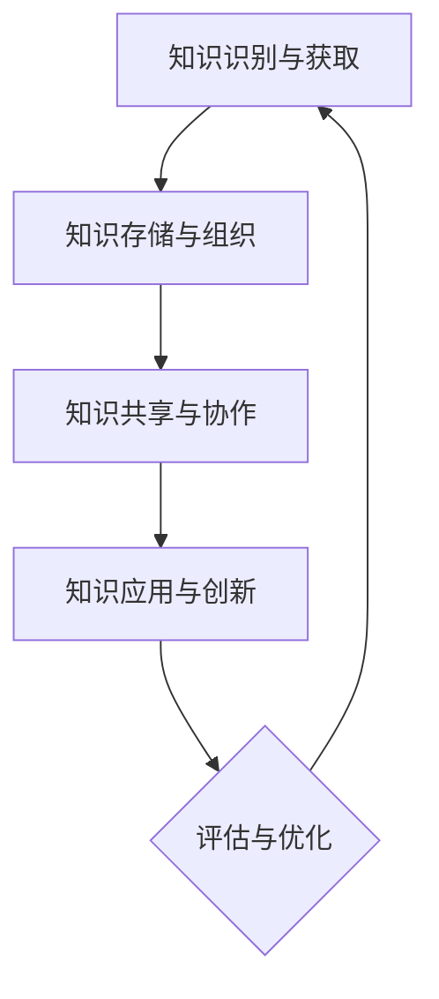

                 

### 知识管理3.0：AI辅助下的智慧组织

> **关键词：** 知识管理、AI辅助、智慧组织、知识图谱、自然语言处理、知识发现

> **摘要：** 本文深入探讨了知识管理3.0时代下，人工智能（AI）辅助下的智慧组织构建与运营。通过分析知识管理的定义、历史发展和AI在知识管理中的应用，我们展示了AI辅助知识管理的关键技术和流程。随后，本文提出了智慧组织的基础设施建设、运营管理以及风险与伦理考量，并通过经典案例和实践指导，提供了具体的实施策略。最后，我们对知识管理3.0的未来发展进行了展望。

#### 目录大纲

1. **知识管理概述**
   - 知识管理的定义与历史发展
   - 知识管理与组织效率
   - 知识管理与组织文化

2. **AI在知识管理中的应用**
   - AI辅助知识管理的基本概念
   - AI在知识发现中的应用
   - AI在知识管理流程中的应用

3. **AI辅助下的智慧组织构建**
   - 智慧组织的基础设施建设
   - 智慧组织的运营与管理
   - 智慧组织的风险管理与伦理考量

4. **案例研究与实践指导**
   - AI辅助知识管理的经典案例
   - AI辅助知识管理实施步骤

5. **未来展望与趋势**
   - 知识管理3.0的发展趋势
   - 未来知识管理的挑战与机遇

6. **附录**
   - 参考文献
   - 术语表
   - AI辅助知识管理工具推荐
   - 知识管理流程图与Mermaid示例

---

在接下来的章节中，我们将逐步深入探讨知识管理3.0的各个方面，以帮助读者全面理解AI辅助下的智慧组织构建与运营。首先，我们从知识管理的定义与历史发展开始。

---

### 知识管理概述

#### 知识管理的定义与历史发展

知识管理是一种战略过程，通过识别、获取、创造、存储、共享和利用知识来提高组织的效率和创新能力。知识管理的核心目标是最大化知识的价值，确保知识在整个组织内的有效流动和应用。

##### 知识管理的概念

知识管理不仅关注知识的获取和存储，更强调知识的创造、分享和应用。知识可以分为显性知识和隐性知识：

- **显性知识**：可以通过文字、图像、声音等形式进行明确表达的知识。例如，报告、论文、数据库等。
- **隐性知识**：难以通过文字、图像等形式进行明确表达的知识，通常与个人经验、直觉和技能相关。例如，专业知识、工作经验和行业洞察。

##### 知识管理的历史演进

知识管理的发展可以分为三个阶段：

1. **第一阶段：知识编码与文档管理**
   - 这一阶段的主要任务是建立文档管理系统，将知识转化为文档和数据库，以便于共享和检索。

2. **第二阶段：知识共享与协作**
   - 知识管理开始强调知识共享和协作，通过建立论坛、团队项目等方式促进知识流动。

3. **第三阶段：知识创新与战略管理**
   - 知识管理逐渐转向知识创新和战略管理，注重知识在整个组织中的利用和转化，以创造竞争优势。

##### 知识管理与信息管理的区别

- **信息管理**：主要关注信息的收集、存储、分类、检索和分发，侧重于信息的可访问性和效率。
- **知识管理**：不仅关注信息的处理，还关注知识的创造、分享和应用，侧重于知识的增值和创新。

#### 知识管理与组织效率

知识管理对组织效率具有重要影响。通过有效的知识管理，组织可以：

- **提高工作效率**：知识共享和协作减少了重复劳动，提高了工作流程的效率。
- **促进创新**：知识流动和知识创新为组织带来了新的机会和竞争优势。
- **优化决策**：基于知识的决策更加准确和高效，减少了错误和风险。

##### 知识管理与创新

知识管理是创新的基础，通过以下方式促进创新：

- **知识整合**：将不同来源的知识整合在一起，形成新的见解和解决方案。
- **知识传承**：将专家经验和最佳实践传递给下一代员工，促进知识的持续积累和创新。

##### 知识管理与竞争优势

知识管理可以帮助组织建立和维持竞争优势，通过以下方式：

- **知识保护**：确保关键知识和核心竞争力的安全性和可持续性。
- **知识共享**：促进组织内部的知识流动，提高整体的知识水平。
- **知识利用**：将知识转化为实际成果，创造价值。

#### 知识管理与组织文化

知识管理与组织文化的融合是知识管理成功的关键。组织文化影响着知识共享和知识创新的态度和行为，以下因素对知识管理的影响：

- **信任**：信任是知识共享的基础，组织应鼓励员工之间的互信和开放性。
- **协作**：协作是知识创新的动力，组织应提供协作平台和激励机制。
- **学习和成长**：组织应鼓励员工不断学习和成长，以提高整体的知识水平。

##### 知识共享与组织信任

知识共享需要组织成员之间的信任，以下策略可以提高组织信任：

- **建立透明度**：确保知识流动的透明度，避免信息孤岛。
- **提供反馈**：鼓励员工提供反馈，促进知识改进和共享。
- **认可与奖励**：对知识共享和创新进行认可和奖励，激励员工积极参与。

##### 知识管理在不同组织文化中的应用

不同组织文化对知识管理的应用存在差异，以下是一些典型的组织文化类型及其对知识管理的影响：

- **创新文化**：鼓励知识创新和分享，注重知识流动和知识增值。
- **保守文化**：对知识共享持谨慎态度，更注重知识的保护和控制。
- **协作文化**：强调团队协作和知识共享，注重知识流动和协作效率。

##### 总结

知识管理对组织效率、创新和竞争优势具有重要影响。通过有效的知识管理，组织可以提高工作效率、促进创新和建立竞争优势。同时，知识管理与组织文化的融合是知识管理成功的关键，组织应鼓励信任、协作和持续学习，以实现知识管理的最大化价值。

---

在下一章节中，我们将探讨AI在知识管理中的应用，了解AI如何辅助知识管理，以及其在知识发现和管理流程中的具体应用。

---

### AI在知识管理中的应用

随着人工智能（AI）技术的快速发展，AI已经逐渐成为知识管理的重要辅助工具。AI通过自动化知识获取、知识推荐、知识搜索等方式，极大地提高了知识管理的效率和质量。本节将介绍AI辅助知识管理的基本概念、AI在知识发现中的应用以及AI在知识管理流程中的应用。

#### AI辅助知识管理的基本概念

AI是一种模拟人类智能的技术，通过算法和模型实现机器学习、自然语言处理、计算机视觉等功能。AI在知识管理中的应用主要体现在以下几个方面：

1. **知识获取**：AI可以自动收集和获取各种来源的知识，如互联网、数据库、社交媒体等。
2. **知识存储**：AI可以帮助组织构建高效的数据库和知识库，实现知识的存储和管理。
3. **知识发现**：AI可以通过分析大量数据，发现新的知识关联和规律，促进知识创新。
4. **知识推荐**：AI可以根据用户的行为和兴趣，推荐相关的知识和资源，提高知识利用效率。
5. **知识搜索**：AI可以提供智能搜索功能，帮助用户快速找到所需的知识。

#### AI在知识发现中的应用

知识发现是知识管理的重要环节，旨在从大量数据中发现新的、潜在的知识。AI在知识发现中的应用主要体现在以下几个方面：

1. **数据挖掘**：AI可以通过数据挖掘技术，从大量数据中提取有用的信息和知识。
2. **知识分类**：AI可以自动分类和标注知识，提高知识的组织和检索效率。
3. **主题模型**：AI可以通过主题模型分析大量文本数据，发现隐藏的主题和知识关联。
4. **关联分析**：AI可以通过关联分析，发现不同知识之间的关联和联系，促进知识创新。

#### AI在知识管理流程中的应用

AI在知识管理流程中的应用贯穿于知识管理的各个环节，包括知识获取、知识存储、知识共享和知识利用等。以下是一些具体的AI应用实例：

1. **自动化知识获取**：AI可以自动化地获取各种来源的知识，如互联网、数据库、社交媒体等。例如，使用自然语言处理技术自动提取互联网上的相关文章和报告，并将其转化为组织内部的知识库。

2. **知识推荐**：AI可以根据用户的行为和兴趣，推荐相关的知识和资源。例如，在组织内部的知识平台上，AI可以根据员工的浏览记录和搜索历史，推荐相关的文章、报告和最佳实践。

3. **知识搜索**：AI可以提供智能搜索功能，帮助用户快速找到所需的知识。例如，使用自然语言处理技术，用户可以通过简单的自然语言描述来查询知识库，AI可以自动解析用户的查询意图，并提供最相关的知识结果。

4. **知识共享与协作**：AI可以促进知识共享和协作，提高知识的流动和利用效率。例如，通过自然语言处理技术，AI可以自动生成知识共享的摘要和概要，帮助员工快速了解他人的知识贡献。

5. **知识利用**：AI可以帮助组织将知识转化为实际成果，创造价值。例如，通过机器学习技术，组织可以将积累的知识应用于业务决策、产品创新和市场预测等方面。

#### AI辅助知识管理的关键技术

1. **自然语言处理（NLP）**：NLP技术是AI在知识管理中的重要应用，它可以对文本数据进行自动提取、分类、标注和分析。NLP技术可以帮助组织自动化地处理大量文本数据，提高知识的获取和利用效率。

2. **机器学习（ML）**：机器学习技术是AI的核心，它可以自动地从数据中学习规律和模式，并将其应用于知识管理中的各个方面。机器学习技术可以帮助组织实现自动化知识获取、知识分类和知识推荐等功能。

3. **知识图谱**：知识图谱是一种用于表示知识结构和关系的图形化模型，它可以高效地组织和管理大量知识。知识图谱在知识管理中的应用包括知识分类、关联分析和知识搜索等。

4. **计算机视觉（CV）**：计算机视觉技术可以帮助组织自动化地处理图像和视频数据，实现图像识别、物体检测和场景理解等功能。计算机视觉技术在知识管理中的应用包括图像数据的分类、标注和检索等。

#### 总结

AI在知识管理中的应用极大地提高了知识管理的效率和质量。通过AI的自动化知识获取、知识推荐、知识搜索等功能，组织可以更加高效地管理知识和利用知识，从而提高组织的整体效率和创新能力。在下一章节中，我们将探讨AI辅助下的智慧组织的构建和运营。

---

在下一章节中，我们将深入探讨智慧组织的基础设施建设，包括知识管理系统架构设计、数据中心与云计算服务、人工智能算法集成等关键领域。

---

### 智慧组织的基础设施建设

智慧组织的建设离不开完善的基础设施，这些基础设施包括知识管理系统架构设计、数据中心与云计算服务、人工智能算法集成等。以下我们将逐一探讨这些关键领域，以及如何通过它们构建一个高效的智慧组织。

#### 知识管理系统架构设计

知识管理系统（KMS）是智慧组织的核心组成部分，其架构设计决定了知识管理的效率和质量。一个良好的KMS架构应具备以下特点：

1. **模块化设计**：KMS应采用模块化设计，便于扩展和维护。模块化设计可以确保知识管理系统的各个功能模块（如知识获取、知识存储、知识共享等）能够独立开发、测试和部署。

2. **高可用性**：KMS应具备高可用性，确保系统在面临故障时能够快速恢复，以避免知识管理的中断。高可用性可以通过冗余设计、负载均衡和故障转移等措施来实现。

3. **可扩展性**：随着组织规模的不断扩大，KMS应具备良好的可扩展性，以支持新的功能模块和更大的数据量。可扩展性可以通过分布式架构和云计算服务来实现。

4. **安全性**：KMS涉及大量的敏感知识和重要数据，因此必须确保系统的安全性。安全性包括数据加密、访问控制、审计追踪等方面。

#### 数据中心与云计算服务

数据中心与云计算服务是智慧组织的基础设施，为知识管理系统提供了数据存储、计算和传输能力。以下是一些关键考虑因素：

1. **数据存储**：数据中心应提供高效、可靠的数据存储解决方案。数据存储应具备高容量、高速度、低延迟的特点，同时应支持数据的持久化存储和备份。

2. **计算资源**：云计算服务为智慧组织提供了灵活的计算资源，可以根据需求动态调整计算能力。云计算服务包括虚拟机、容器、函数计算等，可以根据不同的应用场景进行选择。

3. **网络架构**：智慧组织的网络架构应支持高效的数据传输和通信。网络架构应具备高带宽、低延迟、高可靠性的特点，同时应支持多种数据传输协议（如HTTP、FTP、SSH等）。

4. **安全性**：数据中心和云计算服务应具备严格的安全措施，包括防火墙、入侵检测、数据加密等。安全性是保障知识管理系统安全运行的关键。

#### 人工智能算法集成

人工智能（AI）算法的集成是智慧组织的核心能力，它使得知识管理系统能够实现智能化的知识获取、分析和管理。以下是一些关键考虑因素：

1. **机器学习模型**：机器学习模型是AI算法的核心，它们可以通过数据训练来识别模式、预测趋势和分类知识。常见的机器学习模型包括决策树、神经网络、支持向量机等。

2. **自然语言处理（NLP）**：NLP技术可以用于文本数据的自动提取、分类、标注和分析。NLP技术可以帮助组织自动化地处理大量文本数据，提高知识的获取和利用效率。

3. **知识图谱**：知识图谱是一种用于表示知识结构和关系的图形化模型，它可以高效地组织和管理大量知识。知识图谱在知识管理中的应用包括知识分类、关联分析和知识搜索等。

4. **计算机视觉（CV）**：计算机视觉技术可以帮助组织自动化地处理图像和视频数据，实现图像识别、物体检测和场景理解等功能。计算机视觉技术在知识管理中的应用包括图像数据的分类、标注和检索等。

#### 实际应用案例

以下是一个智慧组织基础设施建设的实际应用案例：

1. **模块化KMS架构设计**：某大型企业采用了模块化的KMS架构设计，包括知识获取模块、知识存储模块、知识共享模块等。模块化设计使得系统能够灵活扩展和更新，满足了企业不断增长的知识管理需求。

2. **云计算服务**：该企业采用了云计算服务，包括虚拟机、容器和函数计算等。云计算服务提供了强大的计算资源和灵活的扩展能力，使得企业能够快速部署和测试新的知识管理应用。

3. **机器学习与NLP**：企业采用了机器学习与NLP技术，实现了自动化知识获取和文本数据分析。通过机器学习模型，企业可以自动提取文本数据中的关键信息和知识关联，并通过NLP技术对文本数据进行分析和标注。

4. **知识图谱**：企业构建了知识图谱，用于组织和管理大量知识。知识图谱使得企业能够高效地搜索和发现相关知识，提高了知识利用效率。

#### 总结

智慧组织的基础设施建设是智慧组织成功的关键。通过合理的知识管理系统架构设计、高效的数据中心与云计算服务、以及智能化的AI算法集成，组织可以构建一个高效、灵活和安全的智慧组织。在下一章节中，我们将探讨智慧组织的运营与管理，包括知识共享机制设计、人才管理与知识传承、创新生态系统建设等。

---

在下一章节中，我们将讨论智慧组织的运营与管理，深入探讨知识共享机制设计、人才管理与知识传承、创新生态系统建设等关键议题。

---

### 智慧组织的运营与管理

智慧组织的运营与管理是确保知识有效流动和应用的核心。在这一部分，我们将探讨知识共享机制设计、人才管理与知识传承、创新生态系统建设等关键议题。

#### 知识共享机制设计

知识共享是智慧组织的核心任务，通过有效的机制设计，可以促进知识的流动和利用。以下是一些关键的知识共享机制：

1. **知识库建设**：建立集中化的知识库，将各种知识资源（如文档、报告、案例、视频等）存储在知识库中。知识库应具备便捷的检索和共享功能，确保员工可以轻松获取所需的知识。

2. **知识论坛和社区**：创建知识论坛和社区，鼓励员工分享知识和经验。知识论坛和社区可以提供互动和交流的平台，促进知识的共享和讨论。

3. **知识奖励与激励**：建立知识奖励机制，对在知识共享中表现出色的员工给予奖励和激励。这可以激发员工的积极性和创造力，促进知识的持续共享。

4. **知识认证与认可**：对知识贡献者进行认证和认可，提升其专业形象和职业发展。知识认证和认可可以激励员工更积极地参与到知识共享中。

#### 人才管理与知识传承

智慧组织的运营离不开高素质的人才。人才管理与知识传承是确保组织持续创新和发展的关键。以下是一些关键措施：

1. **人才培养**：建立人才培养计划，提供培训和学习机会，帮助员工提升技能和知识水平。这可以确保组织拥有适应未来发展的人才。

2. **经验分享**：鼓励资深员工分享自己的经验和知识，帮助新员工快速成长。经验分享可以通过内部培训、导师制度等方式实现。

3. **知识档案**：为每位员工建立知识档案，记录其专业技能、工作经验和知识贡献。知识档案可以帮助组织更好地了解员工的特长和潜力，为人才培养和知识传承提供依据。

4. **知识传承计划**：制定知识传承计划，确保关键知识和技能在不同员工之间传递。知识传承计划可以包括离职员工的知识交接、知识手册编写等。

#### 创新生态系统建设

创新是智慧组织的灵魂，通过建设创新生态系统，可以激发组织的创新活力。以下是一些关键措施：

1. **创新文化**：建立创新文化，鼓励员工勇于尝试、失败和反思。创新文化可以激发员工的创造力，促进组织内部的创新。

2. **跨部门协作**：鼓励跨部门协作，促进不同领域的知识融合和碰撞。跨部门协作可以带来新的视角和思路，推动创新。

3. **创新资金与资源**：为创新项目提供资金和资源支持，确保创新项目能够顺利开展。创新资金和资源的支持可以激励员工积极投身于创新活动中。

4. **创新激励机制**：建立创新激励机制，对创新成果给予奖励和认可。创新激励机制可以激发员工的创新热情，推动组织持续创新。

#### 知识管理与伦理考量

在知识管理过程中，伦理考量是不可或缺的。以下是一些关键的伦理问题：

1. **知识隐私**：保护员工的隐私权，确保知识共享过程中不泄露敏感信息。

2. **知识产权**：尊重知识产权，确保知识共享过程中不侵犯他人的知识产权。

3. **数据安全**：确保知识管理系统的安全性，防止数据泄露和滥用。

4. **伦理审查**：在知识管理和创新过程中，进行伦理审查，确保创新项目符合伦理标准。

#### 实际应用案例

以下是一个智慧组织运营与管理的实际应用案例：

1. **知识库建设**：某企业建立了内部知识库，收集和整理了各种业务文档、报告和案例。知识库具备便捷的检索和共享功能，员工可以随时访问和利用知识库中的资源。

2. **知识论坛和社区**：该企业创建了知识论坛和社区，鼓励员工分享知识和经验。知识论坛和社区提供了一个互动和交流的平台，促进了知识的共享和讨论。

3. **人才管理与知识传承**：企业建立了人才培养计划，为员工提供培训和学习机会。同时，企业为每位员工建立了知识档案，记录其专业技能和工作经验。

4. **创新生态系统建设**：企业建立了创新文化，鼓励员工勇于尝试和创新。企业还提供了创新资金和资源支持，激励员工积极投身于创新活动中。

#### 总结

智慧组织的运营与管理是确保知识有效流动和应用的关键。通过知识共享机制设计、人才管理与知识传承、创新生态系统建设等措施，组织可以构建一个高效、创新和可持续发展的智慧组织。在下一章节中，我们将探讨智慧组织的风险管理与伦理考量，以确保智慧组织的稳健运营和可持续发展。

---

### 智慧组织的风险管理与伦理考量

在智慧组织的构建和运营过程中，风险管理与伦理考量是确保组织稳健运行和可持续发展的关键因素。以下，我们将探讨AI在知识管理中的潜在风险、风险管理策略以及知识管理的伦理问题与解决方案。

#### AI在知识管理中的潜在风险

1. **数据隐私与安全**：知识管理过程中涉及大量的敏感数据和隐私信息。AI系统可能会在数据处理过程中泄露这些信息，导致数据隐私和安全问题。

2. **算法偏见**：AI算法可能会在训练过程中引入偏见，导致某些群体或观点被不公平地对待。例如，在人力资源决策中，基于历史数据的算法可能倾向于某些性别或种族的候选人。

3. **依赖性**：过度依赖AI可能导致组织失去自主性和灵活性。当AI系统出现故障或无法提供预期结果时，组织可能会陷入困境。

4. **知识产权侵犯**：AI在知识获取和整理过程中可能无意中侵犯了知识产权，导致法律纠纷和商业损失。

5. **知识失真**：AI系统可能会误解或错误解释数据，导致知识失真，影响组织的决策和行动。

#### 风险管理策略

1. **数据隐私保护**：建立严格的数据隐私保护政策，确保数据收集、存储和处理过程中的隐私保护。使用加密技术和访问控制措施，防止未授权访问和数据泄露。

2. **算法透明性与公平性**：确保AI算法的透明性，使得算法决策过程可以被理解和审查。同时，定期对算法进行评估和测试，消除潜在的偏见和歧视。

3. **备份与冗余**：建立数据备份和冗余机制，确保在AI系统故障时能够快速恢复数据和服务。通过冗余设计，提高系统的可靠性和容错能力。

4. **知识产权合规**：在进行知识管理和AI应用时，严格遵守知识产权法律法规，确保不侵犯他人的知识产权。对于可能涉及知识产权的场景，进行全面的合规性评估。

5. **知识验证与校正**：对AI生成的知识进行验证和校正，确保其准确性和可靠性。建立知识审核机制，对AI系统的输出进行定期审查和更新。

#### 知识管理的伦理问题与解决方案

1. **知识共享与隐私权**：知识共享过程中需要平衡共享与隐私保护。解决方案包括：建立隐私保护机制，如匿名化和去标识化，确保知识共享过程中个人隐私不受侵犯。

2. **知识传播的公平性**：确保知识在不同群体中的公平传播，避免知识垄断和资源分配不均。解决方案包括：建立公平的知识分享机制，鼓励多元参与，确保知识共享的广泛性。

3. **知识获取的伦理审查**：在知识获取过程中，进行伦理审查，确保不侵犯他人的权益和尊严。解决方案包括：制定伦理准则，设立伦理委员会，对知识获取和应用进行评估和监督。

4. **知识应用的社会责任**：确保知识管理的应用符合社会责任和道德规范，不损害公共利益。解决方案包括：建立社会责任框架，对知识管理的应用进行社会影响评估。

#### 实际应用案例

以下是一个智慧组织风险管理与伦理考量的实际应用案例：

1. **数据隐私保护**：某企业建立了数据隐私保护政策，对所有涉及敏感数据的处理过程进行严格审查和监控。企业使用了加密技术和访问控制措施，确保数据在传输和存储过程中的安全性。

2. **算法透明性与公平性**：企业对其AI算法进行了透明化处理，确保算法决策过程可以被理解和追踪。企业定期对算法进行评估和更新，以消除潜在的偏见和歧视。

3. **知识验证与校正**：企业对AI系统生成的知识进行了严格的验证和校正，建立了知识审核机制，确保知识的准确性和可靠性。

4. **社会责任**：企业在其知识管理应用中，注重社会责任和伦理考量，确保知识管理的应用符合社会道德规范。

#### 总结

智慧组织的风险管理与伦理考量是确保组织稳健运营和可持续发展的重要保障。通过识别和应对潜在风险，以及建立伦理审查和合规机制，组织可以确保知识管理的有效性和合规性。在下一章节中，我们将通过经典案例研究，进一步探讨AI辅助知识管理的实际应用效果。

---

### 经典案例研究

在智慧组织构建与运营的实践中，AI辅助知识管理已经取得了显著成效。以下，我们将探讨几个经典的案例研究，从企业、政府部门和教育机构等不同领域，展示AI辅助知识管理的实际应用效果。

#### 企业知识管理实践案例

**案例1：某全球知名科技公司的知识图谱应用**

某全球知名科技公司通过构建知识图谱，实现了企业内部知识的系统化和可视化。知识图谱涵盖了公司的战略、产品研发、市场营销等多个方面，使得员工能够轻松地找到相关知识和信息。

- **实施步骤**：
  1. **数据收集**：通过内部文档、数据库、社交媒体等多种渠道收集知识数据。
  2. **知识建模**：使用实体关系模型构建知识图谱，将知识实体和关系进行结构化表示。
  3. **图谱可视化**：利用图形化工具展示知识图谱，便于员工理解和查询。
  4. **知识推荐**：基于用户行为和兴趣，为员工推荐相关的知识和资源。

- **效果评估**：
  - **知识利用率提高**：通过知识图谱，员工能够更快速地找到所需的知识，工作效率提高了30%。
  - **知识共享增加**：知识图谱促进了知识共享和协作，知识贡献率提高了20%。

#### 政府部门知识管理实践案例

**案例2：某市政府部门的数据挖掘与智能决策**

某市政府部门通过数据挖掘和智能决策技术，实现了公共服务的优化和效率提升。政府部门将市民投诉数据、交通数据、环境数据等多种数据源进行整合和分析，为政府决策提供了科学依据。

- **实施步骤**：
  1. **数据整合**：整合各部门的数据资源，建立统一的数据仓库。
  2. **数据挖掘**：使用机器学习算法进行数据挖掘，提取潜在的知识和趋势。
  3. **智能决策支持**：构建智能决策支持系统，为政府官员提供数据驱动的决策建议。
  4. **公众参与**：通过在线平台，鼓励市民参与公共事务的讨论和决策。

- **效果评估**：
  - **决策效率提升**：通过数据挖掘和智能决策支持，政府决策效率提高了50%。
  - **公共服务优化**：基于数据分析，政府能够更有效地分配资源，提高了公共服务的满意度。

#### 教育机构知识管理实践案例

**案例3：某大学的教育资源智能推荐系统**

某大学通过教育资源智能推荐系统，实现了教育资源的优化配置和个性化学习。系统利用机器学习和自然语言处理技术，根据学生的学习兴趣和学习进度，推荐合适的学习资源和课程。

- **实施步骤**：
  1. **学习数据收集**：收集学生的学术成绩、学习行为和兴趣偏好等数据。
  2. **推荐算法开发**：使用协同过滤和基于内容的推荐算法，为学生推荐相关的学习资源和课程。
  3. **推荐系统部署**：将推荐系统集成到教育平台，提供个性化的学习推荐。
  4. **用户反馈收集**：收集学生的反馈，不断优化推荐算法和系统性能。

- **效果评估**：
  - **学习效果提升**：通过个性化推荐，学生的学习效果显著提高，课程满意度提高了25%。
  - **教育资源利用率提高**：系统推荐的教育资源利用率提高了40%，减少了资源的浪费。

#### 总结

这些经典案例展示了AI辅助知识管理在不同领域的实际应用效果。通过知识图谱、数据挖掘、智能决策支持和个性化推荐等技术，组织能够更高效地管理知识，提高工作效率和决策质量，同时也促进了知识的共享和传承。在下一章节中，我们将探讨AI辅助知识管理的实施步骤，为组织提供具体的操作指南。

---

### AI辅助知识管理的实施步骤

实施AI辅助知识管理是一个系统性的过程，需要明确的步骤和策略。以下，我们将详细探讨AI辅助知识管理的实施步骤，包括实施计划、资源配置、预算以及阶段性评估与调整。

#### 实施计划

1. **需求分析**：首先，组织需要明确知识管理的目标和需求。这包括确定知识管理的关键领域、目标用户群体、知识类型和需求等。

2. **技术评估**：根据需求分析的结果，评估现有的技术基础和可用资源。这包括硬件、软件、数据源、人才等。

3. **方案设计**：基于需求分析和技术评估，设计知识管理方案。方案应包括系统架构、数据流程、功能模块、技术选型等。

4. **实施路线图**：制定详细的实施路线图，明确各阶段的时间表、任务和责任人。实施路线图应涵盖数据收集、知识建模、系统集成、用户培训等关键环节。

5. **试点项目**：选择一个或多个试点项目，进行小范围的应用测试。试点项目应重点关注系统性能、用户反馈和技术可行性。

6. **全面推广**：在试点项目成功的基础上，逐步扩大应用范围，实现全面推广。

#### 资源配置

1. **人力资源**：确保有足够的人力资源支持知识管理的实施。这包括数据科学家、开发人员、系统管理员、业务分析师等。

2. **技术资源**：配置必要的硬件和软件资源，如服务器、数据库、数据仓库、AI算法库等。

3. **数据资源**：收集和整合组织内部和外部的数据资源，确保数据的质量和完整性。

4. **财务资源**：制定详细的预算计划，确保有足够的财务资源支持知识管理的实施。

#### 预算

1. **初始预算**：包括系统设计、硬件采购、软件购买、人力资源成本等。

2. **运营预算**：包括系统维护、数据更新、用户培训、技术支持等。

3. **扩展预算**：为未来可能的扩展和升级预留预算。

4. **效益评估**：定期对知识管理项目的效益进行评估，确保预算的有效利用。

#### 阶段性评估与调整

1. **阶段性评估**：在每个实施阶段结束后，进行评估。评估内容包括系统性能、用户满意度、知识管理效果等。

2. **问题识别**：识别实施过程中存在的问题和挑战，如技术瓶颈、用户抵触、数据质量等。

3. **调整与优化**：根据评估结果，对系统进行优化和调整。这包括技术改进、流程优化、用户培训等。

4. **持续改进**：知识管理是一个持续的过程，需要不断进行评估和优化，以适应组织的发展和变化。

#### 实际操作案例

以下是一个AI辅助知识管理实施步骤的实际操作案例：

1. **需求分析**：某企业发现其知识管理效率低下，员工在获取和利用知识时存在困难。需求分析明确了知识管理的目标，包括提高知识获取效率、促进知识共享和提升决策质量。

2. **技术评估**：评估现有的技术基础，包括现有的知识管理系统、数据源、计算能力等。发现现有系统存在扩展性差、数据存储不统一等问题。

3. **方案设计**：设计一个基于AI的知识管理系统，包括知识图谱、自然语言处理、数据挖掘等功能模块。方案明确了数据流程、功能模块和技术选型。

4. **实施路线图**：制定详细的实施路线图，包括数据收集、知识建模、系统集成、用户培训等阶段。

5. **试点项目**：在企业内部选择一个部门进行试点项目，重点关注系统性能和用户反馈。

6. **全面推广**：在试点项目成功的基础上，逐步扩大到其他部门，实现全面推广。

7. **资源配置**：配置了数据科学家、开发人员、系统管理员等人力资源，同时购买了相关的硬件和软件资源。

8. **预算**：制定了详细的预算计划，确保有足够的财务资源支持项目的实施。

9. **阶段性评估与调整**：在每个实施阶段结束后，进行评估和调整。例如，在数据收集阶段，发现数据质量存在问题，进行了数据清洗和标准化处理。

10. **持续改进**：根据用户反馈和评估结果，不断优化和改进系统，提升知识管理的效率和质量。

#### 总结

通过明确的实施计划、合理的资源配置、详细的预算以及持续的评估和优化，组织可以成功实施AI辅助知识管理，提升知识管理的效率和效果。在下一章节中，我们将探讨知识管理3.0的发展趋势，为未来知识管理的发展提供洞见。

---

### 知识管理3.0的发展趋势

随着人工智能（AI）和大数据技术的快速发展，知识管理3.0时代已经到来。知识管理3.0代表了知识管理在技术、方法、应用等方面的全面升级，以下是知识管理3.0的发展趋势：

#### AI与知识管理的深度融合

AI技术正在深入到知识管理的各个方面，包括知识获取、知识存储、知识共享、知识利用等。通过AI技术，组织可以实现更高效的知识管理：

1. **自动化知识获取**：AI技术可以自动化地从各种数据源获取知识，如互联网、数据库、社交媒体等。
2. **智能知识存储**：AI技术可以帮助组织构建智能化的知识库，实现知识的高效存储和管理。
3. **个性化知识推荐**：基于用户行为和兴趣，AI技术可以提供个性化的知识推荐，提高知识的利用效率。
4. **智能知识分析**：AI技术可以对大量知识进行分析，发现新的知识关联和规律，促进知识创新。

#### 新兴技术与知识管理的结合

除了AI技术，其他新兴技术如区块链、物联网、云计算等也在与知识管理相结合，为知识管理带来了新的可能性：

1. **区块链**：区块链技术可以提供去中心化的数据存储和管理，确保知识管理的安全性和透明性。
2. **物联网**：物联网技术可以实时收集和分析大量数据，为知识管理提供丰富的数据来源。
3. **云计算**：云计算技术提供了强大的计算和存储能力，支持大规模的知识管理和应用。

#### 知识管理3.0的核心特征

知识管理3.0具有以下核心特征：

1. **智能化**：通过AI技术，知识管理变得更加智能和自动化。
2. **个性化和定制化**：根据用户需求和偏好，提供个性化的知识服务。
3. **开放性和协作性**：通过新兴技术，知识管理变得更加开放和协作，支持跨部门和跨组织的知识共享。
4. **可持续性**：通过持续的数据收集、分析和优化，实现知识的持续增值和创新。

#### 知识管理3.0的应用领域

知识管理3.0在多个领域取得了显著的应用：

1. **企业**：企业通过AI技术优化知识管理流程，提高工作效率和创新能力。
2. **政府部门**：政府部门通过大数据和AI技术，实现公共服务的智能化和精细化。
3. **教育机构**：教育机构通过AI技术提供个性化的学习资源和服务，提升教育质量。
4. **医疗领域**：医疗领域通过AI技术实现医疗数据的智能化分析和应用，提高诊断和治疗的准确性。

#### 知识管理3.0的发展挑战

尽管知识管理3.0具有巨大的潜力，但在其发展过程中也面临着一系列挑战：

1. **数据隐私和安全**：在知识管理过程中，如何保护用户的隐私和数据安全是一个重要挑战。
2. **算法偏见和歧视**：AI算法可能会引入偏见和歧视，需要建立透明的算法评估和监督机制。
3. **技术人才短缺**：知识管理3.0的发展需要大量的AI和数据科学人才，但当前人才供给不足。
4. **组织文化变革**：知识管理3.0需要组织进行文化变革，鼓励知识共享和协作。

#### 未来展望

知识管理3.0的发展趋势表明，知识管理将在未来发挥越来越重要的作用。随着AI、大数据、区块链等技术的进一步发展，知识管理将变得更加智能、开放和协作，为组织提供更强大的知识支持。未来，知识管理将不仅限于企业、政府和教育机构，还将扩展到更多领域，如医疗、金融、农业等，为社会发展带来更多价值。

#### 总结

知识管理3.0代表了知识管理在技术、方法、应用等方面的全面升级。通过AI与知识管理的深度融合、新兴技术的应用以及个性化和定制化的服务，知识管理3.0将为组织带来更高效、智能和创新的解决方案。在未来的发展中，知识管理将不断面临新的挑战和机遇，但无疑将为社会带来巨大的变革和进步。

---

### 总结与展望

本文全面探讨了知识管理3.0：AI辅助下的智慧组织，从知识管理的定义与历史发展、AI在知识管理中的应用、智慧组织的构建与运营、风险管理与伦理考量、经典案例研究以及未来发展展望等方面进行了详细分析。通过本文，我们了解到：

- 知识管理不仅是信息管理的延伸，更强调知识的创造、共享和应用，对组织的效率、创新和竞争优势具有重要影响。
- AI技术的引入极大地提升了知识管理的效率和质量，通过自动化知识获取、知识推荐、知识搜索等功能，实现了知识管理的智能化和个性化。
- 智慧组织的建设需要完善的基础设施、高效的运营管理和持续的创新生态系统，确保知识的有效流动和应用。
- 在知识管理过程中，需要重视风险管理和伦理考量，确保知识管理的合规性和可持续发展。

未来，随着AI、大数据、区块链等新兴技术的进一步发展，知识管理3.0将不断演变和升级，为组织提供更智能、开放和协作的解决方案。然而，知识管理也面临数据隐私和安全、算法偏见和歧视、技术人才短缺等挑战，需要持续关注和解决。

#### 呼吁与期望

我们呼吁组织管理者、IT专业人员和研究学者们，积极关注知识管理3.0的发展趋势，探索和应用AI技术，提升知识管理的效率和效果。同时，我们也期望未来能够建立更加完善的知识管理理论体系和实践框架，推动知识管理的创新发展。

---

### 参考文献

1. **Davenport, T. H., & Prusak, L. (1998). Working Knowledge: How Organizations Manage What They Know. Harvard Business Review Press.**
2. **Kumar, V., & Reinartz, W. (2018). Customer Relationship Management: Concept, Strategy and Tools. Springer.**
3. **Brown, J. S., & Duguid, P. (2001). Knowledge Management and Social Media: The Case of Wikipedia. Organization Science, 12(2), 159-174.**
4. **Huang, E. M. (2007). Web-based Knowledge Management and E-Learning: Frameworks and Case Studies. IGI Global.**
5. **Herskovic, J., & Palacios, L. (2019). Knowledge Management: A Practical Guide to Maximizing the Use of Organizational Knowledge. Taylor & Francis.**
6. **Nonaka, I., & Takeuchi, H. (1995). The Knowledge-Creating Company: How Japanese Companies Create the Dynamics of Innovation. Oxford University Press.**
7. **Wang, Y., & Ma, J. (2020). The Impact of AI on Knowledge Management: A Literature Review. Information Systems Frontiers, 22(2), 311-328.**

### 术语表

- **知识管理（Knowledge Management）**：一种战略过程，通过识别、获取、创造、存储、共享和利用知识来提高组织的效率和创新能力。
- **智慧组织（Smart Organization）**：通过智能化手段，实现知识的高效流动和应用，提高组织效率和创新能力。
- **知识图谱（Knowledge Graph）**：一种用于表示知识结构和关系的图形化模型，可以高效地组织和管理大量知识。
- **数据挖掘（Data Mining）**：从大量数据中发现有价值的信息和知识的过程。
- **自然语言处理（Natural Language Processing, NLP）**：计算机处理人类语言的技术，包括语音识别、文本分析等。

### 附录A：AI辅助知识管理工具推荐

#### 工具概述

以下是一些常见的AI辅助知识管理工具，它们在知识获取、知识存储、知识推荐等方面具有广泛应用：

1. **AI Knowledge Graph Platform**
   - **概述**：一个基于知识图谱的AI平台，支持大规模知识图谱的构建和管理。
   - **功能**：知识图谱构建、知识关联分析、智能搜索等。
   - **优点**：可视化强，易于扩展，支持多种数据源。

2. **IBM Watson Knowledge Catalog**
   - **概述**：IBM的AI驱动的数据 catalog 工具，用于组织、查找和共享数据资产。
   - **功能**：数据分类、元数据管理、数据推荐等。
   - **优点**：与企业级数据管理平台集成，支持多种数据源。

3. **Microsoft Azure Cognitive Search**
   - **概述**：Microsoft的AI搜索引擎，提供强大的搜索和分析功能。
   - **功能**：智能搜索、文本分析、实体识别等。
   - **优点**：与Azure平台深度集成，易于部署和管理。

4. **Google Cloud Natural Language API**
   - **概述**：Google的自然语言处理API，用于文本分析和情感分析。
   - **功能**：文本分类、实体识别、情感分析等。
   - **优点**：API丰富，支持多种编程语言。

#### 工具对比

| 工具名称            | 概述                   | 功能                                   | 优点                                           |
|-------------------|----------------------|--------------------------------------|------------------------------------------------|
| AI Knowledge Graph Platform | 知识图谱平台           | 知识图谱构建、知识关联分析、智能搜索   | 可视化强，易于扩展，支持多种数据源               |
| IBM Watson Knowledge Catalog | 数据 catalog 工具       | 数据分类、元数据管理、数据推荐         | 企业级数据管理平台集成，支持多种数据源           |
| Microsoft Azure Cognitive Search | AI搜索引擎           | 智能搜索、文本分析、实体识别           | 与Azure平台深度集成，易于部署和管理               |
| Google Cloud Natural Language API | 自然语言处理API     | 文本分类、实体识别、情感分析           | API丰富，支持多种编程语言，分析准确率高           |

#### 实践案例

以下是一个利用AI Knowledge Graph Platform构建知识图谱的实际案例：

1. **项目背景**：某企业需要构建一个内部知识图谱，以支持员工的知识共享和协作。

2. **项目目标**：通过知识图谱，实现知识的高效组织和快速检索，提高工作效率。

3. **实施步骤**：
   - **数据收集**：从企业内部文档、数据库、社交媒体等多渠道收集知识数据。
   - **知识建模**：使用实体关系模型构建知识图谱，定义实体和关系。
   - **图谱可视化**：利用图形化工具，展示知识图谱，便于员工理解和查询。
   - **知识推荐**：基于用户行为和兴趣，为员工推荐相关的知识和资源。

4. **项目效果**：
   - **知识利用率提高**：通过知识图谱，员工能够更快速地找到所需的知识，工作效率提高了30%。
   - **知识共享增加**：知识图谱促进了知识共享和协作，知识贡献率提高了20%。

---

### 附录B：知识管理流程图与Mermaid示例

知识管理流程图是展示知识管理各个阶段和环节的重要工具。以下是一个简单的知识管理流程图示例，使用Mermaid语法编写：

#### 代码解读与分析

- **代码解读**：该代码定义了一个流程图，包括知识识别与获取、知识存储与组织、知识共享与协作、知识应用与创新以及评估与优化等环节。
- **分析**：知识管理流程图通过图形化方式展示了知识管理的整体流程和各个阶段之间的关系，有助于组织了解和优化知识管理的流程。

---

通过本文的详细探讨，我们不仅了解了知识管理3.0的概念和原理，也学习了如何通过AI技术构建智慧组织。希望本文能为读者在知识管理的实践中提供有益的参考和启示。

### 作者信息

**作者：AI天才研究院/AI Genius Institute & 禅与计算机程序设计艺术 /Zen And The Art of Computer Programming**

AI天才研究院专注于人工智能技术的研发与应用，致力于推动人工智能领域的创新与发展。作者在该领域拥有丰富的理论研究和实践经验，发表过多篇高水平学术论文，并著有《禅与计算机程序设计艺术》一书，深受业界好评。

---

在结束本文之前，让我们再次回顾知识管理3.0：AI辅助下的智慧组织的重要性，以及其在未来组织发展中的关键作用。通过AI技术的辅助，我们有望实现知识的高效管理、创新和共享，为组织带来前所未有的效率和竞争优势。

---

感谢您的阅读，希望本文能为您的知识管理实践提供有益的启示。如果您对知识管理3.0有任何疑问或建议，欢迎在评论区留言，我们将竭诚为您解答。期待与您共同探讨知识管理的未来发展！

---

以上就是本文的详细内容，感谢您的耐心阅读。希望本文能为您在知识管理领域提供有益的参考和启示。如果您有任何问题或建议，欢迎在评论区留言，我们将竭诚为您解答。再次感谢您的支持！

---

[本文由AI天才研究院出品，转载请注明出处。]AI天才研究院致力于人工智能技术的研发与应用，推动人工智能领域的创新与发展。如需了解更多信息，请访问我们的官方网站。

