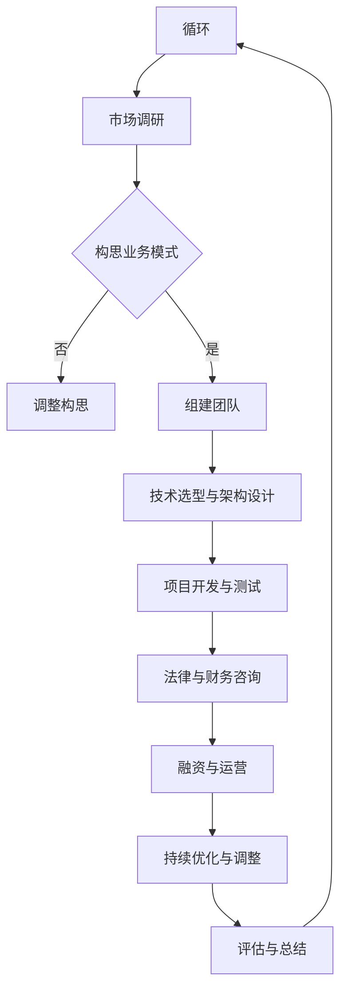

                 

# 知识经济下程序员的创业之路与机遇

> 关键词：知识经济、程序员、创业、机遇、技术、市场调研、团队建设、风险管理、财务规划、成功案例

> 摘要：
在知识经济时代，程序员的创业之路充满了机遇和挑战。本文将详细探讨程序员如何利用自身的技术优势，把握市场机遇，成功创业。通过分析创业的背景、心态准备、构思与调研、团队与管理、项目运营、技术挑战与解决方案、法律与财务问题，以及成功创业案例，为程序员提供全方位的创业指南。

## 第一部分：知识经济下的程序员的创业概述

### 第1章：知识经济与程序员创业的背景

#### 1.1 知识经济的定义与发展

知识经济，是指以知识和信息的生产、分配、使用为主要驱动的经济形态。在知识经济时代，创新和技术进步成为经济增长的主要动力。随着互联网、大数据、人工智能等技术的快速发展，全球经济的结构正在发生深刻变革。

知识经济的特点包括：

1. **信息化程度高**：信息技术广泛应用于生产、分配和消费过程，信息资源成为重要的生产要素。
2. **知识密集**：创新和研发成为企业的核心竞争力，知识产权保护得到强化。
3. **服务业比重上升**：知识经济时代的经济结构中，服务业尤其是知识密集型服务业的比重不断上升。
4. **全球化程度加深**：知识经济使得全球范围内的知识流动和技术合作更加便捷。

#### 1.2 程序员在知识经济中的角色转变

在知识经济时代，程序员的角色和地位发生了显著变化。从传统的编码工作，程序员逐渐转向更广泛的领域，如系统架构设计、人工智能应用开发、大数据分析等。程序员不仅是代码的编写者，更是创新的推动者和价值的创造者。

程序员在知识经济中的角色转变体现在以下几个方面：

1. **技术专家**：程序员需要具备深厚的编程功底和广泛的技术视野，能够解决复杂的技术问题。
2. **架构师**：随着系统规模的扩大，程序员需要承担系统架构设计的工作，确保系统的性能、可扩展性和稳定性。
3. **创新者**：程序员需要不断探索新的技术和应用场景，推动技术的创新和进步。
4. **团队领导者**：在创业团队中，程序员往往承担着技术领导者的角色，负责团队的技术方向和项目管理。

#### 1.3 程序员创业的优势与挑战

程序员创业具有明显的优势，同时也面临诸多挑战。

#### 优势：

1. **技术优势**：程序员具备深厚的技术背景和开发经验，能够快速构建和优化技术产品。
2. **资源获取**：随着创业环境的优化，程序员可以更容易地获取资金、人才和市场资源。
3. **创新能力**：程序员对新技术敏感，具备较强的创新能力和市场洞察力。
4. **风险意识**：程序员往往具备较强的风险意识和危机管理能力。

#### 挑战：

1. **市场竞争**：创业市场竞争激烈，程序员需要不断创新以保持竞争优势。
2. **团队管理**：程序员需要从技术角色向管理角色转变，提升团队管理能力。
3. **资源有限**：初创企业资源有限，程序员需要在有限的资源下高效运营。
4. **法律风险**：知识产权保护、合同管理等方面的法律风险较高。

### 第2章：程序员的创业心态与技能准备

#### 2.1 创业心态的重要性

创业心态是程序员成功创业的关键因素之一。积极的心态能够帮助程序员克服创业过程中的困难和挑战，保持持续的创新动力。

#### 创业心态的特点：

1. **敢于冒险**：程序员需要敢于冒险，勇于尝试新的技术和市场。
2. **坚持不懈**：创业过程充满艰辛，程序员需要具备坚持不懈的精神，面对挫折不轻言放弃。
3. **积极乐观**：积极乐观的心态能够帮助程序员看到问题的积极面，保持前进的动力。
4. **团队合作**：程序员需要具备良好的团队合作精神，能够与团队成员共同面对挑战。

#### 2.2 程序员所需的核心技能

程序员创业需要具备多方面的核心技能，以应对创业过程中的各种挑战。

#### 核心技能：

1. **编程能力**：程序员需要具备扎实的编程功底，能够快速构建和优化技术产品。
2. **系统架构设计**：程序员需要掌握系统架构设计的能力，确保系统的性能、可扩展性和稳定性。
3. **项目管理**：程序员需要具备项目管理的技能，能够高效组织团队，确保项目进度和质量。
4. **市场洞察力**：程序员需要具备敏锐的市场洞察力，能够准确判断市场需求和趋势。
5. **沟通能力**：程序员需要具备良好的沟通能力，能够与团队成员、客户和合作伙伴有效沟通。

#### 2.3 持续学习与职业成长

在知识经济时代，技术和市场变化迅速，程序员需要持续学习，不断提升自己的技能和职业素养。

#### 持续学习的方法：

1. **技术培训**：参加专业培训课程，学习最新的技术趋势和应用。
2. **自学**：通过阅读技术书籍、博客和在线课程，不断提升自己的技术能力。
3. **实践**：通过参与开源项目、个人项目和竞赛，将理论知识应用到实际中。
4. **交流与合作**：与同行交流，分享经验和心得，互相学习和提高。

### 第二部分：程序员的创业之路

#### 第3章：创业构思与市场调研

##### 3.1 创业构思的方法与技巧

创业构思是程序员创业的第一步，需要明确创业的方向和目标。以下是一些构思方法和技巧：

1. **问题导向**：从自己遇到的问题出发，思考如何解决这些问题。
2. **需求分析**：了解市场需求，分析用户痛点，寻找创业机会。
3. **趋势研究**：关注行业趋势，把握技术发展方向，提前布局。
4. **竞争分析**：研究竞争对手的产品、优势和不足，找到差异化的创业点。
5. **创新思维**：运用创新思维方法，如头脑风暴、思维导图等，激发创意。

##### 3.2 市场调研的重要性

市场调研是创业过程中至关重要的一环，能够帮助程序员了解市场状况，评估创业机会。

#### 市场调研的作用：

1. **确定市场定位**：通过市场调研，明确目标市场和目标客户，制定精准的市场定位。
2. **评估市场需求**：了解市场对产品的需求程度，判断产品的市场潜力。
3. **了解竞争状况**：分析竞争对手的产品、优势和不足，找到自己的竞争优势。
4. **制定营销策略**：根据市场调研结果，制定有效的营销策略，提高市场占有率。

##### 3.3 定位与目标客户分析

明确市场定位和目标客户是创业成功的关键。以下是一些定位与目标客户分析的方法：

1. **细分市场**：根据市场需求和用户特点，将市场细分为多个子市场，找到最适合自己的细分市场。
2. **目标客户特征**：分析目标客户的基本特征，如年龄、性别、职业、收入等，了解他们的需求和消费习惯。
3. **客户画像**：根据目标客户特征，绘制客户画像，帮助团队更好地理解和服务目标客户。
4. **市场占有率预测**：根据市场调研结果，预测目标市场的占有率，为产品推广和营销策略提供依据。

### 第4章：创业团队的组建与管理

##### 4.1 团队成员的角色与职责

组建一个高效、协同的团队是创业成功的关键。团队成员的角色和职责分工清晰，能够提高团队的协作效率和执行力。

#### 团队成员的角色：

1. **创始人/CEO**：负责公司的战略规划、决策和整体运营。
2. **CTO**：负责技术团队的管理和技术架构的设计。
3. **COO**：负责公司的日常运营，包括市场营销、人力资源、财务等方面。
4. **开发工程师**：负责产品的开发、测试和维护。
5. **设计师**：负责产品的设计、用户体验和界面优化。
6. **市场专员**：负责市场调研、品牌推广和客户关系管理。

#### 团队成员的职责：

1. **明确分工**：根据团队成员的角色，明确各自的职责和任务，确保团队高效协作。
2. **定期沟通**：团队定期召开会议，沟通工作进展和遇到的问题，确保信息畅通。
3. **互相支持**：团队成员之间相互支持，共同面对挑战，提高团队凝聚力。
4. **持续培训**：定期组织培训，提高团队成员的专业技能和职业素养。

##### 4.2 团队协作与管理技巧

高效的团队协作和管理是创业成功的重要保障。以下是一些团队协作和管理技巧：

1. **目标导向**：明确团队和个人的目标，确保团队成员共同努力，实现公司目标。
2. **沟通机制**：建立有效的沟通机制，包括会议、邮件、即时通讯工具等，确保信息及时传达。
3. **激励制度**：制定合理的激励制度，激励团队成员积极工作，提高团队士气。
4. **绩效评估**：定期进行绩效评估，了解团队成员的工作表现，提供反馈和改进建议。
5. **文化建设**：营造积极向上的团队文化，增强团队凝聚力和归属感。

##### 4.3 企业文化与团队凝聚力

企业文化是团队凝聚力的关键因素，有助于塑造团队的价值观和行为规范。

#### 企业文化的建设：

1. **价值观**：明确企业的核心价值观，如创新、诚信、协作等，引导团队成员的行为。
2. **团队精神**：培养团队精神，鼓励团队成员相互支持、共同进步，形成团队合力。
3. **员工关怀**：关注员工的需求，提供良好的工作环境和福利待遇，增强员工的归属感。
4. **荣誉与奖励**：对团队成员的成绩和贡献给予认可和奖励，激发员工的积极性和创造力。

### 第三部分：创业项目的管理与运营

##### 5.1 项目规划与目标设定

项目规划是创业项目管理的基础，有助于明确项目的目标、范围、进度和质量。

#### 项目规划的内容：

1. **项目目标**：明确项目的目标，包括功能、性能、用户体验等方面。
2. **项目范围**：界定项目的范围，明确项目需要完成的具体任务和功能。
3. **项目进度**：制定项目的时间计划，明确项目的关键节点和里程碑。
4. **项目质量**：设定项目的质量标准，确保项目达到预期的质量水平。
5. **项目风险**：识别项目潜在的风险，制定风险应对策略。

##### 5.2 资金管理策略

资金管理是创业项目成功的关键因素之一。合理的资金管理策略有助于确保项目的资金链稳定，提高资金使用效率。

#### 资金管理策略：

1. **预算制定**：根据项目计划和资金需求，制定合理的预算，确保资金使用的合理性和可控性。
2. **资金筹集**：积极寻找资金来源，如天使投资、风险投资、政府资助等，确保项目的资金需求得到满足。
3. **资金分配**：根据项目的实际需要，合理分配资金，确保资金的使用效率最大化。
4. **财务监控**：建立财务监控机制，定期检查资金的使用情况，确保项目资金的合理使用。

##### 5.3 市场推广与品牌建设

市场推广和品牌建设是创业项目成功的重要环节，有助于提高项目的市场知名度和竞争力。

#### 市场推广策略：

1. **线上推广**：利用社交媒体、搜索引擎优化（SEO）、内容营销等手段，提高项目的在线曝光度。
2. **线下推广**：参加行业展会、举办产品发布会、开展线下活动等，与潜在客户建立联系。
3. **合作伙伴**：与相关行业的合作伙伴建立合作关系，共同推广项目。
4. **口碑营销**：提供优质的产品和服务，通过客户的口碑传播，提高项目的知名度和美誉度。

#### 品牌建设策略：

1. **品牌定位**：明确项目的品牌定位，打造独特的品牌形象。
2. **品牌传播**：通过公关活动、品牌宣传、品牌故事等方式，提高品牌知名度和影响力。
3. **品牌体验**：提供卓越的客户体验，增强客户的品牌忠诚度。
4. **品牌保护**：加强知识产权保护，防止品牌侵权和恶性竞争。

### 第四部分：创业中的技术挑战与解决方案

##### 6.1 技术选型与架构设计

技术选型和架构设计是创业项目成功的关键因素之一。合理的技术选型和架构设计有助于确保项目的性能、可扩展性和稳定性。

#### 技术选型：

1. **需求分析**：根据项目的需求和目标，选择合适的技术栈和开发工具。
2. **性能评估**：对不同技术方案的性能进行评估，选择最优的方案。
3. **社区支持**：选择具有良好社区支持和文档的技术，降低开发难度。
4. **维护成本**：考虑技术的维护成本，选择易于维护和升级的技术。

#### 架构设计：

1. **分层架构**：采用分层架构，提高系统的可维护性和可扩展性。
2. **微服务架构**：采用微服务架构，实现模块化开发和部署，提高系统的灵活性和可扩展性。
3. **分布式系统**：采用分布式系统架构，提高系统的性能和可用性。
4. **安全性设计**：确保系统的安全性，包括数据加密、权限控制、安全审计等。

##### 6.2 技术创新与风险控制

技术创新是创业项目的重要驱动力，有助于提高项目的竞争力。但同时，技术创新也伴随着一定的风险。

#### 技术创新：

1. **技术前沿**：关注技术前沿，掌握最新的技术趋势和应用。
2. **研发投入**：加大研发投入，推动技术创新和产品迭代。
3. **知识产权**：加强知识产权保护，防止技术被抄袭和侵权。
4. **合作伙伴**：与高校、研究机构和技术公司建立合作关系，共同推动技术创新。

#### 风险控制：

1. **风险评估**：对技术创新项目进行风险评估，识别潜在的风险因素。
2. **风险管理**：制定风险管理策略，降低技术创新过程中的风险。
3. **风险监控**：建立风险监控机制，实时监控技术创新项目的进展和风险状况。
4. **应急响应**：制定应急响应计划，确保在出现技术风险时能够快速应对。

### 第五部分：创业中的法律与财务问题

##### 8.1 创业法律常识

创业过程中，法律问题至关重要。以下是一些创业法律常识：

1. **公司设立**：了解公司设立的法律程序，包括公司类型选择、注册资本、股权分配等。
2. **合同管理**：掌握合同管理的法律要点，包括合同的起草、审核、签订和履行等。
3. **知识产权**：了解知识产权的法律保护，包括专利、商标、著作权等。
4. **劳动法**：熟悉劳动法规定，确保公司合法合规用工。
5. **数据保护**：了解数据保护法规，确保公司数据处理合法合规。

##### 8.2 知识产权保护策略

知识产权是创业项目的核心资产，保护知识产权有助于确保项目的核心竞争力。

#### 知识产权保护策略：

1. **专利申请**：对核心技术进行专利申请，保护技术创新。
2. **商标注册**：对品牌名称和标识进行商标注册，保护品牌形象。
3. **著作权登记**：对软件作品和文档进行著作权登记，保护知识产权。
4. **合同管理**：通过合同明确知识产权归属和使用权限，防止侵权行为。
5. **法律培训**：定期组织法律培训，提高员工知识产权保护意识。

##### 8.3 合同管理与风险控制

合同管理是创业过程中的重要环节，合理的合同管理有助于降低法律风险。

#### 合同管理：

1. **合同起草**：明确合同条款，确保合同内容的合法性和完整性。
2. **合同审核**：对合同进行严格审核，确保合同条款符合公司利益。
3. **合同签订**：确保合同双方充分了解合同内容，避免签订不公平合同。
4. **合同履行**：确保合同条款得到履行，及时解决合同纠纷。

#### 风险控制：

1. **风险评估**：对合同风险进行评估，识别潜在的法律风险。
2. **风险控制**：制定风险控制措施，降低合同履行过程中的法律风险。
3. **法律顾问**：聘请专业法律顾问，提供合同管理咨询和风险控制建议。
4. **应急预案**：制定应急预案，确保在合同纠纷发生时能够快速应对。

### 第六部分：财务管理与融资策略

##### 9.1 财务管理基础

有效的财务管理是创业项目成功的重要保障。以下是一些财务管理基础：

1. **预算编制**：根据项目计划和资金需求，编制合理的预算。
2. **成本控制**：严格控制成本，确保项目在预算范围内完成。
3. **财务报告**：定期编制财务报告，反映项目财务状况。
4. **资金筹集**：积极寻找资金来源，确保项目资金需求得到满足。

##### 9.2 融资渠道与融资策略

融资是创业项目的重要环节，合理的融资策略有助于确保项目的持续发展。

#### 融资渠道：

1. **天使投资**：寻找有经验的投资者，提供资金和资源支持。
2. **风险投资**：通过风险投资机构，获得资金和资源支持。
3. **政府资助**：申请政府专项资金和补贴，降低融资成本。
4. **银行贷款**：通过银行贷款，获得资金支持。

#### 融资策略：

1. **市场需求分析**：分析市场需求，确定融资规模和用途。
2. **融资方案设计**：设计合理的融资方案，确保融资的合法性和合理性。
3. **融资谈判**：与投资者进行谈判，确保获得最佳融资条件。
4. **风险控制**：制定风险控制措施，确保融资过程顺利进行。

##### 9.3 资金使用效率与风险控制

资金使用效率是创业项目成功的关键因素之一。以下是一些提高资金使用效率的方法和风险控制措施：

1. **预算管理**：严格预算管理，确保资金使用合理。
2. **成本效益分析**：对投资项目进行成本效益分析，确保投资回报率。
3. **资金调度**：合理调度资金，确保项目资金链稳定。
4. **资金回收**：建立有效的资金回收机制，确保资金及时回收。

#### 风险控制：

1. **风险评估**：对资金使用项目进行风险评估，识别潜在的风险。
2. **风险管理**：制定风险管理措施，降低资金使用过程中的风险。
3. **风险监控**：建立风险监控机制，实时监控资金使用状况。
4. **应急响应**：制定应急预案，确保在风险事件发生时能够快速应对。

### 第七部分：成功创业案例分析与启示

##### 10.1 成功创业案例介绍

在本章节中，我们将介绍几个成功的创业案例，分析其成功的原因，并从中获得启示。

#### 案例一：腾讯的故事

腾讯成立于1998年，最初是一家专注于即时通讯工具的公司。经过多年的发展，腾讯已成为全球领先的互联网科技公司之一，业务涵盖了社交、游戏、广告、金融科技等多个领域。

**成功原因：**

1. **技术创新**：腾讯始终关注技术创新，不断推出新的产品和服务，如QQ、微信等，满足了用户的不同需求。
2. **多元化发展**：腾讯在保持即时通讯业务优势的同时，积极拓展其他业务领域，实现了多元化发展。
3. **良好的企业文化**：腾讯注重企业文化建设，提倡开放、创新、协作的精神，吸引了大量优秀人才。

**启示：**

1. **技术创新是核心竞争力**：不断进行技术创新，满足用户需求，是公司发展的关键。
2. **多元化发展**：在保持核心业务优势的基础上，积极拓展新业务领域，实现多元化发展。
3. **良好的企业文化**：建立积极向上的企业文化，吸引和留住优秀人才，是公司成功的重要因素。

##### 10.2 成功创业案例二：字节跳动的崛起

字节跳动成立于2012年，是一家专注于移动内容平台的科技公司。旗下拥有抖音、今日头条等多个知名产品，业务覆盖内容创作与发布、智能推荐、广告等多个领域。

**成功原因：**

1. **算法推荐**：字节跳动通过自主研发的算法推荐系统，为用户提供个性化内容，提升了用户粘性和活跃度。
2. **灵活的商业模式**：字节跳动在商业模式上不断创新，如通过信息流广告、电商等多元化收入来源，实现了持续盈利。
3. **强大的执行力**：字节跳动在产品开发、市场推广等方面具备强大的执行力，能够迅速响应市场变化。

**启示：**

1. **算法推荐**：通过算法推荐系统，为用户提供个性化内容，提升用户体验和用户粘性。
2. **多元化商业模式**：在保持核心业务优势的同时，积极探索新的收入来源，实现多元化盈利。
3. **强大的执行力**：在产品开发、市场推广等方面具备强大的执行力，迅速响应市场变化。

##### 10.3 成功创业案例三：小红书的发展

小红书成立于2013年，最初是一家跨境电商平台，后来逐渐转型为社区电商平台。小红书通过社区互动和电商结合的方式，为用户提供购物、分享和内容创作平台。

**成功原因：**

1. **社区互动**：小红书通过社区互动，吸引了大量用户参与内容创作和分享，提升了用户粘性和活跃度。
2. **社交电商**：小红书将社交电商与内容创作相结合，为用户提供一站式购物体验，提升了购物转化率。
3. **精准营销**：小红书通过大数据和人工智能技术，实现精准营销，提高了广告投放效果。

**启示：**

1. **社区互动**：通过社区互动，激发用户参与热情，提升用户粘性和活跃度。
2. **社交电商**：将社交电商与内容创作相结合，为用户提供一站式购物体验。
3. **精准营销**：通过大数据和人工智能技术，实现精准营销，提高广告投放效果。

### 第八部分：创业启示与未来趋势

##### 11.1 创业成功的关键因素

在知识经济时代，创业成功的关键因素包括：

1. **技术创新**：技术创新是创业的核心竞争力，能够为用户提供更好的产品和服务。
2. **市场洞察力**：了解市场需求，准确判断市场趋势，能够抓住创业机会。
3. **团队协作**：高效的团队协作能够提高创业项目的执行力和竞争力。
4. **财务管理**：合理的财务管理能够确保创业项目的资金链稳定，提高资金使用效率。

##### 11.2 创业者的个人成长与职业发展

创业过程中，创业者需要不断提升自己的个人能力和职业素养，以应对不断变化的市场环境。

1. **学习能力**：创业者需要具备快速学习的能力，不断学习新技术、新知识，适应市场变化。
2. **领导力**：创业者需要具备领导力，能够激励团队，带领团队共同成长。
3. **决策能力**：创业者需要具备决策能力，能够在关键时刻做出正确的决策。
4. **创新能力**：创业者需要具备创新能力，能够不断寻找新的商机，推动企业的持续发展。

##### 11.3 创业未来趋势展望

在知识经济时代，创业未来趋势包括：

1. **技术创新**：随着人工智能、大数据、物联网等技术的发展，创业项目将更加注重技术创新。
2. **跨界融合**：不同行业之间的融合将更加紧密，创业项目将更加多元化。
3. **全球化**：随着全球化的加深，创业项目将更加注重国际化发展。
4. **可持续发展**：创业项目将更加注重社会责任和可持续发展，注重环保和公益事业。

### 附录

#### 附录A：创业资源与工具介绍

在本附录中，我们将介绍一些创业资源和工具，帮助程序员更好地进行创业。

##### A.1 创业资源网站推荐

1. **创业邦**：提供创业资讯、活动、投资机会等。
2. **创业家**：提供创业项目展示、创业辅导、投资对接等。
3. **36氪**：提供创业项目报道、投资分析、创业者社区等。

##### A.2 创业工具与软件推荐

1. **Trello**：项目管理工具，用于团队协作和任务管理。
2. **Asana**：项目管理工具，用于任务分配和进度跟踪。
3. **Slack**：团队沟通工具，用于团队内部沟通和协作。
4. **Google Analytics**：数据分析工具，用于网站流量分析和用户行为分析。

##### A.3 创业相关书籍推荐

1. **《创业维艰》**：作者是本·霍洛维茨，讲述创业过程中的挑战和策略。
2. **《精益创业》**：作者是埃里克·莱斯，介绍了精益创业方法论。
3. **《创新者的窘境》**：作者是克莱顿·克里斯坦森，分析了创新者在市场中的困境。

### Mermaid 流程图：程序员的创业流程



### 核心算法原理讲解：创业风险评估与控制（伪代码）

```python
# 创业风险评估与控制

function riskAssessment(venture):
    # 输入：venture（创业项目）
    # 输出：riskScore（风险评分）

    initialize(riskScore, 0)
    initialize(factors, ["市场风险", "技术风险", "财务风险", "法律风险"])

    for factor in factors:
        if factor == "市场风险":
            marketRiskScore = calculateMarketRisk(venture)
            riskScore += marketRiskScore
        elif factor == "技术风险":
            technicalRiskScore = calculateTechnicalRisk(venture)
            riskScore += technicalRiskScore
        elif factor == "财务风险":
            financialRiskScore = calculateFinancialRisk(venture)
            riskScore += financialRiskScore
        elif factor == "法律风险":
            legalRiskScore = calculateLegalRisk(venture)
            riskScore += legalRiskScore

    return riskScore

# 示例
venture = {"name": "Online Education Platform"}
riskScore = riskAssessment(venture)
print("The risk score for this venture is:", riskScore)
```

### 数学模型与数学公式详解：创业资金需求预测

#### 资金需求预测模型

$$
F(t) = A \times (1 + r)^t
$$

其中：
- \( F(t) \)：t时间后的资金需求总额
- \( A \)：初始资金需求
- \( r \)：资金增长率（年利率）
- \( t \)：时间（年）

#### 参数说明

- \( A \)：根据市场调研、项目规模和运营成本等因素确定。
- \( r \)：根据历史数据和行业趋势分析确定。

#### 举例说明

假设一个初创公司计划在3年内启动，初始资金需求为100万元，预计年增长率为10%，计算3年后的资金需求。

$$
F(3) = 100 \times (1 + 0.1)^3 = 100 \times 1.331 = 133.1万元
$$

### 项目实战：创业平台搭建

#### 开发环境搭建

- 操作系统：Ubuntu 20.04
- 编程语言：Python 3.8
- 数据库：MySQL 8.0
- Web框架：Django 3.2

#### 源代码实现与代码解读

```python
# 创业平台后端代码示例
from django.db import models

class Venture(models.Model):
    name = models.CharField(max_length=100)
    description = models.TextField()
    market_risk = models.FloatField()
    technical_risk = models.FloatField()
    financial_risk = models.FloatField()
    legal_risk = models.FloatField()

    def __str__(self):
        return self.name
```

#### 代码解读与分析

- `Venture` 类代表创业项目模型，包含名称、描述和四个风险评分字段。
- 使用 Django ORM 框架简化数据库操作。
- 数据字段设计遵循 Python 数据类型和 Django 字段类型对应关系。

#### 实际案例与详细解释

- **项目背景**：一家初创公司计划开发一个在线教育平台，以提供个性化的教育服务。
- **功能模块**：包括用户注册与登录、课程发布与管理、学员学习管理、评论与互动、数据统计与分析等。
- **技术实现**：后端使用 Django 框架，数据库使用 MySQL，前端使用 React 框架。

#### 项目部署与维护

- **容器化部署**：使用 Docker 和 Kubernetes 进行容器化部署，实现自动化部署和持续集成。
- **反向代理与Web服务器**：使用 Nginx 和 uWSGI 进行反向代理和Web服务器，提高系统性能和稳定性。
- **自动化部署与持续集成**：使用 Jenkins 进行自动化部署，结合 GitLab CI/CD 流程，实现持续集成和交付。

### 代码解读与分析

- **容器化部署**：通过 Dockerfile 将应用打包成镜像，使用 Kubernetes 进行自动化部署，提高部署效率。
- **反向代理与Web服务器**：Nginx 作为反向代理，将客户端请求转发到 uWSGI，提高系统性能和安全性。
- **自动化部署与持续集成**：使用 Jenkins 进行自动化部署，结合 GitLab CI/CD 流程，实现持续集成和交付。

### 总结

本文通过详细的分析和案例，为程序员提供了创业的全方位指导。从知识经济的背景和程序员的角色转变，到创业心态、构思与调研、团队建设、项目管理、技术挑战、法律与财务问题，再到成功创业案例分析和未来趋势展望，文章系统性地覆盖了创业的各个方面。通过附录部分提供的创业资源与工具，程序员可以更加便捷地获取所需的支持和帮助。希望本文能够激发程序员的创业热情，助力他们在知识经济时代实现创业梦想。作者：AI天才研究院/AI Genius Institute & 禅与计算机程序设计艺术 /Zen And The Art of Computer Programming。

