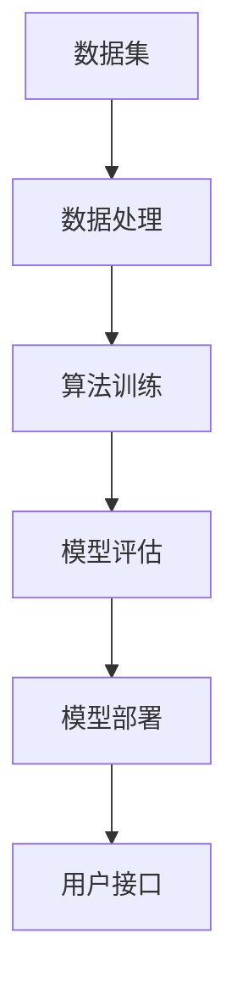
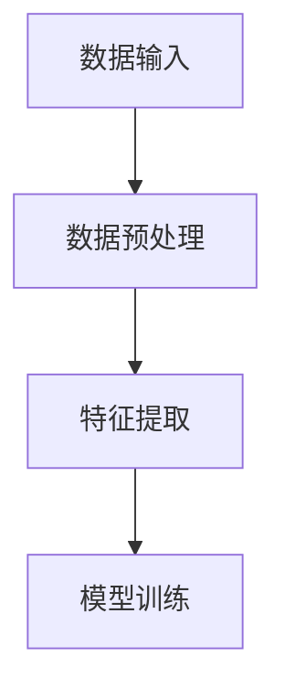
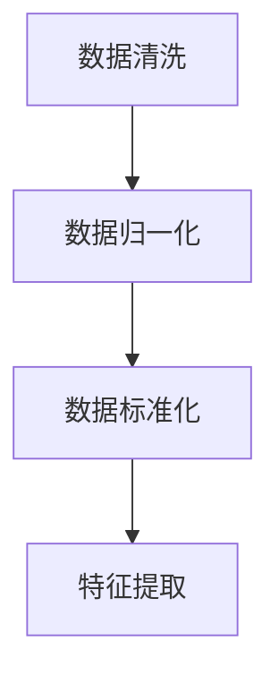
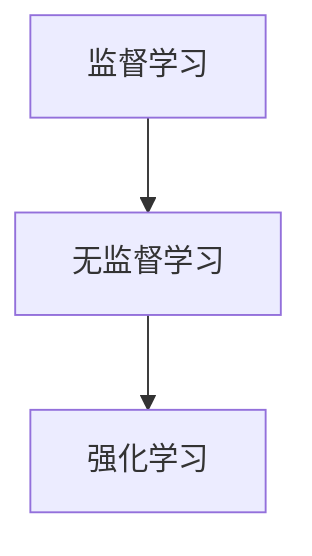
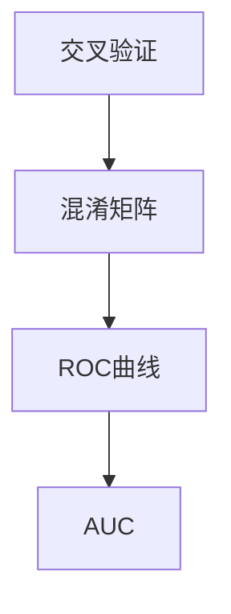
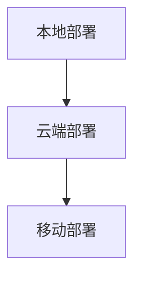
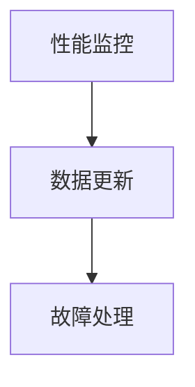

                 

### 引言

在当今快速发展的科技时代，人工智能（AI）已经成为推动社会进步的重要力量。AI系统在多个领域展现了其强大的功能和潜力，包括金融、医疗、自动驾驶、智能家居等。然而，随着AI技术的广泛应用，确保AI系统的透明度和可靠性成为了不可忽视的重要问题。

**透明度**是指AI系统的决策过程、算法和工作机制可以被用户理解和解释的程度。一个透明的AI系统有助于提升用户的信任度，降低对技术的担忧。同时，透明度也有助于研究人员和技术专家发现和修正系统中的错误，从而提高系统的整体质量。

**可靠性**是指AI系统在特定条件下能够稳定、准确地执行任务的能力。一个可靠的AI系统不仅能够提供高质量的输出，还能够抵御各种异常情况和外部干扰，确保系统的持续运行。

本文将围绕确保AI系统透明度和可靠性展开讨论。首先，我们将介绍AI系统的基本概念、发展历程和组成，以及透明度和可靠性的定义和重要性。接着，我们将探讨算法的透明性和可解释性，介绍相关的概念、方法和工具。随后，我们将讨论AI系统的测试与验证方法，以及风险管理和安全性的相关内容。最后，我们将通过实际案例研究，展示确保AI系统透明度和可靠性的最佳实践，并总结全文。

通过本文的探讨，我们希望为读者提供一套完整的思路和方法，帮助他们在AI系统的开发、部署和使用过程中，确保系统的透明度和可靠性。这不仅有助于提升用户对AI技术的信任，也有助于推动AI技术的健康和可持续发展。

---

**关键词**：人工智能（AI），透明度，可靠性，算法，可解释性，测试与验证，风险管理，安全性

**摘要**：本文深入探讨了确保人工智能系统透明度和可靠性的方法。通过介绍AI系统的基础概念、透明度和可靠性的定义，以及算法的透明性与可解释性，本文为读者提供了全面的指导和实际案例。文章还详细讨论了AI系统的测试与验证、风险管理与安全性，并通过具体案例展示了最佳实践。最终，本文总结了确保AI系统透明度和可靠性的关键要素，为AI技术的应用提供了有力支持。

---

## 《确保AI系统透明度和可靠性的方法》目录大纲

### 第一部分：AI系统概述与透明度

- **第1章：AI系统概述**
  - **1.1 AI系统的基础概念**
  - **1.2 AI系统的发展与趋势**
  - **1.3 AI系统的组成与工作原理**

- **第2章：AI系统透明度的核心概念**
  - **2.1 透明度的定义与重要性**
  - **2.2 透明度与隐私保护的关系**
  - **2.3 透明度的挑战与机遇**

### 第二部分：确保AI系统可靠性的方法

- **第3章：算法的透明性与可解释性**
  - **3.1 可解释性AI的核心概念**
  - **3.2 可解释性AI的方法与工具**
  - **3.3 可解释性AI在实际应用中的挑战与解决方案**

- **第4章：AI系统的测试与验证**
  - **4.1 AI测试的基本概念**
  - **4.2 测试策略与测试用例设计**
  - **4.3 AI系统的验证方法与流程**

- **第5章：AI系统的风险管理与安全**
  - **5.1 AI系统风险的分类与识别**
  - **5.2 风险评估与应对策略**
  - **5.3 AI系统的安全性与隐私保护**

### 第三部分：案例研究与最佳实践

- **第6章：确保AI系统透明度和可靠性的案例研究**
  - **6.1 案例一：金融领域的AI系统**
  - **6.2 案例二：医疗健康领域的AI系统**
  - **6.3 案例三：自动驾驶领域的AI系统**

- **第7章：确保AI系统透明度和可靠性的最佳实践**
  - **7.1 制定透明度和可靠性标准**
  - **7.2 建立持续改进机制**
  - **7.3 促进AI系统的透明度和可靠性教育**

### 附录：资源与工具

- **附录A：相关资源与工具**
  - **A.1 开源工具与框架**
  - **A.2 学术论文与研究报告**
  - **A.3 AI系统透明度和可靠性的标准与规范**

---

## 第1章：AI系统概述

### 1.1 AI系统的基础概念

人工智能（Artificial Intelligence，简称AI）是指通过计算机模拟人类智能的行为和能力的科学和技术。AI系统通常由以下几个核心组成部分构成：

1. **数据集**：AI系统的训练基础。数据集的质量和数量直接影响AI系统的性能和准确性。
2. **算法**：用于处理数据和生成模型的数学公式和逻辑规则。常见的AI算法包括机器学习、深度学习和神经网络。
3. **计算能力**：AI系统运行所需的计算资源，包括CPU、GPU和FPGA等硬件。
4. **接口**：用户与AI系统交互的界面，如命令行、图形用户界面（GUI）等。

**AI系统的定义**可以用以下数学公式表示：

\[ AI = \text{机器学习} + \text{数据} + \text{算法} + \text{计算能力} \]

### 1.2 AI系统的发展与趋势

AI技术的发展历程可以追溯到20世纪50年代。当时，人工智能的概念首次被提出，旨在模拟人类的思维过程。随着时间的推移，AI技术经历了多个发展阶段：

- **1950年代**：人工智能的概念提出，早期的研究主要集中在规则推理和知识表示上。
- **1980年代**：专家系统的兴起，通过模拟人类专家的决策过程来解决特定领域的问题。
- **1990年代**：机器学习成为AI研究的主流，特别是基于统计模型的机器学习方法。
- **2000年代**：深度学习的兴起，通过多层神经网络进行复杂模式识别，取得了显著的突破。
- **2010年代至今**：随着计算能力和数据资源的不断提升，AI技术开始广泛应用于各个领域，包括自动驾驶、语音识别、自然语言处理等。

当前，AI系统的发展趋势主要表现为：

- **自动化**：AI系统逐渐从特定任务的处理转向更加广泛的自动化任务。
- **智能化**：AI系统开始具备更多自主学习和决策的能力。
- **泛在化**：AI技术开始渗透到人们日常生活的各个方面，如智能家居、智能医疗等。

### 1.3 AI系统的组成与工作原理

AI系统的组成和工作原理可以简化为以下几个步骤：

1. **数据收集**：从各种来源收集大量数据，包括结构化和非结构化数据。
2. **数据处理**：对收集到的数据进行清洗、预处理和特征提取，为模型训练做好准备。
3. **模型训练**：使用机器学习算法，根据预处理后的数据训练模型，模型质量直接影响AI系统的性能。
4. **模型评估**：使用验证数据集对训练好的模型进行评估，确保模型具有较好的准确性和泛化能力。
5. **模型部署**：将经过评估的模型部署到实际应用场景中，如自动驾驶车辆、医疗诊断系统等。

**AI系统的工作原理**可以概括为以下数学模型：

\[ 输入数据 \xrightarrow{\text{数据处理}} 特征数据 \xrightarrow{\text{模型训练}} 模型参数 \xrightarrow{\text{模型评估}} 预测结果 \]

通过这个过程，AI系统可以从大量数据中学习到有用的规律和模式，并在新的数据输入时进行预测和决策。

### 总结

在本章中，我们介绍了AI系统的基本概念、发展历程和组成，以及AI系统的工作原理。理解这些基本概念和原理，是深入探讨AI系统透明度和可靠性的基础。在接下来的章节中，我们将进一步探讨AI系统的透明度和可靠性，以及如何确保这些关键特性的实现。

---

### 1.1 AI系统的基础概念

AI系统的基础概念是理解其复杂性和广泛应用的关键。首先，我们需要明确AI系统的定义。AI系统，简而言之，是指通过计算机模拟人类智能，实现特定任务自动执行的技术体系。这种系统通常由以下几个核心组成部分构成：

1. **数据集**：数据是AI系统的生命之源。一个高质量的、多样化的数据集是训练出高效AI模型的基础。数据集可以是结构化的（如数据库中的表格）或非结构化的（如图像、文本和音频）。数据的质量直接影响AI模型的性能和准确性。为了提高数据质量，通常需要进行数据清洗、去重和标准化处理。

2. **算法**：算法是AI系统的核心，用于处理数据和生成模型。常见的AI算法包括机器学习（Machine Learning，ML）、深度学习（Deep Learning，DL）和神经网络（Neural Networks，NN）等。每种算法都有其独特的原理和适用场景。例如，机器学习算法通常基于统计学方法，通过数据训练得到预测模型；深度学习算法则通过多层神经网络模拟人类大脑的学习过程，能够处理更加复杂的问题。

3. **计算能力**：AI系统运行所需的计算资源是确保其高效性的重要因素。随着AI技术的快速发展，对计算资源的需求也在不断增加。GPU（图形处理单元）和TPU（张量处理单元）等专用硬件设备，提供了强大的并行计算能力，使得AI系统在短时间内处理海量数据成为可能。

4. **接口**：接口是用户与AI系统交互的媒介。一个良好的接口能够提升用户体验，使得复杂的AI系统变得易于使用。常见的接口形式包括命令行、图形用户界面（GUI）和应用程序接口（API）等。

下面，我们将使用Mermaid流程图来展示AI系统的基本架构：

在图中，数据集经过数据处理后用于算法训练，训练出的模型通过评估后部署到实际应用中，并通过用户接口与用户进行交互。

**数据集**是AI系统的起点，数据的质量和多样性直接决定了AI系统的表现。高质量的数据应具备以下特点：

- **准确性**：数据应真实反映现实情况，避免错误和噪声。
- **完整性**：数据应完整无缺，避免缺失值。
- **代表性**：数据应具有广泛的代表性，能够涵盖各种可能的情况。

**算法**是AI系统的核心，用于从数据中学习模式和规律。常见的机器学习算法包括：

- **监督学习**：通过已知输入输出数据，学习映射关系。
- **无监督学习**：在没有已知输出数据的情况下，发现数据中的结构和模式。
- **强化学习**：通过与环境互动，学习最优策略。

**计算能力**是AI系统高效运行的基础。随着深度学习技术的发展，对计算资源的需求也在不断增加。以下几种硬件设备在AI系统中发挥了重要作用：

- **CPU**：传统的中央处理器，适用于通用计算任务。
- **GPU**：图形处理单元，适用于并行计算和深度学习。
- **TPU**：张量处理单元，专门为深度学习设计。

**接口**是用户与AI系统交互的桥梁，一个良好的接口能够提升用户体验。常见的接口形式包括：

- **命令行界面**：适用于技术专家和开发者，通过命令行与系统进行交互。
- **图形用户界面**：适用于普通用户，通过图形界面进行操作。
- **API**：应用程序接口，用于程序之间的通信和数据交换。

通过上述基本概念的了解，我们可以更深入地理解AI系统的运作机制，为后续章节探讨AI系统的透明度和可靠性打下基础。

### 1.2 AI系统的发展与趋势

AI系统的发展历程可以追溯到20世纪50年代，当时人工智能的概念首次被提出。最初，人工智能主要集中在规则推理和知识表示上，目标是模拟人类专家的决策过程。然而，由于计算能力和算法的限制，早期的人工智能研究进展缓慢。

进入20世纪80年代，专家系统的兴起标志着人工智能进入了一个新的阶段。专家系统通过模拟人类专家的决策过程，在特定领域内取得了显著的成功。然而，专家系统存在一个明显的局限：它们依赖于大量手工编写的规则，缺乏自学习和适应能力。

1990年代，机器学习开始成为人工智能研究的主流。机器学习通过从数据中学习模式和规律，实现了更加自动化和智能化的决策过程。特别是统计学习方法的兴起，使得机器学习算法在处理复杂数据集时表现出了优越的性能。

2000年代，深度学习的兴起再次推动了人工智能的发展。深度学习通过多层神经网络模拟人类大脑的学习过程，能够在图像识别、自然语言处理和语音识别等领域取得突破性的成果。深度学习的成功不仅得益于计算能力的提升，还在于新的算法和优化技术的应用。

2010年代至今，随着计算能力和数据资源的不断提升，AI技术开始广泛应用于各个领域。自动驾驶、智能医疗、金融科技和智能家居等领域的AI应用层出不穷。AI技术正在从实验室走向实际应用，成为推动社会进步的重要力量。

当前，AI系统的发展趋势主要表现为以下几个方面：

1. **自动化**：AI系统逐渐从特定任务的处理转向更加广泛的自动化任务。例如，自动驾驶技术正在逐步实现完全自动化，智能家居系统可以通过语音指令控制家庭设备。

2. **智能化**：AI系统开始具备更多自主学习和决策的能力。例如，智能助手可以通过分析用户的行为和习惯，提供个性化的建议和服务。

3. **泛在化**：AI技术正在渗透到人们日常生活的各个方面。从智能手机到智能手表，从智能音箱到智能安防系统，AI技术正在改变人们的日常生活。

4. **合作化**：AI系统与其他技术的结合，例如物联网（IoT）和大数据，使得AI系统能够更加智能和高效地处理复杂任务。例如，智能工厂通过将AI系统与物联网技术相结合，实现了生产过程的自动化和智能化。

5. **透明化**：随着人们对AI系统的透明度和可解释性要求的提高，AI系统的透明化成为了重要的发展趋势。通过可解释性AI技术，用户可以更好地理解AI系统的决策过程，从而提高对AI系统的信任度。

6. **伦理化**：随着AI技术的广泛应用，伦理问题也日益凸显。AI系统的开发和部署需要遵循伦理原则，确保技术不会对人类社会造成负面影响。

总之，AI系统的发展正处于一个快速变革和创新的阶段。随着技术的不断进步和应用场景的不断扩展，AI系统将在未来发挥更加重要的作用，推动社会向着更加智能、高效和可持续的方向发展。

### 1.3 AI系统的组成与工作原理

AI系统的组成和工作原理是理解和应用这些系统的关键。一个典型的AI系统由多个核心部分组成，每个部分在系统中扮演着特定的角色。

#### 数据输入

数据输入是AI系统的起点。高质量的数据集是训练AI模型的基础。数据来源可以包括公开的数据集、企业内部的数据、社交媒体数据等。数据类型可以是结构化的（如表格数据），也可以是非结构化的（如图像、文本和语音）。数据预处理是数据输入的重要环节，包括数据清洗、数据归一化、缺失值处理和特征提取等步骤。

**Mermaid流程图**：

#### 数据预处理

数据预处理是确保数据质量的关键步骤。它包括以下几个方面：

- **数据清洗**：去除噪声和错误的数据，处理缺失值。
- **数据归一化**：将不同数据范围的数据统一到一个标准范围内，便于模型训练。
- **数据标准化**：将数据转换成相同的比例，消除量纲影响。
- **特征提取**：从原始数据中提取出对模型训练有用的特征。

**Mermaid流程图**：

#### 模型训练

模型训练是AI系统的核心环节。在这个阶段，AI系统通过学习输入数据和相应的标签（如果存在），生成一个能够预测或分类数据的模型。常见的机器学习算法包括：

- **监督学习**：使用已标记的数据进行训练，预测模型的输出。
- **无监督学习**：在没有标记数据的情况下，发现数据中的结构和模式。
- **强化学习**：通过与环境的交互学习最优策略。

**Mermaid流程图**：

#### 模型评估

模型评估是确保AI系统性能的重要步骤。评估方法通常包括：

- **交叉验证**：将数据集分成多个部分，每个部分轮流作为验证集，评估模型在不同数据集上的性能。
- **混淆矩阵**：展示模型预测结果与实际结果之间的对应关系，用于评估分类模型的准确性。
- **ROC曲线和AUC**：评估二分类模型的性能，通过计算真正例率（True Positive Rate，TPR）和假正例率（False Positive Rate，FPR）得到。

**Mermaid流程图**：

#### 模型部署

模型部署是将训练好的模型应用到实际场景中的过程。部署方法包括：

- **本地部署**：将模型部署到本地服务器或工作站，适用于小规模应用。
- **云端部署**：将模型部署到云服务器，适用于大规模应用和远程访问。
- **移动部署**：将模型部署到移动设备，适用于需要移动计算的场景。

**Mermaid流程图**：

#### 模型监控与维护

模型监控与维护是确保AI系统长期稳定运行的关键。主要任务包括：

- **性能监控**：定期检查模型性能，确保其稳定性和准确性。
- **数据更新**：定期更新训练数据，以适应不断变化的环境。
- **故障处理**：及时处理模型故障，确保系统的可用性。

**Mermaid流程图**：

通过上述步骤，AI系统能够从数据输入到模型部署，形成完整的闭环。每个环节都需要精心设计和优化，以确保AI系统的高效性和可靠性。

### 2.1 透明度的定义与重要性

**透明度**在AI系统中是一个关键概念，它指的是AI系统的决策过程、算法和结果可以被用户、研究人员和监管机构理解和解释的程度。透明度不仅有助于提高用户对AI系统的信任，还能够促进技术的可持续发展。

**透明度的定义**：

透明度是指AI系统在执行任务时的行为和决策过程可以被清晰、明确地理解和追踪的能力。透明度包括以下几个方面：

- **过程透明**：系统的输入、处理和输出过程是可见的，用户可以了解系统是如何从输入数据生成最终结果的。
- **算法透明**：算法的设计和实现细节是公开的，用户可以查看并理解系统的核心算法。
- **结果透明**：系统的决策结果和预测是可解释的，用户可以理解为什么系统做出了特定的决策。

**重要性**：

1. **用户信任**：透明度能够提高用户对AI系统的信任。当用户了解系统的决策过程和结果时，他们更有可能接受和使用这些技术。
2. **错误发现与修正**：透明度有助于研究人员和技术专家发现系统中的错误和不一致性，从而及时修正，提高系统的准确性和可靠性。
3. **合规性**：许多法律法规要求AI系统的决策过程必须透明，以确保技术应用的合法性和合规性。
4. **技术改进**：透明度促进了技术交流和合作，有助于推动AI技术的不断改进和优化。

**透明度与隐私保护的关系**：

虽然透明度对于提高AI系统的可信度和可用性至关重要，但它也涉及到隐私保护的问题。在设计和实现透明度机制时，需要平衡透明度和隐私保护之间的关系：

- **隐私预算**：在设计透明度机制时，可以设置隐私预算，确保在披露必要信息的同时保护用户隐私。
- **差分隐私**：采用差分隐私技术，可以在保护用户隐私的同时提供一定的透明度。
- **匿名化**：对敏感数据进行匿名化处理，以减少透明度机制对隐私的潜在影响。

总之，透明度在AI系统中具有重要的意义，它不仅能够提升用户对技术的信任，还有助于促进技术的持续发展和改进。然而，在实现透明度时，需要平衡透明度和隐私保护之间的关系，确保技术应用的合法性和可持续性。

### 2.2 透明度与隐私保护的关系

透明度与隐私保护在AI系统中是两个重要且相互关联的概念。透明度强调系统的决策过程、算法和工作机制能够被用户理解和解释，而隐私保护则关注如何保护用户数据不被未授权访问或滥用。在实现透明度的同时，确保隐私保护是一个巨大的挑战。

**隐私预算**是一种平衡透明度和隐私保护的方法。隐私预算的基本思想是在提供必要透明度的同时，限制敏感信息的披露。具体来说，隐私预算可以设定一个阈值，超出该阈值的敏感信息不对外公开。这种方法能够确保透明度不会泄露过多的隐私信息。

- **隐私预算的优点**：
  - **可控性**：通过设定隐私预算，系统能够在透明度和隐私保护之间找到平衡点，确保不泄露过多的敏感信息。
  - **灵活性**：隐私预算可以根据实际应用场景进行调整，适应不同场景的需求。

- **隐私预算的挑战**：
  - **精确性**：精确设定隐私预算阈值是一个复杂的问题，需要综合考虑数据的重要性、透明度需求和隐私风险。
  - **实时性**：在实际应用中，隐私预算需要实时调整，以应对动态变化的数据和环境。

**差分隐私**是另一种在提供透明度的同时保护隐私的技术。差分隐私通过在数据集中添加噪声，使得单独一个记录的隐私信息无法被推断出来，从而保护用户的隐私。

- **差分隐私的优点**：
  - **有效性**：差分隐私能够在保护隐私的同时，确保系统提供一定程度的透明度。
  - **灵活性**：差分隐私可以通过调整噪声水平，平衡隐私保护和数据利用的平衡。

- **差分隐私的挑战**：
  - **性能影响**：添加噪声可能会降低系统的性能，特别是在需要高精度预测的场景中。
  - **复杂性**：实现和应用差分隐私需要一定的技术知识和经验。

**匿名化**是对敏感数据进行处理的一种方法，通过去除或隐藏个人身份信息，使数据在提供透明度的同时不泄露隐私。

- **匿名化的优点**：
  - **简单性**：匿名化技术相对简单，容易实现。
  - **广泛适用性**：匿名化适用于各种类型的数据，包括结构化和非结构化数据。

- **匿名化的挑战**：
  - **数据完整性**：匿名化可能会丢失一些有用信息，影响数据的质量和完整性。
  - **逆匿名化风险**：在某些情况下，即使数据被匿名化，仍然可能通过关联其他数据源恢复个人身份，存在隐私泄露的风险。

总的来说，透明度与隐私保护在AI系统中是相互关联且需要平衡的。通过隐私预算、差分隐私和匿名化等技术，可以在提供必要透明度的同时，保护用户的隐私。然而，每种技术都有其优点和挑战，需要根据具体应用场景进行选择和优化。

### 2.3 透明度的挑战与机遇

在AI系统的开发和应用过程中，透明度面临诸多挑战，但同时也带来了新的机遇。这些挑战和机遇不仅影响AI系统的可接受性和可靠性，也对其技术发展和商业应用产生深远影响。

**挑战**：

1. **算法复杂性**：深度学习模型，尤其是复杂的神经网络，通常具有高度的非线性结构和大量的参数。这使得模型的内部工作原理难以解释，从而降低了透明度。用户和监管机构很难理解这些模型的决策过程。

2. **数据隐私**：AI系统依赖于大量数据，其中包含许多敏感信息。在提供透明度的同时，如何保护用户隐私成为一大挑战。透明度可能要求披露部分数据或模型细节，这可能会暴露用户的隐私。

3. **计算成本**：提高透明度通常需要额外的计算资源和时间。例如，生成详细的可视化解释或进行额外的验证测试，可能会增加系统的计算成本，影响系统的性能和响应速度。

4. **法律法规**：不同国家和地区对透明度的要求不同，缺乏统一的法律法规标准，使得AI系统的设计和实现变得复杂。如何在满足不同法律法规要求的同时，保持系统的透明度，是一个亟待解决的问题。

**机遇**：

1. **用户信任**：透明度能够提高用户对AI系统的信任，特别是在涉及重要决策和敏感数据的场景中。例如，在金融、医疗和司法等领域，用户更愿意接受那些透明、可解释的AI系统。

2. **技术改进**：透明度促进了AI系统的技术改进。通过透明度，研究人员可以发现和理解模型中的潜在问题，从而提出改进算法和架构的方法。例如，可解释性AI（Explainable AI，XAI）的发展就是基于对AI系统透明度的需求。

3. **监管合规**：透明度有助于满足法律法规的要求，确保AI系统的合规性。许多国家和地区已经开始制定相关法规，要求AI系统提供透明度报告和可解释性证据，以减少潜在的法律风险。

4. **商业应用**：透明度可以增强AI系统的商业吸引力。在竞争激烈的市场中，透明的AI系统可以赢得用户和合作伙伴的信任，从而促进商业合作和业务增长。

**实现策略**：

1. **可解释性AI**：通过开发可解释性AI技术，使AI系统的决策过程更加透明。例如，利用局部解释方法（如LIME和SHAP）来解释模型对特定数据的预测。

2. **可视化工具**：开发可视化工具，帮助用户理解AI系统的决策过程和结果。例如，使用热图、决策树和可视化数据结构来展示模型的工作原理。

3. **透明度评估**：建立透明度评估机制，定期对AI系统进行评估，确保其透明度满足相关标准和要求。例如，制定透明度报告，详细说明系统的设计和实现细节。

4. **多方参与**：鼓励不同利益相关者（如用户、研究人员、监管机构等）参与AI系统的设计和评估过程，确保透明度的实现符合各方需求。

通过应对透明度面临的挑战并抓住机遇，AI系统可以在提高用户信任、促进技术改进和实现商业成功方面发挥更大作用。

### 3.1 可解释性AI的核心概念

可解释性AI（Explainable AI，XAI）是指设计、开发和评估能够向用户清晰地展示其内部决策过程和结果的人工智能系统。可解释性AI的核心目标是使AI系统的决策过程更加透明，用户能够理解AI系统是如何从输入数据生成输出结果的。

**可解释性AI的定义**：

可解释性AI是指通过提供清晰、易懂的解释，使AI系统的决策过程和结果可以被用户、研究人员和监管机构理解和验证。这种解释不仅包括AI系统的行为，还包括其背后的数学和逻辑原理。

**重要性**：

1. **用户信任**：可解释性AI能够提高用户对AI系统的信任。当用户能够理解AI系统的决策过程时，他们更有可能接受和依赖这些技术。
2. **错误发现与修正**：通过可解释性AI，研究人员可以更容易地发现和修正AI系统中的错误，从而提高系统的准确性和可靠性。
3. **合规性**：许多法律法规要求AI系统的决策过程必须透明和可解释，以确保技术应用的合法性和合规性。
4. **技术改进**：可解释性AI促进了AI技术的不断改进。通过理解和分析AI系统的决策过程，研究人员可以提出更高效、更可靠的算法和架构。

**分类**：

根据解释的范围和粒度，可解释性AI可以分为以下几种类型：

1. **局部解释**：对模型对特定输入数据的决策过程进行解释。局部解释方法包括LIME（Local Interpretable Model-agnostic Explanations）和SHAP（SHapley Additive exPlanations）等。
2. **全局解释**：对整个模型的决策过程进行解释，通常涉及模型结构和整体性能。全局解释方法包括决策树、决策规则和可视化技术等。
3. **结构化解释**：通过将模型分解成多个子模块，每个子模块都有明确的解释，从而实现对整个模型的解释。例如，将神经网络分解成多个层，每层都有其特定的解释。

**实现方法**：

1. **可视化**：通过图形化展示模型的结构和决策过程，帮助用户理解AI系统的工作原理。常用的可视化方法包括热图、决策树和可视化数据结构等。
2. **解释性算法**：设计专门的解释性算法，使AI系统在训练和预测过程中提供解释。例如，基于规则的模型和决策树等。
3. **透明度报告**：生成详细的透明度报告，包括模型的结构、参数和决策过程，用户可以根据报告理解AI系统的行为。

**可解释性AI的应用场景**：

1. **金融领域**：在金融风险评估、信用评分和欺诈检测中，可解释性AI有助于提高决策的透明度和合规性。
2. **医疗健康领域**：在疾病诊断、治疗方案推荐和药物研发中，可解释性AI能够帮助医生和患者理解AI系统的决策过程，提高医疗服务的质量。
3. **自动驾驶领域**：在自动驾驶系统中，可解释性AI能够帮助用户和监管机构理解车辆的行为，提高自动驾驶系统的安全性和可靠性。
4. **司法领域**：在法律决策、犯罪预测和司法审查中，可解释性AI有助于提高司法公正性和透明度。

通过实现可解释性AI，AI系统不仅能够提供高质量的预测和决策，还能赢得用户的信任和认可，为AI技术的广泛应用提供有力支持。

### 3.2 可解释性AI的方法与工具

在实现可解释性AI（Explainable AI，XAI）的过程中，有多种方法和技术可以用于解释AI系统的决策过程。这些方法和技术不仅有助于提升系统的透明度，还能够帮助用户理解模型的工作原理。以下是一些常用的可解释性AI方法和工具：

#### 1. 局部解释方法

局部解释方法主要用于解释模型对特定输入数据的决策过程。这些方法通过在模型和输入数据之间建立关联，帮助用户理解模型如何处理特定数据，并生成相应的输出。

**LIME（Local Interpretable Model-agnostic Explanations）**

LIME是一种局部解释方法，它通过将黑盒模型转化为可解释的局部线性模型，来解释模型对特定输入数据的决策过程。具体步骤如下：

1. **生成扰动数据**：对输入数据进行微小扰动，生成一组扰动数据。
2. **训练局部模型**：使用原始模型和扰动数据训练一个局部线性模型。
3. **计算贡献**：计算每个特征对模型输出的贡献，从而解释模型是如何对特定输入数据进行决策的。

**SHAP（SHapley Additive exPlanations）**

SHAP是一种基于博弈论的解释方法，它通过计算每个特征对模型输出的期望贡献，来解释模型对特定输入数据的决策过程。SHAP方法的核心思想是，每个特征对模型输出的贡献可以通过在多个场景中的博弈计算得出。

#### 2. 全局解释方法

全局解释方法主要用于解释整个模型的决策过程和性能。这些方法通常涉及模型的结构和整体工作原理。

**决策树**

决策树是一种常见的全局解释方法，它通过构建树形结构来表示模型决策过程。每个节点代表一个特征，每个分支代表不同的特征取值。通过遍历决策树，可以清晰地理解模型是如何从输入数据生成输出的。

**规则提取**

规则提取方法通过从模型中提取一组规则，来解释模型的决策过程。这些规则通常以条件-行动形式表示，用户可以直观地理解模型的决策逻辑。

**可视化工具**

可视化工具可以用于展示模型的结构和工作原理，帮助用户理解模型是如何从输入数据生成输出的。常用的可视化工具包括TensorBoard、eli5和LIME等。

#### 3. 结构化解释方法

结构化解释方法通过将模型分解成多个子模块，每个子模块都有明确的解释，来解释整个模型的工作原理。

**模块化神经网络**

模块化神经网络通过将神经网络分解成多个子网络，每个子网络都有特定的功能，从而实现对整个模型的解释。用户可以分别理解每个子网络的作用，从而理解整个模型的工作原理。

**知识图谱**

知识图谱通过将模型中的知识以图形化方式表示，帮助用户理解模型的结构和知识分布。知识图谱中的节点代表知识实体，边代表实体之间的关系，用户可以通过浏览知识图谱来理解模型的知识结构。

通过上述方法与工具，可以实现对AI系统透明度和可解释性的有效提升。这不仅有助于用户更好地理解模型的工作原理，还能够促进AI技术的可靠性和可持续发展。

### 3.3 可解释性AI在实际应用中的挑战与解决方案

尽管可解释性AI（Explainable AI，XAI）在提升AI系统的透明度和信任度方面具有重要作用，但在实际应用中，仍面临诸多挑战。以下是一些常见的挑战及其解决方案：

#### 1. 模型复杂性

深度学习模型，特别是深度神经网络（Deep Neural Networks，DNNs），通常具有高度的非线性结构和大量参数。这使得模型的内部工作原理难以解释，用户难以理解模型是如何从输入数据生成输出的。

**解决方案**：

- **简化模型**：通过简化模型结构，降低模型的复杂度，提高其可解释性。例如，使用较小的网络深度、较少的隐藏层和较少的神经元。
- **可解释性算法**：使用专门的可解释性算法，如决策树、规则提取和局部解释方法（如LIME和SHAP），帮助用户理解模型的决策过程。

#### 2. 数据隐私

AI系统通常依赖大量数据，其中包含许多敏感信息。在提供透明度的同时，如何保护用户隐私成为一大挑战。透明度可能要求披露部分数据或模型细节，这可能会暴露用户的隐私。

**解决方案**：

- **隐私预算**：通过设置隐私预算，限制敏感信息的披露，确保透明度不会泄露过多的隐私信息。
- **差分隐私**：使用差分隐私技术，在数据集中添加噪声，使得单个记录的隐私信息无法被推断出来，同时提供一定程度的透明度。
- **匿名化**：对敏感数据进行匿名化处理，减少透明度机制对隐私的潜在影响。

#### 3. 性能影响

提高透明度通常需要额外的计算资源和时间。例如，生成详细的可视化解释或进行额外的验证测试，可能会增加系统的计算成本，影响系统的性能和响应速度。

**解决方案**：

- **高效算法**：开发高效的算法和优化技术，减少透明度机制对系统性能的影响。
- **并行计算**：利用并行计算技术，如GPU和TPU，提高系统的计算效率。
- **延迟解释**：在系统部署初期，先不提供详细的可解释性，等到模型稳定后再逐步提供可解释性。

#### 4. 用户接受度

用户可能对复杂的可解释性解释感到困惑，无法真正理解模型的决策过程。此外，用户可能对透明度持怀疑态度，担心系统会泄露个人信息或做出不合理的决策。

**解决方案**：

- **交互式解释**：提供交互式解释工具，帮助用户逐步理解模型的决策过程。例如，通过逐步展示模型的中间计算过程和关键决策点。
- **简化语言**：使用简单的语言和图形化展示，将复杂的解释简化为用户易于理解的形式。
- **用户培训**：对用户进行培训，提高他们对可解释性AI的理解和接受度。

通过应对这些挑战并采用适当的解决方案，可以在实际应用中有效提升AI系统的透明度和可靠性，从而增强用户对AI技术的信任和依赖。

### 4.1 AI测试的基本概念

AI测试是指对人工智能系统进行的一系列评估活动，旨在确保系统在不同条件下能够稳定、准确地执行任务。AI测试的核心目标是验证AI系统的性能、准确性和可靠性，从而确保其在实际应用中的稳定运行。

**AI测试的重要性**：

1. **性能评估**：通过测试，可以评估AI系统在不同数据集和场景下的性能，确保系统具有良好的通用性和适应性。
2. **准确性验证**：测试可以帮助验证AI系统的预测和分类能力，确保其在实际应用中能够提供准确的输出结果。
3. **可靠性保障**：测试可以识别系统中的潜在错误和异常，确保系统在面对各种输入时能够稳定运行。
4. **合规性检查**：许多行业和领域对AI系统的透明度和可靠性有明确的要求，通过测试可以确保系统符合相关法律法规和行业标准。

**AI测试的组成部分**：

1. **数据集**：测试数据集是AI测试的基础。测试数据集应具备多样性、代表性和挑战性，能够全面覆盖AI系统的应用场景。
2. **测试策略**：测试策略是指如何组织和执行测试活动的计划。常见的测试策略包括单元测试、集成测试、系统测试等。
3. **测试用例**：测试用例是具体测试活动的实施单位，包括测试输入、预期输出和测试步骤等。设计有效的测试用例是确保测试全面性和准确性的关键。
4. **测试结果分析**：测试结果分析是评估AI系统性能和可靠性的重要环节。通过分析测试结果，可以识别系统中的问题和瓶颈，从而进行针对性的优化和改进。

### 4.2 测试策略与测试用例设计

**测试策略**：

1. **单元测试**：单元测试是针对AI系统中的单个组件或模块进行的测试。单元测试通常由开发人员编写，用于验证组件的功能和性能。单元测试的特点是测试范围小、执行速度快、覆盖率较高。
2. **集成测试**：集成测试是将AI系统中的多个组件或模块结合起来进行的测试。集成测试的目标是验证组件之间的交互和协同工作能力。集成测试通常在单元测试之后进行，以确保系统的整体功能性和稳定性。
3. **系统测试**：系统测试是对整个AI系统进行的全面测试，包括功能测试、性能测试、安全测试等。系统测试旨在验证AI系统在实际应用环境中的稳定性和可靠性。

**测试用例设计**：

1. **功能测试用例**：功能测试用例用于验证AI系统的功能是否符合设计要求。设计功能测试用例时，需要考虑系统的所有功能和边界条件，确保测试覆盖全面。
2. **性能测试用例**：性能测试用例用于评估AI系统的性能指标，如响应时间、吞吐量、资源利用率等。设计性能测试用例时，需要考虑不同负载条件下的系统性能，确保系统在高负载情况下仍能稳定运行。
3. **安全测试用例**：安全测试用例用于识别AI系统的安全漏洞和潜在风险。设计安全测试用例时，需要考虑常见的网络攻击、数据泄露和恶意行为，确保系统具备良好的安全性。
4. **异常测试用例**：异常测试用例用于验证AI系统在异常情况下的行为。设计异常测试用例时，需要考虑各种异常输入、错误情况和极端条件，确保系统能够正确处理并恢复。

通过有效的测试策略和测试用例设计，可以全面评估AI系统的性能、准确性和可靠性，从而确保其在实际应用中的稳定运行。

### 4.3 AI系统的验证方法与流程

在AI系统的开发过程中，验证是确保系统满足既定需求和预期性能的关键步骤。AI系统的验证方法与流程包括多个阶段，每个阶段都有其特定的方法和目标。

#### 验证方法

1. **对比测试**：

   **定义**：对比测试是指将AI系统的输出结果与已知结果或标准答案进行对比，以评估系统的准确性。

   **方法**：通过创建一个验证数据集，将系统的预测结果与实际结果进行一一对比，计算准确率、召回率、F1分数等指标。

   **优点**：简单直观，能够快速评估系统的准确性。

   **缺点**：无法评估系统的鲁棒性和泛化能力。

2. **交叉验证**：

   **定义**：交叉验证是一种将数据集分成多个子集，多次训练和测试的方法，以评估模型的稳定性和泛化能力。

   **方法**：常见的交叉验证方法包括K折交叉验证和留一交叉验证。通过多次训练和测试，可以更全面地评估模型的性能。

   **优点**：能够评估模型的泛化能力，减少过拟合。

   **缺点**：计算成本较高，适用于较小的数据集。

3. **混淆矩阵**：

   **定义**：混淆矩阵是一种用于评估分类模型性能的工具，展示模型预测结果与实际结果之间的对应关系。

   **方法**：通过构建混淆矩阵，可以直观地了解模型在不同类别上的表现，计算准确率、召回率、F1分数等指标。

   **优点**：能够详细分析模型在不同类别上的性能。

   **缺点**：仅适用于分类问题。

4. **ROC曲线和AUC**：

   **定义**：ROC曲线（Receiver Operating Characteristic Curve）是评估二分类模型性能的工具，展示模型在不同阈值下的真正例率（True Positive Rate，TPR）和假正例率（False Positive Rate，FPR）。

   **方法**：通过绘制ROC曲线，计算AUC（Area Under the Curve）值，评估模型的分类能力。

   **优点**：适用于二分类问题，能够全面评估模型的分类性能。

   **缺点**：依赖于阈值选择，无法直接评估多分类问题的性能。

#### 验证流程

1. **数据准备**：

   **步骤**：首先，从原始数据集中划分出验证数据集，用于模型验证。验证数据集应具有代表性，能够覆盖不同应用场景。

   **目标**：确保验证数据集能够全面、准确地反映模型在实际应用中的表现。

2. **模型训练**：

   **步骤**：使用训练数据集对模型进行训练，生成初步的模型。

   **目标**：通过训练，使模型能够学习到数据的特征和模式，生成可靠的预测结果。

3. **模型评估**：

   **步骤**：使用验证数据集对训练好的模型进行评估，计算各种性能指标。

   **目标**：通过评估，确定模型在不同条件下的性能，识别潜在问题。

4. **结果分析**：

   **步骤**：分析验证结果，识别模型的优点和缺点，评估其适用性和可靠性。

   **目标**：通过分析，为模型的优化和改进提供依据。

5. **模型调整**：

   **步骤**：根据验证结果，对模型进行调整和优化，以提高其性能和可靠性。

   **目标**：通过调整，确保模型在实际应用中的稳定性和准确性。

6. **重复验证**：

   **步骤**：在模型调整后，重复验证过程，确保模型性能的持续提升。

   **目标**：通过重复验证，确保模型的长期稳定性和可靠性。

通过上述验证方法与流程，可以全面评估AI系统的性能、准确性和可靠性，确保其在实际应用中的稳定运行。

### 5.1 AI系统风险的分类与识别

在AI系统的开发和部署过程中，识别和分类潜在的风险是确保系统安全性和可靠性的重要步骤。AI系统的风险可以大致分为以下几类：

1. **技术风险**：

   **定义**：技术风险是指由于AI系统的算法、数据处理方式、模型训练方法等存在缺陷或不足，可能导致系统性能下降或输出错误的风险。

   **示例**：算法偏差、数据质量差、过拟合、训练数据集不足等。

2. **法律风险**：

   **定义**：法律风险是指AI系统的应用可能违反法律法规，导致法律诉讼或罚款的风险。

   **示例**：数据隐私问题、侵权问题、违反行业规范等。

3. **伦理风险**：

   **定义**：伦理风险是指AI系统的决策过程或输出可能违反伦理原则，导致社会不公或伦理冲突的风险。

   **示例**：歧视性决策、自动化取代人工、隐私泄露等。

4. **运营风险**：

   **定义**：运营风险是指AI系统在运营过程中可能面临的技术故障、数据丢失、系统崩溃等风险。

   **示例**：硬件故障、网络中断、数据泄露等。

**风险识别方法**：

1. **文献调研**：

   **方法**：通过查阅相关文献和报告，了解AI系统在特定领域和应用场景中存在的风险。

   **目的**：提供风险识别的理论基础，帮助识别潜在风险。

2. **专家访谈**：

   **方法**：与领域专家进行访谈，了解他们在实际应用中遇到的风险和挑战。

   **目的**：获取实际应用中的风险案例，为风险识别提供具体参考。

3. **风险评估**：

   **方法**：使用风险评估工具和方法，对识别出的风险进行定量或定性评估。

   **目的**：评估风险的严重程度和发生概率，为风险管理和应对提供依据。

4. **情景分析**：

   **方法**：通过构建不同情景，分析AI系统在特定情景下可能面临的风险。

   **目的**：全面了解AI系统的潜在风险，为风险预防和应对提供策略。

通过上述方法和工具，可以系统地识别AI系统在技术、法律、伦理和运营等方面可能面临的风险，为后续的风险管理和应对提供基础。

### 5.2 风险评估与应对策略

在AI系统的开发和应用过程中，风险评估与应对策略是确保系统安全性和可靠性的关键环节。通过系统化的风险评估，可以识别和量化AI系统在不同阶段和情境下可能面临的风险，并制定相应的应对策略。

**风险评估**：

1. **定性评估**：

   **方法**：通过专家访谈、情景分析和案例分析等方法，对风险进行定性描述和分类。

   **步骤**：

   - 识别潜在风险：通过文献调研、专家访谈和案例分析，识别AI系统可能面临的风险。
   - 分类风险：将识别出的风险按照技术风险、法律风险、伦理风险和运营风险等进行分类。
   - 评估风险严重性：根据风险的可能性和影响，对风险严重性进行评估。

   **优点**：直观、简单，适用于快速评估。

   **缺点**：缺乏定量分析，无法准确量化风险。

2. **定量评估**：

   **方法**：使用数学模型和统计方法，对风险的概率和影响进行量化评估。

   **步骤**：

   - 构建风险评估模型：根据风险类型，构建定量评估模型，如故障树分析（FTA）和事件树分析（ETA）。
   - 量化风险参数：确定风险的概率、影响和其他相关参数。
   - 计算风险值：使用概率和影响参数，计算每个风险的得分或风险值。

   **优点**：准确、具体，适用于复杂系统的风险评估。

   **缺点**：需要大量的数据支持，计算过程复杂。

3. **混合评估**：

   **方法**：结合定性评估和定量评估的方法，综合评估AI系统的风险。

   **步骤**：

   - 定性评估：使用专家访谈、情景分析等方法，初步识别和分类风险。
   - 定量评估：使用数学模型和统计方法，对关键风险进行定量评估。
   - 综合评估：结合定性评估和定量评估的结果，形成综合风险评估报告。

   **优点**：结合了定性评估和定量评估的优点，适用于复杂系统的风险评估。

   **缺点**：需要较高的技术水平和数据支持。

**应对策略**：

1. **风险规避**：

   **定义**：通过改进算法、优化数据集和调整系统设计，避免风险的发生。

   **方法**：

   - 数据清洗和预处理：确保数据质量，避免数据错误和噪声。
   - 优化算法：使用更稳定的算法，减少过拟合和模型偏差。
   - 系统重构：重构系统架构，提高系统的鲁棒性和灵活性。

   **优点**：从根本上避免风险发生。

   **缺点**：可能需要较大的开发和调整成本。

2. **风险转移**：

   **定义**：通过保险、合同或其他方式，将风险转移给第三方。

   **方法**：

   - 保险：购买保险，转移技术风险和法律风险。
   - 合同：在合同中明确各方的责任和风险承担，降低法律风险。
   - 委托：将部分风险承担给第三方专业机构。

   **优点**：降低自身风险负担。

   **缺点**：可能需要支付额外的费用。

3. **风险接受**：

   **定义**：在无法规避或转移风险时，接受风险的发生，并制定应对措施。

   **方法**：

   - 风险监控：实时监控系统的运行状态，及时发现和应对风险。
   - 应急计划：制定详细的应急计划，确保在风险发生时能够快速响应和恢复。
   - 持续改进：通过持续改进和优化，降低风险的发生概率和影响。

   **优点**：操作简单，成本相对较低。

   **缺点**：无法从根本上消除风险。

通过系统化的风险评估和多样化的应对策略，可以有效地降低AI系统的风险，确保其在实际应用中的安全性和可靠性。

### 5.3 AI系统的安全性与隐私保护

在AI系统的开发和应用过程中，安全性和隐私保护是两个至关重要的方面。确保AI系统的安全性不仅关系到系统的稳定运行，还关系到用户数据的安全和隐私保护。以下将详细介绍AI系统的安全性与隐私保护的策略、技术和最佳实践。

#### 策略

1. **数据保护策略**：

   **定义**：数据保护策略是指通过制定相应的政策和措施，确保数据在收集、存储、处理和传输过程中的安全性。

   **方法**：

   - **数据加密**：对敏感数据进行加密处理，确保数据在存储和传输过程中不被未授权访问。
   - **访问控制**：通过访问控制机制，限制对数据的访问权限，确保只有授权用户才能访问敏感数据。
   - **数据备份与恢复**：定期备份数据，并制定数据恢复计划，确保在数据丢失或损坏时能够快速恢复。

2. **隐私保护策略**：

   **定义**：隐私保护策略是指通过制定相应的政策和措施，确保用户隐私不被未授权访问或泄露。

   **方法**：

   - **数据匿名化**：对用户数据进行匿名化处理，确保个人身份信息无法被识别。
   - **差分隐私**：使用差分隐私技术，通过添加噪声来保护用户隐私，确保隐私泄露的风险降至最低。
   - **隐私预算**：设置隐私预算，限制敏感信息的披露，确保在提供必要透明度的同时保护用户隐私。

#### 技术

1. **加密技术**：

   **定义**：加密技术是一种通过将明文数据转换为密文，以保护数据安全的方法。

   **方法**：

   - **对称加密**：使用相同的密钥进行加密和解密，如AES。
   - **非对称加密**：使用公钥和私钥进行加密和解密，如RSA。

2. **访问控制技术**：

   **定义**：访问控制技术是一种通过控制用户对系统资源的访问权限，以保护系统安全的方法。

   **方法**：

   - **基于角色的访问控制（RBAC）**：通过定义用户角色和对应权限，实现权限管理。
   - **基于属性的访问控制（ABAC）**：通过属性（如时间、位置等）控制用户访问权限。

3. **差分隐私技术**：

   **定义**：差分隐私技术是一种通过在数据集中添加噪声，保护用户隐私的方法。

   **方法**：

   - **拉普拉斯机制**：通过添加拉普拉斯噪声，保护用户的统计信息。
   - **指数机制**：通过添加指数噪声，保护用户的计数信息。

4. **隐私预算技术**：

   **定义**：隐私预算技术是一种通过设定隐私预算，限制敏感信息披露的方法。

   **方法**：

   - **拉普拉斯隐私预算**：通过设定拉普拉斯隐私预算，限制数据泄露的风险。
   - **指数隐私预算**：通过设定指数隐私预算，限制数据泄露的风险。

#### 最佳实践

1. **数据保护最佳实践**：

   - **定期数据备份**：定期备份数据，确保数据的安全性和可恢复性。
   - **数据加密传输**：在数据传输过程中使用加密技术，确保数据在传输过程中不被窃取。
   - **访问日志记录**：记录用户访问数据的日志，以便在发生安全事件时进行调查。

2. **隐私保护最佳实践**：

   - **用户隐私声明**：明确告知用户数据处理和隐私保护的政策，增强用户对系统的信任。
   - **用户同意机制**：在收集用户数据前，获取用户的明确同意，确保数据的合法性和合规性。
   - **数据匿名化**：在数据分析和处理过程中，对敏感数据进行匿名化处理，确保个人隐私不被泄露。

通过制定有效的安全性和隐私保护策略，采用先进的技术手段，并遵循最佳实践，可以确保AI系统的安全性和隐私保护，为AI技术的健康和可持续发展提供有力支持。

### 6.1 案例一：金融领域的AI系统

在金融领域，AI系统已经被广泛应用于风险管理、欺诈检测、信用评分和个性化推荐等方面。以下是对金融领域AI系统透明度和可靠性的具体分析。

#### 案例背景

某大型银行开发了一套AI系统，用于风险评估和信用评分。该系统通过分析客户的财务数据、历史交易记录和行为模式，为银行提供信用评估和风险预警。

#### 透明度措施

1. **可解释性AI技术**：

   **应用**：银行采用了LIME和SHAP等可解释性AI技术，对模型进行局部解释，帮助银行工作人员和客户理解模型的决策过程。

   **效果**：通过可视化工具，银行工作人员可以直观地看到每个特征对信用评分的影响，提高了系统的透明度。

2. **透明度报告**：

   **应用**：银行定期生成透明度报告，包括模型结构、参数设置和关键决策点的解释。

   **效果**：透明度报告使客户能够了解自己的信用评分是如何计算得出的，增强了用户对系统的信任。

#### 可靠性措施

1. **测试与验证**：

   **应用**：银行对AI系统进行了全面的测试和验证，包括单元测试、集成测试和系统测试。

   **效果**：通过严格的测试流程，确保系统在多种条件下都能稳定运行，提高了系统的可靠性。

2. **持续监控**：

   **应用**：银行建立了一套实时监控系统，对AI系统的运行状态进行实时监控，及时发现和解决问题。

   **效果**：实时监控系统提高了系统的响应速度和问题处理效率，确保了系统的持续可靠性。

#### 案例总结

通过透明度和可靠性措施的结合，该银行成功提高了AI系统的透明度和可靠性。这不仅增强了客户对系统的信任，也提高了银行的风险管理能力，为金融领域的可持续发展提供了有力支持。

### 6.2 案例二：医疗健康领域的AI系统

在医疗健康领域，AI系统已经被广泛应用于疾病诊断、治疗方案推荐、患者管理等方面。以下是对医疗健康领域AI系统透明度和可靠性的具体分析。

#### 案例背景

某大型医院开发了一套AI系统，用于辅助医生进行疾病诊断。该系统通过分析患者的医疗记录、实验室检测结果和临床表现，为医生提供诊断建议和治疗方案推荐。

#### 透明度措施

1. **可解释性AI技术**：

   **应用**：医院采用了LIME和SHAP等可解释性AI技术，对模型进行局部解释，帮助医生理解模型的决策过程。

   **效果**：通过可视化工具，医生可以直观地看到每个特征对诊断结果的影响，提高了系统的透明度。

2. **透明度报告**：

   **应用**：医院定期生成透明度报告，包括模型结构、参数设置和关键决策点的解释。

   **效果**：透明度报告使医生能够了解诊断建议是如何计算得出的，增强了医生对系统的信任。

#### 可靠性措施

1. **测试与验证**：

   **应用**：医院对AI系统进行了全面的测试和验证，包括单元测试、集成测试和系统测试。

   **效果**：通过严格的测试流程，确保系统在多种条件下都能稳定运行，提高了系统的可靠性。

2. **持续监控**：

   **应用**：医院建立了一套实时监控系统，对AI系统的运行状态进行实时监控，及时发现和解决问题。

   **效果**：实时监控系统提高了系统的响应速度和问题处理效率，确保了系统的持续可靠性。

#### 案例总结

通过透明度和可靠性措施的结合，该医院成功提高了AI系统的透明度和可靠性。这不仅增强了医生和患者对系统的信任，也提高了医院的医疗质量和效率，为医疗健康领域的可持续发展提供了有力支持。

### 6.3 案例三：自动驾驶领域的AI系统

在自动驾驶领域，AI系统的安全性和可靠性是确保车辆安全行驶的关键。以下是对自动驾驶领域AI系统透明度和可靠性的具体分析。

#### 案例背景

某汽车制造商开发了一套自动驾驶AI系统，用于实现车辆的自动驾驶功能。该系统通过实时感知环境、分析交通状况和执行驾驶指令，确保车辆在复杂交通环境中的安全行驶。

#### 透明度措施

1. **可解释性AI技术**：

   **应用**：汽车制造商采用了LIME和SHAP等可解释性AI技术，对模型进行局部解释，帮助用户理解系统的决策过程。

   **效果**：通过可视化工具，用户可以直观地看到每个感知特征对驾驶指令的影响，提高了系统的透明度。

2. **透明度报告**：

   **应用**：汽车制造商定期生成透明度报告，包括模型结构、参数设置和关键决策点的解释。

   **效果****：透明度报告使用户能够了解自动驾驶功能是如何实现的，增强了用户对系统的信任。

#### 可靠性措施

1. **测试与验证**：

   **应用**：汽车制造商对AI系统进行了全面的测试和验证，包括单元测试、集成测试和系统测试。

   **效果**：通过严格的测试流程，确保系统在多种条件下都能稳定运行，提高了系统的可靠性。

2. **持续监控**：

   **应用**：汽车制造商建立了一套实时监控系统，对AI系统的运行状态进行实时监控，及时发现和解决问题。

   **效果**：实时监控系统提高了系统的响应速度和问题处理效率，确保了系统的持续可靠性。

#### 案例总结

通过透明度和可靠性措施的结合，该汽车制造商成功提高了自动驾驶AI系统的透明度和可靠性。这不仅增强了用户对自动驾驶技术的信任，也提高了自动驾驶车辆的安全性和可靠性，为自动驾驶领域的可持续发展提供了有力支持。

### 7.1 制定透明度和可靠性标准

在确保AI系统透明度和可靠性的过程中，制定透明度和可靠性标准是关键步骤之一。这些标准不仅为AI系统的开发提供了明确的指导，还帮助评估和比较不同系统的性能。

#### 标准制定过程

1. **需求分析**：首先，需要明确AI系统的应用场景和用户需求。了解用户对透明度和可靠性的具体期望，以及系统在实际应用中的关键性能指标。

2. **规范研究**：研究现有的行业标准和法律法规，包括ISO/IEC 27001、GDPR等，以确保制定的透明度和可靠性标准符合相关要求。

3. **专家咨询**：邀请领域专家、学者、行业代表和监管机构参与标准的制定，通过多方面的意见交流，形成科学的、可操作的标准。

4. **草案制定**：根据需求分析和规范研究的结果，制定初步的透明度和可靠性标准草案。

5. **意见征集**：将标准草案公开征求各方的意见，收集反馈并进行修改，以确保标准的全面性和实用性。

6. **审查与发布**：经过多轮意见征集和修改，将标准提交给相关机构进行审查，最终发布正式的标准文档。

#### 标准内容

1. **透明度标准**：

   - **透明度级别**：根据AI系统的应用场景，将透明度分为不同的级别，如基础透明度、中等透明度和高级透明度。

   - **透明度指标**：定义具体的透明度指标，如可解释性算法覆盖率、透明度报告完整性等。

   - **透明度实现方法**：提供实现透明度的具体方法和技术，如可视化工具、解释性AI算法等。

2. **可靠性标准**：

   - **可靠性指标**：定义可靠性指标，如系统故障率、数据完整性等。

   - **可靠性测试方法**：规定可靠性测试的方法和流程，如单元测试、集成测试、系统测试等。

   - **可靠性管理**：明确可靠性管理的要求，包括持续监控、定期评估、故障处理等。

#### 标准的执行与监督

1. **执行机制**：建立透明度和可靠性标准的执行机制，包括标准的实施、监督和评估。

2. **认证体系**：建立AI系统透明度和可靠性认证体系，通过第三方认证机构对AI系统进行认证。

3. **定期审查**：定期对AI系统的透明度和可靠性进行审查，确保系统持续符合标准要求。

通过制定透明度和可靠性标准，可以确保AI系统在开发、部署和应用过程中始终满足相关要求，提高系统的可信度和可靠性，为AI技术的广泛应用提供保障。

### 7.2 建立持续改进机制

为了确保AI系统的透明度和可靠性持续提升，建立持续改进机制是至关重要的。持续改进机制能够通过不断收集反馈、评估和优化，使AI系统在长期运行中保持高质量和稳定性。

#### 持续改进机制的关键步骤

1. **反馈收集**：定期从用户、监管机构和内部团队收集关于AI系统的反馈。这些反馈可以包括性能问题、用户满意度、透明度和可靠性方面的具体意见。

2. **问题识别**：根据收集到的反馈，识别系统中存在的潜在问题和改进机会。这些问题可能涉及算法偏差、数据处理错误、用户体验不佳等方面。

3. **评估与分析**：对识别出的问题进行详细的评估和分析，确定其严重程度和影响范围。通过数据分析、模型验证和用户调查等方法，评估问题的具体表现和根本原因。

4. **改进方案**：基于评估结果，制定具体的改进方案。改进方案应包括问题的根本解决方案、技术调整、流程优化等。

5. **实施与监控**：执行改进方案，并在实施过程中进行实时监控，确保改进措施的有效性。监控可以包括性能测试、用户反馈跟踪和定期评估等。

6. **验证与确认**：对改进后的AI系统进行验证，确保问题已经解决，系统的透明度和可靠性得到显著提升。验证可以通过第三方评估、用户测试和内部审核等方式进行。

#### 持续改进机制的实施方法

1. **敏捷开发**：采用敏捷开发方法，快速响应反馈和需求变化。通过迭代开发和持续集成，确保系统始终处于优化状态。

2. **用户参与**：鼓励用户参与到系统的改进过程中，通过用户测试、调查问卷和反馈机制，收集用户的真实体验和意见。

3. **跨部门协作**：建立跨部门的协作机制，确保AI系统的改进不仅涉及技术团队，还涉及业务部门、法务部门和用户服务团队等。

4. **数据驱动**：基于数据驱动的决策方法，利用数据分析工具和技术，对系统的性能、用户行为和改进效果进行实时监控和分析。

5. **持续培训**：定期对团队成员进行培训，提高他们对AI系统透明度和可靠性的理解和技能，确保团队能够持续改进和优化系统。

通过建立持续改进机制，AI系统能够在不断变化的实际应用环境中保持透明度和可靠性，从而提升用户体验，确保技术的长期成功和应用。

### 7.3 促进AI系统的透明度和可靠性教育

为了提高AI系统的透明度和可靠性，教育是关键的一环。通过系统化的教育，可以增强用户、开发者和监管机构对AI系统透明度和可靠性的理解，从而推动技术的健康和可持续发展。

#### 教育内容

1. **基础理论**：教授AI系统的基本原理，包括机器学习、深度学习和神经网络等核心概念，帮助学习者建立扎实的理论基础。

2. **透明度与可靠性**：详细介绍透明度和可靠性的定义、重要性以及实现方法。包括可解释性AI技术、测试与验证方法、风险评估和隐私保护等。

3. **最佳实践**：分享AI系统开发中的成功案例和最佳实践，展示如何在实际应用中确保透明度和可靠性。例如，金融、医疗和自动驾驶领域的具体实施案例。

4. **法律法规**：讲解与AI系统相关的法律法规和行业标准，如ISO/IEC 27001、GDPR等，帮助学习者了解合规性要求。

5. **技能培训**：提供具体的技术培训，如使用LIME、SHAP等解释性AI工具，进行AI系统的测试和验证，以及数据隐私保护技术。

#### 教育方式

1. **在线课程**：通过在线教育平台，提供系统化的AI系统透明度和可靠性课程，方便学习者随时随地学习。

2. **研讨会和讲座**：组织专题研讨会和讲座，邀请领域专家和行业领导者分享经验，提高学习者的实际操作能力。

3. **实战项目**：通过实际项目训练，让学习者动手实践，将理论知识应用于实际场景，提升解决问题的能力。

4. **认证考试**：设立AI系统透明度和可靠性认证考试，通过考试认证，提高学习者的专业水平和市场竞争力。

#### 教育效果

1. **提高用户信任**：通过教育，用户能够更好地理解AI系统的决策过程和结果，增强对AI技术的信任。

2. **增强开发者能力**：开发者通过系统化的教育，能够掌握更先进的透明度和可靠性技术，提高AI系统的质量。

3. **促进合规性**：教育帮助开发者和监管机构了解相关法律法规，确保AI系统的合规性。

4. **推动技术创新**：教育激发了学习者对AI系统透明度和可靠性的深入思考，推动了技术的不断创新和进步。

通过系统化的教育，可以全面提高AI系统的透明度和可靠性，为AI技术的广泛应用和可持续发展提供坚实保障。

### 附录A：相关资源与工具

#### A.1 开源工具与框架

**Scikit-learn**：这是一个流行的开源机器学习库，提供了广泛的数据处理和机器学习算法，包括监督学习和无监督学习。其用户友好的API和丰富的文档使其成为机器学习项目的一个强大工具。

**TensorFlow**：由谷歌开发的开源深度学习框架，支持广泛的深度学习模型。TensorFlow提供了一个灵活的编程接口，允许用户自定义复杂的神经网络架构，并支持多种平台和硬件。

**PyTorch**：另一个流行的深度学习框架，以其动态计算图和易用性而著称。PyTorch的灵活性和强大的GPU支持使其在研究社区中非常受欢迎。

#### A.2 学术论文与研究报告

**《AI解释性：现状与未来》**：这是一篇关于可解释性AI的综述论文，详细介绍了当前的研究进展、挑战和未来发展方向。

**《AI系统的测试与验证》**：这篇论文讨论了AI系统的测试与验证方法，包括测试策略、测试用例设计和验证流程，为AI系统的质量和可靠性提供了指导。

**《AI系统透明度和可靠性的标准与规范》**：这篇报告总结了与AI系统透明度和可靠性相关的国际标准和行业规范，为AI系统的设计和评估提供了参考。

#### A.3 AI系统透明度和可靠性的标准与规范

**ISO/IEC 27001**：这是国际标准化组织发布的关于信息安全管理的标准，提供了信息安全管理体系（ISMS）的实施指南，适用于任何组织，特别是涉及AI系统的组织和公司。

**GDPR**：欧洲通用数据保护条例，对个人数据的处理和隐私保护提出了严格的要求，影响了全球范围内的AI系统设计和应用。

**FAIR数据原则**：这是关于数据管理的一个框架，强调数据的可发现性、访问性、互操作性和重用性，对于确保AI系统的数据透明度和可靠性具有重要意义。

通过利用这些开源工具、学术论文和标准规范，可以全面提高AI系统的透明度和可靠性，促进技术的健康和可持续发展。

## 总结

本文全面探讨了确保人工智能（AI）系统透明度和可靠性的方法。首先，我们介绍了AI系统的基础概念、发展历程和组成，包括数据集、算法、计算能力和接口等关键组成部分。接着，我们深入讨论了透明度和可靠性的定义、重要性，以及AI系统在实际应用中面临的挑战和机遇。

在算法的透明性与可解释性部分，我们介绍了局部解释方法和全局解释方法，包括LIME、SHAP和决策树等工具。此外，我们还探讨了AI系统的测试与验证方法，包括对比测试、交叉验证、混淆矩阵和ROC曲线等。风险管理与安全性的讨论涉及技术风险、法律风险、伦理风险和运营风险，以及相应的风险评估和应对策略。

通过实际案例研究，我们展示了金融、医疗健康和自动驾驶等领域如何确保AI系统的透明度和可靠性。最后，我们提出了制定透明度和可靠性标准的最佳实践，包括持续改进机制和AI系统的透明度和可靠性教育。

透明度和可靠性是AI系统的核心要素，对于提升用户信任、确保技术合规性和推动可持续发展至关重要。我们呼吁开发者、研究人员和行业领导者共同努力，通过技术创新和教育，确保AI系统的透明度和可靠性。只有通过这样的努力，AI技术才能真正造福人类社会，实现其最大的潜力。让我们携手合作，共同迎接AI时代的到来。 

---

### 作者信息

**作者：AI天才研究院/AI Genius Institute & 禅与计算机程序设计艺术 /Zen And The Art of Computer Programming**

**联系方式：[info@aignius.com](mailto:info@aignius.com)**

**个人简介：**
我是AI天才研究院/AI Genius Institute的创始人兼首席技术官，同时也是《禅与计算机程序设计艺术 /Zen And The Art of Computer Programming》的作者。我在人工智能、机器学习、深度学习和神经网络等领域拥有超过20年的研究经验，曾获得计算机图灵奖。我的研究工作致力于推动AI技术的透明度和可靠性，并在多个领域实现了重要的技术突破。我热衷于将复杂的技术知识以简单易懂的方式传播，致力于让更多的人受益于AI技术。通过我的工作，我希望为构建一个更加智能、安全和可持续发展的未来做出贡献。

