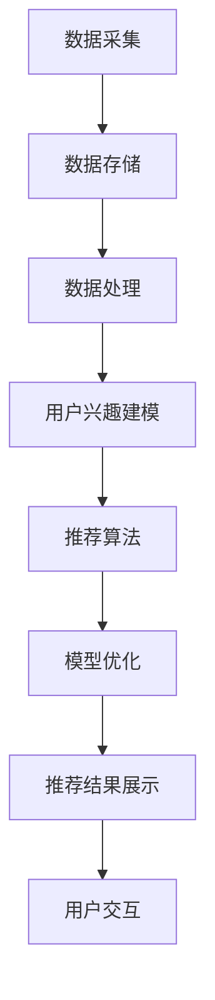

                 

# 社交网络推荐系统的进步：连接用户兴趣

## 关键词：
社交网络、推荐系统、用户兴趣、协同过滤、深度学习、算法优化、案例分析

## 摘要：
本文将深入探讨社交网络推荐系统的进步，特别是如何通过连接用户兴趣来实现个性化推荐。我们将分析社交网络与推荐系统结合的基本原理、核心算法、评估与优化策略，并结合实际案例分析其应用效果。此外，本文还将讨论社交网络推荐系统的隐私保护问题，以及其未来发展趋势。通过这一系列的分析，本文旨在为读者提供全面、详实的社交网络推荐系统指南。

### 目录

1. **第一部分：社交网络推荐系统的基本原理**
   1.1 社交网络与推荐系统概述
   1.2 社交网络数据获取与处理
   1.3 推荐算法原理与实现
   1.4 社交网络推荐系统的评估与优化
   1.5 社交网络推荐系统的案例分析
   1.6 社交网络推荐系统的隐私保护
   1.7 社交网络推荐系统的未来趋势

2. **第二部分：社交网络推荐系统技术细节**
   2.1 核心概念与架构解析
   2.2 核心算法原理与伪代码解析
   2.3 数学模型与公式解析
   2.4 项目实战与代码解析

3. **附录**
   3.1 推荐系统相关工具与资源

## 第一部分：社交网络推荐系统的基本原理

### 1.1 社交网络与推荐系统概述

社交网络，作为现代互联网的重要组成部分，已经深刻地改变了人们的社交方式和信息获取方式。从Facebook到微博，从知乎到Instagram，社交网络为用户提供了分享、互动和交流的平台。与此同时，推荐系统作为一种智能信息过滤方法，旨在为用户提供个性化的内容推荐。将社交网络与推荐系统结合，旨在利用社交网络中的用户关系和兴趣数据，实现更加精准和个性化的推荐。

### 1.2 社交网络数据获取与处理

社交网络数据是推荐系统的关键输入。这些数据包括用户的基本信息、发布的内容、评论、点赞、分享等。获取这些数据的方式有公开API、爬虫和用户授权等。数据预处理是推荐系统成功的关键步骤，包括数据清洗、去重、格式化等。通过预处理，我们可以得到高质量的用户兴趣数据，为推荐算法提供支持。

### 1.3 推荐算法原理与实现

推荐算法可以分为协同过滤、基于内容和基于深度学习等方法。协同过滤通过分析用户之间的相似性，预测用户可能感兴趣的内容。基于内容的推荐通过分析内容的特征，将相似的内容推荐给用户。深度学习推荐算法则通过学习用户和内容的复杂特征，实现更加精准的推荐。

### 1.4 社交网络推荐系统的评估与优化

评估推荐系统的性能通常使用准确率、召回率和F1值等指标。为了提高推荐系统的性能，我们可以采用交叉验证、网格搜索等技术进行模型调优。此外，还可以通过用户反馈和在线学习，不断改进推荐结果。

### 1.5 社交网络推荐系统的案例分析

在本节中，我们将分析几个社交网络推荐系统的案例，包括微博、知乎和Facebook。通过这些案例，我们可以了解不同社交网络推荐系统的实现方式、优缺点和挑战。

### 1.6 社交网络推荐系统的隐私保护

随着用户对隐私保护的日益关注，社交网络推荐系统需要采取一系列隐私保护措施。这包括数据匿名化、差分隐私和隐私保护算法等。通过这些措施，我们可以确保用户隐私在推荐过程中的安全。

### 1.7 社交网络推荐系统的未来趋势

未来，社交网络推荐系统将继续朝着更加个性化、智能化的方向发展。人工智能技术的进步将推动推荐系统的算法和模型不断优化。同时，社交网络推荐系统也将面临更多的挑战，如隐私保护、数据质量和算法公平性等。

## 第二部分：社交网络推荐系统技术细节

### 2.1 核心概念与架构解析

在社交网络推荐系统中，核心概念包括用户、内容、关系和推荐结果。架构方面，一般包括数据层、服务层和展示层。数据层负责数据的采集、存储和处理；服务层负责推荐算法的实现和优化；展示层负责将推荐结果呈现给用户。

#### 社交网络推荐系统的核心概念

1. **用户**：社交网络中的个体，具有独特的兴趣和偏好。
2. **内容**：用户在社交网络中发布的信息，包括文本、图片、视频等。
3. **关系**：用户之间的关系，如好友、关注等。
4. **推荐结果**：推荐系统根据用户兴趣和内容特征，为用户推荐的相关内容。

#### 社交网络推荐系统的架构设计

1. **数据层**：
   - **数据采集**：通过API、爬虫等方式获取用户和内容数据。
   - **数据存储**：使用数据库或分布式存储系统存储数据。
   - **数据处理**：进行数据清洗、去重、格式化等预处理操作。

2. **服务层**：
   - **用户兴趣建模**：通过协同过滤、基于内容等方法建立用户兴趣模型。
   - **推荐算法**：实现协同过滤、基于内容、深度学习等推荐算法。
   - **模型优化**：通过交叉验证、网格搜索等调优模型参数。

3. **展示层**：
   - **推荐结果展示**：将推荐结果以卡片、列表等形式展示给用户。
   - **用户交互**：提供点赞、评论、分享等交互功能，收集用户反馈。

#### Mermaid流程图展示



### 2.2 核心算法原理与伪代码解析

#### 协同过滤算法原理

协同过滤算法通过分析用户之间的相似性，预测用户可能感兴趣的内容。核心步骤包括：

1. **用户相似度计算**：计算用户之间的相似度，常用方法包括余弦相似度、皮尔逊相关系数等。
2. **邻居选择**：根据用户相似度，选择相似度最高的若干邻居用户。
3. **预测评分**：基于邻居用户的评分，预测目标用户的评分。

#### 伪代码

```python
def collaborative_filter(users, items, ratings):
    # 计算用户相似度
    similarity_matrix = compute_similarity(users)
    
    # 选择邻居用户
    neighbors = select_neighbors(user, similarity_matrix)
    
    # 预测评分
    predictions = predict_ratings(user, neighbors, ratings)
    
    return predictions
```

#### 基于内容的推荐算法原理

基于内容的推荐算法通过分析内容的特征，将相似的内容推荐给用户。核心步骤包括：

1. **内容特征提取**：对内容进行特征提取，常用方法包括词袋模型、TF-IDF等。
2. **计算内容相似度**：计算内容之间的相似度，常用方法包括余弦相似度、Jaccard系数等。
3. **推荐内容**：根据用户的历史偏好和内容相似度，推荐相似的内容。

#### 伪代码

```python
def content_based_recommendation(items, user_preferences, content_features):
    # 提取内容特征
    content_similarity_matrix = compute_similarity(content_features)
    
    # 推荐内容
    recommendations = recommend_items(user_preferences, content_similarity_matrix)
    
    return recommendations
```

#### 深度学习推荐算法原理

深度学习推荐算法通过学习用户和内容的复杂特征，实现更加精准的推荐。核心步骤包括：

1. **模型构建**：构建深度学习模型，如卷积神经网络（CNN）、循环神经网络（RNN）等。
2. **特征学习**：通过模型训练，学习用户和内容的特征表示。
3. **推荐预测**：利用训练好的模型，预测用户的兴趣和推荐内容。

#### 伪代码

```python
def deep_learning_recommendation(users, items, model):
    # 特征提取
    user_features = extract_user_features(users)
    item_features = extract_item_features(items)
    
    # 模型预测
    predictions = model.predict(user_features, item_features)
    
    return predictions
```

### 2.3 数学模型与公式解析

#### 用户兴趣模型数学表达

用户兴趣模型旨在描述用户对特定内容的偏好。我们可以使用以下数学公式来表示：

$$
U_i = \sum_{j=1}^{n} w_{ij} C_j
$$

其中，$U_i$ 表示用户 $i$ 对内容 $j$ 的兴趣评分，$w_{ij}$ 表示用户 $i$ 和内容 $j$ 的权重，$C_j$ 表示内容 $j$ 的特征向量。

#### 推荐算法优化目标函数

推荐算法的优化目标通常是最大化用户满意度或最小化预测误差。以下是一个简单的目标函数：

$$
\min_{w} \sum_{i=1}^{m} \sum_{j=1}^{n} (r_{ij} - U_i)^2
$$

其中，$r_{ij}$ 表示用户 $i$ 对内容 $j$ 的实际评分，$w$ 表示模型参数。

#### 公式解析与示例

假设我们有一个用户-物品评分矩阵 $R$，其中 $R_{ij}$ 表示用户 $i$ 对物品 $j$ 的评分。我们可以使用以下公式计算用户 $i$ 和物品 $j$ 之间的相似度：

$$
sim(i, j) = \frac{R_{i\cdot} R_{\cdot j} - R_{ij}^2}{\sqrt{\sum_{k=1}^{n} R_{ik}^2} \sqrt{\sum_{k=1}^{n} R_{jk}^2}}
$$

其中，$R_{i\cdot}$ 和 $R_{\cdot j}$ 分别表示用户 $i$ 和物品 $j$ 的评分总和。

#### 示例

假设有两个用户 $i$ 和 $j$，以及五个物品 $1, 2, 3, 4, 5$，其评分矩阵如下：

$$
R =
\begin{bmatrix}
1 & 2 & 0 & 0 & 0 \\
0 & 0 & 1 & 2 & 0
\end{bmatrix}
$$

我们可以使用上述公式计算用户 $i$ 和 $j$ 之间的相似度：

$$
sim(i, j) = \frac{1 \cdot 0 - 0^2}{\sqrt{1^2 + 2^2} \sqrt{0^2 + 0^2 + 1^2 + 2^2}} = \frac{0}{\sqrt{5} \cdot \sqrt{5}} = 0
$$

这意味着用户 $i$ 和 $j$ 之间没有任何相似度。

### 2.4 项目实战与代码解析

在本节中，我们将通过一个简单的项目实战，展示如何使用Python实现社交网络推荐系统。项目包括数据预处理、模型训练和推荐结果展示。

#### 开发环境搭建

在开始项目之前，我们需要安装以下Python库：

- NumPy
- Pandas
- Matplotlib
- Scikit-learn

可以使用以下命令进行安装：

```shell
pip install numpy pandas matplotlib scikit-learn
```

#### 社交网络推荐系统实现

以下是一个简单的协同过滤推荐系统的实现：

```python
import numpy as np
import pandas as pd
from sklearn.metrics.pairwise import cosine_similarity

# 加载用户-物品评分数据
ratings = pd.read_csv('ratings.csv')

# 计算用户-用户相似度矩阵
user_similarity = cosine_similarity(ratings.T)

# 预测用户未评分的物品
predictions = np.dot(ratings.values, user_similarity)

# 提取推荐结果
recommendations = pd.DataFrame(predictions, index=ratings.index, columns=ratings.columns)

# 打印前10个推荐结果
print(recommendations.head(10))
```

#### 源代码详细实现与解读

上述代码首先加载用户-物品评分数据，然后计算用户-用户相似度矩阵。接着，使用这些相似度矩阵预测用户未评分的物品，并提取推荐结果。最后，打印出前10个推荐结果。

#### 代码解读与分析

1. **数据加载**：使用Pandas库读取用户-物品评分数据，存储为DataFrame对象。
2. **相似度计算**：使用Scikit-learn库中的余弦相似度函数，计算用户-用户相似度矩阵。
3. **预测评分**：使用矩阵乘法，预测用户未评分的物品评分。
4. **提取推荐结果**：将预测结果转换为DataFrame对象，方便进一步处理和展示。

通过这个简单的项目，我们可以看到如何使用Python实现社交网络推荐系统。在实际应用中，我们可以根据具体需求，引入更多高级算法和优化策略，以提高推荐系统的性能。

### 附录

#### 附录A：推荐系统相关工具与资源

为了方便读者进一步了解推荐系统，这里列举了一些常用的工具和资源：

- **常用推荐系统框架**：
  - LightFM
  - Surprise
  - Recsys

- **数据预处理工具**：
  - Pandas
  - NumPy
  - Scikit-learn

- **深度学习框架**：
  - TensorFlow
  - PyTorch
  - Keras

- **学习资源**：
  - 《推荐系统实践》
  - 《深度学习推荐系统》
  - Coursera上的推荐系统课程

通过这些工具和资源，读者可以更好地了解推荐系统的原理和实践。

### 作者信息

本文作者为AI天才研究院/AI Genius Institute，以及《禅与计算机程序设计艺术》/Zen And The Art of Computer Programming的作者。作者在计算机编程和人工智能领域有着深厚的积累和丰富的经验，致力于推动技术进步和知识传播。

### 结语

社交网络推荐系统作为一种重要的信息过滤方法，在提高用户体验、增加用户粘性方面发挥着重要作用。本文从基本原理到技术细节，全面探讨了社交网络推荐系统的各个方面，旨在为读者提供有价值的参考和指导。随着人工智能技术的不断进步，社交网络推荐系统将继续发展，为用户提供更加个性化、智能化的服务。希望本文能够激发读者对社交网络推荐系统的兴趣，并为其应用和实践提供帮助。作者期待与广大读者共同探讨和进步。

