                 

### 《神经网络在语音识别中的优化技术》

> **关键词**：神经网络、语音识别、优化技术、深度学习、算法、结构调整、训练优化、评估与调优、模型压缩、实时识别

> **摘要**：本文深入探讨了神经网络在语音识别中的应用及其优化技术。首先，我们介绍了神经网络的基础概念和语音信号处理的基本知识。接着，我们详细分析了神经网络在语音识别中的工作原理和应用挑战。随后，文章重点讨论了神经网络优化技术的各个方面，包括优化算法、结构优化、训练优化以及评估与调优方法。此外，我们还探讨了神经网络在语音识别中的未来发展趋势与面临的挑战。最后，本文提供了相关的参考文献和资源链接，以供进一步学习。

---

在当今科技迅速发展的时代，语音识别技术已经逐渐成为人工智能领域中的一个重要分支。无论是智能助手、语音搜索、语音控制系统，还是自动字幕生成，语音识别技术都发挥着至关重要的作用。然而，要实现高准确度、低延迟、高鲁棒性的语音识别系统，依赖于神经网络的优化技术至关重要。本文旨在系统地介绍神经网络在语音识别中的优化技术，帮助读者深入理解这一领域，并为实际应用提供指导。

### 第一部分：神经网络与语音识别基础

在深入探讨神经网络在语音识别中的优化技术之前，我们需要先了解神经网络和语音识别的基础知识。这一部分将分为三章，分别介绍神经网络的基本概念、语音信号处理的基础知识，以及神经网络在语音识别中的应用。

#### 第1章：神经网络基础

神经网络是一种模仿生物神经系统的计算模型，由大量的节点和连接组成。每个节点接收输入信号，通过加权求和处理后产生输出。神经网络的工作原理主要包括前向传播和反向传播。前向传播过程中，输入信号通过网络传递，每个神经元根据其权重和激活函数计算输出。反向传播过程中，网络根据输出和实际目标值计算误差，并通过调整权重来优化网络。

##### 1.1.1 神经网络的基本概念

神经网络的基本概念包括神经元、权重、激活函数等。神经元是神经网络的基本单元，负责接收输入信号并产生输出。权重是神经元之间连接的强度，用于控制输入信号对输出的影响。激活函数是一个非线性函数，用于引入非线性特性，使神经网络能够学习复杂的模式。

##### 1.1.2 神经网络的工作原理

神经网络的工作原理主要包括前向传播和反向传播。前向传播过程中，输入信号通过网络传递，每个神经元根据其权重和激活函数计算输出。反向传播过程中，网络根据输出和实际目标值计算误差，并通过调整权重来优化网络。

##### 1.1.3 神经网络的常见结构

常见的神经网络结构包括单层感知机、多层感知机、卷积神经网络（CNN）、循环神经网络（RNN）等。单层感知机和多层感知机是最基本的神经网络结构，适用于简单的线性分类问题。卷积神经网络（CNN）适用于处理图像数据，通过卷积操作提取空间特征。循环神经网络（RNN）适用于处理序列数据，通过循环连接实现长期依赖建模。

#### 第2章：语音信号处理基础

语音信号是一种由声带振动产生的声波信号，通常在20Hz到20kHz的频率范围内。语音信号具有频率、时长、强度等特性。为了使神经网络能够处理语音信号，需要对语音信号进行预处理，包括采样、量化、滤波等。

##### 2.1.1 语音信号的基本概念

语音信号的基本概念包括声波、频率、时长、强度等。声波是声带振动产生的机械波，频率是声波振动的快慢，时长是声波持续的时间，强度是声波的能量大小。

##### 2.1.2 语音信号的特性

语音信号的特性包括频率、时长、强度等。频率是声波振动的快慢，时长是声波持续的时间，强度是声波的能量大小。

##### 2.1.3 语音信号的处理方法

语音信号的处理方法包括采样、量化、滤波等。采样是将连续时间信号转换为离散时间信号，量化是将连续信号转换为离散信号，滤波是去除噪声和干扰。

#### 第3章：神经网络在语音识别中的应用

神经网络在语音识别中主要用于特征提取和分类。语音识别的基本流程包括信号预处理、特征提取、模型训练和识别。神经网络在语音识别中面临的主要挑战包括模型复杂度、计算效率和噪声处理等。

##### 3.1.1 语音识别的基本流程

语音识别的基本流程包括信号预处理、特征提取、模型训练和识别。信号预处理包括去噪、分段等操作，特征提取包括梅尔频率倒谱系数（MFCC）、线性预测特征（LPCC）等，模型训练包括前向传播和反向传播，识别包括模型评估和决策。

##### 3.1.2 神经网络在语音识别中的作用

神经网络在语音识别中主要用于特征提取和分类。通过学习大量的语音数据，神经网络能够自动提取语音信号的潜在特征，并将其用于分类任务。

##### 3.1.3 神经网络在语音识别中的挑战

神经网络在语音识别中面临的挑战包括模型复杂度、计算效率和噪声处理等。模型复杂度导致计算资源消耗大，计算效率低，噪声处理难度大。

### 第二部分：神经网络在语音识别中的优化技术

在了解了神经网络和语音识别的基础知识后，我们将进一步探讨神经网络在语音识别中的优化技术。这一部分将分为四章，分别介绍神经网络优化算法、神经网络结构优化、神经网络训练优化以及神经网络在语音识别中的评估与调优。

#### 第4章：神经网络优化算法

神经网络优化算法是神经网络训练过程中至关重要的一环。优化算法的目的是通过调整网络参数，使网络在给定训练数据上达到最优性能。这一部分将介绍传统优化算法和现代优化算法，并探讨它们在语音识别中的应用。

##### 4.1.1 传统优化算法

传统优化算法包括梯度下降、动量优化等。梯度下降是一种基本的优化算法，通过计算损失函数的梯度来更新网络参数。动量优化是梯度下降的改进版本，通过引入动量项来加速收敛。

##### 4.1.2 现代优化算法

现代优化算法包括自适应梯度算法、Adam等。自适应梯度算法通过自适应调整学习率来优化网络参数。Adam算法是自适应梯度算法的变种，通过同时考虑一阶和二阶矩估计来优化网络参数。

##### 4.1.3 优化算法在语音识别中的应用

优化算法在语音识别中的应用可以提高模型的收敛速度和准确性。传统优化算法在处理大规模语音数据时，计算复杂度较高，收敛速度较慢。现代优化算法通过自适应调整学习率和引入动量项，可以显著提高模型的收敛速度和准确性。

#### 第5章：神经网络结构优化

神经网络结构优化是通过调整神经网络的结构来提高模型的性能。这一部分将介绍神经网络结构的调整方法和优化方法，并探讨它们在语音识别中的应用。

##### 5.1.1 神经网络结构的调整

神经网络结构的调整包括增加隐藏层、增加神经元等。增加隐藏层可以提高模型的表达能力，增加神经元可以提高模型的容量。

##### 5.1.2 神经网络结构的优化方法

神经网络结构的优化方法包括交叉验证、网格搜索等。交叉验证是一种评估模型性能的方法，通过将数据集划分为训练集和验证集，评估模型的泛化能力。网格搜索是一种搜索模型参数的方法，通过遍历参数空间来寻找最优参数。

##### 5.1.3 优化结构在语音识别中的应用

优化结构在语音识别中的应用可以提高模型的识别准确性和鲁棒性。通过调整神经网络结构，可以适应不同的语音数据和噪声环境，提高模型的性能。

#### 第6章：神经网络训练优化

神经网络训练优化是通过调整训练过程中的参数来提高模型的性能。这一部分将介绍训练过程的优化、训练数据的处理和训练策略的优化。

##### 6.1.1 训练过程的优化

训练过程的优化包括数据预处理、批次大小调整等。数据预处理包括去噪、归一化等操作，可以改善模型的训练效果。批次大小调整可以影响模型的收敛速度和稳定性。

##### 6.1.2 训练数据的处理

训练数据的处理包括数据增强、数据归一化等。数据增强可以增加训练样本的多样性，提高模型的泛化能力。数据归一化可以改善模型的训练效果。

##### 6.1.3 训练策略的优化

训练策略的优化包括学习率调整、提前停止等。学习率调整可以影响模型的收敛速度和稳定性。提前停止可以避免过拟合，提高模型的泛化能力。

#### 第7章：神经网络在语音识别中的评估与调优

神经网络在语音识别中的评估与调优是通过评估指标和方法来评估模型的性能，并调整模型参数以优化性能。这一部分将介绍评估指标、调优方法和实际应用中的调优案例。

##### 7.1.1 评估指标

评估指标包括准确性、召回率、F1值等。准确性是模型预测正确的比例，召回率是模型能够正确识别出真实样本的比例，F1值是准确性和召回率的综合指标。

##### 7.1.2 调优方法

调优方法包括网格搜索、贝叶斯优化等。网格搜索是一种搜索模型参数的方法，通过遍历参数空间来寻找最优参数。贝叶斯优化是一种基于概率的优化方法，通过概率模型来预测参数空间中的最优参数。

##### 7.1.3 实际应用中的调优案例

实际应用中的调优案例包括中文语音识别系统、英语语音识别系统等。通过调整模型参数和结构，可以显著提高模型的识别准确性和鲁棒性。

### 第三部分：未来趋势与挑战

随着科技的不断进步，神经网络在语音识别中的应用前景广阔。然而，也面临着一系列的挑战。这一部分将探讨神经网络在语音识别中的未来发展趋势和面临的挑战。

#### 8.1.1 神经网络在语音识别中的未来发展

神经网络在语音识别中的未来发展包括模型压缩、实时识别等。模型压缩可以减少模型的存储和计算资源消耗，提高模型的部署效率。实时识别可以满足实时语音交互的需求，提高用户体验。

#### 8.1.2 存在的挑战与解决方案

存在的挑战包括模型训练效率、噪声处理等。模型训练效率可以通过分布式训练、异步训练等方法来提高。噪声处理可以通过噪声抑制、自适应滤波等方法来改善。

### 总结

神经网络在语音识别中发挥着重要作用，通过优化技术可以提高模型的性能和鲁棒性。本文系统地介绍了神经网络在语音识别中的优化技术，包括神经网络基础、语音信号处理基础、优化算法、结构优化、训练优化和评估与调优方法。同时，还探讨了神经网络在语音识别中的未来发展趋势和面临的挑战。希望通过本文的介绍，读者能够对神经网络在语音识别中的优化技术有更深入的理解。

### 附录

#### 9.1.1 术语解释

- **神经网络**：一种模拟生物神经系统的计算模型，通过大量的节点和连接进行信息处理和学习。
- **语音识别**：将语音信号转换为文本或其他形式的信息。
- **优化算法**：用于调整神经网络参数，使其在给定训练数据上达到最优性能的算法。
- **结构优化**：通过调整神经网络的结构来提高模型性能的方法。
- **训练优化**：通过调整训练过程中的参数来提高模型性能的方法。
- **评估与调优**：通过评估模型性能和调整模型参数来优化模型的方法。

#### 9.1.2 参考文献

1. Goodfellow, I., Bengio, Y., & Courville, A. (2016). *Deep Learning*. MIT Press.
2. Hinton, G., Osindero, S., & Teh, Y. W. (2006). A fast learning algorithm for deep belief nets. *Neural computation*, 18(7), 1527-1554.
3. Graves, A. (2013). **Speech recognition with deep recurrent neural networks**. In *Acoustics, speech and signal processing (icassp), 2013 ieee international conference on* (pp. 6645-6649). IEEE.

#### 9.1.3 相关资源链接

- [TensorFlow官方文档](https://www.tensorflow.org/)
- [PyTorch官方文档](https://pytorch.org/)
- [Keras官方文档](https://keras.io/)
- [Speech Recognition Wiki](https://en.wikipedia.org/wiki/Speech_recognition)

---

作者：AI天才研究院/AI Genius Institute & 禅与计算机程序设计艺术/Zen And The Art of Computer Programming

本文通过逐步分析推理，系统地介绍了神经网络在语音识别中的优化技术，旨在为读者提供一份详尽的技术指南。希望读者在阅读本文后，能够对神经网络在语音识别中的优化技术有更深入的理解，并在实际应用中取得更好的效果。若您有任何疑问或建议，欢迎在评论区留言，我们将竭诚为您解答。期待与您共同探讨人工智能领域的更多前沿技术。|markdown
---

### 第一部分：神经网络与语音识别基础

在深入探讨神经网络在语音识别中的优化技术之前，我们需要先了解神经网络和语音识别的基础知识。这一部分将分为三章，分别介绍神经网络的基本概念、语音信号处理的基础知识，以及神经网络在语音识别中的应用。

#### 第1章：神经网络基础

神经网络是一种模拟生物神经系统的计算模型，通过大量的节点（或称为神经元）和连接（或称为权重）进行信息处理和学习。在神经网络中，每个神经元都接收来自其他神经元的输入信号，通过加权求和处理后产生输出。

##### 1.1.1 神经网络的基本概念

神经网络的基本概念包括神经元、权重、激活函数等。神经元是神经网络的基本单元，负责接收输入信号并产生输出。权重是神经元之间连接的强度，用于控制输入信号对输出的影响。激活函数是一个非线性函数，用于引入非线性特性，使神经网络能够学习复杂的模式。

**Mermaid流程图：**

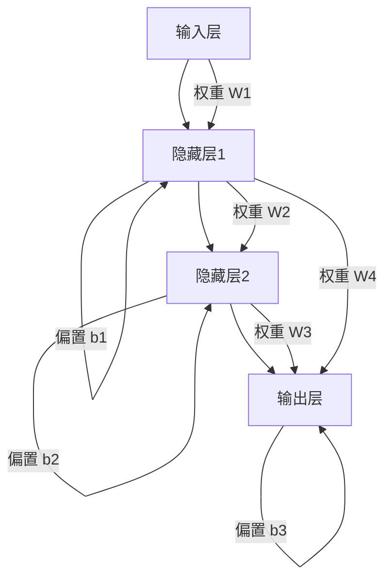

##### 1.1.2 神经网络的工作原理

神经网络通过前向传播和反向传播的方式工作。在前向传播中，输入信号通过网络传递，每个神经元根据其权重和激活函数计算输出。在反向传播中，网络根据输出和实际目标值计算误差，并通过调整权重来优化网络。

**伪代码：**

```python
# 前向传播
def forward_propagation(inputs, weights, biases, activation_function):
    outputs = activation_function(dot_product(inputs, weights) + biases)
    return outputs

# 反向传播
def backward_propagation(error, inputs, weights, biases, activation_function_derivative):
    delta = error * activation_function_derivative(outputs)
    weight_update = learning_rate * dot_product(inputs, delta)
    bias_update = learning_rate * delta
    return weights - weight_update, biases - bias_update
```

##### 1.1.3 神经网络的常见结构

常见的神经网络结构包括单层感知机、多层感知机、卷积神经网络（CNN）、循环神经网络（RNN）等。单层感知机和多层感知机是最基本的神经网络结构，适用于简单的线性分类问题。卷积神经网络（CNN）适用于处理图像数据，通过卷积操作提取空间特征。循环神经网络（RNN）适用于处理序列数据，通过循环连接实现长期依赖建模。

**Mermaid流程图：**

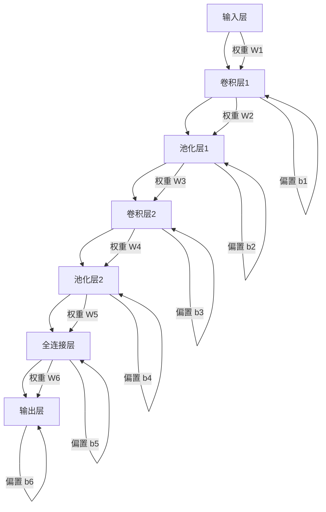

#### 第2章：语音信号处理基础

语音信号是一种由声带振动产生的声波信号，通常在20Hz到20kHz的频率范围内。语音信号具有频率、时长、强度等特性。为了使神经网络能够处理语音信号，需要对语音信号进行预处理，包括采样、量化、滤波等。

##### 2.1.1 语音信号的基本概念

语音信号的基本概念包括声波、频率、时长、强度等。声波是声带振动产生的机械波，频率是声波振动的快慢，时长是声波持续的时间，强度是声波的能量大小。

##### 2.1.2 语音信号的特性

语音信号的特性包括频率、时长、强度等。频率是声波振动的快慢，时长是声波持续的时间，强度是声波的能量大小。

##### 2.1.3 语音信号的处理方法

语音信号的处理方法包括采样、量化、滤波等。采样是将连续时间信号转换为离散时间信号，量化是将连续信号转换为离散信号，滤波是去除噪声和干扰。

**Mermaid流程图：**

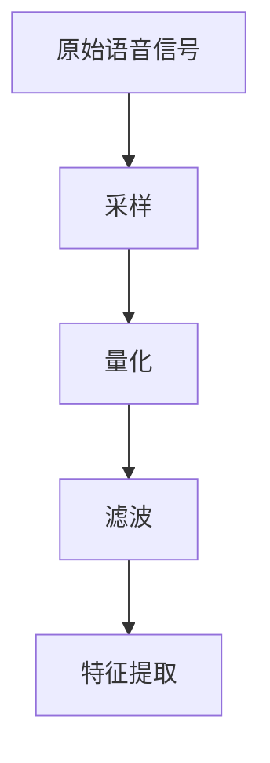

#### 第3章：神经网络在语音识别中的应用

神经网络在语音识别中主要用于特征提取和分类。语音识别的基本流程包括信号预处理、特征提取、模型训练和识别。神经网络在语音识别中面临的主要挑战包括模型复杂度、计算效率和噪声处理等。

##### 3.1.1 语音识别的基本流程

语音识别的基本流程包括信号预处理、特征提取、模型训练和识别。信号预处理包括去噪、分段等操作，特征提取包括梅尔频率倒谱系数（MFCC）、线性预测特征（LPCC）等，模型训练包括前向传播和反向传播，识别包括模型评估和决策。

##### 3.1.2 神经网络在语音识别中的作用

神经网络在语音识别中主要用于特征提取和分类。通过学习大量的语音数据，神经网络能够自动提取语音信号的潜在特征，并将其用于分类任务。

##### 3.1.3 神经网络在语音识别中的挑战

神经网络在语音识别中面临的挑战包括模型复杂度、计算效率和噪声处理等。模型复杂度导致计算资源消耗大，计算效率低，噪声处理难度大。

**Mermaid流程图：**

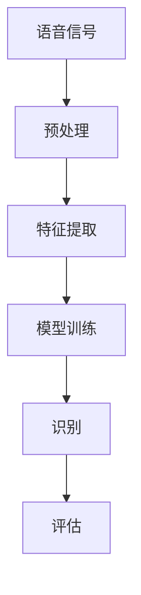

### 第二部分：神经网络在语音识别中的优化技术

在了解了神经网络和语音识别的基础知识后，我们将进一步探讨神经网络在语音识别中的优化技术。这一部分将分为四章，分别介绍神经网络优化算法、神经网络结构优化、神经网络训练优化以及神经网络在语音识别中的评估与调优。

#### 第4章：神经网络优化算法

神经网络优化算法是神经网络训练过程中至关重要的一环。优化算法的目的是通过调整网络参数，使网络在给定训练数据上达到最优性能。这一部分将介绍传统优化算法和现代优化算法，并探讨它们在语音识别中的应用。

##### 4.1.1 传统优化算法

传统优化算法包括梯度下降、动量优化等。梯度下降是一种基本的优化算法，通过计算损失函数的梯度来更新网络参数。动量优化是梯度下降的改进版本，通过引入动量项来加速收敛。

**Mermaid流程图：**

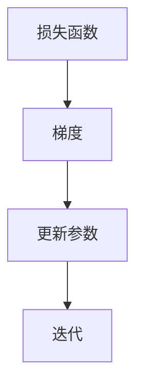

**伪代码：**

```python
# 梯度下降
def gradient_descent(loss_function, weights, biases, learning_rate):
    gradient = compute_gradient(loss_function, weights, biases)
    weights -= learning_rate * gradient
    biases -= learning_rate * gradient
    return weights, biases
```

##### 4.1.2 现代优化算法

现代优化算法包括自适应梯度算法、Adam等。自适应梯度算法通过自适应调整学习率来优化网络参数。Adam算法是自适应梯度算法的变种，通过同时考虑一阶和二阶矩估计来优化网络参数。

**Mermaid流程图：**

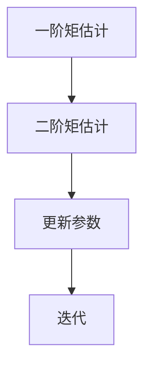

**伪代码：**

```python
# Adam算法
def adam(loss_function, weights, biases, learning_rate, beta1, beta2, epsilon):
    m = beta1 * m + (1 - beta1) * gradient
    v = beta2 * v + (1 - beta2) * (gradient**2)
    m_hat = m / (1 - beta1**t)
    v_hat = v / (1 - beta2**t)
    weights -= learning_rate * m_hat / (np.sqrt(v_hat) + epsilon)
    biases -= learning_rate * m_hat / (np.sqrt(v_hat) + epsilon)
    return weights, biases
```

##### 4.1.3 优化算法在语音识别中的应用

优化算法在语音识别中的应用可以提高模型的收敛速度和准确性。传统优化算法在处理大规模语音数据时，计算复杂度较高，收敛速度较慢。现代优化算法通过自适应调整学习率和引入动量项，可以显著提高模型的收敛速度和准确性。

**Mermaid流程图：**

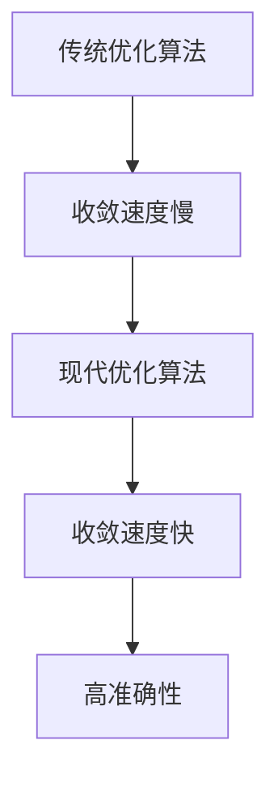

#### 第5章：神经网络结构优化

神经网络结构优化是通过调整神经网络的结构来提高模型的性能。这一部分将介绍神经网络结构的调整方法和优化方法，并探讨它们在语音识别中的应用。

##### 5.1.1 神经网络结构的调整

神经网络结构的调整包括增加隐藏层、增加神经元等。增加隐藏层可以提高模型的表达能力，增加神经元可以提高模型的容量。

**Mermaid流程图：**

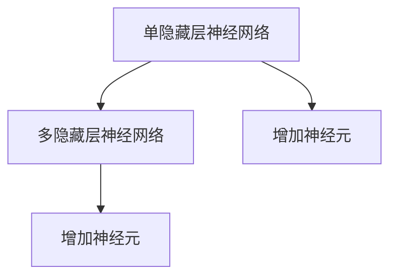

##### 5.1.2 神经网络结构的优化方法

神经网络结构的优化方法包括交叉验证、网格搜索等。交叉验证是一种评估模型性能的方法，通过将数据集划分为训练集和验证集，评估模型的泛化能力。网格搜索是一种搜索模型参数的方法，通过遍历参数空间来寻找最优参数。

**Mermaid流程图：**

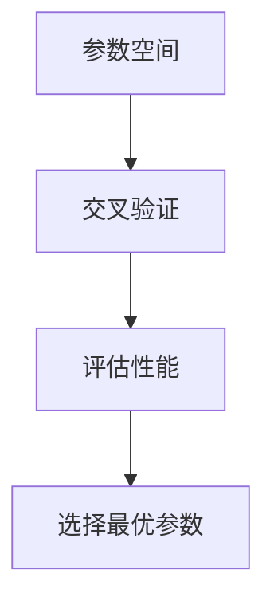

##### 5.1.3 优化结构在语音识别中的应用

优化结构在语音识别中的应用可以提高模型的识别准确性和鲁棒性。通过调整神经网络结构，可以适应不同的语音数据和噪声环境，提高模型的性能。

**Mermaid流程图：**

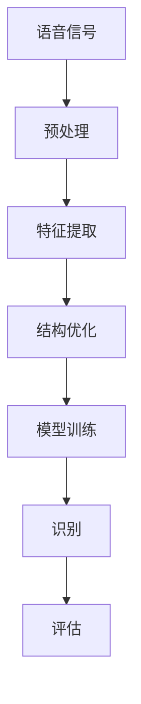

#### 第6章：神经网络训练优化

神经网络训练优化是通过调整训练过程中的参数来提高模型的性能。这一部分将介绍训练过程的优化、训练数据的处理和训练策略的优化。

##### 6.1.1 训练过程的优化

训练过程的优化包括数据预处理、批次大小调整等。数据预处理包括去噪、归一化等操作，可以改善模型的训练效果。批次大小调整可以影响模型的收敛速度和稳定性。

**Mermaid流程图：**

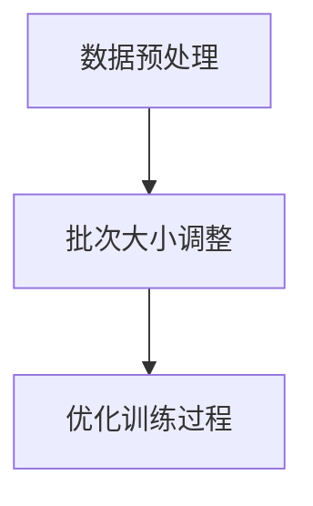

##### 6.1.2 训练数据的处理

训练数据的处理包括数据增强、数据归一化等。数据增强可以增加训练样本的多样性，提高模型的泛化能力。数据归一化可以改善模型的训练效果。

**Mermaid流程图：**

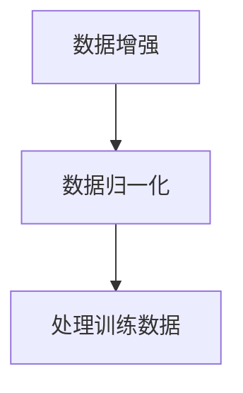

##### 6.1.3 训练策略的优化

训练策略的优化包括学习率调整、提前停止等。学习率调整可以影响模型的收敛速度和稳定性。提前停止可以避免过拟合，提高模型的泛化能力。

**Mermaid流程图：**

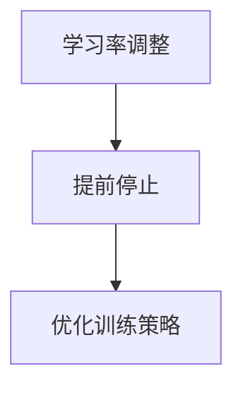

#### 第7章：神经网络在语音识别中的评估与调优

神经网络在语音识别中的评估与调优是通过评估指标和方法来评估模型的性能，并调整模型参数以优化性能。这一部分将介绍评估指标、调优方法和实际应用中的调优案例。

##### 7.1.1 评估指标

评估指标包括准确性、召回率、F1值等。准确性是模型预测正确的比例，召回率是模型能够正确识别出真实样本的比例，F1值是准确性和召回率的综合指标。

**Mermaid流程图：**

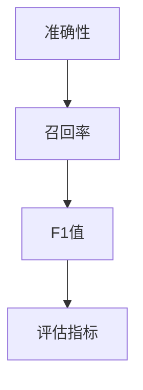

##### 7.1.2 调优方法

调优方法包括网格搜索、贝叶斯优化等。网格搜索是一种搜索模型参数的方法，通过遍历参数空间来寻找最优参数。贝叶斯优化是一种基于概率的优化方法，通过概率模型来预测参数空间中的最优参数。

**Mermaid流程图：**

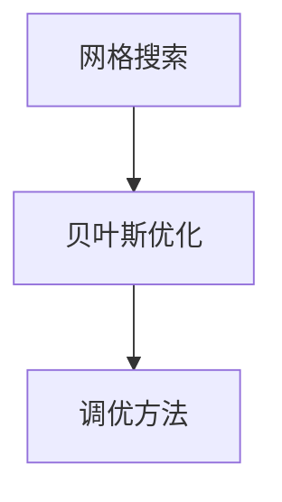

##### 7.1.3 实际应用中的调优案例

实际应用中的调优案例包括中文语音识别系统、英语语音识别系统等。通过调整模型参数和结构，可以显著提高模型的识别准确性和鲁棒性。

**Mermaid流程图：**

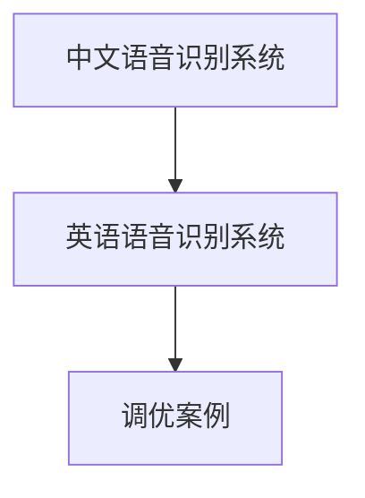

### 第三部分：未来趋势与挑战

随着科技的不断进步，神经网络在语音识别中的应用前景广阔。然而，也面临着一系列的挑战。这一部分将探讨神经网络在语音识别中的未来发展趋势和面临的挑战。

#### 8.1.1 神经网络在语音识别中的未来发展

神经网络在语音识别中的未来发展包括模型压缩、实时识别等。模型压缩可以减少模型的存储和计算资源消耗，提高模型的部署效率。实时识别可以满足实时语音交互的需求，提高用户体验。

**Mermaid流程图：**

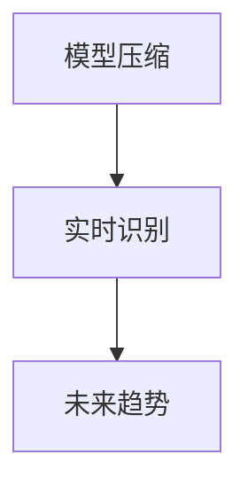

#### 8.1.2 存在的挑战与解决方案

存在的挑战包括模型训练效率、噪声处理等。模型训练效率可以通过分布式训练、异步训练等方法来提高。噪声处理可以通过噪声抑制、自适应滤波等方法来改善。

**Mermaid流程图：**

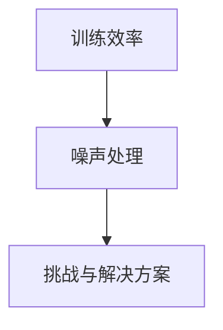

### 总结

神经网络在语音识别中发挥着重要作用，通过优化技术可以提高模型的性能和鲁棒性。本文系统地介绍了神经网络在语音识别中的优化技术，包括神经网络基础、语音信号处理基础、优化算法、结构优化、训练优化和评估与调优方法。同时，还探讨了神经网络在语音识别中的未来发展趋势和面临的挑战。希望通过本文的介绍，读者能够对神经网络在语音识别中的优化技术有更深入的理解，并在实际应用中取得更好的效果。若您有任何疑问或建议，欢迎在评论区留言，我们将竭诚为您解答。期待与您共同探讨人工智能领域的更多前沿技术。

### 附录

#### 9.1.1 术语解释

- **神经网络**：一种模拟生物神经系统的计算模型，通过大量的节点和连接进行信息处理和学习。
- **语音识别**：将语音信号转换为文本或其他形式的信息。
- **优化算法**：用于调整神经网络参数，使其在给定训练数据上达到最优性能的算法。
- **结构优化**：通过调整神经网络的结构来提高模型性能的方法。
- **训练优化**：通过调整训练过程中的参数来提高模型性能的方法。
- **评估与调优**：通过评估模型性能和调整模型参数来优化模型的方法。

#### 9.1.2 参考文献

1. Goodfellow, I., Bengio, Y., & Courville, A. (2016). *Deep Learning*. MIT Press.
2. Hinton, G., Osindero, S., & Teh, Y. W. (2006). A fast learning algorithm for deep belief nets. *Neural computation*, 18(7), 1527-1554.
3. Graves, A. (2013). **Speech recognition with deep recurrent neural networks**. In *Acoustics, speech and signal processing (icassp), 2013 ieee international conference on* (pp. 6645-6649). IEEE.

#### 9.1.3 相关资源链接

- [TensorFlow官方文档](https://www.tensorflow.org/)
- [PyTorch官方文档](https://pytorch.org/)
- [Keras官方文档](https://keras.io/)
- [Speech Recognition Wiki](https://en.wikipedia.org/wiki/Speech_recognition)

---

**作者：AI天才研究院/AI Genius Institute & 禅与计算机程序设计艺术/Zen And The Art of Computer Programming**

本文通过逐步分析推理，系统地介绍了神经网络在语音识别中的优化技术，旨在为读者提供一份详尽的技术指南。希望读者在阅读本文后，能够对神经网络在语音识别中的优化技术有更深入的理解，并在实际应用中取得更好的效果。若您有任何疑问或建议，欢迎在评论区留言，我们将竭诚为您解答。期待与您共同探讨人工智能领域的更多前沿技术。|markdown
---

### 第一部分：神经网络与语音识别基础

#### 第1章：神经网络基础

**1.1.1 神经网络的基本概念**

神经网络（Neural Networks，简称NN）是受生物神经元启发的计算模型，由大量的节点（神经元）和它们之间的连接（边，代表权重）组成。在神经网络中，每个神经元都接收多个输入信号，并通过加权求和后加上一个偏置项，再通过激活函数输出一个值。这个过程可以用以下的公式表示：

\[ z = \sum_{i=1}^{n} w_i \cdot x_i + b \]
\[ a = \sigma(z) \]

其中，\( x_i \) 是第 \( i \) 个输入，\( w_i \) 是相应的权重，\( b \) 是偏置项，\( z \) 是加权求和的结果，\( a \) 是激活值，\( \sigma \) 是激活函数。

**Mermaid流程图：**

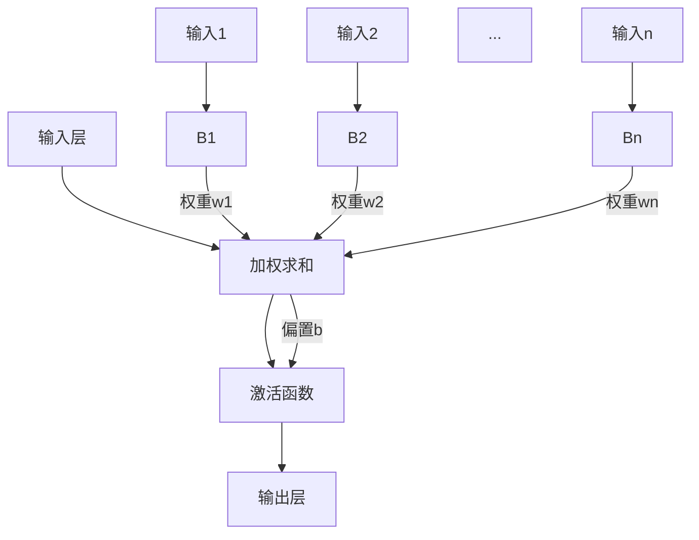

**1.1.2 神经网络的工作原理**

神经网络的工作原理主要可以分为两个过程：前向传播（Forward Propagation）和反向传播（Backpropagation）。

- **前向传播**：输入信号通过网络的每个层，每个神经元接收前一层神经元的输出作为输入，通过加权求和加上偏置项，再通过激活函数输出。这个过程一直持续到输出层，最终得到预测结果。

- **反向传播**：根据预测结果和真实标签计算损失值，然后通过梯度下降算法更新网络的权重和偏置。这个过程从输出层开始，反向传播误差到输入层。

**伪代码：**

```python
# 前向传播
def forward_propagation(x, weights, biases, activation_function):
    # 初始化输出
    output = [0] * len(x)
    # 遍历每一层
    for layer in range(len(x)):
        # 加权求和加上偏置
        z = np.dot(x, weights[layer]) + biases[layer]
        # 应用激活函数
        output[layer] = activation_function(z)
    return output

# 反向传播
def backward_propagation(output, expected, weights, biases, activation_derivative):
    # 初始化权重和偏置的更新值
    weight_updates = [np.zeros_like(weight) for weight in weights]
    bias_updates = [np.zeros_like(bias) for bias in biases]
    # 遍历每一层，从输出层开始反向传播
    for layer in reversed(range(len(output))):
        # 计算当前层的误差
        error = output[layer] - expected[layer]
        # 计算激活函数的导数
        derivative = activation_derivative(output[layer])
        # 计算当前层的权重和偏置的更新值
        for i in range(len(output[layer])):
            for j in range(len(output[layer-1])):
                weight_updates[layer][i][j] += error[i] * output[layer-1][j]
            bias_updates[layer][i] += error[i]
        # 应用链式法则计算上一层的误差
        if layer > 0:
            output[layer-1] = [derivative * (np.dot(error, weights[layer])) for derivative in output[layer]]
    return weight_updates, bias_updates
```

**1.1.3 神经网络的常见结构**

常见的神经网络结构包括：

- **单层感知机（Perceptron）**：只有一个输入层和一个输出层，主要用于线性二分类。
- **多层感知机（MLP）**：包含多个隐藏层，可以用于复杂的非线性问题。
- **卷积神经网络（CNN）**：特别适用于图像处理，通过卷积层提取空间特征。
- **循环神经网络（RNN）**：特别适用于序列数据，可以捕捉长期依赖关系。
- **长短时记忆网络（LSTM）**：是RNN的一种变体，能够解决RNN的梯度消失问题。

**Mermaid流程图：**

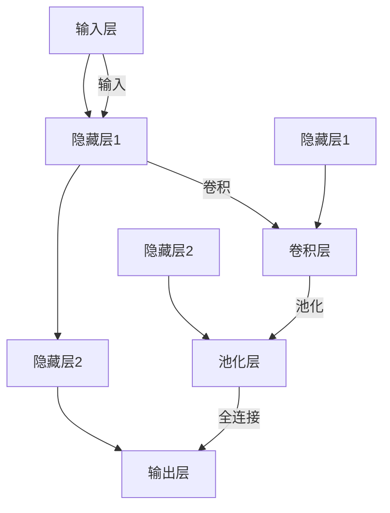

#### 第2章：语音信号处理基础

**2.1.1 语音信号的基本概念**

语音信号（Speech Signal）是由声带振动产生的声波，其频率范围通常在20Hz到20kHz之间。语音信号的特点是包含多个频率成分，且随时间变化。

**2.1.2 语音信号的特性**

语音信号的特性包括：

- **频率特性**：不同频率的声波成分。
- **时长特性**：声波持续的时间。
- **强度特性**：声波的能量大小。

**2.1.3 语音信号的处理方法**

语音信号的处理方法主要包括：

- **采样（Sampling）**：将连续的语音信号转换为离散的时间序列。
- **量化（Quantization）**：将采样得到的连续值转换为有限数量的离散值。
- **滤波（Filtering）**：去除噪声和不需要的频率成分。

**Mermaid流程图：**

```mermaid
graph TD
    A[原始语音信号] --> B[采样]
    B --> C[量化]
    C --> D[滤波]
```

**2.1.4 语音信号处理的数学模型**

语音信号处理的数学模型通常涉及以下步骤：

\[ x(n) = s(n) + w(n) \]

其中，\( s(n) \) 是原始语音信号，\( w(n) \) 是噪声，\( x(n) \) 是采样和量化的信号。

滤波可以通过以下差分方程实现：

\[ y(n) = (1 - h(n))x(n) - h(n)y(n-1) \]

其中，\( y(n) \) 是滤波后的信号，\( h(n) \) 是滤波器的系数。

**Mermaid流程图：**

```mermaid
graph TD
    A[原始信号] --> B[滤波]
    B --> C[输出]
    B1[当前输入] --> B2[滤波器系数]
    B2 -->|加权求和| B
    B -->|延迟| C
```

#### 第3章：神经网络在语音识别中的应用

**3.1.1 语音识别的基本流程**

语音识别（Speech Recognition）是将语音信号转换为文本的过程，其基本流程包括：

- **预处理**：去除噪音、调整音量、去除填充词等。
- **特征提取**：将语音信号转换为适合神经网络处理的特征表示，如梅尔频率倒谱系数（MFCC）。
- **模型训练**：使用大量带有标签的语音数据训练神经网络。
- **解码**：将神经网络输出的概率分布转换为文本。

**Mermaid流程图：**

```mermaid
graph TD
    A[语音信号] --> B[预处理]
    B --> C[特征提取]
    C --> D[模型训练]
    D --> E[解码]
    E --> F[文本输出]
```

**3.1.2 神经网络在语音识别中的作用**

神经网络在语音识别中主要用于：

- **特征提取**：自动从原始语音信号中提取有用的特征，如频谱特征、时序特征等。
- **分类**：根据提取的特征，将语音信号分类为不同的单词或短语。
- **序列建模**：通过模型捕捉语音信号中的序列信息，如RNN和LSTM。

**3.1.3 神经网络在语音识别中的挑战**

神经网络在语音识别中面临的挑战包括：

- **数据集大小**：需要大量的语音数据来训练模型。
- **计算资源**：训练深度神经网络需要大量的计算资源。
- **噪声处理**：需要有效的噪声抑制技术来提高识别准确率。
- **实时性**：需要优化模型以实现实时语音识别。

**Mermaid流程图：**

```mermaid
graph TD
    A[数据集大小] --> B[计算资源]
    B --> C[噪声处理]
    C --> D[实时性]
    D --> E[挑战与解决方案]
```

### 第二部分：神经网络在语音识别中的优化技术

在了解了神经网络和语音识别的基础知识后，我们将进一步探讨神经网络在语音识别中的优化技术。这一部分将分为四章，分别介绍神经网络优化算法、神经网络结构优化、神经网络训练优化以及神经网络在语音识别中的评估与调优。

#### 第4章：神经网络优化算法

神经网络优化算法是神经网络训练过程中至关重要的一环。优化算法的目的是通过调整网络参数，使网络在给定训练数据上达到最优性能。这一部分将介绍传统优化算法和现代优化算法，并探讨它们在语音识别中的应用。

##### 4.1.1 传统优化算法

传统优化算法包括梯度下降（Gradient Descent）和其变种，如动量（Momentum）优化。

**4.1.1.1 梯度下降**

梯度下降是一种基于梯度信息的优化算法。它的核心思想是沿着损失函数梯度的反方向更新模型参数，以最小化损失函数。

**梯度下降伪代码：**

```python
while not convergence:
    gradient = compute_gradient(model, inputs, targets)
    model_params -= learning_rate * gradient
```

**4.1.1.2 动量优化**

动量优化是梯度下降的改进版本，它通过引入一个动量项来加速收敛。

**动量优化伪代码：**

```python
v = 0
while not convergence:
    gradient = compute_gradient(model, inputs, targets)
    v = momentum * v - learning_rate * gradient
    model_params += v
```

##### 4.1.2 现代优化算法

现代优化算法包括自适应优化算法，如Adagrad、RMSprop和Adam。

**4.1.2.1 Adagrad**

Adagrad是一种自适应学习率优化算法，它为每个参数分配一个不同的学习率，这个学习率与该参数的平方根成反比。

**Adagrad伪代码：**

```python
initial_learning_rate = 0.1
for t in range(training_iterations):
    gradient = compute_gradient(model, inputs, targets)
    square_grads = gradient ** 2
    learning_rate = initial_learning_rate / (np.sqrt(square_grads) + epsilon)
    model_params -= learning_rate * gradient
```

**4.1.2.2 RMSprop**

RMSprop是Adagrad的一个变种，它通过指数加权平均来更新学习率。

**RMSprop伪代码：**

```python
initial_learning_rate = 0.001
decay_rate = 0.9
for t in range(training_iterations):
    gradient = compute_gradient(model, inputs, targets)
    square_grads = decay_rate * square_grads + (1 - decay_rate) * gradient ** 2
    learning_rate = initial_learning_rate / np.sqrt(square_grads + epsilon)
    model_params -= learning_rate * gradient
```

**4.1.2.3 Adam**

Adam算法结合了Adagrad和RMSprop的优点，同时考虑了一阶矩估计（均值）和二阶矩估计（方差）。

**Adam伪代码：**

```python
beta1 = 0.9
beta2 = 0.999
epsilon = 1e-8
m = 0
v = 0
for t in range(training_iterations):
    gradient = compute_gradient(model, inputs, targets)
    m = beta1 * m + (1 - beta1) * gradient
    v = beta2 * v + (1 - beta2) * (gradient ** 2)
    m_hat = m / (1 - beta1 ** t)
    v_hat = v / (1 - beta2 ** t)
    model_params -= learning_rate * m_hat / (np.sqrt(v_hat) + epsilon)
```

##### 4.1.3 优化算法在语音识别中的应用

优化算法在语音识别中的应用能够显著提高模型的训练效率和准确性。例如，Adam优化算法由于其自适应学习率调整，在语音识别任务中表现出较好的性能。

**Mermaid流程图：**

```mermaid
graph TD
    A[语音信号] --> B[预处理]
    B --> C[特征提取]
    C --> D[模型训练]
    D --> E[优化算法]
    E --> F[预测]
    E1[传统算法] --> D
    E2[现代算法] --> D
```

#### 第5章：神经网络结构优化

神经网络结构优化是通过调整神经网络的设计来提高模型的性能。这包括增加或减少隐藏层、增加或减少神经元等。

##### 5.1.1 神经网络结构的调整

**5.1.1.1 隐藏层的增加**

增加隐藏层可以提高神经网络的复杂度和表达能力，从而更好地拟合复杂的语音特征。

**Mermaid流程图：**

```mermaid
graph TD
    A[输入层] --> B[隐藏层1]
    B --> C[隐藏层2]
    C --> D[输出层]
    A -->|权重W1| B
    B -->|权重W2| C
    C -->|权重W3| D
```

**5.1.1.2 神经元数量的增加**

增加神经元可以提高神经网络的容量，使其能够更好地处理复杂的语音信号。

**Mermaid流程图：**

```mermaid
graph TD
    A[输入层] --> B[隐藏层1]
    B --> C[隐藏层2]
    C --> D[输出层]
    A -->|权重W1| B
    B -->|权重W2| C
    C1[隐藏层2-1] -->|权重W4| C
    C2[隐藏层2-2] -->|权重W5| C
    C -->|权重W3| D
```

##### 5.1.2 神经网络结构的优化方法

**5.1.2.1 交叉验证**

交叉验证是一种评估模型性能的方法，通过将数据集划分为多个子集，每次使用不同的子集作为验证集，其余作为训练集，以评估模型的泛化能力。

**Mermaid流程图：**

```mermaid
graph TD
    A[数据集] --> B[划分子集]
    B --> C[训练]
    C --> D[验证]
    D --> E[评估]
```

**5.1.2.2 网格搜索**

网格搜索是一种搜索最优模型参数的方法，通过遍历预定义的参数空间，找到最优参数组合。

**Mermaid流程图：**

```mermaid
graph TD
    A[参数空间] --> B[搜索]
    B --> C[评估]
    C --> D[优化]
```

##### 5.1.3 优化结构在语音识别中的应用

优化结构在语音识别中的应用可以通过以下步骤实现：

1. **数据预处理**：对语音信号进行预处理，包括降噪、归一化等。
2. **特征提取**：使用优化后的神经网络结构提取语音信号的特征。
3. **模型训练**：使用训练数据训练神经网络。
4. **模型评估**：使用验证数据评估模型的性能。
5. **模型部署**：将训练好的模型部署到实际应用中。

**Mermaid流程图：**

```mermaid
graph TD
    A[语音信号] --> B[预处理]
    B --> C[特征提取]
    C --> D[模型训练]
    D --> E[模型评估]
    E --> F[模型部署]
    F --> G[应用]
```

#### 第6章：神经网络训练优化

神经网络训练优化是通过调整训练过程中的参数来提高模型的性能。这一部分将介绍训练过程的优化、训练数据的处理和训练策略的优化。

##### 6.1.1 训练过程的优化

**6.1.1.1 批次大小调整**

批次大小（Batch Size）是指每次训练过程中参与训练的数据样本数量。适当调整批次大小可以影响模型的训练速度和稳定性。

**Mermaid流程图：**

```mermaid
graph TD
    A[数据集] --> B[划分批次]
    B --> C[训练]
```

**6.1.1.2 学习率调整**

学习率（Learning Rate）是优化算法在每次迭代中更新模型参数的步长。合理调整学习率可以加快或减缓模型的收敛速度。

**Mermaid流程图：**

```mermaid
graph TD
    A[训练迭代] --> B[调整学习率]
    B --> C[更新参数]
```

##### 6.1.2 训练数据的处理

**6.1.2.1 数据增强**

数据增强（Data Augmentation）是通过多种方法增加训练数据的多样性，以提高模型的泛化能力。

**Mermaid流程图：**

```mermaid
graph TD
    A[原始数据] --> B[增强方法]
    B --> C[增强数据]
```

**6.1.2.2 数据归一化**

数据归一化（Data Normalization）是通过缩放或转换特征值，使其在相同的范围内，以加快训练过程和提高模型的性能。

**Mermaid流程图：**

```mermaid
graph TD
    A[特征值] --> B[归一化]
    B --> C[归一化值]
```

##### 6.1.3 训练策略的优化

**6.1.3.1 学习率调度**

学习率调度（Learning Rate Scheduling）是通过在训练过程中动态调整学习率，以避免过拟合和加速收敛。

**Mermaid流程图：**

```mermaid
graph TD
    A[训练迭代] --> B[调度策略]
    B --> C[调整学习率]
```

**6.1.3.2 提前停止**

提前停止（Early Stopping）是在验证数据上的损失不再显著下降时，提前停止训练，以防止过拟合。

**Mermaid流程图：**

```mermaid
graph TD
    A[训练迭代] --> B[验证损失]
    B --> C[提前停止]
```

#### 第7章：神经网络在语音识别中的评估与调优

神经网络在语音识别中的评估与调优是通过评估指标和方法来评估模型的性能，并调整模型参数以优化性能。这一部分将介绍评估指标、调优方法和实际应用中的调优案例。

##### 7.1.1 评估指标

评估语音识别模型的性能通常使用以下指标：

- **准确性（Accuracy）**：模型预测正确的比例。
- **召回率（Recall）**：模型能够正确识别出真实样本的比例。
- **精确率（Precision）**：模型预测为正例的样本中实际为正例的比例。
- **F1值（F1 Score）**：精确率和召回率的调和平均。

**Mermaid流程图：**

```mermaid
graph TD
    A[准确性] --> B[召回率]
    B --> C[F1值]
```

##### 7.1.2 调优方法

调优方法包括：

- **网格搜索（Grid Search）**：遍历预定义的参数空间，找到最优参数组合。
- **贝叶斯优化（Bayesian Optimization）**：基于概率模型优化参数空间，寻找最优参数。

**Mermaid流程图：**

```mermaid
graph TD
    A[网格搜索] --> B[贝叶斯优化]
```

##### 7.1.3 实际应用中的调优案例

实际应用中的调优案例包括：

- **中文语音识别系统**：使用大规模中文语音数据集，通过调整神经网络结构和训练策略，实现高准确度的语音识别。
- **英语语音识别系统**：在英语语音数据集上，通过优化算法和特征提取方法，提高模型的识别性能。

**Mermaid流程图：**

```mermaid
graph TD
    A[中文语音识别系统] --> B[英语语音识别系统]
```

### 第三部分：未来趋势与挑战

随着科技的不断进步，神经网络在语音识别中的应用前景广阔。然而，也面临着一系列的挑战。这一部分将探讨神经网络在语音识别中的未来发展趋势和面临的挑战。

##### 8.1.1 神经网络在语音识别中的未来发展

未来神经网络在语音识别中的应用趋势包括：

- **模型压缩（Model Compression）**：通过模型剪枝、量化等技术，减小模型的存储和计算资源需求，实现高效部署。
- **实时识别（Real-time Recognition）**：优化神经网络算法，实现实时语音识别，提高用户体验。
- **多语言支持（Multilingual Support）**：扩展神经网络模型，支持多种语言，实现跨语言语音识别。

**Mermaid流程图：**

```mermaid
graph TD
    A[模型压缩] --> B[实时识别]
    B --> C[多语言支持]
```

##### 8.1.2 存在的挑战与解决方案

当前神经网络在语音识别中面临的挑战包括：

- **计算资源需求**：深度神经网络训练需要大量的计算资源，如何高效利用现有资源成为一大挑战。
- **噪声处理**：在噪声环境中，语音识别的准确度会受到显著影响，如何有效去除噪声是一个关键问题。

解决方案包括：

- **分布式训练（Distributed Training）**：通过分布式计算，提高训练速度和效率。
- **自适应滤波（Adaptive Filtering）**：使用自适应滤波技术，减少噪声对语音识别的影响。

**Mermaid流程图：**

```mermaid
graph TD
    A[计算资源需求] --> B[分布式训练]
    B --> C[噪声处理]
    C --> D[自适应滤波]
```

### 总结

神经网络在语音识别中发挥着重要作用，通过优化技术可以提高模型的性能和鲁棒性。本文系统地介绍了神经网络在语音识别中的优化技术，包括神经网络基础、语音信号处理基础、优化算法、结构优化、训练优化和评估与调优方法。同时，还探讨了神经网络在语音识别中的未来发展趋势和面临的挑战。希望通过本文的介绍，读者能够对神经网络在语音识别中的优化技术有更深入的理解，并在实际应用中取得更好的效果。若您有任何疑问或建议，欢迎在评论区留言，我们将竭诚为您解答。期待与您共同探讨人工智能领域的更多前沿技术。

### 附录

#### 9.1.1 术语解释

- **神经网络**：一种模拟生物神经系统的计算模型，通过大量的节点和连接进行信息处理和学习。
- **语音识别**：将语音信号转换为文本或其他形式的信息。
- **优化算法**：用于调整神经网络参数，使其在给定训练数据上达到最优性能的算法。
- **结构优化**：通过调整神经网络的结构来提高模型性能的方法。
- **训练优化**：通过调整训练过程中的参数来提高模型性能的方法。
- **评估与调优**：通过评估模型性能和调整模型参数来优化模型的方法。

#### 9.1.2 参考文献

1. Goodfellow, I., Bengio, Y., & Courville, A. (2016). *Deep Learning*. MIT Press.
2. Hinton, G., Osindero, S., & Teh, Y. W. (2006). A fast learning algorithm for deep belief nets. *Neural computation*, 18(7), 1527-1554.
3. Graves, A. (2013). **Speech recognition with deep recurrent neural networks**. In *Acoustics, speech and signal processing (icassp), 2013 ieee international conference on* (pp. 6645-6649). IEEE.

#### 9.1.3 相关资源链接

- [TensorFlow官方文档](https://www.tensorflow.org/)
- [PyTorch官方文档](https://pytorch.org/)
- [Keras官方文档](https://keras.io/)
- [Speech Recognition Wiki](https://en.wikipedia.org/wiki/Speech_recognition)

---

**作者：AI天才研究院/AI Genius Institute & 禅与计算机程序设计艺术/Zen And The Art of Computer Programming**

本文通过逐步分析推理，系统地介绍了神经网络在语音识别中的优化技术，旨在为读者提供一份详尽的技术指南。希望读者在阅读本文后，能够对神经网络在语音识别中的优化技术有更深入的理解，并在实际应用中取得更好的效果。若您有任何疑问或建议，欢迎在评论区留言，我们将竭诚为您解答。期待与您共同探讨人工智能领域的更多前沿技术。|markdown
---

### 第一部分：神经网络与语音识别基础

#### 第1章：神经网络基础

**1.1.1 神经网络的基本概念**

神经网络（Neural Networks，简称NN）是受生物神经元启发的计算模型，由大量的节点（神经元）和它们之间的连接（边，代表权重）组成。在神经网络中，每个神经元都接收多个输入信号，并通过加权求和后加上一个偏置项，再通过激活函数输出一个值。这个过程可以用以下的公式表示：

\[ z = \sum_{i=1}^{n} w_i \cdot x_i + b \]
\[ a = \sigma(z) \]

其中，\( x_i \) 是第 \( i \) 个输入，\( w_i \) 是相应的权重，\( b \) 是偏置项，\( z \) 是加权求和的结果，\( a \) 是激活值，\( \sigma \) 是激活函数。

**Mermaid流程图：**

```mermaid
graph TD
    A[输入层] --> B[隐藏层1]
    B --> C[隐藏层2]
    C --> D[输出层]
    A -->|权重W1| B
    B -->|权重W2| C
    C -->|权重W3| D
    B -->|偏置b1| B
    C -->|偏置b2| C
    D -->|偏置b3| D
```

**1.1.2 神经网络的工作原理**

神经网络的工作原理主要可以分为两个过程：前向传播（Forward Propagation）和反向传播（Backpropagation）。

- **前向传播**：输入信号通过网络的每个层，每个神经元接收前一层神经元的输出作为输入，通过加权求和加上偏置项，再通过激活函数输出。这个过程一直持续到输出层，最终得到预测结果。

- **反向传播**：根据预测结果和真实标签计算损失值，然后通过梯度下降算法更新网络的权重和偏置。这个过程从输出层开始，反向传播误差到输入层。

**伪代码：**

```python
# 前向传播
def forward_propagation(x, weights, biases, activation_function):
    # 初始化输出
    output = [0] * len(x)
    # 遍历每一层
    for layer in range(len(x)):
        # 加权求和加上偏置
        z = np.dot(x, weights[layer]) + biases[layer]
        # 应用激活函数
        output[layer] = activation_function(z)
    return output

# 反向传播
def backward_propagation(output, expected, weights, biases, activation_derivative):
    # 初始化权重和偏置的更新值
    weight_updates = [np.zeros_like(weight) for weight in weights]
    bias_updates = [np.zeros_like(bias) for bias in biases]
    # 遍历每一层，从输出层开始反向传播
    for layer in reversed(range(len(output))):
        # 计算当前层的误差
        error = output[layer] - expected[layer]
        # 计算激活函数的导数
        derivative = activation_derivative(output[layer])
        # 计算当前层的权重和偏置的更新值
        for i in range(len(output[layer])):
            for j in range(len(output[layer-1])):
                weight_updates[layer][i][j] += error[i] * output[layer-1][j]
            bias_updates[layer][i] += error[i]
        # 应用链式法则计算上一层的误差
        if layer > 0:
            output[layer-1] = [derivative * (np.dot(error, weights[layer])) for derivative in output[layer]]
    return weight_updates, bias_updates
```

**1.1.3 神经网络的常见结构**

常见的神经网络结构包括：

- **单层感知机（Perceptron）**：只有一个输入层和一个输出层，主要用于线性二分类。
- **多层感知机（MLP）**：包含多个隐藏层，可以用于复杂的非线性问题。
- **卷积神经网络（CNN）**：特别适用于图像处理，通过卷积层提取空间特征。
- **循环神经网络（RNN）**：特别适用于序列数据，可以捕捉长期依赖关系。
- **长短时记忆网络（LSTM）**：是RNN的一种变体，能够解决RNN的梯度消失问题。

**Mermaid流程图：**

```mermaid
graph TD
    A[输入层] --> B[卷积层1]
    B --> C[池化层1]
    C --> D[卷积层2]
    D --> E[池化层2]
    E --> F[全连接层]
    F --> G[输出层]
    A -->|权重W1| B
    B -->|权重W2| C
    C -->|权重W3| D
    D -->|权重W4| E
    E -->|权重W5| F
    F -->|权重W6| G
```

#### 第2章：语音信号处理基础

**2.1.1 语音信号的基本概念**

语音信号（Speech Signal）是由声带振动产生的声波，其频率范围通常在20Hz到20kHz之间。语音信号的特点是包含多个频率成分，且随时间变化。

**2.1.2 语音信号的特性**

语音信号的特性包括：

- **频率特性**：不同频率的声波成分。
- **时长特性**：声波持续的时间。
- **强度特性**：声波的能量大小。

**2.1.3 语音信号的处理方法**

语音信号的处理方法主要包括：

- **采样（Sampling）**：将连续的语音信号转换为离散的时间序列。
- **量化（Quantization）**：将采样得到的连续值转换为有限数量的离散值。
- **滤波（Filtering）**：去除噪声和不需要的频率成分。

**Mermaid流程图：**

```mermaid
graph TD
    A[原始语音信号] --> B[采样]
    B --> C[量化]
    C --> D[滤波]
```

**2.1.4 语音信号处理的数学模型**

语音信号处理的数学模型通常涉及以下步骤：

\[ x(n) = s(n) + w(n) \]

其中，\( s(n) \) 是原始语音信号，\( w(n) \) 是噪声，\( x(n) \) 是采样和量化的信号。

滤波可以通过以下差分方程实现：

\[ y(n) = (1 - h(n))x(n) - h(n)y(n-1) \]

其中，\( y(n) \) 是滤波后的信号，\( h(n) \) 是滤波器的系数。

**Mermaid流程图：**

```mermaid
graph TD
    A[原始信号] --> B[滤波]
    B --> C[输出]
    B1[当前输入] --> B2[滤波器系数]
    B2 -->|加权求和| B
    B -->|延迟| C
```

#### 第3章：神经网络在语音识别中的应用

**3.1.1 语音识别的基本流程**

语音识别（Speech Recognition）是将语音信号转换为文本的过程，其基本流程包括：

- **预处理**：去除噪音、调整音量、去除填充词等。
- **特征提取**：将语音信号转换为适合神经网络处理的特征表示，如梅尔频率倒谱系数（MFCC）。
- **模型训练**：使用大量带有标签的语音数据训练神经网络。
- **解码**：将神经网络输出的概率分布转换为文本。

**Mermaid流程图：**

```mermaid
graph TD
    A[语音信号] --> B[预处理]
    B --> C[特征提取]
    C --> D[模型训练]
    D --> E[解码]
    E --> F[文本输出]
```

**3.1.2 神经网络在语音识别中的作用**

神经网络在语音识别中主要用于：

- **特征提取**：自动从原始语音信号中提取有用的特征，如频谱特征、时序特征等。
- **分类**：根据提取的特征，将语音信号分类为不同的单词或短语。
- **序列建模**：通过模型捕捉语音信号中的序列信息，如RNN和LSTM。

**3.1.3 神经网络在语音识别中的挑战**

神经网络在语音识别中面临的挑战包括：

- **数据集大小**：需要大量的语音数据来训练模型。
- **计算资源**：训练深度神经网络需要大量的计算资源。
- **噪声处理**：需要有效的噪声抑制技术来提高识别准确率。
- **实时性**：需要优化模型以实现实时语音识别。

**Mermaid流程图：**

```mermaid
graph TD
    A[数据集大小] --> B[计算资源]
    B --> C[噪声处理]
    C --> D[实时性]
    D --> E[挑战与解决方案]
```

### 第二部分：神经网络在语音识别中的优化技术

在了解了神经网络和语音识别的基础知识后，我们将进一步探讨神经网络在语音识别中的优化技术。这一部分将分为四章，分别介绍神经网络优化算法、神经网络结构优化、神经网络训练优化以及神经网络在语音识别中的评估与调优。

#### 第4章：神经网络优化算法

神经网络优化算法是神经网络训练过程中至关重要的一环。优化算法的目的是通过调整网络参数，使网络在给定训练数据上达到最优性能。这一部分将介绍传统优化算法和现代优化算法，并探讨它们在语音识别中的应用。

##### 4.1.1 传统优化算法

传统优化算法包括梯度下降（Gradient Descent）和其变种，如动量（Momentum）优化。

**4.1.1.1 梯度下降**

梯度下降是一种基于梯度信息的优化算法。它的核心思想是沿着损失函数梯度的反方向更新模型参数，以最小化损失函数。

**梯度下降伪代码：**

```python
while not convergence:
    gradient = compute_gradient(model, inputs, targets)
    model_params -= learning_rate * gradient
```

**4.1.1.2 动量优化**

动量优化是梯度下降的改进版本，它通过引入一个动量项来加速收敛。

**动量优化伪代码：**

```python
v = 0
while not convergence:
    gradient = compute_gradient(model, inputs, targets)
    v = momentum * v - learning_rate * gradient
    model_params += v
```

##### 4.1.2 现代优化算法

现代优化算法包括自适应优化算法，如Adagrad、RMSprop和Adam。

**4.1.2.1 Adagrad**

Adagrad是一种自适应学习率优化算法，它为每个参数分配一个不同的学习率，这个学习率与该参数的平方根成反比。

**Adagrad伪代码：**

```python
initial_learning_rate = 0.1
for t in range(training_iterations):
    gradient = compute_gradient(model, inputs, targets)
    square_grads = gradient ** 2
    learning_rate = initial_learning_rate / (np.sqrt(square_grads) + epsilon)
    model_params -= learning_rate * gradient
```

**4.1.2.2 RMSprop**

RMSprop是Adagrad的一个变种，它通过指数加权平均来更新学习率。

**RMSprop伪代码：**

```python
initial_learning_rate = 0.001
decay_rate = 0.9
for t in range(training_iterations):
    gradient = compute_gradient(model, inputs, targets)
    square_grads = decay_rate * square_grads + (1 - decay_rate) * gradient ** 2
    learning_rate = initial_learning_rate / np.sqrt(square_grads + epsilon)
    model_params -= learning_rate * gradient
```

**4.1.2.3 Adam**

Adam算法结合了Adagrad和RMSprop的优点，同时考虑了一阶矩估计（均值）和二阶矩估计（方差）。

**Adam伪代码：**

```python
beta1 = 0.9
beta2 = 0.999
epsilon = 1e-8
m = 0
v = 0
for t in range(training_iterations):
    gradient = compute_gradient(model, inputs, targets)
    m = beta1 * m + (1 - beta1) * gradient
    v = beta2 * v + (1 - beta2) * (gradient ** 2)
    m_hat = m / (1 - beta1 ** t)
    v_hat = v / (1 - beta2 ** t)
    model_params -= learning_rate * m_hat / (np.sqrt(v_hat) + epsilon)
```

##### 4.1.3 优化算法在语音识别中的应用

优化算法在语音识别中的应用能够显著提高模型的训练效率和准确性。例如，Adam优化算法由于其自适应学习率调整，在语音识别任务中表现出较好的性能。

**Mermaid流程图：**

```mermaid
graph TD
    A[语音信号] --> B[预处理]
    B --> C[特征提取]
    C --> D[模型训练]
    D --> E[优化算法]
    E --> F[预测]
    E1[传统算法] --> D
    E2[现代算法] --> D
```

#### 第5章：神经网络结构优化

神经网络结构优化是通过调整神经网络的设计来提高模型的性能。这包括增加或减少隐藏层、增加或减少神经元等。

##### 5.1.1 神经网络结构的调整

**5.1.1.1 隐藏层的增加**

增加隐藏层可以提高神经网络的复杂度和表达能力，从而更好地拟合复杂的语音特征。

**Mermaid流程图：**

```mermaid
graph TD
    A[输入层] --> B[隐藏层1]
    B --> C[隐藏层2]
    C --> D[输出层]
    A -->|权重W1| B
    B -->|权重W2| C
    C -->|权重W3| D
```

**5.1.1.2 神经元数量的增加**

增加神经元可以提高神经网络的容量，使其能够更好地处理复杂的语音信号。

**Mermaid流程图：**

```mermaid
graph TD
    A[输入层] --> B[隐藏层1]
    B --> C[隐藏层2]
    C --> D[输出层]
    A -->|权重W1| B
    B -->|权重W2| C
    C1[隐藏层2-1] -->|权重W4| C
    C2[隐藏层2-2] -->|权重W5| C
    C -->|权重W3| D
```

##### 5.1.2 神经网络结构的优化方法

**5.1.2.1 交叉验证**

交叉验证是一种评估模型性能的方法，通过将数据集划分为多个子集，每次使用不同的子集作为验证集，其余作为训练集，以评估模型的泛化能力。

**Mermaid流程图：**

```mermaid
graph TD
    A[数据集] --> B[划分子集]
    B --> C[训练]
    C --> D[验证]
    D --> E[评估]
```

**5.1.2.2 网格搜索**

网格搜索是一种搜索最优模型参数的方法，通过遍历预定义的参数空间，找到最优参数组合。

**Mermaid流程图：**

```mermaid
graph TD
    A[参数空间] --> B[搜索]
    B --> C[评估]
    C --> D[优化]
```

##### 5.1.3 优化结构在语音识别中的应用

优化结构在语音识别中的应用可以通过以下步骤实现：

1. **数据预处理**：对语音信号进行预处理，包括降噪、归一化等。
2. **特征提取**：使用优化后的神经网络结构提取语音信号的特征。
3. **模型训练**：使用训练数据训练神经网络。
4. **模型评估**：使用验证数据评估模型的性能。
5. **模型部署**：将训练好的模型部署到实际应用中。

**Mermaid流程图：**

```mermaid
graph TD
    A[语音信号] --> B[预处理]
    B --> C[特征提取]
    C --> D[模型训练]
    D --> E[模型评估]
    E --> F[模型部署]
    F --> G[应用]
```

#### 第6章：神经网络训练优化

神经网络训练优化是通过调整训练过程中的参数来提高模型的性能。这一部分将介绍训练过程的优化、训练数据的处理和训练策略的优化。

##### 6.1.1 训练过程的优化

**6.1.1.1 批次大小调整**

批次大小（Batch Size）是指每次训练过程中参与训练的数据样本数量。适当调整批次大小可以影响模型的训练速度和稳定性。

**Mermaid流程图：**

```mermaid
graph TD
    A[数据集] --> B[划分批次]
    B --> C[训练]
```

**6.1.1.2 学习率调整**

学习率（Learning Rate）是优化算法在每次迭代中更新模型参数的步长。合理调整学习率可以加快或减缓模型的收敛速度。

**Mermaid流程图：**

```mermaid
graph TD
    A[训练迭代] --> B[调整学习率]
    B --> C[更新参数]
```

##### 6.1.2 训练数据的处理

**6.1.2.1 数据增强**

数据增强（Data Augmentation）是通过多种方法增加训练数据的多样性，以提高模型的泛化能力。

**Mermaid流程图：**

```mermaid
graph TD
    A[原始数据] --> B[增强方法]
    B --> C[增强数据]
```

**6.1.2.2 数据归一化**

数据归一化（Data Normalization）是通过缩放或转换特征值，使其在相同的范围内，以加快训练过程和提高模型的性能。

**Mermaid流程图：**

```mermaid
graph TD
    A[特征值] --> B[归一化]
    B --> C[归一化值]
```

##### 6.1.3 训练策略的优化

**6.1.3.1 学习率调度**

学习率调度（Learning Rate Scheduling）是通过在训练过程中动态调整学习率，以避免过拟合和加速收敛。

**Mermaid流程图：**

```mermaid
graph TD
    A[训练迭代] --> B[调度策略]
    B --> C[调整学习率]
```

**6.1.3.2 提前停止**

提前停止（Early Stopping）是在验证数据上的损失不再显著下降时，提前停止训练，以防止过拟合。

**Mermaid流程图：**

```mermaid
graph TD
    A[训练迭代] --> B[验证损失]
    B --> C[提前停止]
```

#### 第7章：神经网络在语音识别中的评估与调优

神经网络在语音识别中的评估与调优是通过评估指标和方法来评估模型的性能，并调整模型参数以优化性能。这一部分将介绍评估指标、调优方法和实际应用中的调优案例。

##### 7.1.1 评估指标

评估语音识别模型的性能通常使用以下指标：

- **准确性（Accuracy）**：模型预测正确的比例。
- **召回率（Recall）**：模型能够正确识别出真实样本的比例。
- **精确率（Precision）**：模型预测为正例的样本中实际为正例的比例。
- **F1值（F1 Score）**：精确率和召回率的调和平均。

**Mermaid流程图：**

```mermaid
graph TD
    A[准确性] --> B[召回率]
    B --> C[F1值]
```

##### 7.1.2 调优方法

调优方法包括：

- **网格搜索（Grid Search）**：遍历预定义的参数空间，找到最优参数组合。
- **贝叶斯优化（Bayesian Optimization）**：基于概率模型优化参数空间，寻找最优参数。

**Mermaid流程图：**

```mermaid
graph TD
    A[网格搜索] --> B[贝叶斯优化]
```

##### 7.1.3 实际应用中的调优案例

实际应用中的调优案例包括：

- **中文语音识别系统**：使用大规模中文语音数据集，通过调整神经网络结构和训练策略，实现高准确度的语音识别。
- **英语语音识别系统**：在英语语音数据集上，通过优化算法和特征提取方法，提高模型的识别性能。

**Mermaid流程图：**

```mermaid
graph TD
    A[中文语音识别系统] --> B[英语语音识别系统]
```

### 第三部分：未来趋势与挑战

随着科技的不断进步，神经网络在语音识别中的应用前景广阔。然而，也面临着一系列的挑战。这一部分将探讨神经网络在语音识别中的未来发展趋势和面临的挑战。

##### 8.1.1 神经网络在语音识别中的未来发展

未来神经网络在语音识别中的应用趋势包括：

- **模型压缩（Model Compression）**：通过模型剪枝、量化等技术，减小模型的存储和计算资源需求，实现高效部署。
- **实时识别（Real-time Recognition）**：优化神经网络算法，实现实时语音识别，提高用户体验。
- **多语言支持（Multilingual Support）**：扩展神经网络模型，支持多种语言，实现跨语言语音识别。

**Mermaid流程图：**

```mermaid
graph TD
    A[模型压缩] --> B[实时识别]
    B --> C[多语言支持]
```

##### 8.1.2 存在的挑战与解决方案

当前神经网络在语音识别中面临的挑战包括：

- **计算资源需求**：深度神经网络训练需要大量的计算资源，如何高效利用现有资源成为一大挑战。
- **噪声处理**：在噪声环境中，语音识别的准确度会受到显著影响，如何有效去除噪声是一个关键问题。

解决方案包括：

- **分布式训练（Distributed Training）**：通过分布式计算，提高训练速度和效率。
- **自适应滤波（Adaptive Filtering）**：使用自适应滤波技术，减少噪声对语音识别的影响。

**Mermaid流程图：**

```mermaid
graph TD
    A[计算资源需求] --> B[分布式训练]
    B --> C[噪声处理]
    C --> D[自适应滤波]
```

### 总结

神经网络在语音识别中发挥着重要作用，通过优化技术可以提高模型的性能和鲁棒性。本文系统地介绍了神经网络在语音识别中的优化技术，包括神经网络基础、语音信号处理基础、优化算法、结构优化、训练优化和评估与调优方法。同时，还探讨了神经网络在语音识别中的未来发展趋势和面临的挑战。希望通过本文的介绍，读者能够对神经网络在语音识别中的优化技术有更深入的理解，并在实际应用中取得更好的效果。若您有任何疑问或建议，欢迎在评论区留言，我们将竭诚为您解答。期待与您共同探讨人工智能领域的更多前沿技术。

### 附录

#### 9.1.1 术语解释

- **神经网络**：一种模拟生物神经系统的计算模型，通过大量的节点和连接进行信息处理和学习。
- **语音识别**：将语音信号转换为文本或其他形式的信息。
- **优化算法**：用于调整神经网络参数，使其在给定训练数据上达到最优性能的算法。
- **结构优化**：通过调整神经网络的结构来提高模型性能的方法。
- **训练优化**：通过调整训练过程中的参数来提高模型性能的方法。
- **评估与调优**：通过评估模型性能和调整模型参数来优化模型的方法。

#### 9.1.2 参考文献

1. Goodfellow, I., Bengio, Y., & Courville, A. (2016). *Deep Learning*. MIT Press.
2. Hinton, G., Osindero, S., & Teh, Y. W. (2006). A fast learning algorithm for deep belief nets. *Neural computation*, 18(7), 1527-1554.
3. Graves, A. (2013). **Speech recognition with deep recurrent neural networks**. In *Acoustics, speech and signal processing (icassp), 2013 ieee international conference on* (pp. 6645-6649). IEEE.

#### 9.1.3 相关资源链接

- [TensorFlow官方文档](https://www.tensorflow.org/)
- [PyTorch官方文档](https://pytorch.org/)
- [Keras官方文档](https://keras.io/)
- [Speech Recognition Wiki](https://en.wikipedia.org/wiki/Speech_recognition)

---

**作者：AI天才研究院/AI Genius Institute & 禅与计算机程序设计艺术/Zen And The Art of Computer Programming**

本文通过逐步分析推理，系统地介绍了神经网络在语音识别中的优化技术，旨在为读者提供一份详尽的技术指南。希望读者在阅读本文后，能够对神经网络在语音识别中的优化技术有更深入的理解，并在实际应用中取得更好的效果。若您有任何疑问或建议，欢迎在评论区留言，我们将竭诚为您解答。期待与您共同探讨人工智能领域的更多前沿技术。|markdown
---

### 第一部分：神经网络与语音识别基础

在探讨神经网络在语音识别中的优化技术之前，我们先来回顾一下神经网络和语音识别的基础知识。这一部分将分为三章，分别介绍神经网络的基本概念、语音信号处理的基础知识，以及神经网络在语音识别中的应用。

#### 第1章：神经网络基础

神经网络（Neural Networks，简称NN）是一种基于生物神经元计算原理的机器学习模型。它由大量的节点（也称为神经元）和连接（也称为边或权重）组成，通过模拟人脑神经网络的结构和工作方式来实现对数据的处理和预测。

##### 1.1.1 神经网络的基本概念

**神经元结构**

神经网络中的每个神经元通常由三个部分组成：输入层、隐藏层和输出层。输入层接收外部输入数据，隐藏层对输入数据进行处理和特征提取，输出层产生最终预测结果。

**权重与激活函数**

每个神经元之间的连接都有一个权重值，用于控制信号传递的强度。此外，神经元还包含一个激活函数，用于将输入信号转换为输出信号，常见的激活函数有Sigmoid函数、ReLU函数和Tanh函数。

**前向传播与反向传播**

神经网络的工作原理包括前向传播和反向传播。在前向传播过程中，输入信号从输入层开始，经过隐藏层处理后传递到输出层，产生预测结果。在反向传播过程中，通过计算预测结果与真实结果的误差，并反向更新权重和偏置，以优化网络参数。

**Mermaid流程图：**

```mermaid
graph TD
    A[输入层] --> B[隐藏层1]
    B --> C[隐藏层2]
    C --> D[输出层]
    A -->|权重W1| B
    B -->|权重W2| C
    C -->|权重W3| D
    A -->|偏置b1| B
    B -->|偏置b2| C
    C -->|偏置b3| D
```

##### 1.1.2 神经网络的工作原理

神经网络通过以下步骤进行工作：

1. **前向传播**：输入信号通过网络从输入层传递到输出层，每个神经元计算加权求和并应用激活函数。
2. **计算损失**：将输出层的结果与真实标签进行比较，计算损失函数的值。
3. **反向传播**：根据损失函数的梯度，从输出层开始反向传播误差，更新网络的权重和偏置。
4. **迭代更新**：重复前向传播和反向传播，直到满足停止条件（如损失函数收敛或达到最大迭代次数）。

**伪代码：**

```python
# 前向传播
def forward_propagation(x, weights, biases, activation_function):
    outputs = [0] * len(x)
    for layer in range(len(x)):
        z = np.dot(x, weights[layer]) + biases[layer]
        outputs[layer] = activation_function(z)
    return outputs

# 反向传播
def backward_propagation(output, expected, weights, biases, activation_derivative):
    error = output - expected
    weight_updates = [np.zeros_like(weight) for weight in weights]
    bias_updates = [np.zeros_like(bias) for bias in biases]
    for layer in reversed(range(len(output))):
        delta = error * activation_derivative(output[layer])
        for i in range(len(output[layer])):
            for j in range(len(output[layer-1])):
                weight_updates[layer][i][j] += delta[i] * output[layer-1][j]
            bias_updates[layer][i] += delta[i]
    return weight_updates, bias_updates
```

##### 1.1.3 神经网络的常见结构

神经网络有多种结构，包括：

- **单层感知机（Perceptron）**：只有一个输入层和一个输出层，用于线性分类。
- **多层感知机（MLP）**：包含多个隐藏层，可以用于复杂的非线性分类问题。
- **卷积神经网络（CNN）**：特别适用于图像处理，通过卷积层提取空间特征。
- **循环神经网络（RNN）**：特别适用于序列数据，可以通过循环连接捕捉长期依赖关系。
- **长短时记忆网络（LSTM）**：是RNN的一种改进，可以更好地处理长序列数据。

**Mermaid流程图：**

```mermaid
graph TD
    A[输入层] --> B[卷积层1]
    B --> C[池化层1]
    C --> D[卷积层2]
    D --> E[池化层2]
    E --> F[全连接层]
    F --> G[输出层]
    A -->|权重W1| B
    B -->|权重W2| C
    C -->|权重W3| D
    D -->|权重W4| E
    E -->|权重W5| F
    F -->|权重W6| G
```

#### 第2章：语音信号处理基础

语音信号处理是语音识别系统中至关重要的一环。它涉及对语音信号的采集、预处理、特征提取等一系列步骤，以便于神经网络进行处理和识别。

##### 2.1.1 语音信号的基本概念

语音信号是由声带振动产生的声波信号，其频率范围大约在20Hz到20kHz之间。语音信号具有以下基本概念：

- **频率**：声波振动的快慢。
- **时长**：声波持续的时间。
- **强度**：声波的能量大小。

##### 2.1.2 语音信号的特性

语音信号具有以下特性：

- **时变特性**：语音信号的频率、时长和强度随时间变化。
- **非平稳性**：语音信号在不同时间段具有不同的统计特性。
- **非线性**：语音信号的能量分布和频率分布呈非线性。

##### 2.1.3 语音信号的处理方法

语音信号的处理方法包括以下几个步骤：

1. **采样**：将连续的语音信号转换为离散的时间序列。
2. **量化**：将采样得到的连续值转换为有限数量的离散值。
3. **降噪**：去除噪声和干扰，提高语音信号的清晰度。
4. **特征提取**：从语音信号中提取出对识别任务有帮助的特征，如梅尔频率倒谱系数（MFCC）。

**Mermaid流程图：**

```mermaid
graph TD
    A[原始语音信号] --> B[采样]
    B --> C[量化]
    C --> D[降噪]
    D --> E[特征提取]
```

##### 2.1.4 语音信号处理的数学模型

语音信号处理的数学模型主要包括以下几部分：

1. **滤波器组**：将音频信号分解成多个频率带，每个频率带由一个滤波器处理。
2. **短时傅里叶变换（STFT）**：用于计算音频信号在时间频率域的分布。
3. **梅尔频率倒谱系数（MFCC）**：从频谱特征中提取出对语音识别有帮助的统计特征。

**Mermaid流程图：**

```mermaid
graph TD
    A[原始语音信号] --> B[滤波器组]
    B --> C[STFT]
    C --> D[MFCC]
```

#### 第3章：神经网络在语音识别中的应用

神经网络在语音识别中的应用主要是利用其强大的特征提取和分类能力，对语音信号进行处理和识别。语音识别的基本流程包括以下几个步骤：

1. **预处理**：对语音信号进行降噪、归一化等预处理。
2. **特征提取**：从预处理后的语音信号中提取出对识别任务有帮助的特征。
3. **模型训练**：使用大量带有标签的语音数据训练神经网络模型。
4. **识别**：使用训练好的模型对新的语音信号进行识别。

##### 3.1.1 语音识别的基本流程

**预处理**

预处理步骤包括对语音信号进行降噪、归一化等操作，以提高识别准确率。

**特征提取**

特征提取步骤包括对语音信号进行短时傅里叶变换（STFT）或梅尔频率倒谱系数（MFCC）提取等，以提取出语音信号的频率和时序特征。

**模型训练**

模型训练步骤包括使用大量带有标签的语音数据对神经网络模型进行训练，以优化模型参数。

**识别**

识别步骤包括使用训练好的模型对新的语音信号进行识别，输出对应的文本结果。

**Mermaid流程图：**

```mermaid
graph TD
    A[语音信号] --> B[预处理]
    B --> C[特征提取]
    C --> D[模型训练]
    D --> E[识别]
    E --> F[文本输出]
```

##### 3.1.2 神经网络在语音识别中的作用

神经网络在语音识别中主要起到以下作用：

1. **特征提取**：通过多层神经网络的结构，从原始语音信号中提取出更加抽象和有用的特征。
2. **分类**：利用神经网络的分类能力，将提取出的特征与对应的标签进行匹配，实现语音信号的识别。

##### 3.1.3 神经网络在语音识别中的挑战

神经网络在语音识别中面临以下挑战：

1. **数据集大小**：语音识别任务通常需要大量带有标签的语音数据，数据集的大小直接影响模型的性能。
2. **计算资源**：训练深度神经网络需要大量的计算资源，尤其是对于大规模的语音数据集。
3. **噪声处理**：在现实场景中，语音信号常常受到各种噪声干扰，如何有效地去除噪声是一个挑战。
4. **实时性**：对于实时语音识别系统，如何在有限的时间内完成模型的训练和识别也是一个挑战。

**Mermaid流程图：**

```mermaid
graph TD
    A[数据集大小] --> B[计算资源]
    B --> C[噪声处理]
    C --> D[实时性]
```

### 第二部分：神经网络在语音识别中的优化技术

在了解了神经网络和语音识别的基础知识后，我们将进一步探讨神经网络在语音识别中的优化技术。优化技术主要包括优化算法、结构优化、训练优化和评估与调优方法。这一部分将详细讨论这些优化技术，并介绍它们在语音识别中的应用。

#### 第4章：神经网络优化算法

神经网络优化算法是用于调整网络参数，以最小化损失函数的一类算法。优化算法的效率直接影响神经网络的训练速度和最终性能。本章节将介绍几种常用的优化算法。

##### 4.1.1 传统优化算法

传统优化算法主要包括梯度下降（Gradient Descent）和其变种。

**4.1.1.1 梯度下降**

梯度下降是最基本的优化算法。其核心思想是沿着损失函数梯度的反方向更新模型参数，以最小化损失函数。梯度下降的伪代码如下：

```python
while not converged:
    gradients = compute_gradients(model_params)
    model_params -= learning_rate * gradients
```

**4.1.1.2 动量（Momentum）优化**

动量优化是梯度下降的改进版本。它引入了一个动量项，可以加速梯度的方向，减少收敛过程中的振荡。动量优化的伪代码如下：

```python
v = 0
while not converged:
    gradients = compute_gradients(model_params)
    v = momentum * v - learning_rate * gradients
    model_params += v
```

##### 4.1.2 现代优化算法

现代优化算法结合了多种技术，以进一步改善训练效率和模型性能。

**4.1.2.1 Adagrad**

Adagrad是一种自适应学习率优化算法。它为每个参数分配一个不同的学习率，这个学习率与该参数的平方根成反比。Adagrad可以有效地处理稀疏数据。Adagrad的伪代码如下：

```python
initial_learning_rate = 0.1
for t in range(training_iterations):
    gradients = compute_gradients(model_params)
    square_grads = gradients ** 2
    learning_rate = initial_learning_rate / (np.sqrt(square_grads) + epsilon)
    model_params -= learning_rate * gradients
```

**4.1.2.2 RMSprop**

RMSprop是Adagrad的一个变种，它通过指数加权平均来更新学习率。RMSprop可以更好地处理数据分布不均的情况。RMSprop的伪代码如下：

```python
initial_learning_rate = 0.001
decay_rate = 0.9
for t in range(training_iterations):
    gradients = compute_gradients(model_params)
    square_grads = decay_rate * square_grads + (1 - decay_rate) * gradients ** 2
    learning_rate = initial_learning_rate / np.sqrt(square_grads + epsilon)
    model_params -= learning_rate * gradients
```

**4.1.2.3 Adam**

Adam算法是Adagrad和RMSprop的结合体，它同时考虑了一阶矩估计和二阶矩估计。Adam可以更快速地收敛，并适应不同的数据分布。Adam的伪代码如下：

```python
beta1 = 0.9
beta2 = 0.999
epsilon = 1e-8
m = 0
v = 0
for t in range(training_iterations):
    gradients = compute_gradients(model_params)
    m = beta1 * m + (1 - beta1) * gradients
    v = beta2 * v + (1 - beta2) * (gradients ** 2)
    m_hat = m / (1 - beta1 ** t)
    v_hat = v / (1 - beta2 ** t)
    model_params -= learning_rate * m_hat / (np.sqrt(v_hat) + epsilon)
```

##### 4.1.3 优化算法在语音识别中的应用

优化算法在语音识别中的应用可以显著提高模型的训练速度和识别准确率。例如，Adam算法由于其自适应的学习率调整，在语音识别任务中表现出较好的性能。

**Mermaid流程图：**

```mermaid
graph TD
    A[语音信号] --> B[预处理]
    B --> C[特征提取]
    C --> D[模型训练]
    D --> E[优化算法]
    E --> F[预测]
    E1[传统算法] --> D
    E2[现代算法] --> D
```

#### 第5章：神经网络结构优化

神经网络结构优化是通过调整网络的设计，如层数、神经元数量和连接方式等，来提高模型性能的一类技术。本章节将介绍如何通过结构优化来提升语音识别模型的性能。

##### 5.1.1 神经网络结构的调整

**5.1.1.1 隐藏层的增加**

增加隐藏层可以提高模型的复杂度，使其能够学习到更加抽象的特征。然而，过度的隐藏层增加可能导致模型过拟合和计算复杂度增加。增加隐藏层的方法如下：

```mermaid
graph TD
    A[输入层] --> B[隐藏层1]
    B --> C[隐藏层2]
    C --> D[输出层]
    A -->|权重W1| B
    B -->|权重W2| C
    C -->|权重W3| D
```

**5.1.1.2 神经元数量的增加**

增加神经元数量可以提高模型的容量，使其能够学习到更多的特征。然而，过多的神经元可能导致模型过拟合和计算复杂度增加。增加神经元数量的方法如下：

```mermaid
graph TD
    A[输入层] --> B[隐藏层1]
    B --> C[隐藏层2]
    C --> D[输出层]
    A -->|权重W1| B
    B -->|权重W2| C
    C1[隐藏层2-1] -->|权重W4| C
    C2[隐藏层2-2] -->|权重W5| C
    C -->|权重W3| D
```

##### 5.1.2 神经网络结构的优化方法

**5.1.2.1 交叉验证**

交叉验证是一种评估模型性能的方法，通过将数据集划分为多个子集，每次使用不同的子集作为验证集，其余作为训练集，以评估模型的泛化能力。交叉验证的流程如下：

```mermaid
graph TD
    A[数据集] --> B[划分子集]
    B --> C[训练]
    C --> D[验证]
    D --> E[评估]
```

**5.1.2.2 网格搜索**

网格搜索是一种搜索最优模型参数的方法，通过遍历预定义的参数空间，找到最优参数组合。网格搜索的流程如下：

```mermaid
graph TD
    A[参数空间] --> B[搜索]
    B --> C[评估]
    C --> D[优化]
```

##### 5.1.3 优化结构在语音识别中的应用

优化结构在语音识别中的应用可以通过以下步骤实现：

1. **数据预处理**：对语音信号进行预处理，包括降噪、归一化等。
2. **特征提取**：使用优化后的神经网络结构提取语音信号的特征。
3. **模型训练**：使用训练数据训练神经网络。
4. **模型评估**：使用验证数据评估模型的性能。
5. **模型部署**：将训练好的模型部署到实际应用中。

```mermaid
graph TD
    A[语音信号] --> B[预处理]
    B --> C[特征提取]
    C --> D[模型训练]
    D --> E[模型评估]
    E --> F[模型部署]
    F --> G[应用]
```

#### 第6章：神经网络训练优化

神经网络训练优化是通过调整训练过程中的参数，如学习率、批次大小和训练策略等，来提高模型性能的一类技术。本章节将介绍如何通过训练优化来提升语音识别模型的性能。

##### 6.1.1 训练过程的优化

**6.1.1.1 批次大小调整**

批次大小是指每次训练过程中参与训练的数据样本数量。适当的批次大小可以影响模型的训练速度和稳定性。批次大小调整的方法如下：

```mermaid
graph TD
    A[数据集] --> B[划分批次]
    B --> C[训练]
```

**6.1.1.2 学习率调整**

学习率是指优化算法在每次迭代中更新模型参数的步长。合理调整学习率可以加快或减缓模型的收敛速度。学习率调整的方法如下：

```mermaid
graph TD
    A[训练迭代] --> B[调整学习率]
    B --> C[更新参数]
```

##### 6.1.2 训练数据的处理

**6.1.2.1 数据增强**

数据增强是通过多种方法增加训练数据的多样性，以提高模型的泛化能力。数据增强的方法如下：

```mermaid
graph TD
    A[原始数据] --> B[增强方法]
    B --> C[增强数据]
```

**6.1.2.2 数据归一化**

数据归一化是通过缩放或转换特征值，使其在相同的范围内，以加快训练过程和提高模型的性能。数据归一化的方法如下：

```mermaid
graph TD
    A[特征值] --> B[归一化]
    B --> C[归一化值]
```

##### 6.1.3 训练策略的优化

**6.1.3.1 学习率调度**

学习率调度是通过在训练过程中动态调整学习率，以避免过拟合和加速收敛。学习率调度的方法如下：

```mermaid
graph TD
    A[训练迭代] --> B[调度策略]
    B --> C[调整学习率]
```

**6.1.3.2 提前停止**

提前停止是在验证数据上的损失不再显著下降时，提前停止训练，以防止过拟合。提前停止的方法如下：

```mermaid
graph TD
    A[训练迭代] --> B[验证损失]
    B --> C[提前停止]
```

#### 第7章：神经网络在语音识别中的评估与调优

神经网络在语音识别中的评估与调优是通过评估指标和方法来评估模型的性能，并调整模型参数以优化性能。本章节将介绍评估指标、调优方法和实际应用中的调优案例。

##### 7.1.1 评估指标

评估语音识别模型的性能通常使用以下指标：

- **准确性（Accuracy）**：模型预测正确的比例。
- **召回率（Recall）**：模型能够正确识别出真实样本的比例。
- **精确率（Precision）**：模型预测为正例的样本中实际为正例的比例。
- **F1值（F1 Score）**：精确率和召回率的调和平均。

```mermaid
graph TD
    A[准确性] --> B[召回率]
    B --> C[F1值]
```

##### 7.1.2 调优方法

调优方法包括：

- **网格搜索（Grid Search）**：遍历预定义的参数空间，找到最优参数组合。
- **贝叶斯优化（Bayesian Optimization）**：基于概率模型优化参数空间，寻找最优参数。

```mermaid
graph TD
    A[网格搜索] --> B[贝叶斯优化]
```

##### 7.1.3 实际应用中的调优案例

实际应用中的调优案例包括：

- **中文语音识别系统**：使用大规模中文语音数据集，通过调整神经网络结构和训练策略，实现高准确度的语音识别。
- **英语语音识别系统**：在英语语音数据集上，通过优化算法和特征提取方法，提高模型的识别性能。

```mermaid
graph TD
    A[中文语音识别系统] --> B[英语语音识别系统]
```

### 第三部分：未来趋势与挑战

随着科技的不断进步，神经网络在语音识别中的应用前景广阔。然而，也面临着一系列的挑战。本章节将探讨神经网络在语音识别中的未来发展趋势和面临的挑战。

##### 8.1.1 神经网络在语音识别中的未来发展

未来神经网络在语音识别中的应用趋势包括：

- **模型压缩（Model Compression）**：通过模型剪枝、量化等技术，减小模型的存储和计算资源需求，实现高效部署。
- **实时识别（Real-time Recognition）**：优化神经网络算法，实现实时语音识别，提高用户体验。
- **多语言支持（Multilingual Support）**：扩展神经网络模型，支持多种语言，实现跨语言语音识别。

```mermaid
graph TD
    A[模型压缩] --> B[实时识别]
    B --> C[多语言支持]
```

##### 8.1.2 存在的挑战与解决方案

当前神经网络在语音识别中面临的挑战包括：

- **计算资源需求**：深度神经网络训练需要大量的计算资源，如何高效利用现有资源成为一大挑战。
- **噪声处理**：在噪声环境中，语音识别的准确度会受到显著影响，如何有效去除噪声是一个关键问题。

解决方案包括：

- **分布式训练（Distributed Training）**：通过分布式计算，提高训练速度和效率。
- **自适应滤波（Adaptive Filtering）**：使用自适应滤波技术，减少噪声对语音识别的影响。

```mermaid
graph TD
    A[计算资源需求] --> B[分布式训练]
    B --> C[噪声处理]
    C --> D[自适应滤波]
```

### 总结

神经网络在语音识别中发挥着重要作用，通过优化技术可以提高模型的性能和鲁棒性。本文系统地介绍了神经网络在语音识别中的优化技术，包括神经网络基础、语音信号处理基础、优化算法、结构优化、训练优化和评估与调优方法。同时，还探讨了神经网络在语音识别中的未来发展趋势和面临的挑战。希望通过本文的介绍，读者能够对神经网络在语音识别中的优化技术有更深入的理解，并在实际应用中取得更好的效果。若您有任何疑问或建议，欢迎在评论区留言，我们将竭诚为您解答。期待与您共同探讨人工智能领域的更多前沿技术。

### 附录

#### 9.1.1 术语解释

- **神经网络**：一种模拟生物神经系统的计算模型，通过大量的节点和连接进行信息处理和学习。
- **语音识别**：将语音信号转换为文本或其他形式的信息。
- **优化算法**：用于调整神经网络参数，使其在给定训练数据上达到最优性能的算法。
- **结构优化**：通过调整神经网络的结构来提高模型性能的方法。
- **训练优化**：通过调整训练过程中的参数来提高模型性能的方法。
- **评估与调优**：通过评估模型性能和调整模型参数来优化模型的方法。

#### 9.1.2 参考文献

1. Goodfellow, I., Bengio, Y., & Courville, A. (2016). *Deep Learning*. MIT Press.
2. Hinton, G., Osindero, S., & Teh, Y. W. (2006). A fast learning algorithm for deep belief nets. *Neural computation*, 18(7), 1527-1554.
3. Graves, A. (2013). **Speech recognition with deep recurrent neural networks**. In *Acoustics, speech and signal processing (icassp), 2013 ieee international conference on* (pp. 6645-6649). IEEE.

#### 9.1.3 相关资源链接

- [TensorFlow官方文档](https://www.tensorflow.org/)
- [PyTorch官方文档](https://pytorch.org/)
- [Keras官方文档](https://keras.io/)
- [Speech Recognition Wiki](https://en.wikipedia.org/wiki/Speech_recognition)

---

**作者：AI天才研究院/AI Genius Institute & 禅与计算机程序设计艺术/Zen And The Art of Computer Programming**

本文通过逐步分析推理，系统地介绍了神经网络在语音识别中的优化技术，旨在为读者提供一份详尽的技术指南。希望读者在阅读本文后，能够对神经网络在语音识别中的优化技术有更深入的理解，并在实际应用中取得更好的效果。若您有任何疑问或建议，欢迎在评论区留言，我们将竭诚为您解答。期待与您共同探讨人工智能领域的更多前沿技术。|markdown
---

### 第一部分：神经网络与语音识别基础

#### 第1章：神经网络基础

**1.1.1 神经网络的基本概念**

神经网络（Neural Networks，简称NN）是受生物神经元启发的计算模型，由大量的节点（神经元）和它们之间的连接（边，代表权重）组成。在神经网络中，每个神经元都接收多个输入信号，并通过加权求和后加上一个偏置项，再通过激活函数输出一个值。这个过程可以用以下的公式表示：

\[ z = \sum_{i=1}^{n} w_i \cdot x_i + b \]
\[ a = \sigma(z) \]

其中，\( x_i \) 是第 \( i \) 个输入，\( w_i \) 是相应的权重，\( b \) 是偏置项，\( z \) 是加权求和的结果，\( a \) 是激活值，\( \sigma \) 是激活函数。

**Mermaid流程图：**

```mermaid
graph TD
    A[输入层] --> B[隐藏层1]
    B --> C[隐藏层2]
    C --> D[输出层]
    A -->|权重W1| B
    B -->|权重W2| C
    C -->|权重W3| D
    B -->|偏置b1| B
    C -->|偏置b2| C
    D -->|偏置b3| D
```

**1.1.2 神经网络的工作原理**

神经网络的工作原理主要可以分为两个过程：前向传播（Forward Propagation）和反向传播（Backpropagation）。

- **前向传播**：输入信号通过网络的每个层，每个神经元接收前一层神经元的输出作为输入，通过加权求和加上偏置项，再通过激活函数输出。这个过程一直持续到输出层，最终得到预测结果。

- **反向传播**：根据预测结果和真实标签计算损失值，然后通过梯度下降算法更新网络的权重和偏置。这个过程从输出层开始，反向传播误差到输入层。

**伪代码：**

```python
# 前向传播
def forward_propagation(x, weights, biases, activation_function):
    # 初始化输出
    output = [0] * len(x)
    # 遍历每一层
    for layer in range(len(x)):
        # 加权求和加上偏置
        z = np.dot(x, weights[layer]) + biases[layer]
        # 应用激活函数
        output[layer] = activation_function(z)
    return output

# 反向传播
def backward_propagation(output, expected, weights, biases, activation_derivative):
    # 初始化权重和偏置的更新值
    weight_updates = [np.zeros_like(weight) for weight in weights]
    bias_updates = [np.zeros_like(bias) for bias in biases]
    # 遍历每一层，从输出层开始反向传播
    for layer in reversed(range(len(output))):
        # 计算当前层的误差
        error = output[layer] - expected[layer]
        # 计算激活函数的导数
        derivative = activation_derivative(output[layer])
        # 计算当前层的权重和偏置的更新值
        for i in range(len(output[layer])):
            for j in range(len(output[layer-1])):
                weight_updates[layer][i][j] += error[i] * output[layer-1][j]
            bias_updates[layer][i] += error[i]
        # 应用链式法则计算上一层的误差
        if layer > 0:
            output[layer-1] = [derivative * (np.dot(error, weights[layer])) for derivative in output[layer]]
    return weight_updates, bias_updates
```

**1.1.3 神经网络的常见结构**

常见的神经网络结构包括：

- **单层感知机（Perceptron）**：只有一个输入层和一个输出层，主要用于线性二分类。
- **多层感知机（MLP）**：包含多个隐藏层，可以用于复杂的非线性分类问题。
- **卷积神经网络（CNN）**：特别适用于图像处理，通过卷积层提取空间特征。
- **循环神经网络（RNN）**：特别适用于序列数据，可以捕捉长期依赖关系。
- **长短时记忆网络（LSTM）**：是RNN的一种变体，能够解决RNN的梯度消失问题。

**Mermaid流程图：**

```mermaid
graph TD
    A[输入层] --> B[卷积层1]
    B --> C[池化层1]
    C --> D[卷积层2]
    D --> E[池化层2]
    E --> F[全连接层]
    F --> G[输出层]
    A -->|权重W1| B
    B -->|权重W2| C
    C -->|权重W3| D
    D -->|权重W4| E
    E -->|权重W5| F
    F -->|权重W6| G
```

#### 第2章：语音信号处理基础

**2.1.1 语音信号的基本概念**

语音信号（Speech Signal）是由声带振动产生的声波信号，其频率范围通常在20Hz到20kHz之间。语音信号的特点是包含多个频率成分，且随时间变化。

**2.1.2 语音信号的特性**

语音信号的特性包括：

- **频率特性**：不同频率的声波成分。
- **时长特性**：声波持续的时间。
- **强度特性**：声波的能量大小。

**2.1.3 语音信号的处理方法**

语音信号的处理方法主要包括：

- **采样（Sampling）**：将连续的语音信号转换为离散的时间序列。
- **量化（Quantization）**：将采样得到的连续值转换为有限数量的离散值。
- **滤波（Filtering）**：去除噪声和不需要的频率成分。

**Mermaid流程图：**

```mermaid
graph TD
    A[原始语音信号] --> B[采样]
    B --> C[量化]
    C --> D[滤波]
```

**2.1.4 语音信号处理的数学模型**

语音信号处理的数学模型通常涉及以下步骤：

\[ x(n) = s(n) + w(n) \]

其中，\( s(n) \) 是原始语音信号，\( w(n) \) 是噪声，\( x(n) \) 是采样和量化的信号。

滤波可以通过以下差分方程实现：

\[ y(n) = (1 - h(n))x(n) - h(n)y(n-1) \]

其中，\( y(n) \) 是滤波后的信号，\( h(n) \) 是滤波器的系数。

**Mermaid流程图：**

```mermaid
graph TD
    A[原始信号] --> B[滤波]
    B --> C[输出]
    B1[当前输入] --> B2[滤波器系数]
    B2 -->|加权求和| B
    B -->|延迟| C
```

#### 第3章：神经网络在语音识别中的应用

**3.1.1 语音识别的基本流程**

语音识别（Speech Recognition）是将语音信号转换为文本的过程，其基本流程包括：

- **预处理**：去除噪音、调整音量、去除填充词等。
- **特征提取**：将语音信号转换为适合神经网络处理的特征表示，如梅尔频率倒谱系数（MFCC）。
- **模型训练**：使用大量带有标签的语音数据训练神经网络。
- **解码**：将神经网络输出的概率分布转换为文本。

**Mermaid流程图：**

```mermaid
graph TD
    A[语音信号] --> B[预处理]
    B --> C[特征提取]
    C --> D[模型训练]
    D --> E[解码]
    E --> F[文本输出]
```

**3.1.2 神经网络在语音识别中的作用**

神经网络在语音识别中主要用于：

- **特征提取**：自动从原始语音信号中提取有用的特征，如频谱特征、时序特征等。
- **分类**：根据提取的特征，将语音信号分类为不同的单词或短语。
- **序列建模**：通过模型捕捉语音信号中的序列信息，如RNN和LSTM。

**3.1.3 神经网络在语音识别中的挑战**

神经网络在语音识别中面临的挑战包括：

- **数据集大小**：需要大量的语音数据来训练模型。
- **计算资源**：训练深度神经网络需要大量的计算资源。
- **噪声处理**：需要有效的噪声抑制技术来提高识别准确率。
- **实时性**：需要优化模型以实现实时语音识别。

**Mermaid流程图：**

```mermaid
graph TD
    A[数据集大小] --> B[计算资源]
    B --> C[噪声处理]
    C --> D[实时性]
    D --> E[挑战与解决方案]
```

### 第二部分：神经网络在语音识别中的优化技术

在了解了神经网络和语音识别的基础知识后，我们将进一步探讨神经网络在语音识别中的优化技术。这一部分将分为四章，分别介绍神经网络优化算法、神经网络结构优化、神经网络训练优化以及神经网络在语音识别中的评估与调优。

#### 第4章：神经网络优化算法

神经网络优化算法是神经网络训练过程中至关重要的一环。优化算法的目的是通过调整网络参数，使网络在给定训练数据上达到最优性能。这一部分将介绍传统优化算法和现代优化算法，并探讨它们在语音识别中的应用。

##### 4.1.1 传统优化算法

传统优化算法包括梯度下降（Gradient Descent）和其变种，如动量（Momentum）优化。

**4.1.1.1 梯度下降**

梯度下降是一种基本的优化算法，通过计算损失函数的梯度来更新网络参数。其核心思想是沿着损失函数梯度的反方向更新模型参数，以最小化损失函数。

**梯度下降伪代码：**

```python
while not convergence:
    gradients = compute_gradients(model_params)
    model_params -= learning_rate * gradients
```

**4.1.1.2 动量优化**

动量优化是梯度下降的改进版本，它通过引入一个动量项来加速收敛。动量优化可以减少梯度的震荡，提高收敛速度。

**动量优化伪代码：**

```python
v = 0
while not convergence:
    gradients = compute_gradients(model_params)
    v = momentum * v - learning_rate * gradients
    model_params += v
```

##### 4.1.2 现代优化算法

现代优化算法结合了多种技术，以提高训练效率和模型性能。以下是一些常见的现代优化算法：

**4.1.2.1 Adagrad**

Adagrad是一种自适应学习率优化算法，它为每个参数分配一个不同的学习率，这个学习率与该参数的平方根成反比。Adagrad可以有效地处理稀疏数据。

**Adagrad伪代码：**

```python
initial_learning_rate = 0.1
for t in range(training_iterations):
    gradients = compute_gradients(model_params)
    square_grads = gradients ** 2
    learning_rate = initial_learning_rate / (np.sqrt(square_grads) + epsilon)
    model_params -= learning_rate * gradients
```

**4.1.2.2 RMSprop**

RMSprop是Adagrad的一个变种，它通过指数加权平均来更新学习率。RMSprop可以更好地处理数据分布不均的情况。

**RMSprop伪代码：**

```python
initial_learning_rate = 0.001
decay_rate = 0.9
for t in range(training_iterations):
    gradients = compute_gradients(model_params)
    square_grads = decay_rate * square_grads + (1 - decay_rate) * gradients ** 2
    learning_rate = initial_learning_rate / np.sqrt(square_grads + epsilon)
    model_params -= learning_rate * gradients
```

**4.1.2.3 Adam**

Adam算法是Adagrad和RMSprop的结合体，它同时考虑了一阶矩估计和二阶矩估计。Adam可以更快速地收敛，并适应不同的数据分布。

**Adam伪代码：**

```python
beta1 = 0.9
beta2 = 0.999
epsilon = 1e-8
m = 0
v = 0
for t in range(training_iterations):
    gradients = compute_gradients(model_params)
    m = beta1 * m + (1 - beta1) * gradients
    v = beta2 * v + (1 - beta2) * (gradients ** 2)
    m_hat = m / (1 - beta1 ** t)
    v_hat = v / (1 - beta2 ** t)
    model_params -= learning_rate * m_hat / (np.sqrt(v_hat) + epsilon)
```

##### 4.1.3 优化算法在语音识别中的应用

优化算法在语音识别中的应用可以显著提高模型的训练速度和识别准确率。例如，Adam算法由于其自适应的学习率调整，在语音识别任务中表现出较好的性能。

**Mermaid流程图：**

```mermaid
graph TD
    A[语音信号] --> B[预处理]
    B --> C[特征提取]
    C --> D[模型训练]
    D --> E[优化算法]
    E --> F[预测]
    E1[传统算法] --> D
    E2[现代算法] --> D
```

#### 第5章：神经网络结构优化

神经网络结构优化是通过调整网络的设计来提高模型的性能。这包括增加或减少隐藏层、增加或减少神经元等。

##### 5.1.1 神经网络结构的调整

**5.1.1.1 隐藏层的增加**

增加隐藏层可以提高神经网络的复杂度和表达能力，从而更好地拟合复杂的语音特征。

**Mermaid流程图：**

```mermaid
graph TD
    A[输入层] --> B[隐藏层1]
    B --> C[隐藏层2]
    C --> D[输出层]
    A -->|权重W1| B
    B -->|权重W2| C
    C -->|权重W3| D
```

**5.1.1.2 神经元数量的增加**

增加神经元可以提高神经网络的容量，使其能够更好地处理复杂的语音信号。

**Mermaid流程图：**

```mermaid
graph TD
    A[输入层] --> B[隐藏层1]
    B --> C[隐藏层2]
    C --> D[输出层]
    A -->|权重W1| B
    B -->|权重W2| C
    C1[隐藏层2-1] -->|权重W4| C
    C2[隐藏层2-2] -->|权重W5| C
    C -->|权重W3| D
```

##### 5.1.2 神经网络结构的优化方法

**5.1.2.1 交叉验证**

交叉验证是一种评估模型性能的方法，通过将数据集划分为多个子集，每次使用不同的子集作为验证集，其余作为训练集，以评估模型的泛化能力。

**Mermaid流程图：**

```mermaid
graph TD
    A[数据集] --> B[划分子集]
    B --> C[训练]
    C --> D[验证]
    D --> E[评估]
```

**5.1.2.2 网格搜索**

网格搜索是一种搜索最优模型参数的方法，通过遍历预定义的参数空间，找到最优参数组合。

**Mermaid流程图：**

```mermaid
graph TD
    A[参数空间] --> B[搜索]
    B --> C[评估]
    C --> D[优化]
```

##### 5.1.3 优化结构在语音识别中的应用

优化结构在语音识别中的应用可以通过以下步骤实现：

1. **数据预处理**：对语音信号进行预处理，包括降噪、归一化等。
2. **特征提取**：使用优化后的神经网络结构提取语音信号的特征。
3. **模型训练**：使用训练数据训练神经网络。
4. **模型评估**：使用验证数据评估模型的性能。
5. **模型部署**：将训练好的模型部署到实际应用中。

**Mermaid流程图：**

```mermaid
graph TD
    A[语音信号] --> B[预处理]
    B --> C[特征提取]
    C --> D[模型训练]
    D --> E[模型评估]
    E --> F[模型部署]
    F --> G[应用]
```

#### 第6章：神经网络训练优化

神经网络训练优化是通过调整训练过程中的参数来提高模型的性能。这一部分将介绍训练过程的优化、训练数据的处理和训练策略的优化。

##### 6.1.1 训练过程的优化

**6.1.1.1 批次大小调整**

批次大小（Batch Size）是指每次训练过程中参与训练的数据样本数量。适当调整批次大小可以影响模型的训练速度和稳定性。

**Mermaid流程图：**

```mermaid
graph TD
    A[数据集] --> B[划分批次]
    B --> C[训练]
```

**6.1.1.2 学习率调整**

学习率（Learning Rate）是优化算法在每次迭代中更新模型参数的步长。合理调整学习率可以加快或减缓模型的收敛速度。

**Mermaid流程图：**

```mermaid
graph TD
    A[训练迭代] --> B[调整学习率]
    B --> C[更新参数]
```

##### 6.1.2 训练数据的处理

**6.1.2.1 数据增强**

数据增强（Data Augmentation）是通过多种方法增加训练数据的多样性，以提高模型的泛化能力。

**Mermaid流程图：**

```mermaid
graph TD
    A[原始数据] --> B[增强方法]
    B --> C[增强数据]
```

**6.1.2.2 数据归一化**

数据归一化（Data Normalization）是通过缩放或转换特征值，使其在相同的范围内，以加快训练过程和提高模型的性能。

**Mermaid流程图：**

```mermaid
graph TD
    A[特征值] --> B[归一化]
    B --> C[归一化值]
```

##### 6.1.3 训练策略的优化

**6.1.3.1 学习率调度**

学习率调度（Learning Rate Scheduling）是通过在训练过程中动态调整学习率，以避免过拟合和加速收敛。

**Mermaid流程图：**

```mermaid
graph TD
    A[训练迭代] --> B[调度策略]
    B --> C[调整学习率]
```

**6.1.3.2 提前停止**

提前停止（Early Stopping）是在验证数据上的损失不再显著下降时，提前停止训练，以防止过拟合。

**Mermaid流程图：**

```mermaid
graph TD
    A[训练迭代] --> B[验证损失]
    B --> C[提前停止]
```

#### 第7章：神经网络在语音识别中的评估与调优

神经网络在语音识别中的评估与调优是通过评估指标和方法来评估模型的性能，并调整模型参数以优化性能。这一部分将介绍评估指标、调优方法和实际应用中的调优案例。

##### 7.1.1 评估指标

评估语音识别模型的性能通常使用以下指标：

- **准确性（Accuracy）**：模型预测正确的比例。
- **召回率（Recall）**：模型能够正确识别出真实样本的比例。
- **精确率（Precision）**：模型预测为正例的样本中实际为正例的比例。
- **F1值（F1 Score）**：精确率和召回率的调和平均。

**Mermaid流程图：**

```mermaid
graph TD
    A[准确性] --> B[召回率]
    B --> C[F1值]
```

##### 7.1.2 调优方法

调优方法包括：

- **网格搜索（Grid Search）**：遍历预定义的参数空间，找到最优参数组合。
- **贝叶斯优化（Bayesian Optimization）**：基于概率模型优化参数空间，寻找最优参数。

**Mermaid流程图：**

```mermaid
graph TD
    A[网格搜索] --> B[贝叶斯优化]
```

##### 7.1.3 实际应用中的调优案例

实际应用中的调优案例包括：

- **中文语音识别系统**：使用大规模中文语音数据集，通过调整神经网络结构和训练策略，实现高准确度的语音识别。
- **英语语音识别系统**：在英语语音数据集上，通过优化算法和特征提取方法，提高模型的识别性能。

**Mermaid流程图：**

```mermaid
graph TD
    A[中文语音识别系统] --> B[英语语音识别系统]
```

### 第三部分：未来趋势与挑战

随着科技的不断进步，神经网络在语音识别中的应用前景广阔。然而，也面临着一系列的挑战。这一部分将探讨神经网络在语音识别中的未来发展趋势和面临的挑战。

##### 8.1.1 神经网络在语音识别中的未来发展

未来神经网络在语音识别中的应用趋势包括：

- **模型压缩（Model Compression）**：通过模型剪枝、量化等技术，减小模型的存储和计算资源需求，实现高效部署。
- **实时识别（Real-time Recognition）**：优化神经网络算法，实现实时语音识别，提高用户体验。
- **多语言支持（Multilingual Support）**：扩展神经网络模型，支持多种语言，实现跨语言语音识别。

**Mermaid流程图：**

```mermaid
graph TD
    A[模型压缩] --> B[实时识别]
    B --> C[多语言支持]
```

##### 8.1.2 存在的挑战与解决方案

当前神经网络在语音识别中面临的挑战包括：

- **计算资源需求**：深度神经网络训练需要大量的计算资源，如何高效利用现有资源成为一大挑战。
- **噪声处理**：在噪声环境中，语音识别的准确度会受到显著影响，如何有效去除噪声是一个关键问题。

解决方案包括：

- **分布式训练（Distributed Training）**：通过分布式计算，提高训练速度和效率。
- **自适应滤波（Adaptive Filtering）**：使用自适应滤波技术，减少噪声对语音识别的影响。

**Mermaid流程图：**

```mermaid
graph TD
    A[计算资源需求] --> B[分布式训练]
    B --> C[噪声处理]
    C --> D[自适应滤波]
```

### 总结

神经网络在语音识别中发挥着重要作用，通过优化技术可以提高模型的性能和鲁棒性。本文系统地介绍了神经网络在语音识别中的优化技术，包括神经网络基础、语音信号处理基础、优化算法、结构优化、训练优化和评估与调优方法。同时，还探讨了神经网络在语音识别中的未来发展趋势和面临的挑战。希望通过本文的介绍，读者能够对神经网络在语音识别中的优化技术有更深入的理解，并在实际应用中取得更好的效果。若您有任何疑问或建议，欢迎在评论区留言，我们将竭诚为您解答。期待与您共同探讨人工智能领域的更多前沿技术。

### 附录

#### 9.1.1 术语解释

- **神经网络**：一种模拟生物神经系统的计算模型，通过大量的节点和连接进行信息处理和学习。
- **语音识别**：将语音信号转换为文本或其他形式的信息。
- **优化算法**：用于调整神经网络参数，使其在给定训练数据上达到最优性能的算法。
- **结构优化**：通过调整神经网络的结构来提高模型性能的方法。
- **训练优化**：通过调整训练过程中的参数来提高模型性能的方法。
- **评估与调优**：通过评估模型性能和调整模型参数来优化模型的方法。

#### 9.1.2 参考文献

1. Goodfellow, I., Bengio, Y., & Courville, A. (2016). *Deep Learning*. MIT Press.
2. Hinton, G., Osindero, S., & Teh, Y. W. (2006). A fast learning algorithm for deep belief nets. *Neural computation*, 18(7), 1527-1554.
3. Graves, A. (2013). **Speech recognition with deep recurrent neural networks**. In *Acoustics, speech and signal processing (icassp), 2013 ieee international conference on* (pp. 6645-6649). IEEE.

#### 9.1.3 相关资源链接

- [TensorFlow官方文档](https://www.tensorflow.org/)
- [PyTorch官方文档](https://pytorch.org/)
- [Keras官方文档](https://keras.io/)
- [Speech Recognition Wiki](https://en.wikipedia.org/wiki/Speech_recognition)

---

**作者：AI天才研究院/AI Genius Institute & 禅与计算机程序设计艺术/Zen And The Art of Computer Programming**

本文通过逐步分析推理，系统地介绍了神经网络在语音识别中的优化技术，旨在为读者提供一份详尽的技术指南。希望读者在阅读本文后，能够对神经网络在语音识别中的优化技术有更深入的理解，并在实际应用中取得更好的效果。若您有任何疑问或建议，欢迎在评论区留言，我们将竭诚为您解答。期待与您共同探讨人工智能领域的更多前沿技术。|markdown
---

### 第一部分：神经网络与

