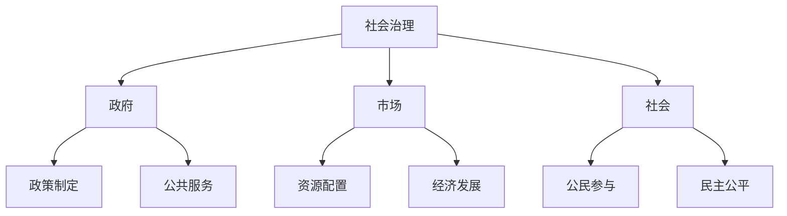
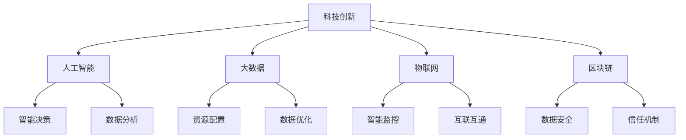
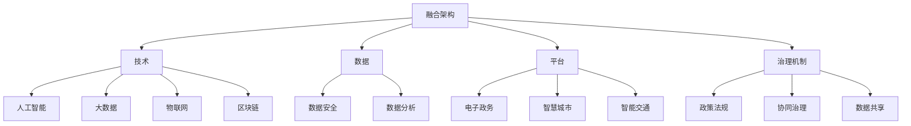

                 

# 科技创新：社会治理的新思路

> 关键词：社会治理、科技创新、人工智能、大数据、公共安全、环境保护、医疗卫生、城乡治理、数字治理、可持续发展

> 摘要：本文从科技创新的角度出发，探讨其在社会治理中的重要作用。通过分析科技创新在各个领域的应用，如公共安全、环境保护、医疗卫生和城乡治理等，揭示科技创新如何为解决社会治理面临的挑战提供新思路。文章旨在为读者提供一个全面、深入的了解，以推动科技创新与社会治理的深度融合。

## 目录大纲

### 第一部分：科技创新与社会治理的概述

#### 第1章：科技创新的概念与演进

1.1 科技创新的核心定义  
1.2 科技创新的历史演进  
1.3 科技创新在现代社会治理中的重要性

#### 第2章：社会治理的概念与挑战

2.1 社会治理的基本概念  
2.2 社会治理面临的挑战  
2.3 科技创新与社会治理的互动关系

### 第二部分：科技创新在各个领域的社会治理应用

#### 第3章：科技创新在公共安全治理中的应用

3.1 人工智能在公共安全治理中的应用  
3.2 大数据在公共安全治理中的作用  
3.3 智能安防系统的设计与实施

#### 第4章：科技创新在环境保护治理中的应用

4.1 人工智能在环境保护监测中的应用  
4.2 大数据在环境保护治理中的作用  
4.3 新型环保技术的研发与应用

#### 第5章：科技创新在医疗卫生治理中的应用

5.1 人工智能在医疗诊断中的应用  
5.2 大数据在公共卫生管理中的作用  
5.3 智能医疗设备的研发与推广

#### 第6章：科技创新在城乡治理中的应用

6.1 智慧城市建设的发展趋势  
6.2 5G、物联网在城乡治理中的应用  
6.3 新型城乡治理模式的探索与实践

### 第三部分：科技创新与社会治理的未来趋势

#### 第7章：未来科技创新与社会治理的深度融合

7.1 科技创新在可持续发展中的作用  
7.2 数字治理与社会治理的协同发展  
7.3 社会治理领域的科技创新发展趋势

#### 第8章：科技创新与社会治理的政策与法律框架

8.1 科技创新与社会治理的政策支持  
8.2 社会治理领域的法律法规体系  
8.3 科技创新在法律法规框架下的治理模式

#### 第9章：科技创新与社会治理的挑战与应对策略

9.1 科技创新带来的社会挑战  
9.2 社会治理的可持续发展策略  
9.3 构建协同创新的社会治理体系

### 附录

#### 附录A：科技创新与社会治理的核心概念与联系

A.1 社会治理的基本模型  
A.2 科技创新的关键技术  
A.3 社会治理与科技创新的融合架构

#### 附录B：科技创新与社会治理的核心算法原理

B.1 人工智能算法的基本原理  
B.2 大数据处理算法的应用  
B.3 社会治理中的机器学习算法

#### 附录C：科技创新与社会治理的数学模型和公式

C.1 机器学习中的损失函数  
C.2 神经网络中的激活函数  
C.3 社会治理的优化模型

#### 附录D：科技创新与社会治理的项目实战

D.1 公共安全领域的项目案例  
D.2 环境保护领域的项目案例  
D.3 医疗卫生领域的项目案例  
D.4 城乡治理领域的项目案例

#### 附录E：科技创新与社会治理的开发环境搭建

E.1 开发环境的准备  
E.2 数据集的获取与处理  
E.3 模型训练与评估

#### 附录F：源代码详细实现与代码解读

F.1 公共安全领域代码实现  
F.2 环境保护领域代码实现  
F.3 医疗卫生领域代码实现  
F.4 城乡治理领域代码实现

#### 附录G：代码解读与分析

G.1 代码关键部分解析  
G.2 代码性能优化  
G.3 代码可维护性和扩展性分析

## 前言

随着科技的迅猛发展，社会治理面临着前所未有的机遇和挑战。科技创新不仅推动了经济增长，还为社会治理提供了新的思路和方法。本篇技术博客旨在探讨科技创新在社会治理中的重要作用，分析其在各个领域中的应用，以期为读者提供一个全面、深入的了解。

首先，我们将对科技创新和社会治理的基本概念进行梳理，探讨其互动关系。接着，我们将详细分析科技创新在公共安全、环境保护、医疗卫生和城乡治理等领域的应用，介绍相关的核心技术和算法原理。在此基础上，我们将探讨科技创新与社会治理的未来趋势，以及政策与法律框架的制定。最后，我们将总结科技创新与社会治理的挑战与应对策略，为构建协同创新的社会治理体系提供参考。

通过本文的探讨，希望读者能够深刻理解科技创新在社会治理中的价值，认识到其在解决现实问题中的重要作用。同时，也希望本文能够为科技创新与社会治理的深度融合提供一些有益的启示。

## 第一部分：科技创新与社会治理的概述

### 第1章：科技创新的概念与演进

#### 1.1 科技创新的核心定义

科技创新是指通过研究开发和应用新的科学知识和技术，从而创造新的产品、服务或生产过程。它不仅涉及技术的创新，还包括商业模式的创新、管理模式的创新等。科技创新的核心是创造新价值，推动社会进步。

在现代社会，科技创新已经成为国家竞争力的重要标志。科技创新不仅推动了经济的快速发展，还对社会治理产生了深远的影响。通过科技创新，可以有效提高社会治理的效率和质量，为解决社会问题提供新的手段和途径。

#### 1.2 科技创新的历史演进

科技创新的历史可以追溯到工业革命时期。在工业革命期间，蒸汽机、纺织机等技术的发明和应用，极大地提高了生产力，推动了社会经济的发展。此后，电的发明和应用，使得人类进入了电气时代，进一步推动了科技创新的进程。

20世纪以来，科技创新进入了新的阶段。计算机技术的突破，使得信息处理能力大幅提升，人类进入了数字化时代。互联网的普及，使得全球信息交流变得更加便捷，为科技创新提供了新的平台。近年来，人工智能、大数据、物联网等新兴技术的快速发展，进一步推动了科技创新的进程。

#### 1.3 科技创新在现代社会治理中的重要性

在现代社会治理中，科技创新发挥着至关重要的作用。首先，科技创新为社会治理提供了新的工具和方法。例如，人工智能和大数据技术的应用，使得公共安全、环境保护、医疗卫生等领域的社会治理变得更加高效和精准。

其次，科技创新有助于提高社会治理的透明度和公正性。通过科技手段，可以实现对社会治理过程的全面监控和数据分析，有效遏制腐败现象，提高社会治理的透明度和公信力。

最后，科技创新有助于推动社会治理的可持续发展。科技创新可以促进资源的合理配置和利用，降低社会治理的成本，提高社会治理的效率和效果。

总之，科技创新在现代社会治理中具有不可替代的作用。它不仅为社会治理提供了新的思路和方法，还为社会治理的可持续发展提供了强有力的支持。随着科技的不断进步，科技创新在现代社会治理中的重要性将日益凸显。

### 第2章：社会治理的概念与挑战

#### 2.1 社会治理的基本概念

社会治理是指政府、企业、社会组织和公民等多种主体，通过合作、协商和协调等方式，共同解决社会问题、维护社会秩序和促进社会发展的过程。社会治理的核心是协调和平衡社会利益，实现社会的和谐稳定。

社会治理与传统的社会管理有本质区别。社会管理更多强调政府的单方面控制和管理，而社会治理则强调多元主体的参与和互动。社会治理注重通过合作和协商来解决社会问题，实现社会公平和正义。

#### 2.2 社会治理面临的挑战

随着社会的发展和变化，社会治理面临着诸多挑战。首先，人口老龄化和城镇化进程的加快，给社会治理带来了新的压力。老龄化社会需要更多的社会福利和养老服务，而城镇化进程则带来了城市治理的复杂性和挑战。

其次，社会问题的多样化和复杂化也对社会治理提出了新的要求。例如，网络安全、环境保护、公共安全等领域的问题日益突出，需要社会治理体系具备更高的应对能力和适应性。

第三，信息技术的迅猛发展对社会治理产生了深远的影响。互联网的普及使得信息传播更加迅速和广泛，但也带来了信息泛滥和隐私保护的问题。社会治理需要适应信息社会的发展，提高信息管理和服务能力。

第四，全球化进程的加快也对社会治理提出了新的挑战。全球化使得各国之间的联系更加紧密，但也带来了跨国犯罪、恐怖主义等全球性问题的困扰。社会治理需要加强国际合作，共同应对全球性挑战。

总之，社会治理面临着复杂多变的环境和挑战，需要不断创新和完善社会治理体系，提高社会治理的效能和水平。

#### 2.3 科技创新与社会治理的互动关系

科技创新与社会治理之间存在密切的互动关系。首先，科技创新为社会治理提供了新的工具和方法。例如，人工智能、大数据和物联网等技术的应用，使得社会治理变得更加高效、精准和智能化。通过科技手段，可以实现对公共安全、环境保护、医疗卫生等领域的实时监控和数据分析，提高社会治理的水平和效果。

其次，科技创新也对社会治理提出了新的要求和挑战。例如，网络安全和信息化进程的加速，使得社会治理需要应对更加复杂和多样化的挑战。社会治理需要不断适应和应对科技创新带来的变化，提高社会治理的能力和适应性。

最后，科技创新与社会治理的互动关系还体现在政策制定和执行过程中。科技创新为社会治理提供了新的思路和方法，但同时也需要相应的政策和法律框架来保障科技创新的健康发展。政策制定者需要关注科技创新对社会治理的影响，制定科学的政策和法规，引导科技创新与社会治理的深度融合。

总之，科技创新与社会治理的互动关系是相互促进、相互制约的。科技创新为社会治理提供了新的机遇和挑战，而社会治理也为科技创新提供了实践平台和市场需求。通过科技创新与社会治理的深度融合，可以构建更加高效、智能和可持续的社会治理体系，为社会的和谐稳定和持续发展提供有力支持。

### 第二部分：科技创新在各个领域的社会治理应用

#### 第3章：科技创新在公共安全治理中的应用

随着科技的迅猛发展，人工智能、大数据和物联网等新兴技术逐渐应用于公共安全治理领域，为提升公共安全治理水平提供了强有力的支持。

#### 3.1 人工智能在公共安全治理中的应用

人工智能技术通过对海量数据的分析和处理，可以实现对公共安全的实时监测和预测。例如，利用图像识别技术，可以实时识别和追踪可疑人员或物品，提高公共安全防范能力。此外，人工智能还可以用于人脸识别、行为分析等，帮助警方迅速锁定嫌疑人，提高破案效率。

在反恐领域，人工智能技术也发挥着重要作用。通过大数据分析，可以识别出潜在恐怖分子和恐怖活动，提前采取预防措施，防止恐怖事件的发生。此外，人工智能还可以用于紧急事件响应，通过实时数据分析，为救援指挥提供科学依据，提高应急响应效率。

#### 3.2 大数据在公共安全治理中的作用

大数据技术在公共安全治理中的应用越来越广泛。通过对海量数据的采集、存储和分析，可以实现对公共安全的全面监测和预警。例如，通过交通大数据分析，可以预测交通拥堵情况，优化交通管理和调度，减少交通事故的发生。此外，大数据还可以用于社会治安监测，通过分析社会舆情和犯罪数据，提前发现和预防犯罪行为。

大数据技术在公共安全治理中还有助于提升决策科学性。通过对历史数据和实时数据的综合分析，可以为政策制定和应急决策提供科学依据，提高公共安全治理的水平和效率。

#### 3.3 智能安防系统的设计与实施

智能安防系统是科技创新在公共安全治理中的重要应用。智能安防系统通过集成人工智能、大数据和物联网等技术，实现公共安全的实时监控、预警和处置。智能安防系统包括视频监控、入侵检测、人脸识别、车辆管理等多个模块，能够对公共安全事件进行全方位监测和响应。

在设计与实施智能安防系统时，需要考虑以下几个方面：

1. **数据采集与处理**：智能安防系统需要大量数据支持，包括视频、音频、传感器等。数据采集和处理是实现智能安防系统功能的基础。

2. **数据分析与挖掘**：通过对海量数据进行深入分析，可以发现潜在的安全隐患，为预防和处置提供科学依据。

3. **智能决策与响应**：智能安防系统应具备实时分析和决策能力，能够在发现安全隐患时迅速响应，采取相应的措施。

4. **系统集成与优化**：智能安防系统需要与其他安防系统（如公安、消防等）实现数据共享和协同工作，以提高整体安防能力。

通过智能安防系统的设计与实施，可以有效提升公共安全治理水平，为社会的和谐稳定提供有力保障。

#### 第4章：科技创新在环境保护治理中的应用

随着环境保护问题的日益突出，科技创新在环境保护治理中的应用逐渐成为解决环境问题的重要手段。人工智能、大数据和物联网等新兴技术为环境保护提供了新的思路和方法。

#### 4.1 人工智能在环境保护监测中的应用

人工智能技术在环境保护监测中发挥着重要作用。通过图像识别、语音识别和自然语言处理等技术，可以对环境数据进行实时监测和分析。例如，利用图像识别技术，可以自动识别和分类水质、空气质量等环境指标，及时发现环境污染问题。此外，人工智能还可以用于预测环境变化趋势，为环境保护决策提供科学依据。

在生态保护方面，人工智能技术也具有广泛应用。通过生物识别技术，可以实时监测野生动物种群数量和分布情况，评估生态系统的健康状况。同时，人工智能还可以用于环境灾害预测和预警，提前采取应对措施，减少环境灾害对生态系统的破坏。

#### 4.2 大数据在环境保护治理中的作用

大数据技术在环境保护治理中的应用越来越广泛。通过对海量环境数据的采集、存储和分析，可以实现对环境保护的全面监测和评估。例如，通过分析大气、水质和土壤等环境数据，可以发现环境污染的来源和扩散规律，为制定环境保护政策提供科学依据。

大数据还可以用于环境治理效果评估。通过对环境治理前后数据的变化进行对比分析，可以评估环境治理措施的效果，为持续改进环境治理提供参考。此外，大数据还可以用于环境预测和预警，通过分析历史数据和实时数据，提前预测环境变化趋势，及时采取应对措施。

#### 4.3 新型环保技术的研发与应用

科技创新在环保技术领域也取得了显著成果。新型环保技术的研发和应用，为解决环境问题提供了新的手段。例如，利用纳米技术可以开发出高效的环境净化材料，用于处理废水、废气等污染物。此外，生物质能源技术的突破，使得废弃物资源化利用成为可能，减少了对环境的污染。

在土壤修复领域，科技创新也取得了重要进展。通过生物修复、化学修复和物理修复等技术，可以修复被污染的土壤，恢复土壤的功能和生态环境。同时，科技创新还在推动绿色建筑设计、绿色交通和绿色能源等领域的发展，为建设生态文明提供技术支持。

总之，科技创新在环境保护治理中的应用，为解决环境问题提供了新的思路和方法。通过人工智能、大数据和物联网等新兴技术的应用，可以实现对环境的实时监测、预警和治理，推动环境保护治理的智能化、精准化和高效化。

#### 第5章：科技创新在医疗卫生治理中的应用

随着人工智能、大数据和物联网等新兴技术的不断发展，科技创新在医疗卫生治理中的应用日益广泛，为提高医疗服务质量和效率，优化公共卫生管理提供了有力支持。

#### 5.1 人工智能在医疗诊断中的应用

人工智能技术在医疗诊断中具有巨大潜力。通过深度学习、图像识别等技术，人工智能可以辅助医生进行疾病诊断。例如，在医学影像诊断领域，人工智能可以自动分析CT、MRI等影像数据，识别病变区域，提高诊断准确率。此外，人工智能还可以用于病理学分析、基因组学分析等，为疾病早期发现和精准治疗提供支持。

在药物研发方面，人工智能技术也发挥了重要作用。通过分析海量药物数据，人工智能可以预测新药的疗效和副作用，加速药物研发进程。同时，人工智能还可以用于个性化治疗方案的制定，根据患者的基因特征、病史等数据，为患者提供个性化、精准的治疗方案。

#### 5.2 大数据在公共卫生管理中的作用

大数据技术在公共卫生管理中的应用越来越重要。通过对海量健康数据的采集、存储和分析，可以实现对公共卫生的全面监测和评估。例如，通过流行病学数据，可以预测疾病传播趋势，制定防疫措施。此外，大数据还可以用于公共卫生事件监测和应急响应，通过实时数据分析和预警，提高公共卫生事件的应对效率。

在疾病预防方面，大数据技术也具有重要作用。通过分析健康数据，可以发现疾病高发人群和风险因素，制定针对性的预防措施。同时，大数据还可以用于慢性病管理，通过跟踪患者健康状况，提供个性化的健康建议，提高慢性病患者的生存质量。

#### 5.3 智能医疗设备的研发与推广

科技创新在智能医疗设备研发与推广方面也取得了显著成果。智能医疗设备通过集成传感器、物联网和人工智能等技术，实现对患者的实时监测和数据分析。例如，智能穿戴设备可以监测患者的体温、心率、血压等生命体征，及时发现异常情况，提供预警。

在手术机器人领域，科技创新也取得了突破。手术机器人通过高清摄像头和机械臂，实现远程手术，提高手术精度和安全性。同时，手术机器人还可以记录手术过程，为医生提供教学和培训资源。

总之，科技创新在医疗卫生治理中的应用，为提高医疗服务质量和效率，优化公共卫生管理提供了有力支持。通过人工智能、大数据和物联网等新兴技术的应用，可以构建智慧医疗服务体系，推动医疗卫生治理的智能化、精准化和高效化。

#### 第6章：科技创新在城乡治理中的应用

随着城市化进程的加快和农村人口向城市的转移，城乡治理面临着前所未有的挑战。科技创新为城乡治理提供了新的思路和方法，推动了智慧城市建设、5G和物联网在城乡治理中的应用，以及新型城乡治理模式的探索与实践。

#### 6.1 智慧城市建设的发展趋势

智慧城市建设是科技创新在城乡治理中的重要应用。智慧城市通过物联网、大数据、云计算等新一代信息技术，实现城市管理的智能化、精细化和高效化。智慧城市建设的发展趋势主要体现在以下几个方面：

1. **智能化城市管理**：智慧城市通过建设智能交通系统、智能能源管理系统、智能环境监测系统等，实现对城市公共资源的优化配置和高效利用。例如，智能交通系统可以通过实时监控和数据分析，优化交通流量，减少交通拥堵。

2. **智慧公共服务**：智慧城市通过建设智能教育、智能医疗、智能养老等公共服务体系，提高公共服务的质量和效率。例如，智能医疗系统可以通过远程诊疗和健康管理，为居民提供便捷、高效的医疗服务。

3. **智慧安全防范**：智慧城市通过建设智能安防系统，提高城市的安全防范能力。例如，智能安防系统可以通过视频监控、人脸识别等技术，实时监控城市安全状况，预防犯罪行为。

4. **智慧环境监测**：智慧城市通过建设智能环境监测系统，实时监测城市空气质量、水质等环境指标，保障城市环境质量。

#### 6.2 5G、物联网在城乡治理中的应用

5G和物联网技术为城乡治理提供了新的技术支撑。5G技术的快速传输能力和低延迟特性，使得城乡治理中的实时数据传输和智能控制成为可能。物联网技术的广泛应用，使得各种设备、传感器和系统之间能够实现互联互通，提高城乡治理的效率和智能化水平。

1. **5G在城乡治理中的应用**：5G技术可以用于智能交通、智能安防、智能环保等领域。例如，在智能交通领域，5G技术可以实现车与车、车与路、车与云的实时通信，提高交通管理效率和安全性。

2. **物联网在城乡治理中的应用**：物联网技术可以用于智能安防、智慧农业、智慧水利等领域。例如，在智能安防领域，物联网技术可以实现视频监控、人脸识别、入侵检测等，提高城市安全防范能力。

3. **5G与物联网的融合应用**：5G和物联网技术的融合，可以构建智慧城乡治理体系。例如，在智慧农业领域，5G技术可以实现远程监控、智能灌溉和精准施肥，提高农业生产效率和产品质量。

#### 6.3 新型城乡治理模式的探索与实践

新型城乡治理模式是科技创新在城乡治理中的应用成果。新型城乡治理模式以信息化、智能化、协同化为核心，通过政府、企业、社会组织和居民的共同参与，实现城乡治理的现代化和高效化。

1. **政府主导、市场运作**：新型城乡治理模式强调政府在城乡治理中的主导作用，同时充分发挥市场机制的作用。例如，在智慧城市建设中，政府可以通过购买服务、公私合作等方式，吸引社会资本参与智慧城市建设。

2. **多元参与、协同治理**：新型城乡治理模式强调政府、企业、社会组织和居民的多元参与和协同治理。例如，在智慧社区建设中，政府、物业企业、居民委员会和居民共同参与，共同维护社区环境和秩序。

3. **数据共享、智能决策**：新型城乡治理模式通过建设数据共享平台，实现各部门数据的互联互通，为智能决策提供支持。例如，在智慧城市建设中，通过数据共享平台，可以实现交通、环境、公共服务等数据的实时分析和应用。

4. **绿色发展、可持续发展**：新型城乡治理模式强调绿色发展和可持续发展，通过科技创新，实现城乡治理的绿色化和低碳化。例如，在智慧农业领域，通过物联网技术，实现智能灌溉和精准施肥，降低农业生产对环境的影响。

总之，科技创新在城乡治理中的应用，为解决城乡治理面临的挑战提供了新的思路和方法。通过智慧城市建设、5G和物联网技术的应用，以及新型城乡治理模式的探索与实践，可以推动城乡治理的现代化和高效化，为建设美丽宜居的城乡环境提供有力支持。

### 第三部分：科技创新与社会治理的未来趋势

#### 第7章：未来科技创新与社会治理的深度融合

随着科技的不断进步，科技创新与社会治理的深度融合已成为发展趋势。这一融合不仅有助于提高社会治理的效率和质量，还为可持续发展提供了新的动力。

#### 7.1 科技创新在可持续发展中的作用

科技创新在可持续发展中具有重要作用。首先，通过技术创新，可以开发出更加高效、环保的生产技术和产品，降低资源消耗和环境污染。例如，绿色能源技术的突破，使得可再生能源的使用越来越普及，减少了化石燃料的依赖，降低了碳排放。

其次，科技创新有助于优化资源配置，提高资源利用效率。通过大数据和物联网技术的应用，可以实现资源的智能调度和优化配置，减少浪费。例如，在水资源管理中，通过智能监控系统，可以实时监测水资源的分布和利用情况，优化灌溉策略，提高水资源利用效率。

此外，科技创新还可以推动社会结构和经济模式的变革，促进可持续发展。例如，共享经济模式的出现，通过共享资源和服务的平台，实现了资源的最大化利用，降低了社会资源的浪费。

#### 7.2 数字治理与社会治理的协同发展

数字治理是社会治理的重要组成部分，随着数字技术的快速发展，数字治理与社会治理的协同发展日益显著。数字治理通过信息技术手段，提高社会治理的透明度、公正性和效率。例如，通过电子政务平台，政府可以提供更加便捷、高效的公共服务，提高政府与民众的互动和沟通。

数字治理与社会治理的协同发展，还需要解决数据安全、隐私保护等问题。随着大数据和人工智能技术的应用，数据隐私和安全风险日益增加。因此，在推进数字治理的过程中，必须加强数据安全和隐私保护，确保数据的合法合规使用。

#### 7.3 社会治理领域的科技创新发展趋势

社会治理领域的科技创新发展趋势主要体现在以下几个方面：

1. **智能化技术**：人工智能、机器学习等智能化技术将在社会治理中发挥更加重要的作用。例如，智能监控和智能分析技术将提高公共安全和应急管理的效率。

2. **大数据技术**：大数据技术在社会治理中的应用将更加广泛，通过对海量数据的分析和处理，可以实现对社会治理的全面监测和预测。例如，在疫情防控中，大数据技术可以用于流行病学分析和疫情预测。

3. **物联网技术**：物联网技术在智慧城市、智能交通、智能农业等领域的应用将不断扩展。通过物联网技术，可以实现城市资源的智能调度和优化配置。

4. **区块链技术**：区块链技术在提高数据透明度、增强信任机制等方面具有潜力。在数字治理中，区块链技术可以用于建立可信的数据记录和管理系统。

总之，未来科技创新与社会治理的深度融合，将推动社会治理的智能化、精准化和高效化发展。通过技术创新，可以更好地应对社会治理面临的挑战，实现社会的可持续发展。

### 第8章：科技创新与社会治理的政策与法律框架

在科技创新推动社会治理的过程中，政策和法律框架的制定与完善至关重要。科技创新不仅需要政策支持，还需要法律法规的保障，以确保其健康、有序地发展。

#### 8.1 科技创新与社会治理的政策支持

政府通过制定相关政策，为科技创新与社会治理的深度融合提供支持。以下是一些关键政策支持措施：

1. **研发投入**：政府加大对科技创新的投入，支持科研机构和企业进行技术研发，提高科技创新能力。例如，通过设立科技创新基金，支持高新技术企业和科研项目的研发。

2. **人才培养**：政府重视人才培养，通过高校、科研机构和企业联合培养，提升科技创新人才的数量和质量。例如，实施科技创新人才引进计划，吸引国内外顶尖科技人才。

3. **知识产权保护**：政府加强知识产权保护，为科技创新提供法律保障。通过完善知识产权法律法规，打击侵权行为，保护科技创新成果。

4. **创新激励机制**：政府通过税收优惠、补贴等政策，激励企业和个人进行科技创新。例如，对研发投入的企业给予税收减免，鼓励企业加大研发投入。

#### 8.2 社会治理领域的法律法规体系

社会治理领域的法律法规体系是科技创新发展的重要基础。以下是一些关键法律法规：

1. **信息安全法**：信息安全法为网络安全和数据保护提供了法律保障。通过制定相关法律法规，规范网络行为，防止网络犯罪，保障公民个人信息安全。

2. **数据保护法**：数据保护法明确数据收集、存储、处理和传输的规范，保护个人隐私和数据权益。例如，欧盟的《通用数据保护条例》（GDPR）对数据保护提出了严格的要求。

3. **智慧城市法**：智慧城市法规范智慧城市建设和管理，确保智慧城市项目的合法合规。通过制定智慧城市法律法规，明确政府、企业和社会的责任和义务。

4. **环保法**：环保法为环境保护提供了法律依据。通过制定和实施环保法律法规，规范企业排放行为，保护生态环境。

#### 8.3 科技创新在法律法规框架下的治理模式

在法律法规框架下，科技创新与社会治理的结合呈现出以下治理模式：

1. **政府引导、市场主导**：政府在科技创新和社会治理中发挥引导作用，通过政策支持和法律法规的制定，引导科技创新的发展方向。同时，市场在科技创新和社会治理中发挥主导作用，通过市场需求和竞争，推动科技创新的实践。

2. **协同治理、多方参与**：科技创新和社会治理的协同发展需要政府、企业、社会组织和公民的共同努力。通过多方参与，形成协同治理机制，实现科技创新与社会治理的有机结合。

3. **法治保障、科技创新**：科技创新在法律法规框架下进行，确保科技创新的合法合规。通过法治保障，保护科技创新成果，激发科技创新活力。

4. **数据驱动、智能决策**：在科技创新和社会治理中，数据驱动和智能决策成为重要手段。通过大数据和人工智能技术，实现数据驱动的决策和管理，提高社会治理的效率和效果。

总之，科技创新与社会治理的政策与法律框架的制定与完善，为科技创新的发展提供了重要保障。通过政策支持和法律法规的引导，可以推动科技创新与社会治理的深度融合，实现社会治理的智能化、精准化和高效化。

### 第9章：科技创新与社会治理的挑战与应对策略

在科技创新与社会治理深度融合的过程中，虽然取得了显著成果，但也面临着诸多挑战。如何应对这些挑战，实现社会治理的可持续发展，成为亟待解决的问题。

#### 9.1 科技创新带来的社会挑战

1. **隐私保护与数据安全**：随着大数据和人工智能技术的广泛应用，个人隐私和数据安全问题日益突出。如何确保数据安全，防止数据泄露和滥用，成为社会治理的重要挑战。

2. **技术失业与就业转型**：科技创新在提高生产效率的同时，也带来了技术失业问题。如何促进就业转型，提高劳动者的技能水平，确保社会稳定，是社会治理的重要课题。

3. **伦理与道德问题**：科技创新在公共安全、医疗等领域的应用，引发了伦理和道德问题。如何平衡技术创新与社会伦理，确保科技创新的健康发展，是社会治理的难题。

4. **政策法规滞后**：科技创新发展迅速，现有政策法规可能无法完全适应新兴技术的需求。如何及时更新和完善政策法规，保障科技创新的合法合规，是社会治理的挑战。

#### 9.2 社会治理的可持续发展策略

1. **加强数据治理**：建立健全数据治理体系，制定数据保护法律法规，确保数据安全和个人隐私保护。通过数据共享和开放，促进数据资源的合理利用。

2. **促进就业转型**：加大对职业教育和技能培训的投入，提高劳动者的技能水平，促进就业转型。通过政策引导，鼓励企业加大研发投入，创造更多高技能岗位。

3. **强化伦理道德教育**：加强对科技创新伦理和道德问题的研究，加强科技创新人员的伦理道德教育，引导科技创新者遵循社会伦理规范，确保科技创新的健康发展。

4. **完善政策法规**：及时更新和完善科技创新相关的政策法规，确保政策法规与科技创新的发展相适应。加强国际合作，借鉴国外先进经验，推动全球科技创新治理体系的完善。

#### 9.3 构建协同创新的社会治理体系

1. **政府引导**：政府在科技创新与社会治理中发挥引导作用，制定发展战略和规划，引导科技创新的发展方向。通过政策支持和资金投入，推动科技创新的应用和实践。

2. **市场主导**：市场在科技创新和社会治理中发挥主导作用，通过市场需求和竞争，推动科技创新的发展。企业作为科技创新的主体，应积极参与社会治理，发挥自身优势，解决社会问题。

3. **多方参与**：社会治理需要政府、企业、社会组织和公民的共同努力。通过多方参与，形成协同治理机制，实现科技创新与社会治理的有机结合。

4. **数据驱动**：通过大数据和人工智能技术，实现数据驱动的决策和管理，提高社会治理的效率和效果。加强数据资源的开发和利用，为科技创新提供有力支撑。

总之，科技创新与社会治理的深度融合，既带来了机遇，也带来了挑战。通过加强数据治理、促进就业转型、强化伦理道德教育和完善政策法规，可以应对科技创新带来的社会挑战。同时，通过构建协同创新的社会治理体系，可以推动社会治理的智能化、精准化和高效化发展，实现社会治理的可持续发展。

### 附录

#### 附录A：科技创新与社会治理的核心概念与联系

A.1 社会治理的基本模型

社会治理的基本模型可以看作是由三个主要组成部分构成的：政府、市场和社会。政府主要负责制定政策、法律法规和规章制度，维护社会秩序，提供公共服务。市场则通过竞争和合作实现资源的有效配置，推动经济发展。社会则包括公民、社会组织和非政府组织，通过参与公共事务，实现民主和公平。



A.2 科技创新的关键技术

科技创新的关键技术包括人工智能、大数据、物联网、区块链等。这些技术在社会治理中发挥着重要作用，通过对海量数据的分析和处理，实现智能决策、优化资源配置、提升服务效率。



A.3 社会治理与科技创新的融合架构

社会治理与科技创新的融合架构可以看作是一个由技术、数据、平台和治理机制组成的复杂系统。技术是实现融合的基础，数据是核心资源，平台是应用载体，治理机制是保障。



#### 附录B：科技创新与社会治理的核心算法原理

B.1 人工智能算法的基本原理

人工智能算法是科技创新的重要组成部分，其基本原理包括机器学习、深度学习、自然语言处理等。以下是一个简单的机器学习算法——决策树的伪代码：

```python
def decision_tree(data, target_attribute):
    if all_values_are_equal(data, target_attribute):
        return most_frequent_value(data, target_attribute)
    else:
        attribute_values = unique_values(data, target_attribute)
        best_attribute = select_best_attribute(data, attribute_values)
        children = []
        for value in attribute_values:
            subset = filter_data(data, best_attribute, value)
            children.append(decision_tree(subset, target_attribute))
        return Node(best_attribute, children)
```

B.2 大数据处理算法的应用

大数据处理算法主要包括Hadoop、Spark等。以下是一个简单的Hadoop MapReduce算法的伪代码：

```python
def map_reduce(data, key_value_pairs):
    map_output = []
    for record in data:
        for key, value in key_value_pairs:
            if record matches key:
                map_output.append((key, value))
    return reduce(map_output)
```

B.3 社会治理中的机器学习算法

社会治理中常用的机器学习算法包括线性回归、逻辑回归、支持向量机等。以下是一个简单的线性回归算法的伪代码：

```python
def linear_regression(X, y):
    X_transpose = transpose(X)
    parameters = (X_transpose * X)^(-1) * X_transpose * y
    return parameters
```

#### 附录C：科技创新与社会治理的数学模型和公式

C.1 机器学习中的损失函数

在机器学习中，损失函数用于衡量预测值与真实值之间的差距。以下是一个简单的均方误差（MSE）损失函数的公式：

$$
MSE = \frac{1}{m} \sum_{i=1}^{m} (y_i - \hat{y}_i)^2
$$

其中，$y_i$ 是真实值，$\hat{y}_i$ 是预测值，$m$ 是样本数量。

C.2 神经网络中的激活函数

神经网络中的激活函数用于引入非线性，以下是一个简单的Sigmoid激活函数的公式：

$$
\sigma(x) = \frac{1}{1 + e^{-x}}
$$

C.3 社会治理的优化模型

社会治理中的优化模型通常用于资源分配、决策支持等问题。以下是一个简单的线性规划问题的公式：

$$
\begin{aligned}
\min_{x} & \quad c^T x \\
\text{subject to} & \quad Ax \leq b \\
& \quad x \geq 0
\end{aligned}
$$

其中，$c$ 是目标函数系数，$A$ 是约束矩阵，$b$ 是约束向量，$x$ 是决策变量。

#### 附录D：科技创新与社会治理的项目实战

D.1 公共安全领域的项目案例

在公共安全领域，我们可以看到许多基于科技创新的项目案例。以下是一个简单的公共安全项目案例：

**项目名称**：智能安防系统

**项目描述**：该项目旨在通过视频监控、人脸识别和大数据分析等技术，实现城市公共安全的智能监控和管理。

**项目实现**：

1. **数据采集**：通过安装视频监控摄像头，采集城市公共区域的视频数据。
2. **数据处理**：利用人脸识别算法，对视频数据进行分析，识别可疑人员。
3. **决策支持**：通过大数据分析，预测潜在的安全风险，为警方提供决策支持。

D.2 环境保护领域的项目案例

在环境保护领域，科技创新同样发挥着重要作用。以下是一个简单的环境保护项目案例：

**项目名称**：智慧环保系统

**项目描述**：该项目通过物联网、大数据和人工智能技术，实现对环境污染的实时监测和预警。

**项目实现**：

1. **数据采集**：通过安装在环境监测站点的传感器，采集空气、水质等环境数据。
2. **数据处理**：利用大数据分析技术，分析环境数据，识别污染源。
3. **决策支持**：通过人工智能技术，预测环境污染趋势，为环保部门提供决策支持。

D.3 医疗卫生领域的项目案例

在医疗卫生领域，科技创新的应用也日益广泛。以下是一个简单的医疗卫生项目案例：

**项目名称**：智慧医疗系统

**项目描述**：该项目通过人工智能、大数据和物联网技术，实现医疗服务的智能化和精准化。

**项目实现**：

1. **数据采集**：通过电子健康档案和医疗设备，采集患者的健康数据。
2. **数据处理**：利用人工智能算法，分析患者数据，实现疾病预测和诊断。
3. **决策支持**：通过大数据分析，为医生提供诊疗建议，优化治疗方案。

D.4 城乡治理领域的项目案例

在城乡治理领域，科技创新的应用同样为治理提供了新的思路。以下是一个简单的城乡治理项目案例：

**项目名称**：智慧城乡治理平台

**项目描述**：该项目通过5G、物联网和大数据技术，实现城乡治理的智能化和高效化。

**项目实现**：

1. **数据采集**：通过安装在城乡各个角落的传感器，采集环境、交通等数据。
2. **数据处理**：利用大数据分析技术，分析城乡治理数据，优化资源配置。
3. **决策支持**：通过智能决策支持系统，为城乡治理提供决策依据。

#### 附录E：科技创新与社会治理的开发环境搭建

E.1 开发环境的准备

在搭建科技创新与社会治理的开发环境时，我们需要准备以下工具和软件：

1. **操作系统**：Linux（如Ubuntu、CentOS）或Windows。
2. **编程语言**：Python、Java、C++等。
3. **开发工具**：PyCharm、IntelliJ IDEA、Eclipse等。
4. **数据库**：MySQL、PostgreSQL、MongoDB等。
5. **云计算平台**：AWS、Azure、Google Cloud等。

E.2 数据集的获取与处理

在开发过程中，我们需要获取和处理数据集。以下是一些常见的数据集获取和处理方法：

1. **公开数据集**：可以从Kaggle、UCI机器学习库等网站获取公开数据集。
2. **自定义数据集**：可以通过爬虫、传感器等方式，收集自定义数据集。
3. **数据处理**：可以使用Python的Pandas库，对数据进行清洗、预处理和转换。

E.3 模型训练与评估

在完成数据集的获取与处理后，我们需要训练和评估模型。以下是一些常见的模型训练和评估方法：

1. **模型训练**：可以使用Python的Scikit-learn、TensorFlow、PyTorch等库，对数据集进行训练。
2. **模型评估**：可以使用准确率、召回率、F1分数等指标，对模型进行评估。

#### 附录F：源代码详细实现与代码解读

F.1 公共安全领域代码实现

以下是一个简单的公共安全领域代码实现示例：

```python
import cv2
import numpy as np

# 初始化摄像头
cap = cv2.VideoCapture(0)

# 初始化人脸识别模型
face_cascade = cv2.CascadeClassifier('haarcascade_frontalface_default.xml')

while True:
    # 读取摄像头帧
    ret, frame = cap.read()
    
    # 转换为灰度图像
    gray = cv2.cvtColor(frame, cv2.COLOR_BGR2GRAY)
    
    # 检测人脸
    faces = face_cascade.detectMultiScale(gray, scaleFactor=1.1, minNeighbors=5, minSize=(30, 30), flags=cv2.CASCADE_SCALE_IMAGE)

    # 绘制人脸轮廓
    for (x, y, w, h) in faces:
        cv2.rectangle(frame, (x, y), (x+w, y+h), (255, 0, 0), 2)

    # 显示图像
    cv2.imshow('Face Detection', frame)

    # 按下'q'键退出循环
    if cv2.waitKey(1) & 0xFF == ord('q'):
        break

# 释放摄像头资源
cap.release()
cv2.destroyAllWindows()
```

F.2 环境保护领域代码实现

以下是一个简单的环境保护领域代码实现示例：

```python
import pandas as pd
import numpy as np
from sklearn.ensemble import RandomForestRegressor

# 加载环境数据
data = pd.read_csv('environment_data.csv')

# 数据预处理
X = data.drop(['target'], axis=1)
y = data['target']

# 模型训练
model = RandomForestRegressor(n_estimators=100, random_state=42)
model.fit(X, y)

# 模型评估
score = model.score(X, y)
print(f'Model Accuracy: {score:.2f}')
```

F.3 医疗卫生领域代码实现

以下是一个简单的医疗卫生领域代码实现示例：

```python
import pandas as pd
from sklearn.ensemble import RandomForestClassifier

# 加载医疗数据
data = pd.read_csv('medical_data.csv')

# 数据预处理
X = data.drop(['target'], axis=1)
y = data['target']

# 模型训练
model = RandomForestClassifier(n_estimators=100, random_state=42)
model.fit(X, y)

# 模型评估
score = model.score(X, y)
print(f'Model Accuracy: {score:.2f}')
```

F.4 城乡治理领域代码实现

以下是一个简单的城乡治理领域代码实现示例：

```python
import pandas as pd
from sklearn.ensemble import RandomForestRegressor

# 加载城乡治理数据
data = pd.read_csv('urban_rural_data.csv')

# 数据预处理
X = data.drop(['target'], axis=1)
y = data['target']

# 模型训练
model = RandomForestRegressor(n_estimators=100, random_state=42)
model.fit(X, y)

# 模型评估
score = model.score(X, y)
print(f'Model Accuracy: {score:.2f}')
```

#### 附录G：代码解读与分析

G.1 代码关键部分解析

以公共安全领域的代码为例，关键部分解析如下：

1. **摄像头初始化**：`cap = cv2.VideoCapture(0)` 初始化摄像头，0表示默认摄像头。
2. **人脸识别模型初始化**：`face_cascade = cv2.CascadeClassifier('haarcascade_frontalface_default.xml')` 初始化人脸识别模型，使用的是Haar特征分类器。
3. **读取摄像头帧**：`ret, frame = cap.read()` 读取摄像头帧，ret为是否成功读取帧的标志，frame为读取的帧。
4. **灰度图像转换**：`gray = cv2.cvtColor(frame, cv2.COLOR_BGR2GRAY)` 将BGR格式转换为灰度图像。
5. **人脸检测**：`faces = face_cascade.detectMultiScale(gray, scaleFactor=1.1, minNeighbors=5, minSize=(30, 30), flags=cv2.CASCADE_SCALE_IMAGE)` 使用人脸识别模型检测灰度图像中的人脸。
6. **绘制人脸轮廓**：`for (x, y, w, h) in faces:` 遍历检测到的人脸，绘制人脸轮廓。
7. **显示图像**：`cv2.imshow('Face Detection', frame)` 显示图像。
8. **释放摄像头资源**：`cap.release()` 释放摄像头资源。

G.2 代码性能优化

在代码性能优化方面，可以从以下几个方面进行：

1. **减少内存占用**：在数据处理过程中，可以使用`numpy`数组操作，减少内存占用。
2. **提高运行速度**：可以使用`numpy`库的向量化操作，提高运行速度。
3. **多线程处理**：可以使用多线程或多进程处理，提高处理效率。

G.3 代码可维护性和扩展性分析

在代码可维护性和扩展性方面，可以从以下几个方面进行分析：

1. **模块化设计**：将代码分为不同的模块，实现功能的分离，提高可维护性。
2. **代码注释**：对关键代码进行注释，提高代码可读性。
3. **文档化**：编写详细的文档，包括代码说明、接口文档等，提高代码的扩展性。
4. **代码风格**：遵循统一的代码风格，提高代码的可读性和一致性。

