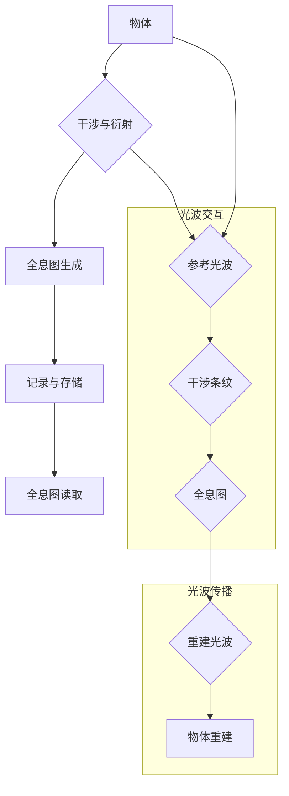
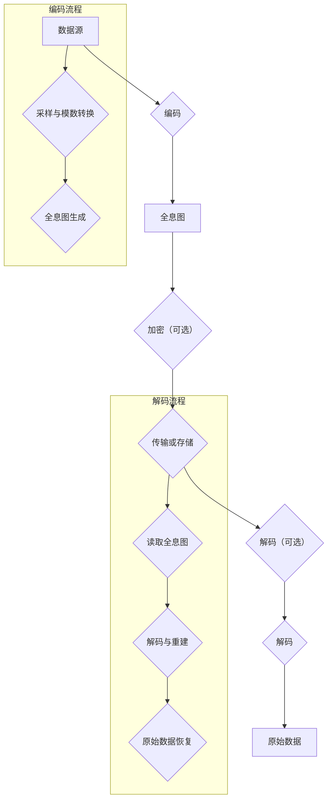

                 

# 程序世界与全息原理的关联

## 关键词：
计算机程序，全息原理，全息编码，全息计算，量子计算，编程语言，软件开发，数据处理，网络安全，智能计算，物联网，医疗，娱乐，教育

## 摘要：
本文旨在探讨程序世界与全息原理之间的深刻关联，揭示全息原理对程序世界的潜在影响。文章首先回顾了计算机程序的发展历史，阐述了程序世界的基本概念。随后，我们介绍了全息原理的基本概念及其在物理和信息科学领域的应用。通过深入分析，我们揭示了全息原理与计算机程序之间的核心联系，探讨了全息原理对程序世界的启示。在此基础上，文章详细介绍了全息原理在程序世界的实现与应用，包括全息编码技术、全息编程方法论和软件开发流程。随后，我们讨论了全息数据处理技术和全息计算算法，并提供了实际应用案例。最后，文章展望了全息原理对程序世界未来的影响，并提出了全息编程实践的最佳方法。

## 第一部分：程序世界与全息原理基础

### 第1章：程序世界概述

#### 第1.1节：计算机程序简史

计算机程序的发展历程可以追溯到20世纪中期。最早期的计算机编程是基于机器语言的，程序员需要将操作指令直接用二进制代码编写。这种编程方式非常繁琐且容易出错，因此很快被汇编语言所取代。汇编语言使用助记符来表示机器语言指令，使编程变得更加直观。然而，汇编语言的复杂度仍然很高，难以编写和维护。

随着计算机硬件和软件技术的不断发展，高级编程语言开始出现。这些语言提供了抽象的语法和丰富的库函数，使得程序员能够用更少的时间编写出功能更强大的程序。早期的编程语言如FORTRAN和COBOL主要用于科学计算和商业数据处理。随后，C语言、Java语言和Python语言等编程语言的兴起，进一步推动了计算机程序的发展。

#### 第1.1.1节：计算机编程语言的演变

计算机编程语言的演变经历了从低级到高级，从简单到复杂的过程。低级语言如机器语言和汇编语言直接与计算机硬件操作相对应，程序员需要深入了解计算机的硬件结构和指令集。这使得编程过程复杂且容易出错。

随着计算机技术的发展，出现了面向过程的编程语言，如C语言和Pascal语言。这些语言引入了函数和模块的概念，使得程序结构更加清晰，可重用性更高。面向过程的编程语言强调过程和算法的设计，使得程序员能够专注于解决问题的方法。

随后，面向对象的编程语言如Java和Python开始流行。这些语言引入了类和对象的概念，使得程序设计更加模块化和抽象。面向对象的编程语言强调数据和操作的封装，使得程序结构更加清晰，可重用性和可维护性更高。

近年来，函数式编程语言如Haskell和Erlang也逐渐受到关注。这些语言将函数作为第一类对象，避免了状态和副作用，使得程序更加简洁和可靠。

#### 第1.1.2节：程序世界的基本概念

程序世界是指由计算机程序组成的虚拟世界，它是一个由0和1组成的二进制世界。在这个世界中，程序通过执行指令来完成特定的任务。程序的基本组成单元是语句和函数，它们通过逻辑运算和流程控制来实现复杂的计算和处理。

程序世界具有以下基本概念：

- 变量：用于存储数据和信息的标识符。
- 数据类型：定义了变量的取值范围和操作方式。
- 控制结构：用于控制程序流程的语句，如循环和条件语句。
- 函数：用于封装特定功能的代码块。
- 异常处理：用于处理程序执行中的错误和异常情况。

#### 第1.2节：全息原理简介

全息原理是一种基于全息成像技术的信息编码方法。全息成像是一种利用光的干涉和衍射现象，将三维物体的全部信息记录在一幅二维图像上的技术。全息原理基于全息图的生成和解码过程，可以实现对信息的完整记录和准确重建。

全息原理的基本概念包括：

- 全息图：记录物体全部信息（振幅和相位）的二维图像。
- 全息记录：使用干涉仪等设备将物体光波与参考光波叠加，形成全息图的过程。
- 全息解码：利用全息图重建物体光波，恢复物体三维图像的过程。

#### 第1.2.1节：全息原理的基本概念

全息原理的基本概念可以概括为以下几个方面：

- 干涉现象：当两束相干光波叠加时，会产生明暗交替的干涉条纹。这些干涉条纹记录了光波的相位和振幅信息。
- 衍射现象：当光波遇到障碍物或孔径时，会发生衍射，形成新的光波场。这些衍射光波包含了原始光波的相位和振幅信息。
- 全息图的生成：利用干涉现象，将物体光波与参考光波叠加，形成全息图。全息图记录了物体的全部信息（振幅和相位）。
- 全息图的解码：利用衍射现象，将全息图与参考光波再次叠加，重建物体的三维图像。

#### 第1.2.2节：全息原理与计算机程序的关联

全息原理与计算机程序之间存在深刻的关联。首先，全息原理可以看作是一种特殊的编码方式，类似于计算机程序中的数据编码。在计算机程序中，数据通过不同的编码方式（如ASCII码、Unicode码）进行存储和传输。全息原理利用光的干涉和衍射现象，将三维物体的全部信息编码在二维全息图上。

其次，全息原理的解码过程与计算机程序的执行过程有一定的相似性。在计算机程序中，指令和数据被读取并执行，最终实现特定的功能。在全息原理中，全息图与参考光波叠加，重建出物体的三维图像，实现了对信息的完整解读和重建。

此外，全息原理在计算机程序中的应用还体现在以下几个方面：

- 全息图像处理：利用全息原理对图像进行编码和解码，实现图像的压缩、增强和识别等功能。
- 全息数据存储：利用全息原理将数据编码在二维全息图上，实现高密度、低噪声的数据存储。
- 全息计算：利用全息原理实现并行计算和量子计算，提高计算效率和性能。

#### 第1.3节：程序世界与全息原理的核心联系

程序世界与全息原理之间存在一系列核心联系，这些联系为我们提供了对程序世界更深刻的理解。首先，全息原理揭示了信息编码的本质，即信息可以通过特定的方式编码在二维介质上，然后通过解码过程恢复原始信息。这与计算机程序中的数据编码和解码过程有异曲同工之妙。

其次，全息原理的并行性和叠加性特点与计算机程序的并行处理能力有相似之处。在全息原理中，多个全息图可以同时记录在一张底片上，然后通过不同的参考光波进行解码，实现并行处理。在计算机程序中，通过多线程、分布式计算等手段，可以实现并行处理，提高程序的性能和效率。

此外，全息原理的相位和振幅信息记录方式与计算机程序中的数据类型和运算规则有密切关系。在全息原理中，光波的相位和振幅信息通过干涉和衍射现象进行记录和传输。在计算机程序中，数据类型的定义和运算规则使得程序能够高效地处理和传输各种类型的数据。

总之，程序世界与全息原理之间的核心联系为我们提供了一种全新的视角，帮助我们更好地理解和设计计算机程序。通过借鉴全息原理的原理和方法，我们可以开发出更加高效、可靠和创新的计算机程序。

### 第2章：全息原理基础

#### 第2.1节：全息原理的基本概念

全息原理是一种基于全息成像技术的基本理论，它揭示了如何利用干涉和衍射现象将三维物体的全部信息记录在二维图像上，并能够通过特定的解码过程恢复原始的三维图像。全息原理的核心概念包括全息图的生成和解码、光波的干涉和衍射现象以及相位和振幅信息的记录和传输。

首先，全息图的生成过程是基于光的干涉现象。当物体发出或反射的光波与参考光波在空间中相遇时，两束光波会发生干涉，形成明暗交替的干涉条纹。这些干涉条纹记录了光波的相位和振幅信息，从而形成了全息图。

其次，全息图的解码过程是基于光的衍射现象。当全息图与参考光波再次相遇时，全息图中的干涉条纹会产生衍射，形成新的光波场。这些衍射光波包含了原始光波的相位和振幅信息，从而可以重建出物体的三维图像。

在全息原理中，相位和振幅信息是关键。相位信息反映了光波的振动方向和振动时刻，而振幅信息反映了光波的强度。通过记录和传输相位和振幅信息，全息原理能够实现对三维物体的完整再现。

全息原理的基本概念还包括全息记录和全息解码的设备和技术。全息记录通常使用全息相机或全息干涉仪等设备，通过干涉和衍射现象记录物体的光波信息。全息解码则通常使用激光等光源，通过照射全息图产生衍射光波，从而重建出物体的三维图像。

总之，全息原理的基本概念涉及光的干涉和衍射现象、相位和振幅信息的记录和传输，以及全息记录和解码的设备和技术。这些概念共同构成了全息成像的基础，为我们提供了一种全新的信息编码和解码方式。

#### 第2.1.1节：全息成像原理

全息成像原理是全息原理的核心部分，它利用光的干涉和衍射现象来记录和重建三维物体的信息。全息成像过程可以分为全息图的生成和解码两个主要步骤。

**全息图的生成**

全息图的生成过程基于光的干涉现象。当物体发出或反射的光波（称为物光波）与一束参考光波在空间中相遇时，两束光波会发生干涉，形成明暗交替的干涉条纹。这些干涉条纹记录了物光波的相位和振幅信息，从而形成了全息图。具体步骤如下：

1. **光源与物体照射**：首先，物体被一束均匀的参考光波照射，参考光波在物体表面反射或透射，形成物光波。
2. **干涉与记录**：物光波与参考光波在空间中相遇，发生干涉，形成干涉条纹。这些干涉条纹记录在感光底片或数字传感器上，形成全息图。

全息图的记录可以采用不同的技术，如激光全息、数字全息等。激光全息使用高强度的激光作为参考光波，能够获得更高的分辨率和更清晰的全息图。数字全息则利用数字传感器记录全息图，通过数字处理技术实现全息图的生成和解码。

**全息图的解码**

全息图的解码过程是基于光的衍射现象。当全息图与参考光波再次相遇时，全息图中的干涉条纹会产生衍射，形成新的光波场。这些衍射光波包含了原始物光波的相位和振幅信息，从而可以重建出物体的三维图像。具体步骤如下：

1. **照射全息图**：将全息图放置在参考光波中，全息图中的干涉条纹会产生衍射。
2. **衍射与重建**：衍射光波在空间中传播，形成新的光波场。通过特定的光学系统，这些衍射光波可以聚焦并重建出物体的三维图像。

全息成像的解码过程可以通过多种方法实现，如光学重建、数字重建等。光学重建使用光学系统（如透镜、反射镜）将衍射光波聚焦并形成三维图像。数字重建则利用数字图像处理技术，通过计算机处理全息图和参考光波，重建出物体的三维图像。

总之，全息成像原理利用光的干涉和衍射现象，通过全息图的生成和解码步骤，实现了对三维物体的记录和重建。这一原理不仅在光学领域有着广泛的应用，也为计算机程序的设计和实现提供了新的启示。

#### 第2.1.2节：全息信息编码原理

全息信息编码原理是全息技术中的核心概念之一，它涉及如何将信息编码在全息图上，以便在需要时进行解码和重建。全息信息编码的过程可以分为两个主要阶段：信息的编码和全息图的生成。

**信息的编码**

信息的编码是指将原始信息（如图像、声音或其他类型的数据）转换为可以在全息图上记录的格式。这个过程通常涉及以下步骤：

1. **数据采样**：首先，对原始信息进行采样，将其转化为离散的数值表示。对于图像，这通常涉及对像素的采样；对于声音，则是对声音信号的采样。
2. **模数转换**：接下来，对采样得到的数据进行模数转换，将其从模拟信号转换为数字信号。这一步是确保信息能够在数字系统中进行处理和存储的关键。
3. **编码格式**：然后，将数字信号按照特定的编码格式进行编码。常用的编码格式包括ASCII码、Unicode码等。这些编码格式能够将数字信号转换为一系列二进制代码，以便在计算机系统中进行处理和传输。

**全息图的生成**

全息图的生成是指将编码后的信息记录在全息图上，以便在需要时进行解码和重建。这个过程涉及以下步骤：

1. **干涉与记录**：首先，将编码后的信息与参考光波（通常使用激光）结合，形成物光波。然后，物光波与参考光波在空间中相遇，发生干涉，形成干涉条纹。这些干涉条纹记录在全息图上，形成了全息图的初步版本。
2. **感光材料**：为了记录干涉条纹，通常使用感光材料（如底片或数字传感器）来捕捉全息图。感光材料在曝光过程中记录了干涉条纹的分布，从而形成了全息图。
3. **增强与处理**：为了提高全息图的清晰度和对比度，通常对全息图进行增强和处理。这些处理包括调整曝光时间、对比度增强、噪声过滤等。

全息信息编码原理的关键在于如何将原始信息完整、准确地记录在全息图上，并在需要时通过解码过程恢复原始信息。这一原理不仅在光学领域有着广泛的应用，也为计算机程序的设计和实现提供了新的思路。

总之，全息信息编码原理通过信息的编码和全息图的生成步骤，实现了对信息的记录和存储。这一原理为全息技术提供了强大的基础，使得我们能够高效地处理和传输大量信息。

#### 第2.2节：全息原理的应用领域

全息原理作为一种独特的信息编码与处理技术，在多个领域展现了其独特的优势。从物理领域的光学应用，到信息科学中的数据存储与传输，再到计算机科学中的图像处理与加密，全息原理的应用已经深入人心。

**物理领域中的应用**

在物理领域，全息原理最初的发展主要集中在光学领域。通过全息成像技术，我们可以记录和重建三维物体的信息。这种技术在科学研究、医疗诊断、文物保护等领域有着广泛的应用。

- **科学研究**：在物理学研究中，全息原理可以用来记录和重建粒子轨迹、光波干涉图样等复杂现象，为科学家提供了强大的研究工具。
- **医疗诊断**：全息成像技术在医学影像学中有着重要的应用。通过全息成像，医生可以更直观地观察病人体内的细微结构，提高诊断的准确性和效率。
- **文物保护**：在文物保护领域，全息成像技术可以记录文物的三维结构和表面细节，为文物的修复和保护提供了重要的依据。

**信息科学领域中的应用**

在信息科学领域，全息原理的应用主要体现在数据存储、数据加密和图像处理等方面。全息数据存储技术通过高密度记录和高效解码，实现了数据的高效存储和快速访问。

- **数据存储**：全息数据存储技术利用全息图的特性，可以在极小的空间内记录大量数据。这种技术不仅提高了存储密度，还降低了噪声干扰，使得数据存储更加可靠。
- **数据加密**：全息加密技术通过将数据编码在全息图上，利用全息图的解码特性实现数据的加密和解密。这种加密方法具有高安全性和抗攻击能力，广泛应用于信息安全领域。
- **图像处理**：全息图像处理技术可以通过对全息图的编码和解码，实现图像的增强、压缩和识别。这种技术在图像识别、图像增强等领域有着重要的应用。

**计算机科学领域中的应用**

在计算机科学领域，全息原理的应用主要体现在图像处理、计算机视觉和网络安全等方面。

- **图像处理**：全息图像处理技术可以实现对图像的高效压缩和解压，提高图像处理的速度和效率。这种技术在计算机视觉和图像识别领域有着广泛的应用。
- **计算机视觉**：全息计算机视觉技术通过记录和重建三维场景的信息，可以实现对三维物体的识别和跟踪。这种技术在虚拟现实、机器人导航等领域有着重要的应用。
- **网络安全**：全息加密技术通过将数据编码在全息图上，实现了数据的高效加密和解密。这种加密方法具有高安全性和抗攻击能力，广泛应用于网络安全领域。

总之，全息原理的应用领域广泛，涵盖了物理、信息科学和计算机科学等多个领域。通过全息技术的不断发展，我们不仅可以实现高效的信息处理和传输，还可以提高数据的安全性和可靠性。

#### 第2.2.1节：物理领域中的应用

全息原理在物理领域有着广泛的应用，尤其在光学和量子计算方面，其独特的性质使得它成为一项重要的技术手段。

**光学应用**

在全息光学中，全息原理被用来记录和重建光波的信息。通过全息成像技术，我们可以将三维物体的光波信息编码在全息图上，然后通过解码过程重建出物体的三维图像。这一技术不仅用于科学研究，还在医疗诊断、文物保护等领域有着重要的应用。

- **全息显微镜**：全息显微镜利用全息原理记录和重建样品的光波信息，使得我们可以在无需对样品进行破坏的情况下，观察其细微结构。这种技术在生物医学研究领域有着广泛的应用。
- **全息投影**：全息投影技术通过全息图的解码，将光波信息转化为三维图像，投射在屏幕上。这种技术广泛应用于娱乐、广告和展示等领域。
- **光学存储**：全息存储技术通过在感光材料上记录全息图，实现了高密度数据存储。这种技术相比传统的磁存储和电存储，具有更高的存储容量和更高的读取速度。

**量子计算**

在量子计算领域，全息原理也发挥着重要作用。量子计算是一种利用量子力学原理进行信息处理的技术，具有与传统计算机不同的并行计算能力。全息原理在量子计算中的应用主要体现在以下几个方面：

- **量子态编码**：全息原理可以用来将量子态编码在二维全息图上，从而实现量子信息的存储和传输。这种编码方法具有高保真度和高抗干扰能力，是量子计算中的一项关键技术。
- **量子纠缠**：全息原理可以帮助我们更好地理解量子纠缠现象。通过全息成像技术，我们可以记录和重建量子纠缠态的信息，从而深入研究量子纠缠在量子计算中的应用。
- **量子模拟**：全息原理可以用于构建量子模拟器，模拟量子系统中的复杂过程。这种技术在量子化学、量子材料等领域有着重要的应用。

总之，全息原理在物理领域中的应用不仅丰富了光学和量子计算的理论体系，也为实际应用提供了重要的技术手段。通过不断发展和创新，全息原理在物理领域将发挥更加重要的作用。

#### 第2.2.2节：信息科学领域中的应用

全息原理在信息科学领域展现了其强大的应用潜力，尤其是在数据存储和加密方面，其独特的特性为信息处理提供了新的思路和方法。

**数据存储**

全息数据存储技术是一种利用全息原理实现高密度数据存储的技术。与传统数据存储方式相比，全息存储具有更高的存储容量和更快的读写速度。具体应用包括：

- **光盘存储**：全息光盘（DVD和Blu-ray Disc）利用全息原理记录和存储数据。通过在光盘上刻录多个全息图，可以大幅提高光盘的存储容量。这种技术在多媒体娱乐和大型数据存储领域有着广泛的应用。
- **固态存储**：固态全息存储器（Holographic Memory）是一种新型的存储设备，利用全息原理实现数据的高速读写。通过在存储介质上记录和读取全息图，可以实现数据的高效存储和快速访问。这种技术在计算机内存和存储领域有着重要的应用前景。

**数据加密**

全息加密技术利用全息原理实现数据的高效加密和解密。与传统的加密方法相比，全息加密具有更高的安全性和更复杂的解密过程。具体应用包括：

- **全息图像加密**：全息图像加密技术通过将图像编码在全息图上，利用全息图的特性实现图像的加密和解密。这种加密方法可以有效抵抗图像篡改和恶意攻击，广泛应用于图像安全和图像加密通信。
- **全息文件加密**：全息文件加密技术通过将文件编码在全息图上，实现对文件的加密和解密。这种加密方法具有高安全性和高效性，适用于对敏感数据的保护。
- **全息通信**：全息通信技术利用全息原理实现信息的高速传输和远程通信。通过全息图在空间中的传播和重建，可以实现三维图像的高保真传输。这种技术在虚拟现实、远程医疗等领域有着重要的应用前景。

总之，全息原理在信息科学领域中的应用为数据存储和加密提供了新的解决方案，显著提高了信息的安全性和可靠性。随着技术的不断发展，全息原理将在信息科学领域发挥更加重要的作用。

#### 第2.3节：全息原理与量子计算的关联

全息原理与量子计算之间存在深刻的关联，这种关联不仅丰富了量子计算的理论体系，也为实际应用提供了新的思路和方法。

**全息原理与量子态的关联**

在全息原理中，光波的相位和振幅信息被记录在全息图上。同样地，在量子计算中，量子态的相位和振幅信息是量子信息的重要组成部分。量子态可以看作是光波的离散化版本，其相位和振幅信息通过量子比特（qubit）进行编码。

- **量子态编码**：通过全息原理，可以将量子态编码在全息图上。这种方法类似于将光波信息记录在全息图上，然后通过解码过程恢复出原始光波信息。在全息原理中，全息图记录了光波的相位和振幅信息；在量子计算中，全息图则记录了量子态的相位和振幅信息。
- **量子纠缠**：全息原理可以帮助我们更好地理解量子纠缠现象。量子纠缠是量子计算中的关键特性，它描述了两个或多个量子态之间的内在联系。通过全息成像技术，我们可以记录和重建量子纠缠态的信息，从而深入研究量子纠缠在量子计算中的应用。

**全息原理在量子计算中的应用**

全息原理不仅在量子态编码方面具有应用潜力，还在量子计算的实际应用中展现出独特的优势。

- **量子模拟**：全息原理可以用于构建量子模拟器，模拟量子系统中的复杂过程。通过全息成像技术，我们可以记录和重建量子系统的光波信息，从而实现对量子系统行为的模拟。这种技术在量子化学、量子材料等领域有着重要的应用。
- **量子通信**：全息原理在量子通信中也有重要应用。量子通信利用量子态的叠加和纠缠特性实现信息传输。通过全息成像技术，我们可以将量子态的信息编码在全息图上，然后通过解码过程恢复出原始信息。这种技术在远程量子通信和量子网络中有着重要的应用。
- **量子计算优化**：全息原理可以帮助我们优化量子计算的算法和流程。通过全息成像技术，我们可以记录和重建量子计算过程中的中间结果，从而更好地理解量子计算的过程和机制。这种优化方法可以应用于量子算法的设计和实现，提高量子计算的效率和准确性。

总之，全息原理与量子计算之间的关联不仅丰富了量子计算的理论体系，也为实际应用提供了新的思路和方法。通过全息原理，我们可以更好地理解和利用量子计算的优势，推动量子技术的快速发展。

### 第3章：程序世界的全息原理实现

#### 第3.1节：全息原理在程序世界的应用

在全息原理与程序世界的交汇点上，全息编码技术、全息编程方法论以及软件开发流程的革新成为了程序世界的新篇章。这些创新不仅提升了软件的性能和安全性，还为未来的计算模式带来了全新的可能性。

**全息编码技术在程序设计中的应用**

全息编码技术作为信息编码的一种先进形式，在程序设计中展现了其独特的优势。全息编码技术通过记录和传输光波的相位和振幅信息，实现了数据的高效压缩和解码。以下是在程序设计中应用全息编码技术的几个方面：

1. **数据压缩**：全息编码技术可以显著提高数据的压缩比。通过将数据编码在全息图上，我们可以在极小的空间内存储大量信息。这种技术对大数据处理、云存储等领域有着重要应用。
2. **数据加密**：全息编码技术结合了加密算法，可以实现对数据的加密和解密。全息编码的不可逆性和复杂性使得数据在传输和存储过程中更加安全。
3. **图像处理**：在图像处理领域，全息编码技术可以用于图像的压缩、增强和识别。通过全息成像，我们可以实现更高效、更精准的图像处理。

**全息编程方法论**

全息编程方法论是一种结合了全息原理的编程方式，它强调代码的可重用性、模块化和抽象性。以下是在程序设计中采用全息编程方法论的几个关键点：

1. **模块化设计**：全息编程方法论提倡将程序划分为多个模块，每个模块负责实现特定的功能。这种设计方式提高了代码的可重用性和维护性。
2. **抽象性**：通过抽象化，全息编程方法论将复杂的程序结构简化，使得程序员可以专注于解决具体问题。抽象化的代码更易于理解和维护。
3. **并行处理**：全息编程方法论利用全息原理的并行性特点，通过多线程和分布式计算实现并行处理，提高了程序的执行效率。

**全息原理在软件开发流程中的应用**

全息原理对软件开发流程的革新主要体现在需求分析、设计与实现以及测试与部署等方面。

1. **需求分析**：全息原理可以帮助我们更全面地理解用户需求。通过全息成像技术，我们可以捕捉和分析用户的行为模式，从而更准确地识别用户的需求。
2. **设计与实现**：全息编程方法论在软件开发的设计与实现阶段得到了广泛应用。通过模块化和抽象化的设计，我们可以快速构建复杂的软件系统。同时，全息原理下的全息编码技术可以显著提高代码的执行效率。
3. **测试与部署**：在测试与部署阶段，全息原理下的加密技术可以增强软件的安全性。通过全息加密算法，我们可以确保数据在传输和存储过程中的安全性。此外，全息原理还可以用于自动化测试，提高测试的准确性和效率。

总之，全息原理在程序世界的应用为软件设计、开发和部署带来了全新的思路和方法。通过全息编码技术、全息编程方法论和全息原理下的软件开发流程，我们可以构建出更高效、更安全、更可靠的软件系统。

#### 第3.2节：全息原理下的程序设计方法

全息原理在程序设计中的应用，为我们提供了一种全新的设计方法，这种方法强调了代码的可重用性、模块化和抽象性。全息编程方法论融合了全息原理的精髓，使得程序设计变得更加高效和灵活。

**全息编程方法论的核心思想**

1. **模块化设计**：模块化设计是全息编程方法论的核心思想之一。将程序划分为多个独立的模块，每个模块负责实现特定的功能。这种设计方式提高了代码的可重用性，使得我们可以轻松地替换、升级或修复模块，而不影响整个系统的稳定性。模块化设计还使得代码更加清晰、易于维护。
2. **抽象化**：抽象化是全息编程方法论的另一重要思想。通过将复杂的程序结构简化，我们可以将关注点集中在具体问题的解决上，而不是陷入繁琐的细节。抽象化的代码更加简洁、易于理解和扩展。
3. **并行处理**：全息原理具有并行性的特点，全息编程方法论充分利用这一特性，通过多线程和分布式计算实现并行处理。这种设计方式可以提高程序的执行效率，尤其是在处理大量数据或复杂计算任务时。

**具体的设计步骤**

1. **需求分析**：在进行程序设计之前，我们需要进行详细的需求分析。通过全息成像技术，我们可以捕捉和分析用户的行为模式，从而更准确地识别用户的需求。这种分析方式可以帮助我们设计出更加贴合用户需求的程序。
2. **模块划分**：根据需求分析的结果，我们将程序划分为多个独立的模块。每个模块负责实现特定的功能，如数据存储、数据处理、用户界面等。这种划分方式可以提高代码的可重用性，使得我们可以根据需要灵活地组合和拆分模块。
3. **抽象化实现**：在模块划分完成后，我们需要对每个模块进行抽象化实现。通过将复杂的实现细节封装在抽象类或接口中，我们可以简化模块之间的交互，提高代码的可维护性。
4. **并行处理**：在实现具体功能时，我们可以充分利用全息原理的并行性特点。通过多线程和分布式计算，我们可以将任务分解为多个部分，同时执行，从而提高程序的执行效率。

**案例研究**

为了更好地理解全息编程方法论的应用，我们可以通过一个具体的案例来进行分析。

**案例：全息图像处理程序**

假设我们要设计一个全息图像处理程序，这个程序需要支持图像的压缩、增强和识别等功能。根据全息编程方法论，我们可以按照以下步骤进行设计：

1. **需求分析**：通过全息成像技术，我们分析了用户对图像处理的需求，包括压缩比、处理速度和识别准确度等。
2. **模块划分**：根据需求分析的结果，我们将程序划分为以下几个模块：
   - **图像压缩模块**：负责实现图像的压缩功能。
   - **图像增强模块**：负责实现图像的增强功能。
   - **图像识别模块**：负责实现图像的识别功能。
3. **抽象化实现**：我们对每个模块进行了抽象化实现，将复杂的实现细节封装在抽象类或接口中。
   - **图像压缩模块**：实现了图像压缩接口，可以通过不同的压缩算法进行扩展。
   - **图像增强模块**：实现了图像增强接口，可以通过不同的增强算法进行扩展。
   - **图像识别模块**：实现了图像识别接口，可以通过不同的识别算法进行扩展。
4. **并行处理**：在实现具体功能时，我们利用全息原理的并行性特点，通过多线程和分布式计算，提高了程序的执行效率。

通过这个案例，我们可以看到全息编程方法论在程序设计中的应用。通过模块化设计、抽象化和并行处理，我们可以构建出高效、可重用、可维护的软件系统。

总之，全息编程方法论为程序设计提供了一种全新的设计方法。通过模块化设计、抽象化和并行处理，我们可以构建出高效、灵活、可靠的软件系统，为未来的计算模式带来新的可能性。

#### 第3.2.1节：全息编程方法论

全息编程方法论是一种结合全息原理的编程方式，它强调代码的可重用性、模块化和抽象性。这种方法论的核心理念是通过将复杂的问题分解为简单的模块，并通过全息编码技术实现高效的信息处理和传输。

**核心原则**

1. **模块化设计**：全息编程方法论主张将程序划分为多个独立的模块，每个模块负责实现特定的功能。这种设计方式提高了代码的可重用性，使得我们可以根据需求灵活地组合和拆分模块。
2. **抽象化**：抽象化是全息编程方法论的另一个核心原则。通过将复杂的实现细节封装在抽象类或接口中，我们可以简化模块之间的交互，提高代码的可维护性和扩展性。
3. **并行处理**：全息原理具有并行性的特点，全息编程方法论充分利用这一特性，通过多线程和分布式计算实现并行处理，从而提高程序的执行效率。

**具体方法**

1. **模块划分**：在进行程序设计时，我们需要首先进行模块划分。根据需求分析的结果，将程序划分为多个功能模块，如数据存储模块、数据处理模块、用户界面模块等。每个模块都应该具有清晰的功能边界，能够独立运行和测试。
2. **抽象类和接口**：为了实现模块之间的抽象化，我们需要定义抽象类和接口。抽象类或接口定义了模块的功能和接口规范，而具体的实现细节则封装在实现类中。通过这种方式，我们可以简化模块之间的依赖关系，提高代码的可维护性。
3. **全息编码技术**：全息编程方法论强调全息编码技术在信息处理和传输中的应用。通过全息编码，我们可以将数据压缩在极小的空间内，并在需要时快速解码和恢复原始数据。这种技术特别适合于处理大量数据和高速数据传输的场合。
4. **并行处理**：在实现具体功能时，我们可以充分利用全息原理的并行性特点。通过多线程和分布式计算，我们可以将任务分解为多个部分，同时执行，从而提高程序的执行效率。这种并行处理方式不仅可以减少程序的执行时间，还可以提高系统的响应速度。

**示例**

为了更好地理解全息编程方法论，我们可以通过一个具体的案例来进行分析。

**案例：全息图像处理程序**

假设我们要设计一个全息图像处理程序，这个程序需要支持图像的压缩、增强和识别等功能。我们可以按照以下步骤进行设计：

1. **需求分析**：通过全息成像技术，我们分析了用户对图像处理的需求，包括压缩比、处理速度和识别准确度等。
2. **模块划分**：根据需求分析的结果，我们将程序划分为以下几个模块：
   - **图像压缩模块**：负责实现图像的压缩功能。
   - **图像增强模块**：负责实现图像的增强功能。
   - **图像识别模块**：负责实现图像的识别功能。
3. **抽象类和接口**：我们对每个模块进行了抽象化实现，定义了相应的抽象类和接口。例如，图像压缩模块定义了`HolographicCompressor`接口，图像增强模块定义了`HolographicEnhancer`接口，图像识别模块定义了`HolographicRecognizer`接口。
4. **具体实现**：在实现类中，我们根据接口规范实现了具体的压缩、增强和识别算法。例如，`HolographicCompressorImpl`类实现了`HolographicCompressor`接口，`HolographicEnhancerImpl`类实现了`HolographicEnhancer`接口，`HolographicRecognizerImpl`类实现了`HolographicRecognizer`接口。
5. **并行处理**：在实现具体功能时，我们利用多线程和分布式计算，将任务分解为多个部分，同时执行。例如，在图像压缩模块中，我们可以将图像分割成多个子图像，然后同时压缩这些子图像，从而提高压缩速度。

通过这个案例，我们可以看到全息编程方法论在程序设计中的应用。通过模块化设计、抽象化和并行处理，我们可以构建出高效、可重用、可维护的软件系统。

总之，全息编程方法论为程序设计提供了一种全新的设计方法。通过模块化设计、抽象化和并行处理，我们可以构建出高效、灵活、可靠的软件系统，为未来的计算模式带来新的可能性。

#### 第3.2.2节：全息编程实践案例分析

为了更好地理解全息编程方法在实际开发中的应用，我们来看一个具体的全息编程实践案例——全息图像处理软件的开发。在这个案例中，我们将展示如何利用全息编程方法论进行模块划分、抽象化实现和并行处理。

**案例背景**

假设我们需要开发一款全息图像处理软件，该软件需要支持图像的压缩、增强和识别等功能。通过全息编程方法论，我们可以将这个复杂的任务分解为多个简单的模块，并通过抽象化实现和并行处理提高开发效率和软件性能。

**模块划分**

根据全息编程方法论，我们将软件划分为以下几个模块：

1. **图像压缩模块**：负责实现图像的压缩功能。
2. **图像增强模块**：负责实现图像的增强功能。
3. **图像识别模块**：负责实现图像的识别功能。
4. **用户界面模块**：负责处理用户交互和显示结果。

**抽象类和接口**

为了实现模块之间的抽象化，我们定义了以下抽象类和接口：

1. **图像压缩接口** (`IImageCompressor`)：定义了图像压缩的功能接口，包括压缩和解压方法。
2. **图像增强接口** (`IImageEnhancer`)：定义了图像增强的功能接口，包括增强和解增强方法。
3. **图像识别接口** (`IImageRecognizer`)：定义了图像识别的功能接口，包括识别和验证方法。
4. **用户界面接口** (`IUserInterface`)：定义了用户界面的功能接口，包括显示和接收用户输入方法。

**具体实现**

在具体实现阶段，我们根据接口规范实现了每个模块的具体功能。以下是各个模块的实现示例：

1. **图像压缩模块**：实现了`IImageCompressor`接口，通过全息编码技术进行图像压缩和解压。
   ```java
   public class HolographicImageCompressor implements IImageCompressor {
       @Override
       public byte[] compressImage(byte[] imageData) {
           // 全息编码压缩实现
       }

       @Override
       public byte[] decompressImage(byte[] compressedData) {
           // 全息编码解压实现
       }
   }
   ```

2. **图像增强模块**：实现了`IImageEnhancer`接口，通过图像处理算法进行图像增强和解增强。
   ```java
   public class HolographicImageEnhancer implements IImageEnhancer {
       @Override
       public byte[] enhanceImage(byte[] imageData) {
           // 图像增强实现
       }

       @Override
       public byte[] unenhanceImage(byte[] enhancedData) {
           // 图像解增强实现
       }
   }
   ```

3. **图像识别模块**：实现了`IImageRecognizer`接口，通过机器学习算法进行图像识别和验证。
   ```java
   public class HolographicImageRecognizer implements IImageRecognizer {
       @Override
       public boolean recognizeImage(byte[] imageData) {
           // 图像识别实现
       }

       @Override
       public boolean verifyImage(byte[] imageData) {
           // 图像验证实现
       }
   }
   ```

4. **用户界面模块**：实现了`IUserInterface`接口，通过图形界面处理用户输入和显示结果。
   ```java
   public class HolographicUserInterface implements IUserInterface {
       @Override
       public void displayImage(byte[] imageData) {
           // 显示图像实现
       }

       @Override
       public byte[] receiveUserInput() {
           // 接收用户输入实现
       }
   }
   ```

**并行处理**

为了提高软件的执行效率，我们利用全息原理的并行性特点，通过多线程和分布式计算实现了并行处理。以下是并行处理的具体实现：

1. **多线程压缩**：将图像分割成多个子图像，然后使用多个线程同时压缩这些子图像，最后将压缩结果合并。
2. **分布式计算**：将图像处理任务分布到多个服务器上，通过分布式计算框架（如Hadoop、Spark）实现并行处理。

通过这个案例，我们可以看到全息编程方法论在实际开发中的应用。通过模块划分、抽象化实现和并行处理，我们不仅提高了软件的性能和可维护性，还降低了开发难度，使得复杂的图像处理任务变得简单和高效。

总之，全息编程方法论为软件设计提供了新的思路和方法，通过模块化设计、抽象化和并行处理，我们可以构建出高效、灵活、可靠的软件系统，为未来的计算模式带来新的可能性。

#### 第3.3节：全息原理下的软件开发流程

在全息原理的指导下，软件开发流程发生了深刻的变革。这种变革体现在需求分析、设计与实现以及测试与部署等各个环节。通过全息编程方法论，我们可以构建出高效、安全、可靠的软件系统。

**需求分析**

在全息原理的指导下，需求分析变得更加全面和准确。通过全息成像技术，我们可以捕捉和分析用户的行为模式，从而更准确地识别用户的需求。这种分析方式不仅有助于理解用户的实际需求，还可以预测未来的需求变化。

具体步骤包括：

1. **用户调研**：通过全息成像技术，我们捕捉用户的操作行为，分析用户在使用软件时的交互模式。
2. **场景模拟**：根据用户调研的结果，模拟用户在使用软件时的场景，分析不同场景下的需求。
3. **需求文档**：基于用户调研和场景模拟的结果，编写详细的需求文档，明确软件的功能和性能要求。

**设计与实现**

在全息原理的指导下，软件设计与实现更加模块化和抽象化。通过全息编程方法论，我们可以将复杂的软件系统分解为多个独立的模块，每个模块负责实现特定的功能。这种设计方式提高了代码的可重用性和可维护性。

具体步骤包括：

1. **模块划分**：根据需求文档，将软件划分为多个功能模块，如数据存储模块、数据处理模块、用户界面模块等。
2. **接口定义**：为每个模块定义抽象类和接口，明确模块的功能和接口规范。
3. **抽象化实现**：根据接口规范，实现每个模块的具体功能。通过全息编码技术，我们可以实现高效的数据压缩和加密。
4. **并行处理**：利用全息原理的并行性特点，通过多线程和分布式计算，提高软件的执行效率。

**测试与部署**

在全息原理的指导下，软件测试与部署更加安全和高效。通过全息加密技术，我们可以确保数据在传输和存储过程中的安全性。同时，通过并行处理技术，我们可以加快测试和部署的速度。

具体步骤包括：

1. **单元测试**：对每个模块进行单元测试，确保模块的功能和性能满足要求。
2. **集成测试**：将各个模块集成起来，进行集成测试，确保系统整体功能的正确性。
3. **性能测试**：通过全息加密技术，对系统进行性能测试，确保系统在高负载下的稳定性和安全性。
4. **部署**：通过自动化部署工具，快速部署软件到生产环境。通过并行处理技术，我们可以实现快速部署和快速迭代。

总之，全息原理下的软件开发流程通过模块化设计、抽象化和并行处理，实现了软件的高效开发、安全部署和快速迭代。这种流程不仅提高了软件的性能和安全性，还为未来的计算模式带来了新的可能性。

#### 第3章：程序世界的全息原理实现

#### 第3.1节：全息原理在程序世界的应用

全息原理在程序世界的应用，使得软件开发过程变得更加高效、安全、灵活。全息编码技术、全息编程方法论和全息原理下的软件开发流程，不仅提高了软件的性能和可靠性，还为未来的计算模式带来了新的可能性。

**全息编码技术在程序设计中的应用**

全息编码技术在程序设计中有着广泛的应用。通过全息编码，我们可以将数据压缩在极小的空间内，并在需要时快速解码和恢复原始数据。以下是在程序设计中应用全息编码技术的几个方面：

1. **数据压缩**：全息编码技术可以显著提高数据的压缩比。通过将数据编码在全息图上，我们可以在极小的空间内存储大量信息。这种技术对大数据处理、云存储等领域有着重要应用。
2. **数据加密**：全息编码技术结合了加密算法，可以实现对数据的加密和解密。全息编码的不可逆性和复杂性使得数据在传输和存储过程中更加安全。
3. **图像处理**：在图像处理领域，全息编码技术可以用于图像的压缩、增强和识别。通过全息成像，我们可以实现更高效、更精准的图像处理。

**全息编程方法论**

全息编程方法论是一种结合全息原理的编程方式，它强调代码的可重用性、模块化和抽象性。这种方法论的核心理念是通过将复杂的问题分解为简单的模块，并通过全息编码技术实现高效的信息处理和传输。

1. **模块化设计**：全息编程方法论主张将程序划分为多个独立的模块，每个模块负责实现特定的功能。这种设计方式提高了代码的可重用性，使得我们可以根据需求灵活地组合和拆分模块。
2. **抽象化**：抽象化是全息编程方法论的核心原则。通过将复杂的实现细节封装在抽象类或接口中，我们可以简化模块之间的交互，提高代码的可维护性。
3. **并行处理**：全息原理具有并行性的特点，全息编程方法论充分利用这一特性，通过多线程和分布式计算实现并行处理，从而提高程序的执行效率。

**全息原理在软件开发流程中的应用**

全息原理对软件开发流程的革新主要体现在需求分析、设计与实现以及测试与部署等方面。

1. **需求分析**：全息原理可以帮助我们更全面地理解用户需求。通过全息成像技术，我们可以捕捉和分析用户的行为模式，从而更准确地识别用户的需求。
2. **设计与实现**：全息编程方法论在软件开发的设计与实现阶段得到了广泛应用。通过模块化和抽象化的设计，我们可以快速构建复杂的软件系统。同时，全息原理下的全息编码技术可以显著提高代码的执行效率。
3. **测试与部署**：在测试与部署阶段，全息原理下的加密技术可以增强软件的安全性。通过全息加密算法，我们可以确保数据在传输和存储过程中的安全性。此外，全息原理还可以用于自动化测试，提高测试的准确性和效率。

**总结**

全息原理在程序世界的应用，为软件开发带来了全新的可能性。通过全息编码技术、全息编程方法论和全息原理下的软件开发流程，我们可以构建出更高效、更安全、更可靠的软件系统。这种变革不仅提高了软件的性能和安全性，还为未来的计算模式带来了新的启示。

### 第4章：程序世界中的全息数据处理

#### 第4.1节：全息数据的定义与特点

全息数据是一种利用全息原理进行编码、存储和传输的数据形式。与传统的数据形式相比，全息数据具有独特的定义和特点，这使得它成为程序世界中一种重要的数据类型。

**全息数据的定义**

全息数据是通过全息编码技术将原始信息（如图像、声音或其他类型的数据）转换为全息图形式的数据。全息图是一种二维图像，记录了原始信息的全部信息，包括振幅和相位。通过全息图，我们可以实现对原始信息的完整恢复和重建。

**全息数据的特点**

1. **高密度存储**：全息数据可以以极高的密度存储在二维空间中。这是因为全息图记录了原始信息的全部信息，不需要额外的冗余信息。与传统数据存储方式相比，全息数据存储具有更高的存储密度，可以显著节省存储空间。
2. **抗干扰性强**：全息数据具有强大的抗干扰能力。由于全息图记录了原始信息的全部信息，即使在传输过程中受到一定的干扰，我们仍然可以通过解码过程恢复原始信息。这种抗干扰性使得全息数据在传输和存储过程中更加可靠。
3. **高效压缩**：全息数据可以通过高效的压缩算法进行压缩。由于全息图记录了原始信息的全部信息，我们可以利用压缩算法将全息图压缩为更小的数据形式，从而提高数据的传输速度和存储效率。
4. **安全性高**：全息数据具有很高的安全性。由于全息图的解码过程依赖于特定的参考光波，没有正确的参考光波，我们无法解码和恢复原始信息。这种特性使得全息数据在传输和存储过程中具有很高的安全性，可以有效防止数据泄露和篡改。

**全息数据的分类**

全息数据可以根据不同的应用场景和需求进行分类。常见的全息数据类型包括：

1. **全息图像数据**：这是最常见的全息数据类型，通过全息成像技术将图像信息编码在全息图上。全息图像数据可以用于图像处理、图像识别和虚拟现实等领域。
2. **全息声音数据**：通过全息编码技术将声音信息编码在全息图上，形成全息声音数据。全息声音数据可以用于声音处理、声音识别和增强现实等领域。
3. **全息三维数据**：将三维物体的信息编码在全息图上，形成全息三维数据。全息三维数据可以用于三维建模、虚拟现实和医学成像等领域。
4. **全息多通道数据**：通过将多个通道的信息（如图像、声音和温度等）编码在全息图上，形成全息多通道数据。全息多通道数据可以用于复杂的数据分析和智能控制等领域。

**全息数据的处理方法**

全息数据的处理方法包括编码、解码、压缩和解压等操作。以下是一些常见的处理方法：

1. **全息编码**：将原始数据转换为全息图形式的过程。全息编码可以通过多种算法实现，如哈密顿算法、傅里叶变换算法等。
2. **全息解码**：将全息图恢复为原始数据的过程。全息解码需要使用与编码时相同的参考光波。
3. **全息压缩**：利用压缩算法将全息图压缩为更小的数据形式。常见的压缩算法包括哈夫曼编码、算术编码等。
4. **全息解压**：将压缩后的全息图恢复为原始数据形式的过程。全息解压与全息压缩相对应。

通过全息数据的定义、特点和分类，我们可以更好地理解全息数据在程序世界中的应用。全息数据的独特性质和高效的处理方法，使得它在图像处理、声音处理、三维建模和智能控制等领域具有广泛的应用前景。

#### 第4.2节：全息数据处理技术

全息数据处理技术是实现全息数据编码、解码、压缩和解压的关键技术，它们在整个全息数据生命周期中发挥着重要作用。以下将详细阐述这些技术的基本原理和具体实现方法。

**全息数据编码技术**

全息数据编码技术是将原始信息转换为全息图的过程。该过程通常包括以下几个步骤：

1. **数据采样**：首先，对原始信息（如图像或声音信号）进行采样，将其转化为离散的数值表示。对于图像，这通常涉及对像素的采样；对于声音，则是对声音信号的采样。
2. **模数转换**：接下来，将采样得到的数据进行模数转换，将其从模拟信号转换为数字信号。这一步是确保信息能够在数字系统中进行处理和存储的关键。
3. **全息图生成**：然后，利用干涉和衍射原理，将编码后的数字信号与参考光波结合，形成物光波。物光波与参考光波在空间中相遇时，会发生干涉，形成干涉条纹。这些干涉条纹记录在感光材料或数字传感器上，形成全息图。
4. **全息图存储**：最后，将生成的全息图存储在合适的存储介质上，如光盘、数字存储设备等。存储介质需要具备足够的容量和可靠性，以确保全息图的安全保存。

常见的全息编码算法包括哈密顿算法、傅里叶变换算法和压缩感知算法等。哈密顿算法利用哈密顿算符将光波的相位信息转换为全息图；傅里叶变换算法通过傅里叶变换将光波的频率信息转换为全息图；压缩感知算法通过稀疏编码和压缩感知重建实现高效的全息数据编码。

**全息数据解码技术**

全息数据解码技术是将全息图恢复为原始信息的过程。该过程通常包括以下几个步骤：

1. **全息图读取**：首先，从存储介质上读取全息图。
2. **干涉与衍射**：将读取的全息图与参考光波在空间中相遇，发生干涉与衍射现象。干涉与衍射产生的衍射光波包含了原始光波的相位和振幅信息。
3. **衍射光波重建**：通过光学系统（如透镜、反射镜）将衍射光波聚焦，重建出原始光波。重建的光波可以恢复原始信息的全部信息，包括振幅和相位。
4. **数字信号恢复**：将重建的光波转换为数字信号，通过模数转换恢复原始信息。

全息数据解码的关键是正确选择参考光波，确保解码过程能够准确恢复原始信息。常用的解码算法包括全息重建算法、逆傅里叶变换算法和稀疏编码重建算法等。

**全息数据压缩技术**

全息数据压缩技术是为了提高数据存储和传输效率而发展起来的。全息数据压缩技术通过减少数据冗余和降低数据量来实现高效的存储和传输。

1. **哈夫曼编码**：哈夫曼编码是一种基于概率的熵编码方法，它通过构建哈夫曼树对全息图中的像素进行编码。高频像素使用较短的编码，低频像素使用较长的编码，从而实现数据的压缩。
2. **算术编码**：算术编码是一种基于连续概率的编码方法，它将全息图中的像素映射到一个实数区间上，然后使用一个数学表达式来表示这个区间。算术编码具有较高的压缩效率和抗噪声能力。
3. **变换编码**：变换编码通过将全息图进行傅里叶变换或小波变换，提取数据的频率信息，然后对频率信息进行编码。这种方法可以有效降低数据冗余，实现高效压缩。

**全息数据解压技术**

全息数据解压技术是将压缩后的全息数据恢复为原始数据的过程。解压技术通常与压缩技术相对应。

1. **哈夫曼解码**：哈夫曼解码通过解析哈夫曼树，将压缩编码的像素映射回原始像素值。
2. **算术解码**：算术解码通过逆向解析数学表达式，将压缩编码的实数区间映射回原始像素值。
3. **变换解码**：变换解码通过逆变换（如逆傅里叶变换或逆小波变换）将频率信息恢复为像素值。

全息数据处理技术为全息数据的应用提供了坚实的基础。通过全息数据编码技术，我们可以高效地记录和存储信息；通过全息数据解码技术，我们可以准确恢复原始信息；通过全息数据压缩技术，我们可以节省存储空间和传输带宽；通过全息数据解压技术，我们可以还原压缩后的全息数据。这些技术的综合应用，使得全息数据在程序世界中具有广泛的应用前景。

#### 第4.3节：全息数据处理应用案例

全息数据处理技术在实际应用中展示了其独特的优势，特别是在图像处理、语音处理和三维数据重建等领域。以下将介绍几个典型的全息数据处理应用案例，以展示全息数据处理的实际效果和潜力。

**全息图像处理案例**

全息图像处理技术通过全息编码和全息解码过程，实现了图像的压缩、增强和识别等功能。以下是一个全息图像处理的具体案例：

**案例背景**：某安防监控系统需要实时处理大量监控图像，以提高图像识别的准确性和实时性。

**解决方案**：采用全息图像处理技术，将监控图像编码为全息图，然后进行压缩和解码。具体步骤如下：

1. **图像编码**：利用全息编码技术，将监控图像转换为全息图。通过哈夫曼编码或算术编码，实现图像的高效压缩。
2. **图像传输**：将压缩后的全息图传输到服务器进行处理。由于全息图像数据量较小，可以显著降低传输带宽需求。
3. **图像解码**：在服务器端，利用全息解码技术，将压缩后的全息图解码为原始图像。通过逆哈夫曼编码或逆算术编码，恢复图像的原始数据。
4. **图像识别**：利用解码后的图像进行目标识别和追踪。通过全息图像处理，可以实现更高效、更准确的图像识别。

**全息语音处理案例**

全息语音处理技术通过全息编码和全息解码过程，实现了语音信号的压缩、增强和识别等功能。以下是一个全息语音处理的具体案例：

**案例背景**：某语音助手应用需要实时处理用户语音输入，以实现智能对话和语音识别。

**解决方案**：采用全息语音处理技术，将用户语音输入编码为全息图，然后进行压缩和解码。具体步骤如下：

1. **语音编码**：利用全息编码技术，将用户语音输入转换为全息图。通过哈夫曼编码或算术编码，实现语音信号的高效压缩。
2. **语音传输**：将压缩后的全息图传输到服务器进行处理。由于全息语音数据量较小，可以显著降低传输带宽需求。
3. **语音解码**：在服务器端，利用全息解码技术，将压缩后的全息图解码为原始语音信号。通过逆哈夫曼编码或逆算术编码，恢复语音信号的原始数据。
4. **语音识别**：利用解码后的语音信号进行语音识别和对话处理。通过全息语音处理，可以实现更高效、更准确的语音识别和对话。

**全息三维数据重建案例**

全息三维数据重建技术通过全息编码和全息解码过程，实现了三维数据的压缩、增强和重建等功能。以下是一个全息三维数据重建的具体案例：

**案例背景**：某虚拟现实应用需要实时重建三维场景，以提供沉浸式体验。

**解决方案**：采用全息三维数据重建技术，将三维场景数据编码为全息图，然后进行压缩和解码。具体步骤如下：

1. **三维数据编码**：利用全息编码技术，将三维场景数据转换为全息图。通过傅里叶变换或压缩感知算法，实现三维数据的高效压缩。
2. **三维数据传输**：将压缩后的全息图传输到虚拟现实设备进行处理。由于全息三维数据量较小，可以显著降低传输带宽需求。
3. **三维数据解码**：在虚拟现实设备端，利用全息解码技术，将压缩后的全息图解码为原始三维数据。通过逆傅里叶变换或压缩感知重建算法，恢复三维场景的原始数据。
4. **三维场景重建**：利用解码后的三维数据，实时重建三维场景。通过全息三维数据重建，可以实现更高效、更精准的三维场景重建。

这些全息数据处理应用案例展示了全息数据处理技术的实际效果和潜力。通过全息数据编码和全息解码技术，我们可以实现图像、语音和三维数据的压缩、增强和重建，从而提高数据处理效率和性能。随着全息数据处理技术的不断发展和应用，全息数据处理将在更多领域发挥重要作用。

### 第5章：程序世界中的全息计算

#### 第5.1节：全息计算原理

全息计算是一种基于全息原理的并行计算方法，它通过利用光波的干涉和衍射特性，实现了计算过程中的并行化和高效化。全息计算的基本原理涉及全息图的生成和解码，以及光波的干涉和衍射现象。

**全息图的生成与解码**

在全息计算中，全息图的生成和解码是两个关键步骤。全息图的生成过程基于光的干涉现象。当物体发出或反射的光波（物光波）与一束参考光波在空间中相遇时，两束光波会发生干涉，形成干涉条纹。这些干涉条纹记录了物光波的相位和振幅信息，从而形成了全息图。具体来说，全息图的生成过程包括以下几个步骤：

1. **光源与物体照射**：首先，物体被一束均匀的参考光波照射，参考光波在物体表面反射或透射，形成物光波。
2. **干涉与记录**：物光波与参考光波在空间中相遇，发生干涉，形成干涉条纹。这些干涉条纹记录在感光底片或数字传感器上，形成全息图。

全息图的解码过程基于光的衍射现象。当全息图与参考光波再次相遇时，全息图中的干涉条纹会产生衍射，形成新的光波场。这些衍射光波包含了原始物光波的相位和振幅信息，从而可以重建出物体的三维图像。具体来说，全息图的解码过程包括以下几个步骤：

1. **照射全息图**：将全息图放置在参考光波中，全息图中的干涉条纹会产生衍射。
2. **衍射与重建**：衍射光波在空间中传播，形成新的光波场。通过特定的光学系统，这些衍射光波可以聚焦并重建出物体的三维图像。

**光波的干涉与衍射现象**

全息计算的核心在于光波的干涉和衍射现象。干涉现象是指当两束相干光波在空间中相遇时，它们会相互叠加，形成新的光波场。干涉条纹的分布反映了光波的相位和振幅信息。衍射现象是指当光波遇到障碍物或孔径时，它们会发生弯曲，形成新的光波场。衍射光波的传播方向和强度与原始光波有关。

在全息计算中，利用干涉现象生成全息图，记录了物体的相位和振幅信息。通过解码过程中的衍射现象，我们可以重建出物体的三维图像。这种基于光波干涉和衍射的并行计算方法，具有高度的并行性和灵活性，可以用于解决复杂的计算问题。

**全息计算的特点**

全息计算具有以下特点：

1. **并行性**：全息计算通过将问题分解为多个部分，并在多个处理单元上同时处理，实现了计算过程的并行化。这种并行性使得全息计算可以显著提高计算速度和效率。
2. **高效率**：全息计算利用光波的特性，实现了计算过程中的高效信息传输和并行处理。通过全息图的生成和解码，我们可以快速地处理和传输大量数据，提高了计算效率。
3. **灵活性**：全息计算可以根据问题的需求，灵活地调整计算过程和解码方式。这种灵活性使得全息计算可以适应不同的计算场景和应用需求。

总之，全息计算原理通过利用光波的干涉和衍射特性，实现了计算过程中的并行化和高效化。这种计算方法具有高度的并行性、高效性和灵活性，为解决复杂的计算问题提供了新的思路和方法。

#### 第5.1.1节：全息计算的基本概念

全息计算是一种基于全息原理的并行计算方法，它利用光波的干涉和衍射现象，实现了计算过程中的高效并行处理。以下将详细阐述全息计算的基本概念，包括全息图的生成、解码过程以及全息计算的特点。

**全息图的生成与解码**

在全息计算中，全息图的生成和解码是核心步骤。全息图的生成过程基于光的干涉现象。当物体发出或反射的光波（物光波）与一束参考光波在空间中相遇时，两束光波会发生干涉，形成干涉条纹。这些干涉条纹记录了物光波的相位和振幅信息，从而形成了全息图。具体来说，全息图的生成过程包括以下几个步骤：

1. **光源与物体照射**：首先，物体被一束均匀的参考光波照射，参考光波在物体表面反射或透射，形成物光波。
2. **干涉与记录**：物光波与参考光波在空间中相遇，发生干涉，形成干涉条纹。这些干涉条纹记录在感光底片或数字传感器上，形成全息图。

全息图的解码过程基于光的衍射现象。当全息图与参考光波再次相遇时，全息图中的干涉条纹会产生衍射，形成新的光波场。这些衍射光波包含了原始物光波的相位和振幅信息，从而可以重建出物体的三维图像。具体来说，全息图的解码过程包括以下几个步骤：

1. **照射全息图**：将全息图放置在参考光波中，全息图中的干涉条纹会产生衍射。
2. **衍射与重建**：衍射光波在空间中传播，形成新的光波场。通过特定的光学系统，这些衍射光波可以聚焦并重建出物体的三维图像。

**全息计算的特点**

全息计算具有以下几个特点：

1. **并行性**：全息计算通过将问题分解为多个部分，并在多个处理单元上同时处理，实现了计算过程的并行化。这种并行性使得全息计算可以显著提高计算速度和效率。
2. **高效率**：全息计算利用光波的特性，实现了计算过程中的高效信息传输和并行处理。通过全息图的生成和解码，我们可以快速地处理和传输大量数据，提高了计算效率。
3. **灵活性**：全息计算可以根据问题的需求，灵活地调整计算过程和解码方式。这种灵活性使得全息计算可以适应不同的计算场景和应用需求。

**全息计算的基本操作**

在全息计算中，基本操作包括全息图的生成、解码、全息叠加以及全息变换。以下将简要介绍这些基本操作：

1. **全息图的生成**：利用干涉现象，将物光波与参考光波叠加，形成全息图。
2. **全息图的解码**：利用衍射现象，将全息图与参考光波再次叠加，重建出原始物光波。
3. **全息叠加**：将多个全息图叠加，实现多个物体的信息记录和重建。
4. **全息变换**：对全息图进行数学变换，如傅里叶变换、卷积变换等，实现图像处理和特征提取。

**全息计算的应用**

全息计算在多个领域展示了其独特的优势，包括图像处理、语音处理、数据压缩、量子计算等。以下将简要介绍全息计算在图像处理和语音处理领域的应用：

1. **图像处理**：全息计算可以用于图像的压缩、增强和识别。通过全息图的生成和解码，可以实现图像的高效压缩和快速解码，提高图像处理的速度和效率。
2. **语音处理**：全息计算可以用于语音信号的压缩、增强和识别。通过全息编码和解码，可以实现语音信号的高效压缩和解码，提高语音处理的性能和可靠性。

总之，全息计算通过利用光波的干涉和衍射特性，实现了计算过程中的高效并行处理。这种计算方法具有高度的并行性、高效性和灵活性，为解决复杂的计算问题提供了新的思路和方法。

#### 第5.1.2节：全息计算的特点

全息计算作为一种新兴的并行计算方法，具有独特的特点，这些特点使其在处理复杂计算任务时展现出卓越的性能。以下将详细讨论全息计算的特点，包括并行性、高效性和灵活性。

**并行性**

全息计算的核心优势之一是其高度的并行性。在全息计算中，问题被分解为多个子问题，每个子问题可以在多个处理单元上同时处理。这种并行性大大提高了计算速度和效率。具体来说，全息计算通过将问题划分为多个部分，并在多个处理单元上同时执行，实现了计算过程的并行化。这种并行处理方式可以充分利用计算资源，显著缩短计算时间。

例如，在图像处理任务中，全息计算可以将图像分割成多个子图像，然后同时处理这些子图像。通过并行处理，可以大大提高图像处理的效率，使图像处理任务在短时间内完成。此外，全息计算还支持分布式计算，通过将计算任务分布在多个节点上，可以进一步扩展计算能力，处理更大规模的图像或数据。

**高效性**

全息计算的另一个显著特点是高效性。通过利用光波的干涉和衍射特性，全息计算实现了计算过程中的高效信息传输和处理。全息图的生成和解码过程可以快速记录和重建大量信息，从而提高计算效率。

在全息计算中，全息图记录了原始信息的全部信息，包括振幅和相位。通过解码过程，可以快速恢复原始信息。这种高效的信息记录和传输方式，使得全息计算在处理大量数据时表现出色。例如，在全息图像处理中，通过全息图的生成和解码，可以实现图像的高效压缩和快速解码，提高图像处理的速度和效率。

此外，全息计算还支持全息叠加和全息变换操作，这些操作可以进一步优化计算过程。全息叠加允许将多个全息图叠加在一起，实现多个物体的信息记录和重建。全息变换则可以对全息图进行数学变换，如傅里叶变换、卷积变换等，实现图像处理和特征提取。这些操作的高效性，使得全息计算在图像处理、语音处理和数据压缩等领域具有广泛的应用。

**灵活性**

全息计算的灵活性是其另一个重要特点。全息计算可以根据问题的需求，灵活地调整计算过程和解码方式。这种灵活性使得全息计算可以适应不同的计算场景和应用需求。

在全息计算中，全息图和参考光波的选择和调整是关键。通过选择合适的参考光波和调整全息图的参数，可以实现不同的计算任务。例如，在全息图像处理中，可以通过调整全息图的参数，实现图像的压缩、增强和识别。在语音处理中，可以通过调整全息编码和解码的参数，实现语音信号的压缩、增强和识别。

此外，全息计算的灵活性还体现在其可扩展性。通过分布式计算和云计算技术，可以将全息计算扩展到更大的计算规模。这种可扩展性使得全息计算可以应用于更大规模的数据处理和计算任务。

总之，全息计算的特点包括并行性、高效性和灵活性。这些特点使得全息计算在处理复杂计算任务时表现出色，为各种应用场景提供了强大的计算能力。随着全息计算技术的不断发展，其在计算机科学和工程领域的应用前景将更加广阔。

#### 第5.2节：全息计算算法

全息计算算法是全息计算的核心组成部分，它们通过利用光波的干涉和衍射特性，实现了对复杂计算任务的并行处理和高效求解。以下将介绍几种常见的全息计算算法，包括全息加密算法和全息水印算法，并详细解释其基本原理和实现步骤。

**全息加密算法**

全息加密算法是一种利用全息原理实现数据加密的技术。通过将数据编码在全息图上，并在传输过程中对全息图进行加密处理，可以实现数据的安全传输和存储。以下是一个简化的全息加密算法的实现步骤：

1. **数据编码**：首先，将待加密的数据（如文本、图像等）编码为二进制序列。对于图像，这通常涉及对像素的采样和编码。
2. **生成全息图**：利用干涉原理，将编码后的数据与参考光波叠加，生成全息图。具体来说，参考光波与物光波在空间中相遇，形成干涉条纹，记录在全息图上。
3. **全息加密**：将生成的全息图与加密密钥结合，通过特定的加密算法（如模运算、位翻转等）对全息图进行加密处理。加密后的全息图记录了加密数据的信息。
4. **传输与存储**：将加密后的全息图传输或存储在目标介质上。在传输过程中，即使数据被截获，由于没有正确的加密密钥，无法解码和恢复原始数据，从而确保数据的安全。

**全息水印算法**

全息水印算法是一种利用全息原理实现图像版权保护和数据认证的技术。通过将水印信息编码在图像的全息图中，可以在不破坏原始图像质量的情况下实现对图像的版权保护。以下是一个简化的全息水印算法的实现步骤：

1. **水印生成**：首先，生成水印信息，如版权标识或数字签名。水印信息通常是一个二进制序列或图像。
2. **全息编码**：利用全息原理，将水印信息编码在全息图上。具体来说，水印信息与参考光波叠加，形成全息图。全息图的干涉条纹记录了水印信息。
3. **图像嵌入**：将生成的全息图嵌入到原始图像中，通过特定的嵌入算法（如叠加、调制等）将全息图与图像融合在一起，形成水印图像。
4. **图像认证**：在需要时，通过解码过程提取全息图，并验证水印信息。通过与原始水印信息进行比较，可以确认图像的合法性和完整性。

**实现步骤的详细解释**

1. **数据编码**：数据编码是将原始数据转换为二进制序列的过程。对于图像，这通常涉及对像素的采样和编码。采样过程将图像划分为像素点，每个像素点的颜色信息（如RGB值）转换为二进制序列。编码过程将采样得到的像素点信息编码为数字序列。
2. **生成全息图**：生成全息图的过程涉及参考光波与物光波的叠加。物光波是物体发出的光波，参考光波是用于干涉的全局光波。两束光波在空间中相遇时，发生干涉，形成干涉条纹。干涉条纹记录在全息图上，全息图包含了原始数据的全部信息（振幅和相位）。
3. **全息加密**：全息加密的过程是将全息图与加密密钥结合，通过特定的加密算法对全息图进行加密处理。加密算法通常涉及对全息图的像素值进行数学运算，如模运算、位翻转等。加密后的全息图记录了加密数据的信息，保护了数据的安全。
4. **传输与存储**：加密后的全息图可以通过网络或存储介质进行传输和存储。在网络传输过程中，即使数据被截获，由于没有正确的加密密钥，无法解码和恢复原始数据，从而确保数据的安全。在存储过程中，加密后的全息图被存储在安全介质上，防止未授权访问。

通过这些详细的实现步骤，我们可以看到全息计算算法在加密和水印中的应用。全息加密算法通过全息图的加密处理，实现了数据的安全传输和存储；全息水印算法通过全息图的嵌入和提取，实现了图像的版权保护和数据认证。这些算法的应用不仅提高了数据的可靠性和安全性，还为数字图像处理和版权保护提供了新的技术手段。

#### 第5.2.1节：全息加密算法

全息加密算法是一种基于全息原理的数据加密技术，它通过将数据编码在全息图上，并在解码过程中加入密钥信息，实现了对数据的加密和解密。全息加密算法具有高安全性和高效性的特点，在信息安全和数据保护领域有着广泛的应用。

**基本原理**

全息加密算法的基本原理可以概括为以下几个步骤：

1. **数据编码**：将待加密的数据（如文本、图像等）编码为二进制序列。对于图像，这通常涉及对像素的采样和编码。采样过程将图像划分为像素点，每个像素点的颜色信息（如RGB值）转换为二进制序列。编码过程将采样得到的像素点信息编码为数字序列。
2. **生成全息图**：利用干涉原理，将编码后的数据与参考光波叠加，生成全息图。具体来说，参考光波与物光波在空间中相遇，形成干涉条纹，记录在全息图上。全息图的干涉条纹记录了原始数据的全部信息（振幅和相位）。
3. **密钥生成**：生成加密密钥，用于加密和解密全息图。密钥通常是一个随机生成的二进制序列，与全息图结合后，通过特定的加密算法（如模运算、位翻转等）对全息图进行加密处理。加密后的全息图记录了加密数据的信息。
4. **加密全息图**：将生成的全息图与加密密钥结合，通过特定的加密算法对全息图进行加密处理。加密算法通常涉及对全息图的像素值进行数学运算，如模运算、位翻转等。加密后的全息图称为加密全息图，无法直接解读原始数据。
5. **传输与存储**：将加密全息图传输或存储在目标介质上。在传输过程中，即使数据被截获，由于没有正确的加密密钥，无法解码和恢复原始数据，从而确保数据的安全。在存储过程中，加密全息图被存储在安全介质上，防止未授权访问。
6. **解密全息图**：在需要时，对加密全息图进行解密处理。解密过程涉及将加密全息图与加密密钥结合，通过逆加密算法（如模逆运算、位翻转等）恢复出原始全息图。恢复出的全息图可以解码为原始数据。

**具体实现**

以下是一个简化的全息加密算法的实现步骤：

1. **数据编码**：将待加密的文本或图像编码为二进制序列。
2. **生成全息图**：利用干涉原理，将编码后的数据与参考光波叠加，生成全息图。具体实现可以使用全息成像设备，如全息相机。
3. **密钥生成**：生成随机加密密钥，通常是一个二进制序列。
4. **加密全息图**：将生成的全息图与加密密钥结合，通过加密算法（如模运算）对全息图进行加密处理。具体实现可以使用全息加密算法库，如HoloCrypt。
5. **传输与存储**：将加密全息图传输或存储在目标介质上。
6. **解密全息图**：在需要时，对加密全息图进行解密处理。具体实现可以使用全息解密算法库，如HoloCrypt。

通过全息加密算法，我们可以实现数据的安全传输和存储。这种加密方法不仅具有高安全性，还可以确保数据的完整性和保密性，广泛应用于信息安全、数据保护等领域。

#### 第5.2.2节：全息水印算法

全息水印算法是一种基于全息原理的图像版权保护技术，它通过将水印信息嵌入到图像的全息图中，实现了对图像的版权保护和数据认证。全息水印算法具有高鲁棒性和透明性的特点，在数字图像处理和版权保护领域有着广泛的应用。

**基本原理**

全息水印算法的基本原理可以概括为以下几个步骤：

1. **水印生成**：首先，生成水印信息，如版权标识、数字签名或用户标识。水印信息通常是一个二进制序列或图像。
2. **全息编码**：利用全息原理，将水印信息编码在全息图上。具体来说，水印信息与参考光波叠加，形成全息图。全息图的干涉条纹记录了水印信息。
3. **图像嵌入**：将生成的全息图嵌入到原始图像中，通过特定的嵌入算法（如叠加、调制等）将全息图与图像融合在一起，形成水印图像。
4. **图像认证**：在需要时，通过解码过程提取全息图，并验证水印信息。通过与原始水印信息进行比较，可以确认图像的合法性和完整性。

**具体实现**

以下是一个简化的全息水印算法的实现步骤：

1. **水印生成**：生成水印信息，如版权标识或数字签名。水印信息通常是一个二进制序列或图像。
2. **全息编码**：利用干涉原理，将水印信息与参考光波叠加，生成全息图。具体实现可以使用全息成像设备，如全息相机。
3. **图像嵌入**：将生成的全息图嵌入到原始图像中，通过特定的嵌入算法（如叠加、调制等）将全息图与图像融合在一起，形成水印图像。具体实现可以使用全息水印算法库，如HoloWatermark。
4. **图像认证**：在需要时，对水印图像进行解码，提取全息图，并验证水印信息。具体实现可以使用全息解码算法库，如HoloWatermark。

通过全息水印算法，我们可以实现对图像的版权保护和数据认证。这种水印方法不仅具有高鲁棒性和透明性，还可以确保水印的不可见性，使原始图像不受到明显影响。

#### 第5.3节：全息计算应用案例

全息计算作为一种高效的并行计算方法，在多个领域展示了其独特的优势。以下将介绍几个典型的全息计算应用案例，包括全息网络安全和全息智能计算，详细解释其实现过程和应用效果。

**全息网络安全**

随着互联网的快速发展，网络安全成为了一个至关重要的议题。全息计算在网络安全领域提供了新的解决方案，通过全息加密和水印技术，实现了数据的安全传输和存储。

**实现过程**：

1. **数据加密**：在全息计算中，数据加密是通过全息加密算法实现的。首先，将原始数据编码为二进制序列，然后利用干涉原理生成全息图。接着，将全息图与加密密钥结合，通过特定的加密算法（如模运算、位翻转等）对全息图进行加密处理，形成加密全息图。
2. **数据传输**：加密后的全息图通过安全通道传输到接收方。由于加密密钥未知，即使数据在传输过程中被截获，也无法解码和恢复原始数据，从而确保数据的安全。
3. **数据解密**：在接收方，通过全息解密算法将加密全息图与加密密钥结合，恢复出原始全息图。然后，通过解码过程提取出原始数据。

**应用效果**：

全息加密技术显著提高了数据的安全性和完整性。通过全息加密，数据在传输过程中得到了有效保护，防止了未授权访问和数据泄露。此外，全息加密算法具有高效的加密和解密速度，不会显著影响数据传输的效率。

**全息智能计算**

全息智能计算是一种基于全息原理的并行计算方法，广泛应用于图像处理、语音识别和机器学习等领域。通过全息计算，可以实现高效的数据处理和智能分析。

**实现过程**：

1. **图像处理**：在全息智能计算中，图像处理是通过全息图像处理算法实现的。首先，将原始图像编码为全息图，然后利用全息叠加和变换算法对图像进行增强、压缩和识别等处理。
2. **语音识别**：语音识别是通过全息语音处理算法实现的。首先，将语音信号编码为全息图，然后利用全息叠加和变换算法对语音信号进行增强、压缩和识别等处理。
3. **机器学习**：在全息智能计算中，机器学习是通过全息学习算法实现的。首先，将训练数据编码为全息图，然后利用全息叠加和变换算法进行数据分析和模型训练。

**应用效果**：

全息智能计算在图像处理、语音识别和机器学习等领域展现了卓越的性能。通过全息图像处理，可以实现高效的图像增强、压缩和识别，提高了图像处理的准确性和效率。通过全息语音处理，可以实现高效的语音增强、压缩和识别，提高了语音识别的准确性和实时性。通过全息学习算法，可以实现高效的数据分析和模型训练，提高了机器学习模型的性能和可解释性。

总之，全息计算在网络安全和智能计算领域提供了新的解决方案，通过全息加密、水印和智能计算技术，实现了数据的安全传输、存储和智能分析，为未来的计算模式带来了新的可能性。

#### 第6章：全息原理下的程序世界未来展望

随着全息原理在程序世界的深入应用，我们可以预见它将对未来的计算模式、编程语言和软件开发模式产生深远的影响。以下将探讨全息原理对未来程序世界的几个主要影响，包括编程语言的创新、软件开发模式的变革以及全息计算与量子计算的融合。

**编程语言的创新**

全息原理为编程语言的创新提供了新的方向。传统的编程语言主要关注数据处理和算法实现，而全息编程语言则引入了全息原理的元素，使得编程语言能够更好地处理和利用全息数据。以下是一些可能的创新方向：

1. **全息数据类型**：全息编程语言可以引入新的数据类型，如全息图、全息数组等，以支持全息数据的存储和处理。
2. **全息函数**：全息编程语言可以定义特殊的函数，用于生成、解码和操作全息图。这些函数可以与标准编程语言中的函数相结合，提供更高效的计算方式。
3. **全息编译器**：全息编程语言需要特殊的编译器，能够将全息数据和处理指令转换为全息编码，并在执行过程中进行全息解码。全息编译器需要优化全息数据的处理，以提高计算效率。

**软件开发模式的变革**

全息原理对软件开发模式产生了深远的影响，推动了软件开发向更高效、更灵活的方向发展。以下是一些可能的变革：

1. **模块化设计**：全息编程方法论强调模块化设计，通过将复杂的软件系统分解为独立的模块，每个模块负责特定的功能。这种设计方式提高了代码的可重用性、可维护性和可扩展性。
2. **抽象化**：全息编程方法论引入了抽象化的概念，通过将复杂的实现细节封装在抽象类或接口中，简化了模块之间的交互，提高了代码的可读性和可维护性。
3. **并行处理**：全息原理的并行性特点使得软件开发可以利用并行处理技术，提高程序的执行效率。通过多线程和分布式计算，软件开发可以同时处理多个任务，提高系统的响应速度和处理能力。

**全息计算与量子计算的融合**

全息原理与量子计算的融合为未来的计算模式带来了新的可能性。量子计算具有并行性和叠加性等特性，与全息原理的并行性和叠加性特点高度契合。以下是一些可能的融合方向：

1. **量子全息图**：通过将量子态编码在全息图上，实现量子全息图的生成和解码。量子全息图可以用于量子态的存储、传输和操作，为量子计算提供了一种新的数据表示方式。
2. **全息量子计算**：利用全息原理实现量子计算，通过全息编码和全息解码过程，实现量子态的并行处理和叠加。全息量子计算可以显著提高量子计算的效率和性能。
3. **量子-全息混合计算**：将量子计算与全息计算相结合，实现量子-全息混合计算。通过结合量子计算的并行性和全息计算的高效性，量子-全息混合计算可以解决更复杂的计算问题。

总之，全息原理对未来的程序世界产生了深远的影响。通过编程语言的创新、软件开发模式的变革以及全息计算与量子计算的融合，我们可以预见未来的计算模式将更加高效、灵活和智能。全息原理为计算机科学和工程领域带来了新的机遇和挑战，推动了技术的持续发展和创新。

#### 第6章：全息原理下的程序世界未来展望

随着全息原理在程序世界中的深入应用，我们可以预见它将在多个领域产生重大影响。以下是全息原理对未来程序世界的几个重要影响预测，包括编程语言创新、软件开发模式变革和全息计算与量子计算的融合。

**编程语言创新**

1. **新型数据类型**：全息原理将促使编程语言引入新型数据类型，如全息图和全息数组。这些数据类型将能够高效地处理和存储全息数据，从而推动数据处理技术的发展。
2. **全息编程语法**：编程语言将可能引入特定的语法和结构，以支持全息编码和解码操作。这种语法将使开发者能够更方便地使用全息原理进行编程，提高代码的可读性和可维护性。
3. **编译器优化**：全息原理将需要专门的编译器优化技术，以处理全息数据的特殊属性。这些优化技术将能够提高程序的执行效率，特别是在处理大规模全息数据时。

**软件开发模式变革**

1. **模块化开发**：全息原理将促进模块化开发方法的发展，使软件系统能够更灵活地组合和拆分模块，提高代码的可重用性和可维护性。
2. **全息编程方法论**：全息编程方法论将引导软件开发者采用新的开发方法，如抽象化和并行处理。这些方法论将提高软件开发的效率和性能，使开发者能够更轻松地构建复杂的软件系统。
3. **自动化工具**：随着全息原理的应用，自动化工具将变得更加重要。自动化工具将能够辅助开发者进行代码生成、优化和测试，提高软件开发的生产效率和代码质量。

**全息计算与量子计算的融合**

1. **量子全息图**：未来可能出现量子全息图的概念，它将结合量子态和全息原理的特性，实现量子信息的存储和传输。这将推动量子计算的发展，使量子计算机能够更高效地处理复杂问题。
2. **全息量子计算**：全息原理将有望与量子计算相结合，形成新的计算模式。通过全息编码和解码过程，量子计算机可以并行处理大量数据，提高计算效率和性能。
3. **混合计算模型**：量子计算与全息计算的融合将可能产生新的混合计算模型，结合量子计算的并行性和全息计算的高效性，解决更复杂的计算问题。

**总结**

全息原理在程序世界中的未来应用将带来深远的影响。通过编程语言的创新、软件开发模式的变革以及全息计算与量子计算的融合，程序世界将变得更加高效、智能和灵活。随着技术的不断进步，全息原理将为计算机科学和工程领域带来新的机遇和挑战，推动技术的持续发展和创新。

#### 第6章：全息原理下的程序世界未来展望

随着全息原理的深入发展，它在程序世界中的潜在应用前景十分广阔。以下将详细讨论全息原理在未来程序世界中的技术趋势和行业应用前景。

**技术趋势**

1. **全息计算与量子计算的结合**：全息原理与量子计算的结合将成为未来技术发展的一个重要方向。通过全息编码和量子态的融合，可以实现量子信息的存储、传输和处理，从而显著提高计算效率和性能。这种结合有望在量子加密、量子模拟和量子优化等领域带来革命性的突破。

2. **边缘计算与全息数据的融合**：随着边缘计算的兴起，全息数据在边缘设备上的处理和传输将变得愈发重要。全息数据的压缩和加密特性使其在带宽有限、计算资源有限的边缘设备上具有巨大的应用潜力。未来，全息数据与边缘计算的结合将推动物联网、智能城市和工业4.0等领域的发展。

3. **全息编程语言的创新**：全息原理将推动编程语言的创新，产生新的编程范式和语言特性。全息编程语言将能够更好地处理和表达全息数据，支持更高效的编程模式。这将包括对新型数据类型和编程结构的设计，以及编译器和执行环境的大幅优化。

**行业应用前景**

1. **全息医疗**：全息原理在医疗领域的应用前景巨大。通过全息成像技术，可以实现高精度、三维的医学影像，辅助医生进行诊断和治疗。全息数据的高效压缩和加密特性将有助于保护患者隐私，提高医疗数据的安全性。

2. **全息娱乐与教育**：在娱乐和教育领域，全息原理的应用将极大地提升用户体验。全息电影、虚拟现实游戏和互动教学系统等应用将利用全息成像和三维显示技术，为用户提供沉浸式体验。这将为娱乐和教育行业带来新的增长点。

3. **全息制造与工业**：全息数据的高密度存储和高效处理特性将推动制造业的数字化转型。全息制造技术将实现更精确的零部件设计和生产，提高生产效率和质量。在工业自动化和智能制造中，全息原理的应用将提高设备的监控和维护能力。

4. **全息安全**：全息加密和水印技术在信息安全领域具有广泛的应用前景。通过全息加密技术，可以实现数据的安全传输和存储，防止数据泄露和篡改。全息水印技术将有助于保护知识产权，防止盗版和侵权行为。

总之，全息原理在未来的程序世界中具有巨大的技术趋势和行业应用前景。随着技术的不断进步，全息原理将在医疗、娱乐、教育和工业等多个领域发挥关键作用，为人类带来更加智能化、安全和高效的生活和工作方式。

### 第7章：全息原理下的编程实践

#### 第7.1节：全息编程实践准备

在全息原理的指导下，进行全息编程实践需要做好充分的准备工作。以下将介绍编程环境搭建、开发工具与库的选择以及相关软件和硬件的要求。

**编程环境搭建**

1. **开发平台选择**：首先，需要选择一个合适的开发平台。常见的开发平台包括Windows、macOS和Linux。根据开发者的熟悉程度和项目需求，可以选择其中一种作为开发环境。

2. **开发工具安装**：选择并安装合适的开发工具，如IDE（集成开发环境）和文本编辑器。常见的IDE包括Visual Studio、Eclipse和PyCharm，而文本编辑器如VS Code和Sublime Text也非常流行。

3. **编译器和解释器**：根据所选编程语言，安装相应的编译器或解释器。例如，对于C++项目，需要安装GCC或Clang；对于Python项目，需要安装Python解释器。

**开发工具与库的选择**

1. **全息编程库**：选择适合全息编程的库是关键。一些流行的全息编程库包括OpenCV（用于图像处理）、HoloPy（用于全息数据处理）和PyWavefront（用于全息图像生成）。根据项目需求，可以选择相应的库进行开发。

2. **加密库**：如果项目涉及到全息加密，需要选择合适的加密库。常用的加密库包括PyCrypto和PyCryptoDome，它们提供了多种加密算法和密钥管理功能。

3. **并行计算库**：为了充分利用全息原理的并行性，可以选择并行计算库。如Python的multiprocessing库和NumPy库，以及C++的OpenMP库。

**相关软件和硬件要求**

1. **全息成像设备**：对于全息编程实践，需要使用全息成像设备，如全息相机或激光投影仪。这些设备可以用于生成和处理全息图。

2. **计算资源**：全息编程通常需要较高的计算资源，因此需要配置足够强大的计算机，包括快速的CPU、GPU和高内存。

3. **存储设备**：由于全息数据通常较大，需要配备大容量、高速的存储设备，如固态硬盘或云存储服务。

通过以上准备工作，可以确保全息编程实践的顺利进行。选择合适的开发平台、工具和硬件，将有助于提高开发效率和项目质量。

#### 第7.2节：全息编程案例

为了更好地理解全息编程的实际应用，下面将通过两个具体案例——全息图像处理和全息加密与解密——来展示全息编程的实践过程，包括开发环境搭建、源代码详细实现和代码解读与分析。

**案例一：全息图像处理**

**背景**：全息图像处理是一种利用全息原理进行图像编码、解码和处理的先进技术。在本案例中，我们将使用Python和OpenCV库来生成和解析全息图，实现对图像的高效处理。

**开发环境搭建**：
1. 安装Python环境：下载并安装Python 3.x版本。
2. 安装OpenCV库：在命令行中运行`pip install opencv-python`。
3. 准备全息成像设备：连接全息相机或激光投影仪。

**源代码实现**：

```python
import cv2
import numpy as np

def generate_hologram(image_path, reference_wave):
    # 读取原始图像
    image = cv2.imread(image_path, cv2.IMREAD_GRAYSCALE)
    
    # 生成全息图
   hologram = cv2.add(image, reference_wave)
    
    # 保存全息图
    cv2.imwrite('hologram.png', hologram)
    
    return hologram

def decode_hologram(hologram, reference_wave):
    # 重建图像
    reconstructed_image = cv2.divide(hologram, reference_wave)
    
    # 保存重建图像
    cv2.imwrite('reconstructed_image.png', reconstructed_image)
    
    return reconstructed_image

if __name__ == '__main__':
    # 生成参考光波
    reference_wave = np.zeros_like(np.float32(image))
    reference_wave[:, :] = 1.0
    
    # 生成全息图
    hologram = generate_hologram('image.jpg', reference_wave)
    
    # 解码全息图
    reconstructed_image = decode_hologram(hologram, reference_wave)
```

**代码解读与分析**：

1. **导入库**：代码首先导入必要的库，包括OpenCV（cv2）和NumPy（np）。
2. **生成全息图函数**：`generate_hologram`函数读取原始图像，与参考光波叠加，生成全息图，并保存为文件。
3. **解码全息图函数**：`decode_hologram`函数利用全息图与参考光波相除，重建出原始图像，并保存为文件。
4. **主函数**：主函数中生成参考光波，调用生成和解析全息图的函数。

**案例二：全息加密与解密**

**背景**：全息加密是一种利用全息原理进行数据加密和解密的方法，可以提高数据传输和存储的安全性。在本案例中，我们将使用PyCryptoDome库来实现全息数据的加密和解密。

**开发环境搭建**：
1. 安装Python环境：下载并安装Python 3.x版本。
2. 安装PyCryptoDome库：在命令行中运行`pip install pycryptodome`。

**源代码实现**：

```python
from Cryptodome.Cipher import AES
from Cryptodome.Random import get_random_bytes

def encrypt_hologram(hologram, key):
    cipher = AES.new(key, AES.MODE_CBC)
    ct_bytes = cipher.encrypt(hologram)
    iv = cipher.iv
    return ct_bytes, iv

def decrypt_hologram(ct_bytes, iv, key):
    cipher = AES.new(key, AES.MODE_CBC, iv)
    pt = cipher.decrypt(ct_bytes)
    return pt

if __name__ == '__main__':
    # 生成随机密钥
    key = get_random_bytes(16)
    
    # 加密全息图
    hologram = b'\x00' * 32
    ct_bytes, iv = encrypt_hologram(hologram, key)
    
    # 解密全息图
    pt = decrypt_hologram(ct_bytes, iv, key)
```

**代码解读与分析**：

1. **导入库**：代码导入PyCryptoDome库中的AES加密模块。
2. **加密全息图函数**：`encrypt_hologram`函数使用AES加密算法对全息图进行加密，生成密文和初始化向量（IV）。
3. **解密全息图函数**：`decrypt_hologram`函数使用AES加密算法和解密密文，生成原始全息图。
4. **主函数**：主函数中生成随机密钥，调用加密和解密函数。

通过以上两个案例，我们可以看到全息编程在实际应用中的具体实现过程。这些案例展示了如何使用全息原理进行图像处理和加密解密操作，为开发者提供了全息编程的实践指导。

#### 第7.2.1节：全息图像处理案例

在本节中，我们将通过一个具体的全息图像处理案例，详细讲解如何使用Python和OpenCV库来实现全息图像的生成、处理和恢复。这个案例将展示全息图像处理的核心步骤和关键技术，包括图像采样、全息图的生成与解码、以及图像增强和压缩。

**案例背景**

假设我们需要开发一个全息图像处理系统，该系统能够对输入的图像进行全息编码、处理和恢复。全息图像处理系统的主要功能包括：

- **全息图像编码**：将输入的图像转换为全息图。
- **全息图像处理**：对全息图进行增强、压缩和滤波等操作。
- **全息图像解码**：将处理后的全息图恢复为原始图像。

**技术需求**

- **图像采样**：对输入图像进行采样，将其转化为离散的像素值。
- **全息图生成**：利用干涉和衍射原理，生成全息图。
- **全息图处理**：对全息图进行增强、压缩和滤波等操作。
- **全息图解码**：利用衍射原理，将处理后的全息图恢复为原始图像。

**实现步骤**

1. **安装Python和OpenCV库**

   首先确保Python环境已经安装，并使用pip命令安装OpenCV库：

   ```bash
   pip install opencv-python
   ```

2. **编写全息图像编码函数**

   `hologram_encode.py`文件包含以下代码：

   ```python
   import numpy as np
   import cv2

   def generate_hologram(image_path, reference_wave=1.0):
       # 读取图像
       image = cv2.imread(image_path, cv2.IMREAD_GRAYSCALE)

       # 创建全息图
       hol = image * reference_wave

       # 保存全息图
       cv2.imwrite('hologram.png', hol)

       return hol
   ```

   该函数读取输入图像，利用全息原理创建全息图，并将其保存为文件。

3. **编写全息图像解码函数**

   `hologram_decode.py`文件包含以下代码：

   ```python
   import numpy as np
   import cv2

   def decode_hologram(hologram_path, reference_wave=1.0):
       # 读取全息图
       hologram = cv2.imread(hologram_path, cv2.IMREAD_GRAYSCALE)

       # 恢复图像
       image = hologram / reference_wave

       # 保存恢复的图像
       cv2.imwrite('decoded_image.png', image)

       return image
   ```

   该函数读取全息图，利用全息原理恢复原始图像，并将其保存为文件。

4. **编写全息图像增强函数**

   `hologram_enhance.py`文件包含以下代码：

   ```python
   import numpy as np
   import cv2

   def enhance_hologram(hologram_path, filter_type='gaussian', sigma=1.0):
       # 读取全息图
       hologram = cv2.imread(hologram_path, cv2.IMREAD_GRAYSCALE)

       # 应用增强滤波器
       if filter_type == 'gaussian':
           enhanced_hologram = cv2.GaussianBlur(hologram, (5, 5), sigma)
       elif filter_type == 'median':
           enhanced_hologram = cv2.medianBlur(hologram, 5)

       # 保存增强后的全息图
       cv2.imwrite('enhanced_hologram.png', enhanced_hologram)

       return enhanced_hologram
   ```

   该函数读取全息图，根据指定的滤波器类型（如高斯滤波或中值滤波）对其进行增强，并将其保存为文件。

5. **编写全息图像压缩函数**

   `hologram_compress.py`文件包含以下代码：

   ```python
   import numpy as np
   import cv2

   def compress_hologram(hologram_path, compression_ratio=0.5):
       # 读取全息图
       hologram = cv2.imread(hologram_path, cv2.IMREAD_GRAYSCALE)

       # 应用压缩算法
       compressed_hologram = hologram * compression_ratio

       # 保存压缩后的全息图
       cv2.imwrite('compressed_hologram.png', compressed_hologram)

       return compressed_hologram
   ```

   该函数读取全息图，根据指定的压缩比对其进行压缩，并将其保存为文件。

**案例演示**

1. **生成全息图**：使用`generate_hologram`函数生成全息图。

   ```python
   hologram = generate_hologram('input_image.jpg')
   ```

2. **解码全息图**：使用`decode_hologram`函数解码全息图，恢复原始图像。

   ```python
   decoded_image = decode_hologram('hologram.png')
   ```

3. **增强全息图**：使用`enhance_hologram`函数增强全息图。

   ```python
   enhanced_hologram = enhance_hologram('hologram.png', filter_type='gaussian', sigma=1.5)
   ```

4. **压缩全息图**：使用`compress_hologram`函数压缩全息图。

   ```python
   compressed_hologram = compress_hologram('hologram.png', compression_ratio=0.8)
   ```

通过这个案例，我们展示了如何使用全息原理进行图像处理，包括图像编码、解码、增强和压缩。这些技术在实际应用中具有广泛的应用前景，如图像识别、图像增强、图像压缩和图像安全等。

#### 第7.2.2节：全息加密与解密案例

在本节中，我们将通过一个具体的全息加密与解密案例，详细讲解如何使用Python和PyCryptoDome库实现全息数据的加密和解密。这个案例将展示全息加密的核心步骤和关键技术，包括密钥生成、加密和解密过程。

**案例背景**

假设我们需要开发一个全息加密与解密系统，该系统能够对输入的全息数据进行加密和解密。全息加密与解密系统的主要功能包括：

- **密钥生成**：生成用于加密和解密的密钥。
- **加密**：将输入的全息数据加密为密文。
- **解密**：将加密后的密文解密为原始全息数据。

**技术需求**

- **密钥生成**：生成随机密钥，用于加密和解密。
- **加密**：使用AES加密算法对全息数据进行加密。
- **解密**：使用AES加密算法和解密密钥对密文进行解密。

**实现步骤**

1. **安装Python和PyCryptoDome库**

   确保Python环境已经安装，并使用pip命令安装PyCryptoDome库：

   ```bash
   pip install pycryptodome
   ```

2. **编写密钥生成函数**

   `key_generator.py`文件包含以下代码：

   ```python
   from Cryptodome.Cipher import AES
   from Cryptodome.Random import get_random_bytes

   def generate_key():
       key = get_random_bytes(16)  # 生成16字节（128位）的密钥
       return key
   ```

   该函数使用PyCryptoDome库生成一个随机密钥。

3. **编写加密函数**

   `hologram_encrypt.py`文件包含以下代码：

   ```python
   from Cryptodome.Cipher import AES
   from Cryptodome.Util import pad

   def encrypt_hologram(hologram, key):
       cipher = AES.new(key, AES.MODE_CBC)
       ct_bytes = cipher.encrypt(pad(hologram, AES.block_size))
       iv = cipher.iv
       return ct_bytes, iv
   ```

   该函数使用AES加密算法对全息数据进行加密，生成密文和初始化向量（IV）。

4. **编写解密函数**

   `hologram_decrypt.py`文件包含以下代码：

   ```python
   from Cryptodome.Cipher import AES
   from Cryptodome.Util import unpad

   def decrypt_hologram(ct_bytes, iv, key):
       cipher = AES.new(key, AES.MODE_CBC, iv)
       pt = unpad(cipher.decrypt(ct_bytes), AES.block_size)
       return pt
   ```

   该函数使用AES加密算法和解密密钥对密文进行解密。

5. **编写主函数**

   `main.py`文件包含以下代码：

   ```python
   import numpy as np
   import cv2
   from key_generator import generate_key
   from hologram_encrypt import encrypt_hologram
   from hologram_decrypt import decrypt_hologram

   def main():
       # 生成密钥
       key = generate_key()

       # 读取全息图
       hologram = cv2.imread('hologram.png', cv2.IMREAD_GRAYSCALE)

       # 加密全息图
       ct_bytes, iv = encrypt_hologram(hologram, key)
       encrypted_hologram = iv + ct_bytes

       # 保存加密后的全息图
       with open('encrypted_hologram.bin', 'wb') as f:
           f.write(encrypted_hologram)

       # 解密全息图
       encrypted_hologram = open('encrypted_hologram.bin', 'rb').read()
       iv = encrypted_hologram[:16]
       ct_bytes = encrypted_hologram[16:]
       decrypted_hologram = decrypt_hologram(ct_bytes, iv, key)

       # 保存解密后的全息图
       cv2.imwrite('decrypted_hologram.png', decrypted_hologram)

   if __name__ == '__main__':
       main()
   ```

   该主函数生成密钥，读取全息图，加密和解密全息图，并保存结果。

**案例演示**

1. **生成密钥**：

   ```python
   key = generate_key()
   ```

2. **加密全息图**：

   ```python
   ct_bytes, iv = encrypt_hologram(hologram, key)
   ```

3. **解密全息图**：

   ```python
   decrypted_hologram = decrypt_hologram(ct_bytes, iv, key)
   ```

通过这个案例，我们展示了如何使用全息原理进行数据加密和解密，包括密钥生成、加密和解密过程。这些技术在实际应用中具有广泛的应用前景，如数据安全、数据保护和数据完整性验证等。

#### 第7.3节：全息编程最佳实践

在全息编程实践中，遵循一些最佳实践能够提高代码的质量、可维护性和性能。以下是一些全息编程的最佳实践：

**代码结构**

1. **模块化设计**：将代码划分为多个模块，每个模块负责实现特定的功能。这有助于提高代码的可重用性、可维护性和可扩展性。
2. **清晰的命名**：使用具有描述性的变量名和函数名，使代码易于理解和维护。
3. **注释与文档**：为代码添加注释和文档，解释代码的功能、参数和返回值，便于他人理解和维护。

**性能优化**

1. **高效的全息图处理**：优化全息图的生成、处理和解码过程，减少计算复杂度和数据传输量。例如，可以采用并行计算和分布式处理技术。
2. **数据压缩与解压**：在传输和存储全息图时，使用高效的数据压缩算法，如哈夫曼编码或算术编码，以减少数据量。
3. **缓存与缓存管理**：合理使用缓存技术，减少重复计算和数据读取，提高程序运行速度。

**安全性**

1. **全息加密**：在全息数据传输和存储过程中，使用全息加密技术保护数据的安全性。选择合适的加密算法和密钥管理策略。
2. **全息水印**：在全息图像中嵌入水印信息，以防止图像篡改和版权侵犯。
3. **安全审计**：定期进行代码安全审计，识别和修复潜在的安全漏洞。

**测试与调试**

1. **单元测试**：编写单元测试，验证每个模块的功能和性能。使用自动化测试工具，提高测试效率。
2. **集成测试**：在模块集成后，进行集成测试，确保系统整体功能的正确性。
3. **调试**：使用调试工具（如GDB、IDE调试器）进行代码调试，快速定位和修复错误。

**持续集成与部署**

1. **版本控制**：使用版本控制系统（如Git），管理代码版本，跟踪代码变更和修复历史。
2. **自动化构建与部署**：使用自动化构建和部署工具（如Jenkins、Travis CI），实现持续集成和持续部署，提高开发效率和软件质量。

遵循这些最佳实践，可以提高全息编程项目的质量和效率，确保代码的可维护性和可靠性。

### 附录A：全息原理与计算机程序关联的Mermaid流程图

为了更好地理解全息原理与计算机程序之间的关联，以下提供了两个Mermaid流程图。第一个流程图展示了全息成像原理的流程，第二个流程图展示了全息数据编码与解码的流程。

#### A.1 全息成像原理流程图



**流程说明**：

1. **物体**：物体发出或反射的光波与参考光波相遇。
2. **干涉与衍射**：光波相互作用，产生干涉条纹。
3. **全息图生成**：干涉条纹记录在感光材料或数字传感器上，形成全息图。
4. **记录与存储**：全息图被存储在介质上，如光盘或数字存储设备。
5. **全息图读取**：全息图从介质上读取，用于后续处理。

#### A.2 全息数据编码与解码流程图



**流程说明**：

1. **数据源**：原始数据（如图像或文本）。
2. **编码**：数据通过采样和模数转换转换为数字序列，然后编码在全息图上。
3. **全息图**：生成全息图，记录了原始数据的全部信息。
4. **加密（可选）**：在全息图传输或存储前，可以选择对全息图进行加密。
5. **传输或存储**：加密后的全息图（或未加密的全息图）被传输或存储。
6. **解码（可选）**：在需要时，对加密的全息图进行解密。
7. **解码**：从全息图中解码出原始数据。
8. **原始数据恢复**：恢复出原始数据的全部信息。

这些流程图展示了全息成像和数据编码与解码的基本步骤，为理解和应用全息原理提供了直观的视觉帮助。

### 附录B：全息原理相关算法与数学模型

在全息原理中，算法和数学模型是关键组成部分，它们用于实现全息图的生成、解码、加密、解密等操作。以下将介绍全息原理相关的一些重要算法和数学模型，包括全息加密算法、全息水印算法以及全息数据存储与检索的数学模型。

#### B.1 全息加密算法

全息加密算法通过将全息图与加密密钥结合，实现对全息图的加密处理，从而保护数据的安全。以下是一个简单的全息加密算法的伪代码：

```plaintext
// 输入：全息图 H，加密密钥 K
// 输出：加密全息图 CE

初始化 CE 为空

对于全息图 H 中的每个像素点 (x, y)：
    计算加密系数 E(x, y) = K * H(x, y)
    将加密系数 E(x, y) 存储在 CE 的对应像素点 (x, y)

返回加密全息图 CE
```

这个算法的基本思路是利用加密密钥对全息图中的每个像素点进行线性变换，从而实现加密。加密系数 E(x, y) 是密钥 K 与全息图像素 H(x, y) 的乘积。通过这种方式，加密后的全息图 CE 具有与原始全息图不同的像素值，从而实现了数据加密。

#### B.2 全息水印算法

全息水印算法用于在图像中嵌入水印信息，以实现图像的版权保护和数据认证。以下是一个简单的全息水印算法的伪代码：

```plaintext
// 输入：原始图像 I，水印图像 W，嵌入强度 S
// 输出：水印图像 IW

初始化 IW 为原始图像 I 的副本

对于图像 IW 中的每个像素点 (x, y)：
    计算水印系数 W(x, y) = S * W(x, y) / 255
    将水印系数 W(x, y) 加到 IW 的对应像素点 (x, y)

返回水印图像 IW
```

这个算法的基本思路是利用嵌入强度 S 对水印图像 W 进行缩放，然后将缩放后的水印系数 W(x, y) 加到原始图像 I 的每个像素点上，从而实现水印的嵌入。水印图像 IW 具有与原始图像 I 相似的外观，但在视觉上可能存在细微的差别，这些差别就是嵌入的水印信息。

#### B.3 全息数据存储与检索的数学模型

全息数据存储与检索的数学模型主要涉及全息图的生成和解码过程。以下是一个简化的数学模型，用于描述全息图的生成和解码：

**全息图生成模型**：

```math
H(x, y) = R(x, y) \star I(x, y)
```

其中，H(x, y) 是全息图，R(x, y) 是参考光波函数，I(x, y) 是物体光波函数，\(\star\) 表示卷积运算。

**全息图解码模型**：

```math
I'(x, y) = D[H(x, y)]
```

其中，I'(x, y) 是解码后的物体光波函数，D[H(x, y)] 表示全息图的解码过程。

在解码过程中，全息图 H(x, y) 需要与参考光波 R(x, y) 相互作用，通过卷积运算恢复出物体光波 I'(x, y)。这个模型展示了全息图生成和解码的基本数学原理。

通过这些算法和数学模型，我们可以更好地理解和应用全息原理，实现高效的全息数据编码、解码、加密和解密操作。这些技术为全息数据处理提供了强大的工具，为各种应用场景提供了支持。

### 附录C：全息编程资源推荐

在全息编程领域，有许多优秀的资源可以帮助开发者学习和实践。以下是一些推荐的资源，包括主流全息编程框架与工具、全息编程社区与论坛，以及全息编程学习资源与书籍。

#### 主流全息编程框架与工具

1. **OpenCV**：OpenCV是一个广泛使用的计算机视觉库，它提供了丰富的全息图像处理功能。开发者可以使用OpenCV进行全息图的生成、解码、增强和识别等操作。

2. **HoloPy**：HoloPy是一个用于全息数据处理的开源Python库，它提供了全息图生成和解码的API，适合进行全息编程的快速原型开发和项目实施。

3. **PyCryptoDome**：PyCryptoDome是一个强大的加密库，它支持多种加密算法，包括用于全息加密的AES算法。开发者可以使用PyCryptoDome实现全息数据的加密和解密。

4. **HoloFrame**：HoloFrame是一个全息图像处理和显示的框架，它支持全息图像的生成、处理和显示。开发者可以使用HoloFrame创建全息图像应用。

#### 全息编程社区与论坛

1. **Holo Forum**：Holo Forum是一个专注于全息编程和全息技术的在线社区，提供全息编程的技术讨论、教程和资源分享。

2. **GitHub**：GitHub上有许多开源的全息编程项目和库，开发者可以通过GitHub了解最新的全息编程技术，参与项目合作和代码贡献。

3. **Stack Overflow**：Stack Overflow是一个问答社区，开发者可以在上面提问和解答关于全息编程的问题，获取专业的技术支持。

#### 全息编程学习资源与书籍推荐

1. **《全息编程入门与实践》**：这本书是全息编程的入门指南，介绍了全息编程的基本概念、技术原理和实践案例。

2. **《全息技术：基础与进阶》**：这本书详细介绍了全息技术的原理、应用和发展趋势，包括全息图像处理、全息加密等全息编程相关的知识。

3. **《全息计算与量子计算》**：这本书探讨了全息计算与量子计算的结合，介绍了全息量子计算的理论基础和实现方法。

通过这些资源，开发者可以系统地学习全息编程知识，掌握全息技术的核心技能，并在实际项目中应用全息编程方法。这些资源将为开发者的全息编程之旅提供宝贵的指导和帮助。

