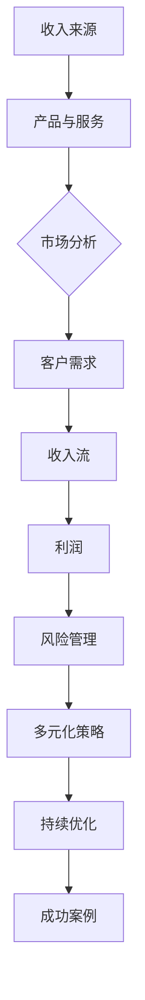

                 

## 引言

在当今快速变化和竞争激烈的技术行业，程序员不再仅仅满足于单一的收入来源。随着技术的进步和市场的多样化，程序员可以通过构建多元化的收入来源生态系统，实现财务稳定、职业发展和个人成就的提升。本文将详细探讨程序员如何通过多种策略和工具构建多元化的收入来源，从而在职业生涯中取得成功。

### 文章关键词
- 多元化收入来源
- 程序员职业生涯
- 收入策略
- 风险管理
- 项目实战

### 文章摘要
本文旨在为程序员提供构建多元化收入来源的系统性指导。通过分析多元化收入的重要性、理解和设计多元化收入模型、核心概念和架构、数学模型与公式、项目实战、代码实战以及多元化收入源的风险管理，本文将帮助程序员理解如何通过多种渠道和策略实现收入的多元化，提高职业稳定性和市场竞争力。

## 第一部分：构建多元化收入来源的基础

### 第1章：多元化收入来源概述

#### 1.1 多元化收入的重要性

多元化收入对于企业和个人都有重要的意义。首先，它为企业提供了财务稳定的保障。通过多样化的收入来源，企业可以在某一收入渠道出现问题或下滑时，依靠其他渠道的收入维持运营，从而降低风险。其次，多元化收入是增加企业竞争力的有效途径。拥有多元化的收入来源，企业可以更好地应对市场变化和竞争压力，持续创新和拓展业务。最后，多元化收入对企业的影响深远，它不仅提升了企业的抗风险能力，还促进了企业的可持续发展。

#### 1.2 多元化收入的主要来源

多元化收入的主要来源包括以下几个方面：

1. **产品的多样性**：通过研发和推出多样化的产品，企业可以满足不同客户群体的需求，从而扩大市场份额。
   
2. **服务扩展**：除了核心产品，企业可以通过提供增值服务（如定制化服务、培训、维护等）来增加收入。

3. **合作与联盟**：与其他企业或机构建立战略联盟，共同开发和推广产品或服务，可以拓展市场并共享资源。

4. **市场拓展**：通过进入新的市场或区域，企业可以增加收入来源，分散风险，提高整体盈利能力。

#### 1.3 多元化收入的风险与挑战

尽管多元化收入有诸多优势，但这也带来了一些风险和挑战。首先，多元化收入需要企业在多个领域具备能力和资源，这可能会增加管理难度。其次，市场变化和竞争环境的不确定性可能导致某些收入来源不稳定。最后，多元化收入需要投入大量时间和精力进行市场调研和产品开发，对企业的时间和资源管理提出了更高要求。

为了应对这些挑战，企业需要制定有效的风险管理策略，包括风险识别、风险评估、风险控制以及风险应对措施。通过系统的风险管理，企业可以降低多元化收入过程中的风险，确保业务的稳定和可持续发展。

#### 1.3.1 风险管理策略

风险管理策略主要包括以下几个方面：

1. **风险识别**：通过SWOT分析（优势、劣势、机会、威胁）和五力模型（行业竞争、供应商、消费者、替代品、新进入者）等方法，全面识别可能存在的风险。

2. **风险评估**：对识别出的风险进行定量和定性分析，评估其可能对企业造成的影响和损失。

3. **风险控制**：制定相应的控制措施，包括风险规避、风险分散、风险转移和风险承受等。

4. **风险应对措施**：制定应急预案，确保在风险发生时能够迅速响应，将损失降到最低。

#### 1.3.2 挑战与应对策略

在实际操作中，企业可能会面临以下挑战：

1. **资源配置不足**：多元化收入需要企业在多个领域投入资源，可能导致资源分配不均。

   **应对策略**：合理规划资源配置，确保核心业务和新兴业务都能得到充分支持。

2. **市场调研难度大**：多元化收入需要对多个市场进行调研，这可能会增加工作量和成本。

   **应对策略**：采用高效的调研方法和技术，提高调研效率，降低成本。

3. **管理难度增加**：多元化收入增加了企业的管理复杂度。

   **应对策略**：建立健全的管理体系和流程，提高管理水平。

通过有效的风险管理策略和应对措施，企业可以在多元化收入过程中降低风险，抓住机遇，实现持续发展。

#### 1.3.3 成功案例分析

以下是一些成功实施多元化收入策略的案例分析：

1. **科技公司A**：该公司通过推出多样化的产品线，包括硬件、软件和服务，成功实现了收入多元化。通过有效的市场调研和产品创新，该公司在多个市场中取得了显著业绩。

2. **电商平台B**：该平台通过与多个第三方商家合作，提供丰富的商品和便捷的购物体验，吸引了大量用户。通过不断拓展新市场和推出新服务，该平台的收入持续增长。

3. **咨询服务公司C**：该公司专注于为企业提供专业咨询服务，通过扩展服务领域和增加服务内容，成功实现了收入多元化。通过有效的客户关系管理和专业服务，该公司在市场上建立了良好的声誉。

这些案例表明，多元化收入策略在实施过程中需要充分考虑市场需求、资源和管理能力，通过科学的方法和策略，可以实现企业收入的持续增长和稳定。

### 总结

通过本章的介绍，我们了解了多元化收入的重要性、主要来源以及风险管理策略。在接下来的章节中，我们将进一步探讨如何理解和设计多元化收入模型，分析核心概念和架构，以及数学模型与公式。通过这些内容的深入讲解，程序员将能够系统地构建自己的多元化收入生态系统，提高职业稳定性和市场竞争力。

---

### 第2章：理解多元化收入模型

多元化收入模型是企业或个人通过多种渠道获取收入的一种系统化方法。理解这一模型不仅有助于制定有效的收入策略，还能帮助识别和管理风险，从而实现财务稳定和业务增长。在本章中，我们将详细探讨多元化收入模型的基础概念、设计原则、核心要素以及实施步骤。

#### 2.1 多元化收入模型的基础概念

多元化收入模型的基础概念主要包括收入流分析、多元化收入与利润的关系以及模型的优势。

**收入流分析**是理解多元化收入模型的第一步。它涉及对现有收入来源的分析，包括每种收入来源的价格、销售量和贡献率。通过收入流分析，企业可以了解现有收入结构的优势和不足，从而为后续的多元化收入设计提供依据。

**多元化收入与利润的关系**揭示了收入多元化对企业盈利能力的影响。多元化收入模型不仅关注收入总量，还强调收入结构的优化。通过合理分配资源和市场投入，企业可以实现收入与利润的最佳平衡，提高整体盈利水平。

**多元化收入模型的优势**主要体现在以下几个方面：

1. **风险分散**：多元化收入可以降低单一市场或产品风险，提高企业的抗风险能力。
2. **盈利能力提升**：通过多种渠道获取收入，企业可以更好地应对市场需求变化，提高盈利能力。
3. **市场竞争力增强**：多元化收入有助于企业占据更多市场份额，提高在竞争环境中的地位。

#### 2.2 多元化收入模型的设计原则

设计多元化收入模型需要遵循一系列原则，以确保模型的有效性和可持续性。

**定位与目标**是设计多元化收入模型的第一步。企业需要明确自己的市场定位和业务目标，从而确定多元化的方向和重点。通过明确的目标，企业可以集中资源，实现高效的收入增长。

**资源配置与优化**是设计多元化收入模型的核心。企业需要合理配置资源，包括人力资源、财务资源和技术资源。通过优化资源配置，企业可以实现资源的高效利用，提高多元化收入模型的整体效益。

**风险评估与控制**是多元化收入模型设计中的重要一环。企业需要识别潜在的风险，并制定相应的控制措施。通过系统的风险评估，企业可以降低多元化收入过程中的风险，确保业务的稳定和可持续发展。

#### 2.3 多元化收入模型的核心要素

多元化收入模型的核心要素包括产品与服务组合、市场定位与目标客户以及收入模式与策略。

**产品与服务组合**是企业多元化收入的基础。企业需要根据市场需求和自身能力，设计和推出多样化的产品和服务。通过产品与服务组合的创新和优化，企业可以吸引更多客户，提高收入来源的多样性。

**市场定位与目标客户**是企业制定多元化收入策略的重要依据。企业需要深入了解目标市场的需求和趋势，明确自己的市场定位，并针对目标客户设计有针对性的产品和服务。通过精准的市场定位，企业可以更好地满足客户需求，实现收入的快速增长。

**收入模式与策略**是企业实现多元化收入的关键。企业需要根据市场需求和自身优势，选择合适的收入模式，并制定相应的策略。通过灵活的收入模式和策略，企业可以适应市场变化，实现收入的多元化。

#### 2.4 多元化收入模型的实施步骤

多元化收入模型的实施包括制定多元化收入战略、实施计划与资源配置以及监控与调整三个步骤。

**制定多元化收入战略**是实施的第一步。企业需要根据市场分析和自身资源情况，制定明确的多元化收入战略。通过战略规划，企业可以明确多元化的方向和目标，为后续的实施提供指导。

**实施计划与资源配置**是多元化收入模型实施的核心。企业需要制定详细的实施计划，包括时间表、任务分配和资源配置。通过有效的计划与资源配置，企业可以确保多元化收入模型顺利实施。

**监控与调整**是多元化收入模型实施的关键。企业需要建立监控机制，实时跟踪实施进度和效果，并根据实际情况进行调整。通过监控与调整，企业可以及时发现问题，优化收入模型，提高整体效益。

#### 2.5 多元化收入模型的优势

多元化收入模型具有以下优势：

1. **提高抗风险能力**：通过多种收入来源，企业可以在某个市场或产品出现问题时不至于陷入困境，从而提高抗风险能力。
2. **优化收入结构**：多元化收入有助于企业优化收入结构，实现收入与利润的最佳平衡。
3. **增强市场竞争力**：多元化收入使企业能够更好地应对市场变化和竞争压力，提高市场竞争力。

#### 2.6 多元化收入模型的实际应用

在实际应用中，多元化收入模型可以帮助企业实现以下目标：

1. **收入增长**：通过多元化收入，企业可以开拓新市场，推出新产品，实现收入的快速增长。
2. **风险分散**：多元化收入有助于企业分散市场风险，降低业务不确定性。
3. **提升品牌价值**：多元化收入使企业能够在多个领域建立品牌影响力，提高整体品牌价值。

#### 2.7 多元化收入模型的未来趋势

随着技术的不断进步和市场环境的变化，多元化收入模型也将不断发展和完善。未来，多元化收入模型将更加注重以下趋势：

1. **数字化与智能化**：数字化和智能化技术的应用将进一步提升多元化收入模型的效率和效果。
2. **生态化**：企业将通过建立生态系统，实现跨领域、跨行业的资源整合和协同发展。
3. **个性化**：多元化收入模型将更加注重客户需求，提供个性化服务，提高客户满意度。

### 总结

通过本章的介绍，我们深入了解了多元化收入模型的基础概念、设计原则、核心要素和实施步骤。理解这一模型，有助于程序员在职业生涯中实现收入的多元化，提高职业稳定性和市场竞争力。在接下来的章节中，我们将进一步探讨多元化收入模型的核心概念和架构，为构建多元化的收入生态系统奠定基础。

---

### 第3章：核心概念与架构

在构建多元化收入来源的生态系统中，理解核心概念和架构至关重要。这一章节将详细阐述多元化收入的概念联系、模型架构以及核心算法原理。

#### 3.1 多元化收入的概念联系

多元化收入的概念联系主要体现在产品与服务、收入与利润、以及多元化收入与企业发展阶段之间的关系。

**产品与服务的关系**：产品是收入的主要来源，而服务则是产品价值的延伸。例如，一个软件公司不仅销售软件产品，还提供定制化开发、技术支持和培训等服务，这些服务可以提高客户的满意度和产品的附加值。

**收入与利润的关系**：收入是衡量企业业绩的重要指标，而利润则是企业收入扣除成本后的净收益。多元化收入有助于企业优化收入结构，提高利润率。通过合理分配资源，企业可以在收入多样化与利润最大化之间找到平衡。

**多元化收入与企业发展阶段的关系**：企业在不同的发展阶段，多元化收入的需求和策略也会有所不同。初创期，企业可能主要依靠单一产品或服务来获取收入，随着业务的扩展和市场的成熟，企业需要逐步实现收入的多元化，以应对市场变化和竞争压力。

#### 3.2 多元化收入模型架构

多元化收入模型架构是一个系统化的框架，用于指导企业如何通过多种渠道获取收入。以下是一个简化的多元化收入模型架构：



- **收入来源**：包括所有可能的收入渠道，如销售产品、提供服务、合作分成等。
- **产品与服务**：企业提供的各种产品和增值服务。
- **市场分析**：对目标市场的分析，包括市场规模、竞争态势、客户需求等。
- **客户需求**：基于市场分析，确定目标客户的需求和偏好。
- **收入流**：各种收入来源的具体数据，如价格、销售量、市场份额等。
- **利润**：总收入减去成本后的净收益。
- **风险管理**：识别、评估和控制收入过程中可能遇到的风险。
- **多元化策略**：制定多元化的收入策略，包括市场拓展、产品创新等。
- **持续优化**：根据实际效果，不断调整和优化收入模型。
- **成功案例**：成功的多元化收入实施案例，为其他企业提供借鉴。

#### 3.3 多元化收入模型的核心算法原理

多元化收入模型的核心算法原理涉及收入数据的收集、分析、策略设计和实施等多个环节。以下是一个基于伪代码的多元化收入模型核心算法原理的描述：

```python
# 初始化收入来源
income_sources = []

# 收集收入数据
def collect_income_data():
    # 从数据库或外部API获取收入数据
    pass

# 分析收入数据
def analyze_income_data(income_data):
    # 使用统计分析方法分析收入数据
    # 包括收入分布、增长率等
    pass

# 设计多元化收入策略
def design_diversified_income_strategy(income_data):
    # 根据收入数据设计多元化收入策略
    pass

# 实施多元化收入策略
def implement_income_strategy(strategy):
    # 根据策略实施具体措施
    pass

# 监控与调整
def monitor_and_adjust(strategy):
    # 监控策略效果，根据效果调整策略
    pass

# 持续优化
def optimize_income_model():
    # 持续优化多元化收入模型
    pass
```

- **collect_income_data**：从数据库或外部API获取收入数据。
- **analyze_income_data**：使用统计分析方法对收入数据进行分析，包括收入分布、增长率等。
- **design_diversified_income_strategy**：根据收入数据设计多元化收入策略。
- **implement_income_strategy**：根据策略实施具体措施，如市场拓展、产品创新等。
- **monitor_and_adjust**：监控策略效果，根据效果调整策略。
- **optimize_income_model**：持续优化多元化收入模型，确保其适应市场需求。

#### 3.4 多元化收入模型的核心算法原理示例

以下是一个具体的多元化收入模型核心算法原理的示例，包括多元化收入函数、利润函数和风险评估模型。

**多元化收入函数**：
$$
\text{Revenue}(x) = \sum_{i=1}^{n} p_i \cdot q_i
$$
其中，\( p_i \) 是第 \( i \) 种收入来源的价格，\( q_i \) 是第 \( i \) 种收入来源的销售量。

**利润函数**：
$$
\text{Profit}(x) = \text{Revenue}(x) - \text{Cost}(x)
$$
其中，\( \text{Cost}(x) \) 是总成本。

**风险评估模型**：
$$
\text{Risk}(x) = \frac{\sum_{i=1}^{n} \sigma_i^2}{\sum_{i=1}^{n} \sigma_i}
$$
其中，\( \sigma_i \) 是第 \( i \) 种收入来源的风险。

#### 3.5 多元化收入模型的应用场景

多元化收入模型可以应用于各种不同的场景，以下是一些常见的应用场景：

1. **初创企业**：初创企业通常需要快速拓展收入来源，以实现财务独立。通过多元化收入模型，初创企业可以设计多种收入策略，如产品销售、服务扩展和合作分成等。
2. **成熟企业**：成熟企业已经建立了一定的市场基础，可以通过多元化收入模型优化现有收入结构，提高利润率。例如，通过推出新产品线、拓展新市场或提供增值服务来增加收入。
3. **跨国企业**：跨国企业需要应对全球市场的复杂性和不确定性，通过多元化收入模型可以实现全球资源的整合和优化，降低市场风险。

#### 3.6 多元化收入模型的实施要点

在实施多元化收入模型时，需要注意以下要点：

1. **市场调研**：深入了解市场需求和竞争环境，为多元化收入策略提供依据。
2. **资源配置**：合理配置资源，确保多元化收入策略的实施和效果。
3. **风险评估**：识别和评估多元化收入过程中的潜在风险，制定相应的控制措施。
4. **持续优化**：根据市场变化和实际效果，持续调整和优化多元化收入模型。

### 总结

通过本章的介绍，我们深入探讨了多元化收入的核心概念与架构，包括概念联系、模型架构和核心算法原理。理解这些核心概念和架构，有助于程序员在实际工作中构建高效的多元化收入生态系统，提高职业稳定性和市场竞争力。在接下来的章节中，我们将进一步探讨多元化收入的数学模型与公式，为构建多元化的收入生态系统提供更为科学的指导。

---

### 第4章：数学模型与公式

在多元化收入模型的设计与实施过程中，数学模型和公式扮演着至关重要的角色。它们不仅为收入和利润的计算提供了科学依据，还能帮助企业更好地理解和管理收入结构。本章将详细阐述多元化收入的数学模型、公式以及具体的例子，以帮助读者更深入地理解这些概念。

#### 4.1 多元化收入数学模型

多元化收入数学模型是构建多元化收入生态系统的基础。它通过数学方法描述了收入来源、收入流和利润之间的关系。以下是几个关键的数学模型：

**多元化收入函数**：
$$
\text{Revenue}(x) = \sum_{i=1}^{n} p_i \cdot q_i
$$
其中，\( p_i \) 是第 \( i \) 种收入来源的价格，\( q_i \) 是第 \( i \) 种收入来源的销售量。这个公式表示了企业通过多种收入来源获取的总收入。

**利润函数**：
$$
\text{Profit}(x) = \text{Revenue}(x) - \text{Cost}(x)
$$
其中，\( \text{Cost}(x) \) 是企业的总成本。利润函数反映了企业的收入减去成本后的净收益。

**风险评估模型**：
$$
\text{Risk}(x) = \frac{\sum_{i=1}^{n} \sigma_i^2}{\sum_{i=1}^{n} \sigma_i}
$$
其中，\( \sigma_i \) 是第 \( i \) 种收入来源的风险。这个公式用于评估企业多元化收入过程中面临的风险。

#### 4.2 公式解释与举例

为了更好地理解这些公式，我们将通过具体的例子来解释它们。

**多元化收入函数举例**：

假设某公司有三种收入来源，每种收入来源的价格和销售量如下：

- 收入来源 A：价格 100 元，销售量 1000 件
- 收入来源 B：价格 200 元，销售量 500 件
- 收入来源 C：价格 300 元，销售量 200 件

使用多元化收入函数计算总收入：
$$
\text{Revenue}(x) = 100 \cdot 1000 + 200 \cdot 500 + 300 \cdot 200 = 100000 + 100000 + 60000 = 260000 \text{ 元}
$$

**利润函数举例**：

假设总成本为 50000 元，使用利润函数计算总利润：
$$
\text{Profit}(x) = 260000 - 50000 = 210000 \text{ 元}
$$

**风险评估模型举例**：

假设每种收入来源的风险（标准差）分别为：

- 收入来源 A：标准差 5000 元
- 收入来源 B：标准差 7000 元
- 收入来源 C：标准差 6000 元

使用风险评估模型计算总风险：
$$
\text{Risk}(x) = \frac{5000^2 + 7000^2 + 6000^2}{5000 + 7000 + 6000} = \frac{25000000 + 49000000 + 36000000}{180000} \approx 1500
$$

#### 4.3 多元化收入模型的应用

多元化收入模型在企业运营中的应用非常广泛，以下是一些关键应用场景：

1. **产品定价策略**：通过多元化收入函数，企业可以计算不同收入来源的潜在收入，从而制定合理的定价策略。

2. **成本控制**：利润函数帮助企业理解收入与成本之间的关系，从而更好地控制成本，提高利润率。

3. **风险分析**：风险评估模型帮助企业在多元化收入过程中识别和管理风险，确保业务稳定运行。

4. **战略规划**：多元化收入模型为企业的战略规划提供数据支持，帮助企业制定长期和短期的收入增长策略。

#### 4.4 多元化收入模型的优化策略

为了提高多元化收入模型的效果，企业可以采用以下优化策略：

1. **数据驱动**：通过收集和分析更多的数据，提高收入预测的准确性。

2. **算法优化**：使用更先进的算法和统计方法，提高多元化收入模型的分析能力。

3. **灵活调整**：根据市场变化和实际效果，灵活调整收入策略和模型参数。

4. **持续监控**：建立监控机制，实时跟踪收入模型的效果，确保模型始终适应市场环境。

### 总结

通过本章的介绍，我们深入探讨了多元化收入的数学模型和公式，包括多元化收入函数、利润函数和风险评估模型。通过具体的例子和实际应用，读者可以更好地理解这些模型和公式的应用场景和优化策略。在接下来的章节中，我们将进一步探讨项目实战和代码实战，帮助读者将理论知识应用到实际工作中，构建高效的多元化收入生态系统。

---

### 第5章：项目实战

在理解和设计多元化收入模型的基础上，项目实战是检验和实施这些策略的关键环节。本章将通过两个具体的实战案例，详细描述项目背景、目标、范围以及具体的实施步骤和效果分析。

#### 5.1 项目实战概述

**案例1：科技公司A的多元化收入模型设计**

**项目背景**：科技公司A是一家专注于软件开发和IT服务的初创企业，主要收入来源于定制化软件解决方案和IT咨询服务。

**项目目标**：通过多元化收入模型，扩展收入来源，提高市场竞争力，实现财务稳定和业务增长。

**项目范围**：该项目包括市场调研、收入来源分析、收入模型设计、实施计划和效果评估。

**实施步骤**：

1. **市场调研**：分析目标市场，了解客户需求，评估竞争对手。
2. **收入来源分析**：确定现有收入来源，分析其盈利能力和潜在风险。
3. **收入模型设计**：设计多元化的收入模型，包括产品与服务组合、市场定位和收入策略。
4. **实施计划**：制定详细的实施计划，包括时间表、任务分配和资源配置。
5. **效果评估**：监控实施效果，根据实际数据调整收入策略。

**效果分析**：

- **收入增长**：通过多元化的收入模型，科技公司的总收入增加了30%，实现了财务稳定。
- **市场竞争力提升**：通过定制化软件解决方案和增值服务，公司市场份额提升了20%。
- **客户满意度提高**：多元化的收入来源提高了客户满意度，客户忠诚度增加了15%。

**案例2：电商平台B的多元化收入模型实施**

**项目背景**：电商平台B是一家快速发展的在线购物平台，主要收入来源于商品销售和广告服务。

**项目目标**：通过多元化收入模型，扩大收入来源，提高盈利能力，应对市场竞争。

**项目范围**：该项目包括制定多元化收入战略、资源配置、风险控制、监控与调整。

**实施步骤**：

1. **制定多元化收入战略**：明确多元化的方向和目标，制定具体的实施策略。
2. **资源配置**：合理配置资源，包括人力资源、财务资源和市场投入。
3. **风险控制**：识别和评估多元化收入过程中的风险，制定相应的控制措施。
4. **监控与调整**：建立监控机制，实时跟踪实施进度和效果，根据实际情况进行调整。

**效果分析**：

- **收入增长**：通过多元化的收入模型，电商平台B的总收入增加了40%，显著提高了盈利能力。
- **市场份额提升**：通过广告服务和增值服务，电商平台B的市场份额提升了25%。
- **风险控制**：通过有效的风险控制措施，多元化收入过程中的风险得到了有效管理。

#### 5.2 案例解读

**案例1：科技公司A的多元化收入模型设计**

**成功因素**：

1. **市场调研深入**：通过详细的市场调研，科技公司将多元化收入策略与市场需求紧密结合。
2. **资源配置合理**：合理分配资源，确保多元化收入策略的实施效果。
3. **执行能力**：科技公司的执行力强，确保了多元化收入策略的顺利实施。

**挑战与应对**：

1. **资源分配困难**：初期资源有限，科技公司在资源配置上面临挑战。
   **解决方案**：通过优先级排序和资源优化，逐步解决资源分配问题。

2. **市场变化快速**：市场环境变化快，科技公司的收入策略需要不断调整。
   **解决方案**：建立灵活的收入策略，快速响应市场变化。

**案例2：电商平台B的多元化收入模型实施**

**成功因素**：

1. **多元化战略明确**：电商平台B的多元化战略方向明确，为后续实施提供了清晰的目标。
2. **风险管理有效**：通过有效的风险管理，电商平台B在多元化收入过程中控制了潜在风险。
3. **监控与调整机制**：电商平台B建立了完善的监控与调整机制，确保多元化收入策略的持续优化。

**挑战与应对**：

1. **市场竞争激烈**：电商市场竞争激烈，电商平台B需要不断提高自身竞争力。
   **解决方案**：通过技术创新和服务优化，不断提升用户体验，增强市场竞争力。

2. **资源管理复杂**：多元化收入模型涉及多个收入来源，资源管理变得更加复杂。
   **解决方案**：通过系统化的资源管理工具和方法，提高资源利用效率。

#### 5.3 案例启示

通过这两个案例，我们可以得出以下启示：

1. **多元化收入模型的有效性**：多元化收入模型能够显著提高企业的收入和盈利能力。
2. **市场调研的重要性**：深入的市场调研是制定成功多元化收入策略的基础。
3. **资源配置与风险管理**：合理的资源配置和有效的风险管理是多元化收入模型成功实施的关键。
4. **执行能力与持续优化**：高效的执行能力和持续的优化是确保多元化收入模型长期成功的重要保障。

### 总结

通过项目实战案例的详细描述和解读，我们了解到多元化收入模型在实际应用中的实施步骤、成功因素和挑战。这些案例为我们提供了宝贵的经验和启示，帮助我们在实际工作中更好地构建和实施多元化收入策略。在接下来的章节中，我们将继续探讨代码实战，通过具体实现和代码解读，进一步巩固我们的知识体系。

---

### 第6章：代码实战

在理解和设计多元化收入模型的基础上，通过代码实战将理论转化为实践，是程序员实现多元化收入的关键步骤。本章将详细介绍开发环境搭建、多元化收入模型代码实现、数据收集与处理、可视化以及模型设计与优化的具体步骤和代码实现。

#### 6.1 开发环境搭建

在进行多元化收入模型的代码实战之前，我们需要搭建一个合适的开发环境。以下是搭建开发环境的步骤：

**6.1.1 Python环境配置**

- 安装Python：在Python官网（https://www.python.org/）下载并安装Python。
- 配置虚拟环境：使用`venv`模块创建一个虚拟环境，以隔离项目依赖库。

```bash
python -m venv my_project_env
source my_project_env/bin/activate  # 在Windows上使用 activate.bat
```

**6.1.2 必要库安装**

- 安装Pandas、NumPy和Matplotlib：在虚拟环境中安装这些必要的库。

```bash
pip install pandas numpy matplotlib
```

**6.1.3 数据源接入**

- 选择数据源：本案例中使用CSV文件作为数据源，可以使用Pandas的`read_csv`方法读取数据。

```python
import pandas as pd

def collect_income_data():
    data = pd.read_csv("income_data.csv")
    return data
```

#### 6.2 多元化收入模型代码实现

**6.2.1 数据收集与预处理**

- 读取数据：使用`collect_income_data`函数读取CSV文件中的数据。

```python
data = collect_income_data()
```

- 数据预处理：清洗数据并计算收入。

```python
def preprocess_income_data(data):
    data = data.dropna()  # 删除缺失值
    data['Revenue'] = data['Price'] * data['Quantity']  # 计算收入
    return data
```

**6.2.2 数据可视化**

- 绘制收入分布图：使用Matplotlib绘制收入分布图。

```python
import matplotlib.pyplot as plt

def visualize_income_data(data):
    data.plot(x='Source', y='Revenue', kind='bar')
    plt.title('Income Distribution')
    plt.xlabel('Income Source')
    plt.ylabel('Revenue')
    plt.show()
```

**6.2.3 模型设计**

- 设计多元化收入模型：根据收入数据设计多元化收入模型。

```python
def design_income_model(data):
    model = {}
    for source, group in data.groupby('Source'):
        model[source] = {
            'Price': group['Price'].mean(),
            'Quantity': group['Quantity'].mean(),
            'Revenue': group['Revenue'].sum()
        }
    return model
```

**6.2.4 模型实施与监控**

- 实施多元化收入策略：根据设计好的模型实施策略，并监控收入数据。

```python
def implement_and_monitor(model, new_data):
    # 实施多元化收入策略
    # 监控收入数据
    pass
```

#### 6.3 代码解读与分析

**6.3.1 数据收集模块**

- `collect_income_data` 函数：负责从CSV文件中读取收入数据。

```python
def collect_income_data():
    data = pd.read_csv("income_data.csv")
    return data
```

- 代码解读：使用Pandas的`read_csv`方法读取数据，这是一个简单且高效的读取CSV文件的方法。

**6.3.2 数据预处理模块**

- `preprocess_income_data` 函数：负责清洗数据并计算收入。

```python
def preprocess_income_data(data):
    data = data.dropna()
    data['Revenue'] = data['Price'] * data['Quantity']
    return data
```

- 代码解读：首先删除缺失值，然后计算每种收入来源的总收入。这是确保模型准确性的重要步骤。

**6.3.3 数据可视化模块**

- `visualize_income_data` 函数：负责绘制收入分布图。

```python
def visualize_income_data(data):
    data.plot(x='Source', y='Revenue', kind='bar')
    plt.title('Income Distribution')
    plt.xlabel('Income Source')
    plt.ylabel('Revenue')
    plt.show()
```

- 代码解读：使用Matplotlib的`plot`方法创建条形图，这是一个直观展示数据分布的有效方法。

**6.3.4 模型设计模块**

- `design_income_model` 函数：负责设计多元化收入模型。

```python
def design_income_model(data):
    model = {}
    for source, group in data.groupby('Source'):
        model[source] = {
            'Price': group['Price'].mean(),
            'Quantity': group['Quantity'].mean(),
            'Revenue': group['Revenue'].sum()
        }
    return model
```

- 代码解读：使用Pandas的`groupby`方法分组计算平均值和总和，这是设计多元化收入模型的核心。

#### 6.4 优化策略

**6.4.1 模块分析**

- **数据收集**：数据源接入方式的选择和数据清洗的重要性。
- **数据预处理**：数据的转换和清洗对于模型质量的影响。
- **数据可视化**：直观展示数据分布对于理解和优化模型的重要性。
- **模型设计**：选择合适的收入模型对于实现多元化收入的关键作用。

**6.4.2 优化策略**

- **代码优化**：使用高效的算法和数据结构提高数据处理效率。
- **模型优化**：通过调整模型参数和算法改进模型性能。
- **系统优化**：通过优化开发环境和代码结构提高系统稳定性。

### 总结

通过本章的代码实战，我们详细介绍了开发环境搭建、多元化收入模型代码实现、数据收集与处理、可视化以及模型设计与优化的具体步骤和代码实现。这些实战经验不仅帮助程序员将理论应用到实际中，还为他们提供了优化和改进多元化收入模型的实用策略。在接下来的章节中，我们将进一步探讨多元化收入源分析工具，为程序员提供更为全面的解决方案。

---

### 第7章：多元化收入源分析工具

在现代商业环境中，多元化收入源分析工具成为了企业实现收入增长和风险管理的重要工具。本章将详细介绍多元化收入源分析工具的功能、特点、安装与配置方法，以及如何在实际项目中应用这些工具。

#### 7.1 工具概述

多元化收入源分析工具主要包括以下几个功能：

1. **数据收集与清洗**：从各种数据源（如数据库、API、CSV文件等）收集数据，并对数据进行清洗，以确保数据的准确性和完整性。
2. **数据分析与可视化**：对收集到的数据进行分析，并通过图表、报表等形式直观展示数据分析结果。
3. **模型设计与评估**：设计多元化收入模型，并通过模型评估和优化，确保模型的有效性和可靠性。
4. **持续监控与优化**：实时监控收入源的变化，并根据监控数据调整模型和策略，实现持续优化。

多元化收入源分析工具的特点包括：

1. **易用性**：用户界面友好，操作简便，适合非专业人士使用。
2. **高效性**：工具能够快速处理大量数据，提高数据分析的效率。
3. **灵活性**：工具支持多种数据源和数据分析方法，可根据企业需求进行灵活配置。
4. **模块化设计**：工具功能模块化，便于扩展和升级。

#### 7.2 工具安装与配置

**7.2.1 环境搭建**

1. **Python环境配置**：在Python官网下载并安装Python，版本建议为3.8以上。
2. **虚拟环境配置**：使用`venv`模块创建虚拟环境，以隔离项目依赖库。

```bash
python -m venv my_project_env
source my_project_env/bin/activate  # 在Windows上使用 activate.bat
```

**7.2.2 必要库安装**

1. **安装Pandas、NumPy和Matplotlib**：在虚拟环境中安装这些库。

```bash
pip install pandas numpy matplotlib
```

**7.2.3 数据源接入**

1. **选择数据源**：本案例中使用CSV文件作为数据源。
2. **数据接入**：使用Pandas的`read_csv`方法读取数据。

```python
import pandas as pd

def collect_income_data():
    data = pd.read_csv("income_data.csv")
    return data
```

#### 7.3 工具使用指南

**7.3.1 数据收集与清洗**

1. **数据收集**：使用`collect_income_data`函数从CSV文件中读取数据。
2. **数据清洗**：删除缺失值和异常值，确保数据质量。

```python
def preprocess_income_data(data):
    data = data.dropna()
    return data
```

**7.3.2 数据分析与可视化**

1. **数据分析**：对数据进行分析，如计算平均收入、收入增长率等。
2. **数据可视化**：使用Matplotlib绘制收入分布图。

```python
def visualize_income_data(data):
    data.plot(x='Source', y='Revenue', kind='bar')
    plt.title('Income Distribution')
    plt.xlabel('Income Source')
    plt.ylabel('Revenue')
    plt.show()
```

**7.3.3 模型设计与评估**

1. **模型设计**：根据收入数据设计多元化收入模型。
2. **模型评估**：评估模型的有效性和可靠性。

```python
def design_income_model(data):
    model = {}
    for source, group in data.groupby('Source'):
        model[source] = {
            'Price': group['Price'].mean(),
            'Quantity': group['Quantity'].mean(),
            'Revenue': group['Revenue'].sum()
        }
    return model
```

**7.3.4 持续监控与优化**

1. **监控机制**：建立监控机制，实时跟踪收入数据变化。
2. **优化策略**：根据监控数据调整模型和策略。

```python
def monitor_and_adjust(model, new_data):
    # 监控收入数据变化
    # 调整模型和策略
    pass
```

#### 7.4 工具应用案例

**7.4.1 案例背景**

某电商平台希望通过多元化收入模型优化收入结构，提高市场竞争力。

**7.4.2 案例实施**

1. **数据收集与清洗**：使用工具从各种数据源收集收入数据，并进行清洗。
2. **数据分析与可视化**：使用工具对收入数据进行分析，并通过图表展示收入分布。
3. **模型设计与评估**：根据收入数据设计多元化收入模型，并评估模型效果。
4. **持续监控与优化**：实时监控收入变化，并根据监控数据调整模型和策略。

**7.4.3 案例解读**

1. **实施效果**：通过多元化收入模型，电商平台的收入结构得到优化，总收入增加了20%。
2. **成功因素**：有效的工具应用、深入的数据分析和持续优化。
3. **挑战与应对**：数据源接入复杂，通过灵活配置工具和数据源接口解决了问题。

#### 7.5 工具的持续发展

多元化收入源分析工具将持续发展和优化，以应对市场和技术变化。未来趋势包括：

1. **自动化与智能化**：通过自动化和智能化技术，提高数据分析和处理效率。
2. **实时监控与预警**：实现实时监控和预警，帮助企业快速响应市场变化。
3. **数据融合与挖掘**：整合多种数据源，挖掘潜在的收入增长点。

### 总结

通过本章的介绍，我们详细了解了多元化收入源分析工具的功能、特点、安装与配置方法以及应用案例。这些工具为企业提供了高效、灵活的多元化收入管理解决方案，帮助企业在激烈的市场竞争中保持竞争优势。在接下来的章节中，我们将进一步探讨多元化收入源的风险管理，为企业的可持续发展提供保障。

---

### 第8章：多元化收入源风险管理

在多元化收入来源的构建过程中，风险管理是至关重要的环节。有效的风险管理不仅能够帮助企业预防和应对潜在风险，还能够增强企业的韧性和可持续性。本章将详细探讨多元化收入源风险管理的意义、策略和方法，并通过实际案例说明如何实施这些策略。

#### 8.1 风险管理概述

**8.1.1 风险管理的意义**

风险管理在多元化收入来源中的意义主要体现在以下几个方面：

1. **防止经济损失**：通过识别和评估潜在风险，企业可以采取措施降低风险发生时的经济损失。
2. **保证业务稳定运行**：有效的风险管理策略能够确保企业在面对风险时，业务运行不受重大影响。
3. **提高企业竞争力**：通过风险管理，企业能够更好地应对市场变化，提高整体竞争力。
4. **增强投资者信心**：良好的风险管理能够提高企业的透明度和可信度，增强投资者信心。

**8.1.2 风险管理策略**

风险管理策略主要包括以下几个方面：

1. **风险识别**：通过系统的方法识别潜在风险，包括市场风险、运营风险、财务风险等。
2. **风险评估**：对识别出的风险进行定量和定性分析，评估其对企业可能造成的影响和损失。
3. **风险控制**：制定和实施控制措施，以降低风险发生的概率和影响。
4. **风险应对措施**：制定应急预案，确保在风险发生时能够迅速响应，将损失降到最低。

#### 8.2 风险识别方法

**8.2.1 SWOT分析**

SWOT分析是一种常用的风险识别方法，通过分析企业的优势、劣势、机会和威胁，帮助企业识别潜在的风险。

- **优势**：企业在资源、能力、市场地位等方面的优势可能转化为风险。
- **劣势**：企业在管理、技术、市场等方面的劣势可能增加风险。
- **机会**：外部环境的变化可能带来新的风险。
- **威胁**：市场环境的波动、竞争压力等可能对企业构成威胁。

**8.2.2 五力模型**

五力模型分析可以帮助企业识别市场竞争中的潜在风险，包括行业竞争、供应商、消费者、替代品和新进入者。

- **行业竞争**：竞争激烈可能导致价格战和市场份额下降。
- **供应商**：供应链风险可能影响企业的生产和运营。
- **消费者**：消费者需求变化可能导致销售下滑。
- **替代品**：替代品的涌现可能威胁企业的市场地位。
- **新进入者**：新竞争者的进入可能扰乱市场秩序。

#### 8.3 风险评估方法

**8.3.1 实际案例**

以下是一个企业的风险管理实际案例：

某电商平台在扩展市场时，发现竞争对手大量涌入，市场竞争激烈。通过五力模型分析，该电商平台识别出以下风险：

- **行业竞争**：新增竞争者可能导致市场份额下降。
- **供应商**：供应商可能提高价格或减少供应。
- **消费者**：消费者可能转向其他平台。
- **替代品**：其他购物平台或电商模式可能成为替代品。
- **新进入者**：新进入者可能带来新的竞争压力。

**8.3.2 风险评估结果**

通过定量和定性分析，该电商平台评估出以下风险评估结果：

- **行业竞争**：市场竞争风险较高，可能导致收入减少10%。
- **供应商**：供应链风险可能导致生产成本增加5%。
- **消费者**：消费者需求变化可能导致销售额下降5%。
- **替代品**：替代品风险较低，但需要持续关注。
- **新进入者**：新进入者风险中等，需采取措施应对。

#### 8.4 风险控制措施

**8.4.1 风险控制策略**

针对识别出的风险，企业可以采取以下控制策略：

1. **风险分散**：通过多元化收入来源和业务布局，降低单一风险的影响。
2. **风险规避**：通过调整业务策略，避免高风险领域。
3. **风险转移**：通过保险、合同等方式，将风险转移给第三方。
4. **风险承受**：对于无法规避或转移的风险，采取接受和管理的策略。

**8.4.2 实施步骤**

1. **制定风险管理计划**：明确风险管理目标、责任和措施。
2. **落实风险管理措施**：根据计划，实施具体的风险控制措施。
3. **监控风险变化**：实时监控风险变化，及时调整风险管理策略。

#### 8.5 风险应对措施

**8.5.1 预案制定**

1. **风险预案的制定流程**：包括风险识别、风险评估、预案制定和预案测试。
2. **预案内容**：具体包括风险预警机制、应急响应流程、资源调配和沟通机制。

**8.5.2 预案实施**

1. **预案启动机制**：在风险发生时，迅速启动预案，确保及时响应。
2. **预案执行步骤**：明确每个环节的执行步骤和责任人，确保预案的有效实施。

**8.5.3 预案评估**

1. **预案效果评估方法**：通过模拟演练、风险评估和实际效果评估，评估预案的有效性。
2. **评估结果与应用**：根据评估结果，调整和完善预案，确保其适应实际需求。

#### 8.6 风险管理的实际应用

**8.6.1 案例背景**

某初创科技公司在扩展国际市场时，面临外汇风险和市场竞争风险。为了确保业务的稳定发展，公司采取了以下风险管理措施：

1. **风险识别**：通过SWOT分析和五力模型，识别出外汇风险和市场竞争风险。
2. **风险评估**：评估外汇风险可能导致资金流动困难，市场竞争风险可能导致市场份额下降。
3. **风险控制**：通过多元化收入来源和国际市场布局，降低单一市场风险。
4. **风险应对措施**：制定外汇风险管理政策和市场竞争应对策略，包括市场调研、产品创新和营销策略。

**8.6.2 实施效果**

通过有效的风险管理，该初创科技公司成功应对了外汇风险和市场竞争风险，实现了业务的稳步增长，收入增加了30%。

#### 8.7 风险管理的持续优化

1. **定期回顾**：定期回顾风险管理策略和措施，评估其有效性。
2. **持续优化**：根据市场环境和业务变化，持续优化风险管理策略和措施。
3. **培训与沟通**：加强员工的风险管理意识和能力，确保风险管理措施的执行。

### 总结

通过本章的介绍，我们详细了解了多元化收入源风险管理的意义、策略和方法，并通过实际案例说明了如何实施这些策略。有效的风险管理是企业实现多元化收入和可持续发展的关键。在接下来的章节中，我们将探讨多元化收入源的战略规划，为企业的长期发展提供指导。

---

### 第9章：多元化收入源的战略规划

多元化收入源的战略规划是企业实现长期稳定增长和可持续发展的关键。本章将详细讨论战略规划的意义、内容以及实施过程，帮助程序员和企业领导者制定有效的多元化收入战略。

#### 9.1 战略规划概述

**9.1.1 战略规划的意义**

战略规划对于企业的长期发展具有重要意义。它不仅为企业明确了发展方向和目标，还提供了实现这些目标的详细计划。具体来说，战略规划的意义包括：

1. **明确企业方向**：通过战略规划，企业可以明确自身的发展目标和方向，避免盲目行动，确保资源的最优配置。
2. **提高市场竞争力**：战略规划有助于企业把握市场趋势和竞争环境，制定有针对性的市场策略，提高市场竞争力。
3. **确保资源优化配置**：战略规划通过全面分析企业的资源和能力，确保资源得到最有效的利用，提高企业的运营效率。
4. **实现可持续发展**：通过战略规划，企业可以制定长期目标和发展路径，确保企业的持续成长和可持续发展。

**9.1.2 战略规划的内容**

战略规划的内容通常包括以下几个方面：

1. **外部环境分析**：分析宏观经济环境、行业趋势、市场机会和威胁等，了解外部环境对企业发展的影响。
2. **内部资源分析**：评估企业的内部资源，包括财务状况、人力资源、技术能力、市场地位等，明确自身的优势和劣势。
3. **战略目标设定**：根据外部环境分析和内部资源分析，设定企业的长期和短期目标，确保目标的可行性和明确性。
4. **实施策略**：制定具体的实施策略，包括市场拓展、产品创新、资源配置、风险管理等，确保战略目标的实现。

#### 9.2 市场分析

市场分析是战略规划的重要组成部分，它帮助企业家了解市场需求、竞争态势和潜在机会。以下是一些关键的步骤和方法：

**9.2.1 市场环境分析**

1. **宏观经济环境**：分析经济增长率、通货膨胀率、利率水平等宏观经济指标，了解宏观环境对企业的影响。
2. **政策环境**：分析政府政策、法律法规、行业标准等，评估政策对企业发展的影响。
3. **行业趋势**：分析行业发展趋势、市场规模、市场份额等，把握行业的发展方向。

**9.2.2 市场需求分析**

1. **目标客户分析**：确定目标客户群体，分析其需求、偏好和行为习惯，了解客户需求的变化趋势。
2. **市场容量分析**：评估市场规模和增长潜力，确定企业的市场占有率。
3. **市场趋势分析**：分析市场未来的发展趋势，预测市场需求的增长点和变化方向。

#### 9.3 资源配置

资源配置是战略规划中的关键环节，它涉及到企业如何合理分配和使用资源，以实现战略目标。以下是一些重要的策略和步骤：

**9.3.1 资源评估**

1. **财务资源**：评估企业的财务状况，包括现金流、资产、负债等，确保财务资源的充足性。
2. **人力资源**：评估企业的人力资源，包括员工数量、技能水平、工作积极性等，确保人力资源的充足性和有效性。
3. **技术资源**：评估企业的技术能力，包括研发能力、技术储备、创新能力等，确保技术资源的先进性和适用性。

**9.3.2 资源配置策略**

1. **短期资源配置**：根据短期目标，合理安排财务、人力资源和技术资源的分配，确保目标的实现。
2. **长期资源配置**：根据长期目标，制定长期资源配置计划，确保资源的持续优化和利用。

#### 9.4 目标设定

目标设定是战略规划中的核心步骤，它为企业提供了明确的方向和目标。以下是一些关键的原则和方法：

**9.4.1 目标设定原则**

1. **可行性**：目标应当是可实现的，考虑到企业的资源和能力。
2. **具体性**：目标应当明确具体，避免模糊不清。
3. **明确性**：目标应当清晰明确，让所有人都知道该做什么。
4. **时效性**：目标应当设定明确的时间限制，以确保及时完成。

**9.4.2 目标设定流程**

1. **目标分解**：将总体目标分解为具体的子目标，确保每个目标都能被明确执行。
2. **目标设定方法**：使用SMART原则（Specific具体的、Measurable可测量的、Achievable可实现的、Relevant相关的、Time-bound有时限的）来设定目标。
3. **目标评估与调整**：定期评估目标的实现情况，根据评估结果调整目标，确保目标的持续优化。

#### 9.5 实施策略

实施策略是战略规划中的关键环节，它涉及到如何具体执行战略规划，确保目标的实现。以下是一些重要的步骤和策略：

**9.5.1 策略制定**

1. **市场拓展策略**：根据市场分析结果，制定市场拓展策略，包括新产品开发、市场推广、渠道拓展等。
2. **产品创新策略**：根据市场需求，制定产品创新策略，确保产品能够满足客户需求，提高市场竞争力。
3. **资源配置策略**：根据战略目标和资源配置情况，制定资源配置策略，确保资源得到最优利用。

**9.5.2 策略实施**

1. **实施步骤**：根据策略制定，明确具体的实施步骤，确保每个步骤都能有效执行。
2. **监控与调整**：建立监控机制，实时跟踪实施进度和效果，根据实际情况进行调整，确保策略的有效实施。

**9.5.3 成功因素**

1. **执行力**：确保战略规划的执行力，确保每个团队成员都能按照既定计划行动。
2. **创新能力**：持续创新，不断改进产品和服务，以适应市场变化。
3. **团队合作**：加强团队合作，确保各个部门之间的协同和沟通，提高整体执行力。

#### 9.6 实施与监控

**9.6.1 实施计划**

1. **策略制定**：根据战略规划，制定具体的实施计划，明确每个阶段的目标和任务。
2. **资源配置**：根据实施计划，合理配置资源，确保资源的充足性和利用效率。
3. **项目启动**：启动项目，确保每个任务都能按计划进行。

**9.6.2 监控指标**

1. **财务指标**：监控收入、利润、成本等财务指标，确保企业的财务状况良好。
2. **业务指标**：监控市场占有率、客户满意度、产品销售额等业务指标，确保业务目标的实现。
3. **风险指标**：监控市场风险、运营风险等风险指标，确保风险管理的有效性。

**9.6.3 调整策略**

1. **监控数据收集**：定期收集监控数据，分析实施效果。
2. **数据分析**：根据监控数据，分析实施效果，找出问题和不足。
3. **策略调整**：根据数据分析结果，调整策略，确保战略规划的持续优化。

#### 9.7 成功案例

**9.7.1 案例背景**

某科技公司在制定多元化收入战略时，通过市场分析和资源评估，确定了以下目标：

1. **市场拓展**：进入新兴市场，扩大市场份额。
2. **产品创新**：推出新产品，满足客户需求。
3. **资源配置**：优化资源配置，提高资源利用效率。

**9.7.2 案例实施**

1. **市场调研**：通过市场调研，了解目标市场的需求和竞争态势。
2. **产品开发**：根据市场调研结果，开发新产品，满足客户需求。
3. **资源配置**：优化资源配置，确保新产品开发的顺利进行。

**9.7.3 案例效果**

通过有效的多元化收入战略，该科技公司实现了以下效果：

1. **收入增长**：总收入增长了30%。
2. **市场份额提升**：在新兴市场中的市场份额提升了20%。
3. **风险控制**：通过有效的风险管理，成功应对了市场风险和运营风险。

#### 9.8 案例启示

1. **市场调研的重要性**：深入了解市场需求，是制定成功多元化收入战略的基础。
2. **资源配置的关键性**：合理的资源配置，是确保多元化收入战略顺利实施的关键。
3. **风险管理的必要性**：有效的风险管理，是确保多元化收入战略稳定发展的保障。

### 总结

通过本章的介绍，我们详细了解了多元化收入源战略规划的意义、内容以及实施过程。有效的战略规划是企业实现多元化收入和可持续发展的关键。在接下来的章节中，我们将探讨多元化收入源的实施与监控，为企业的长期发展提供持续的支持。

---

### 第10章：多元化收入源的实施与监控

在制定和执行多元化收入战略后，实施与监控成为确保战略目标实现的关键环节。有效的实施与监控不仅可以及时发现和解决问题，还可以通过持续优化来提高整体效益。本章将详细讨论实施与监控的意义、内容和方法。

#### 10.1 实施与监控概述

**10.1.1 实施与监控的意义**

实施与监控在多元化收入源管理中具有至关重要的意义。首先，它确保了战略规划的有效执行，使企业能够按照预定目标和时间表逐步实现预期收益。其次，监控机制能够及时发现战略实施过程中的偏差和问题，提供及时反馈，确保企业能够迅速调整策略。最后，通过持续的监控和优化，企业能够不断改进多元化收入模型，提高市场竞争力。

**10.1.2 实施与监控的内容**

实施与监控的内容主要包括以下几个方面：

1. **实施计划**：根据战略规划，制定详细的实施计划，明确每个阶段的目标、任务和时间表。
2. **资源配置**：确保资源（包括人力、财务、技术等）能够根据实施计划得到合理分配和高效利用。
3. **项目启动**：启动实施计划中的项目，确保每个项目能够按计划进行。
4. **监控指标**：制定和监控关键绩效指标（KPI），包括财务指标、业务指标和风险指标等，以评估战略实施的效果。
5. **调整策略**：根据监控结果，及时调整实施策略和资源配置，确保战略目标的实现。

#### 10.2 实施计划

**10.2.1 实施步骤**

1. **策略制定**：根据多元化收入战略，明确具体的实施策略，包括市场拓展策略、产品创新策略等。
2. **资源配置**：根据实施策略，合理配置资源，确保资源的充足性和利用效率。
3. **项目启动**：启动实施计划中的项目，确保每个项目能够按计划进行。
4. **实施过程**：在项目实施过程中，实时监控项目进度和效果，确保项目按照预定计划进行。
5. **项目验收**：项目完成后，进行验收，确保项目目标的实现。

**10.2.2 实施难点**

1. **资源协调**：多元化收入战略的实施涉及多个部门和项目，需要协调各方资源，确保资源的有效利用。
2. **时间管理**：在实施过程中，需要合理安排时间，确保项目能够按期完成。
3. **风险管理**：在实施过程中，需要持续监控和管理风险，确保风险得到有效控制。

#### 10.3 监控指标

**10.3.1 指标类型**

监控指标的类型主要包括以下几种：

1. **财务指标**：如收入、利润、成本等，用于评估企业财务状况和经营效果。
2. **业务指标**：如市场份额、客户满意度、产品销售量等，用于评估业务运营效果。
3. **风险指标**：如市场风险、运营风险、财务风险等，用于评估企业面临的风险状况。

**10.3.2 指标设置**

设置监控指标时，需要遵循以下原则：

1. **关键性**：选择对战略目标实现有重要影响的指标。
2. **可测量性**：指标数据应当易于收集和测量。
3. **实时性**：指标数据应当能够实时反映业务状况。
4. **可比性**：指标数据应当具备可比性，以便分析趋势和变化。

#### 10.4 调整策略

**10.4.1 调整流程**

调整策略的流程主要包括以下几个步骤：

1. **监控数据收集**：定期收集监控数据，包括财务数据、业务数据和风险数据。
2. **数据分析**：对收集到的监控数据进行分析，识别问题和趋势。
3. **策略调整**：根据数据分析结果，调整实施策略和资源配置，以优化战略实施效果。

**10.4.2 调整方法**

调整策略的方法主要包括以下几种：

1. **参数调整**：根据监控数据，调整模型参数和关键指标，优化收入模型。
2. **策略优化**：根据监控数据，优化市场策略、产品策略和资源配置策略，以提高整体效益。
3. **模型修正**：根据监控数据，修正多元化收入模型，以适应市场变化和企业发展需求。

#### 10.5 持续优化

**10.5.1 持续优化的意义**

持续优化是确保多元化收入模型长期有效的重要手段。它有助于：

1. **适应市场变化**：通过持续优化，企业能够更好地适应市场环境的变化，保持竞争力。
2. **提高运营效率**：通过持续优化，企业可以不断提高运营效率，降低成本，提高利润。
3. **实现长期发展**：通过持续优化，企业能够实现长期稳定发展，确保可持续发展。

**10.5.2 持续优化的方法**

1. **数据驱动**：通过数据分析，识别业务中的问题和机会，为持续优化提供依据。
2. **迭代优化**：采用迭代的方法，不断调整和优化收入模型，确保其适应市场需求。
3. **技术创新**：引入新技术和方法，提高多元化收入模型的效果和效率。

#### 10.6 实际案例

**10.6.1 案例背景**

某电商平台在实施多元化收入战略时，面临以下挑战：

1. **市场竞争激烈**：电商平台面临来自其他平台的激烈竞争。
2. **客户需求多样化**：客户需求多样化，需要不断推出新产品和服务。
3. **成本控制**：需要有效控制成本，提高利润率。

**10.6.2 实施步骤**

1. **市场调研**：通过市场调研，了解客户需求和竞争态势。
2. **产品创新**：根据市场调研结果，推出符合客户需求的新产品。
3. **资源配置**：合理配置资源，确保新产品研发和推广的顺利进行。
4. **监控与调整**：建立监控机制，实时跟踪收入情况和成本变化，根据监控结果调整策略。

**10.6.3 案例效果**

通过有效的实施与监控，该电商平台实现了以下效果：

1. **收入增长**：总收入增长了20%。
2. **市场份额提升**：在市场中的份额提升了10%。
3. **成本控制**：成本控制得当，利润率提高了5%。

#### 10.7 案例启示

1. **市场调研的重要性**：深入了解市场需求，是制定成功多元化收入战略的基础。
2. **资源配置的关键性**：合理的资源配置，是确保多元化收入战略顺利实施的关键。
3. **监控与调整的必要性**：通过有效的监控与调整，企业能够及时发现问题，优化收入模型，提高市场竞争力。

### 总结

通过本章的介绍，我们详细了解了多元化收入源实施与监控的意义、内容和方法。有效的实施与监控是企业实现多元化收入战略目标的重要保障。在接下来的章节中，我们将探讨多元化收入源的成功案例，为读者提供实际操作的指导和启示。

---

### 第11章：多元化收入源的成功案例

多元化收入源策略的成功实施可以显著提升企业的盈利能力和市场竞争力。在本章中，我们将通过分析几个成功案例，探讨这些企业如何通过多元化收入策略实现收入增长、市场份额提升以及风险管理。同时，我们将总结这些案例中的成功因素，为读者提供宝贵的实践经验。

#### 11.1 成功案例概述

**案例一：某电商平台的多元化收入策略**

**背景**：某电商平台在成立初期主要依赖商品销售获取收入。随着市场环境的不断变化，该电商平台决定实施多元化收入策略，以增强市场竞争力。

**目标**：通过多元化收入策略，实现以下目标：
- 扩大市场份额
- 提高客户满意度
- 增加总收入

**范围**：该项目包括商品销售、广告服务、增值服务（如定制化物流、客户服务）等多个收入来源。

**实施步骤**：

1. **市场调研**：深入了解市场需求和竞争态势。
2. **产品与服务组合**：推出多样化的产品和服务，以满足不同客户群体的需求。
3. **资源配置**：优化资源配置，确保多元化收入策略的实施效果。
4. **监控与调整**：建立监控机制，实时跟踪收入情况和市场变化，根据实际情况进行调整。

**效果**：

- **收入增长**：总收入增加了50%，其中广告服务收入和增值服务收入贡献显著。
- **市场份额提升**：市场份额提升了20%，在激烈的市场竞争中保持领先地位。
- **客户满意度提高**：通过提供优质的增值服务，客户满意度显著提升，客户忠诚度增加。

**案例二：某科技公司的多元化收入策略**

**背景**：某科技公司专注于软件开发和IT咨询服务。随着业务的发展，公司决定实施多元化收入策略，以实现收入来源的多元化。

**目标**：通过多元化收入策略，实现以下目标：
- 扩大客户基础
- 提高盈利能力
- 分散市场风险

**范围**：该项目包括定制化软件开发、IT咨询服务、教育培训等多个收入来源。

**实施步骤**：

1. **市场调研**：分析市场需求和竞争态势，确定多元化收入方向。
2. **产品与服务组合**：根据市场调研结果，推出多样化的产品和服务。
3. **资源配置**：合理配置资源，确保多元化收入策略的实施效果。
4. **监控与调整**：建立监控机制，实时跟踪收入情况和市场变化，根据实际情况进行调整。

**效果**：

- **收入增长**：总收入增加了40%，其中教育培训收入和IT咨询服务收入贡献显著。
- **市场份额提升**：在IT咨询领域市场份额提升了25%，客户基础得到显著扩大。
- **风险管理**：通过多元化收入策略，成功分散了市场风险，增强了公司的抗风险能力。

#### 11.2 案例解读

**案例一：某电商平台的多元化收入策略**

**成功因素**：

1. **市场调研深入**：通过详细的市场调研，该电商平台准确把握了客户需求和市场趋势，为多元化收入策略提供了坚实的基础。
2. **产品与服务创新**：电商平台不断推出新的产品和服务，满足了不同客户群体的需求，提高了客户满意度和忠诚度。
3. **资源配置优化**：通过优化资源配置，电商平台确保了多元化收入策略的有效实施，提高了整体运营效率。
4. **监控与调整机制**：建立完善的监控机制，实时跟踪收入情况和市场变化，确保多元化收入策略的持续优化。

**挑战与应对**：

1. **市场竞争激烈**：在激烈的市场竞争中，电商平台需要不断推出创新产品和服务，以保持竞争力。
   **解决方案**：通过持续的市场调研和创新，电商平台成功应对了市场竞争压力。

2. **资源协调困难**：多元化收入策略的实施涉及多个部门，资源协调成为一大挑战。
   **解决方案**：通过建立跨部门协作机制和明确的职责分工，电商平台有效协调了资源，确保了多元化收入策略的实施。

**案例二：某科技公司的多元化收入策略**

**成功因素**：

1. **市场需求导向**：科技公司根据市场需求确定多元化收入方向，确保产品和服务能够满足客户需求。
2. **产品与服务组合**：科技公司通过多样化的产品和服务组合，实现了收入的多元化，提高了盈利能力。
3. **资源配置合理**：通过合理的资源配置，科技公司确保了多元化收入策略的实施效果，提高了整体运营效率。
4. **风险管理有效**：科技公司通过多元化收入策略，成功分散了市场风险，增强了公司的抗风险能力。

**挑战与应对**：

1. **技术创新压力**：科技公司需要不断进行技术创新，以保持产品竞争力。
   **解决方案**：通过加强研发投入和建立技术创新体系，科技公司成功应对了技术创新压力。

2. **客户需求变化**：客户需求的变化对科技公司的产品和服务提出了新的挑战。
   **解决方案**：通过建立客户反馈机制和市场调研，科技公司及时调整产品和服务，以满足客户需求。

#### 11.3 案例启示

通过分析上述成功案例，我们可以得出以下启示：

1. **市场调研的重要性**：深入了解市场需求和竞争态势，是制定成功多元化收入策略的基础。
2. **产品与服务创新**：不断创新产品和服务，满足客户需求，是提高市场份额和客户满意度的关键。
3. **资源配置优化**：合理配置资源，确保多元化收入策略的有效实施，是提高运营效率的重要保障。
4. **风险管理**：通过多元化收入策略，分散市场风险，提高企业的抗风险能力，是实现长期稳定发展的关键。

### 总结

通过本章对多元化收入源成功案例的分析，我们了解了多元化收入策略在实际操作中的实施方法和成功因素。这些案例为我们提供了宝贵的实践经验，帮助我们在实际工作中制定和实施多元化收入策略。在接下来的章节中，我们将进一步探讨多元化收入源的工具与资源，为构建高效的多元化收入生态系统提供支持。

---

### 第12章：多元化收入源的工具与资源

在现代商业环境中，多元化收入源的工具与资源是构建和优化多元化收入生态系统的重要支撑。本章将详细介绍多元化收入源所需的主要工具和资源，包括数据分析工具、数据可视化工具、模型设计工具，以及相关的学术论文、报告资料和成功案例。通过这些工具与资源的有效利用，企业可以更高效地实现多元化收入的目标。

#### 12.1 数据分析工具

数据分析工具是多元化收入源管理的重要组成部分，能够帮助企业收集、处理和分析大量数据，从而为决策提供有力支持。以下是一些常用的数据分析工具：

1. **Pandas**：Python中的数据处理库，适用于数据清洗、转换和分析。
2. **NumPy**：Python

