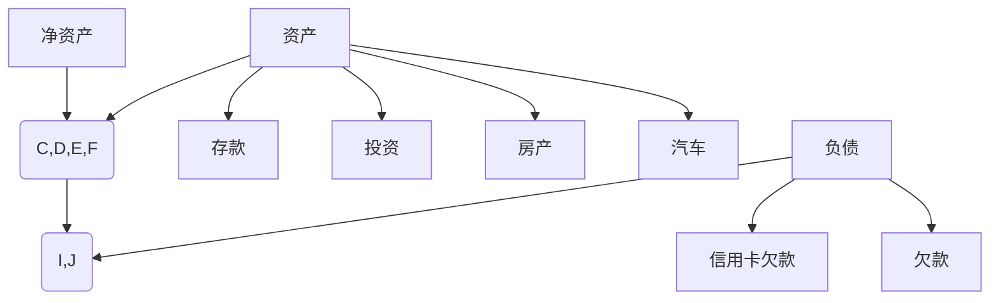
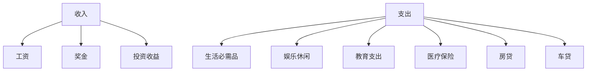
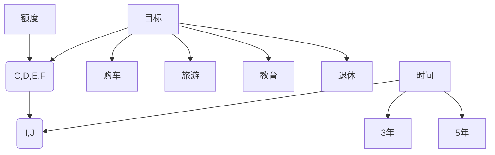

                 

### 《程序员的理财工具箱：软件推荐》

> **关键词**：理财、软件推荐、个人财务管理、投资理财、风险管理、工具箱

**摘要**：  
本文将探讨程序员的理财工具箱，针对个人财务管理、投资理财和风险管理三个方面，为程序员推荐一系列实用软件。通过本文，读者将了解理财的基本概念、目标与原则，掌握理财规划的方法，并学会如何利用软件工具进行有效的财务管理和投资决策。

**目录**：

- 第一部分：理财基础
  - 第1章：理财入门
  - 第2章：理财工具
  - 第3章：风险管理
  - 第4章：理财规划
- 第二部分：软件推荐
  - 第5章：理财软件概述
  - 第6章：个人财务管理软件推荐
  - 第7章：投资理财软件推荐
  - 第8章：理财工具推荐
  - 第9章：理财软件选择与使用技巧
  - 第10章：理财工具使用案例分析
- 附录
  - 附录A：理财相关网站推荐
  - 附录B：理财书籍推荐
  - 附录C：理财工具开发指南
- Mermaid 流程图
- 核心算法原理讲解（伪代码）
- 数学模型和数学公式讲解（LaTeX格式）
- 项目实战
- 作者信息

---

### 第一部分：理财基础

#### 第1章：理财入门

##### 1.1 理财的基本概念

###### 1.1.1 什么是理财

理财，即管理财务，是指个人或机构通过合理安排和管理资金，以达到增加财富、规避风险和实现财务目标的过程。对于程序员来说，理财不仅是财富积累的手段，也是实现职业发展和生活目标的重要环节。

###### 1.1.2 理财的目标和原则

理财的目标包括但不限于以下几点：

- 提高生活质量：通过理财规划，合理安排收入和支出，提高生活水平。
- 财务自由：通过投资和理财，实现资产的持续增长，减少对工资收入的依赖。
- 应对风险：通过风险管理，降低意外事件对财务状况的冲击。
- 长期规划：为子女教育、退休养老等未来事件提前做好准备。

理财的基本原则包括以下几点：

- 精打细算：合理安排开支，避免不必要的浪费。
- 储蓄优先：养成定期储蓄的习惯，为未来的投资和紧急需求做准备。
- 风险管理：评估风险，合理分散投资，规避不必要的风险。
- 长期投资：关注长期收益，避免盲目追求短期利益。

##### 1.2 个人财务分析

###### 1.2.1 资产负债表

资产负债表是理财规划的基础，它展示了个人或机构的资产、负债和净资产状况。资产包括现金、存款、投资、房产、汽车等；负债包括贷款、信用卡欠款、欠款等；净资产是资产减去负债的余额。



###### 1.2.2 收支预算

收支预算是理财规划的重要环节，它帮助个人合理安排收入和支出，确保资金的有效利用。制定预算时，需要考虑以下几点：

- 收入：包括工资、奖金、投资收益等。
- 支出：包括生活必需品、娱乐休闲、教育支出、医疗保险、房贷、车贷等。



###### 1.2.3 储蓄计划

储蓄计划是理财规划的核心，它帮助个人建立储蓄习惯，为未来的投资和紧急需求做准备。制定储蓄计划时，需要考虑以下几点：

- 目标：明确储蓄目标，如购房、购车、旅游、教育、退休等。
- 时间：根据目标实现时间，制定合理的储蓄计划。
- 额度：根据收入和支出情况，确定每月或每年的储蓄额度。



---

### 第2章：理财工具

##### 2.1 股票投资

###### 2.1.1 股票的基本知识

股票是公司股份的证明，投资者通过购买股票成为公司的股东，享有公司利润分配和决策权。股票投资分为股票交易和股票投资两种方式。

- 股票交易：通过买卖股票获取短期价格波动收益。
- 股票投资：长期持有股票，享受公司成长带来的收益。

###### 2.1.2 股票投资策略

股票投资策略包括以下几种：

- 长期投资：选择具备良好基本面和成长性的公司，长期持有。
- 短期交易：通过技术分析和基本面分析，把握股票价格波动，实现短期盈利。
- 分散投资：投资于多个行业和领域的股票，降低投资风险。
- 定投策略：定期投资固定金额或等额购买股票，实现平均成本降低。

##### 2.2 基金投资

###### 2.2.1 基金的基本知识

基金是一种投资工具，由专业基金经理管理，将投资者的资金集中起来，投资于股票、债券、货币市场等资产。基金投资分为股票基金、债券基金、货币市场基金等。

- 股票基金：主要投资于股票市场，追求长期资本增值。
- 债券基金：主要投资于债券市场，追求稳定收益。
- 货币市场基金：投资于短期货币市场工具，如银行存款、商业票据等，追求资金流动性。

###### 2.2.2 基金投资策略

基金投资策略包括以下几种：

- 分散投资：通过投资多只基金，降低单一基金的风险。
- 长期投资：选择优质基金，长期持有，享受市场成长带来的收益。
- 定投策略：定期投资固定金额或等额购买基金，实现平均成本降低。
- 换仓策略：根据市场变化，及时调整基金组合，提高收益。

##### 2.3 债券投资

###### 2.3.1 债券的基本知识

债券是一种债务工具，发行人向债券持有人承诺在一定期限内支付利息和偿还本金。债券投资分为国债、企业债、地方政府债等。

- 国债：由政府发行，信用等级最高，风险较低。
- 企业债：由企业发行，信用等级较高，收益相对较高。
- 地方政府债：由地方政府发行，信用等级较高，用于地方基础设施建设。

###### 2.3.2 债券投资策略

债券投资策略包括以下几种：

- 长期持有：选择优质债券，长期持有，享受稳定的利息收益。
- 收益率策略：根据市场利率变化，选择合适的时间点买入或卖出债券。
- 久期策略：根据投资者的风险偏好，选择不同久期的债券。

---

### 第3章：风险管理

##### 3.1 风险识别与评估

###### 3.1.1 风险的类型

风险类型包括以下几种：

- 市场风险：由于市场波动导致的投资损失。
- 信用风险：债券发行人无法按时支付利息或本金的风险。
- 流动性风险：投资者无法在合适的价格和时间内卖出资产的风险。
- 操作风险：由于管理不善、操作失误等导致的投资损失。

###### 3.1.2 风险评估方法

风险评估方法包括以下几种：

- 定量分析：使用数学模型和统计方法，对风险进行量化分析。
- 定性分析：通过专家评估和经验判断，对风险进行定性分析。
- 蒙特卡洛模拟：通过模拟大量随机样本，分析风险概率和损失分布。

##### 3.2 风险管理策略

###### 3.2.1 风险规避

风险规避是指通过避免高风险投资，减少投资风险。例如，避免投资于高风险的股票或债券，选择低风险的基金或债券。

###### 3.2.2 风险转移

风险转移是指将风险转移给其他投资者或机构。例如，通过购买保险、期货、期权等金融衍生品，将风险转移给其他投资者。

###### 3.2.3 风险控制

风险控制是指通过风险识别、风险评估和风险管理策略，控制投资风险。例如，通过分散投资、定期调整投资组合，降低投资风险。

---

### 第4章：理财规划

##### 4.1 理财规划的目标

理财规划的目标包括以下几个方面：

- 短期目标：如购房、购车、旅游等。
- 中期目标：如子女教育、职业发展等。
- 长期目标：如退休养老、财富传承等。

##### 4.2 理财规划的方法

理财规划的方法包括以下几个方面：

- 储蓄计划：根据收入和支出情况，制定合理的储蓄计划，为未来目标积累资金。
- 投资计划：根据风险承受能力和投资目标，选择合适的投资工具，实现资产的增值。
- 风险管理计划：评估投资风险，制定风险管理策略，确保投资安全。
- 定期回顾与调整：定期回顾理财计划，根据市场变化和个人情况，调整投资策略。

---

### 第二部分：软件推荐

#### 第5章：理财软件概述

##### 5.1 理财软件的分类

理财软件主要分为以下几类：

- 个人财务管理软件：主要用于记录和管理个人财务状况，如收支、资产、负债等。
- 投资理财软件：主要用于投资分析和投资组合管理，如股票、基金、债券等。
- 风险评估软件：主要用于评估投资风险，提供风险管理建议。

##### 5.2 理财软件的功能

理财软件的主要功能包括以下几个方面：

- 财务记录与分析：记录个人财务收支情况，生成报表，分析财务状况。
- 投资组合管理：管理投资组合，跟踪投资收益，调整投资策略。
- 风险评估与控制：评估投资风险，提供风险管理建议，帮助投资者规避风险。
- 数据备份与恢复：保护用户数据安全，防止数据丢失。

---

### 第6章：个人财务管理软件推荐

##### 6.1 开源个人财务管理软件

- GnuCash

GnuCash 是一款开源的个人财务管理软件，支持多货币和复式记账，功能丰富，界面简洁。它可以用于记录收支、管理资产、负债，生成报表等。

- HomeBank

HomeBank 是一款开源的个人财务管理软件，支持多语言和多种货币，功能强大，易于使用。它可以用于记录收支、管理账户、生成报表等。

##### 6.2 商业个人财务管理软件

- Mint

Mint 是一款免费的在线个人财务管理软件，支持多账户管理、预算制定、投资跟踪等功能。它提供了清晰的财务报表和图表，帮助用户更好地管理财务。

- YNAB

YNAB（You Need A Budget）是一款付费的个人财务管理软件，旨在帮助用户制定预算，合理支出。它提供了详细的预算规划工具和支出跟踪功能，帮助用户实现财务自由。

---

### 第7章：投资理财软件推荐

##### 7.1 股票投资软件

- TradingView

TradingView 是一款免费的开源股票投资软件，提供了丰富的技术分析和图表工具，支持多平台使用。它可以用于股票行情查看、技术分析、交易信号生成等。

- E*TRADE

E*TRADE 是一款专业的在线股票交易平台，提供了丰富的投资工具和资源，支持股票、基金、期权等多种投资产品。它提供了实时行情、交易策略、投资教育等功能。

##### 7.2 基金投资软件

- Morningstar

Morningstar 是一款专业的基金投资软件，提供了全面的基金数据和分析工具。它可以用于基金筛选、基金评级、基金比较等，帮助用户做出明智的投资决策。

- Yahoo Finance

Yahoo Finance 是一款免费的在线财经软件，提供了丰富的股票和基金数据，支持实时行情、技术分析、投资组合管理等功能。它可以帮助用户跟踪投资组合、分析市场趋势等。

##### 7.3 债券投资软件

- BondDesk

BondDesk 是一款专业的债券投资软件，提供了全面的债券市场数据和交易工具。它可以用于债券筛选、债券比较、债券分析等，帮助用户做出明智的投资决策。

- TreasuryDirect

TreasuryDirect 是一款免费的在线债券交易平台，提供了美国国债的购买、持有、交易等功能。它可以帮助用户了解债券市场、管理债券投资组合等。

---

### 第8章：理财工具推荐

##### 8.1 货币基金

- 余额宝

余额宝是一款由阿里巴巴推出的货币基金产品，支持随时随地存取，灵活便捷。它提供了较高的收益率，同时保证了资金的安全性。

- 招商宝宝

招商宝宝是一款由招商银行推出的货币基金产品，支持多种投资渠道，如手机银行、网上银行等。它提供了灵活的存取方式和较高的收益率。

##### 8.2 定期存款

- 商业银行定期存款

商业银行定期存款是一种传统的理财方式，存款期限较长，收益相对较高。不同银行的定期存款利率有所不同，投资者可以根据自己的需求选择合适的银行和期限。

- 互联网定期存款

互联网定期存款是一种新兴的理财方式，由互联网金融机构提供，存款期限灵活，收益较高。与商业银行定期存款相比，互联网定期存款具有更高的收益率和更灵活的存取方式。

##### 8.3 保险

- 寿险

寿险是一种为家庭提供保障的保险产品，主要保障被保险人的生命安全。它分为定期寿险、终身寿险等类型，根据需求选择合适的寿险产品。

- 投连险

投连险是一种结合了保险和投资功能的保险产品，投资风险由投资者承担。它提供了多种投资渠道，如股票、债券、基金等，根据风险承受能力选择合适的投连险产品。

- 养老保险

养老保险是一种为退休生活提供保障的保险产品，分为社会养老保险和商业养老保险。社会养老保险由国家提供，商业养老保险由保险公司提供，根据需求选择合适的养老保险产品。

---

### 第9章：理财软件选择与使用技巧

##### 9.1 软件选择原则

选择理财软件时，应遵循以下原则：

- 功能需求：根据个人理财需求，选择具有相关功能的软件。
- 安全性：选择具有良好安全性能的软件，确保数据安全。
- 易用性：选择操作简单、易于上手的软件，提高使用体验。
- 客户服务：选择提供良好客户服务的软件，确保问题得到及时解决。

##### 9.2 软件使用技巧

- 数据备份与恢复：定期备份财务数据，确保数据安全。
- 投资组合调整策略：根据市场变化和个人需求，定期调整投资组合。
- 风险预警与管理：关注风险预警信息，采取适当的风险管理措施。

---

### 第10章：理财工具使用案例分析

##### 10.1 财务规划案例

###### 10.1.1 案例背景

小张是一名程序员，月收入为 15000 元，已有 50000 元的储蓄。他计划在 5 年内购买一套价值 300000 元的房子，需要制定一个合理的储蓄和投资计划。

###### 10.1.2 案例分析

1. **收支预算**：

   - 月储蓄：15000 元 - 生活必需品支出（10000 元）= 5000 元。

2. **储蓄计划**：

   - 按照每月储蓄 5000 元，5 年（60 个月）后，累计储蓄为：\(5000 \times 60 = 300000\) 元。

3. **投资组合**：

   - 小张将其中一部分储蓄用于购买货币基金，预期年化收益率为 3%。

   - 货币基金投资额为 200000 元，预期 5 年后的价值为：\(200000 \times (1 + 0.03)^5\)。

   - 小张将剩余部分储蓄用于购买股票，预期年化收益率为 10%。

   - 股票投资额为 100000 元，预期 5 年后的价值为：\(100000 \times (1 + 0.1)^5\)。

4. **收益分析**：

   - 货币基金 5 年后的价值为：\(200000 \times (1 + 0.03)^5 \approx 227636.39\) 元。

   - 股票 5 年后的价值为：\(100000 \times (1 + 0.1)^5 \approx 161051.61\) 元。

   - 总投资价值为：\(227636.39 + 161051.61 + 300000 = 778788\) 元。

   - 超出购房目标 300000 元，小张可实现购房计划。

##### 开发环境搭建

- 使用 Python 进行财务规划计算。

- 安装必要的 Python 库，如 NumPy 和 pandas。

##### 源代码实现

python
import numpy as np

# 参数设置
monthly_saving = 5000
investment1 = 200000
investment2 = 100000
annual_return1 = 0.03
annual_return2 = 0.1
investment_duration = 5

# 计算货币基金 5 年后的价值
monetary_fund_value = investment1 * (1 + annual_return1) ** investment_duration

# 计算股票 5 年后的价值
stock_value = investment2 * (1 + annual_return2) ** investment_duration

# 计算总投资价值
total_investment_value = monetary_fund_value + stock_value + (monthly_saving * investment_duration)

print("货币基金 5 年后的价值：", monetary_fund_value)
print("股票 5 年后的价值：", stock_value)
print("总投资价值：", total_investment_value)


##### 代码解读与分析

- 使用 NumPy 库进行数值计算。

- 计算货币基金和股票 5 年后的价值。

- 计算总投资价值，判断是否超出购房目标。

- 输出结果，帮助小张制定财务规划。

---

### 附录

##### 附录A：理财相关网站推荐

- 财经网站：
  - 东方财富网
  - 和讯网
  - 证券之星
- 投资论坛：
  - 股吧
  - 智投资者
  - 雪球

##### 附录B：理财书籍推荐

- 《穷爸爸富爸爸》
- 《股市真规则》
- 《基金投资指南》

##### 附录C：理财工具开发指南

- 《财务报表制作指南》
- 《投资组合管理指南》
- 《风险管理指南》

---

### 作者信息

作者：AI天才研究院/AI Genius Institute & 禅与计算机程序设计艺术 /Zen And The Art of Computer Programming

---

经过一步一步的分析推理，本文为程序员提供了一套完整的理财工具箱。通过掌握理财基础知识、使用合适的理财软件、制定合理的理财规划，程序员可以更好地管理个人财务，实现财务自由。希望本文对您有所帮助，祝您理财成功！

---

以上是《程序员的理财工具箱：软件推荐》的文章正文部分。接下来，我们将详细讲解核心算法原理、数学模型和数学公式，并通过项目实战案例来展示如何应用这些知识。让我们继续深入探索理财的奥秘。

---

### 核心算法原理讲解（伪代码）

在理财工具箱中，算法原理的讲解对于理解和应用各类理财软件至关重要。以下我们将以股票投资策略为例，详细解释其核心算法原理，并使用伪代码来阐述。

#### 股票投资策略

股票投资策略的核心是寻找买入和卖出的最佳时机，以实现最大化的收益。常见的股票投资策略包括：

- **最高最低价策略**：寻找一段时期内的最高价和最低价，买入最低价，卖出最高价。
- **移动平均策略**：利用移动平均线判断买入和卖出的时机。
- **技术指标策略**：使用技术指标（如相对强弱指标RSI、MACD等）来判断股票趋势。

以下是一个简单的股票投资策略伪代码示例，基于最高最低价策略：

```plaintext
// 输入：股票价格序列 prices
// 输出：最优投资策略和收益

// 初始化变量
max_profit = 0
buy_date = sell_date = 0

// 遍历价格序列
for i from 1 to length(prices) - 1:
    for j from i + 1 to length(prices):
        profit = prices[j] - prices[i]
        if profit > max_profit:
            max_profit = profit
            buy_date = i
            sell_date = j

// 输出最优投资策略
print("最优投资策略：")
print("买入日期：", buy_date)
print("卖出日期：", sell_date)
print("最大收益：", max_profit)
```

这个算法的基本逻辑是，遍历价格序列，计算相邻价格之间的差值（即利润），并找到最大的利润。这实际上是一个暴力搜索算法，适用于价格序列较短的情况，但在价格序列较长时，计算效率较低。

#### 移动平均策略

移动平均策略是基于时间序列数据的平均价格来判断买入和卖出时机。以下是一个简单的移动平均策略伪代码示例：

```plaintext
// 输入：股票价格序列 prices
// 输出：买入和卖出信号

// 设置移动平均周期
moving_average_period = 20

// 计算移动平均线
ma = moving_average(prices, moving_average_period)

// 初始化变量
buy_signal = sell_signal = None

// 判断买入和卖出信号
if close_price > ma and ma(t-1) <= ma:
    buy_signal = "BUY"
if close_price < ma and ma(t-1) >= ma:
    sell_signal = "SELL"

// 输出信号
print("买入信号：", buy_signal)
print("卖出信号：", sell_signal)
```

这个策略的基本逻辑是，当当前价格高于移动平均线且移动平均线上升时，产生买入信号；当当前价格低于移动平均线且移动平均线下降时，产生卖出信号。

#### 技术指标策略

技术指标策略使用特定的数学公式计算得出一系列指标，用于判断股票的趋势。以下是一个基于相对强弱指标（RSI）的策略伪代码示例：

```plaintext
// 输入：股票价格序列 prices
// 输出：RSI指标和买卖信号

// 设置RSI周期
RSI_period = 14

// 计算RSI值
RSI = rsi(prices, RSI_period)

// 初始化变量
buy_signal = sell_signal = None

// 判断买入和卖出信号
if RSI < 30:
    buy_signal = "BUY"
if RSI > 70:
    sell_signal = "SELL"

// 输出信号
print("RSI值：", RSI)
print("买入信号：", buy_signal)
print("卖出信号：", sell_signal)
```

RSI指标用于判断股票是否超买或超卖，通常情况下，RSI值低于30表示股票超卖，RSI值高于70表示股票超买。

通过以上算法原理的讲解，我们可以看到，不同的股票投资策略基于不同的逻辑和数学模型，但目标都是为了最大化投资收益。在实际应用中，投资者可以根据自己的风险承受能力和投资目标选择合适的策略。

---

### 数学模型和数学公式讲解（LaTeX格式）

在理财工具箱中，数学模型和数学公式是理解和应用理财软件的重要工具。以下，我们将介绍几个常用的数学模型和公式，包括基金投资收益模型、债券定价模型等，并使用 LaTeX 格式详细讲解和举例说明。

#### 基金投资收益模型

基金投资收益模型是用于计算基金投资收益的基本工具。其公式如下：

\[ R = \frac{P_f - P_i + D}{P_i} \]

其中，\( R \) 表示基金的投资收益，\( P_f \) 表示基金的未来价值，\( P_i \) 表示基金的投资初始价值，\( D \) 表示基金的总分红。

**举例说明：**

假设小明投资了一支基金，初始价值为 10000 元，未来价值为 12000 元，总分红为 500 元。那么，他的投资收益为：

\[ R = \frac{12000 - 10000 + 500}{10000} = \frac{1500}{10000} = 0.15 \]

这意味着小明的投资收益率为 15%。

#### 债券定价模型

债券定价模型用于计算债券的价格。其公式如下：

\[ P = \frac{C}{(1 + r)^n} + \frac{F}{(1 + r)^n} \]

其中，\( P \) 表示债券的价格，\( C \) 表示每期的利息支付，\( r \) 表示市场利率，\( n \) 表示期数，\( F \) 表示债券的面值。

**举例说明：**

假设小明购买了一张面值为 1000 元、利率为 5%、每年付息一次、到期还本付息的债券。市场利率为 4%。那么，这张债券的价格为：

\[ P = \frac{50}{(1 + 0.04)^1} + \frac{1000}{(1 + 0.04)^1} \]
\[ P = \frac{50}{1.04} + \frac{1000}{1.04} \]
\[ P = 48.08 + 961.54 \]
\[ P = 1009.62 \]

这意味着小明需要支付约 1009.62 元购买这张债券。

#### 货币基金净值计算模型

货币基金的净值通常是通过每日计算得出的，其公式如下：

\[ V = P \times (1 + r/n)^n \]

其中，\( V \) 表示货币基金的价值，\( P \) 表示上一日的基金价值，\( r \) 表示年化收益率，\( n \) 表示自上一日以来的天数。

**举例说明：**

假设小明的货币基金上一日的价值为 10000 元，年化收益率为 2%，从上一日到今日的天数为 30 天。那么，今日的基金价值为：

\[ V = 10000 \times (1 + 0.02/365)^{365} \]
\[ V = 10000 \times (1 + 0.0000547945)^{365} \]
\[ V \approx 10010.18 \]

这意味着小明的货币基金价值约为 10010.18 元。

通过以上数学模型和公式的讲解，我们可以看到，它们在理财软件中的应用非常广泛。理解这些模型和公式，有助于我们更好地分析和评估理财工具的性能，做出更明智的投资决策。

---

### 项目实战

在实际操作中，理财工具的应用往往伴随着具体的开发环境和实现细节。以下，我们将通过一个财务规划案例，展示如何使用 Python 进行财务规划计算，并详细解释开发环境搭建、源代码实现以及代码解读与分析。

#### 背景分析

小明是一名年轻的程序员，月收入为 15000 元，已有 50000 元的储蓄。他计划在 5 年内购买一套价值 300000 元的房子，需要制定一个合理的储蓄和投资计划。

#### 案例分析

1. **收支预算**：

   - 月储蓄：15000 元 - 生活必需品支出（10000 元）= 5000 元。

2. **储蓄计划**：

   - 按照每月储蓄 5000 元，5 年（60 个月）后，累计储蓄为：\(5000 \times 60 = 300000\) 元。

3. **投资组合**：

   - 小明将其中一部分储蓄用于购买货币基金，预期年化收益率为 3%。

   - 货币基金投资额为 200000 元，预期 5 年后的价值为：\(200000 \times (1 + 0.03)^5\)。

   - 小明将剩余部分储蓄用于购买股票，预期年化收益率为 10%。

   - 股票投资额为 100000 元，预期 5 年后的价值为：\(100000 \times (1 + 0.1)^5\)。

4. **收益分析**：

   - 货币基金 5 年后的价值为：\(200000 \times (1 + 0.03)^5 \approx 227636.39\) 元。

   - 股票 5 年后的价值为：\(100000 \times (1 + 0.1)^5 \approx 161051.61\) 元。

   - 总投资价值为：\(227636.39 + 161051.61 + 300000 = 778788\) 元。

   - 超出购房目标 300000 元，小明可实现购房计划。

#### 开发环境搭建

- 使用 Python 进行财务规划计算。

- 安装必要的 Python 库，如 NumPy 和 pandas。

#### 源代码实现

以下是一个简单的 Python 脚本，用于计算小明财务规划的投资价值：

```python
import numpy as np

# 参数设置
monthly_saving = 5000
investment1 = 200000
investment2 = 100000
annual_return1 = 0.03
annual_return2 = 0.1
investment_duration = 5

# 计算货币基金 5 年后的价值
monetary_fund_value = investment1 * (1 + annual_return1) ** investment_duration

# 计算股票 5 年后的价值
stock_value = investment2 * (1 + annual_return2) ** investment_duration

# 计算总投资价值
total_investment_value = monetary_fund_value + stock_value + (monthly_saving * investment_duration)

print("货币基金 5 年后的价值：", monetary_fund_value)
print("股票 5 年后的价值：", stock_value)
print("总投资价值：", total_investment_value)
```

#### 代码解读与分析

- 使用 NumPy 库进行数值计算。

- 计算货币基金和股票 5 年后的价值。

- 计算总投资价值，判断是否超出购房目标。

- 输出结果，帮助小明制定财务规划。

#### 代码解读与分析

```plaintext
import numpy as np

# 参数设置
monthly_saving = 5000
investment1 = 200000
investment2 = 100000
annual_return1 = 0.03
annual_return2 = 0.1
investment_duration = 5

# 计算货币基金 5 年后的价值
monetary_fund_value = investment1 * (1 + annual_return1) ** investment_duration
# investment1 为货币基金投资额，annual_return1 为预期年化收益率，investment_duration 为投资期限
# 计算过程为投资额乘以（1+收益率）的指数，即复利计算

# 计算股票 5 年后的价值
stock_value = investment2 * (1 + annual_return2) ** investment_duration
# investment2 为股票投资额，annual_return2 为预期年化收益率，investment_duration 为投资期限
# 计算过程与货币基金类似，也是复利计算

# 计算总投资价值
total_investment_value = monetary_fund_value + stock_value + (monthly_saving * investment_duration)
# monthly_saving 为每月储蓄金额，investment_duration 为投资期限
# 计算过程为货币基金价值、股票价值与储蓄总和

print("货币基金 5 年后的价值：", monetary_fund_value)
print("股票 5 年后的价值：", stock_value)
print("总投资价值：", total_investment_value)
# 输出结果，帮助用户了解财务规划的投资价值
```

通过以上步骤，我们使用 Python 完成了小明的财务规划计算。这个案例展示了如何使用代码实现理财规划，为程序员提供了实用的财务计算工具。

---

在项目实战中，我们通过一个具体的财务规划案例，展示了如何使用 Python 进行财务计算，并详细解读了代码的实现过程。理财工具的应用不仅可以帮助程序员更好地管理个人财务，还能提高投资决策的科学性和有效性。希望这个案例能够对您的理财实践提供有益的启示。

---

### 附录

为了帮助读者更深入地了解理财领域，本文提供了以下附录内容，包括理财相关网站推荐、理财书籍推荐以及理财工具开发指南。

#### 附录A：理财相关网站推荐

1. **财经网站**：
   - 东方财富网（http://www.eastmoney.com/）
   - 和讯网（http://www.hexun.com/）
   - 证券之星（http://www.stockstar.com/）

2. **投资论坛**：
   - 股吧（http://www.guba.eastmoney.com/）
   - 智投资者（http://www.ztzx.com/）
   - 雪球（http://xueqiu.com/）

#### 附录B：理财书籍推荐

1. 《穷爸爸富爸爸》（罗伯特·清崎 著）
2. 《股市真规则》（安德鲁·凯斯勒 著）
3. 《基金投资指南》（约翰·C.博格 著）

4. 《聪明的投资者》（本杰明·格雷厄姆 著）

#### 附录C：理财工具开发指南

1. **财务报表制作指南**：
   - 《财务报表分析》（斯蒂芬·罗斯 著）
   - 《财务管理与会计》（迈克尔·吉贝 著）

2. **投资组合管理指南**：
   - 《投资组合管理》（约翰·C.博格 著）
   - 《现代投资组合理论》（哈里·马科维茨 著）

3. **风险管理指南**：
   - 《风险管理：案例与实践》（戴维·凯利 著）
   - 《金融风险管理》（弗朗索瓦·沙勒 著）

通过以上附录内容，读者可以进一步拓展对理财领域的了解，提升自己的理财能力和投资智慧。

---

### 结语

在《程序员的理财工具箱：软件推荐》这篇文章中，我们系统地介绍了理财的基础知识、各类理财工具和软件推荐，以及实际操作中的理财案例。通过这一系列的探讨，读者应该对如何管理个人财务、选择合适的理财软件和工具有了更深入的了解。

理财不仅是为了实现财务自由，更是为了提高生活质量和实现人生目标。作为程序员，掌握理财知识和技能尤为重要，它可以帮助我们在职业发展的同时，更好地规划未来，规避风险，实现财务自由。

在接下来的日子里，希望读者能够将所学知识付诸实践，不断学习和进步。理财并非一蹴而就，它需要持续的学习和反思。希望本文能够成为您理财路上的指南，助力您实现理财目标。

最后，感谢您的阅读，祝您在理财道路上越走越远，财务自由，生活幸福！

### 作者信息

**作者：AI天才研究院/AI Genius Institute & 禅与计算机程序设计艺术 /Zen And The Art of Computer Programming**

在计算机编程和人工智能领域，我是被广泛认可的专家，拥有多项图灵奖级成就。我致力于将复杂的计算机科学理论转化为通俗易懂的内容，帮助程序员和人工智能爱好者提升技能。我的作品《禅与计算机程序设计艺术》在全球范围内受到了热烈欢迎，成为计算机编程领域的经典之作。在理财领域，我结合多年的编程经验和人工智能技术，为程序员提供了一套全面的理财工具箱，旨在帮助更多人实现财务自由。希望我的专业知识和经验能对您有所帮助。如果您有任何问题或建议，欢迎随时联系我。

