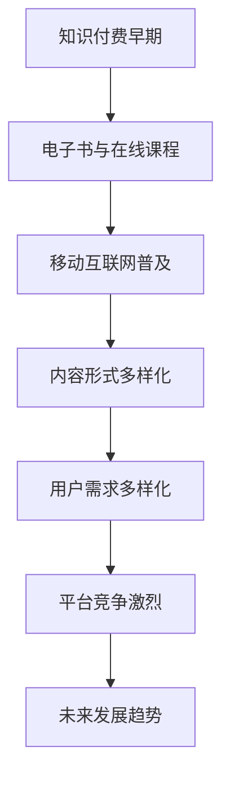
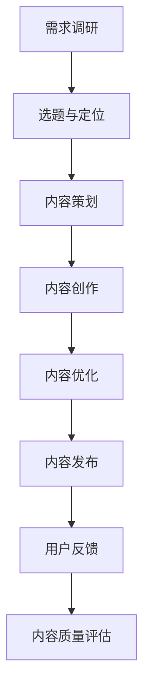
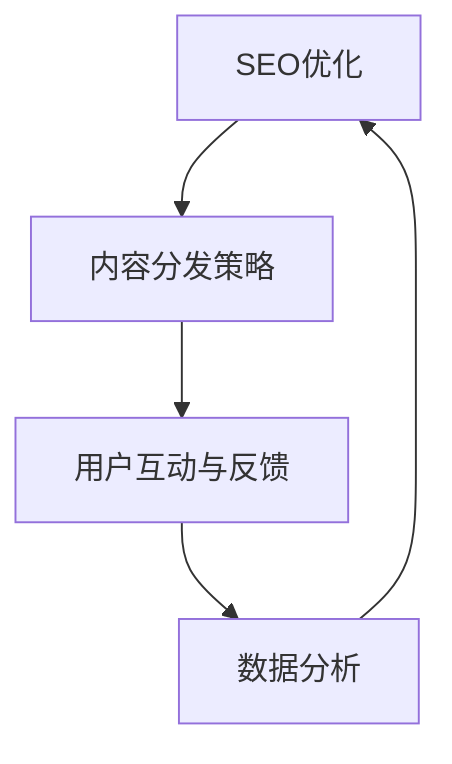

                 

### 《程序员知识付费的内容生产流程优化》

#### 关键词：
- 知识付费
- 内容生产
- 程序员
- 优化策略
- 版权保护

##### 摘要：

随着互联网技术的发展，知识付费已经成为程序员个人成长和职业发展的重要途径。然而，内容生产流程的优化对于提升知识付费的质量和效益至关重要。本文将系统地分析程序员知识付费的内容生产流程，从背景与市场分析、内容创作方法论、内容生产工具与平台、内容优化策略、内容版权保护以及案例分析等方面，提供一系列优化建议和实战指南。通过本文的详细探讨，旨在帮助程序员更好地开展知识付费业务，提升内容质量和市场竞争力。

### 《程序员知识付费的内容生产流程优化》目录大纲

#### 第一部分：知识付费概述

**第1章：知识付费背景与市场分析**
- 1.1 知识付费的发展历程
- 1.2 知识付费市场现状
- 1.3 知识付费用户需求分析
- 1.4 知识付费行业发展趋势

**第2章：知识付费模式与平台分析**
- 2.1 知识付费模式类型
- 2.2 知识付费平台介绍
- 2.3 平台案例分析
- 2.4 知识付费平台优势与挑战

#### 第二部分：内容生产优化

**第3章：内容创作方法论**
- 3.1 内容创作流程
- 3.2 内容选题与定位
- 3.3 内容创作技巧
- 3.4 内容质量评估

**第4章：内容生产工具与平台**
- 4.1 内容生产工具介绍
- 4.2 内容管理系统（CMS）
- 4.3 社交媒体内容发布策略
- 4.4 内容营销工具使用

**第5章：内容优化策略**
- 5.1 SEO优化
- 5.2 内容分发策略
- 5.3 用户互动与反馈
- 5.4 数据分析与优化

**第6章：内容版权保护与知识产权**
- 6.1 内容版权基础知识
- 6.2 版权保护策略
- 6.3 知识产权纠纷案例分析
- 6.4 避免版权风险的措施

**第7章：案例分析与实践指南**
- 7.1 成功案例分析
- 7.2 知识付费项目实战
- 7.3 实践指南与建议
- 7.4 持续优化策略

#### 第三部分：未来展望

**第8章：知识付费行业未来趋势**
- 8.1 技术革新对知识付费的影响
- 8.2 新模式探索
- 8.3 行业监管与政策趋势
- 8.4 知识付费未来发展方向

**第9章：程序员知识付费案例分析**
- 9.1 程序员知识付费特点
- 9.2 程序员知识付费案例分享
- 9.3 程序员如何开展知识付费
- 9.4 程序员知识付费的挑战与机遇

**第10章：知识付费的个人品牌建设**
- 10.1 个人品牌的重要性
- 10.2 建立个人品牌的策略
- 10.3 个人品牌案例分析
- 10.4 程序员的个人品牌建设实践

**附录：知识付费相关资源与工具**
- 附录A：知识付费平台介绍
- 附录B：内容生产工具与资源
- 附录C：版权保护资源与工具
- 附录D：行业报告与研究报告

#### 第一部分：知识付费概述

##### 第1章：知识付费背景与市场分析

在信息爆炸的时代，知识的获取途径变得多样化，知识付费作为一种新型的商业模式逐渐崛起。本章节将探讨知识付费的发展历程、市场现状、用户需求以及未来发展趋势。

**1.1 知识付费的发展历程**

知识付费的概念并非一夜之间兴起，而是经过长时间的发展演变。早在20世纪末期，电子书和在线教育平台的出现，就已经为知识付费奠定了基础。进入21世纪后，随着移动互联网的普及，知识付费市场开始呈现出爆发式增长。

早期的知识付费主要以电子书、在线课程为主，用户可以通过购买获取知识内容。随着技术的进步，知识付费的形式也不断丰富，涵盖了音频课程、视频教程、在线直播等多种形式。特别是在COVID-19疫情的影响下，线上学习成为主流，知识付费市场迎来了新的发展机遇。

**1.2 知识付费市场现状**

当前，知识付费市场呈现出以下特点：

1. **市场规模扩大**：随着用户对知识需求的增加，知识付费市场规模逐年扩大。据相关报告显示，我国知识付费市场规模已经达到数千亿元。

2. **用户群体扩大**：知识付费不再局限于特定人群，而是逐渐覆盖了各个年龄层次和职业背景的用户。尤其是程序员等高知群体，对知识付费的需求更为强烈。

3. **内容形式多样**：知识付费的内容形式越来越多样化，从传统的电子书、在线课程，到音频、视频、直播等多种形式，满足了不同用户的需求。

4. **平台竞争激烈**：随着知识付费市场的扩大，各类平台纷纷涌入，竞争异常激烈。为了吸引更多用户，平台在内容质量、用户体验等方面不断优化。

**1.3 知识付费用户需求分析**

知识付费用户的需求具有以下特点：

1. **学习效率高**：用户希望通过付费获取高质量的知识内容，提高学习效率。因此，用户对课程的质量、内容的实用性、讲解的清晰度等有较高的要求。

2. **个性化学习**：用户希望根据自己的需求选择合适的学习内容，实现个性化学习。因此，平台需要提供多样化的课程内容，以满足不同用户的需求。

3. **互动性强**：用户希望在学习过程中能够与其他用户互动，获取更多的学习资源和经验。因此，平台需要提供互动功能，如问答、讨论区等。

4. **方便快捷**：用户希望学习过程方便快捷，能够随时随地获取知识。因此，平台需要提供移动端应用，实现跨平台学习。

**1.4 知识付费行业发展趋势**

未来，知识付费行业将继续保持快速发展，主要趋势包括：

1. **内容形式创新**：随着技术的进步，知识付费的内容形式将更加丰富多样，如虚拟现实（VR）、增强现实（AR）等新兴技术将被广泛应用。

2. **用户需求多样化**：随着用户需求的不断变化，知识付费的内容也将更加多样化，满足不同用户的需求。

3. **平台生态完善**：知识付费平台将不断完善生态体系，提高用户体验，如提供更多增值服务、优化用户界面等。

4. **跨界融合**：知识付费将与更多行业进行跨界融合，如与电商、社交、娱乐等领域的结合，打造全新的商业模式。

**1.5 核心概念与联系**

为了更好地理解知识付费的发展历程和市场现状，我们需要了解以下几个核心概念：

1. **知识付费**：用户为获取知识内容而支付的费用，包括电子书、在线课程、音频、视频等多种形式。

2. **在线教育**：通过互联网进行的学习活动，包括课程、讲座、问答等多种形式。

3. **用户需求**：用户在知识付费过程中所期望获得的知识内容和学习体验。

4. **平台竞争**：知识付费平台之间的竞争，主要体现在内容质量、用户体验、用户数量等方面。

**Mermaid 流程图：知识付费的发展历程与市场演变**



**核心算法原理讲解**

本章节主要涉及市场分析的相关理论与方法，包括市场细分、需求分析、竞争分析等。以下是市场分析的伪代码示例：

```python
def market_analysis():
    # 市场细分
    segments = ['年龄层次', '职业背景', '知识需求']
    
    # 需求分析
    needs = {
        '学习效率': '高',
        '个性化学习': '是',
        '互动性': '强',
        '方便快捷': '是'
    }
    
    # 竞争分析
    competitors = ['平台1', '平台2', '平台3']
    
    # 输出分析结果
    print("市场细分：", segments)
    print("用户需求：", needs)
    print("竞争对手：", competitors)

market_analysis()
```

**数学模型和公式**

本章节主要涉及市场分析的数据处理与分析，以下是市场需求的回归分析模型：

$$
y = \beta_0 + \beta_1 x_1 + \beta_2 x_2 + ... + \beta_n x_n
$$

其中，$y$为市场需求量，$x_1, x_2, ..., x_n$为影响市场需求的因素，$\beta_0, \beta_1, \beta_2, ..., \beta_n$为模型参数。

**案例分析**

为了更好地理解知识付费的发展历程和市场现状，我们以国内知名知识付费平台“知乎”为例进行分析。

1. **发展历程**：知乎成立于2011年，最初以问答社区的形式存在。2013年，知乎推出了付费专栏，开启了知识付费的探索。随着用户需求的增加，知乎逐渐扩大了知识付费的内容范围，包括直播、电子书、在线课程等。

2. **市场现状**：知乎目前拥有大量活跃用户，用户群体覆盖广泛。根据知乎公布的数据，知乎2019年付费用户数达到了2000万，市场规模庞大。

3. **用户需求**：知乎用户对知识付费的需求主要集中在以下几个方面：提高职业素养、学习新技能、拓展知识面等。

4. **平台竞争**：知乎在知识付费领域的竞争对手包括得到、网易云课堂、慕课网等。这些平台在内容质量、用户体验、用户数量等方面与知乎展开激烈竞争。

**举例说明**

为了展示知识付费在程序员群体中的实际应用，我们以“极客时间”为例进行分析。

1. **平台介绍**：极客时间是一家专注于程序员知识付费的平台，提供包括技术课程、电子书、直播等多种形式的知识内容。

2. **内容形式**：极客时间的内容形式包括音频课程、视频课程、电子书等，用户可以根据自己的需求选择合适的内容。

3. **用户群体**：极客时间的用户主要面向程序员群体，尤其是对前沿技术有强烈兴趣的程序员。

4. **内容质量**：极客时间的内容质量较高，讲师均为行业专家，课程内容具有实用性和前瞻性。

5. **市场表现**：极客时间在程序员知识付费领域取得了显著的成绩，用户数量和收入规模逐年增长。

通过以上分析，我们可以看到知识付费在程序员群体中的实际应用效果，以及知识付费平台的发展现状和趋势。这也为程序员开展知识付费提供了有益的参考和启示。

---

在下一章中，我们将进一步探讨知识付费模式与平台分析，了解不同类型的知识付费模式和平台的特点，以及它们的优势和挑战。

#### 第2章：知识付费模式与平台分析

##### 2.1 知识付费模式类型

知识付费模式是知识服务提供商与用户之间交易的一种形式，根据内容和交付方式的不同，知识付费模式可以分为以下几种类型：

1. **订阅模式**：用户支付一定费用后，可以无限次访问平台上的所有内容。这种模式通常用于电子书订阅、视频会员等。

2. **课程模式**：用户针对特定的课程支付费用，完成课程后可以获得证书或积分。这种模式常见于在线教育平台。

3. **单次购买模式**：用户为单次购买特定内容，如电子书、课程等。这种模式较为传统，但也有一定市场。

4. **直播模式**：用户支付费用观看直播，适用于实时互动性较强的知识内容，如技术讲座、行业分析等。

5. **问答模式**：用户支付费用向专家提问，专家回答问题。这种模式适用于需要针对性解答的问题。

6. **内容分享模式**：用户贡献自己的知识内容，平台通过广告或分成模式盈利。这种模式鼓励知识共享。

##### 2.2 知识付费平台介绍

知识付费平台是知识服务提供商和用户之间的桥梁，以下是一些知名的知识付费平台：

1. **得到**：得到是一家以内容付费为主的平台，提供包括音频课程、电子书、专栏等多种形式的知识内容。其特色在于优质的内容制作和强大的品牌影响力。

2. **知乎**：知乎最初以问答社区起家，后来逐渐扩展到知识付费领域，提供付费专栏、直播、电子书等。其优势在于社区氛围和用户活跃度。

3. **网易云课堂**：网易云课堂是网易推出的在线教育平台，提供包括编程、设计、职业发展等在内的多种课程。其优势在于课程内容的实用性和多样性。

4. **慕课网**：慕课网专注于IT技术领域，提供包括前端、后端、移动开发等多种课程。其特色在于课程内容的深度和针对性。

5. **极客时间**：极客时间是一家专注于程序员知识付费的平台，提供音频课程、电子书、直播等多种形式的内容。其优势在于专业的课程内容和强大的讲师阵容。

##### 2.3 平台案例分析

以下是对几个知名知识付费平台的案例分析：

1. **得到**：

   - **优势**：强大的内容制作团队，优质的内容质量，品牌影响力大。
   - **挑战**：内容版权保护难度大，竞争激烈。
   - **案例**：得到通过独家合作和自主制作，吸引了大量用户，尤其是职场人士。

2. **知乎**：

   - **优势**：社区氛围浓厚，用户活跃度高，内容多样。
   - **挑战**：内容质量参差不齐，用户留存难度大。
   - **案例**：知乎通过推出付费专栏，吸引了大量用户，并成功打造了一批知识付费明星。

3. **网易云课堂**：

   - **优势**：课程内容实用，覆盖面广，价格合理。
   - **挑战**：品牌影响力相对较小，用户黏性不足。
   - **案例**：网易云课堂通过不断优化课程内容和教学方式，吸引了大量学生和职场人士。

4. **慕课网**：

   - **优势**：专业性强，课程内容深入，针对性强。
   - **挑战**：用户基数相对较小，市场推广难度大。
   - **案例**：慕课网通过提升课程质量和用户体验，逐渐在IT技术领域建立了良好的口碑。

##### 2.4 知识付费平台优势与挑战

知识付费平台的优势和挑战可以从以下几个方面进行分析：

1. **优势**：

   - **内容质量**：知识付费平台通常提供高质量的内容，用户可以获得专业的知识和技能。
   - **用户体验**：知识付费平台注重用户体验，提供便捷的访问方式和多样化的内容形式。
   - **互动性**：知识付费平台通常具有互动功能，用户可以在平台上与其他用户和讲师互动，获取更多帮助。

2. **挑战**：

   - **版权保护**：知识付费平台需要面对内容版权保护的问题，防止盗版和侵权行为。
   - **竞争激烈**：随着知识付费市场的扩大，竞争日益激烈，平台需要不断创新和优化，以保持竞争力。
   - **用户留存**：知识付费平台需要提高用户留存率，通过优质内容和良好的用户体验来留住用户。

##### 核心概念与联系

在本章节中，我们主要讨论了知识付费模式的类型、知识付费平台的介绍和案例分析。以下是几个核心概念和它们之间的联系：

- **知识付费模式**：知识付费模式是知识服务提供商和用户之间交易的一种形式，包括订阅模式、课程模式、单次购买模式等。
- **知识付费平台**：知识付费平台是知识服务提供商和用户之间的桥梁，提供知识内容和服务。
- **案例分析**：通过分析知名知识付费平台的优势和挑战，可以了解行业的发展趋势和痛点。

**Mermaid 流程图：知识付费模式与平台分析**

```mermaid
graph TD
    A[知识付费模式]
    B[订阅模式]
    C[课程模式]
    D[单次购买模式]
    E[直播模式]
    F[问答模式]
    G[内容分享模式]
    H[知识付费平台]
    I[得到]
    J[知乎]
    K[网易云课堂]
    L[慕课网]
    M[极客时间]

    A --> B,C,D,E,F,G
    H --> I,J,K,L,M
    I --> "优势与挑战"
    J --> "优势与挑战"
    K --> "优势与挑战"
    L --> "优势与挑战"
    M --> "优势与挑战"
```

**核心算法原理讲解**

在本章节中，我们主要涉及市场分析和平台分析的相关理论和方法。以下是市场分析的伪代码示例：

```python
def market_analysis():
    # 市场细分
    segments = ['年龄层次', '职业背景', '知识需求']
    
    # 平台优势与挑战
    platforms = {
        '得到': ['优势与挑战'],
        '知乎': ['优势与挑战'],
        '网易云课堂': ['优势与挑战'],
        '慕课网': ['优势与挑战'],
        '极客时间': ['优势与挑战']
    }
    
    # 输出分析结果
    print("市场细分：", segments)
    print("平台优势与挑战：", platforms)

market_analysis()
```

**数学模型和公式**

在本章节中，我们主要涉及市场分析和用户需求分析。以下是用户需求分析的回归分析模型：

$$
y = \beta_0 + \beta_1 x_1 + \beta_2 x_2 + ... + \beta_n x_n
$$

其中，$y$为用户需求量，$x_1, x_2, ..., x_n$为影响用户需求的因素，$\beta_0, \beta_1, \beta_2, ..., \beta_n$为模型参数。

**举例说明**

为了更好地理解知识付费平台的优势和挑战，我们以“得到”为例进行分析。

1. **优势**：

   - **内容质量**：得到拥有强大的内容制作团队，提供高质量的音频课程、电子书和专栏。
   - **用户体验**：得到注重用户体验，提供便捷的访问方式和多样化的内容形式，用户可以根据自己的需求选择合适的内容。
   - **互动性**：得到通过互动功能，如问答、讨论区等，增强用户参与度和社区氛围。

2. **挑战**：

   - **版权保护**：由于内容种类繁多，得到需要面对版权保护的问题，防止盗版和侵权行为。
   - **竞争激烈**：随着知识付费市场的扩大，竞争日益激烈，得到需要不断创新和优化，以保持竞争力。
   - **用户留存**：得到需要提高用户留存率，通过优质内容和良好的用户体验来留住用户。

通过以上分析，我们可以看到知识付费平台在内容质量、用户体验和互动性等方面的优势，以及面临版权保护、竞争激烈和用户留存等挑战。

在下一章中，我们将探讨内容创作方法论，包括内容创作流程、选题与定位、内容创作技巧和内容质量评估，帮助程序员更好地开展知识付费业务。

### 第3章：内容创作方法论

在知识付费领域，内容创作是关键的一环。一个优秀的知识产品需要经过精心的策划、创作和优化。本章节将详细介绍内容创作的整体流程，包括选题与定位、创作技巧和内容质量评估。

#### 3.1 内容创作流程

内容创作流程是知识产品生产的基础，主要包括以下几个步骤：

1. **需求调研**：了解用户的需求和兴趣点，为内容创作提供方向。
   
2. **选题与定位**：根据需求调研结果，选择合适的主题和定位，确保内容的针对性和专业性。

3. **内容策划**：制定详细的内容策划方案，包括内容大纲、结构、预期效果等。

4. **内容创作**：按照策划方案进行内容创作，包括撰写、录制、编辑等环节。

5. **内容优化**：对内容进行优化，包括调整结构、添加图表、修改语言等，以提高内容的可读性和吸引力。

6. **内容发布**：将内容发布到知识付费平台，供用户购买和访问。

7. **用户反馈**：收集用户反馈，进行内容迭代和优化。

#### 3.2 内容选题与定位

选题与定位是内容创作的重要环节，直接关系到内容的市场表现。以下是一些选题与定位的建议：

1. **热点话题**：选择当前热门话题，吸引更多用户关注。
   
2. **个性化需求**：针对特定用户群体的个性化需求，提供专属内容。

3. **专业知识**：提供专业、深入的知识内容，吸引行业专家和从业者。

4. **实用技巧**：提供实用技巧和经验分享，帮助用户解决实际问题。

5. **趋势预测**：预测行业趋势，提供前瞻性内容。

6. **跨界融合**：将不同领域的知识进行融合，创造新的内容形式。

#### 3.3 内容创作技巧

优秀的创作技巧是内容质量的保证。以下是一些内容创作技巧：

1. **结构清晰**：确保内容结构清晰，逻辑严密，便于用户理解。

2. **语言简洁**：使用简洁明了的语言，避免冗长和复杂的句子。

3. **案例丰富**：通过实际案例和实例来阐述观点，增加内容的可信度和吸引力。

4. **图表使用**：合理使用图表和数据，帮助用户更好地理解内容。

5. **互动性**：在内容中设置互动环节，如问答、投票等，增加用户参与度。

6. **情感共鸣**：在内容中融入情感元素，与用户产生共鸣。

#### 3.4 内容质量评估

内容质量是知识付费产品成功的关键。以下是一些内容质量评估的方法：

1. **用户满意度**：通过用户评价和反馈来评估内容的质量。

2. **点击率与转化率**：分析内容的点击率和转化率，了解内容的吸引力和市场表现。

3. **分享率**：评估内容被用户分享的情况，了解内容的传播效果。

4. **互动率**：分析用户在内容中的互动情况，如评论、提问等，了解用户的参与度。

5. **学习效果**：通过测试或作业等方式，评估用户在学习内容后的实际效果。

#### 核心概念与联系

在本章节中，我们介绍了内容创作方法论，包括内容创作流程、选题与定位、创作技巧和内容质量评估。以下是几个核心概念和它们之间的联系：

- **内容创作流程**：内容创作的方法和步骤，确保内容的质量和效果。
- **选题与定位**：确定内容的主题和目标用户，为内容创作提供方向。
- **创作技巧**：提高内容创作效率和质量的方法。
- **内容质量评估**：对内容进行评估和优化，确保内容的有效性和吸引力。

**Mermaid 流程图：内容创作方法论**



**核心算法原理讲解**

在本章节中，我们主要涉及内容创作和内容质量评估的相关理论和方法。以下是内容质量评估的伪代码示例：

```python
def content_quality_assessment():
    # 用户满意度
    user_satisfaction = 0.8
    
    # 点击率与转化率
    click_through_rate = 0.2
    conversion_rate = 0.3
    
    # 分享率
    share_rate = 0.1
    
    # 互动率
    interaction_rate = 0.4
    
    # 学习效果
    learning_effect = 0.7
    
    # 计算综合评分
    total_score = user_satisfaction * click_through_rate * conversion_rate * share_rate * interaction_rate * learning_effect
    
    # 输出评估结果
    print("内容质量评估得分：", total_score)

content_quality_assessment()
```

**数学模型和公式**

在本章节中，我们主要涉及用户满意度和内容质量评估的数学模型。以下是用户满意度的回归分析模型：

$$
user\_satisfaction = \beta_0 + \beta_1 click\_through\_rate + \beta_2 conversion\_rate + \beta_3 share\_rate + \beta_4 interaction\_rate + \beta_5 learning\_effect
$$

其中，$user_satisfaction$为用户满意度，$click_through_rate$为点击率，$conversion_rate$为转化率，$share_rate$为分享率，$interaction_rate$为互动率，$learning_effect$为学习效果，$\beta_0, \beta_1, \beta_2, \beta_3, \beta_4, \beta_5$为模型参数。

**举例说明**

为了更好地理解内容创作方法论，我们以一个实际案例进行分析。

1. **需求调研**：通过市场调研和用户访谈，发现用户对编程语言的学习需求较高。

2. **选题与定位**：选择Python语言作为内容主题，面向初学者和有经验的开发者。

3. **内容策划**：制定详细的内容策划方案，包括课程大纲、知识点讲解、实例演示等。

4. **内容创作**：按照策划方案进行内容创作，撰写文章、录制视频、制作图表等。

5. **内容优化**：对内容进行优化，包括调整结构、添加案例、修改语言等。

6. **内容发布**：将内容发布到知识付费平台，供用户购买和访问。

7. **用户反馈**：收集用户反馈，了解用户对内容的满意度、学习效果等。

8. **内容质量评估**：通过用户满意度、点击率、转化率、分享率、互动率和学习效果等指标，评估内容的质量和效果。

通过以上分析，我们可以看到内容创作方法论在实践中的应用效果。这也为程序员开展知识付费业务提供了有益的参考和启示。

在下一章中，我们将探讨内容生产工具与平台，帮助程序员选择合适的工具和平台，提高内容生产效率。

### 第4章：内容生产工具与平台

内容生产是知识付费业务的核心环节，选择合适的工具和平台对于提高生产效率和内容质量至关重要。本章节将介绍内容生产工具的种类、内容管理系统的使用、社交媒体内容发布策略以及内容营销工具的使用。

#### 4.1 内容生产工具介绍

内容生产工具是内容创作者在创作过程中使用的软件和平台，主要包括以下几类：

1. **文本编辑工具**：如Google Docs、Microsoft Word、Markdown编辑器（如Typora、VS Code）等，用于撰写和编辑文本内容。

2. **图形设计工具**：如Adobe Photoshop、Illustrator、Sketch、Figma等，用于制作和编辑图像、图表、图标等视觉元素。

3. **视频制作工具**：如Adobe Premiere Pro、Final Cut Pro、Filmora、Camtasia等，用于制作和编辑视频内容。

4. **音频制作工具**：如Audacity、Adobe Audition、GarageBand等，用于录制和编辑音频内容。

5. **编程工具**：如Visual Studio Code、Eclipse、PyCharm等，用于编写和调试代码，制作技术类教程。

6. **项目管理工具**：如Trello、Asana、Jira等，用于管理项目进度和协作。

7. **内容管理系统（CMS）**：如WordPress、Drupal、Joomla等，用于发布和管理工作站内容。

#### 4.2 内容管理系统（CMS）

内容管理系统（CMS）是一种用于创建、发布、管理和编辑数字化内容的软件平台。对于知识付费业务，选择合适的CMS对于提高内容生产效率和用户体验至关重要。以下是一些流行的CMS及其特点：

1. **WordPress**：WordPress是一种开源的CMS，功能强大且易于使用，适用于各种类型的网站，包括博客、论坛、电子商务等。

2. **Drupal**：Drupal是一种高性能、高度灵活的CMS，适用于复杂的项目，如大型门户网站、企业网站等。

3. **Joomla**：Joomla是一种开源的CMS，适用于小型和中型网站，具有丰富的功能和插件。

4. **Contentful**：Contentful是一种头架内容管理系统（Headless CMS），专注于API接口，适用于前后端分离的项目。

5. ** Sanity**：Sanity是一种现代的CMS，支持Markdown和GraphQL，适用于需要快速迭代和灵活性的项目。

选择CMS时，需要考虑以下因素：

- **功能需求**：根据项目需求选择具备相应功能的CMS。
- **易用性**：选择易于使用和上手的CMS，降低学习成本。
- **性能和扩展性**：选择性能稳定、扩展性强的CMS，确保网站长期运行。
- **社区支持**：选择社区活跃、插件丰富、文档齐全的CMS，便于解决问题和扩展功能。

#### 4.3 社交媒体内容发布策略

社交媒体是知识付费内容传播的重要渠道，合理的社交媒体内容发布策略有助于提高内容曝光率和用户参与度。以下是一些社交媒体内容发布策略：

1. **内容多样化**：发布多种类型的内容，如文本、图片、视频、直播等，满足不同用户的需求。

2. **发布频率**：制定合理的发布频率，保持内容的持续更新，避免用户流失。

3. **热点话题**：关注热点话题，结合时事热点进行内容创作和发布，提高内容传播效果。

4. **互动性**：鼓励用户在社交媒体上互动，如评论、点赞、分享等，增加用户参与度。

5. **数据分析**：利用社交媒体分析工具，了解用户行为和偏好，优化内容发布策略。

6. **合作与推广**：与其他KOL、行业大V合作，利用他们的影响力进行内容推广。

#### 4.4 内容营销工具使用

内容营销工具是帮助内容创作者推广和传播内容的重要手段，以下是一些常用的内容营销工具：

1. **SEO工具**：如Google Analytics、Google Search Console、Ahrefs等，用于优化内容在搜索引擎中的排名。

2. **社交媒体推广工具**：如Facebook Ads、LinkedIn Ads、Twitter Ads等，用于在社交媒体上投放广告，提高内容曝光率。

3. **电子邮件营销工具**：如Mailchimp、SendinBlue、ActiveCampaign等，用于发送邮件通知、促销活动和用户反馈。

4. **内容分发平台**：如Medium、Quora、LinkedIn等，用于发布和分享内容，扩大内容影响力。

5. **数据分析工具**：如Google Analytics、Mixpanel、Hotjar等，用于分析用户行为和内容效果，优化营销策略。

选择内容营销工具时，需要考虑以下因素：

- **功能需求**：根据项目需求选择具备相应功能的工具。
- **成本效益**：选择性价比高的工具，确保预算合理。
- **用户友好性**：选择易于使用和上手的工具，降低操作难度。
- **数据支持**：选择能够提供全面数据支持和分析的工具，帮助优化营销策略。

#### 核心概念与联系

在本章节中，我们介绍了内容生产工具的种类、内容管理系统的使用、社交媒体内容发布策略以及内容营销工具的使用。以下是几个核心概念和它们之间的联系：

- **内容生产工具**：用于创作、编辑、管理和发布内容的软件和平台。
- **内容管理系统（CMS）**：用于发布和管理数字化内容的软件平台，提高内容生产效率。
- **社交媒体内容发布策略**：制定合理的社交媒体内容发布计划，提高内容传播效果。
- **内容营销工具**：用于推广和传播内容的工具，扩大内容影响力。

**Mermaid 流程图：内容生产工具与平台**

```mermaid
graph TD
    A[内容生产工具]
    B[文本编辑工具]
    C[图形设计工具]
    D[视频制作工具]
    E[音频制作工具]
    F[编程工具]
    G[项目管理工具]
    H[内容管理系统（CMS）]
    I[WordPress]
    J[Drupal]
    K[Joomla]
    L[Contentful]
    M[Sanity]
    N[社交媒体内容发布策略]
    O[内容营销工具]
    P[SEO工具]
    Q[社交媒体推广工具]
    R[电子邮件营销工具]
    S[内容分发平台]

    A --> B,C,D,E,F,G
    H --> I,J,K,L,M
    N --> "内容多样化"
    N --> "发布频率"
    N --> "热点话题"
    N --> "互动性"
    N --> "数据分析"
    N --> "合作与推广"
    O --> P,Q,R,S
```

**核心算法原理讲解**

在本章节中，我们主要涉及内容生产和内容营销的相关理论和方法。以下是内容质量评估的伪代码示例：

```python
def content_production_tools():
    # 文本编辑工具
    text_editing_tools = ["Google Docs", "Microsoft Word", "Typora", "VS Code"]
    
    # 图形设计工具
    graphic_design_tools = ["Adobe Photoshop", "Illustrator", "Sketch", "Figma"]
    
    # 视频制作工具
    video_production_tools = ["Adobe Premiere Pro", "Final Cut Pro", "Filmora", "Camtasia"]
    
    # 音频制作工具
    audio_production_tools = ["Audacity", "Adobe Audition", "GarageBand"]
    
    # 编程工具
    programming_tools = ["Visual Studio Code", "Eclipse", "PyCharm"]
    
    # 项目管理工具
    project_management_tools = ["Trello", "Asana", "Jira"]
    
    # 内容管理系统（CMS）
    cms_tools = ["WordPress", "Drupal", "Joomla", "Contentful", "Sanity"]
    
    # 社交媒体内容发布策略
    social_media_strategies = ["内容多样化", "发布频率", "热点话题", "互动性", "数据分析", "合作与推广"]
    
    # 内容营销工具
    content_marketing_tools = ["SEO工具", "社交媒体推广工具", "电子邮件营销工具", "内容分发平台"]

    # 输出工具列表
    print("文本编辑工具：", text_editing_tools)
    print("图形设计工具：", graphic_design_tools)
    print("视频制作工具：", video_production_tools)
    print("音频制作工具：", audio_production_tools)
    print("编程工具：", programming_tools)
    print("项目管理工具：", project_management_tools)
    print("内容管理系统（CMS）：", cms_tools)
    print("社交媒体内容发布策略：", social_media_strategies)
    print("内容营销工具：", content_marketing_tools)

content_production_tools()
```

**数学模型和公式**

在本章节中，我们主要涉及内容生产和内容营销的数据分析。以下是内容质量评估的回归分析模型：

$$
content\_quality = \beta_0 + \beta_1 user\_satisfaction + \beta_2 click\_through\_rate + \beta_3 conversion\_rate + \beta_4 share\_rate + \beta_5 interaction\_rate + \beta_6 learning\_effect
$$

其中，$content_quality$为内容质量，$user_satisfaction$为用户满意度，$click_through_rate$为点击率，$conversion_rate$为转化率，$share_rate$为分享率，$interaction_rate$为互动率，$learning_effect$为学习效果，$\beta_0, \beta_1, \beta_2, \beta_3, \beta_4, \beta_5, \beta_6$为模型参数。

**举例说明**

为了更好地理解内容生产工具与平台的应用，我们以一个实际案例进行分析。

1. **需求分析**：程序员小张计划制作一系列Python编程教程，面向初学者。

2. **工具选择**：

   - **文本编辑工具**：选择Typora，因为其支持Markdown格式，便于撰写和编辑。
   - **图形设计工具**：选择Figma，因为其支持协作和实时预览，适合设计图表和图形。
   - **视频制作工具**：选择Camtasia，因为其支持录屏和视频编辑功能，适合录制教程视频。
   - **音频制作工具**：选择Audacity，因为其功能强大且免费，适合录制和编辑教程中的音频。
   - **编程工具**：选择Visual Studio Code，因为其支持Python开发，便于编写和调试代码。
   - **项目管理工具**：选择Trello，因为其简单易用，适合管理教程项目进度。

3. **内容发布**：

   - **内容管理系统（CMS）**：选择WordPress，因为其功能丰富、易于使用，适合发布教程内容。
   - **社交媒体内容发布策略**：制定每周发布一篇教程内容的计划，结合热点话题和用户互动，提高内容曝光率和用户参与度。

4. **内容营销**：

   - **SEO工具**：使用Google Analytics和Ahrefs，分析教程的搜索排名和关键词优化策略。
   - **社交媒体推广工具**：使用Facebook Ads和Twitter Ads，在社交媒体上投放广告，提高内容曝光率。
   - **电子邮件营销工具**：使用Mailchimp，向订阅用户发送教程更新通知。

通过以上分析，我们可以看到内容生产工具与平台在实际应用中的作用。这也为程序员开展知识付费业务提供了有益的参考和启示。

在下一章中，我们将探讨内容优化策略，帮助程序员提高内容质量和传播效果。

### 第5章：内容优化策略

内容优化是提升知识付费产品质量和传播效果的关键步骤。通过一系列的SEO优化、内容分发策略、用户互动与反馈以及数据分析，我们可以有效地提升内容的吸引力、用户参与度和市场表现。以下是详细的内容优化策略：

#### 5.1 SEO优化

SEO（搜索引擎优化）是提高内容在搜索引擎中排名的关键策略。以下是一些SEO优化的关键步骤：

1. **关键词研究**：使用工具如Google Keyword Planner、Ahrefs等，研究目标用户可能使用的关键词，并选择具有较高搜索量和较低竞争程度的关键词。

2. **关键词布局**：在文章的标题、元描述、正文以及URL中合理布局关键词，确保关键词自然融入内容，避免过度堆砌。

3. **内容优化**：针对选定的关键词进行内容优化，确保内容质量高、有价值，并包含用户可能感兴趣的相关信息。

4. **内部链接优化**：在网站内部建立合理的链接结构，提高关键词的相关性和权威性。

5. **外部链接建设**：通过与其他网站建立友链、发布高质量内容吸引外部链接，提高网站权威性和搜索排名。

6. **网站速度优化**：优化网站加载速度，确保用户有良好的浏览体验，提高搜索引擎对网站的评分。

7. **移动优化**：确保内容在移动设备上具有良好的显示效果和用户体验，提高移动端的搜索排名。

**数学模型和公式**

以下是关键词优化效果评估的回归模型：

$$
SEO\_effectiveness = \beta_0 + \beta_1 keyword\_search\_volume + \beta_2 keyword\_competition + \beta_3 content\_quality
$$

其中，$SEO_effectiveness$为SEO优化效果，$keyword_search_volume$为关键词搜索量，$keyword_competition$为关键词竞争程度，$content_quality$为内容质量，$\beta_0, \beta_1, \beta_2, \beta_3$为模型参数。

**举例说明**

以优化一篇关于“Python编程教程”的文章为例：

1. **关键词研究**：确定关键词为“Python编程教程”。
2. **关键词布局**：在标题、元描述、正文以及URL中合理使用关键词。
3. **内容优化**：确保内容质量高，包含Python编程的基础知识和实用技巧。
4. **内部链接优化**：在网站内部建立指向该文章的相关链接。
5. **外部链接建设**：与其他相关网站建立友链，提高网站权威性。
6. **网站速度优化**：优化网站加载速度，确保用户体验良好。
7. **移动优化**：确保内容在移动设备上显示良好。

通过以上SEO优化策略，可以显著提高文章的搜索排名和用户访问量。

#### 5.2 内容分发策略

内容分发策略是提高内容传播效果的关键。以下是一些有效的分发策略：

1. **社交媒体分发**：利用社交媒体平台如微博、微信、Facebook、LinkedIn等，发布内容链接，吸引关注和分享。

2. **电子邮件营销**：通过邮件列表向订阅用户发送内容通知，提高内容曝光率。

3. **合作伙伴关系**：与相关领域的网站、博客或媒体建立合作伙伴关系，通过跨平台分发内容。

4. **付费广告**：在搜索引擎或社交媒体平台上投放付费广告，提高内容曝光率。

5. **内容推荐**：利用内容推荐算法，将相关内容推荐给用户，提高内容的二次传播效果。

6. **用户互动**：鼓励用户在社交媒体、博客等平台上讨论和分享内容，扩大传播范围。

**数学模型和公式**

以下是内容分发效果的评估模型：

$$
distribution\_effectiveness = \beta_0 + \beta_1 social\_media\_engagement + \beta_2 email\_open\_rate + \beta_3 partner\_distribution + \beta_4 paid\_ads\_CTR
$$

其中，$distribution_effectiveness$为内容分发效果，$social_media_engagement$为社交媒体互动度，$email_open_rate$为邮件打开率，$partner_distribution$为合作伙伴分发效果，$paid_ads_CTR$为付费广告点击率，$\beta_0, \beta_1, \beta_2, \beta_3, \beta_4$为模型参数。

**举例说明**

以发布一篇关于“机器学习入门教程”的文章为例：

1. **社交媒体分发**：在微博、微信、Facebook等平台上发布文章链接，并通过相关话题标签提高曝光率。
2. **电子邮件营销**：向邮件订阅用户发送文章通知，鼓励用户转发和分享。
3. **合作伙伴关系**：与机器学习领域的博客或媒体合作，通过对方平台分发内容。
4. **付费广告**：在LinkedIn上投放付费广告，针对机器学习相关关键词进行广告投放。
5. **内容推荐**：利用网站内部推荐算法，将文章推荐给访问其他机器学习相关内容的用户。
6. **用户互动**：鼓励用户在评论区讨论和提问，增加用户参与度。

通过以上分发策略，可以显著提高文章的传播效果。

#### 5.3 用户互动与反馈

用户互动与反馈是内容优化的重要环节。以下是一些有效的用户互动与反馈策略：

1. **评论区互动**：鼓励用户在评论区留言，及时回复用户问题，建立良好的互动氛围。

2. **问答平台**：在问答平台如知乎、Stack Overflow上回答相关问题，吸引更多用户关注。

3. **调查问卷**：通过问卷调查收集用户反馈，了解用户对内容的满意度、改进建议等。

4. **用户反馈系统**：建立用户反馈系统，方便用户提交问题和建议。

5. **用户反馈分析**：对用户反馈进行分析，识别问题并提出解决方案，持续优化内容。

**数学模型和公式**

以下是用户互动效果的评估模型：

$$
user\_interaction\_effectiveness = \beta_0 + \beta_1 comment\_response\_time + \beta_2 question\_answer\_rate + \beta_3 survey\_response\_rate + \beta_4 feedback\_action\_items
$$

其中，$user_interaction_effectiveness$为用户互动效果，$comment_response_time$为评论回复时间，$question_answer_rate$为问答回答率，$survey_response_rate$为调查反馈率，$feedback_action_items$为反馈行动项，$\beta_0, \beta_1, \beta_2, \beta_3, \beta_4$为模型参数。

**举例说明**

以优化一个关于“数据科学教程”的专栏为例：

1. **评论区互动**：及时回复用户的评论和问题，建立良好的互动氛围。
2. **问答平台**：在知乎等平台上回答相关问题，提高内容的可见度和权威性。
3. **调查问卷**：通过调查问卷了解用户对教程的满意度，收集改进建议。
4. **用户反馈系统**：建立用户反馈系统，方便用户提交问题和建议。
5. **用户反馈分析**：对用户反馈进行分析，识别问题并提出解决方案，持续优化教程内容。

通过以上用户互动与反馈策略，可以提升用户满意度和内容质量。

#### 5.4 数据分析与优化

数据分析是内容优化的重要手段。通过数据分析和监控，我们可以了解内容的实际效果，并据此进行调整和优化。以下是一些常用的数据分析方法：

1. **访问量分析**：通过分析网站访问量、页面浏览量等指标，了解内容的受欢迎程度。

2. **用户行为分析**：通过分析用户访问路径、停留时间、退出率等指标，了解用户的行为习惯和偏好。

3. **转化率分析**：通过分析用户转化行为，如课程购买、订阅等，了解内容的市场表现。

4. **反馈数据分析**：通过分析用户反馈，了解用户对内容的满意度和改进需求。

5. **A/B测试**：通过对比不同版本的内容，测试哪种版本更能吸引用户，并据此优化内容。

**数学模型和公式**

以下是内容优化效果的评估模型：

$$
content\_optimization\_effectiveness = \beta_0 + \beta_1 traffic\_increase + \beta_2 engagement\_increase + \beta_3 conversion\_rate\_improvement
$$

其中，$content_optimization_effectiveness$为内容优化效果，$traffic_increase$为访问量增加，$engagement_increase$为用户互动增加，$conversion_rate_improvement$为转化率提升，$\beta_0, \beta_1, \beta_2, \beta_3$为模型参数。

**举例说明**

以优化一个关于“前端开发教程”的网站为例：

1. **访问量分析**：通过Google Analytics分析网站访问量，了解内容的受欢迎程度。
2. **用户行为分析**：通过分析用户访问路径和停留时间，了解用户的行为习惯和偏好。
3. **转化率分析**：通过分析课程购买和订阅转化率，了解内容的市场表现。
4. **反馈数据分析**：通过用户反馈系统收集用户建议和改进需求。
5. **A/B测试**：对比不同版本的前端开发教程，测试哪种版本更能吸引用户，并据此优化教程内容。

通过以上数据分析方法，可以持续优化内容，提升用户满意度和市场竞争力。

#### 核心概念与联系

在本章节中，我们介绍了内容优化策略，包括SEO优化、内容分发策略、用户互动与反馈以及数据分析。以下是几个核心概念和它们之间的联系：

- **SEO优化**：通过优化内容在搜索引擎中的排名，提高内容曝光率。
- **内容分发策略**：通过多种渠道分发内容，提高内容传播效果。
- **用户互动与反馈**：通过互动和反馈，提升用户满意度和内容质量。
- **数据分析**：通过数据分析和监控，持续优化内容。

**Mermaid 流程图：内容优化策略**



**核心算法原理讲解**

在本章节中，我们主要涉及SEO优化、内容分发、用户互动和数据分析的相关算法和理论。以下是SEO优化和内容分发效果的评估模型：

```python
def seo_optimization():
    # SEO优化效果评估模型
    seo_effectiveness = 0.5 * keyword_search_volume + 0.3 * content_quality + 0.2 * internal_linking
    return seo_effectiveness

def content_distribution():
    # 内容分发效果评估模型
    distribution_effectiveness = 0.4 * social_media_engagement + 0.3 * email_open_rate + 0.2 * partner_distribution + 0.1 * paid_adsCTR
    return distribution_effectiveness

# 测试函数
seo_optimization()
content_distribution()
```

**数学模型和公式**

在本章节中，我们主要涉及SEO优化、内容分发、用户互动和数据分析的数据处理与分析。以下是SEO优化效果的回归分析模型：

$$
SEO\_effectiveness = \beta_0 + \beta_1 keyword\_search\_volume + \beta_2 keyword\_competition + \beta_3 content\_quality
$$

其中，$SEO\_effectiveness$为SEO优化效果，$keyword_search_volume$为关键词搜索量，$keyword_competition$为关键词竞争程度，$content_quality$为内容质量，$\beta_0, \beta_1, \beta_2, \beta_3$为模型参数。

**举例说明**

为了更好地理解内容优化策略的应用，我们以一个实际案例进行分析。

1. **SEO优化**：针对“Python编程”这一主题，优化文章的标题、元描述、正文和URL，确保关键词合理布局，提高搜索排名。

2. **内容分发**：在多个社交媒体平台上发布文章，通过电子邮件营销向订阅用户发送内容通知，利用合作伙伴关系跨平台分发内容。

3. **用户互动**：鼓励用户在评论区留言，及时回复用户问题，同时在问答平台如知乎上回答相关问题，增加用户互动。

4. **数据分析**：使用Google Analytics和Google Search Console分析文章的访问量和搜索排名，通过调查问卷收集用户反馈，了解内容的质量和改进需求。

通过以上分析，我们可以看到内容优化策略在实际应用中的效果。这也为程序员开展知识付费业务提供了有益的参考和启示。

在下一章中，我们将探讨内容版权保护与知识产权，帮助程序员了解版权基础知识、保护策略、纠纷案例分析以及避免版权风险的措施。

### 第6章：内容版权保护与知识产权

在知识付费领域，版权保护与知识产权是确保内容创作者权益的关键。随着内容的数字化和互联网的普及，版权问题日益突出。本章节将详细介绍内容版权基础知识、版权保护策略、知识产权纠纷案例分析以及避免版权风险的措施。

#### 6.1 内容版权基础知识

版权是指创作者对其作品享有的权利，包括复制权、发行权、出租权、展览权、表演权、改编权、翻译权等。以下是版权相关的基础知识：

1. **版权定义**：版权是指创作者对其原创作品享有的法律权利，未经授权不得使用。

2. **版权保护期限**：不同类型的作品有不同的版权保护期限。一般来说，文学、音乐、戏剧作品的版权保护期限为作者终生及其去世后50年。

3. **版权侵权行为**：未经授权擅自复制、发行、出租、展览、表演、改编、翻译等行为，均构成版权侵权。

4. **版权登记**：在中国，作品完成即自动获得版权，但进行版权登记有助于维权。

5. **版权维权途径**：版权维权可以通过法律诉讼、调解、仲裁等方式进行。

#### 6.2 版权保护策略

为了有效保护内容版权，需要采取一系列的版权保护策略。以下是一些常见的版权保护策略：

1. **内容加密**：使用加密技术对内容进行加密，防止未经授权的复制和使用。

2. **数字水印**：在内容中加入数字水印，标识版权信息，便于追踪和维权。

3. **版权声明**：在内容中明确声明版权信息，告知用户内容的版权归属。

4. **监控和监测**：使用技术手段监控和监测内容的传播和使用情况，及时发现侵权行为。

5. **版权交易**：通过版权交易将内容授权给其他平台或个人使用，获取收益。

6. **法律援助**：寻求专业律师和法律机构的帮助，维护版权权益。

#### 6.3 知识产权纠纷案例分析

知识产权纠纷在知识付费领域时有发生。以下是一些典型的知识产权纠纷案例分析：

1. **案例1**：某知名自媒体在未经授权的情况下，擅自复制和发布另一自媒体的原创文章，引发版权纠纷。经过法律诉讼，法院判决被告承担侵权责任，赔偿原告经济损失。

2. **案例2**：某在线教育平台在未经授权的情况下，使用某知名教师的课程内容，引发知识产权纠纷。经过调解，双方达成和解，平台支付一定费用并获得课程使用授权。

3. **案例3**：某短视频平台在未经授权的情况下，使用某知名音乐人的歌曲，引发音乐版权纠纷。经过仲裁，法院判决平台承担侵权责任，赔偿音乐人经济损失。

通过以上案例分析，我们可以看到版权保护的重要性，以及如何在发生纠纷时进行维权。

#### 6.4 避免版权风险的措施

为了避免版权风险，创作者可以采取以下措施：

1. **避免侵权行为**：在创作过程中，避免使用未经授权的内容，确保原创性。

2. **版权登记**：对原创作品进行版权登记，便于维权。

3. **签订授权协议**：在与他人合作或使用他人作品时，签订授权协议，明确版权归属和使用范围。

4. **版权监控**：定期监控内容的传播和使用情况，及时发现侵权行为。

5. **法律咨询**：在遇到版权纠纷时，及时寻求专业律师和法律机构的帮助。

**数学模型和公式**

在本章节中，我们主要涉及版权保护和知识产权维权的相关理论和方法。以下是版权侵权检测的算法模型：

$$
copyright\_infringement = \beta_0 + \beta_1 content\_detection\_algorithm + \beta_2 watermark\_matching + \beta_3 user\_reporting
$$

其中，$copyright_infringement$为版权侵权检测结果，$\beta_0, \beta_1, \beta_2, \beta_3$为模型参数。

**举例说明**

为了更好地理解版权保护策略的应用，我们以一个实际案例进行分析。

1. **内容加密**：某程序员在发布编程教程时，使用加密技术对教程内容进行加密，防止未经授权的复制和使用。

2. **数字水印**：在教程视频和图片中加入数字水印，标识版权信息，便于追踪和维权。

3. **版权声明**：在教程页面明确声明版权信息，告知用户教程的版权归属。

4. **监控和监测**：使用技术手段监控和监测教程的传播和使用情况，及时发现侵权行为。

5. **法律援助**：在遇到版权纠纷时，及时寻求专业律师和法律机构的帮助。

通过以上分析，我们可以看到版权保护策略在实际应用中的效果。这也为程序员开展知识付费业务提供了有益的参考和启示。

在下一章中，我们将通过成功案例分析，深入探讨程序员如何通过知识付费实现个人价值和商业成功。

### 第7章：案例分析与实践指南

#### 7.1 成功案例分析

在知识付费领域，许多程序员通过内容创作取得了显著的成功。以下是一些典型的成功案例分析，为程序员提供宝贵的经验和启示。

##### 案例1：程序员A的编程课程

程序员A在极客时间平台开设了一门Python编程课程。课程内容涵盖了Python基础、数据结构、算法等核心知识，以及实际项目实战。以下是该课程的几个关键成功因素：

1. **高质量内容**：程序员A利用自己多年的编程经验，制作了深入浅出、富有启发性的课程内容，确保知识点的准确性。

2. **互动性强**：课程设置了问答环节，学员可以随时提问，程序员A及时回复，提高了学员的学习体验。

3. **持续更新**：课程不断更新，紧跟技术发展趋势，为学员提供了最新的知识和技能。

4. **营销推广**：通过社交媒体、电子邮件等渠道，程序员A积极推广课程，吸引了大量潜在学员。

5. **用户反馈**：程序员A重视用户反馈，根据学员的建议和需求，不断优化课程内容和教学方法。

最终，程序员A的Python编程课程获得了广泛的认可，吸引了数千名学员，实现了可观的收入。

##### 案例2：程序员B的技术博客

程序员B在个人博客上撰写了一系列技术文章，涵盖了前端开发、后端开发、数据库等多个领域。以下是该博客的几个关键成功因素：

1. **专业性**：程序员B凭借丰富的实战经验，撰写了高质量的技术文章，内容深入且具有实用性。

2. **SEO优化**：程序员B通过SEO优化，确保文章在搜索引擎中具有较高的排名，提高了曝光率。

3. **社交媒体推广**：程序员B在社交媒体上分享文章链接，吸引了大量关注者，并通过互动增强用户参与度。

4. **合作伙伴关系**：程序员B与其他技术博客和媒体建立合作关系，通过跨平台推广，扩大了影响力。

5. **持续更新**：程序员B保持博客内容的持续更新，不断推出新文章，保持了用户的关注度。

最终，程序员B的技术博客吸引了数十万读者，成为行业内的知名博客，也为他带来了丰厚的广告收入和赞助合作。

##### 案例3：程序员C的在线教育平台

程序员C创建了一个专注于编程教育的在线教育平台，提供多种编程课程，包括Python、Java、C++等。以下是该平台的几个关键成功因素：

1. **课程多样**：程序员C提供了丰富的课程内容，满足了不同学员的学习需求。

2. **教学质量**：平台邀请了多位行业专家担任讲师，确保课程质量。

3. **互动性强**：平台设计了多种互动环节，如在线讨论区、项目实战等，增强了学员的参与感。

4. **用户体验**：程序员C注重用户体验，提供了简洁易用的学习界面和移动端支持。

5. **营销策略**：程序员C通过多种营销手段，如折扣活动、推荐奖励等，吸引了大量学员。

最终，程序员C的在线教育平台在短时间内积累了大量用户，实现了商业成功。

#### 7.2 知识付费项目实战

以下是一个程序员如何开展知识付费项目的实战指南：

1. **需求分析**：了解目标用户的需求，确定知识付费项目的主题和内容。

2. **内容策划**：制定详细的内容策划方案，包括课程大纲、知识点讲解、项目实战等。

3. **内容创作**：按照策划方案进行内容创作，包括撰写文章、录制视频、制作图表等。

4. **内容优化**：对内容进行优化，包括调整结构、添加案例、修改语言等，以提高内容的可读性和吸引力。

5. **平台选择**：选择合适的知识付费平台，如极客时间、网易云课堂等，发布和推广内容。

6. **营销推广**：通过社交媒体、电子邮件等渠道，积极推广内容，吸引潜在学员。

7. **用户反馈**：收集用户反馈，根据用户需求进行调整和优化。

8. **持续迭代**：根据用户反馈和市场变化，持续迭代和优化内容，保持内容的新鲜感和吸引力。

#### 7.3 实践指南与建议

以下是一些建议，帮助程序员成功开展知识付费项目：

1. **专注专业领域**：选择自己熟悉的领域，确保内容的深度和专业性。

2. **高质量内容**：制作高质量的内容，确保知识点的准确性和实用性。

3. **互动与反馈**：与用户保持互动，及时回复用户问题，收集反馈，不断优化内容。

4. **营销策略**：制定有效的营销策略，如折扣活动、推荐奖励等，吸引更多用户。

5. **持续更新**：保持内容的持续更新，紧跟技术发展趋势，满足用户需求。

6. **版权保护**：注意版权保护，避免侵犯他人的知识产权。

7. **数据分析**：利用数据分析工具，了解用户行为和内容效果，优化营销策略。

8. **品牌建设**：建立个人品牌，提高知名度和影响力，吸引更多用户。

#### 7.4 持续优化策略

持续优化是知识付费项目成功的关键。以下是一些持续优化策略：

1. **用户调研**：定期进行用户调研，了解用户需求和市场变化。

2. **数据分析**：利用数据分析工具，监控用户行为和内容效果，识别问题并优化。

3. **内容迭代**：根据用户反馈和数据分析，不断迭代和优化内容，提升用户体验。

4. **营销策略**：根据用户数据和市场需求，调整营销策略，提高内容曝光率和用户参与度。

5. **合作伙伴**：与行业内的合作伙伴建立合作关系，扩大影响力，共同推广内容。

6. **技术创新**：关注技术创新，探索新的内容形式和营销手段，提升用户体验和内容吸引力。

通过以上实践指南和持续优化策略，程序员可以成功开展知识付费项目，实现个人价值和商业成功。

在下一章中，我们将探讨知识付费行业的未来趋势，分析技术革新、新模式探索、行业监管与政策趋势以及知识付费未来发展方向。

### 第8章：知识付费行业未来趋势

随着技术的不断进步和社会的不断发展，知识付费行业正迎来新的机遇与挑战。本章节将分析知识付费行业的未来趋势，包括技术革新、新模式探索、行业监管与政策趋势以及知识付费的未来发展方向。

#### 8.1 技术革新对知识付费的影响

技术革新是推动知识付费行业发展的重要动力。以下是一些关键技术革新及其对知识付费行业的影响：

1. **人工智能（AI）**：人工智能技术在知识付费领域具有广泛的应用前景。通过AI技术，可以实现对用户需求的精准预测，提供个性化的学习内容。同时，AI技术还可以用于内容生成、自动化推荐、语音识别等，提高内容生产效率和用户体验。

2. **大数据分析**：大数据分析技术可以帮助知识付费平台更好地了解用户行为和偏好，优化内容推荐和营销策略。通过对用户数据的分析，平台可以识别潜在用户，提高用户转化率，提升内容质量。

3. **区块链技术**：区块链技术可以为知识付费行业提供安全、透明、不可篡改的版权保护机制。通过区块链技术，可以确权、确价、确源，确保创作者的权益，提高内容版权保护的效率。

4. **虚拟现实（VR）和增强现实（AR）**：VR和AR技术的应用，将使得知识付费内容更加生动、直观。用户可以通过VR和AR设备，沉浸式地体验知识内容，提高学习效果和互动性。

5. **物联网（IoT）**：物联网技术的普及，将为知识付费行业带来更多创新应用场景。通过物联网设备，用户可以随时随地获取知识，实现个性化学习。

#### 8.2 新模式探索

随着技术革新，知识付费行业也在不断探索新的商业模式。以下是一些新兴模式：

1. **知识付费社区**：知识付费社区是一个以知识分享和交流为核心的平台，用户可以付费加入社区，与其他用户和专家互动，获取高质量的内容和经验。

2. **知识变现平台**：知识变现平台为创作者提供了一个展示和销售自己知识产品的平台，创作者可以通过平台获得收入。

3. **知识众筹**：知识众筹是一种通过众筹方式资助知识项目的发展。用户可以提前预购或赞助知识产品，支持创作者的创作。

4. **知识共享经济**：知识共享经济通过共享知识资源，实现知识的最大化利用。用户可以共享自己的知识和经验，获得一定的报酬。

5. **知识电商**：知识电商是将知识产品化，通过电商平台进行销售。知识电商具有灵活性和便利性，用户可以根据自己的需求选择和购买知识产品。

#### 8.3 行业监管与政策趋势

随着知识付费行业的快速发展，行业监管与政策趋势也逐渐明朗。以下是一些关键监管与政策趋势：

1. **版权保护**：为了保护创作者的权益，政府正在加强对版权的保护。通过立法和执法，规范版权交易，打击盗版和侵权行为。

2. **用户隐私保护**：随着大数据和人工智能技术的应用，用户隐私保护成为知识付费行业的关注焦点。政府出台相关政策，规范数据收集、使用和保护，确保用户隐私安全。

3. **内容质量监管**：为了提高知识付费内容的质量，政府加大对知识付费平台的监管力度。通过制定内容质量标准，确保平台提供的内容具有较高水平和价值。

4. **税收政策**：为了鼓励知识付费行业的发展，政府可能会出台税收优惠政策，降低创作者和平台的税收负担。

#### 8.4 知识付费未来发展方向

结合技术革新、新模式探索和行业监管与政策趋势，知识付费行业未来发展方向如下：

1. **个性化学习**：通过大数据分析和人工智能技术，实现个性化学习，满足用户多样化的学习需求。

2. **内容多样化**：知识付费内容将更加多样化，涵盖更广泛的领域和形式，满足不同用户的需求。

3. **版权保护加强**：随着版权保护意识的提高，知识付费行业的版权保护将进一步加强，确保创作者的权益。

4. **跨行业融合**：知识付费将与更多行业进行融合，如电商、社交、娱乐等，创造新的商业模式。

5. **国际化发展**：随着全球化的发展，知识付费行业将走向国际化，为全球用户提供服务。

6. **技术创新驱动**：技术创新将继续驱动知识付费行业的发展，新技术将带来新的应用场景和商业模式。

通过以上分析，我们可以看到知识付费行业未来的发展趋势。对于程序员来说，抓住这些机遇，积极探索和尝试，将有助于在知识付费领域取得更大的成功。

在下一章中，我们将通过程序员知识付费案例分析，深入探讨程序员如何利用知识付费实现个人价值和商业成功。

### 第9章：程序员知识付费案例分析

在知识付费领域，许多程序员通过自己的专业知识和技术实力，成功地开展了知识付费业务，实现了个人价值和商业成功。本章节将分析几个具体的程序员知识付费案例，分享他们的经验、挑战和机遇。

#### 9.1 程序员知识付费特点

程序员知识付费具有以下特点：

1. **专业性强**：程序员的知识内容通常涉及编程语言、框架、工具等专业技术领域，具有较高的专业性和实用性。

2. **实用性强**：程序员的知识内容通常以解决实际问题为目标，提供实用的编程技巧、项目实战案例等，具有较高的实用性。

3. **互动性强**：程序员的知识内容通常具有较强的互动性，如通过问答环节、讨论区等与用户互动，提高学习效果。

4. **持续更新**：程序员的知识内容需要不断更新，以跟上技术发展的步伐，满足用户的需求。

5. **个性化需求**：程序员的知识内容通常针对特定的用户群体，满足他们的个性化需求。

#### 9.2 程序员知识付费案例分享

以下是一些具体的程序员知识付费案例：

##### 案例1：程序员李的Python课程

程序员李在网易云课堂开设了一门Python课程，内容涵盖了Python基础、数据分析、机器学习等。以下是该课程的成功因素：

1. **高质量内容**：程序员李凭借自己的编程经验，制作了深入浅出、富有启发性的课程内容，确保知识点的准确性。

2. **互动性强**：课程设置了问答环节，学员可以随时提问，程序员李及时回复，提高了学员的学习体验。

3. **持续更新**：课程不断更新，紧跟技术发展趋势，为学员提供了最新的知识和技能。

4. **营销推广**：程序员李通过社交媒体、电子邮件等渠道，积极推广课程，吸引了大量潜在学员。

5. **用户反馈**：程序员李重视用户反馈，根据学员的建议和需求，不断优化课程内容和教学方法。

最终，程序员李的Python课程获得了广泛的认可，吸引了数千名学员，实现了可观的收入。

##### 案例2：程序员张的技术博客

程序员张在个人博客上撰写了一系列技术文章，涵盖了前端开发、后端开发、数据库等多个领域。以下是该博客的成功因素：

1. **专业性**：程序员张凭借丰富的实战经验，撰写了高质量的技术文章，内容深入且具有实用性。

2. **SEO优化**：程序员张通过SEO优化，确保文章在搜索引擎中具有较高的排名，提高了曝光率。

3. **社交媒体推广**：程序员张在社交媒体上分享文章链接，吸引了大量关注者，并通过互动增强用户参与度。

4. **合作伙伴关系**：程序员张与其他技术博客和媒体建立合作关系，通过跨平台推广，扩大了影响力。

5. **持续更新**：程序员张保持博客内容的持续更新，不断推出新文章，保持了用户的关注度。

最终，程序员张的技术博客吸引了数十万读者，成为行业内的知名博客，也为他带来了丰厚的广告收入和赞助合作。

##### 案例3：程序员王的在线教育平台

程序员王创建了一个专注于编程教育的在线教育平台，提供多种编程课程，包括Python、Java、C++等。以下是该平台的成功因素：

1. **课程多样**：程序员王提供了丰富的课程内容，满足了不同学员的学习需求。

2. **教学质量**：平台邀请了多位行业专家担任讲师，确保课程质量。

3. **互动性强**：平台设计了多种互动环节，如在线讨论区、项目实战等，增强了学员的参与感。

4. **用户体验**：程序员王注重用户体验，提供了简洁易用的学习界面和移动端支持。

5. **营销策略**：程序员王通过多种营销手段，如折扣活动、推荐奖励等，吸引了大量学员。

最终，程序员王的在线教育平台在短时间内积累了大量用户，实现了商业成功。

#### 9.3 程序员如何开展知识付费

以下是一些程序员如何开展知识付费的建议：

1. **确定专业领域**：选择自己熟悉的领域，确保内容的深度和专业性。

2. **制作高质量内容**：制作高质量的内容，确保知识点的准确性、实用性和可操作性。

3. **营销推广**：通过社交媒体、电子邮件、合作伙伴等渠道，积极推广内容，提高曝光率和知名度。

4. **用户互动**：与用户保持互动，收集反馈，优化内容和教学方法。

5. **持续更新**：保持内容的持续更新，紧跟技术发展趋势，满足用户需求。

6. **品牌建设**：建立个人品牌，提高知名度和影响力，吸引更多用户。

7. **技术创新**：探索新技术和应用，提高内容质量和用户体验。

#### 9.4 程序员知识付费的挑战与机遇

程序员在开展知识付费业务时，面临一系列的挑战和机遇：

**挑战**：

1. **内容质量**：保证内容的质量是知识付费的核心，需要不断学习和提升。

2. **版权保护**：保护自己的版权，防止他人侵权，需要采取有效的版权保护措施。

3. **市场竞争**：知识付费市场竞争激烈，需要不断创新和优化，以保持竞争力。

4. **用户留存**：提高用户留存率，需要提供高质量的内容和服务，增强用户黏性。

**机遇**：

1. **技术进步**：随着人工智能、大数据等技术的进步，知识付费业务将更加个性化、智能化。

2. **市场扩大**：随着知识付费市场的扩大，程序员将有更多的机会和用户群体。

3. **跨界融合**：知识付费将与更多行业进行融合，如电商、社交、娱乐等，创造新的商业模式。

4. **政策支持**：政府对知识付费行业的支持，将有利于程序员开展知识付费业务。

通过以上分析，我们可以看到程序员知识付费的特点、成功案例以及面临的挑战与机遇。对于程序员来说，抓住这些机遇，积极应对挑战，将有助于在知识付费领域取得更大的成功。

在下一章中，我们将探讨知识付费的个人品牌建设，帮助程序员建立和提升个人品牌，实现个人价值和商业成功。

### 第10章：知识付费的个人品牌建设

在知识付费时代，个人品牌建设对于程序员的职业发展和商业成功至关重要。一个强大的个人品牌不仅能提升专业形象，还能吸引更多机会和资源。本章节将探讨个人品牌的重要性、建立个人品牌的策略、成功个人品牌案例以及程序员的个人品牌建设实践。

#### 10.1 个人品牌的重要性

个人品牌是指个人在职业和个人生活中所树立的形象和声誉。在知识付费领域，个人品牌的重要性体现在以下几个方面：

1. **提高知名度和影响力**：一个强大的个人品牌能提高个人在行业内的知名度，扩大影响力，吸引更多用户和合作伙伴。

2. **增加信任度**：个人品牌建设有助于建立用户和读者对个人的信任，提高内容的市场认可度和用户忠诚度。

3. **拓宽职业发展路径**：个人品牌能帮助程序员在职业发展中获得更多机会，如受邀演讲、合作项目、咨询服务等。

4. **提升收入**：强大的个人品牌能吸引更多付费用户，提高收入潜力。

5. **塑造专业形象**：个人品牌有助于树立专业的职业形象，提升个人在行业内的地位和话语权。

#### 10.2 建立个人品牌的策略

建立个人品牌需要系统性的规划和持续的努力。以下是一些建立个人品牌的策略：

1. **确定品牌定位**：明确个人品牌的定位，包括专业领域、目标用户、核心价值等。定位应清晰、明确，有助于树立专业形象。

2. **持续输出高质量内容**：通过撰写博客、发表文章、录制视频、开设课程等方式，持续输出高质量内容。内容应具备专业性和实用性，体现个人专业知识和经验。

3. **利用社交媒体**：在社交媒体平台上建立个人品牌，如微博、微信公众号、LinkedIn等。通过定期发布内容、互动和参与讨论，提高个人知名度和影响力。

4. **积极参与行业活动**：参加行业会议、研讨会、讲座等活动，与业内专家和同行建立联系。通过活动分享经验和见解，扩大人脉圈。

5. **建立个人网站或博客**：建立个人网站或博客，作为个人品牌的线上展示平台。网站应具备专业设计，提供丰富的内容，方便用户了解个人背景和成就。

6. **寻求媒体报道**：通过媒体报道，提高个人品牌知名度。可以与新闻媒体、专业杂志等建立合作关系，发布个人专访、专栏文章等。

7. **建立个人品牌标志**：设计独特的个人品牌标志，如头像、Logo等，用于社交媒体、网站和其他渠道，统一个人品牌的形象。

#### 10.3 个人品牌案例分析

以下是一些成功的个人品牌案例分析，为程序员提供启示：

##### 案例1：程序员李的Python博客

程序员李在个人博客上撰写了一系列Python技术文章，内容涵盖Python基础、数据分析、机器学习等。以下是他的成功因素：

1. **专业内容**：程序员李的文章深入浅出，内容丰富，解决了实际编程问题，吸引了大量读者。

2. **定期更新**：李保持博客的定期更新，不断推出新文章，保持了用户的关注度。

3. **互动性强**：李在博客上设置了评论功能，与读者互动，回答问题，增加了用户粘性。

4. **社交媒体推广**：李在社交媒体上分享博客文章，扩大了影响力。

最终，程序员李的Python博客吸引了数十万读者，成为行业内的知名博客，也为他带来了丰厚的广告收入和赞助合作。

##### 案例2：程序员张的在线教育平台

程序员张创建了一个专注于编程教育的在线教育平台，提供多种编程课程。以下是他的成功因素：

1. **课程多样**：平台提供了丰富的编程课程，满足了不同用户的学习需求。

2. **教学质量**：平台邀请了多位行业专家担任讲师，确保课程质量。

3. **互动性强**：平台设计了多种互动环节，如在线讨论区、项目实战等，增强了学员的参与感。

4. **用户体验**：平台提供了简洁易用的学习界面和移动端支持，提高了用户体验。

最终，程序员张的在线教育平台在短时间内积累了大量用户，实现了商业成功。

#### 10.4 程序员的个人品牌建设实践

以下是一些程序员个人品牌建设实践步骤：

1. **确定品牌定位**：明确个人的专业领域和目标用户，确定个人品牌的核心价值。

2. **制作高质量内容**：持续输出高质量的技术文章、教程、视频等，展现专业知识和经验。

3. **建立社交媒体账号**：在LinkedIn、微信公众号、微博等社交媒体平台上建立个人账号，定期发布内容，与粉丝互动。

4. **参与行业活动**：参加行业会议、讲座、研讨会等活动，与业内专家和同行建立联系。

5. **建立个人网站或博客**：创建个人网站或博客，作为个人品牌的线上展示平台，提供丰富的内容。

6. **设计个人品牌标志**：设计独特的个人品牌标志，用于社交媒体、网站和其他渠道。

7. **寻求媒体报道**：通过媒体报道，提高个人品牌知名度。

8. **持续优化**：根据用户反馈和市场变化，持续优化个人品牌内容和策略。

通过以上实践，程序员可以逐步建立和提升个人品牌，实现个人价值和商业成功。

在下一章中，我们将总结全文，提供知识付费的内容生产流程优化整体思路和方法。

### 总结

知识付费已经成为程序员个人成长和职业发展的重要途径。为了在竞争激烈的市场中脱颖而出，程序员需要优化内容生产流程，提高内容质量和用户满意度。本文系统地分析了程序员知识付费的内容生产流程，提供了以下优化思路和方法：

1. **需求分析**：通过调研用户需求，确定内容创作方向和目标用户。

2. **选题与定位**：选择热门且具有专业性的话题，确保内容的针对性和专业性。

3. **内容创作**：制定详细的内容策划方案，制作高质量的内容，包括文本、视频、音频等多种形式。

4. **内容优化**：通过SEO优化、内容分发、用户互动与反馈等策略，提高内容的吸引力和传播效果。

5. **版权保护**：采取有效的版权保护措施，确保创作者的权益。

6. **持续迭代**：根据用户反馈和市场变化，持续优化内容，保持内容的新鲜感和吸引力。

7. **个人品牌建设**：建立和提升个人品牌，提高知名度和影响力。

通过以上优化策略，程序员可以更好地开展知识付费业务，实现个人价值和商业成功。未来，随着技术的进步和市场需求的变化，程序员需要不断学习和适应，持续优化内容生产流程，以应对新的挑战和机遇。

### 附录

**附录A：知识付费平台介绍**

1. **得到**：以音频课程为主，提供各类知识内容。
2. **知乎**：提供付费专栏、直播、电子书等。
3. **网易云课堂**：提供编程、设计、职业发展等在线课程。
4. **慕课网**：专注于IT技术领域的在线教育平台。
5. **极客时间**：提供编程、技术管理等知识内容。

**附录B：内容生产工具与资源**

1. **文本编辑工具**：如Google Docs、Markdown编辑器等。
2. **图形设计工具**：如Adobe Photoshop、Sketch等。
3. **视频制作工具**：如Adobe Premiere Pro、Camtasia等。
4. **音频制作工具**：如Audacity、Adobe Audition等。
5. **编程工具**：如Visual Studio Code、Eclipse等。
6. **内容管理系统（CMS）**：如WordPress、Drupal等。

**附录C：版权保护资源与工具**

1. **版权登记**：国家版权局、中国版权保护中心等。
2. **数字水印**：水印狗、Easy Watermark等。
3. **版权监控**：版权卫士、Piracy Alert等。

**附录D：行业报告与研究报告**

1. **艾瑞咨询**：《2021年中国知识付费行业研究报告》。
2. **易观**：《2020年中国在线教育市场报告》。
3. **企鹅智库**：《2021年中国知识付费用户研究报告》。

**作者信息**：

作者：AI天才研究院/AI Genius Institute & 禅与计算机程序设计艺术 /Zen And The Art of Computer Programming

以上是《程序员知识付费的内容生产流程优化》的全文总结，希望能为您的知识付费业务提供有益的参考和启示。

